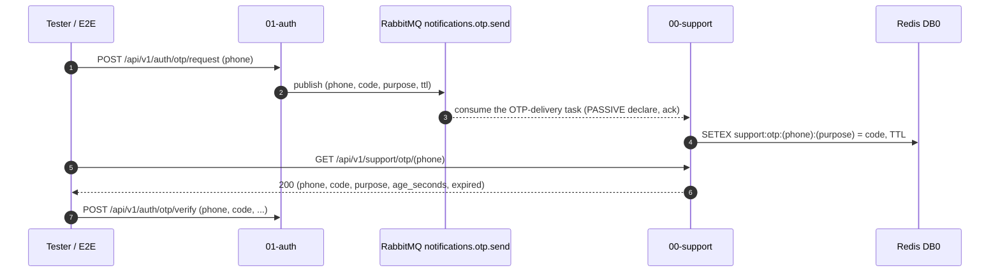
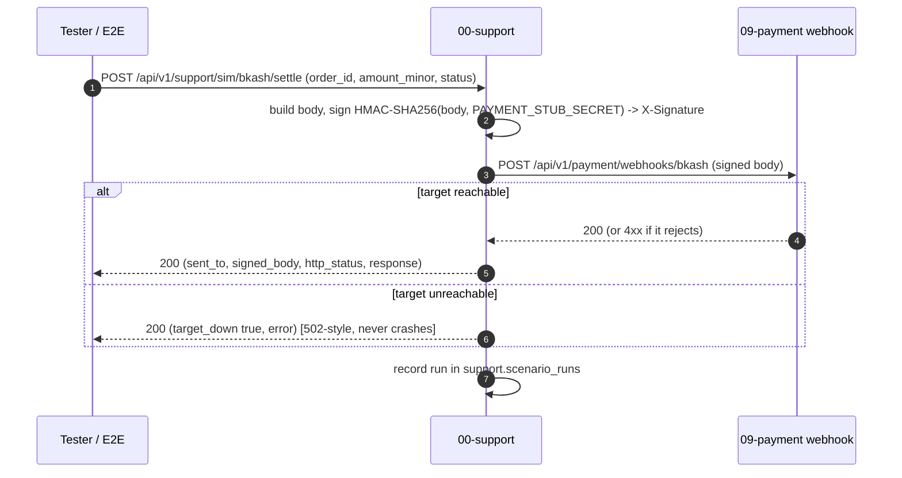

# `00-support` — Dev / Integration Simulator — Service Architecture

> **Scope.** Design + interface contracts at **spec altitude** — every endpoint, schema, env var, log
> document, and metric specified. This document **expands the `00-support` row of
> [`../../architecture.md`](../../architecture.md) §9** and is **subordinate to
> [`../../README.md`](../../README.md) §6/§7/§10 and §13–§14** — on any conflict, **the README wins.**
> It is **spec-pure**: Python 3.14 / Bash · FastAPI · in-container REST `8000` · external REST `10000`
> · **no gRPC**. A working reference exists at `~/Desktop/DevOps/support` — but it is a **narrow MVP**
> (an OTP read-back hub + a payment-webhook stub) that implements only a slice of this spec; it is read
> for the **real, corrected mechanisms** of the two capabilities it does have, and the rest of this
> document is the **spec target** the simulator grows into. Where a behaviour is grounded in the real
> reference it is marked **(grounded)**; where it is the broader spec not yet built it is marked
> **(spec target)**; the MVP's gaps are catalogued in §15. Cross-cutting rules (the five-endpoint
> contract, pretty-JSON, the error envelope, the three sinks) live in `../../architecture.md` §10–§14
> and `../../SERVICE_INTEGRATION_TEMPLATE.md`; this file states `00-support`-specific detail.

| | |
| --- | --- |
| **Service** | `00-support` — Dev / Integration Simulator (the "Dokandar Test Helper") |
| **Stack** | Python 3.14 · FastAPI · uvicorn · `aio-pika` (RabbitMQ consumer) · `httpx` (callback poster) · Bash (sweeps); optional `asyncpg` (read-only) |
| **Datastore(s)** | Redis 8 DB 0 (ephemeral, `support:*`) + MongoDB `support.scenario_runs` *(spec target)* — the MVP uses an in-memory ring buffer. **No own Postgres.** Optional **read-only** link to auth's PG for email→phone. |
| **Ports** | SERVICE_PORT `8000` (uvicorn) · **no gRPC** · external REST `10000` |
| **`/ready` hard-gate** | **none** — `/ready` is 200 once the process is up; the real gate is the **boot-time `APP_ENV∈{dev,stage}` guard** (§9.4) |
| **Identity** | `service_name = 00-support` · `code_version = 00-support` (from `SERVICE_NAME` env / `CODE_VERSION` file) |
| **Log sinks** | Mongo `mongo_db_dokandar_application_logs.00-support` · ES `logs-app-00-support-*` |
| **Position** | Outside the business DAG — impersonates upstreams; **emits no Kafka, runs no gRPC**, owns no business truth |
| **Defining property** | **Refuses to start unless `APP_ENV∈{dev,stage}`** — its OTP read-back / seed surface can never reach prod |

**Contents:** §1 Role · §2 Position · §3 Data · §4 Simulator domains & flows · §5 REST API map · **§6 OpenAPI/Swagger** · §7 Integration model · **§8 The five ops endpoints** · **§9 TENANT, `/data`, env & the boot guard** · §10 Logging & observability · §11 Security · §12 Resilience · §13 Boot & lifecycle · §14 Deployment · §15 Landmines & MVP-gap reconciliation · §16 Design decisions · §17 Build status.

---

## 1. Role & bounded context

`00-support` is the platform's **developer-experience sandbox and contract harness**. The 17 real services depend on Bangladesh-specific third-party edges (MFS/card gateways, couriers, SMS/WhatsApp/push, NBR/BTRC) that **cannot be reached from a dev or stage cluster** — there are no live carrier credentials and no real money/SMS. `00-support` stands in for every one of those edges so the rest of the fleet is **end-to-end testable without live vendor credentials**. It owns **no business truth**.

It provides four capabilities:

- **Provider-callback simulation** — produces a deterministic, correctly-**signed** mock provider payload and delivers it to the target service's **own webhook handler** (e.g. a "bKash settlement" → a valid HMAC-signed POST to `09-payment`'s webhook). **(grounded** for payment; **spec target** for courier/messaging/regulatory.)
- **OTP read-back** — the dev/stage **stand-in for the SMS carrier**: it consumes the same `notifications.otp.send` queue a real SMS gateway would, captures the codes, and lets a tester look up "the code for this phone/email" so phone-OTP login completes without an SMS. **(grounded.)**
- **Seed scenarios** — seeds deterministic fixtures (a known shopkeeper with approved KYC, a cart ready to check out, a delivered order) so an E2E suite starts from a known state, recording each run in `support.scenario_runs`. **(spec target.)**
- **Fleet-readiness sweep** — curls every service's `/ready` and returns a fleet health matrix (the in-cluster twin of the `.fleet/` scripts). **(spec target.)**

**Out of scope:** any business logic, any persistent business data, real PII, real money, real SMS. It is a **dev/stage-only** tool — **never deployed to production** (§9.4, §14).

---

## 2. Position in the platform

`00-support` sits *outside* the business DAG. It does not consume business `dokandar.*` events, runs no gRPC server, and emits nothing. It **impersonates** upstreams in two directions:

```text
   Tester / E2E suite ──REST/Web UI──►┌──────────────────────────────┐
                                       │  00-support (dev/stage hub)  │
   auth ──RabbitMQ notifications.otp.send──►│  · OTP read-back (SMS stand-in)  │──signed HTTP callback──► target svc webhook
                                       │  · provider-callback sim     │   (09-payment /webhooks/bkash, 17-shipping, ...)
                                       │  · seed scenarios            │──read-only──► auth Postgres users (email→phone, optional)
                                       │  · fleet-readiness sweep     │──HTTP GET /ready──► every service
                                       │  REFUSES to boot in prod     │
                                       └──────────────────────────────┘
```

- **Inbound queue (grounded):** it **consumes** `notifications.otp.send` (the queue `01-auth` publishes OTP-delivery tasks to). In dev/stage there is no real SMS carrier, so `00-support` *is* the consumer that "delivers" the code — by storing it for read-back. (In prod the real SMS gateway / `14-notification` path consumes it; `00-support` is not present.)
- **Outbound callbacks (grounded for payment):** it POSTs **HMAC-signed** mock provider callbacks to a target service's webhook (e.g. `POST {payment}/api/v1/payment/webhooks/bkash` with `X-Signature`). It holds the **same dev stub secret** the target verifies, so its callbacks pass verification exactly like a real provider's.
- **Read-only auth link (grounded, optional):** to let testers search OTPs by **email**, it may open a **read-only** `asyncpg` connection to **auth's** Postgres and resolve `email → phone` against the `users` table. This is auth's DB, not a `00-support`-owned store; if unset, only phone search works.
- **Fleet sweep (spec target):** it GETs every service's `/ready` to report a readiness matrix.

It calls **no business gRPC**, holds **no RS256 key**, mints **no JWT**, writes **no outbox**, and is **not** in `../../architecture.md` §21's event/gRPC anchor.

---

## 3. Data architecture

`00-support` owns **no relational store** and **no `<service>_<env>` Postgres DB** — by design, its state is ephemeral and best-effort. Two stores (spec target), plus one optional read-only borrow:

### 3.1 Redis DB 0 — ephemeral `support:*` (spec target)

Captured codes and short-lived fixtures live in Redis DB 0 under a `support:*` prefix (disjoint from auth's `otp:*`), with short TTLs:

```text
support:otp:{phone}:{purpose}   TTL ~600s   the last captured OTP for read-back  -> { code, purpose, ttl, captured_at }
support:seed:{scenario}:{run}   TTL ~3600s  a seeded-fixture handle (ids created by the seed)
support:fleet:last              TTL ~60s    the most recent fleet-readiness matrix (memoized)
```

> **(MVP reality)** the reference keeps captured OTPs in an in-memory `deque(maxlen=BUFFER_SIZE=500)` ring buffer instead of Redis — simplest possible, lost on restart, single-replica. The spec uses Redis so read-back survives a restart-within-TTL and works across replicas. See §15.

### 3.2 MongoDB `support.scenario_runs` — the audit ledger (spec target)

One MongoDB collection, `support.scenario_runs`, records **every consequential simulator action** — each seed run and each simulated callback — so a developer can reconstruct what a test did:

```json
{ "run_id": "<uuid>", "kind": "seed | sim_callback",
  "actor": { "id": "<vault-approle-or-dev-operator>", "role": "developer" },
  "scenario": "shopkeeper_with_kyc", "provider": "bkash", "target": "09-payment",
  "request": { "...": "the body we sent" }, "outcome": "delivered | target_down | rejected",
  "http_status": 200, "duration_ms": 42, "created_at": "2026-06-15T07:00:00Z",
  "ts_date": "<BSON Date — TTL ~30d>" }
```

This collection is `00-support`'s forensic store (it has no business DB to log into); it is distinct from the **log-sink** Mongo db `mongo_db_dokandar_application_logs.00-support` (§10).

### 3.3 Optional read-only link to auth's Postgres (grounded)

If `DATABASE_URL` is set, a tiny read-only `asyncpg` pool (`min_size=1, max_size=3`) resolves `email → phone` via `SELECT phone FROM users WHERE lower(email)=lower($1)` against **auth's** DB. It is **read-only and optional** — a convenience for email search, never a write path, never a `00-support`-owned schema. A DB blip degrades to "email search unavailable; phone search still works" (it never crashes a request).

---

## 4. Simulator domains & flows

### 4.1 OTP read-back — the SMS-carrier stand-in (grounded)

`01-auth` publishes each OTP as a RabbitMQ task `{phone, code, purpose, ttl}` to `notifications.otp.send`. In prod a real SMS gateway consumes it and texts the code; in dev/stage there is no carrier, so **`00-support` is that consumer** — it captures the code and exposes it for look-up.



Mechanism notes (grounded): the consumer **PASSIVE-declares** the queue (auth owns it + its args; re-declaring with different args would raise `PRECONDITION_FAILED`); it `ack`s each message (it "delivered" it); it reconnects on broker loss with backoff. Search resolves an `@`-bearing query as an **email** (via the optional read-only auth-PG link, §3.3) else as a **phone**. Privacy: nothing is shown until a specific phone/email is searched. The spec read-back endpoint is `GET /api/v1/support/otp/{phone}` (the MVP exposes the equivalent `/otp/latest` + `/search`).

### 4.2 Provider-callback simulation (grounded: payment; spec target: the rest)

To simulate an asynchronous provider callback, `00-support` builds the JSON body the real provider would send, **HMAC-SHA256-signs it with the shared dev stub secret** into the `X-Signature` header, and POSTs it to the target service's **own webhook**:



The **mock-provider catalog** (spec target beyond payment):

| Family | Providers | Simulated action → target webhook |
| --- | --- | --- |
| **Payment** *(grounded)* | bKash, Nagad, Rocket, SSLCommerz, Stripe | settlement / refund callback → `09-payment` `/api/v1/payment/webhooks/{provider}` (body `{order_id, intent_id, provider_txn_id, status, amount_minor, event_id}`, `X-Signature` = HMAC-SHA256 of the body) |
| **Courier** *(spec target)* | Pathao, Paperfly, RedX, Sundarban, eCourier | shipment status callback → `17-shipping` courier webhook |
| **Messaging** *(spec target)* | SSL Wireless SMS, WhatsApp Business Cloud, FCM, Amazon SES | delivery-status callback → `14-notification` (the SMS path is the OTP read-back of §4.1) |
| **Regulatory** *(spec target)* | NBR e-invoice (mushak-6.3), BTRC NID/DBID | ack / verification callback → `11-reporting` / `01-auth` |

Mechanism notes (grounded): the signed POST has a 10s timeout and **never raises on a network failure** — an unreachable target returns `{http_status:0, target_down:true, error}` so the tester sees a clear "service not running" message instead of a crash. The HTML "Confirm payment" form takes the amount in **৳ and converts to minor units (×100)**. `status` is `completed`/`failed`. A generic **signed-webhook poster** (`POST /api/v1/support/sim/raw` with `{url, body, secret?, sig_header?}`) lets a developer hit any endpoint with any body, optionally signed.

### 4.3 Seed scenarios (spec target)

`POST /api/v1/support/seed/{scenario}` provisions a deterministic, known-state fixture so an E2E suite starts from a fixed point. Each run is idempotent-ish per `{scenario, tenant}` and recorded in `support.scenario_runs`. Example scenarios: `shopkeeper_with_kyc` (a verified shopkeeper + live shop), `cart_ready_to_checkout` (a customer + a stocked cart), `delivered_order` (a full order lifecycle). Seeding drives the real services through their **public APIs** (it owns no DB), using a seed admin credential.

### 4.4 Fleet-readiness sweep (spec target)

`GET /api/v1/support/fleet/readiness` GETs `/ready` on every known service (host `100NN`) concurrently and returns a matrix `{ service, reachable, status, latency_ms }[]` plus a roll-up `{ ready, total }`. Memoized ~60s in Redis (`support:fleet:last`). The in-cluster twin of the `.fleet/` shell scripts — a single pane for "is the dev fleet up?".

---

## 5. Synchronous REST API map

### 5.1 Conventions

All bodies are pretty-JSON; errors use the platform `{error:{code,message,request_id,details?}}` envelope; unmapped paths return a bare 404; the five ops endpoints (`/ready`, `/health`, `/data`, `/metrics`, `/docs` + `/openapi.json`) live at the **root**. The business surface is under `/api/v1/support/`. `x-request-id` honoured/minted/echoed. *(MVP gap: the reference uses short bespoke paths (`/`, `/search`, `/otp/latest`, `/pay/confirm`, `/webhook/*`) and a non-contract `/health` — the spec normalizes these onto the `/api/v1/support/*` prefix + the five-endpoint contract; see §15.)*

### 5.2 The endpoint map

| Method | Path (`/api/v1/support/…`) | Tag | Auth | Success | Notable failures |
| --- | --- | --- | --- | --- | --- |
| GET | `/otp/{phone}` | otp | AppRole | 200 | `no_otp` (404), `validation_error` |
| GET | `/otp` (search by `?phone=`/`?email=`) | otp | AppRole | 200 | `bad_request` (400), `no_otp` (404) |
| POST | `/sim/{provider}/{action}` | sim | AppRole | 200 | `unknown_provider` (400), `validation_error`, `target_unreachable` (502) |
| POST | `/sim/raw` | sim | AppRole | 200 | `validation_error`, `target_unreachable` (502) |
| POST | `/seed/{scenario}` | seed | AppRole | 202 | `unknown_scenario` (404), `validation_error`, `seed_failed` (502) |
| GET | `/fleet/readiness` | fleet | AppRole | 200 | — |

`AppRole` = the Vault-AppRole dev token (§6.2, §11). Everything is **dev/stage-only**; if the process is reachable at all, the `APP_ENV` guard already passed (§9.4).

---

## 6. The OpenAPI / Swagger surface

FastAPI auto-reflects the spec from typed routes + Pydantic models; `/docs` is the full simulator console.

### 6.1 How `/docs` renders

```text
info.title       = "DOKANDAR Support Service"
info.version     = "00-support"                            # = code_version (CODE_VERSION file)
info.description  = **service_name** `00-support` | **code_version** `00-support` | **env_version** `v1.0.0`
                   | **tenant** `local` | **env** `dev`     # the identity row (markdown); env is dev|stage only
components.securitySchemes.SupportToken = { type: apiKey, in: header, name: X-Support-Token }   # Vault-AppRole dev token
swagger_ui_parameters = { persistAuthorization: true }   ·   customSiteTitle = "DOKANDAR Support Service"
tags = [ {name: ops}, {name: otp}, {name: sim}, {name: seed}, {name: fleet} ]
servers = [ { url: "http://localhost:10000", description: "dev (host LB maps 10000 -> in-container 8000)" } ]
/openapi.json  ->  COMPACT   ·   /docs, /openapi.json off the access log
```

`info.version` is the `CODE_VERSION` value (`00-support`) — the same value the identity block, APM `service.version`, and log `service.version` carry. **No prod server** is listed (the service never runs in prod).

### 6.2 The Authorize button — Vault AppRole (not JWT)

`00-support` does **not** verify the RS256 customer JWT (it serves operators/CI, not customers). Its security scheme is an **apiKey header `X-Support-Token`** carrying a short-lived **Vault-AppRole**-minted dev token; the Authorize dialog tells the operator to paste that token. A missing/invalid token returns the platform `401 unauthorized` envelope. *(MVP gap: the reference exposes everything with **no auth at all** — "exposes live OTP codes with NO authentication, by design" — relying solely on network isolation. The spec adds the Vault-AppRole gate as a second control; see §11, §15.)*

### 6.3 Request validation & the shared error envelope

Pydantic `Field` constraints (`pattern`/enum/`ge`/`le`) + examples drive both validation and the Swagger schema; an invalid body → `422 {error:{code:"validation_error", message, request_id, details:[{field,issue}]}}`. One shared `ErrorEnvelope` component. **Each operation declares `responses={...}`** for its failure codes (or Swagger silently hides them):

```text
GET  /otp/{phone}              : 401, 404, 422
GET  /otp (search)             : 400, 401, 404
POST /sim/{provider}/{action}  : 400, 401, 422, 502
POST /sim/raw                  : 401, 422, 502
POST /seed/{scenario}          : 401, 404, 422, 502
GET  /fleet/readiness          : 401
```

### 6.4 Schemas catalog (spec-extrapolated; payment grounded)

```text
Request models (field : type : constraints : required : example)
  PaymentSim (POST /sim/{provider}/{action}, action=settle|refund)
    order_id     : string  : non-empty               : yes : ord_01J9...
    amount_minor : integer : ge 0 (minor units, paisa): no  : 50000
    status       : enum    : completed | failed       : no  : completed
    intent_id    : string  : optional                 : no  : stub_bkash_ord_01J9
  RawSim (POST /sim/raw)
    url        : string : a target webhook URL                  : yes : http://172.17.0.1:10009/api/v1/payment/webhooks/bkash
    body       : object : arbitrary JSON                        : yes : { ... }
    secret     : string : HMAC key (optional; signs the body)   : no  : <stub-secret>
    sig_header : string : default X-Signature                   : no  : X-Signature
  SeedRequest (POST /seed/{scenario})
    tenant : enum : local | cloud (default local) : no : local
    count  : integer : ge 1, le 50 (default 1)    : no : 1

Response models
  OtpView          { phone, code, purpose, ttl, age_seconds, expired }
  SimResult        { sent_to, signed_body, http_status, response | (target_down true, error) }
  SeedResult       { run_id, scenario, created: { ...ids the seed produced } }
  FleetReadiness   { ready, total, services: [ { service, reachable, status, latency_ms } ] }
  ErrorEnvelope    { error: { code, message, request_id, details? } }
```

### 6.5 Per-endpoint reference (abbrev.)

```text
GET /api/v1/support/otp/01712345678   tag=otp   -> 200
    200: { "phone": "01712345678", "code": "123456", "purpose": "login", "ttl": 300, "age_seconds": 8, "expired": false }
    fail: 404 no_otp (none captured yet) ; 422 validation_error (bad phone)

POST /api/v1/support/sim/bkash/settle   tag=sim   -> 200
    req: { "order_id": "ord_01J9...", "amount_minor": 50000, "status": "completed" }
    200: { "sent_to": "http://.../api/v1/payment/webhooks/bkash", "signed_body": { ... }, "http_status": 200, "response": { ... } }
    fail: 400 unknown_provider ; 422 validation_error ; 502 target_unreachable (target_down true)

POST /api/v1/support/seed/shopkeeper_with_kyc   tag=seed   -> 202
    202: { "run_id": "<uuid>", "scenario": "shopkeeper_with_kyc", "created": { "shop_id": "...", "user_id": "..." } }
    fail: 404 unknown_scenario ; 502 seed_failed

GET /api/v1/support/fleet/readiness   tag=fleet   -> 200
    200: { "ready": 16, "total": 18, "services": [ { "service": "01-auth", "reachable": true, "status": "ready", "latency_ms": 2.1 }, ... ] }
```

---

## 7. Integration model — no gRPC, no events

`00-support` is deliberately **outside** the synchronous and event meshes:

- **No gRPC** — exposes none (nothing east-west calls it) and calls none (it impersonates upstreams over HTTP, not gRPC). It binds **no `8001`/`50051` listener**.
- **No Kafka** — emits and consumes **no** `dokandar.*` events; it has **no transactional outbox** (it changes no business state). It is absent from `../../architecture.md` §21.
- **RabbitMQ — consume-only** — it consumes `notifications.otp.send` (PASSIVE-declared) as the SMS-carrier stand-in (§4.1). It publishes nothing and declares no DLQ.
- **Outbound HTTP only** — its "events" are **signed HTTP callbacks** it POSTs into other services' webhooks (§4.2), and `/ready` GETs for the fleet sweep (§4.4).

The contract items that therefore **do not apply** to `00-support` (marked N/A with the reason): transactional outbox (no business writes), Idempotency-Key/Redlock (no money/stock), RS256 minting (auth's job), east-west `INTERNAL_SERVICE_TOKEN` gRPC compare (no gRPC). The HMAC stub-secret signing (§4.2) is its analogue of east-west auth.

---

## 8. The five operational endpoints

The universal contract (`../../architecture.md` §10–§14) still applies — `00-support` must expose all five, byte-identical, even though it is a dev tool. *(The reference MVP implements only a bespoke `/health` and relies on FastAPI's default `/docs`; the spec requires the full set — §15.)*

### 8.1 `GET /ready` — gates on **nothing**

`dependencies = []`. `00-support` has no traffic-gating dependency: with Redis/Mongo/RabbitMQ/the-read-only-PG all down it still serves stateless mocks. The **only** gate is the **boot-time `APP_ENV∈{dev,stage}` guard** (§9.4) — and that is a *boot* gate, not a request gate: in prod the process exits at boot, so `/ready` is **connection-refused, never 503**. Therefore a **reachable `/ready` inherently means the guard passed**.

```json
// 200 ready (always, once the process is up)
{ "status": "ready",
  "identity": { "service_name": "00-support", "code_version": "00-support", "env_version": "v1.0.0",
                "tenant": "local", "env": "dev", "uptime_seconds": 1234 },
  "dependencies": [] }
```

### 8.2 `GET /health` — full diagnostics (all non-gating)

Reports the deps it *uses*, each `{ok, detail}`, all **diagnostic** (none gate `/ready`): `redis` (the `support:*` store), `mongo` (the `support.scenario_runs` ledger), `rabbitmq` (the OTP-consume connection — the most operationally interesting one for a tester), `mongo_logs` (the log sink), `apm`. Plus the observability block. `status = "healthy"` iff all reachable, else `503 "unhealthy"` — and a 503 here **never evicts** (nothing routes to a dev tool via an LB; the value is the diagnostic). Each probe runs in an APM `dep.<name>` span.

```json
{ "status": "healthy",
  "identity": { "service_name": "00-support", "code_version": "00-support", "env_version": "v1.0.0",
                "tenant": "local", "env": "dev", "uptime_seconds": 1234 },
  "checks": {
    "rabbitmq":   { "ok": true,  "detail": "consuming notifications.otp.send (consumed 42)" },
    "redis":      { "ok": true,  "detail": "PONG" },
    "mongo":      { "ok": true,  "detail": "ping-ok" },
    "mongo_logs": { "ok": true,  "detail": "ping-ok" },
    "apm":        { "ok": true,  "detail": "host:8200 tcp-ok" }
  },
  "observability": {
    "apm_service_name": "00-support",
    "apm_server_url":   "http://infra:8200",
    "logs_sink_mongo":  "mongo_db_dokandar_application_logs.00-support",
    "logs_sink_es":     "logs-app-00-support-*"
  } }
```

> The optional read-only auth-PG link is reported as a diagnostic `email_search: { ok, detail }` flag (it is a convenience, not a dependency — `not_configured` when `DATABASE_URL` is unset).

### 8.3 `GET /data` — the canonical snapshot (00-support is the reference impl)

`00-support` is the **canonical reference implementation** of the fleet's `/data` snapshot pattern: identity block **prepended** to `data/<tenant>/result.json`, produced out-of-band by `data/<tenant>/collect.sh`, bind-mounted **read-only** at `/app/data`. `TENANT` selects the file. Guards: missing → `404 no_snapshot`; non-object/unparseable → `500 snapshot_parse_failed` (generic client message). The two `collect.sh` are the boilerplate every other service copies (§9.2).

```json
// 200 (TENANT=local) — identity prepended to the host snapshot
{ "identity": { "service_name": "00-support", "code_version": "00-support", "env_version": "v1.0.0",
                "tenant": "local", "env": "dev", "uptime_seconds": 1234 },
  "kind": "local", "collected_at": "2026-06-15T07:00:00Z",
  "host": { "hostname": "support-dev-01", "os": "Ubuntu 26.04 LTS", "kernel": "6.14.0-37-generic",
            "architecture": "x86_64", "uptime": "up 3 days, 4 hours" },
  "cpu": { "model": "Intel Xeon Platinum 8259CL @ 2.50GHz", "cores": 4, "load_average": "0.10, 0.08, 0.06" },
  "memory": { "total": "15Gi", "used": "3.1Gi", "available": "11Gi" },
  "storage": { "root_total": "48G", "root_used": "12G", "root_free": "36G", "root_usage_percent": "26%" },
  "network": { "primary_ip": "172.31.14.86", "public_ip": "65.0.12.34" } }
```

The `cloud` snapshot adds the EC2 IMDSv2 `ec2{instance_id,instance_type,region,availability_zone,...}` block (identical shape to every other service's — `00-support` defines it).

### 8.4 `GET /metrics` — Prometheus exposition

Plain text (pretty-JSON-exempt, off the access log). `Instrumentator(excluded_handlers=["/health","/ready","/data"])`. Closed-set labels only. Full list in §10.5.

### 8.5 `GET /docs` + `GET /openapi.json`

Owned by **§6**. `/docs` is the simulator console (HTML); `/openapi.json` compact; both off the access log. Under the Vault-AppRole scheme they may still render without a token (the spec is browsable), but *invoking* a route needs the `X-Support-Token`.

---

## 9. TENANT, `/data`, env & the dev-only boot guard

### 9.1 Identity & TENANT

`service_name = 00-support` is read **once at boot from the required `SERVICE_NAME` env var** (= `code_version`, from `CODE_VERSION`) and is the single identifier presented everywhere: the identity block, the **APM** `service.name`, the **Mongo** log collection `mongo_db_dokandar_application_logs.00-support`, the **ES** index `logs-app-00-support-*`, and the **Prometheus** `service` label. (No own Postgres → no `application_name`; the optional read-only auth-PG link may set `application_name=00-support` for visibility.) `TENANT` (`local`|`cloud`) selects only `identity.tenant` + which `data/<tenant>/result.json` is served — never any name. A blank `SERVICE_NAME` crash-loops (always).

### 9.2 `/data` mounting & `collect.sh`

`data/<tenant>/collect.sh` runs out-of-band on the host and writes `result.json`; the `data/` dir is bind-mounted **read-only** at `/app/data` (`-v "$(pwd)/data:/app/data:ro"`), so re-running `collect.sh` refreshes `/data` with **no restart**. `local` = host facts; `cloud` = host facts + an EC2 IMDSv2 `ec2` block. These two scripts are boilerplate the whole fleet copies.

### 9.3 The env-render contract

```ini
# --- identity / server (DEV/STAGE ONLY) ---
APP_ENV=dev                       # dev | stage  ONLY — the boot guard rejects anything else (§9.4)
SERVICE_NAME=00-support           # REQUIRED — fail-fast-if-blank, ALWAYS; the NN-service identity used everywhere
ENV_VERSION=v1.0.0
TENANT=local
SERVICE_PORT=8000                 # in-container REST (uvicorn); NO gRPC port
LOG_LEVEL=info
# --- RabbitMQ (consume the OTP-delivery queue — the SAME value 01-auth uses) ---
RABBITMQ_URL=amqp://support:<RMQ_PASSWORD>@rabbitmq:5672/   # REQUIRED — the OTP read-back source
OTP_QUEUE=notifications.otp.send
# --- Redis (DB 0 — ephemeral support:* store) ---
REDIS_URL=redis://:<REDIS_PASSWORD>@redis:6379/0
# --- MongoDB (support.scenario_runs ledger) ---
MONGO_URI=mongodb://support:<MONGO_PASSWORD>@mongodb:27017/
MONGO_DB=support                  # collection: scenario_runs
# --- optional: read-only link to auth's Postgres for email->phone search ---
AUTH_DB_DSN=postgresql://readonly:<PG_RO_PASSWORD>@postgres:5432/dokandar_auth_dev   # OPTIONAL, READ-ONLY
# --- Vault AppRole (the operator/CI auth for the simulator surface) ---
VAULT_ADDR=https://openbao:8200
VAULT_ROLE_ID=<VAULT_ROLE_ID>
VAULT_SECRET_ID=<VAULT_SECRET_ID>
# --- provider stub webhook secrets (the SAME dev secrets the targets verify) ---
SIM_PAYMENT_STUB_WEBHOOK_SECRET=<dev-stub-secret>     # == 09-payment's stub-mode verify secret
SIM_COURIER_STUB_WEBHOOK_SECRET=<dev-stub-secret>     # == 17-shipping's stub secret (spec target)
# --- target service base URLs the simulator POSTs callbacks to ---
PAYMENT_BASE_URL=http://payment:10009
SHIPPING_BASE_URL=http://shipping:10017
# --- apm (diagnostic) + log sinks ---
APM_SERVER_URL=http://apm-server:8200
APM_SERVICE_NAME=00-support
MONGO_LOG_URI=mongodb://logger:<MONGO_PASSWORD>@mongodb:27017/
MONGO_LOG_DB=mongo_db_dokandar_application_logs
ELASTIC_SEARCH_URL=http://elasticsearch:9200
BUFFER_SIZE=500                   # in-memory OTP ring buffer (MVP fallback when Redis is absent)
```

**Fail-fast / N/A:** blank `SERVICE_NAME` aborts boot **always**; `RABBITMQ_URL` is required (no OTP read-back without it — the reference exits if unset). The fleet's `JWT_PUBLIC_KEY_B64` / `INTERNAL_SERVICE_TOKEN` fail-fast is **N/A** (no JWT verify, no gRPC). `init-env.sh` still carries `shopt -u patsub_replacement` (the bash-5.2 `&`-in-secret trap).

### 9.4 The dev-only boot guard (the defining property)

**The first thing `00-support` does at boot is assert `APP_ENV ∈ {dev, stage}`; otherwise it `SystemExit`s immediately** (grounded — the reference raises `SystemExit("support refuses to start with APP_ENV=...")`). This guarantees the OTP read-back and seed/sim surface — which expose codes and drive other services — can **never** reach production. It is **belt-and-braces** with the deploy-time exclusion (§14): Argo never deploys `00-support` to the prod cluster, *and* even if mis-deployed the process refuses to start. There is no env/secret that overrides it.

---

## 10. Application logging & observability

### 10.1 Two stdout streams & the three sinks

One **access-log line** per response (UTC day-first, `DD-MM-YYYY HH:MM:SS    <ip>:<port> - "<METHOD> <path> <PROTO>" <status> <reason>`, stdout-only; `/ready`+`/metrics`+`/health` excluded — grounded: the reference already reformats uvicorn's access logger to this fleet format), plus the structured **app log** fanned out fire-and-forget to stdout (single-line JSON) + MongoDB `mongo_db_dokandar_application_logs.00-support` + Elasticsearch `logs-app-00-support-*`. Bounded ~10k queue + drainer, **silent drop** on overflow (only signal: `log_drops_total{sink}`); the Mongo write runs off the event loop via `asyncio.to_thread`; feedback-loop loggers (`httpx`/`httpcore`/`pymongo`/`aio_pika`/`elasticapm.transport`) pinned to WARNING.

### 10.2 The audit ledger — `support.scenario_runs`

Beyond the log sink, `00-support`'s forensic record is the **`support.scenario_runs`** collection (§3.2): one document per **seed run** and per **simulated callback**, carrying the closed action vocabulary `support.sim_invoked`, `support.otp_read`, `support.seed_run`, `support.fleet_swept` and the forensic envelope `{request_id, actor{id,role}, action, target{type,id}, outcome, duration_ms, trace.id, ts_date}`. Indexes: `{trace.id:1}`, `{action:1, ts_date:-1}`, `{scenario:1, ts_date:-1}`, `{ts_date:1}` TTL ~30d (BSON-Date `ts_date` — a TTL on a string expires nothing). Sample queries: "every sim I ran for scenario X today"; "all `outcome:target_down` callbacks in the last hour" (a dev-fleet-is-misconfigured signal).

### 10.3 The log↔trace join & APM

Every in-request line carries the APM `trace.id`; `service.name = 00-support` byte-identical across APM / Mongo / ES is the join key. APM agent installed **outermost** (last line of `create_app()`); `service.version = 00-support`; `SERVICE_NODE_NAME` set explicitly; the `/health` dep probes each in a `dep.<name>` span (`dep.apm` omits the destination).

### 10.4 The never-crash backstop (grounded)

A top-level exception handler turns **any** unhandled error into a clean `500` while keeping the process up — "a dependency hiccup never takes the hub down." This is correct for a dev tool, **with one rule (§15): it must still log the raw cause server-side** (keyed by `request_id`) before returning the scrubbed message, so a swallowed error is still investigable.

### 10.5 Metrics

```text
# RED (instrumentator; /health,/ready,/data excluded)
http_requests_total{method,handler,status}   ·   http_request_duration_seconds_bucket{handler,le}
# support-specific (closed-set labels)
support_sim_invocations_total{provider,family,result}   # result = delivered|rejected|target_down
support_otp_reads_total{result}                          # result = hit|miss
support_otp_captured_total                               # OTPs consumed off notifications.otp.send
support_seed_runs_total{scenario,result}
support_callback_latency_seconds_bucket{provider,le}     # signed-POST round-trip
# gauges
support_fleet_ready_services    # last fleet sweep: services answering /ready
support_otp_buffer_size         # current captured-OTP count (Redis or the in-memory ring)
support_rabbitmq_connected      # 1/0 — the OTP-consume connection
log_drops_total{sink}
```

---

## 11. Security architecture

`00-support` handles **only synthetic data** (fake NIDs, deterministic OTPs, stub txns) and is **dev/stage-only**, so its threat model is unusual:

- **The boot guard is control #1.** `APP_ENV∈{dev,stage}` or `SystemExit` (§9.4) — the OTP read-back / sim / seed surface can never reach prod. No override exists.
- **Vault-AppRole auth (spec target).** The simulator surface is gated by a short-lived, least-privilege Vault-AppRole token (`X-Support-Token`), issued to developers/CI in dev/stage only. *(MVP gap: the reference has **no auth** — it deliberately exposes OTP codes openly for tester convenience, relying solely on network isolation, "keep its port off public networks." The spec adds the AppRole gate; in the meantime network isolation is the compensating control. §15.)*
- **Shared stub webhook secrets.** The only real-ish secrets are the per-provider **dev** HMAC stub secrets (from Vault) — identical to what each target verifies in stub mode (§4.2). They are dev-only and worthless in prod (where real provider signatures are used).
- **No real PII / money / SMS.** OTP codes it holds are real (captured off the queue) but short-lived and dev-only; phone numbers are test numbers. It stores no card/NID bytes.
- **Replay is deliberately allowed.** Re-posting a simulated callback is intentional — so tests can assert the *downstream's* idempotency. `00-support` adds no idempotency of its own.
- **Not verify-only-RS256.** It does not participate in the JWT/JWKS mesh; it authenticates operators, not customers.

---

## 12. Resilience & failure modes

| Failure | Behaviour |
| --- | --- |
| **RabbitMQ down** | OTP capture pauses; the consumer reconnects with backoff; read-back of already-captured codes still works; `/health.rabbitmq` goes red. (`/ready` stays green — nothing gates.) |
| **Redis / in-memory store** | with Redis down it degrades to the in-memory ring buffer (or loses read-back history); never crashes. |
| **Mongo down** | no scenario-run history / audit; sims and OTP read-back still work. |
| **Read-only auth-PG down/unset** | email search returns "unavailable, search by phone instead"; phone search unaffected. |
| **A callback target unreachable** | the signed POST returns `{target_down:true, error}` → a clear `502`-style message to the tester; the hub never crashes (grounded). |
| **Any unhandled error** | the backstop handler returns a clean `500` and the process stays up (grounded) — but logs the raw cause server-side (§10.4). |
| **APM / log-sink loss** | `/health` degrades; the tool keeps working. |
| **Deployed to prod by mistake** | the process `SystemExit`s at boot (§9.4) — it never serves. |

Its outage blocks only **dev/stage E2E runs**, never customer traffic. No circuit breakers, no DLQs, no HPA — single-instance-friendly; p99 non-binding (target <50 ms to keep E2E suites fast).

---

## 13. Boot sequence & lifecycle

The listener binds **last**; there is **no Postgres `ensure_db`** (no own DB) and **no `alembic`**:

1. **Assert the boot guard** — `APP_ENV∈{dev,stage}` else `SystemExit` (the very first thing; grounded). Also require `RABBITMQ_URL`.
2. Configure logging (three sinks) + the uvicorn access-log reformat.
3. Start the Mongo + ES log sinks.
4. Connect Redis + the `support.scenario_runs` Mongo; ensure the collection + its indexes (incl. the `ts_date` TTL). Optionally open the **read-only** auth-PG pool (`DATABASE_URL`/`AUTH_DB_DSN`) — failure here is non-fatal (email search just disabled).
5. Mint/refresh the Vault-AppRole login (spec target) and load the provider stub secrets.
6. Start the **OTP-consume background task** (PASSIVE-declare `notifications.otp.send`, reconnect-with-backoff loop).
7. Install APM **outermost** (last middleware).
8. **Bind HTTP.** Shutdown: cancel the consume task, drain sinks, close pools.

---

## 14. Deployment & runtime

A single immutable multi-stage image, **non-root uid 10001**, `EXPOSE 8000` (no gRPC port), `HEALTHCHECK` probing `GET /ready`. **Deployed to dev/stage namespaces ONLY** — Argo CD explicitly **excludes `00-support` from the production cluster** (it has no prod overlay). The boot guard (§9.4) is the in-process belt to that braces.

```dockerfile
# spec-normalized shape (design sketch)
FROM python:3.14-slim AS build      # toolchain stage
FROM python:3.14-slim AS runtime
RUN useradd --uid 10001 --create-home appuser
USER appuser
COPY CODE_VERSION ./CODE_VERSION    # "00-support" -> identity.code_version / APM service.version / Swagger info.version
EXPOSE 8000                          # REST only — NO gRPC
HEALTHCHECK --interval=30s --timeout=3s --start-period=15s --retries=3 \
    CMD ["/app/healthcheck", "http://localhost:8000/ready"]
CMD ["sh","-c","uvicorn app.main:app --host 0.0.0.0 --port ${SERVICE_PORT:-8000}"]   # NO ensure_db pre-step
```

On Kubernetes: `readinessProbe`/`livenessProbe` on `/ready` (cheap — it gates nothing); no LB exposure to the public internet (network isolation is a security control, §11). Single replica is fine; no HPA.

---

## 15. FastAPI landmines & MVP-gap reconciliation

The reference at `~/Desktop/DevOps/support` is a **narrow, real MVP**; the spec is the broader target. Build the corrected, spec-complete form — these are the deltas:

- **(a) The MVP has no five-endpoint contract.** It ships only a bespoke `/health` (`{status, rabbitmq_connected, buffered, ...}`) and FastAPI's default `/docs`; it has **no `/ready`, `/data`, `/metrics`**, and its `/health` is not the contract shape. **DO** add all five (§8) with the identity block — `/ready` gating nothing, the contract `/health`, the canonical `/data`, `/metrics`, the identity-bearing `/docs`.
- **(b) The MVP has no auth.** It exposes OTP codes openly "by design." **DO** add the Vault-AppRole `X-Support-Token` gate (§6.2, §11); until then, network-isolate the port. **DON'T** ever expose the unauthenticated form on a routable network.
- **(c) The MVP store is an in-memory ring buffer.** Lost on restart, single-replica. **DO** use Redis DB 0 (`support:*`, TTL) for read-back + Mongo `support.scenario_runs` for the audit ledger (§3); keep the in-memory buffer only as a degraded fallback.
- **(d) Only payment is mocked.** **DO** extend the provider catalog to courier/messaging/regulatory (§4.2) behind the uniform `POST /api/v1/support/sim/{provider}/{action}` shape; reuse the grounded HMAC-signed-POST + target-down mechanism.
- **(e) The read-only PG is auth's DB, not its own.** Keep it **read-only and optional** (email→phone only); never write; never treat it as a `00-support` schema.
- **(f) The never-crash backstop must still log (§10.4).** **DO** write the raw cause server-side keyed by `request_id` before returning the scrubbed `500` — a swallowed error must stay investigable.
- **(g) `service_name = 00-support` from the env var, everywhere.** The same value feeds APM, the Mongo log collection, the ES index, and the metric `service` label — never hardcoded independently (drift breaks the APM↔log join).
- **(h) Standard FastAPI hygiene** (from the §16.1 matrix): Mongo log write off the loop (`asyncio.to_thread`); compact `/openapi.json` is correct-by-default (don't "fix" it); single-line stdout app-log; bound any read-only PG query with a statement timeout; APM outermost; pin the lockfile for reproducible builds.

---

## 16. Design decisions & open items

- **`/ready` gates nothing; the boot guard is the real gate.** A *boot* gate (process exits in prod) is stronger than a request gate for "never in prod" — and it means a reachable `/ready` proves the guard passed.
- **OTP read-back = consume the real queue, not a generator.** Capturing the *actual* code `01-auth` generated (off `notifications.otp.send`) is better than a parallel deterministic generator — tests use the real code, and `00-support` doubles as the dev SMS-carrier stand-in. (The README's "deterministic OTP generator" framing is realized as this read-back.)
- **Audit lives in `support.scenario_runs`, not an outbox.** With no business DB, the scenario-runs collection is the forensic ledger; there is no Kafka outbox (nothing to fan out).
- **Vault AppRole, not JWT.** It serves operators/CI, not customers; AppRole is the right, least-privilege, dev-scoped credential. **Open item:** confirm whether the low-friction *read-back* UI stays unauthenticated-but-network-isolated in dev while the *sim/seed* surface always requires AppRole — a deliberate convenience-vs-control split to ratify against README §13.
- **Replay allowed by design.** No idempotency on simulated callbacks — the point is to test the *downstream's* idempotency.
- **Single store choice (Redis vs in-memory).** Spec mandates Redis+Mongo; the MVP's in-memory buffer is the pragmatic fallback. Open item: whether stage (multi-replica) requires Redis to be mandatory rather than optional.

---

## 17. Build status & cross-references

- **Status — specified, partially prototyped.** No spec-complete code exists in this repo. A **narrow real reference** lives at `~/Desktop/DevOps/support` (the OTP read-back hub + payment-webhook stub + boot guard) — read it for the **grounded** mechanisms (queue-consume read-back, HMAC-signed callback POST, the boot-guard `SystemExit`, the optional read-only auth-PG, the never-crash backstop), and build out the rest of this spec (the full provider catalog, seed scenarios, the fleet sweep, Redis+Mongo, Vault-AppRole, the five-endpoint contract, the three sinks).
- **See also:** [`./README.md`](./README.md) (the build-sheet) · [`../../architecture.md`](../../architecture.md) §9 (this service in the catalog), §10–§14 (the operational contract) · [`../../README.md`](../../README.md) §6/§7/§10 (fleet/ports/per-service), §13–§14 (contract) · [`../../SERVICE_INTEGRATION_TEMPLATE.md`](../../SERVICE_INTEGRATION_TEMPLATE.md) §4/§4.5 (endpoints, Swagger), §7–§9 (logging), Appendix A.1 (Python/FastAPI starter kit), §16.1 (landmines) · [`./../01-auth/architecture.md`](../01-auth/architecture.md) (the worked exemplar — `00-support` consumes its `notifications.otp.send` OTP queue) · `~/Desktop/clone/.claude/dokandar-build-guide.md`.
