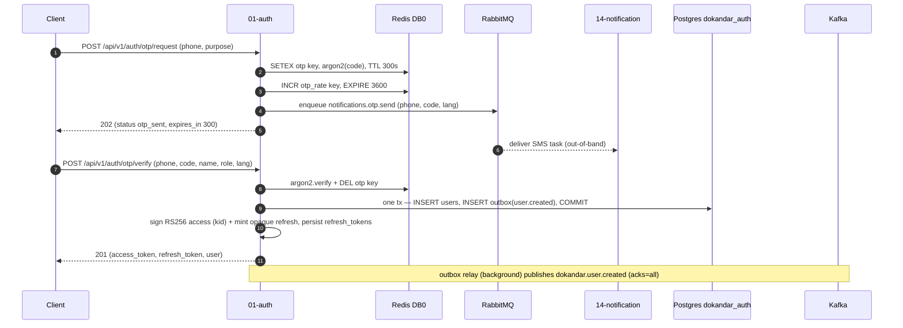
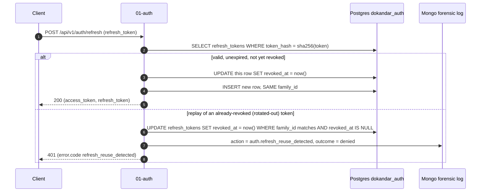
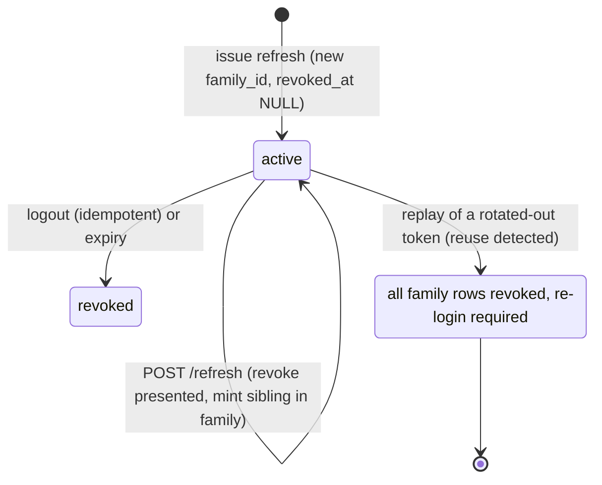
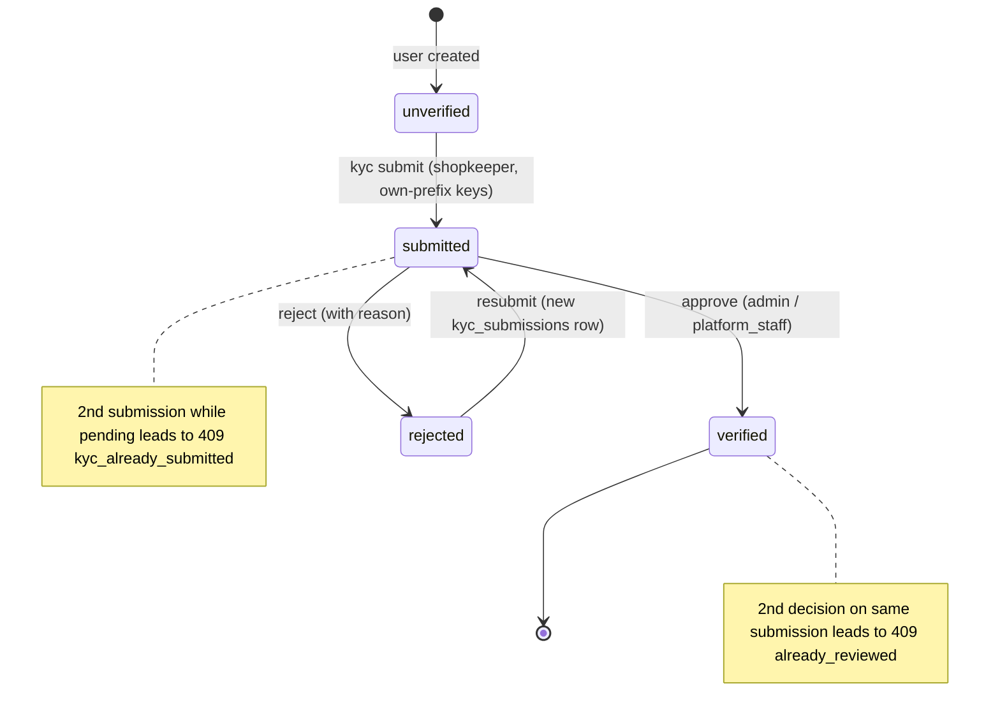

# `01-auth` — Identity Authority — Service Architecture

> **Scope.** Design + full **interface contracts** (schemas, the complete OpenAPI/Swagger surface,
> the five operational endpoints, application logging) at **spec altitude** — no language source, but
> every request/response shape, validation rule, status code, env var, log document, and metric is
> specified. This document **expands the `01-auth` row of [`../../architecture.md`](../../architecture.md)
> §9** and is **subordinate to [`../../README.md`](../../README.md) §6/§7/§8/§10 and §13–§14** — on any
> conflict, **the README wins; re-verify against it.** It is **spec-pure**: Python 3.14 · FastAPI ·
> in-container REST `8000` / gRPC `50051` · external REST `10001` / gRPC `20001` — never any single
> as-built MVP's ports/versions. A working reference implementation exists at `~/Desktop/DevOps/01-auth`
> (Python/FastAPI) — read it for *shape and corrected patterns*; **this doc is the spec.** Cross-cutting
> rules (the five-endpoint behaviour, pretty-JSON, the error envelope, the three sinks) are defined once
> in `../../architecture.md` §10–§14 + `../../README.md` §13 and in `../../SERVICE_INTEGRATION_TEMPLATE.md`
> (HOW); this file states auth-**specific** detail at full depth and links the cross-cutting rules.

| | |
| --- | --- |
| **Service** | `01-auth` — Identity & Onboarding |
| **Stack** | Python 3.14 · FastAPI · SQLAlchemy 2 (async) · Alembic · asyncpg · `confluent-kafka` · `aio-pika` |
| **Datastore(s)** | PostgreSQL 18 `dokandar_auth_<env>` (sole writer) · Redis 8 DB 0 (OTP + rate-limit) |
| **Ports** | SERVICE_PORT `8000` (REST, uvicorn) · gRPC `50051` · external REST `10001` / gRPC `20001` |
| **`/ready` hard-gate** | **PostgreSQL only** (Redis is OTP/rate-limit infra — not gating) |
| **Identity** | `service_name = 01-auth` · `code_version = 01-auth` (both from env/file; see §9.1) |
| **Log sinks** | Mongo `mongo_db_dokandar_application_logs.01-auth` · ES `logs-app-01-auth-*` |
| **Position** | Root of the identity DAG — calls **no** downstream gRPC |
| **Crown jewel** | Sole holder of the fleet's RS256 **private** signing key |

**Contents:** §1 Role · §2 Position · §3 Data · §4 Domain flows · §5 REST API map · **§6 OpenAPI/Swagger surface** · §7 gRPC · **§8 The five ops endpoints** · **§9 TENANT, `/data` & env** · §10 Eventing · **§11 Application logging & observability** · §12 Security · §13 Resilience · §14 Boot & lifecycle · §15 Deployment · §16 FastAPI landmines · §17 Design decisions · §18 Build status.

---

## 1. Role & bounded context

`01-auth` is the platform's **sole identity authority** and the **root of the identity DAG**. It owns:

- **Registration & phone-OTP login** — phone is the primary login handle in BD (low email penetration); the platform is **passwordless** (OTP only — argon2 exists solely to hash OTPs, never a password).
- **RS256 JWT issuance + rotation** — it is the **only** holder of the fleet's RS256 *private* signing key; every other service and the gateway are **verify-only** against the JWKS it publishes.
- **The KYC submission lifecycle** — shopkeeper onboarding (`unverified → submitted → verified | rejected`); auth stores only the object-store **keys** of KYC documents, never the bytes.
- **RBAC** — five roles, a provisioning role-matrix, and account suspension; auth **issues** `role`/`kyc` claims but makes no authorization *decisions* — each consumer gates on the claims itself.

**Out of scope:** KYC document *bytes* (uploaded to `12-media`'s object store via presigned URLs; auth keeps only `nid_key`/`trade_license_key`); OTP *delivery* (handed to `14-notification` over RabbitMQ); customer profile data and BD addresses (`02-profile`); any business authorization decision (the consuming service decides).

---

## 2. Position in the platform

Auth is a pure **source** in the identity DAG: clients and services depend on it; it depends on no other service synchronously (it calls **no** downstream gRPC, consumes **no** Kafka events).

```text
        Clients ──REST──►┌──────────────────────────────┐
   (gateway, web,        │  01-auth  (Python/FastAPI)    │
    mobile, admin)       │  · phone-OTP login           │──Kafka(outbox)──► dokandar.user.*, dokandar.kyc.*
                         │  · RS256 mint + JWKS          │──RabbitMQ──────► notifications.otp.send (→ 14-notification)
   Services ──gRPC──────►│  · KYC lifecycle + RBAC       │
   (03-seller,           │  sole RS256 PRIVATE key       │   reads/writes ► PostgreSQL dokandar_auth_<env>
    09-payment)          │  identity DAG ROOT            │   OTP/rate-limit► Redis DB 0
                         └──────────────────────────────┘
```

- **Every service & the gateway** verify RS256 access tokens **offline** against auth's JWKS (`GET /api/v1/auth/jwks`, edge-cached ~5 min) — the only fleet-wide dependency on auth, and a soft one (cached).
- **gRPC consumers:** `03-seller` calls `Auth.LookupShopkeeper` (staff-assignment verification); `09-payment` calls `Auth.GetUserKyc` (gate instant payout).
- **Kafka consumers** of auth's events: `02-profile` (`user.created`, `kyc.*` → KYC badge projection), `03-seller` (`kyc.approved|rejected`), `14-notification` (`user.created`), and others per `../../architecture.md` §21.

---

## 3. Data architecture

PostgreSQL `dokandar_auth_<env>` is the strongly-consistent system of record (token issuance is single-writer, Postgres-backed); Redis DB 0 is ephemeral OTP/rate-limit infrastructure with short TTLs. The split is why **`/ready` gates on Postgres only** — JWKS, refresh, verify, and the gRPC surface all serve with Redis down; only OTP issuance/verification degrades.

### 3.1 PostgreSQL `dokandar_auth_<env>`

Four owned tables, UUID-keyed (`pgcrypto.gen_random_uuid()`) — except the `outbox`, whose PK is a **monotonic** `BIGINT` so the relay's `ORDER BY id` drains FIFO (a random UUID id would make ordered draining meaningless — see §17).

```sql
CREATE EXTENSION IF NOT EXISTS pgcrypto;

CREATE TYPE user_role   AS ENUM ('admin','shopkeeper','shop_staff','platform_staff','customer');
CREATE TYPE user_status AS ENUM ('active','suspended','pending');
CREATE TYPE kyc_status  AS ENUM ('unverified','submitted','verified','rejected');

CREATE TABLE users (
    id          UUID PRIMARY KEY DEFAULT gen_random_uuid(),
    phone       VARCHAR(20)  NOT NULL UNIQUE,          -- BD mobile ^01[3-9][0-9]{8}$
    email       VARCHAR(255) UNIQUE,                   -- optional
    name        VARCHAR(120) NOT NULL,
    lang        VARCHAR(2)   NOT NULL DEFAULT 'bn',     -- bn | en
    role        user_role    NOT NULL DEFAULT 'customer',
    status      user_status  NOT NULL DEFAULT 'active',
    kyc         kyc_status   NOT NULL DEFAULT 'unverified',
    created_by  UUID REFERENCES users(id),             -- NULL = self-signup; else the provisioning actor
    created_at  TIMESTAMPTZ  NOT NULL DEFAULT now(),
    updated_at  TIMESTAMPTZ  NOT NULL DEFAULT now()
);
CREATE INDEX idx_users_phone ON users(phone);
CREATE INDEX idx_users_role  ON users(role);
CREATE INDEX idx_users_kyc   ON users(kyc) WHERE kyc <> 'unverified';   -- partial: only the interesting subset

CREATE TABLE refresh_tokens (                          -- rotation + family reuse-detection
    id         UUID PRIMARY KEY DEFAULT gen_random_uuid(),
    user_id    UUID NOT NULL REFERENCES users(id) ON DELETE CASCADE,
    token_hash CHAR(64) NOT NULL UNIQUE,               -- sha256(opaque token); the RAW token is never stored
    family_id  UUID NOT NULL,                          -- all rotations of one login session share this
    expires_at TIMESTAMPTZ NOT NULL,
    revoked_at TIMESTAMPTZ,                             -- set on rotate; whole family on replay (see §4.2)
    user_agent TEXT,
    ip         INET,
    created_at TIMESTAMPTZ NOT NULL DEFAULT now()
);
CREATE INDEX idx_refresh_user_active ON refresh_tokens(user_id) WHERE revoked_at IS NULL;  -- live sessions
CREATE INDEX idx_refresh_family      ON refresh_tokens(family_id);                          -- family-revoke UPDATE

CREATE TABLE kyc_submissions (                          -- object-store KEYS + light disclosure only (no bytes)
    id                   UUID PRIMARY KEY DEFAULT gen_random_uuid(),
    user_id              UUID NOT NULL REFERENCES users(id) ON DELETE CASCADE,
    nid_key              VARCHAR(255) NOT NULL,         -- e.g. kyc/<user_id>/nid-front.jpg (key, not bytes)
    trade_license_key    VARCHAR(255),
    bank_account_last4   VARCHAR(8),
    mobile_wallet_number VARCHAR(20),
    submitted_at         TIMESTAMPTZ NOT NULL DEFAULT now(),
    reviewed_by          UUID REFERENCES users(id),
    reviewed_at          TIMESTAMPTZ,
    decision             kyc_status,                    -- NULL until reviewed
    rejection_reason     TEXT
);
CREATE INDEX idx_kyc_user_submitted ON kyc_submissions(user_id, submitted_at DESC);
CREATE INDEX idx_kyc_pending        ON kyc_submissions(submitted_at) WHERE decision IS NULL;  -- review queue

CREATE TABLE outbox (                                   -- transactional outbox (§10)
    id         BIGINT GENERATED ALWAYS AS IDENTITY PRIMARY KEY,   -- monotonic → FIFO drain
    topic      TEXT  NOT NULL,                          -- dokandar.user.created | dokandar.kyc.submitted | ...
    key        TEXT,                                    -- Kafka partition key (usually user_id)
    payload    JSONB NOT NULL,
    created_at TIMESTAMPTZ NOT NULL DEFAULT now(),
    sent_at    TIMESTAMPTZ                              -- NULL until the relay's delivery-ack
);
CREATE INDEX idx_outbox_unsent ON outbox(id) WHERE sent_at IS NULL;   -- relay: ORDER BY id … FOR UPDATE SKIP LOCKED
```

A **default admin** (phone seeded from `DEFAULT_ADMIN_PHONE`, `role=admin`, `kyc=verified`) is created idempotently at boot so the platform is never lockable-out.

### 3.2 Redis DB 0 — OTP & rate-limit (the `otp:*` namespace, kept disjoint from other services)

```text
otp:{purpose}:{phone}   TTL 300s   argon2(6-digit code) + wrong-code attempt counter (max 5)
                                   → burned (DEL) on success OR on attempt exhaustion
otp_rate:{phone}        TTL 3600s  integer request counter (max 5 OTP requests / hour)
```

The OTP store **doubles as the brute-force guard** on two independent axes: wrong-code attempts (max 5 per code) and request rate (max 5 per phone per hour). Argon2 is tuned for a fast OTP verify path (`time_cost=1, memory_cost=8192, parallelism=1`) — it hashes only 6-digit OTPs, not passwords.

### 3.3 The token & key model

- **Access token** — an RS256 JWT, ~15-min TTL. Payload claims (the **exact** set, no `name`/`email`/`status`): `sub` (user id), `role` (singular), `phone`, `lang`, `kyc`, `iss`, `iat`, `exp`, `jti`. The `kid` is a **JOSE header parameter** (and JWKS field), not a payload claim. No `aud` is set or verified (the fleet uses `iss` + `algorithms:['RS256']`).

```json
{ "sub": "<user-uuid>", "role": "customer", "phone": "01711000888", "lang": "bn",
  "kyc": "unverified", "iss": "dokandar-auth", "iat": 1779869099, "exp": 1779869999, "jti": "3f0c…" }
```

- **Refresh token** — an **opaque, high-entropy random string** (never a JWT), ~30-day TTL. Only `sha256(token)` is persisted (`refresh_tokens.token_hash`, UNIQUE); the raw token is returned to the client once and never stored. Server-authoritative revocation (the `revoked_at` column) is precisely why refresh tokens are opaque-DB-backed rather than self-contained JWTs — reuse-detection (§4.2) needs a writable server record.
- **Key id (`kid`)** — derived from key material as `sha256(public_pem)[:16]`, stable per keypair; verifiers select the key by it. Rotation is **additive with an overlap window** (§4.3).

---

## 4. Domain flows

### 4.1 Registration & phone-OTP login

The spec exposes a **unified OTP pair** plus a login verb: `otp/request` (issue; body carries `purpose: signup|login`), `otp/verify` (register a new customer + issue tokens), `login` (existing-user OTP verify + issue tokens). `otp/request` is anti-enumeration: it returns `202` whether or not the phone is known and seeds an OTP only for a real flow.



`otp/verify` rejects any `role` other than `customer` (`role_not_self_serviceable`, 403) — self-signup is customer-only. `login` loads an existing user, returns a **generic** `invalid_credentials` (401) for both unknown-phone and wrong-code (anti-enumeration), and refuses a `suspended` account (`account_suspended`, 403). Both `otp/verify` and `login` return the same token-pair envelope; `otp/verify` creates the user (201), `login` does not (200).

### 4.2 Token issuance, refresh rotation & family reuse-detection

This is the security core of the data model. `POST /refresh` looks up `sha256(refresh_token)`:



A normal refresh **rotates**: it revokes the presented token and mints a sibling in the **same `family_id`**. A replay of a token that was already rotated out is presumed theft: the service **revokes the entire family** (`UPDATE … WHERE family_id = $1 AND revoked_at IS NULL`) and forces re-login. **Durability nuance:** the family-revoke must commit in its **own, independent transaction** so it survives the failing request's rollback — otherwise a sibling live token would survive and defeat the guard.



### 4.3 JWKS publication, RS256 signing & key rotation

Auth signs access tokens with the RS256 private key (injected from OpenBao/Vault, never on disk — §12), stamping the derived `kid` in the JWT header. `GET /api/v1/auth/jwks` publishes the RFC 7517 public key set so every service verifies **offline**.

```json
{ "keys": [ { "kty": "RSA", "kid": "a1b2c3d4e5f60718", "use": "sig", "alg": "RS256", "n": "0vx7ago…", "e": "AQAB" } ] }
```

**Rotation is additive and overlapping:** add the new keypair → JWKS lists **both** public keys → new tokens sign under the new `kid` while in-flight tokens keep verifying against the retiring key until they expire (≤ access TTL) → then the old `kid` is dropped. Verifiers pick the key by the token's `kid`. A clean overlap window, never a flag-day cutover.

### 4.4 KYC submission lifecycle

KYC document **bytes** are uploaded out-of-band to `12-media`'s object store via presigned URLs; auth handles only the **keys**.



`kyc/submit` is shopkeeper-only (`insufficient_role`, 403); each key must live under the caller's own `kyc/<user_id>/` prefix (`validation_error`, 422 otherwise); the handler inserts a `kyc_submissions` row, flips `users.kyc='submitted'`, and writes a `dokandar.kyc.submitted` outbox row **in one transaction**. Reviewers (`admin`/`platform_staff`) drain `GET /kyc/queue` and approve/reject (emitting `dokandar.kyc.approved|rejected`, setting `decision` and `users.kyc` to `verified`/`rejected`).

### 4.5 RBAC & provisioning

Five roles: `admin`, `shopkeeper`, `shop_staff`, `platform_staff`, `customer`. Self-signup is **customer-only**. Privileged provisioning (`POST /api/v1/auth/users`) is gated by a caller-role matrix enforced in the handler (`insufficient_role`, 403) and emits `dokandar.user.created`; a role/status change (suspend/reactivate via `PATCH /users/{id}/status`) emits `dokandar.user.updated`:

| Caller role | May provision |
| --- | --- |
| `admin` | any role |
| `shopkeeper` | `shop_staff`, `customer` |
| `shop_staff` | `customer` |

Auth **issues** `role`+`kyc` as claims but makes **no authorization decision** — every other service decides what to gate against them. Suspension is re-checked **live** at auth on every authenticated request (the `verify_access_token` dependency loads the user and rejects `status=suspended` with `403 account_suspended`); downstream verify-only services see the change at the next token refresh (≤ access TTL — see §17).

---

## 5. Synchronous REST API — conventions & the endpoint map

### 5.1 Conventions (the request/response contract)

- **Router prefix** `/api/v1/auth`; the five ops endpoints (`/ready`, `/health`, `/data`, `/metrics`, `/docs` + `/openapi.json`) live at the **root** (§8).
- **Pretty-JSON** on every JSON body (`indent=2`, `ensure_ascii=false`, trailing newline) via the default response class; **exempt:** `/metrics` (text), `/docs` (HTML), `/openapi.json` (compact, §6.1).
- **One error envelope** for everything except the bare 404: `{ "error": { "code", "message", "request_id", "details?" } }`. `code` is a stable machine string; on status ≥ 500 the `message` is **generic** (raw cause logged server-side, §11.4).
- **`x-request-id`** — a request middleware honours an inbound `x-request-id` (clamped `^[A-Za-z0-9._-]{1,64}$`), else mints `uuid4().hex`, stashes it on `request.state`, threads it into the envelope, and **echoes it as a response header**. Distinct from the APM `trace.id`; both stamp every log line.
- **Bare 404** — any unmapped path returns `404` with `Content-Length: 0`, no body, no `Content-Type`, no envelope. A method typo on a *known* path keeps the structured **405** envelope. A business 404 with a structured `detail` dict passes through as an envelope.
- **`_STATUS_TO_CODE`** maps raw HTTP status → stable code: `400 bad_request · 401 unauthorized · 403 forbidden · 404 not_found · 405 method_not_allowed · 409 conflict · 413 payload_too_large · 415 unsupported_media_type · 422 validation_error · 429 rate_limited · 500 internal_error · 502 bad_gateway · 503 service_unavailable · 504 gateway_timeout`.

### 5.2 The endpoint map

The **six spec-canonical** paths are the ones `../../architecture.md` §9 names (`otp/request`, `otp/verify`, `login`, `refresh`, `kyc/submit`, `GET /jwks`). Rows marked **†** are **spec-implied extensions** (the KYC review flow + RBAC provisioning of §4.4/§4.5, and the self-service KYC poll); reconcile against README §10 before building. Full schemas + every response are in **§6**.

| Method | Path (`/api/v1/auth/…`) | Tag | Auth | Success | Notable failures |
| --- | --- | --- | --- | --- | --- |
| POST | `/otp/request` | auth | public | 202 | `rate_limited`, `validation_error` |
| POST | `/otp/verify` | auth | public | 201 | `otp_invalid`, `otp_max_attempts`, `role_not_self_serviceable`, `phone_already_registered`, `email_already_registered`, `validation_error` |
| POST | `/login` | auth | public | 200 | `invalid_credentials`, `account_suspended`, `otp_max_attempts`, `validation_error` |
| POST | `/refresh` | auth | refresh token | 200 | `refresh_invalid`, `refresh_reuse_detected`, `validation_error` |
| POST | `/logout` † | auth | refresh token | 204 | `validation_error` |
| GET | `/jwks` | auth | public | 200 | `key_unavailable` (503) |
| POST | `/kyc/submit` | kyc | Bearer (shopkeeper) | 202 | `token_*`, `insufficient_role`, `account_suspended`, `kyc_already_submitted`, `validation_error` |
| GET | `/kyc/me` † | kyc | Bearer | 200 | `token_*`, `no_kyc` (404) |
| GET | `/kyc/queue` † | kyc | Bearer (admin/platform_staff) | 200 | `token_*`, `forbidden` |
| POST | `/kyc/{id}/approve` † | kyc | Bearer (admin/platform_staff) | 200 | `token_*`, `forbidden`, `not_found`, `already_reviewed`, `validation_error` |
| POST | `/kyc/{id}/reject` † | kyc | Bearer (admin/platform_staff) | 200 | `token_*`, `forbidden`, `not_found`, `already_reviewed`, `validation_error` |
| POST | `/users` † | admin | Bearer (role-matrix) | 201 | `token_*`, `insufficient_role`, `phone_already_registered`, `email_already_registered`, `validation_error` |
| PATCH | `/users/{id}/status` † | admin | Bearer (admin) | 200 | `token_*`, `forbidden`, `not_found`, `validation_error` |

`token_*` = `token_missing` / `token_expired` / `token_invalid` (401), produced by the `HTTPBearer(auto_error=False)` dependency (§6.2).

---

## 6. The OpenAPI / Swagger surface

This section is the full `/docs` contract — every route, request schema, validation rule, and response visible in Swagger UI. The spec is **auto-reflected** by FastAPI from typed routes + Pydantic models + the `HTTPBearer` dependency, rebuilt on every `/openapi.json` hit (no cache, no allowlist to drift).

### 6.1 How `/docs` renders (Swagger UI configuration)

```text
info.title       = "DOKANDAR Auth Service"                 # spec-fixed
info.version     = "01-auth"                                # = code_version (CODE_VERSION file) — never hand-typed
info.description  = **service_name** `01-auth` | **code_version** `01-auth` | **env_version** `v1.0.0`
                    | **tenant** `cloud` | **env** `prod`   # the identity row as a markdown one-liner
components.securitySchemes.HTTPBearer = { type: http, scheme: bearer, bearerFormat: JWT }   # the Authorize button
swagger_ui_parameters = { persistAuthorization: true }     # keep the token across page reloads
customSiteTitle = "DOKANDAR Auth Service"   ·   favicon = DOKANDAR favicon
tags = [ {name: ops}, {name: auth}, {name: kyc}, {name: admin} ]   # 4-group taxonomy
servers = [ { url: "https://api.dokandar.com.bd", description: "prod (Cloudflare → gateway → auth)" },
            { url: "http://localhost:10001",      description: "local (host LB maps 10001 → in-container 8000)" } ]
            # the external base-URL dropdown for "Try it out"; OpenAPI paths already carry the /api/v1/auth prefix
docs_url = /docs    openapi_url = /openapi.json
/openapi.json  →  COMPACT JSON  (served by FastAPI's internal JSONResponse — bypasses the pretty default; do NOT override app.openapi)
/docs, /openapi.json  →  OFF the access log; reachable WITHOUT a Bearer
```

- `info.version` is the `CODE_VERSION` file value — the **same** value the identity block, the APM `service.version`, and the log `service.version` carry (one source, no drift).
- Tags group the surface: `auth` (otp/login/refresh/logout/jwks), `kyc` (submit/me/queue/approve/reject), `admin` (users/users-status), `ops` (the five operational endpoints).

### 6.2 The Bearer Authorize button

`HTTPBearer(auto_error=False)` is a route dependency on every authenticated endpoint. FastAPI auto-registers `components.securitySchemes.HTTPBearer` and lights the green **Authorize** button; the dialog instructs the tester to paste the **raw** JWT **without** the `Bearer` prefix (drop the word and the space after it). `auto_error=False` is deliberate: a missing/non-Bearer header yields `creds = None` so the handler returns the platform's own `401 token_missing` envelope (not FastAPI's default 403). The `verify_access_token` dependency then decodes with `algorithms=['RS256']`, `issuer=JWT_ISSUER`, `require=[exp,iat,sub]` → `token_expired` / `token_invalid` on failure, and re-checks `status` live (`account_suspended`, 403).

### 6.3 Request validation (Pydantic → the 422 envelope)

Pydantic v2 request models with `Field` constraints (`min_length`/`max_length`/`pattern`/enum) **and** `examples` drive *both* server validation *and* the Swagger schema (a `Literal["bn","en"]` renders a dropdown). The BD phone regex `^01[3-9]\d{8}$` is a field validator. An invalid body is caught **before** the handler and returned as the 422 envelope with per-field `details`:

```json
{ "error": {
    "code": "validation_error",
    "message": "Request body failed validation.",
    "request_id": "a1b2c3d4e5f6",
    "details": [
      { "field": "body.phone", "issue": "phone must match ^01[3-9]\\d{8}$" },
      { "field": "body.name",  "issue": "String should have at least 2 characters" }
    ] } }
```

Validation precedence: Pydantic body validation (422) → the `HTTPBearer`/`verify_access_token` dependency (401/403) → in-handler RBAC/business checks (403/409). `kyc/submit` and `/users` also raise an **in-handler** 422 (`validation_error` with `details`) for the own-prefix / role checks that pydantic alone can't express.

### 6.4 The shared `ErrorEnvelope` + the `responses=` rule

There is **one** error-envelope component platform-wide. FastAPI auto-documents only the happy-path `response_model`, the auto-422, and the security scheme — so **business failures (401/403/409/429/503) appear in `/docs` ONLY if each path operation declares `responses={...}` with the `ErrorEnvelope` schema.** Without it, `/docs` 200s and *looks* complete while silently omitting every failure. **Mandate:** every operation declares `responses=` for its failure codes (the map below).

```text
ErrorEnvelope (components.schemas)
  error.code       : string                 (required)  closed-set machine code
  error.message    : string                 (required)  human message; generic on 5xx
  error.request_id : string                 (required)  echoes the x-request-id header
  error.details    : array<{field, issue}>  (optional)  per-field validation / business detail

responses= per endpoint (declare these, or Swagger omits them):
  POST otp/request        : 422, 429, 503
  POST otp/verify         : 401, 403, 409, 422, 429, 503
  POST login              : 401, 403, 422, 429, 503
  POST refresh            : 401, 422, 503
  POST logout             : 422, 503
  GET  jwks               : 503
  POST kyc/submit         : 401, 403, 409, 422, 503
  GET  kyc/me             : 401, 404, 503
  GET  kyc/queue          : 401, 403, 503
  POST kyc/{id}/approve   : 401, 403, 404, 409, 422, 503
  POST kyc/{id}/reject    : 401, 403, 404, 409, 422, 503
  POST users              : 401, 403, 409, 422, 503
  PATCH users/{id}/status : 401, 403, 404, 422, 503
```

### 6.5 The schemas catalog

**Request models** (`field : type : constraints : required : example`):

```text
OtpRequest (POST otp/request)
  phone   : string : pattern ^01[3-9]\d{8}$, trimmed : yes : 01712345678
  purpose : enum   : signup | login                  : yes : signup

OtpVerify (POST otp/verify) — rich, creates a customer (201)
  phone : string : pattern ^01[3-9]\d{8}$                   : yes  : 01712345678
  code  : string : 6-digit; required when OTP_ENABLED=true  : cond : 123456
  name  : string : min_length 2, max_length 120             : yes  : Rahim Uddin
  lang  : enum   : bn | en (Literal → dropdown), default bn : no   : bn
  role  : enum   : customer|admin|shopkeeper|shop_staff|platform_staff; only customer accepted (403 else) : no : customer
  email : string : EmailStr, nullable                       : no   : rahim@example.com

LoginRequest (POST login) — lean, existing user (200)
  phone : string : pattern ^01[3-9]\d{8}$         : yes  : 01712345678
  code  : string : required when OTP_ENABLED=true : cond : 123456

RefreshRequest (POST refresh)  ·  LogoutRequest (POST logout)
  refresh_token : string : non-empty : yes : <opaque-refresh-token>

KycSubmit (POST kyc/submit)
  nid_key              : string : must start kyc/<your-user-id>/, non-empty : yes : kyc/<uid>/nid_front.jpg
  trade_license_key    : string : if set, must start kyc/<your-user-id>/    : no  : kyc/<uid>/trade_license.pdf
  bank_account_last4   : string : max_length 8                              : no  : 4321
  mobile_wallet_number : string : max_length 20                             : no  : 01712345678

KycRejectRequest (POST kyc/{id}/reject)
  reason : string : min_length 2, max_length 1000 : yes : NID image illegible, please re-upload.

CreateUserRequest (POST /users)
  role  : string : enum-in-schema for the dropdown; RBAC validates (403, NOT 422) : yes : shop_staff
  phone : string : pattern ^01[3-9]\d{8}$        : yes : 01712345679
  name  : string : min_length 2, max_length 120  : yes : Karim Mia
  email : string : EmailStr, nullable            : no  : karim@example.com

UpdateUserStatusRequest (PATCH /users/{id}/status)
  status : enum   : active | suspended  : yes : suspended
  reason : string : max_length 1000     : no  : Fraud review (audit note)
```

> `CreateUserRequest.role` is typed `str` (not `Literal`) on purpose: an un-allowed role must return **403 `insufficient_role`** from the RBAC handler, not a 422 — the schema `enum` only powers the Swagger dropdown, it does not tighten validation. `OtpVerify.role` *is* a `Literal` (any non-`customer` fails fast at the handler with 403 `role_not_self_serviceable`).

**Response models** (`field : type : example`):

```text
UserOut (8 fields — reconciled 1:1 with the §3 users columns)
  id     : string(uuid)               : f47ac10b-…
  phone  : string                     : 01712345678
  name   : string                     : Rahim Uddin
  email  : string|null                : rahim@example.com
  role   : enum(admin|shopkeeper|shop_staff|platform_staff|customer) : customer
  status : enum(active|suspended|pending) : active
  kyc    : enum(unverified|submitted|verified|rejected) : unverified
  lang   : enum(bn|en)                : bn

TokenPair
  access_token  : string(jwt)  : eyJhbGci…
  refresh_token : string       : <opaque>
  token_type    : string       : Bearer
  expires_in    : integer      : 900           # access TTL seconds
  user          : UserOut       : nested

JwksKey / JwksResponse (RFC 7517)
  kty:RSA · kid:sha256(pub_pem)[:16] · use:sig · alg:RS256 · n:<b64url> · e:<b64url>
  JwksResponse = { keys: [ JwksKey, … ] }      # ≥1 key; exactly 2 during a rotation overlap

KycSubmissionOut (kyc/me + decision responses)
  submission_id, user_id : string(uuid)
  nid_key : string · trade_license_key, bank_account_last4, mobile_wallet_number : string|null
  submitted_at : string(iso) · reviewed_by, reviewed_at : string|null
  decision : enum|null(verified|rejected) · rejection_reason : string|null

KycQueueItem (GET kyc/queue items)
  submission_id, user_id : string(uuid) · name, phone : string · submitted_at : string(iso)
  age_hours : integer · nid_key : string · trade_license_key/bank_account_last4/mobile_wallet_number : string|null
  GET kyc/queue envelope = { items: [KycQueueItem…], next_cursor: null }   # limit 100, oldest-first
```

### 6.6 Per-endpoint reference (request + success + every failure)

All paths under `/api/v1/auth`; auth = Bearer required unless noted.

```text
1) POST otp/request   tag=auth  auth=none  → 202
   req:  { "phone": "01712345678", "purpose": "signup" }
   202:  { "status": "otp_sent", "expires_in": 300 }      # OTP_ENABLED=false → { "status": "otp_disabled", "expires_in": 0 }
   fail: 429 rate_limited · 422 validation_error · 503 dependency_unavailable

2) POST otp/verify    tag=auth  auth=none  → 201  (creates a customer)
   req:  { "phone": "01712345678", "code": "123456", "name": "Rahim Uddin", "lang": "bn", "role": "customer", "email": "rahim@example.com" }
   201:  TokenPair  (access_token, refresh_token, token_type:"Bearer", expires_in:900, user:UserOut)
   fail: 403 role_not_self_serviceable · 401 otp_invalid · 429 otp_max_attempts · 409 phone_already_registered ·
         409 email_already_registered · 422 validation_error · 503 dependency_unavailable

3) POST login         tag=auth  auth=none  → 200
   req:  { "phone": "01712345678", "code": "123456" }
   200:  TokenPair
   fail: 401 invalid_credentials (bad code OR unknown phone — anti-enum) · 403 account_suspended ·
         429 otp_max_attempts · 422 validation_error · 503

4) POST refresh       tag=auth  auth=token-in-body  → 200
   req:  { "refresh_token": "<opaque>" }
   200:  TokenPair  (rotated; old token revoked, sibling minted in the same family_id)
   fail: 401 refresh_invalid (unknown/expired) · 401 refresh_reuse_detected (replay → whole family revoked) · 422 · 503

5) POST logout        tag=auth  auth=token-in-body  → 204 (empty body; idempotent — already-revoked still 204)
   req:  { "refresh_token": "<opaque>" }
   fail: 422 validation_error · 503

6) GET  jwks          tag=auth  auth=none  → 200
   200:  { "keys": [ { "kty":"RSA", "kid":"…", "use":"sig", "alg":"RS256", "n":"…", "e":"AQAB" } ] }
   fail: 503 key_unavailable (signing key not loaded at boot)

7) POST kyc/submit    tag=kyc  auth=Bearer(shopkeeper)  → 202
   req:  { "nid_key": "kyc/<uid>/nid_front.jpg", "trade_license_key": "kyc/<uid>/tl.pdf", "bank_account_last4": "4321", "mobile_wallet_number": "01712345678" }
   202:  { "status": "submitted", "submission_id": "<uuid>" }
   fail: 401 token_missing|token_expired|token_invalid · 403 insufficient_role · 403 account_suspended ·
         409 kyc_already_submitted · 422 validation_error (details: {field:"nid_key", issue:"wrong_prefix"}) · 503

8) GET  kyc/me        tag=kyc  auth=Bearer  → 200
   200:  KycSubmissionOut (the caller's latest submission + decision)
   fail: 401 token_* · 404 no_kyc (never submitted) · 503

9) GET  kyc/queue     tag=kyc  auth=Bearer(admin|platform_staff)  → 200
   200:  { "items": [ KycQueueItem… ], "next_cursor": null }
   fail: 401 token_* · 403 forbidden · 503

10) POST kyc/{submission_id}/approve   tag=kyc  auth=Bearer(admin|platform_staff)  → 200
    200:  { "submission_id":"<uuid>", "user_id":"<uuid>", "decision":"verified", "decided_at":"2026-06-15T…Z" }
    fail: 401 token_* · 403 forbidden · 404 not_found · 409 already_reviewed · 422 validation_error (non-UUID id) · 503

11) POST kyc/{submission_id}/reject    tag=kyc  auth=Bearer(admin|platform_staff)  → 200
    req:  { "reason": "Submitted NID image is illegible — please re-upload a clear photo." }
    200:  { "submission_id":"<uuid>", "user_id":"<uuid>", "decision":"rejected", "rejection_reason":"…", "decided_at":"…Z" }
    fail: 401 token_* · 403 forbidden · 404 not_found · 409 already_reviewed · 422 validation_error · 503

12) POST users        tag=admin  auth=Bearer(role-matrix)  → 201
    req:  { "role": "shop_staff", "phone": "01712345679", "name": "Karim Mia", "email": "karim@example.com" }
    201:  { "user": UserOut }
    fail: 401 token_* · 403 insufficient_role · 409 phone_already_registered · 409 email_already_registered · 422 · 503

13) PATCH users/{id}/status   tag=admin  auth=Bearer(admin)  → 200   (emits dokandar.user.updated)
    req:  { "status": "suspended", "reason": "Fraud review" }
    200:  { "user": UserOut }   (status reflects the new value)
    fail: 401 token_* · 403 forbidden|insufficient_role · 404 not_found · 422 validation_error · 503
```

### 6.7 "No API missed"

FastAPI reflects the spec from typed routes — drift is structurally impossible while handlers stay decorated/typed (removing a route drops it from both the router and the spec at once). The §14 smoke check is therefore sufficient (no CI route-vs-spec diff is needed — that is for the hand-written-spec stacks, Go/PHP):

```bash
curl -fsS "$BASE/openapi.json" | jq -r '.paths | keys[] | select(startswith("/api/v1/auth/"))' | sort
# assert non-empty AND contains the known business routes (otp/verify, refresh, jwks, kyc/submit, users)
```

---

## 7. gRPC `Auth.*` @ `50051` (external `20001`)

Every RPC requires `x-internal-token` metadata compared in **constant time** against `INTERNAL_SERVICE_TOKEN` (`hmac.compare_digest`); a mismatch or missing token → `UNAUTHENTICATED`. Auth exposes two query methods and **calls no downstream gRPC**. The gRPC surface is **not** in the REST OpenAPI spec (separate `.proto`).

```proto
syntax = "proto3";
package dokandar.auth.v1;

service Auth {
  rpc LookupShopkeeper(LookupShopkeeperRequest) returns (LookupShopkeeperResponse);  // → 03-seller
  rpc GetUserKyc      (GetUserKycRequest)        returns (GetUserKycResponse);        // → 09-payment
}

message LookupShopkeeperRequest  { string user_id = 1; }
message LookupShopkeeperResponse {
  bool   exists   = 1;   // false (NOT a NOT_FOUND status) for an unknown user — cheap existence probe
  string role     = 2;   // admin|shopkeeper|shop_staff|platform_staff|customer
  string status   = 3;   // active|suspended|pending
  string owner_id = 4;   // shop_staff → their shopkeeper user_id (sourced from Shop; empty until denormalised)
}
message GetUserKycRequest  { string user_id = 1; }
message GetUserKycResponse { string tier = 1;  string last_updated_at = 2; }  // tier = unverified|submitted|verified|rejected
```

---

## 8. The five operational endpoints

The universal contract is `../../architecture.md` §10–§14; below is auth's realization, exhaustively. The four JSON ops endpoints live on one root `APIRouter`; a single `_identity_block()` helper is the one source of truth for the identity dict (§9.1), reused by `/ready`, `/health`, `/data`, and the `/docs` description.

### 8.1 `GET /ready` — the load-balancer gate

`dependencies = [postgres]` **only**. Every JWKS read, RS256 verify, refresh rotation, and gRPC lookup touches Postgres; Redis holds only OTPs + rate-limit counters and **degrades gracefully**, so it is *not* gated. `200`+`"ready"` when reachable, `503`+`"not_ready"` otherwise. Excluded from the access log and the RED instrumentator. This is what the Docker `HEALTHCHECK` / k8s `readinessProbe` target — **not** `/health`.

```json
// 200 ready (503 + "not_ready" when postgres unreachable)
{ "status": "ready",
  "identity": { "service_name": "01-auth", "code_version": "01-auth", "env_version": "v1.0.0",
                "tenant": "cloud", "env": "prod", "uptime_seconds": 1234 },
  "dependencies": [ { "name": "postgres", "reachable": true, "latency_ms": 1.4 } ] }
```

### 8.2 `GET /health` — full diagnostics

**Six** checks, each `{ok, detail}`, in fixed insertion order, plus an `observability` block. There is **no `s3_kyc` check** — auth's datastores are Postgres + Redis only (KYC lives in the `kyc_submissions` table, not object storage).

```json
// 200 healthy
{ "status": "healthy",
  "identity": { "service_name": "01-auth", "code_version": "01-auth", "env_version": "v1.0.0",
                "tenant": "cloud", "env": "prod", "uptime_seconds": 1234 },
  "checks": {
    "postgres":   { "ok": true, "detail": "ok" },
    "redis":      { "ok": true, "detail": "PONG" },
    "kafka":      { "ok": true, "detail": "metadata-ok" },
    "rabbitmq":   { "ok": true, "detail": "channel-open" },
    "mongo_logs": { "ok": true, "detail": "ping-ok" },
    "apm":        { "ok": true, "detail": "host:8200 tcp-ok" }
  },
  "observability": {
    "apm_service_name": "01-auth",
    "apm_server_url":   "http://infra:8200",
    "logs_sink_mongo":  "mongo_db_dokandar_application_logs.01-auth",
    "logs_sink_es":     "logs-app-01-auth-*"
  } }
```

- **Status-gating rule:** `status = "healthy"` (200) iff **all six** checks are `ok`, else `"unhealthy"` (503). `/health` **503 is diagnostic, never an eviction signal** — the `HEALTHCHECK`/`readinessProbe` gate on `/ready` (postgres-only), so losing a telemetry sink (Mongo/APM/Kafka) flips `/health` to 503 to *surface* the degradation **without** pulling the pod from the LB. (`grpc_*` peer checks would be diagnostic-only and never flip status — but auth is a DAG root and probes no gRPC peer, so all six of its checks contribute.)
- Each probe runs inside an APM `dep.<name>` span carrying `destination.service.{name,type,resource}` so Kibana's Service Map draws the edge — **except `dep.apm`**, which omits `destination` (apm-server is the trace sink, not a downstream; graphing it draws a self-loop). The blocking probe work (raw-TCP, pymongo ping) runs via `asyncio.to_thread` **inside** the span (§11.5).
- `logs_sink_es` is `"disabled"` when `ELASTIC_SEARCH_URL` is empty.

### 8.3 `GET /data` — the tenant snapshot

Serves `data/<tenant>/result.json` with the identity block **prepended**. The snapshot is produced **out-of-band** by `data/<tenant>/collect.sh` and bind-mounted **read-only** at `/app/data` — it is **not** live DB introspection. `TENANT` (read once at boot) selects which file is served. Parse guards: missing → `404 no_snapshot`; unparseable or non-object top-level → `500 snapshot_parse_failed` (**generic** client message; the raw parser error is logged server-side only). Full mechanism + the `result.json` shapes are in **§9.2**.

```json
// 200 (TENANT=local) — identity prepended to the host snapshot
{ "identity": { "service_name": "01-auth", "code_version": "01-auth", "env_version": "v1.0.0",
                "tenant": "local", "env": "dev", "uptime_seconds": 1234 },
  "kind": "local", "collected_at": "2026-06-15T07:00:00Z",
  "host": { "hostname": "auth-dev-01", "os": "Ubuntu 26.04 LTS", "kernel": "6.14.0-37-generic",
            "architecture": "x86_64", "uptime": "up 3 days, 4 hours" },
  "cpu": { "model": "Intel Xeon Platinum 8259CL @ 2.50GHz", "cores": 8, "load_average": "0.42, 0.38, 0.31" },
  "memory": { "total": "31Gi", "used": "9.2Gi", "available": "21Gi" },
  "storage": { "root_total": "97G", "root_used": "34G", "root_free": "63G", "root_usage_percent": "35%" },
  "network": { "primary_ip": "172.31.14.86", "public_ip": "65.0.12.34" } }
```

```json
// 404 (no snapshot)                       // 500 (unparseable / non-object) — generic message, raw logged server-side
{ "error": { "code": "no_snapshot",        { "error": { "code": "snapshot_parse_failed",
    "message": "data/cloud/result.json         "message": "result.json could not be parsed as a JSON object",
                 not present (run                "request_id": "a1b2c3d4" } }
                 data/cloud/collect.sh)",
    "request_id": "a1b2c3d4" } }
```

### 8.4 `GET /metrics` — Prometheus exposition

Plain-text Prometheus format — the one non-JSON ops endpoint, **exempt from pretty-JSON and the access log**. `Instrumentator(excluded_handlers=["/health","/ready","/data"])` keeps probe paths out of the RED metrics; the DB-backed gauges (`auth_active_refresh_tokens`, `auth_outbox_pending`) are recomputed in a **pre-scrape hook** (two cheap PK counts) so dashboards never read stale, never push/pull-race. Labels are **closed-set only** (never `user_id`/phone/path param). Full exposition in §11.6.

### 8.5 `GET /docs` + `GET /openapi.json`

Owned by **§6**. `/docs` is Swagger **HTML**; `/openapi.json` is **compact** JSON; both pretty-JSON-exempt, both off the access log, both reachable **without** a Bearer (as is `GET /jwks`).

---

## 9. TENANT, the `/data` snapshot & the env-render contract

### 9.1 `TENANT` at boot (and the identity block)

`TENANT` (`local` | `cloud`) is read **once** at boot into the settings singleton. It selects **only** two things: the `identity.tenant` label, and which `data/<tenant>/result.json` `/data` serves. It **never** changes DB names, schemas, or Kafka topic names — those are **literal** (`dokandar_auth_<env>`, `dokandar.user.created`). The identity helper:

| field | source (read once at boot) |
| --- | --- |
| `service_name` | required `SERVICE_NAME` env → `"01-auth"` (crash if blank, always) |
| `code_version` | repo-root `CODE_VERSION` file → `"01-auth"` |
| `env_version` | `ENV_VERSION` env (e.g. `v1.0.0`) |
| `tenant` | `TENANT` env (`local`/`cloud`) |
| `env` | `APP_ENV` env (`dev`/`stage`/`prod`) |
| `uptime_seconds` | `int(now − module boot timestamp)` |

**One value, everywhere (read from the env var).** `service_name` is read **once at boot from the required `SERVICE_NAME` env var** — `01-auth`, the same `NN-service` value as `code_version` — and is the single identifier the service presents to every system: the identity block, the **APM** `service.name`, the **Mongo** log collection `mongo_db_dokandar_application_logs.01-auth`, the **Elasticsearch** index `logs-app-01-auth-*`, the **Prometheus** `service` label, and the **Postgres** connection `application_name` (so the service is identifiable in `pg_stat_activity`). Every one of those is derived from the one env var — nothing is hardcoded — which is what keeps the APM↔log join intact (§16d). A blank `SERVICE_NAME` crash-loops the service (always).

### 9.2 `/data` mounting & the snapshot producers

`result.json` is produced **out-of-band** on the host by `data/<tenant>/collect.sh` and the `data/` directory is bind-mounted **read-only** at `/app/data`. Because it is a bind mount, re-running `collect.sh` refreshes `/data` **with no container restart**.

```bash
docker run -d --env-file env/.env.prod -e TENANT=cloud \
  -v "$(pwd)/data:/app/data:ro" \
  -p 10001:8000 -p 20001:50051 \
  --restart=on-failure:3 dokandar_auth_service:dev
```

- **`data/local/collect.sh`** → host facts: `host{hostname,os,kernel,architecture,uptime}`, `cpu{model,cores,load_average}`, `memory{total,used,available}`, `storage{root_total,root_used,root_free,root_usage_percent}`, `network{primary_ip,public_ip}`.
- **`data/cloud/collect.sh`** → the same, plus an EC2 IMDSv2 block:

```json
// data/cloud/result.json — the ec2 block (+ network.private_ipv4 / public_ipv4)
"ec2": { "instance_id": "i-0abc…", "instance_type": "t3.xlarge", "ami_id": "ami-…",
         "region": "ap-southeast-1", "availability_zone": "ap-southeast-1a", "availability_zone_id": "aps1-az1",
         "reservation_id": "r-…", "iam_role": "dokandar-auth-instance-role",
         "ec2_hostname": "ip-172-31-14-86.ap-southeast-1.compute.internal",
         "ec2_public_hostname": "ec2-65-0-12-34.ap-southeast-1.compute.amazonaws.com" }
```

The two `collect.sh` are boilerplate (copy verbatim from any service; change only the header comment); they take no service-specific input.

### 9.3 The 12-factor env-render contract

One immutable image per env; all config injected at runtime via `--env-file`; nothing baked in. `APP_ENV` selects `env/.env.<env>`. The committed template is `env/.env.<env>.example` (every var present, secrets as `<PLACEHOLDER>`); `env/init-env.sh` renders `env/.env.<env>` from a `components-creds.txt` paste (the `=== jwt ===` / `=== internal ===` sections pin the RS256 keypair + `INTERNAL_SERVICE_TOKEN`, or it generates a fresh pair), `chmod 600`, gitignored. **Deploy auth first** — it mints the keypair + the single fleet `INTERNAL_SERVICE_TOKEN` every other service copies verbatim.

```ini
# --- identity / server ---
APP_ENV=prod
SERVICE_NAME=01-auth                 # REQUIRED — fail-fast-if-blank, ALWAYS; the NN-service identity (= code_version), used by APM / Mongo / ES / metrics / PG (§9.1, §16d)
ENV_VERSION=v1.0.0
TENANT=cloud                      # local | cloud (label + which data/<tenant>/result.json is served)
SERVICE_PORT=8000                 # in-container REST (uvicorn)
GRPC_PORT=50051                   # in-container gRPC (external 20001) — NEVER 8001
GRPC_ENABLED=true
LOG_LEVEL=info
# --- postgres (sole writer of dokandar_auth_<env>) ---
POSTGRES_DSN=postgresql+asyncpg://auth:<PG_PASSWORD>@postgres:5432/dokandar_auth_prod
POSTGRES_ADMIN_DSN=postgresql+asyncpg://postgres:<PG_ADMIN_PASSWORD>@postgres:5432/postgres  # ensure_db only
# --- redis (OTP + rate-limit, DB 0) — NOT a /ready gate ---
REDIS_URL=redis://:<REDIS_PASSWORD>@redis:6379/0
# --- kafka (outbox relay target) ---
KAFKA_BOOTSTRAP=kafka:9092
KAFKA_TOPIC_USER=dokandar.user.created
KAFKA_TOPIC_USER_UPDATED=dokandar.user.updated
KAFKA_TOPIC_KYC_SUBMITTED=dokandar.kyc.submitted
KAFKA_TOPIC_KYC_APPROVED=dokandar.kyc.approved
KAFKA_TOPIC_KYC_REJECTED=dokandar.kyc.rejected
# --- rabbitmq (notifications.otp.send + DLQ) ---
RABBITMQ_URL=amqp://auth:<RMQ_PASSWORD>@rabbitmq:5672/
RABBITMQ_OTP_QUEUE=notifications.otp.send
# --- jwt (sole RS256 private-key holder; verify-only fail-fast under stage/prod) ---
JWT_PRIVATE_KEY_B64=<JWT_PRIVATE_KEY_B64>     # ONLY 01-auth holds this (injected from Vault)
JWT_PUBLIC_KEY_B64=<JWT_PUBLIC_KEY_B64>       # fail-fast-if-empty under stage/prod
JWT_ISSUER=dokandar-auth
JWT_ACCESS_TTL_SECONDS=900
JWT_REFRESH_TTL_SECONDS=2592000
INTERNAL_SERVICE_TOKEN=<INTERNAL_SERVICE_TOKEN>   # fail-fast under stage/prod; constant-time compare
# --- apm (diagnostic; never gates) ---
APM_SERVER_URL=http://apm-server:8200
APM_SECRET_TOKEN=<APM_SECRET_TOKEN>
APM_SERVICE_NAME=01-auth
# --- log sinks (Mongo + Elasticsearch; fire-and-forget, non-gating) ---
MONGO_LOG_URI=mongodb://logger:<MONGO_PASSWORD>@mongodb:27017/
MONGO_LOG_DB=mongo_db_dokandar_application_logs
ELASTIC_SEARCH_URL=http://elasticsearch:9200
ELASTIC_SEARCH_USERNAME=<ES_USERNAME>
ELASTIC_SEARCH_PASSWORD=<ES_PASSWORD>
# --- otp / admin seed ---
OTP_ENABLED=true
OTP_TTL_SECONDS=300
OTP_MAX_ATTEMPTS=5
OTP_RATE_PER_HOUR=5
DEFAULT_ADMIN_PHONE=01700000000
DEFAULT_ADMIN_NAME=Platform Admin
```

**Fail-fast:** blank `SERVICE_NAME` aborts boot **always**; empty `JWT_PUBLIC_KEY_B64` or `INTERNAL_SERVICE_TOKEN` aborts when `APP_ENV ∈ {stage,prod}`. `init-env.sh` **must** carry `shopt -u patsub_replacement 2>/dev/null || true` immediately after `set -euo pipefail` (bash-5.2 silently corrupts a secret containing `&` otherwise) and widen its leftover-placeholder regex to `<[A-Z_][A-Z0-9_]*>`.

---

## 10. Eventing — outbox & queues

Auth **emits** five Kafka topics via the transactional outbox and **publishes** one RabbitMQ command queue; it **consumes nothing** (DAG root).

- **Kafka (state-change facts, `acks=all`, keyed by `user_id`):** `dokandar.user.created`, `dokandar.user.updated`, `dokandar.kyc.submitted`, `dokandar.kyc.approved`, `dokandar.kyc.rejected`. Each is written as an `outbox` row **in the same transaction** as the business write. A background relay loops (~2 s), selects unsent rows `WHERE sent_at IS NULL ORDER BY id FOR UPDATE SKIP LOCKED`, produces with idempotent delivery, stamps `sent_at` on the broker ack, and increments `auth_outbox_relayed_total`. Relay lag is visible as `auth_outbox_pending`.

```json
// sample dokandar.user.created payload (key = user_id)
{ "user_id": "<uuid>", "phone": "01711000888", "email": null, "name": "Karim Uddin",
  "role": "customer", "lang": "bn", "kyc": "unverified", "created_at": "2026-05-27T07:22:38Z" }
```

- **RabbitMQ (command, single consumer + DLQ):** `notifications.otp.send` — a durable, persistent queue (`+ notifications.otp.send.dlq` via `x-dead-letter-*`) drained by the single `14-notification` worker. The OTP-delivery enqueue is **best-effort**: a broker outage still lets `otp/request` return `202`. OTP bodies are never logged outside dev.

---

## 11. Application logging & observability

> The user's strongest ask is captured here: *every failover, decision, and movement traceable through the logs.* §11.3 is how a polyglot fleet delivers forensic depth without each team reinventing it. Cross-cutting mechanics: `../../architecture.md` §13 + `../../SERVICE_INTEGRATION_TEMPLATE.md` §7–§9.

### 11.1 Two stdout streams (keep them separate)

| stream | producer | shape | shipped to Mongo/ES? |
| --- | --- | --- | --- |
| **access log** | a once-per-response hook (uvicorn's `uvicorn.access` re-formatted onto its own handler, `propagate=False`) | one plain line | **NO — stdout only** |
| **app log** | every `log.info/warn/error` | one JSON object per record | **YES — all three sinks** |

The **access line** (UTC, day-first, four literal spaces; `/ready`, `/metrics`, `/health` **excluded**):

```text
DD-MM-YYYY HH:MM:SS    <ip>:<port> - "<METHOD> <path> <PROTO>" <status> <reason>

15-06-2026 14:30:45    103.197.153.50:54321 - "POST /api/v1/auth/login HTTP/1.1" 200 OK
15-06-2026 14:31:02    127.0.0.1:50123 - "GET /api/v1/auth/jwks HTTP/1.1" 200 OK
15-06-2026 14:31:10    103.197.153.50:54399 - "POST /api/v1/auth/refresh HTTP/1.1" 401 Unauthorized
```

The trailing two fields are the **status + reason phrase** — never the request/response body (PII + volume; full detail lives in the APM transaction + the Mongo app log). The **app-log** canonical record (single-line compact JSON to stdout so line shippers parse it; the full object to Mongo/ES):

```json
{ "@timestamp": "2026-06-15T14:30:45.123Z", "ts": 1781015445.123,
  "ts_date": "<BSON Date — REQUIRED for TTL; same instant as @timestamp>",
  "log": { "level": "INFO", "logger": "auth.api" }, "message": "token issued",
  "service": { "name": "01-auth", "environment": "prod", "version": "01-auth" },
  "trace": { "id": "4bf9…" }, "transaction": { "id": "00f0…" }, "span": { "id": "a1b2…" },
  "host": { "name": "01-auth-7d9f-abc" } }
```

### 11.2 The three sinks

The same record fans out, **fire-and-forget**, to stdout + MongoDB `mongo_db_dokandar_application_logs.01-auth` + Elasticsearch `logs-app-01-auth-*` (the ES sink writes the daily data stream `logs-app-01-auth-default`, which Elastic auto-rolls; the Kibana index pattern is `logs-app-01-auth-*`). Each durable sink rides a **bounded `asyncio.Queue(maxsize=10_000)`** + a background drainer; on a full queue or unreachable sink, lines **drop silently — never back-pressure or fail a request**. The **only** signal of lost capture is a `log_drops_total{sink}` counter.

- **Mongo drainer** batches ≤200 per `insert_many(ordered=False)`; the sync pymongo call runs **off the event loop** via `await asyncio.to_thread(...)` (the sync-pymongo-on-loop landmine, §16a). `serverSelectionTimeoutMS=3000`; `admin.command("ping")` backs `/health.checks.mongo_logs` (a `/health` signal, never `/ready`).
- **ES drainer** batches ≤200 into one `_bulk` NDJSON POST, each doc preceded by a `{"create":{}}` action line (`create` auto-assigns `_id`, correct for a data stream); gated on `ELASTIC_SEARCH_URL` (empty → disabled); `verify=(app_env != "dev")` so stage/prod TLS is verified.
- **Feedback-loop guard:** `httpx`, `httpcore`, `pymongo`, `elasticapm.transport(.http)` pinned to `WARNING` so the outbound `_bulk`/insert activity doesn't itself emit a line that ships another doc (unbounded inflation otherwise).
- **No `_id` strip needed** — Python builds a *separate* payload per sink (a fresh dict each), so there is no shared mutable object that Mongo's `insert` could stamp `_id` onto (that strip is a Node-only fix).

```text
POST /logs-app-01-auth-default/_bulk     (Content-Type: application/x-ndjson)
{"create":{}}
{"@timestamp":"2026-06-15T14:30:45.123Z","log":{"level":"INFO","logger":"auth.api"},"message":"token issued","service":{"name":"01-auth","environment":"prod","version":"01-auth"},"trace":{"id":"4bf9…"},"host":{"name":"01-auth-7d9f-abc"}}
{"create":{}}
{"@timestamp":"2026-06-15T14:30:45.130Z", …}
```

### 11.3 The forensic Mongo decision log (the auth payoff)

Beyond the base record, **every consequential identity event** writes one line at the moment of decision carrying the **forensic envelope** — glued to a request by `request_id` and to a distributed trace by `trace.id`:

```jsonc
{ // base (on every line) …
  "@timestamp": "2026-06-15T14:31:10.880Z", "ts_date": "<BSON Date — TTL>",
  "log": { "level": "WARNING", "logger": "auth.refresh" },
  "message": "refresh token replay detected — family revoked",
  "service": { "name": "01-auth", "environment": "prod", "version": "01-auth" },
  "trace": { "id": "4bf9…" }, "transaction": { "id": "00f0…" }, "host": { "name": "01-auth-7d9f-abc" },
  // forensic envelope:
  "request_id": "01J9Z8Q0K7M3P5R7T9V1W3X5Y7",
  "actor":   { "id": "<user-uuid>", "role": "customer" },
  "action":  "auth.refresh_reuse_detected",       // CLOSED verb.noun vocabulary
  "target":  { "type": "refresh_family", "id": "<family_id>" },
  "outcome": "denied",                             // success | failure | denied
  "duration_ms": 12, "reason_code": "refresh_reuse_detected",
  "amount_minor": null, "currency": null, "idempotency_key": null,
  "error": null }                                  // 5xx only, SERVER-SIDE only: { type, raw, stack }
```

**The closed auth action vocabulary** (10): `auth.otp_requested`, `auth.otp_verified`, `auth.login`, `auth.refresh_rotated`, `auth.refresh_reuse_detected`, `auth.kyc_submitted`, `auth.kyc_approved`, `auth.kyc_rejected`, `auth.user_provisioned`, `auth.user_suspended`. The collection **must** be indexed (it is the feature) and **must** carry a dedicated **BSON-Date `ts_date`** for TTL — a TTL on the string `@timestamp` or float `ts` expires **nothing**, forever (§16h):

```javascript
// run once at DB-bootstrap (idempotent). db = mongo_db_dokandar_application_logs, collection = 01-auth
db.getCollection("01-auth").createIndex({ "trace.id": 1 })                                  // trace one request
db.getCollection("01-auth").createIndex({ "request_id": 1 })                               // one HTTP request's lines
db.getCollection("01-auth").createIndex({ "actor.id": 1, "ts_date": -1 })                  // everything one user did, newest first
db.getCollection("01-auth").createIndex({ "action": 1, "ts_date": -1 })                    // every login / every reuse-detect
db.getCollection("01-auth").createIndex({ "log.level": 1, "ts_date": -1 })                 // all 5xx/WARN in a window
db.getCollection("01-auth").createIndex({ "ts_date": 1 }, { expireAfterSeconds: 7776000 }) // TTL ~90d — BSON Date ONLY
```

**Investigation queries an SRE runs** (all sort on `ts_date`, never `@timestamp`):

```javascript
// 1. Trace ONE request through auth (chronological replay)
db.getCollection("01-auth").find({ "trace.id": "4bf9…" }).sort({ ts_date: 1 }).pretty()

// 2. All 5xx in the last hour, grouped by action (sample_trace → query #1)
db.getCollection("01-auth").aggregate([
  { $match: { "log.level": "ERROR", outcome: "failure", ts_date: { $gte: new Date(Date.now()-3600*1000) } } },
  { $group: { _id: "$action", n: { $sum: 1 }, sample_trace: { $first: "$trace.id" } } },
  { $sort: { n: -1 } } ])

// 3. Everything ONE actor did today (audit / abuse / support ticket)
db.getCollection("01-auth").find({ "actor.id": "<user-uuid>", ts_date: { $gte: new Date(new Date().setUTCHours(0,0,0,0)) } })
        .sort({ ts_date: 1 }).projection({ ts_date:1, action:1, "target.id":1, outcome:1, reason_code:1 })

// 4. Reconstruct a refresh-family lockdown (rotations + the replay that revoked it)
db.getCollection("01-auth").find({ "target.type": "refresh_family", "target.id": "<family_id>",
               action: { $in: ["auth.refresh_rotated","auth.refresh_reuse_detected"] } })
        .sort({ ts_date: 1 })
```

### 11.4 Logging taxonomy & redaction

Auth logs **decisions and state changes**, not just errors: service lifecycle/boot (sink connected, gRPC bound, migrate step, graceful shutdown), every auth decision **including a refusal with its `reason_code`** (never the secret), refresh rotations + reuse-detections, KYC transitions, user provision/suspend, and **every 5xx**. The **5xx asymmetry is the whole point**: the client receives only the scrubbed generic `{"error":{"code":"internal_error"}}` envelope (info-hardening), while that **same handler first writes the RAW cause** — SQLSTATE, constraint name, stack — to the forensic store **server-side**, keyed by `request_id`. **Redaction:** never log OTP plaintext (the `[DEV-OTP]` convenience line is `APP_ENV=dev`-gated only), JWTs, full NID, or unbounded PII — the store is durable for months, so anything logged is a liability that long. The inbound `x-request-id` is clamped `^[A-Za-z0-9._-]{1,64}$` before it is logged or echoed (log-injection guard).

### 11.5 APM (Elastic) — outermost, dep spans, the log↔trace join

- **Install outermost** — `apm.install(app)` is the **last** line of `create_app()` so Starlette runs it as the outermost middleware wrapping `ServerErrorMiddleware` (which calls `end_transaction()`). Installed inner, spans ship but the transaction never finalizes — the **diagnostic fingerprint** is Dependencies + Service Map populate while Overview/Transactions/Latency/Errors stay empty (§16e).
- **`service.version = code_version` (`01-auth`)** must reach the agent; **`service.name = 01-auth`** is byte-identical across the agent, the Mongo collection, and the ES index — *the* join key (any drift silently breaks Kibana's APM → Logs tab). `SERVICE_NODE_NAME` is set **explicitly** via k8s→docker→native detection (never the agent's cgroup-v2 auto-detect, which on Ubuntu 26.04's unified `0::/` hierarchy yields a blank node and collapses every replica into one Kibana row).
- **Dependency spans** (§8.2): each probe runs in `dep.<name>` carrying `destination.service.{name,type,resource}`; `dep.apm` omits `destination`. **Python-specific:** the blocking probe call runs via `asyncio.to_thread` **inside** the `async_capture_span` (keeps the span on the loop thread where the transaction contextvar lives — the *opposite* placement from the log-sink `to_thread`, which offloads the whole write).
- **Log↔trace join** — the agent's logging filter stamps the active `trace.id`/`transaction.id`/`span.id` onto every in-request record; carried into the Mongo + ES docs. **Kibana levers:** Service Overview/Transactions/Latency need the finalized (outermost) transaction; Dependencies/Service-Map need the `dep.*` destination spans; the Logs tab needs `trace.id` on the ES doc + matching `service.name`; the Instances breakdown needs the explicit `SERVICE_NODE_NAME`.

### 11.6 Metrics (full exposition)

Two layers: RED (`http_*`) from `prometheus_fastapi_instrumentator` (instrumented with `excluded_handlers=["/health","/ready","/data"]`), plus the hand-rolled auth counters/gauges (closed-set labels only). Label value sets: `purpose=signup|login`; `result=ok|invalid|expired|exhausted`; `type=access|refresh`; `role∈{the 5 roles}`; `decision=verified|rejected`.

```text
# RED layer (prometheus_fastapi_instrumentator; /health,/ready,/data excluded)
http_requests_total{method="POST",handler="/api/v1/auth/login",status="2xx"}   1834
http_request_duration_seconds_bucket{handler="/api/v1/auth/login",le="0.1"}    1790

# auth counters (closed-set labels)
auth_otp_requests_total{purpose="login"}                 920
auth_otp_verify_total{purpose="login",result="ok"}       880
auth_tokens_issued_total{type="access",role="customer"}  880
auth_signup_total{role="customer"}                       240
auth_refresh_reuse_detected_total                          3   # security signal
auth_kyc_submitted_total                                  57
auth_kyc_decision_total{decision="verified"}              41   # decision label = terminal kyc state (verified|rejected)
auth_outbox_relayed_total                               1532

# auth gauges (DB-backed; recomputed on each /metrics scrape via the pre-scrape hook)
auth_active_refresh_tokens                               742   # count refresh_tokens WHERE revoked_at IS NULL AND expires_at > now
auth_outbox_pending                                        0   # count outbox WHERE sent_at IS NULL — the mandated relay-lag signal

# contract-mandated drop signal for the bounded log queues (the only signal of lost log capture)
log_drops_total{sink="mongo"}                              0
log_drops_total{sink="elasticsearch"}                     0
```

> The `decision` metric label stays `verified|rejected` (the terminal `kyc` state), while the **action verb** + the **Kafka event** are `kyc_approved|kyc_rejected` — a deliberate distinction (the metric reports the resulting state; the event/action reports the operation). Don't silently unify them.

---

## 12. Security architecture

Auth is the **crown jewel** — the sole minter of access tokens and the only holder of the RS256 *private* key.

- **Key custody** — the private key never touches disk or the image; it lives in **OpenBao/Vault** and is injected at runtime (the `JWT_PRIVATE_KEY_B64` env var is only the 12-factor injection vector, not the source of truth). Every other service is verify-only, with a hard `algorithms:['RS256']` allowlist that refuses `alg:none`/HS256 confusion. Verification: `iss` match + `require:[exp,iat,sub]`.
- **Refresh reuse-detection** — the `family_id` + `revoked_at` model (§4.2): a replayed token revokes the whole family in a separately-committed transaction; `auth_refresh_reuse_detected_total` increments.
- **East-west auth** — `x-internal-token` compared constant-time (`hmac.compare_digest`) against `INTERNAL_SERVICE_TOKEN`, **fail-closed on empty**. Defence-in-depth alongside Istio mTLS — both kept.
- **OTP hardening** — argon2-hashed codes; max-5 wrong-code attempts + max-5 requests/phone/hour (§3.2). Anti-enumeration is structural (`otp/request` always 202; `login` returns generic `invalid_credentials`).
- **RBAC** — five roles, customer-only self-signup, the provisioning role-matrix (§4.5); live suspension re-check at auth.
- **PII** — phone + KYC metadata (NID key, trade-license key, bank-account last-4, mobile-wallet number) are PII; OTP plaintext, JWTs, and full NIDs are never logged (§11.4); KYC documents are never served by auth (reviewers fetch via `12-media`'s short-TTL presigned GET, audit-logged); the forensic store redacts secrets at the call site.

---

## 13. Resilience & failure modes

| Failure | Behaviour |
| --- | --- |
| **Postgres down** | `/ready` → 503 (the only hard gate); pod evicted from the LB until it recovers. |
| **Redis down** | OTP request/verify degrade (no new OTPs); **JWKS, refresh, verify, gRPC continue** from Postgres — `/ready` stays **green**. |
| **Kafka down** | Writes still commit; events queue in `outbox`; backlog visible via `auth_outbox_pending`; relay drains on broker recovery (no event lost). |
| **RabbitMQ down** | OTP enqueue fails best-effort; `otp/request` still returns 202; SMS delivery retried later. |
| **APM / Mongo / ES sink loss** | `/health` degrades (503); `/ready` stays green (diagnostic, not traffic-gating); log lines drop silently — `log_drops_total{sink}` is the only signal. |
| **DB failover** | Target RPO 5 s / RTO 60 s; the 5-min edge JWKS cache softens the auth blip fleet-wide. |
| **OTP brute-force** | Bounded by argon2 + max-5 attempts + max-5/phone/hour. |
| **Signing-key unavailable at boot** | `/jwks` returns `503 key_unavailable`; tokens cannot be minted — a hard boot error to alert on. |

---

## 14. Boot sequence & lifecycle

The HTTP listener binds **last**. Two phases: a container-command pre-step, then the FastAPI lifespan.

1. **`ensure_db` (container command, before uvicorn):** `python -m app.lifecycle.ensure_db && uvicorn app.main:app --host 0.0.0.0 --port ${SERVICE_PORT:-8000}`. `ensure_db` connects to the admin `postgres` DB, `CREATE DATABASE dokandar_auth_<env>` if missing (DB name validated `^[A-Za-z_][A-Za-z0-9_]*$`; `42P04 already exists` = success), then `alembic upgrade head` (non-zero rc aborts boot). **Never** a FastAPI lifespan hook (the socket would bind before the schema exists).
2. **FastAPI lifespan startup:** configure logging (three sinks) → start Mongo + ES sinks → best-effort RabbitMQ connect (declare the OTP queue + DLQ) → connect the Postgres pool (with a statement timeout) + Redis → seed the default admin → spawn the outbox relay task + (if `GRPC_ENABLED`) the gRPC server task → **bind HTTP**.
3. **Shutdown (reverse):** stop the gRPC server, cancel the outbox relay, close RabbitMQ, stop the ES then Mongo sinks (drain in flight).

The `create_app()` middleware install order **is** the contract: `request_id` (inner) → validation/HTTPException/dependency-unavailable handlers → routers → `Instrumentator(...).expose("/metrics")` → **`apm.install(app)` last** (outermost).

---

## 15. Deployment & runtime

A single immutable multi-stage image runs across dev/stage/prod, differentiated only by `--env-file` + `SERVICE_NAME`.

```dockerfile
# spec-normalized shape (design sketch)
FROM python:3.14-slim AS build      # toolchain stage (venv, wheels)
FROM python:3.14-slim AS runtime
RUN useradd --uid 10001 --create-home appuser
USER appuser                        # non-root uid 10001
COPY CODE_VERSION ./CODE_VERSION    # "01-auth" — read at runtime → identity.code_version / APM service.version / Swagger info.version
EXPOSE 8000 50051                   # REST + gRPC (idiomatic — NOT 8001)
HEALTHCHECK --interval=30s --timeout=3s --start-period=40s --retries=3 \
    CMD ["/app/healthcheck", "http://localhost:8000/ready"]   # ship a probe binary (slim/distroless has no curl)
CMD ["sh","-c","python -m app.lifecycle.ensure_db && uvicorn app.main:app --host 0.0.0.0 --port ${SERVICE_PORT:-8000}"]
```

On Kubernetes 1.36: the **`readinessProbe` is `/ready`** (LB gating — Postgres-only deps); the **`livenessProbe` is cheap** (`/livez`/process-up) — **never** a deep-dep probe (a `/health` liveness probe would restart-loop the pod on an APM/Mongo blip). **Autoscaling is HPA-on-CPU** — argon2 hashing and RS256 signing are CPU-bound, so CPU is the correct scaling signal. **SLO:** p99 ~80 ms verify/refresh; JWKS edge-cache-served.

---

## 16. FastAPI build-realization landmines (get these right when implementing)

The corrected best-of-fleet patterns (full matrix: `../../SERVICE_INTEGRATION_TEMPLATE.md` §16.1 / Appendix A.1). Several are **live in the reference impl** — apply the *corrected* form:

- **(a) Off-load the Mongo sink write** — **DO** `await asyncio.to_thread(coll.insert_many, batch, ordered=False)`. **DON'T** call sync `insert_many(...)` directly in the `async def` drainer (the reference does — it parks the event loop and stalls every concurrent request).
- **(b) Narrow connection-exception → 503 only** — **DO** map only `redis ConnectionError/TimeoutError/BusyLoadingError`, `sqlalchemy OperationalError/InterfaceError`, `asyncpg ConnectionDoesNotExist/CannotConnectNow/ConnectionFailure`, `ConnectionRefused/Reset`. **DON'T** add broad `sqlalchemy.exc.DBAPIError` — **the reference does, and it is a live bug**: `DBAPIError` is the *parent* of `IntegrityError`, so a unique-constraint conflict (a `409 phone_already_registered`) is masked as a retryable 503. Remove it and the `IntegrityError` surfaces correctly as a 409.
- **(c) Leave `/openapi.json` compact** — FastAPI serves it through its own internal `JSONResponse`, not the pretty `default_response_class`. It is compact **by design** — do not "fix" it.
- **(d) `SERVICE_NAME` is read from the env (`01-auth`) and used IDENTICALLY everywhere** — one `SERVICE_NAME` value (`01-auth`, the `NN-service` identity, equal to `code_version`) is read once at boot and flows to the identity block, the APM `service.name`, the Mongo collection `mongo_db_dokandar_application_logs.01-auth`, the ES index `logs-app-01-auth-*`, the Prometheus `service` label, and the Postgres connection `application_name`. **DO** derive every one of those identifiers from that single env var so the APM↔log join holds; **DON'T** hardcode the service name independently in any sink (a literal that drifts from `SERVICE_NAME` shards the collection/index and breaks the join), and **DON'T** leave it blank (crash-loop instead).
- **(e) APM must be the LAST line of `create_app()`** — outermost, wrapping `ServerErrorMiddleware`. Installed inner, spans ship but transactions never finalize (Kibana Overview/Transactions/Errors empty).
- **(f) `ensure_db` is a container-command step, not a lifespan hook** — run it via `&&` before uvicorn so the schema exists before the socket binds.
- **(g) Single-line stdout app-log + the access-log probe-skip** — emit **compact** single-line JSON to stdout (the reference emits indented JSON — line shippers then see broken records); and **exclude `/ready`+`/metrics`+`/health` from the access log** (the reference's `uvicorn.access` reformat doesn't skip them) and emit the access timestamp in **UTC** (the reference uses localtime).
- **(h) Real TTL + a drop counter** — add a BSON-Date `ts_date` for the Mongo TTL (a TTL on the string `@timestamp` expires nothing) and a `log_drops_total{sink}` counter (the reference drops silently with no signal).

---

## 17. Design decisions & open items

- **Outbox PK is `BIGINT IDENTITY`, not UUID** — the relay drains `ORDER BY id … FOR UPDATE SKIP LOCKED`; a monotonic id gives FIFO ordering. Business tables keep UUID PKs.
- **Refresh tokens are opaque + DB-backed**, not self-contained JWTs — reuse-detection + instant revocation need a writable server record (`revoked_at`).
- **`kid` derived from key material** with additive JWKS overlap on rotation — preferred over a static/hardcoded `kid`.
- **`otp/verify` = registration (201); `login` = existing-user verify (200)** — both seeded by the unified `otp/request {phone, purpose}` (purpose `signup|login`; always 202, anti-enum).
- **`/health` gates on all six checks** (200 healthy / 503 unhealthy); `/health` 503 is diagnostic and never evicts (the gate is `/ready`, postgres-only).
- **Access-token revocation window (open item).** Access tokens are short-lived (~15 min) and **not individually revocable** — refresh revocation is Postgres-backed, but a suspended/role-changed user keeps a valid access token until `exp`, so downstream verify-only services see the change only at the next refresh (≤15 min). The escape hatch (if instant revocation is ever required) is a shared `jti` denylist checked at verify — **not** in the spec-pure core today. Resolve against the README first.
- **`GET /kyc/me` (†) is included** as the natural companion to `kyc/submit` (a shopkeeper polls their own decision). `GET /me` (a Bearer→`UserOut` convenience, overlapping the JWT claims) is **deferred** as an optional add — confirm against README §10.
- **`LookupShopkeeper.owner_id`** is a forward-declared field — populated once `03-seller` owns the `shop_staff → shopkeeper` denormalization; empty until then.
- **Forensic actor/target for admin actions** — `auth.user_provisioned` / `auth.user_suspended` set `actor` = the operating admin/platform_staff and `target` = the affected user; confirm this convention fleet-wide.

---

## 18. Build status & cross-references

- **Status — specified, NOT yet implemented.** No service code exists; this is the design target. The verified reference patterns live at `~/Desktop/DevOps/01-auth` (Python/FastAPI) — read for shape, apply the corrected patterns (§16), build to **this** spec (ports/versions/names normalized here).
- **See also:** [`./README.md`](./README.md) (the build-sheet) · [`../../architecture.md`](../../architecture.md) §9 (this service in the catalog), §10–§14 (the operational contract), **§21** (the event + gRPC cross-service anchor — the authority for topic/method names), §22 (known drift) · [`../../README.md`](../../README.md) §6/§7/§8 (fleet/ports/versions), §10 (per-service detail), §13–§14 (contract) · [`../../SERVICE_INTEGRATION_TEMPLATE.md`](../../SERVICE_INTEGRATION_TEMPLATE.md) §4 (the endpoints), §4.5 (Swagger), §7–§9 (logging/Mongo/APM), Appendix A.1 (Python/FastAPI starter kit), §16.1 (landmines) · `~/Desktop/clone/.claude/dokandar-build-guide.md` (the build entry point).
