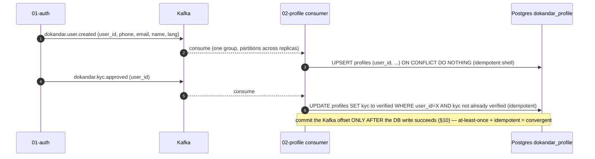
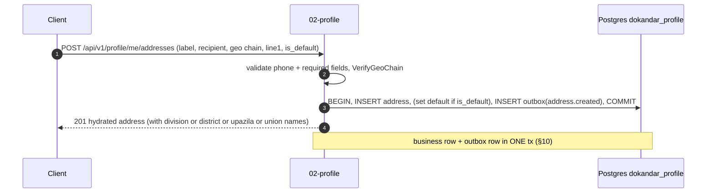
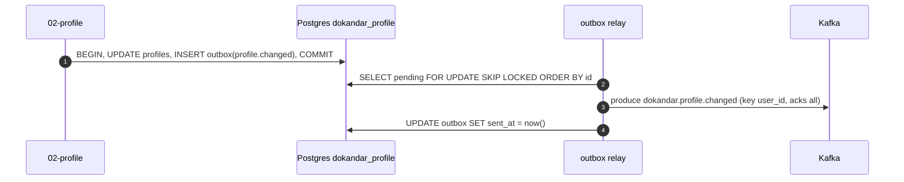

# `02-profile` — Customer Profiles & BD Addresses — Service Architecture

> **Scope.** Design + full **interface contracts** (schemas, the complete OpenAPI/Swagger surface, the
> five operational endpoints, application logging) at **spec altitude** — every request/response shape,
> validation rule, status code, env var, log document, and metric specified. This document **expands the
> `02-profile` row of [`../../architecture.md`](../../architecture.md) §9** and is **subordinate to
> [`../../README.md`](../../README.md) §6/§7/§8/§10 and §13–§14** — on any conflict, **the README wins.**
> It is **spec-pure**: Go 1.26 · chi + pgx v5 · in-container REST `8080` / gRPC `50051` · external REST
> `10002` / gRPC `20002`. A working reference exists at `~/Desktop/DevOps/02-profile` — read for *shape
> and corrected patterns*; **this doc is the spec.** This is the **Go reference stack**, so the
> per-stack *mechanism* differs sharply from 01-auth's Python: **hand-written `docs.go` OpenAPI** (not
> reflection) + a CI route-vs-spec test, `apmchiv5` as the *first* middleware, pgx, and a **Kafka
> consumer** that projects the KYC badge. Cross-cutting rules live in `../../architecture.md` §10–§14 /
> `../../SERVICE_INTEGRATION_TEMPLATE.md` (HOW; §16.1 Go landmines; Appendix A.2 Go kit).

| | |
| --- | --- |
| **Service** | `02-profile` — Customer Profiles & BD Addresses |
| **Stack** | Go 1.26 · chi v5 · pgx v5 · `segmentio/kafka-go` · `go-redis/v9` · `golang-jwt/jwt v5` · Elastic APM (`apmchiv5`) |
| **Datastore(s)** | PostgreSQL 18 `dokandar_profile_<env>` (sole writer) · Redis 8 DB 1 (invalidate-only cache) |
| **Ports** | SERVICE_PORT `8080` · gRPC `50051` · external REST `10002` / gRPC `20002` |
| **`/ready` hard-gate** | **PostgreSQL only** (Redis DB 1 is invalidate-only cache — reads fall through to PG) |
| **Identity** | `service_name = 02-profile` · `code_version = 02-profile` (from `SERVICE_NAME` env / `CODE_VERSION` file) |
| **Log sinks** | Mongo `mongo_db_dokandar_application_logs.02-profile` · ES `logs-app-02-profile-*` |
| **Consumes** | `dokandar.user.created` (provision shell), `dokandar.kyc.*` (mirror KYC badge) — projection |
| **Emits** | `dokandar.profile.changed`, `dokandar.address.*` (via outbox) |
| **gRPC** | exposes `ProfileQuery.LookupProfile` + `GetDefaultAddress` @50051; calls **no** downstream gRPC |

**Contents:** §1 Role · §2 Position · §3 Data · §4 Domain flows · §5 REST API map · **§6 OpenAPI/Swagger (Go hand-written)** · §7 gRPC · **§8 The five ops endpoints** · §9 TENANT, `/data` & env · **§10 Eventing — the Kafka consumer & outbox** · §11 Logging & observability · §12 Security · §13 Resilience · §14 Boot & lifecycle · §15 Deployment · §16 Go landmines & reconciliation · §17 Design decisions · §18 Build status.

---

## 1. Role & bounded context

`02-profile` owns **customer profile data** and the **structured Bangladesh address book** — the `Division → District → Upazila → Union` cascade plus free-text landmarks that rural last-mile delivery depends on. It **denormalizes a per-user KYC badge** projected from `01-auth`'s events so every other service reads verification status without a synchronous auth hop.

- **Profiles** — one row per user (`name_en`/`name_bn`, gender, dob, locale, avatar, whatsapp, the mirrored `kyc` tier, a `default_address_id`). The row is **provisioned from `01-auth`'s `dokandar.user.created`** — it is *not* created by a profile API call.
- **Addresses** — a customer's address book: recipient + the FK-validated BD geo chain + free-text `line1`/`line2`/`landmark` + optional `lat`/`lng` (→ an `earth_loc` earthdistance column for "near me"). One **default** per user; **soft-deleted**.
- **BD geo reference** — read-only public reference tables (`bd_divisions`/`bd_districts`/`bd_upazilas`/`bd_unions`) the storefront address picker reads.

It is the platform's **system of record for "who is this customer and where do they live"** — read on every checkout. It is **eventually consistent**: the KYC badge trails auth's events.

**Out of scope:** identity/auth (that is `01-auth`; profile is verify-only), raw KYC documents (those stay in `12-media`, admin-only — profile holds only the derived *tier*), and any money/order data.

---

## 2. Position in the platform

```text
   Clients ──REST──►┌──────────────────────────────┐
   (via gateway)    │  02-profile  (Go/chi+pgx)    │──gRPC ProfileQuery @50051──► callers (checkout, etc.)
                    │  · profiles + BD address book │
 01-auth ──Kafka──►│  · KYC-badge projection       │──Kafka(outbox)──► dokandar.profile.changed, dokandar.address.*
  user.created,    │  · public BD geo cascade      │
  kyc.*            │  PostgreSQL dokandar_profile  │   invalidate-only ► Redis DB 1
                    │  Redis DB 1 (cache)           │
                    └──────────────────────────────┘
```

- **Consumes (Kafka, projection):** `dokandar.user.created` → upsert an empty profile shell; `dokandar.user.updated` → mirror phone/email; `dokandar.kyc.submitted|approved|rejected` → mirror the `kyc` badge (`submitted`/`verified`/`rejected`). One consumer group; idempotent handlers (§10).
- **Exposes (gRPC):** `ProfileQuery.LookupProfile` + `ProfileQuery.GetDefaultAddress` @50051 (external 20002) — east-west reads (checkout needs the delivery address). Gated by a constant-time `INTERNAL_SERVICE_TOKEN` check.
- **Emits (Kafka, outbox):** `dokandar.profile.changed`, `dokandar.address.*` (created/updated/deleted/default_changed).
- **Calls no downstream gRPC** — it learns auth state via Kafka, not a synchronous hop. (It will call `12-media`'s gRPC to validate avatars once Media lands — currently stubbed.)
- **`profiles.user_id` mirrors `auth.users.id` with NO cross-service FK** — consistency is asynchronous via the `user.created` event (database-per-service).

---

## 3. Data architecture

PostgreSQL `dokandar_profile_<env>` is the system of record; Redis DB 1 is an **invalidate-only** cache (purged on write, never truth — a Redis outage just means reads fall through to PG). The split is why **`/ready` gates on Postgres only**.

### 3.1 PostgreSQL `dokandar_profile_<env>`

Extensions `pgcrypto`, `cube`, `earthdistance`. Three owned groups: the BD geo reference, `profiles`, `addresses`, plus the `outbox`.

```sql
CREATE EXTENSION IF NOT EXISTS pgcrypto;
CREATE EXTENSION IF NOT EXISTS cube;
CREATE EXTENSION IF NOT EXISTS earthdistance;

-- BD geo reference (public; the storefront address picker reads these) — a strict FK chain
CREATE TABLE bd_divisions ( code TEXT PRIMARY KEY, name_en TEXT NOT NULL, name_bn TEXT NOT NULL, sort_order INT NOT NULL DEFAULT 0 );
CREATE TABLE bd_districts ( code TEXT PRIMARY KEY, division_code TEXT NOT NULL REFERENCES bd_divisions(code), name_en TEXT NOT NULL, name_bn TEXT NOT NULL, sort_order INT NOT NULL DEFAULT 0 );
CREATE TABLE bd_upazilas ( code TEXT PRIMARY KEY, district_code TEXT NOT NULL REFERENCES bd_districts(code), name_en TEXT NOT NULL, name_bn TEXT NOT NULL, sort_order INT NOT NULL DEFAULT 0 );
CREATE TABLE bd_unions  ( code TEXT PRIMARY KEY, upazila_code TEXT NOT NULL REFERENCES bd_upazilas(code), name_en TEXT NOT NULL, name_bn TEXT NOT NULL, postal_code TEXT, sort_order INT NOT NULL DEFAULT 0 );
-- (8 divisions seeded; production loads the full ~4500-row dataset via data/bd-geo.sql)

CREATE TABLE profiles (                                 -- 1:1 with auth.users.id (NO cross-service FK)
    user_id            UUID PRIMARY KEY,                -- = auth.users.id; provisioned from dokandar.user.created
    phone              TEXT NOT NULL,
    email              TEXT,
    name_en            TEXT,  name_bn TEXT,
    gender             TEXT CHECK (gender IN ('m','f','x','prefer_not_say')),
    dob                DATE,
    locale             TEXT NOT NULL DEFAULT 'bn' CHECK (locale IN ('bn','en')),
    avatar_media_id    UUID,                            -- opaque 12-media id
    default_address_id UUID,
    kyc                TEXT NOT NULL DEFAULT 'unverified'
                            CHECK (kyc IN ('unverified','submitted','verified','rejected')),  -- the MIRRORED badge
    whatsapp_number    TEXT,
    created_at TIMESTAMPTZ NOT NULL DEFAULT now(),  updated_at TIMESTAMPTZ NOT NULL DEFAULT now()
);
CREATE INDEX profiles_phone_idx ON profiles(phone);

CREATE TABLE addresses (
    id              UUID PRIMARY KEY DEFAULT gen_random_uuid(),
    user_id         UUID NOT NULL REFERENCES profiles(user_id) ON DELETE CASCADE,
    label TEXT NOT NULL, recipient_name TEXT NOT NULL,
    recipient_phone TEXT NOT NULL CHECK (recipient_phone ~ '^01[3-9][0-9]{8}$'),   -- BD mobile, DB-enforced
    division_code TEXT NOT NULL REFERENCES bd_divisions(code),   -- the geo chain is FK-enforced
    district_code TEXT NOT NULL REFERENCES bd_districts(code),
    upazila_code  TEXT NOT NULL REFERENCES bd_upazilas(code),
    union_code    TEXT          REFERENCES bd_unions(code),       -- optional
    line1 TEXT NOT NULL, line2 TEXT, landmark TEXT,
    lat DOUBLE PRECISION, lng DOUBLE PRECISION,
    earth_loc EARTH GENERATED ALWAYS AS                            -- earthdistance column → "near me"
        (CASE WHEN lat IS NOT NULL AND lng IS NOT NULL THEN ll_to_earth(lat, lng) ELSE NULL END) STORED,
    is_default BOOLEAN NOT NULL DEFAULT false,
    deleted_at TIMESTAMPTZ,                                        -- soft delete
    created_at TIMESTAMPTZ NOT NULL DEFAULT now(),  updated_at TIMESTAMPTZ NOT NULL DEFAULT now()
);
CREATE INDEX addresses_user_idx ON addresses(user_id) WHERE deleted_at IS NULL;
CREATE UNIQUE INDEX addresses_one_default ON addresses(user_id) WHERE is_default = true AND deleted_at IS NULL;  -- exactly one default
CREATE INDEX addresses_geo_idx  ON addresses USING GIST(earth_loc) WHERE earth_loc IS NOT NULL;                  -- spatial "near me"

CREATE TABLE outbox (
    id BIGINT GENERATED ALWAYS AS IDENTITY PRIMARY KEY,   -- monotonic → FIFO relay drain (see §16/§17)
    aggregate_id UUID NOT NULL,                            -- the Kafka partition key (user_id)
    topic TEXT NOT NULL, payload JSONB NOT NULL,
    sent_at TIMESTAMPTZ, created_at TIMESTAMPTZ NOT NULL DEFAULT now()
);
CREATE INDEX outbox_pending_idx ON outbox(id) WHERE sent_at IS NULL;
```

> **Spec note (partitioning):** the spec hash-partitions **`addresses` by `user_id` across 16 partitions** (`PARTITION BY HASH (user_id)`) for write throughput at scale; the geo + unique-default indexes are then per-partition. *(The reference MVP ships `addresses` unpartitioned — fine at MVP scale; partition before the address book grows large. §16.)*

### 3.2 Redis DB 1 — invalidate-only cache

```text
profile:{user_id}    a cached composed /me body — DELETED on any profile/address write (never the source of truth)
```

Cache-aside: a read may populate it; **every write purges it** (`invalidateProfileCache`). A Redis outage degrades to a direct PG read — never a failure (and never a `/ready` gate).

---

## 4. Domain flows

### 4.1 The KYC-badge projection (the defining flow)

`02-profile` is a **CQRS read-projection** of `01-auth`'s identity events. It never calls auth synchronously; it consumes auth's Kafka facts and maintains a local denormalized copy.



The badge is **eventually consistent** — if the consumer lags, the badge is stale but profiles/addresses stay fully readable. The KYC `tier` mirror tracks auth's `kyc_status` enum (`unverified|submitted|verified|rejected`); the raw KYC documents never leave `12-media`.

### 4.2 Profile read/update

`GET /me` composes the profile + its hydrated default address (the geo names joined in) into one body. `PATCH /me` (partial; `PUT` is an alias) validates each field, updates, **emits `dokandar.profile.changed`** via the outbox, and invalidates the cache.

### 4.3 Address CRUD + the geo chain + near-me

Creating/updating an address **verifies the geo chain** (district under division, upazila under district, union under upazila) both in-app (`VerifyGeoChain` → `422 geo_chain_invalid`) and by FK. The `is_default` flag is guarded by a partial-unique index (exactly one default per user); setting a new default flips `profiles.default_address_id` in the same tx. Each write goes out as `dokandar.address.*` via the outbox. `lat`/`lng` populate the `earth_loc` column for a future "addresses near me" (GiST spatial index).



### 4.4 The public BD geo cascade

`GET /api/v1/profile/geo/...` serves the read-only reference cascade (divisions → districts → upazilas → unions) **with no auth** — the storefront address picker calls it directly. Each level 404s on an unknown parent code.

---

## 5. Synchronous REST API map

### 5.1 Conventions (Go realization)

Pretty-JSON via `json.Encoder.SetIndent("", "  ")` on every JSON body; one error envelope `{error:{code,message,request_id,details?}}` written by `WriteError` (proper JSON encoding — **not** `fmt.Sprintf`, §16); **bare 404** via chi's `NotFound` (`Content-Length: 0`, no body); structured **405** on a known path; `X-Request-Id` honoured/minted (uuid hex)/echoed by the `requestID` middleware. Business routes live under `/api/v1/profile/`; the five ops endpoints at the root. **Malformed UUID path params are rejected at the boundary** (`reqValidUUID` → `400 invalid_uuid`) so a `22P02` never leaks through a 500 (§16).

### 5.2 The endpoint map

| Method | Path (`/api/v1/profile/…`) | Tag | Auth | Success | Notable failures |
| --- | --- | --- | --- | --- | --- |
| GET | `/me` | me | Bearer | 200 | `unauthorized` (401), `profile_not_found` (404) |
| PATCH / PUT | `/me` | me | Bearer | 200 | `unauthorized`, `validation_error`/`invalid_request`/`phone_invalid` (422) |
| POST | `/me/avatar` | me | Bearer | 200 | `unauthorized`, `validation_error` |
| GET | `/me/addresses` | me | Bearer | 200 | `unauthorized` |
| POST | `/me/addresses` | me | Bearer | 201 | `unauthorized`, `validation_error`/`phone_invalid`/`geo_chain_invalid` |
| GET | `/me/addresses/{id}` | me | Bearer | 200 | `invalid_uuid` (400), `unauthorized`, `not_found` |
| PATCH | `/me/addresses/{id}` | me | Bearer | 200 | `invalid_uuid`, `unauthorized`, `not_found`, `validation_error`/`geo_chain_invalid` |
| DELETE | `/me/addresses/{id}` | me | Bearer | 204 | `invalid_uuid`, `unauthorized`, `not_found`, `default_in_use` (409) |
| POST | `/me/addresses/{id}/default` | me | Bearer | 204 | `invalid_uuid`, `unauthorized`, `not_found` |
| GET | `/geo/divisions` | geo | **public** | 200 | — |
| GET | `/geo/divisions/{code}/districts` | geo | public | 200 | `not_found` (404) |
| GET | `/geo/districts/{code}/upazilas` | geo | public | 200 | `not_found` |
| GET | `/geo/upazilas/{code}/unions` | geo | public | 200 | `not_found` |
| GET | `/admin/profiles/{user_id}` | admin | Bearer (admin role) | 200 | `invalid_uuid`, `unauthorized`, `forbidden` (403), `not_found` |

---

## 6. The OpenAPI / Swagger surface (the **Go hand-written** way)

This is the load-bearing difference from a reflection stack (FastAPI/Spring): Go has **no route reflection**, so the OpenAPI document is a **hand-written `map[string]any`** in `internal/app/docs.go`, rebuilt from settings on every `/openapi.json` hit. **Every chi route added to the router MUST also be added to `OpenAPISpec().paths` by hand** — the spec can silently diverge from the router. The single guard is a **CI route-vs-spec diff test** (§6.6).

### 6.1 How `/docs` renders

`ServeDocs` writes a static Swagger-UI HTML (`swagger-ui-dist@5`) pointing at `/openapi.json`, with `tryItOutEnabled` + `persistAuthorization`:

```text
info.title       = "DOKANDAR Profile Service"
info.version     = code_version (02-profile)            # rebuilt from settings each /openapi.json hit
info.description = the identity row (**service_name** `02-profile` | **code_version** `02-profile` | ...)
                   + a "How to test" guide: click Authorize + paste a Bearer access token from 01-auth;
                     the /geo/* endpoints are PUBLIC; bodies are pre-filled with a real seeded geo chain
                     (barisal -> barisal -> barisal-sadar -> barisal-1); /me 404s until auth's UserCreated is consumed.
components.securitySchemes.HTTPBearer = { type: http, scheme: bearer, bearerFormat: JWT }   # Authorize button
tags = [ {name: ops}, {name: geo}, {name: me}, {name: admin} ]
/openapi.json  ->  served PRETTY (json.MarshalIndent) — Go does NOT honor the compact exemption; it round-trips fine (§16)
/docs, /openapi.json off the access log
```

### 6.2 The Bearer Authorize button

`HTTPBearer` (`type:http, scheme:bearer, bearerFormat:JWT`) is declared in `components.securitySchemes`; each secured operation carries `security: [{HTTPBearer: []}]` (the `me` + `admin` ops). The `geo` + `ops` operations omit it (public). The token is `01-auth`'s RS256 access token, **verify-only** here (§12).

### 6.3 Request validation (Go decode + explicit checks)

Go decodes the JSON body into a typed struct (pointer fields for PATCH = partial), then validates explicitly — there is no Pydantic/`Field`, so each rule is hand-coded and must be **mirrored in the OpenAPI schema by hand**:

- `locale ∈ {bn,en}`, `gender ∈ {m,f,x,prefer_not_say}`, `dob` = `YYYY-MM-DD`, phones match `^01[3-9]\d{8}$` (`address.PhoneRegex`) — all → `422` with a specific `code` (`validation_error`/`invalid_request`/`phone_invalid`).
- The geo chain → `422 geo_chain_invalid` (district/upazila/union must match the FK chain under the division).
- **Path UUIDs validated at the boundary** (`reqValidUUID` → `400 invalid_uuid`) before they reach pgx.

### 6.4 The shared `ErrorEnvelope` + `responses=`

One `ErrorEnvelope` component (`{error:{code,message,request_id}}`); every hand-written path operation declares its failure codes against it (the `errResp(...)` helper). The per-endpoint failure-code map is the §5.2 table — **the hand-written spec must list every one** (a reflection stack gets this for free; Go does not).

### 6.5 The schemas catalog

```text
PatchMeRequest (PATCH/PUT /me) — all optional (partial)
  name_en : string : Rahim Uddin        name_bn : string : রহিম উদ্দিন
  gender  : enum m|f|x|prefer_not_say    dob : string(date) YYYY-MM-DD
  locale  : enum bn|en                   whatsapp_number : string ^01[3-9]\d{8}$
AvatarRequest (POST /me/avatar)
  media_id : string(uuid) : REQUIRED : 11111111-1111-4111-8111-111111111111
AddressCreateRequest (POST /me/addresses) — required: label, recipient_name, recipient_phone, division_code, district_code, upazila_code, line1
  label, recipient_name : string        recipient_phone : string ^01[3-9]\d{8}$
  division_code, district_code, upazila_code : string (FK)   union_code : string|null
  line1 : string   line2, landmark : string|null   lat, lng : number|null   is_default : boolean
AddressUpdateRequest (PATCH /me/addresses/{id}) — all optional; if ANY geo code is sent, ALL of division+district+upazila are required
ErrorEnvelope  { error: { code, message, request_id } }

Response bodies (composed, not a single struct)
  ProfileBody (/me)  { user_id, phone, email, name_en, name_bn, gender, dob, locale, avatar_media_id,
                       avatar_url, default_address (hydrated), kyc, whatsapp_number, created_at, updated_at }
  AddressBody        { id, label, recipient_name, recipient_phone, line1, line2, landmark, lat, lng,
                       is_default, created_at, updated_at, division, district, upazila, union (hydrated names) }
  GeoListBody        { items: [ { code, name_en, name_bn, ... } ] }
```

### 6.6 Per-endpoint reference (abbrev.)

```text
GET /api/v1/profile/me   tag=me  auth=Bearer  -> 200 ProfileBody
    401 unauthorized ; 404 profile_not_found ("signup event may not have been consumed yet")

PATCH /api/v1/profile/me   tag=me  auth=Bearer  -> 200 ProfileBody
    req: { "name_en": "Rahim Uddin", "name_bn": "রহিম উদ্দিন", "gender": "m", "dob": "1995-05-20", "locale": "bn", "whatsapp_number": "01711112222" }
    401 unauthorized ; 422 validation_error|invalid_request|phone_invalid

POST /api/v1/profile/me/addresses   tag=me  auth=Bearer  -> 201 AddressBody
    req: { "label": "Home", "recipient_name": "Rahim Uddin", "recipient_phone": "01712223333",
           "division_code": "barisal", "district_code": "barisal", "upazila_code": "barisal-sadar",
           "union_code": "barisal-1", "line1": "12 Test Road, Dhanmondi", "is_default": true }
    401 unauthorized ; 422 validation_error|phone_invalid|geo_chain_invalid

DELETE /api/v1/profile/me/addresses/{id}   tag=me  auth=Bearer  -> 204
    400 invalid_uuid ; 401 unauthorized ; 404 not_found ; 409 default_in_use (set another default first)

GET /api/v1/profile/geo/divisions/{code}/districts   tag=geo  auth=PUBLIC  -> 200 { items: [...] }
    404 not_found (division)

GET /api/v1/profile/admin/profiles/{user_id}   tag=admin  auth=Bearer(admin|platform_admin|platform_staff)  -> 200 ProfileBody
    400 invalid_uuid ; 401 unauthorized ; 403 forbidden ; 404 not_found
```

### 6.7 The CI route-vs-spec test (the drift guard — REQUIRED)

Because `docs.go` is hand-written, add a test that **fails the build if any chi `/api/v1/` route is missing from `OpenAPISpec().paths`** (no service has one today — close the gap):

```go
func TestEveryRouteIsDocumented(t *testing.T) {
    r := buildRouter(testDeps())                 // the SAME router main() builds
    spec := map[string]any{}
    _ = json.Unmarshal(OpenAPISpec("02-profile","02-profile","v1.0.0","local","dev"), &spec)
    paths := spec["paths"].(map[string]any)
    _ = chi.Walk(r, func(method, route string, _ http.Handler, _ ...func(http.Handler) http.Handler) error {
        if strings.HasPrefix(route, "/api/v1/") {
            if _, ok := paths[route]; !ok {
                t.Errorf("route %s %s served but missing from OpenAPISpec().paths", method, route)
            }
        }
        return nil
    })
}
```

---

## 7. gRPC `ProfileQuery` @ `50051` (external `20002`)

East-west reads (a checkout needs the delivery address without an HTTP round-trip). Every RPC compares `x-internal-token` against `INTERNAL_SERVICE_TOKEN` in **constant time** (`subtle.ConstantTimeCompare`) → `UNAUTHENTICATED` on mismatch. Profile **calls no downstream gRPC**.

```proto
syntax = "proto3";
package dokandar.profile.v1;

service ProfileQuery {
  rpc LookupProfile   (LookupProfileRequest)   returns (LookupProfileResponse);   // who is this user + KYC tier
  rpc GetDefaultAddress(GetDefaultAddressRequest) returns (GetDefaultAddressResponse); // the delivery address
}

message LookupProfileRequest  { string user_id = 1; }
message LookupProfileResponse {
  bool   exists  = 1;   // false (not NOT_FOUND) for an unknown user
  string name_en = 2;  string name_bn = 3;  string phone = 4;
  string kyc     = 5;   // unverified|submitted|verified|rejected (the mirrored badge)
}
message GetDefaultAddressRequest  { string user_id = 1; }
message GetDefaultAddressResponse {
  bool   has_default = 1;
  string address_id  = 2;  string recipient_name = 3;  string recipient_phone = 4;
  string division = 5;  string district = 6;  string upazila = 7;  string union = 8;
  string line1 = 9;  double lat = 10;  double lng = 11;
}
```

---

## 8. The five operational endpoints

Realized in Go (chi handlers + `promhttp` for `/metrics`); a single `Identity` struct (fixed JSON field order via struct tags) is reused across `/ready` and `/health`; the `checks{}` order is pinned by a custom `OrderedChecks.MarshalJSON` (canonical order regardless of which subset is populated). Each dep probe runs concurrently inside an APM `dep.<name>` span carrying `destination.service.*` (the `apm` probe omits the destination — no self-loop).

### 8.1 `GET /ready` — Postgres only

`dependencies = [postgres]`. Redis DB 1 is invalidate-only — reads fall through to PG, so a Redis outage must **not** flip the traffic gate. `200`+`"ready"` / `503`+`"not_ready"`. Excluded from the access log + RED. *(Spec-normalize: the reference MVP also probes redis on `/ready`; the spec gates Postgres only — §16.)*

```json
{ "status": "ready",
  "identity": { "service_name": "02-profile", "code_version": "02-profile", "env_version": "v1.0.0",
                "tenant": "cloud", "env": "prod", "uptime_seconds": 1234 },
  "dependencies": [ { "name": "postgres", "reachable": true, "latency_ms": 1.4 } ] }
```

### 8.2 `GET /health` — full diagnostics

Checks in the canonical order `postgres, redis, kafka, mongo_logs, apm, grpc_media`; `grpc_media` is **diagnostic-only** (`{ok:false, detail:"not_configured"}` until `12-media` is deployed — it never flips the overall state). Status `healthy` iff every gating check is `ok`; `/health` 503 surfaces a degraded sink without evicting the pod (the `HEALTHCHECK`/readinessProbe use `/ready`).

```json
{ "status": "healthy",
  "identity": { "service_name": "02-profile", "code_version": "02-profile", "env_version": "v1.0.0",
                "tenant": "cloud", "env": "prod", "uptime_seconds": 1234 },
  "checks": {
    "postgres":   { "ok": true,  "detail": "ok" },
    "redis":      { "ok": true,  "detail": "PONG" },
    "kafka":      { "ok": true,  "detail": "metadata-ok" },
    "mongo_logs": { "ok": true,  "detail": "ping-ok" },
    "apm":        { "ok": true,  "detail": "host:8200 tcp-ok" },
    "grpc_media": { "ok": false, "detail": "not_configured" }
  },
  "observability": {
    "apm_service_name": "02-profile",
    "apm_server_url":   "http://infra:8200",
    "logs_sink_mongo":  "mongo_db_dokandar_application_logs.02-profile",
    "logs_sink_es":     "logs-app-02-profile-*"
  } }
```

### 8.3 `GET /data` — the tenant snapshot

Identity block **prepended** to `data/<tenant>/result.json` (produced by `data/<tenant>/collect.sh`, bind-mounted read-only at `/app/data`). Go merges by **byte-splice** (`{"identity":…}` + the snapshot body after its leading `{`). Guards: missing → `404 no_snapshot`; invalid JSON → `500 snapshot_parse_failed`.

> **Go landmine (§16):** the byte-splice trusts a leading `{`. A snapshot whose top level is a JSON **array** passes `json.Valid` but the splice yields **invalid JSON at 200**. **DO** add an explicit "top-level must be an object" guard before splicing (reject non-object → `500 snapshot_parse_failed`).

Full `result.json` shapes (local host facts; cloud adds the EC2 IMDSv2 `ec2` block) are identical to `01-auth`'s — see [`../01-auth/architecture.md`](../01-auth/architecture.md) §8.3 / §9.2; `02-profile`'s `collect.sh` is the same boilerplate.

### 8.4 `GET /metrics`

`promhttp.Handler()` exposition (off the access log, pretty-JSON-exempt). RED from the `httpMetrics` middleware (route-**templated** via `chi.RouteContext().RoutePattern()`, `"unmatched"` for unmatched — closed-set) + the profile counters/gauges (§11.5). DB-backed gauges (`profile_outbox_pending`) refreshed by the relay loop.

### 8.5 `GET /docs` + `GET /openapi.json`

Owned by §6. `/docs` Swagger UI HTML; `/openapi.json` the hand-written spec (served pretty in Go).

---

## 9. TENANT, `/data` & the env-render contract

### 9.1 Identity & TENANT

`service_name = 02-profile` is read **once at boot from the required `SERVICE_NAME` env var** (= `code_version`, from `CODE_VERSION`; the reference file says `2-profile` → **spec-normalize to `02-profile`**) and is the single identifier presented everywhere: the identity block, the **APM** `service.name`, the **Mongo** log collection `mongo_db_dokandar_application_logs.02-profile`, the **ES** index `logs-app-02-profile-*`, the **Prometheus** `service` label, and the **Postgres** connection `application_name=02-profile` (visible in `pg_stat_activity`). `TENANT` (`local`|`cloud`) selects only `identity.tenant` + which `data/<tenant>/result.json` is served — never any DB/topic name. A blank `SERVICE_NAME` crash-loops (always).

### 9.2 `/data` mounting

`data/<tenant>/collect.sh` runs out-of-band → `result.json`; the `data/` dir is bind-mounted read-only at `/app/data`, so re-running `collect.sh` refreshes `/data` with no restart. `local` = host facts; `cloud` = host facts + the EC2 IMDSv2 `ec2` block.

### 9.3 The env

```ini
# --- identity / server ---
APP_ENV=prod
SERVICE_NAME=02-profile           # REQUIRED — fail-fast-if-blank, ALWAYS; the NN-service identity used everywhere
ENV_VERSION=v1.0.0
TENANT=cloud
SERVICE_PORT=8080                 # in-container REST (chi)
GRPC_PORT=50051                   # external 20002
LOG_LEVEL=info
# --- postgres (sole writer of dokandar_profile_<env>) ---
POSTGRES_DSN=postgres://profile:<PG_PASSWORD>@postgres:5432/dokandar_profile_prod?application_name=02-profile&statement_timeout=5000
POSTGRES_ADMIN_DSN=postgres://postgres:<PG_ADMIN_PASSWORD>@postgres:5432/postgres   # ensure_db only
# --- redis (DB 1 — invalidate-only cache) — NOT a /ready gate ---
REDIS_URL=redis://:<REDIS_PASSWORD>@redis:6379/1
CACHE_TTL_SECONDS=300
# --- kafka (consumer group + the consumed + emitted topics) ---
KAFKA_BROKERS=kafka:9092
KAFKA_CONSUMER_GROUP=profile.projection
KAFKA_TOPICS_CONSUME=dokandar.user.created,dokandar.user.updated,dokandar.kyc.submitted,dokandar.kyc.approved,dokandar.kyc.rejected
KAFKA_TOPIC_PROFILE_CHANGED=dokandar.profile.changed
KAFKA_TOPIC_ADDRESS_CHANGED=dokandar.address.changed
# --- jwt (verify-only — 02-profile mints NO token) + east-west ---
JWT_PUBLIC_KEY_B64=<JWT_PUBLIC_KEY_B64>       # fail-fast-if-empty under stage/prod
JWT_ISSUER=dokandar-auth
INTERNAL_SERVICE_TOKEN=<INTERNAL_SERVICE_TOKEN>   # fail-fast under stage/prod; constant-time gRPC compare
MEDIA_GRPC_ADDR=                                  # set once 12-media is deployed (avatar validation)
# --- apm (diagnostic) + log sinks ---
APM_SERVER_URL=http://apm-server:8200
APM_SERVICE_NAME=02-profile
MONGO_LOG_URI=mongodb://logger:<MONGO_PASSWORD>@mongodb:27017/
MONGO_LOG_DB=mongo_db_dokandar_application_logs
ELASTIC_SEARCH_URL=http://elasticsearch:9200
```

**Fail-fast:** blank `SERVICE_NAME` always; empty `JWT_PUBLIC_KEY_B64` / `INTERNAL_SERVICE_TOKEN` under `APP_ENV ∈ {stage,prod}`. **02-profile mints no JWT** — `JWT_PUBLIC_KEY_B64` is the verify-only public key. `init-env.sh` carries `shopt -u patsub_replacement` (the bash-5.2 `&`-in-secret trap).

---

## 10. Eventing — the Kafka consumer & the outbox relay

### 10.1 The consumer (the KYC-badge projection)

One consumer group (`profile.projection`) reads all five auth topics; partitions distribute across replicas. Handlers are **idempotent**: `user.created` → `UPSERT … ON CONFLICT DO NOTHING`; `kyc.*` → `UPDATE … WHERE kyc <> $newValue` (a no-op on replay). KEDA scales the consumers on Kafka lag.

> **Go landmine (§16) — commit-after-handle.** The reference uses `kafka-go`'s `CommitInterval` (**autocommit on a timer**), so an offset can commit *before* the handler succeeds — a transient DB blip during the upsert is logged and the event is effectively **dropped** (at-most-once). **DO** disable autocommit and commit the offset **only after** the handler's DB write commits (`CommitMessages` after handle), treat transient errors as retryable, and route poison events to a DLQ. Idempotent handlers absorb the at-least-once redeliveries → convergent.

### 10.2 The outbox relay (emitting profile/address events)

Each business write inserts an `outbox` row **in the same DB transaction** as the change; a relay loop polls pending rows, produces to Kafka with **`acks=all`** (`RequiredAcks: RequireAll`), keyed by `aggregate_id` (= `user_id`, so a user's events stay ordered), and marks `sent_at`. `profile_outbox_pending` (a DB-count gauge) surfaces a stalled relay.

- **Emits:** `dokandar.profile.changed` (on `/me` update), `dokandar.address.changed` (op `created|updated|deleted|default_changed`).
- **Go landmines (§16):** (a) the relay must poll `… WHERE sent_at IS NULL ORDER BY id FOR UPDATE SKIP LOCKED` so multiple relay replicas don't double-publish (the MVP's plain `SELECT … LIMIT` can). (b) **`PATCH /me` writes its `ProfileChanged` outbox row in a *separate* transaction** from the profile update (the reference's `emitProfileChanged` opens a new tx) — a crash between them drops the event. **DO** write the business row + the outbox row in **one tx** (the address handlers already do this correctly — match them).



---

## 11. Application logging & observability

### 11.1 The three sinks (Go realization)

stdout JSON + MongoDB `mongo_db_dokandar_application_logs.02-profile` + Elasticsearch `logs-app-02-profile-*`. Go drains each sink on a **dedicated goroutine** (so it is *immune* to the Python event-loop-block trap), over a bounded channel that drops silently on overflow (`log_drops_total{sink}` the only signal); a custom `MarshalJSON` pins the canonical field order (`asctime → name → levelname → message → elasticapm_* → extras`) so Go and Python logs are queryable identically in Kibana.

> **Go landmine (§16):** the reference ES drainer ships **one doc per `_bulk` POST**. **DO** batch up to ~200 docs per `_bulk`. **DON'T** leave it one-per-request.

### 11.2 The access log

One line per response (`statusRecorder` captures the status), `DD-MM-YYYY HH:MM:SS    <ip>:<port> - "<METHOD> <path> <PROTO>" <status> <reason>`, stdout-only, with **`/ready` + `/metrics` excluded** (the reference does this correctly). *(Go landmine: the reference formats the timestamp in **localtime** — emit **UTC** to match the fleet.)*

### 11.3 The forensic Mongo decision log

Closed action vocabulary: `profile.updated`, `profile.provisioned_from_user_created`, `profile.kyc_badge_updated`, `address.created`, `address.updated`, `address.deleted`, `address.default_changed`. The forensic envelope (`request_id, actor{id,role}, action, target{type,id}, outcome, duration_ms, trace.id, ts_date`) + indexes (`trace.id`, `actor.id+ts_date`, `action+ts_date`, `ts_date` TTL) per `../../architecture.md` §13. The trace fields are stamped from `apm.TransactionFromContext(ctx)`.

### 11.4 APM

`apmchiv5.Middleware()` is the **first** `r.Use` → outermost (or transactions never finalize). `service.version = 02-profile` via the tracer options; `SERVICE_NODE_NAME` set explicitly; `service.name = 02-profile` byte-identical across APM / Mongo / ES is the log↔trace join key. Each `/health`+`/ready` dep probe runs in a `dep.<name>` span with `SetDestinationService` (Service Map edges).

### 11.5 Metrics (the real profile set)

```text
# RED (httpMetrics middleware; /ready,/metrics excluded; route templated)
http_requests_total{method,route,status}   ·   http_request_duration_seconds{method,route}
# profile-specific (closed-set labels)
profile_get_total{result}            profile_patch_total{result}
profile_shells_created_total          # from dokandar.user.created
kyc_mirror_updates_total{from,to}     # from dokandar.kyc.*
addresses_added_total                 default_address_changes_total
outbox_relayed_total
# gauges
outbox_pending           # COUNT(outbox WHERE sent_at IS NULL) — relay-lag signal
kafka_consumer_lag       # the projection's lag (KEDA scaling signal)
log_drops_total{sink}
```

---

## 12. Security architecture

- **Verify-only RS256.** `02-profile` mints no token. It verifies `01-auth`'s access token with `golang-jwt/jwt v5`, an **explicit `*jwt.SigningMethodRSA` type-assertion** (alg-confusion-safe — rejects `alg:none`/HS256), the `iss`, and an `algorithms:['RS256']` allowlist. Scopes/roles: `profile:read`/`profile:write` for `/me`; `admin`/`platform_admin`/`platform_staff` for `/admin/*` (`403 forbidden` otherwise).
- **Owner-scoping.** A user reads/writes only their **own** profile + addresses (the `sub` from the JWT is the `user_id`); admins read any via the gated `/admin/*` surface.
- **The KYC badge is a derived tier, not documents.** Raw NID/trade-license bytes stay in `12-media` (admin-only); profile holds only `kyc ∈ {unverified,submitted,verified,rejected}`.
- **East-west:** constant-time `subtle.ConstantTimeCompare` on `INTERNAL_SERVICE_TOKEN` for every gRPC call (fail-closed on empty), defence-in-depth with Istio mTLS.
- **PII:** names, phone, email, addresses (incl. recipient phone) are PII — logged with care (no full bodies in the access log); the forensic store redacts.

---

## 13. Resilience & failure modes

| Failure | Behaviour |
| --- | --- |
| **Postgres down** | `/ready` → 503; the gate. |
| **Redis down** | reads fall through to PG (cache-aside); `/ready` stays green. |
| **Kafka consumer lag** | the KYC badge goes **stale** but profiles/addresses stay fully readable; KEDA scales the consumers on lag. |
| **Poison event** | dead-letters for replay; idempotent handlers make a replay a no-op. |
| **Kafka producer down** | writes still commit; events queue in `outbox`; `outbox_pending` rises; relay drains on recovery. |
| **APM / log-sink loss** | `/health` degrades; `/ready` green; log lines drop silently (`log_drops_total`). |
| **12-media absent** | `grpc_media` diagnostic `not_configured`; avatar set stores the id, signed URL stubbed. |

p99 ~40 ms for the gRPC reads (read-heavy — looked up on every checkout). HPA-on-CPU for the API; KEDA-on-Kafka-lag for the projection consumers.

---

## 14. Boot sequence & lifecycle

A single Go `run()` with explicit, ordered steps; the HTTP listener binds **last**:

1. Load config; read `CODE_VERSION` (→ `02-profile`); **fail-fast** on blank `SERVICE_NAME` / (stage·prod) empty `JWT_PUBLIC_KEY_B64`/`INTERNAL_SERVICE_TOKEN`.
2. Configure the three log sinks.
3. `SetupAPM` (warn-only — APM never gates).
4. **`EnsureDB`** (create `dokandar_profile_<env>` if missing → run migrations) **before** opening the pool; validate the DB name against `^[A-Za-z_][A-Za-z0-9_]*$`.
5. Open the pgx pool (with `statement_timeout`) + the Redis client + build the JWT verifier.
6. Start background tasks: the **Kafka consumer** (the projection), the **outbox relay**, and the **gRPC server** (if enabled).
7. Build the chi router (`apmchiv5` first), mount `/api/v1/profile/*` + the ops routes + `/docs`/`/openapi.json`, **bind HTTP** (`ReadHeaderTimeout` set).
8. Shutdown on `SIGTERM`: `srv.Shutdown(5s)`, cancel the consumer + relay, close the pool.

---

## 15. Deployment & runtime

Multi-stage Go build → a **distroless** runtime, non-root, `EXPOSE 8080 50051`.

```dockerfile
FROM golang:1.26 AS build
WORKDIR /src
COPY go.mod go.sum ./        # commit go.sum — reproducible (NOT `go mod tidy` at build, §16)
RUN go mod download
COPY . .
RUN CGO_ENABLED=0 go build -o /out/profile ./cmd/profile && \
    CGO_ENABLED=0 go build -o /out/healthcheck ./cmd/healthcheck   # tiny probe binary

FROM gcr.io/distroless/static-debian12:nonroot   # distroless → NO curl, NO shell
COPY --from=build /out/profile /app/profile
COPY --from=build /out/healthcheck /app/healthcheck
COPY CODE_VERSION /app/CODE_VERSION              # "02-profile"
USER nonroot:nonroot
EXPOSE 8080 50051
HEALTHCHECK --interval=30s --timeout=3s --start-period=15s --retries=3 \
    CMD ["/app/healthcheck"]                      # NOT curl — distroless has none (§16)
ENTRYPOINT ["/app/profile"]                       # run() runs EnsureDB before binding (§14)
```

On Kubernetes: `readinessProbe` on `/ready` (PG-only deps); `livenessProbe` cheap (`/livez`); **HPA-on-CPU** for the API + **KEDA-on-Kafka-lag** for the projection consumers.

---

## 16. Go landmines & reconciliation

The corrected best-of-fleet patterns (full matrix: `../../SERVICE_INTEGRATION_TEMPLATE.md` §16.1 / Appendix A.2). Several are **live in the reference** — apply the corrected form:

- **(a) Hand-written OpenAPI drift.** `docs.go` is a hand-built map — a route added to the chi router but not to `OpenAPISpec().paths` is silently undocumented. **DO** add the CI route-vs-spec test (§6.7) — no Go service has one today.
- **(b) `/ready` gates redis too.** The reference probes redis on `/ready`; the spec gates **Postgres only** (Redis DB 1 is invalidate-only, degradable). Drop redis from `/ready`.
- **(c) Commit-after-handle.** The consumer uses `kafka-go` autocommit (`CommitInterval`) → at-most-once on a transient handler failure. **DO** commit the offset only **after** the DB write commits (§10.1).
- **(d) Same-tx outbox.** `PATCH /me` writes its `ProfileChanged` outbox row in a **separate** tx from the update. **DO** put the business row + outbox row in **one tx** (the address handlers already do).
- **(e) Error envelope via JSON, not `fmt.Sprintf`.** Build the envelope with proper JSON encoding (the main `WriteError` does); **DON'T** interpolate the inbound `X-Request-Id` into a JSON string via `fmt.Sprintf` (malformed-JSON / log-injection if it contains `"`) — the Go fleet's `writeAuthError` (JWT-middleware path) is the place this bites.
- **(f) UUID at the boundary.** `reqValidUUID` → `400 invalid_uuid` before pgx (the reference does this correctly) — never leak a `22P02` via a 500. Keep it on every `{id}`/`{user_id}` route.
- **(g) `/data` non-object guard.** Add an "is a JSON object" check before the byte-splice (§8.3).
- **(g2) Constant-time east-west compare.** The reference's gRPC `checkInternal` compares the inbound `x-internal-token` with a plain `got != token` (a `!=` string compare — timing-leaky). **DO** use `subtle.ConstantTimeCompare([]byte(got), []byte(token)) == 1` with a fail-closed empty-token guard (§7, §12).
- **(g3) Generic message on 5xx.** The reference puts `err.Error()` straight into the `internal_error` 500 envelope — leaking the raw driver/SQLSTATE text to the client. **DO** return a generic message and log the raw cause **server-side** keyed by `request_id` (the `… 22P02 …` and constraint names must never reach the client).
- **(h) ES `_bulk` batching.** Batch ~200 docs per POST (not one-per-request); **(i) access-log UTC** (not localtime); **(j) distroless has no curl** → ship the `cmd/healthcheck` binary; **(k) `go mod tidy` at build** → commit `go.sum` + `go mod download`; **(l) pretty `/openapi.json`** — Go serves it indented (it round-trips fine; compact is the nominal target, a nice-to-fix not a break).

---

## 17. Design decisions & open items

- **CQRS read-projection of auth.** Profile maintains the KYC badge by **consuming** auth's events, not calling auth — a fast, decoupled read path (`p99 ~40 ms`). The badge is eventually consistent by design.
- **Outbox PK `BIGINT IDENTITY`** for FIFO relay drain (`ORDER BY id`); business tables keep UUID PKs. *(The reference uses a UUID outbox id + a `created_at` index — switch to a monotonic id for clean FIFO ordering.)*
- **`addresses` hash-partitioned by `user_id` ×16** (spec) for write throughput; the reference is unpartitioned — partition before the table grows large.
- **One default per user** is a partial-unique index (`WHERE is_default AND deleted_at IS NULL`) — the invariant lives in the DB, not just the app.
- **Geo chain FK-enforced + app-verified** — `geo_chain_invalid` is caught both ways; the FK is the backstop.
- **Open item — `near me`.** The `earth_loc` GiST index is in place but no public "addresses near me" endpoint is exposed yet; confirm whether to surface one (admin/logistics only, given PII).
- **Open item — avatar validation.** `setAvatar` stubs the URL until `12-media` lands; wire `Media.GetSignedURL` to validate the `media_id` and return the canonical URL.

---

## 18. Build status & cross-references

- **Status — specified, NOT yet implemented in this repo.** A full Go reference lives at `~/Desktop/DevOps/02-profile` — read for shape + the corrected patterns (§16); build to **this** spec (ports/versions/names normalized; the landmines fixed).
- **See also:** [`./README.md`](./README.md) · [`../../architecture.md`](../../architecture.md) §9 (this service), §10–§14 (contract), **§21** (event + gRPC anchor — topic/method names), §22 (drift) · [`../../README.md`](../../README.md) §6/§7/§8, §10, §13–§14 · [`../../SERVICE_INTEGRATION_TEMPLATE.md`](../../SERVICE_INTEGRATION_TEMPLATE.md) §4/§4.5, §7–§9, **Appendix A.2 (Go/chi kit)**, §16.1 (Go landmines) · [`../01-auth/architecture.md`](../01-auth/architecture.md) (the Python exemplar; profile consumes its `user.created`/`kyc.*` events) · `~/Desktop/clone/.claude/dokandar-build-guide.md`.
