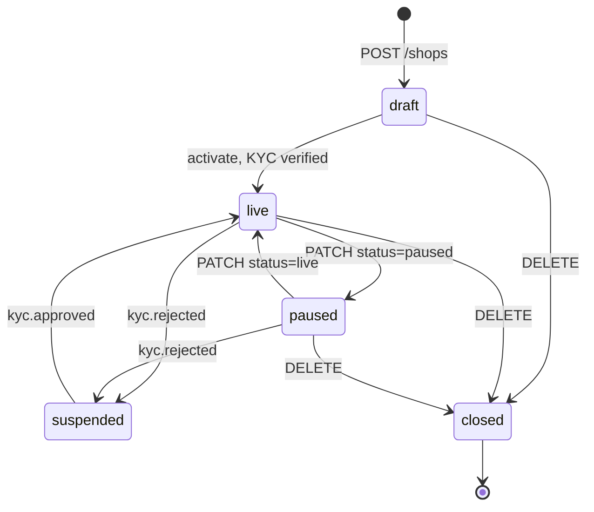
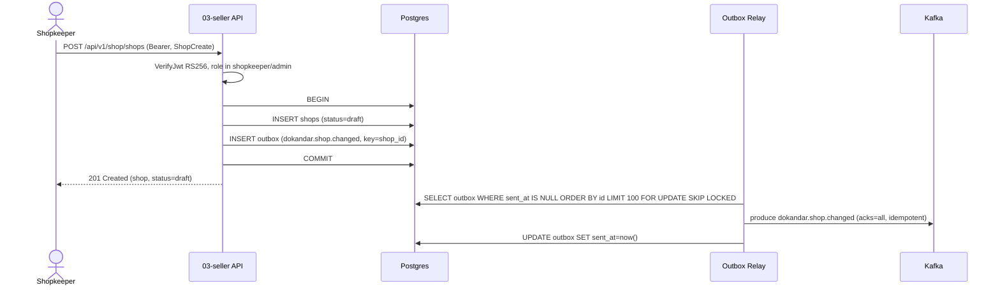
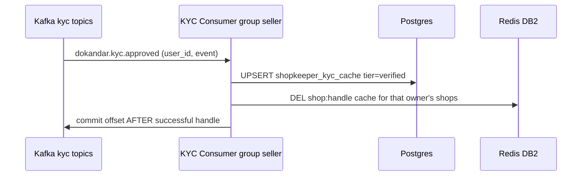

# `03-seller` — Merchant & Shop · Service Architecture

> **Scope.** Implementation-grade architecture for the DOKANDAR **`03-seller`** service (the merchant side of
> the marketplace). Authoritative spec: [`../../architecture.md`](../../architecture.md) §9 (the `03-seller`
> entry) + §10–§14 (the operational contract) + §21 (the event/gRPC anchor); [`../../README.md`](../../README.md)
> §6/§7/§8/§10; [`../../SERVICE_INTEGRATION_TEMPLATE.md`](../../SERVICE_INTEGRATION_TEMPLATE.md) (the build
> playbook, Appendix **A.6 PHP/Laravel**). **On any conflict the README wins — re-verify.**
>
> **Grounding, not copying.** Shape and mechanism are grounded in the as-built PHP reference at
> `~/Desktop/DevOps/03-shop` (the deployed MVP — language-real, but it **diverges** from the spec; the
> `shop → seller` rename, the ports, and several bugs are normalized here and catalogued in §16). Every
> reference fact below is spec-normalized. This service's **code does not exist yet**; this doc is the build
> contract for it.

| | |
| --- | --- |
| **Service** | `03-seller` (bounded context still named *shop* in DB + routes) |
| **Domain** | Identity & Onboarding — the merchant side |
| **Language · framework** | PHP 8.5 · Laravel 13 (Octane/FrankenPHP runtime) |
| **`SERVICE_PORT`** | `8000` (Octane/FrankenPHP; PHP-FPM `9000`) |
| **gRPC** | **none exposed** · client-only (Auth, Media) on write paths |
| **External ports** | REST `10003` · gRPC — |
| **Datastores** | PostgreSQL `dokandar_shop_<env>` (sole writer) · Redis **DB 2** (handle cache) |
| **`/ready` hard-gate** | **PostgreSQL only** (Redis DB 2 is a degradable handle cache) |
| **Emits (Kafka)** | `dokandar.shop.changed`, `dokandar.shop.staff_assigned` (via outbox) |
| **Consumes (Kafka)** | `dokandar.kyc.approved`, `dokandar.kyc.rejected` |
| **RabbitMQ / NATS** | none |
| **`service_name` (identity)** | `03-seller` — from `SERVICE_NAME`, used **identically** everywhere |

**Contents.** §1 Role · §2 Position · §3 Data · §4 Domain flows · §5 REST map · §6 OpenAPI/Swagger surface ·
§7 gRPC · §8 The five ops endpoints · §9 TENANT/`/data`/env · §10 Eventing · §11 Logging & observability ·
§12 Security · §13 Resilience · §14 Boot & lifecycle · §15 Deployment · §16 Stack landmines · §17 Design
decisions · §18 Build status.

---

## 1. Role & bounded context

`03-seller` owns the **merchant side** of DOKANDAR: everything a shopkeeper sets up and operates, and
everything a customer sees about a shop *except* its products (those belong to `04-catalog`). It is the sole
writer of the shop graph and the authority on the shop lifecycle.

**Responsibilities**

- **Shop registration & lifecycle** — the `draft → live ↔ paused → suspended → closed` state machine.
- **Operating hours** — one row per day-of-week per shop (split-hours explicitly out of scope for v1).
- **Staff roles** — assigning `shop_staff` users to a shop (multi-shop per staff), owner/admin gated.
- **Shop categories** — `global` (admin-defined, fleet-wide) vs `private` (one shopkeeper's own).
- **BD seller-tier documents** — Trade License, TIN, **DBID** (BTRC's e-commerce registry), BIN. The service
  stores only KYC **verdicts** (a denormalized tier cache) and document **references** — never the binaries,
  which live admin-only in `12-media`.
- **Public storefront surface** — PII-stripped shop-by-handle pages, shop-by-id, opening hours, and geo
  **"shops near me"** search (`cube + earthdistance`).
- **The BD geo cascade** — a public Division → District → Upazila → Union address picker.

**Explicitly NOT in scope**: products / variants / stock (`04-catalog`), search indexing (`05-search`),
KYC document binaries and verification workflow (`01-auth` + `12-media`), payouts (`09-payment`).

**Bounded-context naming.** The service is `03-seller` for **identity** (logs, metrics, APM, traces), but its
**database** is `dokandar_shop_<env>` and its **routes** live under `/api/v1/shop/*` — the spec keeps "shop"
for those surfaces (architecture.md §9). Do **not** rename the DB or routes to "seller".

---

## 2. Position in the platform

`03-seller` is a **leaf write-service with a public read surface**. It never gates on `01-auth` at request
time — KYC state arrives **asynchronously over Kafka**, keeping the hot storefront read path free of an
east-west dependency.

```
                   Cloudflare → 15-api-gateway (JWT verify, rate-limit, routing)
                                         │  /api/v1/shop/*
                                         ▼
   ┌──────────────────────────── 03-seller (PHP 8.5 / Laravel 13) ───────────────────────────┐
   │  REST :8000 (Octane/FrankenPHP · FPM :9000) — ext REST 10003 — NO gRPC server            │
   │                                                                                          │
   │   write path ─────────────► Postgres dokandar_shop_<env>  (sole writer + outbox)         │
   │   handle cache ───────────► Redis DB 2  shop:handle:<h>                                   │
   │   logo/banner presign ────► Media gRPC  Media.IssueUploadURL @50051  (write-path client)  │
   │   staff verification ─────► Auth  gRPC  staff lookup @50051          (write-path client)  │
   │                                                                                          │
   │   outbox relay  ──────────► Kafka  dokandar.shop.changed · dokandar.shop.staff_assigned   │
   │   kyc consumer  ◄────────── Kafka  dokandar.kyc.approved · dokandar.kyc.rejected           │
   │   logs ───────────────────► stdout (JSON) + Mongo + Elasticsearch ;  traces ► Elastic APM │
   └──────────────────────────────────────────────────────────────────────────────────────────┘
              ▲ consumes shop.changed                       ▲ consumes shop.changed / staff_assigned
        04-catalog (per-shop listings)                 05-search (shop index) · 11-reporting · 18-risk
```

Downstream consumers of `dokandar.shop.changed`: `04-catalog` (validates a listing's shop is live),
`05-search` (projects the shop index + Varnish PURGE relay), `11-reporting`, `18-risk-trust`.

---

## 3. Data architecture

### 3.1 PostgreSQL — `dokandar_shop_<env>` (sole writer)

Extensions: `pgcrypto` (`gen_random_uuid()`), `cube` + `earthdistance` (metres-based radius search — PostGIS
is not in the platform Postgres image; `earthdistance` gives the same API). Cross-service references
(`owner_id`, `shop_staff.user_id`) store **opaque auth user-ids with no FK** — consistency is asynchronous.

```sql
-- shop_categories — global (admin) or private (one shopkeeper)
CREATE TABLE shop_categories (
  id         uuid PRIMARY KEY DEFAULT gen_random_uuid(),
  name       varchar(80)  NOT NULL,
  scope      varchar(10)  NOT NULL DEFAULT 'global',   -- 'global' | 'private'
  owner_id   uuid,                                      -- null for global scope
  created_at timestamptz  NOT NULL DEFAULT now(),
  updated_at timestamptz  NOT NULL DEFAULT now(),
  UNIQUE (scope, owner_id, name)
);

-- shops — the aggregate root
CREATE TABLE shops (
  id            uuid PRIMARY KEY DEFAULT gen_random_uuid(),
  owner_id      uuid          NOT NULL,                 -- shopkeeper user_id from auth (NO FK)
  handle        varchar(60)   NOT NULL UNIQUE,          -- dokandar.com/shops/<handle>
  name          varchar(120)  NOT NULL,
  name_bn       varchar(120),                           -- Bangla display name (bilingual)
  description   text,
  category_id   uuid,
  logo_key      varchar(255),                           -- S3 key issued by 12-media
  banner_key    varchar(255),
  contact_phone varchar(20),
  contact_email varchar(255),
  address       jsonb,                                  -- {division,district,upazila,...}
  lat           double precision,
  lon           double precision,
  status        varchar(20)   NOT NULL DEFAULT 'draft', -- draft|live|paused|suspended|closed
  created_at    timestamptz   NOT NULL DEFAULT now(),
  updated_at    timestamptz   NOT NULL DEFAULT now()
);
CREATE INDEX ON shops (owner_id);
CREATE INDEX ON shops (status);
-- geo bounding-box pre-filter; exact distance via earth_distance(ll_to_earth(..),ll_to_earth(..))
CREATE INDEX idx_shops_lat_lon ON shops (lat, lon) WHERE status = 'live';

CREATE TABLE shop_hours (
  id          uuid PRIMARY KEY DEFAULT gen_random_uuid(),
  shop_id     uuid NOT NULL REFERENCES shops(id) ON DELETE CASCADE,
  day_of_week smallint NOT NULL,                        -- 0=Sun … 6=Sat
  open_time   time,
  close_time  time,
  is_closed   boolean NOT NULL DEFAULT false,
  UNIQUE (shop_id, day_of_week)                         -- single-row-per-day invariant
);
CREATE INDEX ON shop_hours (shop_id);

CREATE TABLE shop_staff (
  id          uuid PRIMARY KEY DEFAULT gen_random_uuid(),
  shop_id     uuid NOT NULL REFERENCES shops(id) ON DELETE CASCADE,
  user_id     uuid NOT NULL,                            -- shop_staff user from auth (NO FK)
  assigned_at timestamptz NOT NULL DEFAULT now(),
  UNIQUE (shop_id, user_id)
);
CREATE INDEX ON shop_staff (user_id);

-- denormalized KYC verdict cache — maintained by the kyc consumer
CREATE TABLE shopkeeper_kyc_cache (
  user_id         uuid PRIMARY KEY,
  tier            varchar(20) NOT NULL DEFAULT 'unverified',  -- 'verified' | 'unverified'
  last_updated_at timestamptz NOT NULL DEFAULT now()
);

-- transactional outbox — one relay drains it to Kafka
CREATE TABLE outbox (
  id         bigserial PRIMARY KEY,
  topic      varchar(120) NOT NULL,
  key        varchar(120),                              -- partition key = shop id / owner id
  payload    jsonb NOT NULL,
  created_at timestamptz NOT NULL DEFAULT now(),
  sent_at    timestamptz                                -- NULL ⇒ unsent
);
CREATE INDEX ON outbox (sent_at, id);
```

**Self-bootstrap.** On boot the service connects to the admin `postgres` DB → `CREATE DATABASE` if the target
is absent (the name validated against `^[A-Za-z_][A-Za-z0-9_]*$` before the DDL) → runs idempotent migrations
→ seeds the BD admin-area reference table → serves traffic. See §14.

### 3.2 Redis — DB 2 (degradable handle cache)

| Key | Value | TTL | Invalidation |
| --- | --- | --- | --- |
| `shop:handle:<handle>` | serialized public shop projection | short | on `PATCH/DELETE` of the shop; on `kyc.*` for the owner's shops |

Redis is a **pure accelerator** — a miss (or a Redis outage) falls through to Postgres. It therefore **does
not gate `/ready`** (§8.1). A separate logical DB index (`REDIS_METRICS_DB=3`) backs the Prometheus metric
store so a `KEYS *` in the cache path can never wipe metric state (§11.4).

---

## 4. Domain flows

### 4.1 Shop lifecycle state machine



`draft` shops are owner-visible only; `live` shops appear in public reads and `near`; `paused` is a
shopkeeper-initiated soft-hide; `suspended` is platform-forced (KYC rejected / policy); `closed` is terminal.
Every transition writes the business row **and** an `outbox` row in one transaction (§10).

### 4.2 Create shop (write + outbox + relay)



A duplicate `handle` is rejected `409 handle_taken` by the `UNIQUE` constraint before any outbox row is
written.

### 4.3 KYC denormalization (consume)



The consumer is **idempotent** (an `UPSERT` keyed by `user_id`) so at-least-once redelivery is safe. A lag
here only makes the verified-badge **stale** — the shop stays fully browsable (§13).

---

## 5. Synchronous REST API map

All business routes are under **`/api/v1/shop/*`**. Responses are pretty JSON (`indent=2`,
`ensure_ascii=false`, trailing newline) except `/metrics` (text), `/openapi.json` (compact), `/docs` (HTML).
Path `{id}` is constrained to a UUID and `{handle}` to `^[a-z0-9-]+$` at the router so `/shops/shops` is never
mis-parsed as `/{id}=shops`. Unmapped paths return a **bare 404** (§8.6); method typos to known paths return a
structured `405 method_not_allowed`.

| Method | Path | Auth | Purpose |
| --- | --- | --- | --- |
| `GET` | `/api/v1/shop/categories` | public | list categories |
| `POST` | `/api/v1/shop/categories` | Bearer | create category (admin/shopkeeper; `global` is admin-only) |
| `GET` | `/api/v1/shop/admin-areas/divisions` | public | BD geo picker — divisions |
| `GET` | `/api/v1/shop/admin-areas/{division}/districts` | public | districts under a division |
| `GET` | `/api/v1/shop/admin-areas/{division}/{district}/upazilas` | public | upazilas under a district |
| `GET` | `/api/v1/shop/admin-areas/{division}/{district}/{upazila}/unions` | public | unions under an upazila |
| `GET` | `/api/v1/shop/shops/near?lat=&lon=&radius_m=&limit=` | public | nearby **live** shops (geo) |
| `GET` | `/api/v1/shop/shops/handle/{handle}` | public | public shop by handle (PII-stripped) |
| `GET` | `/api/v1/shop/shops/{id}` | public | public shop by id (PII-stripped) |
| `GET` | `/api/v1/shop/shops/{id}/hours` | public | opening hours |
| `GET` | `/api/v1/shop/shops` | Bearer | list **my** shops (admin: all) |
| `POST` | `/api/v1/shop/shops` | Bearer | create a shop (`shopkeeper`/`admin`) → `draft` |
| `PATCH` | `/api/v1/shop/shops/{id}` | Bearer | update a shop (owner/admin) |
| `DELETE` | `/api/v1/shop/shops/{id}` | Bearer | close a shop (owner/admin) |
| `POST` | `/api/v1/shop/shops/{id}/activate` | Bearer | `draft → live` (owner/admin) |
| `PUT` | `/api/v1/shop/shops/{id}/hours` | Bearer | replace opening hours (owner/staff/admin) |
| `POST` | `/api/v1/shop/shops/{id}/staff` | Bearer | assign staff (owner/admin) |
| `DELETE` | `/api/v1/shop/shops/{id}/staff/{userId}` | Bearer | remove staff (owner/admin; idempotent) |
| `POST` | `/api/v1/shop/shops/{id}/logo` | Bearer | presign a logo upload (→ Media gRPC) |
| `POST` | `/api/v1/shop/shops/{id}/banner` | Bearer | presign a banner upload (→ Media gRPC) |

Plus **backwards-compat aliases** (`/api/v1/shop/me`, `/api/v1/shop/{id}` GET/PUT, `/api/v1/shop/{id}/activate`)
mapping to the same handlers, tagged `compat` in the OpenAPI so they're documented but visually de-emphasized.

`UUID-at-the-boundary`: a malformed id is rejected `400`/router-`404` at the edge, never passed to Postgres
(so a `22P02 invalid_text_representation` can never leak as a 500).

---

## 6. The OpenAPI / Swagger surface

This is the contract surface the user must see in full Swagger UI. `03-seller` is a **hand-written-OpenAPI
stack** (like Go/`02-profile`): there is **no annotation scanner**. `GET /openapi.json` is built by an explicit
`OpsController::openapi()` method that assembles an OpenAPI **3.0.3** document by hand, and `GET /docs` serves
Swagger UI pointed at it. **Every route in the router MUST have a matching `paths[]` entry** — the only guards
are code-review discipline and the CI **route-vs-spec diff** (§6.5). This is the platform's highest doc-drift
risk class, so the diff is mandatory.

### 6.1 Document envelope

```jsonc
{
  "openapi": "3.0.3",
  "info": {
    "title": "DOKANDAR Seller Service",
    "version": "<code_version>",          // = 03-seller, read from CODE_VERSION
    "description": "<identity banner + How-to-test, see §6.2>"
  },
  "tags": [
    { "name": "ops",         "description": "Operational / contract surface" },
    { "name": "shops",       "description": "Shop lifecycle" },
    { "name": "categories",  "description": "Shop categories" },
    { "name": "hours",       "description": "Opening hours" },
    { "name": "staff",       "description": "Shop staff assignment" },
    { "name": "media",       "description": "Logo / banner presign (via Media gRPC)" },
    { "name": "admin-areas", "description": "Public BD geo picker" },
    { "name": "compat",      "description": "Backwards-compat aliases" }
  ],
  "components": {
    "securitySchemes": {
      "HTTPBearer": { "type": "http", "scheme": "bearer", "bearerFormat": "JWT" }
    },
    "schemas": { /* §6.3 */ }
  },
  "paths": { /* §6.4 */ }
}
```

### 6.2 Security scheme & the `Authorize` button

A single `HTTPBearer` scheme (`type: http, scheme: bearer, bearerFormat: JWT`) drives the Swagger
**Authorize** button. Secured operations carry `security: [{ "HTTPBearer": [] }]`; public reads omit it, so
they are runnable without a token. The `info.description` renders the **identity banner**
(`service_name · code_version · env_version · tenant · env`) followed by a **How to test** block:

1. Click **Authorize**, paste a Bearer **access token** from `01-auth`
   (`POST /api/v1/auth/login/request` → `/login/verify`). Public reads (`GET /shops/{id}`, `/shops/near`,
   `/shops/handle/{handle}`, `/categories`, `/admin-areas/*`) need no token.
2. Request bodies are pre-filled with working examples. **`handle` must be globally unique** — change it on
   reruns (a repeat returns `409 handle_taken`).
3. Only `shopkeeper`/`admin` may create shops/categories; a `shop_staff` token is restricted.

### 6.3 Schema catalog (request-body validation)

Each schema declares `required`, `type`, `format`, `enum`, `nullable`, and bounds so Swagger renders the model
table and the "Try it out" validation:

| Schema | Required | Notable field rules |
| --- | --- | --- |
| **`ShopCreate`** | `handle`, `name` | `handle`: `^[a-z0-9-]+$`, 3–60; `name_bn` nullable (Bangla); `category_id` uuid nullable; `contact_email` `format:email`; `address` object; `lat` −90..90, `lon` −180..180 (double, nullable) |
| **`ShopPatch`** | — | same fields as create, all optional, **plus** `logo_key`, `banner_key`, and `status` `enum:[draft,live,paused,suspended,closed]` (server enforces legal transitions) |
| **`CategoryCreate`** | `name` | `scope` `enum:[global,private]` — `global` is admin-only |
| **`HoursReplace`** | `hours` | `hours[]` of `{ day_of_week 0..6 (required), open_time, close_time, is_closed }` |
| **`StaffAssign`** | `user_id` | uuid of an auth user with role `shop_staff` owned by this shopkeeper |
| **`ErrorEnvelope`** | — | `error: { code, message, request_id }` — referenced by every non-2xx response |

```jsonc
// ShopCreate — the prefilled "Try it out" example
{
  "handle": "my-shop-01", "name": "My General Store", "name_bn": "আমার দোকান",
  "description": "We sell everything you need", "contact_phone": "+8801712345678",
  "contact_email": "shop@example.com",
  "address": { "division": "Dhaka", "district": "Dhaka", "upazila": "Gulshan" },
  "lat": 23.8103, "lon": 90.4125
}
```

### 6.4 Per-operation reference (responses Swagger shows)

Every operation declares its **full response-code set**, and each error body `$ref`s `ErrorEnvelope`. Domain
error codes are first-class so they render in the UI:

| Operation | Success | Error responses |
| --- | --- | --- |
| `POST /shops` | `201` created (`status=draft`) | `401` · `403 insufficient_role` · `409 handle_taken` · `422 validation_error` |
| `GET /shops` | `200 {shops:[…]}` | `401` |
| `GET /shops/{id}` · `/handle/{handle}` | `200` shop (PII-stripped) | `404 shop_not_found` |
| `PATCH /shops/{id}` | `200` updated shop | `401` · `403 not_owner` · `404 shop_not_found` · `422 validation_error / invalid_status_transition` |
| `DELETE /shops/{id}` | `204` closed | `401` · `403 not_owner` · `404 shop_not_found` |
| `POST /shops/{id}/activate` | `200` shop (`status=live`) | `401` · `403 not_owner` · `404 shop_not_found` · `422 invalid_status_transition` |
| `GET /shops/near` | `200 {lat,lon,radius_m,count,shops[]}` | `422 validation_error` |
| `PUT /shops/{id}/hours` | `200 {hours:[…]}` | `401` · `403 not_owner` · `404 shop_not_found` · `422 validation_error` |
| `POST /shops/{id}/staff` | `201` assigned | `401` · `403 not_owner / cross_owner_staff` · `404 shop_not_found` · `409 already_assigned` · `422 validation_error / not_shop_staff_role` |
| `DELETE /shops/{id}/staff/{userId}` | `204` removed (idempotent) | `401` · `403 not_owner` · `404 shop_not_found` |
| `POST /shops/{id}/logo` · `/banner` | `200 {upload_url,key,…}` | `401` · `403 not_owner` · `404 shop_not_found` · `503 media_unavailable` |
| `POST /categories` | `201` created | `401` · `403 staff_cannot_define_shop_category / insufficient_role` · `409 category_duplicate` · `422 validation_error` |
| `GET /categories` · `/admin-areas/*` | `200 {items:[…]}` | — (public) |

Path/query parameters carry `example` values (`lat=23.8103`, `lon=90.4125`, `radius_m=5000`, `limit=20`,
`handle=my-shop-01`, an example UUID) so "Try it out" is one click.

### 6.5 Drift guard (mandatory for hand-written OpenAPI)

A CI job boots the service and diffs the **router** against the **served `/openapi.json`** — any route present
in `routes/api.php` but absent from `paths[]` (or vice-versa) **fails the build**:

```bash
served=$(grep -oE "'/api/v1/shop/[a-z0-9/_{}-]+'" routes/api.php | tr -d "'" | sort -u)
documented=$(curl -fsS localhost:8000/openapi.json | jq -r '.paths | keys[]' | sort -u)
diff <(echo "$served") <(echo "$documented") && echo "router == spec"
```

---

## 7. gRPC

`03-seller` **exposes no gRPC server** (architecture.md §7/§9 — the hot read path takes KYC over Kafka, not a
synchronous call to auth). It **is** a gRPC **client** on two write paths (anchored in §21):

| Call | Peer · port | Trigger | Failure behaviour |
| --- | --- | --- | --- |
| `Media.IssueUploadURL` | `12-media` @ `50051` (ext `20012`) | `POST /shops/{id}/logo` · `/banner` | `503 media_unavailable` (write-path only) |
| Auth staff lookup (`Auth.LookupShopkeeper` / `GetUserKyc`) | `01-auth` @ `50051` (ext `20001`) | `POST /shops/{id}/staff` — verify the target is a `shop_staff` user owned by this shopkeeper | `422 not_shop_staff_role` / `403 cross_owner_staff` |

Both are **diagnostic in `/health`** (`grpc_media`, `grpc_auth` TCP-reachability probes) and **never gate
`/ready`** — a flapping peer must not evict `03-seller` from the load balancer. East-west calls present
`INTERNAL_SERVICE_TOKEN`, compared in **constant time** (`hash_equals`, never `==`). When a peer is not
deployed its host is empty → `/health` reports `not_configured` and the dependent route returns `503`.

---

## 8. The five operational endpoints

Byte-identical across the fleet. Every body except `/metrics` is rendered through the canonical JSON helper
(2-space indent, unescaped unicode/slashes, trailing newline). The **identity block** is shared by `/ready`,
`/health`, `/data`, and the `/docs` description:

```jsonc
"identity": {
  "service_name": "03-seller",     // from SERVICE_NAME, fail-fast if empty
  "code_version": "03-seller",     // repo-root CODE_VERSION, read once at boot
  "env_version":  "v1.0.0",
  "tenant":       "cloud",
  "env":          "prod",
  "uptime_seconds": 4213           // see §8.7 — survives request-per-process runtimes
}
```

### 8.1 `GET /ready` — traffic gating (PostgreSQL only)

Probes **only the dependencies the service cannot serve a single request without**. For `03-seller` that is
**PostgreSQL alone** — Redis DB 2 is a degradable handle cache (a miss falls through to PG), so it is **not**
gated. `200` when reachable, `503` otherwise. Excluded from the access log and all log sinks.

```jsonc
// 200 OK
{
  "status": "ready",
  "identity": { … },
  "dependencies": [
    { "name": "postgres", "reachable": true, "latency_ms": 1.2 }
  ]
}
```

> **Spec correction (§16-a).** The PHP reference also probes Redis here and returns `503` if Redis is down.
> That **over-gates** — it would evict the pod for a degradable cache. The spec gate is **postgres-only**;
> Redis belongs on `/health`, not `/ready`.

### 8.2 `GET /health` — full diagnostics

Reports identity + **all** dependencies (core + diagnostic) + an `observability` block. Healthy iff every
**core** dep is ok; the `grpc_*` checks are diagnostic and **never** flip the status. `200`/`503`.

```jsonc
{
  "status": "healthy",
  "identity": { … },
  "checks": {
    "postgres":   { "ok": true,  "detail": "ok" },
    "redis":      { "ok": true,  "detail": "PONG" },
    "kafka":      { "ok": true,  "detail": "tcp-ok" },
    "mongo_logs": { "ok": true,  "detail": "ping-ok" },
    "apm":        { "ok": true,  "detail": "apm-host:8200 tcp-ok" },
    "grpc_auth":   { "ok": true,  "detail": "auth-host:50051 tcp-ok" },   // diagnostic
    "grpc_media":  { "ok": false, "detail": "not_configured" },           // diagnostic
    "grpc_coupon": { "ok": false, "detail": "not_configured" }            // diagnostic
  },
  "observability": {
    "apm_service_name": "03-seller",
    "apm_server_url":   "http://apm-host:8200",
    "logs_sink_mongo":  "mongodb://…/mongo_db_dokandar_application_logs.03-seller",
    "logs_sink_es":     "http://es-host:9200/logs-app-03-seller-*"
  }
}
```

Each dep check runs inside an Elastic APM span (`dep.postgres`, `dep.redis`, …) with the destination service
set so the APM Service Map draws the edges; the `dep.apm` probe passes a null resource to avoid a self-loop.

### 8.3 `GET /health` core vs diagnostic deps

| Dep | Class | Probe | Gates `/health`? | Gates `/ready`? |
| --- | --- | --- | --- | --- |
| `postgres` | core | `SELECT 1` | ✅ | ✅ |
| `redis` | core | `PING` | ✅ | ❌ (degradable cache) |
| `kafka` | core | TCP to bootstrap | ✅ | ❌ |
| `mongo_logs` | core | `admin.ping` | ✅ | ❌ |
| `apm` | core | TCP to APM server | ✅ | ❌ |
| `grpc_auth` / `grpc_media` / `grpc_coupon` | diagnostic | TCP to peer | ❌ | ❌ |

### 8.4 `GET /data` — TENANT snapshot

Reads `data/<TENANT>/result.json` (bind-mounted **read-only** at `/app/data`), prepends the identity block,
and returns it. `404 no_snapshot` if the file is absent; `500 snapshot_parse_failed` (generic client message)
on invalid JSON. The file is produced offline by `data/<tenant>/collect.sh` (table counts + host snapshot) —
the service never writes it.

```jsonc
{ "identity": { … }, "shops": 128, "live_shops": 117, "staff_assignments": 64, "collected_at": "…" }
```

### 8.5 `GET /metrics` — Prometheus exposition

`text/plain; version=0.0.4`. RED metrics + business counters + the mandatory outbox gauge. Labels are a
**closed set** — never `user_id` or any unbounded value. Every series carries a `service="03-seller"` label.

```
# RED
http_requests_total{service="03-seller",method="POST",route="/api/v1/shop/shops",status="201"}  …
http_request_duration_seconds_bucket{service="03-seller",method="GET",route="/api/v1/shop/shops/near",le="0.1"}  …
# business
seller_shops_created_total{service="03-seller"}     …
seller_shops_activated_total{service="03-seller"}   …
seller_geo_searches_total{service="03-seller"}      …
# the mandatory outbox gauge (recomputed from PG on each scrape)
seller_outbox_pending{service="03-seller"}          …
```

> **Spec correction (§16-b).** The reference namespaces these `shop_*` (`shop_outbox_pending`,
> `shop_shops_created_total`). The spec metric is **`seller_outbox_pending`** — normalize the prefix to
> `seller_`. The metric **name** uses `seller_`; the **`service` label value** is the full `03-seller`.
> `route` is the **templated** path, never the raw URL (cardinality).

The route is excluded from the access log and all log sinks (scrape noise).

### 8.6 `GET /docs` & `GET /openapi.json`

`/docs` serves Swagger UI (titled **DOKANDAR Seller Service**) with the `Authorize` button, reachable without a
Bearer; it loads `/openapi.json` (compact JSON, §6). Unmapped paths return a **bare 404**: `Content-Length: 0`,
empty body, and **no `Content-Type`** (PHP's dev server and FrankenPHP auto-inject `text/html`; the build
strips it via `default_mimetype=`/`expose_php=Off` + a `BareNotFoundResponse` that re-strips after Symfony's
`prepare()`). Method typos to *known* paths return structured `405 method_not_allowed`.

### 8.7 `uptime_seconds` under a request-per-process runtime

Under PHP-FPM / `php -S`, each request is a fresh process — a boot timestamp captured at file-load would reset
to `0` every request. The entrypoint stamps `/tmp/dokandar-seller.boot` (epoch seconds) **once** at container
start; the identity builder reads it per request and computes `max(0, now − boot)`. (Octane/FrankenPHP keeps a
long-lived worker, but the file-stamp approach is correct under every runtime, so it is the standard.)

---

## 9. TENANT, `/data` & the env-render contract

**12-factor:** one immutable image; **all** config injected at runtime via `--env-file` (there is no `.env`
inside the image — a `SkipEnvLoader` binding stops Laravel reading `/app/.env`; `env()` still resolves from
process env). `TENANT` is read once at boot and threads into identity, `/data`'s path, and APM labels.
Rendered by `env/init-env.sh` from `components-creds.txt` into the gitignored `env/.env.<env>`.

```ini
# ── Application ────────────────────────────────────────────────────────────
APP_NAME=dokandar-seller
APP_ENV=prod                      # dev | stage | prod
APP_DEBUG=false                   # MUST be false outside dev (no stack-trace leak)
APP_KEY=                          # generated ephemerally by the entrypoint if unset
SERVICE_NAME=03-seller            # identity everywhere — FAIL FAST at boot if empty
ENV_VERSION=v1.0.0
TENANT=cloud                      # selects data/<TENANT>/result.json
SERVICE_PORT=8000                 # Octane/FrankenPHP (FPM 9000)
LOG_STACK=stdout,mongo,es         # the three log sinks

# ── PostgreSQL (Laravel-native DB_*) ───────────────────────────────────────
DB_CONNECTION=pgsql
DB_HOST=<INFRA_HOST>
DB_PORT=<PG_PORT>
DB_USERNAME=<PG_USER>
DB_PASSWORD=<PG_PASS>
DB_DATABASE=dokandar_shop_prod    # bounded-context name stays "shop"

# ── Redis (DB 2 cache · DB 3 metric store) ─────────────────────────────────
REDIS_CLIENT=predis               # PHP uses Predis 2
REDIS_HOST=<INFRA_HOST>
REDIS_PORT=<REDIS_PORT>
REDIS_PASSWORD=<REDIS_PASS>
REDIS_DB=2
REDIS_METRICS_DB=3

# ── Kafka ──────────────────────────────────────────────────────────────────
KAFKA_BOOTSTRAP=<KAFKA_EXTERNAL>
KAFKA_TOPIC_SHOP=dokandar.shop.changed
KAFKA_TOPIC_STAFF=dokandar.shop.staff_assigned
KAFKA_TOPIC_KYC_APPROVED=dokandar.kyc.approved   # real auth topic (see §16-e)
KAFKA_TOPIC_KYC_REJECTED=dokandar.kyc.rejected
KAFKA_CONSUMER_GROUP=seller

# ── MongoDB + Elasticsearch + APM (observability) ──────────────────────────
MONGO_LOG_URI=<MONGO_URI>
MONGO_LOG_DB=mongo_db_dokandar_application_logs   # collection = 03-seller
ELASTIC_SEARCH_URL=<ES_URL>
ELASTIC_SEARCH_USERNAME=<ES_USER>
ELASTIC_SEARCH_PASSWORD=<ES_PASS>
APM_SERVER_URL=<APM_URL>
APM_SECRET_TOKEN=<APM_BEARER>
APM_SERVICE_NAME=03-seller

# ── JWT (verify-only) + east-west ──────────────────────────────────────────
JWT_PUBLIC_KEY_B64=<JWT_PUBLIC>   # auth's PUBLIC key only — FAIL FAST under stage/prod if empty
JWT_ISSUER=dokandar-auth
INTERNAL_SERVICE_TOKEN=<INTERNAL_TOKEN>           # FAIL FAST under stage/prod if empty

# ── East-west gRPC (client) ────────────────────────────────────────────────
AUTH_GRPC_HOST=<AUTH_HOST>
AUTH_GRPC_PORT=50051              # normalized from the MVP's 8001
MEDIA_GRPC_HOST=<MEDIA_HOST>
MEDIA_GRPC_PORT=50051
```

**Fail-fast contract:** the service aborts at boot if `SERVICE_NAME` is empty (always), or if
`JWT_PUBLIC_KEY_B64` / `INTERNAL_SERVICE_TOKEN` is empty when `APP_ENV ∈ {stage, prod}`.

---

## 10. Eventing

### 10.1 Emit (outbox → Kafka)

`03-seller` is the owner of two topics (keyed by aggregate id, partitioned for ordering):

| Topic | When | Key |
| --- | --- | --- |
| `dokandar.shop.changed` | create / patch / activate / status / close | `shop_id` |
| `dokandar.shop.staff_assigned` | staff assign / remove | `shop_id` |

The business row **and** the `outbox` row commit in **one** Postgres transaction. A background relay
(`shop:relay-outbox`, launched alongside the HTTP server) polls
`WHERE sent_at IS NULL ORDER BY id LIMIT 100 FOR UPDATE SKIP LOCKED`, publishes with **`acks=all` +
`enable.idempotence=true`**, then stamps `sent_at`. Kafka being down never blocks a request — events backlog
in the table while `seller_outbox_pending` climbs.

### 10.2 Consume (Kafka → KYC cache)

A consumer (`shop:consume-kyc-events`, group **`seller`**) subscribes to `dokandar.kyc.approved` /
`dokandar.kyc.rejected`, upserts `shopkeeper_kyc_cache.tier` (`verified`/`unverified`) keyed by `user_id`, and
busts `shop:handle:*` for that owner's shops. Processing is idempotent; the **offset is committed only after a
successful handle** (commit-after-handle). Poison messages route to a DLQ for replay. KEDA scales the consumer
on Kafka lag.

> **Spec corrections (§16-c/-d).** The reference relay polls **without** `FOR UPDATE SKIP LOCKED` (safe only
> for a single relay) and the consumer runs **`enable.auto.commit=true`** (at-most-once on a crash). Build to
> the spec: `FOR UPDATE SKIP LOCKED` on the relay, **manual commit after handle** on the consumer.

---

## 11. Application logging & observability

### 11.1 Three non-blocking log sinks

Every application log line is written to **three** sinks, each carrying the APM correlation ids; a slow sink
**drops** lines, never back-pressures the request:

| Sink | Destination | Shape |
| --- | --- | --- |
| **stdout** | container stdout | pretty JSON — `asctime · name · levelname · message · elasticapm_* · extras` |
| **MongoDB** | `mongo_db_dokandar_application_logs.03-seller` | same canonical doc shape |
| **Elasticsearch** | `logs-app-03-seller-*` (ECS, via `_bulk`) | `@timestamp · log.level · message · service.name=03-seller · trace.id · transaction.id · span.id` |

Both durable sinks are **fire-and-forget with bounded timeouts** and **disable themselves on first failure**
for the process lifetime; neither ever logs through the logger (no feedback loop). `name` is the logical
channel (`seller.outbox`, `seller.kafka`, `seller.consumer`), not the service id.

> **Spec correction (§16-f).** The reference hard-codes `service.name = shop`, the Mongo collection `shop`, and
> the ES index `logs-app-shop-default`. Normalize all three to **`03-seller`** /
> `mongo_db_dokandar_application_logs.03-seller` / `logs-app-03-seller-*` so every sink keys on the same
> identity.

### 11.2 Access log & the probe rule

One **uvicorn-style** access line per genuine request, emitted straight to stdout (plain text, **not** through
the logger, and **not** into the Mongo/ES sinks — those carry application events). The line carries the true
client IP (resolved from `CF-Connecting-IP` → left-most untrusted `X-Forwarded-For`, only when the peer is a
trusted proxy), method, **templated** route, status, latency, and `request_id`. `/ready`, `/metrics`, **and
`/health`** are excluded (probe/scrape noise).

> **Spec correction (§16-g).** The reference silences only `/ready` and `/metrics`; add `/health` to the
> exclusion set per architecture.md §10.2.

### 11.3 Request correlation & error envelope

`RequestId` middleware honours an inbound `X-Request-Id` (else mints a uuid4/ULID), echoes it as a response
header, and stamps every log line and error body. One error-envelope shape platform-wide:
`{ "error": { "code", "message", "request_id" } }`. `APP_DEBUG=false` guarantees no stack trace leaks (a 500
returns a generic `internal_error` message; the framework HTML page is replaced by the JSON envelope).

### 11.4 Metrics & APM

Prometheus counters/histograms persist in a **Redis-backed** store (separate logical DB 3) so state survives
the request-per-process boundary; the registry uses the non-throwing `registerX()` (never the throwing
`getX()`) so the Elastic APM PHP agent doesn't record a benign caught exception once per request. **APM** is
the `elastic_apm` Zend extension — it auto-instruments at the engine level (no in-code middleware ordering to
get wrong; the PHP equivalent of "outermost"); the entrypoint wires `ELASTIC_APM_SERVICE_NAME=03-seller`,
`ELASTIC_APM_SERVICE_VERSION` from `CODE_VERSION`, environment, and docker/k8s node labels.

---

## 12. Security

- **Verify-only RS256.** `03-seller` never mints tokens. `VerifyJwt` middleware decodes `JWT_PUBLIC_KEY_B64`
  (auth's **public** key) once at boot and verifies every Bearer with the algorithm **pinned to `RS256`**
  (an explicit allowlist — never "any alg the key supports"), checking `iss`, `exp`, and `sub`. It sets
  `user_id` + `role` on the request for the controllers.
  *Build note (§16-h): also enforce the `aud` claim — the reference omits it.*
- **Scopes / roles.** `shopkeeper`/`admin` create shops + `global` categories; `shop_staff` is restricted
  (`staff_cannot_define_shop_category`); owner-or-admin gates mutate/activate/staff; cross-owner staff
  assignment is rejected `cross_owner_staff`.
- **East-west.** `INTERNAL_SERVICE_TOKEN` compared in **constant time** (`hash_equals`, never `==`).
- **Data minimization.** Only KYC **verdicts** + document **references** are stored — never binaries (admin-only
  in `12-media`). Public shop pages strip owner PII (phone/email/owner_id).
- **Surface hardening.** Bare-404 info-hiding; `expose_php=Off` (no `X-Powered-By`); UUID/handle validated at
  the router edge.

---

## 13. Resilience & failure modes

| Failure | Effect | Mitigation |
| --- | --- | --- |
| Redis DB 2 down | handle cache misses | fall through to Postgres; `/ready` stays green (cache, not gated) |
| `kyc.*` consumer lags | verified badge **stale** | shop stays browsable; `last_updated_at` exposes staleness; KEDA scales on lag |
| Kafka down | events backlog | outbox buffers; `seller_outbox_pending` climbs; request path unaffected |
| `rdkafka` extension absent | relay/consumer **no-op** (table fills) | build the image **with `rdkafka`**; surfaced as climbing `seller_outbox_pending` (§16-i) |
| Poison KYC event | one message un-processable | DLQ with offsets intact; idempotent reprocess on replay |
| `12-media` down | logo/banner presign fails | `503 media_unavailable` on those write routes **only** — never gates `/ready`/`/health` |
| `01-auth` gRPC down | staff verification fails | `POST /staff` returns `503`; existing shops/reads unaffected |
| Postgres down | service cannot serve | `/ready` → `503`, pod removed from LB until recovery |
| Duplicate handle | — | `UNIQUE(handle)` → `409 handle_taken` before any side effect |

---

## 14. Boot sequence & lifecycle

The container entrypoint emits canonical pretty-JSON log lines (`name=seller.entrypoint`) and runs:

1. **Stamp boot time** → `/tmp/dokandar-seller.boot` (for `uptime_seconds`, §8.7).
2. **Generate `APP_KEY`** ephemerally if unset (never persisted).
3. **Wire APM env** — `ELASTIC_APM_SERVICE_NAME=03-seller`, `_SERVICE_VERSION` from `CODE_VERSION`,
   `_ENVIRONMENT` from `APP_ENV`, docker/k8s node labels; warn (don't fail) if the extension didn't load.
4. **`shop:ensure-db`** — connect to the admin `postgres` DB via a separate PDO, `CREATE DATABASE
   dokandar_shop_<env>` if absent (name validated; `CREATE DATABASE` can't run in a transaction).
5. **`migrate --force`** — idempotent DDL (§3).
6. **Seed BD admin areas** (idempotent; a failure only warns).
7. **Launch the outbox relay** (`shop:relay-outbox --interval=2`) in the background.
8. **Launch the KYC consumer** (`shop:consume-kyc-events`) in the background; a trap kills both on exit.
9. **`exec` the HTTP server** on `:${SERVICE_PORT:-8000}` (FrankenPHP/Octane in prod; `php -S` in dev).

**Fail-fast** before serving: empty `SERVICE_NAME` (always); empty `JWT_PUBLIC_KEY_B64` /
`INTERNAL_SERVICE_TOKEN` under `stage`/`prod`. Graceful shutdown drains in-flight requests and stops the
relay/consumer.

---

## 15. Deployment & runtime

- **Image** — multi-stage, slim/distroless-style base, **non-root uid `10001`** (`dokandar`). PHP extensions:
  `pdo_pgsql`, `mongodb` (Mongo sink), `rdkafka` (outbox/consumer), `redis`, `grpc` (client), and the
  `elastic_apm` Zend agent. The `grpc.so` is ABI-matched to the exact PHP base (prefer a prebuilt `.so`;
  fall back to a `pecl` compile). `default_mimetype=`/`expose_php=Off` for the bare-404 contract.
- **Runtime** — **FrankenPHP/Octane** worker on `8000` (PHP-FPM `9000` alternative). External LB maps
  `10003 → 8000`. No gRPC server port.
- **`HEALTHCHECK`** — `GET /ready` (`--interval=30s --timeout=3s --start-period=40s --retries=3`).
- **Config** — `--env-file env/.env.<env>` at runtime; `data/<tenant>/` bind-mounted read-only at `/app/data`.
- **Scaling** — stateless API tier on HPA-by-CPU/RPS; the Kafka consumer on **KEDA-by-lag**. Read-heavy on
  public pages + `near`, write-light. p99 ≈ 120 ms (PHP overhead exceeds Go/Rust peers); the handle cache keeps
  public reads sub-50 ms.

> **Reference vs target (§16-j).** The MVP ships single-stage `php:8.3-cli` running `php -S`. The spec target
> is PHP **8.5** on **FrankenPHP/Octane**, multi-stage, non-root — build to the target.

---

## 16. Stack landmines & reconciliation

Spec-vs-reference corrections (don't copy the MVP's bugs) and PHP/Laravel pitfalls:

- **(a) `/ready` over-gating** — reference probes Redis on `/ready`; spec gate is **postgres-only** (§8.1).
- **(b) Metric prefix** — reference emits `shop_outbox_pending`; spec is **`seller_outbox_pending`**; the
  `service` label is the full `03-seller` (§8.5).
- **(c) Outbox relay** — reference lacks `FOR UPDATE SKIP LOCKED`; add it for multi-replica safety (§10.2).
- **(d) KYC consumer autocommit** — reference `enable.auto.commit=true` (at-most-once on crash); use
  **manual commit after handle** (§10.2).
- **(e) KYC topic names** — the old shop-spec said `dokandar.auth.kyc.*`; real auth emits **`dokandar.kyc.*`**
  — subscribe to the real topics (already in the env).
- **(f) Identity in sinks** — normalize `service.name`, Mongo collection, ES index from `shop` → **`03-seller`**
  (§11.1).
- **(g) Access-log exclusions** — add **`/health`** to the `/ready`+`/metrics` exclusion set (§11.2).
- **(h) JWT `aud`** — reference checks `iss`/`exp`/`sub` but not `aud`; enforce `aud` (§12).
- **(i) `rdkafka` absent** — relay/consumer silently no-op and the outbox fills; the image **must** build with
  `rdkafka`, watched via `seller_outbox_pending` (§13).
- **(j) Runtime** — target PHP 8.5 + FrankenPHP/Octane, multi-stage non-root — not the MVP's `php -S` (§15).
- **(k) Hand-written OpenAPI drift** — every router route needs a `paths[]` entry; the CI route-vs-spec diff
  is the only guard (§6.5).
- **(l) `uptime_seconds`** — must read the `/tmp` boot-stamp, never `microtime()` at file-load (§8.7).
- **(m) Bare-404** — PHP/FrankenPHP auto-inject `Content-Type`; strip it (`default_mimetype=` +
  `BareNotFoundResponse::prepare()`) so unmapped paths leak nothing (§8.6).
- **(n) Code version** — `CODE_VERSION` reads `3-shop` in the reference → normalize to **`03-seller`**.

---

## 17. Design decisions & open items

- **KYC over Kafka, not gRPC** — keeps the hot storefront read path free of an auth dependency; the cost is an
  eventually-consistent verified badge (acceptable — §13).
- **`earthdistance`, not PostGIS** — the platform Postgres image lacks PostGIS; `cube + earthdistance` gives
  metres-based radius search with a `lat/lon` partial index pre-filter (`WHERE status='live'`).
- **No FK to auth** — database-per-service; `owner_id`/`user_id` are opaque. Cross-service joins happen via
  events, never SQL.
- **Hand-written OpenAPI** — chosen for PHP (no first-class reflection scanner); accepted drift risk is bought
  down by the mandatory CI diff (§6.5).
- **Open items** — split operating hours (out of scope v1); shop-tier gating beyond `verified`/`unverified`;
  promote staff verification to a typed `Auth.LookupShopkeeper` proto contract; Varnish PURGE on
  `shop.changed` is owned by the edge relay, not this service.

---

## 18. Build status & cross-references

**Status — specified, not yet implemented.** No code exists; this is the build contract. Reference shape:
`~/Desktop/DevOps/03-shop` (PHP/Laravel MVP — spec-normalized here; never copy its bugs, §16).

**Authoritative sources**

- [`../../architecture.md`](../../architecture.md) — **§9** `03-seller` in full; **§10–§14** the operational
  contract; **§21** the event/gRPC anchor.
- [`../../README.md`](../../README.md) — §6 service table · §7 ports · §8 version pins · §10 datastore role.
- [`../../SERVICE_INTEGRATION_TEMPLATE.md`](../../SERVICE_INTEGRATION_TEMPLATE.md) — Appendix **A.6 PHP/Laravel**;
  the hand-written-OpenAPI + CI-diff guidance (shared with Go/`02-profile`); the PHP `file:line` landmine rows.
- Sibling exemplars: [`../01-auth/architecture.md`](../01-auth/architecture.md) (contract depth),
  [`../02-profile/architecture.md`](../02-profile/architecture.md) (the hand-written-OpenAPI pattern).

**Build checklist** — `Dockerfile` (multi-stage, uid 10001, `HEALTHCHECK → /ready`) · `env/init-env.sh` +
`.env.<env>` (fail-fast) · the five endpoints + identity block + `X-Request-Id` envelope · `test.sh` (curl all
five) · `data/<tenant>/result.json` · the CI route-vs-spec diff · `OPERATIONS.md` / `SECURITY.md` / `docs/adr/`.
