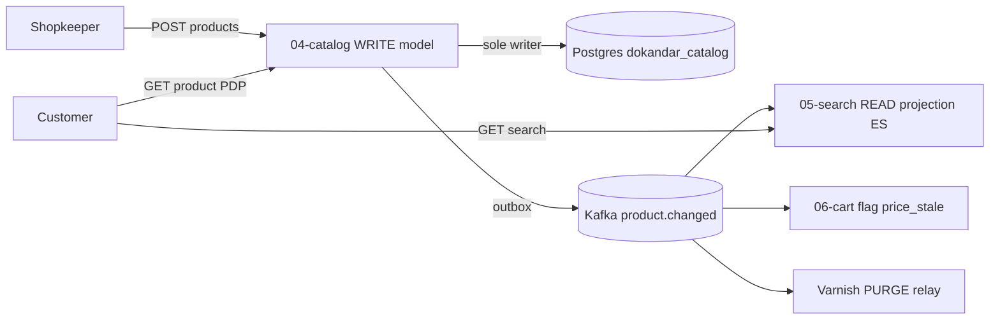
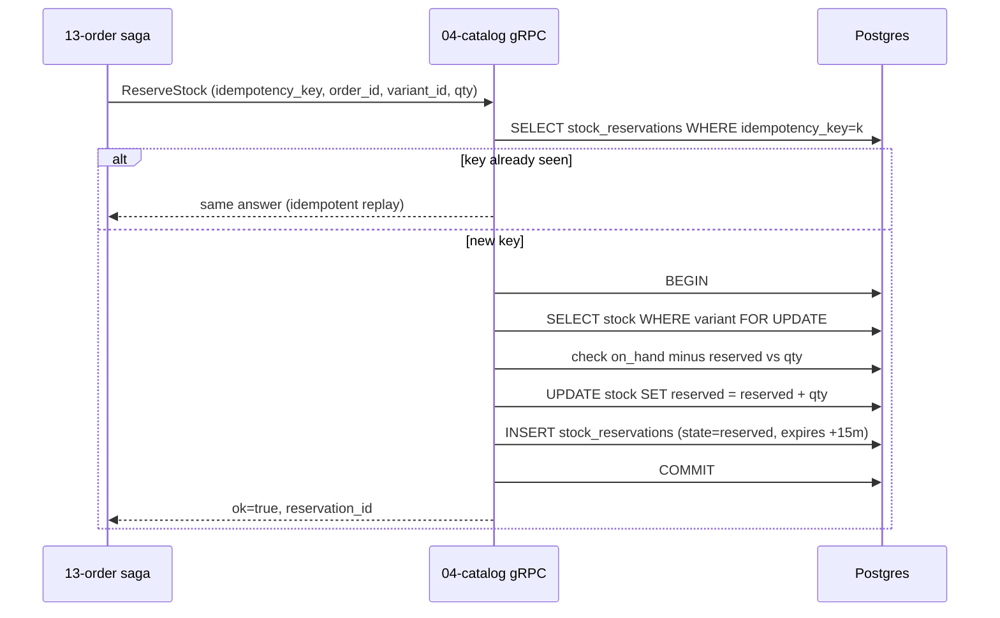

# `04-catalog` — Product Graph · Service Architecture

> **Scope.** Implementation-grade architecture for the DOKANDAR **`04-catalog`** service — the CQRS **write
> model** and source of truth for the product graph + multi-level stock. Authoritative spec:
> [`../../architecture.md`](../../architecture.md) §9 (the `04-catalog` entry) + §10–§14 (the operational
> contract) + §21 (the event/gRPC anchor); [`../../README.md`](../../README.md) §6/§7/§8/§10;
> [`../../SERVICE_INTEGRATION_TEMPLATE.md`](../../SERVICE_INTEGRATION_TEMPLATE.md) (Appendix **A.5
> Java/Spring**). **On any conflict the README wins — re-verify.**
>
> **Grounding, not copying.** The deployed reference at `~/Desktop/DevOps/04-catalog` is written in **Go**
> (chi/pgx) — it is read here only for **contract behaviour** (the endpoints, the stock-reservation logic, the
> gRPC proto, the schema, the events). This doc is written to the **spec target language, Java 25 / Spring
> Boot 4.0** (springdoc reflection OpenAPI, `-javaagent` APM, JPA) — Java-specific mechanics are spec-derived
> (no Go `file:line` is attached to a Java claim). The service's code does not exist yet; this is the build
> contract.

| | |
| --- | --- |
| **Service** | `04-catalog` |
| **Domain** | Commerce Core — the product graph (CQRS write side) |
| **Language · framework** | Java 25 · Spring Boot 4.0 (JPA/Hibernate, springdoc, gRPC) |
| **`SERVICE_PORT`** | `8080` (REST) · gRPC `9090` |
| **External ports** | REST `10004` · gRPC `20004` |
| **Datastores** | PostgreSQL `dokandar_catalog_<env>` (sole writer) · Redis **DB 3** (hot read cache) |
| **`/ready` hard-gate** | **PostgreSQL only** (Redis-down → serve from PG, degraded) |
| **gRPC server** | `Catalog.GetProduct \| CheckStock \| ReserveStock \| ReleaseStock` @ `9090` |
| **Emits (Kafka)** | `dokandar.product.changed`, `dokandar.category.changed`, `dokandar.stock.low` (outbox) |
| **Consumes (Kafka)** | none (the `shop.changed` consumer is deferred) |
| **RabbitMQ / NATS** | none |
| **`service_name` (identity)** | `04-catalog` — from `SERVICE_NAME`, used **identically** everywhere |

**Contents.** §1 Role · §2 Position · §3 Data (incl. §3.3 stock model) · §4 Domain flows · §5 REST map ·
§6 OpenAPI/Swagger surface · §7 gRPC (first-class) · §8 The five ops endpoints · §9 TENANT/`/data`/env ·
§10 Eventing · §11 Logging & observability · §12 Security · §13 Resilience · §14 Boot & lifecycle ·
§15 Deployment · §16 Stack landmines · §17 Design decisions · §18 Build status.

---

## 1. Role & bounded context

`04-catalog` is the **CQRS write model** for everything sellable: the product graph and the authoritative
stock ledger. It is the sole writer of its database and the **root of the commerce read DAG** — it calls no
other service's gRPC; Cart and Order call **it** during checkout.

**Responsibilities**

- **Product graph** — categories (self-referential tree), bilingual products (`name_bn`/`name_en`), variants
  (attribute maps), per-shop listings, and image references (S3 keys issued by `12-media`).
- **Multi-level stock** — `shared` (one pool across all shops) vs `per_shop_copy` (one pool per shop) — the
  grocery-vs-fashion split common in Bangladesh.
- **Idempotent stock reservation/release** — the gRPC operations Order's checkout saga depends on, with a
  `UNIQUE idempotency_key` and a 15-minute reservation expiry.
- **Money & i18n correctness** — prices stored as integer **minor units** (`INT4`); the bilingual invariant
  (at least one of `name_bn`/`name_en`) enforced at the DB and the boundary.

**Explicitly NOT in scope**: search indexing + faceting + "near me" (`05-search`, the CQRS **read** side that
projects `product.changed`); shop identity/lifecycle (`03-seller`); pricing promotions/coupons (`07-coupon`);
order state (`13-order`). Catalog owns the *write* truth; everything else reads a projection or calls gRPC.

---

## 2. Position in the platform

```
        15-api-gateway ──/api/v1/catalog/*──► 04-catalog (Java 25 / Spring Boot 4)
                                                REST :8080  ·  gRPC :9090
                                                     │
        06-cart ───gRPC Catalog.CheckStock──────────►│   (quote build, <100ms)
        13-order ──gRPC ReserveStock / ReleaseStock─►│   (checkout saga + compensation)
                                                     │
                       sole writer ────────────────► Postgres dokandar_catalog_<env> (+ outbox)
                       hot read cache ─────────────► Redis DB 3  product:<id> / listing:<shop>
                       outbox relay ───────────────► Kafka  product.changed · category.changed · stock.low
                       logs ───────────────────────► stdout (JSON) + Mongo + Elasticsearch ; traces ► Elastic APM
                                                     │
        consumers of product.changed: ──────────────┘
          05-search (index) · 06-cart (flag price_stale) · 11-reporting · Varnish PURGE relay
```

Catalog is the **producer apex of the commerce read DAG**: it emits the rich `product.changed` event that
`05-search` projects into Elasticsearch, that `06-cart` uses to flag stale cart lines, and that the Varnish
PURGE relay uses to invalidate edge-cached PDPs.

---

## 3. Data architecture

### 3.1 PostgreSQL — `dokandar_catalog_<env>` (sole writer)

Extensions: `pgcrypto` (`gen_random_uuid()`), `pg_trgm` (GIN trigram index for the in-service fuzzy fallback —
the authoritative search lives in `05-search`). Cross-service references (`owner_id` = auth user, `shop_id` =
shop) store **opaque ids with no FK** — consistency is asynchronous.

```sql
CREATE EXTENSION IF NOT EXISTS pgcrypto;
CREATE EXTENSION IF NOT EXISTS pg_trgm;

CREATE TABLE product_categories (
  id         uuid PRIMARY KEY DEFAULT gen_random_uuid(),
  name_bn    varchar(80) NOT NULL,
  name_en    varchar(80) NOT NULL,
  parent_id  uuid REFERENCES product_categories(id),     -- self-referential tree
  defined_by varchar(20) NOT NULL,                        -- 'admin' | 'shopkeeper' | 'shop_staff'
  owner_id   uuid,                                        -- non-null when defined_by != 'admin'
  created_at timestamptz NOT NULL DEFAULT now()
);
CREATE INDEX idx_product_cat_parent ON product_categories(parent_id);

CREATE TABLE products (
  id               uuid PRIMARY KEY DEFAULT gen_random_uuid(),
  owner_id         uuid NOT NULL,                          -- shopkeeper user_id (from auth, NO FK)
  name_bn          varchar(255),
  name_en          varchar(255),
  description_bn   text,
  description_en   text,
  brand            varchar(80),
  sku              varchar(120),
  category_id      uuid REFERENCES product_categories(id),
  sharing_model    varchar(20) NOT NULL DEFAULT 'shared',  -- 'shared' | 'per_shop_copy'
  list_price_minor int NOT NULL,                           -- integer minor units (paisa)
  sale_price_minor int,
  backorderable    boolean NOT NULL DEFAULT true,
  status           varchar(20) NOT NULL DEFAULT 'draft',   -- draft|active|hidden|deleted
  created_at       timestamptz NOT NULL DEFAULT now(),
  updated_at       timestamptz NOT NULL DEFAULT now(),
  CHECK (name_bn IS NOT NULL OR name_en IS NOT NULL)       -- bilingual invariant
);
CREATE INDEX idx_products_owner   ON products(owner_id);
CREATE INDEX idx_products_status  ON products(status) WHERE status='active';
CREATE INDEX idx_products_name_bn ON products USING gin (name_bn gin_trgm_ops);
CREATE INDEX idx_products_name_en ON products USING gin (name_en gin_trgm_ops);

CREATE TABLE product_variants (
  id               uuid PRIMARY KEY DEFAULT gen_random_uuid(),
  product_id       uuid NOT NULL REFERENCES products(id) ON DELETE CASCADE,
  name_bn          varchar(120),
  name_en          varchar(120),
  attributes       jsonb,                                  -- {size, colour, weight, …}
  list_price_minor int NOT NULL,
  sale_price_minor int,
  sku              varchar(120),
  created_at       timestamptz NOT NULL DEFAULT now(),
  updated_at       timestamptz NOT NULL DEFAULT now()
);
CREATE INDEX idx_variants_product ON product_variants(product_id);

CREATE TABLE product_listings (
  id         uuid PRIMARY KEY DEFAULT gen_random_uuid(),
  product_id uuid NOT NULL REFERENCES products(id) ON DELETE CASCADE,
  shop_id    uuid NOT NULL,                                -- no cross-service FK
  visible    boolean NOT NULL DEFAULT true,
  created_at timestamptz NOT NULL DEFAULT now(),
  UNIQUE (product_id, shop_id)
);
CREATE INDEX idx_listings_shop ON product_listings(shop_id) WHERE visible=true;

CREATE TABLE product_images (
  id         uuid PRIMARY KEY DEFAULT gen_random_uuid(),
  product_id uuid NOT NULL REFERENCES products(id) ON DELETE CASCADE,
  variant_id uuid REFERENCES product_variants(id) ON DELETE CASCADE,
  s3_key     varchar(255) NOT NULL,                        -- issued by 12-media
  position   int NOT NULL DEFAULT 0,
  created_at timestamptz NOT NULL DEFAULT now()
);

CREATE TABLE outbox (
  id         bigserial PRIMARY KEY,
  topic      varchar(120) NOT NULL,
  key        varchar(120),                                 -- partition key = product id
  payload    jsonb NOT NULL,
  created_at timestamptz NOT NULL DEFAULT now(),
  sent_at    timestamptz
);
CREATE INDEX idx_outbox_pending ON outbox(created_at) WHERE sent_at IS NULL;
```

### 3.2 Redis — DB 3 (hot read cache, degradable)

| Key | Value | TTL | Invalidation |
| --- | --- | --- | --- |
| `product:<id>` | serialized product + variants | `CATALOG_CACHE_TTL=300s` | on `product.changed` |
| `listing:<shop_id>` | a shop's visible listing set | 300s | on `product.changed` / listing edit |
| `stock:<variant_id>:<shop_id>` | available count | `STOCK_CACHE_TTL=30s` | on every reserve/release |

Cache-aside; a miss (or a Redis outage) reads Postgres. Redis therefore **does not gate `/ready`** (§8.1) — a
Redis-down node keeps serving from PG with a degraded warning.

### 3.3 The stock model (the load-bearing subsection)

Stock is **multi-level**: a variant is either `shared` (one pool, `shop_id IS NULL`) or `per_shop_copy` (one
pool per shop). The `UNIQUE` must be an **expression index** because `NULL` is not comparable — a `COALESCE`
sentinel collapses the shared pool to a fixed UUID:

```sql
CREATE TABLE stock (
  id            uuid PRIMARY KEY DEFAULT gen_random_uuid(),
  variant_id    uuid NOT NULL REFERENCES product_variants(id) ON DELETE CASCADE,
  shop_id       uuid,                                       -- NULL = shared pool
  on_hand       int NOT NULL DEFAULT 0,
  reserved      int NOT NULL DEFAULT 0,
  low_threshold int NOT NULL DEFAULT 5,
  updated_at    timestamptz NOT NULL DEFAULT now()
);
-- exactly one shared row OR one row per shop, per variant
CREATE UNIQUE INDEX uniq_stock_variant_shop
  ON stock (variant_id, COALESCE(shop_id, '00000000-0000-0000-0000-000000000000'::uuid));
CREATE INDEX idx_stock_variant ON stock(variant_id);

-- idempotent reservation ledger (the gRPC ReserveStock target)
CREATE TABLE stock_reservations (
  id              uuid PRIMARY KEY DEFAULT gen_random_uuid(),
  idempotency_key varchar(120) NOT NULL UNIQUE,            -- the idempotency fence
  order_id        uuid NOT NULL,
  variant_id      uuid NOT NULL,
  shop_id         uuid,
  quantity        int NOT NULL,
  backordered     boolean NOT NULL DEFAULT false,
  state           varchar(20) NOT NULL DEFAULT 'reserved', -- reserved|released|committed
  created_at      timestamptz NOT NULL DEFAULT now(),
  expires_at      timestamptz NOT NULL DEFAULT now() + INTERVAL '15 minutes'
);
CREATE INDEX idx_reservations_order  ON stock_reservations(order_id);
CREATE INDEX idx_reservations_expiry ON stock_reservations(expires_at) WHERE state='reserved';
```

**Availability** = `on_hand − reserved` (a reservation holds `reserved`, it does not decrement `on_hand` until
commit). **Concurrency** uses Postgres **`SELECT … FOR UPDATE`** row locks on the `stock` row — **not** Redis
Redlock (the row lock is the serialization point; Redis is only a read cache). A sweeper releases
`reserved`-state rows past `expires_at` so an abandoned checkout returns stock. See §7.3 for the reserve chain.

---

## 4. Domain flows

### 4.1 CQRS position — write here, read in 05-search



### 4.2 Reserve stock during checkout (the gRPC hot path)



On saga failure, `13-order` calls `ReleaseStock(reservation_id)` (the compensation): the row flips to
`released` and `reserved` is decremented. On payment success the reservation is `committed` and `on_hand` is
finally decremented.

---

## 5. Synchronous REST API map

All routes under **`/api/v1/catalog/*`**. Pretty JSON (`indent=2`, `ensure_ascii=false`, trailing newline)
except `/metrics` (text), `/openapi.json` (compact), `/docs` (HTML). `{id}`/`{variant_id}` are validated as
UUIDs at the boundary (a malformed id → `400`/`404`, never a raw `22P02` 500). Money is integer **minor
units**; a value above `INT4` max (`2147483647`) is rejected `422` before it can overflow the column.

| Method | Path | Auth | Purpose |
| --- | --- | --- | --- |
| `GET` | `/api/v1/catalog/products` | public | list/browse products (paged) |
| `GET` | `/api/v1/catalog/products/{id}` | public | product detail (+ variants) |
| `GET` | `/api/v1/catalog/categories/tree` | public | category tree |
| `POST` | `/api/v1/catalog/products` | Bearer | create product (`shopkeeper`/`shop_staff`/`admin`) |
| `PUT` | `/api/v1/catalog/products/{id}` | Bearer | update product (owner/admin) |
| `DELETE` | `/api/v1/catalog/products/{id}` | Bearer | soft-delete (`status=deleted`) |
| `POST` | `/api/v1/catalog/products/{id}/variants` | Bearer | add a variant |
| `DELETE` | `/api/v1/catalog/products/{id}/variants/{vid}` | Bearer | remove a variant |
| `POST` | `/api/v1/catalog/products/{id}/list-in-shop` | Bearer | publish a listing in a shop |
| `PUT` | `/api/v1/catalog/stock/{variant_id}` | Bearer | set on-hand / threshold |
| `POST` | `/api/v1/catalog/categories` | Bearer | create a category |

> **Reconciliation (§16-h).** The Go reference exposes flat `GET /categories`; the spec (§9) mandates
> `GET /categories/tree` — build the **tree** form.

---

## 6. The OpenAPI / Swagger surface

`04-catalog` is a **reflection-OpenAPI** stack (Java/**springdoc**), unlike the hand-written Go/PHP services:
springdoc scans the `@RestController` annotations to build the document, so there is **no hand-written
`paths[]` map and no route-vs-spec CI diff** — drift is structurally impossible because the spec is generated
from the served handlers. `springdoc.api-docs.path=/openapi.json` and `springdoc.swagger-ui.path=/docs` map the
contract paths onto springdoc's defaults.

### 6.1 The OpenAPI `@Bean` (info + security + dynamic version)

A single `@Bean OpenAPI` supplies the non-reflectable parts:

```java
@Bean
OpenAPI catalogOpenAPI() {
  return new OpenAPI()
    .info(new Info()
      .title("DOKANDAR Catalog Service")
      .version(readCodeVersion())                 // = 04-catalog, from the CODE_VERSION file
      .description(IDENTITY_BANNER + HOW_TO_TEST)) // service_name · code_version · env_version · tenant · env
    .components(new Components().addSecuritySchemes("HTTPBearer",
      new SecurityScheme().type(HTTP).scheme("bearer").bearerFormat("JWT")));
}
```

`readCodeVersion()` reads the repo-root `CODE_VERSION` **dynamically** (a hard-coded version drifts) — the
Java landmine in §16-d.

### 6.2 Validation (jakarta annotations → 422)

DTOs carry `jakarta.validation` constraints; a violation is mapped by an `@RestControllerAdvice` to the
platform error envelope (`422 validation_error` with a `details[]` of `{field, issue}`). The exact rules from
the contract:

| Rule | Annotation | Failure |
| --- | --- | --- |
| `name_bn` **or** `name_en` required | class-level `@AtLeastOne` | `422 validation_error` · `field=name_bn, issue=at_least_one_required` |
| `list_price_minor` 0..2147483647 | `@NotNull @Min(0) @Max(2147483647)` | `422 validation_error` (boundary reject — never overflow `INT4`) |
| `sale_price_minor` 0..2147483647 | `@Min(0) @Max(2147483647)` | `422 validation_error` |
| `sharing_model` ∈ {shared, per_shop_copy} | `@Pattern` / enum | `422 validation_error` |
| role ∈ {shopkeeper, shop_staff, admin} | method security | `403 insufficient_role` |

### 6.3 Schema catalog

| Schema | Required | Notable rules |
| --- | --- | --- |
| **`ProductCreate`** | one of `name_bn`/`name_en`, `list_price_minor` | `sharing_model` enum (default `shared`); `backorderable` default `true`; `sale_price_minor` optional; `category_id` uuid; `list_in_shops[]` of shop uuids |
| **`ProductUpdate`** | — | same fields optional; `status` enum `draft\|active\|hidden\|deleted` |
| **`VariantCreate`** | `list_price_minor` | `attributes` free-form object; bilingual `name_bn`/`name_en` |
| **`ListInShop`** | `shop_id` | publishes a listing (idempotent on `UNIQUE(product_id, shop_id)`) |
| **`StockSet`** | `on_hand` | `low_threshold` optional; `shop_id` for `per_shop_copy` |
| **`CategoryCreate`** | `name_bn`, `name_en` | `parent_id` uuid; `defined_by` derived from the caller role |
| **`ErrorEnvelope`** | — | `error: { code, message, request_id, details? }` |

```jsonc
// ProductCreate — the prefilled "Try it out" example
{
  "name_bn": "প্রিমিয়াম চাল ৫ কেজি", "name_en": "Premium Rice 5kg",
  "description_en": "Aromatic miniket rice", "brand": "ACI", "sku": "RICE-5KG-01",
  "category_id": "11111111-1111-4111-8111-111111111111",
  "sharing_model": "shared", "list_price_minor": 62000, "sale_price_minor": 58000,
  "backorderable": true, "list_in_shops": ["22222222-2222-4222-8222-222222222222"]
}
```

### 6.4 Per-operation responses

| Operation | Success | Error responses |
| --- | --- | --- |
| `GET /products` · `/products/{id}` | `200` | `404 product_not_found` |
| `GET /categories/tree` | `200 {tree:[…]}` | — (public) |
| `POST /products` | `201` created (`status=draft`) | `401` · `403 insufficient_role` · `422 validation_error` |
| `PUT /products/{id}` | `200` updated | `401` · `403 not_owner` · `404 product_not_found` · `422 validation_error` |
| `DELETE /products/{id}` | `204` (soft delete) | `401` · `403 not_owner` · `404 product_not_found` |
| `POST /products/{id}/variants` | `201` variant | `401` · `403 not_owner` · `404 product_not_found` · `422 validation_error` |
| `POST /products/{id}/list-in-shop` | `201` listing | `401` · `403 not_owner` · `404 product_not_found` · `409 already_listed` |
| `PUT /stock/{variant_id}` | `200` stock | `401` · `403 not_owner` · `404 variant_not_found` · `422 validation_error` |
| `POST /categories` | `201` created | `401` · `403 insufficient_role` · `422 validation_error` |

The `Authorize` button is driven by the `HTTPBearer` scheme; public reads omit `security` so they run without a
token; the `info.description` carries the identity banner + How-to-test.

---

## 7. gRPC — the checkout-critical east-west API

gRPC is **first-class** for `04-catalog` (unlike most services): it *serves* the product + stock API that the
checkout hot path depends on. The server listens on **`9090`** (external `20004`).

### 7.1 The proto

```proto
service Catalog {
  rpc GetProduct   (GetProductRequest)   returns (Product);
  rpc CheckStock   (CheckStockRequest)   returns (StockAnswer);
  rpc ReserveStock (ReserveStockRequest) returns (ReserveStockAnswer);
  rpc ReleaseStock (ReleaseStockRequest) returns (ReleaseStockAnswer);
}
message CheckStockRequest   { string variant_id = 1; string shop_id = 2; int32 quantity = 3; }  // shop_id "" = shared
message StockAnswer         { bool sufficient = 1; bool backorderable = 2; int32 available = 3; }
message ReserveStockRequest { string idempotency_key = 1; string order_id = 2; string variant_id = 3;
                              string shop_id = 4; int32 quantity = 5; }                          // idempotency_key REQUIRED
message ReserveStockAnswer  { bool ok = 1; string error_code = 2; string reservation_id = 3; bool backordered = 4; }
message ReleaseStockRequest { string reservation_id = 1; }
message ReleaseStockAnswer  { bool ok = 1; }
```

`Product`/`Variant` carry bilingual `name_bn`/`name_en`, `sharing_model`, integer `list_price_minor`/
`sale_price_minor`, `backorderable`, and the variant `attributes` map.

### 7.2 Callers

| RPC | Caller | When |
| --- | --- | --- |
| `CheckStock` | `06-cart` | checkout-package quote build (must answer `<100ms`) |
| `ReserveStock` | `13-order` | the checkout saga's first step (after coupon validate) |
| `ReleaseStock` | `13-order` | saga **compensation** when a later step fails |
| `GetProduct` | `06-cart` / `13-order` | line snapshot at quote/place time |

### 7.3 ReserveStock idempotency chain (the correctness core)

Three guarantees compose so a retried saga never double-reserves:

1. **Proto `idempotency_key` is REQUIRED** — the caller (`13-order`) sends a deterministic key per
   `(order_id, variant_id)`.
2. **`stock_reservations.idempotency_key` is `UNIQUE`** — a second reserve with the same key returns the
   **original** answer (read-back), never a second decrement.
3. **15-minute `expires_at` + a sweeper** — an abandoned reservation auto-releases so stock is not held
   forever; `state` walks `reserved → released | committed`.

The decrement itself runs under `SELECT … FOR UPDATE` on the `stock` row (§3.3) inside one transaction, so
concurrent reserves on the same variant serialize correctly.

### 7.4 Auth on the wire

Every RPC requires `x-internal-token` metadata equal to `INTERNAL_SERVICE_TOKEN`; a mismatch →
`UNAUTHENTICATED`. The comparison is **constant-time** (`MessageDigest.isEqual`, never `==`/`String.equals`).
A dedicated HTTP/2 listener serves gRPC; the REST `8080` and gRPC `9090` ports are separate.

---

## 8. The five operational endpoints

Byte-identical across the fleet; rendered through a pretty-JSON writer (2-space indent, unescaped
unicode/slashes, trailing newline) except `/metrics`. Shared **identity block**:

```jsonc
"identity": {
  "service_name": "04-catalog",    // from SERVICE_NAME, fail-fast if empty
  "code_version": "04-catalog",    // repo-root CODE_VERSION, read once at boot
  "env_version":  "v1.0.0",
  "tenant":       "cloud",
  "env":          "prod",
  "uptime_seconds": 4213
}
```

### 8.1 `GET /ready` — traffic gating (PostgreSQL only)

Probes **only** what the service cannot serve a single request without: **PostgreSQL**. Redis DB 3 is a
degradable read cache, so it is **not** gated (a miss reads PG). `200`/`503`. Excluded from access log + sinks.

```jsonc
{ "status": "ready", "identity": { … }, "dependencies": [ { "name": "postgres", "reachable": true, "latency_ms": 1.1 } ] }
```

> **Spec correction (§16-a).** The Go reference probes postgres **and** redis on `/ready` (`503` if Redis is
> down) — that over-gates a degradable cache. Spec §292 is explicit: *"If Redis is down, serve from Postgres
> with a degraded-cache warning — do NOT fail readiness."* Gate **postgres only**.

### 8.2 `GET /health` — full diagnostics

Identity + all dependencies (core + diagnostic) + an `observability` block. Healthy iff every **core** dep is
ok; `grpc_media` is diagnostic and never flips the status.

```jsonc
{
  "status": "healthy",
  "identity": { … },
  "checks": {
    "postgres":   { "ok": true,  "detail": "ok" },
    "redis":      { "ok": true,  "detail": "PONG" },
    "kafka":      { "ok": true,  "detail": "metadata-ok" },
    "mongo_logs": { "ok": true,  "detail": "ping-ok" },
    "apm":        { "ok": true,  "detail": "apm-host:8200 tcp-ok" },
    "grpc_media": { "ok": false, "detail": "not_configured" }            // diagnostic only
  },
  "observability": {
    "apm_service_name": "04-catalog",
    "apm_server_url":   "http://apm-host:8200",
    "logs_sink_mongo":  "mongodb://…/mongo_db_dokandar_application_logs.04-catalog",
    "logs_sink_es":     "http://es-host:9200/logs-app-04-catalog-*"
  }
}
```

Each check runs in an APM span (`dep.postgres`, `dep.redis`, …) with the destination service set so the APM
Service Map draws the edges. `grpc_media` is a TCP-reachability probe of `MEDIA_GRPC_ADDR` (`not_configured`
when unset) — a latent dependency for a future product-image presign route, diagnostic only.

### 8.3 `GET /data` — TENANT snapshot

Reads `data/<TENANT>/result.json` (bind-mounted read-only at `/app/data`), prepends identity, returns it.
`404 no_snapshot` if absent; `500 snapshot_parse_failed` on invalid JSON. Produced offline by
`data/<tenant>/collect.sh`; the service never writes it.

### 8.4 `GET /metrics` — Prometheus exposition

`text/plain; version=0.0.4` via Micrometer's Prometheus registry (mapped from `/actuator/prometheus` to
`/metrics`). RED + business + the mandatory outbox gauge; **closed-set labels** (never `user_id`); every
series carries `service="04-catalog"`.

```
http_requests_total{service="04-catalog",method="POST",route="/api/v1/catalog/products",status="201"}  …
http_request_duration_seconds_bucket{service="04-catalog",method="GET",route="/api/v1/catalog/products/{id}",le="0.1"}  …
catalog_stock_reservations_total{service="04-catalog",result="ok"}   …
catalog_outbox_pending{service="04-catalog"}                          …   # mandatory, recomputed on scrape
```

> **Spec correction (§16-b).** Normalize the outbox gauge to **`catalog_outbox_pending`** (the metric name
> prefix is `catalog_`; the `service` **label value** is the full `04-catalog`). `route` is the **templated**
> path, never the raw URL.

### 8.5 `GET /docs` & `GET /openapi.json`

`/docs` = Swagger UI (titled **DOKANDAR Catalog Service**) with the `Authorize` button, reachable without a
Bearer; `/openapi.json` is the compact springdoc document (§6). Unmapped paths → **bare 404**
(`Content-Length: 0`, empty body, no `Content-Type`); method typos to known paths → structured
`405 method_not_allowed`.

---

## 9. TENANT, `/data` & the env-render contract

**12-factor:** one immutable image; all config injected via `--env-file`. `TENANT` is read once at boot and
threads into identity, `/data`'s path, and APM labels. Rendered by `env/init-env.sh` into the gitignored
`env/.env.<env>` (Java additionally emits `application-<env>.properties`).

```ini
# ── Application ────────────────────────────────────────────────────────────
APP_ENV=prod                      # dev | stage | prod
SERVICE_NAME=04-catalog           # identity everywhere — FAIL FAST at boot if empty
ENV_VERSION=v1.0.0
TENANT=cloud
SERVICE_PORT=8080                 # REST (normalized from the Go MVP's 8000)
GRPC_PORT=9090                    # gRPC (normalized from the MVP's 8001)
GRPC_ENABLED=true

# ── PostgreSQL ─────────────────────────────────────────────────────────────
POSTGRES_HOST=<INFRA_HOST>
POSTGRES_PORT=<PG_PORT>
POSTGRES_USER=<PG_USER>
POSTGRES_PASSWORD=<PG_PASS>
POSTGRES_DB=dokandar_catalog_prod
POSTGRES_DSN=postgres://<PG_USER>:<PG_PASS>@<INFRA_HOST>:5432/dokandar_catalog_prod?sslmode=require
POSTGRES_ADMIN_DSN=postgres://<PG_USER>:<PG_PASS>@<INFRA_HOST>:5432/postgres?sslmode=require  # ensure-db

# ── Redis (DB 3 read cache) ────────────────────────────────────────────────
REDIS_HOST=<INFRA_HOST>
REDIS_PORT=<REDIS_PORT>
REDIS_PASSWORD=<REDIS_PASS>
REDIS_DB=3
CATALOG_CACHE_TTL_SECONDS=300
STOCK_CACHE_TTL_SECONDS=30
STOCK_RESERVATION_TTL_MINUTES=15

# ── Kafka (emit-only) ──────────────────────────────────────────────────────
KAFKA_BOOTSTRAP=<KAFKA_EXTERNAL>
KAFKA_TOPIC_PRODUCT_CHANGED=dokandar.product.changed
KAFKA_TOPIC_CATEGORY_CHANGED=dokandar.category.changed
KAFKA_TOPIC_STOCK_LOW=dokandar.stock.low

# ── Observability ──────────────────────────────────────────────────────────
MONGO_LOG_URI=<MONGO_URI>
MONGO_LOG_DB=mongo_db_dokandar_application_logs       # collection = 04-catalog
ELASTIC_SEARCH_URL=<ES_URL>
ELASTIC_SEARCH_USERNAME=<ES_USER>
ELASTIC_SEARCH_PASSWORD=<ES_PASS>
APM_SERVER_URL=<APM_URL>
APM_SECRET_TOKEN=<APM_BEARER>
APM_SERVICE_NAME=04-catalog                           # normalized from the MVP's 'catalog'
ELASTIC_APM_SERVICE_VERSION=04-catalog                # wire it (§16-e)

# ── JWT (verify-only) + east-west ──────────────────────────────────────────
JWT_PUBLIC_KEY_B64=<JWT_PUBLIC>   # auth's PUBLIC key only — FAIL FAST under stage/prod if empty
JWT_ISSUER=dokandar-auth
INTERNAL_SERVICE_TOKEN=<INTERNAL_TOKEN>               # FAIL FAST under stage/prod if empty; constant-time compare
MEDIA_GRPC_ADDR=<MEDIA_HOST>:50051                    # diagnostic on /health only
```

**Fail-fast:** abort at boot if `SERVICE_NAME` is empty (always), or if `JWT_PUBLIC_KEY_B64` /
`INTERNAL_SERVICE_TOKEN` is empty when `APP_ENV ∈ {stage, prod}`.

---

## 10. Eventing

**Emit-only** (no consumer). Three topics, all via the transactional outbox (business row + outbox row in one
JPA transaction; the relay publishes with `acks=all`):

| Topic | When | Key | Payload |
| --- | --- | --- | --- |
| `dokandar.product.changed` | product/variant/listing create/update/delete | `product_id` | rich product snapshot (drives `05-search` + Varnish PURGE + cart `price_stale`) |
| `dokandar.category.changed` | category create/update | `category_id` | category node |
| `dokandar.stock.low` | `on_hand − reserved` crosses `low_threshold` | `variant_id` | low-stock alert (shopkeeper notification) |

A background relay polls `WHERE sent_at IS NULL ORDER BY id LIMIT 100 FOR UPDATE SKIP LOCKED`, writes with
`RequireAll` acks (hash-partitioned by key), then stamps `sent_at`; `catalog_outbox_pending` exposes relay lag.
Catalog **consumes nothing** (spec §289) — the `shop.changed` consumer is deferred until a downstream effect
(e.g. auto-hiding a suspended shop's listings) needs it.

> **Spec note (§16-c).** The Go reference relay does not show `FOR UPDATE SKIP LOCKED` in the relay loop (it
> relies on a single relay); build the spec form with `FOR UPDATE SKIP LOCKED` so multiple replicas are safe.

---

## 11. Application logging & observability

### 11.1 Three non-blocking log sinks

| Sink | Destination | Shape |
| --- | --- | --- |
| **stdout** | container stdout | pretty JSON — `asctime · name · levelname · message · trace ids · extras` |
| **MongoDB** | `mongo_db_dokandar_application_logs.04-catalog` | same canonical doc |
| **Elasticsearch** | `logs-app-04-catalog-*` (ECS, `_bulk`) | `@timestamp · log.level · message · service.name=04-catalog · trace.id · transaction.id` |

Both durable sinks are fire-and-forget with bounded timeouts and self-disable on first failure; a slow sink
**drops** lines, never back-pressures the request. Every line carries the APM `trace_id`/`transaction_id` for
the join.

> **Java landmine (§16-f).** When bulk-indexing into Elasticsearch, **strip Mongo's `_id`** from the document
> before the `_bulk` POST (an ObjectId leaks an un-mappable field and breaks the bulk).

### 11.2 Access log & the probe rule

One uvicorn-style access line per genuine request to stdout (plain text, not through the logger, not into the
Mongo/ES sinks): true client IP, method, **templated** route (chi `RoutePattern` / Spring `bestMatchingPattern`
— never the raw path), status, latency, `request_id`. `/ready`, `/metrics`, **and `/health`** are excluded.

> **Spec correction (§16-g).** The reference silences only `/ready`+`/metrics`; add `/health` per
> architecture.md §10.2.

### 11.3 Correlation, metrics & APM

`X-Request-Id` is honoured-or-minted, echoed as a header, stamped on every log line + error body; one
error-envelope shape (`{ error: { code, message, request_id, details? } }`). Metrics are Micrometer + a
Prometheus registry (RED + `catalog_*` business counters + `catalog_outbox_pending`). **APM** is the Elastic
**`-javaagent`** attached in the container `ENTRYPOINT` (Family B — agent attach, *not* in-code middleware);
it auto-instruments Spring MVC + JPA + gRPC and is, by construction, the outermost layer. Wire
`ELASTIC_APM_SERVICE_NAME=04-catalog` and `ELASTIC_APM_SERVICE_VERSION` from `CODE_VERSION`.

---

## 12. Security

- **Verify-only RS256.** Catalog never mints tokens. A filter decodes `JWT_PUBLIC_KEY_B64` (auth's **public**
  key) once at boot and verifies every Bearer with the algorithm **pinned to `RS256`** (explicit allowlist —
  never "any alg the JWK supports"), checking `iss`/`exp`/`aud`/`sub`, and places `sub` + `role` on the
  request.
- **Write authorization.** `shopkeeper`/`shop_staff`/`admin` may create/edit products; `403 insufficient_role`
  otherwise; owner-or-admin gates mutate/delete (`403 not_owner`).
- **East-west gRPC.** `x-internal-token` compared in **constant time** (`MessageDigest.isEqual`).
- **Boundary hardening.** UUID-at-the-edge; integer-minor overflow rejected `422`; bare-404 info-hiding; no
  PII beyond opaque ids.

---

## 13. Resilience & failure modes

| Failure | Effect | Mitigation |
| --- | --- | --- |
| Redis DB 3 down | cache misses | **serve from Postgres, degraded warning — `/ready` stays green** (spec §292) |
| Kafka down | events backlog | outbox buffers; `catalog_outbox_pending` climbs; request path unaffected |
| Concurrent reserves on a variant | race on `reserved` | `SELECT … FOR UPDATE` row lock serializes; no Redlock needed |
| Retried `ReserveStock` | risk of double-decrement | `idempotency_key UNIQUE` → original answer replayed |
| Abandoned checkout | stock held | 15-min `expires_at` + sweeper releases `reserved` rows |
| Inbound gRPC slow caller | quote latency | per-RPC deadlines + circuit breakers; `CheckStock` answers `<100ms` |
| `12-media` down | image presign (latent) | `grpc_media` diagnostic only — never gates `/ready`/`/health` |
| Postgres down | cannot serve | `/ready` → `503`, pod out of LB until recovery |

---

## 14. Boot sequence & lifecycle

1. **Read identity** — `SERVICE_NAME`, `CODE_VERSION`, `TENANT`, `ENV_VERSION` once; fail-fast on empty
   `SERVICE_NAME` (always) and on empty `JWT_PUBLIC_KEY_B64`/`INTERNAL_SERVICE_TOKEN` under stage/prod.
2. **ensure-db** — connect via `POSTGRES_ADMIN_DSN` to the admin `postgres` DB, `CREATE DATABASE
   dokandar_catalog_<env>` if absent (name validated).
3. **Flyway migrate** — idempotent versioned DDL (§3). **Java landmine (§16-i):** an
   `EntityManagerFactoryDependsOnPostProcessor` makes the JPA `EntityManagerFactory` **depend on** ensure-db +
   Flyway, so Hibernate never races an un-migrated schema at startup.
4. **Start the gRPC server** on `9090` and the REST server on `8080`.
5. **Launch the outbox relay** (a `@Scheduled`/worker bean).
6. **Serve** — `HEALTHCHECK → /ready`.

Graceful shutdown drains in-flight REST + gRPC and stops the relay. Java 25 / Spring Boot **4.0** (do not
regress to 3.x).

---

## 15. Deployment & runtime

- **Image** — multi-stage (Maven/Gradle build → distroless/slim JRE 25), non-root **uid `10001`**. The Elastic
  APM **`-javaagent`** jar is added to the `ENTRYPOINT` (`java -javaagent:/apm-agent.jar -jar app.jar`).
- **Runtime** — REST `8080`, gRPC `9090` (separate HTTP/2 listener). External LB maps `10004 → 8080`,
  `20004 → 9090`.
- **`HEALTHCHECK`** — `GET /ready` (`--interval=30s --timeout=3s --start-period=40s --retries=3`). The probe
  binary is a tiny native healthcheck (no curl in distroless).
- **Config** — `--env-file` at runtime (+ `application-<env>.properties`); `data/<tenant>/` bind-mounted RO.
- **Scaling** — stateless app tier on HPA-by-CPU/RPS; the hot path is `GetProduct`/`CheckStock`. Read-heavy
  with bursty import writes → scale reads with Postgres **read replicas** + Redis. p99 read ~50 ms (cache-hit);
  `product.changed` partitioned by product id.

---

## 16. Stack landmines & reconciliation

- **(a) `/ready` over-gating** — Go ref probes redis on `/ready`; spec is **postgres-only** (Redis-down serves
  from PG) (§8.1).
- **(b) Metric prefix** — normalize the gauge to **`catalog_outbox_pending`**; the `service` label is the full
  `04-catalog` (§8.4).
- **(c) Outbox relay** — add `FOR UPDATE SKIP LOCKED` for multi-replica safety (§10).
- **(d) springdoc dynamic version** — the OpenAPI `@Bean` must read `CODE_VERSION` at runtime, not hard-code a
  version (§6.1).
- **(e) `ELASTIC_APM_SERVICE_VERSION`** — wire it from `CODE_VERSION` (else the APM service shows an unknown
  version) (§11.3).
- **(f) ES `_bulk` `_id` strip** — strip Mongo's `_id` before bulk-indexing to ES (§11.1).
- **(g) Access-log exclusions** — add `/health` to the `/ready`+`/metrics` exclusion set (§11.2).
- **(h) `/categories/tree`** — build the spec's tree form, not the ref's flat `/categories` (§5).
- **(i) JPA-vs-ensure-db race** — `EntityManagerFactoryDependsOnPostProcessor` so Hibernate waits for
  ensure-db + Flyway (§14).
- **(j) Reference language** — the deployed reference is **Go**, the spec target is **Java/Spring Boot 4**;
  read the Go for contract behaviour only, write the Java idiom (springdoc reflection, `-javaagent`, JPA,
  `MessageDigest.isEqual`). No Go `file:line` attaches to a Java claim.
- **(k) Ports & identity** — normalize REST `8000→8080`, gRPC `8001→9090`, `APM_SERVICE_NAME catalog→04-catalog`,
  `CODE_VERSION 4-catalog→04-catalog`.
- **(l) gRPC h2c listener** — serve gRPC on a dedicated HTTP/2 listener separate from REST `8080` (§7.4).

---

## 17. Design decisions & open items

- **CQRS split** — catalog owns the **write** truth; `05-search` owns the **read** projection. Catalog never
  serves faceted search; it emits the rich `product.changed` that search projects. This keeps the write model
  normalized and the read model denormalized + sharded.
- **Integer minor units** — all money is `INT4` minor units; the boundary rejects `> 2147483647` so a value
  never overflows the column into a raw driver 500.
- **Row locks, not Redlock** — stock concurrency is a single-DB problem; `SELECT … FOR UPDATE` is the correct,
  cheapest serialization. Redis is *only* a read cache.
- **`COALESCE`-sentinel UNIQUE** — lets one expression index enforce "one shared row OR one row per shop"
  without a partial-index pair.
- **Open items** — the deferred `shop.changed` consumer (auto-hide suspended shops' listings); a
  `POST /products/{id}/images` presign route (the latent `grpc_media` dependency); category-tree depth limits.

---

## 18. Build status & cross-references

**Status — specified, not yet implemented.** No code exists; this is the build contract. Reference shape:
`~/Desktop/DevOps/04-catalog` (a **Go** MVP — read for contract behaviour only; the spec target is Java/Spring
Boot 4, §16-j).

**Authoritative sources**

- [`../../architecture.md`](../../architecture.md) — **§9** `04-catalog` in full; **§10–§14** the operational
  contract; **§21** the event/gRPC anchor.
- [`../../README.md`](../../README.md) — §6 service table · §7 ports · §8 version pins · §10 datastore role.
- [`../../SERVICE_INTEGRATION_TEMPLATE.md`](../../SERVICE_INTEGRATION_TEMPLATE.md) — Appendix **A.5 Java/Spring**;
  the Java `-javaagent` / `EntityManagerFactoryDependsOnPostProcessor` / springdoc landmine rows.
- Sibling exemplars: [`../01-auth/architecture.md`](../01-auth/architecture.md) (contract depth),
  [`../02-profile/architecture.md`](../02-profile/architecture.md) (Go reference shape).

**Build checklist** — `Dockerfile` (multi-stage, uid 10001, `-javaagent`, `HEALTHCHECK → /ready`) ·
`env/init-env.sh` + `.env.<env>` + `application-<env>.properties` (fail-fast) · the five endpoints + identity
block + `X-Request-Id` envelope · the gRPC server + proto + constant-time token interceptor · `test.sh` (curl
all five + a gRPC smoke) · `data/<tenant>/result.json` · `OPERATIONS.md` / `SECURITY.md` / `docs/adr/`.
