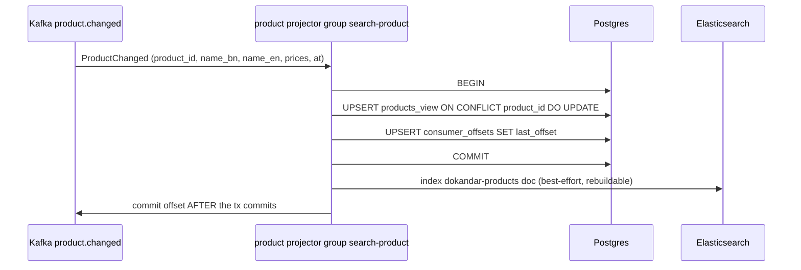
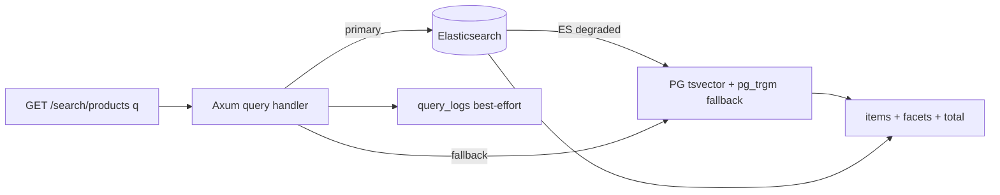

# `05-search` — Discovery · Service Architecture

> **Scope.** Implementation-grade architecture for the DOKANDAR **`05-search`** service — the customer-facing
> **CQRS read projection** (search, browse, autocomplete, "shops near me", trending). Authoritative spec:
> [`../../architecture.md`](../../architecture.md) §9 (`05-search`) + §10–§14 + §21; [`../../README.md`](../../README.md)
> §6/§7/§8/§10; [`../../SERVICE_INTEGRATION_TEMPLATE.md`](../../SERVICE_INTEGRATION_TEMPLATE.md) (Appendix **A.8
> Rust/Axum, target/provisional**). **On any conflict the README wins.**
>
> **Grounding, not copying — and a language gap.** The deployed reference at `~/Desktop/DevOps/05-search` is
> **Python/FastAPI**; the **spec target is Rust 1.96 / Axum + sqlx** (a mid-migration). The Python reference is
> read here for **contract behaviour only** (the projector ingest, the offset-based exactly-once, the FTS query
> shapes); every Rust mechanic below is **spec-extrapolated and marked provisional — there is no Rust
> `file:line`**. The service's code does not exist yet; this is the build contract.

| | |
| --- | --- |
| **Service** | `05-search` |
| **Domain** | Commerce Core — discovery (CQRS read side) |
| **Language · framework** | **Rust 1.96 · Axum + sqlx** *(spec target — provisional)* |
| **`SERVICE_PORT`** | `8080` (REST) · **no gRPC** |
| **External ports** | REST `10005` |
| **Datastores** | PostgreSQL `dokandar_search_<env>` (`*_view` projections) · Elasticsearch 9.4 (`dokandar-products`, `dokandar-shops`) · **No Redis** |
| **`/ready` hard-gate** | **PostgreSQL only** (ES does **not** gate — PG `tsvector`/`pg_trgm` fallback) |
| **Emits (Kafka)** | **nothing** (consumer-only) |
| **Consumes (Kafka)** | `dokandar.product.changed`, `dokandar.shop.changed`, `dokandar.category.changed`, `dokandar.order.placed` |
| **RabbitMQ / NATS** | none |
| **`service_name` (identity)** | `05-search` — from `SERVICE_NAME`, used **identically** everywhere |

**Contents.** §1 Role · §2 Position · §3 Data (projections + FTS/geo) · §4 Domain flows · §5 REST map ·
§6 OpenAPI/Swagger surface · §7 gRPC (none) · §8 The five ops endpoints · §9 TENANT/`/data`/env · §10 Eventing
(consume-only) · §11 Logging & observability · §12 Security · §13 Resilience · §14 Boot & lifecycle ·
§15 Deployment · §16 Stack landmines · §17 Design decisions · §18 Build status.

---

## 1. Role & bounded context

`05-search` is the **read side of the catalog CQRS pair**. It owns no business truth; it **projects** events
from `04-catalog` and `03-seller` into denormalized, query-optimized read models, and serves the customer's
discovery surface. It is **consumer-only** — its sole writers are Kafka projector tasks; no REST/gRPC path ever
writes business data.

**Responsibilities**

- **Bilingual full-text search** — separate Bangla/English `tsvector` columns + ranking, over products + shops.
- **Faceted browse** — category, price (minor units), rating filters with facet counts.
- **"Shops near me"** — geo radius search via `cube`/`earthdistance` (`earth_loc` GiST index).
- **Autocomplete** — prefix + trigram (`pg_trgm`).
- **Trending** — projected from `order.placed` into daily counters.
- **Admin reindex** — rebuild the ES indices / PG views from the source of truth.

**Explicitly NOT in scope**: any write to product/shop/category truth (those live in `04-catalog`/`03-seller`);
search owns only the *projection*. Projection lag is the defining SLO.

---

## 2. Position in the platform

```
   04-catalog ──product.changed──┐
   03-seller  ──shop.changed─────┤   (Kafka)
   04-catalog ──category.changed─┤
   13-order   ──order.placed─────┘
                    │  (consumer-only ingest — 4 projector groups)
                    ▼
   ┌──────────────── 05-search (Rust 1.96 / Axum + sqlx · REST :8080 · no gRPC) ───────────────┐
   │  projectors ──► Postgres dokandar_search_<env>  (*_view tables + consumer_offsets)         │
   │  projectors ──► Elasticsearch  dokandar-products · dokandar-shops                          │
   │  query tier ──► reads ES (primary) with PG tsvector/pg_trgm FALLBACK when ES is degraded    │
   │  logs ───────► stdout (JSON) + Mongo + Elasticsearch ; traces ► OTLP → APM Server           │
   └────────────────────────────────────────────────────────────────────────────────────────────┘
                    ▲
            15-api-gateway ──/api/v1/search/*──► customers (public reads)
```

Search **emits nothing**. Its only inputs are the four Kafka topics; its only outputs are HTTP query
responses. This one-way shape is what lets it scale the query tier and the projector workers independently.

---

## 3. Data architecture

### 3.1 PostgreSQL — `dokandar_search_<env>` (projection store, the cache)

There is **no Redis** (spec §10.4): the `*_view` tables **are** the cache. Extensions: `pg_trgm` (trigram
autocomplete + fuzzy), `cube` + `earthdistance` (geo). All columns are projected from events — none are
authoritative.

```sql
CREATE EXTENSION IF NOT EXISTS pg_trgm;
CREATE EXTENSION IF NOT EXISTS cube;
CREATE EXTENSION IF NOT EXISTS earthdistance;

CREATE TABLE products_view (
  product_id       uuid PRIMARY KEY,
  shop_id          uuid,
  shop_ids         uuid[] NOT NULL DEFAULT '{}',
  owner_id         uuid,
  sharing_model    text NOT NULL DEFAULT 'shared',
  category_id      uuid,
  name_en          text NOT NULL DEFAULT '',
  name_bn          text NOT NULL DEFAULT '',
  slug             text,
  list_price_minor int NOT NULL DEFAULT 0,
  sale_price_minor int,
  rating_avg       numeric(3,2) DEFAULT 0,
  rating_count     int DEFAULT 0,
  in_stock         boolean NOT NULL DEFAULT true,
  is_active        boolean NOT NULL DEFAULT true,
  -- bilingual FTS: English stemming + Bangla 'simple' (no English stemmer for Bangla)
  tsv_en TSVECTOR GENERATED ALWAYS AS (setweight(to_tsvector('english', coalesce(name_en,'')),'A')) STORED,
  tsv_bn TSVECTOR GENERATED ALWAYS AS (setweight(to_tsvector('simple',  coalesce(name_bn,'')),'A')) STORED,
  updated_at       timestamptz NOT NULL DEFAULT now()
);
CREATE INDEX products_view_tsv_en      ON products_view USING GIN(tsv_en);
CREATE INDEX products_view_tsv_bn      ON products_view USING GIN(tsv_bn);
CREATE INDEX products_view_name_en_trgm ON products_view USING GIN(name_en gin_trgm_ops);
CREATE INDEX products_view_name_bn_trgm ON products_view USING GIN(name_bn gin_trgm_ops);
CREATE INDEX products_view_price       ON products_view(coalesce(sale_price_minor, list_price_minor));
CREATE INDEX products_view_active      ON products_view(is_active) WHERE is_active = true;

CREATE TABLE product_variants_view (
  variant_id uuid PRIMARY KEY,
  product_id uuid NOT NULL REFERENCES products_view(product_id) ON DELETE CASCADE,
  sku text, list_price_minor int, available_qty int NOT NULL DEFAULT 0,
  updated_at timestamptz NOT NULL DEFAULT now()
);

CREATE TABLE shops_view (
  shop_id       uuid PRIMARY KEY,
  owner_id      uuid,
  handle        text UNIQUE NOT NULL,
  name_en       text NOT NULL DEFAULT '',
  name_bn       text NOT NULL DEFAULT '',
  description   text,
  category_id   uuid,
  division_code text, district_code text, upazila_code text, union_code text,
  lat double precision, lng double precision,
  earth_loc EARTH GENERATED ALWAYS AS (ll_to_earth(lat, lng)) STORED,   -- geo "near me"
  open_now     boolean NOT NULL DEFAULT true,
  rating_avg   numeric(3,2) DEFAULT 0, rating_count int DEFAULT 0,
  is_active    boolean NOT NULL DEFAULT true,
  tsv_en TSVECTOR GENERATED ALWAYS AS (
            setweight(to_tsvector('english', coalesce(name_en,'')),'A') ||
            setweight(to_tsvector('english', coalesce(description,'')),'B')) STORED,
  tsv_bn TSVECTOR GENERATED ALWAYS AS (setweight(to_tsvector('simple', coalesce(name_bn,'')),'A')) STORED,
  updated_at   timestamptz NOT NULL DEFAULT now()
);
CREATE INDEX shops_view_earth_loc ON shops_view USING GIST(earth_loc);   -- radius search
CREATE INDEX shops_view_tsv_en    ON shops_view USING GIN(tsv_en);

CREATE TABLE categories_view (
  category_id uuid PRIMARY KEY, parent_id uuid,
  name_en text NOT NULL DEFAULT '', name_bn text NOT NULL DEFAULT '',
  slug text, sort_order int, is_active boolean NOT NULL DEFAULT true, path text
);

CREATE TABLE trending_counters (
  product_id uuid NOT NULL, bucket_date date NOT NULL, order_count int NOT NULL DEFAULT 0,
  PRIMARY KEY (product_id, bucket_date)
);

-- search query telemetry (NEVER user_id in metric labels — only here as a column)
CREATE TABLE query_logs (
  id bigserial PRIMARY KEY, user_id uuid,
  kind text NOT NULL DEFAULT 'products',
  locale text NOT NULL CHECK (locale IN ('bn','en')),
  raw_q text NOT NULL, result_count int NOT NULL,
  duration_ms numeric(8,2) NOT NULL, occurred_at timestamptz NOT NULL DEFAULT now()
);

-- the exactly-once fence — advanced in the SAME tx as the view upsert
CREATE TABLE consumer_offsets (
  topic text NOT NULL, partition_id int NOT NULL, last_offset bigint NOT NULL,
  updated_at timestamptz NOT NULL DEFAULT now(),
  PRIMARY KEY (topic, partition_id)
);
```

### 3.2 Elasticsearch — `dokandar-products`, `dokandar-shops`

ES is the **primary** query backend (relevance, faceting, geo) for products + shops, sharded by volume +
replicas. The PG `*_view` tables are the **fallback** (and the rebuild source). When ES is degraded the query
tier falls back to PG `tsvector`/`pg_trgm` — discovery stays up at reduced ranking/facet quality; this is
reported on `/health`, never on `/ready` (§8.1).

---

## 4. Domain flows

### 4.1 Projector ingest (exactly-once-effective)



The view upsert **and** the `consumer_offsets` advance commit in **one** Postgres transaction; the Kafka offset
is committed only after. A crash-before-commit replays harmlessly (the upsert is idempotent
`ON CONFLICT (pk) DO UPDATE`). A poison message is logged ERROR and **skipped** (committed) rather than wedging
the partition — drift is recoverable via `POST /admin/reindex`.

### 4.2 Query path with ES→PG fallback



---

## 5. Synchronous REST API map

All read-only, under **`/api/v1/search/*`**. No gRPC, no writes (except the admin reindex trigger, which only
schedules a rebuild). Pretty JSON except `/metrics`/`/openapi.json`/`/docs`.

| Method | Path | Auth | Purpose |
| --- | --- | --- | --- |
| `GET` | `/api/v1/search/products` | public | bilingual FTS + facets (category, price, rating) |
| `GET` | `/api/v1/search/autocomplete` | public | prefix + trigram suggestions |
| `GET` | `/api/v1/search/shops` | public | shop search + **geo "near me"** (lat/lng/radius) |
| `GET` | `/api/v1/search/trending` | public | trending products (daily counters) |
| `GET` | `/api/v1/search/categories/tree` | public | category tree |
| `POST` | `/api/v1/search/admin/reindex` | Bearer (admin) | schedule a full reindex/rebuild |

`GET /products` query params + validation: `q` (FTS), `category` (uuid-or-ignored), `price_min`/`price_max`
(≥0, minor units), `rating_min` (0..5), `page` (≥0), `size` (1..`SEARCH_MAX_PAGE_SIZE`), `locale` (`en`|`bn`,
else `422 invalid_request`). Response: `{ items[], total, facets:{categories[], price_buckets[]} }`. Every
query is timed, counted in Prometheus (`kind`/`locale` labels — **never `user_id`**), and best-effort logged to
`query_logs`.

---

## 6. The OpenAPI / Swagger surface

For the Rust/Axum target, the OpenAPI document is produced by **`utoipa`** derive macros (`#[derive(OpenApi)]`
+ `#[utoipa::path(...)]` on handlers) — the reflection-equivalent for Rust — served at `/openapi.json`, with
Swagger UI at `/docs`. *(Provisional: if a derive macro can't express a shape, fall back to a hand-written doc
+ the CI route-vs-spec diff used on the Go/PHP stacks.)*

- **Security scheme** — `HTTPBearer` (`type: http, scheme: bearer, bearerFormat: JWT`) drives the `Authorize`
  button; only `POST /admin/reindex` is secured (admin) — all reads are public and runnable without a token.
- **Info** — title **DOKANDAR Search Service**, `version` read from `CODE_VERSION` (= `05-search`), description
  carries the identity banner + How-to-test.
- **Parameter schemas** — every query param documents type, bounds, and an `example` (`q=t-shirt`,
  `price_min=10000`, `rating_min=4`, `locale=en`, `lat`/`lng`/`radius_m` for shops). The `422 invalid_request`
  envelope is documented per endpoint.
- **Response schemas** — `ProductHit`, `ShopHit`, `Facets`, `Suggestion`, `TrendingItem`, `CategoryNode`,
  `ErrorEnvelope`. Pagination (`page`/`size`/`total`) is uniform.

---

## 7. gRPC

`05-search` **exposes no gRPC and calls no gRPC** (spec §9). It is a pure read projection: its inputs are Kafka
events, its outputs are HTTP query responses. There is no east-west synchronous surface.

---

## 8. The five operational endpoints

Shared identity block (`service_name=05-search`, `code_version=05-search`, `env_version`, `tenant`, `env`,
`uptime_seconds`). Pretty JSON except `/metrics`.

### 8.1 `GET /ready` — traffic gating (PostgreSQL only)

Gates on **PostgreSQL only**. The `*_view` tables are the read model that satisfies a single request even with
ES down (PG `tsvector`/`pg_trgm` fallback), so **ES does not gate**, and **there is no Redis to gate**. `200`/`503`.

```jsonc
{ "status": "ready", "identity": { … }, "dependencies": [ { "name": "postgres", "reachable": true, "latency_ms": 0.9 } ] }
```

> **Spec correction (§16-a).** The Python reference added a Redis autocomplete cache and gates `/ready` on
> **postgres + redis**. The spec says **no Redis** and **postgres-only** gating (§9 / §10.4). Drop Redis from
> the read path (the `*_view` tables are the cache); if a Redis accelerator is ever kept, it must be
> **non-gating**.

### 8.2 `GET /health` — full diagnostics

Identity + all deps + observability + the **projection-lag** freshness signals. Core deps: `postgres`,
`elasticsearch`, `kafka`, `mongo_logs`, `apm`. Healthy iff core deps ok; ES degraded is reported but
(per the fallback) may be surfaced as a degraded-but-serving warning rather than flipping `/ready`.

```jsonc
{
  "status": "healthy",
  "identity": { … },
  "checks": {
    "postgres":      { "ok": true, "detail": "ok" },
    "elasticsearch": { "ok": true, "detail": "green" },
    "kafka":         { "ok": true, "detail": "metadata-ok" },
    "mongo_logs":    { "ok": true, "detail": "ping-ok" },
    "apm":           { "ok": true, "detail": "otlp-reachable" }
  },
  "projection": {
    "lag":  { "dokandar.product.changed": 0, "dokandar.shop.changed": 0, "dokandar.category.changed": 0, "dokandar.order.placed": 3 },
    "last_projected_at": { "dokandar.product.changed": "2026-06-15T09:12:01Z" }
  },
  "observability": {
    "apm_service_name": "05-search",
    "logs_sink_mongo":  "mongodb://…/mongo_db_dokandar_application_logs.05-search",
    "logs_sink_es":     "http://es-host:9200/logs-app-05-search-*"
  }
}
```

### 8.3 `GET /data` — TENANT snapshot

`data/<TENANT>/result.json` (bind-mounted RO at `/app/data`), identity prepended; `404 no_snapshot` /
`500 snapshot_parse_failed`. Produced offline by `collect.sh` (view row counts + projection lag baseline).

### 8.4 `GET /metrics` — Prometheus exposition

RED + search business metrics + projector lag gauges. Closed-set labels (`kind`, `locale`, `topic` — **never
`user_id` / `raw_q`**); every series carries `service="05-search"`.

```
http_requests_total{service="05-search",method="GET",route="/api/v1/search/products",status="200"}  …
search_queries_total{service="05-search",kind="products",locale="en"}     …
search_query_duration_ms_bucket{service="05-search",kind="products",le="100"}  …
search_no_results_total{service="05-search",kind="products"}              …
search_projection_lag_messages{service="05-search",topic="dokandar.order.placed"}  …
```

> **Note.** Search emits no outbox, so there is **no `*_outbox_pending` gauge**; the equivalent health gauge is
> **`search_projection_lag_messages`** per topic (the freshness SLO).

### 8.5 `GET /docs` & `GET /openapi.json`

Swagger UI (titled **DOKANDAR Search Service**) + the compact utoipa document. Bare 404 on unmapped paths;
`405` on method typos.

---

## 9. TENANT, `/data` & the env-render contract

```ini
APP_ENV=prod
SERVICE_NAME=05-search            # identity everywhere — FAIL FAST if empty
ENV_VERSION=v1.0.0
TENANT=cloud
SERVICE_PORT=8080                 # normalized from the Python MVP's 8000; no gRPC

# PostgreSQL (the projection store)
POSTGRES_HOST=<INFRA_HOST>
POSTGRES_PORT=<PG_PORT>
POSTGRES_USER=<PG_USER>
POSTGRES_PASSWORD=<PG_PASS>
POSTGRES_DB=dokandar_search_prod
POSTGRES_ADMIN_DSN=postgres://…/postgres   # ensure-db
SEARCH_DEFAULT_PAGE_SIZE=20
SEARCH_MAX_PAGE_SIZE=100

# Elasticsearch (primary query backend)
ELASTIC_SEARCH_URL=<ES_URL>
ELASTIC_SEARCH_USERNAME=<ES_USER>
ELASTIC_SEARCH_PASSWORD=<ES_PASS>
ES_INDEX_PRODUCTS=dokandar-products
ES_INDEX_SHOPS=dokandar-shops

# Kafka (consume-only — 4 topics, one consumer group each)
KAFKA_BOOTSTRAP=<KAFKA_EXTERNAL>
KAFKA_TOPIC_PRODUCT_CHANGED=dokandar.product.changed
KAFKA_TOPIC_SHOP_CHANGED=dokandar.shop.changed
KAFKA_TOPIC_CATEGORY_CHANGED=dokandar.category.changed
KAFKA_TOPIC_ORDER_PLACED=dokandar.order.placed

# Observability
MONGO_LOG_URI=<MONGO_URI>
MONGO_LOG_DB=mongo_db_dokandar_application_logs   # collection = 05-search
APM_SERVER_URL=<APM_URL>                          # OTLP endpoint (no Elastic agent for Rust)
APM_SERVICE_NAME=05-search                        # normalized from the MVP's 'search'

# JWT (verify-only — admin reindex)
JWT_PUBLIC_KEY_B64=<JWT_PUBLIC>   # FAIL FAST under stage/prod if empty
JWT_ISSUER=dokandar-auth
# NOTE: no REDIS_* — spec §10.4 says no Redis for search.
```

`TENANT` is read once at boot → identity, `/data` path, APM labels. Fail-fast on empty `SERVICE_NAME` (always)
and empty `JWT_PUBLIC_KEY_B64` under stage/prod.

---

## 10. Eventing (consume-only)

**Emits nothing.** Four projectors, **one consumer group each** so they commit independently:

| Projector | Topic | Target | Note |
| --- | --- | --- | --- |
| product | `dokandar.product.changed` | `products_view` (+ `product_variants_view`) + ES | rich catalog snapshot |
| shop | `dokandar.shop.changed` | `shops_view` + ES | mirrors `name`/`lat`/`lon`; derives `open_now`/`is_active` from `status` |
| category | `dokandar.category.changed` | `categories_view` | builds the tree (`parent_id`, `path`) |
| trending | `dokandar.order.placed` | `trending_counters` | daily `bucket_date` counters |

**Delivery: exactly-once-effective.** Auto-commit **disabled**; the view upsert + the `consumer_offsets`
advance commit in one Postgres transaction; the Kafka offset is committed only after. Idempotent upserts make
replay-after-crash harmless. Poison → log + skip (commit) → recoverable via `/admin/reindex`. KEDA scales the
projector workers on Kafka lag so freshness survives import bursts.

> **Reference note (§16-c).** The Python reference implements **three** projectors (product, shop, trending) —
> the `category.changed` projector is deferred. The spec mandates **four**; build the category projector.

---

## 11. Application logging & observability

- **Three sinks** — stdout (pretty JSON) + MongoDB `mongo_db_dokandar_application_logs.05-search` +
  Elasticsearch `logs-app-05-search-*` (ECS); every line carries the trace id; fire-and-forget, drop-not-block.
- **Access log** — one line per genuine request to stdout; `/ready`, `/metrics`, **and `/health`** excluded;
  true client IP, method, **templated** route, status, latency, `request_id`. `raw_q` is **never** a metric
  label (cardinality + PII); it lives only in `query_logs`.
- **APM (Rust)** — there is **no Elastic APM agent for Rust**; instrument with **OpenTelemetry → OTLP** into the
  APM Server, installed as the **outermost `tower` layer** (the Rust equivalent of "APM middleware must be
  outermost"). Wire the service name `05-search` and version from `CODE_VERSION`.
- **Metrics** — RED + `search_*` + `search_projection_lag_messages` per topic (the SLO).

---

## 12. Security

- **Verify-only RS256** for the single admin route (`/admin/reindex`): pin `algorithms=['RS256']` (the Rust
  `jsonwebtoken` crate explicit allowlist), check `iss`/`aud`/`exp`, require an `admin` role. All other routes
  are public reads.
- **East-west** — none (no gRPC); if a future internal token is needed, compare with the **`subtle`** crate
  (constant-time), never `==`.
- **Query hygiene** — `query_logs` stores `user_id` as a column but **never** in a metric label; `raw_q` is
  not logged to the access log. Public results are PII-stripped.

---

## 13. Resilience & failure modes

| Failure | Effect | Mitigation |
| --- | --- | --- |
| Elasticsearch degraded | ranking/facet quality drops | **fall back to PG `tsvector`/`pg_trgm`** — discovery stays up; reported on `/health`, **not** `/ready` |
| Projector lag | stale results | `search_projection_lag_messages` SLO; KEDA scales projectors on lag |
| Poison event | one message un-projected | log ERROR + skip (commit); `/admin/reindex` rebuilds |
| Crash mid-projection | possible replay | idempotent `ON CONFLICT` upsert + offset-in-tx → exactly-once-effective |
| `order.placed` topic absent (order not built) | trending idle | consumer waits quietly; metadata warnings silenced |
| Postgres down | cannot serve | `/ready` → `503` (the view store is the only single-request guarantee) |

---

## 14. Boot sequence & lifecycle

1. Read identity (`SERVICE_NAME` etc.); fail-fast on empty `SERVICE_NAME` / (stage·prod) `JWT_PUBLIC_KEY_B64`.
2. **ensure-db** → `CREATE DATABASE dokandar_search_<env>` if absent (admin DSN).
3. Run migrations (the `*_view` + FTS/geo indexes + `consumer_offsets`).
4. Start the Axum query server on `8080` (the OTLP tower layer outermost).
5. Spawn the **four projector tasks** (each its own `tokio` task + consumer group), seeking from
   `consumer_offsets`.
6. Serve — `HEALTHCHECK → /ready`. Graceful shutdown drains HTTP and stops projectors at a committed offset.

Use **`spawn_blocking`** for any synchronous/blocking driver call so the async runtime is never stalled; set a
`statement_timeout` on the sqlx `PgConnectOptions`.

---

## 15. Deployment & runtime

- **Image** — multi-stage Rust build (`cargo build --release`) → distroless, non-root **uid `10001`**; a tiny
  static healthcheck binary (no curl). REST `8080`; **no gRPC port**. External LB maps `10005 → 8080`.
- **Config** — `--env-file` at runtime; `data/<tenant>/` bind-mounted RO.
- **Scaling** — the **query tier** scales on RPS; the **projector workers** scale independently via KEDA on
  Kafka lag (decoupling read latency from ingest bursts). ES sharded by volume + replicas. p99 search ~150 ms;
  autocomplete ~50 ms.

---

## 16. Stack landmines & reconciliation

- **(a) No Redis / `/ready` postgres-only** — the Python ref added a Redis autocomplete cache and gates
  postgres+redis; the spec says **no Redis**, **postgres-only** gating, ES non-gating (§8.1).
- **(b) Reference language** — deployed ref is **Python/FastAPI**; spec target is **Rust 1.96 / Axum + sqlx**.
  Read Python for contract behaviour; write the Rust idiom; **no Rust `file:line`** — all Rust mechanics are
  provisional.
- **(c) Four projectors** — the ref ships three (category deferred); build the `category.changed` projector.
- **(d) APM = OTLP, not an agent** — Rust has no Elastic APM agent; use OpenTelemetry → OTLP as the outermost
  `tower` layer (§11).
- **(e) `spawn_blocking` + `statement_timeout`** — never block the async runtime; bound every DB statement.
- **(f) Const-time** — any internal-token compare uses the `subtle` crate, never `==` (§12).
- **(g) Access-log / metric hygiene** — exclude `/ready`,`/metrics`,`/health`; **never** put `raw_q`/`user_id`
  in a metric label.
- **(h) No outbox gauge** — search emits nothing; the health gauge is `search_projection_lag_messages`, not
  `*_outbox_pending` (§8.4).
- **(i) Identity/port** — normalize `SERVICE_PORT 8000→8080`, `APM_SERVICE_NAME search→05-search`,
  `CODE_VERSION 5-search→05-search`.

---

## 17. Design decisions & open items

- **CQRS read side** — search owns no truth; everything is a projection. This is what lets it denormalize +
  shard freely and scale reads independently of the write model (`04-catalog`).
- **Offset-in-transaction** — committing the Kafka offset *as a row* in the same tx as the view upsert is what
  upgrades at-least-once delivery to exactly-once-effective without a distributed transaction.
- **Bangla FTS uses `'simple'`** — Postgres has no Bangla stemmer; the `simple` dictionary + trigram fuzzy is
  the pragmatic bilingual approach (English uses the `english` stemmer).
- **ES primary, PG fallback** — ES for relevance/facets/geo at scale; PG `tsvector`/`pg_trgm` keeps discovery
  alive when ES is degraded (availability over ranking quality).
- **Open items** — the deferred `category.changed` projector; price/inventory fold-in events
  (`price_changed`/`inventory.changed`) to populate `in_stock`/variant `available_qty`; ES index template +
  rollover policy; the admin reindex job (Ray/worker) shape.

---

## 18. Build status & cross-references

**Status — specified, not yet implemented.** No code exists; this is the build contract. Reference shape:
`~/Desktop/DevOps/05-search` (a **Python/FastAPI** MVP — read for contract behaviour only; the spec target is
**Rust 1.96 / Axum + sqlx**, §16-b; all Rust mechanics are provisional).

**Authoritative sources**

- [`../../architecture.md`](../../architecture.md) — **§9** `05-search`; **§10–§14**; **§21** the anchor.
- [`../../README.md`](../../README.md) — §6 service table · §7 ports · §8 version pins · §10 datastore role.
- [`../../SERVICE_INTEGRATION_TEMPLATE.md`](../../SERVICE_INTEGRATION_TEMPLATE.md) — Appendix **A.8 Rust/Axum
  (target/provisional)**; the Rust OTLP / `spawn_blocking` / `subtle` landmine rows.
- Sibling exemplars: [`../01-auth/architecture.md`](../01-auth/architecture.md) (contract depth, Python),
  [`../04-catalog/architecture.md`](../04-catalog/architecture.md) (the CQRS write side this projects).

**Build checklist** — `Dockerfile` (multi-stage Rust, uid 10001, `HEALTHCHECK → /ready`) · `env/init-env.sh` +
`.env.<env>` (fail-fast, **no Redis**) · the five endpoints + identity + `X-Request-Id` envelope · the four
projectors + `consumer_offsets` exactly-once · `data/<tenant>/result.json` · `OPERATIONS.md` / `SECURITY.md` /
`docs/adr/`.
