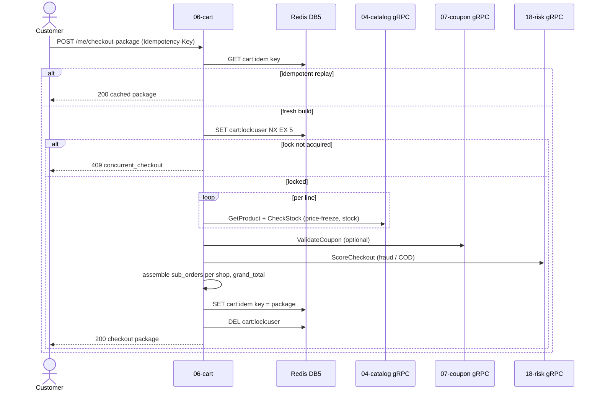
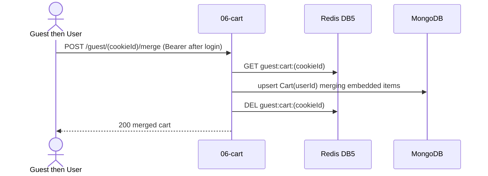

# `06-cart` — Cart & Checkout Package · Service Architecture

> **Scope.** Implementation-grade architecture for the DOKANDAR **`06-cart`** service — authenticated + guest
> carts, wishlists, and the immutable **checkout-package quote** that `13-order` replays at place time.
> Authoritative spec: [`../../architecture.md`](../../architecture.md) §9 (`06-cart`) + §10–§14 + §21;
> [`../../README.md`](../../README.md) §6/§7/§8/§10; [`../../SERVICE_INTEGRATION_TEMPLATE.md`](../../SERVICE_INTEGRATION_TEMPLATE.md)
> (Appendix **A.3 Node/Nest**). **On any conflict the README wins.**
>
> **Grounding, not copying.** The reference at `~/Desktop/DevOps/06-cart` is **Node/NestJS** — read for contract
> behaviour (the checkout-package quote, the Redlock, the consumers). It **diverges**: it persists on Postgres,
> but the spec store is **MongoDB** (§16-a); it models cart as two relational tables, but the spec store is a
> **single embedded document** per user (§3, §16-b). All divergences are normalized here. Code does not exist
> yet; this is the build contract.

| | |
| --- | --- |
| **Service** | `06-cart` |
| **Domain** | Commerce Core — cart & checkout quote |
| **Language · framework** | Node 24 · NestJS 11 · **Prisma 6** (MongoDB — v7 dropped Mongo) |
| **`SERVICE_PORT`** | `3000` (no gRPC server) |
| **External ports** | REST `10006` |
| **Datastores** | **MongoDB 8.3** (`carts`, `wishlists` — embedded docs) · Redis **DB 5** · **No Postgres** |
| **`/ready` hard-gate** | **MongoDB AND Redis** (both required: guest-cart path + checkout lock) |
| **gRPC** | **no server** · **client** of Catalog, Coupon, Risk at quote build |
| **Emits (Kafka)** | **nothing** (no outbox) |
| **Consumes (Kafka)** | `dokandar.product.changed`, `dokandar.order.placed` |
| **`service_name` (identity)** | `06-cart` — from `SERVICE_NAME`, used **identically** everywhere |

**Contents.** §1 Role · §2 Position · §3 Data (embedded Mongo + Redis) · §4 Domain flows · §5 REST map ·
§6 OpenAPI/Swagger surface · §7 gRPC (client-only) · §8 The five ops endpoints · §9 TENANT/`/data`/env ·
§10 Eventing (consume-only) · §11 Logging & observability · §12 Security · §13 Resilience · §14 Boot ·
§15 Deployment · §16 Stack landmines · §17 Design decisions · §18 Build status.

---

## 1. Role & bounded context

`06-cart` holds the customer's **cart** and produces the **checkout-package quote** — a per-shop, priced,
stock-validated snapshot that `13-order` replays atomically at order-place time. The binding consistency moment
is the **order replay**, not the cart itself, so the cart can be eventually consistent and schema-flexible.

**Responsibilities**

- **Authenticated carts** — one document per user, with embedded line items (variant snapshot, price, qty,
  `price_stale` flag).
- **Guest carts** — held in Redis keyed by an HTTP-only cookie id (7-day sliding TTL), merged into the user
  cart on login.
- **Wishlists** — embedded items per user.
- **The checkout-package quote** — the immutable, idempotent quote built by fanning out gRPC to Catalog
  (price-freeze + stock), Coupon (discount), and Risk (fraud/COD), assembled per shop.

**Explicitly NOT in scope**: product truth / stock decrement (`04-catalog`); order state / saga (`13-order`);
coupon authority (`07-coupon`); payment (`09-payment`). Cart **emits no events** and decrements no stock — it
only *reads* (via gRPC) and *snapshots*.

---

## 2. Position in the platform

```
   15-api-gateway ──/api/v1/cart/*──► 06-cart (Node 24 / NestJS 11 · REST :3000 · NO gRPC server)
                                          │
                  checkout-package build  │  (gRPC CLIENT fan-out, <100ms budget)
                        ├──► 04-catalog  Catalog.GetProduct / CheckStock   (price-freeze + stock)
                        ├──► 07-coupon   Coupon.ValidateCoupon              (discount)
                        └──► 18-risk     Risk.ScoreCheckout                 (fraud / COD hold)
                                          │
            cart documents ──────────────► MongoDB 8.3  carts / wishlists  (one embedded doc per user)
            guest carts + locks + idem ──► Redis DB 5  guest:cart:<cookie> · cart:lock:<user> · cart:idem
            consumers ◄────────────────── Kafka  product.changed (flag price_stale) · order.placed (clear lines)
            logs ────────────────────────► stdout (JSON) + Mongo + ES ;  traces ► Elastic APM
```

Cart is a **gRPC client, never a server** — it has no east-west callers. It produces a quote and hands it to
the customer; `13-order` re-validates it at place time.

---

## 3. Data architecture

### 3.1 MongoDB 8.3 — `carts`, `wishlists` (one embedded document per user)

The cart is **one document per `user_id` with an embedded `items[]` array** — *not* a parent table + a child
collection (README §10 rationale: the line shape varies per shopkeeper — `{size, colour}` for fashion,
`{weight, ripeness}` for fresh produce — so a single flexible document beats a rigid relational join). In
Prisma 6, the items are a **composite type** embedded in the model, not a referenced collection.

```prisma
// Prisma 6 — datasource provider = "mongodb"
type CartLine {
  shopId         String
  productId      String
  variantId      String
  quantity       Int
  unitPriceMinor Int
  salePriceMinor Int?
  attributes     Json     // {size,colour} | {weight,ripeness} — per-shopkeeper shape
  snapshotAt     DateTime @default(now())
  priceStale     Boolean  @default(false)   // set by the product.changed consumer
}

model Cart {
  id        String     @id @default(auto()) @map("_id") @db.ObjectId
  userId    String     @unique
  items     CartLine[]                       // EMBEDDED — not a relation
  createdAt DateTime   @default(now())
  updatedAt DateTime   @updatedAt
  @@map("carts")
}

type WishlistLine { productId String; variantId String?; addedAt DateTime @default(now()) }
model Wishlist {
  id     String         @id @default(auto()) @map("_id") @db.ObjectId
  userId String         @unique
  items  WishlistLine[]                      // EMBEDDED
  @@map("wishlists")
}
```

A canonical cart document:

```jsonc
{
  "_id": "…", "userId": "…",
  "items": [
    { "shopId": "…", "productId": "…", "variantId": "…", "quantity": 2,
      "unitPriceMinor": 62000, "salePriceMinor": 58000,
      "attributes": { "size": "L", "colour": "red" },
      "snapshotAt": "…", "priceStale": false }
  ],
  "createdAt": "…", "updatedAt": "…"
}
```

Line uniqueness `(shopId, variantId)` is enforced in application logic on the embedded array (upsert-or-bump
quantity); `price_stale` is set by **mutating the embedded item**, never by updating a child row.

### 3.2 Redis — DB 5 (guest carts, locks, idempotency — gated)

| Key | Value | TTL | Purpose |
| --- | --- | --- | --- |
| `guest:cart:<cookieId>` | serialized guest cart (items[]) | 7-day **sliding** | the guest-cart store (no Mongo doc until login) |
| `cart:lock:<userId>` | `1` | 5s (`SET NX EX`) | Redlock serializing concurrent checkout-package builds |
| `cart:idem:<userId>:<key>` | the built package JSON | `IDEMPOTENCY_TTL_HOURS` | replay the `Idempotency-Key` on `checkout-package` |

Redis is **not** optional here — the guest-cart path and the checkout lock both require it — so it **gates
`/ready`** alongside MongoDB (§8.1). There is **no Postgres**.

---

## 4. Domain flows

### 4.1 Build the checkout-package (the critical quote)



Failure policy on the fan-out (§13): `CheckStock` fail → **fail-closed** (`409 stock_changed` /
`dependency_unavailable`); `ValidateCoupon` fail → **fail-open** (drop the discount, proceed);
`Risk.ScoreCheckout` fail → **fail-closed / hold** for COD per risk appetite. All three carry per-call
deadlines (`GRPC_DEADLINE_MS_*`) + circuit breakers, budgeted to keep the whole quote `<300ms`.

### 4.2 Guest cart merge on login



---

## 5. Synchronous REST API map

All under **`/api/v1/cart/*`**; pretty JSON except `/metrics`/`/openapi.json`/`/docs`. Authenticated routes
verify the Bearer; the guest routes are cookie-id scoped (no token).

| Method | Path | Auth | Purpose |
| --- | --- | --- | --- |
| `GET` | `/api/v1/cart/me` | Bearer | the user's cart (embedded items) |
| `POST` | `/api/v1/cart/me/items` | Bearer | add/bump a line (`shopId,productId,variantId,quantity`) |
| `PATCH` | `/api/v1/cart/me/items/{id}` | Bearer | change quantity |
| `DELETE` | `/api/v1/cart/me/items/{id}` | Bearer | remove a line |
| `DELETE` | `/api/v1/cart/me/items` | Bearer | clear the cart |
| `POST` | `/api/v1/cart/me/checkout-package` | Bearer (+ `Idempotency-Key`) | build the immutable quote |
| `GET` | `/api/v1/cart/wishlist` | Bearer | wishlist items |
| `POST` | `/api/v1/cart/wishlist/items` | Bearer | add a wishlist item |
| `DELETE` | `/api/v1/cart/wishlist/items/{id}` | Bearer | remove a wishlist item |
| `GET` | `/api/v1/cart/guest/{cookieId}` | public | guest cart |
| `POST` | `/api/v1/cart/guest/{cookieId}/items` | public | add to guest cart |
| `POST` | `/api/v1/cart/guest/{cookieId}/merge` | Bearer | merge guest cart into the user cart on login |

`Idempotency-Key` is **required** on `checkout-package`; a repeat with the same key returns the cached package
(`cart:idem`). UUID path ids are validated at the boundary.

---

## 6. The OpenAPI / Swagger surface

`06-cart` is a **reflection-OpenAPI** stack: NestJS **`SwaggerModule`** scans the controller decorators
(`@ApiOperation`, `@ApiResponse`, `@ApiBody`, `@ApiParam`) + the DTO classes (`class-validator` decorators) to
build the document — no hand-written `paths[]`. `SwaggerModule.setup('/docs', …)` serves Swagger UI;
`/openapi.json` serves the document. *(@fastify ordering: register the spec before the routes when on the
Fastify adapter.)*

- **Security scheme** — `addBearerAuth()` registers `HTTPBearer` (JWT) → the `Authorize` button. Authenticated
  routes carry `@ApiBearerAuth()`; guest routes omit it.
- **Info** — title **DOKANDAR Cart Service**, `version` from `CODE_VERSION` (= `06-cart`), the identity banner +
  How-to-test in the description.
- **DTO validation (`class-validator` → 422)** — `AddItemDto` (`@IsUUID shopId/productId/variantId`,
  `@IsInt @Min(1) quantity`), `PatchItemDto` (`@IsInt @Min(0)`), `CheckoutPackageDto`
  (`delivery_methods`/`delivery_slots` maps, optional `coupon_code`). A violation → `422 validation_error`
  with a `details[]` of `{field, issue}`.
- **Schema catalog** — `Cart`, `CartLine`, `Wishlist`, `CheckoutPackage` (`{ checkout_id, sub_orders[],
  coupon_applied, wallet_redeemable_minor, grand_total_minor }`), `SubOrder` (`{ shop_id, items[],
  subtotal_minor, delivery_fee_minor, tax_minor, coupon_discount_minor, shop_total_minor }`), `ErrorEnvelope`.
- **Per-endpoint responses** — `checkout-package`: `200` package · `401` · `409 concurrent_checkout /
  stock_changed / dependency_unavailable` · `422 validation_error`. Item routes: `200`/`201`/`204` · `401` ·
  `404 line_not_found` · `422`.

---

## 7. gRPC — client only

`06-cart` **exposes no gRPC server**. It is a **gRPC client** that fans out during the checkout-package build
(spec §21):

| Call | Peer · port | Failure policy |
| --- | --- | --- |
| `Catalog.GetProduct` / `Catalog.CheckStock` | `04-catalog` @ `9090` (ext `20004`) | **fail-closed** — block the quote (`409 stock_changed`/`dependency_unavailable`) |
| `Coupon.ValidateCoupon` | `07-coupon` @ `9090` (ext `20007`) | **fail-open** — drop the discount, proceed |
| `Risk.ScoreCheckout` | `18-risk-trust` @ `50051` (ext `20018`) | **fail-closed / hold** for COD per risk appetite |

Each carries a deadline (`GRPC_DEADLINE_MS_CATALOG=2000`, `…_COUPON=1000`, …) + a circuit breaker; the peers
appear as diagnostic `grpc_*` checks on `/health` (never gating `/ready`). Coupon + Risk are deferred in the
reference (services not yet built) — build the full three-way fan-out per spec.

---

## 8. The five operational endpoints

Shared identity block (`service_name=06-cart`, `code_version=06-cart`, `env_version`, `tenant`, `env`,
`uptime_seconds`). Pretty JSON except `/metrics`.

### 8.1 `GET /ready` — traffic gating (MongoDB AND Redis)

Unlike most services, `06-cart` gates on **two** stores: **MongoDB** (the cart document store) **and Redis**
(the guest-cart path + the checkout lock both fail without it). A single request cannot be served if either is
down → both are gated. There is **no Postgres**. `200`/`503`.

```jsonc
{
  "status": "ready",
  "identity": { … },
  "dependencies": [
    { "name": "mongodb", "reachable": true, "latency_ms": 1.0 },
    { "name": "redis",   "reachable": true, "latency_ms": 0.4 }
  ]
}
```

> **Spec correction (§16-a).** The reference gates on **postgres + redis** because the MVP persists carts in
> Postgres. The spec store is **MongoDB** → gate **mongodb + redis**, not postgres.

### 8.2 `GET /health` — full diagnostics

Identity + all deps + observability. Core deps: `mongodb`, `redis`, `kafka`, `mongo_logs`, `apm`. The
`grpc_catalog` / `grpc_coupon` / `grpc_risk` checks are **diagnostic** and never flip the status.

```jsonc
{
  "status": "healthy",
  "identity": { … },
  "checks": {
    "mongodb":      { "ok": true },
    "redis":        { "ok": true },
    "kafka":        { "ok": true },
    "mongo_logs":   { "ok": true },
    "apm":          { "ok": true },
    "grpc_catalog": { "ok": true },     // diagnostic
    "grpc_coupon":  { "ok": false },    // diagnostic — not built yet
    "grpc_risk":    { "ok": false }     // diagnostic
  },
  "observability": {
    "apm_service_name": "06-cart",
    "logs_sink_mongo":  "mongodb://…/mongo_db_dokandar_application_logs.06-cart",
    "logs_sink_es":     "http://es-host:9200/logs-app-06-cart-*"
  }
}
```

> **Note.** `mongodb` here is the **business** Mongo (cart docs); `mongo_logs` is the separate **log-sink**
> Mongo — two distinct deps that happen to share an engine.

### 8.3 `GET /data` — TENANT snapshot

`data/<TENANT>/result.json` (bind-mounted RO at `/app/data` — Node reads from `cwd()/data/<tenant>`), identity
prepended; `404 no_snapshot` / `500 snapshot_parse_failed`. Produced offline by `collect.sh`.

### 8.4 `GET /metrics` — Prometheus exposition

RED + cart business metrics; closed-set labels (never `user_id`); `service="06-cart"`.

```
http_requests_total{service="06-cart",method="POST",route="/api/v1/cart/me/checkout-package",status="200"}  …
cart_checkout_package_total{service="06-cart",result="ok"}                 …   # ok|concurrent_checkout|stock_changed|dependency_unavailable
cart_idempotency_hits_total{service="06-cart"}                             …
```

> **Note.** Cart emits **no outbox**, so there is **no `*_outbox_pending` gauge** — the business signal is
> `cart_checkout_package_total{result=…}`. `route` is the **templated** path, never the raw URL.

### 8.5 `GET /docs` & `GET /openapi.json`

Swagger UI (titled **DOKANDAR Cart Service**) + the compact NestJS document. Bare 404 on unmapped paths
(Fastify auto-injects a `Content-Type` — strip it so the 404 is truly bare); `405` on method typos.

---

## 9. TENANT, `/data` & the env-render contract

```ini
APP_ENV=prod
SERVICE_NAME=06-cart              # identity everywhere — FAIL FAST if empty
ENV_VERSION=v1.0.0
TENANT=cloud
SERVICE_PORT=3000                 # Node/Nest idiom (normalized from the MVP's 8000); NO gRPC

# MongoDB (the cart store — Prisma 6)
DATABASE_URL=mongodb://<MONGO_USER>:<MONGO_PASS>@<INFRA_HOST>:27017/dokandar_cart_prod?authSource=admin
                                   # NOTE: mongodb, NOT postgresql (§16-a)

# Redis (DB 5 — guest carts, locks, idempotency)  [GATED]
REDIS_HOST=<INFRA_HOST>
REDIS_PORT=<REDIS_PORT>
REDIS_PASSWORD=<REDIS_PASS>
REDIS_DB=5
GUEST_CART_TTL_DAYS=7
IDEMPOTENCY_TTL_HOURS=24

# Kafka (consume-only)
KAFKA_BOOTSTRAP=<KAFKA_EXTERNAL>
KAFKA_TOPIC_PRODUCT_CHANGED=dokandar.product.changed
KAFKA_TOPIC_ORDER_PLACED=dokandar.order.placed

# Observability
MONGO_LOG_URI=<MONGO_URI>
MONGO_LOG_DB=mongo_db_dokandar_application_logs   # log-sink collection = 06-cart (distinct from the cart store)
APM_SERVER_URL=<APM_URL>
APM_SECRET_TOKEN=<APM_BEARER>
APM_SERVICE_NAME=06-cart                          # normalized from the MVP's 'cart'

# JWT (verify-only) + east-west gRPC clients
JWT_PUBLIC_KEY_B64=<JWT_PUBLIC>   # FAIL FAST under stage/prod if empty
JWT_ISSUER=dokandar-auth
CATALOG_GRPC_ADDR=<CATALOG_HOST>:9090
COUPON_GRPC_ADDR=<COUPON_HOST>:9090
RISK_GRPC_ADDR=<RISK_HOST>:50051
GRPC_DEADLINE_MS_CATALOG=2000
GRPC_DEADLINE_MS_COUPON=1000
GRPC_DEADLINE_MS_RISK=1000
DEFAULT_TAX_PERCENT=0
```

Fail-fast on empty `SERVICE_NAME` (always) and empty `JWT_PUBLIC_KEY_B64` under stage/prod. `TENANT` read once
at boot → identity, `/data` path, APM labels.

---

## 10. Eventing (consume-only)

**Emits nothing — no outbox.** Two consumers (manual commit **after** handling):

| Topic | Handler | Effect |
| --- | --- | --- |
| `dokandar.product.changed` | `onProductChanged` | set `priceStale=true` on every embedded cart line matching the changed `variant_id` |
| `dokandar.order.placed` | `onOrderPlaced` | remove the ordered shop's lines from the user's cart |

Delivery is **at-least-once with manual offset commit after the handler succeeds** (commit-after-handle — the
correct pattern; **not** the at-most-once autocommit bug some MVPs carry). A bad message is logged and skipped
(committed) rather than wedging the partition. Both updates mutate the **embedded items array** in place.

---

## 11. Application logging & observability

- **Three sinks** — stdout (pretty JSON) + MongoDB `mongo_db_dokandar_application_logs.06-cart` + Elasticsearch
  `logs-app-06-cart-*` (ECS); every line carries the APM trace id; fire-and-forget, drop-not-block. **Strip the
  Mongo `_id`** before the ES `_bulk` POST (§16-f).
- **Access log** — one line per genuine request to stdout; `/ready`, `/metrics`, **and `/health`** excluded;
  true client IP, method, **templated** route, status, latency, `request_id`.
- **APM (Node)** — **`import './apm'` must be line 1 of the entrypoint** (`main.ts`), before any other import,
  so the agent monkey-patches the runtime first — the Node equivalent of "APM middleware outermost". Wire
  `ELASTIC_APM_SERVICE_NAME=06-cart`, version from `CODE_VERSION`.
- **Metrics** — `prom-client` registry; RED + `cart_checkout_package_total{result}` + `cart_idempotency_hits_total`.

---

## 12. Security

- **Verify-only RS256.** A Nest guard decodes `JWT_PUBLIC_KEY_B64` once at boot and verifies every Bearer with
  the algorithm **pinned to `RS256`** (`jsonwebtoken` explicit `algorithms:['RS256']`), checking
  `iss`/`aud`/`exp`/`sub`. Guest routes are cookie-id scoped (no token) and can only touch their own
  `guest:cart:<cookieId>`.
- **No east-west server** — cart is only a gRPC *client*; if it ever presents `INTERNAL_SERVICE_TOKEN`, compare
  with `crypto.timingSafeEqual` (constant time), never `===`.
- **Data** — opaque ids only; the embedded `attributes` are seller-supplied, validated as JSON, never executed.

---

## 13. Resilience & failure modes

| Failure | Effect | Mitigation |
| --- | --- | --- |
| MongoDB down | cannot read/write carts | `/ready` → `503` (gated) |
| Redis down | guest carts + checkout lock fail | `/ready` → `503` (gated) — Redis is **not** optional here |
| `04-catalog` gRPC down | cannot price-freeze / check stock | **fail-closed**: `409 dependency_unavailable` |
| stock insufficient + not backorderable | line unbuyable | **fail-closed**: `409 stock_changed` |
| `07-coupon` gRPC down | discount unresolved | **fail-open**: drop the discount, proceed |
| `18-risk` gRPC down | fraud unscored | **fail-closed / hold** for COD per risk appetite |
| concurrent checkout | double-build race | `cart:lock:<user>` Redlock → `409 concurrent_checkout` |
| duplicate `Idempotency-Key` | re-build | `cart:idem` replay returns the cached package |
| consumer poison | one message | log + skip (commit); cart self-heals on the next product event |

---

## 14. Boot sequence & lifecycle

1. **`import './apm'` (line 1)** — agent patches the runtime before anything else loads.
2. Read identity; fail-fast on empty `SERVICE_NAME` / (stage·prod) `JWT_PUBLIC_KEY_B64`.
3. **ensure-db** — `scripts/ensure-db.js` ensures the Mongo database exists (Prisma 6 `db push` applies the
   schema; Mongo is schemaless so there are no SQL migrations).
4. Connect Mongo + Redis; open the gRPC clients (lazy).
5. Start the Nest (Fastify adapter) HTTP server on `3000`; `enableShutdownHooks()` for graceful drain.
6. Start the Kafka consumer (product.changed + order.placed).
7. Serve — `HEALTHCHECK → /ready`.

`npm ci` (not `npm install`) with the committed lockfile for reproducible builds.

---

## 15. Deployment & runtime

- **Image** — multi-stage Node 24 (build → slim runtime), non-root **uid `10001`**; `import './apm'` first;
  a tiny healthcheck script (no curl). REST `3000`; **no gRPC port**. External LB maps `10006 → 3000`.
- **Config** — `--env-file` at runtime; `data/<tenant>/` bind-mounted RO.
- **Scaling** — stateless app tier on HPA-by-RPS; the hot path is the checkout-package assembly (the 3-way
  gRPC fan-out). p99 quote-build ~300 ms inclusive of downstream deadlines.

---

## 16. Stack landmines & reconciliation

- **(a) Store = MongoDB, not Postgres** — the MVP persists carts in Postgres; the spec store is **MongoDB**
  (Prisma 6). Gate `/ready` on **mongodb + redis**, `DATABASE_URL=mongodb://…` (§3, §8.1).
- **(b) Embedded document, not relational** — model `carts` as **one document per user with embedded
  `items[]`** (Prisma composite type), not a `Cart`↔`CartItem` relation; `price_stale` mutates the embedded
  item (§3.1).
- **(c) Prisma 6, not 7** — Prisma **6** (v7 dropped MongoDB support).
- **(d) `import './apm'` line 1** — the very first import in `main.ts`, before Nest/Fastify (§11).
- **(e) commit-after-handle** — manual offset commit *after* the consumer handler (the ref does this correctly;
  do not regress to autocommit) (§10).
- **(f) ES `_bulk` `_id` strip** — strip the Mongo `_id` before bulk-indexing logs to ES (§11).
- **(g) Access-log exclusions** — add `/health` to `/ready`+`/metrics` (§11).
- **(h) Bare-404 Content-Type** — Fastify auto-injects `Content-Type`; strip it so the 404 is truly bare (§8.5).
- **(i) Full three-way fan-out** — build Catalog + Coupon + **Risk** (the ref defers coupon/risk); apply the
  fail-closed / fail-open / hold policies (§7, §13).
- **(j) `npm ci` + lockfile** — reproducible installs; copy the lockfile into the build stage.
- **(k) Identity/port** — normalize `SERVICE_PORT 8000→3000`, `APM_SERVICE_NAME cart→06-cart`,
  `CODE_VERSION 6-cart→06-cart`.

---

## 17. Design decisions & open items

- **MongoDB + embedded document** — the cart line shape varies per shopkeeper (fashion vs fresh produce);
  one flexible document per user beats a rigid relational join and a multi-table read on every cart GET.
- **The quote is the contract, not the cart** — the cart is eventually consistent; correctness is enforced when
  `13-order` **replays** the immutable checkout-package at place time (re-checks stock + price + risk).
- **Redis is load-bearing** — guest carts and the checkout lock both live in Redis, which is why it gates
  `/ready` (unlike catalog/seller, where Redis is a degradable cache).
- **Fail-closed on stock, fail-open on coupon** — never sell what isn't there; never block a sale because a
  discount couldn't be confirmed.
- **Open items** — per-category VAT (`tax_minor` is a flat default today); shop delivery-fee endpoint
  (`delivery_fee_minor` defaults 0); wallet redeemable validation (`wallet_redeemable_minor`) once `10-wallet`
  ships; the coupon + risk fan-out legs.

---

## 18. Build status & cross-references

**Status — specified, not yet implemented.** No code exists; this is the build contract. Reference shape:
`~/Desktop/DevOps/06-cart` (a Node/NestJS MVP on **Postgres** — read for contract behaviour only; the spec
store is **MongoDB + embedded documents**, §16-a/-b).

**Authoritative sources**

- [`../../architecture.md`](../../architecture.md) — **§9** `06-cart`; **§10–§14**; **§21** the anchor.
- [`../../README.md`](../../README.md) — §6 service table · §7 ports · §8 version pins · §10 (the MongoDB
  embedded-document rationale).
- [`../../SERVICE_INTEGRATION_TEMPLATE.md`](../../SERVICE_INTEGRATION_TEMPLATE.md) — Appendix **A.3 Node/Nest**;
  the `import './apm'` / commit-after-handle / Prisma landmine rows.
- Sibling exemplars: [`../01-auth/architecture.md`](../01-auth/architecture.md) (contract depth),
  [`../04-catalog/architecture.md`](../04-catalog/architecture.md) (the gRPC peer it fans out to).

**Build checklist** — `Dockerfile` (multi-stage Node, uid 10001, apm-first, `HEALTHCHECK → /ready`) ·
`env/init-env.sh` + `.env.<env>` (fail-fast, `mongodb://` URL) · the five endpoints + identity + `X-Request-Id`
envelope · the checkout-package quote (3-way gRPC fan-out + Redlock + idempotency) · the two consumers
(commit-after-handle) · `data/<tenant>/result.json` · `OPERATIONS.md` / `SECURITY.md` / `docs/adr/`.
