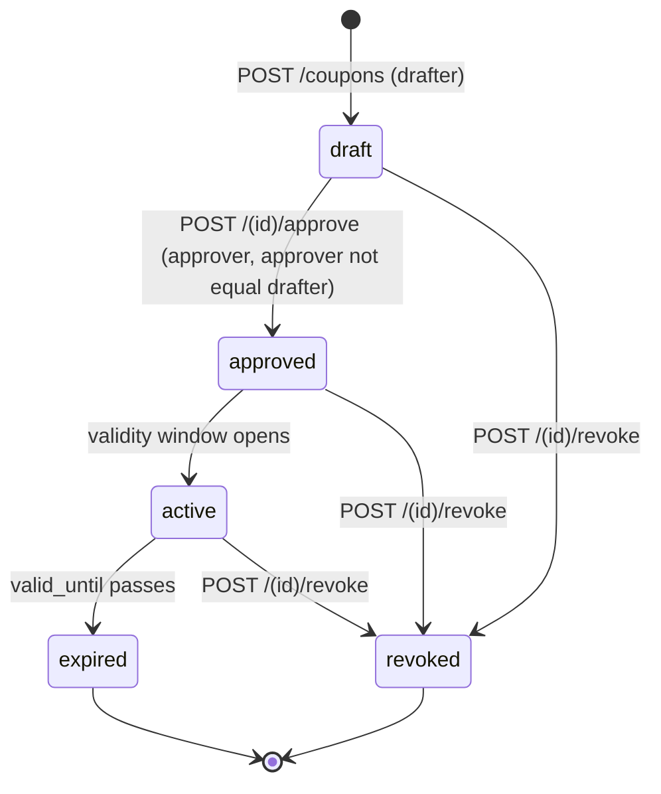
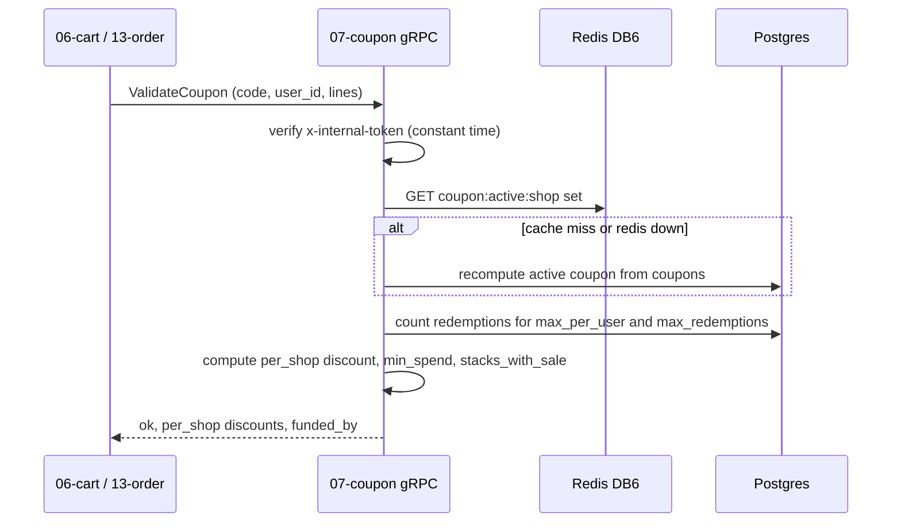

# `07-coupon` — Discount Engine · Service Architecture

> **Scope.** Implementation-grade architecture for the DOKANDAR **`07-coupon`** service — the authority on
> whether/how-much a discount applies, evaluated synchronously during checkout. Authoritative spec:
> [`../../architecture.md`](../../architecture.md) §9 (`07-coupon`) + §10–§14 + §21; [`../../README.md`](../../README.md)
> §6/§7/§8/§10; [`../../SERVICE_INTEGRATION_TEMPLATE.md`](../../SERVICE_INTEGRATION_TEMPLATE.md) (Appendix **A.4
> .NET Minimal API**). **On any conflict the README wins.**
>
> **Grounding, not copying.** The reference at `~/Desktop/DevOps/07-coupon` is **C#/.NET** — read for contract
> behaviour (the lifecycle, the `ValidateCoupon` gRPC, four-eyes, festivals). Spec-normalized here (Redis DB,
> ports, the `/openapi.json` alias — §16). Code does not exist yet; this is the build contract.

| | |
| --- | --- |
| **Service** | `07-coupon` |
| **Domain** | Commerce Core — discounts & festival campaigns |
| **Language · framework** | C# · .NET 10 · ASP.NET Core Minimal API · EF Core 10 |
| **`SERVICE_PORT`** | `8080` (REST) · gRPC `9090` |
| **External ports** | REST `10007` · gRPC `20007` |
| **Datastores** | PostgreSQL `dokandar_coupon_<env>` (sole writer) · Redis **DB 6** (active-coupon cache + redeem lock) |
| **`/ready` hard-gate** | **PostgreSQL only** (Redis-down → recompute from PG, degraded) |
| **gRPC server** | `Coupon.ValidateCoupon` @ `9090` |
| **Emits (Kafka)** | `dokandar.coupon.drafted \| approved \| revoked` (outbox) |
| **Consumes (Kafka)** | none |
| **`service_name` (identity)** | `07-coupon` — from `SERVICE_NAME`, used **identically** everywhere |

**Contents.** §1 Role · §2 Position · §3 Data · §4 Domain flows (lifecycle + validate) · §5 REST map ·
§6 OpenAPI/Swagger surface · §7 gRPC · §8 The five ops endpoints · §9 TENANT/`/data`/env · §10 Eventing ·
§11 Logging & observability · §12 Security (four-eyes) · §13 Resilience · §14 Boot · §15 Deployment ·
§16 Stack landmines · §17 Design decisions · §18 Build status.

---

## 1. Role & bounded context

`07-coupon` decides discounts. It owns coupon templates and festival campaigns, enforces the
`draft → approved → active → revoked/expired` lifecycle with **four-eyes approval**, and answers the
synchronous **`ValidateCoupon`** call during checkout (from Cart at quote build, and from Order at place time).

**Responsibilities**

- **Coupon templates** — `percent` / `fixed` / `free_delivery` / `min_spend` / `first_order`, scoped `shop` or
  `platform`, funded by `shopkeeper` or `platform`, with validity window, max redemptions, max-per-user, and
  min-spend / max-discount caps.
- **Four-eyes lifecycle** — a coupon is **drafted** by one principal and **approved by a different** one
  (approver ≠ drafter, audited) before it can go `active`; `revoke` and `expire` are terminal.
- **Festival campaigns** — Eid-ul-Fitr, Eid-ul-Azha, Pohela Boishakh, Durga Puja, 16 December Victory Day —
  with per-shop opt-in and per-shop value overrides.
- **Synchronous validation** — `ValidateCoupon` computes per-shop discounts, stack-with-sale rules, and the
  funding source, with `(coupon_id, order_id)` durable idempotency on redemption.

**Explicitly NOT in scope**: cart/quote assembly (`06-cart`); order placement (`13-order`); wallet cashback
(`10-wallet`); the actual money movement (`09-payment`). Coupon only *decides* the discount.

---

## 2. Position in the platform

```
   06-cart  ──gRPC Coupon.ValidateCoupon──►┐
   13-order ──gRPC Coupon.ValidateCoupon──►│   07-coupon (.NET 10 · REST :8080 · gRPC :9090)
                                           │        │
   admin / shopkeeper ──/api/v1/coupon/*──►│        ├──► Postgres dokandar_coupon_<env> (+ outbox)
                                           │        ├──► Redis DB 6  coupon:active:shop:<id> · coupon:redeem:lock:<c>:<u>
                                           │        └──► Kafka  dokandar.coupon.drafted|approved|revoked (outbox)
   consumers of coupon.* : 11-reporting, 14-notification, Varnish PURGE relay ◄──────────┘
```

Coupon **exposes** gRPC but **calls** none — it is a pure decision service. Callers (Cart) **fail-open** on a
coupon outage (drop the discount, proceed), so a coupon blip never blocks a sale (§13).

---

## 3. Data architecture

### 3.1 PostgreSQL — `dokandar_coupon_<env>` (sole writer)

`kind`/`scope`/`state`/`funded_by` are `VARCHAR + CHECK` (not PG enums — avoids Npgsql enum-mapping
fragility). EF Core 10 maps the entities; the DDL is applied via the EF model + a bootstrap migration.

```sql
CREATE TABLE coupons (
  id                  uuid PRIMARY KEY DEFAULT gen_random_uuid(),
  code                varchar(40) NOT NULL UNIQUE,
  kind                varchar(20) NOT NULL,        -- percent|fixed|free_delivery|min_spend|first_order
  scope               varchar(10) NOT NULL,        -- shop|platform
  funded_by           varchar(12) NOT NULL,        -- shopkeeper|platform
  shop_id             uuid,                         -- required when scope='shop'
  value_percent       smallint,                     -- 1..90 for kind='percent'
  value_minor         int,                          -- for kind='fixed'
  max_discount_minor  int,
  min_spend_minor     int,
  valid_from          timestamptz NOT NULL,
  valid_until         timestamptz NOT NULL,
  max_redemptions     int,
  max_per_user        int NOT NULL DEFAULT 1,
  drafted_by          uuid NOT NULL,                -- four-eyes: the drafter
  approved_by         uuid,                          -- four-eyes: MUST differ from drafted_by
  state               varchar(12) NOT NULL DEFAULT 'draft',  -- draft|approved|active|expired|revoked
  created_at          timestamptz NOT NULL DEFAULT now(),
  updated_at          timestamptz NOT NULL DEFAULT now()
);

-- the durable idempotency guarantee: one redemption per coupon per order
CREATE TABLE coupon_redemptions (
  id            uuid PRIMARY KEY DEFAULT gen_random_uuid(),
  coupon_id     uuid NOT NULL REFERENCES coupons(id),
  user_id       uuid NOT NULL,
  order_id      uuid NOT NULL,
  sub_order_id  uuid,
  amount_minor  int NOT NULL,
  redeemed_at   timestamptz NOT NULL DEFAULT now(),
  UNIQUE (coupon_id, order_id)                       -- idempotent redemption fence
);
CREATE INDEX idx_redemptions_user ON coupon_redemptions(coupon_id, user_id);   -- max-per-user enforcement

CREATE TABLE festivals (
  id                        uuid PRIMARY KEY DEFAULT gen_random_uuid(),
  slug                      varchar(40) NOT NULL UNIQUE,    -- eid-ul-fitr, pohela-boishakh, …
  name_bn                   varchar(120) NOT NULL,
  name_en                   varchar(120) NOT NULL,
  starts_at                 timestamptz NOT NULL,
  ends_at                   timestamptz NOT NULL,
  banner_s3_key             varchar(255),
  template_kind             varchar(20) NOT NULL,
  template_value_percent    smallint,
  template_value_minor      int,
  template_max_discount_minor int,
  funded_by_default         varchar(12) NOT NULL DEFAULT 'shopkeeper',
  created_by                uuid NOT NULL,
  created_at                timestamptz NOT NULL DEFAULT now()
);

CREATE TABLE festival_shops (
  id                     uuid PRIMARY KEY DEFAULT gen_random_uuid(),
  festival_id            uuid NOT NULL REFERENCES festivals(id) ON DELETE CASCADE,
  shop_id                uuid NOT NULL,
  opted_in_at            timestamptz NOT NULL DEFAULT now(),
  override_value_percent smallint,
  override_value_minor   int,
  UNIQUE (festival_id, shop_id)
);

CREATE TABLE outbox (
  id bigserial PRIMARY KEY, topic varchar(120) NOT NULL, key varchar(120),
  payload jsonb NOT NULL, created_at timestamptz NOT NULL DEFAULT now(), sent_at timestamptz
);
CREATE INDEX idx_outbox_pending ON outbox(created_at) WHERE sent_at IS NULL;
```

### 3.2 Redis — DB 6 (active-coupon cache + redeem lock, degradable)

| Key | Value | Purpose |
| --- | --- | --- |
| `coupon:active:shop:<shop_id>` | the shop's active coupon set | hot-path cache for `ValidateCoupon`; busted on `coupon.*` |
| `coupon:redeem:lock:<coupon_id>:<user_id>` | `1` (`SET NX EX`) | **Redlock** serializing concurrent redemptions of the same coupon by one user |

Redis is degradable — a Redis outage **recomputes from Postgres** with a warning, so it does **not** gate
`/ready` (§8.1).

> **Spec correction (§16-a).** The reference env sets `REDIS_DB=7`; the spec + README allocation put coupon at
> **DB 6**. Use **DB 6**.

---

## 4. Domain flows

### 4.1 Four-eyes lifecycle



The approve endpoint **rejects self-approval** (`approver == drafter` → `403 self_approval_forbidden`) and a
non-`draft` state (`409 not_draft`); platform-scope coupons require `admin`, shop-scope require
`shopkeeper`/`admin`. `approved_by` is recorded for audit.

### 4.2 ValidateCoupon during checkout



`ValidateCoupon` is read-dominant (no write); the durable redemption row is written later by `13-order` at
place time under the `(coupon_id, order_id)` UNIQUE fence + the Redlock.

---

## 5. Synchronous REST API map

All under **`/api/v1/coupon/*`**. Pretty JSON except `/metrics`/`/openapi.json`/`/docs`.

| Method | Path | Auth | Purpose |
| --- | --- | --- | --- |
| `POST` | `/api/v1/coupon/coupons` | Bearer | **draft** a coupon (`shopkeeper`/`admin`) |
| `GET` | `/api/v1/coupon/coupons/me` | Bearer | list my coupons |
| `POST` | `/api/v1/coupon/coupons/{id}/approve` | Bearer | **approve** (approver ≠ drafter) |
| `POST` | `/api/v1/coupon/coupons/{id}/revoke` | Bearer | revoke (owner/admin) |
| `GET` | `/api/v1/coupon/festivals` | public | active festival campaigns |
| `POST` | `/api/v1/coupon/festivals` | Bearer (admin) | create a festival template |
| `POST` | `/api/v1/coupon/festivals/{id}/opt-in` | Bearer | shop opt-in (+ optional value override) |

Validation (→ `422 validation_error`): `percent` value must be `1..90`; `shop_id` required for `scope='shop'`;
valid coupon fields per `kind`. Conflicts: `409 code_taken` (duplicate code), `409 not_draft` (approve/revoke a
non-draft), `403 self_approval_forbidden`, `403 insufficient_role`.

---

## 6. The OpenAPI / Swagger surface

`07-coupon` is a **reflection-OpenAPI** stack: **Swashbuckle** (`AddEndpointsApiExplorer` + `AddSwaggerGen`)
generates the document from the Minimal API endpoint metadata (`.WithName`, `.Produces<T>`,
`.WithOpenApi(...)`) — no hand-written `paths[]`. Swagger UI at `/docs`.

> **.NET landmine (§16-b).** Swashbuckle serves the document at **`/{documentName}/openapi.json`** → `/v1/openapi.json`
> by default. The contract requires **`/openapi.json`** — **root-alias** it (`UseSwagger` `RouteTemplate` +
> an alias endpoint) so `GET /openapi.json` resolves.

- **Security scheme** — `AddSecurityDefinition("HTTPBearer", bearer/JWT)` → the `Authorize` button; secured
  endpoints declare `RequireAuthorization()` + the security requirement.
- **Info** — title **DOKANDAR Coupon Service**, `version` from `CODE_VERSION` (= `07-coupon`), identity banner +
  How-to-test in the description.
- **Schema catalog** — `CouponDraft` (`code`, `kind` enum, `scope` enum, `funded_by` enum, `shop_id`,
  `value_percent` 1..90, `value_minor`, `max_discount_minor`, `min_spend_minor`, `valid_from`/`valid_until`,
  `max_redemptions`, `max_per_user`), `FestivalCreate`, `FestivalOptIn`, `CouponDto`, `ErrorEnvelope`.
- **Per-endpoint responses** — draft: `201` · `403 insufficient_role` · `409 code_taken` · `422`. approve:
  `200` · `403 self_approval_forbidden / insufficient_role` · `409 not_draft` · `404`. Examples prefilled (a
  percent coupon, a festival template).

---

## 7. gRPC — `Coupon.ValidateCoupon` @ 9090

The single east-west RPC, called by Cart (quote build) and Order (place time):

```proto
service Coupon { rpc ValidateCoupon (ValidateCouponRequest) returns (ValidateCouponResponse); }
message ValidateCouponRequest  { string code = 1; string user_id = 2; repeated CartLine lines = 3; }
message ValidateCouponResponse { bool ok = 1; string error_code = 2; repeated PerShopDiscount per_shop = 3;
                                 bool stacks_with_sale = 4; string funded_by = 5; }
message PerShopDiscount        { string shop_id = 1; int32 discount_minor = 2; bool covers_delivery = 3; }
message CartLine               { string product_id = 1; string variant_id = 2; string shop_id = 3;
                                 int32 quantity = 4; int32 unit_price_minor = 5; }
```

Every RPC requires `x-internal-token` metadata equal to `INTERNAL_SERVICE_TOKEN` (an `InternalTokenInterceptor`
compares it in **constant time** — `CryptographicOperations.FixedTimeEquals`); mismatch → `UNAUTHENTICATED`.

> **§7-port reconciliation.** README §7 omits coupon's gRPC port; §10 + the checkout diagrams assign **9090** —
> **9090 is authoritative** (the JVM-family default port; coupon serves gRPC on a dedicated HTTP/2 Kestrel
> listener, §16-d).

---

## 8. The five operational endpoints

Shared identity block (`service_name=07-coupon`, `code_version=07-coupon`, `env_version`, `tenant`, `env`,
`uptime_seconds`). Pretty JSON except `/metrics`.

### 8.1 `GET /ready` — traffic gating (PostgreSQL only)

Gates on **PostgreSQL only**. Redis is a degradable cache (a Redis outage recomputes the active set from PG), so
it is **not** gated. `200`/`503`.

```jsonc
{ "status": "ready", "identity": { … }, "dependencies": [ { "name": "postgres", "reachable": true, "latency_ms": 1.0 } ] }
```

### 8.2 `GET /health` — full diagnostics

Identity + all deps + observability. Core deps: `postgres`, `redis`, `kafka`, `mongo_logs`, `apm`. Healthy iff
core deps ok.

```jsonc
{
  "status": "healthy",
  "identity": { … },
  "checks": {
    "postgres":   { "ok": true },
    "redis":      { "ok": true },
    "kafka":      { "ok": true },
    "mongo_logs": { "ok": true },
    "apm":        { "ok": true }
  },
  "observability": {
    "apm_service_name": "07-coupon",
    "logs_sink_mongo":  "mongodb://…/mongo_db_dokandar_application_logs.07-coupon",
    "logs_sink_es":     "http://es-host:9200/logs-app-07-coupon-*"
  }
}
```

### 8.3 `GET /data` — TENANT snapshot

`data/<TENANT>/result.json` (bind-mounted RO at `/app/data`), identity prepended; `404 no_snapshot` /
`500 snapshot_parse_failed`. Produced offline by `collect.sh`.

### 8.4 `GET /metrics` — Prometheus exposition

RED + business + the mandatory outbox gauge; closed-set labels; `service="07-coupon"`.

```
http_requests_total{service="07-coupon",method="POST",route="/api/v1/coupon/coupons",status="201"}  …
coupon_validations_total{service="07-coupon",result="ok"}        …   # ok|expired|min_spend|max_per_user|not_found
coupon_redemptions_total{service="07-coupon"}                    …
coupon_outbox_pending{service="07-coupon"}                       …   # mandatory, recomputed on scrape
```

### 8.5 `GET /docs` & `GET /openapi.json`

Swagger UI (titled **DOKANDAR Coupon Service**) + the compact Swashbuckle document, root-aliased to
`/openapi.json` (§6). Bare 404 on unmapped paths; `405` on method typos.

---

## 9. TENANT, `/data` & the env-render contract

```ini
APP_ENV=prod
SERVICE_NAME=07-coupon            # identity everywhere — FAIL FAST if empty
ENV_VERSION=v1.0.0
TENANT=cloud
SERVICE_PORT=8080                 # REST (normalized from the MVP's 8000)
GRPC_PORT=9090                    # dedicated HTTP/2 Kestrel listener

# PostgreSQL
POSTGRES_HOST=<INFRA_HOST>
POSTGRES_PORT=<PG_PORT>
POSTGRES_USER=<PG_USER>
POSTGRES_PASSWORD=<PG_PASS>
POSTGRES_DB=dokandar_coupon_prod
POSTGRES_ADMIN_DSN=…/postgres     # ensure-db

# Redis (DB 6 — active-coupon cache + redeem lock)
REDIS_HOST=<INFRA_HOST>
REDIS_PORT=<REDIS_PORT>
REDIS_PASSWORD=<REDIS_PASS>
REDIS_DB=6                         # normalized from the MVP's 7 (§16-a)

# Kafka (emit-only)
KAFKA_BOOTSTRAP=<KAFKA_EXTERNAL>
KAFKA_TOPIC_COUPON_DRAFTED=dokandar.coupon.drafted
KAFKA_TOPIC_COUPON_APPROVED=dokandar.coupon.approved
KAFKA_TOPIC_COUPON_REVOKED=dokandar.coupon.revoked

# Observability
MONGO_LOG_URI=<MONGO_URI>
MONGO_LOG_DB=mongo_db_dokandar_application_logs   # collection = 07-coupon
APM_SERVER_URL=<APM_URL>
APM_SECRET_TOKEN=<APM_BEARER>
APM_SERVICE_NAME=07-coupon                        # normalized from the MVP's 'coupon'
ELASTIC_APM_SERVICE_VERSION=07-coupon             # wire ServiceVersion (§16-e)

# JWT (verify-only) + east-west
JWT_PUBLIC_KEY_B64=<JWT_PUBLIC>   # FAIL FAST under stage/prod if empty
JWT_ISSUER=dokandar-auth
INTERNAL_SERVICE_TOKEN=<INTERNAL_TOKEN>           # FAIL FAST under stage/prod; FixedTimeEquals compare
```

Fail-fast on empty `SERVICE_NAME` (always) and empty `JWT_PUBLIC_KEY_B64` / `INTERNAL_SERVICE_TOKEN` under
stage/prod. `TENANT` read once → identity, `/data`, APM labels. (.NET also emits `appsettings.<env>.json`.)

---

## 10. Eventing

**Emit-only** (spec §10 — consumes none). Topics via the transactional outbox (business row + outbox row in one
EF transaction; relay publishes `acks=all`):

| Topic | When | Key |
| --- | --- | --- |
| `dokandar.coupon.drafted` | a coupon is drafted | `coupon_id` |
| `dokandar.coupon.approved` | a coupon is approved (four-eyes) | `coupon_id` |
| `dokandar.coupon.revoked` | a coupon is revoked | `coupon_id` |

A background `OutboxRelayService` polls `WHERE sent_at IS NULL … FOR UPDATE SKIP LOCKED`, publishes, stamps
`sent_at`; `coupon_outbox_pending` exposes lag. *(The reference also ships a `ShopChangedConsumer` that busts
`coupon:active:shop` on `shop.changed` — an optional cache optimization; the spec lists coupon as
**consumes-none**, so treat it as a non-contract enhancement.)*

> **.NET landmine (§16-c).** The Kafka consume loop is **synchronous** — wrap it in `Task.Run(...)` (a
> background `IHostedService`), or Kestrel never finishes binding and the HTTP server never starts.

---

## 11. Application logging & observability

- **Three sinks** — stdout (`CanonicalConsoleFormatter`, pretty JSON) + MongoDB
  `mongo_db_dokandar_application_logs.07-coupon` + Elasticsearch `logs-app-07-coupon-*` (ECS, via
  `FleetLogSink`); every line carries the trace id; fire-and-forget, drop-not-block.
- **Access log** — `AccessLogMiddleware` emits one line per genuine request; `/ready`, `/metrics`, **and
  `/health`** excluded; true client IP, method, **templated** route, status, latency, `request_id`.
- **APM (.NET)** — `UseAllElasticApm(...)` must be the **first** middleware in the pipeline (`app.Use*` order =
  the .NET "outermost" rule); guard `CurrentTransaction` access with `Elastic.Apm.Agent.IsConfigured` so a
  disabled agent doesn't NRE; wire `ELASTIC_APM_SERVICE_VERSION` from `CODE_VERSION`.
- **Metrics** — `System.Diagnostics.Metrics` / prometheus-net; RED + `coupon_validations_total{result}` +
  `coupon_redemptions_total` + `coupon_outbox_pending`.

---

## 12. Security — four-eyes & verify-only auth

- **Four-eyes approval** — a coupon is drafted by `drafted_by` and can only be approved by a **different**
  principal: `approver == drafter → 403 self_approval_forbidden`; `approved_by` is recorded for audit. This is
  the load-bearing control against unilateral discount creation.
- **Scope-gated roles** — `platform`-scope coupons require `admin`; `shop`-scope require `shopkeeper`/`admin`;
  `403 insufficient_role` otherwise.
- **Verify-only RS256** — decode `JWT_PUBLIC_KEY_B64` once at boot; pin `RS256` (explicit allowlist); check
  `iss`/`aud`/`exp`/`sub`.
- **East-west** — `INTERNAL_SERVICE_TOKEN` compared with `CryptographicOperations.FixedTimeEquals`
  (constant-time), never `==`.

---

## 13. Resilience & failure modes

| Failure | Effect | Mitigation |
| --- | --- | --- |
| Redis DB 6 down | active-set cache miss | **recompute from Postgres**, degraded — `/ready` stays green |
| Kafka down | events backlog | outbox buffers; `coupon_outbox_pending` climbs; request path unaffected |
| concurrent redemption | double-redeem race | `coupon:redeem:lock:<c>:<u>` Redlock + `(coupon_id, order_id)` UNIQUE |
| `ValidateCoupon` slow/unavailable | quote can't price discount | callers (`06-cart`) **fail-open** — drop the discount, proceed |
| self-approval attempt | unilateral discount | `403 self_approval_forbidden` (four-eyes) |
| Postgres down | cannot serve | `/ready` → `503`, pod out of LB |

---

## 14. Boot sequence & lifecycle

1. Read identity; fail-fast on empty `SERVICE_NAME` / (stage·prod) `JWT_PUBLIC_KEY_B64` / `INTERNAL_SERVICE_TOKEN`.
2. **`UseAllElasticApm` first** in the middleware pipeline.
3. **ensure-db** (`DbBootstrap`) — `CREATE DATABASE dokandar_coupon_<env>` if absent (admin DSN).
4. Apply the EF Core schema / bootstrap migration.
5. Bind **two** Kestrel listeners — HTTP/1.1 REST on `8080`, **HTTP/2-only** gRPC on `9090`.
6. Start the outbox relay + the (optional) shop-changed consumer as `IHostedService`s wrapped in `Task.Run`.
7. Serve — `HEALTHCHECK → /ready`. .NET 10 / EF Core 10 (do not regress).

---

## 15. Deployment & runtime

- **Image** — multi-stage (.NET SDK build → `dotnet` runtime / distroless), non-root **uid `10001`**; the
  Elastic APM .NET agent. REST `8080`, gRPC `9090` (dedicated HTTP/2 listener). External LB maps `10007 → 8080`,
  `20007 → 9090`.
- **`HEALTHCHECK`** — `GET /ready`. **Config** — `--env-file` + `appsettings.<env>.json`; `data/<tenant>/`
  bind-mounted RO.
- **Scaling** — stateless; the hot path is `ValidateCoupon` (cache-served active set). HPA on RPS; p99 ~50 ms.

---

## 16. Stack landmines & reconciliation

- **(a) Redis DB 6** — the MVP env says `REDIS_DB=7`; spec + README allocate coupon to **DB 6** (§3.2).
- **(b) `/openapi.json` root-alias** — Swashbuckle serves `/v1/openapi.json`; alias `/openapi.json` per the
  contract (§6).
- **(c) Sync Kafka loop in `Task.Run`** — else Kestrel never finishes binding and HTTP never starts (§10).
- **(d) gRPC on a dedicated HTTP/2 listener** — a separate Kestrel endpoint (h2c) for `9090`, distinct from the
  HTTP/1.1 REST `8080` (§14).
- **(e) `ServiceVersion` + `IsConfigured` guard** — wire `ELASTIC_APM_SERVICE_VERSION`; guard
  `CurrentTransaction` with `Elastic.Apm.Agent.IsConfigured` (§11).
- **(f) `UseAllElasticApm` first** — outermost middleware or transactions never close (§11).
- **(g) Access-log exclusions** — add `/health` to `/ready`+`/metrics` (§11).
- **(h) Four-eyes** — enforce `approver ≠ drafter` (`403 self_approval_forbidden`); audit `approved_by` (§12).
- **(i) Identity/port** — normalize `SERVICE_PORT 8000→8080`, `APM_SERVICE_NAME coupon→07-coupon`,
  `CODE_VERSION 7-coupon→07-coupon`, `POSTGRES_DB coupon→dokandar_coupon_<env>`.
- **(j) `coupon_outbox_pending`** — the mandatory outbox gauge; `service` label is the full `07-coupon`.

---

## 17. Design decisions & open items

- **Four-eyes by construction** — separating `drafted_by` and `approved_by` (and rejecting self-approval) makes
  unilateral discount creation impossible; it is the single most important control in a discount engine.
- **Decision service, not money mover** — coupon decides the discount; the redemption row + the money movement
  are written by `13-order`/`09-payment`. Coupon stays read-dominant and cheaply cacheable.
- **`VARCHAR + CHECK` over PG enums** — avoids Npgsql enum-mapping fragility while keeping the same validation.
- **`(coupon_id, order_id)` UNIQUE** — the durable idempotency fence; the Redlock only serializes the
  *concurrent* window, the UNIQUE is the permanent guarantee.
- **Open items** — `min_spend` / `max_per_user` enforcement edge cases; coupon stacking rules with sale prices
  (`stacks_with_sale`); festival auto-activation jobs; the redemption-write path owned by `13-order`.

---

## 18. Build status & cross-references

**Status — specified, not yet implemented.** No code exists; this is the build contract. Reference shape:
`~/Desktop/DevOps/07-coupon` (a C#/.NET MVP — spec-normalized here, §16).

**Authoritative sources**

- [`../../architecture.md`](../../architecture.md) — **§9** `07-coupon`; **§10–§14**; **§21** the anchor.
- [`../../README.md`](../../README.md) — §6 service table · §7 ports (the coupon gRPC-port drift) · §8 pins ·
  §10 (the Redis DB-6 allocation).
- [`../../SERVICE_INTEGRATION_TEMPLATE.md`](../../SERVICE_INTEGRATION_TEMPLATE.md) — Appendix **A.4 .NET Minimal
  API**; the `UseAllElasticApm`-first / `Task.Run` / Swashbuckle-alias landmine rows.
- Sibling exemplars: [`../01-auth/architecture.md`](../01-auth/architecture.md) (contract depth),
  [`../04-catalog/architecture.md`](../04-catalog/architecture.md) (the gRPC-server pattern).

**Build checklist** — `Dockerfile` (multi-stage .NET, uid 10001, `HEALTHCHECK → /ready`) · `env/init-env.sh` +
`.env.<env>` + `appsettings.<env>.json` (fail-fast) · the five endpoints + identity + `X-Request-Id` envelope ·
the gRPC server + proto + `FixedTimeEquals` interceptor · four-eyes enforcement · `test.sh` (curl five + gRPC
smoke) · `data/<tenant>/result.json` · `OPERATIONS.md` / `SECURITY.md` / `docs/adr/`.
