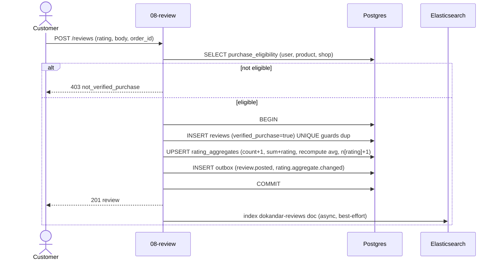
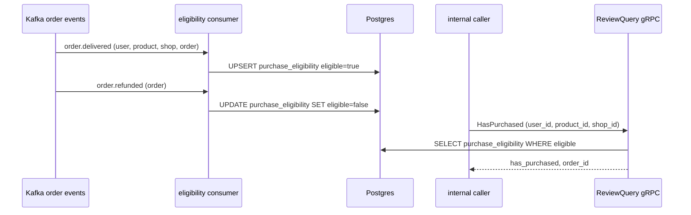

# `08-review` — Reviews, Q&A & Ratings · Service Architecture

> **Scope.** Implementation-grade architecture for the DOKANDAR **`08-review`** service — verified-purchase
> reviews, shopkeeper replies, helpful votes, abuse moderation, and incremental rating aggregates.
> Authoritative spec: [`../../architecture.md`](../../architecture.md) §9 (`08-review`) + §10–§14 + §21;
> [`../../README.md`](../../README.md) §6/§7/§8/§10; [`../../SERVICE_INTEGRATION_TEMPLATE.md`](../../SERVICE_INTEGRATION_TEMPLATE.md)
> (Appendix **A.11 Kotlin/Ktor — target/provisional**). **On any conflict the README wins.**
>
> **Grounding, not copying — and a language gap.** The deployed reference at `~/Desktop/DevOps/08-review` is
> **Node/Fastify**; the **spec target is Kotlin 2.4 / Ktor 3.5**. The Node reference is read for **contract
> behaviour only** (the schema, the verified-purchase projection, the aggregate maths); every Kotlin mechanic
> below is **spec-extrapolated and marked provisional — no Kotlin `file:line`**. Two reference behaviours are
> *not* spec-conformant and are corrected here (no Redis; `HasPurchased` reads the local projection, never
> Order — §16). Code does not exist yet; this is the build contract.

| | |
| --- | --- |
| **Service** | `08-review` |
| **Domain** | Commerce Core — reviews & ratings |
| **Language · framework** | **Kotlin 2.4 · Ktor 3.5** *(spec target — provisional)* |
| **`SERVICE_PORT`** | `8080` (REST) · gRPC `50051` |
| **External ports** | REST `10008` · gRPC `20008` |
| **Datastores** | PostgreSQL `dokandar_review_<env>` (sole writer) · Elasticsearch 9.4 (`dokandar-reviews`) · **No Redis** |
| **`/ready` hard-gate** | **PostgreSQL only** (ES does **not** gate — only review *search* degrades) |
| **gRPC server** | `ReviewQuery.HasPurchased` @ `50051` |
| **Emits (Kafka)** | `dokandar.review.*` (incl. `review.posted`), `dokandar.rating.aggregate.changed` (outbox) |
| **Consumes (Kafka)** | `dokandar.order.delivered`, `dokandar.order.refunded` → `purchase_eligibility` |
| **`service_name` (identity)** | `08-review` — from `SERVICE_NAME`, used **identically** everywhere |

**Contents.** §1 Role · §2 Position · §3 Data · §4 Domain flows · §5 REST map · §6 OpenAPI/Swagger surface ·
§7 gRPC · §8 The five ops endpoints · §9 TENANT/`/data`/env · §10 Eventing · §11 Logging & observability ·
§12 Security · §13 Resilience · §14 Boot · §15 Deployment · §16 Stack landmines · §17 Design decisions ·
§18 Build status.

---

## 1. Role & bounded context

`08-review` owns customer feedback: ratings + text reviews of products and shops, shopkeeper replies, helpful
votes, abuse reports + auto-hide, admin moderation, and the **incremental rating aggregate** (the star average
+ histogram shown on every PDP). It gates new reviews on **verified purchase** — proven from a local projection
of order events, *not* a synchronous call to Order.

**Responsibilities**

- **Reviews** — one review per `(user, target, order)`; product or shop target; rating + optional title/body +
  media references; a 7-day author edit window.
- **Verified purchase** — `purchase_eligibility` is materialized from `order.delivered` (granted) and
  `order.refunded` (clawed back); `ReviewQuery.HasPurchased` answers from it.
- **Replies** — one shopkeeper reply per review.
- **Helpful votes** — one vote per `(review, user)`.
- **Abuse moderation** — reports per `(review, reporter)`; crossing a threshold **auto-hides** pending admin
  review; admins hide/restore.
- **Rating aggregates** — incremental `count`/`sum`/`avg` + an `n1..n5` histogram per target, emitted as
  `rating.aggregate.changed`.

**Explicitly NOT in scope**: order truth (`13-order`); product/shop identity; media binaries (`12-media`).

---

## 2. Position in the platform

```
   13-order ──order.delivered / order.refunded──► 08-review (Kotlin/Ktor · REST :8080 · gRPC :50051)
                                                       │   (materialise purchase_eligibility)
   06-cart? / 13-order ──gRPC ReviewQuery.HasPurchased►│   (answered from the LOCAL projection — never calls Order)
   customers ──/api/v1/review/*──────────────────────►│
                                                       ├──► Postgres dokandar_review_<env> (+ outbox)
                                                       ├──► Elasticsearch dokandar-reviews (async after PG write)
                                                       └──► Kafka  review.* · rating.aggregate.changed (outbox)
   consumers of review.* / rating.aggregate.changed: 05-search, 11-reporting, Varnish PURGE relay ◄──┘
```

Review **emits** events and **exposes** `HasPurchased`, but the read path takes purchase truth from its own
projection — so the hot path never blocks on Order being up.

---

## 3. Data architecture

### 3.1 PostgreSQL — `dokandar_review_<env>` (sole writer)

```sql
CREATE TABLE reviews (
  id                uuid PRIMARY KEY DEFAULT gen_random_uuid(),
  user_id           uuid NOT NULL,
  target_kind       varchar(10) NOT NULL,        -- product | shop
  product_id        uuid,
  shop_id           uuid,
  order_id          uuid NOT NULL,               -- proves the purchase
  rating            smallint NOT NULL CHECK (rating BETWEEN 1 AND 5),
  title             text,
  body              text,
  media_ids         uuid[] NOT NULL DEFAULT '{}',-- references into 12-media
  helpful_yes       int NOT NULL DEFAULT 0,
  helpful_no        int NOT NULL DEFAULT 0,
  reports_count     int NOT NULL DEFAULT 0,
  verified_purchase boolean NOT NULL DEFAULT false,
  status            varchar(10) NOT NULL DEFAULT 'visible',   -- visible | hidden | removed
  posted_at         timestamptz NOT NULL DEFAULT now(),
  edited_at         timestamptz,
  UNIQUE (user_id, target_kind, product_id, shop_id, order_id)   -- one review per (user, target, order)
);
CREATE INDEX idx_reviews_product ON reviews(product_id);
CREATE INDEX idx_reviews_shop    ON reviews(shop_id);
CREATE INDEX idx_reviews_status  ON reviews(status);

CREATE TABLE review_replies (
  id            uuid PRIMARY KEY DEFAULT gen_random_uuid(),
  review_id     uuid NOT NULL UNIQUE REFERENCES reviews(id) ON DELETE CASCADE,
  shopkeeper_id uuid NOT NULL, body text NOT NULL,
  posted_at timestamptz NOT NULL DEFAULT now(), edited_at timestamptz
);

CREATE TABLE review_votes (
  review_id uuid NOT NULL REFERENCES reviews(id) ON DELETE CASCADE,
  user_id   uuid NOT NULL, is_helpful boolean NOT NULL,
  voted_at  timestamptz NOT NULL DEFAULT now(),
  PRIMARY KEY (review_id, user_id)               -- one vote per (review, user)
);

CREATE TABLE review_reports (
  id          uuid PRIMARY KEY DEFAULT gen_random_uuid(),
  review_id   uuid NOT NULL REFERENCES reviews(id) ON DELETE CASCADE,
  reporter_id uuid NOT NULL,
  reason      varchar(20) NOT NULL,              -- spam | hate | off_topic | pii | other
  detail      text, reported_at timestamptz NOT NULL DEFAULT now(),
  UNIQUE (review_id, reporter_id)                -- one report per (review, reporter)
);

-- incremental aggregate — never recomputed from scratch
CREATE TABLE rating_aggregates (
  target_kind varchar(10) NOT NULL, target_id uuid NOT NULL,
  count int NOT NULL DEFAULT 0, sum_score int NOT NULL DEFAULT 0,
  avg numeric(3,2) NOT NULL DEFAULT 0,
  n1 int NOT NULL DEFAULT 0, n2 int NOT NULL DEFAULT 0, n3 int NOT NULL DEFAULT 0,
  n4 int NOT NULL DEFAULT 0, n5 int NOT NULL DEFAULT 0,
  updated_at timestamptz NOT NULL DEFAULT now(),
  PRIMARY KEY (target_kind, target_id)
);

-- verified-purchase projection — materialised from order events (§10)
CREATE TABLE purchase_eligibility (
  user_id    uuid NOT NULL, product_id uuid, shop_id uuid, order_id uuid NOT NULL,
  eligible   boolean NOT NULL DEFAULT true,      -- false after a refund clawback
  delivered_at timestamptz NOT NULL DEFAULT now(),
  PRIMARY KEY (user_id, order_id, product_id)
);
CREATE INDEX idx_eligibility_lookup ON purchase_eligibility(user_id, product_id, shop_id) WHERE eligible;

CREATE TABLE outbox (
  id bigserial PRIMARY KEY, topic varchar(120) NOT NULL, key varchar(120),
  payload jsonb NOT NULL, created_at timestamptz NOT NULL DEFAULT now(), sent_at timestamptz
);
CREATE INDEX idx_outbox_pending ON outbox(created_at) WHERE sent_at IS NULL;
```

### 3.2 Elasticsearch — `dokandar-reviews`

ES indexes review text for full-text review **search**, updated **asynchronously after the PG write**. ES is
not authoritative and **not gated**: when ES is degraded the service serves CRUD / votes / aggregates from
Postgres — **only review search degrades** (reported on `/health`).

### 3.3 No Redis

`08-review` has **no Redis** (spec §10). The PG tables are the store; idempotency is enforced by the UNIQUE
constraints, not by a cache lock.

> **Spec correction (§16-a).** The Node reference env sets `REDIS_DB=8`; the spec says **no Redis** — drop it.

---

## 4. Domain flows

### 4.1 Post a review (verified-purchase gated)



A duplicate `(user, target, order)` is rejected `409 review_exists` by the UNIQUE constraint. The aggregate is
updated **incrementally** in the same transaction (never a full recount).

### 4.2 Verified-purchase projection + HasPurchased



> **Spec correction (§16-b).** `HasPurchased` answers from the **local `purchase_eligibility` projection** —
> it must **not** call `13-order`'s gRPC (the Node reference has an `orderClient` fallback; remove it). Reading
> the local projection keeps the hot path free of an Order dependency.

---

## 5. Synchronous REST API map

All under **`/api/v1/review/*`**. Pretty JSON except `/metrics`/`/openapi.json`/`/docs`.

| Method | Path | Auth | Purpose |
| --- | --- | --- | --- |
| `GET` | `/api/v1/review/reviews?product_id=&shop_id=&page=&size=` | public | list reviews (paged, sortable) |
| `GET` | `/api/v1/review/reviews/search?q=` | public | full-text review search (ES) |
| `GET` | `/api/v1/review/aggregate?target_kind=&target_id=` | public | rating average + histogram |
| `POST` | `/api/v1/review/reviews` | Bearer | post a review (verified-purchase gated) |
| `PATCH` | `/api/v1/review/reviews/{id}` | Bearer | edit own review (≤ 7 days) |
| `DELETE` | `/api/v1/review/reviews/{id}` | Bearer | remove own review |
| `POST` | `/api/v1/review/reviews/{id}/reply` | Bearer | shopkeeper reply |
| `POST` | `/api/v1/review/reviews/{id}/vote` | Bearer | helpful / not-helpful |
| `POST` | `/api/v1/review/reviews/{id}/report` | Bearer | report abuse |
| `POST` | `/api/v1/review/reviews/{id}/hide` · `/restore` | Bearer (admin) | moderation |

Validation (→ `422 validation_error`): `rating` 1..5; `reason` ∈ enum; edit window. Conflicts:
`409 review_exists` (dup), `409 already_voted` / `already_reported`. Authorization: `403 not_verified_purchase`,
`403 not_author` (edit/delete), `403 edit_window_closed`, `403 insufficient_role` (moderation).

---

## 6. The OpenAPI / Swagger surface

Ktor has **no springdoc-style reflection scanner**. The target uses an OpenAPI **plugin** (a Ktor
`openapi`/`swagger-ui` route) backed by a maintained spec resource **or** a hand-written document — whichever,
it carries a **CI route-vs-spec diff** (like the Go/PHP hand-written stacks) so no served route is
undocumented. Served at `/openapi.json`, Swagger UI at `/docs`.

- **Security scheme** — `HTTPBearer` (JWT) drives the `Authorize` button; public reads (`GET reviews`,
  `/search`, `/aggregate`) omit `security`; all mutations require it.
- **Info** — title **DOKANDAR Review Service**, `version` from `CODE_VERSION` (= `08-review`), identity banner +
  How-to-test in the description.
- **Schema catalog** — `ReviewCreate` (`target_kind` enum, `product_id`/`shop_id`, `order_id`, `rating` 1..5,
  `title`, `body`, `media_ids[]`), `ReplyCreate`, `VoteCreate` (`is_helpful`), `ReportCreate` (`reason` enum,
  `detail`), `ReviewDto`, `Aggregate` (`count`, `avg`, `n1..n5`), `ErrorEnvelope`.
- **Per-endpoint responses** — post: `201` · `403 not_verified_purchase` · `409 review_exists` · `422`. edit:
  `200` · `403 not_author / edit_window_closed` · `404`. With prefilled examples (a 5-star product review).

---

## 7. gRPC — `ReviewQuery.HasPurchased` @ 50051

```proto
service ReviewQuery { rpc HasPurchased (HasPurchasedRequest) returns (HasPurchasedResponse); }
message HasPurchasedRequest  { string user_id = 1; string product_id = 2; string shop_id = 3; }
message HasPurchasedResponse { bool has_purchased = 1; string order_id = 2; }
```

Answered **purely from the local `purchase_eligibility` projection** (§4.2) — never a downstream call. Requires
`x-internal-token` = `INTERNAL_SERVICE_TOKEN`, compared **constant-time** (`MessageDigest.isEqual`); mismatch →
`UNAUTHENTICATED`. The server listens on `50051` (the non-JVM-app default; external `20008`).

---

## 8. The five operational endpoints

Shared identity block (`service_name=08-review`, `code_version=08-review`, …). Pretty JSON except `/metrics`.

### 8.1 `GET /ready` — traffic gating (PostgreSQL only)

Gates **PostgreSQL only**. ES is non-gating (CRUD/votes/aggregates serve from PG; only search degrades); there
is no Redis. `200`/`503`.

```jsonc
{ "status": "ready", "identity": { … }, "dependencies": [ { "name": "postgres", "reachable": true, "latency_ms": 1.0 } ] }
```

### 8.2 `GET /health` — full diagnostics

Identity + core deps (`postgres`, `elasticsearch`, `kafka`, `mongo_logs`, `apm`) + observability. ES degraded is
reported (search-only impact), not a `/ready` failure.

```jsonc
{
  "status": "healthy",
  "identity": { … },
  "checks": {
    "postgres":      { "ok": true },
    "elasticsearch": { "ok": true },
    "kafka":         { "ok": true },
    "mongo_logs":    { "ok": true },
    "apm":           { "ok": true }
  },
  "observability": {
    "apm_service_name": "08-review",
    "logs_sink_mongo":  "mongodb://…/mongo_db_dokandar_application_logs.08-review",
    "logs_sink_es":     "http://es-host:9200/logs-app-08-review-*"
  }
}
```

### 8.3 `GET /data` — TENANT snapshot

`data/<TENANT>/result.json` (bind-mounted RO), identity prepended; `404 no_snapshot` / `500 snapshot_parse_failed`.

### 8.4 `GET /metrics`

RED + business + outbox gauge; closed-set labels; `service="08-review"`.

```
review_posted_total{service="08-review",target_kind="product"}   …
review_auto_hidden_total{service="08-review"}                    …
review_outbox_pending{service="08-review"}                       …   # mandatory
```

### 8.5 `GET /docs` & `GET /openapi.json`

Swagger UI (titled **DOKANDAR Review Service**) + the document (§6). Bare 404 on unmapped paths; `405` on
method typos.

---

## 9. TENANT, `/data` & the env-render contract

```ini
APP_ENV=prod
SERVICE_NAME=08-review            # identity everywhere — FAIL FAST if empty
ENV_VERSION=v1.0.0
TENANT=cloud
SERVICE_PORT=8080                 # REST (normalized from the MVP's 8000)
GRPC_PORT=50051                   # normalized from the MVP's 8001

# PostgreSQL
POSTGRES_HOST=<INFRA_HOST>
POSTGRES_PORT=<PG_PORT>
POSTGRES_USER=<PG_USER>
POSTGRES_PASSWORD=<PG_PASS>
POSTGRES_DB=dokandar_review_prod
POSTGRES_ADMIN_DSN=…/postgres     # ensure-db

# Elasticsearch (review search — non-gating)
ELASTIC_SEARCH_URL=<ES_URL>
ELASTIC_SEARCH_USERNAME=<ES_USER>
ELASTIC_SEARCH_PASSWORD=<ES_PASS>
ES_INDEX_REVIEWS=dokandar-reviews

# Kafka
KAFKA_BOOTSTRAP=<KAFKA_EXTERNAL>
KAFKA_TOPIC_REVIEW_POSTED=dokandar.review.posted
KAFKA_TOPIC_REVIEW_UPDATED=dokandar.review.updated
KAFKA_TOPIC_REVIEW_DELETED=dokandar.review.deleted
KAFKA_TOPIC_REVIEW_REPLY=dokandar.review.reply.posted
KAFKA_TOPIC_RATING_AGGREGATE=dokandar.rating.aggregate.changed
KAFKA_TOPIC_ORDER_DELIVERED=dokandar.order.delivered     # consume
KAFKA_TOPIC_ORDER_REFUNDED=dokandar.order.refunded       # consume

# Observability
MONGO_LOG_URI=<MONGO_URI>
MONGO_LOG_DB=mongo_db_dokandar_application_logs   # collection = 08-review
APM_SERVER_URL=<APM_URL>
APM_SECRET_TOKEN=<APM_BEARER>
APM_SERVICE_NAME=08-review                        # normalized from the MVP's 'review'

# JWT (verify-only) + east-west
JWT_PUBLIC_KEY_B64=<JWT_PUBLIC>   # FAIL FAST under stage/prod if empty
JWT_ISSUER=dokandar-auth
INTERNAL_SERVICE_TOKEN=<INTERNAL_TOKEN>           # FAIL FAST under stage/prod; MessageDigest.isEqual compare
# NOTE: no REDIS_* — spec §10 says no Redis; no ORDER_GRPC_ADDR — HasPurchased reads the local projection.
```

Fail-fast on empty `SERVICE_NAME` (always) and empty `JWT_PUBLIC_KEY_B64` / `INTERNAL_SERVICE_TOKEN` under
stage/prod. `TENANT` read once → identity, `/data`, APM labels.

---

## 10. Eventing

**Emits** (via the transactional outbox, `acks=all`):

| Topic | When |
| --- | --- |
| `dokandar.review.posted` | a review is created |
| `dokandar.review.updated` / `.deleted` / `.reply.posted` | edit / remove / reply |
| `dokandar.rating.aggregate.changed` | the aggregate moves (drives `05-search` + PDP cache PURGE) |

**Consumes** `dokandar.order.delivered` (materialize `purchase_eligibility`, `eligible=true`) and
`dokandar.order.refunded` (clawback, `eligible=false`). At-least-once with **manual commit after handling**;
idempotent UPSERTs make replay harmless. `review_outbox_pending` exposes relay lag.

---

## 11. Application logging & observability

- **Three sinks** — stdout (pretty JSON) + MongoDB `mongo_db_dokandar_application_logs.08-review` + Elasticsearch
  `logs-app-08-review-*` (ECS); every line carries the trace id; fire-and-forget, drop-not-block. Strip Mongo
  `_id` before the ES `_bulk` (Family-B JVM landmine).
- **Access log** — one line per genuine request; `/ready`, `/metrics`, **and `/health`** excluded; true client
  IP, method, **templated** route, status, latency, `request_id`.
- **APM (Kotlin/JVM)** — the Elastic **`-javaagent`** attached in the container `ENTRYPOINT` (Family B — agent
  attach, *not* in-code); it auto-instruments Ktor + JDBC + gRPC and is outermost by construction. Wire
  `ELASTIC_APM_SERVICE_NAME=08-review` and `ELASTIC_APM_SERVICE_VERSION` from `CODE_VERSION`.
- **Metrics** — Micrometer + Prometheus; RED + `review_posted_total`, `review_auto_hidden_total`,
  `review_outbox_pending`.

---

## 12. Security

- **Verify-only RS256** — decode `JWT_PUBLIC_KEY_B64` once at boot; pin `RS256` (explicit allowlist); check
  `iss`/`aud`/`exp`/`sub`.
- **Verified-purchase gating** — a review requires an `eligible` `purchase_eligibility` row → `403
  not_verified_purchase`; this is the primary anti-spam control.
- **Authorship & moderation** — only the author edits (≤ 7 days; `403 edit_window_closed` / `not_author`);
  admin scopes gate hide/restore; abuse-report threshold **auto-hides** pending moderation.
- **East-west** — `INTERNAL_SERVICE_TOKEN` compared with `MessageDigest.isEqual` (constant time), never `==`.
- **Privacy** — reviewer identity is opaque in public aggregates; `pii`-reason reports are prioritized.

---

## 13. Resilience & failure modes

| Failure | Effect | Mitigation |
| --- | --- | --- |
| Elasticsearch degraded | review *search* unavailable | serve CRUD/votes/aggregates from **Postgres**; reported on `/health`, not `/ready` |
| `order.*` consumer lag | new verified reviews delayed | eligibility back-fills on replay; idempotent UPSERT |
| Kafka down | events backlog | outbox buffers; `review_outbox_pending` climbs |
| duplicate submission | — | `UNIQUE(user,target,order)` → `409 review_exists` |
| review brigading | spam/abuse | report threshold auto-hides; admin restore |
| Postgres down | cannot serve | `/ready` → `503` |

---

## 14. Boot sequence & lifecycle

1. Read identity; fail-fast on empty `SERVICE_NAME` / (stage·prod) `JWT_PUBLIC_KEY_B64` / `INTERNAL_SERVICE_TOKEN`.
2. **ensure-db** → `CREATE DATABASE dokandar_review_<env>` if absent.
3. **Flyway migrate** (run **before** `embeddedServer` starts — a JVM landmine: migrate, then serve).
4. Start the Ktor server (`8080`) + the gRPC server (`50051`); the `-javaagent` is attached at JVM launch.
5. Start the order-events consumer (delivered/refunded).
6. Serve — `HEALTHCHECK → /ready`. Kotlin 2.4 / Ktor 3.5.

Run blocking JDBC inside a `suspend` handler on **`Dispatchers.IO`**, never the Ktor event-loop dispatcher
(a JVM/coroutine landmine).

---

## 15. Deployment & runtime

- **Image** — multi-stage (Gradle build → JRE 25 distroless), non-root **uid `10001`**, the Elastic APM
  `-javaagent` in `ENTRYPOINT`. REST `8080`, gRPC `50051`. External LB maps `10008 → 8080`, `20008 → 50051`.
- **`HEALTHCHECK`** — `GET /ready`. **Config** — `--env-file` at runtime; `data/<tenant>/` bind-mounted RO.
- **Scaling** — stateless; hot paths `HasPurchased` + `GET /aggregate`; read-heavy, HPA on RPS; ES sharded by
  volume; aggregates incremental. p99 read ~100 ms.

---

## 16. Stack landmines & reconciliation

- **(a) No Redis** — the Node ref env sets `REDIS_DB=8`; spec says **no Redis** (§3.3).
- **(b) `HasPurchased` reads the local projection** — never calls `13-order` (the ref has an `orderClient`
  fallback; remove it) (§4.2, §7).
- **(c) Reference language** — deployed ref is **Node/Fastify**; spec target is **Kotlin 2.4 / Ktor 3.5** — read
  Node for contract; write Kotlin; **no Kotlin `file:line`** (provisional).
- **(d) Ktor has no reflection OpenAPI** — use a plugin or hand-written doc **+ a CI route-vs-spec diff** (§6).
- **(e) `-javaagent` APM (Family B)** — agent attach in `ENTRYPOINT`, not in-code (§11).
- **(f) Flyway before `embeddedServer`** — migrate, then serve (§14).
- **(g) `Dispatchers.IO` for blocking JDBC** — never block the Ktor event loop in a `suspend` handler (§14).
- **(h) `MessageDigest.isEqual`** — constant-time `INTERNAL_SERVICE_TOKEN` compare (§12).
- **(i) ES `_bulk` `_id` strip** — strip Mongo `_id` before bulk-indexing logs (§11).
- **(j) Access-log exclusions** — add `/health` to `/ready`+`/metrics` (§11).
- **(k) Identity/port** — normalize `SERVICE_PORT 8000→8080`, `GRPC_PORT 8001→50051`,
  `APM_SERVICE_NAME review→08-review`, `CODE_VERSION 8-review→08-review`, `POSTGRES_DB review→dokandar_review_<env>`.

---

## 17. Design decisions & open items

- **Local verified-purchase projection** — materializing `purchase_eligibility` from order events keeps
  `HasPurchased` and review submission free of a synchronous Order dependency (availability + latency).
- **Incremental aggregates** — `count`/`sum`/`avg` + `n1..n5` are updated in the same tx as the review write;
  the PDP star rating never triggers a `COUNT(*)` over millions of rows.
- **ES async, PG authoritative** — review text is searchable via ES but the truth (and the fallback) is PG, so
  an ES outage degrades only search.
- **UNIQUE-as-idempotency** — no Redis lock; the `(user, target, order)` / `(review, user)` / `(review,
  reporter)` UNIQUE constraints make every mutation idempotent.
- **Open items** — Q&A (questions/answers) surface; configurable auto-hide threshold; reviewer reputation;
  media moderation hand-off to `18-risk-trust`.

---

## 18. Build status & cross-references

**Status — specified, not yet implemented.** No code exists; this is the build contract. Reference shape:
`~/Desktop/DevOps/08-review` (a **Node/Fastify** MVP — read for contract behaviour only; the spec target is
**Kotlin 2.4 / Ktor 3.5**, §16-c; all Kotlin mechanics provisional).

**Authoritative sources**

- [`../../architecture.md`](../../architecture.md) — **§9** `08-review`; **§10–§14**; **§21** the anchor.
- [`../../README.md`](../../README.md) — §6 service table · §7 ports · §8 version pins · §10 datastore role.
- [`../../SERVICE_INTEGRATION_TEMPLATE.md`](../../SERVICE_INTEGRATION_TEMPLATE.md) — Appendix **A.11 Kotlin/Ktor
  (target/provisional)**; the `-javaagent` / Ktor-no-reflection / `Dispatchers.IO` landmine rows.
- Sibling exemplars: [`../01-auth/architecture.md`](../01-auth/architecture.md) (contract depth),
  [`../04-catalog/architecture.md`](../04-catalog/architecture.md) (JVM gRPC-server pattern).

**Build checklist** — `Dockerfile` (multi-stage Gradle, uid 10001, `-javaagent`, `HEALTHCHECK → /ready`) ·
`env/init-env.sh` + `.env.<env>` (fail-fast, **no Redis**) · the five endpoints + identity + `X-Request-Id`
envelope · the `ReviewQuery.HasPurchased` server (local projection) + `MessageDigest.isEqual` interceptor ·
the order-events consumer · `data/<tenant>/result.json` · `OPERATIONS.md` / `SECURITY.md` / `docs/adr/`.
