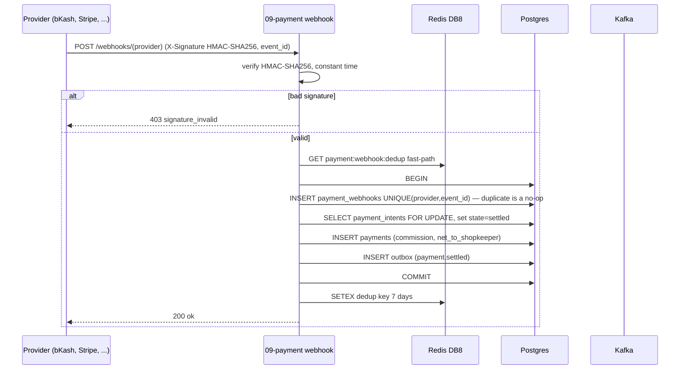
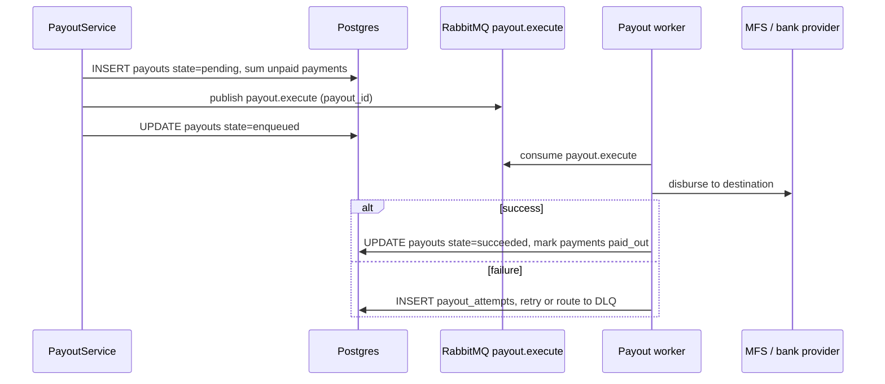

# `09-payment` — Payments & Payouts · Service Architecture

> **Scope.** Implementation-grade architecture for the DOKANDAR **`09-payment`** service — the money-movement
> authority: payment intents, provider settlements, refunds, commission, the COD ledger, and shopkeeper
> payouts. Authoritative spec: [`../../architecture.md`](../../architecture.md) §9 (`09-payment`) + §10–§14 +
> §21/§22; [`../../README.md`](../../README.md) §6/§7/§8/§10; [`../../SERVICE_INTEGRATION_TEMPLATE.md`](../../SERVICE_INTEGRATION_TEMPLATE.md)
> (Appendix **A.9 Elixir/Phoenix — target/provisional**). **On any conflict the README wins.**
>
> **Grounding, not copying — and a language gap.** The deployed reference at `~/Desktop/DevOps/09-payment` is
> **Java/Quarkus**; the **spec target is Elixir 1.20 / Phoenix 1.8**. The Java reference is read for **contract
> behaviour only** (the ledger schema, the webhook replay fence, the payout worker); every Elixir mechanic
> below is **spec-extrapolated and marked provisional — no Elixir `file:line`**. Code does not exist yet; this
> is the build contract.

| | |
| --- | --- |
| **Service** | `09-payment` |
| **Domain** | Transaction — money movement |
| **Language · framework** | **Elixir 1.20 · Phoenix 1.8** *(spec target — provisional)* |
| **`SERVICE_PORT`** | `4000` (Phoenix) · **no gRPC** |
| **External ports** | REST `10009` |
| **Datastores** | PostgreSQL `dokandar_payment_<env>` (sole writer) · Redis **DB 8** (rate-limit + webhook fast-path) |
| **`/ready` hard-gate** | **PostgreSQL only** (Redis/Kafka/RabbitMQ are diagnostic, not required to serve) |
| **gRPC** | **none** — `13-order` creates the intent via an internal **REST** call |
| **Emits (Kafka)** | `dokandar.payment.*` (incl. `payment.settled`), `dokandar.refund.processed` (outbox) |
| **Consumes (Kafka)** | none (driven by the sync intent call + inbound webhooks) |
| **RabbitMQ** | `payout.execute` (durable, single-consumer, bound DLQ) |
| **`service_name` (identity)** | `09-payment` — from `SERVICE_NAME`, used **identically** everywhere |

**Contents.** §1 Role · §2 Position · §3 Data · §4 Domain flows · §5 REST map · §6 OpenAPI/Swagger surface ·
§7 gRPC (none) · §8 The five ops endpoints · §9 TENANT/`/data`/env · §10 Eventing · §11 Logging & observability ·
§12 Security · §13 Resilience · §14 Boot · §15 Deployment · §16 Stack landmines · §17 Design decisions ·
§18 Build status.

---

## 1. Role & bounded context

`09-payment` is the **sole authority that declares money settled**. It owns the payment intent lifecycle,
ingests provider webhooks, computes commission, maintains the **COD ledger** (~70% of Bangladesh volume — the
courier remits collected cash days later), and dispatches shopkeeper **payouts**. On the BEAM, each intent runs
in an **isolated process** — a misbehaving provider callback faults one intent, never the node.

**Responsibilities**

- **Payment intents** — one per order (`order_id`-keyed idempotency), across bKash, Nagad, Rocket, SSLCommerz,
  Stripe, bank transfer, wallet, and **COD**.
- **Webhook ingestion** — HMAC-verified provider callbacks; settlement recorded effectively-once via
  `UNIQUE(provider, event_id)`.
- **Refunds & commission reversal** — partial/full refunds, with proportional commission reversal.
- **COD ledger** — commission owed on cash orders, settled later via payout or invoice.
- **Payouts** — net-to-shopkeeper disbursement (`instant` / `held_3day`) over a durable RabbitMQ worker.

**Explicitly NOT in scope**: order state/saga (`13-order` drives the intent); wallet balance (`10-wallet`);
the cart quote (`06-cart`). Payment **never stores a PAN** — only `card_last4` / `card_brand` / a provider
token.

---

## 2. Position in the platform

```
   13-order ──internal REST POST /intents (INTERNAL_SERVICE_TOKEN)──► 09-payment (Elixir/Phoenix · REST :4000 · NO gRPC)
   providers ──POST /webhooks/(provider) (HMAC X-Signature)─────────►│
                                                                     ├──► Postgres dokandar_payment_<env> (+ outbox)
                                                                     ├──► Redis DB 8  rate-limit · payment:webhook:dedup:<p>:<e>
                                                                     ├──► Kafka  payment.* · refund.processed (outbox)
                                                                     └──► RabbitMQ  payout.execute (durable worker + DLQ)
   consumers of payment.settled: 13-order (confirm), 10-wallet, 11-reporting, 14-notification ◄──────────┘
```

Payment **exposes no gRPC** — the order saga creates the intent via an internal **REST** call (README §22
drift resolution). Settlement is announced asynchronously over Kafka (`payment.settled`), so order/wallet/
reporting react by **choreography**, not a synchronous callback.

---

## 3. Data architecture

### 3.1 PostgreSQL — `dokandar_payment_<env>` (sole writer)

Domain enums are `VARCHAR + CHECK` (avoids ORM PG-enum cast fragility). The DB is private (database-per-service)
so no consumer is affected.

```sql
CREATE TABLE payment_intents (
  id                    uuid PRIMARY KEY DEFAULT gen_random_uuid(),
  order_id              uuid NOT NULL UNIQUE,                  -- ONE intent per order (no double-charge)
  customer_id           uuid NOT NULL,
  shopkeeper_id         uuid,
  provider              varchar(20) NOT NULL
      CHECK (provider IN ('bkash','nagad','rocket','sslcommerz','stripe','bank_transfer','wallet','cod')),
  amount_minor          int NOT NULL,
  currency              char(3) NOT NULL DEFAULT 'BDT',
  state                 varchar(20) NOT NULL DEFAULT 'created'
      CHECK (state IN ('created','pending','settled','failed','cancelled','refunded','cod_pending')),
  provider_intent_id    varchar(120),
  provider_redirect_url varchar(2048),
  card_last4            varchar(4),                            -- NEVER the PAN
  card_brand            varchar(20),
  card_tokenized_id     varchar(120),
  idempotency_key       varchar(120) NOT NULL UNIQUE,          -- = order_id
  created_at            timestamptz NOT NULL DEFAULT now(),
  settled_at            timestamptz
);
CREATE INDEX idx_intents_state ON payment_intents(state) WHERE state IN ('pending','cod_pending');

CREATE TABLE payments (
  id                      uuid PRIMARY KEY DEFAULT gen_random_uuid(),
  intent_id               uuid NOT NULL UNIQUE REFERENCES payment_intents(id),
  provider_txn_id         varchar(120) NOT NULL,
  amount_minor            int NOT NULL,
  commission_minor        int NOT NULL,
  net_to_shopkeeper_minor int NOT NULL,
  paid_out                boolean NOT NULL DEFAULT false,      -- drained by a payout
  settled_at              timestamptz NOT NULL DEFAULT now()
);
CREATE INDEX idx_payments_unpaid ON payments(paid_out) WHERE paid_out = false;

-- the webhook replay fence
CREATE TABLE payment_webhooks (
  id           uuid PRIMARY KEY DEFAULT gen_random_uuid(),
  provider     varchar(20) NOT NULL,
  event_id     varchar(120) NOT NULL,                          -- provider idempotency id
  raw_body     text NOT NULL,
  signature_ok boolean NOT NULL,
  processed_at timestamptz,
  received_at  timestamptz NOT NULL DEFAULT now(),
  UNIQUE (provider, event_id)                                  -- effectively-once settlement
);

CREATE TABLE payouts (
  id                 uuid PRIMARY KEY DEFAULT gen_random_uuid(),
  shopkeeper_id      uuid NOT NULL,
  tier               varchar(20) NOT NULL,                     -- instant | held_3day
  amount_minor       int NOT NULL,
  payment_intent_ids text NOT NULL,
  method             varchar(20) NOT NULL,                     -- bank_transfer | bkash | nagad
  destination        text NOT NULL,
  state              varchar(20) NOT NULL DEFAULT 'pending'
      CHECK (state IN ('pending','enqueued','succeeded','failed')),
  attempts           int NOT NULL DEFAULT 0,
  provider_txn_id    varchar(120),
  created_at         timestamptz NOT NULL DEFAULT now()
);

CREATE TABLE payout_attempts (
  id bigserial PRIMARY KEY, payout_id uuid NOT NULL REFERENCES payouts(id) ON DELETE CASCADE,
  attempt_no int NOT NULL, state varchar(20) NOT NULL, error text,
  attempted_at timestamptz NOT NULL DEFAULT now()
);

CREATE TABLE cod_ledger (
  id bigserial PRIMARY KEY, shopkeeper_id uuid NOT NULL, order_id uuid NOT NULL,
  commission_owed_minor int NOT NULL,
  settled_via_payout_id uuid REFERENCES payouts(id), settled_via_invoice_id uuid,
  created_at timestamptz NOT NULL DEFAULT now()
);

CREATE TABLE commission_rates (
  id uuid PRIMARY KEY DEFAULT gen_random_uuid(),
  scope varchar(20) NOT NULL CHECK (scope IN ('platform_default','category','shopkeeper')),
  scope_id uuid, percent_basis_points int NOT NULL, flat_minor int NOT NULL DEFAULT 0,  -- 250 = 2.5%
  valid_from timestamptz NOT NULL DEFAULT now(), valid_until timestamptz,
  created_by uuid NOT NULL, created_at timestamptz NOT NULL DEFAULT now()
);

CREATE TABLE commission_reversals (
  id uuid PRIMARY KEY DEFAULT gen_random_uuid(),
  payment_id uuid NOT NULL REFERENCES payments(id),
  refunded_amount_minor int NOT NULL, reversed_commission_minor int NOT NULL,
  return_id uuid, created_at timestamptz NOT NULL DEFAULT now()
);

CREATE TABLE outbox (
  id bigserial PRIMARY KEY, topic varchar(120) NOT NULL, key varchar(120),
  payload text NOT NULL, created_at timestamptz NOT NULL DEFAULT now(), sent_at timestamptz
);
CREATE INDEX idx_outbox_pending ON outbox(created_at) WHERE sent_at IS NULL;
```

A `platform_default` commission rate (2.5%) is seeded so settlement always resolves a rate.

### 3.2 Redis — DB 8 (rate-limit + webhook fast-path, NOT gated)

| Key | Value | Purpose |
| --- | --- | --- |
| provider rate-limit windows | counters | throttle outbound provider calls |
| `payment:webhook:dedup:<provider>:<event_id>` | `1` (7-day TTL) | **fast-path** dedup before the PG `UNIQUE` |

Redis is a **fast-path only** — the **PG `UNIQUE(provider, event_id)` is the source of truth**. A Redis outage
falls through to the PG fence, so Redis **does not gate `/ready`** (§8.1).

---

## 4. Domain flows

### 4.1 Webhook ingestion (HMAC + replay fence + settle)



The business effect **and** the `(provider, event_id)` row commit in one transaction → a duplicate callback is
a no-op. The intent row is taken `FOR UPDATE` so concurrent callbacks serialize.

### 4.2 Payout via durable RabbitMQ worker



---

## 5. Synchronous REST API map

All under **`/api/v1/payment/*`**. Pretty JSON except `/metrics`/`/openapi.json`/`/docs`.

| Method | Path | Auth | Purpose |
| --- | --- | --- | --- |
| `POST` | `/api/v1/payment/intents` | **internal** (`INTERNAL_SERVICE_TOKEN`) | create an intent (called by `13-order`) |
| `GET` | `/api/v1/payment/intents/me` | Bearer | the customer's intents |
| `GET` | `/api/v1/payment/intents/{id}` | Bearer | intent detail (owner/admin) |
| `POST` | `/api/v1/payment/refunds` | Bearer (admin/system) | issue a refund (+ commission reversal) |
| `GET` | `/api/v1/payment/payouts` | Bearer | shopkeeper payouts |
| `POST` | `/api/v1/payment/payouts` | Bearer (admin/system) | trigger a payout run |
| `GET` | `/api/v1/payment/cod-ledger` | Bearer | unsettled COD commission |
| `GET`/`POST` | `/api/v1/payment/commission-rates` | Bearer (admin) | manage commission rates |
| `POST` | `/api/v1/payment/webhooks/{provider}` | provider HMAC | ingest a provider callback |

Intent creation requires the constant-time `INTERNAL_SERVICE_TOKEN` (it is an east-west, system-only
operation); customer reads require a Bearer; webhooks authenticate by **HMAC signature**, not JWT.

---

## 6. The OpenAPI / Swagger surface

For the Phoenix target, the OpenAPI document is produced by **`open_api_spex`** (`@doc` + operation specs on
the controllers) **or** a hand-written spec + a CI route-vs-spec diff *(provisional)*; served at `/openapi.json`
with Swagger UI at `/docs`.

- **Security schemes** — `HTTPBearer` (JWT) for customer reads; an `InternalToken` apiKey header
  (`x-internal-token`) for `POST /intents`; webhook routes document the `X-Signature` HMAC header (no JWT).
- **Info** — title **DOKANDAR Payment Service**, `version` from `CODE_VERSION` (= `09-payment`), identity
  banner + How-to-test in the description.
- **Schema catalog** — `IntentCreate` (`order_id`, `customer_id`, `amount_minor`, `provider` enum,
  `card_last4?`), `IntentDto` (state machine), `RefundCreate`, `PayoutTrigger`, `CommissionRate`,
  `CodLedgerEntry`, `ErrorEnvelope`.
- **Per-endpoint responses** — create intent: `201` · `401 token_invalid` · `409 intent_exists` (order already
  has an intent) · `422`. webhook: `200` · `403 signature_invalid` · `200` (duplicate event = idempotent no-op).
  Examples prefilled per provider.

---

## 7. gRPC

`09-payment` **exposes no gRPC** and calls none (README §22). The order saga (`13-order`) creates the intent
via an **internal REST** `POST /api/v1/payment/intents` authenticated with the constant-time
`INTERNAL_SERVICE_TOKEN`; settlement is announced over Kafka (`payment.settled`). This is the spec's resolution
of the §10-order "intent (all gRPC)" drift — **REST, not gRPC**.

---

## 8. The five operational endpoints

Shared identity block (`service_name=09-payment`, `code_version=09-payment`, …). Pretty JSON except `/metrics`.

### 8.1 `GET /ready` — traffic gating (PostgreSQL only)

Gates **PostgreSQL only**. Redis is a fast-path/rate-limit cache (the PG `UNIQUE` fence is authoritative);
Kafka + RabbitMQ are diagnostic (settlement persists in PG and relays/dispatches asynchronously). `200`/`503`.

```jsonc
{ "status": "ready", "identity": { … }, "dependencies": [ { "name": "postgres", "reachable": true, "latency_ms": 1.1 } ] }
```

> **Spec correction (§16-a).** The Java reference gates `/ready` on **postgres + redis**; spec §9 is explicit —
> **postgres only** ("Redis not required to serve; Kafka/RabbitMQ diagnostic").

### 8.2 `GET /health` — full diagnostics

Identity + all deps + observability. Core: `postgres`; diagnostic-but-reported: `redis`, `kafka`, `rabbitmq`,
`mongo_logs`, `apm`. (For payment, only Postgres is truly traffic-blocking; the rest are reported and alerted,
not `/ready`-gating.)

```jsonc
{
  "status": "healthy",
  "identity": { … },
  "checks": {
    "postgres":   { "ok": true },
    "redis":      { "ok": true },
    "kafka":      { "ok": true },
    "rabbitmq":   { "ok": true },
    "mongo_logs": { "ok": true },
    "apm":        { "ok": true }
  },
  "observability": {
    "apm_service_name": "09-payment",
    "logs_sink_mongo":  "mongodb://…/mongo_db_dokandar_application_logs.09-payment",
    "logs_sink_es":     "http://es-host:9200/logs-app-09-payment-*"
  }
}
```

### 8.3 `GET /data` — TENANT snapshot

`data/<TENANT>/result.json` (bind-mounted RO), identity prepended; `404 no_snapshot` / `500 snapshot_parse_failed`.

### 8.4 `GET /metrics`

RED + payment business + outbox gauge; closed-set labels (provider, state, result — **never** customer/PAN);
`service="09-payment"`.

```
payment_settled_total{service="09-payment",provider="bkash"}    …
payment_webhook_total{service="09-payment",result="ok"}         …   # ok|dup|signature_invalid
payout_total{service="09-payment",state="succeeded"}            …
payment_outbox_pending{service="09-payment"}                    …   # mandatory
```

### 8.5 `GET /docs` & `GET /openapi.json`

Swagger UI (titled **DOKANDAR Payment Service**) + the compact document. Bare 404 on unmapped paths; `405` on
method typos.

---

## 9. TENANT, `/data` & the env-render contract

```ini
APP_ENV=prod
SERVICE_NAME=09-payment           # identity everywhere — FAIL FAST if empty
ENV_VERSION=v1.0.0
TENANT=cloud
SERVICE_PORT=4000                 # Phoenix (normalized from the MVP's 8000); NO gRPC

# PostgreSQL
POSTGRES_HOST=<INFRA_HOST>
POSTGRES_PORT=<PG_PORT>
POSTGRES_USER=<PG_USER>
POSTGRES_PASSWORD=<PG_PASS>
POSTGRES_DB=dokandar_payment_prod
POSTGRES_ADMIN_DSN=…/postgres     # ensure-db

# Redis (DB 8 — rate-limit + webhook fast-path; NOT gated)
REDIS_HOST=<INFRA_HOST>
REDIS_PORT=<REDIS_PORT>
REDIS_PASSWORD=<REDIS_PASS>
REDIS_DB=8

# Kafka (emit-only)
KAFKA_BOOTSTRAP=<KAFKA_EXTERNAL>
KAFKA_TOPIC_PAYMENT=dokandar.payment.settled
KAFKA_TOPIC_REFUND=dokandar.refund.processed

# RabbitMQ (payout.execute — durable worker + DLQ)
RABBITMQ_HOST=<INFRA_HOST>
RABBITMQ_PORT=5672
RABBITMQ_USERNAME=<RABBITMQ_USER>
RABBITMQ_PASSWORD=<RABBITMQ_PASS>
RABBITMQ_QUEUE_PAYOUT=payout.execute

# Provider credentials (HMAC webhook secrets, per provider)
BKASH_WEBHOOK_SECRET=<…>
NAGAD_WEBHOOK_SECRET=<…>
STRIPE_WEBHOOK_SECRET=<…>
SSLCOMMERZ_WEBHOOK_SECRET=<…>

# Observability
MONGO_LOG_URI=<MONGO_URI>
MONGO_LOG_DB=mongo_db_dokandar_application_logs   # collection = 09-payment
APM_SERVER_URL=<APM_URL>                          # OTLP endpoint (no Elastic agent for Elixir)
APM_SERVICE_NAME=09-payment                       # normalized from the MVP's 'payment'

# JWT (verify-only) + east-west
JWT_PUBLIC_KEY_B64=<JWT_PUBLIC>   # FAIL FAST under stage/prod if empty
JWT_ISSUER=dokandar-auth
INTERNAL_SERVICE_TOKEN=<INTERNAL_TOKEN>           # FAIL FAST under stage/prod; Plug.Crypto.secure_compare
```

Fail-fast on empty `SERVICE_NAME` (always) and empty `JWT_PUBLIC_KEY_B64` / `INTERNAL_SERVICE_TOKEN` under
stage/prod. `TENANT` read once → identity, `/data`, APM labels.

---

## 10. Eventing

**Emits** (transactional outbox, `acks=all`): `dokandar.payment.settled` (drives order confirm + wallet +
reporting + notification), `dokandar.refund.processed`. Keyed by `order_id` / `payment_id`.

**Consumes no Kafka** — payment is driven by the synchronous intent call + inbound webhooks, not by events.

**RabbitMQ** `payout.execute` — a durable queue with a single-consumer worker and a bound **DLQ**; failed
payouts retry with backoff, then dead-letter for manual settlement. `payment_outbox_pending` exposes relay lag.

> **Idempotency layers.** (1) `order_id`-keyed intent uniqueness prevents double-charge; (2)
> `UNIQUE(provider, event_id)` makes webhook delivery effectively-once; (3) the outbox is at-least-once
> publish — downstream consumers dedup by event id.

---

## 11. Application logging & observability

- **Three sinks** — stdout (pretty JSON) + MongoDB `mongo_db_dokandar_application_logs.09-payment` +
  Elasticsearch `logs-app-09-payment-*` (ECS); every line carries the trace id. **Sink writes run off the
  request process** (a `GenServer`/`Task` drainer) — never inline in the request — so a slow sink never blocks
  a settlement. **Webhook bodies and card data are never logged.**
- **Access log** — one line per genuine request; `/ready`, `/metrics`, **and `/health`** excluded; true client
  IP, method, **templated** route, status, latency, `request_id`.
- **APM (Elixir)** — **no Elastic APM agent for Elixir**; instrument with **OpenTelemetry → OTLP** into the APM
  Server, installed as the **first `Plug`** in the endpoint (the Elixir "outermost" rule). Wire service name
  `09-payment` + version from `CODE_VERSION`.
- **Metrics** — `:telemetry` + a Prometheus exporter; RED + `payment_settled_total{provider}`,
  `payment_webhook_total{result}`, `payout_total{state}`, `payment_outbox_pending`.

---

## 12. Security

- **PANs never stored** — only `card_last4` / `card_brand` / a provider token; raw card data never touches the
  service.
- **Webhook HMAC** — every callback's `X-Signature` is verified **HMAC-SHA256** against the per-provider secret,
  compared in **constant time** (`Plug.Crypto.secure_compare`); a bad signature → `403 signature_invalid`
  before any state change.
- **Internal intent creation** — `POST /intents` requires `INTERNAL_SERVICE_TOKEN` (constant-time compare); it
  is not a customer-facing route.
- **Verify-only RS256** — customer reads decode `JWT_PUBLIC_KEY_B64`, pin `RS256`, check `iss`/`aud`/`exp`/`sub`,
  enforce owner/admin scoping (`403 forbidden`).
- **Isolation** — each intent is an isolated BEAM process; a faulting callback never cascades.

---

## 13. Resilience & failure modes

| Failure | Effect | Mitigation |
| --- | --- | --- |
| Redis down | rate-limit/dedup fast-path lost | fall through to the PG `UNIQUE` fence — `/ready` stays green |
| duplicate webhook | replayed callback | `UNIQUE(provider,event_id)` → idempotent no-op |
| concurrent callbacks | intent race | `SELECT … FOR UPDATE` on the intent row serializes |
| Kafka down | settlement not announced | outbox buffers; `payment_outbox_pending` climbs; settlement still persisted |
| RabbitMQ down / payout fails | disbursement delayed | durable queue + retry + DLQ; `payout_attempts` audit trail |
| provider callback malformed | one intent | isolated BEAM process faults that intent only |
| Postgres down | cannot settle | `/ready` → `503` |

---

## 14. Boot sequence & lifecycle

1. Read identity; fail-fast on empty `SERVICE_NAME` / (stage·prod) `JWT_PUBLIC_KEY_B64` / `INTERNAL_SERVICE_TOKEN`.
2. **OTel → OTLP** as the first plug in the Phoenix endpoint.
3. **ensure-db** → `CREATE DATABASE dokandar_payment_<env>` if absent.
4. **Ecto/Flyway migrate** (the V1 schema + the seeded platform_default commission rate); set an Ecto
   `:timeout` on the repo.
5. Start the Phoenix endpoint (`4000`), the outbox relay, the **RabbitMQ payout worker**, and the **COD
   settlement sweeper** as supervised processes.
6. Serve — `HEALTHCHECK → /ready`. Elixir 1.20 / Phoenix 1.8; `mix release` with an ERTS/glibc base matching the
   runtime image.

---

## 15. Deployment & runtime

- **Image** — multi-stage (`mix release` → a slim base whose **glibc/ERTS matches the build**), non-root **uid
  `10001`**. REST `4000`; **no gRPC port**. External LB maps `10009 → 4000`.
- **`HEALTHCHECK`** — `GET /ready`. **Config** — `--env-file` at runtime; `data/<tenant>/` bind-mounted RO.
- **Scaling** — stateless web tier on HPA-by-RPS; the payout worker scales on RabbitMQ queue depth (KEDA). The
  COD sweeper is a singleton supervised process. The hot path is webhook ingestion (idempotent, fast).

---

## 16. Stack landmines & reconciliation

- **(a) `/ready` postgres-only** — the Java ref gates postgres+redis; spec §9 is **postgres only** (§8.1).
- **(b) Reference language** — deployed ref is **Java/Quarkus**; spec target is **Elixir 1.20 / Phoenix 1.8** —
  read Java for contract; write Elixir; **no Elixir `file:line`** (provisional).
- **(c) No gRPC** — payment exposes none; the order saga creates the intent via **internal REST** (README §22).
- **(d) APM = OTLP, not an agent** — Elixir has no Elastic APM agent; use OTel → OTLP as the first plug (§11).
- **(e) Off-request log drainer** — sink writes go through a `GenServer`/`Task`, never inline (§11).
- **(f) `Plug.Crypto.secure_compare`** — constant-time for the webhook HMAC **and** `INTERNAL_SERVICE_TOKEN`.
- **(g) Ecto `:timeout` + `mix release` ERTS/glibc match** — bound DB calls; match the release base image (§14).
- **(h) Access-log exclusions** — add `/health` to `/ready`+`/metrics` (§11).
- **(i) PANs never stored / bodies never logged** — only `card_last4`/token; webhook bodies excluded from sinks.
- **(j) Identity/port** — normalize `SERVICE_PORT 8000→4000`, `APM_SERVICE_NAME payment→09-payment`,
  `CODE_VERSION 9-payment→09-payment`, `POSTGRES_DB payment→dokandar_payment_<env>`.

---

## 17. Design decisions & open items

- **Choreography, not orchestration** — payment announces `payment.settled` and lets order/wallet/reporting
  react independently; it never calls back synchronously. This decouples settlement from downstream availability.
- **PG `UNIQUE` is the fence, Redis is the fast-path** — the durable idempotency guarantee is in Postgres; Redis
  only saves a round-trip, so a Redis outage is harmless (hence non-gating).
- **Intent = isolated process** — the BEAM model gives per-intent fault isolation that a thread-pool service
  can't: a hung provider callback can't take the node down.
- **COD is first-class** — ~70% of volume is cash; `cod_ledger` tracks commission owed and settles it later via
  payout/invoice, decoupled from the (delayed) cash remittance.
- **Open items** — refund partial-vs-full commission reversal edge cases; payout batching windows; per-provider
  webhook signature schemes (header names differ); the COD settlement sweeper cadence.

---

## 18. Build status & cross-references

**Status — specified, not yet implemented.** No code exists; this is the build contract. Reference shape:
`~/Desktop/DevOps/09-payment` (a **Java/Quarkus** MVP — read for contract behaviour only; the spec target is
**Elixir 1.20 / Phoenix 1.8**, §16-b; all Elixir mechanics provisional).

**Authoritative sources**

- [`../../architecture.md`](../../architecture.md) — **§9** `09-payment`; **§10–§14**; **§21** the anchor;
  **§22** the intent-transport (REST not gRPC) drift resolution.
- [`../../README.md`](../../README.md) — §6 service table · §7 ports (09 gRPC = `—`) · §8 pins · §10 datastore role.
- [`../../SERVICE_INTEGRATION_TEMPLATE.md`](../../SERVICE_INTEGRATION_TEMPLATE.md) — Appendix **A.9
  Elixir/Phoenix (target/provisional)**; the OTLP / `secure_compare` / off-request-drainer landmine rows.
- Sibling exemplars: [`../01-auth/architecture.md`](../01-auth/architecture.md) (contract depth),
  [`../13-order/architecture.md`](../13-order/architecture.md) (the saga that creates the intent).

**Build checklist** — `Dockerfile` (multi-stage `mix release`, uid 10001, `HEALTHCHECK → /ready`) ·
`env/init-env.sh` + `.env.<env>` (fail-fast) · the five endpoints + identity + `X-Request-Id` envelope · the
webhook HMAC + replay fence · the RabbitMQ payout worker + DLQ · `data/<tenant>/result.json` · `OPERATIONS.md` /
`SECURITY.md` / `docs/adr/`.
