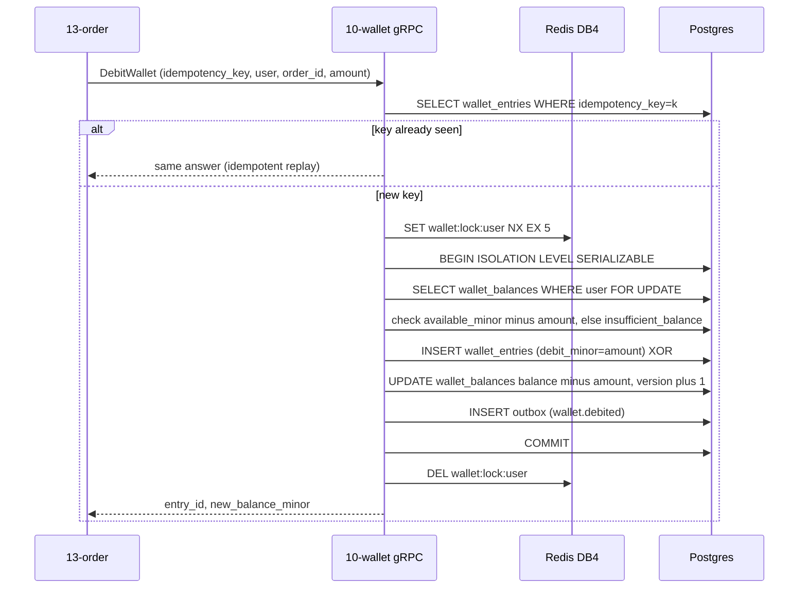
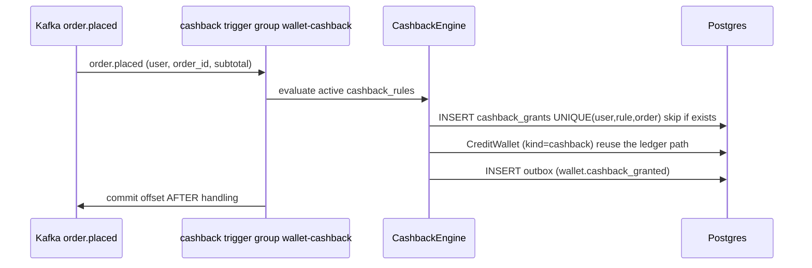

# `10-wallet` — Wallet & Cashback Ledger · Service Architecture

> **Scope.** Implementation-grade architecture for the DOKANDAR **`10-wallet`** service — the platform wallet
> (a double-entry credit/debit ledger) + the cashback engine. Authoritative spec:
> [`../../architecture.md`](../../architecture.md) §9 (`10-wallet`) + §10–§14 + §21; [`../../README.md`](../../README.md)
> §6/§7/§8/§10; [`../../SERVICE_INTEGRATION_TEMPLATE.md`](../../SERVICE_INTEGRATION_TEMPLATE.md) (Appendix **A.2
> Go/chi** + A.10 target rows). **On any conflict the README wins.**
>
> **Grounding, not copying — and a language gap.** The deployed reference at `~/Desktop/DevOps/10-wallet` is
> **C#/.NET**; the **spec target is Go 1.26 / Fiber v3 + GORM**. The .NET reference is read for **contract
> behaviour only** (the double-entry ledger, the SERIALIZABLE+Redlock write, the cashback rules); the Go idiom
> is grounded in the sibling Go services (`02-profile`, `04-catalog`) but the wallet-specific realization is
> **provisional — no wallet Go `file:line`**. Code does not exist yet; this is the build contract.

| | |
| --- | --- |
| **Service** | `10-wallet` |
| **Domain** | Transaction — wallet ledger & cashback |
| **Language · framework** | **Go 1.26 · Fiber v3 + GORM** *(spec target — provisional)* |
| **`SERVICE_PORT`** | `8080` (REST) · gRPC `50051` |
| **External ports** | REST `10010` · gRPC `20010` |
| **Datastores** | PostgreSQL `dokandar_wallet_<env>` (sole writer) · Redis **DB 4** (per-wallet Redlock) |
| **`/ready` hard-gate** | **PostgreSQL only** (Redis is the lock, recompute/serialize via PG) |
| **gRPC server** | `Wallet.GetBalance \| DebitWallet \| CreditWallet` @ `50051` |
| **Emits (Kafka)** | `dokandar.wallet.credited \| debited \| cashback_granted` (outbox) |
| **Consumes (Kafka)** | `dokandar.order.placed` (cashback trigger) |
| **`service_name` (identity)** | `10-wallet` — from `SERVICE_NAME`, used **identically** everywhere |

**Contents.** §1 Role · §2 Position · §3 Data · §4 Domain flows · §5 REST map · §6 OpenAPI/Swagger surface ·
§7 gRPC (first-class) · §8 The five ops endpoints · §9 TENANT/`/data`/env · §10 Eventing · §11 Logging &
observability · §12 Security · §13 Resilience · §14 Boot · §15 Deployment · §16 Stack landmines · §17 Design
decisions · §18 Build status.

---

## 1. Role & bounded context

`10-wallet` is the customer wallet — an **append-only, double-entry ledger** where every row is *either* a
debit *or* a credit (never both), a materialized balance, and a **cashback engine** that grants rewards on
qualifying orders. It is an **authoritative-read** service: the balance is read straight from Postgres on every
read (never cached) because a stale balance is a correctness/security bug (double-spend).

**Responsibilities**

- **Ledger** — `wallet_entries` (debit XOR credit, idempotency-keyed) + a `wallet_balances` materialization
  (optimistic `version`, hard cap **50,000 BDT = 5,000,000 minor**).
- **Debit / credit** — east-west gRPC for Order (debit at checkout when wallet-redeem is opted) and Payment
  (credit on refund-to-wallet / top-up), plus customer-facing top-up + history.
- **Cashback** — rule-driven rewards (`first_order`, `birthday`, `referral`, `subtotal_threshold`,
  `repeat_purchase`), triggered by `order.placed`, granted idempotently.
- **Loyalty tiers** — bronze/silver/gold/platinum derived from activity (informational; not money).

**Explicitly NOT in scope**: payment provider settlement (`09-payment`); order state (`13-order`); coupon
discounts (`07-coupon`). Wallet moves *its own* money only.

---

## 2. Position in the platform

```
   13-order   ──gRPC DebitWallet (checkout, wallet-redeem)──►┐
   09-payment ──gRPC CreditWallet (refund-to-wallet, topup)─►│  10-wallet (Go/Fiber · REST :8080 · gRPC :50051)
   customer   ──/api/v1/wallet/* (balance, history, topup)──►│        │
                                                             │        ├──► Postgres dokandar_wallet_<env> (+ outbox)
   13-order   ──order.placed (Kafka) ─► cashback trigger ───►│        ├──► Redis DB 4  wallet:lock:<user> (Redlock)
                                                             │        └──► Kafka  wallet.credited|debited|cashback_granted (outbox)
   consumers of wallet.* : 11-reporting, 14-notification ◄────────────┘
```

Wallet **exposes** the ledger gRPC and **consumes** `order.placed` for cashback; it calls no other service's
gRPC. The balance is never cached — reads hit Postgres.

---

## 3. Data architecture

### 3.1 PostgreSQL — `dokandar_wallet_<env>` (sole writer)

Enum-like columns are `VARCHAR + CHECK`. The ledger is **append-only**; the balance is a materialization
guarded by an optimistic `version` and a hard cap.

```sql
CREATE TABLE wallets (
  user_id    uuid PRIMARY KEY,
  currency   char(3) NOT NULL DEFAULT 'BDT',
  status     varchar(20) NOT NULL DEFAULT 'active' CHECK (status IN ('active','frozen','closed')),
  created_at timestamptz NOT NULL DEFAULT now()
);

-- the double-entry ledger: each row is EITHER a debit OR a credit, never both
CREATE TABLE wallet_entries (
  id              uuid PRIMARY KEY DEFAULT gen_random_uuid(),
  wallet_user_id  uuid NOT NULL,
  debit_minor     int NOT NULL DEFAULT 0,
  credit_minor    int NOT NULL DEFAULT 0,
  kind            varchar(40) NOT NULL,           -- order_payment|topup|refund_to_wallet|cashback|…
  order_id        uuid,
  sub_order_id    uuid,
  payment_intent_id uuid,
  expires_at      timestamptz,                     -- promotional credits can expire
  idempotency_key varchar(120) NOT NULL UNIQUE,    -- the dedup fence
  posted_at       timestamptz NOT NULL DEFAULT now(),
  CHECK ((debit_minor > 0) <> (credit_minor > 0))  -- XOR: exactly one side positive
);
CREATE INDEX idx_entries_user_posted ON wallet_entries(wallet_user_id, posted_at DESC);
CREATE INDEX idx_entries_expiring    ON wallet_entries(expires_at) WHERE expires_at IS NOT NULL;

-- the materialized balance — optimistic version + hard cap
CREATE TABLE wallet_balances (
  user_id         uuid PRIMARY KEY,
  balance_minor   int NOT NULL DEFAULT 0,
  available_minor int NOT NULL DEFAULT 0,
  version         int NOT NULL DEFAULT 0,           -- optimistic-concurrency token
  updated_at      timestamptz NOT NULL DEFAULT now(),
  CHECK (balance_minor BETWEEN 0 AND 5000000)       -- 0 .. 50,000 BDT (minor units = paisa)
);

CREATE TABLE cashback_rules (
  id uuid PRIMARY KEY DEFAULT gen_random_uuid(),
  trigger    varchar(40) NOT NULL CHECK (trigger IN ('first_order','birthday','referral','subtotal_threshold','repeat_purchase')),
  funded_by  varchar(12) NOT NULL CHECK (funded_by IN ('platform','shopkeeper')),
  reward_kind varchar(20) NOT NULL CHECK (reward_kind IN ('fixed_credit','percent_back')),
  reward_value int NOT NULL, reward_cap_minor int, min_subtotal_minor int,
  max_per_user int NOT NULL DEFAULT 1,
  active_from timestamptz NOT NULL DEFAULT now(), active_until timestamptz,
  state varchar(20) NOT NULL DEFAULT 'active' CHECK (state IN ('active','retired')),
  created_at timestamptz NOT NULL DEFAULT now()
);

CREATE TABLE cashback_grants (
  id uuid PRIMARY KEY DEFAULT gen_random_uuid(),
  user_id uuid NOT NULL, rule_id uuid NOT NULL, order_id uuid NOT NULL,
  amount_minor int NOT NULL, entry_id uuid, granted_at timestamptz NOT NULL DEFAULT now(),
  UNIQUE (user_id, rule_id, order_id)               -- idempotent grant
);

CREATE TABLE outbox (
  id bigserial PRIMARY KEY, topic varchar(120) NOT NULL, key varchar(120),
  payload jsonb NOT NULL, created_at timestamptz NOT NULL DEFAULT now(), sent_at timestamptz
);
CREATE INDEX idx_outbox_pending ON outbox(created_at) WHERE sent_at IS NULL;
```

A `subtotal_threshold` platform cashback rule (2% back) is seeded so the engine always resolves a rule.

### 3.2 Redis — DB 4 (per-wallet Redlock, not cached balance)

| Key | Value | Purpose |
| --- | --- | --- |
| `wallet:lock:<user_id>` | `1` (`SET NX EX 5s`, 2s wait, 50ms retry) | **Redlock** serializing concurrent debit/credit on one wallet |

The **balance is never cached** (authoritative read). Redis holds only the per-wallet lock. The durable
guarantees are in Postgres (SERIALIZABLE + the `version` + the `idempotency_key` UNIQUE), so a Redis outage
degrades to PG-level serialization — Redis **does not gate `/ready`** (§8.1).

---

## 4. Domain flows

### 4.1 Debit at checkout (the money core)



On a `40001 serialization_failure` the write **retries with backoff** (SERIALIZABLE can abort under contention).
Credit is symmetric, with the `5000000` cap check (`wallet_max_exceeded`) instead of the insufficient-funds
check.

### 4.2 Cashback on order.placed



The grant is idempotent (`UNIQUE(user, rule, order)`); a redelivered `order.placed` grants nothing twice.

---

## 5. Synchronous REST API map

All under **`/api/v1/wallet/*`**. Pretty JSON except `/metrics`/`/openapi.json`/`/docs`. Money is integer
minor units; UUIDs validated at the boundary.

| Method | Path | Auth | Purpose |
| --- | --- | --- | --- |
| `GET` | `/api/v1/wallet/me` | Bearer | balance + available + tier |
| `GET` | `/api/v1/wallet/me/entries?page=&size=` | Bearer | ledger history (paged) |
| `POST` | `/api/v1/wallet/me/topup` | Bearer (+ `Idempotency-Key`) | top up (credit) |
| `GET` | `/api/v1/wallet/cashback-rules` | public/Bearer | active cashback rules |
| `POST` | `/api/v1/wallet/cashback-rules` | Bearer (admin) | create a cashback rule |

The money-moving east-west operations (`DebitWallet`/`CreditWallet`) are **gRPC** (§7), not REST.

---

## 6. The OpenAPI / Swagger surface

`10-wallet` is a **hand-written-OpenAPI** stack (the Go convention, like `02-profile`): the OpenAPI 3.0.3
document is built by an explicit handler (no annotation scanner), served at `/openapi.json`, Swagger UI at
`/docs`. **Every route added to the router MUST get a matching `paths[]` entry** — enforced by a **CI
route-vs-spec diff** (the Go/PHP hand-written-stack guard).

- **Security scheme** — `HTTPBearer` (JWT) → the `Authorize` button; all customer routes are secured; admin
  routes additionally require an `admin` role.
- **Info** — title **DOKANDAR Wallet Service**, `version` from `CODE_VERSION` (= `10-wallet`), identity banner +
  How-to-test.
- **Schema catalog** — `Balance` (`balance_minor`, `available_minor`, `currency`, `tier`), `LedgerEntry`
  (`debit_minor`/`credit_minor`, `kind`, `posted_at`), `TopupCreate` (`amount_minor` ≥1, `Idempotency-Key`),
  `CashbackRule`, `ErrorEnvelope` (the error body is built as **JSON**, never `fmt.Sprintf` string-concat —
  §16).
- **Per-endpoint responses** — topup: `200` · `401` · `409 idempotent_replay` (cached) · `422 validation_error`
  · `409 wallet_max_exceeded`. entries: `200` · `401`. With prefilled examples.

---

## 7. gRPC — the ledger API @ 50051

The money-moving east-west surface, called by Order + Payment:

```proto
service Wallet {
  rpc GetBalance   (GetBalanceRequest)   returns (GetBalanceResponse);
  rpc DebitWallet  (DebitWalletRequest)  returns (DebitWalletResponse);
  rpc CreditWallet (CreditWalletRequest) returns (CreditWalletResponse);
}
message DebitWalletRequest  { string idempotency_key = 1; string user_id = 2; string order_id = 3;
                              int32 amount_minor = 4; string kind = 5; }   // idempotency_key REQUIRED
message DebitWalletResponse { string entry_id = 1; int32 new_balance_minor = 2; }
message CreditWalletRequest { string idempotency_key = 1; string user_id = 2; int32 amount_minor = 3;
                              string kind = 4; string order_id = 5; string sub_order_id = 6;
                              string payment_intent_id = 7; }
message GetBalanceResponse  { int32 balance_minor = 1; int32 available_minor = 2; string currency = 3; }
```

| RPC | Caller | When |
| --- | --- | --- |
| `DebitWallet` | `13-order` | checkout, when the customer opts to redeem wallet balance |
| `CreditWallet` | `09-payment` | refund-to-wallet, top-up via MFS bridge |
| `GetBalance` | `06-cart` / `13-order` | show redeemable balance at quote/place time |

Every RPC requires `x-internal-token` = `INTERNAL_SERVICE_TOKEN`, compared **constant-time**
(`subtle.ConstantTimeCompare`); mismatch → `UNAUTHENTICATED`. The `idempotency_key` is the dedup fence
(`UNIQUE` on `wallet_entries`); a replay returns the original answer.

---

## 8. The five operational endpoints

Shared identity block (`service_name=10-wallet`, `code_version=10-wallet`, …). Pretty JSON except `/metrics`.

### 8.1 `GET /ready` — traffic gating (PostgreSQL only)

Gates **PostgreSQL only**. Redis holds the per-wallet Redlock, but the durable serialization is SERIALIZABLE +
the `version` + the `idempotency_key` UNIQUE — a Redis outage degrades to PG-level serialization, it does not
make the service unable to serve a request. `200`/`503`.

```jsonc
{ "status": "ready", "identity": { … }, "dependencies": [ { "name": "postgres", "reachable": true, "latency_ms": 1.0 } ] }
```

### 8.2 `GET /health` — full diagnostics

Identity + core deps (`postgres`, `redis`, `kafka`, `mongo_logs`, `apm`) + observability.

```jsonc
{
  "status": "healthy",
  "identity": { … },
  "checks": {
    "postgres":   { "ok": true },
    "redis":      { "ok": true },
    "kafka":      { "ok": true },
    "mongo_logs": { "ok": true },
    "apm":        { "ok": true }
  },
  "observability": {
    "apm_service_name": "10-wallet",
    "logs_sink_mongo":  "mongodb://…/mongo_db_dokandar_application_logs.10-wallet",
    "logs_sink_es":     "http://es-host:9200/logs-app-10-wallet-*"
  }
}
```

### 8.3 `GET /data` — TENANT snapshot

`data/<TENANT>/result.json` (bind-mounted RO), identity prepended; `404 no_snapshot` / `500 snapshot_parse_failed`.

### 8.4 `GET /metrics`

RED + ledger business + outbox gauge; closed-set labels (never `user_id`); `service="10-wallet"`.

```
wallet_ledger_write_seconds_bucket{service="10-wallet",op="debit",le="0.05"}   …
wallet_debited_total{service="10-wallet"}        …
wallet_cashback_granted_total{service="10-wallet"}  …
wallet_serialization_retry_total{service="10-wallet"}  …   # 40001 retries
wallet_outbox_pending{service="10-wallet"}       …   # mandatory
```

### 8.5 `GET /docs` & `GET /openapi.json`

Swagger UI (titled **DOKANDAR Wallet Service**) + the hand-written document. Bare 404 on unmapped paths
(`Content-Length: 0`, no `Content-Type`); `405` on method typos.

---

## 9. TENANT, `/data` & the env-render contract

```ini
APP_ENV=prod
SERVICE_NAME=10-wallet            # identity everywhere — FAIL FAST if empty
ENV_VERSION=v1.0.0
TENANT=cloud
SERVICE_PORT=8080                 # REST (normalized from the MVP's 8000)
GRPC_PORT=50051                   # normalized from the MVP's 8001

# PostgreSQL
POSTGRES_HOST=<INFRA_HOST>
POSTGRES_PORT=<PG_PORT>
POSTGRES_USER=<PG_USER>
POSTGRES_PASSWORD=<PG_PASS>
POSTGRES_DB=dokandar_wallet_prod
POSTGRES_ADMIN_DSN=…/postgres     # ensure-db
WALLET_MAX_BALANCE_MINOR=5000000  # 50,000 BDT cap

# Redis (DB 4 — per-wallet Redlock)
REDIS_HOST=<INFRA_HOST>
REDIS_PORT=<REDIS_PORT>
REDIS_PASSWORD=<REDIS_PASS>
REDIS_DB=4

# Kafka
KAFKA_BOOTSTRAP=<KAFKA_EXTERNAL>
KAFKA_TOPIC_WALLET_CREDITED=dokandar.wallet.credited
KAFKA_TOPIC_WALLET_DEBITED=dokandar.wallet.debited
KAFKA_TOPIC_CASHBACK_GRANTED=dokandar.wallet.cashback_granted
KAFKA_TOPIC_ORDER_PLACED=dokandar.order.placed     # consume (cashback)
KAFKA_CONSUMER_GROUP=wallet-cashback

# Observability
MONGO_LOG_URI=<MONGO_URI>
MONGO_LOG_DB=mongo_db_dokandar_application_logs   # collection = 10-wallet
APM_SERVER_URL=<APM_URL>                          # OTLP / agent per the Go convention
APM_SERVICE_NAME=10-wallet                        # normalized from the MVP's 'wallet'

# JWT (verify-only) + east-west
JWT_PUBLIC_KEY_B64=<JWT_PUBLIC>   # FAIL FAST under stage/prod if empty
JWT_ISSUER=dokandar-auth
INTERNAL_SERVICE_TOKEN=<INTERNAL_TOKEN>           # FAIL FAST under stage/prod; subtle.ConstantTimeCompare
```

Fail-fast on empty `SERVICE_NAME` (always) and empty `JWT_PUBLIC_KEY_B64` / `INTERNAL_SERVICE_TOKEN` under
stage/prod. `TENANT` read once → identity, `/data`, APM labels.

---

## 10. Eventing

**Emits** (transactional outbox, `acks=all`, keyed by `user_id`): `dokandar.wallet.credited`,
`dokandar.wallet.debited`, `dokandar.wallet.cashback_granted`. Each ledger write enqueues its event in the same
transaction as the entry + balance update.

**Consumes** `dokandar.order.placed` (consumer group `wallet-cashback`) → evaluate cashback rules → grant
idempotently → credit the wallet. **At-least-once with manual commit after handling** (the reference: "don't
commit — retry on next poll" on a handler failure). `wallet_outbox_pending` exposes relay lag (poll
`WHERE sent_at IS NULL … FOR UPDATE SKIP LOCKED`).

---

## 11. Application logging & observability

- **Three sinks** — stdout (pretty JSON) + MongoDB `mongo_db_dokandar_application_logs.10-wallet` + Elasticsearch
  `logs-app-10-wallet-*` (ECS, `_bulk` **batched at 200** docs — §16); every line carries the trace id;
  fire-and-forget, drop-not-block.
- **Access log** — one line per genuine request; `/ready`, `/metrics`, **and `/health`** excluded; true client
  IP, method, **templated** route, status, latency, `request_id`.
- **APM (Go)** — the Elastic Go agent (or OTel) installed as the **outermost** Fiber middleware (`app.Use(...)`
  first) so transactions close; wire the service name `10-wallet` + version from `CODE_VERSION`.
- **Metrics** — `prometheus/client_golang`; RED + `wallet_ledger_write_seconds{op}`, `wallet_debited_total`,
  `wallet_cashback_granted_total`, `wallet_serialization_retry_total`, `wallet_outbox_pending`.

---

## 12. Security

- **Verify-only RS256** — decode `JWT_PUBLIC_KEY_B64` once at boot; pin `RS256` (explicit allowlist); check
  `iss`/`aud`/`exp`/`sub`; owner/admin scoping.
- **East-west** — `INTERNAL_SERVICE_TOKEN` compared with `subtle.ConstantTimeCompare` (constant time), never
  `==`/`bytes.Equal` in a branch.
- **Money-path integrity** — every debit/credit is idempotency-keyed (`UNIQUE`), runs SERIALIZABLE + a Redlock,
  is bounded by the `0..5,000,000` cap, and the entry is debit-XOR-credit (`CHECK`). The balance is **never
  cached** (authoritative read).
- **Boundary** — UUID-at-the-edge; integer-minor overflow rejected `422`; the error envelope is JSON, never a
  `fmt.Sprintf` string (avoids accidental data leakage / injection).

---

## 13. Resilience & failure modes

| Failure | Effect | Mitigation |
| --- | --- | --- |
| concurrent debit/credit | balance race | SERIALIZABLE + `wallet:lock:<user>` Redlock + `version` |
| `40001 serialization_failure` | tx aborted under contention | **retry with backoff**; `wallet_serialization_retry_total` |
| retried gRPC debit | double-spend risk | `idempotency_key UNIQUE` → original answer replayed |
| would exceed 50,000 BDT | over-cap credit | `wallet_max_exceeded` (DB `CHECK` + pre-check) |
| insufficient balance | over-spend | `insufficient_balance` (available check) |
| Redis down | lock unavailable | degrade to PG SERIALIZABLE serialization — `/ready` stays green |
| Kafka down | events/cashback delayed | outbox buffers; cashback back-fills on replay; `wallet_outbox_pending` climbs |
| Postgres down | cannot serve | `/ready` → `503` |

---

## 14. Boot sequence & lifecycle

1. Read identity; fail-fast on empty `SERVICE_NAME` / (stage·prod) `JWT_PUBLIC_KEY_B64` / `INTERNAL_SERVICE_TOKEN`.
2. **ensure-db** → `CREATE DATABASE dokandar_wallet_<env>` if absent.
3. Run migrations (the ledger + balance + cashback tables + the seeded rule); use `go.sum` (committed) — not
   `go mod tidy` at build (§16).
4. Start the REST server (`8080`) + the gRPC server (`50051`); APM outermost.
5. Start the outbox relay + the cashback (`order.placed`) consumer.
6. Serve — `HEALTHCHECK → /ready` (a tiny **healthcheck binary** in the distroless image; no curl).

---

## 15. Deployment & runtime

- **Image** — multi-stage Go build (`CGO_ENABLED=0`) → **distroless**, non-root **uid `10001`**, with a small
  static healthcheck binary. REST `8080`, gRPC `50051`. External LB maps `10010 → 8080`, `20010 → 50051`.
- **`HEALTHCHECK`** — `GET /ready`. **Config** — `--env-file` at runtime; `data/<tenant>/` bind-mounted RO.
- **Scaling** — stateless; the hot path is `DebitWallet`/`GetBalance`. HPA on RPS; SERIALIZABLE contention is
  per-user (a single wallet), so cross-user throughput scales linearly.

---

## 16. Stack landmines & reconciliation

- **(a) Reference language** — deployed ref is **C#/.NET**; spec target is **Go 1.26 / Fiber v3 + GORM** — read
  .NET for contract; write Go (grounded via `02-profile`/`04-catalog`); the wallet-specific Go realization is
  **provisional**.
- **(b) Hand-written OpenAPI + CI diff** — every router route needs a `paths[]` entry; CI route-vs-spec diff (§6).
- **(c) Error envelope via JSON, not `fmt.Sprintf`** — build the error body with the JSON encoder, never string
  concatenation (§6, §12).
- **(d) Distroless healthcheck binary** — no curl in the image; ship a tiny `GET /ready` binary (§15).
- **(e) `go.sum`, not `go mod tidy`** — commit `go.sum` and build against it for reproducibility (§14).
- **(f) ES `_bulk` batch 200** — batch the ES log bulk at ~200 docs (§11).
- **(g) `subtle.ConstantTimeCompare`** — constant-time `INTERNAL_SERVICE_TOKEN` compare (§7, §12).
- **(h) Retry on `40001`** — SERIALIZABLE aborts → retry with backoff; count it (§13).
- **(i) `/ready` postgres-only** — Redis is the lock, not a single-request requirement (§8.1).
- **(j) Cap is 5,000,000 minor (50,000 BDT)** — the `CHECK` is `0..5000000` *minor units*, not `0..50000`.
- **(k) Access-log exclusions** — add `/health` to `/ready`+`/metrics` (§11).
- **(l) Identity/port** — normalize `SERVICE_PORT 8000→8080`, `GRPC_PORT 8001→50051`,
  `APM_SERVICE_NAME wallet→10-wallet`, `CODE_VERSION 10-wallet (already correct)`, `POSTGRES_DB wallet→dokandar_wallet_<env>`.

---

## 17. Design decisions & open items

- **Double-entry XOR ledger** — every row is unambiguously a debit or a credit (`CHECK ((debit>0) <> (credit>0))`);
  the ledger is append-only and auditable, and the balance is a derived materialization.
- **SERIALIZABLE + Redlock + version** — belt-and-suspenders for money: SERIALIZABLE guarantees correctness,
  the Redlock reduces abort-retries under contention, the `version` catches a lost update; the `40001` retry
  loop makes SERIALIZABLE practical.
- **Balance never cached** — a stale wallet balance is a double-spend; this is one of the four
  authoritative-read services that always read Postgres.
- **Idempotency everywhere** — `wallet_entries.idempotency_key` UNIQUE (ledger) + `cashback_grants` UNIQUE
  (rewards) make every money op safely retryable.
- **Open items** — expiring promotional credits (`expires_at` sweeper); loyalty-tier computation + events;
  per-rule cashback caps + abuse limits; the MFS top-up bridge (via `09-payment`).

---

## 18. Build status & cross-references

**Status — specified, not yet implemented.** No code exists; this is the build contract. Reference shape:
`~/Desktop/DevOps/10-wallet` (a **C#/.NET** MVP — read for contract behaviour only; the spec target is **Go 1.26
/ Fiber v3 + GORM**, §16-a; the Go realization is provisional).

**Authoritative sources**

- [`../../architecture.md`](../../architecture.md) — **§9** `10-wallet`; **§10–§14**; **§21** the anchor.
- [`../../README.md`](../../README.md) — §6 service table · §7 ports · §8 version pins · §10 (the
  authoritative-read / never-cache rule + the Redis DB-4 allocation).
- [`../../SERVICE_INTEGRATION_TEMPLATE.md`](../../SERVICE_INTEGRATION_TEMPLATE.md) — Appendix **A.2 Go/chi**;
  the hand-written-OpenAPI / `subtle.ConstantTimeCompare` / `40001`-retry landmine rows.
- Sibling exemplars: [`../02-profile/architecture.md`](../02-profile/architecture.md) (the Go hand-written-OpenAPI
  pattern), [`../04-catalog/architecture.md`](../04-catalog/architecture.md) (gRPC-server pattern).

**Build checklist** — `Dockerfile` (multi-stage Go, distroless, uid 10001, healthcheck binary,
`HEALTHCHECK → /ready`) · `env/init-env.sh` + `.env.<env>` (fail-fast) · the five endpoints + identity +
`X-Request-Id` envelope · the gRPC ledger server + `subtle.ConstantTimeCompare` interceptor · the SERIALIZABLE +
Redlock + `40001`-retry write path · the cashback consumer · the CI route-vs-spec diff · `data/<tenant>/result.json`
· `OPERATIONS.md` / `SECURITY.md` / `docs/adr/`.
