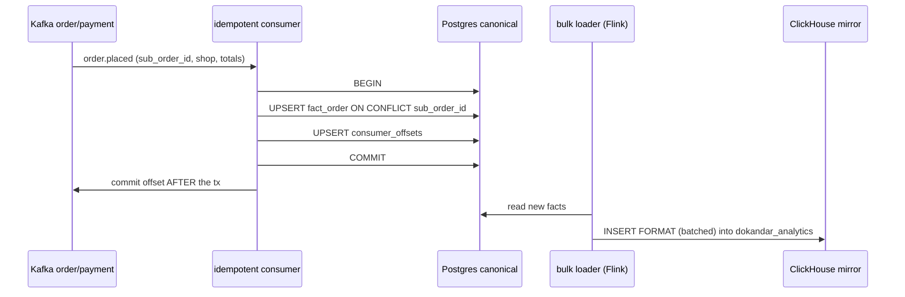
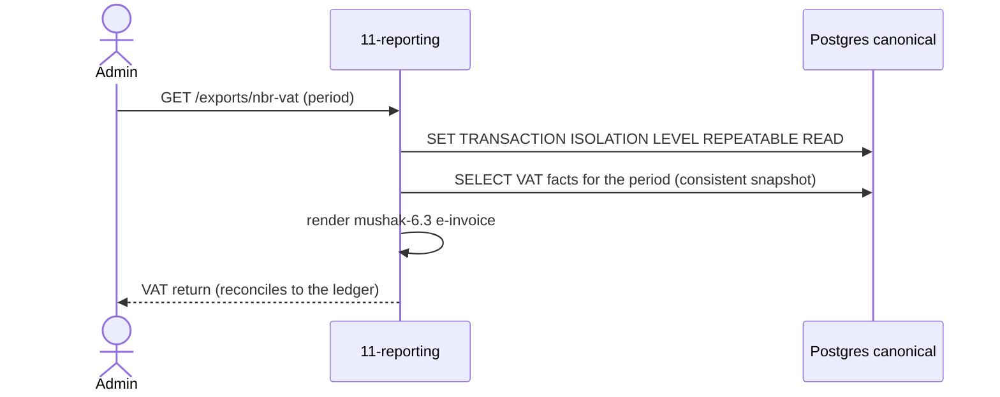

# `11-reporting` — Analytics & Regulatory · Service Architecture

> **Scope.** Implementation-grade architecture for the DOKANDAR **`11-reporting`** service — the analytics
> warehouse (sub-second OLAP) + the regulatory export surface (NBR VAT, BTRC DBID). Authoritative spec:
> [`../../architecture.md`](../../architecture.md) §9 (`11-reporting`) + §10–§14 + §21; [`../../README.md`](../../README.md)
> §6/§7/§8/§10; [`../../SERVICE_INTEGRATION_TEMPLATE.md`](../../SERVICE_INTEGRATION_TEMPLATE.md) (Appendix **A.1
> Python/FastAPI**). **On any conflict the README wins.**
>
> **Grounding.** The reference at `~/Desktop/DevOps/11-reporting` is **Python/FastAPI** — the **same language as
> the spec target**, so this is fully grounded (not a target-provisional stack). Spec-normalized where the MVP
> diverges (the `/ready` gate — §16). Code does not exist yet; this is the build contract.

| | |
| --- | --- |
| **Service** | `11-reporting` |
| **Domain** | Transaction — analytics & regulatory |
| **Language · framework** | Python 3.14 · FastAPI · asyncpg |
| **`SERVICE_PORT`** | `8000` · **no gRPC** |
| **External ports** | REST `10011` |
| **Datastores** | **ClickHouse 26.3 LTS** (`dokandar_analytics`) · PostgreSQL `dokandar_reporting_<env>` (canonical facts) · Redis **DB 11** (dashboard memoize) |
| **`/ready` hard-gate** | **PostgreSQL only** (does **not** gate ClickHouse — OLAP endpoints `503` per-request) |
| **Emits (Kafka)** | **nothing** (pure read-projection consumer) |
| **Consumes (Kafka)** | `dokandar.order.*`, `dokandar.payment.*` → fact tables |
| **`service_name` (identity)** | `11-reporting` — from `SERVICE_NAME`, used **identically** everywhere |

**Contents.** §1 Role · §2 Position · §3 Data (ClickHouse + PG facts) · §4 Domain flows (two-tier ingest +
export) · §5 REST map · §6 OpenAPI/Swagger surface · §7 gRPC (none) · §8 The five ops endpoints ·
§9 TENANT/`/data`/env · §10 Eventing (consume-only) · §11 Logging & observability · §12 Security ·
§13 Resilience · §14 Boot · §15 Deployment · §16 Stack landmines · §17 Design decisions · §18 Build status.

---

## 1. Role & bounded context

`11-reporting` is the **analytics warehouse + the regulatory ledger of record for exports**. It projects order
and payment events into fact tables, serves sub-second OLAP (GMV, AOV, take-rate, payment-mix, refund-rate,
per-shop KPIs), and generates the **monthly NBR VAT return (mushak-6.3)** and the **BTRC DBID quarterly
summary** — always from its own facts, never by querying source services. It is a pure read-projection
(eventually consistent), **not** a strong-consistency domain.

**Responsibilities**

- **OLAP** — platform/per-shop KPIs, period rollups, payment-mix, over ClickHouse for sub-second response.
- **Regulatory exports** — NBR `mushak-6.3` e-invoice VAT return; BTRC DBID quarterly summary — generated from
  the **PostgreSQL canonical facts under a snapshot** so figures reconcile to the ledger.
- **Forecasting** — Prophet/NeuralProphet runs nightly off accumulated facts (CPU batch; no GPU).

**Explicitly NOT in scope**: any business write; any source-of-truth domain. It owns *projections* of other
services' events — joins happen here, in the warehouse, never across service DBs.

---

## 2. Position in the platform

```
   13-order   ──order.placed / order.status_changed──┐
   09-payment ──payment.settled / payout_completed───┤   (Kafka, consume-only)
                                                      ▼
   ┌──────────── 11-reporting (Python 3.14 / FastAPI · REST :8000 · no gRPC) ───────────────┐
   │  TIER 1  idempotent consumer ──► Postgres dokandar_reporting_<env>  (CANONICAL facts)    │
   │  TIER 2  bulk loader (Flink / batched INSERT) ──► ClickHouse dokandar_analytics (MIRROR) │
   │  OLAP queries ──► ClickHouse (sub-second)   |   regulatory exports ──► Postgres SNAPSHOT  │
   │  dashboard memoize ──► Redis DB 11 (short TTL)                                            │
   │  logs ──► stdout (JSON) + Mongo + ES ;  traces ► Elastic APM                              │
   └──────────────────────────────────────────────────────────────────────────────────────────┘
                                                      ▲
                              15-api-gateway ──/api/v1/reporting/*──► admins / shopkeepers
```

The **two-tier** design is load-bearing: Postgres is the **consistency anchor** (and the export source of
truth); ClickHouse is a **rebuildable mirror** for fast OLAP. ClickHouse can be dropped and replayed from
`consumer_offsets` without losing a regulatory figure.

---

## 3. Data architecture

### 3.1 PostgreSQL — `dokandar_reporting_<env>` (canonical facts, system of record)

Idempotency is keyed on **natural keys** (`sub_order_id`, `intent_id`, `payout_id`) because the source order
events lack a top-level `event_id` — a redelivered event UPSERTs the same row (a double-counted GMV row would
corrupt a VAT return).

```sql
CREATE TABLE fact_order (
  sub_order_id uuid PRIMARY KEY,            -- natural idempotency key
  order_id     uuid NOT NULL,
  shop_id      uuid NOT NULL,
  customer_id  uuid,
  tenant       text NOT NULL,
  placed_at    timestamptz NOT NULL,
  date_key     int NOT NULL,               -- YYYYMMDD for partition pruning
  state        text NOT NULL,
  subtotal_minor int, delivery_fee_minor int, tax_minor int, discount_minor int, total_minor int
);
CREATE INDEX fact_order_shop_date     ON fact_order(shop_id, date_key);
CREATE INDEX fact_order_customer_date ON fact_order(customer_id, date_key);
CREATE INDEX fact_order_date_key      ON fact_order(date_key);
CREATE INDEX fact_order_state         ON fact_order(state);

CREATE TABLE fact_order_state_change (
  sub_order_id uuid NOT NULL, to_state text NOT NULL,
  from_state text, shop_id uuid, changed_at timestamptz NOT NULL,
  PRIMARY KEY (sub_order_id, to_state)      -- idempotent per transition
);

CREATE TABLE fact_payment (
  intent_id uuid PRIMARY KEY,               -- natural idempotency key
  order_id uuid, shop_id uuid, provider text NOT NULL,
  amount_minor int, commission_minor int, settled_at timestamptz, date_key int NOT NULL
);
CREATE INDEX fact_payment_provider_date ON fact_payment(provider, date_key);

CREATE TABLE fact_payout (
  payout_id uuid PRIMARY KEY, shopkeeper_id uuid NOT NULL,
  amount_minor int, state text, completed_at timestamptz, date_key int NOT NULL
);
CREATE INDEX fact_payout_shopkeeper_date ON fact_payout(shopkeeper_id, date_key);

CREATE TABLE consumer_offsets (
  topic text NOT NULL, partition_id int NOT NULL, last_offset bigint NOT NULL,
  updated_at timestamptz NOT NULL DEFAULT now(),
  PRIMARY KEY (topic, partition_id)
);
```

### 3.2 ClickHouse — `dokandar_analytics` (OLAP mirror, rebuildable)

The same facts, **month-partitioned MergeTree**, sort key `(tenant, shop_id, placed_at)` for partition pruning
+ per-shop locality:

```sql
CREATE TABLE dokandar_analytics.fact_order (
  sub_order_id UUID, order_id UUID, shop_id UUID, customer_id UUID, tenant String,
  placed_at DateTime, state String, total_minor Int64, …
) ENGINE = MergeTree
PARTITION BY toYYYYMM(placed_at)
ORDER BY (tenant, shop_id, placed_at);
-- fact_order_state_change, fact_payment, fact_payout: same pattern
```

ClickHouse is **rebuildable** by replaying Kafka from `consumer_offsets`; it never holds a figure that isn't
also in Postgres.

### 3.3 Redis — DB 11 (dashboard memoize, degradable)

Memoizes expensive dashboard aggregates (short TTL) and guards export-generation runs (a lock so two exporters
don't run the same period). Degradable — a Redis outage recomputes from ClickHouse/PG, so it **does not gate
`/ready`** (§8.1).

---

## 4. Domain flows

### 4.1 Two-tier ingest (PG anchor → ClickHouse mirror)



### 4.2 Regulatory export under a Postgres snapshot



Exports read the **Postgres canonical copy under a snapshot** — *never* the eventually-consistent ClickHouse
mirror — so `mushak-6.3` / DBID figures are reproducible and reconcile to source.

---

## 5. Synchronous REST API map

All read-only, under **`/api/v1/reporting/*`**. Pretty JSON except `/metrics`/`/openapi.json`/`/docs`.

| Method | Path | Auth | Purpose | Backend |
| --- | --- | --- | --- | --- |
| `GET` | `/api/v1/reporting/platform-kpis?from=&to=` | Bearer (admin) | GMV, AOV, take-rate, refund-rate | ClickHouse |
| `GET` | `/api/v1/reporting/shop-kpis?shop_id=&from=&to=` | Bearer | per-shop KPIs | ClickHouse |
| `GET` | `/api/v1/reporting/orders-by-period?...` | Bearer | period rollups | ClickHouse |
| `GET` | `/api/v1/reporting/payment-mix?...` | Bearer (admin) | provider mix | ClickHouse |
| `GET` | `/api/v1/reporting/payouts-history?...` | Bearer | payout history | ClickHouse |
| `GET` | `/api/v1/reporting/exports/nbr-vat?period=` | Bearer (admin) | NBR `mushak-6.3` VAT return | **Postgres snapshot** |
| `GET` | `/api/v1/reporting/exports/btrc-dbid?quarter=` | Bearer (admin) | BTRC DBID quarterly | **Postgres snapshot** |

Validation: a KPI range over `KPI_MAX_RANGE_DAYS` → `422 validation_error`. ClickHouse-backed endpoints return
**`503` per-request** when ClickHouse is down; the Postgres-backed exports + identity stay available.

---

## 6. The OpenAPI / Swagger surface

`11-reporting` is a **reflection-OpenAPI** stack (FastAPI): the document is generated from the typed route
signatures + Pydantic models — no hand-written `paths[]`. `GET /openapi.json` is **compact** (the FastAPI
default — correct per the contract); Swagger UI at `/docs`.

- **Security scheme** — `HTTPBearer` (JWT) → the `Authorize` button; admin endpoints require an `admin` role.
- **Info** — title **DOKANDAR Reporting Service**, `version` from `CODE_VERSION` (= `11-reporting`), identity
  banner + How-to-test.
- **Parameter schemas** — every KPI endpoint documents `from`/`to` (ISO dates, with the max-range bound),
  `shop_id` (uuid), `period`/`quarter` (for exports), and `example` values.
- **Response schemas** — `PlatformKpis` (gmv_minor, aov_minor, take_rate_bps, refund_rate_bps),
  `ShopKpis`, `PaymentMix`, `NbrVatReturn` (mushak-6.3 lines), `BtrcDbidSummary`, `ErrorEnvelope`. The
  `503 clickhouse_unavailable` envelope is documented on the OLAP endpoints.

---

## 7. gRPC

`11-reporting` **exposes no gRPC and calls none** (spec §9). Its inputs are Kafka events; its outputs are HTTP
analytics + export responses. No east-west synchronous surface.

---

## 8. The five operational endpoints

Shared identity block (`service_name=11-reporting`, `code_version=11-reporting`, …). Pretty JSON except
`/metrics`.

### 8.1 `GET /ready` — traffic gating (PostgreSQL only)

Gates **PostgreSQL only**. ClickHouse is **not** gated — an instance serves identity/health + PG-backed KPIs +
the regulatory exports without it (ClickHouse-dependent endpoints fail per-request `503`). Redis is a dashboard
memoize cache (degradable). `200`/`503`.

```jsonc
{ "status": "ready", "identity": { … }, "dependencies": [ { "name": "postgres", "reachable": true, "latency_ms": 1.0 } ] }
```

> **Spec correction (§16-a).** The reference gates `/ready` on **postgres + redis**; spec §9 is **postgres
> only** (Redis memoize is degradable; ClickHouse is explicitly non-gating).

### 8.2 `GET /health` — full diagnostics

Identity + all deps + observability. Core: `postgres`; reported: `clickhouse`, `redis`, `kafka`, `mongo_logs`,
`apm`. (Only Postgres is traffic-blocking; ClickHouse degraded is a per-endpoint `503`, reported here.)

```jsonc
{
  "status": "healthy",
  "identity": { … },
  "checks": {
    "postgres":   { "ok": true },
    "clickhouse": { "ok": true },
    "redis":      { "ok": true },
    "kafka":      { "ok": true },
    "mongo_logs": { "ok": true },
    "apm":        { "ok": true }
  },
  "observability": {
    "apm_service_name": "11-reporting",
    "logs_sink_mongo":  "mongodb://…/mongo_db_dokandar_application_logs.11-reporting",
    "logs_sink_es":     "http://es-host:9200/logs-app-11-reporting-*"
  },
  "ingestion": { "lag": { "dokandar.order.placed": 0, "dokandar.payment.settled": 12 } }
}
```

### 8.3 `GET /data` — TENANT snapshot

`data/<TENANT>/result.json` (bind-mounted RO), identity prepended; `404 no_snapshot` / `500 snapshot_parse_failed`.

### 8.4 `GET /metrics`

RED + reporting business + ingestion lag; closed-set labels (`kpi`, `topic` — **never `user_id`**);
`service="11-reporting"`.

```
reporting_kpi_queries_total{service="11-reporting",kpi="platform"}   …
reporting_kpi_query_duration_ms_bucket{service="11-reporting",kpi="shop",le="500"}  …
reporting_export_runs_total{service="11-reporting",kind="nbr_vat"}   …
reporting_ingestion_lag_messages{service="11-reporting",topic="dokandar.payment.settled"}  …
```

> **Note.** Reporting emits no outbox; the health gauge is `reporting_ingestion_lag_messages`, not
> `*_outbox_pending`.

### 8.5 `GET /docs` & `GET /openapi.json`

Swagger UI (titled **DOKANDAR Reporting Service**) + the compact FastAPI document. Bare 404 on unmapped paths;
`405` on method typos.

---

## 9. TENANT, `/data` & the env-render contract

```ini
APP_ENV=prod
SERVICE_NAME=11-reporting         # identity everywhere — FAIL FAST if empty
ENV_VERSION=v1.0.0
TENANT=cloud
SERVICE_PORT=8000                 # FastAPI; no gRPC
KPI_MAX_RANGE_DAYS=400

# PostgreSQL (canonical facts — the export source of truth)
POSTGRES_HOST=<INFRA_HOST>
POSTGRES_PORT=<PG_PORT>
POSTGRES_USER=<PG_USER>
POSTGRES_PASSWORD=<PG_PASS>
POSTGRES_DB=dokandar_reporting_prod
POSTGRES_ADMIN_DSN=…/postgres     # ensure-db
PG_STATEMENT_TIMEOUT_MS=30000     # bound every query (§16)

# ClickHouse (OLAP mirror — non-gating)
CLICKHOUSE_URL=<CH_URL>
CLICKHOUSE_USER=<CH_USER>
CLICKHOUSE_PASSWORD=<CH_PASS>
CLICKHOUSE_DB=dokandar_analytics

# Redis (DB 11 — dashboard memoize + export-run lock)
REDIS_HOST=<INFRA_HOST>
REDIS_PORT=<REDIS_PORT>
REDIS_PASSWORD=<REDIS_PASS>
REDIS_DB=11

# Kafka (consume-only)
KAFKA_BOOTSTRAP=<KAFKA_EXTERNAL>
KAFKA_TOPIC_ORDER_PLACED=dokandar.order.placed
KAFKA_TOPIC_ORDER_STATUS_CHANGED=dokandar.order.status_changed
KAFKA_TOPIC_PAYMENT_SETTLED=dokandar.payment.settled
KAFKA_TOPIC_PAYMENT_PAYOUT=dokandar.payment.payout_completed

# Observability
MONGO_LOG_URI=<MONGO_URI>
MONGO_LOG_DB=mongo_db_dokandar_application_logs   # collection = 11-reporting
APM_SERVER_URL=<APM_URL>
APM_SECRET_TOKEN=<APM_BEARER>
APM_SERVICE_NAME=11-reporting                     # normalized from the MVP's 'reporting'

# JWT (verify-only)
JWT_PUBLIC_KEY_B64=<JWT_PUBLIC>   # FAIL FAST under stage/prod if empty
JWT_ISSUER=dokandar-auth
```

Fail-fast on empty `SERVICE_NAME` (always) and empty `JWT_PUBLIC_KEY_B64` under stage/prod. `TENANT` read once →
identity, `/data`, APM labels.

---

## 10. Eventing (consume-only)

**Emits nothing.** Consumes `dokandar.order.*` (placed, status_changed) and `dokandar.payment.*` (settled,
payout_completed) → fact tables. **Two-tier ingest:** an idempotent consumer UPSERTs into Postgres facts (the
consistency anchor) + advances `consumer_offsets` in one transaction, committing the Kafka offset only after;
a streaming/bulk loader (Flink or batched `INSERT … FORMAT`) replicates into ClickHouse. Idempotent on natural
keys → at-least-once redelivery is an upsert, never a double-count. `reporting_ingestion_lag_messages` is the
freshness SLO; KEDA scales on Kafka lag.

---

## 11. Application logging & observability

- **Three sinks** — stdout (pretty JSON) + MongoDB `mongo_db_dokandar_application_logs.11-reporting` +
  Elasticsearch `logs-app-11-reporting-*` (ECS); every line carries the trace id. The **Mongo write runs via
  `asyncio.to_thread`** (the PyMongo driver is sync — never block the event loop) (§16).
- **Access log** — one line per genuine request; `/ready`, `/metrics`, **and `/health`** excluded; true client
  IP, method, **templated** route, status, latency, `request_id`.
- **APM (Python)** — the Elastic APM agent installed as the **last line of `create_app()`** (the FastAPI
  "outermost" rule); wire the service name `11-reporting` + version from `CODE_VERSION`.
- **Metrics** — `prometheus_client`; RED + `reporting_kpi_queries_total{kpi}`,
  `reporting_export_runs_total{kind}`, `reporting_ingestion_lag_messages{topic}`.

---

## 12. Security

- **Verify-only RS256** — decode `JWT_PUBLIC_KEY_B64` once at boot; pin `RS256` (explicit allowlist); check
  `iss`/`aud`/`exp`/`sub`. Platform KPIs + exports require an `admin` role; shop KPIs are owner-scoped.
- **Aggregate-only exposure** — dashboards expose aggregates, **never raw customer rows**; `user_id`-grained
  data stays out of responses + metric labels.
- **Export integrity** — regulatory exports read the **Postgres canonical copy under a snapshot**
  (REPEATABLE READ) so figures are reproducible and reconcile to the ledger; ClickHouse (eventually consistent)
  is never the export source.
- **Narrow exception → 503** — a connection error on a ClickHouse query maps to a **specific** `503`, not a
  broad `except` that would mask a bug (§16).

---

## 13. Resilience & failure modes

| Failure | Effect | Mitigation |
| --- | --- | --- |
| ClickHouse down | OLAP endpoints unavailable | per-endpoint `503`; PG-backed KPIs + **exports stay up**; `/ready` green |
| ClickHouse data drift | mirror inconsistent | rebuild by replaying Kafka from `consumer_offsets` |
| Redis down | dashboard memoize lost | recompute from CH/PG; export-run lock degrades to PG advisory lock |
| consumer lag | stale analytics | `reporting_ingestion_lag_messages` SLO; KEDA scales ingest |
| redelivered event | double-count risk | natural-key UPSERT → idempotent |
| Postgres down | cannot serve / export | `/ready` → `503` |

---

## 14. Boot sequence & lifecycle

1. Read identity; fail-fast on empty `SERVICE_NAME` / (stage·prod) `JWT_PUBLIC_KEY_B64`.
2. **ensure-db** → `CREATE DATABASE dokandar_reporting_<env>` if absent — **before** uvicorn binds (§16).
3. Run Alembic migrations (the PG facts + `consumer_offsets`); ensure the ClickHouse schema exists.
4. Create the asyncpg pool with a `statement_timeout`; connect ClickHouse + Redis.
5. Start the FastAPI app (`8000`) with the **APM agent as the last line of `create_app()`**.
6. Start the order/payment consumers + the ClickHouse bulk loader.
7. Serve — `HEALTHCHECK → /ready`.

---

## 15. Deployment & runtime

- **Image** — multi-stage Python (slim), non-root **uid `10001`**. REST `8000`; **no gRPC port**. External LB
  maps `10011 → 8000`.
- **`HEALTHCHECK`** — `GET /ready`. **Config** — `--env-file` at runtime; `data/<tenant>/` bind-mounted RO.
- **Scaling** — heavily read-skewed; writes are append-mostly projections. ClickHouse scales by shard/replica +
  month-partition pruning. Autoscale on Kafka lag (ingest) + HTTP p95 (query). Forecasting is CPU batch (no GPU).

---

## 16. Stack landmines & reconciliation

- **(a) `/ready` postgres-only** — the ref gates postgres+redis; spec is **postgres only** (ClickHouse + Redis
  non-gating) (§8.1).
- **(b) Exports from PG snapshot, never ClickHouse** — regulatory figures read the canonical PG copy under
  REPEATABLE READ (§4.2, §12).
- **(c) Natural-key idempotency** — order events lack a top-level `event_id`; key facts on
  `sub_order_id`/`intent_id`/`payout_id` (§3.1).
- **(d) Mongo log write via `asyncio.to_thread`** — PyMongo is sync; never block the event loop (§11).
- **(e) Narrow connection-exception → 503** — not a broad `except DBAPIError` that masks bugs (§12).
- **(f) Compact `/openapi.json`** — the FastAPI default is correct (do not pretty-print it) (§6).
- **(g) `statement_timeout`** — bound every PG/ClickHouse query (§9, §14).
- **(h) APM last line of `create_app()`** — outermost or transactions never close (§11).
- **(i) `ensure_db` before uvicorn** — create the DB + migrate before the server binds (§14).
- **(j) Access-log exclusions** — add `/health` to `/ready`+`/metrics` (§11).
- **(k) Identity** — normalize `APM_SERVICE_NAME reporting→11-reporting`, `POSTGRES_DB reporting→dokandar_reporting_<env>`,
  `CODE_VERSION 11-reporting (already correct)`.

---

## 17. Design decisions & open items

- **Two-tier (PG anchor + ClickHouse mirror)** — Postgres is the consistency + export source of truth;
  ClickHouse is a fast, rebuildable OLAP mirror. A regulator's figure is never at the mercy of an
  eventually-consistent column store.
- **Exports under snapshot** — REPEATABLE READ on the PG canonical copy makes `mushak-6.3`/DBID reproducible and
  auditable; running them against ClickHouse would risk figures that don't reconcile.
- **Idempotency on natural keys** — because the source events lack `event_id`, the fact PKs (`sub_order_id`,
  `intent_id`, `payout_id`) are the dedup fence — a double-counted GMV row is a regulatory defect, not just a
  dashboard glitch.
- **Aggregate-only** — privacy by construction: no `user_id`-grained data leaves the warehouse.
- **Open items** — the Flink-vs-batched-INSERT loader choice; the forecasting model registry; export PDF/XML
  rendering for NBR submission; per-tenant partition strategy at scale.

---

## 18. Build status & cross-references

**Status — specified, not yet implemented.** No code exists; this is the build contract. Reference shape:
`~/Desktop/DevOps/11-reporting` (a **Python/FastAPI** MVP — same language as target; spec-normalized, §16).

**Authoritative sources**

- [`../../architecture.md`](../../architecture.md) — **§9** `11-reporting`; **§10–§14**; **§21** the anchor.
- [`../../README.md`](../../README.md) — §6 service table · §7 ports · §8 version pins · §10 (ClickHouse + the
  Redis DB-11 allocation).
- [`../../SERVICE_INTEGRATION_TEMPLATE.md`](../../SERVICE_INTEGRATION_TEMPLATE.md) — Appendix **A.1
  Python/FastAPI**; the `to_thread` / narrow-503 / compact-openapi / APM-last landmine rows.
- Sibling exemplars: [`../01-auth/architecture.md`](../01-auth/architecture.md) (Python contract depth),
  [`../05-search/architecture.md`](../05-search/architecture.md) (the consume-only projector pattern).

**Build checklist** — `Dockerfile` (multi-stage Python, uid 10001, `HEALTHCHECK → /ready`) · `env/init-env.sh` +
`.env.<env>` (fail-fast) · the five endpoints + identity + `X-Request-Id` envelope · the two-tier ingest
(PG anchor + ClickHouse loader) + `consumer_offsets` · the NBR/BTRC exports under PG snapshot ·
`data/<tenant>/result.json` · `OPERATIONS.md` / `SECURITY.md` / `docs/adr/`.
