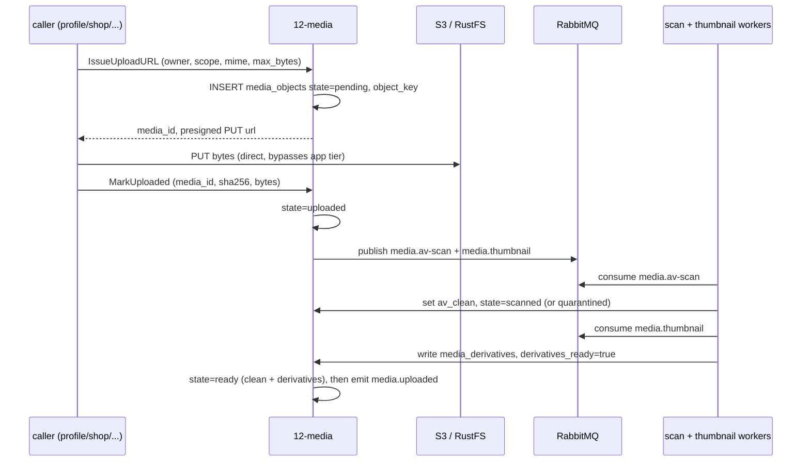
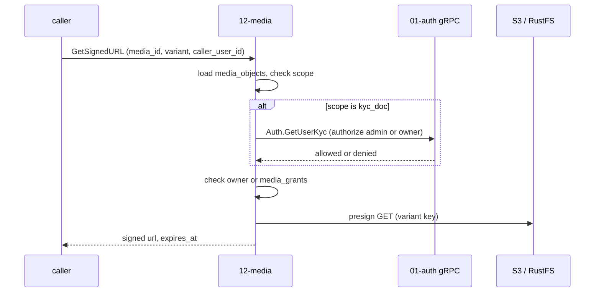

# `12-media` — Media & Object Storage · Service Architecture

> **Scope.** Implementation-grade architecture for the DOKANDAR **`12-media`** service — presigned upload/
> download for every binary in the platform (images, KYC docs, POD photos), with AV-scan + thumbnail
> pipelines. Authoritative spec: [`../../architecture.md`](../../architecture.md) §9 (`12-media`) + §10–§14 +
> §21; [`../../README.md`](../../README.md) §6/§7/§8/§10; [`../../SERVICE_INTEGRATION_TEMPLATE.md`](../../SERVICE_INTEGRATION_TEMPLATE.md)
> (Appendix **A.8 Rust/Actix — target/provisional**). **On any conflict the README wins.**
>
> **Grounding, not copying — and a language gap.** The deployed reference at `~/Desktop/DevOps/12-media` is
> **Go** (chi/pgx); the **spec target is Rust 1.96 / Actix Web 4**. The Go reference is read for **contract
> behaviour only** (the presign proto, the `media_objects` lifecycle, the scan/thumbnail pipeline); every Rust
> mechanic below is **spec-extrapolated and provisional — no Rust `file:line`**. Code does not exist yet; this
> is the build contract.

| | |
| --- | --- |
| **Service** | `12-media` |
| **Domain** | Transaction — object storage |
| **Language · framework** | **Rust 1.96 · Actix Web 4** *(spec target — provisional)* |
| **`SERVICE_PORT`** | `8080` (REST) · gRPC `50051` |
| **External ports** | REST `10012` · gRPC `20012` |
| **Datastores** | PostgreSQL `dokandar_media_<env>` (metadata) · **S3 / RustFS** (bucket `dokandar-media-<env>`) · Redis **DB 12** (signed-URL cache) |
| **`/ready` hard-gate** | **PostgreSQL AND S3/RustFS** (cannot presign without the object store) |
| **gRPC server** | `Media.IssueUploadURL \| MarkUploaded \| GetSignedURL \| GetMedia` @ `50051` |
| **gRPC client** | `Auth.GetUserKyc` @ `50051` (authorize KYC-doc access) |
| **Emits (Kafka)** | `dokandar.media.uploaded \| deleted` (outbox) |
| **RabbitMQ** | `media.av-scan`, `media.thumbnail` (durable workers + DLQs) |
| **`service_name` (identity)** | `12-media` — from `SERVICE_NAME`, used **identically** everywhere |

**Contents.** §1 Role · §2 Position · §3 Data · §4 Domain flows · §5 REST map · §6 OpenAPI/Swagger surface ·
§7 gRPC (first-class) · §8 The five ops endpoints · §9 TENANT/`/data`/env · §10 Eventing · §11 Logging &
observability · §12 Security · §13 Resilience · §14 Boot · §15 Deployment · §16 Stack landmines · §17 Design
decisions · §18 Build status.

---

## 1. Role & bounded context

`12-media` is the fleet's **object-storage gateway**. Every other service that needs a binary — `02-profile`
(avatar), `03-seller` (logo/banner), `04-catalog` (product images), `08-review` (review photos), `01-auth`
(KYC docs), `17-shipping` (POD photos) — mints **presigned URLs** here rather than streaming bytes through the
app tier. Media owns the object metadata, the upload lifecycle, AV scanning, and thumbnail derivatives. It is
the one place an unverified binary is gated before it becomes visible.

**Responsibilities**

- **Presigned upload** — issue a time-boxed PUT URL scoped by `(owner, scope, mime, max_bytes)`.
- **Lifecycle** — `pending → uploaded → scanned → ready → quarantined → deleted`.
- **AV scan + thumbnails** — async over RabbitMQ; a binary is `ready` only after a clean scan + derivatives.
- **Presigned download** — signed GET URLs per variant (`original`/`thumb`/`medium`/`large`), authorized.
- **Access control** — KYC docs are admin/owner-only (checked via `Auth.GetUserKyc`); per-user share grants.

**Explicitly NOT in scope**: the business meaning of a binary (the owning service holds the `s3_key`); CDN edge
caching (that's the edge tier). Media stores bytes + metadata + the scan verdict.

---

## 2. Position in the platform

```
   02/03/04/08/17 ──gRPC IssueUploadURL / GetSignedURL──► 12-media (Rust/Actix · REST :8080 · gRPC :50051)
   browser ──PUT presigned URL──────────────────────────► S3 / RustFS (direct, bypasses the app tier)
                                                               │
   12-media ──gRPC Auth.GetUserKyc (authorize kyc_doc)────────►│ 01-auth
                                                               ├──► Postgres dokandar_media_<env> (metadata + outbox)
                                                               ├──► S3/RustFS  bucket dokandar-media-<env>
                                                               ├──► Redis DB 12  signed-URL cache
                                                               ├──► RabbitMQ  media.av-scan · media.thumbnail (workers + DLQ)
                                                               └──► Kafka  media.uploaded | deleted (outbox)
```

Bytes flow **directly** between the browser and S3 via presigned URLs — the service only mints URLs and tracks
state, so it scales without proxying large payloads.

---

## 3. Data architecture

### 3.1 PostgreSQL — `dokandar_media_<env>` (metadata, sole writer)

```sql
CREATE TABLE media_objects (
  id                uuid PRIMARY KEY DEFAULT gen_random_uuid(),
  owner_id          uuid NOT NULL,
  scope             text NOT NULL,        -- profile_avatar|shop_logo|shop_banner|product_image|review_photo|kyc_doc|generic
  kind              text NOT NULL,
  mime              text NOT NULL,
  bytes             bigint,
  sha256            text,
  bucket            text NOT NULL,
  object_key        text NOT NULL UNIQUE, -- the S3 key; UNIQUE prevents collisions
  state             text NOT NULL DEFAULT 'pending'
                    CHECK (state IN ('pending','uploaded','scanned','ready','quarantined','deleted')),
  av_clean          boolean,
  derivatives_ready boolean NOT NULL DEFAULT false,
  soft_deleted_at   timestamptz,
  created_at        timestamptz NOT NULL DEFAULT now(),
  updated_at        timestamptz NOT NULL DEFAULT now()
);
CREATE INDEX media_owner_idx ON media_objects(owner_id);
CREATE INDEX media_state_idx ON media_objects(state);
CREATE INDEX media_scope_idx ON media_objects(scope);
CREATE INDEX media_soft_deleted_idx ON media_objects(soft_deleted_at) WHERE soft_deleted_at IS NOT NULL;

CREATE TABLE media_derivatives (
  media_id   uuid NOT NULL REFERENCES media_objects(id) ON DELETE CASCADE,
  label      text NOT NULL,               -- thumb|medium|large
  object_key text NOT NULL, width int, height int, bytes bigint,
  PRIMARY KEY (media_id, label)
);

-- per-user share grants (KYC docs are admin/owner-only unless granted)
CREATE TABLE media_grants (
  media_id   uuid NOT NULL REFERENCES media_objects(id) ON DELETE CASCADE,
  grantee_id uuid NOT NULL, granted_at timestamptz NOT NULL DEFAULT now(),
  PRIMARY KEY (media_id, grantee_id)
);

CREATE TABLE outbox (
  id bigserial PRIMARY KEY, topic varchar(120) NOT NULL, key varchar(120),
  payload jsonb NOT NULL, created_at timestamptz NOT NULL DEFAULT now(), sent_at timestamptz
);
CREATE INDEX idx_outbox_pending ON outbox(created_at) WHERE sent_at IS NULL;
```

### 3.2 S3 / RustFS — bucket `dokandar-media-<env>`

Built to the **S3 API** (the lingua franca), path-style, presigned PUT/GET. The object store is **RustFS** in
dev/stage (the README's MinIO → RustFS swap — MinIO's community edition is frozen) and S3-compatible in prod.
**Build to the S3 API, not a MinIO-specific client** (§16) so the store is swap-config-only. The bucket holds
`original/` + the derivative keys; lifecycle rules expire `pending`/`quarantined` objects.

### 3.3 Redis — DB 12 (signed-URL cache, degradable)

Caches recently issued **download** signed URLs (short TTL < the URL expiry) to avoid re-signing hot objects.
Degradable — a miss re-signs. (Note: Redis does **not** gate `/ready`; the object store does — §8.1.)

---

## 4. Domain flows

### 4.1 Upload lifecycle (presign → PUT → scan → thumbnail → ready)



A binary is only `ready` (visible/servable) after a **clean AV scan AND derivatives**; a dirty scan →
`quarantined` (never served). The `object_key` UNIQUE prevents key collisions.

### 4.2 Authorized download (KYC-doc gate)



---

## 5. Synchronous REST API map

A thin browser-facing surface under **`/api/v1/media/*`** (the east-west surface is gRPC, §7). Pretty JSON
except `/metrics`/`/openapi.json`/`/docs`.

| Method | Path | Auth | Purpose |
| --- | --- | --- | --- |
| `POST` | `/api/v1/media` | Bearer | issue an upload URL (browser direct-upload) |
| `POST` | `/api/v1/media/{id}/uploaded` | Bearer | confirm upload (sha256, bytes) |
| `GET` | `/api/v1/media/{id}` | Bearer | media info + state |
| `GET` | `/api/v1/media/{id}/url?variant=` | Bearer | a signed download URL (authorized) |
| `POST` | `/api/v1/media/{id}/grants` | Bearer | grant another user access |
| `DELETE` | `/api/v1/media/{id}` | Bearer | soft-delete (owner/admin) |

Validation: `scope`/`mime`/`variant` enums (`422 validation_error`); `max_bytes` bound. Authorization:
`403 forbidden` (not owner/grantee; KYC-doc not admin); `404 media_not_found`; `409 not_ready` (download a
non-`ready` object).

---

## 6. The OpenAPI / Swagger surface

For the Rust/Actix target, the OpenAPI document is produced by **`utoipa`** derive macros (or hand-written + a
CI route-vs-spec diff *(provisional)*); served at `/openapi.json`, Swagger UI at `/docs`.

- **Security scheme** — `HTTPBearer` (JWT) → the `Authorize` button; all media routes are secured.
- **Info** — title **DOKANDAR Media Service**, `version` from `CODE_VERSION` (= `12-media`), identity banner +
  How-to-test.
- **Schema catalog** — `UploadRequest` (`scope` enum, `mime`, `max_bytes`), `UploadURLResponse` (`media_id`,
  `upload_url`, `method=PUT`, `expires_at`), `MarkUploaded` (`sha256`, `bytes`), `MediaInfo` (`state` enum,
  `av_clean`, `derivatives_ready`, `object_key`), `SignedURL`, `GrantRequest`, `ErrorEnvelope`.
- **Per-endpoint responses** — issue: `200` · `401` · `422`. download: `200` · `401` · `403 forbidden` ·
  `404` · `409 not_ready`. With prefilled examples per scope (a product image; a KYC doc).

---

## 7. gRPC — the presign API @ 50051

The east-west surface the whole fleet calls:

```proto
service Media {
  rpc IssueUploadURL (IssueUploadURLRequest) returns (UploadURLResponse);
  rpc MarkUploaded   (MarkUploadedRequest)   returns (MediaInfo);
  rpc GetSignedURL   (GetSignedURLRequest)   returns (SignedURLResponse);
  rpc GetMedia       (GetMediaRequest)        returns (MediaInfo);
}
message IssueUploadURLRequest { string owner_id = 1; string scope = 2; string mime = 3; int64 max_bytes = 4; }
message UploadURLResponse     { string media_id = 1; string upload_url = 2; string method = 3;   // "PUT"
                                string content_type = 4; int64 max_bytes = 5; int64 expires_at = 6; }
message GetSignedURLRequest   { string media_id = 1; string variant = 2; string caller_user_id = 3; }
message MediaInfo             { string media_id = 1; string owner_id = 2; string scope = 3; string mime = 4;
                                int64 bytes = 5; string state = 6; bool av_clean = 7; bool derivatives_ready = 8;
                                string object_key = 9; }
```

| RPC | Caller | When |
| --- | --- | --- |
| `IssueUploadURL` | profile/shop/catalog/review | mint an upload URL for a new binary |
| `MarkUploaded` | the caller after the PUT | confirm + trigger scan/thumbnail |
| `GetSignedURL` | any service rendering a binary | a time-boxed download URL per variant |
| `GetMedia` | any | metadata + state |

**`12-media` also CALLS `Auth.GetUserKyc`** to authorize access to `kyc_doc`-scoped objects (admin/owner only).
Every served RPC requires `x-internal-token` = `INTERNAL_SERVICE_TOKEN`, compared **constant-time** (the Rust
**`subtle`** crate); mismatch → `UNAUTHENTICATED`.

---

## 8. The five operational endpoints

Shared identity block (`service_name=12-media`, `code_version=12-media`, …). Pretty JSON except `/metrics`.

### 8.1 `GET /ready` — traffic gating (PostgreSQL AND S3)

Gates on **two** deps: **PostgreSQL** (metadata) **and the S3/RustFS object store** — the service **cannot
presign without the object store**, so both are required to serve a single request. Redis (signed-URL cache) is
degradable and **not** gated. `200`/`503`.

```jsonc
{
  "status": "ready",
  "identity": { … },
  "dependencies": [
    { "name": "postgres", "reachable": true, "latency_ms": 1.0 },
    { "name": "rustfs",   "reachable": true, "latency_ms": 2.3 }
  ]
}
```

### 8.2 `GET /health` — full diagnostics

Identity + all deps + observability. Core: `postgres`, `rustfs`, `redis`, `kafka`, `rabbitmq`, `mongo_logs`,
`apm`. `grpc_auth` (the KYC authorizer) is diagnostic.

```jsonc
{
  "status": "healthy",
  "identity": { … },
  "checks": {
    "postgres":   { "ok": true },
    "rustfs":     { "ok": true },
    "redis":      { "ok": true },
    "kafka":      { "ok": true },
    "rabbitmq":   { "ok": true },
    "mongo_logs": { "ok": true },
    "apm":        { "ok": true },
    "grpc_auth":  { "ok": true }
  },
  "observability": {
    "apm_service_name": "12-media",
    "logs_sink_mongo":  "mongodb://…/mongo_db_dokandar_application_logs.12-media",
    "logs_sink_es":     "http://es-host:9200/logs-app-12-media-*"
  }
}
```

### 8.3 `GET /data` — TENANT snapshot

`data/<TENANT>/result.json` (bind-mounted RO), identity prepended; `404 no_snapshot` / `500 snapshot_parse_failed`.

### 8.4 `GET /metrics`

RED + media business + outbox gauge; closed-set labels (`scope`, `state` — never `owner_id`); `service="12-media"`.

```
media_uploads_total{service="12-media",scope="product_image"}   …
media_quarantined_total{service="12-media"}                     …
media_presign_total{service="12-media",direction="download"}    …
media_outbox_pending{service="12-media"}                        …   # mandatory
```

### 8.5 `GET /docs` & `GET /openapi.json`

Swagger UI (titled **DOKANDAR Media Service**) + the document. Bare 404 on unmapped paths; `405` on method
typos.

---

## 9. TENANT, `/data` & the env-render contract

```ini
APP_ENV=prod
SERVICE_NAME=12-media             # identity everywhere — FAIL FAST if empty
ENV_VERSION=v1.0.0
TENANT=cloud
SERVICE_PORT=8080                 # REST (normalized from the MVP's 8000)
GRPC_PORT=50051                   # normalized from the MVP's 8001

# PostgreSQL (metadata)
POSTGRES_HOST=<INFRA_HOST>
POSTGRES_PORT=<PG_PORT>
POSTGRES_USER=<PG_USER>
POSTGRES_PASSWORD=<PG_PASS>
POSTGRES_DB=dokandar_media_prod
POSTGRES_ADMIN_DSN=…/postgres     # ensure-db

# S3 / RustFS object store (build to the S3 API — swap-config-only)  [GATED]
S3_ENDPOINT=<RUSTFS_OR_S3_URL>
S3_ACCESS_KEY=<…>
S3_SECRET_KEY=<…>
S3_BUCKET=dokandar-media-prod
S3_FORCE_PATH_STYLE=true
PRESIGN_UPLOAD_TTL_SECONDS=900
PRESIGN_DOWNLOAD_TTL_SECONDS=300

# Redis (DB 12 — signed-URL cache)
REDIS_HOST=<INFRA_HOST>
REDIS_PORT=<REDIS_PORT>
REDIS_PASSWORD=<REDIS_PASS>
REDIS_DB=12

# Kafka (emit) + RabbitMQ (workers)
KAFKA_BOOTSTRAP=<KAFKA_EXTERNAL>
KAFKA_TOPIC_MEDIA_UPLOADED=dokandar.media.uploaded
KAFKA_TOPIC_MEDIA_DELETED=dokandar.media.deleted
RABBITMQ_URL=<AMQP_URL>
RABBITMQ_QUEUE_AVSCAN=media.av-scan
RABBITMQ_QUEUE_THUMBNAIL=media.thumbnail

# Observability
MONGO_LOG_URI=<MONGO_URI>
MONGO_LOG_DB=mongo_db_dokandar_application_logs   # collection = 12-media
APM_SERVER_URL=<APM_URL>                          # OTLP endpoint (no Elastic agent for Rust)
APM_SERVICE_NAME=12-media                         # normalized from the MVP's 'media'

# JWT (verify-only) + east-west
JWT_PUBLIC_KEY_B64=<JWT_PUBLIC>   # FAIL FAST under stage/prod if empty
JWT_ISSUER=dokandar-auth
INTERNAL_SERVICE_TOKEN=<INTERNAL_TOKEN>           # FAIL FAST under stage/prod; subtle crate compare
AUTH_GRPC_ADDR=<AUTH_HOST>:50051                  # for Auth.GetUserKyc
```

Fail-fast on empty `SERVICE_NAME` (always) and empty `JWT_PUBLIC_KEY_B64` / `INTERNAL_SERVICE_TOKEN` under
stage/prod. `TENANT` read once → identity, `/data`, APM labels.

---

## 10. Eventing

**Emits** (transactional outbox, `acks=all`): `dokandar.media.uploaded` (when an object reaches `ready`),
`dokandar.media.deleted` (soft-delete). Keyed by `media_id`.

**RabbitMQ** (durable workers + bound **DLQs**): `media.av-scan` (virus scan → `av_clean`/`quarantined`) and
`media.thumbnail` (derivative generation → `media_derivatives`). Both are published on `MarkUploaded`; a worker
failure retries then dead-letters. `media_outbox_pending` exposes the Kafka relay lag.

**Consumes no Kafka** — media is driven by gRPC + the RabbitMQ workers.

---

## 11. Application logging & observability

- **Three sinks** — stdout (pretty JSON) + MongoDB `mongo_db_dokandar_application_logs.12-media` + Elasticsearch
  `logs-app-12-media-*` (ECS); every line carries the trace id; fire-and-forget, drop-not-block.
- **Access log** — one line per genuine request; `/ready`, `/metrics`, **and `/health`** excluded; true client
  IP, method, **templated** route, status, latency, `request_id`. Never log the presigned URL (it's a bearer
  capability).
- **APM (Rust)** — **no Elastic APM agent for Rust**; instrument with **OpenTelemetry → OTLP** as the outermost
  `actix` middleware/wrap; wire the service name `12-media` + version from `CODE_VERSION`.
- **Metrics** — RED + `media_uploads_total{scope}`, `media_quarantined_total`, `media_presign_total{direction}`,
  `media_outbox_pending`.

---

## 12. Security

- **Verify-only RS256** — decode `JWT_PUBLIC_KEY_B64`, pin `RS256`, check `iss`/`aud`/`exp`/`sub`.
- **Scope-based authorization** — KYC docs (`kyc_doc`) are admin/owner-only, verified via `Auth.GetUserKyc`;
  other objects require ownership or a `media_grants` row; `403 forbidden` otherwise.
- **Presigned URLs are bearer capabilities** — short TTLs (upload 900s, download 300s), `max_bytes` + `mime`
  bound on upload, never logged. AV scan gates visibility — a binary is never `ready`/servable until clean.
- **East-west** — `INTERNAL_SERVICE_TOKEN` compared with the `subtle` crate (constant time), never `==`.
- **`object_key` UNIQUE** — prevents key collisions/overwrites; deletes are soft (`soft_deleted_at`) then
  lifecycle-expired in the bucket.

---

## 13. Resilience & failure modes

| Failure | Effect | Mitigation |
| --- | --- | --- |
| S3/RustFS down | cannot presign | **`/ready` → `503`** (gated — the object store is required) |
| Postgres down | cannot track metadata | `/ready` → `503` (gated) |
| Redis down | signed-URL cache miss | re-sign — `/ready` stays green |
| AV-scan worker down | uploads stuck `uploaded` | RabbitMQ buffers; binary stays non-`ready` (not served) until scanned |
| dirty binary | malware risk | `quarantined`, never served; alert |
| `01-auth` gRPC down | KYC-doc authz fails | `503` on `kyc_doc` downloads only; other scopes unaffected |
| Kafka down | uploaded/deleted events delayed | outbox buffers; `media_outbox_pending` climbs |

---

## 14. Boot sequence & lifecycle

1. Read identity; fail-fast on empty `SERVICE_NAME` / (stage·prod) `JWT_PUBLIC_KEY_B64` / `INTERNAL_SERVICE_TOKEN`.
2. **ensure-db** → `CREATE DATABASE dokandar_media_<env>` if absent.
3. Run migrations; ensure the S3 bucket exists + lifecycle rules.
4. Connect Postgres (with a `statement_timeout` on `PgConnectOptions`), the S3 client, Redis, RabbitMQ.
5. Start the Actix REST server (`8080`) + the gRPC server (`50051`) with the OTLP layer outermost.
6. Start the outbox relay + the av-scan + thumbnail RabbitMQ workers.
7. Serve — `HEALTHCHECK → /ready`. Use **`spawn_blocking`** for any synchronous/blocking S3 call so the async
   runtime is never stalled.

---

## 15. Deployment & runtime

- **Image** — multi-stage Rust build → distroless, non-root **uid `10001`**, a static healthcheck binary. REST
  `8080`, gRPC `50051`. External LB maps `10012 → 8080`, `20012 → 50051`.
- **`HEALTHCHECK`** — `GET /ready`. **Config** — `--env-file` at runtime; `data/<tenant>/` bind-mounted RO.
- **Scaling** — stateless (bytes go direct to S3, not through the app); the hot path is presign (fast). HPA on
  RPS; the scan/thumbnail workers scale on RabbitMQ queue depth (KEDA).

---

## 16. Stack landmines & reconciliation

- **(a) Reference language** — deployed ref is **Go**; spec target is **Rust 1.96 / Actix Web 4** — read Go for
  contract; write Rust; **no Rust `file:line`** (provisional).
- **(b) Build to the S3 API, not a MinIO client** — keep the store swap-config-only (RustFS dev/stage,
  S3-compatible prod) (§3.2).
- **(c) `/ready` = postgres AND S3** — dual gate; cannot presign without the object store. Redis (signed-URL
  cache) is **not** gated (§8.1). *(The Go reference already gets this right.)*
- **(d) `spawn_blocking` for S3** — never block the async runtime on a sync/blocking S3 call (§14).
- **(e) APM = OTLP, not an agent** — Rust has no Elastic agent; OTel → OTLP outermost (§11).
- **(f) `subtle` crate const-time** — for `INTERNAL_SERVICE_TOKEN` (§7, §12).
- **(g) `statement_timeout`** — set on `PgConnectOptions` (§14).
- **(h) Presigned URLs never logged** — they are bearer capabilities (§11, §12).
- **(i) AV-gate visibility** — a binary is `ready` only after a clean scan + derivatives (§4.1).
- **(j) Access-log exclusions** — add `/health` to `/ready`+`/metrics` (§11).
- **(k) Identity/port** — normalize `SERVICE_PORT 8000→8080`, `GRPC_PORT 8001→50051`,
  `APM_SERVICE_NAME media→12-media`, `CODE_VERSION 12-media (already correct)`,
  `POSTGRES_DB media→dokandar_media_<env>`, `BUCKET dokandar-media-<env>`.

---

## 17. Design decisions & open items

- **Presign, don't proxy** — bytes flow browser↔S3 directly; the app tier only mints URLs + tracks state, so it
  scales without moving large payloads.
- **S3 API as the contract** — building to the S3 API (not a MinIO-specific client) makes the object-store
  exit (MinIO → RustFS / S3) a config change, honoring the README's frozen-MinIO posture.
- **AV-gate before visibility** — a binary is invisible until a clean scan; quarantine keeps malware out of the
  storefront and KYC pipeline.
- **KYC docs are special** — `kyc_doc` scope is authorized via `Auth.GetUserKyc` (admin/owner-only); the binary
  never appears in a public listing.
- **Open items** — the av-scan engine (ClamAV?) + thumbnail toolchain choice; CDN signed-URL handoff; multipart
  upload for large POD videos; lifecycle/retention per scope (KYC retention vs product-image churn).

---

## 18. Build status & cross-references

**Status — specified, not yet implemented.** No code exists; this is the build contract. Reference shape:
`~/Desktop/DevOps/12-media` (a **Go** MVP — read for contract behaviour only; the spec target is **Rust 1.96 /
Actix Web 4**, §16-a; all Rust mechanics provisional).

**Authoritative sources**

- [`../../architecture.md`](../../architecture.md) — **§9** `12-media`; **§10–§14**; **§21** the anchor.
- [`../../README.md`](../../README.md) — §6 service table · §7 ports · §8 version pins · §9 (the MinIO → RustFS
  object-store posture).
- [`../../SERVICE_INTEGRATION_TEMPLATE.md`](../../SERVICE_INTEGRATION_TEMPLATE.md) — Appendix **A.8 Rust/Axum/Actix
  (target/provisional)**; the OTLP / `spawn_blocking` / `subtle` / S3-API landmine rows.
- Sibling exemplars: [`../02-profile/architecture.md`](../02-profile/architecture.md) (Go reference shape),
  [`../01-auth/architecture.md`](../01-auth/architecture.md) (the `GetUserKyc` peer this calls).

**Build checklist** — `Dockerfile` (multi-stage Rust, distroless, uid 10001, `HEALTHCHECK → /ready`) ·
`env/init-env.sh` + `.env.<env>` (fail-fast) · the five endpoints + identity + `X-Request-Id` envelope · the
gRPC presign server + `subtle` interceptor + the `Auth.GetUserKyc` client · the av-scan + thumbnail workers +
DLQs · `data/<tenant>/result.json` · `OPERATIONS.md` / `SECURITY.md` / `docs/adr/`.
