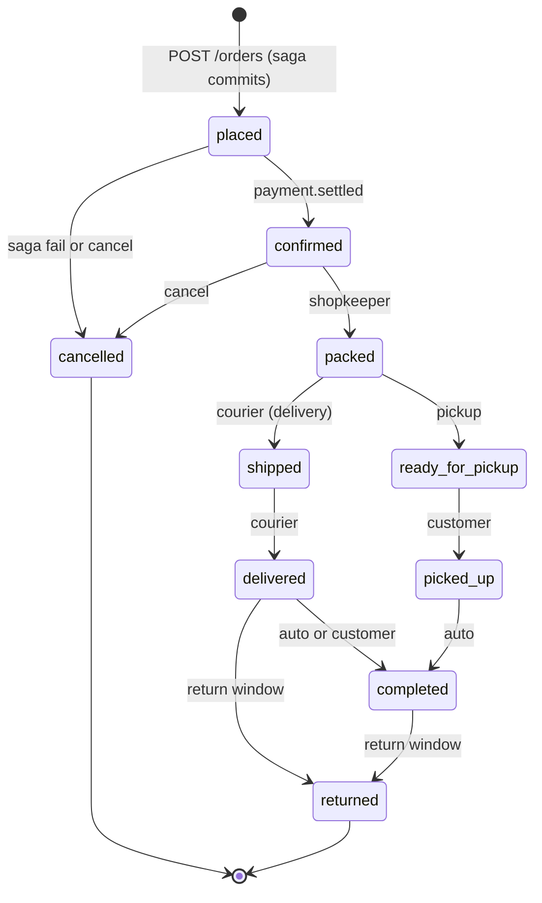
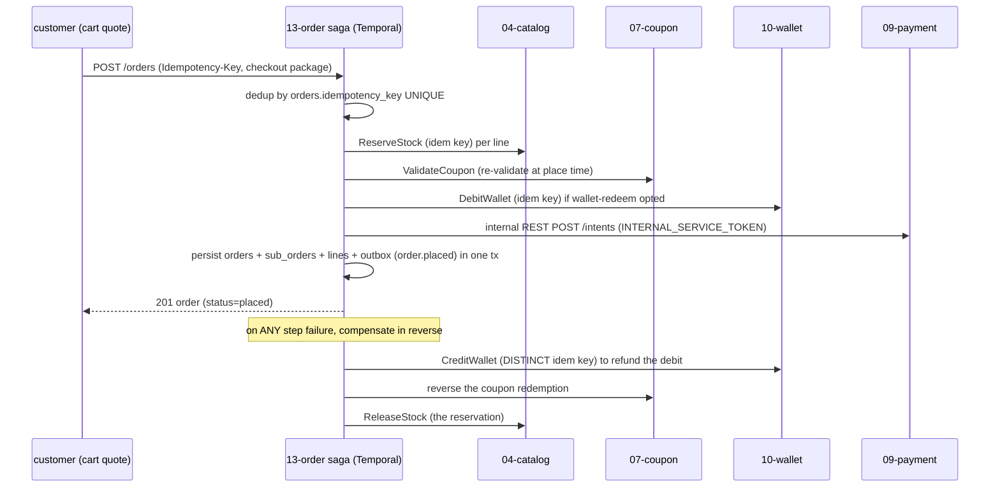

# `13-order` — Orders & Checkout Saga · Service Architecture

> **Scope.** Implementation-grade architecture for the DOKANDAR **`13-order`** service — the checkout **saga
> orchestrator** and the order/sub-order state machine. Authoritative spec:
> [`../../architecture.md`](../../architecture.md) §9 (`13-order`) + §3 (checkout saga diagram) + §10–§14 + §21;
> [`../../README.md`](../../README.md) §6/§7/§8/§10; [`../../SERVICE_INTEGRATION_TEMPLATE.md`](../../SERVICE_INTEGRATION_TEMPLATE.md)
> (Appendix **A.5 Java/Spring**). **On any conflict the README wins.**
>
> **Grounding, not copying.** The reference at `~/Desktop/DevOps/13-order` is **Java/Spring** — read for
> contract behaviour (the schema, the state machine, the `payment.settled` listener). The MVP **stubs** the
> saga (it trusts the cart's quote and inserts rows in one tx); the **spec target adds Temporal** orchestration
> with real `ReserveStock`/`ValidateCoupon`/`DebitWallet` + compensations (§4, §16). Spec-normalized (ports,
> `CODE_VERSION=8-order` → `13-order`). Code does not exist yet; this is the build contract.

| | |
| --- | --- |
| **Service** | `13-order` |
| **Domain** | Transaction — orders & the checkout saga |
| **Language · framework** | Java 25 · Spring Boot 4.0 · **Temporal** (saga workflow) |
| **`SERVICE_PORT`** | `8080` (REST) · gRPC `9090` |
| **External ports** | REST `10013` · gRPC `20013` |
| **Datastores** | PostgreSQL `dokandar_order_<env>` (sole writer) · Redis **DB 7** (arbitration locks) · Temporal (saga state) |
| **`/ready` hard-gate** | **PostgreSQL only** (Temporal reported on `/health`, **not** gated) |
| **gRPC server** | `Order.HasPurchased` @ `9090` |
| **gRPC clients** | `Catalog.ReserveStock`/`ReleaseStock`, `Coupon.ValidateCoupon`, `Wallet.DebitWallet`/`CreditWallet` · internal REST to `09-payment` |
| **Emits (Kafka)** | `dokandar.order.placed \| status_changed \| confirmed \| delivered \| refunded \| cancelled` (outbox) |
| **Consumes (Kafka)** | `dokandar.payment.settled` (placed → confirmed) |
| **`service_name` (identity)** | `13-order` — from `SERVICE_NAME`, used **identically** everywhere |

**Contents.** §1 Role · §2 Position · §3 Data · §4 The checkout saga (Temporal) · §5 REST map · §6 OpenAPI/
Swagger surface · §7 gRPC · §8 The five ops endpoints · §9 TENANT/`/data`/env · §10 Eventing · §11 Logging &
observability · §12 Security · §13 Resilience · §14 Boot · §15 Deployment · §16 Stack landmines · §17 Design
decisions · §18 Build status.

---

## 1. Role & bounded context

`13-order` turns a cart's **checkout-package quote** into a durable order by running the **checkout saga** — a
distributed transaction across Catalog (stock), Coupon (discount), Wallet (redeem), and Payment (intent) — and
then owns the **order / sub-order lifecycle** (one sub-order per shop) from `placed` to `completed`. It is the
choreography apex: it *emits* the events the rest of the platform reacts to.

**Responsibilities**

- **Place order** — idempotent (`Idempotency-Key`), one **sub-order per shop**, via the Temporal saga.
- **Saga orchestration** — `ReserveStock → ValidateCoupon → DebitWallet → create payment intent`, with
  **compensations** (`ReleaseStock`, coupon reversal, `CreditWallet` with a *distinct* idempotency key).
- **State machine** — per sub-order: `placed → confirmed → packed → shipped/ready_for_pickup →
  delivered/picked_up → completed` (+ `cancelled`/`returned`).
- **Verified purchase** — `Order.HasPurchased` for `08-review`.
- **Payment reconciliation** — consume `payment.settled` to move `placed → confirmed`.

**Explicitly NOT in scope**: the cart quote (`06-cart` builds it); stock truth (`04-catalog`); payment
settlement (`09-payment`); shipping (`17-shipping` reacts to `order.confirmed`). Order coordinates; it does not
own stock, money, or delivery.

---

## 2. Position in the platform

```
   06-cart quote ──/api/v1/order POST /orders (Idempotency-Key)──► 13-order (Java/Spring + Temporal · REST :8080 · gRPC :9090)
                                                                       │
   saga (Temporal) fan-out:                                            │
     ├──► 04-catalog  Catalog.ReserveStock / ReleaseStock (compensate)
     ├──► 07-coupon   Coupon.ValidateCoupon (+ reversal compensate)
     ├──► 10-wallet   Wallet.DebitWallet / CreditWallet (compensate, distinct idem key)
     └──► 09-payment  internal REST POST /intents (INTERNAL_SERVICE_TOKEN)
                                                                       │
   08-review ──gRPC Order.HasPurchased──────────────────────────────►│
   09-payment ──payment.settled (Kafka)──► confirm ──────────────────►│
                                                                       ├──► Postgres dokandar_order_<env> (+ outbox)
                                                                       ├──► Redis DB 7  arbitration locks
                                                                       └──► Kafka  order.placed|status_changed|confirmed|delivered|refunded|cancelled
   consumers of order.* : 05-search, 08-review, 11-reporting, 14-notification, 17-shipping ◄──┘
```

---

## 3. Data architecture

### 3.1 PostgreSQL — `dokandar_order_<env>` (sole writer)

```sql
CREATE TABLE orders (
  id                uuid PRIMARY KEY DEFAULT gen_random_uuid(),
  customer_id       uuid NOT NULL,
  grand_total_minor int NOT NULL,                  -- integer minor units (paisa)
  idempotency_key   varchar(120) UNIQUE,           -- the place-order dedup fence
  created_at        timestamptz NOT NULL DEFAULT now()
);

CREATE TABLE sub_orders (
  id              uuid PRIMARY KEY DEFAULT gen_random_uuid(),
  order_id        uuid NOT NULL REFERENCES orders(id) ON DELETE CASCADE,
  shop_id         uuid NOT NULL,                    -- one sub-order per shop
  status          varchar(32) NOT NULL DEFAULT 'placed'
    CHECK (status IN ('placed','confirmed','packed','shipped','ready_for_pickup','delivered','picked_up','completed','cancelled','returned')),
  payment_state   varchar(16) NOT NULL DEFAULT 'pending'
    CHECK (payment_state IN ('pending','settled','failed','refunded')),
  delivery_method varchar(16) NOT NULL DEFAULT 'delivery' CHECK (delivery_method IN ('delivery','pickup')),
  shop_total_minor int NOT NULL,
  confirmed_at timestamptz, created_at timestamptz NOT NULL DEFAULT now()
);
CREATE INDEX idx_sub_orders_order ON sub_orders(order_id);
CREATE INDEX idx_sub_orders_shop  ON sub_orders(shop_id, status);

CREATE TABLE order_lines (
  id           uuid PRIMARY KEY DEFAULT gen_random_uuid(),
  sub_order_id uuid NOT NULL REFERENCES sub_orders(id) ON DELETE CASCADE,
  product_id uuid NOT NULL, variant_id uuid NOT NULL, quantity int NOT NULL,
  unit_price_minor int NOT NULL, sale_price_minor int, line_total_minor int NOT NULL
);
CREATE INDEX idx_order_lines_sub ON order_lines(sub_order_id);

CREATE TABLE order_status_history (
  id uuid PRIMARY KEY DEFAULT gen_random_uuid(),
  sub_order_id uuid NOT NULL REFERENCES sub_orders(id) ON DELETE CASCADE,
  from_status varchar(32), to_status varchar(32) NOT NULL, at timestamptz NOT NULL DEFAULT now()
);
CREATE INDEX idx_status_history_sub ON order_status_history(sub_order_id, at);

CREATE TABLE outbox (
  id bigserial PRIMARY KEY, topic varchar(120) NOT NULL, key varchar(120),
  payload jsonb NOT NULL, created_at timestamptz NOT NULL DEFAULT now(), sent_at timestamptz
);
CREATE INDEX idx_outbox_pending ON outbox(created_at) WHERE sent_at IS NULL;
```

### 3.2 Redis — DB 7 (arbitration locks) + Temporal (saga state)

Redis DB 7 holds short-lived arbitration locks (e.g. a per-order place lock to dedup a racing retry before the
DB UNIQUE fires). **Temporal** holds the saga workflow state (the durable execution that survives a worker
restart mid-saga). Neither gates `/ready` (the order rows are authoritative; a Temporal blip must not evict a
node that can still serve order reads — §8.1).

### 3.3 Sub-order state machine



---

## 4. The checkout saga (Temporal)

`POST /orders` starts a **Temporal workflow** — a durable, compensatable distributed transaction. Each step is
an activity; a failure runs the compensations in reverse.



**Compensation correctness:** the compensating `CreditWallet` uses a **distinct idempotency key** from the
forward `DebitWallet` (else the credit dedups against the debit and never applies); `ReleaseStock` targets the
reservation id from the forward `ReserveStock`. Temporal's durable execution guarantees the saga either fully
completes or fully compensates, even across a worker crash.

**Confirm on settlement:** the order is `placed` until `dokandar.payment.settled` arrives (consumed,
sub-order `payment_state=settled`, `placed → confirmed`) — payment is asynchronous (esp. COD), so order does
not block on it synchronously.

---

## 5. Synchronous REST API map

All under **`/api/v1/order/*`**. Pretty JSON except `/metrics`/`/openapi.json`/`/docs`.

| Method | Path | Auth | Purpose |
| --- | --- | --- | --- |
| `POST` | `/api/v1/order/orders` | Bearer (+ **`Idempotency-Key`**) | place an order (starts the saga) |
| `GET` | `/api/v1/order/orders/me` | Bearer | my orders (paged) |
| `GET` | `/api/v1/order/orders/{id}` | Bearer | order detail (+ sub-orders) |
| `GET` | `/api/v1/order/sub-orders/{id}` | Bearer | sub-order detail + history |
| `POST` | `/api/v1/order/sub-orders/{id}/transition` | Bearer | state transition (shopkeeper/admin/system) |
| `POST` | `/api/v1/order/sub-orders/{id}/cancel` | Bearer | cancel (if allowed by the state machine) |

`Idempotency-Key` is **required** on `POST /orders` (the `orders.idempotency_key` UNIQUE replays the prior
result). Transitions are validated against the state machine (`409 invalid_transition`). UUIDs validated at the
boundary; money is integer minor units.

---

## 6. The OpenAPI / Swagger surface

`13-order` is a **reflection-OpenAPI** stack (Java/**springdoc**): the document is generated from the
`@RestController` annotations + DTOs, with an `OpenAPI @Bean` for info + the `HTTPBearer` scheme + a dynamic
version from `CODE_VERSION`. `springdoc.api-docs.path=/openapi.json`, `springdoc.swagger-ui.path=/docs`.

- **Security scheme** — `HTTPBearer` (JWT) → the `Authorize` button; all routes secured.
- **Info** — title **DOKANDAR Order Service**, `version` from `CODE_VERSION` (= `13-order`), identity banner +
  How-to-test (note the required `Idempotency-Key` header on place).
- **Schema catalog** — `PlaceOrder` (the checkout package: `sub_orders[]` with `shop_id`, `items[]`,
  `delivery_method`, totals), `OrderDto`, `SubOrderDto` (`status` enum, `payment_state`), `Transition`
  (`to_status`), `ErrorEnvelope`.
- **Per-endpoint responses** — place: `201` · `400 missing_idempotency_key` · `401` · `409 idempotent_replay`
  (cached) · `422 stock_changed / coupon_invalid` (saga rejection). transition: `200` · `409 invalid_transition`
  · `403`. With prefilled examples.

---

## 7. gRPC — `Order.HasPurchased` @ 9090

```proto
service Order { rpc HasPurchased (HasPurchasedRequest) returns (HasPurchasedResponse); }
message HasPurchasedRequest  { string user_id = 1; string sub_order_id = 2; string product_id = 3; }
message HasPurchasedResponse { bool purchased = 1; string sub_order_state = 2; }
```

Called by `08-review` to gate verified-purchase reviews (answered from order's own `sub_orders`/`order_lines`).
Requires `x-internal-token` = `INTERNAL_SERVICE_TOKEN`, compared **constant-time** (`MessageDigest.isEqual`);
mismatch → `UNAUTHENTICATED`. Served on a dedicated HTTP/2 listener (`9090`, external `20013`).

> **Note.** `08-review` answers `HasPurchased` from its *own* `purchase_eligibility` projection (§08-review),
> so this RPC is a secondary/admin path — the eligibility truth flows over Kafka (`order.delivered`), not a
> synchronous review→order call.

---

## 8. The five operational endpoints

Shared identity block (`service_name=13-order`, `code_version=13-order`, …). Pretty JSON except `/metrics`.

### 8.1 `GET /ready` — traffic gating (PostgreSQL only)

Gates **PostgreSQL only**. **Temporal is reported on `/health`, not gated** — a Temporal control-plane blip
must not evict a node that can still serve order reads + transitions. Redis (arbitration locks) is degradable.
`200`/`503`.

```jsonc
{ "status": "ready", "identity": { … }, "dependencies": [ { "name": "postgres", "reachable": true, "latency_ms": 1.1 } ] }
```

### 8.2 `GET /health` — full diagnostics

Identity + all deps + observability. Core: `postgres`; reported: `redis`, `kafka`, `temporal`, `mongo_logs`,
`apm`; diagnostic: `grpc_catalog`, `grpc_coupon`, `grpc_wallet` (the saga peers).

```jsonc
{
  "status": "healthy",
  "identity": { … },
  "checks": {
    "postgres":   { "ok": true },
    "redis":      { "ok": true },
    "kafka":      { "ok": true },
    "temporal":   { "ok": true },     // reported, NOT a /ready gate
    "mongo_logs": { "ok": true },
    "apm":        { "ok": true },
    "grpc_catalog": { "ok": true },   // diagnostic
    "grpc_wallet":  { "ok": true }    // diagnostic
  },
  "observability": {
    "apm_service_name": "13-order",
    "logs_sink_mongo":  "mongodb://…/mongo_db_dokandar_application_logs.13-order",
    "logs_sink_es":     "http://es-host:9200/logs-app-13-order-*"
  }
}
```

### 8.3 `GET /data` — TENANT snapshot

`data/<TENANT>/result.json` (bind-mounted RO), identity prepended; `404 no_snapshot` / `500 snapshot_parse_failed`.

### 8.4 `GET /metrics`

RED + order business + outbox gauge; closed-set labels (`status`, `result` — never `customer_id`);
`service="13-order"`.

```
order_placed_total{service="13-order"}                       …
order_saga_total{service="13-order",result="committed"}      …   # committed|compensated|stock_changed|coupon_invalid
order_transition_total{service="13-order",to="confirmed"}    …
order_outbox_pending{service="13-order"}                     …   # mandatory
```

### 8.5 `GET /docs` & `GET /openapi.json`

Swagger UI (titled **DOKANDAR Order Service**) + the compact springdoc document. Bare 404 on unmapped paths;
`405` on method typos.

---

## 9. TENANT, `/data` & the env-render contract

```ini
APP_ENV=prod
SERVICE_NAME=13-order             # identity everywhere — FAIL FAST if empty
ENV_VERSION=v1.0.0
TENANT=cloud
SERVICE_PORT=8080                 # REST (normalized from the MVP's 8000)
GRPC_PORT=9090                    # JVM (normalized from the MVP's 8001)

# PostgreSQL
POSTGRES_HOST=<INFRA_HOST>
POSTGRES_PORT=<PG_PORT>
POSTGRES_USER=<PG_USER>
POSTGRES_PASSWORD=<PG_PASS>
POSTGRES_DB=dokandar_order_prod
POSTGRES_ADMIN_DSN=…/postgres     # ensure-db

# Redis (DB 7 — arbitration locks) + Temporal (saga state)
REDIS_HOST=<INFRA_HOST>
REDIS_PORT=<REDIS_PORT>
REDIS_PASSWORD=<REDIS_PASS>
REDIS_DB=7
TEMPORAL_HOST=<TEMPORAL_HOST>:7233
TEMPORAL_NAMESPACE=dokandar-order
TEMPORAL_TASK_QUEUE=checkout-saga

# Kafka (emit + consume payment.settled)
KAFKA_BOOTSTRAP=<KAFKA_EXTERNAL>
KAFKA_TOPIC_ORDER_PLACED=dokandar.order.placed
KAFKA_TOPIC_ORDER_STATUS_CHANGED=dokandar.order.status_changed
KAFKA_TOPIC_ORDER_DELIVERED=dokandar.order.delivered
KAFKA_TOPIC_PAYMENT_SETTLED=dokandar.payment.settled     # consume

# East-west (gRPC clients + internal REST to payment)
CATALOG_GRPC_ADDR=<CATALOG_HOST>:9090
COUPON_GRPC_ADDR=<COUPON_HOST>:9090
WALLET_GRPC_ADDR=<WALLET_HOST>:50051
PAYMENT_REST_URL=<PAYMENT_HOST>:10009                    # internal REST POST /intents

# Observability
MONGO_LOG_URI=<MONGO_URI>
MONGO_LOG_DB=mongo_db_dokandar_application_logs   # collection = 13-order
ELASTIC_APM_SERVICE_NAME=13-order                 # normalized from the MVP's 'order'
ELASTIC_APM_SERVICE_VERSION=13-order              # wire it (§16)

# JWT (verify-only) + east-west
JWT_PUBLIC_KEY_B64=<JWT_PUBLIC>   # FAIL FAST under stage/prod if empty
JWT_ISSUER=dokandar-auth
INTERNAL_SERVICE_TOKEN=<INTERNAL_TOKEN>           # FAIL FAST under stage/prod; MessageDigest.isEqual compare
```

Fail-fast on empty `SERVICE_NAME` (always) and empty `JWT_PUBLIC_KEY_B64` / `INTERNAL_SERVICE_TOKEN` under
stage/prod. `TENANT` read once → identity, `/data`, APM labels.

---

## 10. Eventing

**Emits** (transactional outbox, `acks=all`, keyed by `order_id`/`sub_order_id`):

| Topic | When |
| --- | --- |
| `dokandar.order.placed` | the saga commits an order |
| `dokandar.order.confirmed` | `payment.settled` moves placed → confirmed |
| `dokandar.order.status_changed` | any sub-order transition |
| `dokandar.order.delivered` | a sub-order reaches delivered/picked_up (drives review eligibility) |
| `dokandar.order.refunded` / `.cancelled` | refund / cancel |

`order.placed` drives `17-shipping` (book a consignment), `08-review`/`05-search` (trending), `11-reporting`
(facts), `14-notification`. **Consumes** `dokandar.payment.settled` → confirm (commit-after-handle). The outbox
relay polls `WHERE sent_at IS NULL … FOR UPDATE SKIP LOCKED`; `order_outbox_pending` exposes lag. Downstream is
**choreography** — order announces, others react independently.

---

## 11. Application logging & observability

- **Three sinks** — stdout (pretty JSON) + MongoDB `mongo_db_dokandar_application_logs.13-order` + Elasticsearch
  `logs-app-13-order-*` (ECS); every line carries the trace id; **strip Mongo `_id`** before the ES `_bulk`
  (§16). Fire-and-forget, drop-not-block.
- **Access log** — one line per genuine request; `/ready`, `/metrics`, **and `/health`** excluded; true client
  IP, method, **templated** route, status, latency, `request_id`.
- **APM (Java)** — the Elastic **`-javaagent`** in `ENTRYPOINT` (Family B); auto-instruments Spring MVC + JPA +
  gRPC + the Temporal client. Wire `ELASTIC_APM_SERVICE_NAME=13-order` + `ELASTIC_APM_SERVICE_VERSION` from
  `CODE_VERSION`. The saga's distributed trace spans all four downstream calls.
- **Metrics** — Micrometer + Prometheus; RED + `order_placed_total`, `order_saga_total{result}`,
  `order_transition_total{to}`, `order_outbox_pending`.

---

## 12. Security

- **Verify-only RS256** — decode `JWT_PUBLIC_KEY_B64`, pin `RS256`, check `iss`/`aud`/`exp`/`sub`; orders are
  owner-scoped; transitions are role-gated (shopkeeper/admin/system).
- **East-west** — `INTERNAL_SERVICE_TOKEN` compared with `MessageDigest.isEqual` (constant time); the saga's
  outbound calls (gRPC + the payment REST) present it; the inbound `Order.HasPurchased` requires it.
- **Idempotency** — `orders.idempotency_key` UNIQUE makes a retried place a no-op; the saga's per-step idem keys
  make each reserve/debit retryable; the compensation uses a **distinct** key.
- **Money integrity** — integer minor units everywhere; the saga is the only writer of order rows.

---

## 13. Resilience & failure modes

| Failure | Effect | Mitigation |
| --- | --- | --- |
| a saga step fails | order can't place | Temporal **compensates** in reverse (ReleaseStock, coupon reversal, CreditWallet distinct key) |
| saga worker crashes mid-flight | partial saga | Temporal durable execution resumes/compensates on restart |
| retried `POST /orders` | double order | `orders.idempotency_key` UNIQUE → prior result replayed |
| Temporal down | new sagas can't start | **`/ready` stays green** (reads/transitions serve from PG); place returns `503` until Temporal recovers |
| `payment.settled` lag | order stuck `placed` | confirms on replay; COD may stay `placed` until courier remits |
| stock changed since quote | place rejected | saga `ReserveStock` fails → `422 stock_changed` + compensate |
| Kafka down | events delayed | outbox buffers; `order_outbox_pending` climbs |
| Postgres down | cannot serve | `/ready` → `503` |

---

## 14. Boot sequence & lifecycle

1. Read identity; fail-fast on empty `SERVICE_NAME` / (stage·prod) `JWT_PUBLIC_KEY_B64` / `INTERNAL_SERVICE_TOKEN`.
2. **ensure-db** → `CREATE DATABASE dokandar_order_<env>` if absent.
3. **Flyway migrate** with an `EntityManagerFactoryDependsOnPostProcessor` so JPA never races the un-migrated
   schema (§16).
4. Start the REST server (`8080`) + the gRPC server (`9090`); the `-javaagent` is attached at JVM launch.
5. **Register the Temporal worker** on the `checkout-saga` task queue (the worker connection is reported on
   `/health`, **not** `/ready` — §8.1).
6. Start the outbox relay + the `payment.settled` listener.
7. Serve — `HEALTHCHECK → /ready`. Java 25 / Spring Boot **4.0** (do not regress to 3.x).

---

## 15. Deployment & runtime

- **Image** — multi-stage (Gradle build → JRE 25 distroless), non-root **uid `10001`**, the Elastic APM
  `-javaagent` in `ENTRYPOINT`. REST `8080`, gRPC `9090`. External LB maps `10013 → 8080`, `20013 → 9090`.
- **`HEALTHCHECK`** — `GET /ready`. **Config** — `--env-file` + `application-<env>.properties`; `data/<tenant>/`
  bind-mounted RO.
- **Scaling** — the web tier scales on RPS; the Temporal **workers** scale independently (they pull from the
  task queue) so saga throughput is decoupled from HTTP. p99 place is dominated by the synchronous saga fan-out
  deadlines.

---

## 16. Stack landmines & reconciliation

- **(a) Temporal saga (spec target)** — the MVP stubs the saga in `PlaceOrderService` (trusts the cart); build
  the **Temporal** workflow with real `ReserveStock`/`ValidateCoupon`/`DebitWallet` + compensations (§4).
- **(b) Compensation idempotency key** — the compensating `CreditWallet` MUST use a **distinct** idem key from
  the forward `DebitWallet`, or the credit dedups and never refunds (§4).
- **(c) Temporal on `/health`, not `/ready`** — a Temporal blip must not evict a node serving order reads (§8.1).
- **(d) `-javaagent` APM (Family B)** — agent attach in `ENTRYPOINT` (§11).
- **(e) `EntityManagerFactoryDependsOnPostProcessor`** — JPA must wait for ensure-db + Flyway (§14).
- **(f) ES `_bulk` `_id` strip** — strip Mongo `_id` before bulk-indexing logs (§11).
- **(g) `ELASTIC_APM_SERVICE_VERSION`** — wire it from `CODE_VERSION` (§9).
- **(h) Money as integer minor units** — never floats; `grand_total_minor`/`shop_total_minor`/line totals (§3).
- **(i) Access-log exclusions** — add `/health` to `/ready`+`/metrics` (§11).
- **(j) Identity/port** — normalize `SERVICE_PORT 8000→8080`, `GRPC_PORT 8001→9090`,
  `APM_SERVICE_NAME order→13-order`, **`CODE_VERSION 8-order → 13-order`** (the MVP's `CODE_VERSION` is wrong),
  `POSTGRES_DB order→dokandar_order_<env>`.

---

## 17. Design decisions & open items

- **Saga over 2PC** — a Temporal compensatable saga (not a distributed two-phase commit) is the right tool for
  a multi-service checkout: each service stays autonomous, and a failure compensates rather than locks.
- **Durable execution** — Temporal survives a worker crash mid-saga, so a half-placed order never leaks
  reserved stock or a debited wallet — the compensation always runs.
- **Confirm asynchronously** — order does not block on payment (COD settles days later); `placed → confirmed`
  is event-driven via `payment.settled`.
- **One sub-order per shop** — a multi-shop cart becomes independent sub-orders, each with its own lifecycle,
  shipment, and payout — modeling the marketplace reality.
- **Choreography downstream** — order *announces* (`order.placed`, `order.confirmed`); shipping/search/reporting
  react independently, so order isn't coupled to their availability.
- **Open items** — partial cancellation / partial return per line; the return/refund saga (mirror of place);
  Temporal versioning strategy for in-flight workflows; saga step timeouts + retry policy tuning.

---

## 18. Build status & cross-references

**Status — specified, not yet implemented.** No code exists; this is the build contract. Reference shape:
`~/Desktop/DevOps/13-order` (a **Java/Spring** MVP that **stubs** the saga — read for the schema/state-machine
contract; the spec target adds **Temporal**, §16-a).

**Authoritative sources**

- [`../../architecture.md`](../../architecture.md) — **§9** `13-order`; **§3** the checkout-saga diagram;
  **§10–§14**; **§21** the anchor.
- [`../../README.md`](../../README.md) — §6 service table · §7 ports · §8 version pins · §10 datastore role.
- [`../../SERVICE_INTEGRATION_TEMPLATE.md`](../../SERVICE_INTEGRATION_TEMPLATE.md) — Appendix **A.5 Java/Spring**;
  the `-javaagent` / `EntityManagerFactoryDependsOnPostProcessor` / saga landmine rows.
- Sibling exemplars: [`../04-catalog/architecture.md`](../04-catalog/architecture.md) (the `ReserveStock` peer),
  [`../09-payment/architecture.md`](../09-payment/architecture.md) (the intent it creates),
  [`../10-wallet/architecture.md`](../10-wallet/architecture.md) (the `DebitWallet`/`CreditWallet` peer).

**Build checklist** — `Dockerfile` (multi-stage Gradle, uid 10001, `-javaagent`, `HEALTHCHECK → /ready`) ·
`env/init-env.sh` + `.env.<env>` + `application-<env>.properties` (fail-fast) · the five endpoints + identity +
`X-Request-Id` envelope · the **Temporal saga** (activities + compensations + distinct compensation idem key) ·
the `Order.HasPurchased` gRPC server + `MessageDigest.isEqual` interceptor · the `payment.settled` listener ·
`data/<tenant>/result.json` · `OPERATIONS.md` / `SECURITY.md` / `docs/adr/`.
