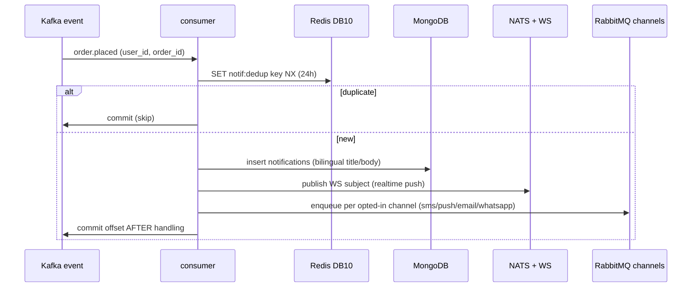
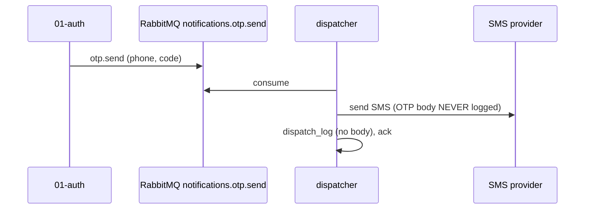

# `14-notification` — Multi-Channel Fan-Out · Service Architecture

> **Scope.** Implementation-grade architecture for the DOKANDAR **`14-notification`** service — event-to-user
> fan-out: it materializes a per-user inbox and pushes per channel (SMS, WhatsApp, push, email, realtime WS).
> Authoritative spec: [`../../architecture.md`](../../architecture.md) §9 (`14-notification`) + §10–§14 + §21;
> [`../../README.md`](../../README.md) §6/§7/§8/§10; [`../../SERVICE_INTEGRATION_TEMPLATE.md`](../../SERVICE_INTEGRATION_TEMPLATE.md)
> (Appendix **A.3 Node/Fastify**). **On any conflict the README wins.**
>
> **Grounding, not copying.** The reference at `~/Desktop/DevOps/14-notification` is **Node/Fastify** — read for
> contract behaviour (the channel queues, the WS fan-out, the dispatcher). It **diverges**: it persists on
> Postgres, but the spec store is **MongoDB** (§16-a); it gates `/ready` on postgres+redis, but spec gates
> **MongoDB only** (§16-b). Code does not exist yet; this is the build contract.

| | |
| --- | --- |
| **Service** | `14-notification` |
| **Domain** | Transaction — notification fan-out |
| **Language · framework** | Node 24 · Fastify 5 |
| **`SERVICE_PORT`** | `3000` · **no gRPC** |
| **External ports** | REST `10014` |
| **Datastores** | **MongoDB 8.3** (inbox) · Redis **DB 10** (dedup + WS routing) · **NATS JetStream** (WS subjects) · **No Postgres, no outbox** |
| **`/ready` hard-gate** | **MongoDB only** (the inbox store; Redis/RabbitMQ/Kafka degradable/diagnostic) |
| **Emits (Kafka)** | **nothing** (terminal consumer — no outbox) |
| **Consumes (Kafka)** | `user.created`, `order.placed`, `payment.*`, `kyc.*`, `wallet.cashback_granted` |
| **RabbitMQ** | `notifications.{email,sms,push,whatsapp_deeplink}` (DLQs) + drains `notifications.otp.send` |
| **`service_name` (identity)** | `14-notification` — from `SERVICE_NAME`, used **identically** everywhere |

**Contents.** §1 Role · §2 Position · §3 Data · §4 Domain flows · §5 REST + WS map · §6 OpenAPI/Swagger surface
· §7 gRPC (none) · §8 The five ops endpoints · §9 TENANT/`/data`/env · §10 Eventing (consume + channels) ·
§11 Logging & observability · §12 Security · §13 Resilience · §14 Boot · §15 Deployment · §16 Stack landmines ·
§17 Design decisions · §18 Build status.

---

## 1. Role & bounded context

`14-notification` is the **terminal consumer** of the event fabric: it turns platform events into user-facing
notifications. It materializes a per-user inbox (MongoDB), pushes realtime via WebSocket, and dispatches the
external channels (SMS, WhatsApp, push, email) through RabbitMQ workers. It **emits nothing** — it is a sink,
not a source.

**Responsibilities**

- **Event → notification** — map a Kafka event to a bilingual (`title_bn`/`title_en`, `body_bn`/`body_en`)
  notification, deduped against redelivery.
- **Inbox** — materialize the per-user inbox in MongoDB; serve "latest N for this user".
- **Realtime** — push to a live WebSocket via NATS JetStream + cross-pod Redis pub/sub.
- **Channel dispatch** — per-channel RabbitMQ queues to SMS (SSL Wireless), WhatsApp Business Cloud, FCM push,
  and email (Amazon SES), each KEDA-autoscaled.
- **OTP delivery** — drain `notifications.otp.send` from `01-auth` (the OTP body is never logged).
- **Preferences** — per-user, per-channel opt-in.

**Explicitly NOT in scope**: minting OTPs (`01-auth`); the business events (each owning service emits them);
delivery-receipt truth beyond the dispatch log.

---

## 2. Position in the platform

```
   01-auth ─user.created─┐
   13-order ─order.placed┤
   09-payment ─payment.*─┤  (Kafka, consume-only)
   01-auth ─kyc.*────────┤
   10-wallet ─cashback───┘
                    ▼
   ┌────────── 14-notification (Node 24 / Fastify 5 · REST :3000 · no gRPC) ──────────────┐
   │  consumer ─► dedup (Redis notif:dedup 24h) ─► materialise inbox (MongoDB)             │
   │  realtime ─► NATS JetStream subjects + Redis pub/sub ws:user:<id> ─► @fastify/websocket │
   │  channels ─► RabbitMQ notifications.{email,sms,push,whatsapp_deeplink} ─► workers       │
   │  OTP      ◄─ RabbitMQ notifications.otp.send (from 01-auth)                             │
   │  logs ─► stdout (JSON) + Mongo + ES ;  traces ► Elastic APM                            │
   └────────────────────────────────────────────────────────────────────────────────────────┘
        external: SMS (SSL Wireless) · WhatsApp Business Cloud · FCM push · email (Amazon SES)
```

NATS is **not** a durability path — the durable record is the MongoDB inbox row; NATS only carries the
low-latency WS fan-out. The **outbox rules do not apply to NATS**.

---

## 3. Data architecture

### 3.1 MongoDB 8.3 — the inbox (no Postgres, no outbox)

```jsonc
// notifications — one document per delivered notification
{
  "_id": "…", "userId": "…",
  "kind": "order_placed",            // welcome|order_placed|payment_settled|kyc_approved|cashback|…
  "category": "transactional",       // transactional | promotional
  "title_bn": "…", "title_en": "Order placed",
  "body_bn": "…",  "body_en": "Your order #123 is placed.",
  "deepLink": "/orders/123",
  "read": false, "createdAt": "…"
}
// notification_preferences — per user, per channel opt-in
{ "_id": "…", "userId": "…", "channels": { "sms": true, "push": true, "email": false, "whatsapp": true } }
// notification_dispatch_log — external send audit, 90-day TTL index
{ "_id": "…", "userId": "…", "channel": "sms", "provider": "ssl_wireless", "providerId": "…",
  "status": "sent", "tsDate": "…" /* TTL 90d on tsDate */ }
```

The collections are schema-flexible (the notification shape varies by `kind`); the `notification_dispatch_log`
has a **90-day TTL index** on `tsDate` so audit data self-expires. The inbox row is the durable record.

### 3.2 Redis — DB 10 (dedup + WS routing, degradable)

| Key | Value | TTL | Purpose |
| --- | --- | --- | --- |
| `notif:dedup:<topic>:<key>` | `1` | 24h | absorb Kafka at-least-once redelivery |
| `ws:user:<id>` | pod id | session | map a user → the pod holding their socket |
| pub/sub channel `ws:user:*` | inbox event | — | cross-pod broadcast so any pod can push to a socket elsewhere |

Redis is **degradable** — REST inbox reads serve from MongoDB without it (only dedup + cross-pod WS fan-out
degrade), so it **does not gate `/ready`** (§8.1).

### 3.3 NATS JetStream — WS fan-out subjects

NATS carries the low-latency realtime subjects to the WebSocket pods. It is **not** a durability path (the
inbox row is durable in Mongo); a NATS outage degrades realtime push only — the inbox still materializes and
the channel workers still dispatch.

---

## 4. Domain flows

### 4.1 Event fan-out (consume → dedup → inbox → push + channels)



### 4.2 OTP drain



---

## 5. Synchronous REST + WS map

REST under **`/api/v1/notification/*`** (+ a WebSocket). Pretty JSON except `/metrics`/`/openapi.json`/`/docs`.

| Method | Path | Auth | Purpose |
| --- | --- | --- | --- |
| `GET` | `/api/v1/notification/inbox?page=&size=` | Bearer | latest-N inbox (paged) |
| `POST` | `/api/v1/notification/inbox/{id}/read` | Bearer | mark read |
| `POST` | `/api/v1/notification/inbox/read-all` | Bearer | mark all read |
| `GET` | `/api/v1/notification/preferences` | Bearer | channel opt-ins |
| `PUT` | `/api/v1/notification/preferences` | Bearer | update opt-ins |
| `WS` | `/api/v1/notification/ws/inbox` | Bearer | realtime inbox stream |

The WebSocket authenticates the Bearer on upgrade, registers `ws:user:<id>` → pod, and receives pushes from
NATS / the cross-pod Redis broadcast.

---

## 6. The OpenAPI / Swagger surface

`14-notification` is a **reflection-OpenAPI** stack: **`@fastify/swagger`** captures the route schemas. The
**ordering is load-bearing** — register `@fastify/swagger` (the spec) **before** the routes, and
`@fastify/swagger-ui` (the UI) **after** (§16). Served at `/openapi.json`, Swagger UI at `/docs`.

- **Security scheme** — `HTTPBearer` (JWT) → the `Authorize` button; all routes secured.
- **Info** — title **DOKANDAR Notification Service**, `version` from `CODE_VERSION` (= `14-notification`),
  identity banner + How-to-test.
- **Schema catalog** — `Notification` (bilingual `title_*`/`body_*`, `kind`, `category`, `deepLink`, `read`),
  `Preferences` (`channels` map), `ErrorEnvelope`. Each route declares its Fastify JSON schema (params + body +
  response) so the document + runtime validation share one source.
- **Per-endpoint responses** — inbox: `200` · `401`. mark-read: `200` · `401` · `404`. preferences PUT:
  `200` · `401` · `422`. The WS upgrade is documented as a non-2xx-bodied endpoint.

---

## 7. gRPC

`14-notification` **exposes no gRPC and calls none** (spec §9). Its inputs are Kafka + RabbitMQ; its outputs are
the inbox, the WS stream, and the external channels.

---

## 8. The five operational endpoints

Shared identity block (`service_name=14-notification`, `code_version=14-notification`, …). Pretty JSON except
`/metrics`.

### 8.1 `GET /ready` — traffic gating (MongoDB only)

Gates **MongoDB only** — the inbox store is the single dependency a request cannot be served without. Redis
(dedup + WS routing), RabbitMQ (channel dispatch), Kafka (ingest), and NATS (realtime) are all
degradable/diagnostic — by the single-request rule they do **not** gate. `200`/`503`.

```jsonc
{ "status": "ready", "identity": { … }, "dependencies": [ { "name": "mongodb", "reachable": true, "latency_ms": 1.0 } ] }
```

> **Spec correction (§16-b).** The reference gates `/ready` on **postgres + redis** (it persists on Postgres);
> the spec store is **MongoDB** and the gate is **MongoDB only**.

### 8.2 `GET /health` — full diagnostics

Identity + all deps + observability. Core: `mongodb`; reported: `redis`, `kafka`, `rabbitmq`, `nats`,
`mongo_logs`, `apm`.

```jsonc
{
  "status": "healthy",
  "identity": { … },
  "checks": {
    "mongodb":    { "ok": true },
    "redis":      { "ok": true },
    "kafka":      { "ok": true },
    "rabbitmq":   { "ok": true },
    "nats":       { "ok": true },
    "mongo_logs": { "ok": true },
    "apm":        { "ok": true }
  },
  "observability": {
    "apm_service_name": "14-notification",
    "logs_sink_mongo":  "mongodb://…/mongo_db_dokandar_application_logs.14-notification",
    "logs_sink_es":     "http://es-host:9200/logs-app-14-notification-*"
  }
}
```

### 8.3 `GET /data` — TENANT snapshot

`data/<TENANT>/result.json` (bind-mounted RO), identity prepended; `404 no_snapshot` / `500 snapshot_parse_failed`.

### 8.4 `GET /metrics`

RED + notification business + WS gauge; closed-set labels (`channel`, `kind` — never `user_id`);
`service="14-notification"`.

```
notification_sent_total{service="14-notification",channel="sms"}        …
notification_dedup_hits_total{service="14-notification"}                …
notification_websocket_connections{service="14-notification"}           …   # gauge
notification_channel_queue_depth{service="14-notification",channel="push"}  …
```

> **Note.** No outbox → no `*_outbox_pending` gauge; the health signals are channel queue depth + WS connections.

### 8.5 `GET /docs` & `GET /openapi.json`

Swagger UI (titled **DOKANDAR Notification Service**) + the document. Bare 404 on unmapped paths (Fastify
auto-injects a `Content-Type` — strip it); `405` on method typos.

---

## 9. TENANT, `/data` & the env-render contract

```ini
APP_ENV=prod
SERVICE_NAME=14-notification      # identity everywhere — FAIL FAST if empty
ENV_VERSION=v1.0.0
TENANT=cloud
SERVICE_PORT=3000                 # Node/Fastify (normalized from the MVP's 8000); no gRPC

# MongoDB (the inbox store — NOT Postgres)  [GATED]
MONGO_URI=mongodb://<MONGO_USER>:<MONGO_PASS>@<INFRA_HOST>:27017/dokandar_notification_prod?authSource=admin

# Redis (DB 10 — dedup + WS routing)
REDIS_HOST=<INFRA_HOST>
REDIS_PORT=<REDIS_PORT>
REDIS_PASSWORD=<REDIS_PASS>
REDIS_DB=10
NOTIF_DEDUP_TTL_SECONDS=86400

# NATS JetStream (WS fan-out subjects — NOT a durability path)
NATS_URL=<NATS_URL>
NATS_WS_SUBJECT_PREFIX=dokandar.ws.inbox

# Kafka (consume-only)
KAFKA_BOOTSTRAP=<KAFKA_EXTERNAL>
KAFKA_TOPIC_USER_CREATED=dokandar.user.created
KAFKA_TOPIC_ORDER_PLACED=dokandar.order.placed
KAFKA_TOPIC_PAYMENT_SETTLED=dokandar.payment.settled
KAFKA_TOPIC_KYC_APPROVED=dokandar.kyc.approved
KAFKA_TOPIC_KYC_REJECTED=dokandar.kyc.rejected
KAFKA_TOPIC_WALLET_CASHBACK=dokandar.wallet.cashback_granted

# RabbitMQ (channel queues + OTP drain)
RABBITMQ_URL=<AMQP_URL>
RABBITMQ_QUEUES=notifications.email,notifications.sms,notifications.push,notifications.whatsapp_deeplink
RABBITMQ_QUEUE_OTP=notifications.otp.send

# External channel providers
SSL_WIRELESS_API_KEY=<…>          # SMS (primary)
WHATSAPP_CLOUD_TOKEN=<…>          # WhatsApp Business Cloud
FCM_SERVER_KEY=<…>                # push
AWS_SES_REGION=<…>                # email

# Observability
MONGO_LOG_URI=<MONGO_URI>
MONGO_LOG_DB=mongo_db_dokandar_application_logs   # collection = 14-notification
APM_SERVER_URL=<APM_URL>
APM_SERVICE_NAME=14-notification                  # normalized from the MVP's 'notification'

# JWT (verify-only)
JWT_PUBLIC_KEY_B64=<JWT_PUBLIC>   # FAIL FAST under stage/prod if empty
JWT_ISSUER=dokandar-auth
```

Fail-fast on empty `SERVICE_NAME` (always) and empty `JWT_PUBLIC_KEY_B64` under stage/prod. `TENANT` read once →
identity, `/data`, APM labels.

---

## 10. Eventing (consume + channels)

**Emits nothing — no outbox** (terminal consumer). **Consumes** (Kafka, manual commit **after** handling):
`dokandar.user.created` (welcome), `dokandar.order.placed`, `dokandar.payment.*`, `dokandar.kyc.*`,
`dokandar.wallet.cashback_granted`. Redelivery is absorbed by `notif:dedup:<topic>:<key>` (24h).

**RabbitMQ channel dispatch** — four durable queues each with a **DLQ**:
`notifications.{email,sms,push,whatsapp_deeplink}`; **KEDA autoscales each per queue depth** so a festival blast
spins SMS/push consumers independently of email. It also **drains `notifications.otp.send`** from `01-auth` to
deliver login OTPs.

**NATS JetStream** carries the realtime WS subjects (non-durable).

---

## 11. Application logging & observability

- **Three sinks** — stdout (pretty JSON) + MongoDB `mongo_db_dokandar_application_logs.14-notification` +
  Elasticsearch `logs-app-14-notification-*` (ECS); every line carries the trace id; **strip Mongo `_id`**
  before the ES `_bulk` (§16). Fire-and-forget, drop-not-block. **OTP codes / notification bodies are never
  logged.**
- **Access log** — one line per genuine request; `/ready`, `/metrics`, **and `/health`** excluded; true client
  IP, method, **templated** route, status, latency, `request_id`.
- **APM (Node)** — **`import './apm'` must be line 1** of `server.ts`, before any other import; wire
  `ELASTIC_APM_SERVICE_NAME=14-notification`, version from `CODE_VERSION`.
- **Metrics** — `prom-client`; RED + `notification_sent_total{channel}`, `notification_dedup_hits_total`,
  `notification_websocket_connections`, `notification_channel_queue_depth{channel}`.

---

## 12. Security

- **Verify-only RS256** — decode `JWT_PUBLIC_KEY_B64`, pin `RS256`, check `iss`/`aud`/`exp`/`sub`; the inbox +
  preferences + WS are owner-scoped; the WS authenticates the Bearer on upgrade.
- **OTP/PII hygiene** — OTP codes and notification bodies are **never** logged; the dispatch log records the
  channel + provider id, not the content.
- **Channel credentials** — provider keys are injected at runtime, never committed.
- **No outbox / no emit** — nothing leaves to Kafka; the only outbound is the user's own channels.

---

## 13. Resilience & failure modes

| Failure | Effect | Mitigation |
| --- | --- | --- |
| MongoDB down | cannot read/write inbox | `/ready` → `503` (gated) |
| Redis down | dedup + cross-pod WS degrade | inbox still serves from Mongo — `/ready` stays green |
| NATS down | realtime push degrades | inbox materializes; channels dispatch; durable record intact |
| RabbitMQ channel down | external send delayed | durable queue + DLQ; KEDA scales on recovery; in-app/WS already delivered |
| Kafka redelivery | duplicate notification | `notif:dedup` (24h) absorbs it |
| a channel provider down | one channel fails | per-channel queue + DLQ; other channels unaffected |
| festival blast | queue spike | KEDA autoscales per-channel consumers independently |

---

## 14. Boot sequence & lifecycle

1. **`import './apm'` (line 1)** — agent patches the runtime before anything else loads.
2. Read identity; fail-fast on empty `SERVICE_NAME` / (stage·prod) `JWT_PUBLIC_KEY_B64`.
3. **ensure-db** — ensure the Mongo database/collections + the `notification_dispatch_log` 90-day TTL index.
4. Connect Mongo + Redis + NATS + RabbitMQ.
5. Register `@fastify/swagger` (spec) **before** routes, then routes, then `@fastify/swagger-ui` (§16).
6. Start the Fastify server (`3000`) + `@fastify/websocket`; `enableShutdownHooks` for drain.
7. Start the Kafka consumers + the RabbitMQ channel workers + the OTP drainer.
8. Serve — `HEALTHCHECK → /ready`. `npm ci` with the committed lockfile.

---

## 15. Deployment & runtime

- **Image** — multi-stage Node 24 (build → slim), non-root **uid `10001`**; `import './apm'` first; a tiny
  healthcheck script. REST `3000`; **no gRPC port**. External LB maps `10014 → 3000` (with WS upgrade support).
- **`HEALTHCHECK`** — `GET /ready`. **Config** — `--env-file` at runtime; `data/<tenant>/` bind-mounted RO.
- **Scaling** — the API/WS pods scale on RPS + socket count (socket→pod affinity via Redis); the channel
  workers scale on RabbitMQ queue depth (KEDA), per channel.

---

## 16. Stack landmines & reconciliation

- **(a) Store = MongoDB, not Postgres** — the MVP persists on Postgres; the spec store is **MongoDB** (no SQL,
  no outbox) (§3.1).
- **(b) `/ready` MongoDB-only** — the ref gates postgres+redis; spec gates **MongoDB only** (§8.1).
- **(c) `import './apm'` line 1** — first import in `server.ts` (§11).
- **(d) `@fastify/swagger` ordering** — register the spec **before** routes, the UI **after** (§6).
- **(e) commit-after-handle** — manual offset commit after the consumer handler (§10).
- **(f) ES `_bulk` `_id` strip** — strip Mongo `_id` before bulk-indexing logs (§11).
- **(g) `npm ci` + lockfile** — reproducible installs (§14).
- **(h) OTP bodies never logged** — OTP codes + notification content excluded from all sinks (§12).
- **(i) NATS is not durable** — the inbox row is the durable record; outbox rules do not apply to NATS (§3.3).
- **(j) Access-log exclusions** — add `/health` to `/ready`+`/metrics` (§11).
- **(k) Identity/port** — normalize `SERVICE_PORT 8000→3000`, `APM_SERVICE_NAME notification→14-notification`,
  `CODE_VERSION 14-notification (already correct)`.

---

## 17. Design decisions & open items

- **Terminal consumer, no outbox** — notification is a pure sink; it emits nothing, so there's no outbox and no
  `*_outbox_pending` gauge — the health signals are queue depth + WS connections.
- **MongoDB for a flexible inbox** — the notification shape varies by `kind`; a document store + a TTL'd dispatch
  log beats a rigid relational schema (the same rationale as `06-cart`).
- **NATS for realtime, Mongo for durability** — NATS carries the low-latency WS fan-out, but losing it only
  degrades push; the durable record is the inbox row. The two layers are deliberately separated.
- **Per-channel KEDA** — a festival SMS blast scales SMS consumers without touching email — channels fail and
  scale independently.
- **Open items** — delivery-receipt webhooks from providers (status reconciliation); quiet-hours / rate-limits
  per user; rich push (images); the WhatsApp template approval flow; digest batching for promotional category.

---

## 18. Build status & cross-references

**Status — specified, not yet implemented.** No code exists; this is the build contract. Reference shape:
`~/Desktop/DevOps/14-notification` (a **Node/Fastify** MVP on **Postgres** — read for contract behaviour only;
the spec store is **MongoDB**, §16-a).

**Authoritative sources**

- [`../../architecture.md`](../../architecture.md) — **§9** `14-notification`; **§10–§14**; **§21** the anchor.
- [`../../README.md`](../../README.md) — §6 service table · §7 ports · §8 version pins · §10 (the MongoDB inbox +
  the Redis DB-10 allocation).
- [`../../SERVICE_INTEGRATION_TEMPLATE.md`](../../SERVICE_INTEGRATION_TEMPLATE.md) — Appendix **A.3 Node/Fastify**;
  the `import './apm'` / `@fastify/swagger`-ordering / OTP-never-logged landmine rows.
- Sibling exemplars: [`../01-auth/architecture.md`](../01-auth/architecture.md) (the OTP producer this drains),
  [`../06-cart/architecture.md`](../06-cart/architecture.md) (the Node/Mongo pattern).

**Build checklist** — `Dockerfile` (multi-stage Node, uid 10001, apm-first, `HEALTHCHECK → /ready`) ·
`env/init-env.sh` + `.env.<env>` (fail-fast, `mongodb://` URI) · the five endpoints + identity + `X-Request-Id`
envelope · the consumers (dedup + commit-after-handle) · the RabbitMQ channel workers + DLQs + OTP drain · the
NATS/WS fan-out · `data/<tenant>/result.json` · `OPERATIONS.md` / `SECURITY.md` / `docs/adr/`.
