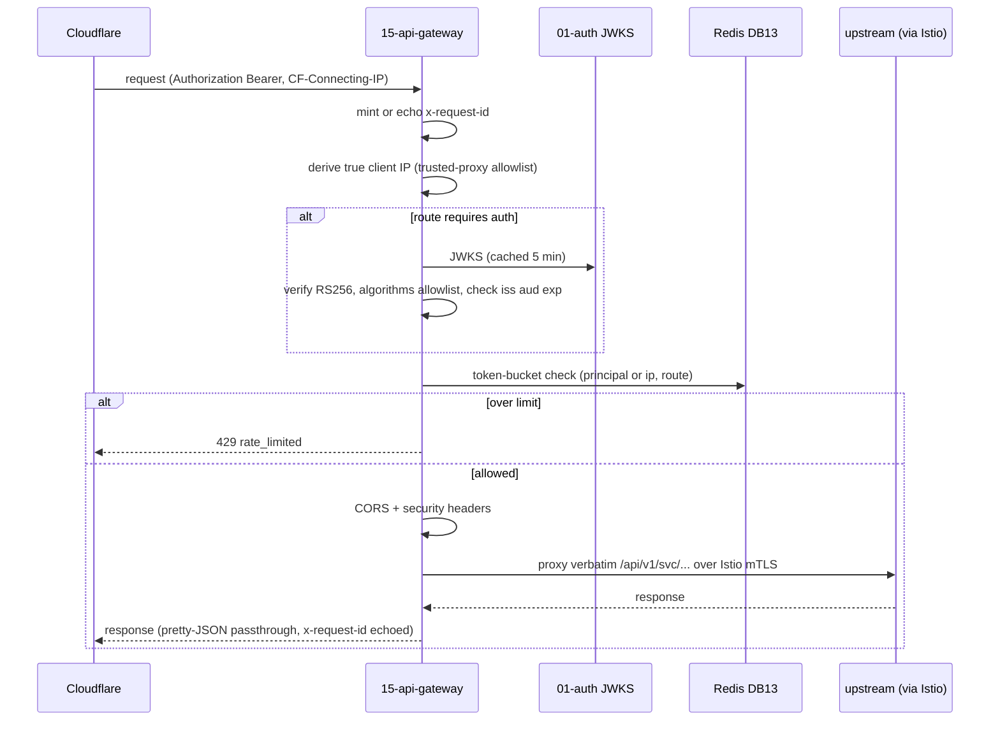

# `15-api-gateway` — Edge Ingress · Service Architecture

> **Scope.** Implementation-grade architecture for the DOKANDAR **`15-api-gateway`** service — the sole client
> entry point after Cloudflare: JWKS verify, per-route auth, rate-limit, CORS + security headers, reverse-proxy
> over Istio, and BFF aggregation. Authoritative spec: [`../../architecture.md`](../../architecture.md) §9
> (`15-api-gateway`) + §3 (request-path diagram) + §10–§14; [`../../README.md`](../../README.md) §6/§7/§8/§9.9;
> [`../../SERVICE_INTEGRATION_TEMPLATE.md`](../../SERVICE_INTEGRATION_TEMPLATE.md) (Appendix **A.7 Node/Go edge**).
> **On any conflict the README wins.**
>
> **Grounding.** The reference at `~/Desktop/DevOps/15-api-gateway` is **env-only** (a scaffold — no Go source
> yet), so this doc is grounded in the spec + the reference's env (upstreams, JWKS, rate-limit, CORS). The spec
> target is **Go 1.26 / Echo v5**. Code does not exist yet; this is the build contract.

| | |
| --- | --- |
| **Service** | `15-api-gateway` |
| **Domain** | Edge — ingress / security choke point |
| **Language · framework** | Go 1.26 · Echo v5 |
| **`SERVICE_PORT`** | `8080` → public `443` · **no gRPC** |
| **External ports** | REST `10015` → `443` public |
| **Datastores** | Redis **DB 13** (token-bucket rate-limiter only) · **stateless otherwise** (no DB/outbox/events) |
| **`/ready` hard-gate** | **nothing external** — `200` once the process is up (serves with Redis down) |
| **Eventing** | **none** — never touches Kafka/RabbitMQ/NATS |
| **`service_name` (identity)** | `15-api-gateway` — from `SERVICE_NAME`, used **identically** everywhere |

**Contents.** §1 Role · §2 Position · §3 Data (stateless) · §4 Request flow · §5 Routing & proxy · §6 OpenAPI/
Swagger surface · §7 gRPC (none) · §8 The five ops endpoints · §9 TENANT/`/data`/env · §10 Eventing (none) ·
§11 Edge concerns & observability · §12 Security (the choke point) · §13 Resilience · §14 Boot · §15 Deployment
· §16 Stack landmines · §17 Design decisions · §18 Build status.

---

## 1. Role & bounded context

`15-api-gateway` is the **single front door**. Every client request transits it. After Cloudflare TLS-terminates
and bot-filters, the gateway verifies the JWT (against `01-auth`'s JWKS), gates per-route authorization,
rate-limits, applies CORS + security headers, and reverse-proxies east-west over the **Istio mesh (mTLS)**. It
also stitches multi-service responses via BFF aggregation. It is **stateless** — it holds no business data, no
PII at rest (only transient rate counters in Redis), and emits no events.

**Responsibilities**

- **JWKS verification** — verify RS256 tokens against a **5-minute in-process cache** of `01-auth`'s `/jwks`,
  with `algorithms:['RS256']` pinned (never "any alg the JWK supports").
- **Per-route auth gating** — public vs Bearer-required per route.
- **Rate-limiting** — Redis token bucket keyed by principal/route.
- **CORS + security headers** — HSTS, CSP, `X-Content-Type-Options: nosniff`, an explicit origin allowlist.
- **Reverse-proxy** — **verbatim path forwarding** (`/api/v1/<svc>/…` proxies unchanged) over Istio.
- **BFF aggregation** — fan-out + stitch for composite client screens.
- **Edge contract** — centralize the **bare-404**, pretty-JSON, and `x-request-id` mint/echo.

**Explicitly NOT in scope**: any business logic, datastore, or event; idempotency (delegated to the downstream
owners of money/stock); east-west *gRPC* (the proxy rides Istio, not a gRPC server here).

---

## 2. Position in the platform

```
   Browser/App ─► Cloudflare (TLS, WAF, bot) ─► 15-api-gateway (Go/Echo · :8080 → :443) ─► Istio mesh (mTLS) ─► upstreams
                                                      │
                                                      ├── JWKS verify (5-min cache of 01-auth /jwks, RS256 pinned)
                                                      ├── per-route auth gate
                                                      ├── Redis DB 13 token-bucket rate-limit (by principal/route)
                                                      ├── CORS + security headers (HSTS/CSP/nosniff)
                                                      ├── x-request-id mint/echo · bare-404 · pretty-JSON
                                                      └── BFF aggregation (fan-out + stitch)
   upstreams (verbatim /api/v1/<svc>/...): 01-auth … 14-notification (REST 100NN), via Istio
```

The gateway **touches no Kafka/RabbitMQ/NATS** and exposes **no gRPC** — east-west is HTTP reverse-proxy over
the service mesh.

---

## 3. Data architecture (stateless)

`15-api-gateway` owns **no business datastore**. Its only state is **Redis DB 13**, holding the token-bucket
rate-limiter counters (keyed by principal/route, short TTL) and nothing else. The JWKS key set is cached
**in-process** (5-min TTL). There is **no Postgres, no outbox, no events**. This statelessness is what lets it
gate `/ready` on nothing and scale purely on CPU/RPS.

| State | Where | Notes |
| --- | --- | --- |
| rate-limit counters | Redis DB 13 | token bucket `ratelimit:<principal-or-ip>:<route>`; degradable |
| JWKS key set | in-process cache | 5-min TTL; a fetch failure serves from the cached set |

---

## 4. Request flow



---

## 5. Routing & proxy

**Verbatim path forwarding.** `/api/v1/<svc>/…` proxies unchanged to the upstream resolved from the
`UPSTREAM_<SVC>` table; the gateway does **not** rewrite paths. Per-route config declares: the upstream, whether
auth is required, the rate-limit policy, and the timeout. A small set of **BFF aggregation** endpoints fan out
to several upstreams and stitch one response for a composite client screen.

| Prefix | Upstream | Auth | Notes |
| --- | --- | --- | --- |
| `/api/v1/auth/*` | `01-auth` (10001) | mostly public | login/OTP/JWKS |
| `/api/v1/catalog/*`, `/api/v1/search/*` | 04 / 05 | public reads | storefront (Varnish in front) |
| `/api/v1/cart/*`, `/api/v1/order/*`, `/api/v1/wallet/*`, `/api/v1/payment/*` | 06/13/10/09 | Bearer | per-user; never edge-cached |
| `/api/v1/<svc>/*` | the matching `UPSTREAM_<SVC>` | per route | verbatim |
| `/api/v1/bff/*` | several | Bearer | BFF fan-out + stitch |

Each upstream has a **per-upstream circuit breaker + deadline** (`UPSTREAM_READ_TIMEOUT_MS`) so a slow service
can't cascade.

---

## 6. The OpenAPI / Swagger surface

The gateway documents **only its own gateway-owned routes** (ops, the BFF endpoints, the auth-gating contract) —
the proxied upstream APIs are documented by their owners. It is a **hand-written-OpenAPI** stack (Go), served at
`/openapi.json`, Swagger UI at `/docs`, with a **CI route-vs-spec diff** guard.

- **Security scheme** — `HTTPBearer` (JWT) → the `Authorize` button.
- **Info** — title **DOKANDAR API Gateway**, `version` from `CODE_VERSION` (= `15-api-gateway`), identity banner
  + How-to-test (the gateway is the place to obtain/use a token).
- **Documented surface** — the five ops endpoints, the BFF aggregation routes (with their stitched response
  schemas), and the standard error envelope (`401 token_invalid`, `403 forbidden`, `429 rate_limited`,
  `502 upstream_error`, `504 upstream_timeout`).

---

## 7. gRPC

`15-api-gateway` **exposes no gRPC and runs no gRPC client** in the request path — east-west is HTTP
reverse-proxy over **Istio (mTLS)**. The mesh provides the transport security; the gateway provides the
application-layer auth + rate-limit.

---

## 8. The five operational endpoints

Shared identity block (`service_name=15-api-gateway`, `code_version=15-api-gateway`, …). Pretty JSON except
`/metrics`. **These are the gateway's own ops endpoints** (not proxied).

### 8.1 `GET /ready` — gates nothing external

The gateway gates on **nothing external**: JWT verification runs off the in-process JWKS cache and routing is
stateless, so it serves requests even with Redis down (rate-limiting degrades per route policy). `/ready` is
`200` **once the process is up** — consistent with the "can't serve a single request without it" rule (there is
no such dependency).

```jsonc
{ "status": "ready", "identity": { … }, "dependencies": [] }
```

> **Why empty `dependencies`.** This is the one service whose `/ready` lists no deps — a Redis or upstream
> outage must not pull the only front door out of the LB; it degrades behavior, it doesn't stop serving.

### 8.2 `GET /health` — TCP-probes upstreams (does not flip `/ready`)

Identity + the **upstream reachability map** (TCP probes — **not** the upstreams' `/ready`, to avoid coupling
the gateway's health to downstream readiness) + Redis + observability. None of these flip `/ready`.

```jsonc
{
  "status": "healthy",
  "identity": { … },
  "checks": {
    "redis":     { "ok": true },
    "jwks":      { "ok": true, "detail": "cached" },
    "apm":       { "ok": true }
  },
  "upstreams": {
    "01-auth": { "ok": true }, "04-catalog": { "ok": true }, "13-order": { "ok": true }
    /* TCP-reachability of each UPSTREAM_<svc>, diagnostic */
  },
  "observability": {
    "apm_service_name": "15-api-gateway",
    "logs_sink_mongo":  "mongodb://…/mongo_db_dokandar_application_logs.15-api-gateway",
    "logs_sink_es":     "http://es-host:9200/logs-app-15-api-gateway-*"
  }
}
```

> **Landmine (§16).** `/health` **TCP-probes** each upstream — it must **not** call the upstreams' `/ready`
> (that would make the gateway's health transitively depend on every service, and a single down service would
> mark the edge unhealthy).

### 8.3 `GET /data` — TENANT snapshot

`data/<TENANT>/result.json` (bind-mounted RO), identity prepended; `404 no_snapshot` / `500 snapshot_parse_failed`.

### 8.4 `GET /metrics`

RED + edge metrics; closed-set labels (`route`, `upstream`, `status` — **never** the client IP or principal);
`service="15-api-gateway"`.

```
http_requests_total{service="15-api-gateway",route="/api/v1/order/orders",status="200"}  …
gateway_rate_limited_total{service="15-api-gateway",route="/api/v1/search/products"}     …
gateway_upstream_errors_total{service="15-api-gateway",upstream="04-catalog"}            …
gateway_jwks_refresh_total{service="15-api-gateway",result="ok"}                         …
```

### 8.5 `GET /docs` & `GET /openapi.json`

Swagger UI (titled **DOKANDAR API Gateway**) + the hand-written gateway document. The gateway also **centralizes
the bare-404** for the edge (`Content-Length: 0`, no `Content-Type`) and `405` on method typos.

---

## 9. TENANT, `/data` & the env-render contract

```ini
APP_ENV=prod
SERVICE_NAME=15-api-gateway       # identity everywhere — FAIL FAST if empty
ENV_VERSION=v1.0.0
TENANT=cloud
SERVICE_PORT=8080                 # → public 443 (normalized from the MVP's 8000); no gRPC

# JWT via JWKS (no static public key) — 5-min in-process cache
JWKS_URL=http://<AUTH_HOST>:10001/api/v1/auth/jwks
JWKS_CACHE_TTL_SECONDS=300
JWT_ALGORITHMS=RS256              # PINNED allowlist — never accept other algs
JWT_AUDIENCE=dokandar             # enforce aud
JWT_ISSUER=dokandar-auth

# Redis (DB 13 — token-bucket rate-limiter only)
REDIS_HOST=<INFRA_HOST>
REDIS_PORT=<REDIS_PORT>
REDIS_PASSWORD=<REDIS_PASS>
REDIS_DB=13
RATE_LIMIT_MAX=120                # default per window; per-route overrides (search 60/120 anon/user, payment 20)
RATE_LIMIT_WINDOW_MS=1000

# Upstreams (verbatim proxy targets, via Istio)
UPSTREAM_AUTH=http://<AUTH_HOST>:10001
UPSTREAM_CATALOG=http://<CATALOG_HOST>:10004
# … UPSTREAM_<SVC> for all 14 services (10001..10014) …
UPSTREAM_READ_TIMEOUT_MS=5000

# CORS + security
CORS_ALLOWLIST=https://dokandar.com,https://www.dokandar.com   # NEVER '*' in stage/prod (§16)
TRUSTED_PROXY_CIDRS=<CF_CIDRS>    # for the true-client-IP derivation

# Observability
MONGO_LOG_URI=<MONGO_URI>
MONGO_LOG_DB=mongo_db_dokandar_application_logs   # collection = 15-api-gateway
APM_SERVER_URL=<APM_URL>
APM_SERVICE_NAME=15-api-gateway                   # normalized from the MVP's 'api-gateway'
```

Fail-fast on empty `SERVICE_NAME` (always). `TENANT` read once → identity, `/data`, APM labels. **No
`JWT_PUBLIC_KEY_B64`** — the gateway uses the JWKS endpoint, not a static key.

---

## 10. Eventing

**None.** The gateway never touches Kafka, RabbitMQ, or NATS — it emits nothing and consumes nothing. It is a
synchronous request-path component only. (There is therefore no outbox and no `*_outbox_pending` gauge.)

---

## 11. Edge concerns & observability

- **True client IP** — derive from `CF-Connecting-IP` → the **left-most untrusted** `X-Forwarded-For` entry,
  trusting only peers in `TRUSTED_PROXY_CIDRS`; this derived IP is the **rate-limit key** for anonymous traffic
  and the access-log client IP. Never trust a raw `X-Forwarded-For`.
- **`x-request-id`** — minted (uuid4/ULID) if absent, echoed as a response header, and the correlation id the
  gateway stamps so the whole downstream trace shares it.
- **Three log sinks** — stdout (pretty JSON, Go `slog`) + MongoDB `mongo_db_dokandar_application_logs.15-api-gateway`
  + Elasticsearch `logs-app-15-api-gateway-*`; one structured access line per request (method, **templated**
  route, status, latency, derived client IP, `request_id`, the chosen upstream). `/ready`, `/metrics`, `/health`
  excluded.
- **APM (Go)** — the Elastic Go agent / OTel installed as the **outermost** Echo middleware so the edge span is
  the trace root; wire `ELASTIC_APM_SERVICE_NAME=15-api-gateway`, version from `CODE_VERSION`.
- **Metrics** — RED + `gateway_rate_limited_total{route}`, `gateway_upstream_errors_total{upstream}`,
  `gateway_jwks_refresh_total{result}`.

---

## 12. Security — the choke point

- **JWKS verify, RS256 pinned** — verify against the cached JWKS with `algorithms:['RS256']` (explicit
  allowlist), enforce `iss`/`aud`/`exp`/`nbf`. **Never** accept whatever alg the JWK advertises (the classic
  alg-confusion / `none` bypass).
- **Per-route authorization** — public vs Bearer per route; sensitive routes fail-closed.
- **Header hygiene** — HSTS, CSP, `X-Content-Type-Options: nosniff`, an explicit CORS origin allowlist (**never
  `*` in stage/prod** — the MVP env's `CORS_ALLOWLIST=*` is dev-only).
- **Rate-limit defense** — Redis token bucket (per principal/route) sheds festival-surge thundering herds before
  they reach backends; degrades fail-open on storefront, fail-closed on sensitive routes.
- **No PII at rest** — only transient rate counters; the gateway holds no business data.
- **Istio mTLS** — east-west transport is mutually authenticated by the mesh; the gateway adds the
  application-layer JWT + authz on top.

---

## 13. Resilience & failure modes

| Failure | Effect | Mitigation |
| --- | --- | --- |
| Redis down | rate-limit counters lost | **`/ready` stays green**; rate-limit degrades fail-open (storefront) / fail-closed (sensitive) per route |
| `01-auth` JWKS fetch fails | can't refresh keys | serve from the **cached** JWKS key set (5-min TTL) |
| an upstream slow/down | that route fails | per-upstream circuit breaker + deadline → `502`/`504`; other routes unaffected |
| festival surge | thundering herd | rate-limit shedding + Cloudflare protect backends; HPA on CPU/RPS |
| gateway pod restart | brief | stateless — a new pod serves immediately; `/ready` `200` on boot |

*(At scale the spec notes a possible migration to Kong 3.14 / Envoy Gateway 1.8.)*

---

## 14. Boot sequence & lifecycle

1. Read identity; fail-fast on empty `SERVICE_NAME`.
2. Warm the JWKS cache from `JWKS_URL` (tolerate a slow auth — retry; do not block `/ready`).
3. Connect Redis (the rate-limiter; a failure does **not** block boot — degrade per policy).
4. Build the route table from `UPSTREAM_<SVC>` + per-route policy.
5. Start the Echo server (`8080`) with APM outermost; `/ready` returns `200` once listening.
6. Serve — `HEALTHCHECK → /ready` via a tiny **healthcheck binary** in the distroless image (no curl). Echo v5
   note: `echo.Context` is a struct value — use it accordingly; structured logs via `slog`.

---

## 15. Deployment & runtime

- **Image** — multi-stage Go (`CGO_ENABLED=0`) → distroless, non-root **uid `10001`**, a static healthcheck
  binary. `SERVICE_PORT 8080`; external `10015 → 443` public. **No gRPC port.**
- **`HEALTHCHECK`** — `GET /ready`. **Config** — `--env-file` at runtime; `data/<tenant>/` bind-mounted RO.
- **Scaling** — the **hottest path in the fleet** (every request transits it); stateless → HPA on CPU/RPS; p99
  proxy overhead is low single-digit ms.

---

## 16. Stack landmines & reconciliation

- **(a) `/ready` gates nothing** — `200` once the process is up; never gate on Redis/upstreams (the only front
  door must not be pulled from the LB by a downstream blip) (§8.1).
- **(b) `/health` TCP-probes upstreams** — probe reachability, **not** the upstreams' `/ready` (avoid transitive
  health coupling) (§8.2).
- **(c) Pin `algorithms:['RS256']` + enforce `aud`** — never accept the JWK's advertised alg (§12).
- **(d) Redis-backed rate-limit** — distributed token bucket in Redis, **not** in-memory per-instance (which
  multiplies the limit by the replica count) (§3, §12).
- **(e) No CORS `*` in stage/prod** — the MVP env's `CORS_ALLOWLIST=*` is dev-only; use an explicit allowlist
  (§12).
- **(f) Hand-written OpenAPI + CI diff** — document the gateway-owned routes; CI route-vs-spec diff (§6).
- **(g) True-client-IP via trusted-proxy allowlist** — `CF-Connecting-IP` → left-most untrusted `X-Forwarded-For`;
  never trust a raw header; it is the rate-limit key (§11).
- **(h) Distroless healthcheck binary** — no curl in the image (§15).
- **(i) Echo v5 idioms** — `Context` is a struct; structured logs via `slog` (§14).
- **(j) Access-log exclusions** — `/ready`, `/metrics`, `/health` excluded (§11).
- **(k) Identity/port** — normalize `SERVICE_PORT 8000→8080`, `APM_SERVICE_NAME api-gateway→15-api-gateway`,
  `CODE_VERSION 15-api-gateway (already correct)`. **No `JWT_PUBLIC_KEY_B64`** (JWKS, not a static key).

---

## 17. Design decisions & open items

- **Gate nothing, degrade gracefully** — the single front door must stay in rotation through every downstream
  failure; readiness is "process up", and each failure mode degrades a *behavior* (rate-limit policy, a route),
  never the whole edge.
- **JWKS over a static key** — the gateway tracks `01-auth`'s rotating keys via JWKS (5-min cache) so key
  rotation needs no gateway redeploy; a fetch failure serves from cache.
- **Verbatim path forwarding** — the gateway doesn't own the API shape; it forwards paths unchanged so the
  contract lives with each service, not in a brittle central rewrite table.
- **Stateless + Redis-only** — the only state is rate counters; everything else (JWKS, routing) is in-process,
  so the hottest path scales linearly on CPU.
- **Open items** — the BFF endpoint catalog; per-route circuit-breaker tuning; WebSocket pass-through for
  `14-notification`'s `/ws/inbox`; the eventual Kong/Envoy migration path; mTLS cert rotation with Istio.

---

## 18. Build status & cross-references

**Status — specified, not yet implemented.** No code exists; the reference is **env-only**. The spec target is
**Go 1.26 / Echo v5**.

**Authoritative sources**

- [`../../architecture.md`](../../architecture.md) — **§9** `15-api-gateway`; **§3** the request-path diagram;
  **§10–§14**.
- [`../../README.md`](../../README.md) — §6 service table · §7 ports · §8 version pins · §9.9 (API Gateway &
  Edge) · §3 (the true-client-IP / Istio request path).
- [`../../SERVICE_INTEGRATION_TEMPLATE.md`](../../SERVICE_INTEGRATION_TEMPLATE.md) — Appendix **A.7 Node/Go edge**;
  the JWKS-RS256-pinning / Redis-rate-limit / true-client-IP landmine rows.
- Sibling exemplars: [`../02-profile/architecture.md`](../02-profile/architecture.md) (the Go hand-written-OpenAPI
  pattern), [`../01-auth/architecture.md`](../01-auth/architecture.md) (the JWKS issuer it verifies against).

**Build checklist** — `Dockerfile` (multi-stage Go, distroless, uid 10001, healthcheck binary,
`HEALTHCHECK → /ready`) · `env/init-env.sh` + `.env.<env>` (fail-fast; JWKS not a static key) · the five ops
endpoints + identity + `X-Request-Id` mint/echo + bare-404 · the JWKS verify (RS256 pinned, `aud`) · the Redis
token-bucket rate-limiter · the verbatim reverse-proxy + per-upstream circuit breakers · the BFF endpoints +
CI route-vs-spec diff · `data/<tenant>/result.json` · `OPERATIONS.md` / `SECURITY.md` / `docs/adr/`.
