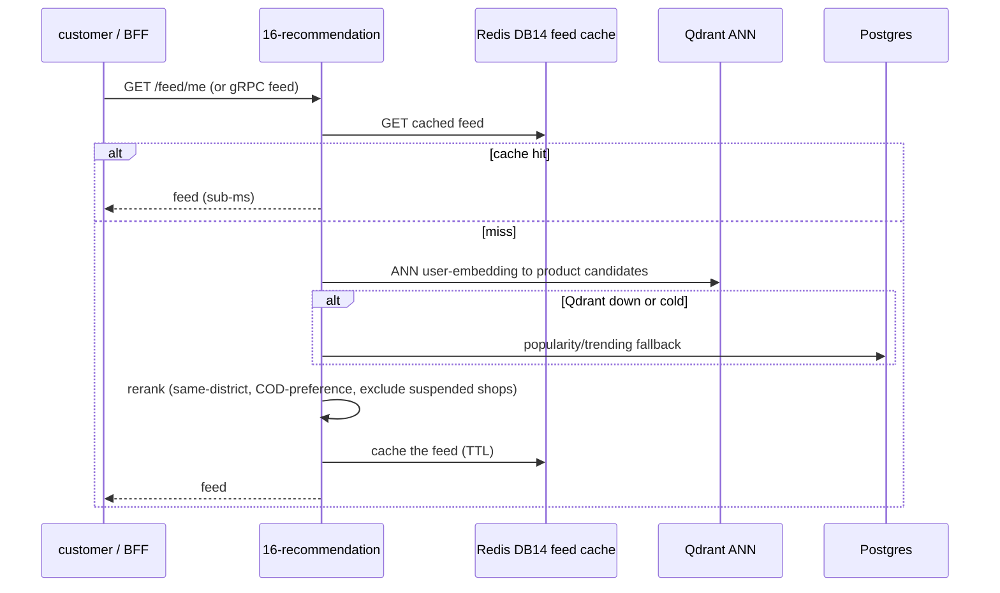
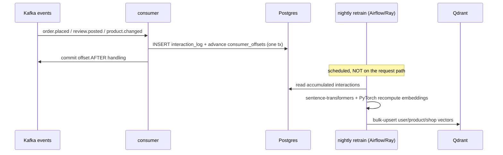

# `16-recommendation` — Personalization · Service Architecture

> **Scope.** Implementation-grade architecture for the DOKANDAR **`16-recommendation`** service — personalized
> discovery feeds (for-you, frequently-bought-together, viewed-also-viewed, cold-start) over embeddings.
> Authoritative spec: [`../../architecture.md`](../../architecture.md) §9 (`16-recommendation`) + §10–§14 + §21;
> [`../../README.md`](../../README.md) §6/§7/§8/§10/§11; [`../../SERVICE_INTEGRATION_TEMPLATE.md`](../../SERVICE_INTEGRATION_TEMPLATE.md)
> (Appendix **A.1 Python/FastAPI**). **On any conflict the README wins.**
>
> **Grounding.** **Spec-only — there is no DevOps reference service for `16-recommendation`.** The stack
> (Python/FastAPI) is reference-backed (the contract mechanics mirror `01-auth`/`11-reporting`), but every
> service-specific shape below (the Qdrant collections, the interaction-log schema, the reranker) is
> **spec-extrapolated and provisional** — there is no `file:line` to cite. Code does not exist yet; this is the
> build contract.

| | |
| --- | --- |
| **Service** | `16-recommendation` |
| **Domain** | Intelligence — personalization |
| **Language · framework** | Python 3.14 · FastAPI · PyTorch (retrain) |
| **`SERVICE_PORT`** | `8000` (REST) · gRPC `50051` |
| **External ports** | REST `10016` · gRPC `20016` |
| **Datastores** | **Qdrant** (user/product/shop embeddings) · PostgreSQL (interaction log + `consumer_offsets`) · Redis **DB 14** (served-feed cache) |
| **`/ready` hard-gate** | **PostgreSQL only** (does **not** gate Qdrant/Redis — popularity fallback serves a feed) |
| **gRPC server** | feed-serving @ `50051` (low-latency in-fleet reads / BFF tiles) |
| **Emits (Kafka)** | **nothing** |
| **Consumes (Kafka)** | `product.changed`, `order.placed`, `review.posted` + search query logs |
| **`service_name` (identity)** | `16-recommendation` — from `SERVICE_NAME`, used **identically** everywhere |

**Contents.** §1 Role · §2 Position · §3 Data · §4 Domain flows · §5 REST map · §6 OpenAPI/Swagger surface ·
§7 gRPC · §8 The five ops endpoints · §9 TENANT/`/data`/env · §10 Eventing · §11 Logging & observability ·
§12 Security · §13 Resilience · §14 Boot · §15 Deployment · §16 Stack landmines · §17 Design decisions ·
§18 Build status.

---

## 1. Role & bounded context

`16-recommendation` serves **personalized discovery**: "for you", "frequently bought together", "shoppers who
viewed this also viewed", and cold-start from first-session clicks. It serves from **pre-computed embeddings**
via Qdrant ANN + a Redis feed cache — **no inline model inference on the request path** — and applies a
**business-rule reranker** with Bangladesh nuances (same-district boost, COD-preference boost, suspended-shop
exclusion). Eventually consistent, read-optimized.

**Responsibilities**

- **Feed serving** — personalized for-you feed, item-similar, cross-sell, cold-start — all from
  precomputed vectors + the Redis feed cache.
- **Reranker** — same-district boost, COD-preference boost, suspended-shop exclusion (a rules layer over ANN).
- **Interaction ingest** — project clicks/views/orders/reviews into the PostgreSQL interaction log (the retrain
  fuel) + `consumer_offsets`.
- **Nightly retrain** — recompute user/product/shop embeddings (sentence-transformers + PyTorch, orchestrated by
  Airflow/Temporal, Ray for distributed batch) and bulk-upsert into Qdrant — **off the request path entirely**.

**Explicitly NOT in scope**: the product/shop truth (`04-catalog`/`03-seller`); full-text search (`05-search`);
the storefront ranking that isn't personalized. Recommendation owns the *personalized* surface only.

---

## 2. Position in the platform

```
   04-catalog ─product.changed─┐
   13-order   ─order.placed────┤   (Kafka, consume-only)
   08-review  ─review.posted───┤
   05-search  ─query logs──────┘
                    ▼  (interaction ingest)
   ┌────────── 16-recommendation (Python 3.14 / FastAPI · REST :8000 · gRPC :50051) ──────────┐
   │  SERVE  Redis DB14 feed cache ─► Qdrant ANN (user/product/shop) ─► business-rule reranker   │
   │  INGEST Postgres interaction_log + consumer_offsets                                         │
   │  RETRAIN nightly (sentence-transformers + PyTorch · Airflow/Temporal · Ray) ─► bulk-upsert Qdrant │
   │  logs ─► stdout (JSON) + Mongo + ES ;  traces ► Elastic APM                                 │
   └──────────────────────────────────────────────────────────────────────────────────────────┘
        15-api-gateway / BFF ──/api/v1/recommendation/* + gRPC feed─► customers
```

Serving and retraining are **decoupled**: steady-state reads hit the Redis feed cache / Qdrant ANN (a
cache/ANN lookup, **not** a PyTorch forward pass); retrain is a scheduled batch sized independently.

---

## 3. Data architecture

### 3.1 Qdrant — embedding collections (the ANN store)

| Collection | Dim | Content |
| --- | --- | --- |
| `dokandar_user_embeddings` | **768** | per-user behavioral embedding (from interaction history) |
| `dokandar_product_embeddings` | **768** | per-product embedding (co-purchase + content) |
| `dokandar_shop_embeddings` | **256** | per-shop embedding |

ANN (cosine) over these powers for-you (user→product), similar (product→product), and cross-sell. Embeddings
reflect the **last retrain** (eventual); a corrupt collection is **rebuildable** from the Postgres interaction
log.

### 3.2 PostgreSQL — interaction log (retrain fuel, append-only) + offsets

```sql
CREATE TABLE interaction_log (
  id          bigserial PRIMARY KEY,
  user_id     uuid,                         -- behavioral PII — sensitive (§12)
  kind        text NOT NULL,                -- view | click | add_to_cart | order | review
  product_id  uuid, shop_id uuid, category_id uuid,
  district    text,                         -- for the same-district reranker
  occurred_at timestamptz NOT NULL DEFAULT now(),
  source_event_id text                      -- natural idempotency key (event projection)
);
CREATE INDEX interaction_user_time ON interaction_log(user_id, occurred_at DESC);
CREATE INDEX interaction_product   ON interaction_log(product_id);

CREATE TABLE consumer_offsets (
  topic text NOT NULL, partition_id int NOT NULL, last_offset bigint NOT NULL,
  updated_at timestamptz NOT NULL DEFAULT now(), PRIMARY KEY (topic, partition_id)
);
```

The interaction log is **append-only fact** — the durable source the nightly retrain reads and the rebuild
source for Qdrant. Postgres is the system-of-record; it is the **only** `/ready` gate (§8.1).

### 3.3 Redis — DB 14 (served-feed cache, degradable)

Caches materialized per-user feeds (TTL'd, invalidated on a fresh interaction) so steady-state reads **never
touch the model**. Degradable — a miss recomputes from Qdrant; a Redis (or Qdrant) outage falls back to a
**precomputed popularity/trending feed**. So neither gates `/ready`.

---

## 4. Domain flows

### 4.1 Serve a personalized feed



### 4.2 Ingest + nightly retrain (off the request path)



---

## 5. Synchronous REST API map

All under **`/api/v1/recommendation/*`**. Pretty JSON except `/metrics`/`/openapi.json`/`/docs`.

| Method | Path | Auth | Purpose |
| --- | --- | --- | --- |
| `GET` | `/api/v1/recommendation/feed/me` | Bearer | personalized for-you feed |
| `GET` | `/api/v1/recommendation/similar/{id}` | public | item-similar (viewed-also-viewed) |
| `GET` | `/api/v1/recommendation/cross-sell?product_id=` | public | frequently-bought-together |
| `POST` | `/api/v1/recommendation/admin/retrain` | Bearer (admin) | trigger a retrain (guarded against double-trigger) |

The same feed surface is also exposed over **gRPC** (§7) for low-latency in-fleet reads (e.g. BFF-stitched
tiles). Validation: `422 validation_error` on bad params; admin retrain `409 retrain_in_progress` if already
running.

---

## 6. The OpenAPI / Swagger surface

`16-recommendation` is a **reflection-OpenAPI** stack (FastAPI): generated from typed routes + Pydantic models;
`/openapi.json` is **compact** (the FastAPI default — correct); Swagger UI at `/docs`.

- **Security scheme** — `HTTPBearer` (JWT) → the `Authorize` button; `feed/me` + admin require it; `similar`/
  `cross-sell` are public.
- **Info** — title **DOKANDAR Recommendation Service**, `version` from `CODE_VERSION` (= `16-recommendation`),
  identity banner + How-to-test.
- **Schema catalog** — `FeedItem` (`product_id`, `score`, `reason`), `Feed` (`items[]`, `strategy`,
  `fallback` bool), `SimilarResponse`, `CrossSellResponse`, `ErrorEnvelope`. Each documents its query params
  (`limit`, `product_id`) with examples. The `fallback:true` flag tells the client a popularity feed was served
  (degraded relevance, not an error).

---

## 7. gRPC — feed serving @ 50051

Exposes a low-latency **feed-serving** RPC (the same personalization the REST `/feed/me` serves), called
in-fleet (e.g. the BFF stitching home-screen tiles). Requires `x-internal-token` = `INTERNAL_SERVICE_TOKEN`,
compared **constant-time** (`hmac.compare_digest`); mismatch → `UNAUTHENTICATED`. The server listens on `50051`
(external `20016`). The score path makes **minimal synchronous outbound calls** — it reads its own Qdrant/Redis.

---

## 8. The five operational endpoints

Shared identity block (`service_name=16-recommendation`, `code_version=16-recommendation`, …). Pretty JSON
except `/metrics`.

### 8.1 `GET /ready` — traffic gating (PostgreSQL only)

Gates **PostgreSQL only** — the interaction-log writer + the rebuild source. It does **not** gate Qdrant or
Redis: when the vector store is down/cold, a **popularity/trending feed** (precomputed, Redis-cached) still
serves a feed (degraded relevance, not an error), so gating on the vector store would amplify a blip into a
full personalization outage. `200`/`503`.

```jsonc
{ "status": "ready", "identity": { … }, "dependencies": [ { "name": "postgres", "reachable": true, "latency_ms": 1.0 } ] }
```

### 8.2 `GET /health` — full diagnostics

Identity + all deps + observability. Core: `postgres`; reported: `qdrant`, `redis`, `kafka`, `mongo_logs`,
`apm`.

```jsonc
{
  "status": "healthy",
  "identity": { … },
  "checks": {
    "postgres":   { "ok": true },
    "qdrant":     { "ok": true },
    "redis":      { "ok": true },
    "kafka":      { "ok": true },
    "mongo_logs": { "ok": true },
    "apm":        { "ok": true }
  },
  "observability": {
    "apm_service_name": "16-recommendation",
    "logs_sink_mongo":  "mongodb://…/mongo_db_dokandar_application_logs.16-recommendation",
    "logs_sink_es":     "http://es-host:9200/logs-app-16-recommendation-*"
  }
}
```

### 8.3 `GET /data` — TENANT snapshot

`data/<TENANT>/result.json` (bind-mounted RO), identity prepended; `404 no_snapshot` / `500 snapshot_parse_failed`.

### 8.4 `GET /metrics`

RED + recommendation business; closed-set labels (`strategy`, `result` — never `user_id`);
`service="16-recommendation"`.

```
recommendation_feed_total{service="16-recommendation",strategy="for_you"}     …
recommendation_fallback_total{service="16-recommendation"}                    …   # popularity served
recommendation_retrain_total{service="16-recommendation",result="ok"}         …
recommendation_ann_latency_ms_bucket{service="16-recommendation",le="0.05"}   …
```

> **Note.** Emits no outbox → no `*_outbox_pending`; the freshness signal is consumer lag + retrain recency.

### 8.5 `GET /docs` & `GET /openapi.json`

Swagger UI (titled **DOKANDAR Recommendation Service**) + the compact document. Bare 404 on unmapped paths;
`405` on method typos.

---

## 9. TENANT, `/data` & the env-render contract

```ini
APP_ENV=prod
SERVICE_NAME=16-recommendation    # identity everywhere — FAIL FAST if empty
ENV_VERSION=v1.0.0
TENANT=cloud
SERVICE_PORT=8000                 # FastAPI
GRPC_PORT=50051

# PostgreSQL (interaction log — the only gate)
POSTGRES_HOST=<INFRA_HOST>
POSTGRES_PORT=<PG_PORT>
POSTGRES_USER=<PG_USER>
POSTGRES_PASSWORD=<PG_PASS>
POSTGRES_DB=dokandar_recommendation_prod
POSTGRES_ADMIN_DSN=…/postgres     # ensure-db
PG_STATEMENT_TIMEOUT_MS=30000

# Qdrant (embeddings — non-gating)
QDRANT_URL=<QDRANT_URL>
QDRANT_COLLECTION_USER=dokandar_user_embeddings
QDRANT_COLLECTION_PRODUCT=dokandar_product_embeddings
QDRANT_COLLECTION_SHOP=dokandar_shop_embeddings

# Redis (DB 14 — served-feed cache)
REDIS_HOST=<INFRA_HOST>
REDIS_PORT=<REDIS_PORT>
REDIS_PASSWORD=<REDIS_PASS>
REDIS_DB=14
FEED_CACHE_TTL_SECONDS=600

# Kafka (consume-only)
KAFKA_BOOTSTRAP=<KAFKA_EXTERNAL>
KAFKA_TOPIC_PRODUCT_CHANGED=dokandar.product.changed
KAFKA_TOPIC_ORDER_PLACED=dokandar.order.placed
KAFKA_TOPIC_REVIEW_POSTED=dokandar.review.posted

# Retrain (off the request path)
RETRAIN_SCHEDULE_CRON=0 3 * * *   # nightly; Airflow/Temporal-orchestrated, Ray batch
MODEL_NAME=sentence-transformers/…

# Observability
MONGO_LOG_URI=<MONGO_URI>
MONGO_LOG_DB=mongo_db_dokandar_application_logs   # collection = 16-recommendation
APM_SERVER_URL=<APM_URL>
APM_SERVICE_NAME=16-recommendation

# JWT (verify-only) + east-west
JWT_PUBLIC_KEY_B64=<JWT_PUBLIC>   # FAIL FAST under stage/prod if empty
JWT_ISSUER=dokandar-auth
INTERNAL_SERVICE_TOKEN=<INTERNAL_TOKEN>           # FAIL FAST under stage/prod; hmac.compare_digest
```

Fail-fast on empty `SERVICE_NAME` (always) and empty `JWT_PUBLIC_KEY_B64` / `INTERNAL_SERVICE_TOKEN` under
stage/prod. `TENANT` read once → identity, `/data`, APM labels.

---

## 10. Eventing

**Emits nothing.** Consumes `dokandar.product.changed` (re-embed/invalidate), `dokandar.order.placed`
(co-purchase signal), `dokandar.review.posted`, and search query logs → the interaction log. **At-least-once
with manual commit after handling**; idempotent projection keyed by `source_event_id`; `consumer_offsets`
advanced in the same tx as the interaction insert. The **nightly retrain** reads the accumulated log and
bulk-upserts Qdrant — off the request path; retrain runs are guarded against double-trigger.

---

## 11. Application logging & observability

- **Three sinks** — stdout (pretty JSON) + MongoDB `mongo_db_dokandar_application_logs.16-recommendation` +
  Elasticsearch `logs-app-16-recommendation-*` (ECS); every line carries the trace id; the **Mongo write runs
  via `asyncio.to_thread`** (sync driver — never block the loop) (§16); fire-and-forget, drop-not-block.
- **Access log** — one line per genuine request; `/ready`, `/metrics`, **and `/health`** excluded; true client
  IP, method, **templated** route, status, latency, `request_id`. **Never** log a `user_id` or a raw feed.
- **APM (Python)** — the Elastic APM agent as the **last line of `create_app()`** (the FastAPI "outermost"
  rule); wire service name `16-recommendation` + version from `CODE_VERSION`.
- **Metrics** — `prometheus_client`; RED + `recommendation_feed_total{strategy}`,
  `recommendation_fallback_total`, `recommendation_ann_latency_ms`, `recommendation_retrain_total{result}`.

---

## 12. Security

- **Verify-only RS256** — decode `JWT_PUBLIC_KEY_B64`, pin `RS256`, check `iss`/`aud`/`exp`/`sub`;
  `feed/me` is owner-scoped — **never expose another user's feed**.
- **Embeddings are behavioral PII** — treat the vectors as sensitive; keep them inside the trust boundary;
  never return raw embeddings to a client.
- **Self-hosted models** — sentence-transformers + PyTorch run in-cluster; no external model calls.
- **Reranker safety** — enforce suspended-shop exclusion so a suspended shop's products never surface.
- **East-west** — `INTERNAL_SERVICE_TOKEN` compared with `hmac.compare_digest` (constant time).

---

## 13. Resilience & failure modes

| Failure | Effect | Mitigation |
| --- | --- | --- |
| Qdrant down/cold | no ANN | **popularity/trending fallback** (precomputed, Redis-cached) — degraded relevance, not an error |
| Redis down | feed-cache miss | recompute from Qdrant; `/ready` stays green |
| stale embeddings | dated relevance | degrade gracefully; next nightly retrain refreshes |
| Qdrant corruption | bad vectors | **rebuild from the Postgres interaction log** |
| consumer lag | dated co-purchase signal | back-fills on replay; idempotent projection |
| Postgres down | cannot ingest/serve baseline | `/ready` → `503` |

---

## 14. Boot sequence & lifecycle

1. Read identity; fail-fast on empty `SERVICE_NAME` / (stage·prod) `JWT_PUBLIC_KEY_B64` / `INTERNAL_SERVICE_TOKEN`.
2. **ensure-db** → `CREATE DATABASE dokandar_recommendation_<env>` if absent — before uvicorn binds.
3. Migrate (interaction log + `consumer_offsets`); ensure the Qdrant collections exist.
4. Create the asyncpg pool (with `statement_timeout`); connect Qdrant + Redis.
5. Start the FastAPI app (`8000`) + the gRPC feed server (`50051`); **APM last line of `create_app()`**.
6. Start the interaction consumers; register the retrain schedule (the retrain runs out-of-process).
7. Serve — `HEALTHCHECK → /ready`.

---

## 15. Deployment & runtime

- **Image** — multi-stage Python (slim), non-root **uid `10001`**. REST `8000`, gRPC `50051`. External LB maps
  `10016 → 8000`, `20016 → 50051`. **Serving needs no GPU** (cache/ANN lookups); the **retrain** is a separate
  GPU/CPU batch job (Airflow/Ray), sized independently.
- **`HEALTHCHECK`** — `GET /ready`. **Config** — `--env-file` at runtime; `data/<tenant>/` bind-mounted RO.
- **Scaling** — serving autoscales on RPS/p95 (read-dominated, no inline inference); retrain is a scheduled
  batch decoupled from serving.

---

## 16. Stack landmines & reconciliation

- **(a) Spec-only** — no DevOps reference; all service-specific shapes are **provisional** (no `file:line`); the
  Python contract mechanics mirror `01-auth`/`11-reporting`.
- **(b) `/ready` postgres-only** — Qdrant/Redis are non-gating (popularity fallback) (§8.1).
- **(c) No inline inference** — serving is cache/ANN only; the PyTorch retrain is off the request path (§13).
- **(d) Rebuildable Qdrant** — the interaction log is the durable source; Qdrant is a rebuildable projection.
- **(e) Embeddings are PII** — never returned to clients; kept in the trust boundary (§12).
- **(f) Mongo log write via `asyncio.to_thread`** — never block the event loop (§11).
- **(g) Compact `/openapi.json`** — FastAPI default is correct (§6).
- **(h) APM last line of `create_app()`** + `ensure_db` before uvicorn (§14).
- **(i) Access-log exclusions** — add `/health` to `/ready`+`/metrics` (§11).
- **(j) Identity** — `SERVICE_NAME=16-recommendation`, `APM_SERVICE_NAME=16-recommendation`,
  `CODE_VERSION=16-recommendation`.

---

## 17. Design decisions & open items

- **Precompute + cache, never infer inline** — the feed is an ANN lookup + a Redis-cached materialization, so
  p99 is a cache/ANN read, not a PyTorch forward pass; the model only runs in the nightly batch.
- **Popularity fallback** — a vector-store blip degrades relevance, not availability; the gate is Postgres so
  the discovery surface never fully outages on Qdrant.
- **Reranker as a rules layer** — the BD nuances (same-district, COD-preference, suspended-shop exclusion) are a
  deterministic layer over ANN candidates, auditable and adjustable without retraining.
- **Interaction log as source of truth** — Qdrant + the feed cache are projections; the append-only log is the
  rebuild source and the retrain fuel.
- **Open items** — cold-start strategy tuning; embedding model versioning + A/B; the FBT co-purchase graph
  build; feed-cache invalidation granularity; multi-armed-bandit exploration on the reranker.

---

## 18. Build status & cross-references

**Status — specified, not yet implemented.** No code exists; **spec-only (no DevOps reference)** — all
service-specific shapes are provisional (§16-a). Stack: Python 3.14 / FastAPI + PyTorch.

**Authoritative sources**

- [`../../architecture.md`](../../architecture.md) — **§9** `16-recommendation`; **§10–§14**; **§21** the anchor.
- [`../../README.md`](../../README.md) — §6 service table · §7 ports · §8 version pins · §10 (Qdrant + the Redis
  DB-14 allocation) · §11 (the self-hosted AI/ML catalog).
- [`../../SERVICE_INTEGRATION_TEMPLATE.md`](../../SERVICE_INTEGRATION_TEMPLATE.md) — Appendix **A.1 Python/FastAPI**;
  the `to_thread` / APM-last / compact-openapi landmine rows.
- Sibling exemplars: [`../01-auth/architecture.md`](../01-auth/architecture.md) (Python contract depth),
  [`../05-search/architecture.md`](../05-search/architecture.md) (the consume-only projection pattern).

**Build checklist** — `Dockerfile` (multi-stage Python, uid 10001, `HEALTHCHECK → /ready`) · `env/init-env.sh` +
`.env.<env>` (fail-fast) · the five endpoints + identity + `X-Request-Id` envelope · the gRPC feed server · the
interaction consumers + `consumer_offsets` · the retrain job (Airflow/Ray, off-path) · `data/<tenant>/result.json`
· `OPERATIONS.md` / `SECURITY.md` / `docs/adr/`.
