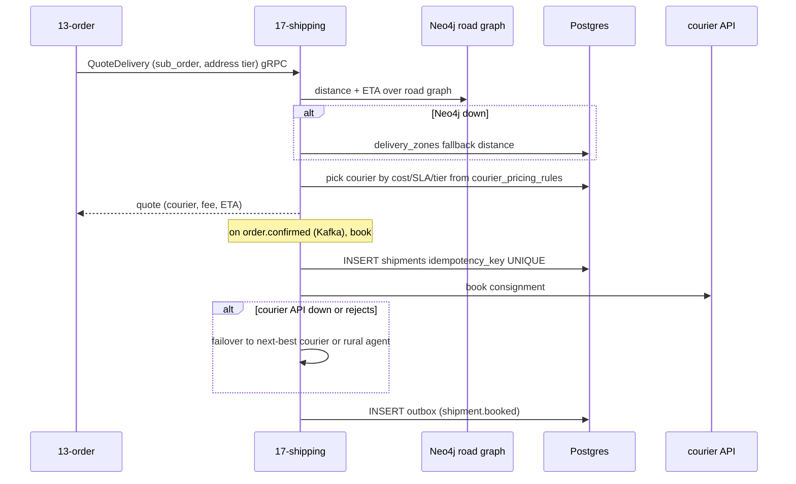
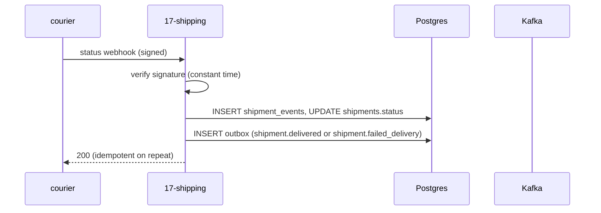

# `17-shipping` — Fulfilment & Routing · Service Architecture

> **Scope.** Implementation-grade architecture for the DOKANDAR **`17-shipping`** service — last-mile
> orchestration: courier selection, consignment booking, status webhooks, and Neo4j road-graph routing.
> Authoritative spec: [`../../architecture.md`](../../architecture.md) §9 (`17-shipping`) + §10–§14 + §21/§22;
> [`../../README.md`](../../README.md) §6/§7/§8/§10; [`../../SERVICE_INTEGRATION_TEMPLATE.md`](../../SERVICE_INTEGRATION_TEMPLATE.md)
> (Appendix **A.10 Ruby/Rails — target/provisional**). **On any conflict the README wins.**
>
> **Grounding.** **Spec-only — there is no DevOps reference service for `17-shipping`**, and the stack
> (Ruby/Rails) is a **target/provisional** language (no reference service in any language yet). Every shape
> below is **spec-extrapolated; no `file:line`**. Code does not exist yet; this is the build contract.

| | |
| --- | --- |
| **Service** | `17-shipping` |
| **Domain** | Transaction — last-mile fulfilment |
| **Language · framework** | **Ruby 4.0 · Rails 8.1** *(spec target — provisional)* |
| **`SERVICE_PORT`** | `3000` (Puma) · gRPC `50051` |
| **External ports** | REST `10017` · gRPC `20017` |
| **Datastores** | PostgreSQL `dokandar_shipping_<env>` (sole writer) · **Neo4j** `dokandar_road_graph` · **no dedicated Redis** |
| **`/ready` hard-gate** | **PostgreSQL always** (Neo4j is a routing optimizer — quotes degrade without it) |
| **gRPC server** | `Shipping.QuoteDelivery` @ `50051` |
| **Emits (Kafka)** | `dokandar.shipment.*` (incl. `shipment.delivered`, `shipment.failed_delivery`) (outbox) |
| **Consumes (Kafka)** | `dokandar.order.confirmed` (book), `dokandar.order.cancelled` (cancel/recall) |
| **`service_name` (identity)** | `17-shipping` — from `SERVICE_NAME`, used **identically** everywhere |

**Contents.** §1 Role · §2 Position · §3 Data · §4 Domain flows · §5 REST map · §6 OpenAPI/Swagger surface ·
§7 gRPC (first-class) · §8 The five ops endpoints · §9 TENANT/`/data`/env · §10 Eventing · §11 Logging &
observability · §12 Security · §13 Resilience · §14 Boot · §15 Deployment · §16 Stack landmines · §17 Design
decisions · §18 Build status.

---

## 1. Role & bounded context

`17-shipping` runs **last-mile fulfilment**: for each sub-order it selects a courier by cost/SLA/address-tier
across **Pathao, Paperfly, RedX, Sundarban, eCourier** plus the platform's own **rural agent network** for
upazila-level delivery, books the consignment, ingests courier status webhooks, and runs **Neo4j** vehicle
routing over the upazila road graph. Its **`shipment.failed_delivery`** event is the **COD-refusal signal** that
feeds `18-risk-trust`.

**Responsibilities**

- **Courier selection** — per sub-order, by cost / SLA / address-tier, with failover to the next-best courier
  or the rural-agent fallback.
- **Booking** — consignment create + tracking; idempotent on the booking `Idempotency-Key`.
- **Status webhooks** — ingest courier callbacks → `shipment_events` → `shipment.*` events.
- **Routing** — `Shipping.QuoteDelivery` (gRPC, sub-50 ms) using cached pricing + precomputed road-graph
  distances; Neo4j VRP/shortest-path over the upazila graph.

**Explicitly NOT in scope**: order state (`13-order`); payment/COD settlement (`09-payment`); the customer
address book (`02-profile`). Shipping orchestrates carriers and routes; it doesn't own the order or the money.

---

## 2. Position in the platform

```
   13-order ─order.confirmed─► 17-shipping (Ruby/Rails · REST :3000 · gRPC :50051) ─book consignment─► couriers
   13-order ──gRPC Shipping.QuoteDelivery (checkout, sub-50ms)──►│       (Pathao/Paperfly/RedX/Sundarban/eCourier + rural agents)
   couriers ──status webhooks (signed)──────────────────────────►│
                                                                 ├──► Postgres dokandar_shipping_<env> (+ outbox)
                                                                 ├──► Neo4j dokandar_road_graph (Upazila/Union/Hub · :ROAD_TO)
                                                                 └──► Kafka  shipment.* (incl shipment.delivered, shipment.failed_delivery)
   consumers: 13-order (status), 14-notification, 11-reporting, 18-risk-trust (failed_delivery = COD-refusal label) ◄──┘
```

`shipment.failed_delivery` is the **ground-truth COD-refusal label** `18-risk-trust` trains its COD model on —
the loop that lets the platform price COD risk.

---

## 3. Data architecture

### 3.1 PostgreSQL — `dokandar_shipping_<env>` (sole writer)

```sql
CREATE TABLE shipments (
  id              uuid PRIMARY KEY DEFAULT gen_random_uuid(),
  sub_order_id    uuid NOT NULL,                  -- opaque (no cross-service FK)
  courier_id      uuid,
  status          varchar(24) NOT NULL DEFAULT 'pending',  -- pending|booked|in_transit|delivered|failed_delivery|returned|cancelled
  address_tier    varchar(16),                    -- city|district|upazila|union (drives courier choice)
  cod_amount_minor int,
  idempotency_key varchar(120) NOT NULL UNIQUE,    -- one booking per (sub_order) — dedup fence
  tracking_code   varchar(120),
  booked_at timestamptz, delivered_at timestamptz, created_at timestamptz NOT NULL DEFAULT now()
);
CREATE INDEX idx_shipments_sub   ON shipments(sub_order_id);
CREATE INDEX idx_shipments_status ON shipments(status);

CREATE TABLE shipment_events (
  id bigserial PRIMARY KEY, shipment_id uuid NOT NULL REFERENCES shipments(id) ON DELETE CASCADE,
  from_status varchar(24), to_status varchar(24) NOT NULL,
  courier_raw jsonb, at timestamptz NOT NULL DEFAULT now()
);

CREATE TABLE couriers (
  id uuid PRIMARY KEY DEFAULT gen_random_uuid(),
  name varchar(40) NOT NULL,                       -- pathao|paperfly|redx|sundarban|ecourier|rural_agent
  active boolean NOT NULL DEFAULT true, supports_cod boolean NOT NULL DEFAULT true
);

CREATE TABLE courier_pricing_rules (
  id uuid PRIMARY KEY DEFAULT gen_random_uuid(),
  courier_id uuid NOT NULL REFERENCES couriers(id),
  address_tier varchar(16) NOT NULL, base_minor int NOT NULL, per_kg_minor int NOT NULL,
  sla_hours int NOT NULL, valid_from timestamptz NOT NULL DEFAULT now()
);

CREATE TABLE rural_agents (
  id uuid PRIMARY KEY DEFAULT gen_random_uuid(),
  upazila_code text NOT NULL, name text NOT NULL, phone text, active boolean NOT NULL DEFAULT true
);
CREATE INDEX idx_rural_agents_upazila ON rural_agents(upazila_code) WHERE active;

CREATE TABLE delivery_zones (
  id uuid PRIMARY KEY DEFAULT gen_random_uuid(),
  upazila_code text NOT NULL UNIQUE, tier varchar(16) NOT NULL, fallback_distance_km numeric(6,1)
);

CREATE TABLE outbox (
  id bigserial PRIMARY KEY, topic varchar(120) NOT NULL, key varchar(120),
  payload jsonb NOT NULL, created_at timestamptz NOT NULL DEFAULT now(), sent_at timestamptz
);
CREATE INDEX idx_outbox_pending ON outbox(created_at) WHERE sent_at IS NULL;
```

### 3.2 Neo4j — `dokandar_road_graph` (the routing optimizer)

```cypher
// nodes: Upazila / Union / Hub ; edges: :ROAD_TO {distance_km, time_min}
(:Upazila {code, name})-[:ROAD_TO {distance_km, time_min}]->(:Hub {code})
// indexed for shortest-path / VRP; QuoteDelivery runs distance + ETA over this graph
```

Neo4j holds the upazila road graph for VRP / shortest-path. It is a **routing optimizer, not traffic-gating** —
quotes degrade to the `delivery_zones.fallback_distance_km` zone-table estimate when Neo4j is unavailable, so
Neo4j does **not** gate `/ready` (§8.1).

### 3.3 No dedicated Redis

`17-shipping` has **no dedicated Redis DB** — courier-quote caching is **short-TTL in-process** (per-pod). The
durable idempotency is the `shipments.idempotency_key` UNIQUE.

---

## 4. Domain flows

### 4.1 Quote + book (courier selection + failover)



### 4.2 Webhook → status → events



A `failed_delivery` (COD refusal) emits `dokandar.shipment.failed_delivery` — the ground-truth label for
`18-risk-trust`'s COD model.

---

## 5. Synchronous REST API map

All under **`/api/v1/shipping/*`**. Pretty JSON except `/metrics`/`/openapi.json`/`/docs`.

| Method | Path | Auth | Purpose |
| --- | --- | --- | --- |
| `POST` | `/api/v1/shipping/shipments` | Bearer (+ `Idempotency-Key`) | create a shipment (admin/system) |
| `GET` | `/api/v1/shipping/shipments/{id}` | Bearer | shipment + tracking |
| `GET` | `/api/v1/shipping/shipments/by-order/{sub_order_id}` | Bearer | shipment for a sub-order |
| `POST` | `/api/v1/shipping/webhooks/{courier}` | courier signature | status callback |
| `GET` | `/api/v1/shipping/quote?tier=&weight=&upazila=` | Bearer | a delivery quote (the REST twin of the gRPC) |
| `GET`/`POST` | `/api/v1/shipping/admin/agents` | Bearer (admin) | rural agent routing |

`Idempotency-Key` (or the `sub_order_id`) UNIQUE prevents a redelivered `order.confirmed` or a retried webhook
from double-booking. Webhooks authenticate by **courier signature**, not JWT.

---

## 6. The OpenAPI / Swagger surface

For the Rails target, the OpenAPI document is produced by **`rswag`** (request-spec-driven) **or** hand-written
+ a CI route-vs-spec diff *(provisional)*; served at `/openapi.json`, Swagger UI at `/docs`.

- **Security scheme** — `HTTPBearer` (JWT) → the `Authorize` button; the webhook routes document the
  courier-signature header instead.
- **Info** — title **DOKANDAR Shipping Service**, `version` from `CODE_VERSION` (= `17-shipping`), identity
  banner + How-to-test.
- **Schema catalog** — `ShipmentCreate` (`sub_order_id`, `address_tier`, `cod_amount_minor`), `ShipmentDto`
  (`status` enum, `tracking_code`), `Quote` (`courier`, `fee_minor`, `eta_hours`), `ErrorEnvelope`. With
  examples per address tier.
- **Per-endpoint responses** — create: `201` · `401` · `409 already_booked` · `422`. quote: `200` · `422`.
  webhook: `200` · `403 signature_invalid`.

---

## 7. gRPC — `Shipping.QuoteDelivery` @ 50051

```proto
service Shipping { rpc QuoteDelivery (QuoteRequest) returns (QuoteResponse); }
message QuoteRequest  { string sub_order_id = 1; string upazila_code = 2; string address_tier = 3; int32 weight_grams = 4; }
message QuoteResponse { string courier = 1; int32 fee_minor = 2; int32 eta_hours = 3; double distance_km = 4; }
```

Called by `13-order` at checkout (sub-50 ms via cached pricing + precomputed road-graph distances). The
canonical method is **`Shipping.QuoteDelivery`** — *not* the older `ComputeDeliveryRoute` (README §22 drift
resolution). Requires `x-internal-token` = `INTERNAL_SERVICE_TOKEN`, compared **constant-time**
(`Rack::Utils.secure_compare`); mismatch → `UNAUTHENTICATED`. Server on `50051` (external `20017`).

---

## 8. The five operational endpoints

Shared identity block (`service_name=17-shipping`, `code_version=17-shipping`, …). Pretty JSON except
`/metrics`.

### 8.1 `GET /ready` — traffic gating (PostgreSQL always)

Gates **PostgreSQL always**. **Neo4j is a routing optimizer, not traffic-gating** — quotes degrade to the
zone-table distance estimate without it, so it lives on `/health`, not the gate. There is no Redis. `200`/`503`.

```jsonc
{ "status": "ready", "identity": { … }, "dependencies": [ { "name": "postgres", "reachable": true, "latency_ms": 1.1 } ] }
```

### 8.2 `GET /health` — full diagnostics

Identity + all deps + observability. Core: `postgres`; reported: `neo4j`, `kafka`, `mongo_logs`, `apm`.

```jsonc
{
  "status": "healthy",
  "identity": { … },
  "checks": {
    "postgres":   { "ok": true },
    "neo4j":      { "ok": true },
    "kafka":      { "ok": true },
    "mongo_logs": { "ok": true },
    "apm":        { "ok": true }
  },
  "observability": {
    "apm_service_name": "17-shipping",
    "logs_sink_mongo":  "mongodb://…/mongo_db_dokandar_application_logs.17-shipping",
    "logs_sink_es":     "http://es-host:9200/logs-app-17-shipping-*"
  }
}
```

### 8.3 `GET /data` — TENANT snapshot

`data/<TENANT>/result.json` (bind-mounted RO), identity prepended; `404 no_snapshot` / `500 snapshot_parse_failed`.

### 8.4 `GET /metrics`

RED + shipping business + outbox gauge; closed-set labels (`courier`, `tier`, `status` — never address/phone);
`service="17-shipping"`.

```
shipping_quotes_total{service="17-shipping",courier="pathao"}        …
shipping_booked_total{service="17-shipping",courier="redx"}          …
shipping_failed_delivery_total{service="17-shipping"}                …   # the COD-refusal signal
shipping_outbox_pending{service="17-shipping"}                       …   # mandatory
```

### 8.5 `GET /docs` & `GET /openapi.json`

Swagger UI (titled **DOKANDAR Shipping Service**) + the document. Bare 404 on unmapped paths; `405` on method
typos.

---

## 9. TENANT, `/data` & the env-render contract

```ini
APP_ENV=prod
SERVICE_NAME=17-shipping          # identity everywhere — FAIL FAST if empty
ENV_VERSION=v1.0.0
TENANT=cloud
SERVICE_PORT=3000                 # Rails/Puma
GRPC_PORT=50051

# PostgreSQL (the only gate) — set the statement_timeout in database.yml (§16)
POSTGRES_HOST=<INFRA_HOST>
POSTGRES_PORT=<PG_PORT>
POSTGRES_USER=<PG_USER>
POSTGRES_PASSWORD=<PG_PASS>
POSTGRES_DB=dokandar_shipping_prod
POSTGRES_ADMIN_DSN=…/postgres     # ensure-db (db:prepare)

# Neo4j (road graph — non-gating)
NEO4J_URL=<NEO4J_BOLT_URL>
NEO4J_USER=<NEO4J_USER>
NEO4J_PASSWORD=<NEO4J_PASS>
NEO4J_DATABASE=dokandar_road_graph

# Kafka (emit + consume)
KAFKA_BOOTSTRAP=<KAFKA_EXTERNAL>
KAFKA_TOPIC_SHIPMENT=dokandar.shipment.status_changed
KAFKA_TOPIC_SHIPMENT_DELIVERED=dokandar.shipment.delivered
KAFKA_TOPIC_SHIPMENT_FAILED=dokandar.shipment.failed_delivery
KAFKA_TOPIC_ORDER_CONFIRMED=dokandar.order.confirmed     # consume (book)
KAFKA_TOPIC_ORDER_CANCELLED=dokandar.order.cancelled     # consume (cancel/recall)

# Courier providers (per-courier API keys + webhook secrets)
PATHAO_API_KEY=<…>   PAPERFLY_API_KEY=<…>   REDX_API_KEY=<…>   SUNDARBAN_API_KEY=<…>   ECOURIER_API_KEY=<…>

# Observability
MONGO_LOG_URI=<MONGO_URI>
MONGO_LOG_DB=mongo_db_dokandar_application_logs   # collection = 17-shipping
APM_SERVER_URL=<APM_URL>
APM_SERVICE_NAME=17-shipping

# JWT (verify-only) + east-west
JWT_PUBLIC_KEY_B64=<JWT_PUBLIC>   # FAIL FAST under stage/prod if empty
JWT_ISSUER=dokandar-auth
INTERNAL_SERVICE_TOKEN=<INTERNAL_TOKEN>           # FAIL FAST under stage/prod; Rack::Utils.secure_compare
```

Fail-fast on empty `SERVICE_NAME` (always) and empty `JWT_PUBLIC_KEY_B64` / `INTERNAL_SERVICE_TOKEN` under
stage/prod. `TENANT` read once → identity, `/data`, APM labels.

---

## 10. Eventing

**Emits** (transactional outbox, `acks=all`, keyed by `sub_order_id`): `dokandar.shipment.status_changed`,
`dokandar.shipment.delivered`, `dokandar.shipment.failed_delivery` (the COD-refusal signal for `18-risk-trust`).
**Consumes** `dokandar.order.confirmed` (book a consignment) and `dokandar.order.cancelled` (cancel/recall),
**manual commit after handling**, idempotent (the `idempotency_key` UNIQUE prevents a redelivered
`order.confirmed` from double-booking). `shipping_outbox_pending` exposes relay lag. Graph-maintenance
projections (hub/parcel-edge writes) layer on top.

---

## 11. Application logging & observability

- **Three sinks** — stdout (pretty JSON) + MongoDB `mongo_db_dokandar_application_logs.17-shipping` +
  Elasticsearch `logs-app-17-shipping-*` (ECS); every line carries the trace id; the **sink write runs off the
  Puma request thread** (a background thread/queue — never inline) (§16). Fire-and-forget, drop-not-block.
- **Access log** — one line per genuine request; `/ready`, `/metrics`, **and `/health`** excluded; true client
  IP, method, **templated** route, status, latency, `request_id`. **Never** log recipient phone / address.
- **APM (Ruby)** — the official **`elastic-apm`** gem as `ElasticAPM::Middleware` at the **top of the Rack
  stack** (`insert_before 0` — the Ruby "outermost" rule, Family A); wire `ELASTIC_APM_SERVICE_NAME=17-shipping`,
  version from `CODE_VERSION`.
- **Metrics** — Prometheus; RED + `shipping_quotes_total{courier}`, `shipping_booked_total{courier}`,
  `shipping_failed_delivery_total`, `shipping_outbox_pending`.

---

## 12. Security

- **Verify-only RS256** — decode `JWT_PUBLIC_KEY_B64`, pin `RS256`, check `iss`/`aud`/`exp`/`sub`.
- **Courier webhooks** — signature/secret-verified per courier, compared **constant-time**
  (`Rack::Utils.secure_compare`); a bad signature → `403 signature_invalid` before any state change.
- **PII** — shipments carry delivery addresses + recipient phone; these are never logged and are returned only
  to authorized callers.
- **East-west** — `INTERNAL_SERVICE_TOKEN` compared with `Rack::Utils.secure_compare` (constant time).

---

## 13. Resilience & failure modes

| Failure | Effect | Mitigation |
| --- | --- | --- |
| courier API outage / rejection | can't book with that courier | **failover** to the next-best courier or the rural-agent fallback (pricing/SLA rules) |
| Neo4j down | no graph routing | degrade to `delivery_zones` straight-line/zone-table distance — quotes still serve; `/ready` green |
| redelivered `order.confirmed` / retried webhook | double-book risk | `idempotency_key` UNIQUE → idempotent |
| Kafka down | events delayed | outbox buffers; `shipping_outbox_pending` climbs |
| Postgres down | cannot serve | `/ready` → `503` |
| failed delivery (COD refusal) | — | emit `shipment.failed_delivery` (the risk model's label) |

---

## 14. Boot sequence & lifecycle

1. Read identity; fail-fast on empty `SERVICE_NAME` / (stage·prod) `JWT_PUBLIC_KEY_B64` / `INTERNAL_SERVICE_TOKEN`.
2. **ensure-db** — `rails db:prepare` (create-if-missing + migrate; **not** a bare `db:create`) (§16).
3. Connect Postgres (with the `statement_timeout` set in `database.yml`) + Neo4j (Bolt).
4. Insert `ElasticAPM::Middleware` at the **top of the Rack stack** (`insert_before 0`).
5. Start Puma (`3000`) + the gRPC server (`50051`) + Sidekiq-style workers.
6. Start the `order.confirmed`/`order.cancelled` consumers; start the outbox relay.
7. Serve — `HEALTHCHECK → /ready`. Ruby 4.0 / Rails 8.1.

---

## 15. Deployment & runtime

- **Image** — multi-stage Ruby (build gems → slim runtime), non-root **uid `10001`**. REST `3000`, gRPC `50051`.
  External LB maps `10017 → 3000`, `20017 → 50051`.
- **`HEALTHCHECK`** — `GET /ready`. **Config** — `--env-file` at runtime; `data/<tenant>/` bind-mounted RO.
- **Scaling** — stateless Rails/Puma web + Sidekiq-style workers; HPA on CPU/queue. Hot path `QuoteDelivery`
  (sub-50 ms via cached pricing + precomputed road-graph distances). Festival delivery surge scales booking
  workers independently of the routing solver.

---

## 16. Stack landmines & reconciliation

- **(a) Spec-only + Ruby target** — no DevOps reference; Ruby/Rails is a **target/provisional** stack — all
  shapes provisional, no `file:line`.
- **(b) `/ready` postgres-always** — Neo4j is a non-gating routing optimizer (zone-table fallback) (§8.1).
- **(c) `Shipping.QuoteDelivery`** — the canonical gRPC method, **not** `ComputeDeliveryRoute` (README §22).
- **(d) ElasticAPM gem at top of Rack** — `insert_before 0` (Family A outermost) (§11).
- **(e) `statement_timeout` in `database.yml`** — bound every query via the connection `variables` (§9, §14).
- **(f) Sink off the Puma request thread** — never write the Mongo/ES sink inline in a request (§11).
- **(g) `Rack::Utils.secure_compare`** — constant-time for the webhook signature **and** `INTERNAL_SERVICE_TOKEN`
  (§7, §12).
- **(h) rswag / hand-written + CI diff** — document every route; CI route-vs-spec diff (§6).
- **(i) `db:prepare`, not bare `db:create`** — idempotent create-or-migrate (§14).
- **(j) Idempotency-Key UNIQUE on booking** — no double-book on redelivery/retry (§10).
- **(k) Access-log exclusions** — add `/health` to `/ready`+`/metrics` (§11).
- **(l) Identity** — `SERVICE_NAME=17-shipping`, `APM_SERVICE_NAME=17-shipping`, `CODE_VERSION=17-shipping`.

---

## 17. Design decisions & open items

- **Courier abstraction + failover** — a uniform courier interface with cost/SLA/tier selection and automatic
  failover (incl. the rural-agent fallback) is what makes upazila-level COD delivery viable across five carriers.
- **Neo4j as optimizer, not gate** — graph routing improves quotes but a Neo4j blip degrades to a zone-table
  estimate; the gate is Postgres so quoting never fully outages.
- **`failed_delivery` as a signal, not just a state** — emitting the COD-refusal event closes the loop with
  `18-risk-trust`, turning fulfilment outcomes into risk-model ground truth.
- **No Redis** — quote caching is per-pod in-process (cheap, short-TTL); the durable idempotency is the PG
  UNIQUE.
- **Open items** — the VRP solver choice + precompute cadence; courier SLA reconciliation from webhooks;
  rural-agent assignment + settlement; multi-parcel consolidation; address-tier classification accuracy.

---

## 18. Build status & cross-references

**Status — specified, not yet implemented.** No code exists; **spec-only (no DevOps reference)**; Ruby/Rails is
a **target/provisional** stack (§16-a). Stack: Ruby 4.0 / Rails 8.1.

**Authoritative sources**

- [`../../architecture.md`](../../architecture.md) — **§9** `17-shipping`; **§10–§14**; **§21** the anchor;
  **§22** the `QuoteDelivery` (not `ComputeDeliveryRoute`) drift resolution.
- [`../../README.md`](../../README.md) — §6 service table · §7 ports · §8 version pins · §10 (PostgreSQL + Neo4j).
- [`../../SERVICE_INTEGRATION_TEMPLATE.md`](../../SERVICE_INTEGRATION_TEMPLATE.md) — Appendix **A.10 Ruby/Rails
  (target/provisional)**; the ElasticAPM-top-of-Rack / `secure_compare` / `db:prepare` landmine rows.
- Sibling exemplars: [`../13-order/architecture.md`](../13-order/architecture.md) (the saga that books via
  `order.confirmed`), [`../18-risk-trust/architecture.md`](../18-risk-trust/architecture.md) (consumes
  `failed_delivery`).

**Build checklist** — `Dockerfile` (multi-stage Ruby, uid 10001, `HEALTHCHECK → /ready`) · `env/init-env.sh` +
`.env.<env>` (fail-fast) · the five endpoints + identity + `X-Request-Id` envelope · the `Shipping.QuoteDelivery`
gRPC server + `secure_compare` · the courier-selection + failover engine · the webhook ingest (signature-verified)
· the Neo4j routing + zone-table fallback · the `order.confirmed`/`cancelled` consumers · `data/<tenant>/result.json`
· `OPERATIONS.md` / `SECURITY.md` / `docs/adr/`.
