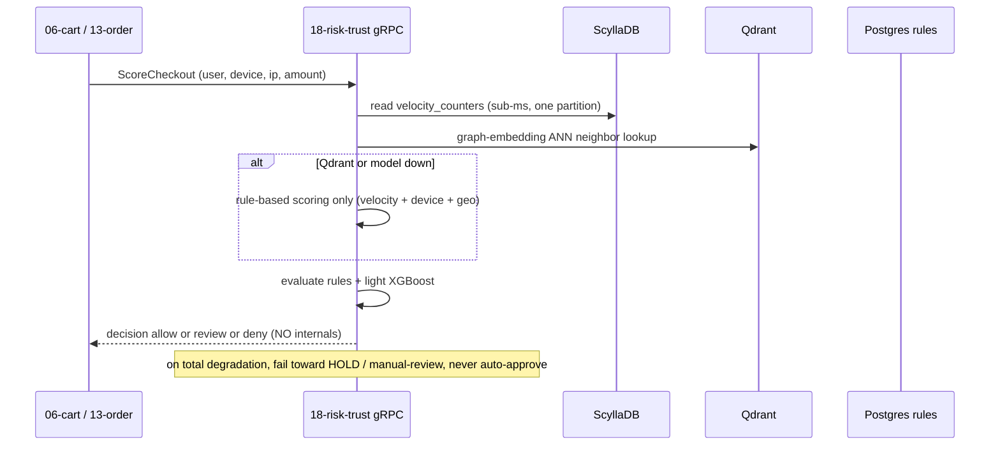
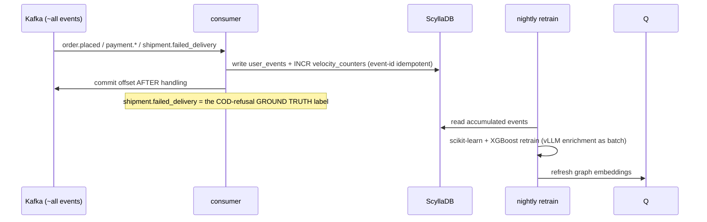

# `18-risk-trust` — Fraud & COD Risk · Service Architecture

> **Scope.** Implementation-grade architecture for the DOKANDAR **`18-risk-trust`** service — the fraud, abuse,
> and credit-scoring engine: every checkout scored for fraud, every COD order for refusal-on-delivery
> probability. Authoritative spec: [`../../architecture.md`](../../architecture.md) §9 (`18-risk-trust`) +
> §10–§14 + §21; [`../../README.md`](../../README.md) §6/§7/§8/§10/§11/§15; [`../../SERVICE_INTEGRATION_TEMPLATE.md`](../../SERVICE_INTEGRATION_TEMPLATE.md)
> (Appendix **A.1 Python/FastAPI**). **On any conflict the README wins.**
>
> **Grounding.** **Spec-only — there is no DevOps reference service for `18-risk-trust`.** The stack
> (Python/FastAPI) is reference-backed for the contract mechanics (mirrors `01-auth`/`11-reporting`), but every
> service-specific shape (the ScyllaDB tables, the scoring pipeline, the rules) is **spec-extrapolated and
> provisional — no `file:line`**. Code does not exist yet; this is the build contract.

| | |
| --- | --- |
| **Service** | `18-risk-trust` |
| **Domain** | Intelligence — fraud & COD risk |
| **Language · framework** | Python 3.14 · FastAPI · vLLM / scikit-learn |
| **`SERVICE_PORT`** | `8000` (REST) · gRPC `50051` |
| **External ports** | REST `10018` · gRPC `20018` |
| **Datastores** | **ScyllaDB** `dokandar_risk` · **Qdrant** `dokandar_risk_graph_embeddings` · PostgreSQL (rules/overrides) · **No Redis** |
| **`/ready` hard-gate** | **PostgreSQL only** (Scylla/Qdrant down → rule-based fallback; risk is on the checkout hot path) |
| **gRPC server** | `Risk.ScoreCheckout \| ScoreCOD` @ `50051` (`<100 ms` p99) |
| **Emits (Kafka)** | `dokandar.risk.*` (decisions/flags) (outbox) |
| **Consumes (Kafka)** | essentially **all** platform events — incl. `shipment.failed_delivery` (the COD-refusal label) |
| **`service_name` (identity)** | `18-risk-trust` — from `SERVICE_NAME`, used **identically** everywhere |

**Contents.** §1 Role · §2 Position · §3 Data · §4 Domain flows · §5 REST map · §6 OpenAPI/Swagger surface ·
§7 gRPC (first-class) · §8 The five ops endpoints · §9 TENANT/`/data`/env · §10 Eventing · §11 Logging &
observability · §12 Security · §13 Resilience · §14 Boot · §15 Deployment · §16 Stack landmines · §17 Design
decisions · §18 Build status.

---

## 1. Role & bounded context

`18-risk-trust` scores **fraud, abuse, and credit risk**. Every checkout is scored for fraud; every **COD** order
for **refusal-on-delivery probability** — a chronic Bangladesh cost given ~70% COD. It blends rule-based signals
(velocity, device fingerprint, geolocation, BIN-country mismatch) with ML over graph embeddings of the
user-shop-device graph, serving **`Risk.ScoreCheckout|ScoreCOD`** at **`< 100 ms` p99** on the cart/order hot
path. It returns only a **decision** (`allow`/`review`/`deny`) — never the internals.

**Responsibilities**

- **Checkout fraud scoring** — `<100 ms` on the hot path (06-cart quote build, 13-order place).
- **COD refusal scoring** — probability a COD order is refused on delivery.
- **Rule + ML blend** — velocity / device / geo / BIN rules + a graph-embedding ANN lookup + a light
  scikit-learn/XGBoost eval; **vLLM/LLM enrichment runs async/batch, never inline**.
- **Event ingest** — write events into ScyllaDB + increment `velocity_counters`; the
  `shipment.failed_delivery` event is the COD model's ground-truth label.
- **Policy** — durable, audited rules/overrides in Postgres.

**Explicitly NOT in scope**: order state, payment, shipping execution. Risk *advises* (allow/review/deny);
the calling service (cart/order) enforces.

---

## 2. Position in the platform

```
   06-cart  ──gRPC Risk.ScoreCheckout (quote, <100ms)──►┐
   13-order ──gRPC Risk.ScoreCheckout / ScoreCOD─────────►│  18-risk-trust (Python · REST :8000 · gRPC :50051)
                                                          │        │
   ~ALL events (order.* payment.* user.* kyc.* review.* )─►│        ├──► ScyllaDB dokandar_risk (events + velocity_counters)
   17-shipping ─shipment.failed_delivery (COD label)──────►│        ├──► Qdrant dokandar_risk_graph_embeddings (ANN)
                                                          │        ├──► Postgres (rules/overrides — the only /ready gate)
                                                          │        └──► Kafka  dokandar.risk.* (outbox)
   consumers of risk.* : 13-order (hold), 09-payment, ops dashboards ◄──┘
                                                          │
                       nightly retrain (scikit-learn + XGBoost; vLLM enrichment as batch) — OFF the hot path
```

The score path makes **no synchronous fan-out** — it reads its own ScyllaDB velocity + Qdrant ANN. Inference is
**precomputed**: the `<100 ms` p99 is a graph-embedding ANN lookup + cached velocity reads + a light tree eval.

---

## 3. Data architecture

### 3.1 ScyllaDB — `dokandar_risk` (the hot store, no Redis)

Partitioned/clustered `(user_id, ts)` so per-user reads hit **one partition** and writes shard linearly. The
**velocity counters ARE the cache** (read sub-ms on the hot path) — there is **no Redis**.

```cql
CREATE KEYSPACE dokandar_risk WITH replication = { 'class': 'NetworkTopologyStrategy', 'dc1': 3 };

CREATE TABLE dokandar_risk.user_events (
  user_id uuid, ts timestamp, event_id text,           -- event-id keyed idempotency
  kind text, product_id uuid, shop_id uuid, device_id text, ip inet, amount_minor int,
  PRIMARY KEY ((user_id), ts, event_id)                -- one partition per user
) WITH CLUSTERING ORDER BY (ts DESC);

CREATE TABLE dokandar_risk.device_fingerprints (
  device_id text, user_id uuid, first_seen timestamp, last_seen timestamp, ua text, ip inet,
  PRIMARY KEY ((device_id), user_id)
);

CREATE TABLE dokandar_risk.velocity_counters (
  user_id uuid, window text,                           -- 1m | 1h | 24h
  orders counter, amount_minor counter, distinct_devices counter,
  PRIMARY KEY ((user_id), window)
);

CREATE TABLE dokandar_risk.risk_decisions (
  entity_type text, entity_id uuid,                    -- checkout | cod_order | review
  decision text, score double, reason_codes list<text>, scored_at timestamp,
  PRIMARY KEY ((entity_type, entity_id))               -- idempotent per scored entity
);
```

### 3.2 Qdrant — `dokandar_risk_graph_embeddings`

ANN over embeddings of the **user-shop-device graph** (neighbor lookup for collusion/ring detection). The
score uses a **precomputed** embedding lookup, not an inline graph traversal.

### 3.3 PostgreSQL — rules/overrides (durable, audited; the only `/ready` gate)

```sql
CREATE TABLE risk_rules (
  id uuid PRIMARY KEY DEFAULT gen_random_uuid(),
  name text NOT NULL, signal text NOT NULL,             -- velocity|device|geo|bin_mismatch
  threshold jsonb NOT NULL, action text NOT NULL CHECK (action IN ('allow','review','deny')),
  active boolean NOT NULL DEFAULT true, created_by uuid NOT NULL, created_at timestamptz NOT NULL DEFAULT now()
);
CREATE TABLE risk_overrides (
  id uuid PRIMARY KEY DEFAULT gen_random_uuid(),
  entity_type text, entity_id uuid, decision text, reason text,
  created_by uuid NOT NULL, created_at timestamptz NOT NULL DEFAULT now()   -- every override audited
);
CREATE TABLE consumer_offsets ( topic text, partition_id int, last_offset bigint,
  PRIMARY KEY (topic, partition_id) );
CREATE TABLE outbox ( id bigserial PRIMARY KEY, topic varchar(120) NOT NULL, key varchar(120),
  payload jsonb NOT NULL, created_at timestamptz NOT NULL DEFAULT now(), sent_at timestamptz );
```

Postgres holds the durable, audited **policy** (rules + overrides) and the outbox — it is the **only** `/ready`
gate (§8.1).

---

## 4. Domain flows

### 4.1 Score a checkout (`<100 ms`, fail-conservative)



> **vLLM never inline.** LLM enrichment cannot meet `100 ms`; it runs **async/batch** + nightly feature work,
> never on the synchronous score path.

### 4.2 Ingest + the COD-refusal label loop



---

## 5. Synchronous REST API map

All under **`/api/v1/risk/*`**. Pretty JSON except `/metrics`/`/openapi.json`/`/docs`.

| Method | Path | Auth | Purpose |
| --- | --- | --- | --- |
| `POST` | `/api/v1/risk/score/checkout` | internal (`INTERNAL_SERVICE_TOKEN`) | fraud score (`<100 ms` p99) |
| `POST` | `/api/v1/risk/score/cod` | internal | COD-refusal score |
| `POST` | `/api/v1/risk/score/review` | internal | review-abuse score |
| `GET`/`POST`/`PATCH` | `/api/v1/risk/admin/rules` | Bearer (admin) | rules CRUD |
| `POST` | `/api/v1/risk/admin/overrides` | Bearer (admin) | manual override (audited) |

The hot-path scoring is primarily **gRPC** (§7); the REST scoring routes are the internal-token twin. The
response carries **only** the decision (`allow`/`review`/`deny`) + opaque `reason_codes` — **never** the score
internals or thresholds (§12).

---

## 6. The OpenAPI / Swagger surface

`18-risk-trust` is a **reflection-OpenAPI** stack (FastAPI): generated from typed routes + Pydantic models;
`/openapi.json` is **compact**; Swagger UI at `/docs`.

- **Security schemes** — an `InternalToken` apiKey header (`x-internal-token`) for the scoring routes; `HTTPBearer`
  (JWT, admin) for rules/overrides.
- **Info** — title **DOKANDAR Risk & Trust Service**, `version` from `CODE_VERSION` (= `18-risk-trust`), identity
  banner + How-to-test.
- **Schema catalog** — `ScoreRequest` (`user_id`, `device_id`, `ip`, `amount_minor`, context), `ScoreResponse`
  (`decision` enum `allow|review|deny`, `reason_codes[]` — **opaque**, no score/threshold), `RiskRule`,
  `RiskOverride`, `ErrorEnvelope`. The response schema **deliberately omits** the numeric score + features
  (adversaries must not see them).
- **Per-endpoint responses** — score: `200` (decision) · `401 token_invalid`. admin: `200`/`201` · `401` ·
  `403`.

---

## 7. gRPC — `Risk.ScoreCheckout|ScoreCOD` @ 50051

```proto
service Risk {
  rpc ScoreCheckout (ScoreRequest) returns (ScoreResponse);
  rpc ScoreCOD      (ScoreRequest) returns (ScoreResponse);
}
message ScoreRequest  { string user_id = 1; string device_id = 2; string ip = 3; int32 amount_minor = 4;
                        string order_id = 5; string shop_id = 6; }
message ScoreResponse { string decision = 1;            // allow | review | deny
                        repeated string reason_codes = 2; }   // OPAQUE — no score, no thresholds
```

Called by `06-cart` at quote build and `13-order` at place time, on the **checkout hot path** (`<100 ms` p99).
Requires `x-internal-token` = `INTERNAL_SERVICE_TOKEN`, compared **constant-time** (`hmac.compare_digest`);
mismatch → `UNAUTHENTICATED`. The response is a **decision only** — never the score or features.

---

## 8. The five operational endpoints

Shared identity block (`service_name=18-risk-trust`, `code_version=18-risk-trust`, …). Pretty JSON except
`/metrics`.

### 8.1 `GET /ready` — traffic gating (PostgreSQL only)

Gates **PostgreSQL only**. It does **not** gate ScyllaDB or Qdrant: a rule-based fallback still produces a valid
score, and — **decisively** — risk sits on the **checkout hot path**, so gating on a wide-column/vector blip
would cascade into a **platform-wide checkout outage**. `200`/`503`.

```jsonc
{ "status": "ready", "identity": { … }, "dependencies": [ { "name": "postgres", "reachable": true, "latency_ms": 1.0 } ] }
```

### 8.2 `GET /health` — full diagnostics

Identity + all deps + observability. Core: `postgres`; reported: `scylladb`, `qdrant`, `kafka`, `mongo_logs`,
`apm`.

```jsonc
{
  "status": "healthy",
  "identity": { … },
  "checks": {
    "postgres":   { "ok": true },
    "scylladb":   { "ok": true },
    "qdrant":     { "ok": true },
    "kafka":      { "ok": true },
    "mongo_logs": { "ok": true },
    "apm":        { "ok": true }
  },
  "observability": {
    "apm_service_name": "18-risk-trust",
    "logs_sink_mongo":  "mongodb://…/mongo_db_dokandar_application_logs.18-risk-trust",
    "logs_sink_es":     "http://es-host:9200/logs-app-18-risk-trust-*"
  }
}
```

### 8.3 `GET /data` — TENANT snapshot

`data/<TENANT>/result.json` (bind-mounted RO), identity prepended; `404 no_snapshot` / `500 snapshot_parse_failed`.

### 8.4 `GET /metrics`

RED + risk business + outbox gauge; closed-set labels (`decision`, `degraded` — **never** `user_id`, score, or
threshold); `service="18-risk-trust"`.

```
risk_scored_total{service="18-risk-trust",decision="allow"}          …   # allow|review|deny
risk_degraded_total{service="18-risk-trust"}                         …   # rule-based fallback served
risk_score_latency_ms_bucket{service="18-risk-trust",le="0.1"}       …   # the <100ms p99 SLO
risk_outbox_pending{service="18-risk-trust"}                         …   # mandatory
```

### 8.5 `GET /docs` & `GET /openapi.json`

Swagger UI (titled **DOKANDAR Risk & Trust Service**) + the compact document. Bare 404 on unmapped paths;
`405` on method typos.

---

## 9. TENANT, `/data` & the env-render contract

```ini
APP_ENV=prod
SERVICE_NAME=18-risk-trust        # identity everywhere — FAIL FAST if empty
ENV_VERSION=v1.0.0
TENANT=cloud
SERVICE_PORT=8000                 # FastAPI
GRPC_PORT=50051

# PostgreSQL (rules/overrides — the only gate)
POSTGRES_HOST=<INFRA_HOST>
POSTGRES_PORT=<PG_PORT>
POSTGRES_USER=<PG_USER>
POSTGRES_PASSWORD=<PG_PASS>
POSTGRES_DB=dokandar_risk_prod
POSTGRES_ADMIN_DSN=…/postgres     # ensure-db
PG_STATEMENT_TIMEOUT_MS=30000

# ScyllaDB (hot events + velocity — non-gating)
SCYLLA_HOSTS=<SCYLLA_NODES>
SCYLLA_KEYSPACE=dokandar_risk

# Qdrant (graph embeddings — non-gating)
QDRANT_URL=<QDRANT_URL>
QDRANT_COLLECTION=dokandar_risk_graph_embeddings

# Kafka (consume ~all + emit risk.*)
KAFKA_BOOTSTRAP=<KAFKA_EXTERNAL>
KAFKA_TOPIC_RISK=dokandar.risk.decision
KAFKA_TOPICS_CONSUME=dokandar.order.*,dokandar.payment.*,dokandar.user.*,dokandar.kyc.*,dokandar.product.changed,dokandar.review.*,dokandar.shipment.failed_delivery

# Models (self-hosted — vLLM batch only, never inline)
VLLM_ENDPOINT=<VLLM_URL>          # batch/async enrichment ONLY
MODEL_REGISTRY=<…>

# Observability
MONGO_LOG_URI=<MONGO_URI>
MONGO_LOG_DB=mongo_db_dokandar_application_logs   # collection = 18-risk-trust
APM_SERVER_URL=<APM_URL>
APM_SERVICE_NAME=18-risk-trust

# JWT (verify-only) + east-west
JWT_PUBLIC_KEY_B64=<JWT_PUBLIC>   # FAIL FAST under stage/prod if empty
JWT_ISSUER=dokandar-auth
INTERNAL_SERVICE_TOKEN=<INTERNAL_TOKEN>           # FAIL FAST under stage/prod; hmac.compare_digest
```

Fail-fast on empty `SERVICE_NAME` (always) and empty `JWT_PUBLIC_KEY_B64` / `INTERNAL_SERVICE_TOKEN` under
stage/prod. `TENANT` read once → identity, `/data`, APM labels.

---

## 10. Eventing

**Emits** `dokandar.risk.*` (decisions/flags) via the transactional outbox (`acks=all`). **Consumes essentially
all platform events** — `order.*`, `payment.*`, `user.*`, `kyc.*`, `product.changed`, `review.*` — and
**notably `dokandar.shipment.failed_delivery` (←17), the COD-refusal label** feeding the COD model's ground
truth. Ingestion writes events into ScyllaDB + increments `velocity_counters`. **At-least-once with manual
commit after handling**; the projection is **idempotent (event-id keyed)** so replays don't inflate velocity;
`risk_decisions` are written idempotently per scored entity. The **nightly retrain** (scikit-learn + XGBoost;
vLLM enrichment as batch) runs off the Kafka stream. `risk_outbox_pending` exposes relay lag.

---

## 11. Application logging & observability

- **Three sinks** — stdout (pretty JSON) + MongoDB `mongo_db_dokandar_application_logs.18-risk-trust` +
  Elasticsearch `logs-app-18-risk-trust-*` (ECS); every line carries the trace id; the **Mongo write runs via
  `asyncio.to_thread`** (§16); fire-and-forget, drop-not-block. **Never log raw device fingerprints, score
  internals, or thresholds.**
- **Access log** — one line per genuine request; `/ready`, `/metrics`, **and `/health`** excluded; true client
  IP, method, **templated** route, status, latency, `request_id`.
- **APM (Python)** — the Elastic APM agent as the **last line of `create_app()`** (FastAPI "outermost"); wire
  service name `18-risk-trust` + version from `CODE_VERSION`.
- **Metrics** — `prometheus_client`; RED + `risk_scored_total{decision}`, `risk_degraded_total`,
  `risk_score_latency_ms` (the `<100 ms` SLO), `risk_outbox_pending`. The forensic store logs **every override**
  (audit).

---

## 12. Security — the highest-sensitivity service

- **Never leak internals** — the response is `allow`/`review`/`deny` + opaque `reason_codes`. **Score values,
  features, and thresholds are never returned** — exposing them lets adversaries probe and evade. This is the
  load-bearing security property.
- **Data-localization** — device fingerprints, behavioral graphs, and KYC-derived signals stay **self-hosted**;
  **vLLM never calls out** of the trust boundary (BTRC data-localization).
- **Internal-only scoring** — score routes require `INTERNAL_SERVICE_TOKEN` (constant-time
  `hmac.compare_digest`); admin rules/overrides require an `admin` JWT.
- **Fail conservative** — on total degradation, default to **hold / manual-review**, **never auto-approve
  fraud**.
- **Audit** — every manual override is recorded (`risk_overrides`, audited) and logged to the forensic store.

---

## 13. Resilience & failure modes

| Failure | Effect | Mitigation |
| --- | --- | --- |
| Qdrant / model server down | no ML signal | **pure rule-based scoring** (velocity + device + geo) — degraded but valid |
| ScyllaDB blip | velocity unavailable | rule fallback; **`/ready` stays green** (risk is on the checkout hot path — must not cascade) |
| total degradation | can't score | **fail toward HOLD / manual-review** — never auto-approve fraud |
| redelivered event | velocity inflation | event-id-keyed idempotent projection |
| latency pressure | miss the 100 ms SLO | inference is precomputed (ANN + cached velocity + light tree); **vLLM never inline** |
| Postgres down | no policy | `/ready` → `503` |
| projection drift | bad counters | backfill by replaying the event stream |

---

## 14. Boot sequence & lifecycle

1. Read identity; fail-fast on empty `SERVICE_NAME` / (stage·prod) `JWT_PUBLIC_KEY_B64` / `INTERNAL_SERVICE_TOKEN`.
2. **ensure-db** → `CREATE DATABASE dokandar_risk_<env>` if absent (Postgres policy store) — before uvicorn binds.
3. Migrate Postgres (rules/overrides/offsets); ensure the ScyllaDB keyspace + Qdrant collection exist.
4. Create the asyncpg pool (with `statement_timeout`); connect ScyllaDB + Qdrant.
5. Start the FastAPI app (`8000`) + the gRPC score server (`50051`); **APM last line of `create_app()`**.
6. Start the (broad) event consumers; register the retrain schedule (vLLM/retrain run out-of-process).
7. Serve — `HEALTHCHECK → /ready`.

---

## 15. Deployment & runtime

- **Image** — multi-stage Python (slim), non-root **uid `10001`**. REST `8000`, gRPC `50051`. External LB maps
  `10018 → 8000`, `20018 → 50051`. The **score path needs no GPU** (ANN + cached reads + light tree); **vLLM /
  retrain** are separate GPU batch jobs.
- **`HEALTHCHECK`** — `GET /ready`. **Config** — `--env-file` at runtime; `data/<tenant>/` bind-mounted RO.
- **Scaling** — write-heavy ingest, latency-critical reads; ScyllaDB scales by partition/shard; autoscale on
  gRPC p99 + Kafka lag. The score servers scale on gRPC RPS independently of the retrain batch.

---

## 16. Stack landmines & reconciliation

- **(a) Spec-only** — no DevOps reference; all service-specific shapes **provisional** (no `file:line`); Python
  contract mechanics mirror `01-auth`/`11-reporting`.
- **(b) `/ready` postgres-only** — Scylla/Qdrant non-gating; risk is on the checkout hot path — gating on them
  would cascade into a platform-wide checkout outage (§8.1).
- **(c) vLLM never inline** — LLM enrichment is async/batch; the synchronous score is ANN + cached velocity +
  light tree (§4.1).
- **(d) Fail conservative** — default to hold/manual-review on degradation; never auto-approve fraud (§12).
- **(e) Never leak internals** — return only `allow/review/deny` + opaque reason codes; no score/thresholds in
  responses, logs, or metrics (§12).
- **(f) No Redis** — `velocity_counters` in ScyllaDB are the sub-ms counters (§3.1).
- **(g) Event-id-keyed idempotency** — replays must not inflate velocity (§10).
- **(h) Mongo log write via `asyncio.to_thread`** + narrow connection-exception → 503 + compact `/openapi.json`
  + `statement_timeout` + APM last line + `ensure_db` before uvicorn (the Python landmine set) (§11, §14).
- **(i) Access-log exclusions** — add `/health` to `/ready`+`/metrics` (§11).
- **(j) Identity** — `SERVICE_NAME=18-risk-trust`, `APM_SERVICE_NAME=18-risk-trust`, `CODE_VERSION=18-risk-trust`.

---

## 17. Design decisions & open items

- **Inference off the hot path** — the `<100 ms` p99 is non-negotiable on checkout, so the score is precomputed
  (ANN + cached ScyllaDB velocity + a light tree); the heavy models (vLLM, retrain) run in batch. This is what
  lets risk sit synchronously in the checkout without slowing it.
- **Postgres-only gate, fail-conservative** — risk must never take down checkout, so the gate is the tiny policy
  store; everything else degrades to rules, and total degradation holds rather than approves.
- **Decision-only responses** — exposing the score/features would let fraudsters reverse-engineer the model;
  the contract is `allow/review/deny` + opaque reason codes, by design.
- **The COD-refusal loop** — `17-shipping`'s `shipment.failed_delivery` is the ground-truth label that makes the
  COD model trainable; risk closes the loop between fulfilment outcomes and pre-order scoring.
- **Open items** — the graph-embedding build (collusion-ring detection); rule-DSL + simulation tooling; the
  vLLM enrichment feature set; velocity-window tuning; adversarial-robustness evaluation.

---

## 18. Build status & cross-references

**Status — specified, not yet implemented.** No code exists; **spec-only (no DevOps reference)** — all
service-specific shapes provisional (§16-a). Stack: Python 3.14 / FastAPI + vLLM / scikit-learn.

**Authoritative sources**

- [`../../architecture.md`](../../architecture.md) — **§9** `18-risk-trust`; **§10–§14**; **§21** the anchor.
- [`../../README.md`](../../README.md) — §6 service table · §7 ports · §8 version pins · §10 (ScyllaDB + Qdrant)
  · §11 (the self-hosted AI/ML catalog) · §15 (fraud thresholds never exposed).
- [`../../SERVICE_INTEGRATION_TEMPLATE.md`](../../SERVICE_INTEGRATION_TEMPLATE.md) — Appendix **A.1 Python/FastAPI**;
  the `to_thread` / narrow-503 / APM-last landmine rows.
- Sibling exemplars: [`../01-auth/architecture.md`](../01-auth/architecture.md) (Python contract depth),
  [`../17-shipping/architecture.md`](../17-shipping/architecture.md) (emits the `failed_delivery` label),
  [`../06-cart/architecture.md`](../06-cart/architecture.md) / [`../13-order/architecture.md`](../13-order/architecture.md)
  (the `ScoreCheckout` callers).

**Build checklist** — `Dockerfile` (multi-stage Python, uid 10001, `HEALTHCHECK → /ready`) · `env/init-env.sh` +
`.env.<env>` (fail-fast) · the five endpoints + identity + `X-Request-Id` envelope · the `Risk.ScoreCheckout|ScoreCOD`
gRPC server (`<100 ms`, decision-only, `hmac.compare_digest`) · the broad event consumers + event-id idempotency
· the rule + ANN + velocity scoring pipeline (fail-conservative) · the retrain/vLLM batch (off-path) ·
`data/<tenant>/result.json` · `OPERATIONS.md` / `SECURITY.md` / `docs/adr/`.
