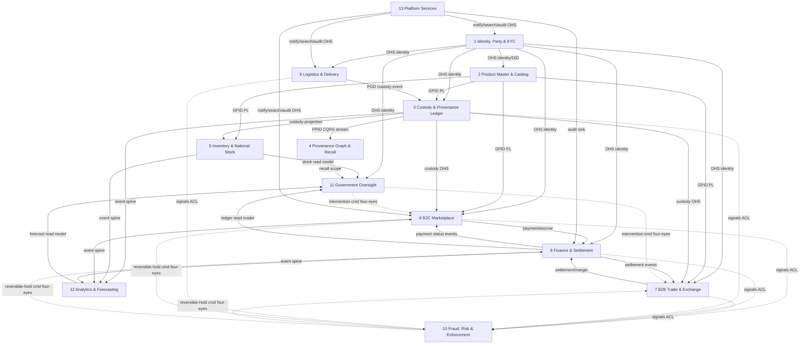

# DOKANDAR — Software Architecture Document
### The Bangladesh Digital Commerce Operating System — Master Architecture Blueprint

| Field | Value |
|-------|-------|
| Document | Software Architecture Document (SAD) — single authoritative source of truth |
| System | DOKANDAR — National Digital Commerce Infrastructure |
| Status | ✅ FROZEN — Business & Software Architecture |
| Architecture | 13 bounded contexts (6 Core, 5 Supporting, 2 Generic) |
| Version | v1.0 |
| Date | 2026-06-26 |
| Supersedes | requirements.md, domain-architecture.md, business-architecture-review.md (removed — superseded working papers) |
| Next phase | Service Architecture -> System Architecture -> DevOps Architecture -> Implementation |

## Architecture Status

| Attribute | State |
|-----------|-------|
| **Status** | ✅ **FROZEN** |
| **Version** | v1.0 |
| **Document Type** | Software Architecture Document (SAD) |
| **Architecture Phase** | Completed |
| **Business Architecture** | Frozen |
| **Domain Model** | Frozen |
| **Technology Stack** | Approved |
| **Next Phase** | Service Architecture → System Architecture → DevOps Architecture → Implementation |

This document is the **single source of truth** for DOKANDAR. The Business & Software Architecture is **frozen**: no future work may modify it directly. Any future architectural change MUST be introduced through a new **Architecture Decision Record (ADR)** appended to Section 30 — never by editing a frozen decision in place. The superseded working papers (`requirements.md`, `domain-architecture.md`, `business-architecture-review.md`) have been removed; this document replaces them in full.

---

## Table of Contents

1. Executive Summary
2. Vision
3. Mission
4. Business Problems
5. Objectives
6. Scope
7. Stakeholders
8. Actors
9. Business Capabilities
10. Functional Requirements
11. Non-Functional Requirements
12. Business Rules
13. User Journeys
14. Domain Model
15. Bounded Contexts
16. Domain Relationships
17. Domain Ownership
18. Data Ownership
19. High-Level Service Architecture
20. Event-Driven Architecture
21. Technology Stack
22. Database Strategy
23. Security Architecture
24. Scalability Strategy
25. Reliability Strategy
26. Deployment Vision
27. DevOps Overview
28. MVP Scope
29. Future Roadmap
30. Architecture Decision Records
31. Risks & Assumptions
32. Glossary
Appendix A. Consolidation Record

---

## 1. Executive Summary

DOKANDAR is national digital commerce infrastructure for Bangladesh — the Bangladesh Digital Commerce Operating System. It is one sovereign platform that unifies, on a single trust fabric, what would elsewhere be a dozen disconnected systems: a B2C marketplace, a B2B trade and commodity exchange, farm-to-consumer traceability through a signed Product Passport, national multi-level inventory, multimodal logistics, embedded finance, identity for every actor, and a government oversight and analytics layer. It exists because Bangladesh's commerce runs on fragmented intermediaries, opaque supply chains, real price syndicates, and a population of roughly 170 million that is mobile-led yet still half on feature phones and partly cash-based. DOKANDAR makes provenance, stock, money, and enforcement verifiable on one substrate, so that a consumer can trust a QR code, a regulator can see a region's true stock, and a farmer can be paid exactly and on time.

The platform is decomposed into thirteen bounded contexts arranged as a deliberate flow of authority. A master-data backbone — Identity, Party & KYC and Product Master Data & Catalog — publishes the shared language (DID actors, GPID products) that every other context conforms to as Open-Host Services. From that backbone flow the operational cores: the Custody & Provenance Ledger is the single, append-only, hash-linked writer of provenance truth; the Provenance Graph & Recall context is its CQRS read side for traversal, recall, and anti-counterfeit; Inventory & National Stock Ledger is a Customer-Supplier projection of custody, never a co-writer; B2C Marketplace and the separately-modeled B2B Trade & Commodity Exchange drive demand; Finance & Settlement keeps money strongly consistent in integer poisha double-entry, physically isolated and reachable only through events and ACL/OHS; and Logistics & Delivery conforms to custody, treating proof-of-delivery as an event, never a stock write. Downstream sit the oversight and intelligence contexts — Fraud, Risk & Enforcement (recommend-by-default, autonomous only for a narrow enumerated reversible-hold set), Government & Regulatory Oversight (regulator not operator, read-mostly, intervening only through audited four-eyes commands), and Analytics & Forecasting (read-only). Platform Services provides cross-cutting notifications, search, document management, and the append-only audit sink. Provenance is split into two cores because an OLTP custody ledger and an OLAP recall graph have inverse read/write profiles.

The build approach follows from these constraints. The platform is mobile-first and offline-first: store-and-forward sync with conflict resolution, and USSD/SMS/IVR parity for core flows so feature-phone and rural users in char and haor areas retain access through 2G, load-shedding, and monsoon disruption — all Bangla-first. Integration is event-driven over a durable, versioned Published Language (Kafka-class) owned by an enabling team; no context reaches into another's store, and each owns its persistence. A sanctioned five-language polyglot maps each capability class to the right tool — Go for high-throughput cores and infrastructure, Java/Spring for transactional cores, C#/.NET for enterprise back-office and NID/BIN integration, Python for data and ML, Node.js/TypeScript for the experience edge — capped at five and centrally governed to bound operational cost. Delivery proceeds in three phases: Phase 1 ships the traceability differentiator plus a working money path (identity, catalog, custody, inventory, basic B2C, finance core, basic logistics); Phase 2 adds B2B trade with escrow, fraud, government dashboards, analytics, and full recall; Phase 3 scales the commodity exchange, embedded credit and insurance, cross-border, IoT cold-chain, and national federation. The result is engineered to national scale — 50M-plus actors, 99.9%-plus availability on core services, zero money or passport-event loss, and in-country data sovereignty.

## 2. Vision

DOKANDAR is the digital commerce operating system of Bangladesh: a single sovereign platform on which every commercial act in the national economy — a farmer logging a harvest in a haor village, a wholesaler hedging a forward rice contract, a household buying groceries on a feature phone, a regulator intervening against a price syndicate — is identified, transacted, financed, traced, and overseen on one shared substrate. Over a ten-to-fifteen-year horizon, DOKANDAR becomes to Bangladeshi commerce what the road and payment networks are to its physical and monetary life: foundational public infrastructure that private markets build upon rather than compete to replace.

The platform unifies what is today fragmented across disconnected marketplaces, paper trade, informal supply chains, and siloed government systems. It binds a B2C marketplace, a B2B trade and commodity exchange, farm-to-consumer traceability through a signed Product Passport, national multi-level inventory, multimodal logistics, embedded finance, identity for every actor, and a government oversight layer into one coherent whole. The long-term outcome is a commerce environment where provenance is verifiable, money is auditable to the poisha, stock is visible from the field to the national rollup, and the State governs through transparent, four-eyes intervention rather than opaque control. DOKANDAR is built for 170 million people on the infrastructure they actually have — feature phones, intermittent 2G, monsoon-cut roads, and cash-and-MFS habits — and is Bangla-first by default, so that national reach is a design property, not an afterthought.

## 3. Mission

DOKANDAR's mission is to give every economic actor in Bangladesh — producer, trader, consumer, transporter, financier, and regulator — trustworthy, low-friction access to national commerce, regardless of device, connectivity, or literacy. The platform delivers this through five concrete commitments:

- **Verifiable trust.** Every traceable good carries a signed, hash-linked Product Passport, so origin, custody, and authenticity are provable rather than asserted, and recalls are scoped in minutes.
- **Sound money.** Every taka moves through a strongly consistent, double-entry ledger denominated in integer poisha, with exactly-once settlement, escrow protection, and zero money-event loss.
- **Universal reach.** Core flows work offline-first and at USSD/SMS/IVR parity, so a feature-phone user in a char settlement transacts with the same integrity as a smartphone user in Dhaka.
- **Honest markets.** Fraud, hoarding, and syndicate behaviour are detected and acted on under audited, reversible, four-eyes governance, keeping enforcement accountable.
- **Sovereign stewardship.** Data resides in-country, and government participates as regulator — consuming projections and intervening through audited commands — never as an operator mutating live commerce.

## 4. Business Problems

DOKANDAR exists to resolve structural failures in Bangladeshi commerce that no single private actor can fix, because each requires shared infrastructure spanning identity, money, goods, and the State.

| ID | Structural Problem | Consequence Today | DOKANDAR Resolution |
|----|--------------------|-------------------|---------------------|
| P1 | No verifiable provenance for goods | Adulteration, counterfeits, and unsafe food circulate unchecked; recalls are impossible to scope | Signed, append-only Custody Ledger + Provenance Graph yields per-batch traceability and minute-scale recall |
| P2 | Fragmented, opaque supply chains | No actor sees stock beyond their own tier; shortages and gluts are invisible until prices spike | Multi-level National Stock Ledger projected from custody truth, with strong local reads and a national rollup |
| P3 | Price syndicates and hoarding | Cartels manipulate staples (rice, oil, onion); regulators react blind and late | Fraud detection on custody/inventory signals plus a government price-monitoring and TCB-style intervention layer |
| P4 | Cash-dominant, unprotected payments | Buyers and sellers transact without escrow, audit trail, or recourse; disputes are unresolvable | Isolated double-entry finance core with wallet, escrow, MFS/bank rails, COD, and compensating-reversal sagas |
| P5 | Weak, siloed identity | Actors cannot be reliably KYC-verified; trust and accountability are unenforceable | Identity, Party & KYC backbone with NID/BIN tiers V0–V3, RBAC/ABAC, as an Open-Host master-data service |
| P6 | Exclusion of feature-phone and rural users | ~50% lack smartphones; rural 2G, load-shedding, and flooding cut access | Offline-first store-and-forward sync with USSD/SMS/IVR parity for all core flows, Bangla-first |
| P7 | Informal, unenforceable B2B trade | RFQs, contracts, and forwards run on paper; no margining or settlement guarantees | B2B Trade & Commodity Exchange with negotiation, spot/forward contracts, auctions, and margining |
| P8 | Disconnected, reactive governance | Regulators lack real-time national visibility and a safe means to intervene | Read-mostly Government oversight consuming projections, intervening only via audited four-eyes commands |
| P9 | Fragmented logistics | Multimodal movement (truck/boat/van) is untracked; cold-chain and delivery proof are unreliable | Logistics context with GPS, cold-chain telemetry, and POD recorded as custody events, never stock writes |

## 5. Objectives

DOKANDAR's goals are measurable and tied directly to the problems above.

| ID | Goal | Target |
|----|------|--------|
| G1 | Scale to national actor base | Support 50M+ active actors with core services (Identity, Markets, Finance, Custody, Inventory) at ≥99.9% monthly availability |
| G2 | Guarantee provenance integrity | Zero passport-event loss; every traceable batch resolvable to a signed custody chain; recall scope computed in minutes |
| G3 | Guarantee money integrity | RPO≈0 for money; exactly-once settlement via idempotency keys; integer-poisha double-entry with no shared finance database |
| G4 | Keep stock truth coherent | National inventory rollup lag ≤60s; reservation-critical, B2B margin-call, and TCB-relief reads served from strong local stock |
| G5 | Achieve universal access | Full USSD/SMS/IVR parity for core flows; QR resolve fast over 2G; offline store-and-forward with conflict resolution |
| G6 | Make enforcement accountable | All fraud and government interventions audited, reversible, and four-eyes-gated, except a narrow enumerated reversible-hold set |
| G7 | Preserve sovereignty | All data resident in-country with multi-region in-country DR; government never mutates operational aggregates |
| G8 | Deliver phased value early | Phase-1 ships the traceability differentiator plus a working money path (wallet + MFS + COD) |

## 6. Scope

### 6.1 In Scope

DOKANDAR delivers thirteen bounded contexts: Identity/Party/KYC; Product Master Data & Catalog; Custody & Provenance Ledger; Provenance Graph & Recall; Inventory & National Stock Ledger; B2C Marketplace; B2B Trade & Commodity Exchange; Finance & Settlement; Logistics & Delivery; Fraud, Risk & Enforcement; Government & Regulatory Oversight; Analytics & Forecasting; and Platform Services. Together these cover actor identity and KYC, product mastering and signed QR identity, append-only custody truth and its recall projection, multi-level national stock, retail and wholesale commerce, embedded finance, multimodal logistics, fraud enforcement, government oversight, forecasting, and cross-cutting notifications, search, document management, and the append-only audit log. Integration is via a versioned event spine (Published Language), an API Gateway with per-channel BFFs, and external adapters for MFS (bKash/Nagad/Rocket), banks (BEFTN/RTGS), NID (Election Commission), BIN/TIN (NBR), SMS aggregators, and maps/GIS.

### 6.2 Out of Scope

DOKANDAR is not a general-purpose social network, a media or content platform, or a consumer messaging app beyond transactional notifications. It does not operate physical fulfilment assets (warehouses, vehicles, MFS networks) — it orchestrates third-party providers through adapters. It does not issue national identity (it consumes NID/BIN) and does not replace the core banking or MFS systems it settles against. It is not the legal system of record for taxation or licensing beyond the oversight and reporting surfaces it exposes to government.

### 6.3 Deferred but Stubbed

Phase-3 capabilities — commodity exchange at national scale, advanced recommendation, embedded credit/insurance/warehouse-receipt finance, cross-border trade, IoT cold-chain, and national federation — are out of the initial delivery but are anticipated in the architecture. Their integration seams (event-spine topics, ACL boundaries, and Open-Host contracts) are stubbed from Phase-1 so later contexts attach without reworking the core, consistent with the may-merge-later boundaries that keep Custody, Provenance, and Inventory — and the shared v1 substrate — splittable under load.

## 7. Stakeholders

DOKANDAR serves the entire commerce value chain of Bangladesh, from a feature-phone farmer in a haor village to the national regulator monitoring price stability. Stakeholders are grouped by the interest they hold in the platform; this grouping drives the SLA tiers, channel parity guarantees, and governance model defined elsewhere in this document.

| Stakeholder group | Members | Primary interest in DOKANDAR |
|---|---|---|
| Primary producers | Farmers, Farias, cooperative members | Fair farm-gate price, signed origin proof, fast MFS payout, access to forward contracts and agri-credit; usable on feature phones in Bangla over 2G. |
| Trade intermediaries | Wholesalers, distributors, importers/exporters, factories | Liquidity, price discovery, B2B fulfillment, batch transformation, working-capital credit, warehouse-receipt collateral. |
| Retail & demand edge | Retail shops, online sellers, consumers | Trustworthy catalog, verifiable provenance, COD and wallet payment, dispute rights, offline QR verification. |
| Service providers | Logistics operators, warehouse owners | Steady shipment/storage demand, transparent proof-of-delivery and cold-chain telemetry, prompt settlement. |
| Financial actors | Banks, MFS (bKash/Nagad/Rocket), financial institutions | Regulated escrow/settlement rails, KYC attestation, underwriting signals, exactly-once double-entry money movement. |
| Government & regulators | NBR, TCB, DAM, City Corporations, Election Commission | National inventory visibility, price-syndicate detection, TCB intervention, subsidy/relief tracking, licensing oversight — read-mostly, four-eyes intervention only. |
| Civil society | NGOs, cooperatives | Onboarding and vouching for unbanked producers, group contracting, field-agent delegation. |
| End consumers / public | ~170M citizens | Product safety, recall reach, anti-counterfeit assurance, affordable verified goods. |
| Platform operator & enabling teams | DOKANDAR engineering, event-spine team, security/compliance, SRE | Operability of a capped five-language polyglot estate, in-country data sovereignty, >=99.9% core availability, zero money/passport-event loss. |

Government is a regulator, not an operator: it consumes projections and intervenes through audited four-eyes commands, and it never holds a tradable wallet or mutates operational aggregates (R5). Financial actors operate behind a physically isolated Finance domain integrated only via events and ACL/OHS (R2).

## 8. Actors

DOKANDAR recognizes 14 canonical actor types. Every actor is a `Party` with one immutable DID (`DKD-
<DIST>-<TYPE>-<base32seq>`); a `Party` may hold several `ActorRole` bindings, each carrying its own verification tier and per-role sub-ledger under one shared wallet (`WLT-<DID>`). Permissions are never attached to a `Party` directly — they are derived at request time as `grants(activeRoles) ∩ tierCeiling(perRoleContext) ∩ accountStatus ∩ delegatedScope` (FR-ROL-003), deny-by-default for any capability absent from the matrix (FR-ROL-021).

### 8.1 Actor Catalog

| Actor | Role | Core responsibilities | Tier path (V0–V3) | Key permissions |
|---|---|---|---|---|
| **FARMER** | Primary producer (crop, livestock, fish, poultry) | Register geo-tagged plots, declare harvest, originate `HARVESTED` passports, sell upward, receive payouts, enter forward contracts | V0 proxy-listed → V1 (NID) originate+wallet → V3 via NGO/GOV endorsement (verified-origin, agri-credit) | `passport.originate`, `listing.create.commodity`, `order.accept`, `wallet.receive`, `fwd.enter` |
| **FARIA** | Village collector / micro-aggregator (reaches char/haor by boat) | Buy farm-gate produce, `COLLECTED`, MERGE small batches, short-haul, sell upward | V0 cash-assisted → V1 (NID) signed custody + MFS → V2 if trade-licensed | `passport.custody.accept/transfer`, `batch.merge`, `listing.create`, `wallet.send/receive` |
| **WHOLESALER** (arotdar/bepari) | Market-hub trader, price-formation node, hoarding-risk point | Bulk buy/sell, MERGE/SPLIT, `STORED`/`AT_WHOLESALE`, price discovery, B2B fulfillment | V1 to trade → V2 (BIN/TIN/license) high-value B2B → V3 TCB-linked intervention buying | `batch.split/merge`, `order.fulfill.b2b`, `inventory.declare`, `price.publish` (anti-hoarding gated) |
| **DISTRIBUTOR** | Brand/category distributor, factory→retail | Manage routes/territory, B2B fulfillment, extend retail credit | V2 mandatory → V3 to extend credit | `route.manage`, `order.fulfill.b2b`, `credit.extend.retail` (V3), `territory.assign` |
| **FACTORY** (mill/processor) | Transformer minting child GPIDs | `TRANSFORM` parent PPIDs into new branded GPID, consume inputs, attest quality | V2 mandatory → V3 export-grade/food-safety | `passport.transform`, `gpid.mint.branded`, `batch.input.consume`, `quality.attest` |
| **IMPEXP** (importer/exporter) | Cross-border trade against BIN, LC/customs | Declare imports, link customs, register foreign GPIDs, settle FX | V2 minimum → V3 bonded/export | `import.declare`, `customs.link`, `gpid.register.foreign`, `fx.settle` |
| **RETAIL** (shop) | Physical shop selling to consumers (multi-staff) | Retail listing, POS sale, stage `SOLD`, delegate staff, receive B2C orders | V1 micro → V2 licensed | `listing.create.retail`, `pos.sell`, `passport.stage.SOLD`, `staff.delegate`, `order.receive.b2c` |
| **ONLINE_SELLER** | Digital-first / f-commerce seller | Manage catalog, fulfill B2C, create shipments, process returns | V1 → V2 (scale + COD limits) | `catalog.manage`, `order.fulfill.b2c`, `shipment.create`, `return.process` |
| **LOGISTICS** | Truck/boat/van fleet operator | Accept/scan shipments, emit GPS, capture POD, delegate drivers | V1 owner-driver → V2 fleet | `shipment.accept/scan`, `gps.emit`, `pod.capture`, `driver.delegate` |
| **WAREHOUSE** (godown/cold storage) | Custodian of `STORED` inventory + cold-chain | Hold custody, emit telemetry, issue warehouse receipts for collateral | V2 → V3 bonded/cold-certified | `inventory.custody.hold`, `telemetry.emit`, `wrt.issue` |
| **BANK** (FI/MFS) | Regulated financial institution | Escrow hold/release, settlement, underwriting, KYC attestation | V3 only | `escrow.hold/release`, `ledger.settle`, `credit.underwrite`, `kyc.attest` |
| **GOV** (agency) | NBR/TCB/DAM/City Corp/EC regulator | Scoped audit read, intervention orders, endorsement, recall mandate, aggregate analytics | V3 | `audit.read.scoped`, `intervention.order`, `endorsement.issue`, `recall.mandate`, `analytics.read.aggregate` |
| **NGO** (cooperative) | Field organization onboarding/vouching for farmers | Onboard members, vouch (sponsor V1→V3), delegate field agents, group contracts | V2/V3 | `member.onboard`, `endorsement.vouch`, `agent.delegate`, `group.contract` |
| **CONSUMER** | End buyer (PII-minimized) | Place B2C orders, verify QR offline, raise disputes, post reviews | V0 browse/USSD → V1 (higher COD, dispute rights) | `order.place.b2c`, `passport.verify.qr` (offline), `dispute.raise`, `review.post` |

GOV never holds a tradable wallet or places market orders except through the TCB intervention pathway (FR-ROL, R5). BANK is the sole holder of `escrow.hold/release`.

### 8.2 Verification-Tier Ceilings

All caps are stored and enforced in integer poisha as policy-as-data, overridable per `Party` by an audited risk override (FR-ROL-010..013).

| Tier | KYC requirement | Wallet cap (BDT/day) | Single-txn cap | B2B | Credit | Listing scope | Passport authority |
|---|---|---|---|---|---|---|---|
| V0 | Phone only | 5,000 (assisted) | 2,000 | No | No | View / proxy-list | Verify QR only |
| V1 | Phone + NID basic | 50,000 | 25,000 | Limited | Micro | Commodity/retail | Originate, custody |
| V2 | Business KYC (BIN/TIN/license) | 1,000,000 | 500,000 | Yes | SME | Branded, B2B | Transform, mint GPID |
| V3 | Audited / Gov-endorsed | Policy-set | Policy-set | Yes | Corporate | National/regulated | Recall, attest, intervene |

### 8.3 Actor × Capability Matrix

Legend: ✓ full · △ tier/threshold-gated · D via delegated sub-account · — denied. This matrix is the single versioned, hot-reloadable, GOV-auditable source of truth (FR-ROL-020); △ gates resolve against a published predicate set returned in the deny reason code (FR-ROL-022).

| Capability | FARM | FARIA | WHOLE | DISTR | FACT | IMPEXP | RETAIL | ONLINE | LOGIS | WARE | BANK | GOV | NGO | CONS |
|---|---|---|---|---|---|---|---|---|---|---|---|---|---|---|
| passport.originate | △ | △ | △ | — | — | △ | — | — | — | — | — | — | △ | — |
| passport.custody.transfer | ✓ | ✓ | ✓ | ✓ | ✓ | ✓ | ✓ | ✓ | ✓ | ✓ | — | — | △ | — |
| batch.split/merge | — | △ | ✓ | ✓ | ✓ | ✓ | — | — | — | △ | — | — | — | — |
| passport.transform | — | — | — | — | ✓ | △ | — | — | — | — | — | — | — | — |
| gpid.mint | — | — | — | △ | ✓ | ✓ | — | — | — | — | — | — | — | — |
| listing.create | △ | ✓ | ✓ | ✓ | ✓ | ✓ | ✓ | ✓ | — | — | — | — | △ | — |
| price.publish | — | △ | △ | △ | △ | △ | △ | △ | — | — | — | — | — | — |
| order.place.b2c | — | — | — | — | — | — | — | — | — | — | — | — | — | ✓ |
| order.fulfill | △ | △ | ✓ | ✓ | ✓ | ✓ | ✓ | ✓ | — | — | — | — | △ | — |
| shipment.accept/scan | — | △ | — | D | — | D | — | D | ✓ | △ | — | — | — | — |
| pod.capture | — | △ | — | D | — | — | D | D | ✓ | △ | — | — | — | △ |
| wallet.send/receive | △ | △ | ✓ | ✓ | ✓ | ✓ | ✓ | ✓ | ✓ | ✓ | ✓ | — | ✓ | △ |
| wallet.withdraw | △ | △ | △ | △ | △ | △ | △ | △ | △ | △ | ✓ | — | △ | △ |
| escrow.hold/release | — | — | — | — | — | — | — | — | — | — | ✓ | — | — | — |
| credit.extend | — | — | △ | △ | — | — | — | — | — | △ | ✓ | — | △ | — |
| credit.borrow | △ | △ | △ | △ | △ | △ | △ | △ | △ | △ | — | — | △ | △ |
| inventory.custody.hold | — | — | △ | — | — | — | — | — | — | ✓ | — | — | — | — |
| wrt.issue | — | — | — | — | — | — | — | — | — | ✓ | — | — | — | — |
| telemetry/gps.emit | — | — | — | D | △ | — | — | — | ✓ | ✓ | — | — | — | — |
| recall.mandate | — | — | — | — | △ | — | — | — | — | — | — | ✓ | — | — |
| dispute.raise | ✓ | ✓ | ✓ | ✓ | ✓ | ✓ | ✓ | ✓ | ✓ | ✓ | — | — | ✓ | ✓ |
| review.post | — | — | — | — | — | — | △ | △ | — | — | — | — | — | ✓ |
| audit.read | own | own | own | own | own | own | own | own | own | own | own | ✓ | △ | own |
| analytics.read.aggregate | — | — | — | — | — | — | — | — | — | — | — | ✓ | △ | — |
| staff/driver.delegate | — | — | △ | ✓ | ✓ | ✓ | ✓ | ✓ | ✓ | ✓ | ✓ | ✓ | ✓ | — |
| endorsement.vouch | — | — | — | — | — | — | — | — | — | — | — | ✓ | ✓ | — |
| kyc.attest | — | — | — | — | — | — | — | — | — | — | ✓ | △ | △ | — |

### 8.4 Delegation and Multi-Role Actors

Organizational actors issue depth-1 sub-accounts (own DID + `parentDID`), scoped to a subset of parent capabilities, inheriting ≤ parent tier and ceilings (FR-ROL-030..034). Defined types: shop staff (RETAIL, V1), driver (LOGISTICS, V1), field agent (NGO, V1), cooperative member (NGO, V0→V1), branch manager (DISTRIBUTOR/WHOLESALER, V2), cashier/finance clerk (V1). Money-withdrawal authority is never delegated (FR-ROL-032); sub-accounts cannot re-delegate.

A `Party` may hold multiple roles (FARMER+RETAIL, WHOLESALER+WAREHOUSE). Effective permissions are the **union** of active-role grants, but tier ceilings are evaluated **per role context** of each operation, resolving ambiguity to the most restrictive applicable ceiling (FR-ROL-040..041). A party that is both seller and warehouse custodian of the same batch raises a GOV-auditable `SELF_CUSTODY_FLAG` and is barred from verified-origin badging without independent attestation (FR-ROL-042); buyer-of-record and seller-of-record on one `ORD-<seq>` are blocked as `SELF_DEAL_FLAG` (FR-ROL-044). One NID binds to at most one `Party` per natural-person actor type; duplicates trigger `IDENTITY_COLLISION` (FR-ROL-052). V0 actors transact only through a recorded, consent-confirmed, auto-expiring V1+ proxy (FR-ROL-006, FR-ROL-051), preserving offline-first parity across USSD/SMS/IVR (R8).

## 9. Business Capabilities

DOKANDAR's business-capability map expresses *what* the platform does for the nation — independently of *how* it is built. Each capability is delivered by exactly one accountable bounded context, preserving single-writer ownership and clean context-map boundaries. Capabilities decompose into the level-1 set below; every level-1 capability names its owning domain, the actors it serves, and the phase in which it lands. This map is the bridge between national policy goals (food security, price stability, traceability, financial inclusion) and the thirteen-context domain model.

### 9.1 Capability-to-Domain Map

| # | Business capability | What it delivers | Owning domain | Type | Phase |
|---|---------------------|------------------|---------------|------|-------|
| C1 | Identity & Trust | Actor/org onboarding, NID/BIN-anchored KYC tiers V0–V3, RBAC/ABAC, sessions, device & trust scoring | 1. Identity, Party & KYC | Supporting (OHS) | 1 |
| C2 | Catalog & Master Data | GPID product master, categories, grading & storage-class definitions, QR identity | 2. Product Master Data & Catalog | Supporting (OHS) | 1 |
| C3 | Provenance & Traceability | Signed, hash-linked custody chain (SPLIT/MERGE/TRANSFORM); the Product Passport as sole provenance truth | 3. Custody & Provenance Ledger | Core | 1 |
| C4 | Recall & Anti-Counterfeit | Provenance graph traversal, recall-scope computation, duplicate/forgery detection | 4. Provenance Graph & Recall | Core | 1 (minimal) → 2 (full) |
| C5 | Inventory Visibility | Multi-level stock, reservations, reconciliation, National Inventory Ledger rollup | 5. Inventory & National Stock Ledger | Core | 1 |
| C6 | B2C Commerce | Retail discovery, cart, fixed-price orders, pricing, promotions, reviews, wishlist | 6. B2C Marketplace | Supporting | 1 (basic) |
| C7 | B2B Trade & Exchange | RFQ/negotiation, spot & forward/commodity contracts, auctions, margining | 7. B2B Trade & Commodity Exchange | Core | 2 |
| C8 | Payments & Finance | Wallet, double-entry ledger (integer poisha), MFS/bank/card/COD, escrow, refunds, settlement, payouts, agent float, AML | 8. Finance & Settlement | Core | 1 (core) → 2 (escrow) |
| C9 | Logistics & Fulfilment | Multimodal shipments (truck/boat/van), GPS, delivery lifecycle, routing, POD, cold-chain | 9. Logistics & Delivery | Supporting | 1 (basic) |
| C10 | Fraud & Risk | Anomaly/syndicate/hoarding/duplicate detection, risk scoring, reversible enforcement holds | 10. Fraud, Risk & Enforcement | Core | 2 |
| C11 | Oversight & Intervention | National/regional inventory view, fraud dashboards, price monitoring, TCB-style intervention, subsidy/relief & licensing oversight | 11. Government & Regulatory Oversight | Supporting | 2 |
| C12 | Analytics & Forecasting | Demand forecasting, shortage prediction, price-trend analysis, national insights | 12. Analytics & Forecasting | Generic | 2 |
| C13 | Platform Services | Notifications (SMS/USSD/IVR/push), search, document management, append-only audit log | 13. Platform Services | Generic | 1 |

### 9.2 How the Capabilities Compose

The map is deliberately a one-to-one capability-to-domain mapping because each capability has a distinct owner of truth; this is what keeps the platform's contexts from leaking into one another. Two foundational capabilities — **Identity & Trust** (C1) and **Catalog & Master Data** (C2) — are the master-data backbone consumed by every other capability through Open-Host Services, so an actor or product is defined once and referenced everywhere via DID and GPID.

The traceability differentiator is delivered by the **C3 → C4** pair. Custody (C3) is the single writer of provenance truth, emitting a signed PPID event stream; Recall (C4) is its CQRS read side, turning that stream into an OLAP graph for fast recall-scope and anti-counterfeit queries. The split exists because an append-only OLTP custody ledger and a recall graph have inverse read/write profiles. **Inventory Visibility** (C5) is a downstream Customer-Supplier projection of the same custody events — never a co-writer of provenance — which is why reservation-critical, B2B margin-call, and TCB-relief reads must hit strong local stock rather than the eventual national rollup.

Commerce is split by economic model: **B2C Commerce** (C6) and **B2B Trade** (C7) are Separate Ways, because retail fixed-price ordering and negotiated/forward commodity contracting have incompatible pricing, lifecycle, and margining semantics. Both feed **Payments & Finance** (C8), the strongly consistent money capability that shares no database with any domain and integrates only through events and ACL/OHS — B2C as Conformist, B2B as Partnership. **Logistics & Fulfilment** (C9) is Conformist to custody: a proof-of-delivery is recorded as a custody and shipment event, never as a direct stock write.

The governance capabilities sit above the operational ones. **Fraud & Risk** (C10) consumes ACL signals from all domains and acts on targets only through rate-limited, audited, reversible commands under Government four-eyes; it is autonomous solely for a narrow enumerated reversible-hold set. **Oversight & Intervention** (C11) is regulator, not operator — it consumes Conformist read models from Inventory, Finance, and Analytics and intervenes via audited four-eyes commands (price intervention, subsidy/relief, licensing), never mutating operational aggregates. **Analytics & Forecasting** (C12) is a read-only downstream consumer of the event spine, feeding shortage prediction and price-trend insight back to oversight.

Underpinning all of them, **Platform Services** (C13) provides cross-cutting notification, search, document, and — critically — the append-only audit log as an Open-Host sink, giving every capability a tamper-evident record of action. The phasing column shows the MVP capability spine (C1–C3, C5, C6, C8, C9, C13 plus minimal C4) ships the traceability differentiator alongside a working money path, with trade, enforcement, oversight, and analytics following in Phase 2.

## 10. Functional Requirements

This section catalogs the functional behaviour of the two master-data backbone contexts that anchor every other DOKANDAR domain. Identity, Party & KYC (§10.1) is the root of trust for passport signatures, money movement, and custody transfer; Product Master Data & Catalog (§10.2) is the GPID spine that Custody, Inventory, Markets, Logistics, and Analytics all reference. Requirements retain their canonical `FR-IDN-*` / `FR-PRD-*` identifiers and are independently testable.

### 10.1 Identity, Party & KYC

This context governs how every actor proves identity, how the platform binds principals to verification tiers, and how sessions are issued, sustained, stepped-up, and revoked across smartphones, feature phones, kiosks, and field-agent devices. It works with equal integrity for a V3 importer in Dhaka and a V0 farmer on a 2G handset in a Kurigram char. Every identity, authentication, and authorization event is append-only, signed, and stored in-country.

**Identity model & principal registration.** Every authenticated entity is a **Principal** bound to exactly one DID (`DKD-
<DIST>-<TYPE>-<base32seq>`), typed `PERSON` or `ORG`; an `ORG` carries delegated, scoped human operators. Lifecycle states: `{PENDING, ACTIVE, SUSPENDED, LOCKED, DECEASED, MERGED, CLOSED}`.

| FR ID | Requirement |
|-------|-------------|
| FR-IDN-001 | Register a Principal with a Bangladesh MSISDN (E.164, validated against active MNO prefixes — GP, Robi, Banglalink, Teletalk) as primary identifier; email is optional and never a sole identifier. |
| FR-IDN-002 | Allocate the DID at registration, encoding division+district and declared TYPE; provision wallet `WLT-<DID>` lazily on first financial action. The `
<DIST>` segment is immutable post-issuance; relocation is a separate address attribute, never a DID reissue. |
| FR-IDN-003 | Enforce strict 1:1 MSISDN↔active-Principal mapping; a bound number registers a second Principal only via the recovery/transfer flow (FR-IDN-040). |
| FR-IDN-004 | Support Bangla and English across app/SMS/USSD/IVR, default Bangla, persist `preferredLanguage`; accept and normalize Bangla numerals/names (Unicode NFC). |
| FR-IDN-005 | Classify every new Principal at **V0** (phone-only) with V0 default transaction/listing/credit limits until KYC elevation. |
| FR-IDN-006 | A single MSISDN MAY hold multiple actor-TYPE *roles* on one Principal (FARMER + RETAIL), modelled as role bindings under one DID, not duplicate Principals. |
| FR-IDN-007 | Detect/reject MSISDNs on the block list (fraud rings, churned/VoIP ranges); require step-up for numbers reported recycled within a configurable window (default 90 days). |
| FR-IDN-008 | Validate registration input at the boundary (MSISDN format/prefix, name length/script, TYPE ∈ canonical set, division/district ∈ official geo codes — 8 divisions, 64 districts, ~4,500 unions); fail fast with localized, non-leaking errors. |
| FR-IDN-009 | Deduplicate against probable existing Principals (fuzzy NID-hash, name+DOB, biometric) and surface a "claim existing account" path instead of silently creating a duplicate. |

**Authentication channels & OTP.** One OTP/credential backend serves four channel-adaptive paths: App (device-bound keypair + OTP bootstrap, HIGH assurance), SMS OTP (MEDIUM), USSD `*XXX#`+PIN (MEDIUM, SIM-bound, 2G), and IVR Bangla voice/DTMF (MEDIUM, for non-readers and char/haor reach). No channel escalates privilege beyond its assurance level.

| FR ID | Requirement |
|-------|-------------|
| FR-IDN-010 | OTPs are 6-digit numeric, single-use, validity 90–300s (default 120s), invalidated on success or newer code for the same MSISDN+purpose. |
| FR-IDN-011 | Deliver OTP via SMS by default; auto-fall back to IVR voice OTP after two failed SMS deliveries, a 45s delivery-receipt timeout, or a low-literacy flag. |
| FR-IDN-012 | USSD login via 4–6 digit PIN (no OTP) for low-risk read/queued actions only; any money or custody-transfer action via USSD requires separate OTP or device-key step-up. |
| FR-IDN-013 | Rate-limit OTP to 3/MSISDN/10min and 10/24h, exponential backoff (30s, 2m, 10m), hard lock after 10 failed verifications (releasable only via FR-IDN-040); also enforce per IP/device and per agent device. |
| FR-IDN-014 | Return a uniform OTP-request response regardless of registration state (no enumeration). |
| FR-IDN-015 | Store OTPs/PINs only as salted Argon2id hashes; plaintext OTP exists transiently in the delivery pipeline, never in logs/analytics/audit. |
| FR-IDN-016 | Bind each OTP to a single `{MSISDN, channel, purpose, requestId}` context; a login code cannot validate a money or device-binding action. |
| FR-IDN-017 | Cap concurrent in-flight OTP requests per MSISDN (default 1) and throttle aggregate IVR call-back volume to defeat SMS/toll-fraud pumping. |
| FR-IDN-018 | Reject weak PINs (sequential, repeated, top-N common, DOB/MSISDN suffix); lock PIN entry after 5 failures, requiring recovery. |

**KYC tiers (V0–V3).** Tiers gate transaction limits, credit, and listing scope; monotonic for limits but reversible on adverse evidence. V0 = MSISDN+OTP (self); V1 = NID + name/DOB match + liveness face match (EC NID API); V2 = V1 + BIN/TIN + trade license (NBR + City Corp/Union Parishad); V3 = V2 + audited financials / agency endorsement.

| FR ID | Requirement |
|-------|-------------|
| FR-IDN-020 | Verify NID against the EC service (name, DOB, smart-card portrait) via liveness-checked face match ≥ threshold (default 0.85), with a manual-review queue for 0.70–0.85. |
| FR-IDN-021 | Verify BIN/TIN against NBR and trade-license against the issuing registry for V2; bind verified business identifiers to the `ORG` Principal. |
| FR-IDN-022 | Store KYC evidence field-level-encrypted; retain only a verification token + last-4 in the operational store; raw images in encrypted object storage with audited access and a defined purge schedule. |
| FR-IDN-023 | On EC/NBR/registry outage, queue as `PENDING_VERIFICATION`, grant provisional V0 limits, never block onboarding; retry idempotently with backoff and notify on resolution. |
| FR-IDN-024 | Record an immutable signed audit event for every tier change (verifier, evidence hash, score, timestamp, channel, initiating operator/agent). |
| FR-IDN-025 | Re-KYC on triggers (source-flagged invalid/revoked ID, anomalous score, ownership transfer, periodic — 24mo V2 / 12mo V3); auto-downgrade tier/limits pending re-verification. |
| FR-IDN-026 | One NID binds to at most one V1+ PERSON Principal; a second elevation with a bound NID is blocked and flagged as synthetic/identity-reuse fraud. |
| FR-IDN-027 | Detect/block KYC-fraud patterns: shared/recycled NIDs, one agent device elevating abnormal volume, NID-vs-MFS mismatch, deceased-NID reuse. |
| FR-IDN-028 | Allow voluntary tier downgrade/account closure, preserving audit/ledger history while revoking elevated limits and active sessions. |

**Authorization (RBAC + ABAC).**

| FR ID | Requirement |
|-------|-------------|
| FR-IDN-030 | RBAC roles scoped to actor TYPE and organization (`FACTORY_ADMIN`, `LOGISTICS_DRIVER`, `WAREHOUSE_KEEPER`, `GOV_AUDITOR`, `BANK_AGENT`, `NGO_FIELD_OFFICER`, …). |
| FR-IDN-031 | Layer ABAC over `{tier, division, district, custodyOwnership, walletBalance, deviceTrust, channel, kycStatus, riskScore}`; e.g. custody-transfer signing requires `owns(batch) AND tier≥V1 AND deviceTrust=TRUSTED AND riskScore<block`. |
| FR-IDN-032 | Default-deny, evaluated server-side on every privileged call (never trusting client-asserted role/tier), logged with decision, matched policy, and inputs. |
| FR-IDN-033 | Support delegated authority: an `ORG` grants scoped, time-boxed, revocable operator roles, each with its own DID-linked credential and device binding, under least privilege. |
| FR-IDN-034 | Enforce separation of duties for high-value operations (payout initiator ≠ approver) with a configurable maker-checker threshold per `ORG`. |
| FR-IDN-035 | Propagate permission/role changes within ≤60s (next refresh or active-session re-evaluation); revoked roles do not survive on a valid access token beyond its TTL. |

**Multi-device, device binding & sessions.** Tokens: Access JWT 15min (carries DID, roles, tier, deviceId, channel); rotating one-time-use Refresh 30d sliding, family-tracked; USSD/IVR session ~180s; Offline credential 72h.

| FR ID | Requirement |
|-------|-------------|
| FR-IDN-036 | On first app login, generate a device-bound keypair (hardware-backed where available), register `deviceId`/`deviceFingerprint`, add to trusted-device list only after OTP confirmation. |
| FR-IDN-037 | Classify devices `TRUSTED`/`RECOGNIZED`/`UNKNOWN`; require step-up OTP (and device-key proof for ≥V2 money/custody) from non-`TRUSTED` devices. |
| FR-IDN-038 | Cap concurrent active devices (default 5, configurable per tier/`ORG`); allow list/name/remote-revoke via app, USSD, IVR, or assisting agent. |
| FR-IDN-039 | Detect rooted/jailbroken/emulator/tampered builds via attestation; downgrade deviceTrust and step-up or block money/custody accordingly. |
| FR-IDN-040 | Provide recovery/transfer requiring step-up proportional to tier (V0 OTP; V1+ NID+liveness; V2+ business re-verification ± GOV/BANK assist), mandatory 24h cooling-off, all-channel notification; sole path to release a hard-locked MSISDN or rebind after SIM change. |
| FR-IDN-041 | Issue short-lived access + rotating refresh tokens; refresh-token reuse revokes the entire token family (theft detection) and forces re-auth. |
| FR-IDN-042 | Support forced logout / global revocation within ≤60s, propagated via a revocation list checked at gateway/BFF on every privileged call. |
| FR-IDN-043 | Bind access tokens to `deviceId`; presentation from a different fingerprint is rejected and forces re-auth. |
| FR-IDN-044 | Sign tokens with a rotating, kid-addressable key set; reject tokens from retired/compromised keys; bound clock skew (≤60s). |
| FR-IDN-045 | Resolve concurrent money/custody actions from two devices with strong consistency: first commit wins, second re-validated against current state, never double-applied. |

**Offline & assisted authentication.** Connectivity loss is the norm; offline auth never gates read access or the queuing of custody/condition events.

| FR ID | Requirement |
|-------|-------------|
| FR-IDN-050 | Offline unlock via a hardware-encrypted local credential released by PIN/biometric, valid 72h (configurable); after the window, offline signing is disabled until reconnection. |
| FR-IDN-051 | Sign offline actions with the device key, timestamp and queue them; on reconnect replay idempotently and re-validate against current authorization/state, with localized reconciliation prompts on rejection — never silent drops. |
| FR-IDN-052 | Support assisted/proxy onboarding by `FIELD_AGENT` Principals using their own `TRUSTED` device, capturing explicit recorded consent (IVR clip or signed OTP) before creating the Principal. |
| FR-IDN-053 | Mark agent-created accounts `AGENT_PROVISIONED`, record registrar DID + geo/timestamp, prompt subject to set PIN and claim sole control at first independent login; until claimed, agent has onboarding-scope only. |
| FR-IDN-054 | On shared/kiosk devices persist no credentials, force session end after inactivity (default 3min), clear cached PII/tokens on logout/timeout. |
| FR-IDN-055 | Cap and monitor per-agent provisioning volume/velocity; flag agents whose provisioned accounts show abnormal downstream fraud, dormancy, or subsidy-harvesting. |
| FR-IDN-056 | Reject offline-signed actions whose offline-credential validity bound has expired; queue for explicit re-authorization. |
| FR-IDN-057 | Bound the offline action queue (size/age) and warn the operator as limits approach, preventing unbounded local accumulation. |

**Threats & defenses.** SIM-swap (FR-IDN-060: ingest telco IMSI/swap signal, force 24h cooling-off + step-up NID re-verify within 72h lookback before high-risk actions); risk-based ATO (FR-IDN-061: risk-score each auth and privileged action on device trust, geo-velocity, channel, behaviour, agent context, step-up/block above thresholds); audit (FR-IDN-062: all auth/authz events to the immutable signed store, no plaintext PII, in-country, access itself authorized and audited); duress (FR-IDN-063: panic PIN yields a degraded/decoy read-only session and silently raises an alert); notification (FR-IDN-064: multi-channel alerts on new-device binding, tier change, SIM-swap, recovery, global revocation, with a one-tap "this wasn't me" escalating to lockout+recovery); syndicate detection (FR-IDN-065: device/MSISDN/NID/geo clustering with GOV-layer flagging, no raw PII to analytics consumers). OTP/PIN brute force, shared-device leakage, credential stuffing, synthetic identity, subsidy fraud, insider abuse, toll-fraud pumping, and coerced access are each countered by the controls above (rate limits, one-NID-one-Principal, separation of duties, kiosk hygiene, concurrency caps).

### 10.2 Product Master Data & Catalog

This context is the GPID master-data spine every other domain references. It serves a 60-year-old onion farmer on a 2G feature phone in a haor union and a V3 importer from the same identifier spine, under offline-first and USSD/SMS/IVR fallback.

**GPID scheme.**

| FR ID | Requirement |
|-------|-------------|
| FR-PRD-001 | Every sellable/traceable product carries a GPID: GS1 branded goods use **GTIN-14**; unbranded commodities use **DPN-<category>-<seq>** (3-char taxonomy leaf + zero-padded base32 sequence). |
| FR-PRD-002 | A GPID is the product-class identifier, not a batch (batches are PPIDs; one GPID has many). Reject custody/condition events attached directly to a GPID with `ERR_GPID_NOT_BATCH`. |
| FR-PRD-003 | Validate the GTIN mod-10 check digit on ingest (`ERR_GTIN_CHECKSUM`); allocate DPN sequences via a central monotonic gap-tolerant allocator, tombstoned (no reuse even after delete), idempotent under an allocation key so retried offline-sync never burns two sequences. |
| FR-PRD-004 | GPIDs are immutable and never deleted; status `DRAFT → PENDING_REVIEW → ACTIVE → DEPRECATED → MERGED_AWAY`, one-directional except `DEPRECATED → ACTIVE` (steward reinstatement). `MERGED_AWAY` carries a `supersededBy` pointer resolved transitively (cycle-detected, max depth 8). |
| FR-PRD-005 | GPID identity is globally unique across 8 divisions and offline candidates; offline-minted candidates use a client-reserved provisional ID (`DPN-<category>-PROV-<deviceUUID>-<localSeq>`) rebound to a canonical sequence on sync, with all references rewritten atomically and the provisional retained as an audit alias. |

**Governance & de-duplication.** New GPID creation enters `PENDING_REVIEW` (FR-PRD-006), with fuzzy de-dup scoring normalized Bangla+English name, category leaf, brand, net content+UoM, and GTIN proximity: ≥0.92 auto-blocks (`ERR_GPID_DUPLICATE`, returns canonical); 0.75–0.92 routes to human moderation; <0.75 provisional creates. FR-PRD-007 folds Unicode NFC, strips ZWJ/ZWNJ, normalizes variant spellings, and maps English↔Bangla synonyms via a versioned lexicon so commodity synonym sets map to one canonical GPID. FR-PRD-008 RBAC-gates governance: self-service branded SKU (V2), commodity propose (V1), moderator approve/merge (GOV/internal), taxonomy steward (GOV/internal). FR-PRD-009 makes all edits append-only versioned (who/when/before/after, editor DID, channel), retained ≥7 years for audit. FR-PRD-010 makes GPID merge a privileged two-phase, two-person operation with an immutable audit record and `supersededBy` link, re-pointing dependent listings/orders/passports referentially; merges on GPIDs with open/in-escrow orders are blocked (`ERR_MERGE_OPEN_ORDERS`) until settlement or steward override.

**Taxonomy & attributes.** FR-PRD-011 defines a versioned taxonomy tree (AGRI_RAW, PROCESSED, MANUFACTURED, IMPORTED) with domain-required attributes (variety/grade/moisture/origin; input GPIDs/process/BSTI; brand/model/BSTI; HS code/origin/importer DID/LC ref). FR-PRD-012 gives each leaf a versioned typed attribute schema validated on listing (`ERR_ATTR_UNKNOWN`, `ERR_ATTR_RANGE`); products pin their creation-time schema version and are not retroactively invalidated, with forward-compat defaults on migration. FR-PRD-013 stores both `name_bn` (mandatory) and `name_en` (deterministic transliteration default); USSD/SMS/IVR render truncated `name_bn` with a stable division-scoped numeric short-code, never reused. FR-PRD-014 requires category-specific compliance attributes (BSTI, pesticide registration, HS code) before `ACTIVE`; missing/expired refs hold the GPID in `PENDING_REVIEW` and raise a compliance signal.

**Units & conversion.** FR-PRD-015 supports SI and Bangladeshi local units (kg, seer 0.93310, maund 37.3242, dozen, piece, quintal, litre), storing conversions as exact rationals to avoid float drift. FR-PRD-016 pins the statutory canonical value for region-variant local units (seer/maund), records market-local variants as metadata only (never for settlement), and normalizes all quotes to per-kg/piece/litre before aggregation to defeat unit-based price obfuscation. FR-PRD-017 lets a product declare default trade and retail UoMs; order lines persist immutably the UoM used, exact conversion factor, base-unit quantity, and normalized unit price, with money in integer poisha, exactly-once settlement, deterministic banker's rounding, and recorded residual.

**Batch, expiry & perishability.** FR-PRD-018 makes batch identity the PPID and defines a per-GPID batch policy (mandatory for all AGRI_RAW, PROCESSED, IMPORTED food), rejecting batch-mandatory listings without a valid PPID (`ERR_BATCH_REQUIRED`). FR-PRD-019 expresses shelf-life as `FIXED_DAYS`, `HARVEST_RELATIVE`, `MFG_EXPIRY`, or `NON_PERISHABLE`, computing `bestBefore` per PPID and surfacing days-remaining across all channels including Bangla IVR readout, classified across ultra-perishable/perishable/semi-durable/durable/non-perishable cold-chain bands. FR-PRD-020 auto-suppresses expired PPIDs from sale, flags near-expiry (default ≤15% life) into an optional clearance facet, raises a GOV compliance event and a fraud signal on expired-food relisting, and re-validates offline-listed items against `bestBefore` at sync using a trusted server clock.

**Grading & storage.** FR-PRD-021 defines per-commodity grading rubrics mapping measurable attributes to a normalized A/B/C/Reject ladder. FR-PRD-022 records grade per PPID attributed to grader DID and tier (self-declared at V1 and visibly marked; lab-verified at V3 carries a trust badge), feeds disputes to ratings and fraud signals, and allows `DISPUTED`/re-gradable grades with full version history. FR-PRD-023 declares per-GPID storage class (temperature band, humidity band, handling flags) driving warehouse bin assignment and logistics vehicle selection; a cold-chain telemetry breach automatically revokes any Grade-A claim on the affected PPID, downgrades per rubric, notifies holders/buyers, and flags ethylene-producer co-storage incompatibility.

**Variants, seasonality & QR.** FR-PRD-024 allows variant SKUs (`<GPID>.<variantHash>`, collision-checked) for pack size/grade/branded variant; loose commodities by weight need no SKU. FR-PRD-025 carries a division-scoped `seasonWindow` with auto-flip out-of-season availability, feeding forecasting and anti-hoarding baselines and raising a hoarding/syndicate signal on anomalous out-of-season pricing (cross-referenced with TCB data). FR-PRD-026 generates a per-PPID signed QR carrying GPID, `name_bn`, grade, storage class, and `bestBefore` as a compact offline-verifiable detached-signature token (with key ID and issue timestamp), so a rural consumer without data can verify signature, key-validity window, and cached-CRL revocation state; a failed or unknown-key check shows an explicit "unverified" warning, never a silent pass.

**Edge cases (selected).** Offline same-commodity collisions rebind provisional IDs and de-dup-merge to canonical with no data loss; USSD farmer listings default to AGRI_RAW with auto-created mandatory batch; counterfeit branded GTINs fail GS1 ownership check (`ERR_GTIN_OWNERSHIP`) and flag GOV; provisional IDs that never sync stay quarantined and are reported as orphans; division-scoped short-codes reject cross-division reuse; expired/revoked QR keys always surface the "unverified" warning. Acceptance gates require GS1-ownership + checksum on 100% of branded creates, de-dup precision ≥0.95 with zero un-audited merges, every `ACTIVE` GPID with non-empty `name_bn` and a resolvable division-unique short-code, normalized per-unit pricing on 100% of local-unit listings, `bestBefore` on 100% of perishable PPIDs with offline re-validation, and no DPN/provisional sequence ever reused.

### 10.3 Custody & Provenance (Product Passport)

The Product Passport is the platform's traceability differentiator and the authoritative source of truth for provenance, custody, quality, recall, and anti-counterfeit verification of every commodity batch flowing Farm → Collection → Processing → Packaging → Storage → Transport → Wholesale → Retail → Consumer. The capability is realised as two cooperating bounded contexts because an append-only OLTP custody ledger and an OLAP recall graph have inverse read/write profiles: the **Custody & Provenance Ledger** (Core, #3) is the sole writer of custody truth, and the **Provenance Graph & Recall** context (Core, #4) is its CQRS read side, with the PPID acting as the Published Language between them. Scope covers agricultural commodities, processed goods, packaged consumer products, and imported goods (IMPEXP); intangible services and pure financial instruments are excluded.

#### 10.3.1 Identity, Data Model & Event Chain

A batch is identified by a **PPID** (`PP-<GPID>-<originDID>-<YYYYMMDD>-<seq>`) and consists of an append-only chain of signed events. The aggregate (`Passport`) carries `gpid`, `parent_ppids[]`, `origin_did`, `current_stage`, `current_custodian_did`, `net_quantity` (integer base units, never float), `unit_of_measure` (display only), `quality_band` (A/B/C/REJECT), `expiry_at`, `lifecycle_state` (ACTIVE, CONSUMED, RECALLED, FROZEN, WRITTEN_OFF), `head_hash`, `head_seq`, `genesis_signature`, and `schema_version`. Each `PassportEvent` carries `event_id` (UUIDv7, idempotency key), `event_type` (CREATE, SPLIT, MERGE, TRANSFORM, CUSTODY_TRANSFER, CONDITION_UPDATE, RECALL, HOLD, RELEASE, CORRECTION), monotonic per-PPID `seq`, `prev_hash`, `actor_did`, `actor_tier_at_event`, `device_id`, `channel` (APP/USSD/SMS/IVR/AGENT_TERMINAL/API/SENSOR), `captured_at`, `recorded_at`, `logical_clock`, `geo{lat,lng,acc,src}`, server-resolved `geo_admin`, signed `quantity_delta`, `condition`, attachment hashes, `ref_ids` (ORD/SHP/CON/TXN), an Ed25519 `signature`, optional `cosign_did`/`cosignature`, and `key_id`.

- **FR-PASS-000** Every physical batch entering custody has exactly one genesis passport; goods without a passport are non-transactable above V0 informal limits except as an explicit, buyer-visible `provenance=UNKNOWN` listing.
- **FR-PASS-001** Events persist in an append-only event store (hash-chained Go event store); no event is updated or deleted. Corrections occur only via a compensating `CORRECTION` event referencing the target `event_id` with a mandatory `reason_code`.
- **FR-PASS-002 / 003** Each event sets `prev_hash = SHA-256(canonical_bytes(previous_event))`, forming a tamper-evident chain verified from genesis to `head_hash`. Canonical bytes use deterministic CBOR with sorted keys, excluding `recorded_at`, server-assigned `logical_clock`, and server-derived fields, so an event signs identically offline and online.
- **FR-PASS-004 / 005 / 006** Every event carries a valid signature whose `key_id` binds to `actor_did`; failures are quarantined, never dropped (§10.3.6). `event_id` re-ingestion is a no-op; a per-PPID `(ppid, seq)` uniqueness constraint triggers fork detection.
- **FR-PASS-007** Events are retained immutably for a minimum of 7 years (configurable, longer for food-safety classes), stored in-country for data sovereignty.

#### 10.3.2 Lifecycle Capture & Custody Transfer

Stages — HARVESTED, COLLECTED, PROCESSED, PACKAGED, STORED, IN_TRANSIT, AT_WHOLESALE, AT_RETAIL, SOLD, RECALLED — each define a primary actor and required fields (geo/quantity/crop GPID at harvest, input PPIDs/yield at processing, route/vehicle/SHP in transit, and so on).

- **FR-PASS-010** A `CUSTODY_TRANSFER` requires **dual signatures** — releasing custodian (`actor_did`) and receiving custodian (`cosign_did`) over identical canonical bytes — establishing non-repudiable hand-off; receiver tier limits are enforced before acceptance.
- **FR-PASS-011** Stage transitions follow a validated state machine; illegal jumps are rejected unless an authorized `CORRECTION` justifies them. RECALLED and HOLD are reachable from any ACTIVE stage; backward transitions require `reason_code=RETURN` and dual signatures.
- **FR-PASS-012** Condition deltas beyond thresholds (cold-chain temp >8 °C sustained, moisture over category max) raise a quality flag, downgrade `quality_band` if warranted, and notify current and recent downstream custodians via SMS/IVR/push in Bangla.
- **FR-PASS-013** Custody transfer is a Customer-Supplier trigger to Inventory (§10.4), not a co-write: the ledger commits custody truth, and the deterministic projection decrements the releaser and increments the receiver. The reservation-critical local stock update is strongly consistent (R1).
- **FR-PASS-014** A `CUSTODY_TRANSFER` may link to an Order and Shipment; when configured, receiver acceptance signals Finance (#8) for escrow release (HELD_IN_ESCROW → SETTLED) under idempotency keys and exactly-once settlement.
- **FR-PASS-015 / 016** Each perishable batch carries `expiry_at`; the system auto-flags expiry, blocks new SOLD events on expired stock, and notifies 72 h/24 h ahead. Grade re-assessment records assessor DID, method, and instrument reading as a `CONDITION_UPDATE`, never a silent edit.

#### 10.3.3 SPLIT / MERGE / TRANSFORM & Quantity Conservation

- **FR-PASS-020 (SPLIT)** Creates N children whose deltas plus any retained remainder equal the parent: `Σ(children) + remainder = parent_net`. Children inherit the full ancestral chain by reference; the parent becomes CONSUMED when remainder = 0.
- **FR-PASS-021 (MERGE)** Aggregates M sources only when they share `gpid` and a compatible `quality_band`; result `net_quantity = Σ(sources)`, `quality_band = min(sources)` (worst-grade governs). Sources become CONSUMED; the merged batch retains **all** source `parent_ppids` so every contributing farm stays traceable.
- **FR-PASS-022 / 027 (TRANSFORM)** Milling/processing emits a child GPID (paddy → rice) linked to parents, recording a yield ratio. Yields outside the plausible band (e.g. 0.60–0.72) raise a fraud/dilution flag and require V2+ producer attestation; yields **above** the band are escalated to Fraud (#10) as probable adulteration/dilution. By-products (bran, husk) may be recorded as child GPIDs to close the mass balance.
- **FR-PASS-023 / 024 / 025** Conservation is enforced atomically in the ledger transaction; the only quantity sinks are SOLD, spoilage/loss write-off (explicit `CONDITION_UPDATE` with reason and photo), RECALL disposal, and bounded TRANSFORM conversion loss. Quantities are integers in canonical base units; operations producing negative/zero children, or referencing a non-ACTIVE/CONSUMED/RECALLED parent, are rejected.
- **FR-PASS-026** TRANSFORM and MERGE preserve a complete lineage graph in the graph DB (#4), enabling O(ancestors) upstream and O(descendants) downstream traversal for recall.

#### 10.3.4 Consumer QR Journey & Anti-Counterfeit

- **FR-PASS-030–035** Each batch or serialized unit carries a **signed QR** (PPID, GPID, serialized token, provenance digest, `expiry_at`, detached signature) enabling **offline verification** against a periodically refreshed public-key bundle. The consumer view renders a Bangla-first provenance timeline — origin district/union, harvest date, processor type, certifications, recall status, journey map — generalising location to union/upazila and exposing **no actor PII** (farmer NID/name/phone, exact GPS, prices/margins, custodian DIDs, and ledger data are restricted). Scanning works via app camera, USSD short-code, SMS, and IVR. Offline verification completes in **< 2 s** on a ≤ 2 GB Android device, shows "verified offline (signature valid as of <bundle date>)", and prompts refresh when the bundle exceeds a configurable window (default 30 days). Consumers can report suspicious products without registration above V0, feeding Fraud and Analytics.
- **FR-PASS-040–045** Each consumer unit carries a high-entropy, non-sequential **serialized token**; the backend counts and geo-stamps scans. Online verification confirms signature validity, issuer DID authorization and tier-eligibility for the GPID, chain-head match, non-RECALLED/expired/WRITTEN_OFF status, and clone-free state. Geographically dispersed near-simultaneous scans flag **impossible-travel** clones and warn later scanners; first-scan-wins/state-consistency heuristics detect duplicated labels and over-count. Token printing is tied to an authorized PACKAGED event so excess printing is detectable by count reconciliation, and repeat-offender DIDs escalate to Government (#11) for tier downgrade, suspension, or blacklist with full evidence.

#### 10.3.5 Recall Propagation

- **FR-PASS-050–055** A RECALL by an authorized actor (V2+ producer for its own lineage, GOV/TCB, or platform safety) propagates **downstream** through SPLIT/MERGE/TRANSFORM lineage to every descendant and **upstream/sibling** to batches sharing a contaminated parent. Traversing the graph DB, it sets affected batches to RECALLED, freezes Inventory and open escrow/orders, blocks further SOLD/CUSTODY_TRANSFER, and notifies current custodians and recent consumer-scanners in Bangla. Recalls support scope filters (batch, origin DID, GPID, date range, geo admin) and produce an auditable impact report (affected quantity, locations, value-at-risk, custodian list). Recall is reversible only via an authorized `RELEASE`/`CORRECTION` recording who, when, and why, unfreezing inventory and escrow. Authority is scoped: producers recall only their own lineage; cross-producer or market-wide recalls require GOV/platform-safety authority. Where descendants are already SOLD, consumer-level notices are pushed and linked to the Finance refund flow.

#### 10.3.6 Offline Capture, PKI & Abuse Handling

- **FR-PASS-060–067** The field app captures and locally signs events fully offline into a durable, encrypted, write-ahead on-device queue surviving restart and power loss, retaining unsynced events for at least a **14-day** window. Ordering uses per-PPID `seq` + hybrid logical clock, never wall time; device clocks deviating > 24 h from a signed server time anchor are flagged, not rejected. Concurrent offline branches reconcile via CRDT-style merge — independent CONDITION_UPDATEs commute and are retained; conflicting CUSTODY_TRANSFERs resolve by deterministic precedence (valid dual-signature > single; lower `seq`; lower `logical_clock`; lexically lower `event_id`; else dispute). Sync is idempotent, buffers events with unmet `prev_hash`, and is bandwidth-efficient on 2G (delta-only upload, attachment compression, deferred Wi-Fi media, resumable transfers). Two valid divergent chains (a fork) are detected via the `(ppid, seq)` constraint; both branches are preserved, the batch is FROZEN, and the case routes to mediation.
- **FR-PASS-070–075** A national PKI (offline HSM-protected root CA, per-division intermediates, per-DID Ed25519 keypairs issued at KYC) binds public keys to DIDs in a verifiable, in-country, offline-queryable directory whose bundles are CA-signed. Low-tech actors' private keys are HSM-custodied server-side, authorized via OTP/PIN/biometric-at-agent with the agent's key as `cosign_did`, rate-limited and anomaly-monitored. Key rotation, revocation, and lost-device/SIM re-keying are supported; revocation invalidates future signatures while historical events remain valid within the key's validity window, proven via signed time anchors and an offline-cached CRL.
- **FR-PASS-076–079** Events failing signature, chain, schema, tier, or conservation checks enter a **quarantine** queue with a Bangla error, visible to Fraud review. Ingestion is rate-limited per DID/device; mass genesis, improbable harvest volumes, and repeated yield outliers surface to Fraud and anti-syndicate Analytics. Replay is blocked by `event_id` idempotency, `prev_hash` chaining, per-PPID `seq` uniqueness, and PPID binding in signed bytes. "Ghost batch" creation is mitigated by mandatory genesis geo + photo, agent co-signature for low tiers, and dormant-batch flagging.

**Global acceptance:** every passport is fully reconstructable and chain-verifiable from genesis to head; quantity conservation holds across every SPLIT/MERGE/TRANSFORM with zero net creation; offline events sync without loss or duplication within 14 days; consumer QR verification completes offline in < 2 s without exposing restricted PII; a recall reaches 100% of downstream descendants and notifies all current custodians within **5 minutes** (online); no event is ever updated or deleted; custody transfer and quantity changes are strongly consistent with Inventory while analytics and national rollups may be eventually consistent.

### 10.4 Inventory & National Stock Ledger

The **Inventory & National Stock Ledger** (Core, #5) maintains a verifiable, multi-level, real-time picture of physical stock across every actor — from a Rangpur char farmer's paddy to TCB-grade strategic reserves in a Chattogram cold store. Inventory is the quantitative shadow of the Passport and a **Customer-Supplier projection** of custody, never a co-writer: stock is never mutated directly; every quantity change derives from a signed custody/condition event. This guarantees no double-counting, full auditability, and offline tolerance. The context owns `InventoryRecord`, `StockMovement`, and `ReconciliationCase`, persisted in a relational projection (Go services, sharded for throughput).

#### 10.4.1 Model, Levels & States

Stock is tracked per `(locationDID, GPID, PPID, state)` tuple across six levels — L0 Farm (FARMER/NGO co-op), L1 Collection (FARIA/WHOLESALER), L2 Processing (FACTORY/IMPEXP), L3 Storage (WAREHOUSE), L4 Distribution (DISTRIBUTOR), L5 Retail (RETAIL/ONLINE_SELLER) — each location a registered sub-entity with geotag, admin codes, and capacity profile.

- **FR-INV-001** Each record stores `qtyBaseUnit` as an integer in the GPID's canonical base unit (12.5 kg → grams), mirroring the money-as-poisha rule, plus `lastEventHash`, `lastEventSeq`, `updatedAt` for chain continuity and projection rebuild.
- **FR-INV-002** The **National Inventory Ledger (NIL)** aggregates every level into division/district/union rollups per GPID and state under eventual consistency (target ≤ 60 s propagation), keyed by `(adminLevel, adminCode, GPID, state)` with a `staleAsOf` watermark. Custody-level records remain strongly consistent (R1); reservation-critical, B2B margin-call, and TCB-relief reads hit strong **local** stock, never the rollup.
- **FR-INV-003** Any location's stock is reconstructable at any historical timestamp by replaying its passport events (point-in-time projection) for audit and dispute.
- **FR-INV-004 / 005 / 006** Every quantity exists in exactly one state — `ON_HAND`, `RESERVED`, `IN_TRANSIT`, `QUARANTINED`, `SPOILED`, `WRITTEN_OFF`, with `AVAILABLE = ON_HAND − RESERVED − QUARANTINED − SPOILED` always a **computed projection** (eliminating reserve/sell races). Cross-state moves are event-sourced and double-entry, conserved except via explicit IN/OUT/write-off events, and constrained by an allowed-transition matrix; illegal transitions (e.g. `SPOILED → AVAILABLE`) are rejected as discrepancies.

#### 10.4.2 Passport-Driven Updates Without Double-Counting

- **FR-INV-007** The service subscribes to the custody event stream; each event deterministically maps to ledger postings — HARVESTED/COLLECTED → +ON_HAND; custody-OUT → −ON_HAND; PICKED_UP → +IN_TRANSIT (carrier-virtual location); custody-IN → −IN_TRANSIT, +ON_HAND; SPLIT/MERGE/TRANSFORM per conservation; RECALLED/QC → QUARANTINED; condition/expiry → SPOILED; SOLD → −ON_HAND/−AVAILABLE; approved write-off → −SPOILED → WRITTEN_OFF.
- **FR-INV-008** Each posting carries the source event hash and a deterministic idempotency key `INV-<eventHash>` so replayed/duplicated events (common after offline resync) post **exactly once**.
- **FR-INV-009 / 010 / 011** Custody transfer is conservation-checked — an IN must equal the matching OUT/IN_TRANSIT within a per-category tolerance band; mismatches raise a discrepancy rather than silently adjusting. Events apply in hash-linked chain order per batch; an event with an unknown predecessor is **parked** in a pending buffer up to `maxParkWindow` (default 7 days), then escalates. TRANSFORM records `expectedYieldRatio`/`actualYieldRatio`; deviation beyond a per-process band (e.g. paddy→rice 0.62–0.68) flags possible diversion/adulteration.

#### 10.4.3 Transfer, Detection & Conversions

- **FR-INV-012–016** Transfers are two-phase dual-signed handoffs with quantity in `IN_TRANSIT` owned by neither party's AVAILABLE. Feature-phone actors confirm via USSD/SMS OTP against the SHP-ID and the signed QR's short numeric code, or IVR in Bangla; no-signal boat/van transit queues the IN event for later sync. A custody-OUT unmatched within `transitSLA` (e.g. boat haor 72 h) raises `IN_TRANSIT_STUCK`, notifies both parties and LOGISTICS, and after `transitMaxAge` moves quantity to QUARANTINED — never auto-deleted. Partial receipt is supported (shortfall opens a classified discrepancy; matched portion settles; over-receipt beyond tolerance rejected). Reservations transition RESERVED → IN_TRANSIT atomically on PICKED_UP so reserved stock is never double-shipped; pre-pickup cancellation releases RESERVED → ON_HAND.
- **FR-INV-017–020** Each `(location, GPID)` carries `reorderPoint`, `safetyStock`, `maxCapacity`, `shelfLifeDays`, evaluated on every posting, driving SHORTAGE, STOCKOUT, OVERSTOCK, NEAR_EXPIRY, SPOILAGE_RISK, and DEAD_STOCK alerts. District/division SHORTAGE signals feed Government (#11) for hoarding/syndicate detection: OVERSTOCK of an essential (rice, onion, edible oil, lentil, sugar) concurrent with regional SHORTAGE and/or abnormal price movement flags a possible hoarding event for TCB review. Hoarding detection aggregates by **beneficial-owner DID** (graph-resolved), not just locationDID, to defeat fragmentation across shell godowns, with mandatory V2/V3 stock declaration above configurable volumes. Alerts are deliverable over SMS/USSD/IVR in Bangla, deduplicated and rate-limited.
- **FR-INV-021–023** Each GPID declares a `canonicalBaseUnit` and exact integer conversion table covering locale units (ser 933 g, kg 1,000 g, maund ≈ 37,324 g, quintal 100,000 g, tonne 1,000,000 g, litre/ml, dozen/unit, bosta). All math occurs in base units; rounding preserves a residual remainder so repeated conversions never leak or fabricate quantity. Cross-dimension conversion (kg↔litre) requires an explicit product-specific density factor and is never inferred; locale-unit definitions are versioned so redefinition cannot alter historical postings.

#### 10.4.4 Reconciliation, Fraud, Offline & Telemetry

- **FR-INV-024–028** Locations undergo periodic or triggered **physical counts** producing a `PhysicalCountSnapshot` (counted qty, counter DID, timestamp, geotag, evidence media). Discrepancy = `countedQty − systemQty`, classified as SHRINKAGE, SPOILAGE, THEFT, MISCOUNT, UNRECORDED_MOVE, SYSTEM_ERROR, or OVERAGE with default dispositions. Adjustments above a value/percentage threshold require **dual approval** (holder + supervisor; V3/GOV co-approval for strategic/TCB reserves), each posting an immutable signed adjustment event with class, bilingual reason, evidence, and approver DID — never an in-place edit. Tolerance bands are per-category and time-aware (paddy moisture shrinkage 1–3%, perishables higher, packaged ≈ 0%); within band auto-approves with audit, beyond band escalates. A counter cannot self-approve above tolerance (segregation of duties); blind/double-count is supported for high-value cold-chain stock.
- **FR-INV-029–032** **Negative stock is impossible** for any committed state — postings driving ON_HAND/RESERVED/IN_TRANSIT/QUARANTINED below zero are rejected as `UNRECORDED_MOVE` discrepancies (eventual lag may briefly show negative AVAILABLE at NIL; the custody ledger remains authoritative and self-corrects). **Double-sale is prevented** by atomic strongly-consistent compare-and-reserve against AVAILABLE at custody level. Controls counter phantom stock (reserve only against passport-backed ON_HAND), ghost batches/fake QR (signed-QR verification), quantity inflation (conservation check), wash transfers (graph cycle detection), offline replay (idempotency key), split-location hoarding (beneficial-owner aggregation), theft-as-shrinkage (tolerance + THEFT lock + SoD), yield skimming (yield-band check), forged counts (server timestamp + geotag + counter DID), recalled-stock resale (RECALLED → QUARANTINED locked), and collusive approval (approver ≠ counter, GOV co-sign for reserves). Suspected fraud moves stock to QUARANTINED (not deleted), may restrict listing, and preserves the full chain for GOV/audit. A recall fans out to all downstream split/merge/transform holders, quarantines their matching stock, notifies each holder, and requires every unit accounted (quarantined, returned, sold-unrecoverable, or destroyed) before closure.
- **FR-INV-033–037** Edge devices support **offline-first** counts, handoffs, and sales queued as signed events with monotonic device sequence + Lamport clock and a device-bound key. On reconnect, sync is idempotent; conflicts resolve by deterministic rules — never last-write-wins for quantity (duplicate → dedupe; two offline OUTs exceeding ON_HAND → order by logical clock, second becomes discrepancy; count vs in-flight custody → custody authoritative; diverged replicas → event-set union; out-of-order → park). Quantity counters are CRDT-style conserved PN-counters over signed event IDs, merging associatively, commutatively, and idempotently; sync falls back to a segmented, checksummed, resumable SMS gateway for data-dead char/haor zones. Events older than `maxOfflineAge` (default 14 days) route to manual reconciliation rather than auto-posting; a lost/stolen device or revoked key has its unsynced queue quarantined for supervisory review.
- **FR-INV-038–040** WAREHOUSE cold storage tracks per-chamber `capacityBaseUnit`, `occupiedBaseUnit`, `tempRangeC`, `humidityRange`, and live IoT telemetry (time-series store); inbound beyond free capacity is rejected, and capacity is reservable so concurrent bookings cannot oversubscribe. A sustained temperature/humidity breach emits a condition passport event, moves affected batches toward SPOILAGE_RISK/QUARANTINED, and notifies holder + insurer/NGO in Bangla. Under load-shedding, gateways buffer telemetry and emit a `TELEMETRY_GAP` flag on resumption so silence is never read as compliance; telemetry is append-only and gateway-signed, a raised breach persists in the passport even if conditions normalise, and incompatible mixed storage (ethylene-producing vs ethylene-sensitive) raises a booking warning.

#### 10.4.5 Performance & Acceptance

- **FR-INV-041 / 042** Custody-level reads/reservations are strongly consistent; the system sustains national write throughput at harvest-season peak via horizontal sharding by `(division, GPID)` and degrades gracefully (queue-and-confirm) rather than rejecting custody events under load. Every mutation is auditable, attributable to a signed event and DID, retained in-country, with consumer PII minimised (location/holder references only).

Acceptance (AC-INV-1…14) confirms: idempotent replay yields identical inventory; Σ(state quantities) conserved across SPLIT/MERGE/TRANSFORM within declared tolerance; no committed posting drives a state below zero; concurrent last-unit orders yield exactly one reservation; a 72 h-late offline count reconciles with zero double-count and a signed adjustment trail; NIL district rollups converge within 60 s exposing `staleAsOf`; cold-chain breach during load-shedding yields SPOILAGE_RISK + TELEMETRY_GAP; every adjustment traces to a signed event with approver, class, and bilingual reason; an unmatched custody-OUT raises IN_TRANSIT_STUCK; recalls quarantine all downstream descendants non-sellably; conversions round-trip with zero drift; beneficial-owner aggregation flags fragmented hoarding; out-of-order events park then apply exactly once; and over-age offline events route to manual reconciliation.

### 10.5 B2C Marketplace

The B2C Marketplace is a Supporting context owning retail catalog discovery, `Cart`, the fixed-price `Order(B2C)`, consumer pricing and promotions, and `Review`. It is a Customer-Supplier consumer of the Product Catalog (GPID/DPN Published Language), reads custody truth from the Custody Ledger as an Open-Host consumer, re-validates against strong local Inventory at placement, and is a Conformist to Finance (it never debits or credits, only requests money operations). It serves CONSUMER, RETAIL, and ONLINE_SELLER actors across smartphones and feature phones (USSD/SMS/IVR), degrading under rural 2G/3G, load-shedding, and char/haor connectivity loss.

#### 10.5.1 Domain Principles (FR-MKT-001..004)

| ID | Rule |
|----|------|
| FR-MKT-001 | All money is INTEGER poisha (1 BDT = 100 poisha); the Marketplace never originates a debit/credit but requests money operations from Finance with an idempotency key, making every settlement exactly-once. |
| FR-MKT-002 | Every order and offer state transition is an immutable, cryptographically signed, hash-linked event keyed by an idempotency token; replaying the same token returns the prior result with no side effects. |
| FR-MKT-003 | Custody/stock is authoritative in Inventory under STRONG consistency; provenance/grade in the Custody/Provenance Ledger; fulfilment feasibility in Logistics; verification tiers/caps in Identity; syndicate detection, TCB reference prices, and disputes in Fraud/Analytics/Government. Catalog reads may be EVENTUALLY consistent. |
| FR-MKT-004 | Consumer PII is minimized: buyer identity exposed to sellers is limited to DID, reputation, delivery union/upazila, and a masked contact relay until DELIVERED; full address is revealed only to the assigned Logistics actor at pickup. |

#### 10.5.2 Catalog, Listing & Discovery (FR-MKT-010..018)

Every listing (FR-MKT-010) references a GPID (GTIN-14) for branded goods or a `DPN-<category>-<seq>` for commodities, is owned by a seller DID, inherits the seller's verification tier, and bars V0 sellers from transacting above the V0 cap. The `Listing` record (FR-MKT-011) carries `listing_id`, `seller_did`, `gpid_or_dpn`, `title_bn`, optional `title_en`, `category`, `unit` ∈ {kg, maund, litre, piece, dozen, bosta, sack, crate}, `price_poisha`, `moq`, `available_qty`, `origin_division/district/union`, `media[]`, optional `passport_ref` (PPID), `listing_type` ∈ {B2C_RETAIL, B2B_WHOLESALE, AUCTION, FORWARD, RFQ}, `perishability_class` ∈ {NON_PERISHABLE, SEMI_PERISHABLE, PERISHABLE}, `created_at`, `updated_at`, and `status` ∈ {ACTIVE, PAUSED, OUT_OF_STOCK, UNDER_REVIEW, SUSPENDED, EXPIRED}. Listings with B2B/AUCTION/FORWARD/RFQ types are operated by the B2B Trade context (§10.6).

Unit conversions (FR-MKT-012; e.g., 1 maund = 40 kg, context-dependent bosta) resolve against a Government-maintained canonical conversion table, persisting both the display unit and a normalized kg/litre equivalent for price comparison and syndicate analysis. Search (FR-MKT-013) is Bangla-primary full-text with phonetic/Avro transliteration tolerance, misspelling and synonym maps (e.g., "alu"/"আলু"/"potato"), mapping English and mixed-script "Banglish" queries to the same index. An "image-lite" mode (FR-MKT-014) serves text-only results, WebP thumbnails ≤15 KB, and lazy media, auto-selected below 128 kbps; the default rural page payload is ≤50 KB and cacheable for offline browsing. Discovery (FR-MKT-015) filters by division/district/union proximity, price band, verification tier, passport availability, perishability, and delivery feasibility (boat-served char/haor flagged via Logistics); the default sort blends distance, price, and seller reputation, with the active weighting disclosed. Feature-phone discovery (FR-MKT-016) is reachable via USSD menu and SMS keyword (`DKD PIYAJ 64`), returning the top 3 nearby listings with a numeric order short-code; IVR reads results in Bangla and accepts DTMF selection. Indexed price and `available_qty` (FR-MKT-017) display a `last_synced_at` age, are re-validated against Inventory at placement, and are marked "price may have changed" beyond a default 30-minute staleness threshold. Listing media (FR-MKT-018) is virus/abuse-scanned and perceptual-hashed on upload, size- and rate-limited per tier; failures block ACTIVE until cleared.

#### 10.5.3 Cart, Order Lifecycle & Fulfilment (FR-MKT-080..087)

Orders follow the canonical enum DRAFT → PLACED → NEGOTIATING → CONFIRMED → PARTIALLY_PAID → PAID → FULFILLING → SHIPPED → DELIVERED → COMPLETED, with CANCELLED, DISPUTED, REFUNDED as branch/terminal states; each transition is an idempotent signed event and illegal transitions are rejected and logged (FR-MKT-080). Placement (FR-MKT-081) atomically re-validates price and stock against Inventory; stock conflicts fail-fast with a Bangla message and in-category alternatives, and a price change beyond tolerance re-prompts the buyer before commitment. Offline-placed orders (FR-MKT-082) queue locally with a client-generated idempotency token and reconcile CRDT-style on sync, surfacing sold-out/price-moved/withdrawn conflicts in Bangla without double-allocation or duplicate payment. Every order exposes a dispute hook from CONFIRMED onward (FR-MKT-083), setting DISPUTED and freezing related escrow in Finance. Cancellation rights (FR-MKT-084) are state-dependent: free before CONFIRMED, penalty-bound after, and treated as a Logistics return routed through dispute/refund after SHIPPED. Per-state TTL timers (FR-MKT-085) auto-cancel unpaid CONFIRMED orders and flag undelivered SHIPPED orders DELAYED to Logistics, emitting reminders via app/SMS/IVR. Delivery confirmation (FR-MKT-086) supports a PASS QR scan and/or OTP handshake, with IVR/SMS OTP serving as proof for feature-phone/COD flows. COD and MFS-on-delivery orders (FR-MKT-087) reconcile the collected amount against the order total before COMPLETED; shortfalls route to DISPUTED, never silent closure.

#### 10.5.4 Pricing & Promotions (FR-MKT-130..132)

Sellers may define rule-based dynamic pricing (seasonality, perishability/expiry markdowns, demand/supply, time-of-day) within Government guardrails; every price change is a versioned, timestamped, signed event, and the price in force at placement binds the order (FR-MKT-130). For essential commodities a configurable price-ceiling band relative to TCB/Government reference prices is enforced; listings exceeding the band are blocked or flagged, mitigating monsoon/shortage gouging, with the active reference and band auditable (FR-MKT-131). Perishability markdowns are bounded against below-cost predatory dumping on smallholders; suspected predatory pricing is flagged to Analytics/Government (FR-MKT-132).

#### 10.5.5 Reviews & Reputation (FR-MKT-090..094)

Only a buyer with a DELIVERED or COMPLETED order may rate that transaction (verified-purchase, 1–5 stars, Bangla free text, optional photo, one rating per order line) (FR-MKT-090). A 0–100 reputation score per DID (FR-MKT-091) blends fulfilment rate, on-time delivery, dispute ratio, rating average, verification tier, and tenure, with Government-configurable weights, time-decayed and recomputed asynchronously (EVENTUAL). Reputation feeds search ranking, credit limits, and listing privileges (FR-MKT-092); review bursts, account rings, and coordinated patterns are flagged to Fraud and excluded until cleared. Sellers have a right of reply, buyers may amend or withdraw within a window, and policy removals are logged and auditable (FR-MKT-093). Reputation is non-transferable across DIDs and is retained through suspension/merge, never reset by self-service recreation (anti-Sybil tie to Identity/NID) (FR-MKT-094).

#### 10.5.6 Moderation, Tier Caps & Anti-Fraud (FR-MKT-110..111, 113..118, 120, 122..123)

| ID | Control |
|----|---------|
| FR-MKT-110 | Per-tier value/volume caps (V0→V3) prompt a KYC upgrade on breach and never silently truncate an order. |
| FR-MKT-111 | New/edited listings pass moderation — banned-goods, perceptual-hash duplicate, and price-outlier checks plus risk-scored manual review for high-risk categories — staying UNDER_REVIEW until cleared. |
| FR-MKT-113 | Bait-and-switch: a PASS QR grade/GPID mismatch at delivery auto-opens a dispute, freezes escrow, and decrements seller reputation. |
| FR-MKT-114 | Fake-listing defenses: phantom-stock detection (repeat cancel-after-order), media reverse-match, and tier-scaled seller velocity limits; repeat offenders auto-suspend pending review. |
| FR-MKT-115 / FR-MKT-122 | Collusion/Sybil graph analysis links DIDs by shared NID, device, payment instrument, IP, or address; confirmed rings are void-and-banned with money reversed via Finance. |
| FR-MKT-116 | All moderation/anti-fraud actions are audit-logged (actor, rule, evidence, timestamp); suspended parties get a Bangla notice and a Government appeal path. |
| FR-MKT-117 / FR-MKT-118 / FR-MKT-120 / FR-MKT-123 | Phantom stock (velocity caps, Inventory stock proof), review fraud (verified-purchase gate, ring detection, score exclusion), bait-and-switch (auto-dispute, escrow freeze), and wash trading (self-deal detection, reputation/credit exclusion, Finance reversal). |

#### 10.5.7 Edge Cases (FR-MKT-140, 144, 145, 148..151)

| ID | Acceptance Criterion |
|----|----------------------|
| FR-MKT-140 | Haor offline order reconciles on 2G sync against current stock; sold-out yields a Bangla notice with alternatives and no double-allocation, verified by Inventory custody log and idempotency token. |
| FR-MKT-144 | Two buyers ordering the last unit: exactly one succeeds (STRONG consistency), the other fails-fast out-of-stock — no oversell. |
| FR-MKT-145 | PASS QR grade mismatch at handover auto-opens a dispute, freezes escrow, decrements seller reputation. |
| FR-MKT-148 | A duplicate offline order with the same idempotency token creates one order; the second returns the original result. |
| FR-MKT-149 | A COD short-collection routes to DISPUTED, not COMPLETED, with the shortfall recorded in the ledger. |
| FR-MKT-150 | An essential commodity listed above the TCB ceiling band is blocked/flagged with a Bangla explanation, logged to Analytics/Government. |
| FR-MKT-151 | A load-shedding failover mid-placement guarantees at-most-once order creation and at-most-once escrow hold on retry. |

### 10.6 B2B Trade & Commodity Exchange

The B2B Trade & Commodity Exchange is a Core context — held in **Separate Ways** from B2C because wholesale negotiation, forward/commodity contracts, auctions, and margining have fundamentally different invariants than fixed-price retail. It owns `Quote/RFQ`, `Contract` (`CON-<seq>`), `ForwardContract` (`FWD-<seq>`), and `Deal`, operates in **Partnership** with Finance for escrow and margining, conforms to Custody-Ledger transfers, and inherits the §10.5.1 money, signing, authority, and PII principles. It serves WHOLESALER, DISTRIBUTOR, FACTORY, IMPEXP, FARMER, FARIA, NGO, and arotdar actors across app, USSD, and SMS.

#### 10.6.1 Bulk / Wholesale Ordering (FR-MKT-030..034)

B2B listings enforce a Minimum Order Quantity and optional tiered price breaks (e.g., 1–9 / 10–49 / 50+ bosta); each line total is computed from the tier applicable at placement, and the resolved tier is recorded in the order event (FR-MKT-030). Wholesale orders support multi-line, mixed-batch fulfilment and partial allocation, emitting PARTIALLY_PAID/FULFILLING as stock commits via Inventory custody transfer under STRONG consistency, each committed batch linked to its source PPID (FR-MKT-031). Buyers below the seller's required tier for a given MOQ or order value are blocked with a Bangla explanation and a deep-link upgrade path to the Identity KYC flow (FR-MKT-032). A configurable `allocation_policy` ∈ {ALL_OR_NOTHING, PARTIAL_OK} governs commitment; under ALL_OR_NOTHING, a non-atomic full quantity fails-fast with no partial custody transfer (FR-MKT-033). Mixed-batch fulfilment preserves per-batch provenance, so a buyer receiving N units across M batches receives M PASS sub-references, never a fabricated single batch identity (FR-MKT-034).

#### 10.6.2 Negotiation, RFQ & Contracts (FR-MKT-040..045)

Bid/counter-offer negotiation on an order draft (buyer bid → seller counter → accept/reject) supports a configurable max round count (default 6) and per-offer TTL (default 24h; 72h for rural/char/haor parties); each offer is an immutable signed event in an ordered offer chain (FR-MKT-040). RFQ lets a buyer broadcast a need (GPID/DPN, quantity, delivery union, window, optional target price) to matching sellers, who respond with quotes; the buyer awards one, generating an order — all operable over SMS/USSD (FR-MKT-041). Accepted negotiations bind into a `Contract` (`CON-<seq>`) capturing agreed price (poisha), quantity, quality grade, delivery and penalty terms, party DIDs, and the full signed offer chain as tamper-evident dispute evidence (FR-MKT-042). Order state during negotiation is NEGOTIATING, transitioning to CONFIRMED on acceptance; offer-chain expiry returns the order to DRAFT, while rejection or abandonment moves it to CANCELLED (FR-MKT-043). Concurrency: only one party holds the open move at a time, and a counter arriving after the counterparty has accepted/cancelled is rejected with a stale-state error and does not mutate the bound contract (FR-MKT-044). RFQ broadcast is rate-limited and geo/category-scoped against spam fan-out; sellers may mute repeat-RFQ spammers, and abusive RFQ velocity is flagged to Fraud (FR-MKT-045).

#### 10.6.3 Forward Contracts & Pre-Orders (FR-MKT-050..063)

Forward contracts (`FWD-<seq>`) let buyers pre-order future harvests from FARMER/NGO/cooperative sellers, specifying GPID/DPN, contracted quantity, quality spec, forward price (poisha), delivery window, advance percentage, penalty terms, and settlement trigger (FR-MKT-050). Quality/quantity terms include grade thresholds (size, moisture %, defect %), a default ±10% tolerance band, and an inspection method ∈ {SELF_DECLARED_QR, THIRD_PARTY_V3_INSPECTOR, WAREHOUSE_INTAKE_GRADING} (FR-MKT-051). A FWD may require an advance (default 10–30%) held in escrow via Finance (HELD_IN_ESCROW) with a settlement schedule; settlement-trigger evaluation is offline-first computable and confirmed on sync, never producing a double release (FR-MKT-052). On delivery the system reconciles delivered quantity/grade against terms and computes full, pro-rata, or shortfall settlement, recording signed events and posting the net money movement through Finance exactly once (FR-MKT-053). FWDs on essential commodities are subject to Government oversight: aggregate forward positions per actor/commodity are reported to Analytics/Government to detect forward-market cornering (FR-MKT-054). A FWD is cancellable before the window only by mutual signed consent or verified force majeure; unilateral cancellation incurs the contracted penalty and a reputation decrement (FR-MKT-055).

**Forward Contract Settlement Matrix**

| ID | Scenario | Condition | System Action |
|----|----------|-----------|---------------|
| FR-MKT-056 | On-spec delivery | Qty within tolerance, grade ≥ threshold | Release escrow + pay balance; mark COMPLETED |
| FR-MKT-057 | Crop failure (force majeure) | Disaster verified via Government feed | Suspend penalty, refund advance from escrow, mark CANCELLED with force-majeure flag |
| FR-MKT-058 | Partial / pro-rata | Qty below tolerance but > 0, grade OK | Pay pro-rata, release proportional escrow, log shortfall, apply partial penalty if contracted |
| FR-MKT-059 | Quality fail | Grade < threshold | Offer buyer grade-discount renegotiation; route to DISPUTED if unresolved within TTL |
| FR-MKT-060 | Price collapse | Spot ≪ forward price | Contracted price binds; unilateral repricing rejected; non-payment routes to DISPUTED |
| FR-MKT-061 | Buyer no-show | Buyer misses delivery window | Seller retains advance per terms; goods released to spot; buyer reputation penalized |
| FR-MKT-062 | Seller over-delivery | Qty above upper tolerance | Settle contracted qty at forward price; surplus offered at spot or returned — never auto-charged |
| FR-MKT-063 | Double-sell of harvest | Same harvest pledged beyond plausible yield | Block at creation via aggregate-position check; flag to Fraud |

#### 10.6.4 Commodity Auctions & Mandi/Arot Integration (FR-MKT-070..075)

The exchange supports ascending (English) and sealed-bid auctions for commodity lots, each tied to a PPID with reserve price, bid increment, and close time; arotdar lots are onboardable from physical mandi/arot, including bulk-lot creation by an authorized agent on behalf of a FARMER/FARIA (FR-MKT-070). Auctions accept bids via app, USSD, and SMS, each acknowledged with a signed offline-verifiable confirmation code; anti-sniping extends the close by a fixed window (default 2 min) on a qualifying late bid (FR-MKT-071). Winning bids atomically auto-generate a CONFIRMED order and an escrow hold via Finance; on escrow failure the win passes to the next-highest eligible bid and the defaulter incurs a reputation penalty (FR-MKT-072). Sealed-bid auctions keep bids confidential, cryptographically committed at submission and revealed only at close to prevent operator peeking and manipulation (FR-MKT-075). Clearing prices and lot volumes publish to Analytics/Government for price discovery and syndicate/hoarding detection, exposing a public anonymized mandi price index via app/USSD/IVR (FR-MKT-074).

#### 10.6.5 Margining & Exchange Anti-Fraud (FR-MKT-073, 112, 119, 121)

Bidders are pre-qualified: a bid is rejected unless available wallet/credit (Finance) plus tier cap (Identity) covers it, preventing phantom bidding and post-win defaults (FR-MKT-073). The exchange detects price manipulation and syndicate/hoarding signals — coordinated spikes, abnormal `available_qty` withdrawal, single-actor cornering across multiple DIDs, and forward-market accumulation — emitting alerts to Analytics/Government, with TCB intervention feeding reference prices (FR-MKT-112). Price-syndicate/hoarding mitigation combines Analytics/Government alerts, TCB reference prices, the public price index, and ceiling bands (FR-MKT-119). Shill/collusive bidding is countered by bid-graph analysis, sealed-bid commitments, and void-and-ban on confirmed collusion (FR-MKT-121).

#### 10.6.6 Edge Cases (FR-MKT-141..143, 146..147)

| ID | Acceptance Criterion |
|----|----------------------|
| FR-MKT-141 | FWD crop failure on a Government disaster feed waives penalties, refunds the advance from escrow exactly once, and closes CANCELLED with a force-majeure flag — verified by double-entry ledger and event chain. |
| FR-MKT-142 | A FWD buyer no-show lapses the window: seller retains the advance per terms, goods release to spot, buyer reputation is penalized — all signed events. |
| FR-MKT-143 | A spot collapse below the forward price enforces the contracted price and rejects unilateral repricing; non-payment routes to DISPUTED. |
| FR-MKT-146 | A USSD auction bid returns a signed SMS confirmation code and, if winning and escrow-eligible, an auto-created CONFIRMED order with escrow hold — verifiable offline via the code. |
| FR-MKT-147 | An auction winner whose escrow hold fails passes the win to the next-highest eligible bid, penalizes the defaulter, and creates no order for the defaulter. |

### 10.7 Finance & Settlement

The Finance & Settlement context is the sovereign money layer of DOKANDAR — wallet, double-entry ledger, MFS/bank/card rails, agent cash network, COD, B2B escrow, refunds, installments, forward-contract settlement, fees, payouts, and AML/CTF. It is a transactional core built in Java/Spring, physically isolated: it shares **no database** with any other domain and integrates only through the versioned event spine and ACL/OHS boundaries (R2). All money is strongly consistent and exactly-once; the national aggregate ledger is the only eventual surface.

**Foundational invariants.** Money is represented as integer **poisha** (1 BDT = 100 poisha); no floats exist in any money path — arithmetic, storage, and serialization are integer-only. The ledger is append-only **double-entry**: every `TXN-<seq>` posts ≥2 lines summing to zero, no row is ever updated or deleted, and corrections are new compensating TXNs. Every TXN, fee, reversal, limit decision, and admin action is immutable and traceable to a DID and actor identity. Currency is BDT-only in v1; a reserved `currency` column exists but cross-currency settlement is rejected at the boundary.

#### Wallet & Ledger Model

| FR | Rule |
|----|------|
| FR-PAY-001 | Each verified party (V1+) has exactly one primary wallet `WLT-<DID>`. V0 phone-only parties may hold a restricted **pending wallet** (receive-only, no withdraw/spend until V1), with capped inbound (FR-PAY-029) auto-frozen if KYC is incomplete past a configurable window (default 30 days), after which inbound funds are returnable to source. |
| FR-PAY-002 | Double-entry ledger; wallet balance is a **derived projection** of posted lines, never directly mutated, reconstructable by replay. A periodic job asserts `Σ(entries)==wallet_balance` and raises `LEDGER_DRIFT` on mismatch. |
| FR-PAY-003 | Account types: `USER_WALLET`, `ESCROW`, `MFS_SETTLEMENT_CLEARING`, `BANK_CLEARING`, `CARD_CLEARING`, `COD_IN_TRANSIT`, `FEE_REVENUE`, `TAX_PAYABLE`, `AGENT_FLOAT`, `LOYALTY`, `CREDIT_RECEIVABLE`, `SUSPENSE`, `WRITE_OFF`. Each has a sign convention; postings violating allowed direction are rejected. |
| FR-PAY-004 | Posting is transactional: ledger lines, `wallet_balance`, and `external_ref` commit atomically; a balance is never exposed before backing entries are durable. Cross-account moves use one DB transaction with row-level locks ordered by `account_id` to prevent deadlock. |
| FR-PAY-005 | Negative `available_poisha` is impossible except in flagged credit/overdraft accounts (V2+ with an approved `CON-` line) bounded by the limit; all other insufficient debits return `INSUFFICIENT_FUNDS` with no partial posting. |
| FR-PAY-031 | Held funds tracked separately in `held_poisha`; spends check `available_poisha` only. A hold moves `available→held`; release/capture moves `held→external` or `held→available`. |

Owned aggregates: `Wallet`, `LedgerTxn`, `LedgerEntry`, `EscrowHold`, `Payout`, `Settlement`, backed by tables `ledger_account`, `ledger_txn` (UNIQUE `idempotency_key`), `ledger_entry`, `wallet_balance` (optimistic `version`), and `external_ref`.

#### Rails: MFS, Bank, Card & Agent Cash

The platform integrates **bKash, Nagad, and Rocket** as first-class rails for cash-in, cash-out, and checkout, each behind a uniform **PaymentRail** interface — `authorize`, `capture`, `refund`, `queryStatus`, `reconcileBatch` — with a capability descriptor so the orchestrator never invokes an unsupported path (FR-PAY-006). Bank/card gateways serve V2+ businesses and high-value B2B (EFT/RTGS/BEFTN); card flows are tokenized and PCI-DSS scoped — PAN, CVV, and track data are never stored or logged, only network token + last-4 + brand (FR-PAY-007). A **cash-in/out agent network** (RETAIL/WHOLESALER as agents, V2+) converts physical cash against `AGENT_FLOAT`; transactions over a per-tier threshold require OTP + agent DID co-signature, and an agent can never cash-out beyond available float, itself a ledgered move (FR-PAY-008). Agent settlement reconciles daily, commission posts from `FEE_REVENUE` to the agent `USER_WALLET`, and float discrepancies beyond tolerance freeze the account with `AGENT_FLOAT_MISMATCH` (FR-PAY-032).

All rail webhooks are signature/HMAC verified and treated **at-least-once**; duplicates per `external_id` are deduplicated, and unsigned/failing callbacks are rejected, logged, and rate-limited as spoofing (FR-PAY-009). Rail outage is detected by health checks and error-rate thresholds; the orchestrator fails over to an alternate rail where one exists or queues the intent with a Bangla notice, **never double-charging** across failover (FR-PAY-033).

#### COD & Reconciliation

COD is selectable on consumer/retail orders under a per-tier ceiling; on `DELIVERED` the rider records cash collected, creating a `COD_IN_TRANSIT` receivable owed by the logistics partner to the platform (FR-PAY-010). Reconciliation matches rider/hub deposits against `COD_IN_TRANSIT` per shipment; unreconciled aging past SLA (default 72h) raises `COD_SHORTFALL`, blocks new COD assignment to that partner, and escalates to ops (FR-PAY-011). Partial COD (door rejection of part of a multi-line order) triggers proportional order adjustment, passport return/`RECALLED` events for rejected lines, and seller payout recomputed on accepted lines only (FR-PAY-012). Fraud controls include per-consumer COD failure-rate scoring, fake-delivery detection (DELIVERED without geo/OTP proof), and mandatory recipient OTP or signed POD above a threshold, with repeated refusals downgrading eligibility (FR-PAY-034). Counterfeit/short cash at deposit is reconciled to the responsible rider/hub, never the seller, whose accepted-line payout is unaffected once delivery is confirmed (FR-PAY-035).

#### Escrow & the Compensating-Reversal Saga

B2B orders may use escrow. On `CONFIRMED`+`PAID`, buyer funds move `USER_WALLET→ESCROW` as `HELD_IN_ESCROW`, correlated to the `ORD-`/`CON-` (FR-PAY-013). Release is conditioned on delivery + quality acceptance (FR-PAY-014):

| Trigger | Outcome |
|---------|---------|
| Buyer accepts on `DELIVERED` | Full release `ESCROW→seller`, status `SETTLED` |
| Quality dispute | Funds frozen, routed to dispute; resolution decides split |
| Auto-release timer (default 48h post-`DELIVERED`, no dispute) | Full release |
| Rejected/failed delivery | Refund `ESCROW→buyer`, `REFUNDED` |
| Partial acceptance | Proportional release + proportional refund |
| `CANCELLED` before delivery | Full refund to buyer |
| Seller non-performance past contract SLA | Refund + seller penalty per `CON-` terms |

Release/refund are idempotent, exactly-once, and mutually exclusive via a state-machine guard over states `{HELD, PARTIALLY_RELEASED, RELEASED, REFUNDED, DISPUTED}`; terminal states reject further mutation (FR-PAY-015). `ESCROW` balances are segregated, never co-mingled with `FEE_REVENUE` or operating accounts, with the invariant that summed `ESCROW` equals outstanding held escrow at all times (FR-PAY-036). Per R3, escrow carries a **compensating-reversal saga** that can claw back already-released escrow when a mid-transit dispute, recall, or forged/withdrawn POD surfaces post-release — posting reversing TXNs and recovering from seller payout or `SUSPENSE`.

#### Refunds, Installments & Forward Settlement

Refunds support full and partial amounts via a reversing TXN (`reversal_of` set), routed to the original rail where possible else to wallet, idempotent on `(original_txn_id, refund_idempotency_key)` (FR-PAY-016). Partial-delivery proportional refund computes `refund = order_total − Σ(accepted_qty × unit_price) − non_refundable_fees`, using banker's rounding at poisha granularity with residual swept to `SUSPENSE`, never exceeding the captured amount (FR-PAY-017). Destination priority is (1) original MFS/card within reversal window, (2) wallet credit, (3) agent cash-out voucher for unbanked consumers, recorded with reason codes (FR-PAY-018); COD refunds default to wallet credit or voucher since no electronic charge exists to reverse (FR-PAY-037).

Orders support partial payment `PLACED→PARTIALLY_PAID→PAID`, tracking `amount_paid` vs `amount_due`; overpayment is rejected or routed to wallet credit (FR-PAY-019). **Installments** are future-flagged (`feature.installments=false`), gated behind V2+ KYC and a `CON-` agreement, with schedules, per-installment TXNs, delinquency states `CURRENT/DUE/OVERDUE/DEFAULTED`, defaults posting to `CREDIT_RECEIVABLE` and writing off to `WRITE_OFF` (FR-PAY-020). **Forward-contract (`FWD-`) settlement** supports quality-adjusted pricing: final price = base ± grade adjustment from signed inspection passport events, bounded by a contractual collar; settlement debits buyer escrow and credits FARMER/WHOLESALER, refunding or topping up the deposit delta (FR-PAY-021). Non-delivery or out-of-collar grade applies the `default_remedy` (deposit forfeiture/penalty split), never settles outside collar bounds, and routes out-of-collar cases to dispute; adjustments are accepted only from passport events whose signature verifies (FR-PAY-038).

#### Fees, Payouts & History

Platform fees/commission are configurable by actor type, category, and tier, computed in poisha at capture, posted to `FEE_REVENUE` with a `TAX_PAYABLE` split where VAT/AIT applies (NBR); fee rules are versioned and the applied version is recorded on the TXN (FR-PAY-022). Seller **payout/settlement** runs on a configurable cycle (instant for V3, T+1/T+3 by tier), netting fees, refunds, COD shortfalls, chargebacks, and credit repayments before disbursing; a net-negative payout is held and flagged, never silently reversed into the seller wallet (FR-PAY-023). Every party accesses **transaction history** filtered by date/type/status/correlation, exportable, Bangla-viewable, with held vs available shown; feature-phone users query last-N and balance via USSD/SMS/IVR (FR-PAY-024). Money sessions over USSD/SMS/IVR are PIN-authenticated, Bangla/English, session-timed, and PIN-attempt rate-limited (lockout after N); reads require PIN, above-cap spends require PIN + OTP (FR-PAY-039).

#### Idempotency, Exactly-Once, Reconciliation & Failures

Every money mutation requires an idempotency key scoped per initiating party; replay returns the original result without re-posting (FR-PAY-025). Webhooks are deduplicated by `(rail, external_id, event_type)` and ordered by rail event timestamp, not arrival (FR-PAY-026). Automated reconciliation runs per rail on settlement batches, classifying each record `MATCHED / MISSING_INTERNAL / MISSING_EXTERNAL / AMOUNT_MISMATCH / STATUS_MISMATCH`, routing exceptions to `SUSPENSE` and an aging ops queue (FR-PAY-027). Failure handling is explicit: debited-not-credited auto-credits from clearing on confirmation; credited-not-debited reverses the provisional credit so no phantom funds are spendable; capture timeouts hold `PENDING` and resolve only via authoritative `queryStatus`, never optimistically; reversals/chargebacks post compensating `REVERSED` TXNs clawed back from payout/`SUSPENSE`; amount mismatches sweep to `SUSPENSE` within tolerance and escalate above; stuck escrow auto-releases per the FR-PAY-014 timer.

Offline debits (USSD queue, char/haor connectivity) are provisional, signed, and queued, validated on sync via **CRDT-style conflict resolution** where first-committed wins and later conflicts are rejected and flagged for fraud; provisional spends above a low offline cap are disallowed to bound double-spend exposure, and queued intents expire past a TTL (FR-PAY-028). Per-KYC-tier limits enforce daily/monthly velocity, max balance, and single-TXN caps aligned to Bangladesh Bank MFS regulation (FR-PAY-029):

| Tier | Max balance | Daily out | Single TXN | Notes |
|------|------------|-----------|-----------|-------|
| V0 | low (receive-only) | 0 | — | Auto-freeze pending KYC |
| V1 | moderate | moderate | moderate | NID-linked |
| V2 | high | high | high | BIN/TIN/trade-license |
| V3 | very high / config | config | config | Audited/gov-endorsed |

AML monitoring flags structuring, rapid in-out passthrough, dormant-then-burst activity, and syndicate-linked clusters (graph analysis), filing SAR/STR-equivalents to GOV/BFIU with NID/BIN linkage and soft-freezing (receive-only) flagged accounts with Bangla due-process notice (FR-PAY-030). Sanctions/PEP screening runs at KYC and on high-value counterparties, blocking matches and routing to compliance; all limit, freeze, and screening decisions are auditable and reversible only by authorized roles with reason codes (FR-PAY-040). All money endpoints are rate-limited and replay-protected with per-DID and per-device throttles; admin money actions (manual credit, freeze, write-off) require maker-checker dual-control above a threshold and are fully audited (FR-PAY-041). Acceptance criteria AC-PAY-1 through AC-PAY-12 anchor these guarantees as verifiable behaviors.

### 10.8 Logistics & Delivery

The Logistics & Delivery context orchestrates physical movement of goods across 8 divisions, 64 districts, and ~4,500 unions — including char/haor zones reachable only by boat — binding every custody transfer to a signed passport event and an inventory custody movement. It is a supporting context built in Go for telemetry throughput, **Conformist to the Custody & Provenance Ledger**: POD and every status change are recorded as custody events, **never** as direct stock writes (R1). The network is mobile-first, offline-first, multi-modal, and degrades to USSD/SMS/IVR in Bangla; custody transfers are strongly consistent while tracking and analytics are eventual. Owned aggregates are `Shipment`, `ShipmentEvent`, `Vehicle`, and `Route`.

#### Shipment Creation & Linkage

A Shipment `SHP-<seq>` is the atomic unit of movement; creation atomically links an order (or internal transfer), one or more batches, and an inventory custody reservation in one strongly-consistent transaction.

| FR | Rule |
|----|------|
| FR-LOG-001 | Create with mandatory fields including `shipmentId`, `orderRef` (nullable for internal transfers), `batchRefs[]` (PPIDs), origin/dest DIDs + geo + union code, `mode`, pickup window, `slaDeadline`, `declaredValuePoisha`, weight/volume, `coldChainRequired`/`tempRange`, `hazClass`, `codAmountPoisha`, `idempotencyKey`, `createdBy`. Reject if `createdBy` tier is below the minimum for `declaredValuePoisha`. |
| FR-LOG-002 | Reserve origin inventory but do not transition passport stage; batches go `IN_TRANSIT` only on the signed `PICKED_UP` event. Reject `RECALLED` batches (`ERR_BATCH_RECALLED`) or insufficient stock (`ERR_INSUFFICIENT_STOCK`); a duplicate `idempotencyKey` returns the original Shipment. |
| FR-LOG-003 | A Shipment may consolidate batches across orders and an order may split via `parentShipmentRef`; the invariant `Σ(child qty)=parent qty` is enforced (`ERR_QTY_RECONCILE`). Conflicting mixed-cargo batches must not co-load (FR-LOG-072). |
| FR-LOG-004 | Cancellation before `PICKED_UP` releases the reservation, emits no passport change, and is idempotent; after `PICKED_UP` it follows the RTO path. |

#### Multi-Modal Transport, Vehicle & Driver Registry

Modes span TRUCK (inter-district trunk, axle/ferry limits), BOAT (char/haor, tide/monsoon dependent), VAN (district-to-union), RAIL (bulk grain corridors), RICKVAN (last-mile village, <300kg, daylight, ~8km), MOTO (<40kg urgent), and FOOT/porter (<30kg final char/flood reach) (FR-LOG-010). Vehicles register with capacity, cold-chain capability/reefer type, BRTA number, and fitness/route-permit/insurance expiries; registration needs operator tier ≥V2 except non-motorized modes (RICKVAN, BOAT, FOOT) at V1 with NGO/cooperative endorsement, and expired documents block assignment with `ERR_VEHICLE_INELIGIBLE` (FR-LOG-011). Drivers register NID-verified (≥V1) with licence class/expiry, MFS-linked phone, and `proficiencyZones[]`; majhi and porters may register V1 as `informalOperator=true`, and any driver carrying COD must hold a verified `WLT-<DID>` (FR-LOG-012). Assignment matches mode, capacity, cold-chain, and zone proficiency to driver+vehicle pairs within working-hour and document validity, rejecting `ERR_OVER_CAPACITY`, `ERR_NO_REEFER`, `ERR_ZONE_MISMATCH`, or `ERR_HOS_EXCEEDED`, and is revocable before `PICKED_UP` (returning to `CREATED`) (FR-LOG-013). The registry prevents concurrent double-booking across overlapping windows with `ERR_RESOURCE_BUSY` (FR-LOG-014).

#### Live Tracking & Low-Coverage Fallback

The driver app streams GPS pings (position, speed, heading, battery, accuracy) to a time-series store at a 30-second default cadence, downgrading to 5-minute on 2G or low battery (<15%) and pausing when stationary (FR-LOG-020). On connectivity loss it buffers pings FIFO (capped at 24h or storage, oldest-dropped with `bufferTruncated`) and flushes on reconnect, with the server reconstructing the gap-filled track in temporal order, deduplicated by `(shipmentId, timestamp)` (FR-LOG-021). When no live position exists for >`STALE_THRESHOLD` (default 15 min), it shows last-known position plus a **dead-reckoning ETA** flagged `estimated=true` with decaying confidence — suppressed to last-known only on boat/char legs where projection is unreliable (FR-LOG-022). Feature-phone drivers check in via SMS/USSD short codes (e.g. `*DKD*SHP*<status>#`) with Bangla IVR callbacks, updating status and union-centroid location as lower-assurance position events (FR-LOG-023). Position data is consumer-PII-sensitive: doorstep coordinates are minimized to union granularity in shipper/operator views and retained only for dispute/audit windows (FR-LOG-024).

#### Delivery Lifecycle, SLA & Exceptions

Shipments follow `CREATED → ASSIGNED → PICKED_UP → IN_TRANSIT → AT_HUB → OUT_FOR_DELIVERY → DELIVERED` with branch states `DELAYED`, `FAILED`, `RETURNED`; every transition is an immutable, signed, hash-linked event carrying actor DID, geo, timestamp, and reason code, and illegal transitions are rejected with `ERR_BAD_TRANSITION` (FR-LOG-030). SLA status is classified `ON_TIME`, `AT_RISK` (projected ETA 80–100% of SLA), or `BREACHED`, notifying shipper, consignee, and operator in Bangla on their reachable channel (FR-LOG-031). Typed exception codes drive auto-actions: `EXC_FLOOD` (reroute/hold, extend SLA), `EXC_FERRY_DELAY` (recompute ETA), `EXC_BREAKDOWN` (reassign nearest eligible), `EXC_DRIVER_OFFLINE` (>2h, escalate + SMS/IVR probe), `EXC_SPOILAGE` (quarantine + claim), `EXC_WRONG_HANDOFF` (halt + dispute), `EXC_REFUSED` (trigger RTO), `EXC_THEFT` (freeze, claim, alert GOV/insurer), `EXC_STRIKE` (hold at safe hub, extend SLA), `EXC_DOC_HOLD` (pause SLA clock), and `EXC_ADDRESS_NOT_FOUND` (reattempt then micro-hub) (FR-LOG-032). Any exception that extends, pauses, or resets the SLA clock requires evidence (geo-stamped photo, hub-officer confirmation, or authoritative GOV/Met overlay) and is fully auditable; evidence-less SLA extensions are rejected to prevent metric gaming (FR-LOG-033).

#### Routing, Hub-and-Spoke & Rural Last-Mile

Multi-stop route optimization minimizes cost/time subject to vehicle capacity, ferry/rail schedules, monsoon road-closure overlays, char/haor boat-only legs, daylight constraints for RICKVAN/MOTO, cold-chain time-temperature limits, and hazardous/mixed-cargo rules, recomputable mid-trip on any exception (FR-LOG-040). The network runs hub-and-spoke: division/district `WAREHOUSE` hubs aggregate trunk freight while union micro-hubs feed last-mile, and every mode-change point (e.g. truck→boat) is a mandatory node emitting a signed custody handoff with both DIDs (FR-LOG-041). Road-closure and water-level overlays refresh from GOV/Met sources plus crowdsourced driver reports; an `IMPASSABLE` leg is excluded from routing until cleared by an authoritative source or `IMPASSABLE_TTL`, with conflicting crowdsourced reports requiring a corroboration threshold (FR-LOG-042). Last-mile supports consignee pickup at union micro-hubs released by OTP and batched community delivery; parcels unclaimed past `HUB_HOLD_DAYS` (default 7) trigger RTO or perishable diversion (FR-LOG-043). Where geocoding is absent, destinations resolve to union code + landmark text with driver-confirmed pin-drop at delivery to enrich future routing (FR-LOG-044).

#### Proof of Delivery

Delivery is confirmed by at least one POD method; high-value (`declaredValuePoisha ≥ POD_DUAL_THRESHOLD`) or COD shipments require OTP **plus** a secondary method. Methods are OTP (6-digit SMS, offline-verifiable via signed token), on-screen signature, geo-stamped photo, geofence (GPS within `destGeo` radius, default 150m), and passport QR scan (offline signed payload) (FR-LOG-050). POD capture is offline-first — stored locally, signed, synced later — with the `DELIVERED` event authoritative on sync; POD captured beyond `GEOFENCE_VIOLATION_RADIUS` (default 500m) flags `EXC_WRONG_HANDOFF` and does not auto-complete the order, and OTP retries are rate-limited (default 5) before a fallback method (FR-LOG-051). For COD, POD success triggers escrow release/settlement with the MFS collection reference or signed cash-collected attestation attached to the `DELIVERED` event; settlement is idempotent and exactly-once, and a partial collection moves the order to `PARTIALLY_PAID`, blocking `COMPLETED` until reconciled (FR-LOG-052). Partial delivery records per-batch POD outcomes, splits the Shipment, and routes refused batches to RTO while completing accepted ones (FR-LOG-053).

#### Cold-Chain Monitoring

Reefer shipments stream temperature, humidity, and door-open telemetry to the time-series store, each batch carrying an allowed `tempRange` (e.g. 2–8°C dairy, −18°C frozen) from its product profile (FR-LOG-060). A breach is declared when temperature exits range beyond `BREACH_TOLERANCE` (default 30 cumulative minutes), emitting `EXC_SPOILAGE`, appending a signed condition event to all affected passports, alerting stakeholders in Bangla, and auto-flagging batches for quarantine/inspection; telemetry gaps beyond `SENSOR_GAP_THRESHOLD` are treated as presumptive breaches pending hub inspection (FR-LOG-061). Where IoT sensors are absent, manual hub temperature check-ins are recorded as lower-assurance `manualReading=true` condition events (FR-LOG-062). On load-shedding/power loss at a cold-chain hub, the system fails over to backup monitoring (battery sensor or manual), logs all door-open events, flags staleness, and continues accruing breach-tolerance time so spoilage risk is never silently reset (FR-LOG-063).

#### Returns/RTO, Capacity & Load Planning

Failed delivery (`EXC_REFUSED`, `EXC_ADDRESS_NOT_FOUND`, or consignee-unreachable after `MAX_ATTEMPTS`=3) triggers **Return-to-Origin**: a reverse Shipment linked via `returnOfShipmentRef`, reversing inventory custody and the passport stage toward `AT_WHOLESALE`/`STORED`; perishables may instead route to the nearest discount/donation channel (NGO/cooperative) with a signed diversion event (FR-LOG-070). Capacity/load planning aggregates forecasted demand to recommend vehicle pooling, backhaul matching, and hub buffer levels, with explicit surge handling for harvest peaks and Ramadan/Eid (FR-LOG-071). Load planning enforces mixed-cargo rules — no cold-chain with ambient in one compartment unless partitioned, no hazardous `hazClass` with food, weight/volume within capacity — rejecting violations with `ERR_MIXED_CARGO` (FR-LOG-072). Demurrage, storage, and RTO fees accrue per published tariff in integer poisha, idempotent, posting to the double-entry ledger only on confirmed events, never speculatively (FR-LOG-073).

#### Fraud, Abuse & Edge Cases

The context detects logistics fraud vectors — GPS spoofing (impossible speed/teleport), POD forgery (OTP before geofence arrival), fake `DELIVERED` without geofence/QR match, fuel/route padding beyond optimal-route threshold, phantom shipments, collusive cargo theft, and COD skimming — scoring and escalating to Fraud, Risk & Enforcement, and may auto-freeze settlement pending review (FR-LOG-080). Edge cases have defined behaviors: flooded mid-trip routes reroute or hold with evidence-backed SLA extension; a driver offline 4h in a char zone shows last-known with dead-reckoning suppressed, probes via SMS/IVR, raises no false `FAILED`, and auto-recovers on reconnect; spoilage declares a breach with passport condition event and claim; wrong handoff halts flow and opens a dispute with no `DELIVERED`; duplicate resync pings dedupe with no double-billed distance; hub power loss fails over with door-open logging and a continuing tolerance clock; partial COD moves to `PARTIALLY_PAID`; hartal/blockade raises `EXC_STRIKE` with evidence-backed SLA extension; buffer overflow drops oldest pings with `bufferTruncated` and fabricates no positions (FR-LOG-081). All money-adjacent operations (COD release, demurrage, RTO/storage fees) use idempotency keys and exactly-once integer-poisha settlement, and all status, custody, condition, and POD events are immutable, hash-linked, signed, fully audited, and offline-verifiable, consistent with in-country data sovereignty and PII minimization (FR-LOG-082). The section-level acceptance guarantee holds: every Shipment is traceable end-to-end as a hash-linked signed event chain reconciling order, passport, and inventory (`Σ child = parent`), operates degraded over 2G/USSD/IVR in Bangla, never loses custody integrity under connectivity or power loss, and releases money only on verified delivery with exactly-once settlement.

### 10.9 Provenance Graph, Supply-Chain & Fraud

This section consolidates the read/OLAP traceability surface and the enforcement engine under three frozen contexts: **Provenance Graph & Recall (#4)**, **Fraud, Risk & Enforcement (#10)**, and the recall-scope projection they share. The Custody & Provenance Ledger (#3) remains the sole writer of provenance truth; everything here is a CQRS read projection (PPID Published Language) or an advisory consumer, never a co-writer.

**Graph model and projection.** The Provenance Graph holds a property graph (`SupplyChainGraph`) projected eventually-consistently from the append-only, hash-linked passport event store (FR-SCM-001). The graph is a read-optimized index; loss or corruption is fully recoverable by deterministic replay (FR-SCM-009, FR-SCM-001). Node types are `Actor` (DID), `Batch` (PPID), `Facility` (DID+geohash), `Device` (fingerprint); edges are `CUSTODY_OF`, `TRANSFERRED_TO`, `DERIVED_FROM` (SPLIT/MERGE/TRANSFORM), `OPERATED_BY`, `USES_DEVICE` (FR-SCM-002). Every edge carries its originating `eventId` and SHA-256 chain-link so any assertion is verifiable against the immutable chain; edges are never deleted — corrections append compensating events, and a nightly reconciliation recomputes a sampled edge set and raises **GRAPH_DIVERGENCE** on disagreement (FR-SCM-003). Projection is idempotent and replay-safe: re-applying an event by `eventId` creates no duplicates and out-of-order delivery converges (FR-SCM-004). Custody-edge lag is exposed per edge class; an alert fires when p95 > 60 s and projection auto-pauses and pages on-call beyond 10 min (poison-event guard, FR-SCM-004). Writes are PII-minimized: `nidHash`/`binHash` only, geo coarsened to union+geohash below V2; re-identification requires a separately authorized, audited, rate-limited join with bulk lookup blocked by policy (FR-SCM-005, FR-SCM-030).

**Traversal queries.** Six first-class traversals carry p95 budgets: `provenance` (upstream ancestor tree, ≤800 ms), `recallScope` (downstream descendants + custodians + CONSUMER touchpoints, ≤1.5 s), `kHop` (≤1 s, k≤4), `shortestPath` (≤1 s), `cycle` (round-trip loops, ≤2 s), and `community` (syndicate sub-graphs, ≤5 s async) (FR-SCM-006). Provenance and recall correctly traverse SPLIT (one→many), MERGE (many→one), and TRANSFORM (GPID change); cyclic, diamond, and self-referential lineages terminate without infinite loops and never double-count quantity (FR-SCM-007). Queries enforce a configurable depth/breadth bound (default depth 64 / 50k nodes), returning a `truncated=true` partial result with a continuation cursor rather than an unbounded scan (FR-SCM-008). Results cache against the involved batches' chain-head hashes; any newly appended event invalidates the entry, and offline clients receive the last cached proof with `asOf` and a visible staleness indicator (FR-SCM-009).

**Quantity conservation and clone detection.** A mass-balance invariant holds per batch: `Σ(child + remaining + consumed) ≤ parent × (1 + spoilageTolerance)`, with tolerance configurable per GPID category (default 5%; perishables to 15%; grain ≤2%). All quantities normalize to a canonical UOM first — a mismatch is itself **UOM_MISMATCH** — and violations raise **SPLIT_OVERFLOW** (R-03), blocking the offending SPLIT/TRANSFORM from committing custody (FR-SCM-010). Duplicate live QRs across non-SPLIT chains, or geographies failing the kinematic check, raise **CLONE_BATCH** (R-04) and flag both passports DISPUTED; the earliest device-recorded signed event is provisionally authentic, later scans quarantined (FR-SCM-011). National aggregate conservation guards that `Σ SOLD ≤ Σ(HARVESTED + IMPORTED)` within tolerance, accounting for in-flight STORED/IN_TRANSIT and declared spoilage, surfacing **PHANTOM_VOLUME** (R-10) to Government analytics; the check counts offline harvest events against their device-recorded date (FR-SCM-012).

**Fraud rules and ML scoring.** The geo-temporal **TELEPORT** check (R-02) enforces mode-aware speed ceilings — boat 25 km/h (char/haor), van 50, truck 80 — with monsoon-slowdown and road-vs-great-circle correction factors, evaluating offline events against signed device clocks and flagging excess skew as **CLOCK_SKEW** for review rather than auto-rejecting (FR-SCM-013). The rule engine evaluates a fifteen-rule catalogue (R-01…R-15: IMPOSSIBLE_QTY, TELEPORT, SPLIT_OVERFLOW, CLONE_BATCH, GHOST_ACTOR, ROUND_TRIP, SYNDICATE, HOARDING, SOCK_PUPPET, PHANTOM_VOLUME, DORMANT_SPIKE, PRICE_OUTLIER, SIGNATURE_INVALID, TIER_LIMIT_BREACH, QR_REUSE_SOLD), each emitting a typed signal with severity weight, contributing `eventId`s, and an explanation payload (FR-SCM-014). Ghost/sock-puppet clustering keys on shared device fingerprint, SIM/IMEI hash, MFS wallet, NID-hash collision, and geo proximity; flagged clusters auto-throttle (Actor.status → THROTTLED), never silently freeze, and legitimate agent/union shared-device models are whitelistable (FR-SCM-015). Round-tripping flags batches/funds returning to origin through ≥2 intermediaries within a window (default 14 days) with no value-add (FR-SCM-016). Syndicate/hoarding combines community-detection density, cross-actor price correlation, and STORED-to-throughput ratios — especially for TCB staples (rice, onion, edible oil, lentils, sugar) — feeding confirmed cases with implicated DIDs, batches, and withheld-volume estimates to the Government dashboard (FR-SCM-017). All rules are config-driven, hot-reloadable, audited per change, versioned, reversible, and support a shadow/test mode emitting signals without enforcement (FR-SCM-018).

A continuous `fraudScore ∈ [0,1]` per actor/batch/transaction fuses rule signals with ML over graph, velocity, identity, geo-temporal, and behavioral feature families (FR-SCM-019). Per **R4**, scoring is advisory and human-in-the-loop above the impact threshold: bands map Allow (<0.40), Enhanced monitoring (0.40–0.70), Hold+review (0.70–0.85 → THROTTLED), and Freeze pending investigation (>0.85 → FROZEN, funds to HELD_IN_ESCROW, mandatory human confirmation before any seizure or settlement reversal). All money actions are idempotent (key per actor+caseId) and reversible via compensating ledger entries, bypassing no exactly-once settlement (FR-SCM-020). Every score is explainable (top-N factors with weights, persisted, surfaced in Bangla on appeal), versioned with feature snapshot, and monitored for drift and char/haor connectivity bias (FR-SCM-021). Scoring degrades gracefully to rule-only (`mlAvailable=false`) on model outage and treats cold-start actors with rule-plus-tier limits, never a punitive default (FR-SCM-022). A case-management queue (states OPEN, INVESTIGATING, CONFIRMED, DISMISSED, ESCALATED, APPEALED) gives reviewers graph visualization, provenance proofs, linked TXN/ORD/SHP references, SLA timers with CRITICAL auto-escalation, an immutable decision log feeding model feedback, and a Bangla app+USSD/IVR appeal channel (FR-SCM-023).

**Recall workflow.** Recalls are initiable by Government, FACTORY, or DOKANDAR compliance against a PPID, GPID lot range, or origin DID, with authorization scaled to verifTier (V3/GOV for nationwide) (FR-SCM-024). The seven-step flow — Initiate (reason ∈ CONTAMINATION/ADULTERATION/MISLABEL/SAFETY/REGULATORY), Compute scope, Freeze (RECALLED), Notify, Reverse logistics, Reconcile, Close — drives passports to RECALLED, opens return shipments to designated WAREHOUSE/disposal tracked to RETURNED, settles refunds idempotently in poisha, and publishes a post-recall report with provenance proof to analytics (FR-SCM-024). Freeze is strongly consistent: once RECALLED no node may commit a transfer/SOLD for an in-scope batch, and conflicting post-freeze offline events are rejected as **RECALL_BREACH** (FR-SCM-025). Notifications degrade offline — queued, retried with backoff, delta-synced signed recall list compact enough for 2G, POS shows a blocking warning from the last-synced list with `asOf` staleness (FR-SCM-026). Scope computation is complete and idempotent: partial SPLIT lineages fully expand, MERGE descendants mixing contaminated and clean parents are included with a `mixedLineage` flag (FR-SCM-027). Recalls are reversible/closable: a false alarm is lifted via an authorized, audited compensating event restoring prior stage and listings, and recovered/disposed quantities reconcile before CLOSED (FR-SCM-028).

**Audit and proofs.** Every graph mutation, rule firing, score, config change, recall action, throttle/freeze, and reviewer decision writes to an append-only, hash-linked, in-country audit log (the Platform Services OHS sink) — tamper-evident, dual-clocked, and exportable in signed form for NBR/TCB/court (FR-SCM-029). A **provenance proof** for any PPID is a signed, offline-verifiable bundle (lineage + custody signatures + chain-head hash + `asOf`), rendered as a Bangla consumer summary from a QR scan with no server call, verifying against on-device cached issuer keys; rotation uses signed key-set updates and a revoked-key proof verifies INVALID (FR-SCM-031). Acceptance is governed by AC-1…AC-11, including 100% lineage reconstruction with zero double-counting, ≤2% false-positive on offline-delayed events, ≤5 min recall-freeze propagation, and bias-free flagging of low-connectivity actors.

### 10.10 Analytics & Forecasting

Analytics & Forecasting (#12, Generic) is a strictly read-only downstream consumer of the event spine. It transforms passport, order, payment, shipment, and inventory exhaust into demand forecasts, shortage warnings, price-trend signals, regional-balance maps, spoilage analytics, and seller insights for three consumers — Marketplace (price hints), Government (intervention triggers), and Logistics (capacity pre-positioning). It operates under eventual consistency, never blocks transactional paths, degrades gracefully where data is sparse, and is side-effect-free on operational state: no output mutates prices, custody, passports, or ledger — all effects are advisory and decided by the owning domain (FR-ANL-050 sensitivity classes PUBLIC/SELLER_PRIVATE/GOV_RESTRICTED; FR-ANL-051 every artifact tagged `advisory=true` with `confidence`, `model_id`, `generated_ts`, `expires_ts`, and consumers reject expired/untagged artifacts).

**Pipeline.** A canonical event stream ingests into an append-only lakehouse partitioned by `event_date`, `division_code`, `gpid_category` (FR-ANL-001), with reconciling streaming (<60 s p95) and batch (nightly) layers over the same source events (FR-ANL-002). Every record carries lineage — source `event_id`, `ingest_ts`, `processing_ts`, pipeline `version`, `watermark` (FR-ANL-003). The pipeline is idempotent on `event_id`; late offline events within a **7-day watermark** fold into corrected aggregates without double-counting, and later events quarantine for explicit logged restatement (FR-ANL-004, FR-ANL-006). Cold-chain telemetry downsamples to hourly/daily marts (raw 90 days, aggregates 7 years; FR-ANL-005). Only events passing passport signature/hash-chain and registered-DID checks enter marts; failures dead-letter, never silently drop (FR-ANL-007). All values normalize to integer poisha, GPID base units, and UTC with recorded Asia/Dhaka offset; conversion failures dead-letter (FR-ANL-008). The pipeline is deterministically replayable to rebuild any mart bit-for-bit excluding documented restatements (FR-ANL-009). Curated marts: `mart_demand`, `mart_price`, `mart_supply`, `mart_logistics`, `mart_spoilage`, `mart_settlement`.

**Forecasting.** Demand forecasts run per GPID × union (district where sparse) at daily/weekly/seasonal horizons with 7/30/90-day windows and P10/P50/P90 intervals (FR-ANL-010), incorporating exogenous regressors via versioned `feature_calendar` — Bangla religious events, aman/boro/aus and rabi harvests, monsoon/flood, school/exam calendars (FR-ANL-011). Supply-shortage prediction scores each region × GPID when projected supply < demand × safety factor (default 1.15), classified WATCH/WARN/CRITICAL (FR-ANL-012). Price-trend analysis computes rolling median, 14-day volatility, and momentum, flagging >+20% WoW spikes absent a known driver as hoarding/syndicate candidates routed to Government as GOV_RESTRICTED evidence (FR-ANL-013). Regional supply/demand balance indices drive reallocation and surplus-export hints (FR-ANL-014); spoilage/waste analytics correlate spoilage % with cold-chain breach minutes, dwell, and delays (FR-ANL-015). Seller insights reach V2/V3 sellers via app and Bangla SMS/USSD digests (FR-ANL-016); forward-contract and price-risk signals serve FWD/CON counterparties, tier-gated to V2/V3 (FR-ANL-017). Every forecast carries a `confidence_label` (HIGH/MEDIUM/LOW_CONFIDENCE), never silently suppressed (FR-ANL-018). Model class selects by data density: gradient-boosted ML (dense), ETS/SARIMA (medium), hierarchical pooling borrowing parent-district priors (sparse char/haor), and category-analog seasonal priors (cold-start).

**Governance and privacy.** Every model registers (`model_id`, version, training window, feature set, owner, approval tier, MAPE/WAPE/bias/pinball metrics; FR-ANL-020); models affecting GOV interventions or price hints pass a V3 analyst human-approval gate with no auto-promotion (FR-ANL-021). Data-quality gates run pre-training and pre-scoring (schema, null/range, freshness, volume anomaly), blocking on failure and serving last-good forecasts tagged STALE (FR-ANL-022). Drift monitors input (PSI/KL) and output (rolling MAPE), triggering retraining at PSI > 0.2 or >30% MAPE degradation (FR-ANL-023). Every forecast carries conceptual explainability in Bangla (FR-ANL-024), is versioned and reproducible from `model_id` + snapshot (FR-ANL-025), runs under champion/challenger shadow promotion (FR-ANL-026) with immutable promotion/rollback audit and one-batch-cycle rollback (FR-ANL-027), and is fairness-evaluated across geography and tier with bias beyond tolerance blocking promotion (FR-ANL-028). Privacy-preserving aggregation enforces PII minimization (DID role + union/district only; FR-ANL-030), k-anonymity k ≥ 5 with suppression/rollup (FR-ANL-031), anonymized peer medians only (FR-ANL-032), in-country sovereignty with role-scoped audited access (FR-ANL-033), differencing-attack mitigation (FR-ANL-034), and V3-authorized, purpose-bound, time-boxed, fully audited access to GOV_RESTRICTED DID-level evidence (FR-ANL-035).

**Dashboards and integration.** Role-scoped, Bangla-first, low-bandwidth dashboards serve GOV, seller, logistics, and warehouse views (FR-ANL-040). Shortage WARN/CRITICAL and price-spike/syndicate alerts fan out via dashboard, push, SMS, and IVR within the streaming SLA, deduplicated and rate-limited per recipient and signal key (FR-ANL-041), with per-recipient delivery tracking, retry, and alternate-channel escalation for unacknowledged CRITICAL alerts (FR-ANL-045). Non-binding price hints (FR-ANL-042) and Logistics capacity forecasts accounting for monsoon closures and boat-only char/haor access (FR-ANL-043) are emitted advisory-only; GOV intervention triggers are recommendations-with-evidence, never auto-executed (FR-ANL-044); all advisory artifacts carry `expires_ts` treated as absent when stale (FR-ANL-046). Edge cases handle sparse regions (hierarchical pooling, widened bands), seasonal shocks (regime-change nowcasting), watermark folding, feature-phone digests (top-3 items), source outages (STALE last-good), adversarial signal poisoning and wash-trading (verification-tier weighting, graph-cycle exclusion, GOV routing), undetected drift, and poisoned telemetry. Acceptance AC-ANL-1…9 govern WAPE ≤ 20% dense, <60 s alert delivery, k ≥ 5, reproducibility, advisory-only effects, and dead-letter integrity.

### 10.11 Government & Regulatory Oversight

Government & Regulatory Oversight (#11, Supporting) is the sovereign oversight plane and, per **R5**, a regulator, not an operator: it is read-mostly, consumes inventory/finance/analytics projections as Conformist read models, never mutates operational aggregates, and intervenes only through audited four-eyes commands. It serves Ministry of Commerce, NBR, Ministry of Agriculture, TCB, Bangladesh Bank, and district administration, never exposes raw consumer PII, and never bypasses the strong-consistency money/custody invariants of the upstream domains. Every action is mediated by RBAC (FR-GOV-019), append-only audit (FR-GOV-020/030), and four-eyes approval for state changes (FR-GOV-020). Actor-facing notices are bilingual (Bangla primary) with SMS/IVR fallback.

**National inventory view.** The National Inventory View aggregates on-hand across WAREHOUSE, DISTRIBUTOR, WHOLESALER, RETAIL, and FACTORY custody points by GPID and DPN category, refreshed ≥ every 15 minutes with `data_freshness_ts` and a `staleness_flag` (FR-GOV-001). It drills Division (8) → District (64) → Upazila → Union (~4,500) with total stock, days-of-cover (on-hand ÷ trailing-30-day velocity), in-transit (SHP- in IN_TRANSIT/AT_HUB), and inbound FWD- commitments, normalizing to canonical base units and rejecting mixed units with a data-quality flag (FR-GOV-002). Per **R1**, this is the eventual national rollup; absent char/haor/2G unions render as `UNKNOWN` (never 0), propagating upward with a known-coverage percentage (FR-GOV-003). The view is strictly derived from immutable custody events with no write-back or manual override — suspected errors raise a data-quality ticket to the owning custody actor (FR-GOV-004). Velocity recomputes hourly, guarding divide-by-zero (zero velocity ⇒ days_of_cover = ∞) and clamping negative on-hand to 0 with a GHOST_SPLIT integrity alert to the fraud queue (FR-GOV-005).

**Price monitoring and intervention.** A per-essential, per-district, per-day price index computes from CONFIRMED/COMPLETED order line prices in poisha — median, p25, p90, 7-day and 30-day MAs — excluding outliers beyond 3× MAD, with sparse districts (<5 orders/day default) marked LOW_SAMPLE and excluded from spike alerting (FR-GOV-006). Tiered alerts (config-driven, versioned, with Ramadan/Eid/monsoon/harvest overrides) cover PRICE_WATCH, PRICE_SPIKE, SHORTAGE (days-of-cover < 7), CRITICAL_SHORTAGE (< 3 or ≥2 adjacent districts in SHORTAGE), HOARDING_SUSPECT (single DID > 30% of district stock with outflow ↓), and PRICE_COLLAPSE (farmgate distress) (FR-GOV-007). Intervention hooks are **proposal-only**: execution of TCB buffer release, temporary price cap, forced delisting, or procurement floor requires four-eyes approval and writes an immutable, idempotent `InterventionOrder` linking GPID, region, action type, cap/floor in poisha, quantity, validity window, authorizing officer DIDs, and source alert (FR-GOV-008). An active cap publishes to Marketplace pricing, rejecting above-cap new listings/order lines with a bilingual error while preserving already-escrowed/CONFIRMED orders; floors surface as guaranteed buy offers; both auto-expire and are early-revocable via the same four-eyes workflow (FR-GOV-009). Proposals degrade gracefully — STALE/LOW_SAMPLE data forces a `low_confidence` banner and blocks CRITICAL actions until a data-quality attestation is recorded (FR-GOV-010) — and effectiveness is tracked post-execution against pre/post price, days-of-cover, and outflow to detect trade shifting off-platform (FR-GOV-011).

**Fraud dashboard.** The fraud dashboard scores DIDs and transactions against nine detectors — HOARDING, PASSPORT_FORGERY, GHOST_SPLIT, MFS_STRUCTURING, SUBSIDY_DUP, CIRCULAR_TRADE, VELOCITY_ANOMALY, GEO_IMPOSSIBLE, COLLUSION_RING — each yielding a 0–100 risk score, a reproducible evidence chain, and an auto-opened `FraudCase` (OPEN → INVESTIGATING → {SUBSTANTIATED → ENFORCED | DISMISSED}) above threshold (FR-GOV-012). Detector thresholds are config-driven and versioned, each score retaining model/ruleset version, input snapshot, and timestamp; false-positive feedback routes to human review without auto-retraining, and investigators see masked identifiers by default (FR-GOV-013). Consistent with **R4**, FraudCase actions are append-only and four-eyes-gated: a SUBSTANTIATED case may recommend but never auto-execute suspension, blacklist, or fund movement (FR-GOV-014).

**Subsidy and relief.** Relief programs carry versioned eligibility rules (geo-targeting to union, actor type, V1+ tier, NID required, asset bands, prior-receipt cooldown) and a deduplicated beneficiary roll keyed by salted NID hash to block SUBSIDY_DUP within and across programs, with the salt in a managed secret store and no raw NIDs persisted (FR-GOV-015). Each disbursement is an idempotent, double-entry poisha TXN to the beneficiary WLT via MFS or voucher with exactly-once settlement; offline feature-phone redemption via USSD/SMS OTP queues locally and reconciles exactly-once, rejecting duplicates as REVERSED/FAILED (FR-GOV-016). A leakage dashboard tracks planned vs disbursed vs redeemed, flags agent-clustering, out-of-union, time-compressed, OTP-relay, and GEO_IMPOSSIBLE redemptions, and exposes targeting coverage and exclusion error (FR-GOV-017). Program lifecycle is four-eyes-gated, with unredeemed allocations reconciled to the program ledger at closure — no funds stranded (FR-GOV-018).

**Separation of duties.** RBAC enforces least privilege across ANALYST (aggregates only), INVESTIGATOR (masked case detail), ENFORCEMENT_OFFICER (execute post-approval), APPROVER (approve only), and SUPER_ADMIN (config, break-glass) — no role both authors and executes (FR-GOV-019). Four-eyes is mandatory for interventions, suspension/blacklist/license revocation, subsidy activation/funding, bulk/PII export, and any money- or custody-affecting flag/config change; self-approval is rejected and audited, with configurable N-of-M for CRITICAL actions (FR-GOV-020). Requests have bounded lifetimes (auto-expire as LAPSED), and approval binds to an immutable payload hash so an altered payload cannot be approved (FR-GOV-021). SUPER_ADMIN break-glass is dual-authorized, time-boxed, alert-raising at grant, auto-expiring, and separately retained in an immutable stream (FR-GOV-022).

**Licensing and enforcement.** A verification console shows each DID's tier, KYC artifact status (NID via Election Commission, BIN/TIN via NBR, trade license by City Corporation/Union Parishad), and re-verification due dates, auto-downgrading tier on expiry with limit reductions (FR-GOV-023). Enforcement actions (WARN, RESTRICT_LISTING, SUSPEND, BLACKLIST, LICENSE_REVOKE) are reason-coded, four-eyes-approved, idempotent, reversibly tracked, and notify the actor in Bangla with an appeal path (FR-GOV-024). Blacklisting blocks new orders/listings but never freezes escrow already owed to counterparties — in-flight settlements complete per Finance dispute rules and open FWD-/SHP- obligations surface for orderly wind-down (FR-GOV-025). Enforcement guards against collusion (conflict-of-interest blocks same-jurisdiction propose-and-approve; all actions appealable with full-lineage restoration; FR-GOV-026) and is rate-limited per officer/region, raising an integrity alert on abnormal volume to guard against weaponized enforcement (FR-GOV-027).

**Data governance and admin.** Cross-agency sharing flows through governed, purpose-bound, aggregate-only APIs under signed agreements; consumer PII export is prohibited except under a SUPER_ADMIN four-eyes legal-order workflow (FR-GOV-028). The layer enforces in-country sovereignty, k-anonymity k ≥ 10 on geo/demographic breakdowns, small-cell and differencing-attack suppression, and append-only audit of every read/query/export with DID, role, purpose code, query fingerprint, and timestamp (FR-GOV-029); audit logs are tamper-evident, regulator-exportable, read-restricted, and self-logging (FR-GOV-030). Admin tooling covers user/role management, dispute escalation inheriting DISPUTED state, content moderation, and feature-flag management (FR-GOV-031); money/custody flags require four-eyes with instant rollback and per-transition audit (FR-GOV-032), operate under degraded connectivity with no optimistic money/custody application before strong-consistency confirmation (FR-GOV-033), and expose sync health, alert backlog, FraudCase counts, four-eyes queue depth, and audit-write success as alerting metrics (FR-GOV-034). Non-functionally, drill-down and price queries return ≤3 s p95 over 64 districts (NFR-GOV-001); the plane targets 99.5% availability with four-eyes and audit paths failing **closed** (NFR-GOV-002); 100% of state changes and PII accesses produce tamper-evident audit, and an unverifiable audit write aborts the action (NFR-GOV-003, AC-GOV-15); all text is bilingual with SMS/IVR fallback (NFR-GOV-004).

## 11. Non-Functional Requirements

This section specifies the measurable quality attributes that govern DOKANDAR. Every requirement is testable, carries an explicit numeric or boolean acceptance target, and is grounded in Bangladesh's connectivity, geographic, and financial realities. It constrains *how well* the functional domains perform, not what they do. Unless stated otherwise, **peak** denotes the seasonal surge during the two Eid festivals, the Aman/Boro harvest windows, and TCB intervention sales, when order and passport-event volumes triple versus the trailing-90-day median. All currency targets are in **integer poisha**; all money operations are idempotency-keyed with exactly-once settlement. **In-country** means physically resident within the sovereign territory of Bangladesh (NFR-SOV-001).

### 11.1 Scalability (NFR-SCL)

The platform absorbs organic national adoption (50M+ registered DIDs within five years) plus extreme seasonal and intervention spikes. Every service scales **horizontally**; no design requires vertical scaling of a single node beyond a commodity reference SKU (≤ 64 vCPU / 256 GB RAM).

| ID | Requirement | Target (steady / peak) |
|----|-------------|------------------------|
| NFR-SCL-001 | Registered users (DIDs) | 50M baseline; headroom to 80M without re-architecture |
| NFR-SCL-002 | Peak concurrent active sessions (app + USSD + web + IVR) | 5M concurrent |
| NFR-SCL-003 | Order write throughput (PLACED + transitions) | 8,000 / 40,000 TPS |
| NFR-SCL-004 | Passport-event append throughput | 20,000 / 120,000 events/sec |
| NFR-SCL-005 | GPS/telemetry ingestion (logistics, cold-chain) | 150,000 pings/sec at 5s cadence/vehicle |
| NFR-SCL-006 | Catalog size (GPID + DPN) | 500M SKUs, 5B media objects |
| NFR-SCL-007 | Ledger postings (double-entry, poisha) | 12,000 / 60,000 postings/sec |
| NFR-SCL-008 | USSD/SMS/IVR gateway capacity | 1M concurrent USSD, 30,000 SMS/sec, 50,000 concurrent IVR legs |
| NFR-SCL-009 | Search query throughput (Bangla + English) | 30,000 / 150,000 QPS |
| NFR-SCL-010 | Forward/spot contract (FWD/CON) write throughput | 1,000 / 5,000 TPS |
| NFR-SCL-011 | National aggregate ledger rollup fan-in | 8 divisions × 64 districts within the NFR-CON-005 window |
| NFR-SCL-012 | Multi-tenant noisy-neighbor isolation | No single DID/division consumes > 5% of any shared Tier-1 pool |

Acceptance: a load test at 1.5× the peak column sustains all targets for 60 minutes with zero SLA breach and zero ledger imbalance. Autoscaling adds capacity within 90s of a sustained (≥ 60s) 70% utilization signal and scales down only after a 10-minute cool-down to avoid thrash. **Sharding keys**: DID by `
<DIST>` prefix; passports by GPID; ledger by `WLT-<DID>`; telemetry by vehicle DID + time bucket; orders by `ORD` hash. **Hot-shard mitigation**: any shard exceeding 2× median load auto-splits, and a viral GPID or TCB SKU must not hot-spot a shard (high-cardinality writes are salted). Under back-pressure, when a queue exceeds 80% depth, non-critical producers (analytics, media) are shed before Tier-1/2 traffic.

### 11.2 Performance & Latency (NFR-PRF)

Latency budgets assume a worst-case rural 2G/3G edge and are measured server-side at the API gateway and device-perceived where noted. p99.9 is tracked for all Tier-1 operations.

| ID | Operation | p95 | p99 | Notes |
|----|-----------|-----|-----|-------|
| NFR-PRF-001 | Read API (catalog, order status) | 200 ms | 500 ms | Server-side |
| NFR-PRF-002 | Write API (place order, post txn) | 400 ms | 900 ms | Excludes MFS callback |
| NFR-PRF-003 | QR passport-resolve (online) | 800 ms | 1.5 s | Full hash-chain verify |
| NFR-PRF-004 | QR passport-resolve (offline, signed) | 250 ms | 600 ms | On-device signature check, no network |
| NFR-PRF-005 | Catalog search (typo-tolerant) | 300 ms | 700 ms | Index-served |
| NFR-PRF-006 | Offline-queued sync flush on 2G (50 events) | 25 s | 45 s | Delta-compressed |
| NFR-PRF-007 | USSD menu response | 1.5 s | 3 s | Per gateway leg |
| NFR-PRF-008 | Payment authorization round-trip (escrow hold) | 2.5 s | 5 s | Bounded by MFS PSP |
| NFR-PRF-009 | SMS/IVR delivery (OTP, alerts) | 5 s | 15 s | Telco-bound; fail over at 10s |
| NFR-PRF-010 | Passport SPLIT/MERGE/TRANSFORM commit | 600 ms | 1.2 s | Linearizable per batch |
| NFR-PRF-011 | Ledger posting commit (quorum-acked) | 150 ms | 400 ms | Synchronous quorum |
| NFR-PRF-012 | Bulk catalog import (10k SKUs) | 90 s | 180 s | Async with progress callback |
| NFR-PRF-013 | GOV anomaly query (division scope) | 3 s | 8 s | Time-series + graph join |

QR verification (NFR-PRF-004) functions with zero connectivity using the embedded signed payload and a cached public-key set; a passport is "verifiable offline" when its signature, GPID, origin DID, and full stage chain validate against keys cached within the last 30 days (rotation-aligned with NFR-SEC-003). App cold start to interactive is ≤ 3s on a 2GB-RAM Android 9 device, and the first meaningful screen renders before network calls resolve (skeleton / stale-while-revalidate). **Degradation tiers**: when measured RTT > 2s the client switches to text-only, defers media, and enlarges sync batches. Every operation defines an explicit client-side timeout and a user-visible retry affordance; no operation hangs indefinitely.

### 11.3 Availability (NFR-AVL)

Availability is **tiered** — money and custody are stricter than analytics. Maintenance is excluded from SLA only if pre-announced ≥ 72h, conducted in the 02:00–04:00 BST low-traffic window, and zero-downtime for Tier-1.

| ID | Service tier | Monthly uptime | Max downtime | Maintenance |
|----|--------------|----------------|--------------|-------------|
| NFR-AVL-001 | Tier-1: payments, escrow, ledger, custody transfer | 99.99% | 4m 23s | Zero-downtime only |
| NFR-AVL-002 | Tier-2: orders, passport append, dispatch | 99.95% | 21m 54s | Rolling, ≤ 1/month |
| NFR-AVL-003 | Tier-3: catalog, search, browse | 99.9% | 43m 49s | Allowed in window |
| NFR-AVL-004 | Tier-4: analytics, GOV dashboards, aggregate ledger | 99.5% | 3h 39m | Allowed, batched |
| NFR-AVL-005 | USSD/SMS/IVR fallback channels | 99.9% | 43m 49s | Must degrade, never hard-fail |

Tier-1 remains writable during any single-AZ loss and read-available during single-region loss. **Graceful-degradation contract**: if an MFS PSP is unavailable, the platform keeps accepting orders and queues payment intents in PENDING (never HELD_IN_ESCROW until the PSP confirms) rather than rejecting; if the passport event store is degraded, custody capture falls back to a signed local queue and replays on recovery — custody is never silently dropped. **Brownout policy**: under overload the platform sheds Tier-4 then Tier-3 features to protect Tier-1/2, governed by a published feature-flag matrix. SLA is measured per calendar month via synthetic and real-user monitoring across all 8 divisions.

### 11.4 Reliability & Fault Tolerance (NFR-REL)

| ID | Requirement | Target |
|----|-------------|--------|
| NFR-REL-001 | No single point of failure (Tier-1/2) | N+2 redundancy per AZ |
| NFR-REL-002 | Retries with exponential backoff + jitter | Max 5 attempts, idempotency-keyed, capped at 32s |
| NFR-REL-003 | Circuit breakers on every cross-service & PSP call | Open at 50% error/10s, half-open probe at 30s |
| NFR-REL-004 | Bulkhead isolation per actor-class | A FARMER/FARIA flood cannot starve Tier-1 payments |
| NFR-REL-005 | Poison-message handling | Dead-letter after 5 fails; replay tooling; DLQ retention 30d |
| NFR-REL-006 | Money correctness under retry | Exactly-once settlement; duplicate key is a no-op returning the prior result |
| NFR-REL-007 | Graceful timeout & fallback on external calls | Hard per-call deadline; degrade to queued path, never block a thread |
| NFR-REL-008 | Out-of-order & duplicate event tolerance | Dedupe by event hash; reorder by hash-linked parent before append |
| NFR-REL-009 | Clock-skew tolerance for offline devices | Accept device-time skew ≤ 24h; server stamps authoritative receive-time; quarantine beyond window |
| NFR-REL-010 | Partial-failure visibility (order→pay→ship) | Saga/compensation with explicit CANCELLED/REVERSED; no orphaned holds |
| NFR-REL-011 | Backlog replay correctness | A device replaying ≤ 72h of queued events completes with no loss or double-application |

A logistics device in a char/haor zone may replay a 6-hour (up to 72h) backlog on reconnect; the system dedupes by event hash, preserves causal order via the hash-linked chain, and **quarantines (never drops)** any event whose parent hash is unknown, flagging it for arbitration. Escrow holds that never confirm within a configurable TTL (default 72h) auto-expire to REVERSED and notify both counterparties. A SPLIT/MERGE whose child custody commit fails rolls back atomically — a batch is never left half-disaggregated.

### 11.5 Consistency (NFR-CON)

| ID | Domain | Model | Rationale |
|----|--------|-------|-----------|
| NFR-CON-001 | Wallet, ledger, escrow | **Strong** (serializable, single-writer per WLT) | No double-spend |
| NFR-CON-002 | Custody transfer (SPLIT/MERGE/TRANSFORM) | **Strong** (linearizable per batch) | A batch cannot be in two custodies |
| NFR-CON-003 | Passport event chain | **Strong append** per PPID; **eventual** global index (≤ 30s) | Immutable local order, searchable later |
| NFR-CON-004 | Catalog, pricing, search index | **Eventual** (≤ 30s) | Browse tolerates lag |
| NFR-CON-005 | Aggregate ledger, analytics, GOV dashboards | **Eventual** (≤ 5 min) | Reporting, not transactional |
| NFR-CON-006 | Offline edits | **Causal**; LWW only for non-money/non-custody fields | Money/custody queue as intents |
| NFR-CON-007 | Cross-region Tier-1 replication | **Synchronous quorum** before ack, in-country | RPO=0 |
| NFR-CON-008 | Read-your-writes for the acting user | Guaranteed for own orders/txns/passport appends | User sees own action immediately |

No monetary or custody field is ever resolved by CRDT/LWW; conflicts on such fields produce a DISPUTED (order) or quarantine (passport/custody) state requiring deterministic server arbitration with full evidence (event hashes, timestamps, actor DIDs). Idempotency keys are unique per logical operation, so a replayed offline intent reconciles to a single committed effect. Custody transfer and its corresponding escrow movement commit atomically (single transaction or compensating saga) so goods and money never diverge. This consistency split is the operational expression of the design rule that Custody is the sole writer of provenance truth while Inventory is its Customer-Supplier projection.

### 11.6 Durability & Disaster Recovery (NFR-DUR / NFR-DR)

| ID | Requirement | Target |
|----|-------------|--------|
| NFR-DUR-001 | Money & passport-event durability | **Zero loss**, RPO=0 (synchronous quorum before ack) |
| NFR-DUR-002 | Object/media store durability | 11 nines, erasure-coded |
| NFR-DUR-003 | Event-store replication | ≥ 3 synchronous in-country replicas across ≥ 2 regions |
| NFR-DUR-004 | On-device queued-intent durability | Survives app kill/reboot; encrypted; fsync before user ack |
| NFR-DUR-005 | Audit & ledger immutability | Append-only, hash-chained, WORM-backed |
| NFR-DR-001 | RTO — Tier-1 (payments/ledger/custody) | ≤ 15 min |
| NFR-DR-002 | RTO — Tier-2/3 | ≤ 60 min |
| NFR-DR-003 | RPO — analytics / aggregate ledger | ≤ 5 min |
| NFR-DR-004 | Multi-region failover | Active-active in ≥ 2 in-country regions; automated; quarterly drill |
| NFR-DR-005 | Backup retention & restore test | Daily backups; 7-year financial retention; monthly restore verification |
| NFR-DR-006 | Backup integrity & encryption | Encrypted at rest; periodic checksum + signature validation |
| NFR-DR-007 | Region-loss data-loss bound | Full single-region loss with zero money or passport-event loss |
| NFR-DR-008 | Runbook & drill evidence | Documented runbooks; each quarterly drill yields an auditable pass/fail report |

All replicas and backups remain physically within Bangladesh. DR drills demonstrate full region-loss failover meeting RTO/RPO with zero money or passport-event loss, and validate that in-flight escrow holds and queued intents survive failover.

### 11.7 Observability (NFR-OBS)

| ID | Requirement | Target |
|----|-------------|--------|
| NFR-OBS-001 | Structured logging, correlation IDs (DID/ORD/SHP/TXN/PPID/CON/FWD) | 100% of Tier-1/2 requests traceable end-to-end |
| NFR-OBS-002 | Distributed tracing | ≥ 99% of cross-service Tier-1 calls sampled; head + tail |
| NFR-OBS-003 | Metrics & SLO dashboards per tier | RED + USE at 10s resolution |
| NFR-OBS-004 | SLO burn-rate alerting | Page at 2% error-budget burn/hr; ticket on slow burn |
| NFR-OBS-005 | Money reconciliation monitor | Continuous double-entry assertion; imbalance pages within 60s and auto-freezes the WLT |
| NFR-OBS-006 | Audit log immutability | Append-only, tamper-evident, WORM, 7-year retention |
| NFR-OBS-007 | Passport chain-integrity monitor | Continuous hash-link verification; broken/forked chain pages within 5 min |
| NFR-OBS-008 | Channel & gateway health | Per-gateway success rate, latency, cost metered in real time |
| NFR-OBS-009 | Fraud-signal pipeline latency | Anomaly signals to GOV within ≤ 5 min of triggering events |
| NFR-OBS-010 | Synthetic monitoring per division | Canary register/order/pay/QR-verify per division every 5 min |
| NFR-OBS-011 | Idempotency & dedupe metrics | Track duplicate-key hits and quarantined-event counts |

PII is redacted/tokenized in all logs and traces. Every passport, order, txn, shipment, and contract ID is greppable across traces for forensics and dispute resolution. Logs and metrics are retained in-country.

### 11.8 Security, Privacy, Compliance & Sovereignty (NFR-SEC / NFR-PRV / NFR-CMP / NFR-SOV)

| ID | Requirement | Target |
|----|-------------|--------|
| NFR-SEC-001 | Encryption in transit | TLS 1.3 mandatory; mTLS service-to-service |
| NFR-SEC-002 | Encryption at rest | AES-256; envelope encryption via in-country HSM/KMS |
| NFR-SEC-003 | Passport/QR signing keys | HSM-backed, rotated ≤ 90 days; overlapping validity ≥ 30 days for cached-key clients |
| NFR-SEC-004 | AuthN/AuthZ | OIDC; RBAC by actor code + tier (V0–V3); step-up for money/custody |
| NFR-SEC-005 | Rate limiting & anti-abuse | Per-DID/IP/device/channel quotas; tighter for V0; OTP/USSD throttle |
| NFR-SEC-006 | Fraud controls | Velocity, device fingerprinting, geo-impossibility, syndicate/hoarding anomaly feeds to GOV |
| NFR-SEC-007 | Tier-bound transaction limits | Per-tier caps (V0<V1<V2<V3) on value, credit, listing volume; over-limit → step-up or deny |
| NFR-SEC-008 | Key compromise & revocation | Revoked key propagates ≤ 24h; offline CRL/OCSP-style list bundled in app updates |
| NFR-SEC-009 | Secrets management | No hardcoded secrets; HSM/KMS/secret manager; validated at startup; rotation supported |
| NFR-SEC-010 | Pen-testing & SAST/DAST | Independent pen-test ≥ 2×/year; SAST/DAST gating CI/CD |
| NFR-SEC-011 | QR anti-counterfeit | Reject replayed/cloned QR via signature + origin-DID + batch-state; flag duplicate-scan geo-anomalies to GOV |
| NFR-PRV-001 | PII minimization | Store NID hash + verification token; never persist raw NID after V1 KYC |
| NFR-PRV-002 | Consumer data | Purpose-bound consent; CONSUMER PII excluded from supply-chain analytics exports |
| NFR-PRV-003 | Data-subject rights | Export/erasure ≤ 30 days, except legally retained financial records |
| NFR-PRV-004 | PII access logging | Every PII read audited (who/when/why); least-privilege; break-glass logged |
| NFR-CMP-001 | Financial compliance | Bangladesh Bank MFS rules, AML/CFT, KYC tiering, NBR (BIN/TIN) tax hooks |
| NFR-CMP-002 | Audit & traceability | Full trail for every money/custody event; regulator read-access API (least-privilege, audited) |
| NFR-CMP-003 | Suspicious-activity reporting | Automated SAR/STR feed at AML thresholds; configurable to Bangladesh Bank cadence |
| NFR-CMP-004 | Trade-license & business KYC | Validate BIN/TIN/trade-license for V2; re-verify on expiry |
| NFR-SOV-001 | Data sovereignty | 100% of data (primary, replica, backup, keys, logs) resident in Bangladesh |
| NFR-SOV-002 | Cross-border access control | No PII/financial egress; analytics exports anonymized + geo-fenced; outside-country access denied |

Fraud edge cases trigger automated, evidence-bearing anomaly flags to the GOV layer: V0 rapid re-registration via SIM churn; a FARIA inflating collection volumes beyond field capacity; coordinated WHOLESALER/arotdar hoarding or price syndication; a single PPID scanned in geographically impossible locations within a short window; impossible custody hops (e.g., HARVESTED→AT_RETAIL skipping stages); and collusive wash trades to inflate reputation or unlock higher-tier limits. Step-up auth is mandatory for any custody transfer or money movement above tier thresholds. The full security architecture (zero-trust mesh, PKI, four-eyes governance) is detailed in the Security Model section; the requirements above are its binding NFR targets.

### 11.9 Localization & Accessibility (NFR-LOC)

| ID | Requirement | Target |
|----|-------------|--------|
| NFR-LOC-001 | Bangla-first UI | 100% of consumer/actor flows in Bangla; English secondary; correct Unicode + Bangla numerals |
| NFR-LOC-002 | Feature-phone parity | Register, order, pay, verify-QR (short-code), dispute, balance over USSD/SMS/IVR |
| NFR-LOC-003 | Low-literacy & IVR accessibility | Bangla voice prompts, icon-driven UI, WCAG 2.1 AA, dialect-tolerant IVR |
| NFR-LOC-004 | Locale formatting | poisha→taka, Bangla date/number, division/district/union/char/haor addressing |
| NFR-LOC-005 | Low-bandwidth assets | Text-first, lazy media, ≤ 150KB initial payload on 2G |
| NFR-LOC-006 | Offline-capable language packs | Bangla/English strings bundled on-device; no network for core UI text |
| NFR-LOC-007 | Multi-channel message consistency | An event renders equivalently across app/USSD/SMS/IVR |
| NFR-LOC-008 | Address & geo coverage | All 8 divisions / 64 districts / ~4,500 unions, plus char and haor tagging |

### 11.10 Offline Tolerance (NFR-OFF)

| ID | Requirement | Target |
|----|-------------|--------|
| NFR-OFF-001 | Offline operation window | Core capture (orders, custody events, QR verify) usable ≥ 72h fully offline |
| NFR-OFF-002 | Queued sync durability | Encrypted on-device queue survives app kill/reboot; fsync before user ack |
| NFR-OFF-003 | Conflict resolution | CRDT merge for non-money fields; money/custody queued as intents |
| NFR-OFF-004 | Offline QR verification | Works with cached keys ≤ 30 days old, no network |
| NFR-OFF-005 | Sync prioritization | Money/custody intents sync before catalog/media on metered/2G links |
| NFR-OFF-006 | Sync progress & failure visibility | User sees pending-intent count, last-sync time, per-intent success/failure |
| NFR-OFF-007 | Partial-sync resumability | Interrupted sync resumes from last acked event without re-sending committed ones |
| NFR-OFF-008 | On-device queue bounds & eviction | Bounded encrypted queue; oldest-non-money eviction; money/custody never evicted |
| NFR-OFF-009 | Offline limit enforcement | Offline actions respect cached tier limits; over-limit intents flagged for server confirmation on sync |

This directly serves char/haor boat routes, monsoon-flooded unions, and load-shedding zones with connectivity gaps of hours to days. Acceptance: a device taken fully offline for 72h, performing 200 mixed capture operations, syncs to a consistent server state on reconnect with zero money/custody loss, zero duplication, and correct causal ordering.

### 11.11 Maintainability, Cost Efficiency & Sustainability (NFR-MNT / NFR-COST / NFR-SUS)

| ID | Requirement | Target |
|----|-------------|--------|
| NFR-MNT-001 | Service modularity | Domain-bounded microservices; no source file > 800 lines; documented, versioned APIs |
| NFR-MNT-002 | Deployability | CI/CD with ≥ 80% test coverage; SAST/DAST gates; rollback ≤ 5 min; feature flags; zero-downtime Tier-1 deploys |
| NFR-MNT-003 | Schema/event evolution | Backward-compatible event schemas; versioned passport event types; no breaking change without dual-read window |
| NFR-MNT-004 | Configuration over code | Thresholds, limits, TTLs externalized as config, changeable without redeploy |
| NFR-MNT-005 | Extensibility without Tier-1 change | New actor type / passport event type added without modifying money/custody services |
| NFR-COST-001 | Cost per transaction | Infra cost/order trends down quarter-over-quarter; tiered storage (hot→cold→archive) |
| NFR-COST-002 | Channel cost control | USSD/SMS/IVR spend budgeted and metered per gateway; batch/cache where possible; alert on overrun |
| NFR-COST-003 | Resource efficiency | Steady-state Tier-1 CPU utilization 40–70%; autoscale rather than over-provision |
| NFR-SUS-001 | Energy & footprint | Efficient compute scheduling; tolerate grid load-shedding via in-country redundant power/regions |
| NFR-SUS-002 | Graceful brownout under power loss | A region on backup power sheds Tier-3/4 to preserve Tier-1/2 within the power envelope |

Acceptance for maintainability and extensibility (NFR-MNT-005): adding a new actor type or passport event type is proven by a change touching only the Catalog and Passport domains, requiring no Tier-1 money/custody code change, and passing the full regression suite at ≥ 80% coverage with all availability and consistency gates green. This is the runtime guarantee behind the design rule that Identity/Party and Product Catalog are the master-data backbone and that the event spine is a versioned Published Language no domain may bypass.

## 12. Business Rules

This section consolidates the binding business invariants that govern DOKANDAR. These are domain rules — facts the platform enforces regardless of channel or UI — not interaction behavior. Each rule is normative; violations are rejected, quarantined, or escalated, never silently absorbed. Source requirement IDs are preserved where they exist.

### 12.1 Custody, Provenance & Quantity Conservation

The **Custody & Provenance Ledger** is the sole writer of provenance truth; every rule below is enforced atomically at custody-commit time.

| ID | Rule | Source |
|----|------|--------|
| BR-001 | Every physical batch entering custody has exactly one genesis Passport (PPID). Goods without a Passport are non-transactable above V0 limits, except as an explicit `provenance=UNKNOWN` listing visible to buyers. | FR-PASS-000 |
| BR-002 | The custody event store is append-only. No event is ever updated or deleted; corrections occur only via a compensating `CORRECTION` event referencing the target `event_id` and carrying a mandatory `reason_code`. | FR-PASS-001 |
| BR-003 | Every event carries `prev_hash = SHA-256(prev_event)`, a per-PPID monotonic `seq` (genesis = 0), and a valid Ed25519 signature whose `key_id` binds to `actor_did`. Verification recomputes the chain from genesis to `head_hash` and rejects any break. | FR-PASS-002/004 |
| BR-004 | Events are idempotent on `event_id`; re-ingestion is a no-op. Two distinct events claiming the same `(ppid, seq)` trigger fork detection. | FR-PASS-005/006 |
| BR-005 | `CUSTODY_TRANSFER` requires **dual signatures** — releasing custodian (`actor_did`) and receiving custodian (`cosign_did`) — over identical canonical bytes. Receiver KYC-tier limits are enforced before acceptance. | FR-PASS-010 |
| BR-006 | Stage transitions follow a validated state machine (`HARVESTED…SOLD`); illegal jumps are rejected unless an authorized `CORRECTION` justifies them. `RECALLED` and `HOLD` are reachable from any ACTIVE stage; backward transitions require `reason_code=RETURN` plus dual signatures. | FR-PASS-011 |
| BR-007 | **Quantity conservation (SPLIT):** `Σ(children) + remainder = parent_net`. Each child inherits `parent_ppids`; the parent transitions to CONSUMED when remainder = 0. | FR-PASS-020 |
| BR-008 | **Quantity conservation (MERGE):** sources must share `gpid` and compatible grade; `net = Σ(sources)`, `quality_band = min(sources)` (worst-grade governs); all source `parent_ppids` are retained so every contributing farm stays traceable. | FR-PASS-021 |
| BR-009 | **Quantity conservation (TRANSFORM):** emits a child GPID with a recorded yield ratio. Yields outside the configured plausible band (e.g. paddy→rice 0.60–0.72) raise a dilution/adulteration flag and require V2+ producer attestation. | FR-PASS-022/027 |
| BR-010 | No operation creates net quantity from nothing. The only quantity sinks are SOLD, explicit spoilage/loss write-off (with `reason_code` + photo evidence), RECALL disposal, and in-band TRANSFORM conversion loss. SPLIT/MERGE/TRANSFORM rejects negative or zero child quantities. | FR-PASS-023/025 |
| BR-011 | All quantities are stored as integers in canonical base units (grams/ml/pieces); display conversion uses fixed, audited, versioned constants and never alters historical postings. | FR-PASS-024 |
| BR-012 | Each consumer unit carries a high-entropy, non-sequential serialized token tied to an authorized PACKAGED event. Impossible-travel scans, SOLD-then-upstream reappearance, or scans exceeding batch unit count flag a probable clone. | FR-PASS-040/042/043/045 |
| BR-013 | Events failing signature, chain, schema, tier, or conservation checks are **quarantined with a reason**, never silently dropped, and surfaced to Fraud/Government review. | FR-PASS-004/076 |
| BR-014 | Low-tech actors' private keys are HSM-custodied server-side; signing is authorized by OTP/PIN/biometric-at-agent with the agent key as `cosign_did`. Key revocation invalidates future signatures only; historical events remain valid within the key's validity window proven by signed time anchors. | FR-PASS-071/072 |
| BR-015 | Offline custody conflicts resolve by deterministic precedence — valid dual-signature beats single, then lower `seq`, lower `logical_clock`, lexicographically lower `event_id` — else the batch is FROZEN and routed to mediation. Last-write-wins is never used for custody or quantity. | FR-PASS-062/065 |

### 12.2 Recall Propagation

| ID | Rule | Source |
|----|------|--------|
| BR-016 | A RECALL by an authorized actor (V2+ producer for its own lineage, GOV/TCB, or platform safety) propagates **downstream** to every descendant PPID and **upstream/sibling** to batches sharing a contaminated parent, within scope filters (batch, origin DID, GPID, date range, geo). | FR-PASS-050/052 |
| BR-017 | Recall sets affected batches to RECALLED, freezes their inventory and any open escrow/orders, blocks further SOLD/CUSTODY_TRANSFER events, and notifies current custodians and recent consumer-scanners via SMS/IVR/push in Bangla within 5 minutes online. | FR-PASS-051/054 |
| BR-018 | Recall authorization is scoped: a producer may recall only its own lineage; cross-producer or market-wide recalls require GOV/platform-safety authority. Recall is reversible only via authorized `RELEASE`/`CORRECTION` recording who, when, and why, which unfreezes inventory and escrow. Every recall action is audit-logged, and closure must account for every unit. | FR-PASS-053/055, FR-INV-032 |

### 12.3 Inventory: Single-Writer Projection & Reconciliation

Inventory is a **Customer-Supplier projection** of custody — never a co-writer — derived deterministically from signed Passport events.

| ID | Rule | Source |
|----|------|--------|
| BR-019 | Inventory is never mutated directly; every quantity change derives from a signed custody/condition event. Each posting carries the source event hash and idempotency key `INV-<eventHash>` so replayed events post exactly once. | §3.4 intro, FR-INV-008 |
| BR-020 | Each quantity exists in exactly one state (`ON_HAND, RESERVED, IN_TRANSIT, QUARANTINED, SPOILED, WRITTEN_OFF`). `AVAILABLE = ON_HAND − RESERVED − QUARANTINED − SPOILED` is always a computed projection, never stored, eliminating reserve/sell races. Illegal state transitions are rejected as discrepancies. | FR-INV-004/005/006 |
| BR-021 | Custody transfer is conservation-checked: an IN quantity must equal the matching OUT/IN_TRANSIT quantity within the per-category tolerance band; mismatches raise a classified discrepancy rather than silently adjusting stock. Partial receipt opens a discrepancy on the shortfall; over-receipt beyond tolerance is rejected. | FR-INV-009/015 |
| BR-022 | **Negative committed stock is impossible.** Any posting driving ON_HAND/RESERVED/IN_TRANSIT/QUARANTINED below zero is rejected as an `UNRECORDED_MOVE` discrepancy. Reservation against AVAILABLE is an atomic, strongly-consistent compare-and-reserve; concurrent orders for the last unit yield exactly one RESERVED. | FR-INV-029/030 |
| BR-023 | Out-of-order events park in a pending buffer until their predecessor lands (`maxParkWindow` default 7 days), then apply exactly once; beyond the window they escalate as discrepancies. Events older than `maxOfflineAge` (default 14 days) route to manual reconciliation, never auto-posting. | FR-INV-010/036 |
| BR-024 | Reservation-critical, B2B margin-call, and TCB-relief reads must hit strong **local** stock and are strongly consistent; the National Inventory rollup is eventual and converges within ≤60s of custody settlement, exposing a `staleAsOf` watermark. | R1, FR-INV-041, AC-INV-6 |
| BR-025 | Discrepancies are classified (`SHRINKAGE, SPOILAGE, THEFT, MISCOUNT, UNRECORDED_MOVE, SYSTEM_ERROR, OVERAGE`). Within per-category, time-aware tolerance bands they auto-approve with audit; beyond band they require dual approval. A counter cannot self-approve their own above-tolerance discrepancy (segregation of duties); strategic/TCB reserves require V3/GOV co-approval. Every adjustment is an immutable signed event, never an in-place edit. | FR-INV-025/026/027/028 |
| BR-026 | Hoarding detection aggregates by **beneficial-owner DID**, not location DID, to defeat fragmentation across shell godowns; essential-commodity OVERSTOCK concurrent with regional SHORTAGE and abnormal price movement flags a hoarding event for TCB review. | FR-INV-018/019 |
| BR-027 | Cold-chain telemetry is append-only and gateway-signed; sustained breaches downgrade `quality_band` and emit a condition event. Sensor silence under load-shedding raises `TELEMETRY_GAP` and is never read as compliance. | FR-INV-039/040 |

### 12.4 Money: Correctness, Escrow & Limits

**Finance & Settlement** shares no database with any domain; integration is event + ACL/OHS only.

| ID | Rule | Source |
|----|------|--------|
| BR-028 | All money is integer **poisha** (1 BDT = 100 poisha); no floats in any money path. The ledger is append-only double-entry — every TXN balances to zero (`≥2` lines), and wallet balance is a derived projection, never a mutated field. A periodic job asserts `Σ(entries) == balance` and raises `LEDGER_DRIFT`. | FR-PAY-002, money principles |
| BR-029 | Every money mutation carries a client-supplied idempotency key (UNIQUE per initiating party); replay returns the original result without re-posting — **exactly-once settlement**. Wallet, custody-transfer, and settlement are strongly consistent; the national aggregate ledger is eventual. | FR-PAY-025, R2 |
| BR-030 | Posting is atomic across ledger lines, balance update, and external-ref write; a balance is never exposed before backing entries are durable. Negative `available_poisha` is impossible except in approved, bounded V2+ credit lines. Held funds live in `held_poisha`; spends check `available` only. | FR-PAY-004/005/031 |
| BR-031 | Escrow holds buyer funds (`USER_WALLET → ESCROW`, `HELD_IN_ESCROW`) on B2B `CONFIRMED+PAID`. Release is conditioned on delivery plus quality acceptance (or 48h auto-release timer). Release and refund are idempotent and mutually exclusive per lot (state guard over `{HELD, PARTIALLY_RELEASED, RELEASED, REFUNDED, DISPUTED}`); `Σ(ESCROW)` always equals outstanding held escrow and is never co-mingled. | FR-PAY-013/014/015/036 |
| BR-032 | Escrow supports a **compensating-reversal saga** that can claw back already-released escrow on mid-transit dispute, recall, or forged/withdrawn POD; clawback recovers from seller payout or `SUSPENSE`. | R3, FR-PAY-014, FR-PAY-402 |
| BR-033 | Partial-delivery refund = `order_total − Σ(accepted_qty × unit_price) − non_refundable_fees`, using banker's rounding; residual poisha sweeps to `SUSPENSE` and a refund never exceeds the captured amount. COD shortfalls are charged to the responsible logistics partner, not the seller. | FR-PAY-017/035 |
| BR-034 | Rail webhooks are treated as at-least-once and deduplicated by `(rail, external_id, event_type)`; failovers never double-charge; timeouts hold TXNs `PENDING` resolved only by authoritative `queryStatus`/recon, never optimistically settled. Offline wallet debits are provisional, signed, CRDT-merged on sync (first-committed wins), capped, and TTL-expired. | FR-PAY-009/026/028/033 |
| BR-035 | Per-KYC-tier limits enforce max balance, daily-out, and single-TXN caps aligned to Bangladesh Bank MFS regulation: V0 receive-only (no spend/withdraw, auto-freeze pending KYC); V1 NID-linked; V2 BIN/TIN-linked; V3 audited/gov-endorsed. AML monitoring flags structuring, passthrough, and syndicate clusters, files STR-equivalents to BFIU/GOV, and soft-freezes with Bangla due-process notice. Card data (PAN/CVV/track) is never stored. | FR-PAY-007/029/030/040 |
| BR-036 | Admin money actions (manual credit, freeze, write-off) require **dual-control maker-checker** above threshold and are fully audited; all limit, freeze, and screening decisions are reversible only by authorized roles with reason codes. | FR-PAY-041 |

### 12.5 Cross-Cutting Governance

| ID | Rule | Source |
|----|------|--------|
| BR-037 | **Fraud enforcement is recommend-by-default** under four-eyes governance; only a narrow enumerated set of rate-limited, audited, reversible holds is autonomous. All holds are reversible and evidence-backed. | R4 |
| BR-038 | **Government is regulator, not operator:** it consumes read models and never holds or mutates operational aggregates, intervening only via audited four-eyes commands (e.g. TCB price intervention, subsidy/relief tracking). | R5 |
| BR-039 | The event spine is a versioned Published Language owned by an Enabling team; the audit log is an append-only OHS sink. No domain reads or writes another domain's store; Identity/Party and Product Catalog are the master-data backbone Open-Host Services. | R6, R7 |
| BR-040 | Core flows must hold under offline-first, mobile-first constraints: queued store-and-forward sync, deterministic conflict resolution, USSD/SMS/IVR parity, and Bangla-first messaging across every binding rule above. | R8 |

## 13. User Journeys

This section specifies the twelve canonical end-to-end flows that exercise DOKANDAR. Each flow lists its actors, trigger, happy-path steps, alternate paths, fraud vectors, and offline behaviour, and maps every step to the owning bounded context and the event it emits on the Published Language spine. All flows obey the platform CANON: Ed25519-signed passport events, integer-poisha money, double-entry ledger, idempotency keys on every money/custody mutation, strong consistency for money and custody transfer, eventual consistency for analytics and national rollup, in-country sovereignty, consumer PII minimization, and graceful degradation. Every device timestamp is recorded twice — device wall-clock plus a server-assigned logical sequence — and under skew the server trusts the logical sequence.

### 13.1 Flow 1 — Farmer Assisted Onboarding + First Batch (offline)

**Actors:** Farmer (subject), NGO/Faria (assister), Government (optional endorser). Captured fully offline in a char/haor village; assister device holds a non-revoked key provisioned at ≥V1.

| ID | Step | Context → Event |
|----|------|-----------------|
| FLOW-001 | Assister captures Farmer name, mobile, NID+photo, geo-point, crops; on-device OCR/MRZ + Luhn NID check | Identity — provisional `DKD-
<DIST>-FARMER-<tmpseq>`, `V0` |
| FLOW-002 | Records harvest (GPID/DPN, kg to 3 d.p., grade, date, plot geo); signs `HARVESTED` | Custody Ledger — `PP-<GPID>-<originDID>-<YYYYMMDD>-<seq>`, prev_hash=null |
| FLOW-003 | Prints/shows offline-verifiable signed QR with assister key id + tier | Platform/Catalog — `passport.qr.issued` (queued) |
| FLOW-004 | Signal returns; queue flushes in logical-sequence order; server validates signature + non-revocation, runs NID KYC `V0→V1`, dedups by salted NID hash | Identity + Custody — `farmer.onboarded`, `batch.created`, `passport.event.appended` |
| FLOW-005 | Provisional DID reconciled to canonical `DKD`; alias retained for audit | Identity — `did.canonicalized`; Bangla SMS sent |

**Alternates:** FLOW-006 unreadable NID → defer KYC, stay `V0` low-limits, `kyc.deferred`. FLOW-007 duplicate NID → never auto-merge; `did.merge.proposed`, re-parent batches, freeze both for credit (human review). FLOW-008 photo/NID mismatch → `kyc.identity.mismatch`, quarantine, notify supervisor. FLOW-009 key revoked before sync → reject post-revocation events, `device.key.revoked`. FLOW-010 geo outside jurisdiction → accept but flag `geo.jurisdiction.mismatch`. **Fraud:** ghost farmers (NID KYC, salted dedup, per-assister onboard caps) and phantom harvests (plot-geo plausibility, per-plot yield ceilings via Fraud/Analytics). **Acceptance:** full capture with zero connectivity surviving a 7-day window; idempotent provisional→canonical remap; no duplicate canonical DID per NID.

### 13.2 Flow 2 — Faria Collection + Custody Transfer

**Actors:** Faria (collector), Farmer (custody holder). Batches at `HARVESTED`/`COLLECTED`, not `RECALLED`.

FLOW-011: Faria scans each batch QR; app validates the signature chain offline against cached keys; `transfer.proposed`. FLOW-012: Farmer approves via app PIN or USSD OTP; a dual-signed `COLLECTED` event appends `{handover_from, handover_to, quantity_kg, agreed_price_poisha, scale_id?, moisture_pct?}` (Custody Ledger). FLOW-013: multiple batches MERGE into one Faria lot — a child PPID links all parents in the Provenance Graph; aggregate equals inputs minus declared loss. FLOW-014: spot payment via bKash/Nagad/Rocket (escrow default off) or cash recorded as `CASH_ATTESTED` — both signatures, poisha amount, attestation event only, no ledger cash movement (Finance). FLOW-015: Faria tier (V0/V1) caps enforced; over-ceiling transfer blocked with `limit.exceeded`.

**Alternates:** FLOW-016 weight/grade dispute → stays `transfer.proposed`, arbitration opened, custody unchanged. FLOW-017 tampered QR → reject, `passport.verify.failed`, flag device. FLOW-018 no OTP on feature phone → paper-slip co-sign photo + attestation, flagged `weak.consent`. FLOW-019 partial collection → SPLIT into collected child + remainder; only collected child advances. **Fraud:** offline double-spend to two Farias → resolved on sync by earliest-valid-signature-wins, loser reversed and flagged `custody.doublespend`, device reputation decremented; underweighing (Inventory reconciliation + moisture/scale capture); Faria cartel below floor (compared to TCB/market reference, `price.below.floor`). **Acceptance:** custody never moves without two valid signatures (or explicit `weak.consent`); MERGE conserves mass within tolerance; double-spend resolves to exactly one deterministic winner across replicas.

### 13.3 Flow 3 — Mill Processing / TRANSFORM

**Actors:** Factory (≥V2). FLOW-020: scans incoming paddy parents, validates signatures, marks `STORED`→`PROCESSED`. FLOW-021: operator records TRANSFORM (input set + yield ratio) → mints a child GPID (rice) with new PPID linking all parents in the graph. FLOW-022: `PROCESSED`+`PACKAGED` signed with V2/V3 key; retail-unit QRs generated via SPLIT (child GPID + unit sequence). FLOW-023: mass-balance `output_mass ≤ Σinput_mass × max_yield_constant[crop]`; violation emits `transform.massbalance.alert` and blocks `PACKAGED`. FLOW-024: by-product/waste must reconcile input vs output; unexplained gain always alerts. Yield constants (configurable): paddy→rice 0.68, wheat→flour 0.78, sugarcane→raw sugar 0.11, mustard→oil 0.34.

**Alternates:** FLOW-025 implausible yield → block until Government/audit `transform.override.granted` (approver DID logged). FLOW-026 input already consumed → reject, `transform.input.alreadyused`. FLOW-027 mixed-origin lot → child records origin-set; recall treats all parents upstream. **Fraud:** laundering uncertified grain (mass-balance + by-product reconciliation); counterfeit child QRs (signed payloads; printed units cannot exceed authorized split, else `split.overissue`). **Offline:** if connectivity drops, events queue with a monotonic device sequence and mass-balance evaluates at sync. **Acceptance:** no child GPID from a consumed input; issued QRs never exceed authorized SPLIT count; mass-balance violations are blocking.

### 13.4 Flow 4 — Consumer Purchase + QR Passport Scan

**Actors:** Consumer, Retail. Anonymous scan, no login. FLOW-028: scan verifies the signature chain offline; renders the farm→mill→shop provenance timeline in Bangla (Provenance Graph read model). FLOW-029: shows stage, origin district, dates, and recall status with the freshness timestamp of the last-synced revocation list. FLOW-030: on purchase Retail marks `SOLD` — no consumer PII; only Retail DID + timestamp + unit id. FLOW-031: consumer may file `passport.report.fake` (anonymous, optional callback). **Alternates:** FLOW-032 invalid signature or `RECALLED` → full-screen Bangla red warning, `passport.scan.rejected`. FLOW-033 unknown key offline → "verify when online," never assert validity. FLOW-034 `SOLD` unit rescanned elsewhere → `unit.resold.suspected` (clone vector). FLOW-035 damaged QR → manual short-code fallback. **Fraud:** cloned QR (single-use SOLD accounting); malicious fake-recall reports (rate-limited, reputation-weighted). **Acceptance:** verification needs no network and no PII; a recalled/invalid unit can never render as "safe"; staleness always visible.

### 13.5 Flow 5 — B2B Forward Contract → Quality-Adjusted Settlement

**Actors:** Wholesaler/Distributor (buyer), Farmer/Factory (seller); ≥V2 for high-value, escrow-capable wallet.

| ID | Step | Context → Event |
|----|------|-----------------|
| FLOW-036 | Create `FWD-<seq>` `{qty_kg, grade_spec, delivery_window, price_per_kg_poisha, quality_adjustment_formula, floor, ceiling, margin_pct}` | B2B Trade — `NEGOTIATING→CONFIRMED`, `contract.created` |
| FLOW-037 | Buyer deposits margin to escrow with idempotency key | Finance — `HELD_IN_ESCROW`, `escrow.funded` |
| FLOW-038 | Delivery; quality graded vs spec | Custody — `AT_WHOLESALE`, `delivery.recorded` |
| FLOW-039 | Settlement = base × quality delta, clamped to band; double-entry | Finance — `SETTLED`, `contract.settled` |

Formula: `final_poisha = clamp(contract_price × (1 − penalty_rate × grade_shortfall), floor, ceiling)`, integer poisha, banker's rounding, `grade_shortfall∈[0,1]`. **Alternates:** FLOW-040 non-delivery → margin forfeit, `contract.defaulted`, reputation decrement. FLOW-041 partial → pro-rata settle, remainder rolled or defaulted. FLOW-042 quality dispute → neutral Government/lab re-grade, settlement held. FLOW-043 oracle deviation >X% from TCB/market → `price.manipulation.suspected` without blocking honest trades. FLOW-044 underfunded escrow → block, grace before default. **Fraud:** wash-trading (counterparty-graph cycles + deviation) and grade-collusion (re-grade + reputation). **Acceptance:** exact poisha within [floor,ceiling]; no escrow release without online confirmation; balanced double-entry per settlement.

### 13.6 Flow 6 — COD Order Delivery + Cash Reconciliation

**Actors:** Consumer, Logistics rider, Retail/Online seller. Order `CONFIRMED`, `payment_mode=COD`. FLOW-045: Order `FULFILLING`; Shipment `CREATED→ASSIGNED→PICKED_UP→OUT_FOR_DELIVERY`. FLOW-046: rider collects cash, marks `DELIVERED`, captures offline-verifiable signed OTP from the consumer phone (POD). FLOW-047: cash liability accrues as negative float on `WLT-<riderDID>` (receivable to platform); MFS/agent deposit closes it with an idempotency key. FLOW-048: collected cash must equal order total in poisha; mismatch opens `cod.reconciliation.discrepancy` at hub end-of-day. FLOW-049: payout to seller net of fees via double-entry, `payout.settled`. **Alternates:** FLOW-050 refusal/absent → `FAILED→RETURNED`, Order `CANCELLED`, no liability. FLOW-051 short tender → `cod.short.collected`. FLOW-052 float breach/absconds → freeze wallet, block assignments, `rider.float.breached`. FLOW-053 OTP missing → signed photo+geo fallback, `pod.weak`, no high-value auto-confirm. FLOW-054 counterfeit cash → reopen, debit float, `cash.counterfeit.reported`. **Acceptance:** rider deposits + outstanding float always equal collected cash; no high-value auto-confirm without strong POD; idempotent double-entry cash.

### 13.7 Flow 7 — Escrow-Protected Wholesale Trade + Quality Acceptance

**Actors:** Wholesaler (buyer), Distributor (seller), ≥V2. FLOW-055: Order `CONFIRMED`, buyer funds escrow (`HELD_IN_ESCROW`, idempotency key), `escrow.funded`. FLOW-056: seller ships to `DELIVERED`. FLOW-057: buyer inspects within window (default 48h) → accept settles escrow to seller. FLOW-058: reject with evidence → Order `DISPUTED`, mediation; partial acceptance splits escrow pro-rata `SETTLED`/`REFUNDED`. FLOW-059: payout net of fees, `payout.settled`. **Alternates:** FLOW-060 no action → auto-accept `escrow.autoreleased`. FLOW-061 failed/returned before delivery → `escrow.refunded`. FLOW-062 mediation deadlock → escalate to Government arbiter, funds held, SLA tracked. FLOW-063 wrong/expired/`RECALLED` goods → auto-favor buyer on passport evidence. **Fraud:** collusive fake-rejection (reputation + repeat-offender holds + evidence) and "ship brick" (custody + delivery scan required). **Acceptance:** escrow holds exactly one terminal disposition (settled, refunded, or split summing to held); no release offline; pro-rata splits reconcile to held poisha. This compensating-reversal capability backs the platform escrow saga (triggers: mid-transit dispute, recall, forged/withdrawn POD), able to claw back already-released escrow.

### 13.8 Flow 8 — Product Recall Propagation Across the Graph

**Actors:** Government/Factory initiator. FLOW-064: flag PPID → stage `RECALLED`; signed `RECALL` event `{reason_code, severity, scope}` (Custody Ledger). FLOW-065: Provenance Graph traverses SPLIT/MERGE/TRANSFORM edges downstream (children, retail units) and upstream (sibling inputs on suspected cross-contamination). FLOW-066: all affected DIDs notified via push+SMS+IVR in Bangla; QRs flip to `RECALLED` in the revocation list pushed to edge caches. FLOW-067: consumer apps show recall on next scan; recalled sales blocked at Retail POS even offline if the entry is cached. FLOW-068: scope tiers `LOT`/`BATCH_FAMILY`/`PRODUCT_LINE`/`ORIGIN`, auditable. **Alternates:** FLOW-069 offline node sells until sync → mitigated by short revocation TTL + mandatory daily sync; post-sync units flagged `sold.after.recall`. FLOW-070 false alarm → reversible signed `RECALL_LIFTED` with audit. FLOW-071 partial reachability → escalate via Government channels, list unreached nodes for field follow-up. **Fraud:** competitor false recall (authorization tiers + severity review + reversibility); relabel evasion (immutable child/sibling links). **Acceptance:** ≥95% of downstream nodes notified within 1 hour online; reachability auditable end-to-end; recalls reversible with full audit.

### 13.9 Flow 9 — Inventory Reconciliation Discrepancy

**Actors:** Warehouse/Retail operator. FLOW-072: submit cycle count per GPID/lot. FLOW-073: system diffs expected vs counted; delta beyond tolerance (`>2%` or `>N` units, larger, per category) opens `inventory.discrepancy`. FLOW-074: root-cause categorizes unrecorded sale, shrinkage, mis-scan, theft, spoilage, mis-delivery, or sync-lag. FLOW-075: approved adjustment writes a signed inventory-adjustment event; custody-affecting changes need dual approval and an approver DID (strong consistency). FLOW-076: spoilage write-offs need reason + cold-chain telemetry reference. **Alternates:** FLOW-077 repeated shrinkage → `inventory.theft.suspected`, audit + tier downgrade. FLOW-078 unsynced sales → auto-resolve on Flow 12, no adjustment written. FLOW-079 concurrent counts → additive CRDT deltas; LWW forbidden for quantities. **Fraud:** masking theft (dual approval + signed trail + pattern detection); inflating stock for credit (cross-checked against custody-in — you cannot hold more than received, reflecting Inventory as a projection of Custody). **Acceptance:** quantities never resolved by LWW; custody-affecting adjustments carry two signatures; sync-lag discrepancies self-heal.

### 13.10 Flow 10 — Government Emergency Shortage Alert + Intervention

**Actors:** Government, TCB, Wholesaler. FLOW-080: Analytics flags a district where price exceeds threshold vs national median or stock velocity collapses → `market.shortage.alert` (eventual aggregate). FLOW-081: Government dashboard shows suspected hoarding nodes (held >X days beyond norm) with confidence and contributing signals. FLOW-082: Government issues a four-eyes intervention — TCB release order, price ceiling, or mandatory-sale directive — recorded with issuing-official DID. FLOW-083: nodes receive the directive via app/SMS/IVR; compliance tracked; non-compliance escalates with full audit. FLOW-084: price-ceiling enforcement blocks listings/sales above ceiling for the GPID/district at Marketplace and POS for the window. **Alternates:** FLOW-085 false positive → mandatory human-in-the-loop before enforcement, `alert.dismissed`. FLOW-086 disputed classification → appeal with evidence (e.g., pre-Ramadan stockpiling); directive paused or upheld. FLOW-087 expiry → `directive.expired`, ceilings removed. **Fraud:** shell-DID hoarding (beneficial-owner graph clustering) and under-reporting (custody-in vs sales-out cross-check). Reservation-critical TCB-relief reads hit strong local stock, never the eventual national rollup. **Acceptance:** no enforcement without recorded human confirmation; every directive audit-logged with official, scope, expiry; ceilings auto-expire deterministically. Government remains regulator not operator — it consumes read models and intervenes via audited four-eyes commands, never mutating operational aggregates.

### 13.11 Flow 11 — Refund/Dispute on Partial Delivery

**Actors:** Consumer/buyer, Retail/Online seller/Distributor. FLOW-088: `DELIVERED` with line-item discrepancy → Order `PARTIALLY_PAID` or `DISPUTED`. FLOW-089: system computes `refundable_poisha = Σ(undelivered line items)`, exact integer poisha. FLOW-090: held escrow → partial release for delivered goods, partial `REFUNDED` to buyer (double-entry, idempotent, summing to held). FLOW-091: seller may counter with signed POD; unresolved disputes follow a mediation SLA. FLOW-092: outcome recorded, reputations updated. **Alternates:** FLOW-093 conflicting quantities → signed custody/delivery events are authoritative. FLOW-094 defective not missing → route to Flow 7 quality logic. FLOW-095 MFS unreachable → credit `WLT-<buyerDID>`, queue retry, `refund.deferred`. FLOW-096 over-refund → clamp to ordered minus verifiably delivered. **Fraud:** "never arrived" despite POD (signed events override) and serial abusers (reputation + dispute velocity limits). **Acceptance:** refund never exceeds undelivered/defective value; escrow splits reconcile to held poisha; idempotent double-entry refunds.

### 13.12 Flow 12 — Offline Retailer End-of-Day Sync + Conflict Resolution

**Actor:** Retail reconnecting after an offline POS day with a queue of signed events carrying monotonic device sequence.

| ID | Step | Resolution |
|----|------|-----------|
| FLOW-097 | Push queued `SOLD`, payments, inventory deltas | Ordered by device sequence + logical clock; wall-clock advisory |
| FLOW-098 | Detect same-unit-twice / oversell | Additive CRDT deltas; oversell → negative flagged for Flow 9 |
| FLOW-099 | Dedup money by idempotency key | Exactly-once settlement; duplicates ignored |
| FLOW-100 | Apply recall/price directives retroactively | `sold.after.recall`, `sold.above.ceiling` flags |
| FLOW-101 | Cloned single-use QR sold across devices | First-valid-signature wins; later `unit.resold.suspected` |

**Alternates:** FLOW-102 clock skew → trust logical sequence; large divergence → `sync.clockskew.flagged`. FLOW-103 interrupted sync → resumable idempotent replay from last acknowledged sequence. FLOW-104 chain break → quarantine broken segment, accept verifiable prefix, `sync.chain.broken`. FLOW-105 lost/stolen device → server-side key revocation; post-loss events rejected. **Fraud:** backdating to dodge recall/ceiling (logical sequence + server receive-time bound the window) and queue tampering (broken hash-chain quarantine). **Acceptance:** a full offline day (target 500 transactions) syncs within 5 minutes; no money double-counted; inventory converges deterministically regardless of order; replay of a synced queue is a no-op.

## 14. Domain Model

DOKANDAR is decomposed into thirteen bounded contexts, each owning a distinct slice of the national commerce mission and a single store of record. The Product Passport is deliberately realised as **two** cores rather than one: an append-only OLTP custody ledger and an OLAP recall graph have inverse read/write profiles — the ledger optimises for high-throughput, strongly-consistent, hash-linked writes, while the graph optimises for deep multi-hop traversal and recall-scope queries. Forcing both onto one engine would compromise both; splitting them lets each scale on its own load curve (ledger on transfer volume, graph on recall and counterfeit-detection load).

| # | Domain | Class | Purpose | Owned Data |
|---|--------|-------|---------|------------|
| 1 | Identity, Party & KYC | Supporting | Actors, organisations, NID/BIN KYC tiers V0–V3, RBAC/ABAC, sessions, trust | Actor, Party/Org, Identity/KYC, Device, Session |
| 2 | Product Master Data & Catalog | Supporting | GPID product master, categories, grading defs, storage class, QR identity | Product, Category, BatchIdentity |
| 3 | Custody & Provenance Ledger | Core | Append-only signed hash-linked custody event chain; SPLIT/MERGE/TRANSFORM; sole writer of custody truth | Passport, PassportEvent |
| 4 | Provenance Graph & Recall | Core | Read/OLAP graph projection; provenance traversal, recall-scope, anti-counterfeit, duplicate detection | ProvenanceGraph/Edge, RecallCase |
| 5 | Inventory & National Stock Ledger | Core | Multi-level stock, reservations, reconciliation; projection of custody | InventoryRecord, StockMovement, ReconciliationCase |
| 6 | B2C Marketplace | Supporting | Retail catalog/discovery, cart, fixed-price order, pricing, promotions, reviews | Order(B2C), Listing, Review, Cart |
| 7 | B2B Trade & Commodity Exchange | Core | RFQ, negotiation, spot + forward/commodity contracts, auctions, margining | Quote/RFQ, Contract, ForwardContract, Deal |
| 8 | Finance & Settlement | Core | Wallet, double-entry ledger, MFS/bank/card, COD, escrow, refunds, settlement, payouts, AML | Wallet, LedgerTxn, LedgerEntry, EscrowHold, Payout, Settlement |
| 9 | Logistics & Delivery | Supporting | Shipments, multimodal transport, GPS, delivery lifecycle, POD, cold-chain | Shipment, ShipmentEvent, Vehicle, Route |
| 10 | Fraud, Risk & Enforcement | Core | Anomaly/syndicate/hoarding/duplicate detection, risk scoring, enforcement | FraudCase, FraudSignal, RiskScore |
| 11 | Government & Regulatory Oversight | Supporting | National/regional inventory view, fraud dashboard, price monitoring + TCB intervention, subsidy tracking | InterventionCase, OversightView, SubsidyDisbursement |
| 12 | Analytics & Forecasting | Generic | Demand forecasting, shortage prediction, price trends, insights | Read-only models (no operational aggregates) |
| 13 | Platform Services | Generic | Notifications (SMS/USSD/IVR/push), search, document management, append-only audit log | Documents, SearchIndex, NotificationJob, AuditEntry |

**1. Identity, Party & KYC** authenticates and authorises every actor — farmer, trader, courier, regulator — and graduates them through KYC tiers V0–V3 bound to NID and BIN. It is a master-data backbone exposed as an Open-Host Service because every other context references its identities; isolating it keeps trust decisions in one auditable place.

**2. Product Master Data & Catalog** owns the canonical GPID product definition, grading rules, storage classes, and QR identity. It is separate from any selling context because the *definition* of a product is national reference data, stable and shared, whereas listings and prices are channel-specific and volatile.

**3. Custody & Provenance Ledger** is the heart of traceability: an append-only, cryptographically signed, hash-linked chain of custody events supporting SPLIT, MERGE, and TRANSFORM as goods move and change form. It is the **sole writer** of provenance truth; no other context may assert a custody fact. Its OLTP write profile mandates a dedicated event store.

**4. Provenance Graph & Recall** is the CQRS read side of context 3, projecting custody events into a graph optimised for traversal: tracing a contaminated batch to every downstream holder, scoping a recall, and detecting duplicate or counterfeit passports. PPID is its Published Language. It is a separate core because graph/OLAP reads and ledger/OLTP writes cannot share one engine without mutual degradation.

**5. Inventory & National Stock Ledger** maintains multi-level stock, reservations, and reconciliation as a Customer-Supplier **projection** of custody — never a co-writer of provenance. The national rollup (NIL) is eventually consistent, but local stock is strong so reservations are correct.

**6. B2C Marketplace** runs retail discovery, cart, fixed-price ordering, promotions, and reviews. It is held apart from B2B because retail and wholesale have divergent pricing, trust, and lifecycle semantics; conflating them would couple two evolving models.

**7. B2B Trade & Commodity Exchange** handles RFQ, negotiation, spot and forward/commodity contracts, auctions, and margining. Its contractual and financial semantics (margin calls, settlement windows) are fundamentally unlike B2C orders, justifying Separate Ways.

**8. Finance & Settlement** owns all money: wallet, double-entry ledger in integer poisha, MFS/bank/card rails, COD, escrow, refunds, settlement, payouts, agent float, and AML. It shares **no database** with any other domain and integrates only via events and ACL/OHS, because money correctness must never be hostage to another context's schema or load.

**9. Logistics & Delivery** moves goods across truck, boat, and van, tracks GPS and cold-chain, and captures proof-of-delivery. It is Conformist to the Custody Ledger: a POD emits a custody event, never a stock write, preserving the single-writer rule.

**10. Fraud, Risk & Enforcement** detects anomalies, syndicates, hoarding, and duplication, scoring risk across all signals. It is recommend-by-default: holds are rate-limited, audited, reversible, and gated by Government four-eyes, with only a narrow enumerated reversible-hold set acting autonomously.

**11. Government & Regulatory Oversight** gives regulators a national and regional view, fraud dashboards, price monitoring with TCB-style intervention, and subsidy tracking. It is read-mostly: it consumes projections and acts only through audited four-eyes commands, never mutating operational aggregates — regulator, not operator.

**12. Analytics & Forecasting** is a purely downstream consumer producing demand forecasts, shortage predictions, and price trends. It is kept generic and read-only so analytical models never become a side door into operational state.

**13. Platform Services** supplies cross-cutting infrastructure — notifications across SMS/USSD/IVR/push, search, document management, and the append-only audit log exposed as an Open-Host sink. It is a separate generic context so shared plumbing evolves independently of business logic.

## 15. Bounded Contexts

Each significant integration is governed by a deliberate DDD relationship pattern. The table below states, for every edge in the context map, the upstream and downstream contexts, the pattern, the direction of dependency, and the integration contract.

| Upstream (U) | Downstream (D) | Pattern | Direction | Contract / Published Language |
|--------------|----------------|---------|-----------|------------------------------|
| Identity (1) | All contexts | Open-Host Service + PL | U → D | Identity/KYC OHS; DID |
| Catalog (2) | Custody (3), Inventory (5), B2C (6), B2B (7) | Customer-Supplier | U → D | GPID Published Language |
| Custody Ledger (3) | Provenance Graph (4) | CQRS / Published Language | U → D | PPID event stream |
| Custody Ledger (3) | Inventory (5) | Customer-Supplier | U → D | Custody event projection |
| Custody Ledger (3) | B2C (6), B2B (7) | Open-Host Service | U → D | Custody OHS (passport state) |
| Logistics (9) | Custody Ledger (3) | Conformist | D conforms to U | POD as custody event |
| B2C (6) | Finance (8) | Customer-Supplier (Conformist) | D → U | Payment/escrow OHS + events |
| B2B (7) | Finance (8) | Customer-Supplier (Partnership) | D ↔ U | Settlement/margin contract |
| All contexts | Fraud (10) | ACL (signal ingestion) | U → D | Risk signal events |
| Fraud (10) | Target contexts | Customer-Supplier command | D → U (four-eyes) | Reversible-hold command |
| Inventory (5), Finance (8), Analytics (12) | Government (11) | Conformist read models | U → D | Materialised oversight views |
| Government (11) | B2C (6), B2B (7) | Command (four-eyes) | D → U | Intervention command |
| Platform Services (13) | All contexts | Open-Host (generic) | U → D | Notification/search/audit OHS |
| Event spine | Analytics (12) | Published Language (read-only) | U → D | Versioned event log |

The relationships encode the settled design rules. Custody is the single writer of provenance truth (R1): Inventory and Logistics are strictly downstream of it, the former as a projection and the latter as a Conformist that can only emit events. Finance shares no store and is reached only through OHS and events (R2), with B2C acting as a Conformist to Finance's payment contract while B2B operates a Partnership because forward contracts and margining require bidirectional coordination on settlement timing. Fraud consumes ACL-translated signals from every context but can only act on targets through four-eyes-gated Customer-Supplier commands (R4). Government consumes Conformist read models and likewise intervenes only via audited commands, never touching operational aggregates (R5). Identity and Catalog are the master-data backbone exposed as Open-Host Services (R7), and the event spine is a versioned Published Language owned by an Enabling team with the audit log as an append-only sink (R6); no context reaches into another's store.

## 16. Domain Relationships

The following diagram renders the full thirteen-context map. **Solid edges** carry data or query flows (events, projections, read models, master data); **dotted edges** carry commands or enforcement actions, each gated by four-eyes governance where it targets an operational context.

**Legend:** solid arrow = data/query flow (events, projections, master data, read models); dotted arrow = command/enforcement action under four-eyes governance.

**Note:** Cross-cutting Open-Host relationships — Identity, Catalog, and Platform Services to every context — are drawn representatively rather than exhaustively for legibility; the complete, authoritative set is the §15 Bounded Contexts table and the §18 Data Ownership matrix.

The shape of the map makes the architecture's guarantees visible. All identity and master-data edges flow outward from contexts 1 and 2 as Open-Host Services, so trust and product definitions have exactly one origin. Custody (3) sits at the centre as the sole source of provenance, fanning out to its graph projection, to Inventory, and to the marketplaces, while Logistics feeds back only as events. Money (8) is reached only by request-and-event edges and is never a target of data writes from other contexts. Every enforcement and intervention edge is dotted and four-eyes-gated, converging on the two selling contexts and Finance — the only places where holds have commercial effect — which keeps Fraud and Government as advisors and regulators rather than operators of the national commerce fabric.

## 17. Domain Ownership

DOKANDAR assigns every bounded context to exactly one accountable team. Team boundaries follow context boundaries — a team owns the model, the code, the datastore, the event contracts it publishes, and the SLA it commits to. Ownership is allocated by capability class (matching the sanctioned language per domain), by criticality (Cores draw the strongest teams), and by the Bangladesh delivery reality that v1 must ship a thin national substrate before the platform broadens.

### 17.1 Team-to-Context Map

| Team | Contexts owned | Capability class / stack | Criticality |
|------|----------------|--------------------------|-------------|
| **Substrate (shared, v1)** | Identity, Party & KYC (1); Platform Services (13); Analytics & Forecasting (12); National Inventory Ledger read-model (rollup of 5) | C#/.NET (Identity, NID/BIN), Go (Platform, NIL workers), Python (Analytics) | Supporting/Generic, foundational |
| **Provenance Core** | Custody & Provenance Ledger (3); Provenance Graph & Recall (4); Inventory & National Stock Ledger (5) — **co-owned with a split trigger** | Go (ledger, projection workers, graph workers, inventory) | Core |
| **Commerce** | B2C Marketplace (6) | Node.js/TypeScript experience edge + relational/search | Supporting |
| **Exchange** | B2B Trade & Commodity Exchange (7) | Java/Spring transactional core | Core |
| **Finance** | Finance & Settlement (8) | Java/Spring, isolated relational double-entry | Core, strictest SLA |
| **Logistics** | Logistics & Delivery (9) | Go telemetry + relational/time-series | Supporting |
| **Risk & Enforcement** | Fraud, Risk & Enforcement (10) | Python model scoring + relational/feature store/graph reads | Core |
| **Government** | Government & Regulatory Oversight (11) | C#/.NET back-office, materialized read models + case store | Supporting |
| **Event-Spine Enabling** | The versioned Published Language, Kafka-class spine, schema registry, ACL/OHS contract tooling | Go processors | Cross-cutting Enabling |

### 17.2 The v1 Shared-Substrate Team

Identity, Platform Services, Analytics, and the NIL read-model are operated by one Substrate team for v1 because they share a single concern — being the read-and-reference backbone every other domain depends on — and because staffing four separate teams before traction wastes the platform's scarcest resource. Identity and Catalog are the master-data backbone exposed as Open-Host Services; Platform Services hosts the append-only audit sink and the notification/USSD/SMS/IVR fabric that every Bangla-first, offline-first flow needs; Analytics is a read-only downstream consumer; the NIL national rollup is itself a read projection. Grouping them keeps the OHS contracts and read-model conventions consistent and lets one strong team harden the substrate the rest of the platform builds on. These remain four distinct bounded contexts with independent datastores — co-location is organizational, not architectural, so they fission into separate teams as Phase-2 load arrives without any model change.

### 17.3 Cores Get the Strongest Teams

Custody, Inventory, Provenance Graph, Finance, B2B Exchange, and Fraud are Cores and receive the deepest staffing because they carry the platform's defensible value (signed traceability, exactly-once money, syndicate enforcement) and its strictest correctness obligations. The Provenance Core team co-owns Custody Ledger, Provenance Graph, and Inventory as one team in v1 because all three are Go services bound by a single truth: Custody is the sole writer of provenance, the Graph is its CQRS read side keyed on PPID, and Inventory is a Customer-Supplier projection of the same custody events. One team holds the projection contract end to end, eliminating cross-team coordination on the hottest write path. The **split trigger is load divergence**: when recall-graph OLAP traversal or national-rollup volume begins to contend with append-only custody OLTP — the inverse read/write profiles that justified fissioning Passport into contexts 3 and 4 — the team divides into a Custody/Inventory write team and a Provenance Graph/Recall read team along the already-frozen context seam.

### 17.4 Never-Same-Team Pairs

Some contexts must never share a team, to preserve separation of duties and prevent a single team from holding conflicting authority:

| Pair | Reason teams stay separate |
|------|----------------------------|
| Finance ↔ any other context | Money is physically and organizationally isolated; no team owning money also owns an operational aggregate that money settles against. |
| Fraud ↔ Analytics | Enforcement authority must never sit with the team that also shapes the models and insights; detection and adjudication stay independent. |
| Product Master ↔ Custody/Provenance Ledger | Catalog defines product identity (GPID); Custody records what physically happened. One team must not own both definition and provenance of truth. |
| Government ↔ any operational aggregate or Platform Services | The regulator team consumes read models and issues four-eyes commands; it never staffs the systems it oversees. |
| B2C Marketplace ↔ B2B Trade | Retail fixed-price and commodity/forward trading are Separate Ways with divergent models, SLAs, and stacks. |

## 18. Data Ownership

Each bounded context is the sole owner of its data. A context's datastore is private; no other context reads or writes it directly. All cross-context data movement happens through the versioned event spine (Published Language), through Open-Host Services, or through purpose-built read models guarded by Anti-Corruption Layers. This is the single most load-bearing rule for keeping 13 contexts independently evolvable across a five-language polyglot estate.

### 18.1 Sole-Ownership Matrix

| Context | Owned store (sole writer) | Exposure to others |
|---------|---------------------------|--------------------|
| Identity, Party & KYC | Relational | OHS (DID, KYC tier) + events |
| Product Master & Catalog | Relational + search | OHS (GPID Published Language) + events |
| Custody & Provenance Ledger | Append-only hash-chained event store | Publishes PPID custody events (PL); OHS to Markets |
| Provenance Graph & Recall | Graph DB | CQRS read side of Custody; recall queries |
| Inventory & National Stock Ledger | Relational projection | Read model; NIL rollup events |
| B2C Marketplace | Relational + search | Order events |
| B2B Trade & Exchange | Relational | Contract/deal events |
| Finance & Settlement | Relational, isolated, double-entry | ACL/OHS + events **only** |
| Logistics & Delivery | Relational + time-series | Shipment/POD events |
| Fraud, Risk & Enforcement | Relational + feature store + graph reads | Risk signals; command-under-four-eyes |
| Government & Oversight | Materialized read models + own case store | Intervention commands |
| Analytics & Forecasting | OLAP / lakehouse | Read-only downstream |
| Platform Services | Object store + search + notification queue + append-only audit log | Generic OHS to all |

### 18.2 Never-Share-Database Pairs

The strongest constraint is around money and truth. **Finance shares no database with any context** — integration is event plus ACL/OHS, because a shared schema would couple money's strong-consistency, exactly-once, integer-poisha double-entry invariants to another domain's release cadence and create a path to corrupt the ledger. **Product Master and the Custody/Provenance Ledger never share a store**, keeping product definition separate from physical provenance. **Government holds no operational aggregate's data** — it materializes its own read models and case store, so a regulator can never mutate, lock, or corrupt operational state; it acts solely through audited four-eyes commands. **Fraud and Analytics keep separate stores** so feature data and enforcement records never co-mingle. No domain reaches into another's store under any circumstance; the audit log is the one shared append-only sink, and even it is write-only OHS.

### 18.3 Downstream Consumption via Read Models

Analytics and Government are read-mostly downstream consumers and never source data by querying another context's database. Analytics consumes the event spine read-only into its lakehouse. Government Conformist-consumes Inventory, Finance, and Analytics read models into materialized views, then intervenes only through four-eyes intervention commands routed to Markets — it observes through projections and acts through governed commands, never through direct data access. This keeps the regulator's heavy analytical reads off operational OLTP paths and preserves the regulator-not-operator boundary.

### 18.4 The Custody-to-Inventory Projection Rule

Custody is the single writer of provenance truth; Inventory is a Customer-Supplier projection of custody events, not a co-writer — it derives stock and reservations from the custody chain but never writes custody truth back. This projection runs with a ratified **maximum lag (national rollup target ≤ 60 s)**, and the lag bound is itself an architectural contract, not a best-effort hope. Because the national rollup (NIL) is eventual, any read whose correctness depends on fresh stock must bypass it: **reservation-critical reads, B2B margin-call evaluation, and TCB-relief allocation read strong LOCAL stock, never the eventual national rollup.** Logistics is Conformist to Custody — a POD is recorded as a custody event and never as a direct stock write — so physical delivery flows into Inventory only through the same one-way custody-to-projection path, keeping a single, auditable lineage from harvest to sale.

## 19. High-Level Service Architecture

DOKANDAR deploys as a set of independently releasable service groups, one or more per bounded context, fronted by a single API Gateway and a fleet of per-channel Backend-for-Frontend (BFF) services, and connected behind the boundary exclusively through the durable event spine. No service reads another domain's database; every cross-context interaction is an event, an Open-Host Service (OHS) call, or a published read model accessed through an Anti-Corruption Layer (ACL). This keeps the thirteen contexts physically decoupled and lets each scale, fail, and release on its own cadence.

### 19.1 Edge and Channel Layer

A single **api-gateway-svc** (Go) terminates TLS, enforces authentication tokens minted by Identity, applies global rate limits, and routes to channel BFFs. Three BFFs (Node.js/TypeScript) shape payloads per channel and honour R8 mobile-first/offline-first parity:

| BFF | Channels | Responsibility |
|---|---|---|
| **app-bff** | Android/iOS, PWA | Rich retail/trade UI, store-and-forward sync intake, conflict-resolution endpoints |
| **ussd-ivr-bff** | USSD, SMS, IVR | Bangla-first menu trees giving feature-phone parity for core flows (browse, order, pay, track, recall lookup) |
| **partner-bff** | Government, B2B desks, agents | Bulk, dashboard, and back-office surfaces |

The USSD/SMS/IVR gateway in Platform Services backs `ussd-ivr-bff`, ensuring the ~50% of users on feature phones transact without a smartphone.

### 19.2 Service Groups by Context

Each context maps to a primary transactional service plus, where the read/write profiles diverge, dedicated projection or worker groups. The split between writer and projector is the architectural expression of CQRS and Customer-Supplier relationships.

| Context | Service group(s) | Runtime | Store |
|---|---|---|---|
| 1 Identity, Party & KYC | `identity-svc` (OHS), `kyc-adapter-svc` (NID/BIN) | C#/.NET | Relational |
| 2 Product Master & Catalog | `catalog-svc` (OHS) + search indexer worker | Go | Relational + search |
| 3 Custody & Provenance Ledger | `custody-ledger-svc` (sole custody writer) | Go | Append-only hash-chained event store |
| 4 Provenance Graph & Recall | `provenance-projection-workers` + `recall-svc` | Go | Graph DB |
| 5 Inventory & National Stock Ledger | `inventory-svc` + `stock-projection-workers` + `nil-rollup-svc` | Go | Relational projection |
| 6 B2C Marketplace | `b2c-order-svc`, `b2c-catalog-read-svc` | Node.js (experience edge) | Relational + search |
| 7 B2B Trade & Commodity Exchange | `b2b-trade-svc`, `margining-svc` | Java/Spring | Relational |
| 8 Finance & Settlement | `finance-ledger-svc` (OHS/ACL), `escrow-svc`, `payout-svc`, `mfs-bank-adapters` | Java/Spring | Relational, isolated, double-entry |
| 9 Logistics & Delivery | `logistics-svc` + `telemetry-ingest-workers` | Go | Relational + time-series |
| 10 Fraud, Risk & Enforcement | `fraud-scoring-svc`, `enforcement-svc` | Python / Go | Relational + feature store + graph reads |
| 11 Government & Regulatory Oversight | `oversight-read-svc`, `intervention-svc` | C#/.NET | Materialized read models + case store |
| 12 Analytics & Forecasting | `analytics-pipeline`, `forecasting-svc` | Python | OLAP/lakehouse |
| 13 Platform Services | `notification-svc`, `search-svc`, `document-svc`, `audit-log-svc` (OHS sink) | Go | Object store + search + queue + append-only audit log |

`custody-ledger-svc` owns the only write path for provenance truth (R1); `provenance-projection-workers` and `stock-projection-workers` consume its event stream and materialise the OLAP recall graph and the relational stock projection respectively. This is why Custody and Provenance are separate deployables despite being a single CQRS pair: an OLTP append ledger and an OLAP traversal graph have inverse scaling envelopes and must fail independently. `nil-rollup-svc` aggregates local stock into the National Inventory Ledger eventually (target <=60s); reservation, B2B margin-call, and TCB-relief reads are routed by the gateway to strong **local** stock, never to the rollup.

### 19.3 Finance Isolation and Adapters

`finance-ledger-svc` and its satellites run in a physically separated trust zone with their own datastore (R2). All other domains reach money only through Finance's OHS commands and emitted events behind an ACL; no service shares Finance's schema. External rails — MFS (bKash/Nagad/Rocket), banks (BEFTN/RTGS), cards, COD — are encapsulated in dedicated adapter services so settlement logic stays provider-agnostic and provider outages are contained at the edge.

### 19.4 Cross-Cutting Platform

Notifications, search, document management, and the append-only audit log are shared infrastructure consumed by all contexts. The audit log is an Open-Host append-only sink (R6): services emit audit records to it and never read peers' stores to reconstruct history. For v1, Identity, Platform Services, Analytics, and the NIL read model run on one shared-substrate platform team, per the MAY-MERGE-LATER guidance, to economise operations while preserving logical boundaries for later extraction.

## 20. Event-Driven Architecture

### 20.1 The Event Spine as Versioned Published Language

The event spine is a durable, partitioned, Kafka-class log that is the platform's primary integration fabric and a first-class, **versioned Published Language** owned by a dedicated Enabling team (R6). Every cross-context fact travels as an immutable, schema-governed event. Schemas are registered, backward-compatible within a major version, and explicitly versioned (e.g. `CustodyTransferred.v2`) so producers and consumers evolve independently; breaking changes ship as a new major topic with parallel-run migration. Events carry canonical identifiers — DID, GPID, PPID, ORD/SHP/WLT/TXN/CON/FWD — as the shared vocabulary, so a consumer never needs the producer's internal model. Ordering and exactly-once semantics are enforced per aggregate key (PPID for custody, WLT/TXN for money) to uphold R1 and R2.

### 20.2 Key Domain Events

| Event | Producer | Primary consumers | Consistency |
|---|---|---|---|
| `PassportEventAppended` | Custody Ledger | Provenance projection, Inventory, Logistics, Audit | Strong at source; eventual fan-out |
| `CustodyTransferred` (SPLIT/MERGE/TRANSFORM) | Custody Ledger | Inventory, Provenance Graph, Markets, Fraud, Audit | Strong at source |
| `StockProjected` | Inventory projection workers | NIL rollup, Government read models, Analytics, Markets | Eventual (<=60s rollup) |
| `OrderPlaced` | B2C Marketplace / B2B Trade | Finance, Logistics, Fraud, Analytics, Audit | Strong (order aggregate) |
| `PaymentSettled` | Finance & Settlement | Markets, Logistics, Government, Analytics, Audit | Strong, exactly-once |
| `EscrowHeld` / `EscrowReleased` | Finance (escrow-svc) | Markets, Logistics, Fraud, Audit | Strong, exactly-once |
| `ShipmentDelivered` (POD) | Logistics | Custody Ledger (as event, never stock write), Finance, Markets, Audit | Strong at source |
| `FraudHoldIssued` | Fraud Enforcement | Markets, Finance, Logistics, Government, Audit | Strong; reversible |
| `RecallInitiated` | Provenance Graph & Recall | Inventory, Markets, Logistics, Finance (escrow), Government, Notifications, Audit | Strong intent; eventual scope-out |
| `InterventionOrdered` | Government Oversight | Markets, Finance, Inventory, Audit | Strong, four-eyes |

Recall ownership is split by responsibility: the authoritative `RECALL` write is appended by the **Custody & Provenance Ledger (3)** as a signed custody event, preserving Custody as the sole writer of provenance truth (R1), while **Provenance Graph & Recall (4)** computes the recall *scope* and emits the `RecallInitiated` read-model event listed above. The producer column therefore names the scope-computing read side, not a second writer of custody truth (consistent with §12.2 Recall Propagation and §13 Flow 8).

### 20.3 Strong-Consistency Flows

Money and custody transfer are never eventual. A custody transfer is written once by `custody-ledger-svc` to the hash-chained ledger, then published as `CustodyTransferred`; Inventory is a Customer-Supplier projection that adjusts stock from that event and is **never** a co-writer of provenance truth (R1). Logistics is a Conformist: a `ShipmentDelivered` POD is emitted as a custody event for the ledger to append, and never as a direct stock mutation (R1; Logistics conforms to the Custody Ledger). Payments are exactly-once via idempotency keys, integer poisha, and double-entry; `PaymentSettled`, `EscrowHeld`, and `EscrowReleased` are strongly consistent and emitted only after the ledger commits (R2). The escrow compensating-reversal saga listens for `RecallInitiated`, mid-transit dispute, and forged/withdrawn POD signals, and can claw back already-released escrow through reversing `LedgerEntry` postings (R3) — a saga, because it spans Finance, Markets, and Logistics without a shared transaction.

### 20.4 Eventual-Consistency Flows

National rollups, dashboards, analytics, forecasting, and search are deliberately eventual. `StockProjected` events feed `nil-rollup-svc` and Government read models within the <=60s target; Government consumes these as a Conformist read model and never mutates operational aggregates, intervening only via four-eyes `InterventionOrdered` commands routed as Customer-Supplier commands to Markets (R5). Fraud subscribes to ACL-filtered signals from every domain, scores asynchronously, and issues `FraudHoldIssued` as a recommend-by-default, rate-limited, audited, reversible action under Government four-eyes — autonomous only for a narrow enumerated reversible-hold set (R4). Analytics is a strictly read-only downstream consumer of the spine.

### 20.5 Audit-Log OHS Sink

Every event listed above is mirrored to `audit-log-svc`, the append-only Open-Host sink (R6). Producers write audit records forward; no consumer reaches into a peer's store to reconstruct lineage. The audit log, the hash-chained custody ledger, and the double-entry money ledger together give the platform three independent, append-only sources of irrefutable truth — satisfying the RPO~0 guarantee for money and passport events and the in-country sovereignty and tamper-evidence mandates that make DOKANDAR fit to serve as national commerce infrastructure.

**Producer atomicity, outbox, and dead-letter handling.** Every domain that both mutates its own store and publishes to the event spine does so atomically through the **transactional outbox** pattern: the state change and the outbound event are committed in one local transaction, and a relay publishes the outbox to the spine at-least-once — so a crash can never persist state without its event, or an event without its state, closing the dual-write gap to the Published Language. Consumers are idempotent on `event_id` (deduplicating at-least-once delivery), and events that fail processing repeatedly are routed to a per-topic **dead-letter queue** with their failure reason for operator triage and replay — never silently dropped — mirroring the quarantine discipline applied to invalid custody, money, and inventory events.

## 21. Technology Stack

DOKANDAR runs on a sanctioned five-language polyglot. Each language maps to one capability class, and that mapping is mandatory: a service is written in the language its capability class dictates, not by team preference. The set is capped at five and governed centrally by the platform Enabling team, which owns the base images, build pipelines, dependency baselines, and the shared client libraries for the event spine and Open-Host Services.

### 21.1 Capability-Class Mapping

| Capability class | Language / runtime | Bounded contexts and components |
|---|---|---|
| High-throughput cores & infrastructure | Go | Custody & Provenance Ledger, Inventory & National Stock Ledger, Provenance projection workers, Logistics telemetry ingest, event-spine processors, API Gateway, Platform Services |
| Transactional cores | Java / Spring | Finance & Settlement, B2B Trade & Commodity Exchange |
| Enterprise / back-office | C# / .NET | Identity, Party & KYC, Government & Regulatory Oversight, NID/BIN integration & reporting |
| Data & ML | Python | Analytics & Forecasting, Fraud model scoring |
| Experience edge | Node.js / TypeScript | Mobile/web BFFs, B2C experience layer, real-time channels, USSD/SMS/IVR gateway |

### 21.2 Per-Language Justification

**Go — cores and infrastructure.** The Custody Ledger, Inventory, projection workers, Logistics telemetry, the event-spine processors, the API Gateway, and Platform Services share one profile: very high write/throughput, predictable tail latency, and heavy concurrency over modest per-request logic. Go's lightweight goroutine concurrency, low and predictable GC pauses, and small static binaries make it the correct tool for hash-chained append, fan-out projection, GPS telemetry ingestion, and gateway-edge work that must hold p95 budgets at national scale. These services are the spine that everything else reads from, so their efficiency sets the platform's floor.

**Java / Spring — transactional cores.** Finance & Settlement and B2B Trade & Commodity Exchange are the two contexts where correctness under contention dominates throughput. Both demand mature transaction management, a deep ecosystem for double-entry ledgering, idempotency, financial-grade precision (integer poisha), and the margining, auction, and forward-contract machinery of a commodity exchange. Spring's transactional model, broad connector ecosystem for banks and MFS rails, and operational maturity make it the lowest-risk choice for money and contracts, where a defect is a financial loss rather than a retry.

**C# / .NET — enterprise back-office.** Identity, Party & KYC and Government & Regulatory Oversight are document-heavy, integration-heavy, workflow-heavy systems that bind to national registries — NID at the Election Commission and BIN/TIN at the NBR — and produce regulatory reporting. .NET's strong typing, first-class integration tooling, and back-office libraries suit RBAC/ABAC, KYC tiering (V0–V3), four-eyes intervention workflows, and the structured reporting that the regulator layer consumes. These systems prize correctness and auditability over raw throughput.

**Python — data & ML.** Analytics & Forecasting and Fraud model scoring are model-driven: demand forecasting, shortage prediction, price-trend analysis, anomaly and syndicate detection. Python is the unavoidable lingua franca of the data and ML ecosystem, giving these read-only downstream consumers direct access to the modelling, feature-engineering, and scientific libraries they depend on. Confining Python to the data plane keeps ML iteration fast without putting an interpreted runtime on a money or custody write path.

**Node.js / TypeScript — experience edge.** The mobile/web BFFs, the B2C experience layer, real-time channels, and the USSD/SMS/IVR gateway are I/O-bound aggregation and protocol-translation work. Node's event-driven model excels at high-concurrency I/O fan-in, and TypeScript gives the edge end-to-end type safety with the front end. A per-channel BFF tier here lets the experience edge serve smartphone, web, and feature-phone (USSD/SMS/IVR) channels with parity while keeping channel concerns out of the cores.

### 21.3 Central Governance and the Five-Language Cap

A polyglot stack raises operational cost: more toolchains, more runtimes, more CVE surfaces, and more on-call expertise. DOKANDAR accepts that cost deliberately and bounds it. The set is hard-capped at five languages, and adding a sixth requires retiring one — there is no per-team language discretion. Central governance owns the cross-cutting concerns so that polyglot diversity never fragments the platform: shared event-spine and OHS client libraries in every language, common observability and SLO instrumentation, uniform CI/CD and supply-chain scanning, and standard base images. This keeps each language earning its place against a capability class while holding the blast radius of operational complexity to a known, managed quantity.

## 22. Database Strategy

DOKANDAR's persistence strategy follows one rule: every datastore is owned by exactly one bounded context, and no context reads or writes another's store. The storage engine for each context is chosen to fit that context's read/write profile, and all cross-context data movement flows through the versioned event spine (Published Language), Open-Host Services, or materialized read models — never through a shared schema or a direct cross-domain query.

### 22.1 Persistence Ownership by Context

| Bounded context | Store type | Rationale |
|---|---|---|
| Custody & Provenance Ledger | Append-only, hash-chained event store | Sole writer of custody truth; immutability and cryptographic linkage are the product |
| Provenance Graph & Recall | Graph database | Traversal, recall-scope, and anti-counterfeit queries are graph-shaped reads |
| Inventory & National Stock Ledger | Relational projection | Stock, reservations, and reconciliation need transactional local reads |
| B2C Marketplace | Relational + search | Orders and pricing are transactional; discovery needs full-text search |
| B2B Trade & Commodity Exchange | Relational | Contracts, deals, and margining demand transactional integrity |
| Finance & Settlement | Relational, isolated, double-entry | Strong consistency, exactly-once, integer poisha; physically isolated |
| Identity, Party & KYC | Relational | Master-data backbone with strong relational integrity |
| Product Master Data & Catalog | Relational + search | GPID master is relational; catalog discovery needs search |
| Logistics & Delivery | Relational + time-series | Shipment lifecycle is relational; GPS/cold-chain telemetry is time-series |
| Fraud, Risk & Enforcement | Relational + feature store + graph reads | Cases are relational; scoring needs features; syndicate detection needs graph reads |
| Analytics & Forecasting | OLAP / lakehouse | Large-scale analytical scans over historical data |
| Government & Regulatory Oversight | Materialized read models + own case store | Read-mostly consumer; intervention cases are its only owned writes |
| Platform Services | Object store + search + notification queue + append-only audit log | Cross-cutting infrastructure with heterogeneous sinks |

### 22.2 The Custody/Inventory Split

Custody and Inventory hold the same physical reality through inverse engines because their jobs are opposite. The Custody Ledger is an append-only, hash-chained event store: it is the single writer of provenance truth, optimized for signed, immutable, OLTP writes. The Provenance Graph is its CQRS read side in a graph database, optimized for recall traversal and anti-counterfeit lookups (PPID is the Published Language between them). Inventory is a separate relational projection — a Customer-Supplier consumer of custody events, never a co-writer of custody truth. This separation lets each store serve its profile without one workload starving the other.

### 22.3 Consistency, Read Models, and the Never-Share Rule

Two consistency tiers govern reads. Money and custody-transfer are strongly consistent with zero loss (RPO ~0 for money); analytics and national rollups are eventual. The national stock rollup (NIL) targets a projection lag of <=60s, but reservation-critical, B2B margin-call, and TCB-relief decisions must read strong LOCAL stock, never the eventual national rollup — staleness there would oversell or misprice relief.

The never-share-database rule is absolute and load-bearing. Finance shares no database with any context; it integrates only through events and ACL/OHS. Product Master is never merged into the Custody/Provenance Ledger. Government holds materialized read models and its own intervention-case store, and never reaches into an operational aggregate. Every cross-context read is satisfied by a Published-Language event, an Open-Host Service, or a purpose-built materialized read model — so each context can evolve its schema and storage engine independently, and a failure or schema change in one store can never corrupt or block another.

## 23. Security Architecture

DOKANDAR is national infrastructure holding money, sovereign identity, and the provenance of the nation's food supply, so security is treated as a primary architectural concern rather than a hardening pass. The platform adopts a zero-trust posture: every request is authenticated, authorized, encrypted, and audited regardless of network origin, because the perimeter spans 50M+ actors, feature phones, field agents, and government regulators. Security controls scale by asset value, concentrating the strongest guarantees on the four crown jewels — the Finance ledger, the Custody passport chain, Identity/KYC, and the National Inventory Ledger.

### 23.1 Identity, Authentication & Authorization

Identity, Party & KYC is the platform authentication authority and Open-Host Service for all access decisions. Authentication is tiered to KYC level (V0–V3): low-assurance flows (V0 browsing, USSD price checks) accept lightweight credentials, while money movement and custody writes require V2/V3 NID/BIN-verified identity bound to a registered Device and Session. Authorization combines RBAC and ABAC: coarse roles (consumer, farmer, wholesaler, logistics agent, regulator) gate capability classes, while attribute policies refine access by division/district, organization, KYC tier, and asset sensitivity — a wholesaler reads only stock for owned facilities; a regulator reads national projections but holds no write capability on operational aggregates.

Two state-changing command classes are governed by mandatory **four-eyes** authorization: Government interventions (TCB-style price action, subsidy disbursement, licensing) and Fraud enforcement holds. Each such command requires two distinct authenticated principals — proposer and approver — with disjoint identities, and is recorded as an immutable case with full justification. Fraud's narrow enumerated autonomous reversible-hold set is the sole exception; even those are rate-limited, audited, and reversible, never silent or destructive (R4, R5).

### 23.2 API, Boundary & Network Security

All external traffic enters through the API Gateway, which terminates TLS, enforces authentication, applies per-actor and per-channel rate limiting, and rejects malformed input before it reaches a domain. Service-to-service traffic uses mutual TLS (mTLS) with short-lived workload certificates from an internal PKI, so a compromised service cannot impersonate another. Anti-Corruption Layers at every bounded-context boundary validate and translate inbound events and commands, preventing a poisoned upstream payload from corrupting a downstream model. Rate limiting and quota enforcement defend the high-value endpoints — login, OTP, payment initiation, QR resolve — against credential stuffing and denial-of-wallet abuse. USSD/SMS/IVR channels pass through the same gateway and BFF security plane, so low-tech actors receive identical authorization and audit guarantees as smartphone users.

### 23.3 Encryption & PII Protection

Encryption is mandatory in transit (TLS 1.3 externally, mTLS internally) and at rest (transparent disk/volume encryption on every store). Above this baseline, sensitive PII — NID numbers, BIN/TIN, phone numbers, bank and MFS account references, geolocation — is protected with **field-level encryption** and tokenization inside the owning domain, so that even operators with database access see ciphertext or tokens, not raw identifiers. Identity is the sole custodian of raw NID/BIN data; other domains reference parties by opaque DID, never by national identifier. Cryptographic keys are managed in a centrally governed KMS/HSM with envelope encryption, scheduled rotation, and segregated key custody per domain so that no single operator can decrypt across crown jewels.

### 23.4 PKI, Passport Signatures & Key Custody

The Custody & Provenance Ledger is the sole writer of provenance truth, and its integrity rests on PKI. Every PassportEvent is digitally signed and hash-linked to its predecessor, forming a tamper-evident chain; the signed PPID QR lets any party verify authenticity offline, which is essential on 2G and disconnected field networks. Signing identities are issued per origin actor (farmer, collector, processor) under an internal certificate authority. Because many origin actors use feature phones and cannot manage private keys, DOKANDAR provides **custodial signing**: keys are held in the platform HSM and exercised only after the actor authenticates via USSD/SMS/IVR or an agent-assisted session, with every signing operation bound to the authenticated identity and audited. This preserves chain integrity without assuming smartphone-grade key management in char and haor regions (R8).

### 23.5 Immutable Audit & Finance Isolation

Platform Services hosts the append-only **audit log** as an Open-Host append-only sink: every security-relevant action — authentication, authorization decision, four-eyes command, custody write, money movement, enforcement hold — is recorded immutably, with no update or delete path. The audit log is write-once for producers and read-only for investigators and regulators, providing non-repudiation for disputes, recalls, and AML reporting.

Finance & Settlement is physically isolated: it shares no database with any domain and integrates exclusively through events and ACL/OHS interfaces (R2). This isolation contains the blast radius of any breach elsewhere — a compromised marketplace or logistics service cannot reach ledger rows, because no direct data path exists. Money operations are double-entry, exactly-once via idempotency keys, and denominated in integer poisha, eliminating rounding-based manipulation. Escrow's compensating-reversal saga (R3) is itself a security control: it can claw back released funds on recall, forged POD, or dispute, denying value to fraud that completes a delivery on paper.

### 23.6 Fraud, Abuse & Privacy

Fraud, Risk & Enforcement consumes ACL-filtered signals from every domain to detect syndicates, hoarding, duplicate passports, and anomalous money flow. Its enforcement actions are recommend-by-default under four-eyes governance, so automated risk scoring informs but does not unilaterally punish — preventing both abuse and false-positive harm to legitimate traders. Privacy follows data minimization: each domain holds only the PII it needs, cross-domain references use opaque identifiers, and analytics consumes aggregated read models rather than raw personal data. Consent and purpose limitation are enforced at the BFF and gateway layer.

### 23.7 Data Sovereignty & Crown-Jewel Threat Posture

All data resides in-country across multi-region domestic data centers, satisfying Bangladesh data-sovereignty requirements; no production PII, money, or passport data leaves national jurisdiction, including for DR and backups. The threat model concentrates defense on the crown jewels:

| Asset | Primary threats | Layered defenses |
|-------|-----------------|------------------|
| Finance ledger | Theft, double-spend, insider fraud | Physical isolation, double-entry, idempotency, mTLS, four-eyes payouts, immutable audit, RPO~0 |
| Passport chain | Counterfeiting, tamper, forged provenance | Hash-linked signatures, HSM key custody, offline QR verify, append-only store |
| Identity/KYC | Identity theft, NID leakage | Field-level encryption, tokenization, sole custodianship, KYC-tiered access |
| National Inventory | Manipulation to drive syndicate pricing | Custody-as-single-writer, reconciliation, regulator read-only access, anomaly detection |

This layered, asset-weighted posture — zero-trust access, isolation of money, cryptographic provenance, immutable audit, and sovereign in-country data — gives DOKANDAR defense-in-depth proportional to its role as national digital commerce infrastructure.

## 24. Scalability Strategy

DOKANDAR scales for a population-sized workload — 50M+ actors against a backdrop of ~170M people — by treating horizontal scale, partitioning, and the strong-versus-eventual boundary as first-class design constraints rather than late tuning. Every service is stateless at the compute tier and holds durable state only in its owned store, so capacity is added by replicating instances behind the API Gateway and per-channel BFFs. Vertical scaling is reserved for the few stateful primaries (Finance ledger writer, Custody event store) where single-writer correctness outranks elasticity.

### 24.1 Partitioning

Partitioning follows the natural shape of Bangladesh and of each aggregate's access pattern.

| Axis | Applied to | Rationale |
|------|-----------|-----------|
| Region (division/district) | Inventory, Logistics, Government read models, NIL rollup | Stock, shipments, and oversight are intrinsically geographic; the DID embeds `
<DIST>`, giving a natural shard key and data-locality for regional queries. |
| Actor / party | Identity, B2C Order, Wallet | Even key distribution across 50M+ actors; co-locates a buyer's cart, orders, and wallet for low-latency reads. |
| Time (append window) | Custody event store, Audit log, Analytics lakehouse | Append-only chains roll by period, keeping hot partitions small and enabling cheap cold-tier archival. |
| Product / GPID | Catalog, Provenance Graph | Traversal and recall scope cluster around a product line; GPID is the partition seed. |

Custody preserves a per-passport hash-linked order within its time partition, so partitioning never weakens the chain's integrity. Finance partitions by wallet but keeps double-entry transactions balanced within a single atomic boundary, never splitting the two legs of a `LedgerTxn` across shards.

### 24.2 Read Models, Caching, and the Strong/Eventual Boundary

The platform reads far more than it writes, so derived read models absorb the bulk of load. The National Inventory Ledger (NIL) rollup, Government oversight views, and Provenance Graph are CQRS projections materialized asynchronously from the event spine — expensive aggregation happens once at write-time, not per query. QR-resolve responses, catalog pages, and price views are edge-cached close to the user.

The strong/eventual boundary is explicit and non-negotiable (R1, R2). Money movement and custody transfer are strongly consistent and synchronous; everything downstream — national rollups, analytics, dashboards — is eventual with a board-ratified projection lag (national rollup target ≤60s). Reservation-critical decisions, B2B margin calls, and TCB-relief reads bypass the eventual rollup and hit the strong **local** stock ledger, because acting on a stale national figure would oversell or misprice. This split lets the eventual plane scale freely without ever putting correctness-critical flows at risk.

### 24.3 Async Decoupling and Backpressure

The durable event log (Kafka-class) decouples producers from consumers so that bursty domains cannot topple steady ones. Two burst sources dominate: custody events during harvest/processing surges and Logistics GPS telemetry. Both are ingested through bounded, partitioned topics with consumer-group parallelism; projection workers (Go) scale out horizontally per partition. When consumers fall behind, backpressure is applied at the edge — GPS telemetry is sampled and batched, low-value events shed first — while custody and money events are never dropped (zero passport-event loss, RPO≈0 for money). Lag is an SLO, not an afterthought: projection staleness is measured continuously and alerts before the 60s budget is breached.

### 24.4 Behavior at 1×, 10×, 100×

| Scale | Posture |
|-------|---------|
| 1× (Phase-1 launch) | Single primary in-country region, multiple availability zones; core services replicated 3×; shared substrate team runs Identity, Platform, Analytics, and NIL read-model on one substrate. |
| 10× (national adoption) | Read replicas and edge caches expanded; projection worker fleets scaled per region; partitions split along division boundaries; B2B and Fraud cores carry independent capacity. |
| 100× (peak/festival/relief surge) | Aggressive read-model and cache offload; non-critical projections (analytics, recommendation) degrade first; write paths protected by admission control; commodity-exchange and recall workloads isolated so margin calls and recalls never starve. |

Graceful degradation under saturation is governed by the Reliability Strategy (§25.5): non-critical analytic and generic load sheds first while money, custody, reservation, and recall are preserved, and offline-first clients (R8) absorb transient unavailability through queued store-and-forward sync.

## 25. Reliability Strategy

Reliability at DOKANDAR is a design property, not an operational afterthought. The platform is engineered so that the flows whose failure is irreversible or unsafe — money movement, custody recording, stock reservation, and recall — stay correct and available even while less critical capabilities degrade. Reliability targets are tiered to match this hierarchy of consequence.

### 25.1 Availability Targets

Core transactional contexts — Identity, the Markets (B2C and B2B), Finance & Settlement, the Custody & Provenance Ledger, and Inventory — carry a ≥99.9% monthly availability objective, with money and custody held to the strictest budgets. Downstream contexts (Analytics, Government dashboards, national rollups) carry looser, eventual SLAs, because their staleness is tolerable where a money or custody error is not. Every target is an explicit SLO with an error budget that gates release velocity.

### 25.2 Fault Tolerance and Redundancy

The platform has no single point of failure on any core path. Stateless services run replicated (3× at launch) across multiple in-country availability zones behind the API Gateway; the durable event spine is partitioned and replicated; each domain owns an independently redundant store. The few stateful primaries that demand single-writer correctness — the Finance ledger writer and the Custody event store — are protected with synchronous replication and fast failover rather than horizontal write-scaling, trading elasticity for correctness exactly where correctness is non-negotiable. Anti-corruption boundary services isolate every external dependency (MFS, banks, NID, BIN/TIN, SMS, maps), so an upstream outage or schema drift is contained at the edge and never cascades into a core.

### 25.3 Zero-Loss Guarantees

Money and provenance are zero-loss domains. Double-entry money transactions are exactly-once and durable before acknowledgement; passport custody events are appended to a hash-linked, immutable log that is itself the system of record. The platform targets RPO ≈ 0 for money and custody: no committed financial or custody event may be lost under any single-zone or single-region failure.

### 25.4 Disaster Recovery

All regions are in-country to honor data sovereignty. The platform runs active across multiple availability zones in a primary region and maintains a second in-country region for disaster recovery. Money and custody replicate synchronously enough to hold RPO ≈ 0 with a low single-digit-minute RTO; eventual domains (analytics, national rollup) accept a larger RPO and recover by replaying the event spine, which is the durable system of record. Recovery is rehearsed against the tiered SLAs, with money and custody restored first.

### 25.5 Graceful Degradation

Under saturation or partial failure, degradation is deliberate and ordered. The platform sheds generic and analytic load first — recommendations, dashboards, non-critical projections — while protecting money, custody, reservation, and recall through admission control on write paths. Offline-first clients absorb transient unavailability through queued store-and-forward sync, so rural users on 2G experience slowness rather than outage. Resilience is validated continuously through fault-injection and recovery rehearsal, so degradation behaves as designed when it matters.

## 26. Deployment Vision

DOKANDAR deploys as a sovereign, in-country, multi-region footprint. Two or more regions sit on Bangladeshi soil to satisfy data-residency law; each region spans multiple availability zones for intra-region HA, and a designated DR region stands ready for region-loss events. No actor, custody, or money data leaves national jurisdiction.

Every domain service ships as a containerized, independently deployable unit, scheduled on a container-orchestration substrate and reached only through the **API Gateway** and per-channel **BFFs** (mobile, web, USSD/SMS/IVR). The gateway terminates auth via the Identity Open-Host Service, enforces rate limits, and routes to the correct bounded context; no client and no peer domain reaches into another domain's store (R6). The polyglot stack — Go cores, Java/Spring transactional services, C#/.NET back-office, Python data/ML, Node.js experience edge — is uniform at the container boundary, so operational tooling stays consistent despite five sanctioned languages.

The **event spine** is the deployment backbone: a durable, partitioned, versioned log running as a first-class platform service that every domain publishes to and subscribes from. It is the integration substrate, the projection source, and the DR replay log all at once. Alongside it run the OHS sinks — the append-only **audit log**, Identity, Catalog, and Finance host services — deployed as shared, governed capabilities.

Two deployment elements address Bangladesh's physical reality directly. First, **edge caching** of catalog, QR-resolve, and price content places hot reads near users so a passport QR resolves quickly even on 2G in haor and char areas. Second, an **offline sync gateway** terminates store-and-forward traffic from intermittently connected mobile and feature-phone clients, queuing and conflict-resolving writes before they reach domain services — making offline-first (R8) a deployed capability, not just a client behavior. Finance and the Custody Ledger are deployed in isolation: Finance shares no database and is reachable only via events and ACL/OHS (R2), and Custody remains the sole writer of provenance truth (R1).

External-system adapters — MFS (bKash/Nagad/Rocket), banks (BEFTN/RTGS), NID, BIN/TIN, SMS aggregators, maps/GIS — are deployed as isolated anti-corruption boundary services, so an upstream outage or schema drift is contained at the edge and never propagates into a core. Deployment is phased to match delivery: Phase-1 stands up the traceability and money path on a single primary region with the shared-substrate team; Phase-2 and Phase-3 add B2B, Fraud, Government, Analytics, full Recall, and eventually national federation by scaling regions and splitting the may-merge-later substrates as load demands.

## 27. DevOps Overview

DevOps for DOKANDAR exists to make a population-scale, polyglot, sovereign platform safe to change continuously. This section states the operating philosophy; detailed pipeline mechanics are deferred to the engineering runbooks.

**CI/CD philosophy.** Each containerized service has its own pipeline — build, test, scan, package, deploy — so the thirteen contexts release independently and a change in B2C never blocks Finance. Pipelines are uniform in shape across all five languages even though build tooling differs, giving one mental model for every team. The event spine's Published Language is versioned and contract-tested in CI (R6): a producer change that would break a consumer fails the build, protecting the integration substrate that everything depends on.

**Infrastructure as Code.** All infrastructure — regions, zones, clusters, the event spine, gateways, caches, the offline sync gateway, and per-domain stores — is declared as code and applied through review. Environments are reproducible by construction, which is what makes in-country multi-region DR and clean failover credible rather than aspirational.

**Observability and SLOs.** Every service emits metrics, structured logs, and distributed traces to a central observability plane, and the append-only audit log provides the immutable record for money, custody, and four-eyes governance actions. SLOs encode the canon's tiering: money and custody carry the strictest availability and latency budgets, projection lag is monitored against the ≤60s rollup target, and QR-resolve latency on 2G is tracked as a first-class user-facing objective. Error budgets gate release velocity — when a core burns its budget, deploys slow automatically.

**Progressive delivery.** Changes roll out gradually — canary and staged rollouts by region and channel — with automated rollback on SLO or error-budget regression. The riskiest surfaces (Finance, Custody, Fraud autonomous holds) receive the most conservative rollout posture, because their failures are irreversible or safety-relevant; experience-edge and analytics services roll faster. Region- and actor-partitioned deployment lets a change prove itself in one division before reaching the nation.

**Environment strategy.** Code progresses through isolated development, integration, staging, and production tiers, all defined by the same IaC so staging is a faithful, in-country mirror of production. External adapters (MFS, NID, BIN/TIN, banks) run against sandbox endpoints below production, keeping regulated integrations testable without touching live citizen or money data. Production access is least-privilege and audited, consistent with the platform's sovereignty and four-eyes governance posture.

## 28. MVP Scope

The MVP, delivered as Phase-1, ships the smallest domain set that proves DOKANDAR's defining claim — verifiable farm-to-consumer provenance — while closing a real, money-moving transaction loop. It deliberately pairs the traceability differentiator with a complete payment path so the platform launches as a working commercial system, not a demonstrator.

### 28.1 In-Scope Bounded Contexts

| # | Bounded Context | MVP Capability | Why It Is in Phase-1 |
|---|-----------------|----------------|----------------------|
| 1 | Identity, Party & KYC | Actor/org onboarding, NID/BIN verification tiers V0-V3, RBAC/ABAC, sessions | Master-data backbone; every other context depends on a trusted actor and party graph |
| 2 | Product Master Data & Catalog | GPID master, categories, grading defs, QR identity | Master-data backbone; custody, inventory, and marketplace all bind to GPID as Published Language |
| 3 | Custody & Provenance Ledger | Append-only, signed, hash-linked custody chain; SPLIT/MERGE/TRANSFORM; PPID issuance | The traceability differentiator and the sole writer of provenance truth |
| 4 | Provenance Graph & Recall | Minimal recall: signed-QR resolve and provenance lookup | Consumer-facing payoff of custody; ships scoped to QR resolve, with full graph deferred |
| 5 | Inventory & National Stock Ledger | Multi-level stock, reservations, local reconciliation | A Customer-Supplier projection of custody; reservation-critical reads run on strong local stock |
| 6 | B2C Marketplace | Retail catalog/discovery, cart, fixed-price Order, pricing, reviews | The demand side that turns traceable goods into transactions |
| 8 | Finance & Settlement | Wallet, double-entry ledger (integer poisha), MFS, COD, refunds | The money path; isolated, strongly consistent, exactly-once |
| 9 | Logistics & Delivery | Shipment lifecycle, POD as a custody event, basic multimodal | Moves goods and emits POD, closing the order-to-delivery loop |
| 13 | Platform Services | Notifications (SMS/USSD/IVR/push), search, documents, append-only audit log | Cross-cutting infrastructure; the audit sink and offline/Bangla-first channels |

Eight of the thirteen contexts ship in Phase-1. Together they trace a head-to-tail flow: a producer is verified (Identity), lists a GPID-keyed product (Catalog), opens a Passport at HARVESTED and advances custody to AT_RETAIL (Custody), which projects into sellable stock (Inventory) and a B2C Listing; a consumer places an Order, pays via wallet/MFS or COD (Finance), receives a shipment with POD (Logistics), and can scan the signed QR to verify origin (Provenance/Recall) — every step written to the audit log (Platform).

### 28.2 What Phase-1 Deliberately Defers

| Deferred Capability | Rationale for Deferral |
|---------------------|------------------------|
| B2B Trade & Commodity Exchange (#7) | RFQ, forward contracts, auctions, and margining are a distinct transactional core on Separate Ways from B2C; not needed to prove traceability or the retail money path |
| Escrow saga (within #8) | Compensating-reversal escrow attaches to B2B and dispute-heavy flows; MVP Finance ships wallet, MFS, COD, and refunds only |
| Fraud, Risk & Enforcement (#10) | Anomaly and syndicate detection needs production transaction volume to train and tune; premature in MVP |
| Government & Regulatory Oversight (#11) | Oversight consumes mature read models that do not yet exist at MVP scale |
| Analytics & Forecasting (#12) | A read-only downstream consumer with no upstream data history at launch |
| Full Provenance Graph & Recall (#4) | Phase-1 ships QR-resolve and lookup only; full traversal, recall-scope, anti-counterfeit, and duplicate detection follow |

Deferral keeps the MVP's national-rollup and recall-graph load — the very pressure that justifies later splits — out of the critical path, so Phase-1 runs the may-merge-later contexts on one shared substrate team and validates the architecture before scaling it.

## 29. Future Roadmap

The roadmap adds contexts in the order that pressure justifies them: Phase-2 turns the traceable marketplace into a governed national commerce system; Phase-3 turns that system into sovereign infrastructure at scale.

### 29.1 Phase-2 — Trade, Trust and Oversight

| Bounded Context | Capability Added | What It Unlocks |
|-----------------|------------------|-----------------|
| B2B Trade & Commodity Exchange (#7) | RFQ, negotiation, spot + forward/commodity contracts, auctions, margining | Wholesale and commodity trade; a Partnership with Finance for margin settlement |
| Escrow saga (within #8) | Compensating-reversal escrow: mid-transit dispute, recall, forged/withdrawn POD | Buyer/seller trust for high-value and B2B deals, including claw-back of released escrow |
| Fraud, Risk & Enforcement (#10) | Anomaly/syndicate/hoarding/duplicate detection, risk scoring, reversible holds | Active integrity, recommend-by-default under Government four-eyes; narrow autonomous reversible-hold set |
| Government & Regulatory Oversight (#11) | National/regional inventory view, fraud dashboard, price monitoring, TCB-style intervention, subsidy tracking | Regulator-grade visibility and audited four-eyes intervention without mutating operational data |
| Analytics & Forecasting (#12) | Demand forecasting, shortage prediction, price trends | Insight for Government price monitoring and supply planning, fed by Phase-1 transaction history |
| Full Provenance Graph & Recall (#4) | Graph projection, provenance traversal, recall-scope, anti-counterfeit, duplicate detection | National recall execution and counterfeit defence at scale |

Phase-2 activates the never-merge boundaries that MVP only reserved — Finance vs everything, Fraud vs Analytics, Government vs operational aggregates, B2C vs B2B — and brings online the OLAP recall graph whose inverse read/write profile justified fissioning Custody from Provenance. With real volume now flowing, Fraud and Analytics gain the training data they require, and Government gains the mature read models it consumes.

### 29.2 Phase-3 — National Platform at Scale

| Capability | What It Unlocks |
|------------|-----------------|
| Commodity exchange at scale | High-volume forward/futures trading; justifies splitting B2B Negotiation from Contract/Margining under futures load |
| Advanced analytics & recommendation | Personalized discovery, predictive shortage and price intervention, national supply optimization |
| Embedded finance: credit, insurance, warehouse-receipt | Working capital against custody-backed Passports and warehouse receipts; crop and shipment insurance |
| Cross-border commerce | Regional trade corridors, customs and BIN/TIN-linked export/import flows |
| IoT cold-chain | Sensor-driven cold-chain telemetry feeding custody and logistics for perishable integrity |
| National federation | Multi-region in-country federation of stock, custody, and oversight as sovereign infrastructure |

Phase-3 realizes DOKANDAR as the Bangladesh Digital Commerce Operating System: embedded finance lends against the provenance and warehouse-receipt assets minted in earlier phases, cross-border and cold-chain extend the custody chain beyond the retail loop, and national federation scales the platform to ~50M+ actors under in-country data sovereignty. Each addition rests on the frozen contexts and context-map patterns established at MVP, so the platform grows by extension rather than redesign.

## 30. Architecture Decision Records

This section records the binding architectural decisions that govern DOKANDAR. Each ADR is final and Accepted; together they form the constitutional layer beneath the detailed designs in the preceding sections.

---

**ADR-001 — Thirteen Bounded Contexts as the Domain Spine**
**Status:** Accepted
**Context:** DOKANDAR spans retail, wholesale trade, provenance, national inventory, logistics, finance, identity, and government oversight — capability families with incompatible consistency, scaling, and regulatory profiles. A monolith or a coarse handful of services would couple money to catalog and traceability to discovery, producing shared-database contention and blast-radius failures.
**Decision:** The platform is partitioned into exactly thirteen bounded contexts, each owning its aggregates, its store, and its team: Identity/Party/KYC, Product Catalog, Custody & Provenance Ledger, Provenance Graph & Recall, Inventory, B2C Marketplace, B2B Trade & Exchange, Finance & Settlement, Logistics, Fraud/Risk, Government Oversight, Analytics, and Platform Services. Cores (Custody, Provenance Graph, Inventory, B2B, Finance, Fraud) receive the deepest investment; Supporting and Generic contexts are kept thin.
**Consequences:** Independent deployment, scaling, and language choice per context. Cross-context work is contract-governed and slower, which is acceptable because the alternative — hidden coupling across money, custody, and trade — is fatal at national scale.

---

**ADR-002 — Fission of the Product Passport into Custody Ledger and Provenance Graph**
**Status:** Accepted
**Context:** Traceability has two irreconcilable workloads. Custody capture is append-only, signed, write-latency-sensitive OLTP that must never lose an event. Recall, provenance traversal, and anti-counterfeit analysis are read-heavy, multi-hop OLAP graph queries. One store optimized for both is optimized for neither.
**Decision:** The Passport is split into two cores. The Custody & Provenance Ledger is the sole writer of custody truth — an append-only, hash-chained event store emitting `PassportEvent`s keyed by PPID. The Provenance Graph & Recall context is a CQRS read projection of those events into a graph database, owning `ProvenanceGraph`, `Edge`, and `RecallCase`. PPID is the Published Language between them.
**Consequences:** Write path stays fast and provably immutable; read path scales independently for recall-scope and duplicate detection. Recall queries are eventually consistent against custody, which is correct because recall reasons over already-recorded history, not in-flight writes.

---

**ADR-003 — Inventory as a Customer-Supplier Projection with a Bounded Max-Lag**
**Status:** Accepted
**Context:** Stock levels are derived from physical custody movement. If Inventory also wrote custody truth, two writers would race and provenance integrity would dissolve.
**Decision:** Inventory is a downstream Customer-Supplier projection of custody events, never a co-writer. It owns reservations, reconciliation, and the multi-level stock ledger, but its national rollup (NIL) is eventual with a ratified target of ≤60s projection lag. Reservation-critical, B2B margin-call, and TCB-relief decisions MUST read strong LOCAL stock, never the eventual national rollup (R1).
**Consequences:** National visibility scales cheaply via asynchronous rollup, while correctness-critical reads bind to strong local state. The lag bound is an explicit SLO that monitoring enforces.

---

**ADR-004 — Physical Isolation of Finance & Settlement**
**Status:** Accepted
**Context:** Money demands strong consistency, exactly-once semantics, and auditability that no other domain shares. Any shared schema invites a non-financial migration or query to corrupt the ledger.
**Decision:** Finance shares NO database with any context. It uses double-entry accounting in integer poisha with idempotency keys for exactly-once posting, and integrates exclusively via events and ACL/OHS APIs (R2). Markets relate to Finance as Customer-Supplier (B2C Conformist, B2B Partnership).
**Consequences:** The ledger is independently securable, auditable, and DR-replicated with RPO≈0. Cross-domain money flows cost an integration hop, which is the correct price for zero-loss financial integrity.

---

**ADR-005 — Escrow Compensating-Reversal Saga**
**Status:** Accepted
**Context:** Physical-goods settlement can be invalidated after escrow release by events discovered later — mid-transit disputes, recalls, and forged or withdrawn proof-of-delivery. Funds cannot be assumed final at release.
**Decision:** Escrow runs a compensating-reversal saga whose triggers are mid-transit dispute, recall, and forged/withdrawn POD. The saga can claw back already-released escrow through compensating ledger entries (R3); it never deletes history, only reverses it.
**Consequences:** Settlement tolerates late-arriving truth from Logistics and Recall without violating double-entry invariants. Reversibility is designed in rather than bolted on after a dispute.

---

**ADR-006 — Fraud Enforcement is Recommend-by-Default under Four-Eyes Governance**
**Status:** Accepted
**Context:** Automated enforcement over livelihoods and capital at national scale risks unaccountable, irreversible harm from false positives, especially given real price syndicates and noisy signals.
**Decision:** Fraud/Risk recommends by default. Its actions on target contexts are rate-limited, audited, reversible holds issued as Customer-Supplier commands under the same Government four-eyes approval as oversight. Only a narrow, enumerated set of reversible holds is autonomous (R4).
**Consequences:** Enforcement is accountable and reversible. Autonomy is the rare exception, scoped to clearly bounded reversible actions, keeping human authority over consequential decisions.

---

**ADR-007 — Government is Regulator, Not Operator (Read-Mostly)**
**Status:** Accepted
**Context:** A regulator with direct write access to operational aggregates would blur the line between oversight and operation and create a single point of catastrophic, unauditable mutation.
**Decision:** Government & Regulatory Oversight consumes Conformist read models from Inventory, Finance, and Analytics and never mutates operational aggregates. It intervenes only through audited four-eyes commands — TCB-style price intervention, subsidy/relief disbursement, licensing — and owns only its own `InterventionCase` and `OversightView` stores (R5).
**Consequences:** Regulatory power is real but channeled through accountable command paths. Operational contexts retain sole authority over their own state, preserving auditability of who changed what and why.

---

**ADR-008 — Identity and Catalog as the Master-Data Backbone (Open-Host Services)**
**Status:** Accepted
**Context:** Actors and products are referenced by every context. Divergent local copies of identity or product definitions would fragment trust and traceability.
**Decision:** Identity/Party/KYC and Product Catalog are master-data backbones exposed as Open-Host Services with stable Published Languages — DID for parties, GPID for products (R7). All contexts conform to these identifiers; KYC tiers V0–V3 and grading/storage-class definitions are sourced only here.
**Consequences:** Consistent identity and product semantics platform-wide. These services carry strict availability obligations because their outage degrades every dependent context.

---

**ADR-009 — B2C and B2B Trade Travel Separate Ways**
**Status:** Accepted
**Context:** Retail and wholesale commerce share vocabulary words but not meaning. B2C is fixed-price, cart-driven, promotion-rich; B2B is RFQ, negotiation, auctions, forward/commodity contracts, and margining. Forcing one model would distort both.
**Decision:** B2C Marketplace and B2B Trade & Exchange are distinct contexts in a Separate Ways relationship, sharing only upstream Catalog (GPID) and downstream Finance. B2C integrates to Finance as Conformist; B2B as Partnership given margining complexity.
**Consequences:** Each context evolves its own order lifecycle and pricing semantics without compromise. Modest duplication at the experience edge is accepted in exchange for clean, independently scalable trade models.

---

**ADR-010 — The Event Spine is a First-Class Versioned Published Language**
**Status:** Accepted
**Context:** Thirteen contexts integrating ad hoc would produce brittle point-to-point coupling and silent breakage on schema change. No context may reach into another's store.
**Decision:** A durable, Kafka-class event log is the Published Language, owned and versioned by an Enabling team. Schemas are explicitly versioned with compatibility guarantees; the append-only audit log is an Open-Host sink for all contexts (R6). ACLs guard every consuming boundary.
**Consequences:** Contexts integrate through stable, evolvable contracts and the spine becomes the system's backbone of record. Versioning discipline is mandatory; the Enabling team gates breaking changes.

---

**ADR-011 — Sanctioned Five-Language Polyglot, Centrally Governed**
**Status:** Accepted
**Context:** No single runtime is ideal for high-throughput ledgers, transactional finance, enterprise government integration, ML, and the mobile experience edge simultaneously. Unbounded polyglot, however, explodes operational cost.
**Decision:** Exactly five languages are sanctioned, each mapped to a capability class: Go for high-throughput cores and infrastructure (Custody, Inventory, projection workers, Logistics telemetry, gateway, Platform Services); Java/Spring for transactional cores (Finance, B2B); C#/.NET for enterprise back-office (Identity, Government, NID/BIN integration); Python for data and ML (Analytics, Fraud scoring); Node.js/TypeScript for the experience edge (BFFs, B2C, real-time, USSD/SMS/IVR). The set is capped at five and centrally governed.
**Consequences:** Each context runs on a runtime suited to its workload, while the hard cap and central governance contain toolchain, hiring, and operations sprawl.

---

**ADR-012 — Mobile-First and Offline-First with Channel Parity**
**Status:** Accepted
**Context:** Bangladesh has ~170M people, roughly half on feature phones, with 2G/3G rural pockets, load-shedding, monsoon flooding, and char/haor regions reached by boat. A connectivity-assuming design would exclude much of the population.
**Decision:** Core flows are mobile-first and offline-first: queued store-and-forward sync, explicit conflict resolution, and USSD/SMS/IVR parity for core actions, Bangla-first throughout (R8). QR resolution is optimized for 2G.
**Consequences:** The platform functions through intermittent connectivity and reaches feature-phone users as first-class participants. Offline sync and conflict resolution add client and edge complexity, which is essential to national inclusion rather than optional polish.

## 31. Risks & Assumptions

This section records the residual risks that survive the architecture as designed, each with a settled mitigation, and the external assumptions on which delivery depends. It is honest rather than exhaustive: it names the failure modes most likely to threaten DOKANDAR at national scale and the dependencies outside the platform's direct control.

### 31.1 Residual Risks

Residual risks remain after the design decisions of the preceding sections. Each carries an owning context and a primary mitigation already embedded in the architecture.

| # | Risk | Impact | Likelihood | Mitigation (settled) |
|---|------|--------|-----------|----------------------|
| R-01 | **Custody event store scaling** — the hash-chained append-only ledger is the single writer of provenance truth and a throughput hotspot at 50M+ actors. | High | Medium | Go cores with append-only writes, partition by GPID/origin DID, and horizontal shard groups; the ledger does only one job (custody truth), so it scales independently of read load, which is offloaded entirely to the Provenance Graph and Inventory projections. |
| R-02 | **Inventory database bottleneck** — reservation-critical reads concentrate on local stock tables under flash-sale and TCB-relief surges. | High | Medium | Relational projection per region with read replicas; reservation, B2B margin-call, and relief reads bind to strong LOCAL stock (R1), never the eventual national rollup, capping contention to a region. |
| R-03 | **Custody to Inventory projection lag** — Inventory is a Customer-Supplier projection; tuning the <=60s national rollup against burst load is non-trivial. | Medium | Medium | Board-ratified max projection lag with continuous monitoring; lag-budget SLO alerts; critical reads bypass the rollup, so lag degrades only national dashboards, never money or reservations. |
| R-04 | **Fraud false positives** — anomaly and syndicate models can wrongly hold legitimate traders, harming livelihoods. | High | Medium | Recommend-by-default (R4): only a narrow enumerated, reversible-hold set is autonomous; all other actions require Government four-eyes; every hold is rate-limited, audited, and reversible, with model scoring isolated in Python behind ACLs. |
| R-05 | **Government over-reach** — a regulator with operational power could freeze or mutate markets directly. | Critical | Low | Architecturally prevented (R5): Government is read-mostly, consumes Conformist read models, owns no operational aggregate, and acts only through audited four-eyes intervention commands; the never-merge rule bars fusion with operational or Platform contexts. |
| R-06 | **MFS vendor dependence** — bKash/Nagad/Rocket are external, dominant, and individually capable of degrading the money path. | High | Medium | Finance integrates every MFS through a per-provider ACL adapter behind a common port; exactly-once idempotency keys and double-entry poisha ledger make retries and provider failover safe; COD and wallet paths provide fallback when a provider is down. |
| R-07 | **Offline conflict edge cases** — store-and-forward sync from feature phones and flaky 2G yields concurrent, stale, or duplicate writes. | Medium | High | Queued store-and-forward with explicit conflict resolution (R8); idempotency keys deduplicate money and custody events (RPO~0 for money); custody's append-only model turns "conflicts" into independent, ordered events rather than lost updates. |
| R-08 | **Polyglot operational cost** — five sanctioned languages raise build, staffing, and on-call complexity. | Medium | Medium | The set is capped at five and centrally governed, each bound to one capability class; shared substrate teams (Identity + Platform + Analytics + NIL read-model) consolidate v1 ownership, and the may-merge-later rules keep optionality without premature splitting. |
| R-09 | **Event-spine schema drift** — a versioned Published Language consumed by 13 contexts can break downstream consumers on change. | High | Medium | The spine is a first-class VERSIONED Published Language owned by an Enabling team (R6); schema versioning, compatibility rules, and no-direct-store-access discipline contain change blast radius. |
| R-10 | **Escrow clawback correctness** — compensating reversals on already-released funds (dispute, recall, forged POD) are error-prone. | High | Low | A dedicated compensating-reversal saga (R3) with enumerated triggers; double-entry guarantees every clawback is balanced and auditable, and Finance shares no database, so reversals cannot corrupt other domains. |
| R-11 | **Multi-region in-country DR gaps** — load-shedding, monsoon flooding, and limited domestic data-center maturity threaten availability. | High | Medium | Multi-region in-country DR with RPO~0 for money and zero passport-event loss; tiered SLAs put money and custody strictest; offline tolerance absorbs regional connectivity loss. |
| R-12 | **Identity backbone single point of dependence** — every context consumes Identity as an Open-Host Service. | High | Low | Identity is a master-data backbone (R7) on its own store with replicas; cached, signed sessions and tokens let dependent contexts operate through brief Identity unavailability without authenticating fresh. |

### 31.2 Key Assumptions

Delivery to the phasing plan depends on the following holding true. Each is outside the platform's sole control and is tracked as a delivery dependency.

| # | Assumption | Rationale / Exposure |
|---|-----------|----------------------|
| A-01 | **NID (Election Commission) APIs** are available for V0-V3 KYC verification at national volume with acceptable latency and uptime. | KYC tiering and trust depend on NID lookups; degraded NID access throttles onboarding. The C#/.NET back-office isolates this behind an adapter, and tiered KYC permits provisional (V0) participation when verification is queued. |
| A-02 | **BIN/TIN (NBR) APIs** are available for organization and trader verification. | B2B Trade onboarding and tax-linked oversight assume NBR reachability; the same adapter pattern and tiered verification contain outages. |
| A-03 | **MFS integration access** (bKash/Nagad/Rocket) and bank rails (BEFTN/RTGS) are granted on commercial terms with sandbox and production endpoints. | The Phase-1 money path requires at least one live MFS provider plus COD; multi-provider adapters reduce single-vendor exposure. |
| A-04 | **In-country hosting** with multi-region capacity satisfies data-sovereignty law and the availability and DR targets. | Sovereignty is mandatory; the assumption is that compliant domestic regions exist and can meet RPO~0 for money. Capacity shortfalls directly threaten NFR commitments. |
| A-05 | **An agent network** exists for cash handling, agent float, and assisted onboarding in low-connectivity and feature-phone regions. | Cash remains king and smartphones reach ~50%; USSD/SMS/IVR parity plus human agents are assumed to bridge the digital gap for char/haor and rural users. |
| A-06 | **SMS aggregators and maps/GIS providers** offer national coverage for notifications and logistics routing. | Platform Services notifications and multimodal route planning depend on these; degraded coverage weakens delivery and USSD/SMS parity, not core money or custody integrity. |
| A-07 | **Regulatory mandate for four-eyes governance** is accepted by Government and Fraud stakeholders as the operating model. | R4/R5 governance assumes institutional willingness to act through audited dual-control commands rather than direct operational intervention. |
| A-08 | **Connectivity floor** — feature phones, 2G/3G rural pockets, load-shedding, and monsoon disruption are the normal operating envelope, not exceptions. | Offline-first, store-and-forward, and Bangla-first USSD/SMS/IVR are designed to this floor; a materially worse environment would still degrade gracefully rather than fail.

These risks and assumptions are revisited at each phase boundary, because exposure shifts as B2B Trade, Fraud enforcement, Government intervention, and the full Provenance Graph come online in Phase-2 and the commodity exchange and embedded finance scale in Phase-3.

## 32. Glossary

This glossary is the normative, single source of truth for DOKANDAR terminology. Every term defined here carries one meaning across the entire platform. The platform ships a machine-readable, semver-tagged glossary and enum registry (FR-IDN-310) that all services import for actor codes, status enums, and unit definitions; no service hardcodes a divergent value, and any enum or actor-code change is a breaking change requiring a registry version bump and migration note (NFR-MNT-040).

| Term | Definition |
|------|------------|
| **ABAC / RBAC** | Attribute- and Role-Based Access Control; the authorization model owned by Identity, Party & KYC and enforced platform-wide. |
| **ACL** | Anti-Corruption Layer; a translation boundary that protects a domain's model from an upstream's vocabulary. Mandatory at every Finance, Fraud, and Government ingress. |
| **AML / CFT** | Anti-Money-Laundering / Combating Financing of Terrorism obligations; tier-graduated from V1 (REG-002), with velocity and structuring detection on near-threshold transactions. |
| **Arot** | The fixed commission-stall business operated by an arotdar. |
| **Arotdar** | Commission agent operating a fixed wholesale stall; subset of `WHOLESALER`. Provides credit and price discovery at the *mandi*; commission is captured as an explicit ledger entry, never netted silently into price. |
| **Bepari** | Travelling wholesale trader aggregating across markets and moving goods between districts; subset of `WHOLESALER`; a frequent SPLIT/MERGE custody actor. |
| **BFF** | Backend-for-Frontend; a channel-specific aggregation layer (USSD BFF, IVR BFF, app BFF, web BFF), built on the Node.js/TypeScript experience edge. |
| **BFSA / DAE / DNCRP** | Bangladesh Food Safety Authority (recall/food-safety authority), Department of Agricultural Extension, and Directorate of National Consumer Rights Protection; `GOV` actors consuming traceability, recall, and dispute-SLA feeds (REG-005, REG-006). |
| **BIN / TIN** | Business Identification Number and Taxpayer Identification Number issued by NBR; together form V2 business KYC. |
| **Char** | Riverine sandbar island; intermittent or absent connectivity, boat-only access; an offline-first critical zone (AS-008). |
| **CQRS** | Command Query Responsibility Segregation; the pattern separating the Custody & Provenance Ledger (write/OLTP) from the Provenance Graph & Recall read side, with PPID as the Published Language. |
| **CRDT** | Conflict-free Replicated Data Type; basis for offline-first queued-sync merge of catalog, cart, and field-capture data (OD-002). Never applied to money or inventory custody. |
| **Custodial wallet** | A DOKANDAR-held balance per actor, addressed `WLT-<DID>`, backed by a double-entry ledger in integer poisha. Operating it requires a PSP/PSO license (REG-001, OD-006). |
| **Custody event** | A signed, hash-linked entry in the passport chain carrying a producer signature (custodial HSM for V0/V1, device key for V2/V3 per OD-001), a monotonic sequence, the prior event hash, a capture timestamp, and a clock-source flag. |
| **DID** | DOKANDAR ID, `DKD-
<DIST>-<TYPE>-<base32seq>`; the canonical, immutable actor identifier. `<TYPE>` is a canonical actor code; no duplicate DIDs per NID/BIN (FR-IDN-330). |
| **DPN** | DOKANDAR Product Namespace; the commodity GPID fallback (`DPN-<category>-<seq>`) when a GS1 GTIN prefix is unavailable (AS-009, ED-006). |
| **Escrow** | Buyer funds held by DOKANDAR in payment state `HELD_IN_ESCROW` between capture and confirmed delivery; released to `SETTLED` on `DELIVERED`/`COMPLETED`, or `REFUNDED`/`REVERSED` on dispute resolution. Subject to a compensating-reversal saga that can claw back already-released escrow on mid-transit dispute, recall, or forged/withdrawn POD (R3). |
| **Four-eyes command** | An audited, dual-authorization control through which Government intervenes and through which Fraud enforcement acts beyond its narrow autonomous reversible-hold set (R4, R5). |
| **Faria** | Village-level itinerant collector buying small lots directly from farmers; actor code `FARIA`. Typically V0/V1, a feature-phone cash user; a primary offline-first and credit-risk subject. |
| **Godown** | Storage warehouse or cold storage; actor code `WAREHOUSE`; passport stage `STORED`. |
| **GPID** | Global Product ID, GS1 GTIN-14 compatible (`DPN-<category>-<seq>` in the DOKANDAR namespace); the product-master key and Published Language from Catalog to Custody, Inventory, and Markets. |
| **Haor** | Backswamp wetland (NE Bangladesh), seasonally inundated and boat-reachable; a declared logistics exception zone with relaxed delivery SLAs. |
| **KYC** | Know-Your-Customer identity verification, tiered V0-V3, owned by Identity, Party & KYC. |
| **Mandi / Haat** | Periodic or permanent physical wholesale marketplace; the physical analogue of passport stage `AT_WHOLESALE`. Intermittent *haat* days drive burst-sync and offline-intent reconciliation. |
| **Maund / Seer / Chhatak** | Customary mass units (maund ≈ 37.324 kg = 40 seer; seer ≈ 0.9331 kg = 16 chhatak; chhatak ≈ 58.32 g). Display/entry units only; stored canonically as integer grams (AS-005). |
| **MFS** | Mobile Financial Services (bKash, Nagad, Rocket); the primary digital settlement rail, integrated via merchant/disbursement APIs and signed webhooks (ED-003). |
| **NID** | National ID issued by the Bangladesh Election Commission; basis for V1 KYC. Stored only as a salted hash plus verification status, never as cleartext or image beyond the retention window (REG-003). |
| **NIL** | National Inventory Ledger; the eventually-consistent national rollup of multi-level stock (target ≤60s lag). Reservation-critical, B2B margin-call, and TCB-relief reads must hit strong local stock, never NIL (R1). |
| **OHS** | Open-Host Service; the published, stable interface pattern offered by Identity, Catalog, Finance, and the audit sink. |
| **OMS** | Open Market Sale; the TCB subsidized retail-intervention mechanism. |
| **Offline intent** | A locally-recorded action (sale, custody transfer, payment) that is non-authoritative until reconciled online; carries a client idempotency key and provisional state (AS-008). |
| **Passport chain** | The hash-linked, append-only sequence of signed custody/condition events per batch, supporting SPLIT (disaggregate), MERGE (aggregate), and TRANSFORM (child GPID linked to parent batches). Stages: `{HARVESTED, COLLECTED, PROCESSED, PACKAGED, STORED, IN_TRANSIT, AT_WHOLESALE, AT_RETAIL, SOLD, RECALLED}`. |
| **Poisha** | The integer money unit (1/100 taka); all money is exact integer poisha with no floating point anywhere in the money path (AS-006, R2). |
| **POD** | Proof of Delivery; recorded by Logistics as a custody event, never as a direct stock write (Logistics is Conformist to the Custody Ledger). |
| **PPID** | Batch/Passport ID, `PP-<GPID>-<originDID>-<YYYYMMDD>-<seq>`, encoded in a signed, offline-verifiable QR (Ed25519-signed CWT carrying the passport-head hash plus optional merkle proof, OD-004). The Published Language of the Provenance Graph. |
| **PSP / PSO** | Payment Service Provider / Payment System Operator license categories issued by Bangladesh Bank, required for custodial wallet/escrow operation (REG-001). |
| **Published Language** | The first-class, versioned event-spine vocabulary owned by an Enabling team; the durable event log (Kafka-class) is its transport (R6). |
| **RPO / RTO** | Recovery Point and Recovery Time Objectives; disaster-recovery targets, strictest (RPO≈0) for money and custody events. |
| **TCB** | Trading Corporation of Bangladesh; the state agency conducting market intervention (OMS, buffer stocks); a `GOV` actor consuming analytics under embargo rules (OD-007). |
| **USSD / SMS / IVR** | Session-based (`*xxx#`), text, and voice fallback channels for feature phones; required to reach parity for core flows, Bangla-first (AS-004, R8, FR-IDN-320). |
| **V0-V3** | The KYC verification tiers, from unverified self-registration (V0) through NID (V1), business BIN/TIN (V2), and full enhanced verification (V3), each imposing graduated transaction, credit, and listing limits. |

---

## Appendix A. Consolidation Record

This document supersedes four working papers, now archived. It was produced once, as a single authoritative SAD.

### A.1 What was merged
- **Functional substance** (vision, problems, objectives, scope, actors, all functional requirements, user flows, NFRs, business rules, glossary) consolidated from `requirements.md`.
- **Domain model & ownership** (the bounded contexts, context-map patterns, team & data ownership, phasing) consolidated from `domain-architecture.md` and corrected per the final architecture review.
- **Final corrected decisions** (the 13-context model, design invariants, ADRs, technology stack, integration, service mapping) consolidated from `business-architecture-review.md` and `DOKANDAR-Architecture.md` v1.

### A.2 What duplicated content was removed
- Four separate executive summaries, tables of contents, and ADR sets collapsed into one.
- Repeated domain explanations, repeated diagrams, and overlapping requirement statements deduplicated.
- All review-board discussion, reviewer perspectives, devil's-advocate critique, "Model A / Model B" comparisons, rejected alternatives, and intermediate/"conditionally approved" framing removed; only final decisions remain.

### A.3 Architectural decisions finalized
- 13 bounded contexts: 6 Core (Custody & Provenance Ledger, Provenance Graph & Recall, Inventory, B2B Trade & Commodity Exchange, Finance & Settlement, Fraud/Risk & Enforcement), 5 Supporting (Identity/Party/KYC, Product Catalog, B2C Marketplace, Logistics, Government Oversight), 2 Generic (Analytics, Platform Services).
- Passport fissioned into a write-OLTP Custody Ledger and a read-OLAP Provenance Graph (CQRS, PPID as Published Language).
- Custody is the single writer; Inventory is a projection with a ratified max lag; money/margin/relief reads use strong local stock.
- Finance physically isolated; escrow compensating-reversal saga; Fraud recommend-by-default under Government four-eyes; Government read-mostly; event spine as a versioned Published Language; sanctioned five-language polyglot stack.

### A.4 Intentionally deferred to the next phase
- **Service Architecture:** service granularity within each context; synchronous vs event contracts; API surface.
- **System Architecture:** the exact custody->inventory max-lag SLA per read path; the detailed escrow-reversal state machine; the enumerated autonomous Fraud reversible-hold set; data partitioning/sharding specifics.
- **DevOps Architecture:** CI/CD pipelines, IaC, environment topology, concrete DR RPO/RTO numbers, observability tooling.
- **Implementation:** database schemas, API definitions, and per-service technology details within the sanctioned stack.
