# DOKANDAR — Service Architecture
### Engineering Implementation Blueprint

| Field | Value |
|-------|-------|
| Document | Service Architecture (engineering blueprint) |
| System | DOKANDAR — National Digital Commerce Infrastructure (Bangladesh) |
| Conforms to | DOKANDAR-Architecture.md v1.0 (FROZEN Business Architecture) — not modified |
| Status | DRAFT FOR IMPLEMENTATION |
| Scope | Service decomposition, APIs, events, sagas, data, security, resilience, deployment |
| Version | 1.0 |
| Date | 2026-06-26 |

> This document realizes the frozen Business Architecture; every decision traces to an ADR, design rule (R1–R8), FR range, or section of the frozen document. No Business-Architecture decision is modified. Twelve boundary clarifications (G1–G12) are resolved inside this Service Architecture.

## Table of Contents

1. Introduction, Scope & Traceability
2. Architecture Principles & Cross-Cutting Conventions
3. Service Decomposition & System Landscape
4. Identity, Party & KYC — Service Architecture
5. Product Master Data & Catalog — Service Architecture
6. Custody & Provenance Ledger — Service Architecture
7. Provenance Graph & Recall — Service Architecture
8. Inventory & National Stock Ledger — Service Architecture
9. B2C Marketplace — Service Architecture
10. B2B Trade & Commodity Exchange — Service Architecture
11. Finance & Settlement — Service Architecture
12. Logistics & Delivery — Service Architecture
13. Fraud, Risk & Enforcement — Service Architecture
14. Government & Regulatory Oversight — Service Architecture
15. Analytics & Forecasting — Service Architecture
16. Platform Services — Service Architecture
17. Event-Driven Architecture & Messaging
18. Saga Orchestration & Compensation
19. API Gateway, BFFs, Service Discovery & API Evolution
20. Security & IAM Architecture
21. Data Architecture & Offline Synchronization
22. Caching, Search, Notification & Document Architecture
23. Resilience, High Availability & Disaster Recovery
24. Observability, Metrics, Logging, Tracing & Alerting
25. Deployment, Kubernetes, Scaling & CI/CD
26. Traceability Matrix & Implementation Readiness
27. Architecture Review Board Remediation & Hardening Addendum

---

## 1. Introduction, Scope & Traceability

### 1.1 Purpose

This document, **DOKANDAR-Service-Architecture.md**, is the production engineering blueprint that **realizes** the frozen Business Architecture (DOKANDAR-Architecture.md v1.0). It translates the thirteen bounded contexts, eight design rules (R1–R8), and twelve Accepted ADRs into deployable services, API contracts, event topics, sagas, data ownership, security controls, and runtime topology.

The Business Architecture answers *what the platform is and who owns which truth*. This Service Architecture answers *how that truth is implemented, communicated, and operated at nation scale* — for a Bangla-first, offline-first, sovereign commerce OS where money and custody are strongly consistent and rollups/analytics are eventual.

**This blueprint never modifies the Business Architecture.** Where the business document left boundary questions open (the twelve G-findings), those are resolved here as explicit *Service Architecture decisions* that conform to — and never contradict — the frozen ownership, ADRs, design rules, tech stack, service names, and event conventions.

### 1.2 Relationship to the Frozen Business Architecture

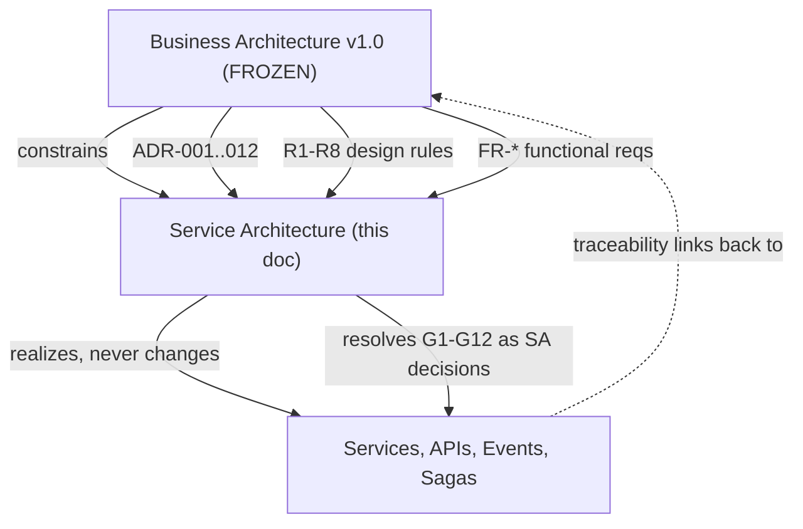

The relationship is strictly one-directional: every architectural element in this blueprint cites the business artifact it satisfies. If a conflict is ever detected between this document and the frozen architecture, the **frozen architecture wins** and this document is corrected.

### 1.3 Scope

| Aspect | In Scope | Out of Scope |
|--------|----------|--------------|
| Service design | Service boundaries, decomposition, worker suffixing | Class-level/function-level code |
| APIs | REST/JSON `/v1` (external via gateway+BFFs), gRPC (internal OHS), envelope `{success,data,error,meta}`, problem+json | OpenAPI/proto byte-for-byte final files |
| Events | Topic naming `<context>.<aggregate>.<EventName>.vN`, schema-registry policy, ordering keys | Avro/Protobuf wire payloads (Ch.17 registry references) |
| Sagas | Escrow orchestration (ADR-005), order-to-fulfilment & recall choreography, compensation | Step-engine vendor lock-in |
| Data | DB-per-service, CQRS/ES, projections, read models, ACLs | Physical schema DDL |
| Security | OAuth2/OIDC, mTLS, RBAC+ABAC PDP, four-eyes, HSM/KMS, PII field encryption | Final IdP/HSM product selection |
| Deployment | Kubernetes, multi-region sovereign, Kafka-class spine, HPA/KEDA, DR | Cloud-vendor-final procurement, capacity pricing |

**Explicitly out of scope:** production source code, vendor-final selection (specific Kafka distribution, HSM model, managed-DB SKU), and any change to the thirteen-context ownership model.

### 1.4 How Every Decision Traces

Traceability is mandatory. Each chapter cites:

- **ADRs** ADR-001..012 — e.g., CQRS fission (ADR-002), Finance isolation (ADR-004), polyglot runtimes (ADR-011).
- **Design rules** R1–R8 — e.g., Custody sole-writer (R1), Finance no-shared-DB (R2), event spine PL (R6).
- **FR ranges** — e.g., FR-PASS-000..027, FR-PAY-001..041, FR-INV-001..042, FR-IDN-001..065, FR-ROL-003..052.
- **§sections** and **context numbers (#1..#13)** from the frozen doc.
- **G1–G12** boundary resolutions as SA decisions.

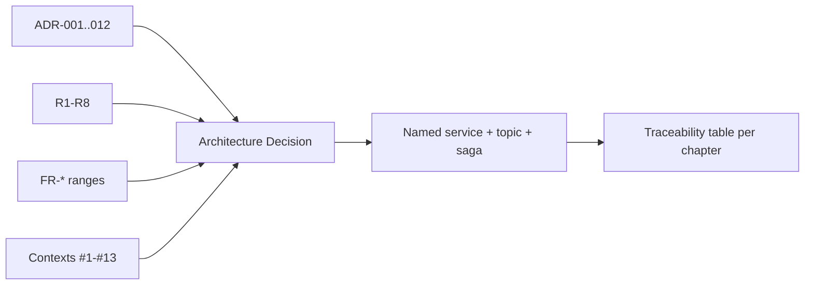

### 1.5 The 13 Contexts → Deployable Service Groups

The thirteen contexts collapse into **six deployable service groups** aligned to owning teams and runtimes, preserving every frozen boundary: the **Provenance Core group** (Go) runs custody-ledger-svc, the provenance/recall projection workers, and inventory-svc as a strong-local projection (#3–#5); the **Substrate group** runs identity-svc/kyc-adapter-svc (C#/.NET), catalog-svc (Go, **SA-assigned per G1**), analytics (Python), and Platform Services (Go) (#1, #2, #12, #13); the **Commerce group** runs Node/TS experience-edge B2C services (#6); the **Exchange group** runs Java/Spring B2B trade and margining (#7); the **Finance group** runs the physically isolated Java/Spring ledger, escrow, payout, and adapter services (#8); and the **Risk/Government/Logistics groups** run fraud-scoring (Python)+enforcement (Go), oversight/intervention (C#/.NET), and logistics (Go) respectively (#9–#11). All groups deploy as independent Kubernetes workloads communicating only via the versioned event spine, gRPC OHS, and ACL-fronted read models — never shared databases.

### 1.6 Context → Team → Runtime → Store

| # | Context | Type | Owning Team | Runtime (ADR-011) | Store |
|---|---------|------|-------------|-------------------|-------|
| 1 | Identity, Party & KYC | Supporting | Substrate | C#/.NET | Relational + field-level PII encryption |
| 2 | Product Master & Catalog | Supporting | Substrate (G1) | Go | Relational + search index |
| 3 | Custody & Provenance Ledger | Core | Provenance Core | Go | Append-only hash-chained event store (ES) |
| 4 | Provenance Graph & Recall | Core | Provenance Core | Go | Graph DB (CQRS read of #3) |
| 5 | Inventory & National Stock Ledger | Core | Provenance Core (NIL co-run Substrate) | Go | Relational projection + NIL read-model |
| 6 | B2C Marketplace | Supporting | Commerce | Node.js/TS | Relational + search |
| 7 | B2B Trade & Commodity Exchange | Core | Exchange | Java/Spring | Relational |
| 8 | Finance & Settlement | Core | Finance | Java/Spring | Relational, ISOLATED, double-entry (R2) |
| 9 | Logistics & Delivery | Supporting | Logistics | Go | Relational + time-series telemetry |
| 10 | Fraud, Risk & Enforcement | Core | Risk & Enforcement | Python (scoring) + Go (enforcement) | Relational + feature store + graph reads |
| 11 | Government & Regulatory Oversight | Supporting | Government | C#/.NET | Materialized read models + InterventionCase store |
| 12 | Analytics & Forecasting | Generic | Substrate | Python | OLAP/lakehouse (read-only) |
| 13 | Platform Services | Generic | Substrate | Go | Object store + search + notification queue + append-only audit log |

### 1.7 Business-Architecture Clarifications Resolved in Service Architecture (G1–G12)

These are **Service Architecture decisions** that conform to the frozen canon. They are recorded here, not in the frozen document.

| ID | Finding | SA Resolution | Trace |
|----|---------|---------------|-------|
| **G1** | Catalog (#2) team unassigned | **SA assigns Catalog to the Substrate team** as master-data backbone alongside Identity | ADR-008, R7, §#2 |
| **G2** | Markets→Inventory reservation seam | inventory-svc **exposes a synchronous, strongly-consistent, idempotent Reserve/Release gRPC**; B2C/B2B call at placement; Inventory writes its own RESERVED state; Customer-Supplier | R1, ADR-003, §6/BR-022, §#5 |
| **G3** | PKI ownership | **Identity owns the per-DID CA + key directory + CRL**; signing keys in HSM; custodial signing for low-tech actors; Catalog QR uses Identity-issued keys | §#1, ADR-007? no—§#3 HSM, R7 |
| **G4** | FraudCase seam | Fraud (#10) owns FraudCase; Government materializes a **read-view** into its own InterventionCase store; no dual write | R4, R5, §#10/#11 |
| **G5** | Command paths | Fraud→(Markets/Finance) hold commands; Government→Finance SubsidyDisbursementRequested; Government→Identity via EnforcementActionOrdered — all event/OHS under four-eyes | R4, R5, ADR-006, ADR-007 |
| **G6** | Aggregate homes | Driver→Logistics; Reputation→Identity (fed by ReputationSignal); beneficial-owner resolver→Identity; ScanObservation→Provenance Graph | §#1/#4/#9 |
| **G7** | Event catalog authority | **Chapter 17 is the authoritative event/topic registry** (extends §20.2) | R6, ADR-010 |
| **G8** | FR-ROL implementation | Authorization realized from §8 capability matrix + delegation rules | FR-ROL-003..052, §#1 |
| **G9** | FR-PAY-402 | Escrow reversal implemented per FR-PAY-014/015/036 (402 is a doc typo) | ADR-005, §#8 |
| **G10** | "atomic" wording | All cross-context atomic flows realized as **orchestrated/choreographed sagas with compensation** | R2, R6, ADR-005 |
| **G11** | Recall SLA | **Strong per-batch freeze at #3 immediately**; eventual graph scope-out ≥95% within achievable window; expose `asOf` staleness | R1, ADR-002, §#3/#4 |
| **G12** | Platform Services contracts | Define notification/search/document/audit contracts + SLAs; search-svc backs cross-context discovery; catalog/B2C keep local search read-models | R6, ADR-008, §#13 |

The three highest-impact resolutions — **G1 (Catalog→Substrate)**, **G2 (Markets→Inventory synchronous Reserve)**, and **G3 (Identity-owns-PKI)** — are foundational dependencies for Chapters 2 (context map), 5 (Inventory), and the security chapters, and are treated as binding inputs throughout this blueprint.

---

## 2. Architecture Principles & Cross-Cutting Conventions

This chapter freezes the platform-wide engineering contract that every one of the 13 contexts (ADR-001) obeys. It is normative: where a later chapter is silent, these rules apply; where a later chapter elaborates, it may narrow but never contradict them. The conventions exist to make a polyglot, event-driven, offline-first, sovereign system behave as one coherent commerce OS while preserving the frozen ownership and the strong-vs-eventual consistency split.

### 2.1 First Principles

#### Purpose
Establish the invariants that keep custody and money correct, contexts decoupled, and the spine the single integration fabric.

#### Architecture decisions
The platform rests on six non-negotiable principles, each traceable to a binding design rule.

| # | Principle | Rule it realizes | Operational meaning |
|---|-----------|------------------|---------------------|
| P1 | Single writer per truth | R1, R2 | Custody is the sole writer of provenance; Finance the sole writer of money. Everyone else projects or commands via events. |
| P2 | No shared database | R2, R6 | Every service owns its schema. Cross-context data crosses only as events, OHS gRPC, or ACL-guarded read models. |
| P3 | Spine is the integration boundary | R6, ADR-010 | The versioned Published Language on a Kafka-class log is the only sanctioned cross-context coupling. |
| P4 | Strong where it must be, eventual where it may be | §intro, R1 | Money/custody/reservation are strongly consistent and local; rollups, graph, analytics are projections with bounded lag. |
| P5 | Effectively-once everywhere | Reliability standards | Outbox + inbox + idempotency keys turn at-least-once delivery into effectively-once processing. |
| P6 | Parity and offline-first are platform concerns | R8, ADR-012 | Every command path is reachable from app, USSD/SMS/IVR, and store-and-forward queues. |

#### Design rationale
A nation-scale system cannot be made correct by hope or by distributed transactions; correctness must be structural. By assigning each truth a single writer (P1) and forbidding shared stores (P2), we eliminate the two classes of defect that destroy ledgers: concurrent writers and hidden read/write coupling. The remaining coordination is pushed onto an explicit, versioned, observable channel (P3), where it can be tested, replayed, and audited.

#### Traceability
P1↔R1/R2; P2↔R2/R6; P3↔R6/ADR-010; P4↔§intro strong/eventual split; P5↔Reliability standards; P6↔R8/ADR-012.

### 2.2 CQRS & Event-Sourcing Scope

#### Purpose
Define exactly which contexts are event-sourced, which are projections, and where command-side state lives, so the CQRS boundary is unambiguous.

#### Architecture decisions
Event sourcing is **scoped, not universal**. Only Custody & Provenance Ledger (#3) is a true event-sourced aggregate store (append-only, hash-chained, per-PPID ordering, ADR-002). Every other "read-ish" context is a **projection** of upstream truth.

| Context | Role | Backing model |
|---------|------|---------------|
| #3 Custody Ledger | Event-sourced write side | Append-only hash-chained event store |
| #4 Provenance Graph | CQRS read side of #3 | Graph DB projection (PPID PL) |
| #5 Inventory / NIL | Projection of custody (R1) | Relational projection + NIL read-model |
| #5 Reservation | **Strong-local write** | inventory-svc owns RESERVED state (G2) |
| #11 Government views | Projection + own InterventionCase store | Materialized read models |
| #12 Analytics | Strictly downstream | OLAP lakehouse, read-only |

The single deliberate exception to "read contexts only project" is the **Reservation strong-local write** (G2): inventory-svc holds RESERVED state with compare-and-reserve semantics even though Inventory is otherwise a custody projection. This is sanctioned because reservation is a local decision that must be strongly consistent at order placement, while the national rollup (NIL) remains eventual at ≤60s (R1, ADR-003).

#### Trade-offs & rejected alternatives
Universal event sourcing was rejected: it would impose replay complexity, snapshotting, and projection lag on contexts (Finance, Identity, B2C) whose relational, transactional models are simpler and battle-tested. Conversely, making Inventory authoritative was rejected outright — it violates R1's "Custody is sole writer of provenance truth." CQRS-everywhere was rejected for KISS: contexts with no read/write asymmetry (Identity, Catalog) gain nothing from split models.

#### Traceability
ADR-002, ADR-003, R1, G2.

### 2.3 Database-per-Service & Schema Ownership

#### Purpose
Pin down storage isolation so no context can reach into another's store.

#### Architecture decisions
Each service owns its schema; no service issues queries against another service's database (R6). Finance is **physically isolated** — separate database cluster, separate credentials, no shared connection pool (R2, ADR-004). Cross-context data is obtained only by (a) subscribing to spine events, (b) calling an Open-Host-Service gRPC endpoint, or (c) reading a locally-maintained projection fed by events behind an ACL.

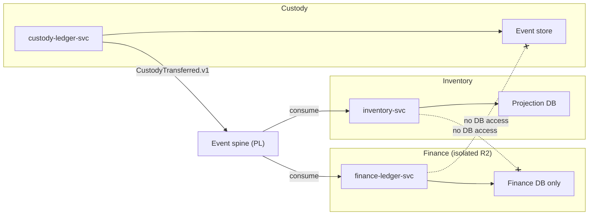

#### Trade-offs & rejected alternatives
A shared database (or shared "reporting replica") was rejected: it is the canonical anti-pattern that re-couples bounded contexts, defeats R6, and would let a reporting query lock the money ledger. The cost we accept is data duplication across projections and the engineering of ACLs/translation maps — a deliberate exchange of storage efficiency for autonomy, blast-radius containment, and independent scaling.

#### Traceability
R2, R6, ADR-004.

### 2.4 ACL & Open-Host-Service Patterns

#### Purpose
Standardize the two sanctioned integration shapes between contexts.

#### Architecture decisions
- **Open-Host-Service (OHS):** A context that is upstream to many publishes a stable, versioned contract as its Published Language. Canonical OHS providers: `identity-svc` (authz authority, DID master data), `catalog-svc` (GPID PL), `custody-ledger-svc` (PPID PL via #4), `finance-ledger-svc` (settlement ACL/OHS), and `audit-log-svc` (append-only sink, R6). OHS is exposed as internal gRPC and as spine events.
- **Anti-Corruption Layer (ACL):** A downstream context translates an upstream model into its own ubiquitous language at the boundary, so upstream changes cannot corrupt local semantics. Mandatory ACLs: `kyc-adapter-svc` (NID/BIN external systems), Finance's consumption of `CustodyTransferred`/`RecallInitiated`, B2B→Fraud signal emission, and all external-system adapters (MFS, banks, EC, NBR).

| Relationship | Pattern | Direction |
|--------------|---------|-----------|
| Identity → all | OHS (authz, DID) | Upstream master data (R7) |
| Catalog → all | OHS (GPID PL) | Upstream master data (R7, G1) |
| Custody → Inventory/Finance/Logistics | OHS event + ACL on consumer | Customer-Supplier / Conformist |
| Markets → Inventory | OHS gRPC `Reserve/Release` | Customer-Supplier (G2) |
| B2C ↔ B2B | Separate Ways | No shared model (ADR-009) |
| Markets → Finance | Conformist / Partnership | B2C conforms; B2B partners (margining) |

#### Trade-offs & rejected alternatives
A canonical platform-wide domain model was rejected: it forces every team onto one schema and recreates the shared-database coupling at the model layer. ACL translation costs CPU and code, but it is the only way Finance and Custody can consume external and cross-context data without importing foreign invariants.

#### Traceability
R6, R7, ADR-008, ADR-009, G1, G2.

### 2.5 API Conventions

#### Purpose
One external contract and one internal contract, uniformly enforced.

#### Architecture decisions
- **External:** REST/JSON under `/v1`, reached only through `api-gateway-svc` and the BFFs (`app-bff`, `ussd-ivr-bff`, `partner-bff`). No client touches a domain service directly.
- **Internal cross-context OHS:** gRPC with protobuf-defined contracts.
- **Envelope:** every response is `{success, data, error, meta}`; `data` nullable on error, `error` nullable on success, `meta` carries pagination.
- **Pagination:** cursor-based (opaque cursor in `meta`), never offset, to stay stable under high write rates.
- **Errors:** `problem+json` with stable, documented codes; messages never leak PII or internal identifiers.
- **Idempotency:** `Idempotency-Key` header is **required** on every unsafe / money / custody / reservation write; the server persists the key→result mapping so retries are safe.

| Concern | External | Internal |
|---------|----------|----------|
| Protocol | REST/JSON `/v1` | gRPC |
| Entry point | Gateway + BFFs | Service mesh (mTLS) |
| Errors | problem+json | gRPC status + problem detail |
| Idempotency | `Idempotency-Key` header | request `idempotency_key` field |

#### Trade-offs & rejected alternatives
A synchronous RPC mesh as the *primary* cross-context integration was rejected: it creates runtime coupling, cascading failures, and latency amplification across 13 contexts. gRPC is therefore reserved for the few legitimate synchronous needs (authz checks, the strong-local `Reserve` of G2); everything else flows over the spine. GraphQL at the edge was rejected for USSD/SMS parity and 2G performance reasons — the BFFs shape thin, low-byte responses instead.

#### Traceability
API conventions, Security standards, G2, R8.

### 2.6 Event Conventions

#### Purpose
Make the spine a disciplined Published Language, not a message dump.

#### Architecture decisions
- **Topic naming:** `<context>.<aggregate>.<EventName>.vN` — e.g. `custody.passport.CustodyTransferred.v1`, `finance.wallet.PaymentSettled.v1`.
- **Immutability & tense:** events are immutable, PastTense facts.
- **Schema registry:** every event is registered; evolution is backward-compatible *within* a major version (`vN`); breaking changes mint `v(N+1)` and dual-publish during migration.
- **Payload discipline:** events carry **canonical IDs only** (DID, GPID, PPID, ORD, SHP, WLT, TXN, CON, FWD) — never foreign aggregate bodies — preserving context autonomy.
- **Ordering keys:** PPID for custody, WLT/TXN for money, ORD for orders. Per-aggregate-key ordering is guaranteed; cross-key global ordering is not assumed.
- **Advisory tagging:** Analytics outputs carry `advisory=true` and must never be treated as operational truth (#12).

#### Trade-offs & rejected alternatives
Fat events (full entity snapshots) were rejected: they leak schema, bloat the log, and re-couple consumers to producer internals. ID-only events force consumers through the OHS/ACL, which is the desired discipline. Global total ordering was rejected as unscalable; per-key ordering on the partition key is sufficient because custody and money invariants are per-aggregate.

#### Traceability
R6, ADR-010, Event conventions, identifier scheme, G7 (Chapter 17 authoritative registry).

### 2.7 The Reliability Quartet & Effectively-Once Semantics

#### Purpose
Guarantee no money/custody/inventory event is ever lost, duplicated in effect, or silently dropped.

#### Architecture decisions
Four mechanisms compose into effectively-once:

| Mechanism | What it does | Failure it removes |
|-----------|--------------|--------------------|
| Transactional OUTBOX | State change + outgoing event committed in one local transaction; a relay publishes from the outbox | Lost events / dual-write inconsistency |
| Consumer INBOX | `event_id` recorded before side effects; replays are no-ops | Duplicate processing |
| Dead-Letter Queue | Per-topic DLQ with reason + replay tooling | Poison messages blocking partitions |
| Retry policy | Exponential backoff + jitter, capped | Thundering-herd / unbounded retry |

Delivery is at-least-once; consumers are idempotent — together yielding **effectively-once**. Invalid custody/money/inventory events are **quarantined**, never silently discarded.

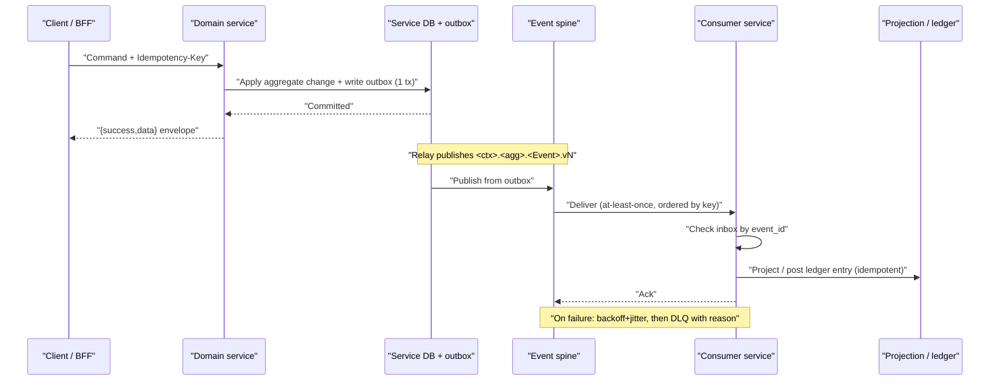

#### Trade-offs & rejected alternatives
**Two-phase commit (2PC)** across context databases was rejected: it requires a distributed transaction coordinator spanning isolated stores — impossible under R2 (Finance shares no DB) and fragile at nation scale. The **dual-write** pattern (write DB, then publish separately) was rejected because a crash between the two steps loses or invents events; the outbox makes the publish atomic with the state change. Exactly-once *delivery* was rejected as a guarantee no broker truly provides; we engineer exactly-once *effect* instead.

#### Traceability
R2, R6, Reliability standards, Sagas (G10).

### 2.8 Sagas, Correlation, Tenancy & Region Routing

#### Purpose
Tie cross-context flows, traceability, and sovereign routing into the same convention set.

#### Architecture decisions
- **Sagas:** all cross-context money/custody flows are sagas, never distributed ACID (R2/R6, G10). The escrow saga is **orchestrated** by `escrow-svc` (ADR-005, R3); order-to-fulfilment and recall propagation are **choreographed** via events with explicit compensation. Every "atomic" wording in the frozen doc is realized as a saga with compensation (G10).
- **Correlation & causation IDs:** every command and event carries a `correlation_id` (constant across a business flow) and a `causation_id` (the immediate parent message). These propagate through OpenTelemetry traces, the audit OHS sink, and DLQ entries, making any saga replayable and auditable end-to-end.
- **Tenancy & region routing:** the platform is sovereign in-country, multi-region/multi-AZ with a DR region. Requests carry a region affinity derived from the actor's DID division/district prefix (`DKD-<DIV><DIST>-…`); strong-local writes (reservation, custody, money) execute in the home region, while projections (NIL, graph, analytics) replicate cross-region within the ≤60s lag budget. Data residency never leaves the sovereign boundary.

| Flow | Coordination | Owner |
|------|--------------|-------|
| Escrow lifecycle | Orchestrated saga | escrow-svc (ADR-005) |
| Order → fulfilment | Choreographed | b2c-order-svc / inventory-svc / logistics-svc |
| Recall propagation | Choreographed + strong freeze at #3 | recall-svc → custody-ledger-svc (G11) |

#### Trade-offs & rejected alternatives
Orchestrating *all* sagas centrally was rejected — it would recreate a god-service and couple every context to one coordinator; orchestration is reserved for escrow where money-state transitions demand a single authoritative controller (R3). Pure choreography for escrow was rejected because compensating reversals across MFS/bank adapters need deterministic, observable control. Per-tenant physical isolation was rejected as unaffordable at national scale; logical tenancy with region-affinity routing meets sovereignty (sovereign in-country) without per-tenant cluster sprawl.

#### Traceability
R2, R3, R6, ADR-005, G10, G11, deployment standards (sovereign multi-region).

### 2.9 Conventions Conformance Summary

| Convention | Binding source | Enforced by |
|------------|----------------|-------------|
| No shared DB; Finance isolated | R2, R6, ADR-004 | Schema ownership, mesh policy |
| Spine as sole cross-context coupling | R6, ADR-010 | Gateway/mesh egress rules |
| Effectively-once | Reliability standards | Outbox + inbox + DLQ |
| ID-only PastTense events `…vN` | Event conventions, G7 | Schema registry |
| Idempotency-Key on unsafe writes | API + Security standards | Gateway + services |
| Cross-context money/custody = saga | R2/R6, ADR-005, G10 | escrow-svc + choreography |

Every subsequent chapter inherits these conventions by default and may specialize, but never weaken, them.

---

## 3. Service Decomposition & System Landscape

### 3.1 Purpose

This chapter freezes the **physical service catalog** of DOKANDAR: every deployable unit across the thirteen bounded contexts (ADR-001), its owning context and team, its runtime (ADR-011), its store, and whether it participates in synchronous request/response or asynchronous spine flows. It is the single index the rest of the blueprint dereferences — later chapters cite these exact service names rather than re-deriving them. The decomposition is deliberately conservative: it maps one primary service per published capability, splitting further only into suffixed `*-workers` where read-model projection or stream ingestion must scale independently of the command path. This realizes §19's "services as the unit of deployment, contexts as the unit of ownership" and honors the canon's prohibition on cross-service database access (R6).

### 3.2 Design rationale

Three forces shape the catalog:

1. **Ownership integrity (R1, R2, R6).** A service is the smallest unit that can own a schema. Custody writing, Inventory reservation, and Finance ledgering must each be a *distinct* service so that the "sole writer" (R1) and "no shared DB" (R2) invariants are enforced by deployment topology, not merely by convention.
2. **Polyglot runtime alignment (ADR-011).** Service boundaries never straddle a runtime boundary. Finance and B2B are Java/Spring; Identity and Government are C#/.NET; Analytics and Fraud-scoring are Python; the experience edge (B2C, BFFs) is Node/TS; all cores and infra are Go. A service is therefore also the unit of language homogeneity.
3. **Independent scalability of read vs write.** CQRS/ES (ADR-002) means projection workers absorb fan-out traffic (graph rebuilds, NIL rollups, stock projections, telemetry ingest) at a cadence decoupled from authoritative writes. These become `*-projection-workers` / `*-ingest-workers` rather than new contexts.

### 3.3 Master service catalog

The complete inventory of deployable services. **Sync role**: `S`=synchronous server (gRPC internal / REST at edge), `A`=async spine consumer/producer, `S+A`=both. All async services apply the platform reliability stack (outbox, inbox, DLQ, backoff).

| # | Service | Owning Context | Team | Runtime | Store | Sync/Async role |
|---|---------|----------------|------|---------|-------|-----------------|
| 1 | `identity-svc` | #1 Identity | Substrate | C#/.NET | Relational (+PII field encryption) | S+A (OHS authz PDP; emits Party/KYC events) |
| 2 | `kyc-adapter-svc` | #1 Identity | Substrate | C#/.NET | Relational | S+A (ACL to NID/BIN; emits KycTierChanged) |
| 3 | `catalog-svc` | #2 Catalog | Substrate (G1) | Go | Relational + search index | S+A (OHS GPID PL; emits GpidAllocated) |
| 4 | `catalog-search-indexer` | #2 Catalog | Substrate | Go | Search index | A (consumes catalog events → index) |
| 5 | `custody-ledger-svc` | #3 Custody | Provenance Core | Go | Append-only hash-chained ES | S+A (sole custody writer; emits Custody* events) |
| 6 | `provenance-projection-workers` | #4 Prov. Graph | Provenance Core | Go | Graph DB (read model) | A (projects PassportEventAppended → graph) |
| 7 | `recall-svc` | #4 Prov. Graph | Provenance Core | Go | Graph DB + RecallCase store | S+A (computes RecallScopeComputed) |
| 8 | `inventory-svc` | #5 Inventory | Provenance Core | Go | Relational projection | S+A (strong-local Reserve gRPC; RESERVED owner) |
| 9 | `stock-projection-workers` | #5 Inventory | Provenance Core | Go | Relational projection | A (projects custody → stock) |
| 10 | `nil-rollup-svc` | #5 Inventory | Provenance Core (co-run Substrate) | Go | NIL read-model | A (national rollup, ≤60s lag) |
| 11 | `b2c-order-svc` | #6 B2C | Commerce | Node/TS | Relational + search | S+A (Order aggregate; calls Reserve; emits Order*) |
| 12 | `b2c-catalog-read-svc` | #6 B2C | Commerce | Node/TS | Local read-model + search | S (catalog/listing reads; fed by search-svc) |
| 13 | `b2b-trade-svc` | #7 B2B | Exchange | Java/Spring | Relational | S+A (RFQ/Contract/Deal; emits Contract* etc.) |
| 14 | `margining-svc` | #7 B2B | Exchange | Java/Spring | Relational | S+A (margin calc; emits MarginCalled) |
| 15 | `finance-ledger-svc` | #8 Finance | Finance | Java/Spring | Relational, ISOLATED, double-entry | S+A (OHS/ACL; emits PaymentSettled, LedgerDrift) |
| 16 | `escrow-svc` | #8 Finance | Finance | Java/Spring | Relational (Finance-isolated) | S+A (escrow saga orchestrator, ADR-005) |
| 17 | `payout-svc` | #8 Finance | Finance | Java/Spring | Relational (Finance-isolated) | S+A (emits PayoutSettled, RefundIssued) |
| 18 | `mfs-bank-adapters` | #8 Finance | Finance | Java/Spring | Relational (adapter state) | S+A (ACL to MFS/BEFTN/RTGS) |
| 19 | `cod-recon-svc` | #8 Finance | Finance | Java/Spring | Relational (Finance-isolated) | A (COD reconciliation) |
| 20 | `logistics-svc` | #9 Logistics | Logistics | Go | Relational + time-series | S+A (Shipment/Driver; emits Shipment*, POD) |
| 21 | `telemetry-ingest-workers` | #9 Logistics | Logistics | Go | Time-series | A (telemetry → ColdChainBreachRaised) |
| 22 | `routing-svc` | #9 Logistics | Logistics | Go | Relational (route cache) | S (route optimization) |
| 23 | `fraud-scoring-svc` | #10 Fraud | Risk & Enforcement | Python | Relational + feature store + graph reads | S+A (RiskScored; recommend-by-default) |
| 24 | `enforcement-svc` | #10 Fraud | Risk & Enforcement | Go | Relational | S+A (issues hold commands; emits FraudHold*) |
| 25 | `oversight-read-svc` | #11 Government | Government | C#/.NET | Materialized read models | S (read-mostly oversight views) |
| 26 | `intervention-svc` | #11 Government | Government | C#/.NET | InterventionCase store | S+A (four-eyes; emits InterventionOrdered) |
| 27 | `analytics-pipeline` | #12 Analytics | Substrate | Python | OLAP / lakehouse (read-only) | A (spine consumer; ELT) |
| 28 | `forecasting-svc` | #12 Analytics | Substrate | Python | OLAP read models | A (advisory ForecastPublished) |
| 29 | `notification-svc` | #13 Platform | Substrate | Go | Notification queue | S+A (USSD/SMS/IVR/push fabric) |
| 30 | `search-svc` | #13 Platform | Substrate | Go | Search index | S+A (cross-context discovery; indexer, G12) |
| 31 | `document-svc` | #13 Platform | Substrate | Go | Object store | S (document storage; DocumentStored) |
| 32 | `audit-log-svc` | #13 Platform | Substrate | Go | Append-only audit log | A (append-only OHS sink, R6) |
| 33 | `api-gateway-svc` | Edge | Substrate | Go | (stateless) | S (OAuth2/OIDC, REST `/v1`, rate-limit) |
| 34 | `app-bff` | Edge | Commerce | Node/TS | (stateless + edge cache) | S (mobile/web BFF, offline-sync) |
| 35 | `ussd-ivr-bff` | Edge | Commerce | Node/TS | (stateless + session store) | S (USSD/SMS/IVR parity, R8) |
| 36 | `partner-bff` | Edge | Exchange | Node/TS | (stateless) | S (B2B/partner-system BFF) |

**Count: 36 services** — 32 context services plus the 4 edge units (1 gateway + 3 BFFs).

### 3.4 System landscape diagram

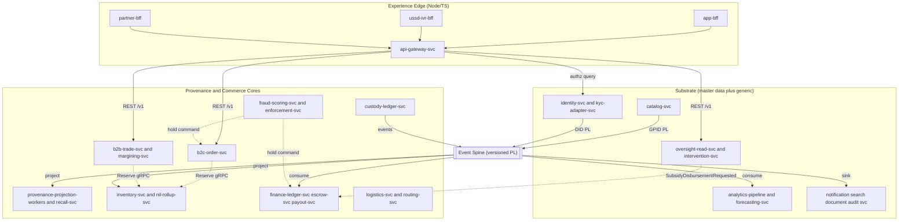

**Legend:** solid edges = data/query/projection flows; dotted edges = command flows (Reserve, holds, four-eyes commands). The event spine (`custody.*`, `finance.*`, … `.vN`) is the sole inter-context coupling for async flows; the only synchronous cross-context edges are the gateway→service REST calls and the sanctioned `inventory-svc` Reserve gRPC (G2).

### 3.5 Deployment boundaries and co-deployment groups

Services co-deploy by **team + runtime + store-affinity**, never by context alone, so a context's write path and its projection workers can scale on separate HPA/KEDA curves.

| Deployment group | Services | Co-deploy rationale |
|------------------|----------|---------------------|
| Provenance Core (Go) | `custody-ledger-svc`, `provenance-projection-workers`, `recall-svc`, `inventory-svc`, `stock-projection-workers`, `nil-rollup-svc` | Single team; CQRS write+read of one provenance truth (R1); NIL rollup co-run with Substrate |
| Finance (Java, isolated) | `finance-ledger-svc`, `escrow-svc`, `payout-svc`, `mfs-bank-adapters`, `cod-recon-svc` | Physical isolation (R2/ADR-004); own namespace + DB cluster, no shared store |
| Exchange (Java) | `b2b-trade-svc`, `margining-svc`, `partner-bff` | Separate Ways from B2C (ADR-009); Partnership with Finance |
| Commerce edge (Node/TS) | `b2c-order-svc`, `b2c-catalog-read-svc`, `app-bff`, `ussd-ivr-bff` | Experience edge; offline-sync + channel parity (R8/ADR-012) |
| Substrate master-data (mixed) | `identity-svc`, `kyc-adapter-svc` (C#), `catalog-svc`, `catalog-search-indexer` (Go) | Master-data backbone OHS (R7/ADR-008); Catalog assigned here per G1 |
| Substrate generic (Go/Python) | `notification-svc`, `search-svc`, `document-svc`, `audit-log-svc`, `analytics-pipeline`, `forecasting-svc` | Cross-cutting infra + read-only analytics; horizontally pooled |
| Government (C#) | `oversight-read-svc`, `intervention-svc` | Read-mostly + four-eyes (R5/ADR-007); own InterventionCase store |
| Risk (Python+Go) | `fraud-scoring-svc`, `enforcement-svc` | Scoring/enforcement split by runtime (ADR-011); recommend-by-default (R4) |
| Logistics (Go) | `logistics-svc`, `telemetry-ingest-workers`, `routing-svc` | Conformist to Custody; telemetry ingest scales independently |
| Gateway | `api-gateway-svc` | Stateless edge; replicated per region |

All groups deploy as containers on Kubernetes, sovereign in-country, multi-region/multi-AZ with a DR region, behind the Kafka-class durable spine, each boundary guarded by circuit breakers, bulkheads, timeouts, and rate limits.

### 3.6 Service-count rationale — avoiding both failure modes

| Anti-pattern | How it manifests here | Guardrail applied |
|--------------|-----------------------|-------------------|
| **God-Service** | One "passport service" owning write+read+recall+stock | Fissioned into `custody-ledger-svc` / `provenance-projection-workers` / `recall-svc` / `inventory-svc` per ADR-002, ADR-003 (CQRS, R1) |
| **Service-Explosion** | A microservice per FR or per aggregate (hundreds of units) | One service per *published capability*; further splits only as suffixed `*-workers` for projection/ingest scaling |

The 36-service figure is the floor that still satisfies every frozen invariant: each "sole-writer" / "isolated" / "four-eyes" rule lands on its own deployable unit, while supporting and generic contexts stay lean (1–2 services + indexers). Net density averages ~2.5 services per context — high cohesion within a context, low coupling across, with the spine as the only async seam.

### 3.7 Traceability

| Element | Frozen source |
|---------|---------------|
| Thirteen contexts → 32 context services | ADR-001; §19 (services = deployment unit) |
| Custody/Graph/Inventory service fission | ADR-002, ADR-003; R1 |
| Finance isolated deployment group | ADR-004; R2; FR-PAY-001..041 |
| Escrow orchestrator as discrete service | ADR-005; R3 |
| Fraud scoring/enforcement split + dotted hold edges | ADR-006; R4; G5 |
| Government read+intervention services, dotted commands | ADR-007; R5; G4, G5 |
| Identity + Catalog in Substrate group | ADR-008; R7; G1, G3 |
| B2C vs B2B separate groups | ADR-009 |
| Event spine as sole async seam | ADR-010; R6; G7 |
| Per-service runtime homogeneity | ADR-011 |
| BFF trio + offline edge | ADR-012; R8 |
| `inventory-svc` Reserve gRPC edge | G2; FR-INV-001..042; BR-022 (§6) |
| Platform service contracts (notification/search/document/audit) | G12; R6 (audit OHS sink) |
| Driver in Logistics | G6; FR-LOG-001..082 |

This catalog is authoritative for service identity and ownership; subsequent chapters (data, events in Ch. 17, sagas, security, deployment) bind their contracts to the exact service names enumerated in §3.3.

---

## 4. Identity, Party & KYC — Service Architecture

### 4.0 Purpose & Scope

Context #1 is the master-data backbone for *who acts* on DOKANDAR. It owns canonical party identity (DID), KYC tier (V0–V3), the per-DID PKI that underpins custody and catalog signatures (G3), and the platform Policy Decision Point (PDP) for RBAC+ABAC. It is a **Supporting** context per ADR-001 but a backbone **OHS** publisher per R7/ADR-008: every other context conforms to its DID and tier as Published Language. It runs on **C#/.NET** (ADR-011) over a relational store with field-level PII encryption.

**Design rationale.** Identity is read-mostly at runtime (authorization checks dominate writes 1000:1) but write-strict for KYC and PKI. We therefore split a synchronous authorization authority from an asynchronous external-ACL adapter so that NID/BIN latency and downtime never block authz or login.

**Traceability:** ADR-001, ADR-008, ADR-011, R7, R8, FR-IDN-001..065, FR-ROL-003..052, §1, §8.

### 4.1 Service Decomposition

| Service | Runtime | One-line responsibility |
|---|---|---|
| `identity-svc` | C#/.NET | OHS authority for Party/DID + KYC tier; PDP for RBAC+ABAC; session/device authority; per-DID PKI (CA/CRL) and custodial signing. |
| `kyc-adapter-svc` | C#/.NET | ACL to EC-NID and NBR BIN/TIN; verifies documents, normalizes results into KYC evidence; never exposes external schemas upstream. |
| `identity-projection-workers` | C#/.NET | Build read models (authz snapshot, party directory, device/session index) from the internal event stream; consume external `RiskScored`. |

**Design rationale.** Two business services plus a worker tier (per the SA naming convention — decompose only via suffixed `*-workers`). `kyc-adapter-svc` is an isolation bulkhead: external regulators are slow and flaky, so their integration is quarantined behind an ACL with its own circuit breaker. **Rejected alternative:** folding KYC calls into `identity-svc` — rejected because a BIN outage would then degrade login and authorization platform-wide (violates R8 offline-first resilience).

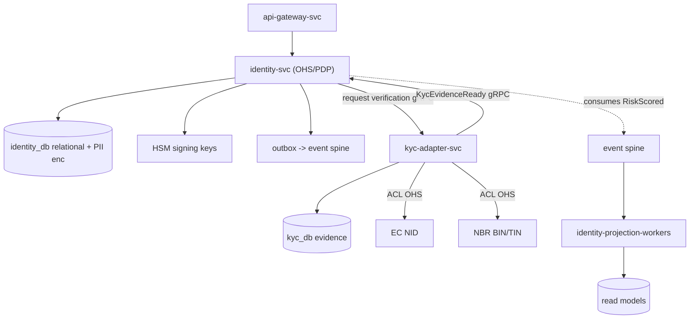

### 4.2 Write Models / Aggregates & Invariants

| Aggregate | Boundary | Key invariants | Trace |
|---|---|---|---|
| Party/Principal | One legal/natural actor; holds canonical DID, org tree, beneficial-owner resolver (G6) | DID immutable once canonicalized; format `DKD-<DIV><DIST>-<TYPE>-<seq>`; one canonical DID per verified NID; beneficial-owner edges resolve to existing Parties | FR-IDN-001..030, G6 |
| Identity/KYC | KYC evidence + current tier per Party | Tier monotonic by evidence (no tier raise without matching verified evidence); tier change is event-sourced & four-eyes for V2→V3; PII encrypted at field level | FR-IDN-031..050 |
| ActorRole | Role/capability grants + delegation scope | Deny-by-default; grant references a known capability (§8 matrix); delegation cannot exceed grantor scope; time-boxed | FR-ROL-003..052, G8 |
| Device | Bound devices per Principal | Device bind requires authenticated session + tier≥V1; bound device carries attestation key | FR-IDN-051..058, R8 |
| Session | Active auth sessions | Short-lived JWT + rotating refresh; revocation is terminal and irreversible | FR-IDN-059..065 |

**Reputation** (trust) also lives here (G6), fed by `ReputationSignal` from B2C/B2B, kept distinct from KYC tier (trust ≠ identity assurance).

**Design rationale.** DID and tier are the two values the whole platform binds to, so their aggregates are the strictest. KYC tier is event-sourced for an immutable audit trail of *why* an actor reached a tier — required for regulator inspection (R5 consumers) and clawback investigations.

### 4.3 Read Models / Projections

| Read model | Built from | Consumer | Lag SLO |
|---|---|---|---|
| Authz snapshot (DID→roles/caps/tier/devices) | ActorRole + KYC + Device events | PDP hot path (in-memory + cache) | ≤2s |
| Party directory | Party events | Internal `ResolveParty` lookups | ≤60s |
| Device/Session index | Device/Session events | Login, revocation checks | ≤2s |
| Risk overlay | external `RiskScored` (Fraud) | ABAC step-up / restriction flags | ≤60s |

The risk overlay is how Fraud influences actors **without writing Identity** (G5/R4): `identity-svc` *consumes* `RiskScored` and may raise step-up or restriction attributes; Fraud never mutates the identity store.

**Trace:** CQRS convention, ADR-008, G5, R4, projection-lag SLO ≤60s.

### 4.4 REST Endpoints & Internal gRPC OHS

External REST/JSON under `/v1` via gateway + BFFs; envelope `{success,data,error,meta}`; cursor pagination; problem+json errors; `Idempotency-Key` on every unsafe write.

| Method & path | Purpose | Idempotent |
|---|---|---|
| `POST /v1/parties` | Register party, canonicalize DID | Key required |
| `GET /v1/parties/{did}` | Resolve party profile | safe |
| `POST /v1/parties/{did}/kyc` | Submit KYC evidence (→ adapter) | Key required |
| `GET /v1/parties/{did}/kyc` | Current tier + evidence summary | safe |
| `POST /v1/parties/{did}/roles` | Grant/delegate role (four-eyes for sensitive caps) | Key required |
| `POST /v1/sessions` | Login, issue JWT + refresh | Key required |
| `DELETE /v1/sessions/{id}` | Revoke session | terminal |
| `POST /v1/devices` | Bind device | Key required |
| `GET /v1/pki/{did}/cert` | Fetch per-DID signing cert | safe |
| `GET /v1/pki/crl` | Certificate revocation list | safe |

| Internal gRPC OHS (mTLS) | Caller | Contract |
|---|---|---|
| `Authorize(did, action, resource, ctx)` | All contexts via PDP | deny-by-default decision + obligations |
| `ResolveParty(did)` | Custody, Finance, Markets, Gov | canonical party PL |
| `GetKycTier(did)` | Finance (payout caps), Markets | tier PL |
| `IssueSigningCert(did)` / `Sign(did, digest)` | Custody (HSM custodial signing), Catalog QR | G3 PKI |
| `VerifyExternalIdentity(...)` | `identity-svc`→`kyc-adapter-svc` | NID/BIN ACL |

**Design rationale.** `Authorize` is the single server-side PDP — no context re-implements RBAC. **Rejected alternative:** embedding policy in each service (token-claim-only authz) — rejected because four-eyes and ABAC context (device, tier, risk overlay) cannot be safely evaluated client-side and would drift across 13 contexts.

### 4.5 Commands & Queries (CQRS)

| Command | Owner | Emits |
|---|---|---|
| RegisterParty / CanonicalizeDid | identity-svc | PartyRegistered, DidCanonicalized |
| SubmitKyc / PromoteKycTier | identity-svc (+adapter) | KycTierChanged, KycFraudSignalRaised |
| GrantRole / DelegateRole | identity-svc | (internal role event) |
| BindDevice / RevokeSession | identity-svc | DeviceBound, SessionRevoked |
| IssueSigningCert / RevokeCert | identity-svc (PKI) | (cert lifecycle event) |

| Query | Owner | Source |
|---|---|---|
| Authorize / GetKycTier / ResolveParty | identity-svc | read models |

Writes go through aggregates with the outbox; queries hit projections only — never the write store on the hot path.

### 4.6 Events Produced & Consumed

Topic = `<context>.<aggregate>.<EventName>.vN`; immutable, PastTense, schema-registered, canonical IDs only; per-aggregate-key ordering keyed by **DID**.

**Produced** (authoritative registry in Chapter 17 / G7):

| Topic | Trigger | Key |
|---|---|---|
| `identity.party.PartyRegistered.v1` | New party persisted | DID |
| `identity.party.DidCanonicalized.v1` | DID minted/canonicalized | DID |
| `identity.kyc.KycTierChanged.v1` | Tier transition | DID |
| `identity.device.DeviceBound.v1` | Device bound | DID |
| `identity.session.SessionRevoked.v1` | Session revoked | DID |
| `identity.kyc.KycFraudSignalRaised.v1` | Adapter/heuristic anomaly | DID |

**Consumed:**

| Topic | From | Effect |
|---|---|---|
| `fraud.risk.RiskScored.v1` | Fraud #10 | Update risk overlay; ABAC step-up/restriction (G5, R4) |
| `government.intervention.EnforcementActionOrdered.v1` | Government #11 | Apply four-eyes ordered actor restriction (suspend/freeze role) (G5) |
| `marketplace.review.ReputationSignal` (B2C/B2B) | #6/#7 | Feed Reputation aggregate (G6) |

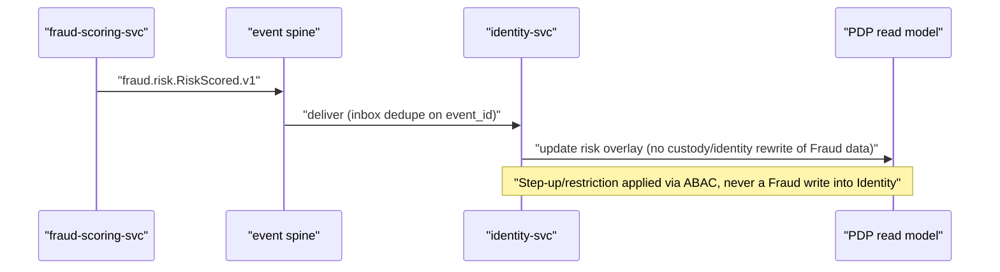

**Rejected alternative:** allowing Fraud or Government to write Identity directly — rejected by R4/R5/G5; actor effects flow only through consumed events under four-eyes.

### 4.7 Database & Schema Ownership

Two schemas, strict DB-per-service (R6): `identity_db` (Party, KYC evidence, ActorRole, Device, Session, Reputation, PKI directory) and `kyc_db` (external verification evidence/cache). No cross-service DB access; cross-context data leaves only via OHS/events. **PII** (NID number, names, addresses, biomet(refs)) is field-level encrypted with KMS-managed keys; ciphertext columns plus a tokenized search index. Private signing keys never touch the relational store — they live in **HSM** (G3). Schema evolution is backward-compatible within a major version; KYC and PKI tables are append-only/event-sourced.

**Trace:** R2/R6, ADR-008, ADR-011, FR-IDN-031..050, security standards (field-level PII, KMS/HSM).

### 4.8 Sagas Participated In

Identity is mostly a *projection consumer*, but participates in two choreographed flows (G10 — all cross-context "atomic" wording realized as sagas):

| Saga | Identity role | Compensation |
|---|---|---|
| Enforcement actor-restriction (Gov→Identity) | Consumer: apply restriction on `EnforcementActionOrdered`; emit ack | On rescind event, lift restriction (idempotent) |
| KYC promotion with external verify | Orchestrates `identity-svc`↔`kyc-adapter-svc`; tier raised only after evidence confirmed | On adapter failure/timeout, leave tier unchanged; raise `KycFraudSignalRaised` if mismatch |

Identity never orchestrates money/custody sagas (those belong to escrow-svc/custody-ledger-svc); it only supplies authz, tier, and signing.

```mermaid
sequenceDiagram
  participant U as "app-bff"
  participant I as "identity-svc"
  participant K as "kyc-adapter-svc"
  participant N as "EC NID / NBR BIN"
  U->>I: "POST /v1/parties/{did}/kyc (Idempotency-Key)"
  I->>K: "VerifyExternalIdentity (gRPC)"
  K->>N: "ACL call (circuit-breaker, timeout)"
  N-->>K: "verification result"
  K-->>I: "KycEvidenceReady | EvidenceRejected"
  alt verified
    I->>I: "PromoteKycTier (event-sourced) + outbox KycTierChanged.v1"
  else rejected/timeout
    I->>I: "no tier change; KycFraudSignalRaised.v1 if mismatch"
  end
```

### 4.9 ACL / OHS Boundaries

- **Upstream OHS (publisher):** DID + KYC tier + authz decisions are Published Language for all 13 contexts (R7).
- **Downstream ACL (consumer):** `kyc-adapter-svc` wraps EC-NID and NBR; external schemas are translated and never leak upstream.
- **Risk ingress:** Fraud `RiskScored` enters via an ACL into the risk overlay (no shared model).
- **PKI OHS:** signing-cert issuance and `Sign` are an OHS service to Custody (custodial signing for low-tech actors, R8) and Catalog (QR signing) — G3.

### 4.10 Idempotency / Outbox / Inbox / DLQ

| Mechanism | Implementation |
|---|---|
| Idempotency | `Idempotency-Key` header on all unsafe writes; dedupe table keyed (DID, key) returns first result on retry |
| Outbox | Single DB txn writes aggregate state + outbox row; relay publishes to spine (effectively-once) |
| Inbox | Consumer dedupe on `event_id` for `RiskScored`/`EnforcementActionOrdered` |
| DLQ | Per-topic DLQ with reason + replay; **invalid KYC/identity events quarantined, never silently dropped** |
| Retry | Exponential backoff + jitter, capped; adapter calls behind circuit breaker |

**Trace:** reliability standards (a)-(e), G10.

### 4.11 Scaling & Resilience

`identity-svc` PDP is read-heavy: horizontally scaled stateless replicas, in-memory authz snapshot + distributed cache, HPA on RPS/CPU. `kyc-adapter-svc` scales on queue depth (KEDA) and is bulkheaded so NID/BIN latency cannot exhaust identity-svc threads. Offline-first (R8): cached authz snapshots and short-grace JWT validation let edge/USSD nodes authorize during spine partitions; writes queue store-and-forward. Multi-region multi-AZ + DR; PKI/HSM replicated with key-ceremony procedures. Circuit breakers, timeouts, and rate limits at every boundary.

| Concern | Tier | Target |
|---|---|---|
| Authorize p99 | Strict | ≤50ms (cache hit) |
| Authz snapshot lag | Strict | ≤2s |
| KYC verify (external) | Best-effort | async, no login blocking |
| Party directory lag | Standard | ≤60s |

### 4.12 Security Responsibilities

Identity is the platform security nucleus: OAuth2/OIDC issuer at the gateway, short-lived JWT (DID/roles/tier/deviceId) with rotating refresh; mTLS via internal PKI it operates; **PDP** for deny-by-default RBAC+ABAC (§8 capability matrix, G8); **four-eyes** for sensitive role grants and tier V2→V3; field-level PII encryption; per-DID CA + CRL + custodial HSM signing (G3); all sensitive actions mirrored to the append-only audit OHS sink (#13, R6). Error messages never leak PII or external-system internals.

### 4.13 Traceability

| Decision | ADR / R | FR / § | G-item |
|---|---|---|---|
| Identity as master-data OHS for DID + tier | ADR-008, R7 | FR-IDN-001..050, §1 | — |
| C#/.NET runtime | ADR-011 | §1 | — |
| Split identity-svc / kyc-adapter-svc (ACL bulkhead) | R6, R8 | FR-IDN-031..050 | — |
| PDP RBAC+ABAC, deny-by-default | R5 (server-side authz) | FR-ROL-003..052, §8 | G8 |
| Per-DID PKI + custodial HSM signing | R7 | FR-IDN-051..065 | G3 |
| Reputation + beneficial-owner resolver here | — | FR-IDN | G6 |
| Fraud effect via consumed RiskScored, no Fraud→Identity write | R4 | FR-SCM-013..023 | G5 |
| Government restriction via EnforcementActionOrdered | R5 | FR-GOV-001..034 | G5 |
| Event topics in authoritative registry | R6, ADR-010 | §20.2 | G7 |
| "Atomic" KYC/enforcement realized as sagas | R2/R6 | — | G10 |
| DB-per-service, field-level PII encryption | R2/R6 | §1 | — |

---

## 5. Product Master Data & Catalog — Service Architecture

### 5.1 Purpose and Scope

Bounded context #2 is the **GPID master-data backbone** of DOKANDAR. It is the single authoritative source for product identity (Global Product ID), category taxonomy, and batch identity, and it publishes GPID as a **Published Language (PL) via an Open-Host Service (OHS)** consumed by every commerce, custody, inventory, logistics, and analytics context. Catalog answers the question "*what is this product, canonically?*" — it never answers "*where is the stock?*" (Inventory #5) or "*who holds custody?*" (Custody #3).

**Design rationale.** Per ADR-008 (R7), Identity and Catalog are the two master-data OHS backbones. Catalog must be read-cheap, globally cacheable, and strictly upstream so that GPID can flow into custody (PPID is derived from GPID), inventory projections, and B2C/B2B listings without circular dependency. Treating Catalog as a **Supporting** context (not Core) reflects that its differentiation is correctness and ubiquity of the GPID PL, not bespoke business logic.

**G1 ownership decision (SA-assigned).** The frozen doc left Catalog's owning team open. The Service Architecture assigns **Product Master Data & Catalog (#2) to the Substrate team**, co-located with Identity (#1) as the master-data backbone mandated by ADR-008. This is an SA ownership decision documented here only; it does **not** modify the frozen Business Architecture. Rationale: GPID and DID share allocation, lifecycle, signing-key, and OHS-publication concerns; one platform-grade team owning both backbones minimizes cross-team coordination on the identifier substrate and aligns PKI usage (catalog QR signing reuses Identity-issued keys per G3).

---

### 5.2 Service Decomposition

Per the naming convention, Catalog decomposes into exactly the two frozen services plus suffixed workers — no speculative extra services (YAGNI).

| Service | Runtime | One-line responsibility |
|---|---|---|
| `catalog-svc` | Go | OHS authority for GPID PL; owns Product, Category, BatchIdentity write models; allocates/merges GPID; issues catalog QR. |
| `catalog-search-indexer` | Go | Projection worker; consumes Catalog's own events + OHS feeds and maintains the search index read-model. |

**Design rationale.** The write authority (`catalog-svc`) is kept thin and strongly consistent; all denormalization and fan-out for discovery is pushed into the asynchronous `catalog-search-indexer`. This isolates the latency-sensitive, eventually-consistent search workload from the correctness-critical GPID allocation path (CQRS separation).

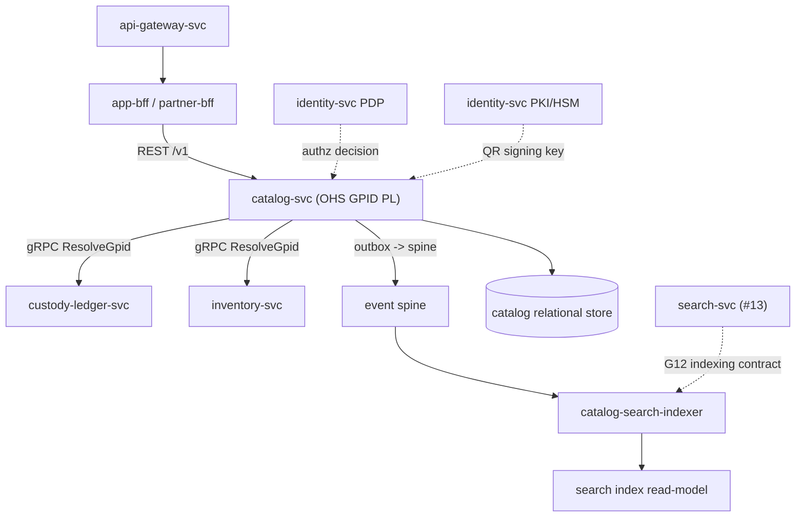

**Trade-off.** Two services + indexer adds operational surface versus a monolith. Accepted because search load (B2C discovery spikes) must scale independently from GPID writes, and an indexer crash must never block GPID allocation. **Rejected alternative:** embedding search in `catalog-svc` — rejected because index rebuilds and reindex storms would contend with the OHS hot path and violate the projection-lag SLO isolation.

---

### 5.3 Write Models / Aggregates and Invariants

| Aggregate | Boundary | Key invariants | Trace |
|---|---|---|---|
| **Product** | Root keyed by GPID (GTIN-14 or `DPN-<cat>-<seq>`). Holds canonical attributes, lifecycle state, category ref. | GPID unique & immutable once `ACTIVE`; GTIN-14 check-digit valid; merge target must be `ACTIVE`; lifecycle transitions follow allowed state machine only. | FR-PRD-001..026; R7; ADR-008 |
| **Category** | Root keyed by category code; tree of category nodes. | Acyclic taxonomy; a Product's category must resolve to an existing leaf; category retirement requires zero `ACTIVE` products. | FR-PRD-001..026 |
| **BatchIdentity** | Entity owned under Product; keyed `(GPID, batchNo)`. Declares a manufacturer/origin batch eligible to seed a Passport. | Batch unique per GPID; batch references an `ACTIVE` GPID; Catalog asserts *identity* only — never quantity, never custody. | FR-PRD; R1 (Custody is sole provenance writer) |

**Design rationale.** Each aggregate is a consistency boundary with its own transactional write. GPID immutability is the cornerstone invariant: because PPID = `PP-<GPID>-<originDID>-<YYYYMMDD>-<seq>` (Custody #3) and Inventory keys projections on GPID, a mutable GPID would corrupt every downstream PL consumer. **BatchIdentity deliberately carries no stock or custody data** — it is the catalog-side *identity declaration* that Custody later turns into a Passport; this enforces R1 (Custody is sole writer of provenance truth) at the model level.

**Trade-off.** Splitting "batch identity" (Catalog) from "batch custody" (Custody) and "batch stock" (Inventory) triples the places "batch" appears. Accepted to preserve single-writer ownership per R1/ADR-002. **Rejected alternative:** a fat Product aggregate that also tracked stock or provenance — rejected as a direct R1/R6 violation (a context reaching into another's truth).

---

### 5.4 Read Models / Projections

| Read model | Built by | Purpose | Consumers |
|---|---|---|---|
| **Catalog search index** | `catalog-search-indexer` | Full-text + facet discovery over GPID/Product/Category. | B2C/B2B local search read-models (fed via search-svc, G12) |
| **GPID resolution cache** | `catalog-svc` (read replica + edge cache) | Low-latency canonical GPID lookup for OHS gRPC. | Custody, Inventory, Logistics, Markets |
| **Category tree snapshot** | `catalog-svc` | Materialized taxonomy for navigation. | B2C/B2B BFFs |

Per the CQRS convention, all three are projections; the **write truth is `catalog-svc`'s relational store**. G12 boundary: `search-svc` (#13) provides the cross-context indexing/query fabric; `catalog-search-indexer` feeds it and Catalog/B2C keep **local search read-models**, avoiding a single global search monolith that would couple discovery to Catalog availability.

---

### 5.5 REST Endpoints and Internal gRPC OHS Contracts

External REST under `/v1` via gateway + BFFs; envelope `{success,data,error,meta}`, cursor pagination, problem+json errors, `Idempotency-Key` on unsafe writes.

| Method & Route | Purpose | Auth (PDP) |
|---|---|---|
| `POST /v1/catalog/products` | Allocate GPID / register product (idempotent). | `catalog:write` |
| `GET /v1/catalog/products/{gpid}` | Resolve canonical product. | `catalog:read` |
| `PATCH /v1/catalog/products/{gpid}/lifecycle` | Advance lifecycle state (four-eyes for retire/merge-class). | `catalog:lifecycle` |
| `POST /v1/catalog/products/{gpid}/merge` | Merge duplicate GPID into target. | `catalog:merge` |
| `POST /v1/catalog/products/{gpid}/batches` | Declare BatchIdentity. | `catalog:write` |
| `POST /v1/catalog/products/{gpid}/qr` | Issue signed catalog QR. | `catalog:qr` |
| `GET /v1/catalog/search` | Discovery query (read-model). | `catalog:read` |
| `GET /v1/catalog/categories` | Category tree. | `catalog:read` |

**Internal OHS gRPC (PL surface):**

| RPC | Signature (logical) | Consumers |
|---|---|---|
| `ResolveGpid` | `gpid -> {canonicalProduct, lifecycleState, asOf}` | Custody, Inventory, Markets, Logistics |
| `BatchResolve` | `[gpid] -> [product]` (bounded fan-in) | Analytics, projection workers |
| `ValidateBatchIdentity` | `(gpid, batchNo) -> {valid, batchRef}` | `custody-ledger-svc` (pre-Passport seed) |

**Design rationale.** External mutation is REST/JSON (mobile-first, USSD/SMS/IVR-friendly via BFFs); internal high-fanout reads are gRPC for the strongly-typed PL contract. `BatchResolve` is bounded and cursor-driven to prevent N+1 from downstream consumers. `asOf` exposes staleness, consistent with G11's staleness-exposure principle.

---

### 5.6 Commands and Queries (CQRS) with Owners

| Type | Name | Owner | Notes |
|---|---|---|---|
| Command | `AllocateGpid` | `catalog-svc` | Idempotent on `Idempotency-Key`; emits `GpidAllocated`. |
| Command | `ChangeGpidLifecycle` | `catalog-svc` | State-machine guarded; emits `GpidLifecycleChanged`. |
| Command | `MergeGpid` | `catalog-svc` | Duplicate resolution; emits `GpidMerged`. |
| Command | `DeclareBatchIdentity` | `catalog-svc` | Validates active GPID. |
| Command | `IssueCatalogQr` | `catalog-svc` | Signs via Identity-issued key (G3); emits `CatalogQrIssued`. |
| Query | `ResolveGpid` / `Search` / `GetCategoryTree` | read models | Served from replicas/index/cache. |

All commands are owned **solely** by `catalog-svc` — no other context may write Catalog state (R6, DB-per-service).

---

### 5.7 Events Produced and Consumed

**Produced** (topic = `<context>.<aggregate>.<EventName>.vN`, PastTense, immutable, canonical IDs only):

| Topic | Trigger | Key |
|---|---|---|
| `catalog.product.GpidAllocated.v1` | New GPID allocated | GPID |
| `catalog.product.GpidLifecycleChanged.v1` | Lifecycle transition | GPID |
| `catalog.product.GpidMerged.v1` | Duplicate merge | GPID (target) |
| `catalog.product.CatalogQrIssued.v1` | QR signed/issued | GPID |

**Consumed** (Catalog is far upstream, so it consumes little — KISS):

| Topic | From | Why |
|---|---|---|
| `identity.party.KycTierChanged.v1` | Identity #1 | Gate which principals may allocate/merge GPID (ABAC inputs). |
| `identity.actor.SessionRevoked.v1` | Identity #1 | Invalidate in-flight authoring sessions. |
| `b2c.*` / `b2b.* ReputationSignal` (advisory) | Markets #6/#7 | Optional ranking signal into search read-model only; never mutates Product truth. |

**Design rationale.** Catalog publishes the GPID PL and consumes only identity/authorization signals plus advisory ranking. It deliberately does **not** consume custody, inventory, or finance events — consuming downstream truth would invert the master-data dependency and violate R7. Per-aggregate-key ordering is on **GPID**.

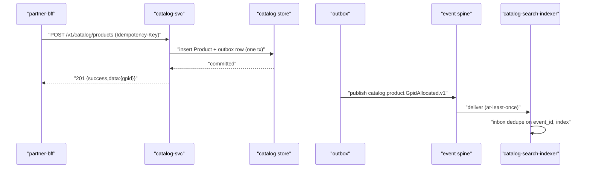

---

### 5.8 Database and Schema Ownership

`catalog-svc` (Go) owns a **relational store** (Product, Category, BatchIdentity, outbox, lifecycle audit) **plus a search index** read-model maintained by `catalog-search-indexer`. Strict DB-per-service: no other context reads these tables; cross-context access is only via REST, gRPC OHS, or the published events (R6). Catalog shares **no** database with Finance (R2, trivially satisfied — separate context) or any other context.

| Store | Owner | Access |
|---|---|---|
| Catalog relational (write truth) | `catalog-svc` | Only `catalog-svc` |
| Search index | `catalog-search-indexer` | Write by indexer; read via `search` query |
| Edge/replica GPID cache | `catalog-svc` | Read-through; invalidated on lifecycle/merge events |

---

### 5.9 Sagas Participated In

Catalog holds no money or custody, so it **orchestrates no sagas**. It participates as an **upstream identity provider** in choreographed flows:

| Saga | Catalog role |
|---|---|
| Order-to-fulfilment (choreographed) | Provides `ResolveGpid` validation at listing/cart time; no compensation needed (read-only participation). |
| Custody Passport seeding | `ValidateBatchIdentity` is a precondition step for `custody-ledger-svc`; Catalog never writes custody (R1). |
| GPID merge propagation | Emits `GpidMerged`; downstream consumers (Inventory, Markets read-models) reconcile via their own projections — eventual, no distributed ACID (G10/R6). |

**Rejected alternative:** a distributed transaction binding GPID merge across Inventory/Markets — rejected per R2/R6/G10; merge is realized as a choreographed, compensatable projection update.

---

### 5.10 ACL / OHS Boundaries

- **OHS (downstream-facing):** `catalog-svc` publishes the GPID Published Language via gRPC + events. This is the stable, versioned contract every consumer conforms to.
- **ACL (upstream-facing):** identity/authorization signals are consumed through an anti-corruption translation into Catalog's own ABAC inputs; Markets reputation signals are translated into ranking features only.
- **Conformist consumers:** B2C/B2B treat GPID PL as-is. Custody is Customer-Supplier on `ValidateBatchIdentity`.

This honors the master-data OHS mandate (R7/ADR-008) while shielding Catalog from upstream model drift.

---

### 5.11 Idempotency, Outbox, Inbox, DLQ

| Mechanism | Catalog specifics |
|---|---|
| **Idempotency-Key** | Required on `POST products`, `merge`, `qr`, batch declare; dedupe table keyed `(key, route)` returns prior result on retry. |
| **Outbox** | State + event written in one relational tx; relay publishes to spine (atomic publish). |
| **Inbox** | `catalog-search-indexer` and `catalog-svc` consumers dedupe on `event_id` (effectively-once). |
| **DLQ** | Per-topic DLQ with reason + replay; invalid GPID/lifecycle events are **quarantined, never silently dropped**. |
| **Retry** | Exponential backoff + jitter, capped, before DLQ. |

---

### 5.12 Scaling and Resilience

| Concern | Approach |
|---|---|
| Read fan-out (`ResolveGpid`) | Read replicas + edge cache; HPA on gRPC QPS; cache invalidation on lifecycle/merge. |
| Discovery spikes | `catalog-search-indexer` scaled via KEDA on consumer lag; isolated from write path. |
| Boundary protection | Circuit breakers, bulkheads, timeouts, rate-limits at gateway and gRPC. |
| Availability | Multi-region multi-AZ + DR, sovereign in-country; durable Kafka-class spine. |
| Projection SLO | Search/GPID-cache lag ≤60s; `asOf` exposed for staleness (G11 principle). |
| Observability | Metrics + structured logs + OpenTelemetry traces; QR-resolve-on-2G tracked per the offline-first NFR. |

---

### 5.13 Security Responsibilities

- **AuthZ:** deny-by-default; all writes authorized by the **Identity PDP** (RBAC+ABAC), server-side. Catalog never makes local allow decisions.
- **QR signing (G3):** `IssueCatalogQr` signs with **Identity-issued per-DID keys**; signing keys in **HSM**, secrets in **KMS**. Catalog owns no CA.
- **Integrity:** GPID immutability + lifecycle state machine prevent silent identity rewrites; merge is audited and append-logged to the audit OHS sink (#13, R6).
- **Transport:** mTLS service-to-service via internal PKI; OAuth2/OIDC short-lived JWT at the gateway carrying DID/roles/tier/deviceId.
- **Input validation:** GTIN-14 check-digit, taxonomy validity, batch uniqueness validated at the boundary; untrusted external attributes sanitized before indexing (XSS-safe search).

---

### 5.14 Traceability

| Decision | Trace |
|---|---|
| Catalog assigned to Substrate team | **G1**; ADR-008; R7 (SA ownership decision, not frozen-doc change) |
| Two services + indexer only | §"13 contexts" #2 service list; ADR-011 (Go runtime) |
| GPID as OHS Published Language | R7; ADR-008; ADR-010 (versioned PL) |
| GPID immutability enabling PPID derivation | ADR-002; identifier spec PPID/GPID |
| BatchIdentity carries no custody/stock | R1; ADR-002 (Custody sole writer) |
| `ValidateBatchIdentity` for Passport seed | R1; FR-PASS-000..027 (consumer) |
| CQRS write/search split | §SA CQRS/ES convention; #2 `catalog-search-indexer` |
| Produced events `GpidAllocated/LifecycleChanged/Merged/QrIssued` | #2 produces list; ADR-010; event conventions |
| QR signing via Identity keys/HSM | **G3**; §security standards |
| AuthZ via Identity PDP | §"5"-equivalent FR-ROL (G8); R7 |
| search-svc indexing boundary | **G12**; #13 |
| Merge propagation as choreographed saga | **G10**; R2; R6 |
| FRs implemented | FR-PRD-001..026 |
| Outbox/inbox/DLQ/idempotency | §SA reliability standards |
| Multi-region sovereign deployment | §SA deployment standards; ADR-012 |

---

## 6. Custody & Provenance Ledger — Service Architecture

### 6.1 Purpose & Scope

Context #3 (Custody & Provenance Ledger) is the **Core** of DOKANDAR and the **sole writer of provenance truth** (R1, ADR-002). It owns the authoritative, append-only, hash-chained record of every custody event for every batch Passport, keyed by PPID. All other contexts — Inventory (#5), Provenance Graph (#4), Finance (#8), Logistics (#9) — are downstream projections or consumers; none may write custody. This chapter specifies the write-side decomposition only; the CQRS read side (graph, recall scope) lives in #4.

**Design rationale.** Provenance is the single fact from which national stock, settlement quality-adjustment, recall freeze, and anti-counterfeiting all derive. Concentrating *write* authority in one event-sourced service eliminates split-brain over custody, satisfies R1, and gives every downstream a tamper-evident source of truth.

**Traceability:** ADR-001 (13 contexts), ADR-002 (Passport fission into write/OLTP Ledger + read/OLAP Graph), R1 (sole writer), FR-PASS-000..027 (write side).

### 6.2 Service Decomposition

Per the naming convention, the context decomposes into one OLTP writer plus suffixed workers — no extra services (KISS, YAGNI).

| Service / worker | Runtime | One-line responsibility |
|---|---|---|
| `custody-ledger-svc` | Go | SOLE custody writer; validates, signs, appends PassportEvents to the hash-chained event store; serves point/by-PPID reads and gRPC OHS commands. |
| `custody-outbox-relay` | Go | Drains the transactional outbox and publishes `custody.*` events to the Kafka-class spine (effectively-once). |
| `custody-recall-applier` | Go | Consumes `RecallScopeComputed.v1` from #4 and applies per-batch `RecallEventAppended`/`RECALLED` custody writes via `custody-ledger-svc` (G11 strong per-batch freeze). |
| `custody-snapshot-workers` | Go | Periodically materializes aggregate snapshots to bound replay cost (no business writes). |

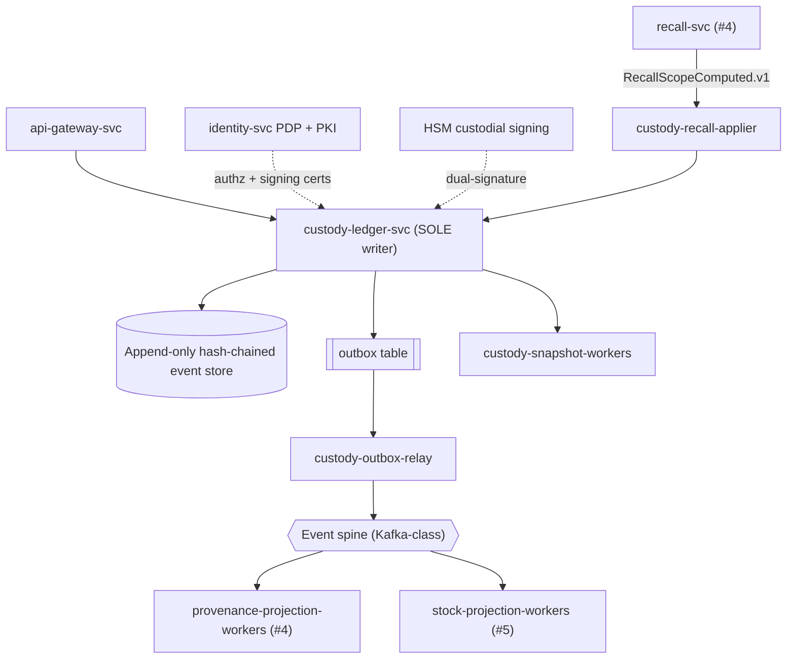

**Why alternatives rejected.** A separate "transfer-svc" or "recall-svc" writer was rejected — it would create a second custody writer and violate R1/ADR-002. Recall *scope computation* stays in #4 (graph traversal is a read concern); only its *application* as custody facts returns here, preserving the single-writer invariant while honoring G11.

### 6.3 Write Models / Aggregates & Invariants

The consistency boundary is the **Passport** (one per batch identity), an event-sourced aggregate reconstituted from its ordered `PassportEvent` stream.

| Aggregate | Key | Invariants (traced) |
|---|---|---|
| **Passport** (event-sourced) | PPID = `PP-<GPID>-<originDID>-<YYYYMMDD>-<seq>` | Events strictly ordered & gap-free per PPID; hash-chain `prev_hash` links each event (FR-PASS-002..006); custody quantity conserved across SPLIT/MERGE/TRANSFORM (sum-out = sum-in); no append after `RECALLED`/`QUARANTINED` terminal unless reversal event; origin DID immutable. |
| **PassportEvent** | (PPID, sequence_no) | Immutable once appended (append-only ES); carries dual signatures (custodian + counterparty) for transfers (FR-PASS-010..014); canonical IDs only (DID/GPID/PPID); monotonic `sequence_no`; `event_hash = H(prev_hash, payload)`. |

**Design rationale & trade-offs.** Per-PPID ordering (not global ordering) maximizes write parallelism across millions of batches while keeping each Passport linearizable. Quantity-conservation on SPLIT/MERGE/TRANSFORM is enforced server-side at append time (strong consistency for custody, per the consistency rule). Trade-off: cross-PPID aggregate operations (a MERGE) require a small multi-stream transaction guarded by optimistic concurrency on each source PPID's expected `sequence_no` — accepted because merges are comparatively rare and correctness of provenance outweighs raw throughput.

**Traceability:** R1, ADR-002, FR-PASS-000..027, consistency rule (strong for custody).

### 6.4 Read Models / Projections

`custody-ledger-svc` keeps only the **minimal local read model** needed to serve its own writes and point reads:

| Local read model | Purpose |
|---|---|
| `passport_head` | Latest `sequence_no`, `head_hash`, custody state, current custodian DID per PPID — for optimistic-concurrency checks and O(1) "current custody" reads. |
| `passport_snapshot` | Periodic materialized aggregate state to bound replay (built by `custody-snapshot-workers`). |

All **rich** read models — provenance graph traversal, recall blast-radius, clone detection, asOf staleness — are owned by **#4 Provenance Graph** (CQRS read side, PPID Published Language) and fed exclusively via the event spine. Custody publishes; it never queries #4. This is the ADR-002 separation made concrete.

### 6.5 REST Endpoints & gRPC OHS Contracts

External access is REST/JSON under `/v1` via the gateway/BFFs; cross-context callers use internal gRPC OHS. `Idempotency-Key` is **mandatory** on every custody write.

| Method & route | Description | Idempotency |
|---|---|---|
| `POST /v1/passports` | Originate a Passport (first custody event) | required |
| `POST /v1/passports/{ppid}/transfers` | Dual-signed CustodyTransferred (SPLIT/MERGE/TRANSFORM) | required |
| `GET /v1/passports/{ppid}` | Current custody head + state | safe |
| `GET /v1/passports/{ppid}/events` | Append-only event stream (cursor paginated) | safe |
| `POST /v1/passports/{ppid}/quarantine` | BatchQuarantined (four-eyes upstream) | required |
| `GET /v1/passports/{ppid}/verify` | Hash-chain integrity proof for a Passport | safe |

Responses use the canonical envelope `{success,data,error,meta}`; errors follow problem+json with stable codes (e.g. `custody/sequence-conflict`, `custody/signature-invalid`, `custody/quantity-violation`).

**Internal gRPC OHS (`custody.v1`):**

| RPC | Consumers | Notes |
|---|---|---|
| `AppendCustodyEvent` | internal adapters | idempotent (event_id), expected-sequence guarded |
| `GetPassportHead` | b2c-order-svc (#6 provenance display), finance-ledger-svc | read-only OHS |
| `VerifyChain` | audit-log-svc (#13), oversight-read-svc (#11) | integrity attestation |
| `ApplyRecallScope` | called by `custody-recall-applier` from #4's `RecallScopeComputed` | strong per-batch freeze (G11) |

### 6.6 Commands & Queries (CQRS)

| Type | Name | Owner | Result |
|---|---|---|---|
| Command | `OriginatePassport` | custody-ledger-svc | PassportEventAppended (ORIGIN) |
| Command | `TransferCustody{SPLIT\|MERGE\|TRANSFORM}` | custody-ledger-svc | CustodyTransferred |
| Command | `QuarantineBatch` | custody-ledger-svc | BatchQuarantined |
| Command | `ApplyRecall` | custody-ledger-svc (via recall-applier) | RecallEventAppended (RECALLED) |
| Query | `GetPassportHead` / `GetEventStream` / `VerifyChain` | custody-ledger-svc (local read model) | head / stream / proof |

Commands are the **only** mutators; all rich queries are delegated to #4. This crisp split is the ADR-002 CQRS contract.

### 6.7 Events Produced & Consumed

Topics follow `<context>.<aggregate>.<EventName>.vN`, immutable, past-tense, PPID-keyed for ordering.

**Produced (Published Language):**

| Topic | Trigger / payload (canonical IDs) | Primary consumers |
|---|---|---|
| `custody.passport.PassportEventAppended.v1` | every appended event (PPID, seq, hash) | #4, #13 audit |
| `custody.passport.CustodyTransferred.v1` | SPLIT/MERGE/TRANSFORM with `transferType`, from/to DID, quantities | #5 Inventory, #8 Finance (quality-adjusted settlement), #4 |
| `custody.passport.RecallEventAppended.v1` | per-batch RECALLED applied | #8 Finance (clawback), #5, #9, #4 |
| `custody.passport.BatchQuarantined.v1` | batch frozen | #5, #9, #11 |

**Consumed:**

| Topic | Source context | Use |
|---|---|---|
| `provenance.recall.RecallScopeComputed.v1` | #4 Provenance Graph | drives per-batch `ApplyRecall` writes (G11) |
| `identity.party.DidCanonicalized.v1` | #1 Identity | validate custodian/counterparty DID + signing certs |
| `catalog.product.GpidAllocated.v1` | #2 Catalog | validate GPID embedded in PPID at origination |

**Design rationale.** Custody emits the *facts*; Inventory and Finance *react* (projection / saga). Recall is the one inbound write-driver, and it arrives as a computed *scope* — never a direct write — so #4 never bypasses the single writer.

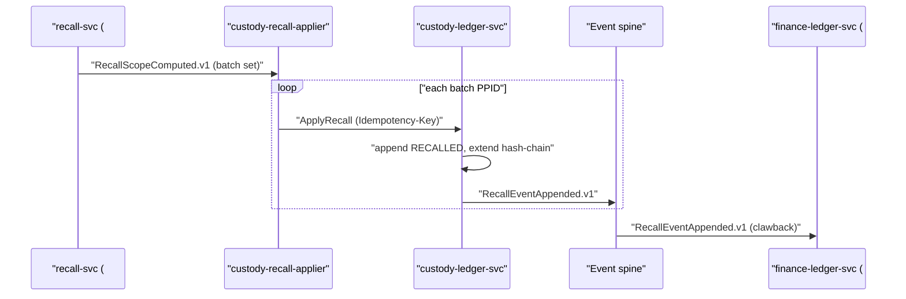

### 6.8 Database & Schema Ownership

`custody-ledger-svc` exclusively owns an **append-only, hash-chained event store** (Go runtime). No cross-service DB access (R6); Finance shares nothing (R2, N/A here as separate context). Core tables:

| Table | Shape |
|---|---|
| `passport_event` | (ppid, sequence_no PK, event_type, payload, prev_hash, event_hash, custodian_sig, counterparty_sig, event_id UNIQUE, occurred_at) — INSERT-only, no UPDATE/DELETE grant |
| `passport_head` | (ppid PK, last_sequence, head_hash, state, current_custodian_did) |
| `outbox` | (event_id, topic, partition_key=ppid, payload, published_at) |
| `inbox` | (event_id PK, consumer, processed_at) |

Append-only is enforced at three layers: DB privileges (no UPDATE/DELETE), application invariants, and the hash-chain that makes any tamper detectable via `VerifyChain`.

### 6.9 Sagas Participated In

Custody participates in **choreographed** sagas (no distributed ACID — R2/R6/G10); it never orchestrates money.

| Saga | Role of custody | Compensation |
|---|---|---|
| Order-to-fulfilment (choreographed) | emits `CustodyTransferred` on POD-driven custody change consumed by #5/#8 | none locally; downstream reverses |
| **Escrow compensating-reversal** (orchestrated by `escrow-svc`, ADR-005/R3) | provides `CustodyTransferred` as quality/settlement input; recall feeds clawback | Finance reverses escrow; custody is append-only — corrections are *new* reversal events, never edits |
| Recall propagation (choreographed, G11) | applies strong per-batch RECALLED, emits fan-out | eventual graph scope-out ≥95% in #4 |

**Trade-off.** Because the ledger is append-only, "compensation" is always a forward correcting event, preserving full audit history — chosen over in-place rollback to keep the chain immutable.

### 6.10 Idempotency, Outbox, Inbox & DLQ

- **Outbox:** state append + event row committed in one local transaction; `custody-outbox-relay` publishes — atomic state+event (reliability std a).
- **Inbox:** `RecallScopeComputed` / identity / catalog events deduped on `event_id` (std b); effectively-once via at-least-once + idempotent apply.
- **Idempotency-Key:** required on all writes; mapped to deterministic `event_id`, so retries of `TransferCustody`/`ApplyRecall` collapse to one append.
- **DLQ:** per-topic dead-letter with reason + replay (std c); **invalid custody events are quarantined, never silently dropped** — a malformed transfer raises `BatchQuarantined` review rather than a drop.
- **Retry:** exponential backoff + jitter, capped (std d).
- **Concurrency:** optimistic on `expected_sequence_no`; conflict → `custody/sequence-conflict`, client re-reads head and retries.

### 6.11 Scaling & Resilience

| Concern | Approach |
|---|---|
| Partitioning | shard by PPID hash; per-PPID ordering preserved within a partition; cross-PPID MERGE uses multi-key optimistic txn |
| Throughput | append-only writes scale horizontally; snapshots bound replay cost |
| Autoscaling | HPA/KEDA on append rate and outbox lag |
| Multi-region | sovereign in-country, multi-AZ + DR region; durable Kafka-class spine |
| Boundary protection | circuit breakers, bulkheads, timeouts, rate-limits on gateway + gRPC |
| SLO | custody = strictest tier (money/custody); projection-lag SLO ≤60s tracked downstream in #4/#5; QR-resolve-on-2G tracked |
| Recall SLA (G11) | strong per-batch freeze immediately at #3; eventual graph scope-out ≥95% within achievable window; `asOf` staleness exposed by #4 |

### 6.12 Security Responsibilities

- **Dual-signature custody transfer:** custodian + counterparty signatures verified before append (FR-PASS-010..014).
- **HSM custodial signing:** custodial signing for low-tech actors uses **Identity-issued per-DID keys**; signing keys in HSM (G3 — Identity owns the CA/CRL; custody consumes).
- **Authorization:** deny-by-default RBAC+ABAC enforced server-side by Identity PDP; short-lived JWT (DID/roles/tier/deviceId) at gateway; mTLS service-to-service via internal PKI.
- **Tamper-evidence:** hash-chain + `VerifyChain` proofs streamed to audit-log-svc (#13) append-only OHS sink (R6).
- **PII:** custody carries canonical IDs only — no PII at rest in the event store.

### 6.13 Traceability

| Decision | ADR / Rule | FR / § / context |
|---|---|---|
| Sole custody writer; single aggregate boundary | R1, ADR-002 | FR-PASS-000..027 |
| Event-sourced, append-only hash chain | ADR-002 | FR-PASS-002..006 |
| CQRS: write here, read in #4 (PPID PL) | ADR-002, R6 | §#3/#4 |
| Dual-signature transfers + HSM custodial signing | Security std, G3 | FR-PASS-010..014 |
| Recall: scope in #4 → strong per-batch freeze here | R1, G11 | FR-PASS recall, #4 RecallScopeComputed |
| Quarantine invalid custody events, never drop | Reliability std (e) | §reliability |
| Outbox/inbox/DLQ effectively-once | Reliability std a–e | §reliability |
| Choreographed sagas, append-only compensation | R2/R6, ADR-005, G10 | FR-PASS, #8 escrow |
| Versioned PL topics `custody.passport.*.vN` | ADR-010, R6, G7 | §event conventions, Ch.17 |
| Identity PDP authz + DID/GPID validation | ADR-008, R7 | #1, #2 |

---

## 7. Provenance Graph & Recall — Service Architecture

### 7.1 Purpose & Context

Provenance Graph & Recall is bounded context **#4 [Core]**, owned by the **Provenance Core** team, runtime **Go**. It is the **CQRS read side of Custody** (#3): it materializes the append-only, hash-chained custody event stream into a queryable **Graph DB read model** keyed on **PPID** (the Provenance Published Language per ADR-002). Its mandate is **detect-and-flag only** — it computes recall blast-radius, detects clones, and serves provenance queries, but it **never writes custody truth** (R1; ADR-002). Custody (#3) remains the sole writer; this context drives custody's recall fan-out by emitting `RecallScopeComputed`, which `custody-ledger-svc` consumes to append the authoritative `RECALLED` events.

**Design rationale.** Recall graph traversal (transitive SPLIT/MERGE/TRANSFORM closure) and clone-detection analytics are read-heavy OLAP workloads with fundamentally different access patterns and storage engines than the per-PPID OLTP write store. Co-locating them in #3 would couple write-path latency (custody transfer is on the money/custody critical path) to graph fan-out cost. Fissioning into a CQRS read model isolates these failure and scaling domains (ADR-002).

**Traceability:** ADR-001 (13 contexts), ADR-002 (Passport fission, PPID PL), R1 (Custody sole writer), R6 (no cross-store reach-in), FR-PASS recall/anti-counterfeit, FR-SCM-001..012 (graph/read).

### 7.2 Service Decomposition

| Service / Worker | Responsibility (one line) | Runtime |
|---|---|---|
| `recall-svc` | Owns `RecallCase`; computes transitive recall scope and emits `RecallScopeComputed`; serves recall + provenance query APIs. | Go |
| `provenance-projection-workers` | Consume custody events, idempotently project the graph read model, emit `ProvenanceProjected`. | Go |
| `clone-detection-workers` (suffixed worker of `recall-svc`) | Ingest consumer `ScanObservation`s, run impossible-travel / duplicate-PPID heuristics, emit `CloneSuspected`. | Go |
| `scan-ingest-gateway` (suffixed edge worker) | High-fanout, rate-limited intake of consumer QR scans on 2G; writes to the scan store via outbox. | Go |

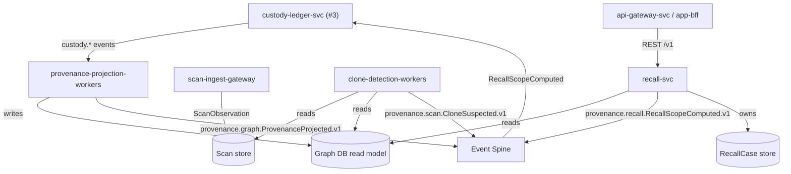

**Why alternatives were rejected.** A single monolithic `provenance-svc` was rejected because scan ingestion (untrusted, bursty, nation-scale) and recall computation (trusted, regulated, four-eyes-adjacent) have incompatible security and scaling profiles; isolating ingest behind `scan-ingest-gateway` prevents a scan flood from starving recall traversal. Folding clone detection into projection workers was rejected because projection must stay strictly ordered and cheap; ML/heuristic scoring is best-effort and independently scalable.

### 7.3 Write Models / Aggregates & Invariants

Although this context is a read side of Custody, it owns three **local** aggregates whose state it does write (its own projections and analytical stores — never custody).

| Aggregate | Boundary | Key Invariants | Trace |
|---|---|---|---|
| `ProvenanceGraph` / `Edge` | One node per PPID; directed edges typed SPLIT/MERGE/TRANSFORM/RECALLED. | Edges are **append-only projections** of custody events; an edge MAY exist only if a corresponding `CustodyTransferred` was projected; no edge is created without an upstream custody event (R1). DAG within a batch lineage; cycles quarantined. | ADR-002, R1, FR-SCM-001..012 |
| `RecallCase` | Aggregate root = `CON-<seq>`; holds scope set, `asOf` watermark, status (OPENED→SCOPING→SCOPED→PROPAGATED→CLOSED). | Scope is **monotonic** (PPIDs only added during an open case); a case transitions to PROPAGATED only after `RecallScopeComputed` is published; recall-svc **never** sets custody state. | ADR-002, R3, FR-PASS recall, G11 |
| `ScanObservation` | Append-only per `(PPID, scanTs, geo, deviceId)`; clone-detection store. | Immutable once written; duplicate `(PPID, geo, time-window)` beyond physical plausibility raises `CloneSuspected`; observations are evidence, never custody. | FR-PASS anti-counterfeit, FR-SCM-013-adjacent, G6 |

**G6 honored:** `ScanObservation` lives here (not in Identity or Custody).

### 7.4 Read Models / Projections

| Read Model | Source | Consumers | Lag SLO |
|---|---|---|---|
| Provenance lineage graph (PPID → ancestry/descendants) | custody.* events | B2C provenance display, Government oversight, Analytics | ≤60s |
| Recall blast-radius view (PPID set per `RecallCase`, with `asOf`) | graph + RecallCase | Custody (fan-out), Finance (clawback), Logistics | strong-at-#3 / eventual ≥95% (G11) |
| Clone-suspicion view (PPID risk of cloning) | scan store + graph | Fraud (#10) read, consumer app warning | best-effort |
| QR-resolve view (GPID/PPID → authenticity + origin DID) | graph | consumer scan-on-2G | ≤60s; 2G-tracked |

### 7.5 REST Endpoints & Internal gRPC OHS Contracts

External REST under `/v1` via `api-gateway-svc` + BFFs; envelope `{success,data,error,meta}`; cursor pagination; problem+json errors.

| Method & Path | Purpose | Notes |
|---|---|---|
| `GET /v1/provenance/{ppid}` | Full lineage for a PPID. | Returns `asOf` staleness (G11). |
| `GET /v1/provenance/{ppid}/ancestry` | Transitive origin chain. | Cursor-paginated. |
| `GET /v1/qr/resolve?code=` | Authenticity + origin for a scanned QR. | 2G-optimized, cacheable. |
| `POST /v1/scans` | Ingest a consumer scan observation. | Idempotency-Key required; rate-limited. |
| `POST /v1/recalls` | Open a recall case (regulator/manufacturer, four-eyes upstream). | Idempotency-Key; writes `RecallCase`, not custody. |
| `GET /v1/recalls/{conId}` | Recall case status + scope + `asOf`. | — |
| `GET /v1/recalls/{conId}/scope` | Materialized blast-radius PPID set. | Cursor-paginated. |

**Internal gRPC OHS (cross-context):**

| RPC | Caller | Semantics |
|---|---|---|
| `ProvenanceQuery.GetLineage(ppid)` | Finance (#8) quality-adjusted settlement, Logistics (#9) | Read-only; deny-by-default ABAC. |
| `RecallQuery.GetScope(conId, asOf)` | Custody (#3), Finance (#8) clawback | Returns scope + watermark; idempotent. |
| `CloneRiskQuery.Score(ppid)` | Fraud (#10) | Read-only clone-suspicion signal. |

### 7.6 Commands & Queries (CQRS)

| Type | Name | Owner | Notes |
|---|---|---|---|
| Command | `OpenRecallCase` | `recall-svc` | Creates `RecallCase`; triggers scoping. |
| Command | `ComputeRecallScope` | `recall-svc` | Graph traversal job; emits `RecallScopeComputed`. |
| Command | `IngestScanObservation` | `clone-detection-workers` | Idempotent append to scan store. |
| Command | `ProjectCustodyEvent` | `provenance-projection-workers` | Idempotent graph upsert. |
| Query | `GetLineage` / `GetAncestry` | `recall-svc` (read API) | Graph DB reads. |
| Query | `ResolveQr` | `recall-svc` | Authenticity check. |
| Query | `GetRecallScope` | `recall-svc` | With `asOf`. |

### 7.7 Events Produced & Consumed

**Produced** (topic = `<context>.<aggregate>.<EventName>.vN`, PastTense, immutable, canonical IDs only):

| Topic | Trigger | Key Consumers |
|---|---|---|
| `provenance.recall.RecallScopeComputed.v1` | Scope traversal completes | Custody #3 (RECALLED fan-out), Finance #8 (clawback), Logistics #9 |
| `provenance.scan.CloneSuspected.v1` | Clone heuristic fires | Fraud #10, Government #11, consumer app |
| `provenance.graph.ProvenanceProjected.v1` | Graph projection committed | Analytics #12, oversight read models |

**Consumed:**

| Topic | From | Use |
|---|---|---|
| `custody.passport.PassportEventAppended.v1` | Custody #3 | Project node/edge state. |
| `custody.passport.CustodyTransferred.v1` (SPLIT/MERGE/TRANSFORM) | Custody #3 | Build lineage edges. |
| `custody.passport.RecallEventAppended.v1` | Custody #3 | Close the recall loop; mark RECALLED edges. |
| `custody.passport.BatchQuarantined.v1` | Custody #3 | Flag affected lineage subgraph. |

**Loop integrity:** `recall-svc` emits `RecallScopeComputed` → Custody appends `RECALLED` and emits `RecallEventAppended` → projection workers mark the graph. The graph never short-circuits custody (R1).

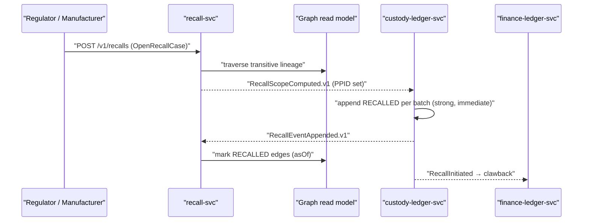

### 7.8 Database & Schema Ownership

- **Graph DB** (e.g., a Go-driven property-graph engine) holds the lineage read model — **DB-per-service**, owned exclusively by `provenance-projection-workers` (writer) and `recall-svc` (reader within the same context boundary).
- **Relational/columnar scan store** holds `ScanObservation` and clone-detection features.
- **RecallCase store** (relational) owned by `recall-svc`.
- **No cross-service DB access** (R6). Other contexts reach this data only via REST/gRPC OHS or the event spine. This context reads Custody **only** via projected events — never by querying #3's event store (R6, ADR-002).

### 7.9 Sagas Participated In

| Saga | Style | This context's role |
|---|---|---|
| **Recall propagation** (ADR-005-adjacent, R3) | Choreographed, compensating | Computes scope (`RecallScopeComputed`); Custody freezes (strong, immediate); Finance clawback + Escrow reversal compensate (G10). This context is the **scope computer**, never the money/custody actor. |
| **Escrow compensating-reversal** (ADR-005) | Orchestrated by `escrow-svc` | Supplies recall scope / clone evidence as a trigger input (forged/withdrawn POD, recall). Read participant only. |

**G11 SLA realization:** strong per-batch freeze happens immediately at #3 on receipt of `RecallScopeComputed`; this context guarantees **eventual graph scope-out ≥95% downstream** within the achievable window and exposes `asOf` staleness on every recall/provenance response.

### 7.10 Idempotency, Outbox, Inbox, DLQ

| Mechanism | Implementation |
|---|---|
| **Inbox** | Consumer idempotency keyed on `event_id`; replaying `PassportEventAppended` is a no-op upsert (graph edges keyed by custody event id). |
| **Ordering** | Per-PPID partition key preserves custody causal order; out-of-order events buffered until predecessor projected. |
| **Outbox** | `RecallScopeComputed`, `CloneSuspected`, `ProvenanceProjected` written transactionally with state, then published (effectively-once). |
| **Idempotency-Key** | Required on `POST /v1/recalls` and `POST /v1/scans`. |
| **DLQ** | Per-topic DLQ with reason + replay; **invalid custody events are quarantined, never silently dropped**; cyclic-lineage events routed to a quarantine queue for operator review. |
| **Retry** | Exponential backoff + jitter, capped. |

### 7.11 Scaling & Resilience

| Concern | Approach |
|---|---|
| Scan flood (nation-scale, 2G) | `scan-ingest-gateway` horizontally scaled via KEDA on queue depth; rate-limits + bulkheads isolate ingest from recall traversal. |
| Graph traversal cost | Read replicas of Graph DB; recall scope precomputed and cached per `RecallCase`; bounded-depth + paginated traversal. |
| Projection lag | `provenance-projection-workers` autoscaled on consumer lag; **≤60s lag SLO**, alarmed. |
| Hot recall events | Strong freeze decoupled at #3; graph scope-out is async, ≥95% target with `asOf` transparency (G11). |
| Failure isolation | Projection outage degrades read freshness (stale `asOf`) but never blocks Custody writes (R1) — graceful degradation. |
| Deployment | Containerized on Kubernetes, sovereign in-country multi-region/multi-AZ + DR; HPA/KEDA; circuit breakers, timeouts, retries at every boundary. |
| Observability | Metrics + structured logs + OpenTelemetry traces; projection-lag SLO and QR-resolve-on-2G explicitly tracked. |

### 7.12 Security Responsibilities

- **mTLS** service-to-service via internal PKI; **OAuth2/OIDC** + short-lived JWT at gateway; **RBAC+ABAC** enforced by Identity PDP (deny-by-default) on lineage and recall reads.
- **Recall commands** are sensitive: `OpenRecallCase` initiated by regulator/manufacturer flows through Government **four-eyes** upstream; this context records actor DID and emits to the **append-only audit OHS sink** (#13, R6).
- **Scan ingestion** is untrusted input — strict schema validation, rate-limiting, and anti-spoofing (clone heuristics) before any observation is admitted.
- **No custody mutation capability** exists in this context's code paths — enforced architecturally (R1), so even a compromised `recall-svc` cannot forge provenance truth.
- **PPID-only payloads** in events; no PII leakage in the graph (PII stays field-encrypted in Identity #1).

### 7.13 Traceability

| Decision | Trace |
|---|---|
| CQRS read side of Custody; PPID Published Language | ADR-002, R1, §#4 |
| Detect-and-flag only; never writes custody | R1, ADR-002, context #4 note |
| `RecallScopeComputed` drives Custody RECALLED fan-out | R1, R3, ADR-005, FR-PASS recall |
| `ScanObservation` clone store owned here | G6, FR-PASS anti-counterfeit |
| Graph traversal + supply-chain read FRs | FR-SCM-001..012 |
| DB-per-service, no cross-store reach-in | R6, DB-per-service convention |
| Recall SLA: strong-at-#3 + ≥95% eventual scope-out + `asOf` | G11 |
| Cross-context "atomic" recall realized as choreographed saga w/ compensation | G10, R2, R6 |
| Clone risk consumed by Fraud read | G4-adjacent, R4, context #10 |
| Audit emission to append-only OHS sink | R6, context #13 |
| Outbox/inbox/DLQ/effectively-once | Reliability Standards (a)-(e) |
| Go runtime, Graph DB store | ADR-011, context #4 |

---

## 8. Inventory & National Stock Ledger — Service Architecture

### 8.1 Purpose & Scope

Context #5 is the **strong-local stock authority and national rollup projection** of the platform. It answers two questions with two consistency models: *"Can this exact quantity at this exact location be reserved right now?"* (STRONG, local, transactional) and *"How much of GPID X exists across Bangladesh?"* (EVENTUAL, NIL rollup ≤60s). Per **R1/ADR-003**, Inventory is a **Customer-Supplier projection of Custody (#3)** — it never authors provenance truth; it derives stock state by consuming custody events and owns only its own derived aggregates: the projected on-hand record, the **RESERVED** state, movement audit, and reconciliation cases. Per **G2**, `inventory-svc` exposes a synchronous, strongly-consistent **Reserve/Release** gRPC command that Markets (#6 B2C, #7 B2B) calls at order placement; Inventory writes its own RESERVED state, and **Markets never touches the Inventory DB**.

**Traceability:** R1 (projection), ADR-003 (≤60s lag), §6 prose + BR-022 (reservation sanction), FR-INV-001..042, G2, G11 (asOf staleness).

### 8.2 Service Decomposition

Per the frozen service list and the convention "decompose only by adding suffixed workers," the context runs three deployables, all Go (**ADR-011**).

| Service | One-line responsibility |
|---|---|
| `inventory-svc` | Owns the RESERVED state + atomic **compare-and-reserve** (strong-local OLTP write authority); serves Reserve/Release gRPC and stock queries. |
| `stock-projection-workers` | Consume Custody/Logistics events; project `InventoryRecord` + `StockMovement`; raise `DiscrepancyOpened`. |
| `nil-rollup-svc` | Fold per-location records into the National Inventory Ledger (NIL) read-model; emit hoarding signals; serve national stock queries with `asOf`. |

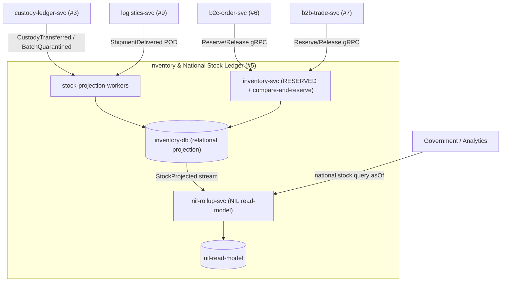

**Design rationale:** the reservation write path is latency- and correctness-critical (it gates checkout) and must stay strong-local, so it is isolated in `inventory-svc` behind its own connection pool and bulkhead. Projection and rollup are throughput-bound, lag-tolerant background work, so they scale independently as KEDA-driven workers. **Rejected alternative:** a single monolith service — rejected because mixing a synchronous low-latency reserve path with high-volume event fan-in causes head-of-line blocking and couples the strictest SLO to the noisiest workload.

### 8.3 Write Models / Aggregates & Invariants

Inventory owns four aggregates. Only **Reservation** and **ReconciliationCase** are user/command-driven writes; **InventoryRecord** and **StockMovement** are projection writes derived from upstream custody truth.

| Aggregate | Boundary | Key invariants | Trace |
|---|---|---|---|
| `InventoryRecord` | One per (GPID, locationDID, batch/PPID-scope) | `available = onHand − reserved − quarantined`; never negative; mutated **only** by projection or by reserve/release | R1, FR-INV-001..014 |
| `Reservation` | RES-`<seq>`; owned root in `inventory-svc` | compare-and-reserve atomic: `reserved += qty` iff `available ≥ qty`; idempotent on Idempotency-Key; auto-expire TTL → release; terminal states {HELD, RELEASED, CONSUMED, EXPIRED} | G2, BR-022, FR-INV-015..028 |
| `StockMovement` | Append-only ledger of deltas | every on-hand change traces to a custody `event_id` (causation); immutable | R1, FR-INV-029..036 |
| `ReconciliationCase` | RCN-`<seq>` | opened on projected-vs-physical drift; STRONG close requires maker-checker; cannot mutate custody | FR-INV-037..042, G10 |

**Invariant enforcement:** the reserve invariant is the only place Inventory holds a STRONG lock. It is a single-row optimistic compare-and-swap (`UPDATE ... WHERE available >= :qty`) inside one local transaction — no distributed lock, honoring **R2/R6** (no cross-context ACID). Projection writes are eventually consistent and may transiently lag custody by ≤60s (**ADR-003**); reservations therefore read the **strong-local** record, never the NIL rollup, exactly as **R1** mandates ("reservation/margin/relief reads hit STRONG LOCAL stock").

### 8.4 Read Models / Projections

| Read model | Source | Consistency | Consumers |
|---|---|---|---|
| `InventoryRecord` (local on-hand/available) | Custody + Logistics events | strong-local for reserve; ≤60s vs custody | inventory-svc, Markets |
| **NIL** national rollup | fold of `StockProjected` | eventual, **NIL ≤60s**, carries `asOf` | Government (#11), Analytics (#12), Fraud (#10) |
| Hoarding/velocity view | NIL deltas over time windows | advisory | Fraud, Government |

Every NIL query response carries an `asOf` timestamp and `lagMs` in `meta` (**G11**: "expose asOf staleness"), so regulators and analytics never mistake an eventual rollup for strong truth.

### 8.5 REST Endpoints & gRPC OHS Contracts

External REST under `/v1` via API Gateway + BFFs; envelope `{success,data,error,meta}`, cursor pagination, problem+json errors.

| Method · Route | Purpose | Notes |
|---|---|---|
| `GET /v1/inventory/records` | Query local on-hand/available by GPID + locationDID | cursor paginated |
| `GET /v1/inventory/records/{gpid}/{locationDID}` | Single strong-local record | — |
| `GET /v1/national-stock/{gpid}` | NIL national rollup | returns `meta.asOf`, `meta.lagMs` |
| `GET /v1/inventory/reservations/{resId}` | Reservation status | — |
| `POST /v1/inventory/reconciliations/{id}:close` | Maker-checker close | four-eyes, Idempotency-Key |
| `GET /v1/inventory/movements` | StockMovement audit feed | — |

**Internal gRPC OHS** (cross-context, mTLS) — the G2 Customer-Supplier contract:

| RPC | Caller | Semantics |
|---|---|---|
| `Reserve(ReserveCmd) → ReservationAck` | b2c-order-svc, b2b-trade-svc | synchronous, **strongly consistent**, idempotent on `idempotencyKey`; compare-and-reserve; returns HELD or `INSUFFICIENT_STOCK` |
| `Release(ReleaseCmd) → Ack` | b2c-order-svc, b2b-trade-svc | idempotent compensating release of an unconsumed hold |
| `Confirm(ConfirmCmd) → Ack` | Markets (on OrderConfirmed) | transitions HELD → CONSUMED |
| `GetLocalStock(query) → StockView` | margining-svc (#7), relief reads | strong-local read per R1 |

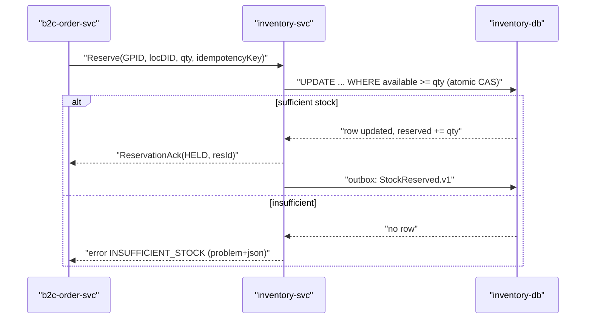

**Why gRPC, not events, for Reserve:** order placement needs a *synchronous yes/no* within the checkout span; an eventual event would let two buyers both "win" the last unit. **Rejected alternative — Markets writes Inventory DB directly:** violates db-per-service (**R6**) and would let Markets author stock state it does not own. **Rejected — Saga-only reservation:** too slow and leaks oversell windows; the strong-local CAS is the canonical resolution of **G2**.

### 8.6 Commands & Queries (CQRS)

| Type | Name | Owner |
|---|---|---|
| Command | `Reserve` / `Release` / `Confirm` (compare-and-reserve) | `inventory-svc` |
| Command | `CloseReconciliation` (four-eyes) | `inventory-svc` |
| Command (internal) | `ProjectStockDelta` | `stock-projection-workers` |
| Command (internal) | `FoldNilRollup` | `nil-rollup-svc` |
| Query | `GetLocalStock` (strong) | `inventory-svc` |
| Query | `GetNationalStock asOf` (eventual) | `nil-rollup-svc` |
| Query | `ListMovements` / `GetReservation` | `inventory-svc` |

### 8.7 Events Produced & Consumed

Topic convention `inventory.<aggregate>.<EventName>.vN`, immutable, PastTense, canonical IDs only, ordered per `(GPID, locationDID)` key.

**Produced**

| Topic | Trigger | Key consumers |
|---|---|---|
| `inventory.record.StockProjected.v1` | projection applied | nil-rollup-svc, Analytics (#12) |
| `inventory.reservation.StockReserved.v1` | Reserve succeeds | Markets, Analytics |
| `inventory.reservation.ReservationReleased.v1` | release/expire | Markets, Analytics |
| `inventory.reconciliation.DiscrepancyOpened.v1` | projected-vs-physical drift | Fraud (#10), Government (#11), Finance audit |
| `inventory.stock.HoardingSignalRaised.v1` | velocity/threshold breach in NIL | Fraud (#10), Government (#11) |

**Consumed**

| Topic | From | Effect |
|---|---|---|
| `custody.passport.CustodyTransferred.v1` (SPLIT/MERGE/TRANSFORM) | Custody #3 | project on-hand deltas (StockMovement) |
| `custody.passport.BatchQuarantined.v1` | Custody #3 | move qty to quarantined; shrink available |
| `custody.passport.RecallEventAppended.v1` | Custody #3 | freeze/relieve affected stock |
| `logistics.shipment.ShipmentDelivered.v1` (POD) | Logistics #9 | inbound on-hand at destination locationDID |

**Critical CANON guard:** Inventory **consumes** custody events and **never** writes custody. POD is a custody event (**#9 Conformist to Custody**); Inventory only projects its *stock* consequence. **HoardingSignalRaised** is a *signal* — Inventory cannot freeze money or actors; enforcement routes Fraud→Finance/Markets under four-eyes (**R4/G5**).

### 8.8 Database & Schema Ownership

`inventory-svc` owns `inventory-db` (relational: `inventory_record`, `reservation`, `stock_movement`, `reconciliation_case`, plus `outbox`, `inbox`). `nil-rollup-svc` owns the separate `nil-read-model` store (denormalized national aggregates with `as_of`). `stock-projection-workers` write only through `inventory-svc`'s schema via the owning service boundary — they are co-deployed workers of the same bounded context, not a foreign context. **No other context reads these tables (R6);** cross-context access is exclusively gRPC OHS + events. Finance shares nothing (**R2**) and learns of stock only via the spine.

### 8.9 Sagas Participated In

| Saga | Inventory role | Compensation |
|---|---|---|
| **Order-to-fulfilment** (choreographed) | Reserve (HELD) at placement → Confirm (CONSUMED) on `OrderConfirmed` | `ReservationReleased` on `OrderCancelled`/TTL expiry |
| **Recall propagation** (choreographed, G11) | On `RecallEventAppended`, freeze affected local stock immediately; relieve on resolution | re-project available on recall clearance |
| **Escrow saga** (orchestrated by escrow-svc, ADR-005) | Indirect participant: stock-consumption confirmation informs settlement readiness; Inventory itself moves no money | reservation release feeds order cancel |

Per **G10**, all "atomic" cross-context wording is realized as orchestrated/choreographed sagas with compensation — Inventory holds only **local** ACID (the CAS), never distributed locks.

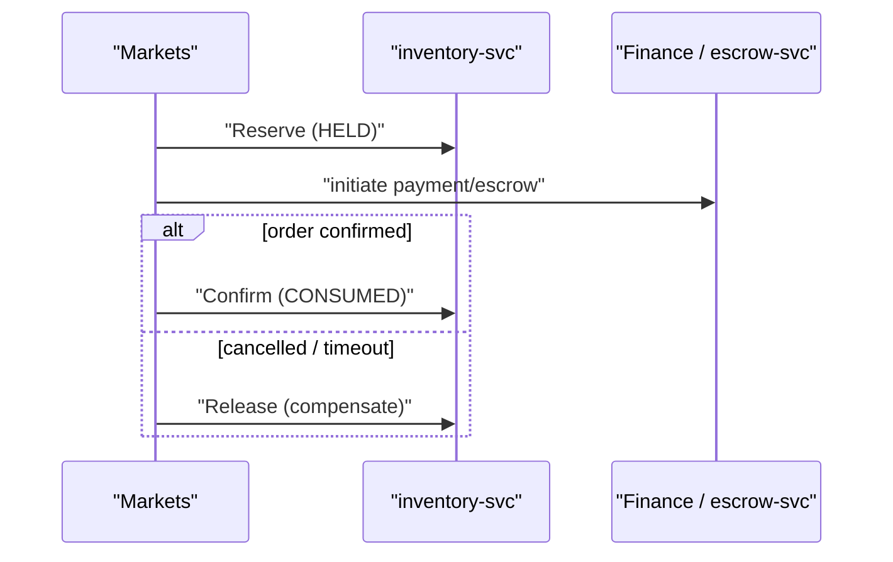

### 8.10 ACL / OHS Boundaries

- **Upstream (Supplier→Customer):** Custody #3 is the supplier; Inventory's `stock-projection-workers` embed an **Anti-Corruption Layer** translating custody PPID semantics into local stock deltas. Inventory conforms to custody's model, never the reverse (**R1**).
- **Downstream (Inventory as Supplier):** the **Reserve/Release gRPC** is Inventory's **Open Host Service / Published Language** to Markets — a stable, versioned contract (**G2**, Customer-Supplier).
- **Logistics #9:** Conformist on POD ingestion.
- **Government/Analytics/Fraud:** read-only NIL consumers; no write path into Inventory.

### 8.11 Idempotency, Outbox, Inbox, DLQ

| Mechanism | Implementation |
|---|---|
| Idempotency | `Idempotency-Key` mandatory on Reserve/Release/Confirm and all REST writes; stored unique → replays return the original `ReservationAck` |
| Outbox | State change + event published atomically in one local txn; relay publishes `StockReserved`/`StockProjected`/etc. |
| Inbox | Consumer idempotency keyed on upstream `event_id`; duplicate custody/logistics events are no-ops |
| DLQ | Per-topic DLQ with `reason` + replay; **invalid custody/inventory events are quarantined, never silently dropped** |
| Retry | Exponential backoff + jitter, capped; poison events → DLQ for operator replay |

At-least-once delivery + idempotent consumers ⇒ **effectively-once** projection — the only way to keep `available` correct under redelivery.

### 8.12 Scaling & Resilience

- `inventory-svc`: HPA on RPS/latency; per-`(GPID,locationDID)` row-level CAS gives natural sharding with no global lock. Circuit breaker + bulkhead isolate the reserve pool; tight timeouts so a slow Markets call cannot exhaust connections.
- `stock-projection-workers` / `nil-rollup-svc`: **KEDA** scaled on Kafka consumer lag to defend the **≤60s NIL SLO (ADR-003)**.
- Sovereign multi-region/multi-AZ + DR; durable Kafka-class spine.
- **Offline-first (R8/ADR-012):** queued store-and-forward reservations from low-connectivity edges reconcile via inbox idempotency and conflict resolution; USSD/SMS/IVR stock checks hit NIL read-model with `asOf`.

### 8.13 Security Responsibilities

mTLS via internal PKI on all gRPC; OAuth2/OIDC + short-lived JWT (DID/roles/tier) at the gateway for REST; **RBAC+ABAC enforced server-side by Identity PDP (deny-by-default)** — only Markets service principals may call Reserve; reconciliation close requires **four-eyes (maker-checker)**. All discrepancy/reconciliation actions emit to the append-only **audit OHS sink (#13, R6)**. Rate-limits and quotas at every boundary; no PII held (stock is GPID/location/quantity only).

### 8.14 Traceability

| Decision | ADR / R | FR / § | Context note |
|---|---|---|---|
| Inventory is a projection of Custody | R1, ADR-003 | FR-INV-001..014 | sole-writer is Custody |
| ≤60s NIL rollup lag, asOf exposed | ADR-003, G11 | FR-INV-029..036 | nil-rollup-svc |
| Strong-local reserve via gRPC (Customer-Supplier) | G2, R1 | §6, BR-022, FR-INV-015..028 | Markets never writes Inventory DB |
| Owns RESERVED state + compare-and-reserve | G2 | FR-INV-015..028 | inventory-svc |
| db-per-service, no cross-context DB | R6, R2 | — | events/OHS only |
| Hoarding signal, no autonomous enforcement | R4, G5 | FR-INV-037..042 | routes to Fraud→Finance |
| Reconciliation four-eyes close | R5, G10 | FR-INV-037..042 | maker-checker |
| Cross-context atomic → saga | G10, R2/R6 | — | order/recall/escrow |
| Audit to append-only OHS sink | R6 | — | #13 audit-log-svc |
| Go runtime | ADR-011 | — | all three services |

---

## 9. B2C Marketplace — Service Architecture

### 9.0 Purpose & Scope

This chapter specifies the production service architecture for bounded context **#6 B2C Marketplace** [Supporting, team=Commerce, runtime=Node.js/TS experience edge], owner of the consumer shopping journey: catalog browse, cart, order placement, confirmation, cancellation, and reviews. It is **Conformist to Finance** (ADR-009 Separate Ways for B2C/B2B; ACL toward Finance OHS), **Customer of Inventory** (G2 synchronous Reserve), and **Consumer of Custody OHS** for provenance display (R1). B2C never writes money, stock, or custody truth; it orchestrates orders and emits demand-side facts onto the spine.

**Design rationale.** Consumers hit B2C from low-end Android over 2G/USSD-adjacent channels. Node.js/TS is mandated at the experience edge (ADR-011) for fast, I/O-bound fan-out of read aggregation and BFF composition. Money/custody invariants are deliberately *outside* this context so a high-churn, high-variance consumer tier cannot threaten ledger integrity (R2). B2C owns the **Order(B2C)** lifecycle as a saga participant, not as a settlement authority.

### 9.1 Service Decomposition

| Service | One-line responsibility |
|---|---|
| `b2c-order-svc` | Owns Order(B2C)+Cart write models; orchestrates placement (Reserve→Pay intent→Confirm), cancellation/compensation, outbox publication. |
| `b2c-catalog-read-svc` | Serves consumer catalog/listing/search read models projected from Catalog GPID PL + provenance read view; no writes to master data. |
| `b2c-review-svc` *(suffixed worker split of order-svc per naming rule)* | Owns Review aggregate writes and ReputationSignal emission; moderation gating. |
| `b2c-projection-workers` | Consume upstream spine events (StockProjected, CustodyTransferred, GpidLifecycleChanged) into local read stores. |

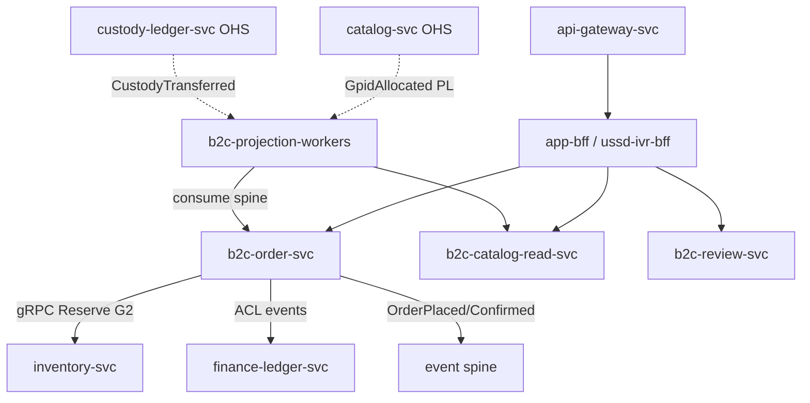

**Alternatives rejected.** A single monolithic `b2c-svc` was rejected: read aggregation (latency-elastic, 2G-bound) and order writes (transactional, idempotent) have opposing scaling profiles; CQRS split lets each scale independently (R6 read-model isolation). A shared catalog service co-owned with B2B was rejected under ADR-009 (Separate Ways) — each marketplace keeps its own read model fed by `search-svc`/`catalog-svc` indexing (G12).

### 9.2 Write Models / Aggregates & Invariants

| Aggregate | Boundary (txn root) | Key invariants | Trace |
|---|---|---|---|
| **Order(B2C)** | `ORD-<seq>` | State machine PLACED→CONFIRMED→(CANCELLED); confirm requires a held Reservation + accepted Finance payment intent; total = Σ(line qty × price) in poisha; immutable after CONFIRMED except via compensation | FR-MKT-*, R2, ADR-005 |
| **Cart** | `cart-<sessionDID>` | At most one active cart per (DID,channel); lines reference valid GPID; price is advisory snapshot, re-validated at placement | FR-MKT-*, R7 |
| **Listing** | local listing id ↔ GPID | A listing must bind a canonical GPID (R7); cannot show provenance asserted beyond consumed Custody read view | R1, R7, ADR-008 |
| **Review** | `review-<seq>` | One review per (DID, ORD, GPID) verified-purchase; emits ReputationSignal to Identity (G6) | FR-MKT-*, G6 |

**Design rationale.** The Order aggregate is the *only* strong-consistency boundary in B2C, and even it holds no money: it holds a **reference** to an Inventory reservation and a Finance payment intent. Custody/provenance is read-only display data; B2C asserting provenance would violate R1. Reputation is **not** owned here — Review emits a signal and Identity computes trust (G6), preventing a consumer-facing service from mutating master trust data.

### 9.3 Read Models / Projections

| Read model | Source (upstream) | Refresh | SLO |
|---|---|---|---|
| Consumer catalog/listing | `catalog.product.GpidAllocated/GpidLifecycleChanged.v1` (Catalog PL) | event-driven | ≤60s |
| Stock availability badge | `inventory.stock.StockProjected.v1` (Inventory) | event-driven | ≤60s |
| Provenance display card | `custody.passport.CustodyTransferred.v1` + RecallEvent (Custody OHS) | event-driven, `asOf` exposed | ≤60s, staleness surfaced (G11) |
| Order status view | local outbox + ShipmentStatusChanged (Logistics) | event-driven | ≤5s |

All projections are eventually consistent (R1/ADR-003) and expose `meta.asOf` so the UI can render staleness honestly (G11). Availability badges are advisory; **authoritative stock truth is only the synchronous Reserve at placement** (G2).

### 9.4 REST Endpoints & Internal gRPC Contracts

External REST under `/v1` via `api-gateway-svc`→`app-bff`/`ussd-ivr-bff`; envelope `{success,data,error,meta}`, cursor pagination, problem+json, `Idempotency-Key` on unsafe writes.

| Method & Route | Purpose | Idempotent |
|---|---|---|
| `GET /v1/catalog/listings` | Browse/search listings (cursor) | yes (safe) |
| `GET /v1/catalog/listings/{gpid}/provenance` | Provenance display card (`asOf`) | yes (safe) |
| `POST /v1/cart/items` | Add/update cart line | key required |
| `POST /v1/orders` | Place order (triggers Reserve→Pay saga) | key required |
| `POST /v1/orders/{ord}/cancel` | Consumer cancel → compensation | key required |
| `GET /v1/orders/{ord}` | Order status view | yes (safe) |
| `POST /v1/orders/{ord}/reviews` | Post verified-purchase review | key required |

**Consumed internal gRPC (OHS, mTLS):**

| Caller → Provider | Contract | Semantics |
|---|---|---|
| `b2c-order-svc` → `inventory-svc` | `Reserve(gpid, qty, ORD, Idempotency-Key)` / `Release(reservationId)` | Synchronous, strongly-consistent, idempotent (G2); Inventory writes its own RESERVED state |
| `b2c-order-svc` → `identity-svc` PDP | `Authorize(subject, action, resource)` | Deny-by-default RBAC+ABAC (G8) |

B2C **exposes no internal OHS gRPC** for cross-context writes; it is a downstream Conformist/Consumer.

### 9.5 Commands & Queries (CQRS)

| Type | Name | Owner |
|---|---|---|
| Command | PlaceOrder, ConfirmOrder, CancelOrder | `b2c-order-svc` |
| Command | AddCartItem, ClearCart | `b2c-order-svc` |
| Command | PostReview | `b2c-review-svc` |
| Query | BrowseListings, GetProvenanceCard | `b2c-catalog-read-svc` |
| Query | GetOrderStatus | `b2c-order-svc` (read side) |

Confirm/Cancel are saga-internal transitions, never directly client-invokable as money or stock writes — they only manipulate B2C-owned Order state and emit events.

### 9.6 Events Produced & Consumed

**Produced** (topic `<context>.<aggregate>.<Event>.vN`, PastTense, canonical IDs, per-`ORD` ordering):

| Topic | Trigger |
|---|---|
| `b2c.order.OrderPlaced.v1` | Reservation held + payment intent created |
| `b2c.order.OrderConfirmed.v1` | Finance `PaymentSettled`/escrow held consumed |
| `b2c.order.OrderCancelled.v1` | Consumer/timeout cancel; carries compensation cause |
| `b2c.review.ReviewPosted.v1` | Verified review accepted (also ReputationSignal, G6) |

**Consumed:**

| Topic (upstream) | From | Use |
|---|---|---|
| `finance.wallet.PaymentSettled.v1`, `EscrowHeld.v1`, `RefundIssued.v1` | Finance (#8) | Drive OrderConfirmed / cancel reconciliation (Conformist) |
| `inventory.stock.StockProjected.v1`, `ReservationReleased.v1` | Inventory (#5) | Availability badge; release reconciliation |
| `custody.passport.CustodyTransferred.v1`, `RecallEventAppended.v1` | Custody (#3 OHS) | Provenance card; recalled-item suppression (R1) |
| `catalog.product.GpidAllocated.v1`, `GpidLifecycleChanged.v1` | Catalog (#2 OHS) | Listing master-data projection (R7) |
| `logistics.shipment.ShipmentStatusChanged.v1`, `ShipmentDelivered.v1` | Logistics (#9) | Order tracking view |

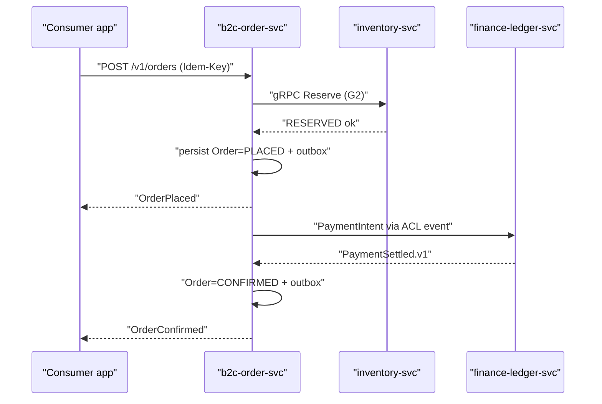

### 9.7 Database & Schema Ownership

`b2c-order-svc` owns a **Relational** schema (orders, order_lines, carts, reservations_ref, payment_intents_ref, outbox, inbox, dlq). `b2c-catalog-read-svc` owns a **Relational + search index** read store (listings, provenance_cards, availability_badges) fed by `b2c-projection-workers`; its search read-model is indexed by `search-svc` (G12). DB-per-service: **no cross-service DB access** (R6); Finance shares no DB and is reached only via ACL/OHS events (R2). Money fields stored as integer poisha for display only — never as ledger truth.

### 9.8 Sagas Participated In

| Saga | Role | Compensation |
|---|---|---|
| **Order-to-fulfilment** (choreographed) | Initiator/participant | On payment failure/timeout: emit `OrderCancelled`, call Inventory `Release`, no money posted |
| **Escrow saga** (ADR-005, orchestrated by `escrow-svc`) | Conformist participant | Reacts to `EscrowReversed`/`RefundIssued` by reconciling Order to CANCELLED/REFUNDED (G9) |
| **Recall propagation** (choreographed) | Consumer | On `RecallEventAppended`, suppress listing + flag affected orders for Finance-driven clawback (R3) |

B2C **never orchestrates money/custody**; cross-context atomicity is realized as sagas with compensation (G10), never distributed ACID (R2/R6).

### 9.9 ACL / OHS Boundaries

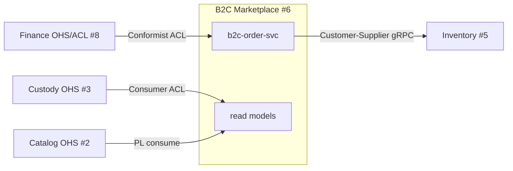

- **Conformist to Finance:** B2C accepts Finance's event shapes as-is via a thin ACL translating to local Order vocabulary; it does not negotiate a shared model (ADR-009).
- **Customer-Supplier to Inventory:** B2C consumes the Reserve/Release supplier contract; Inventory owns RESERVED (G2).
- **Consumer of Custody/Catalog OHS:** read-only projections; B2C never writes provenance (R1) or GPID master data (R7).

### 9.10 Idempotency, Outbox, Inbox, DLQ

- **Outbox:** Order state + event written in one local transaction; `b2c-order-svc` relay publishes `OrderPlaced/Confirmed/Cancelled` (no dual-write).
- **Inbox:** consumer idempotency keyed on `event_id`; duplicate Finance/Inventory events are no-ops.
- **Reserve idempotency:** the `Idempotency-Key` on `POST /v1/orders` is forwarded to Inventory `Reserve`, so retried placement never double-reserves (G2).
- **DLQ:** per-topic dead-letter with reason + replay; malformed Custody/Finance events are **quarantined, never silently dropped**.
- **Retry:** exponential backoff + jitter, capped; at-least-once + idempotent consumers ⇒ effectively-once.

### 9.11 Scaling & Resilience

| Concern | Mechanism |
|---|---|
| Read fan-out (browse on 2G) | `b2c-catalog-read-svc` HPA on RPS; edge cache + offline-sync gateway (R8/ADR-012) |
| Order write spikes (flash demand) | `b2c-order-svc` KEDA on Kafka lag + queue depth |
| Inventory Reserve dependency | Circuit breaker + timeout + bulkhead; on open → fail fast with retriable problem+json (no phantom orders) |
| Finance unavailability | Order stays PLACED, payment intent retried; consumer sees pending, not lost |
| Offline placement (R8) | Store-and-forward queue, conflict resolution at sync; USSD/SMS/IVR parity via `ussd-ivr-bff` |

**Trade-off.** Synchronous Reserve (G2) couples placement latency to Inventory availability; accepted because oversell on consumer orders is worse than a brief fail-fast — the circuit breaker bounds blast radius. Eventual availability badges (§9.3) absorb most reads off the synchronous path.

### 9.12 Security Responsibilities

OAuth2/OIDC at gateway; short-lived JWT (DID/roles/tier/deviceId). **Authorization is delegated to Identity PDP** (deny-by-default, server-side) per G8/§8 capability matrix — B2C enforces but does not own policy. mTLS for all internal gRPC (Reserve, PDP). `Idempotency-Key` mandatory on money-adjacent and order writes. Review posting requires KYC ≥ V1 verified-purchase to curb fraud; suspicious patterns surface to Fraud (#10) via signals, and B2C honors **Fraud hold commands** on orders (G5) — it cannot freeze money itself. All order/review mutations stream to the append-only audit OHS sink (R6/#13). PII (consumer contact, address) field-level encrypted at the boundary.

### 9.13 Traceability

| Decision | Trace |
|---|---|
| Node/TS experience-edge runtime | ADR-011, §11 |
| Separate Ways B2C vs B2B; Conformist to Finance | ADR-009, R2, context #6 |
| Synchronous strong-local Reserve/Release | **G2**, ADR-003, FR-INV-*, BR-022, §6 |
| Provenance display read-only (no custody write) | **R1**, ADR-002, context #3/#4 |
| GPID/DID as canonical listing/party refs | **R7**, ADR-008, Identifiers |
| Order/payment as saga, not distributed ACID | **G10**, ADR-005, R2/R6 |
| Escrow reversal reconciliation | ADR-005, **G9** (FR-PAY-014/015/036) |
| Reputation via signal, owned by Identity | **G6**, context #1 |
| Authorization via Identity PDP | **G8**, §8, security standards |
| Fraud holds honored, no self-freeze of money | **G5**, R4, context #10 |
| Recall suppression + clawback participation | **R3**, ADR-005, G11 |
| Outbox/inbox/DLQ/effectively-once | Reliability standards, R6 |
| Search read-model fed by search-svc | **G12**, context #13 |
| Audit to append-only OHS sink | **R6**, context #13 |
| Offline-first, USSD/SMS/IVR parity | **R8**, ADR-012 |

---

## 10. B2B Trade & Commodity Exchange — Service Architecture

### 10.1 Purpose & Context

Bounded context #7 is the **Core** wholesale, commodity, and forward-contract engine of DOKANDAR. It owns RFQ/negotiation, auctions, forward & commodity contracts, deal matching, and margining for institutional actors (mills, importers, aratdars, distributors). Per the frozen ownership, it runs **Java/Spring** on a **Relational** store, is owned by the **Exchange** team (ADR-001, ADR-011), and is **Separate Ways from B2C** (#6, ADR-009) while in **Partnership with Finance** (#8) for margining and settlement. It emits manipulation/syndicate signals to Fraud (#10) via an ACL. This chapter conforms to — and never alters — that canon; it resolves G2, G5, G10 inside the Service Architecture.

**Design rationale.** B2B negotiation lifecycles are long-lived, legally binding, money-adjacent, and price-sensitive (hoarding/syndicate risk). They demand strong local consistency on deal state, deterministic margin math in integer poisha (R2), and zero coupling to the consumer experience edge. Separate Ways is therefore the correct strategic pattern: B2B and B2C share no model, no DB, and no synchronous call path between them.

### 10.2 Service Decomposition

| Service | Responsibility (one line) | Runtime |
|---|---|---|
| `b2b-trade-svc` | Owns Quote/RFQ, Contract, ForwardContract, Deal lifecycle; matching, auctions, negotiation; reservation calls to Inventory | Java/Spring |
| `margining-svc` | Initial/variation margin computation, margin calls, mark-to-market against price marks; partnership integration with Finance | Java/Spring |
| `b2b-projection-workers` | Build read models (order book, position book, settlement queue) from the local outbox/event stream | Java/Spring |
| `b2b-acl-adapter` | OHS/ACL translation: Finance settlement events in, Fraud syndicate signals out, Custody/Inventory facts in | Java/Spring |

Decomposition follows the convention: the two frozen services plus suffixed `*-projection-workers` and a thin ACL adapter — no speculative services (YAGNI).

```mermaid
graph TD
  GW["api-gateway-svc"] --> PBFF["partner-bff"]
  PBFF -->|"REST /v1"| TRADE["b2b-trade-svc"]
  TRADE -->|"compute margin"| MARG["margining-svc"]
  TRADE -->|"gRPC Reserve (G2)"| INV["inventory-svc (#5)"]
  TRADE --> OUTBOX["outbox table"]
  MARG --> OUTBOX
  OUTBOX --> PW["b2b-projection-workers"]
  PW --> RM["read models: order book / positions / settlement queue"]
  OUTBOX --> SPINE["event spine (Kafka-class)"]
  SPINE --> ACL["b2b-acl-adapter"]
  ACL -->|"syndicate signal"| FRAUD["fraud-scoring-svc (#10)"]
  FINSPINE["finance events"] --> ACL
  ACL --> MARG
  CUST["custody.* / inventory.* events"] --> ACL
```

### 10.3 Write Models / Aggregates & Invariants

| Aggregate | Root ID | Key invariants | Traceability |
|---|---|---|---|
| Quote/RFQ | `RFQ-<seq>` | RFQ has ≥1 line; quotes valid only while `OPEN`; counter-quotes reference an existing RFQ version; expiry monotonic | FR-MKT-* (B2B RFQ); §7 |
| Contract | `CON-<seq>` | Created only from an accepted Deal; immutable commercial terms post-`SIGNED`; quantity ≤ matched quantity; price in integer poisha | FR-MKT-* (B2B); R2; ADR-009 |
| ForwardContract | `FWD-<seq>` | Delivery date in future at creation; notional = qty × strike (poisha); requires initial margin posted before `ACTIVE`; settlement window bounded | FR-MKT-* (forward/commodity); ADR-005-adjacent (G10) |
| Deal | `DEAL-<seq>` | Atomic match of two compatible orders; price within both limits; quantity = min(open qty); a matched Deal is terminal-or-compensated only | R6; G10 |

**Aggregate boundary rule.** Each aggregate is a single-writer consistency boundary persisted transactionally with its outbox row (one local ACID transaction = state + event). Cross-aggregate effects (Deal → Contract → margin) are **sagas**, never multi-aggregate ACID, honoring G10 (all "atomic" wording realized as orchestrated/choreographed sagas with compensation) and R2/R6.

**Why not event-sourcing here.** Custody (#3) is the canonical ES store (ADR-002). B2B is **not** a provenance writer; a relational state-store with transactional outbox satisfies its consistency needs at lower operational cost. Full ES was rejected as misapplied — it would duplicate the spine without R1 ownership.

### 10.4 Read Models / Projections

| Projection | Source | Purpose | Lag SLO |
|---|---|---|---|
| Order Book | local Deal/Quote outbox | live bid/ask matching surface | ≤2s |
| Position & Margin Book | `margining-svc` + Finance settlement events | open exposure, MtM, margin status per party | ≤5s |
| Settlement Queue | `ContractSettled`/Finance `PaymentSettled` | reconcile contract → settlement | ≤60s (R6/SLO) |
| Commodity Price Marks | internal deal prints + Analytics `PriceHintPublished` (advisory=true) | mark-to-market reference; advisory never authoritative | ≤60s |

Projections are CQRS read models rebuilt by `b2b-projection-workers`; they are disposable and replayable from the spine. Analytics inputs are strictly advisory (Generic #12) and may never drive a binding margin call alone.

### 10.5 REST Endpoints & gRPC OHS Contracts

External REST/JSON under `/v1` via `api-gateway-svc` → `partner-bff`; envelope `{success,data,error,meta}`, cursor pagination, problem+json, `Idempotency-Key` required on unsafe/money writes.

| Method & Route | Purpose | Idempotent |
|---|---|---|
| `POST /v1/b2b/rfqs` | Create RFQ | Key required |
| `POST /v1/b2b/rfqs/{id}/quotes` | Submit/counter a quote | Key required |
| `POST /v1/b2b/deals` | Place order / trigger match | Key required |
| `POST /v1/b2b/contracts/{id}/sign` | Sign accepted contract | Key required |
| `POST /v1/b2b/forwards` | Open forward contract | Key required |
| `GET /v1/b2b/orderbook?commodity=` | Read order book | Safe |
| `GET /v1/b2b/positions/{partyDid}` | Read positions/margin | Safe |
| `POST /v1/b2b/contracts/{id}/settle` | Request settlement | Key required |

**Internal gRPC OHS contracts (cross-context):**

| Caller → Callee | RPC | Semantics |
|---|---|---|
| `b2b-trade-svc` → `inventory-svc` | `Reserve(ReservationCmd)` / `Release` | G2 synchronous strong-local reservation at placement; idempotent; Inventory writes its own RESERVED state (R1, Customer-Supplier) |
| `b2b-trade-svc` → `finance-ledger-svc` | (event-first; no sync money write) | Settlement via events/ACL only — Finance is physically isolated (R2/ADR-004) |
| `margining-svc` → `identity-svc` | `Authorize(ABAC)` | PDP deny-by-default authz check (R7) |

Money is **never** written synchronously into Finance; the gRPC surface to Finance is read/ACL only, preserving R2 physical isolation. The single sanctioned synchronous strong-consistency call is the Inventory Reserve (G2).

### 10.6 Commands & Queries (CQRS)

| Command | Owner | Effect |
|---|---|---|
| `CreateRfq`, `SubmitQuote`, `CounterQuote` | `b2b-trade-svc` | mutate Quote/RFQ aggregate |
| `PlaceOrder`, `MatchDeal` | `b2b-trade-svc` | create Deal; reserve stock (G2) |
| `SignContract`, `OpenForward` | `b2b-trade-svc` | create Contract/ForwardContract |
| `ComputeMargin`, `IssueMarginCall`, `MarkToMarket` | `margining-svc` | margin state transitions |
| `RequestSettlement` | `b2b-trade-svc` | emit settlement intent to Finance saga |

| Query | Owner |
|---|---|
| `GetOrderBook`, `GetPositions`, `GetSettlementQueue`, `GetPriceMarks` | `b2b-projection-workers` read models |

Commands write through aggregates + outbox; queries hit projections only — clean read/write separation.

### 10.7 Events Produced & Consumed

**Produced** (topic = `b2b.<aggregate>.<EventName>.vN`, PastTense, canonical IDs only, per-aggregate-key ordering):

| Topic | Key | Emitted by |
|---|---|---|
| `b2b.rfq.RfqCreated.v1` | `RFQ-<seq>` | b2b-trade-svc |
| `b2b.contract.ContractCreated.v1` | `CON-<seq>` | b2b-trade-svc |
| `b2b.deal.DealMatched.v1` | `DEAL-<seq>` | b2b-trade-svc |
| `b2b.margin.MarginCalled.v1` | `WLT/party DID` | margining-svc |
| `b2b.contract.ContractSettled.v1` | `CON-<seq>` | b2b-trade-svc |
| `b2b.contract.ContractDefaulted.v1` | `CON-<seq>` | b2b-trade-svc |
| `b2b.party.ReputationSignal.v1` | party DID | b2b-trade-svc (feeds Identity Reputation, G6) |
| `b2b.risk.SyndicateSignalRaised.v1` | party DID / commodity | b2b-acl-adapter (to Fraud, ACL) |

**Consumed:**

| Topic | From | Use |
|---|---|---|
| `custody.passport.CustodyTransferred.v1` | #3 Custody | confirm provenance/quality before settlement (Conformist to Custody facts) |
| `inventory.stock.StockReserved.v1` / `ReservationReleased.v1` | #5 Inventory | confirm/compensate G2 reservation |
| `finance.settlement.PaymentSettled.v1` | #8 Finance | close settlement saga |
| `finance.escrow.EscrowReleased.v1` / `EscrowReversed.v1` | #8 Finance | margin release / clawback |
| `identity.kyc.KycTierChanged.v1` | #1 Identity | gate large-notional/forward eligibility (KYC V0-V3) |
| `analytics.price.PriceHintPublished.v1` | #12 Analytics | advisory price marks (advisory=true, non-binding) |

### 10.8 Database & Schema Ownership

`b2b-trade-svc` and `margining-svc` each own their **own relational schema** (DB-per-service); no cross-service DB access (R6). Finance shares **no** database (R2/ADR-004) — all Finance interaction is event/ACL. Core tables: `rfq`, `quote`, `deal`, `contract`, `forward_contract`, `margin_account`, `margin_call`, plus per-service `outbox`, `inbox(event_id)`, and `dlq`. All monetary columns are `BIGINT` integer poisha; no floats for money.

### 10.9 Sagas

```mermaid
sequenceDiagram
  participant T as "b2b-trade-svc"
  participant I as "inventory-svc"
  participant M as "margining-svc"
  participant F as "finance-ledger-svc / escrow-svc"
  T->>I: "Reserve (gRPC, G2)"
  I-->>T: "StockReserved"
  T->>M: "ComputeMargin"
  M-->>T: "margin OK / MarginCalled"
  T->>F: "RequestSettlement (event)"
  F-->>T: "EscrowHeld / PaymentSettled"
  T->>T: "ContractSettled"
  Note over T,F: "compensation: ReservationReleased + EscrowReversed on default"
```

| Saga | Type | Compensation |
|---|---|---|
| Trade-to-settlement | choreographed (G10) | `Release` reservation; emit `ContractDefaulted`; Finance `EscrowReversed` |
| Margin-call cure | choreographed | auto-liquidate position / `ContractDefaulted` if margin not cured in window |
| Escrow (delegated) | **orchestrated by `escrow-svc`** (ADR-005/R3) | B2B is a participant only, never orchestrator |

B2B never runs a distributed transaction (R2/R6); the escrow saga orchestration stays in Finance (ADR-005).

### 10.10 ACL / OHS Boundaries

- **Separate Ways from B2C (#6):** no shared model, no DB, no synchronous call between B2B and B2C — only the spine, if ever (ADR-009).
- **Partnership with Finance (#8):** bidirectional integration via events; `b2b-acl-adapter` translates Finance settlement/escrow events into the B2B margin model and vice-versa — but no shared store (R2).
- **Conformist to Custody (#3/#4):** B2B accepts Custody/Provenance facts as-is for quality-adjusted settlement; never writes custody (R1).
- **Customer-Supplier with Inventory (#5):** consumes the strong-local `Reserve` OHS (G2).
- **ACL to Fraud (#10):** manipulation/syndicate signals published one-way; B2B never issues holds — Fraud acts via Markets/Finance hold commands under Government four-eyes (R4/G5).

### 10.11 Idempotency, Outbox, Inbox, DLQ

| Mechanism | Implementation |
|---|---|
| Idempotency | `Idempotency-Key` header persisted per command; gRPC `Reserve` carries a stable reservation key (effectively-once) |
| Outbox | transactional outbox: aggregate state + event row in one DB tx; relay publishes to spine |
| Inbox | consumer dedup on `event_id`; replays are no-ops |
| DLQ | per-topic DLQ with reason + replay; invalid money/margin/deal events **quarantined, never silently dropped** |
| Retry | exponential backoff + jitter, capped; at-least-once delivery + idempotent consumers |

### 10.12 Scaling & Resilience

`b2b-trade-svc` scales horizontally with partition affinity by commodity/order book to preserve per-key ordering; `margining-svc` scales by party/position shard. HPA/KEDA on queue depth and order-book throughput. Circuit breakers, bulkheads, timeouts, and rate limits guard every boundary — notably the Inventory `Reserve` gRPC (fail-closed: no reserve ⇒ no match). Deployed on Kubernetes, sovereign in-country, multi-region/multi-AZ + DR, durable Kafka-class spine. Auction/matching uses bounded queues; backpressure sheds load before margin integrity is threatened.

### 10.13 Security Responsibilities

OAuth2/OIDC at gateway; short-lived JWT (DID/roles/tier/deviceId); mTLS service-to-service via internal PKI. RBAC+ABAC enforced server-side by Identity PDP (deny-by-default, R7) — forward/large-notional trading gated on KYC tier (V2/V3). Four-eyes applies to Fraud-driven holds and Government interventions affecting B2B, executed via hold commands, not by B2B (R4/R5/G5). All deal/contract/margin actions stream to the append-only audit OHS sink (#13, R6). PII minimal; money in integer poisha; no secrets in code (KMS).

### 10.14 Traceability

| Decision | Trace |
|---|---|
| Java/Spring, Exchange team, relational | ADR-011, ADR-001; §7 |
| Separate Ways from B2C | ADR-009; §6/§7 |
| Partnership with Finance; no shared DB | R2, ADR-004; §8 |
| Sync Reserve at placement (own RESERVED state) | G2; R1, ADR-003; §5/§6 |
| Conformist to Custody facts | R1, ADR-002; §3/§4 |
| Syndicate signals one-way to Fraud; no self-hold | R4, ADR-006; G5; §10 |
| All "atomic" flows as sagas w/ compensation | G10; R2, R6 |
| Escrow orchestrated by Finance, B2B participant | ADR-005, R3; §8 |
| Reputation/Driver/owner placement | G6; §1 |
| Event topic naming & reliability (outbox/inbox/DLQ) | R6, ADR-010; G7 |
| Integer poisha money, KYC-tier gating | R2, R7; FR-MKT-*, FR-PAY-* |
| Audit to append-only OHS sink | R6; §13 |

---

## 11. Finance & Settlement — Service Architecture

### 11.1 Purpose & Scope

**Purpose.** Context #8 Finance & Settlement is the platform's authoritative money engine: it holds every wallet balance, records every value movement as integer-poisha double-entry, orchestrates the escrow lifecycle, and settles MFS/bank rails. It is the only context permitted to *create or destroy money truth*, exactly as Custody (#3) is the only writer of provenance truth (R1 ↔ R2 symmetry).

**Scope boundary.** Finance is **physically isolated** (ADR-004/R2): no shared database, no foreign keys into other contexts, no synchronous read into another store. It integrates strictly via the event spine and gRPC OHS/ACL surfaces (R6). Money correctness is *strongly consistent* inside Finance; everything outside (rollups, analytics, oversight) consumes eventual projections.

**Traceability.** ADR-004, ADR-005, R2, R3, FR-PAY-001..041, §8 capability matrix (G8), G5 command paths, G9 escrow-reversal mapping, G10 atomic→saga.

---

### 11.2 Service Decomposition

**Design rationale.** One bounded context, six cohesive deployables. We split by *transactional responsibility* and *failure isolation*, not by entity, so that the ledger core (strict invariants, low change rate) is insulated from volatile external adapters (MFS/bank quirks, high change rate). All six share the *runtime* (Java/Spring, ADR-011) but **each owns its own schema** (DB-per-service); they exchange data only via internal events and in-process aggregate calls where co-located, never cross-DB SQL.

| Service | One-line responsibility | Aggregates owned |
|---|---|---|
| `finance-ledger-svc` | OHS/ACL authority; double-entry posting, wallet balances, idempotent money truth | Wallet, LedgerTxn, LedgerEntry |
| `escrow-svc` | Escrow saga **orchestrator** (R3/ADR-005): hold → release/reverse with compensation | EscrowHold |
| `payout-svc` | Outbound disbursement lifecycle to merchants/drivers/subsidy beneficiaries | Payout |
| `mfs-bank-adapters` | ACL to MFS (bKash/Nagad/Rocket) + banks (BEFTN/RTGS); rail idempotency & reconciliation feeds | (no aggregate; adapter state) |
| `cod-recon-svc` | Cash-on-delivery reconciliation against POD custody events; drift detection | Settlement, ReconciliationLine |

```mermaid
graph TD
  subgraph "Finance & Settlement (ISOLATED, Java/Spring)"
    LED["finance-ledger-svc (OHS/ACL)"]
    ESC["escrow-svc (saga orchestrator)"]
    PAY["payout-svc"]
    MFS["mfs-bank-adapters (ACL)"]
    COD["cod-recon-svc"]
  end
  ESC -->|"post hold/release entries"| LED
  PAY -->|"post payout entries"| LED
  COD -->|"post settlement entries"| LED
  PAY -->|"execute disbursement"| MFS
  MFS -->|"rail confirmation"| PAY
  LED -->|"outbox events"| SPINE["Event Spine"]
  ESC -->|"outbox events"| SPINE
  MFS -->|"PaymentSettled"| LED
  SPINE -->|"CustodyTransferred / RecallInitiated"| ESC
```

**Why not a single monolith money-svc?** A monolith couples the slow-moving ledger invariants to fast-moving rail integrations, forcing the strict-consistency core to redeploy on every adapter fix; rejected for blast-radius and SLO-tier reasons. **Why not split per rail (one svc per MFS)?** Premature (YAGNI); adapters share one ACL contract and one reconciliation pattern — split only as suffixed workers if throughput demands.

---

### 11.3 Write Models / Aggregates & Invariants

**Design rationale.** Aggregate boundaries follow *transactional consistency needs*. A single double-entry posting (LedgerTxn + ≥2 LedgerEntry) must commit atomically, so they form one aggregate. Wallet balance is a derived materialization guarded by the same transaction to keep balances == sum(entries).

| Aggregate | Boundary / root | Key invariants | Trace |
|---|---|---|---|
| Wallet | `Wallet` (WLT-seq) | balance is integer poisha ≥ floor; balance == Σ posted entries; per-WLT serialized writes | FR-PAY-001..008, R2 |
| LedgerTxn / LedgerEntry | `LedgerTxn` (TXN-seq) root, entries as children | **Σ debits == Σ credits** (zero-sum); immutable once posted; corrections are new reversing txns, never edits | FR-PAY-009..018, R2, ADR-004 |
| EscrowHold | `EscrowHold` (CON/ORD-linked) | held funds segregated; release XOR reverse exactly once; amount frozen at hold time | FR-PAY-014/015/036 (G9), R3 |
| Payout | `Payout` (FWD/seq) | one-to-one with a rail attempt; idempotent on Idempotency-Key; cannot exceed available balance | FR-PAY-019..030 |
| Settlement | `Settlement` | COD settlement equals reconciled POD value; drift opens ReconciliationCase | FR-PAY-031..041 |

**Decisive rule:** money is **never mutated in place** (coding-style immutability) — adjustments are *compensating reversing entries*. This satisfies double-entry audit integrity and the append-only audit OHS sink (R6).

---

### 11.4 Read Models / Projections

Finance keeps **internal** projections (within its own isolated store) and publishes **external** ones via events. No outside context reads these tables.

| Projection | Source of truth | Consumer | Lag SLO |
|---|---|---|---|
| Wallet balance view | LedgerEntry stream | app-bff / partner-bff via gateway | strong (in-txn) |
| Escrow state view | EscrowHold transitions | b2c-order-svc / b2b-trade-svc (read-only) | ≤60s |
| Settlement statement | Settlement + entries | merchant statements, Analytics (#12) | ≤60s |
| Ledger-drift monitor | continuous Σ-check over entries | emits `LedgerDriftDetected` | near-real-time |

Analytics (#12) and Government (#11) consume only the *event-derived* views — never SQL into Finance (R5, R2).

---

### 11.5 REST Endpoints & Internal gRPC OHS Contracts

**External REST (`/v1`, via API Gateway + BFFs; envelope `{success,data,error,meta}`; problem+json; cursor pagination; `Idempotency-Key` mandatory on all writes).**

| Method | Route | Purpose | FR |
|---|---|---|---|
| POST | `/v1/wallets` | provision wallet for a DID | FR-PAY-001 |
| GET | `/v1/wallets/{WLT}` | balance + status | FR-PAY-004 |
| POST | `/v1/payments` | capture/settle a payment (idempotent) | FR-PAY-010 |
| POST | `/v1/refunds` | issue refund (reversing txn) | FR-PAY-016 |
| POST | `/v1/payouts` | request disbursement | FR-PAY-019 |
| GET | `/v1/escrow/{CON}` | escrow hold status | FR-PAY-014 |
| GET | `/v1/ledger/txns/{TXN}` | txn + entries (read) | FR-PAY-012 |

**Internal gRPC (OHS, mTLS, cross-context):**

| Service.RPC | Caller | Semantics |
|---|---|---|
| `FinanceLedger.HoldEscrow` | escrow saga (internal) / b2b-trade-svc partnership | idempotent strong write |
| `FinanceLedger.ApplyFraudHold` | enforcement-svc (#10, G5) | reversible money hold, four-eyes gated |
| `FinanceLedger.PostSubsidy` | intervention-svc (#11, G5) | executes `SubsidyDisbursementRequested` |
| `FinanceLedger.QuoteSettlement` | cod-recon-svc | quality-adjusted figure from CustodyTransferred |

Finance **exposes** hold/settle commands but **never** calls another context's DB. Fraud and Government reach money *only* through these gRPC OHS commands under maker-checker (R4/R5, G5).

---

### 11.6 Commands & Queries (CQRS)

| Command | Owner svc | Idempotent key |
|---|---|---|
| CapturePayment | finance-ledger-svc | Idempotency-Key |
| PostDoubleEntry | finance-ledger-svc | TXN derivation key |
| HoldEscrow / ReleaseEscrow / ReverseEscrow | escrow-svc | CON+phase |
| RequestPayout / ConfirmPayout | payout-svc | Payout id |
| ApplyFraudHold / ReleaseFraudHold | finance-ledger-svc (cmd from #10) | hold id |
| ReconcileCod | cod-recon-svc | SHP+POD id |

| Query | Owner |
|---|---|
| GetWalletBalance, GetTxn, ListStatements | finance-ledger-svc read model |
| GetEscrowState | escrow-svc read model |

Commands mutate aggregates and emit via outbox; queries hit projections only — clean CQRS separation, no command path reads stale projections for invariant checks (it reads the strong write model).

---

### 11.7 Events Produced & Consumed

**Produced** (topic `finance.<aggregate>.<EventName>.v1`, PastTense, canonical IDs only):

| Topic | Trigger | Ordering key |
|---|---|---|
| `finance.ledger.PaymentSettled.v1` | payment captured & posted | WLT/TXN |
| `finance.escrow.EscrowHeld.v1` | hold posted | CON |
| `finance.escrow.EscrowReleased.v1` | release leg settled | CON |
| `finance.escrow.EscrowReversed.v1` | compensating reversal (R3) | CON |
| `finance.payout.PayoutSettled.v1` | rail confirms disbursement | WLT/TXN |
| `finance.ledger.RefundIssued.v1` | reversing refund posted | TXN |
| `finance.ledger.LedgerDriftDetected.v1` | Σ-mismatch found | TXN |

**Consumed** (upstream):

| Topic | From context | Effect in Finance |
|---|---|---|
| `custody.passport.CustodyTransferred.v1` | #3 Custody | quality-adjusted settlement input |
| `custody.recall.RecallInitiated.v1` (via #3/#4) | #3/#4 | clawback / escrow reversal trigger (R3) |
| `markets.order.OrderConfirmed.v1` | #6/#7 | escrow hold / capture |
| `logistics.shipment.ShipmentDelivered.v1` (POD) | #9 | release escrow / COD reconcile |
| `fraud.hold.FraudHoldIssued.v1` | #10 | apply reversible money hold (G5) |
| `gov.subsidy.SubsidyDisbursementRequested.v1` | #11 | execute subsidy payout (G5) |

**Why CustodyTransferred drives settlement, not a sync call?** Finance and Custody share no DB (R2) and must not block on each other; the event carries the SPLIT/MERGE/TRANSFORM custody fact, and Finance applies quality adjustment on its own clock — decoupled, replayable.

---

### 11.8 Database & Schema Ownership

**Architecture decision.** Relational, **physically isolated** cluster (ADR-004/R2), one schema per service, double-entry as the canonical table shape: `ledger_txn` (header) + `ledger_entry` (signed integer-poisha legs, `debit`/`credit`, account_ref). Balances are a maintained materialization with a periodic Σ-reconciler emitting `LedgerDriftDetected`. No other context holds credentials to this cluster; no logical replication out — only outbox→spine.

**Trade-off.** Physical isolation costs cross-context joins (must denormalize via events) but buys regulatory-grade auditability, independent scaling, and blast-radius containment for the platform's highest-value data. Rejected alternatives: shared platform DB (violates R2/ADR-004); event-sourced ledger like Custody — rejected because double-entry relational posting gives simpler strong-consistency guarantees and mature SQL tooling for financial reconciliation; ES is retained where provenance ordering dominates (#3), not here.

---

### 11.9 Sagas

```mermaid
sequenceDiagram
  participant MKT as "Markets (#6/#7)"
  participant ESC as "escrow-svc"
  participant LED as "finance-ledger-svc"
  participant LOG as "Logistics (#9)"
  participant CUS as "Custody (#3)"
  MKT->>ESC: "OrderConfirmed"
  ESC->>LED: "HoldEscrow (idempotent)"
  LED-->>ESC: "EscrowHeld"
  LOG-->>ESC: "ShipmentDelivered (POD)"
  CUS-->>ESC: "CustodyTransferred (quality)"
  ESC->>LED: "ReleaseEscrow (adjusted)"
  LED-->>ESC: "EscrowReleased"
  Note over ESC,LED: "Dispute / recall / forged POD"
  CUS-->>ESC: "RecallInitiated"
  ESC->>LED: "ReverseEscrow (compensation)"
  LED-->>ESC: "EscrowReversed"
```

| Saga | Style | Finance role | Trace |
|---|---|---|---|
| Escrow lifecycle | **Orchestrated** by escrow-svc | owner/orchestrator | ADR-005, R3 |
| Order-to-fulfilment | Choreographed (events) | participant (capture/settle) | G10 |
| Recall clawback | Choreographed in, orchestrated reversal | reversal owner | R3, G11 |
| Subsidy disbursement | Choreographed | executor (G5) | R5, FR-GOV |

Escrow triggers for reversal are exactly the canon set: mid-transit dispute, recall, forged/withdrawn POD (R3). All cross-context money flows are sagas with compensation — no distributed ACID (G10/R6).

---

### 11.10 ACL / OHS Boundaries

`finance-ledger-svc` is the **OHS/ACL** face: it publishes the stable Published-Language money events and accepts inbound commands only through translated ACL gRPC. Upstream domain events (Custody, Logistics, Markets) pass through an **anti-corruption layer** that maps foreign vocabulary into Finance commands, so no upstream model leaks into the ledger. `mfs-bank-adapters` is the *outbound* ACL: it absorbs each rail's idiosyncrasies and presents a uniform settlement contract inward. Government and Fraud are **upstream of nothing in Finance's DB** — they only send four-eyes-gated commands (G5).

---

### 11.11 Idempotency / Outbox / Inbox / DLQ

| Mechanism | Implementation |
|---|---|
| Idempotency | `Idempotency-Key` header → `idempotency_keys` table; replay returns first result; money writes are exactly-once-effective |
| Outbox | atomic state+event commit in same DB txn; relay publishes to spine |
| Inbox | consumed `event_id` deduped before applying (effectively-once) |
| DLQ | per-topic DLQ with reason; **invalid money events quarantined, never silently dropped**; replayable |
| Retry | exponential backoff + jitter, capped |

This realizes the canon "exactly-once" mandate: at-least-once delivery + idempotent consumers + outbox = effectively-once posting. Any non-balancing or unparseable event is quarantined for operator review, preserving ledger integrity.

---

### 11.12 Scaling & Resilience

- **Partition by WLT/TXN** ordering key; per-wallet serialization preserves balance invariants while allowing horizontal throughput across wallets.
- KEDA/HPA autoscale adapters and projection workers on lag; ledger core scales read replicas for projections, single-writer per partition for posts.
- Circuit breakers, bulkheads, timeouts isolate flaky MFS rails from the core; rail outage degrades *payout* without halting *escrow holds*.
- Multi-region multi-AZ + DR; durable Kafka-class spine; **strictest SLO tier** (money) with tight error budgets and projection-lag SLO ≤60s for external views.

---

### 11.13 Security Responsibilities

OAuth2/OIDC at gateway; short-lived JWT (DID/roles/tier); mTLS service-to-service via internal PKI (keys from Identity #3-G3). RBAC+ABAC deny-by-default enforced by Identity PDP — Finance authorizes every money command against §8 capability matrix (G8). **Four-eyes (maker-checker)** mandatory on fraud holds and subsidy disbursements (R4/R5/G5). Secrets in KMS; field-level encryption on PII references; every posting streamed to the append-only audit OHS sink (#13/R6). No money mutation bypasses idempotency or audit.

---

### 11.14 Traceability

| Decision | ADR / Rule | FR / § |
|---|---|---|
| Physical DB isolation, no shared DB | ADR-004, R2 | §8, FR-PAY-001..041 |
| Double-entry, integer poisha, exactly-once | R2 | FR-PAY-009..018 |
| Escrow saga orchestrated; reversal triggers | ADR-005, R3 | FR-PAY-014/015/036 (G9) |
| Java/Spring runtime | ADR-011 | §8 |
| Fraud/Gov act via Finance commands only | R4, R5, G5 | FR-SCM-013..023, FR-GOV-001..034 |
| Quality-adjusted settlement from custody | R1↔R2 | custody.passport.CustodyTransferred.v1 |
| Recall clawback | R3, G11 | FR-PASS recall |
| Atomic wording realized as sagas | — | G10 |
| Versioned PL events, outbox/inbox/DLQ | R6, ADR-010 | §20.2 / Ch.17 (G7) |
| Authorization via capability matrix | — | §8 (G8) |

---

## 12. Logistics & Delivery — Service Architecture

### 12.1 Purpose & Position in the Spine

Bounded context #9 (Logistics & Delivery) is the **Supporting** domain that physically moves goods, captures Proof-of-Delivery (POD), and streams telemetry (location, cold-chain temperature) across Bangladesh's last mile. Its defining constraint is canonical: **Logistics is a Conformist to Custody — POD is a custody event, never a stock write.** Logistics never writes provenance and never writes inventory; it emits a delivery signal that `custody-ledger-svc` (#3) appends as the sole writer (R1), which then re-projects to Inventory (#5). Logistics also **emits fraud signals but cannot self-freeze money**: a suspected GPS-spoof or POD-forgery routes to Fraud (#10), which under Government four-eyes (R4/ADR-006) issues hold commands to Finance (#8) — the G5 command path.

**Traceability:** ADR-001 (13 contexts), ADR-011 (Go runtime), R1 (custody sole writer), R6 (no cross-store reach), G5 (no self-freeze), G6 (Driver lives in Logistics), FR-LOG-001..082.

### 12.2 Service Decomposition

| Service | Runtime | One-line responsibility |
|---------|---------|-------------------------|
| `logistics-svc` | Go | Owns Shipment/ShipmentEvent/Vehicle/Route/Driver write models; orchestrates pickup→transit→POD lifecycle; publishes domain events via outbox. |
| `routing-svc` | Go | Computes routes/ETAs from maps/GIS; assigns vehicles+drivers; replans on exceptions; pure read-from-write-model + external GIS. |
| `telemetry-ingest-workers` | Go | High-throughput ingestion of GPS/temperature telemetry into time-series store; detects cold-chain breach thresholds; feeds projections. |

**Design rationale:** the lifecycle (transactional, low-volume, strongly consistent) is split from telemetry (high-volume, append-only, lossy-tolerant) so that a flood of 2G GPS pings can never throttle a POD write. Routing is isolated because it is CPU/external-IO heavy and independently scalable. **Alternatives rejected:** a single monolith `logistics-svc` would couple telemetry burst-scaling to the money-adjacent POD path (violates bulkhead standard); a separate `pod-svc` was rejected as POD is intrinsic to the Shipment aggregate invariant and would fragment the aggregate boundary.

```mermaid
graph TD
  subgraph "Logistics Context (Go)"
    LS["logistics-svc"]
    RS["routing-svc"]
    TW["telemetry-ingest-workers"]
    RDB[("Relational DB")]
    TS[("Time-series DB")]
  end
  GIS["maps GIS external"]
  CUST["custody-ledger-svc #3"]
  FIN["finance-ledger-svc #8"]
  FRAUD["fraud-scoring-svc #10"]
  SPINE["Event Spine"]
  LS --> RDB
  TW --> TS
  RS --> GIS
  RS --> RDB
  LS -- "outbox publish" --> SPINE
  LS -- "DeliveryAttested ACL" --> CUST
  TW -- "fraud signal ACL" --> FRAUD
  FRAUD -- "hold cmd G5" --> FIN
```

### 12.3 Write Models / Aggregates & Invariants

| Aggregate | Boundary / key | Key invariants | Trace |
|-----------|----------------|----------------|-------|
| **Shipment** (root, `SHP-<seq>`) | One shipment = one custody-bearing consignment; references ORD + PPID set | State machine `CREATED→ASSIGNED→PICKED_UP→IN_TRANSIT→DELIVERED/EXCEPTION`; no skip transitions; POD requires bound Driver + Device | FR-LOG-001..030, BR custody-conformance |
| **ShipmentEvent** | Child of Shipment, append-only within aggregate | Monotonic sequence per SHP; immutable once written; POD event carries signature + geo-stamp | FR-LOG-031..050 |
| **Vehicle** (`VEH`) | Independent aggregate | Capacity ≥ assigned load; one active route at a time | FR-LOG-051..062 |
| **Route** (`RTE`) | Independent aggregate | Sum(stops) within vehicle capacity; ETA recomputed on exception | FR-LOG-063..074 |
| **Driver** (G6, SA-introduced) | Independent aggregate, ref to Identity DID | Must hold valid KYC tier ≥ V1 (read via Identity); device-bound for POD signing | FR-LOG-075..082, G6, ADR-008 |

**Design decision:** Driver is owned **inside Logistics** (G6), not Identity. Identity owns the *Party/Principal* and DID; Logistics owns the operational *Driver* aggregate (assignment, availability, route binding) referencing the DID by value. This honors ADR-008 (Identity master-data) while keeping operational state local (R6). POD signing uses Identity-issued per-DID keys (G3) — Logistics never mints keys.

### 12.4 Read Models / Projections

| Projection | Source | Consumer | Lag SLO |
|------------|--------|----------|---------|
| `shipment_tracking_view` | ShipmentEvent stream | App BFF / consumer tracking | ≤5s |
| `cold_chain_timeline` | telemetry time-series | Government oversight read, Analytics | ≤60s (R3 rollup) |
| `fleet_liveboard` | Vehicle+telemetry | routing-svc replanning, ops | ≤10s |
| `driver_availability` | Driver + Route state | routing-svc assignment | ≤5s |

All projections are **read-only derivations** of the Logistics write models and telemetry; they never feed back as authoritative state (CQRS convention).

### 12.5 REST Endpoints & Internal gRPC OHS Contracts

**External REST** (`/v1`, via `api-gateway-svc` → `app-bff`/`partner-bff`, envelope `{success,data,error,meta}`, cursor pagination, problem+json):

| Method & Path | Purpose | Idempotency-Key |
|---------------|---------|-----------------|
| `POST /v1/shipments` | Create shipment from ORD | required |
| `GET /v1/shipments/{shp}` | Fetch shipment + status | n/a |
| `GET /v1/shipments/{shp}/tracking` | Tracking timeline (read model) | n/a |
| `POST /v1/shipments/{shp}/pickup` | Record pickup | required |
| `POST /v1/shipments/{shp}/pod` | Submit POD (signed) | required |
| `POST /v1/shipments/{shp}/exception` | Raise exception | required |
| `POST /v1/routes/plan` | Request route plan | required |
| `POST /v1/telemetry/batch` | Offline store-and-forward telemetry (R8) | required (batch id) |

**Internal gRPC OHS contracts** (mTLS, server-side authz via Identity PDP):

| Contract | Direction | Role |
|----------|-----------|------|
| `DeliveryAttestation` | logistics-svc → custody-ledger-svc | Conformist call: submits POD as a custody-event request; Custody decides/appends (R1). |
| `RouteQuery` | b2c/b2b → routing-svc | Read-only ETA/serviceability lookup. |
| `FraudSignalEmit` | telemetry-ingest-workers → fraud-scoring-svc (ACL) | Emits spoof/breach/POD-anomaly signals; recommend-only (R4). |

### 12.6 Commands & Queries (CQRS)

| Type | Name | Owner |
|------|------|-------|
| Command | `CreateShipment`, `RecordPickup`, `SubmitPOD`, `RaiseException`, `AssignDriver` | `logistics-svc` |
| Command | `PlanRoute`, `Replan` | `routing-svc` |
| Command | `IngestTelemetry`, `EvaluateColdChain` | `telemetry-ingest-workers` |
| Query | `GetShipment`, `GetTrackingTimeline` | `logistics-svc` (read model) |
| Query | `GetETA`, `CheckServiceability` | `routing-svc` |
| Query | `GetColdChainTimeline` | telemetry read model |

### 12.7 Events Produced & Consumed

**Produced** (topic = `<context>.<aggregate>.<EventName>.vN`, PastTense, schema-registered, canonical IDs only, per-SHP ordering):

| Event topic | Trigger | Key payload IDs |
|-------------|---------|-----------------|
| `logistics.shipment.ShipmentCreated.v1` | Shipment created from ORD | SHP, ORD, PPID[] |
| `logistics.shipment.ShipmentStatusChanged.v1` | Lifecycle transition | SHP, fromState, toState |
| `logistics.shipment.ShipmentDelivered.v1` | POD accepted (POD = custody event) | SHP, PPID[], driverDID, geo, sig |
| `logistics.shipment.ShipmentExceptionRaised.v1` | Delay/damage/failed-attempt | SHP, reasonCode |
| `logistics.shipment.ColdChainBreachRaised.v1` | Telemetry threshold crossed | SHP, PPID[], tempSeries ref |

**Consumed** (upstream):

| Consumed event | From context | Logistics reaction |
|----------------|--------------|--------------------|
| `markets.order.OrderConfirmed.v1` | B2C #6 / B2B #7 | Create Shipment |
| `custody.passport.CustodyTransferred.v1` | Custody #3 | Confirm custody handover reflected; reconcile POD attestation |
| `custody.passport.RecallEventAppended.v1` | Custody #3 | Halt/divert in-transit shipments for recalled PPID; raise exception |
| `identity.kyc.KycTierChanged.v1` | Identity #1 | Update Driver eligibility (V1 gate) |
| `inventory.stock.StockReserved.v1` | Inventory #5 | Confirm consignment line is reservation-backed before pickup |

**Critical canon point:** `ShipmentDelivered` is **not** a stock write. It is the trigger for `logistics-svc` to invoke `DeliveryAttestation` gRPC into `custody-ledger-svc`, which appends the authoritative custody event; Inventory then re-projects from custody (R1/ADR-003). Logistics publishing `ShipmentDelivered` to the spine is advisory/notification, not a source of truth for custody or stock.

### 12.8 Database & Schema Ownership

Per DB-per-service (R6), each service owns its schema; no cross-service DB access; Finance never shared (R2, not applicable here as Logistics holds no money).

| Store | Owner | Contents |
|-------|-------|----------|
| Relational (Go, e.g. Postgres) | `logistics-svc` | shipments, shipment_events, vehicles, routes, drivers, **outbox**, **inbox** |
| Time-series | `telemetry-ingest-workers` | gps_pings, temperature_series, breach_markers |
| Relational read schema | projection workers | tracking/fleet/cold-chain read models |

Telemetry's time-series store is physically separate from the transactional relational store so retention, compaction, and burst-write tuning are independent of the money-adjacent POD lifecycle.

### 12.9 Sagas This Context Participates In

```mermaid
sequenceDiagram
  participant MK as "b2c/b2b order-svc"
  participant LG as "logistics-svc"
  participant CU as "custody-ledger-svc"
  participant FN as "finance escrow-svc"
  participant FR as "fraud enforcement-svc"
  MK->>LG: OrderConfirmed (create shipment)
  LG->>LG: pickup, in-transit
  LG->>CU: DeliveryAttestation (POD)
  CU-->>LG: CustodyTransferred (appended)
  CU->>FN: CustodyTransferred consumed
  FN->>FN: EscrowReleased (settlement)
  Note over LG,FR: dispute / forged POD path
  LG->>FR: ShipmentExceptionRaised / fraud signal
  FR->>FN: FraudHoldIssued (G5, four-eyes)
  FN->>FN: EscrowReversed (R3 compensating saga)
```

| Saga | Logistics role | Compensation |
|------|----------------|--------------|
| **Order-to-fulfilment** (choreographed) | Produces shipment lifecycle + POD attestation | ShipmentExceptionRaised triggers re-attempt or cancel |
| **Escrow compensating-reversal** (orchestrated by `escrow-svc`, ADR-005/R3) | Supplies POD attestation; a **forged/withdrawn POD** or mid-transit dispute is a documented reversal trigger | Logistics emits exception; Finance reverses; Logistics never moves money |
| **Recall propagation** (choreographed) | Consumes `RecallEventAppended`, freezes in-transit shipments, raises exception | Diverts/returns affected SHP |

### 12.10 ACL / OHS Boundaries

- **Conformist → Custody:** Logistics adopts Custody's model for delivery; the `DeliveryAttestation` gRPC is a downstream Conformist call into Custody's OHS, not a shared transaction (no distributed ACID, R2/R6/G10).
- **ACL → Fraud:** telemetry anomalies are translated into Fraud's signal vocabulary at the boundary; Logistics holds no fraud model and gets no Fraud write-back to its store.
- **No reach into other stores:** consumption of Custody/Inventory/Identity events is via the spine into Logistics' own inbox/read models only (R6).

### 12.11 Idempotency / Outbox / Inbox / DLQ

| Mechanism | Logistics specifics |
|-----------|---------------------|
| **Outbox** | All five produced events written in the same relational transaction as the state change; a relay publishes to the spine (atomic state+event). |
| **Inbox** | Consumed events deduped on `event_id`; recall/order/KYC handlers idempotent. |
| **Idempotency-Key** | Required on all unsafe writes — POD, pickup, exception, telemetry batch — so retried 2G submissions are effectively-once. |
| **DLQ** | Per-topic DLQ with reason + replay; **invalid custody-bound POD events are quarantined, never silently dropped**. |
| **Retry** | Exponential backoff + jitter, capped, on `DeliveryAttestation` to Custody; offline POD queues store-and-forward until reconnection (R8). |

Offline-first (R8/ADR-012): a driver on a dead-zone route signs POD locally on a bound Device (Identity key, G3); the app queues it; on reconnect the BFF replays with the original Idempotency-Key. Conflict resolution favors the earliest valid signed POD per SHP.

### 12.12 Scaling & Resilience

```mermaid
graph LR
  ING["telemetry-ingest-workers (KEDA on Kafka lag)"]
  POD["logistics-svc POD path (HPA, bulkhead)"]
  RTE["routing-svc (HPA, CPU)"]
  ING -. "isolated pool" .- POD
  RTE -. "circuit breaker to GIS" .- POD
```

- **Bulkheads:** telemetry ingest and POD lifecycle run in separate pools; a telemetry burst cannot starve POD writes.
- **Autoscaling:** `telemetry-ingest-workers` scale on Kafka consumer lag (KEDA); `routing-svc` on CPU (HPA); `logistics-svc` on request rate.
- **Circuit breakers/timeouts/rate-limits** at GIS, Custody gRPC, and gateway boundaries; bulkhead the external maps dependency so GIS latency degrades ETAs (advisory) without blocking POD.
- **Multi-region/AZ + DR**, durable Kafka-class spine; QR-resolve-on-2G and projection-lag (≤60s) tracked via OpenTelemetry per observability standard.

### 12.13 Security Responsibilities

- **POD signing** with Identity-issued per-DID keys (G3); custodial signing for low-tech drivers via Identity's service — Logistics stores signatures, never private keys.
- **mTLS** service-to-service via internal PKI; **OAuth2/OIDC** at gateway; JWT carries DID/role/deviceId; **deny-by-default RBAC+ABAC** enforced by Identity PDP (e.g., a driver may POD only assigned SHPs).
- **Fraud routing not enforcement:** Logistics cannot freeze money or actors; it emits signals only (R4/G5). Device binding required for POD to deter spoofing.
- **Audit:** every POD/exception emits to the append-only audit OHS sink (#13, R6). Telemetry geo-data treated as sensitive; PII (driver identity) referenced by DID, not duplicated.

### 12.14 Traceability Matrix

| SA decision | ADR | Rule | FR / G | § |
|-------------|-----|------|--------|---|
| POD = custody event, never stock write | ADR-002, ADR-003 | R1 | FR-LOG-031..050 | §12.7 |
| Go runtime, three services + workers | ADR-011 | — | FR-LOG-001..082 | §12.2 |
| Driver aggregate inside Logistics | ADR-008 | — | G6 | §12.3 |
| POD signing via Identity keys | ADR-008 | — | G3 | §12.13 |
| Emit fraud signals, no self-freeze | ADR-006 | R4 | G5 | §12.9/12.10 |
| Escrow reversal on forged/withdrawn POD | ADR-005 | R3 | FR-PAY-014/015/036 (G9) | §12.9 |
| Recall halts in-transit shipments | ADR-002 | R1 | G11 | §12.7 |
| Outbox/inbox/DLQ, effectively-once | ADR-010 | R6 | — | §12.11 |
| Offline store-and-forward POD | ADR-012 | R8 | — | §12.11 |
| DB-per-service, no cross-store reach | — | R2, R6 | — | §12.8 |
| Cross-context atomic realized as sagas | ADR-005 | R6 | G10 | §12.9 |

---

## 13. Fraud, Risk & Enforcement — Service Architecture

### 13.1 Purpose & Position in the Platform

The Fraud, Risk & Enforcement context (#10) is the platform's risk brain: it scores behaviour, opens cases, and — within strict guardrails — issues *reversible* holds against money and marketplace state. It is **Core** because its decisions touch custody-adjacent value, but it is deliberately **powerless to act unilaterally**: per R4/ADR-006 it is *recommend-by-default under Government four-eyes*, and per G5 it never writes to Identity, Custody, or Finance directly — it only emits hold commands consumed by Markets (#6/#7) and Finance (#8), and a `RiskScored` stream consumed by Identity (#1) and Government (#11).

**Design rationale.** Concentrating detection and enforcement in one context (rather than embedding fraud logic in each marketplace/finance service) gives a single, auditable risk authority, a shared feature store, and one place to enforce the four-eyes constraint. Polyglot split (Python scoring + Go enforcement, ADR-011) keeps the ML/feature stack in Python while the latency-sensitive, concurrency-heavy command emitter stays in Go.

| Concern | Resolution | Canon |
|---|---|---|
| Can Fraud freeze money itself? | No — emits `FraudHoldIssued`; Finance executes | R4, G5 |
| Can Fraud suspend an actor? | No — Identity consumes `RiskScored`/holds and decides | G5, G6 |
| Who confirms enforcement? | Government four-eyes (maker-checker) | R4, ADR-006, R5 |
| Autonomous action allowed? | Narrow, reversible-hold set only | R4 |

---

### 13.2 Service Decomposition

Two first-class services plus suffixed workers, per the naming convention.

| Service | Runtime | One-line responsibility |
|---|---|---|
| `fraud-scoring-svc` | Python | Computes `RiskScore` from features/graph; raises `FraudSignal`; recommends actions (never enforces). |
| `enforcement-svc` | Go | Owns `FraudCase` lifecycle; emits reversible hold/release commands under four-eyes; idempotent command bus. |
| `feature-ingest-workers` | Python | Consume upstream events → write feature store (effectively-once). |
| `graph-read-adapter` | Go | Read-only ACL onto Provenance Graph (#4) clone/edge reads. |

```mermaid
graph TD
  subgraph "Fraud, Risk & Enforcement (#10)"
    FS["fraud-scoring-svc (Python)"]
    EN["enforcement-svc (Go)"]
    FW["feature-ingest-workers"]
    GA["graph-read-adapter"]
    FSTORE[("feature store")]
    RDB[("enforcement relational DB")]
  end
  SPINE["Event spine (Kafka-class)"]
  PG["provenance-graph (#4)"]
  MK["b2c/b2b order svc (#6/#7)"]
  FIN["finance-ledger/escrow (#8)"]
  GOV["intervention-svc (#11)"]
  IDN["identity-svc (#1)"]

  SPINE --> FW --> FSTORE --> FS
  PG --> GA --> FS
  FS -->|"RiskScored / FraudSignal"| SPINE
  FS -->|"recommendation"| EN
  EN --> RDB
  EN -->|"FraudHoldIssued (four-eyes)"| SPINE
  SPINE -->|"hold commands"| MK
  SPINE -->|"hold commands"| FIN
  GOV -->|"four-eyes approval"| EN
  SPINE -->|"RiskScored"| IDN
  SPINE -->|"confirmed case read-view"| GOV
```

**Trade-off.** Splitting scoring from enforcement adds an internal hop and eventual-consistency between "scored" and "case opened". Accepted: it isolates ML iteration cadence from the hard, audited enforcement path and lets each scale independently. **Rejected alternative:** a single Python service emitting holds — rejected because Go gives stronger concurrency/back-pressure guarantees on the command bus and matches the enforcement-tier latency/resilience budget.

---

### 13.3 Write Models / Aggregates & Invariants

| Aggregate | Owner | Key invariants | Trace |
|---|---|---|---|
| `RiskScore` | fraud-scoring-svc | Immutable, versioned by `(subjectId, modelVersion, asOf)`; carries `advisory=true` semantics until acted on; score never directly mutates operational state. | FR-SCM-013..017, R4 |
| `FraudSignal` | fraud-scoring-svc | Append-only; typed (manipulation, syndicate, clone, hoarding, COD-abuse); each links a source event_id; never auto-confirms. | FR-SCM-018..020 |
| `FraudCase` | enforcement-svc | State machine `OPEN→HOLD_REQUESTED→HELD→(RELEASED\|ESCALATED\|CLOSED)`; a `HELD` transition REQUIRES a recorded four-eyes approval token; every hold MUST be reversible and carry a release path; one open case per `(subjectType, subjectId)`. | FR-SCM-021..023, R4, ADR-006 |

**Aggregate-boundary decision.** `FraudCase` is the only transactional consistency boundary that emits commands; `RiskScore`/`FraudSignal` are evidence feeding it. This keeps the four-eyes invariant enforceable in one aggregate. **Trade-off:** cases can lag signals (eventual); acceptable since signals are advisory until a case forms.

---

### 13.4 Read Models / Projections

| Projection | Source | Consumer |
|---|---|---|
| `risk-subject-view` | RiskScore + FraudSignal rollup | Markets/Finance pre-check, Government |
| `confirmed-case-read-view` | `FraudCaseOpened` (CONFIRMED only) | Government materializes into its own `InterventionCase` (G4 — no dual write) |
| `enforcement-audit-view` | enforcement-svc outbox | audit-log-svc (#13) append-only sink (R6) |
| `feature store` | upstream events | scoring features (read-optimized) |

Government **reads** a confirmed-case view and projects it locally; Fraud remains the system of record for `FraudCase` (G4).

---

### 13.5 REST Endpoints & Internal gRPC OHS

External REST under `/v1` via API Gateway + appropriate BFF; envelope `{success,data,error,meta}`, problem+json errors, cursor pagination, `Idempotency-Key` on unsafe writes.

| Method/Route | Purpose | Auth |
|---|---|---|
| `GET /v1/fraud/cases?cursor=` | List cases (ABAC-scoped) | RBAC: risk-analyst/gov |
| `GET /v1/fraud/cases/{CON-id}` | Case detail + evidence | RBAC |
| `POST /v1/fraud/cases/{id}/recommend` | Analyst recommends hold (maker) | maker role |
| `POST /v1/fraud/cases/{id}/approve` | Government four-eyes approve (checker) | gov checker |
| `GET /v1/fraud/scores/{subjectId}` | Latest RiskScore (asOf) | RBAC |

| Internal gRPC OHS | Direction | Notes |
|---|---|---|
| `ScoreSubject(subjectRef) → RiskScore` | in | sync advisory pull by Markets at placement (optional fast-path) |
| `RequestHold(caseId, target, reason, idemKey)` | out (event-backed) | realized as `FraudHoldIssued` command, not a direct write |
| `ReadGraph(ppid)` (from #4) | in | clone/edge reads via ACL |

mTLS on all internal calls; deny-by-default authz via Identity PDP.

---

### 13.6 Commands & Queries (CQRS)

| Command | Owner | Effect |
|---|---|---|
| `RecommendHold` | enforcement-svc (maker) | moves case `OPEN→HOLD_REQUESTED` |
| `ApproveHold` | enforcement-svc + Government checker | `→HELD`, emits `FraudHoldIssued` |
| `ReleaseHold` | enforcement-svc | `→RELEASED`, emits `FraudHoldReleased` |
| `OpenCase` | enforcement-svc | from confirmed signal cluster |

| Query | Owner |
|---|---|
| `GetRiskScore(subject, asOf)` | fraud-scoring-svc |
| `ListCases(filter)` | enforcement-svc (read model) |

---

### 13.7 Events Produced & Consumed

**Produced** (topic `<context>.<aggregate>.<EventName>.vN`, PastTense, canonical IDs only):

| Topic | Trigger | Key consumers |
|---|---|---|
| `fraud.riskscore.RiskScored.v1` | new score | Identity (#1, actor effects G5), Government (#11), Analytics (#12) |
| `fraud.fraudcase.FraudCaseOpened.v1` | case opened | Government read-view (G4), audit-log-svc |
| `fraud.fraudhold.FraudHoldIssued.v1` | four-eyes approved hold | Markets (#6/#7), Finance (#8) |
| `fraud.fraudhold.FraudHoldReleased.v1` | hold reversed | Markets, Finance |

**Consumed:**

| Topic (source) | Use |
|---|---|
| `b2b.deal.DealMatched.v1`, `b2b.contract.MarginCalled.v1` (#7 via ACL) | manipulation/syndicate signals |
| `b2c.order.OrderPlaced.v1` (#6) | velocity/COD-abuse features |
| `logistics.shipment.ShipmentExceptionRaised.v1` (#9) | diversion signals (Logistics cannot self-freeze, G5) |
| `provenance.graph.CloneSuspected.v1` (#4) | clone fraud cases |
| `inventory.stock.HoardingSignalRaised.v1` (#5) | hoarding cases |
| `finance.ledger.LedgerDriftDetected.v1` (#8) | settlement fraud features |
| `government.intervention.EnforcementActionOrdered.v1` (#11) | four-eyes confirmation inputs |

---

### 13.8 Database & Schema Ownership

DB-per-service (R6); no cross-context DB access.

| Store | Owner | Tech intent |
|---|---|---|
| Enforcement relational DB | enforcement-svc | `FraudCase`, holds, approval tokens, outbox/inbox |
| Feature store | fraud-scoring-svc / feature-ingest-workers | engineered features, materialized via events |
| Graph reads | graph-read-adapter | **read-only** ACL onto #4; never writes |
| Audit | audit-log-svc (#13) | append-only OHS sink (R6) |

Fraud holds **no operational money/custody/inventory state** — those remain in #3/#5/#8. It only references their canonical IDs.

---

### 13.9 Sagas Participated In

```mermaid
sequenceDiagram
  participant FS as "fraud-scoring-svc"
  participant EN as "enforcement-svc"
  participant GOV as "intervention-svc (#11)"
  participant FIN as "finance-ledger-svc (#8)"
  participant MK as "b2c-order-svc (#6)"
  FS->>EN: "FraudSignal cluster → OpenCase"
  EN->>GOV: "RecommendHold (maker)"
  GOV-->>EN: "ApproveHold (checker, four-eyes)"
  EN->>FIN: "FraudHoldIssued (reversible)"
  EN->>MK: "FraudHoldIssued (block fulfilment)"
  Note over EN: "compensation path"
  EN->>FIN: "FraudHoldReleased (on clear/expiry)"
  EN->>MK: "FraudHoldReleased"
```

Fraud is a **participant**, never the orchestrator of money flows. The Escrow saga (ADR-005) is orchestrated by `escrow-svc`; Fraud only contributes holds. Every hold has a compensating release (G10) and an expiry to bound reversibility.

---

### 13.10 ACL / OHS Boundaries

- **Inbound ACLs:** B2B manipulation signals, Logistics signals, Finance drift, Provenance clones — all translated into Fraud's local feature/signal model (no foreign schemas leak in).
- **Outbound OHS:** `RiskScored` is a Published-Language stream (R6/ADR-010) consumed by Identity/Government/Analytics; Fraud does **not** know Identity's actor model (G5/G6 — Identity decides trust/suspension).
- **No Fraud→Identity / Fraud→Custody write.** Actor effects happen only via Identity consuming `RiskScored`; value effects only via Markets/Finance consuming holds.

---

### 13.11 Idempotency, Outbox, Inbox, DLQ

| Mechanism | Specification |
|---|---|
| Outbox | enforcement-svc writes case state + hold command atomically; relay publishes `FraudHoldIssued/Released`. |
| Inbox | consumer idempotency on `event_id`; replayed upstream signals never double-open a case. |
| Idempotency-Key | required on `Recommend/Approve/Release` and the `RequestHold` command; same key ⇒ same hold. |
| DLQ | per-topic DLQ with reason + replay; malformed risk/finance signals **quarantined**, never silently dropped. |
| Backoff | exponential + jitter, capped, on Finance/Markets command delivery. |

At-least-once delivery + idempotent consumers ⇒ effectively-once holds — critical so a fraud hold is never applied twice against the same `WLT`/`ORD`.

---

### 13.12 Scaling & Resilience

| Aspect | Decision |
|---|---|
| Scoring | `fraud-scoring-svc` KEDA-scaled on feature-topic lag; stateless inference replicas. |
| Enforcement | `enforcement-svc` HPA on command throughput; bulkhead per downstream (Finance vs Markets). |
| Isolation | circuit breakers + timeouts on Finance/Markets command channels; a Finance outage degrades to "case HELD, command queued", never lost. |
| Graph reads | cached, asOf-stamped to expose staleness (aligns G11 freshness discipline). |
| Tiering | hold path runs at money-adjacent SLO; scoring at advisory SLO. |

**Trade-off:** scoring lag may delay case formation under spike; accepted because holds are gated on four-eyes anyway, so added human-latency dominates.

---

### 13.13 Security Responsibilities

- **Four-eyes enforced server-side:** `HELD` transition impossible without a Government checker token (R4, ADR-006); maker ≠ checker.
- **Deny-by-default RBAC+ABAC** via Identity PDP; analyst scope limited by region/case-type.
- **mTLS** on all internal gRPC; OAuth2/OIDC short-lived JWT at gateway.
- **Reversibility guarantee:** every autonomous hold is in the narrow reversible set, expiry-bounded, with an automatic release path (R4).
- **Immutable audit:** all case transitions and holds flow to audit-log-svc OHS sink (R6); no PII stored beyond canonical IDs.

---

### 13.14 Traceability

| Decision | ADR / Rule | FR / § / Ctx |
|---|---|---|
| Recommend-by-default, four-eyes | ADR-006, R4 | FR-SCM-021..023, §Fraud |
| No Fraud→Identity write; effects via holds + `RiskScored` | G5, G6 | FR-SCM-013..017 |
| Government materializes confirmed cases (no dual write) | G4 | §Government, #11 |
| Acts only via Markets/Finance hold commands | R4, G5 | FR-PAY (hold/clawback), FR-MKT-* |
| Python scoring + Go enforcement split | ADR-011 | #10 runtime |
| Event spine PL for `RiskScored` | ADR-010, R6 | §20.2 / Ch.17 (G7) |
| Holds as compensable sagas | ADR-005, G10 | FR-SCM-021..023 |
| No shared DB; ACL/OHS only | R2, R6 | #8/#10 isolation |
| asOf staleness on graph reads | G11 | #4 CQRS reads |
| Append-only audit sink | R6 | #13 audit-log-svc |

---

## 14. Government & Regulatory Oversight — Service Architecture

### 14.1 Purpose & Scope

Context #11 Government & Regulatory Oversight is the platform's sovereign supervisory plane. Per **R5** and **ADR-007**, Government is a *regulator-not-operator*: it observes the spine, materializes oversight views, and issues **four-eyes** commands that other contexts execute. It owns **no operational aggregate** — it never holds custody (#3), never moves money (#8), never writes inventory (#5). Its only owned write-state is the supervisory decision record (`InterventionCase`) and its read projections. This chapter specifies the C#/.NET service decomposition (**ADR-011**), the CQRS write/read split, the command-via-event-and-OHS integration paths resolved in **G4/G5**, and the resilience contracts that make a read-mostly regulator safe to operate at nation scale.

**Traceability:** R5, ADR-007, ADR-011, FR-GOV-001..034, §11.

### 14.2 Service Decomposition

Government decomposes into exactly two frozen services plus suffixed workers (per naming convention). No further service fission is introduced — Government's surface is deliberately thin to preserve read-mostly posture.

| Service | Runtime | One-line responsibility |
|---|---|---|
| `oversight-read-svc` | C#/.NET | Serves materialized oversight views (OversightView), Fraud read-view (G4), subsidy/market dashboards; strictly read APIs. |
| `intervention-svc` | C#/.NET | Owns `InterventionCase` + `SubsidyDisbursement` write-state; enforces four-eyes maker-checker; emits `InterventionOrdered`, `EnforcementActionOrdered`, `SubsidyDisbursementRequested`. |
| `gov-projection-workers` | C#/.NET | Consumes spine events, builds OversightView read models and the confirmed-Fraud read-view; tracks projection lag/asOf. |
| `gov-outbox-relay` | C#/.NET | Transactional outbox publisher for intervention-svc command-events. |

**Design rationale:** the read path (`oversight-read-svc`) scales independently and is the high-fan-out surface (regulators, auditors, ministries); the write path (`intervention-svc`) is low-volume, high-assurance, gated by maker-checker. Splitting them isolates a noisy read tier from the integrity-critical command tier (bulkhead).

```mermaid
graph TB
  subgraph GOV["Government Context (C#/.NET)"]
    ORS["oversight-read-svc"]
    IVS["intervention-svc"]
    GPW["gov-projection-workers"]
    OBX["gov-outbox-relay"]
    RDB[("oversight read models")]
    IDB[("intervention store")]
    ORS --> RDB
    GPW --> RDB
    IVS --> IDB
    OBX --> IDB
  end
  SPINE["Event Spine (Kafka-class PL)"]
  GPW -- "consume" --> SPINE
  OBX -- "publish" --> SPINE
  PDP["identity-svc PDP (ABAC/RBAC)"]
  IVS -- "authorize" --> PDP
  ORS -- "authorize" --> PDP
  AUD["audit-log-svc (OHS sink)"]
  IVS -- "append" --> AUD
```

**Traceability:** ADR-011, R5, R6, §11, G4, G5.

### 14.3 Write Models / Aggregates & Invariants

Government owns three write aggregates. `OversightView` is a read projection family (covered in §14.4); `InterventionCase` and `SubsidyDisbursement` are the genuine write-state owned exclusively by `intervention-svc`.

| Aggregate | Key | Owner | Invariants (traced) |
|---|---|---|---|
| `InterventionCase` | `CON-<seq>` | intervention-svc | Must reference a triggering oversight basis (event_id or view ref); state machine `DRAFTED→PROPOSED→APPROVED→ORDERED→CLOSED/REJECTED`; transition to `APPROVED` requires a checker DID distinct from maker DID (four-eyes, R5); only `APPROVED` may emit an order event. |
| `SubsidyDisbursement` | `CON-<seq>`/subsidy ref | intervention-svc | Amount in integer poisha; beneficiary resolved to a DID; never debits a wallet locally — disbursement is a *request* only; requires four-eyes approval before `SubsidyDisbursementRequested` is emitted (G5). |
| `OversightView` (read aggregate) | view id | gov-projection-workers | Carries `asOf` staleness; never authoritative source; read-only. |

**Design rationale & decisive boundary:** an `InterventionCase` is a *decision record*, not an operational mutation. Government records the regulatory will; the operating context performs the act. This is the structural enforcement of "regulator-not-operator." The four-eyes invariant is encoded in the aggregate itself (maker ≠ checker, server-side), not merely in UI — satisfying **R5** and the maker-checker security standard.

**Trade-off:** holding a separate `InterventionCase` store (vs. Government writing directly into target contexts) adds an integration hop and eventual-consistency latency on enforcement. Accepted: it guarantees Government can never become a covert operator, preserves single-writer ownership per context (R6), and yields an immutable, auditable chain of regulatory intent.

**Why alternatives rejected:** *(a) Government directly mutating Finance/Identity* — violates R5/R2/R6 (cross-store reach, no shared DB). *(b) Storing only events, no aggregate* — loses the maker-checker state machine and audit anchor; rejected. *(c) Dual-writing FraudCase into Government* — explicitly forbidden by **G4**; Government materializes a read-view only.

**Traceability:** FR-GOV-001..034, R5, R6, R2, ADR-007, G4, G5.

### 14.4 Read Models / Projections

`gov-projection-workers` build deny-by-default, query-optimized read models from the spine. All are downstream projections — Government is a *Conformist consumer* of upstream Published Languages and never writes back.

| Read model | Fed by (context → event) | Use |
|---|---|---|
| `OversightView.MarketHealth` | Inventory#5 `HoardingSignalRaised`, `DiscrepancyOpened`; Analytics#12 `ShortageAlertRaised`, `PriceHintPublished` | Shortage/hoarding/price oversight dashboards. |
| `OversightView.ConfirmedFraud` | Fraud#10 `FraudCaseOpened` (confirmed subset, G4) | Read-view of confirmed platform fraud feeding intervention drafting. |
| `OversightView.Settlement` | Finance#8 `PaymentSettled`, `PayoutSettled`, `SubsidyDisbursement` lifecycle echoes | Subsidy execution tracking, settlement oversight. |
| `OversightView.Provenance` | Provenance#4 `RecallScopeComputed`; Custody#3 `RecallEventAppended` | Recall oversight, anti-counterfeit posture. |

Each view row carries `asOf` (projection watermark) so regulators see explicit staleness — honoring **G11** staleness exposure and the ≤60s projection-lag SLO.

**Traceability:** R5, R6, G4, G11, FR-GOV-001..034, §11.

### 14.5 REST Endpoints & Internal gRPC OHS Contracts

External access is REST/JSON under `/v1` via API Gateway + `partner-bff` (regulator portals/ministries); response envelope `{success,data,error,meta}`, cursor pagination, problem+json errors, `Idempotency-Key` required on unsafe writes.

| Method & Route | Service | Auth (ABAC) | Notes |
|---|---|---|---|
| `GET /v1/oversight/market-health` | oversight-read-svc | `gov.read` | Cursor-paged; returns `asOf`. |
| `GET /v1/oversight/fraud-cases` | oversight-read-svc | `gov.fraud.read` | Confirmed read-view only (G4). |
| `GET /v1/oversight/settlements` | oversight-read-svc | `gov.finance.read` | Subsidy + settlement tracking. |
| `POST /v1/interventions` | intervention-svc | `gov.intervene.maker` | Creates `InterventionCase` (DRAFTED→PROPOSED); `Idempotency-Key` required. |
| `POST /v1/interventions/{con}/approve` | intervention-svc | `gov.intervene.checker` | Four-eyes approve; maker≠checker enforced server-side. |
| `POST /v1/interventions/{con}/reject` | intervention-svc | `gov.intervene.checker` | Records rejection. |
| `POST /v1/subsidies` | intervention-svc | `gov.subsidy.maker` | Drafts `SubsidyDisbursement` (poisha). |
| `POST /v1/subsidies/{con}/approve` | intervention-svc | `gov.subsidy.checker` | Four-eyes; emits `SubsidyDisbursementRequested` on approval. |

Internal cross-context contracts are **gRPC OHS, read-only inbound**. Government exposes no write gRPC to other contexts (it is a sink/consumer, not a service that operates aggregates). It *calls* `identity-svc` PDP for authorization decisions.

| gRPC contract | Direction | Purpose |
|---|---|---|
| `identity.AuthorizationCheck` | Government → identity-svc (PDP) | ABAC/RBAC decision for every command (deny-by-default). |
| `gov.OversightQuery` | partner-bff → oversight-read-svc | Internal read federation for portals. |

**Why no outbound command gRPC:** all Government commands are realized as **events** (§14.6), not synchronous RPC into target contexts. This preserves loose coupling, auditability, and the saga model (**G10**) — a synchronous Government→Finance call would create a hidden distributed transaction, violating R2/R6.

**Traceability:** API/security conventions, ADR-008, G5, G10, R2, R6.

### 14.6 Commands, Queries (CQRS) & Events

**Command/Query ownership (CQRS):**

| Operation | Type | Owner |
|---|---|---|
| `DraftIntervention`, `ApproveIntervention`, `RejectIntervention` | Command | intervention-svc |
| `DraftSubsidy`, `ApproveSubsidy` | Command | intervention-svc |
| `QueryMarketHealth`, `QueryConfirmedFraud`, `QuerySettlements`, `QueryProvenanceOversight` | Query | oversight-read-svc |

**Events PRODUCED** (topic = `<context>.<aggregate>.<EventName>.vN`, PastTense, canonical IDs only):

| Topic | Trigger | Consumed by |
|---|---|---|
| `government.intervention.InterventionOrdered.v1` | InterventionCase reaches APPROVED→ORDERED | Markets (#6/#7), audit-log-svc, Analytics |
| `government.intervention.EnforcementActionOrdered.v1` | Enforcement-class intervention approved | Identity#1 (actor effect via consumption, G5), audit-log-svc |
| `government.subsidy.SubsidyDisbursementRequested.v1` | SubsidyDisbursement approved (four-eyes) | Finance#8 (executes money, G5), audit-log-svc |

**Events CONSUMED:**

| Topic (source) | Source context | Use |
|---|---|---|
| `fraud.case.FraudCaseOpened.v1` | Fraud#10 | Build ConfirmedFraud read-view (G4). |
| `inventory.signal.HoardingSignalRaised.v1`, `inventory.case.DiscrepancyOpened.v1` | Inventory#5 | Market-health oversight. |
| `analytics.alert.ShortageAlertRaised.v1`, `analytics.hint.PriceHintPublished.v1` | Analytics#12 | Advisory oversight (advisory=true respected). |
| `finance.txn.PaymentSettled.v1`, `finance.payout.PayoutSettled.v1` | Finance#8 | Settlement/subsidy tracking. |
| `provenance.recall.RecallScopeComputed.v1`, `custody.passport.RecallEventAppended.v1` | Provenance#4 / Custody#3 | Recall oversight. |

**Decisive G5 resolution:** Government never executes money or actor mutations. `SubsidyDisbursementRequested` is consumed by `finance-ledger-svc`/`payout-svc`, which perform the integer-poisha double-entry exactly-once. `EnforcementActionOrdered` is consumed by `identity-svc` to apply actor effects (e.g., role/tier constraint). This keeps Government read-mostly and single-direction.

**Traceability:** event conventions, R5, R2, G4, G5, ADR-010, FR-GOV-001..034.

### 14.7 Database & Schema Ownership

Per **db-per-service** and **R6**, each Government service owns its schema; no cross-service or cross-context DB access.

| Store | Owner | Engine class | Contents |
|---|---|---|---|
| `intervention store` | intervention-svc | Relational (C#/.NET, EF Core), field-level encryption for PII/beneficiary | `InterventionCase`, `SubsidyDisbursement`, maker/checker audit columns, outbox table |
| `oversight read models` | oversight-read-svc / gov-projection-workers | Relational materialized views + indexes | OversightView family, projection watermarks (`asOf`), inbox/dedup table |

The intervention store is the system-of-record for *regulatory decisions only*. It is **not** a copy of Finance, Fraud, or Custody state — those remain owned by their contexts; Government holds references (event_id/CON/DID) plus its own decision lifecycle. All authoritative regulatory acts are also append-mirrored to `audit-log-svc` (R6 OHS sink).

**Traceability:** R6, R5, ADR-004 (Government holds no Finance data), §11, security (PII encryption).

### 14.8 Sagas Participated In

Government participates in choreographed sagas as an *initiator-by-event*, never as an orchestrator of money/custody (those orchestrators live in Finance/escrow-svc per ADR-005).

```mermaid
sequenceDiagram
  participant GOV as "intervention-svc"
  participant OBX as "gov-outbox-relay"
  participant SPINE as "Event Spine"
  participant FIN as "finance-ledger-svc"
  participant AUD as "audit-log-svc"
  GOV->>GOV: "Approve subsidy (four-eyes, maker != checker)"
  GOV->>OBX: "write state + outbox row (1 txn)"
  OBX->>SPINE: "SubsidyDisbursementRequested.v1"
  SPINE->>FIN: "consume (idempotent on event_id)"
  FIN->>FIN: "double-entry payout (poisha, exactly-once)"
  FIN-->>SPINE: "PayoutSettled.v1"
  SPINE-->>GOV: "update SubsidyDisbursement -> DISBURSED"
  GOV->>AUD: "append decision + outcome"
```

| Saga | Government role | Compensation |
|---|---|---|
| Subsidy disbursement | Initiator (request event) | Finance failure → `PayoutFailed` consumed → SubsidyDisbursement marked `FAILED`, regulator re-issues; Government never reverses money itself. |
| Enforcement action | Initiator (order event) | Identity/Markets apply or reject; rejection echo closes case as `NOT_ENFORCED`. |
| Recall oversight | Observer | None — read-only; Custody/Provenance own recall propagation (G11). |

**Traceability:** ADR-005, G5, G10, R2, R3.

### 14.9 ACL / OHS Boundaries

Government is **Conformist** to upstream Published Languages (it adapts to Fraud, Finance, Inventory, Provenance schemas via `gov-projection-workers` translators) and exposes **OHS read views** downstream (oversight portals). It writes to the **audit OHS sink** (R6). Critically, per **G4**, the Fraud→Government seam is a *read-view materialization*: Government translates `FraudCaseOpened` into its own `ConfirmedFraud` view — **no dual write** to `FraudCase`. Per **ADR-008**, Government consumes Identity (DID) and Catalog (GPID) master-data OHS and never re-masters them.

**Traceability:** R6, G4, ADR-008, ADR-007.

### 14.10 Idempotency, Outbox, Inbox, DLQ

- **Outbox:** `intervention-svc` writes aggregate state and the command-event into one local transaction; `gov-outbox-relay` publishes — atomic state+publish (reliability std a).
- **Inbox:** `gov-projection-workers` dedupe on `event_id` before applying to read models (std b); effectively-once via at-least-once + idempotent apply.
- **Idempotency-Key:** required on `POST /v1/interventions`, `/approve`, `/subsidies` — replays return the same `CON` without re-emitting events.
- **DLQ:** per-topic dead-letter with reason + replay for malformed/unknown upstream events; **invalid Finance/Fraud events are quarantined, never silently dropped** (reliability std e). Schema-incompatible events route to DLQ pending PL version reconciliation (ADR-010).

| Concern | Mechanism |
|---|---|
| Atomic publish | Transactional outbox + relay |
| Consumer dedupe | Inbox table on `event_id` |
| Command replay safety | Idempotency-Key + maker/checker state guard |
| Poison events | Per-topic DLQ + quarantine + replay |

**Traceability:** reliability standards (a–e), ADR-010, R6.

### 14.11 Scaling & Resilience

`oversight-read-svc` scales horizontally under HPA/KEDA on request load — it is the high-fan-out tier for regulators/ministries and is fronted by edge cache and circuit breakers. `intervention-svc` is low-throughput, high-integrity; it scales on event-consumer lag (KEDA on Kafka lag), with bulkheads isolating it from read traffic. Projection-lag SLO ≤60s with `asOf` exposure (G11); error budgets follow oversight tier (looser than money/custody). Deployed sovereign in-country, multi-region/multi-AZ + DR (deployment std).

| Concern | Tactic |
|---|---|
| Read fan-out spikes | HPA on `oversight-read-svc` + edge cache |
| Projection backlog | KEDA on consumer lag for `gov-projection-workers` |
| Command integrity | Bulkhead + rate-limit on `intervention-svc` |
| Upstream outage | Circuit breaker; serve stale read with explicit `asOf` |

**Traceability:** deployment/observability standards, G11, R5, §11.

### 14.12 Security Responsibilities

- **Four-eyes (maker-checker):** every `InterventionOrdered`, `EnforcementActionOrdered`, `SubsidyDisbursementRequested` requires distinct maker and checker DIDs, enforced server-side in the aggregate (R5, security std).
- **Authorization:** deny-by-default ABAC/RBAC via `identity-svc` PDP on every route; Government holds regulator roles only, never operator capabilities (R5, G8/§8 capability matrix).
- **mTLS** service-to-service via internal PKI; **OAuth2/OIDC** + short-lived JWT (DID/roles/tier) at gateway.
- **PII/beneficiary** fields encrypted at field level; subsidy beneficiary DIDs handled as sensitive.
- **Immutable audit:** all regulatory decisions append-mirrored to `audit-log-svc` OHS sink (R6).

**Traceability:** R5, R6, ADR-007, G5, G8, security standards.

### 14.13 Traceability Matrix

| SA decision | ADR | Rule | FR / § | Boundary |
|---|---|---|---|---|
| Two-service read/write split, no operational aggregate | ADR-007 | R5 | FR-GOV-001..034, §11 | — |
| C#/.NET runtime | ADR-011 | — | §11 | — |
| Confirmed-Fraud read-view, no dual write | ADR-007 | R5 | FR-GOV | G4 |
| Subsidy executed by Finance on event | ADR-005 | R2, R5 | FR-PAY, FR-GOV | G5 |
| Enforcement via Identity-consumed event | ADR-008 | R5 | FR-ROL, FR-IDN | G5 |
| Four-eyes maker-checker in aggregate | ADR-007 | R5 | FR-GOV | G8 |
| Commands as events, not RPC (sagas) | ADR-005, ADR-010 | R2, R6 | FR-GOV | G10 |
| asOf staleness on oversight views | — | R5 | FR-GOV | G11 |
| Own intervention store, no Finance data | ADR-004 | R6 | §11 | — |
| Audit append to OHS sink | ADR-010 | R6 | §11 | — |

---

## 15. Analytics & Forecasting — Service Architecture

### 15.1 Context Charter & Purpose

**Purpose.** Bounded context #12 (Analytics & Forecasting) is the platform's read-only intelligence layer. It consumes the versioned event spine (R6, ADR-010), materializes OLAP/lakehouse read models, and publishes strictly **advisory** signals — shortage alerts, price hints, demand/supply forecasts — that human operators, Government oversight, and merchants may act on. It owns no operational aggregate, holds no money or custody, and never writes upstream state.

**Design rationale.** Strong-consistency cores (Custody, Finance, Inventory) must never be coupled to heavy analytical scans. Physical separation into an OLAP/lakehouse consumer (ADR-011: Python; classified Generic in ADR-001) protects the OLTP/ES tiers from query pressure and lets forecasting scale on its own cadence. All outputs carry `advisory=true` so no downstream system can mistake a hint for a command (R5 regulator-not-operator alignment; Fraud's recommend-by-default posture under R4).

**Architecture decision.** Analytics is a **downstream Conformist** on every published-language topic it reads. It contributes zero feedback edges into operational contexts except via advisory events that consumers are free to ignore. This is the safest possible coupling and the canon's explicit note: *"Strictly read-only downstream consumer of spine; advisory outputs, never mutates operational state."*

| Property | Value | Source |
|---|---|---|
| Classification | Generic subdomain | ADR-001 |
| Team | Substrate (shared v1) | §12 ownership |
| Runtime | Python | ADR-011 |
| Store | OLAP / lakehouse (read-only) | §12 store |
| FR range | FR-ANL-001..051 | §12 |
| Relationship | Conformist / downstream consumer | R6, ADR-010 |

---

### 15.2 Service Decomposition

Two services per frozen naming, decomposed only via suffixed workers.

| Service | One-line responsibility |
|---|---|
| `analytics-pipeline` | Ingests spine events, builds curated lakehouse marts and aggregates, emits `ShortageAlertRaised` and `PriceHintPublished`. |
| `forecasting-svc` | Trains/serves demand-supply and price models over curated marts; emits `ForecastPublished` (advisory). |
| `analytics-ingest-workers` | Suffixed workers of `analytics-pipeline`: consume Kafka topics, validate, land raw → bronze. |
| `analytics-projection-workers` | Suffixed workers: transform bronze → silver/gold marts; maintain read models. |

```mermaid
graph TD
  subgraph "Event Spine (R6)"
    K["Kafka class spine"]
  end
  subgraph "Analytics and Forecasting #12"
    IW["analytics-ingest-workers"]
    AP["analytics-pipeline"]
    PW["analytics-projection-workers"]
    FS["forecasting-svc"]
    LH[("OLAP lakehouse read only")]
    FStore[("feature store")]
  end
  K -->|"consume PL events"| IW
  IW -->|"bronze land"| LH
  AP --> PW
  PW -->|"silver gold marts"| LH
  LH --> FS
  FStore --> FS
  AP -->|"ShortageAlertRaised PriceHintPublished"| K
  FS -->|"ForecastPublished advisory"| K
```

**Trade-off.** Splitting ingestion/projection into workers (vs one monolith) adds operational surface but lets KEDA scale lag-sensitive consumers independently of model training. **Rejected alternative:** a single fat service — rejected because training jobs would starve real-time projection of CPU and inflate projection lag past the ≤60s SLO.

---

### 15.3 Write Models / Aggregates

Per §12, this context has **(read models only)** — there are **no write aggregates**. This is an invariant, not an omission.

| Invariant | Statement | Trace |
|---|---|---|
| INV-ANL-1 | No operational aggregate is owned; no command mutates Custody/Inventory/Finance/Identity state. | R1, R2, R5, ADR-001 |
| INV-ANL-2 | Every produced event carries `advisory=true`; consumers MAY ignore. | §12, R5 |
| INV-ANL-3 | Marts are append/rebuild-only projections; raw spine events are immutable. | R6, ADR-010 |
| INV-ANL-4 | Outputs reference canonical IDs only (GPID/DID/ORD/PPID), never reconstruct foreign aggregates. | Event conventions |

The only mutable state Analytics owns is **its own** lakehouse marts, feature store, and consumer-offset/inbox bookkeeping — internal projections, never a shared source of truth.

---

### 15.4 Read Models / Projections

| Read model (gold mart) | Grain | Feeds | FR |
|---|---|---|---|
| `stock_position_mart` | GPID × division × day | Shortage detection | FR-ANL-001..012 |
| `price_movement_mart` | GPID × market(B2C/B2B) × hour | Price hints | FR-ANL-013..024 |
| `demand_signal_mart` | GPID × geography × day | Forecast features | FR-ANL-025..038 |
| `flow_velocity_mart` | PPID lineage × corridor | Supply/forecast | FR-ANL-039..051 |
| `feature_store` | online + offline features | `forecasting-svc` | FR-ANL-025..051 |

All marts expose an `asOf` watermark (G11 staleness exposure) so every alert/hint/forecast self-declares its data freshness.

---

### 15.5 REST Endpoints & Internal gRPC OHS Contracts

External reads are REST/JSON `/v1` via API Gateway + BFFs (`app-bff`, `partner-bff`); response envelope `{success,data,error,meta}`, cursor pagination, problem+json errors.

| Method | Route | Purpose | Auth (ABAC) |
|---|---|---|---|
| GET | `/v1/analytics/shortages` | List active shortage alerts (advisory) | role∈{gov,ops,merchant} |
| GET | `/v1/analytics/price-hints?gpid=` | Latest price hint for a GPID | role∈{merchant,gov} |
| GET | `/v1/analytics/forecasts?gpid=&geo=` | Demand/supply forecast series | role∈{ops,gov,merchant} |
| GET | `/v1/analytics/marts/{mart}/asOf` | Freshness watermark of a mart | role∈{ops,gov} |

```mermaid
sequenceDiagram
  participant GOV as "oversight-read-svc #11"
  participant GW as "api-gateway-svc"
  participant FS as "forecasting-svc"
  GOV->>GW: "GET /v1/analytics/forecasts"
  GW->>FS: "gRPC GetForecast"
  FS-->>GW: "ForecastView advisory true asOf"
  GW-->>GOV: "200 envelope success"
```

Internal cross-context reads are **gRPC OHS, query-only**. Analytics exposes no command surface.

| gRPC method | Consumer | Semantics |
|---|---|---|
| `analytics.Query/GetShortageView` | Government `oversight-read-svc` | read-only, advisory |
| `analytics.Query/GetForecast` | Markets BFFs, Government | read-only, advisory |
| `analytics.Query/GetPriceHint` | `b2c-catalog-read-svc`, `b2b-trade-svc` | read-only, advisory |

---

### 15.6 Commands & Queries (CQRS)

Analytics is the **pure-query** side of platform CQRS. It issues **no domain commands** to other contexts.

| Operation | Type | Owner | Effect |
|---|---|---|---|
| `RunForecastBatch` | internal command | `forecasting-svc` | mutates own marts only |
| `RebuildMart` | internal command | `analytics-pipeline` | re-projects own mart |
| `GetForecast` / `GetPriceHint` / `GetShortageView` | query | this context | read-only |

**Why no outbound commands?** R5 keeps regulators read-mostly and Analytics is even more constrained — Generic and advisory. Any actuation (subsidy, hold, intervention) is the explicit job of Government→Finance (G5 `SubsidyDisbursementRequested`) or Fraud holds, **never** Analytics. Analytics merely surfaces the `ShortageAlertRaised`/`PriceHintPublished` that those four-eyes flows may consider.

---

### 15.7 Events Produced & Consumed

**Produced** (topic = `<context>.<aggregate>.<EventName>.vN`, PastTense, schema-registered, canonical IDs, `advisory=true`):

| Topic | Trigger | Key | FR |
|---|---|---|---|
| `analytics.signal.ShortageAlertRaised.v1` | mart crosses shortage threshold for a GPID/geo | GPID | FR-ANL-001..012 |
| `analytics.signal.PriceHintPublished.v1` | price-movement model recommends a hint | GPID | FR-ANL-013..024 |
| `analytics.forecast.ForecastPublished.v1` | batch forecast completes | GPID+geo | FR-ANL-025..051 |

**Consumed** (downstream Conformist on the Published Language):

| Topic consumed | From context | Use |
|---|---|---|
| `custody.passport.CustodyTransferred.v1` | #3 Custody | flow velocity, supply lineage |
| `provenance.graph.ProvenanceProjected.v1` | #4 Provenance Graph | corridor analytics |
| `inventory.stock.StockProjected.v1` | #5 Inventory | stock-position mart |
| `inventory.stock.HoardingSignalRaised.v1` | #5 Inventory | shortage context |
| `b2c.order.OrderPlaced.v1` / `OrderConfirmed.v1` | #6 B2C | demand signal |
| `b2b.deal.DealMatched.v1` / `contract.ContractSettled.v1` | #7 B2B | price/demand signal |
| `finance.txn.PaymentSettled.v1` | #8 Finance | realized-value features |
| `logistics.shipment.ShipmentStatusChanged.v1` | #9 Logistics | flow velocity |
| `fraud.risk.RiskScored.v1` | #10 Fraud | feature enrichment (read only) |

```mermaid
graph LR
  C3["Custody #3"] --> AN["Analytics #12"]
  C4["Provenance #4"] --> AN
  C5["Inventory #5"] --> AN
  C6["B2C #6"] --> AN
  C7["B2B #7"] --> AN
  C8["Finance #8"] --> AN
  C9["Logistics #9"] --> AN
  C10["Fraud #10"] --> AN
  AN -->|"advisory only"| C11["Government #11"]
  AN -->|"advisory only"| C6
  AN -->|"advisory only"| C7
```

---

### 15.8 Database & Schema Ownership

| Tier | Technology class | Owner | Access rule |
|---|---|---|---|
| Bronze (raw) | lakehouse object store | `analytics-ingest-workers` | append-only landing |
| Silver/Gold (marts) | OLAP columnar | `analytics-projection-workers` | rebuildable projections |
| Feature store | online KV + offline parquet | `forecasting-svc` | DB-per-service |
| Model registry | object store + metadata | `forecasting-svc` | versioned artifacts |

DB-per-service holds (R6): no other context reads Analytics tables and Analytics reaches into **no** foreign store — all inbound data arrives via spine topics only. Finance isolation (R2/ADR-004) is honored because Analytics derives money facts solely from `finance.txn.PaymentSettled.v1`, never from Finance's ledger DB.

---

### 15.9 Sagas

Analytics **orchestrates and participates in no money/custody saga** (escrow saga is `escrow-svc`-owned per ADR-005/R3; recall is choreographed at #3/#4). Its only relationship to sagas is **observational**: it consumes saga-emitted events (e.g., `EscrowReversed`, `RecallScopeComputed`) as analytical inputs. Because it issues no compensations and owns no aggregate, it can never block, stall, or corrupt a saga — a deliberate isolation property for a Generic context (G10: cross-context "atomic" wording realized as sagas elsewhere, never here).

---

### 15.10 ACL / OHS Boundaries

- **Inbound: Conformist.** Analytics adopts upstream Published-Language schemas as-is (ADR-010). No translation layer is needed because Analytics never re-publishes operational meaning — it only aggregates.
- **Outbound: lightweight OHS.** The three advisory topics + the read-only `analytics.Query` gRPC service form Analytics' Open-Host Service, all tagged `advisory=true`.
- **Government seam (G4).** Government materializes confirmed Fraud cases itself; Analytics does **not** sit between Fraud and Government. Analytics provides Government only advisory read-views, never enforcement input.
- **Search/discovery (G12).** Analytics does not back catalog/marketplace search; `search-svc` (#13) does. Analytics consumes spine events independently.

```mermaid
graph TD
  subgraph "Upstream PL"
    U["Custody Inventory Markets Finance Logistics Fraud"]
  end
  U -->|"Conformist consume"| ACLin["inbound adapters"]
  ACLin --> Core["analytics core"]
  Core --> OHS["OHS advisory topics plus gRPC query"]
  OHS -->|"advisory true"| Down["Government Markets BFFs"]
```

---

### 15.11 Idempotency, Outbox, Inbox, DLQ

| Mechanism | Implementation |
|---|---|
| Inbox idempotency | consumer dedupes on `event_id`; replays are no-ops (effectively-once) |
| Per-aggregate ordering | respects PPID order for custody, WLT/TXN for money, GPID for stock |
| Outbox | advisory events published via transactional outbox atomic with mart commit |
| DLQ | per-topic dead-letter with `reason`; bad/unparseable spine events quarantined, never silently dropped |
| Retry | exponential backoff + jitter, capped; idempotent re-projection |
| Quarantine | schema-invalid custody/money/inventory events routed to quarantine for replay |

Because all consumption is idempotent and all marts are rebuildable, a full backfill (replay from offset 0) reproduces identical advisory outputs — critical for auditability against the append-only audit sink (#13, R6).

---

### 15.12 Scaling & Resilience

| Concern | Approach |
|---|---|
| Ingestion scale | KEDA scales `analytics-ingest-workers` on Kafka consumer lag |
| Projection lag SLO | ≤60s for real-time marts; tracked per mart via `asOf` watermark |
| Forecast batch | `forecasting-svc` runs on autoscaled batch pool; long jobs isolated via bulkhead |
| Failure isolation | circuit breakers/timeouts on gRPC query path; serving stale-but-flagged data under upstream outage |
| DR | sovereign in-country multi-region; lakehouse replicated to DR region |
| Degraded mode | if spine is delayed, Analytics serves last-good marts with explicit `asOf` staleness (never fabricates freshness) |

**Trade-off.** Analytics favors **availability of stale-flagged reads** over strong freshness — acceptable because outputs are advisory (R5). A Core context could not make this trade; a Generic advisory context should. **Rejected alternative:** strong-consistency synchronous reads from upstream OLTP — rejected as it would violate R2/R6 store isolation and crush OLTP latency budgets.

---

### 15.13 Security Responsibilities

| Control | Application |
|---|---|
| AuthN | OAuth2/OIDC at gateway; short-lived JWT (DID/roles/tier/deviceId) |
| AuthZ | RBAC+ABAC via Identity PDP (deny-by-default); analytics reads gated by role/geography |
| Service-to-service | mTLS via internal PKI; gRPC query path mutually authenticated |
| PII | Analytics minimizes/aggregates; no field-level PII re-export; party data pseudonymized to DID in marts |
| Audit | every produced advisory event + admin query lands in append-only audit OHS (#13, R6) |
| Tamper resistance | read-only store; no command surface = minimal attack surface for state corruption |

Analytics holds **no signing keys** (HSM/PKI ownership is Identity, G3) and **no money/custody write authority**, sharply limiting blast radius.

---

### 15.14 Traceability

| # | Decision | Trace |
|---|---|---|
| 1 | Generic, read-only OLAP consumer; Python runtime | ADR-001, ADR-011, §12 |
| 2 | No write aggregates; advisory-only outputs (`advisory=true`) | §12 note, R5, INV-ANL-1/2 |
| 3 | Downstream Conformist on versioned PL spine | ADR-010, R6 |
| 4 | DB-per-service lakehouse; no foreign store access | R6, R2/ADR-004 |
| 5 | Consumes `PaymentSettled` not Finance DB | R2, ADR-004 |
| 6 | `ShortageAlertRaised`/`PriceHintPublished`/`ForecastPublished` topics | §12 produces, event conventions |
| 7 | Inventory `StockProjected`/`HoardingSignalRaised` inputs | #5, FR-INV-001..042 |
| 8 | No outbound commands; actuation belongs to G5 paths | G5, R4, R5 |
| 9 | Government consumes advisory views only; no FraudCase seam role | G4 |
| 10 | `search-svc` backs discovery, not Analytics | G12 |
| 11 | `asOf` staleness exposed on every output | G11 |
| 12 | Outbox/inbox/DLQ/quarantine reliability | Reliability standards, R6 |
| 13 | FR coverage | FR-ANL-001..051 |
| 14 | No saga ownership/participation beyond observation | ADR-005, R3, G10 |

---

## 16. Platform Services — Service Architecture

### 16.1 Purpose & Scope

**Purpose.** Bounded context #13 supplies the cross-cutting infrastructure fabric every other context depends on: outbound communication (notification-svc), discovery indexing (search-svc), binary/document custody (document-svc), and the immutable, append-only audit sink (audit-log-svc). It owns no operational business aggregate; it is a [Generic] subdomain on the Substrate team (shared v1), runtime Go, store = object store + search index + notification queue + append-only audit log.

**Design rationale.** Concentrating notification/search/document/audit here avoids 12 contexts each re-implementing SMS gateways, search clusters, blob handling, and audit. It directly realizes R6 (audit log is the append-only OHS sink; no context reaches into another store) and ADR-012 (USSD/SMS/IVR/push parity backed by one notification fabric). Per **G12**, search-svc is the authoritative cross-context indexer; catalog (#2) and B2C (#6) keep *local* search read-models fed by search-svc indexing — they do not query Platform Services synchronously on the hot read path.

**Traceability:** ADR-001 (#13 of 13), ADR-010 (event spine consumer), ADR-011 (Go generic/infra), ADR-012 (omnichannel parity), R6 (audit OHS sink), R8 (offline store-and-forward delivery), G12 (service contracts + SLAs).

### 16.2 Service Decomposition

| Service | One-line responsibility | Runtime |
|---------|------------------------|---------|
| `notification-svc` | Multi-channel dispatch (USSD/SMS/IVR/push/email) with delivery-receipt tracking and store-and-forward retry | Go |
| `search-svc` | Authoritative cross-context indexer; serves discovery queries and pushes index deltas to local read-models | Go |
| `document-svc` | Object-store custody of documents/QR/POD images/KYC scans with content-addressed dedup and signed URLs | Go |
| `audit-log-svc` | Append-only OHS audit sink; hash-chained, immutable, query-by-actor/aggregate/time | Go |
| `notification-dispatch-workers` | KEDA-scaled channel adapters (per-aggregator/MFS-of-channel) consuming the notification queue | Go |
| `search-indexer-workers` | Consume spine events, transform to index documents, fan-out deltas | Go |

```mermaid
graph TD
  subgraph PS["Platform Services (#13) — Substrate / Go"]
    NS["notification-svc"]
    NW["notification-dispatch-workers"]
    SS["search-svc"]
    SW["search-indexer-workers"]
    DS["document-svc"]
    AL["audit-log-svc (append-only OHS sink)"]
  end
  SPINE["Kafka-class event spine (PL)"]
  EXT["SMS aggregators / IVR / Push / Email"]
  OBJ["Object store"]
  IDX["Search index cluster"]
  NQ["Notification queue"]
  AUD["Append-only audit store"]

  SPINE --> SW --> IDX
  SS --> IDX
  SPINE --> NS --> NQ --> NW --> EXT
  SPINE --> AL --> AUD
  DS --> OBJ
  SS -. "index deltas (gRPC)" .-> LOCAL["catalog/B2C local read-models"]
```

### 16.3 Write Models / Aggregates & Invariants

| Aggregate | Owner svc | Key invariants | Traceability |
|-----------|-----------|----------------|--------------|
| `NotificationJob` | notification-svc | Idempotent on `(idempotencyKey)`; immutable channel+recipient once enqueued; terminal status ∈ {DISPATCHED, ACKED, FAILED, DLQ}; parity fan-out (USSD/SMS/IVR) recorded per channel | ADR-012, R8, G12 |
| `Document` | document-svc | Content-addressed (`sha256`) → immutable blob; metadata mutable, bytes never; access via short-TTL signed URL; PII docs server-side encrypted | R6, ADR-008 (KYC scans) |
| `SearchIndex` | search-svc | Index entry is a *projection*, never a source of truth; carries `sourceContext`, `sourceEventId`, `asOf`; rebuildable from spine replay | G12, ADR-010 |
| `AuditEntry` | audit-log-svc | Append-only; hash-chained `prev_hash`→`entry_hash`; no UPDATE/DELETE; carries canonical IDs (DID/GPID/PPID/ORD/WLT/TXN) + actorDID + four-eyes refs | R6, security standards |

**Invariant enforcement.** `AuditEntry` immutability is DB-enforced (revoked UPDATE/DELETE grants, INSERT-only role) and cryptographically enforced (per-shard hash chain anchored periodically). `NotificationJob` never silently drops: undeliverable jobs route to a per-channel DLQ with reason, honoring R8 store-and-forward semantics.

### 16.4 Read Models / Projections

| Read model | Built from | Consumers | Lag SLO |
|------------|-----------|-----------|---------|
| `search_discovery_index` | spine events (catalog, B2C listings, B2B contracts metadata) | search-svc queries; delta-fed local read-models in #2/#6 | ≤60s (R3-class projection) |
| `notification_status_view` | NotificationJob state transitions | sender contexts polling delivery state; Government oversight read | ≤5s |
| `audit_query_view` | AuditEntry chain (read replica) | Government (#11) oversight, Fraud (#10) investigation reads | ≤60s |
| `document_catalog` | Document metadata | signed-URL resolution, QR resolve-on-2G | ≤5s |

Search and audit query views are strictly CQRS read sides; Platform Services holds **no operational aggregate** that other contexts mutate.

### 16.5 REST Endpoints (external `/v1`) & gRPC OHS Contracts

External REST is reached only via API Gateway + BFFs; envelope `{success,data,error,meta}`, cursor pagination, problem+json errors, `Idempotency-Key` required on unsafe writes.

| Method & Route | Purpose | Idempotency |
|----------------|---------|-------------|
| `POST /v1/notifications` | Enqueue a multi-channel notification job | `Idempotency-Key` required |
| `GET /v1/notifications/{jobId}` | Read dispatch/ack status | safe |
| `POST /v1/documents` | Upload document, returns content hash + signed URL | `Idempotency-Key` required |
| `GET /v1/documents/{docId}` | Resolve signed URL / metadata | safe |
| `GET /v1/search?q=&type=&cursor=` | Cross-context discovery query | safe |
| `GET /v1/audit?actorDID=&aggregateId=&from=&to=` | Audit read (RBAC-gated, Government/Fraud) | safe |

Internal cross-context OHS = gRPC, mTLS:

| gRPC service | Method | Caller |
|--------------|--------|--------|
| `NotificationOHS` | `Enqueue(NotificationCmd) → JobAck` | any context emitting alerts |
| `SearchOHS` | `Query(Q) → Hits` / `StreamIndexDeltas(sub) → Δ` | #2, #6 local read-models |
| `DocumentOHS` | `Put(Blob) → DocRef` / `GetUrl(docId) → SignedUrl` | #1 KYC, #3 POD/QR, #9 POD |
| `AuditSinkOHS` | `Append(AuditEntry) → ChainAck` | ALL contexts (append-only) |

### 16.6 Commands & Queries (CQRS)

| Type | Name | Owner | Notes |
|------|------|-------|-------|
| Command | `EnqueueNotification` | notification-svc | idempotent; parity fan-out |
| Command | `AcknowledgeDelivery` | notification-svc | from channel webhook |
| Command | `StoreDocument` | document-svc | content-addressed |
| Command | `AppendAuditEntry` | audit-log-svc | append-only; rejects mutation |
| Command | `IndexDocument` | search-svc | from indexer-workers |
| Query | `GetNotificationStatus` | notification-svc | read view |
| Query | `SearchDiscovery` | search-svc | cross-context |
| Query | `QueryAudit` | audit-log-svc | RBAC/ABAC gated |
| Query | `ResolveDocumentUrl` | document-svc | signed, TTL-bounded |

### 16.7 Events Produced & Consumed

**Produced** (topic = `<context>.<aggregate>.<EventName>.vN`, PastTense, canonical IDs only):

| Topic | Trigger |
|-------|---------|
| `platform.notification.NotificationDispatched.v1` | job handed to a channel adapter |
| `platform.notification.NotificationAcknowledged.v1` | delivery receipt / IVR confirm received |
| `platform.document.DocumentStored.v1` | blob committed to object store |

**Consumed** (notification + audit are universal sinks):

| Consumed event | Source context | Purpose |
|----------------|---------------|---------|
| `custody.passport.RecallEventAppended.v1` | #3 Custody | recall alerts (USSD/SMS) to affected holders |
| `inventory.stock.HoardingSignalRaised.v1` | #5 Inventory | notify Fraud/Government channels |
| `finance.wallet.PayoutSettled.v1`, `EscrowReleased.v1` | #8 Finance | settlement/payout notifications |
| `logistics.shipment.ShipmentDelivered.v1`, `ColdChainBreachRaised.v1` | #9 Logistics | POD + breach alerts |
| `fraud.case.FraudHoldIssued.v1` | #10 Fraud | actor notification under four-eyes |
| `government.intervention.InterventionOrdered.v1` | #11 Government | enforcement notice dispatch |
| `catalog.product.GpidAllocated.v1`, `GpidLifecycleChanged.v1` | #2 Catalog | search index delta |
| `b2c.order.OrderPlaced.v1`, `b2b.contract.ContractCreated.v1` | #6/#7 | discovery indexing |
| **ALL `*.v*` topics** | every context | audit-log-svc append-only mirror (R6) |

audit-log-svc subscribes to the full spine as the OHS audit sink; it never publishes operational events (only chain acks internally).

### 16.8 Database & Schema Ownership

DB-per-service (R6): no cross-service DB access; cross-context data only via events/OHS/read models.

| Store | Owner svc | Technology class | Schema notes |
|-------|-----------|------------------|--------------|
| Object store | document-svc | S3-compatible sovereign in-country | content-addressed buckets; SSE; lifecycle tiering |
| Search index | search-svc | distributed search cluster | per-`sourceContext` index aliases; replay-rebuildable |
| Notification queue | notification-svc | durable queue + relational status table | outbox-backed; per-channel partitions |
| Append-only audit log | audit-log-svc | append-only relational/WORM | INSERT-only role; hash-chained; partitioned by time |

Platform Services shares **no** DB with Finance (R2) or any other context; it integrates purely through the spine and gRPC OHS.

### 16.9 Sagas Participated In

Platform Services is never a saga *orchestrator* (escrow saga stays with escrow-svc per ADR-005). It participates as a **notification + audit side-effect step** in choreographed flows:

```mermaid
sequenceDiagram
  participant C3 as "custody-ledger-svc (#3)"
  participant SP as "event spine"
  participant NS as "notification-svc"
  participant AL as "audit-log-svc"
  C3->>SP: "RecallEventAppended.v1"
  SP->>AL: "append (OHS sink)"
  SP->>NS: "consume → enqueue alerts"
  NS->>NS: "store-and-forward (USSD/SMS/IVR)"
  NS-->>SP: "NotificationDispatched.v1"
  Note over NS: "delivery receipt later"
  NS-->>SP: "NotificationAcknowledged.v1"
```

In the escrow, order-to-fulfilment, and recall-propagation sagas, Platform Services contributes **idempotent, non-compensating** steps (notify/audit). These steps have no business rollback — a sent SMS is not "un-sent"; compensation is a follow-up corrective notification, never mutation of an emitted audit entry.

### 16.10 ACL / OHS Boundaries

```mermaid
graph LR
  subgraph US["Upstream contexts"]
    A["#1..#12 producers"]
  end
  subgraph PS["Platform Services OHS"]
    AS["AuditSinkOHS (append-only)"]
    NO["NotificationOHS"]
    SO["SearchOHS"]
    DO["DocumentOHS"]
  end
  A -- "events" --> AS
  A -- "Enqueue (gRPC)" --> NO
  CAT["#2 Catalog / #6 B2C"] -- "Query / Δsub" --> SO
  ID["#1 / #3 / #9"] -- "Put / GetUrl" --> DO
```

- **audit-log-svc = OHS sink (R6):** publishes a stable, versioned schema; upstreams conform. It never calls back into producers.
- **search-svc = OHS indexer (G12):** owns the canonical index; #2/#6 are *downstream* of search-svc deltas while keeping local read-models for hot-path latency — no synchronous coupling.
- **notification-svc / document-svc = OHS providers:** wrap external systems (SMS aggregators, IVR, object store) behind an anti-corruption translation so channel/provider churn never leaks into callers.

### 16.11 Idempotency / Outbox / Inbox / DLQ

| Mechanism | Implementation in #13 |
|-----------|----------------------|
| Outbox | notification-svc & document-svc write state + `DocumentStored`/`NotificationDispatched` atomically to an outbox table, relayed to spine |
| Inbox | indexer-workers & audit-log-svc dedup on `event_id`; replays are no-ops |
| Idempotency-Key | `EnqueueNotification` and `StoreDocument` keyed; duplicate enqueue returns prior JobAck/DocRef |
| DLQ | per-channel notification DLQ (reason: aggregator-reject, invalid-MSISDN, IVR-timeout) with replay; per-topic indexer DLQ |
| Retry | exponential backoff + jitter, capped; USSD/SMS honor R8 store-and-forward windows for offline recipients |
| Quarantine | malformed audit/index events quarantined, never silently dropped |

Effectively-once = at-least-once spine delivery + idempotent consumers. Audit append is the single exception that must be exactly-recorded; the hash chain detects gaps/dupes.

### 16.12 Scaling & Resilience

| Concern | Approach |
|---------|----------|
| Burst notifications (recall/subsidy nationwide) | KEDA-scaled dispatch-workers on queue depth; per-aggregator rate-limits + bulkheads |
| 2G/USSD reach | store-and-forward retry windows; QR-resolve-on-2G tracked as SLO |
| Search load | read-replica index nodes; HPA on QPS; local read-models offload #2/#6 hot path |
| Audit write throughput | time-partitioned append-only shards; WORM; async chain anchoring |
| Provider failure | circuit breakers per channel/aggregator with failover routing; timeouts at every boundary |
| DR | sovereign multi-region multi-AZ + DR; object store cross-region replication; spine-replay index rebuild |

### 16.13 Security Responsibilities

- **mTLS** service-to-service via internal PKI; OAuth2/OIDC + short-lived JWT at gateway for REST.
- **audit-log-svc** is the immutable evidentiary OHS sink (R6): INSERT-only, hash-chained, tamper-evident — backstops four-eyes (Government interventions, Fraud holds) and money/custody disputes.
- **document-svc**: field-level/at-rest encryption for PII (KYC scans per ADR-008), short-TTL signed URLs, no public buckets; QR signing uses **Identity-issued keys (G3)** — Platform Services stores QR artifacts but never mints signing keys.
- **notification-svc**: recipient PII minimized in payloads; RBAC/ABAC via Identity PDP (deny-by-default) on audit/notification reads; secrets (aggregator creds) in KMS.

### 16.14 Traceability

| Decision | ADR / Rule | FR / § | Context # |
|----------|-----------|--------|-----------|
| Audit = append-only OHS sink consuming full spine | R6, ADR-010 | cross-cutting; §20.2 ext. via Ch.17 | #13 |
| One notification fabric for USSD/SMS/IVR/push parity | ADR-012 | FR cross-cutting | #13, all senders |
| Store-and-forward offline delivery + retry windows | R8 | — | #13 |
| search-svc authoritative; #2/#6 keep local read-models | **G12** | FR-PRD-*, FR-MKT-* | #13, #2, #6 |
| QR signing keys owned by Identity; #13 stores artifacts | **G3**, ADR-008 | FR-IDN-*, FR-PRD-* | #1, #2, #13 |
| Generic subdomain, Go, Substrate team | ADR-001, ADR-011 | — | #13 |
| DB-per-service; no cross-store reach; not a saga orchestrator | R6, ADR-005, **G10** | FR-PAY-014/015/036 (escrow stays #8) | #13 |
| Service contracts + SLAs defined here | **G12** | — | #13 |

---

## 17. Event-Driven Architecture & Messaging

### 17.1 Purpose

This chapter is the **authoritative event-driven design** for DOKANDAR and the single source of truth for the platform's event spine, topic taxonomy, schema governance, and reliability mechanics. It extends frozen §20.2 and resolves **G7** (Chapter 17 is the complete event/topic registry). Every cross-context integration in the prior chapters — Custody→Inventory projection (R1), Finance ACL/OHS (R2), escrow saga (R3/ADR-005), recall propagation (G11), Fraud holds (R4/G5), Government four-eyes (R5/G5), and Analytics rollups — physically lands on the spine specified here. Where a flow demands strong consistency (money, custody, reservation) we keep it **synchronous and local**; everything else flows asynchronously as **immutable, past-tense, schema-registered events** (R6/ADR-010).

**Traceability:** R6 (versioned Published Language spine; append-only audit OHS sink; no store reach-in), ADR-010 (event spine versioned PL), ADR-002/003 (CQRS projections off Custody), §20.2 (event conventions), and the per-context `produces={...}` sets frozen in §"THE 13 CONTEXTS".

### 17.2 The Spine: Durable Partitioned Log

#### Design rationale

A nation-scale, offline-first commerce OS needs a **replayable, ordered, durable** log, not a transient broker. The spine is a **Kafka-class durable partitioned commit log** deployed sovereign in-country (multi-region, multi-AZ, plus DR), retaining events long enough to rebuild every projection (Provenance Graph #4, Inventory #5, NIL, Analytics #12, Government read models #11) and to satisfy audit (#13). Producers publish via the **transactional outbox**; consumers are **idempotent** via inbox dedup on `event_id`.

#### Architecture decisions

| Concern | Decision | Rationale / Traceability |
|---|---|---|
| Log technology | Kafka-class (partitioned, replicated, log-compaction-capable) | Replay rebuilds CQRS projections (ADR-002/003); durable for audit (R6) |
| Topic naming | `<context>.<aggregate>.<EventName>.vN` | §20.2 event conventions; e.g. `custody.passport.CustodyTransferred.v1` |
| Payloads | Canonical IDs only (DID/GPID/PPID/ORD/SHP/WLT/TXN/CON/FWD); past-tense; immutable | No store reach-in (R6); thin events, fat reads via OHS |
| Schema governance | Central schema registry; backward-compatible within a major; new major = new `.vN` topic | ADR-010 versioned PL |
| Replication | RF≥3 across AZ; min-ISR=2; acks=all on money/custody topics | Durability for strict tiers |
| Retention | Custody/Finance topics long-retained + compacted keyed snapshots; ops topics time-bounded; audit mirrored to #13 | R6 append-only sink |

#### Partitioning keys & ordering guarantees

Ordering in a partitioned log is **per-partition**, so the partition key *is* the ordering contract. We bind each topic family to the aggregate key that the frozen design requires ordering on (§20.2: "per-aggregate-key ordering — PPID for custody, WLT/TXN for money").

| Topic family | Partition / ordering key | Guarantee | Traceability |
|---|---|---|---|
| `custody.passport.*` | **PPID** | Strict per-passport append order | R1, ADR-002, FR-PASS-000..027 |
| `finance.wallet.* / finance.ledger.*` | **WLT** (txn correlated by TXN) | Strict per-wallet ledger order | R2, ADR-004, FR-PAY-* |
| `inventory.stock.* / inventory.reservation.*` | **GPID+location** (NIL rollup re-keys to region) | Per-stock-cell order; NIL eventual | R1, ADR-003, FR-INV-* |
| `markets.order.*` | **ORD** | Per-order lifecycle order | FR-MKT-* |
| `logistics.shipment.*` | **SHP** | Per-shipment timeline order | FR-LOG-* |
| `provenance.recall.*` | **batch (PPID-root)** | Per-recall-case order | FR-PASS recall, G11 |
| `analytics.*` advisory | region / GPID | No cross-key order needed | ADR (advisory) |

Re-keying (e.g., raw `inventory.stock.StockProjected@GPID+loc` → NIL `@region`) happens in a dedicated `nil-rollup-svc` consumer that owns the regional read-model, never by mutating the source topic.

```mermaid
graph LR
  P["Producer service"] -->|"write state + outbox row (1 txn)"| DB[("Service DB + outbox")]
  REL["Outbox relay (CDC)"] -->|"read unsent"| DB
  REL -->|"publish keyed event"| TOP["Kafka-class topic ctx.aggr.Event.vN"]
  TOP --> SR["Schema registry validate"]
  SR --> C1["Consumer A (idempotent, inbox)"]
  SR --> C2["Consumer B projection-workers"]
  C1 -->|"event_id seen?"| INBOX[("Inbox dedup")]
  C1 -.->|"bad/poison"| DLQ["topic.DLQ (reason + payload)"]
  DLQ -->|"fix + replay"| TOP
  C2 --> RM[("Read model / projection")]
  TOP -.->|"mirror"| AUD["audit-log-svc (append-only OHS sink)"]
```

### 17.3 Complete Event Catalog (G7 authoritative registry)

Topics follow `<context>.<aggregate>.<EventName>.vN`; all start at `v1`. **Consistency** = the integration semantics of the *consumption*: **Strong** flows are paired with a synchronous command and the event is the after-the-fact record; **Eventual** flows are projection/choreography.

| Event | Topic | Producer | Consumers | Ordering key | Consistency |
|---|---|---|---|---|---|
| PartyRegistered | `identity.party.PartyRegistered.v1` | identity-svc | catalog-svc, markets, finance, government, analytics | DID | Eventual |
| DidCanonicalized | `identity.party.DidCanonicalized.v1` | identity-svc | all OHS consumers | DID | Eventual |
| KycTierChanged | `identity.kyc.KycTierChanged.v1` | identity-svc | finance, markets, fraud, government | DID | Eventual |
| DeviceBound | `identity.device.DeviceBound.v1` | identity-svc | fraud, markets BFFs | DID | Eventual |
| SessionRevoked | `identity.session.SessionRevoked.v1` | identity-svc | gateway/BFFs, fraud | DID | Eventual |
| KycFraudSignalRaised | `identity.kyc.KycFraudSignalRaised.v1` | identity-svc | fraud-scoring-svc | DID | Eventual |
| GpidAllocated | `catalog.product.GpidAllocated.v1` | catalog-svc | custody, inventory, markets, analytics | GPID | Eventual |
| GpidLifecycleChanged | `catalog.product.GpidLifecycleChanged.v1` | catalog-svc | inventory, markets | GPID | Eventual |
| GpidMerged | `catalog.product.GpidMerged.v1` | catalog-svc | custody, inventory, provenance | GPID | Eventual |
| CatalogQrIssued | `catalog.product.CatalogQrIssued.v1` | catalog-svc | platform document-svc, markets | GPID | Eventual |
| PassportEventAppended | `custody.passport.PassportEventAppended.v1` | custody-ledger-svc | provenance-projection-workers, inventory stock-projection-workers, analytics | **PPID** | Strong source / eventual proj |
| CustodyTransferred | `custody.passport.CustodyTransferred.v1` | custody-ledger-svc | inventory, finance-ledger-svc (quality-adj settle), provenance, analytics | **PPID** | Strong source / eventual proj |
| RecallEventAppended | `custody.passport.RecallEventAppended.v1` | custody-ledger-svc | inventory, finance (clawback), provenance, government | **PPID** | Strong source |
| BatchQuarantined | `custody.passport.BatchQuarantined.v1` | custody-ledger-svc | inventory, markets, government | **PPID** | Strong source |
| RecallScopeComputed | `provenance.recall.RecallScopeComputed.v1` | recall-svc | custody-ledger-svc (drives fan-out writes), government, logistics | batch | Eventual (drives strong) |
| CloneSuspected | `provenance.graph.CloneSuspected.v1` | provenance-projection-workers | fraud-scoring-svc, government | PPID | Eventual |
| ProvenanceProjected | `provenance.graph.ProvenanceProjected.v1` | provenance-projection-workers | analytics, markets read | PPID | Eventual |
| StockProjected | `inventory.stock.StockProjected.v1` | stock-projection-workers | nil-rollup-svc, analytics, government | GPID+loc | Eventual |
| StockReserved | `inventory.reservation.StockReserved.v1` | inventory-svc | markets, finance, analytics | GPID+loc | Strong source |
| ReservationReleased | `inventory.reservation.ReservationReleased.v1` | inventory-svc | markets, finance | GPID+loc | Strong source |
| DiscrepancyOpened | `inventory.recon.DiscrepancyOpened.v1` | inventory-svc | fraud, government, analytics | GPID+loc | Eventual |
| HoardingSignalRaised | `inventory.stock.HoardingSignalRaised.v1` | nil-rollup-svc | fraud, government, analytics | region | Eventual |
| OrderPlaced | `markets.order.OrderPlaced.v1` | b2c-order-svc | finance, logistics, fraud, analytics | ORD | Eventual (post strong reserve) |
| OrderConfirmed | `markets.order.OrderConfirmed.v1` | b2c-order-svc | finance, logistics, analytics | ORD | Eventual |
| OrderCancelled | `markets.order.OrderCancelled.v1` | b2c-order-svc | inventory, finance, logistics | ORD | Eventual |
| ReviewPosted | `markets.review.ReviewPosted.v1` | b2c-order-svc | identity (reputation), analytics | ORD | Eventual |
| ReputationSignal | `markets.party.ReputationSignal.v1` | b2c/b2b svc | identity-svc (Reputation, G6) | DID | Eventual |
| RfqCreated | `b2b.rfq.RfqCreated.v1` | b2b-trade-svc | analytics, fraud | ORD/RFQ | Eventual |
| ContractCreated | `b2b.contract.ContractCreated.v1` | b2b-trade-svc | finance, margining-svc, government | CON | Eventual |
| DealMatched | `b2b.deal.DealMatched.v1` | b2b-trade-svc | finance, logistics, analytics | CON | Eventual |
| MarginCalled | `b2b.contract.MarginCalled.v1` | margining-svc | finance, fraud | CON | Eventual |
| ContractSettled | `b2b.contract.ContractSettled.v1` | b2b-trade-svc | finance, analytics | CON | Eventual |
| ContractDefaulted | `b2b.contract.ContractDefaulted.v1` | b2b-trade-svc | finance, fraud, government | CON | Eventual |
| PaymentSettled | `finance.ledger.PaymentSettled.v1` | finance-ledger-svc | markets, logistics, analytics | WLT | Strong source |
| EscrowHeld | `finance.escrow.EscrowHeld.v1` | escrow-svc | markets, logistics, government | WLT | Strong source |
| EscrowReleased | `finance.escrow.EscrowReleased.v1` | escrow-svc | markets, logistics, analytics | WLT | Strong source |
| EscrowReversed | `finance.escrow.EscrowReversed.v1` | escrow-svc | markets, logistics, government | WLT | Strong source |
| PayoutSettled | `finance.payout.PayoutSettled.v1` | payout-svc | markets, analytics | WLT | Strong source |
| RefundIssued | `finance.ledger.RefundIssued.v1` | finance-ledger-svc | markets, analytics | WLT | Strong source |
| LedgerDriftDetected | `finance.ledger.LedgerDriftDetected.v1` | cod-recon-svc | finance ops, government, fraud | WLT | Strong source |
| ShipmentCreated | `logistics.shipment.ShipmentCreated.v1` | logistics-svc | markets, finance, analytics | SHP | Eventual |
| ShipmentStatusChanged | `logistics.shipment.ShipmentStatusChanged.v1` | logistics-svc | markets, finance, analytics | SHP | Eventual |
| ShipmentDelivered | `logistics.shipment.ShipmentDelivered.v1` | logistics-svc | custody-ledger-svc (POD=custody evt), finance, markets | SHP | Eventual (drives strong custody) |
| ShipmentExceptionRaised | `logistics.shipment.ShipmentExceptionRaised.v1` | logistics-svc | fraud, markets, government | SHP | Eventual |
| ColdChainBreachRaised | `logistics.shipment.ColdChainBreachRaised.v1` | telemetry-ingest-workers | custody, fraud, government | SHP | Eventual |
| RiskScored | `fraud.risk.RiskScored.v1` | fraud-scoring-svc | identity, markets, finance, government | DID/case | Eventual |
| FraudHoldIssued | `fraud.case.FraudHoldIssued.v1` | enforcement-svc | markets, finance (hold cmd, G5) | case | Eventual (drives strong) |
| FraudHoldReleased | `fraud.case.FraudHoldReleased.v1` | enforcement-svc | markets, finance | case | Eventual |
| FraudCaseOpened | `fraud.case.FraudCaseOpened.v1` | enforcement-svc | government (read-view, G4) | case | Eventual |
| InterventionOrdered | `government.intervention.InterventionOrdered.v1` | intervention-svc | markets, finance, logistics | case | Eventual (four-eyes) |
| SubsidyDisbursementRequested | `government.subsidy.SubsidyDisbursementRequested.v1` | intervention-svc | finance-ledger-svc (executes money, G5) | case | Eventual (drives strong) |
| EnforcementActionOrdered | `government.intervention.EnforcementActionOrdered.v1` | intervention-svc | identity-svc (consumes, G5), markets | case | Eventual (four-eyes) |
| ShortageAlertRaised | `analytics.signal.ShortageAlertRaised.v1` | analytics-pipeline | government, markets | region | Eventual (advisory) |
| PriceHintPublished | `analytics.signal.PriceHintPublished.v1` | forecasting-svc | markets, government | GPID | Eventual (advisory=true) |
| ForecastPublished | `analytics.signal.ForecastPublished.v1` | forecasting-svc | inventory planners, government | region | Eventual (advisory=true) |
| NotificationDispatched | `platform.notification.NotificationDispatched.v1` | notification-svc | audit, analytics | jobId | Eventual |
| NotificationAcknowledged | `platform.notification.NotificationAcknowledged.v1` | notification-svc | markets, government | jobId | Eventual |
| DocumentStored | `platform.document.DocumentStored.v1` | document-svc | catalog, markets, audit | docId | Eventual |

All of the above are mirrored append-only into `audit-log-svc` (R6). Analytics outputs carry `advisory=true` and **never** drive operational writes (frozen #12).

### 17.4 Outbox / Inbox Mechanics

#### Transactional outbox (atomic state + publish)

Each writing service commits business state and an outbox row in **one local ACID transaction**; a CDC/relay process tails the outbox and publishes to the keyed topic. This removes dual-write loss without distributed transactions (forbidden by R2/R6).

| `outbox` column | Meaning |
|---|---|
| `id` (PK) | Monotonic relay cursor |
| `aggregate_id` | DID/PPID/WLT/ORD… = partition key |
| `topic` | `<ctx>.<aggr>.<Event>.vN` |
| `event_id` (UUID) | Consumer dedup key |
| `schema_version` | Registry validation |
| `payload` | Canonical-ID JSON/avro |
| `status` | `PENDING`→`SENT` |
| `created_at` | Ordering / lag SLO |

#### Inbox (consumer idempotency)

| `inbox` column | Meaning |
|---|---|
| `event_id` (PK) | At-least-once dedup |
| `consumer` | Owning worker group |
| `processed_at` | Effectively-once proof |

Consumer flow: check `inbox(event_id)` → if seen, ack-and-skip; else process within a transaction that also inserts the inbox row. At-least-once delivery + idempotent consumers ⇒ **effectively-once**.

```mermaid
sequenceDiagram
  participant SVC as "custody-ledger-svc"
  participant DB as "ES store + outbox"
  participant REL as "outbox relay"
  participant K as "custody.passport.CustodyTransferred.v1"
  participant INV as "stock-projection-workers"
  participant IN as "inbox"
  SVC->>DB: "append event + outbox row (1 txn)"
  REL->>DB: "poll PENDING"
  REL->>K: "publish keyed by PPID"
  K->>INV: "deliver (at-least-once)"
  INV->>IN: "seen(event_id)?"
  IN-->>INV: "no"
  INV->>INV: "update projection + insert inbox (1 txn)"
  INV-->>K: "commit offset"
```

### 17.5 DLQ, Replay, Retry & Poison Handling

| Mechanism | Policy |
|---|---|
| Retry | Exponential backoff + jitter, capped attempts (e.g., 6) before DLQ |
| DLQ | Per-topic `*.DLQ` carrying `reason`, original payload, headers, offset |
| Replay | After fix/schema patch, operator replays DLQ→source topic; idempotent inbox prevents double-effect |
| Poison/invalid | Custody/money/inventory events that fail schema or invariant are **quarantined**, never silently dropped (R6) |
| Quarantine review | Routed to owning team + audit sink; money/custody quarantine pages on-call |

A poison event on a strict topic blocks that **partition key only** (single PPID/WLT), preserving ordering for that key while letting other keys progress — the partition is not globally stalled because workers process per-key with parking-lot offset for the quarantined key.

### 17.6 Strong vs Eventual Flows

**Strong (synchronous, local — no saga, no eventual gap):** order-time stock reservation is a **gRPC Reserve/Release** to `inventory-svc` (G2, R1) that writes RESERVED locally; `StockReserved` is emitted *after* commit as record-of-fact. Money posting (`finance-ledger-svc`) and custody append (`custody-ledger-svc`) are strongly consistent within their own stores; their events are downstream truth.

**Eventual (choreography/projection):** Custody→Inventory stock projection (≤60s, ADR-003), NIL national rollup (≤60s, R1), Provenance Graph (ADR-002), Analytics, Government views. Cross-context money/custody **sagas** (escrow R3/ADR-005 — orchestrated by `escrow-svc`; order-to-fulfilment and recall — choreographed with compensation) realize all frozen "atomic" wording (G10). Recall (G11): **strong per-batch freeze at #3 immediately**, then eventual graph scope-out ≥95% downstream within the achievable window, with `asOf` staleness exposed on reads.

```mermaid
graph TD
  ORD["b2c-order-svc OrderPlaced"] -->|"sync gRPC Reserve (STRONG)"| INV["inventory-svc RESERVED"]
  INV -->|"StockReserved.v1"| FIN["escrow-svc (saga)"]
  FIN -->|"EscrowHeld.v1"| LOG["logistics-svc"]
  LOG -->|"ShipmentDelivered POD"| CUS["custody-ledger-svc (STRONG append)"]
  CUS -->|"CustodyTransferred.v1"| FIN2["finance-ledger-svc settle"]
  FIN2 -->|"EscrowReleased.v1 / PayoutSettled.v1"| ORD2["order complete"]
  CUS -->|"projection ≤60s"| GRAPH["provenance + inventory + NIL"]
```

### 17.7 Trade-offs & Rejected Alternatives

| Decision | Trade-off accepted | Alternative rejected | Why |
|---|---|---|---|
| Choreography for fulfilment/recall; **orchestration only for escrow** | Choreography is harder to trace end-to-end | Orchestrate everything | Central orchestrator becomes a god-service and a coupling/SPOF; only escrow's reversal complexity (R3) justifies an orchestrator (ADR-005) |
| Kafka-class ordered, retained log | Higher ops cost, partition-key discipline required | RabbitMQ/SQS-style broker | No durable per-key ordering or replay → cannot rebuild CQRS projections (ADR-002/003) or feed append-only audit (R6) |
| Event spine PL + OHS | Indirection; schema governance overhead | Point-to-point service calls / shared DB | Point-to-point is O(n²) coupling; shared DB violates R2/R6; spine is the versioned PL (ADR-010) |
| Outbox + inbox (effectively-once) | Relay lag, extra tables | Distributed 2PC / XA | 2PC across polyglot stores (ADR-011) is fragile and forbidden by R2/R6 |
| Strong-local reserve + after-fact event | Two write paths (gRPC + event) | Reserve via async event | Async reserve risks oversell; reservation must be strongly consistent (G2, R1) |
| Per-key quarantine, never drop | Operational parking-lot complexity | Skip/drop bad events | Silent drop loses money/custody truth — explicitly prohibited (R6) |

### 17.8 Traceability Summary

| Spine element | Canon source |
|---|---|
| Versioned PL, append-only audit sink, no store reach-in | **R6**, **ADR-010**, §20.2 |
| Custody ES source + CQRS projections | **ADR-002/003**, R1 |
| Finance isolation, exactly-once money events | **R2**, **ADR-004**, FR-PAY-* |
| Escrow saga orchestration | **R3**, **ADR-005**, G9/G10 |
| Fraud holds via Markets/Finance commands | **R4**, **ADR-006**, **G5** |
| Government four-eyes commands + subsidy via Finance | **R5**, **ADR-007**, **G5** |
| Identity/Catalog master-data OHS topics | **R7**, **ADR-008**, **G1/G3/G6** |
| Reservation strong-local command | **G2**, R1, FR-INV-* |
| Recall strong-freeze + eventual scope-out, asOf | **G11**, FR-PASS recall |
| Complete topic registry | **G7** (this chapter, extends §20.2) |

This registry is binding: any new event MUST be added here, named `<context>.<aggregate>.<EventName>.vN`, schema-registered backward-compatibly, keyed per §17.2, and mirrored to the audit OHS sink before it may flow in production.

---

## 18. Saga Orchestration & Compensation

### 18.1 Purpose

This chapter defines how DOKANDAR realizes every cross-context business process that touches money, custody, or stock as a **saga** — a sequence of local transactions, each with a compensating action, coordinated over the event spine rather than a distributed transaction. No two-phase commit, no XA, no shared database spans contexts. This is forced by **R2** (Finance shares no database), **R6** (no context reaches into another store), and **G10** (all "atomic" wording in the frozen doc is realized as orchestrated or choreographed sagas with compensation). Each saga below is specified with an orchestration choice, a Mermaid `sequenceDiagram`, a compensation table, and the idempotency/timeout contract that makes at-least-once delivery effectively-once.

### 18.2 Design rationale & decision framework

A saga step is a local ACID transaction guarded by the **transactional OUTBOX** (atomic state+event publish), consumed through an **INBOX** keyed on `event_id` for idempotency, with a per-topic **dead-letter queue** for poison messages and capped exponential-backoff-with-jitter retries. We choose between two coordination styles per saga:

| Style | When chosen | DOKANDAR usage |
|-------|-------------|----------------|
| Orchestrated | A single context owns invariant-critical decisions and must drive compensation deterministically | Escrow reversal (escrow-svc, ADR-005/R3); margining/settlement (Finance Partnership with B2B) |
| Choreographed | Steps are loosely coupled, each context reacts to events, no central decision authority needed | Order-to-fulfilment; recall propagation; offline onboarding sync |

**Design rule:** money custody invariants are never split across a network boundary inside one step. Reservation is a strong-local write owned by `inventory-svc` (**G2**); custody truth is written only by `custody-ledger-svc` (**R1**); ledger postings are integer-poisha double-entry owned by `finance-ledger-svc` (**R2**).

### 18.3 Saga 1 — Order → Reserve → Pay → Ship → Settle (B2C, COD + escrow variants)

**Purpose.** Carry a B2C order from placement to settlement across Markets, Inventory, Finance, Logistics, and Custody. **Choice: choreographed** with one synchronous island. The Reserve step must be strongly consistent against local stock, so `b2c-order-svc` makes a **synchronous gRPC Reserve** call to `inventory-svc` (G2 Customer-Supplier); everything after placement is choreographed via events so no single service blocks on the slow tail (payment auth, pick-pack, transit).

```mermaid
sequenceDiagram
    participant B2C as "b2c-order-svc"
    participant INV as "inventory-svc"
    participant FIN as "finance-ledger-svc"
    participant ESC as "escrow-svc"
    participant LOG as "logistics-svc"
    participant CUS as "custody-ledger-svc"
    B2C->>INV: "gRPC Reserve(ORD, GPID, qty, Idempotency-Key)"
    INV-->>B2C: "StockReserved(reservationId)"
    B2C->>FIN: "PaymentRequested (prepaid) / COD flag"
    alt "Prepaid + escrow"
        FIN->>ESC: "hold funds"
        ESC-->>FIN: "EscrowHeld"
    end
    FIN-->>B2C: "PaymentSettled / EscrowHeld"
    B2C->>LOG: "OrderConfirmed"
    LOG->>CUS: "POD = CustodyTransferred(TRANSFER)"
    CUS-->>FIN: "CustodyTransferred.v1"
    LOG-->>FIN: "ShipmentDelivered(POD)"
    FIN->>ESC: "release on POD"
    ESC-->>B2C: "EscrowReleased / PayoutSettled"
    INV->>INV: "consume Reservation on POD"
```

**Variants.** *Prepaid+escrow:* funds held at `EscrowHeld`, released only on `ShipmentDelivered(POD)` correlated with `CustodyTransferred` for quality-adjusted settlement. *COD:* no upfront hold; `cod-recon-svc` reconciles collected cash against `ShipmentDelivered(POD)` then posts `PaymentSettled`+`PayoutSettled`. In both, **POD is a custody event, never a stock write** (R1) — Logistics is Conformist to Custody; Inventory consumes the resulting custody projection to retire the reservation.

| Step | Forward action | Compensation | Trigger |
|------|----------------|--------------|---------|
| Reserve | `StockReserved` (RESERVED state) | `ReservationReleased` | Payment decline, timeout, cancel |
| Pay/Hold | `PaymentSettled` / `EscrowHeld` | `RefundIssued` / `EscrowReversed` | POD failure, cancel before ship |
| Confirm | `OrderConfirmed` | `OrderCancelled` | Downstream failure |
| Ship | `ShipmentDelivered(POD)` | exception → escrow reversal saga | Exception, no POD |
| Settle | `EscrowReleased`/`PayoutSettled` | clawback via Saga 2 | Recall/dispute post-settle |

**Idempotency & timeouts.** Reserve carries `Idempotency-Key`; a retried Reserve returns the same `reservationId`. Reservations carry a **TTL**; if `PaymentSettled` is not observed within the window, `inventory-svc` auto-emits `ReservationReleased` (compensation by timeout). Every consumer is INBOX-guarded on `event_id`.

**Traceability:** R1, R2, ADR-003, G2; FR-MKT-* (B2C), FR-INV-001..042, FR-PAY-001..041, FR-LOG-001..082, §6.

### 18.4 Saga 2 — Escrow compensating-reversal (ORCHESTRATED by escrow-svc)

**Purpose.** Reverse an escrow when value is compromised after hold/settlement. **Choice: orchestrated**, mandated by **ADR-005** and **R3**: `escrow-svc` is the saga orchestrator because reversal must enforce double-entry invariants and sequence clawback deterministically against partial-completion. The three canonical triggers (R3) are **mid-transit dispute, recall, and forged/withdrawn POD**.

```mermaid
sequenceDiagram
    participant SRC as "trigger source"
    participant ESC as "escrow-svc (orchestrator)"
    participant FIN as "finance-ledger-svc"
    participant PAY as "payout-svc"
    participant B2C as "b2c-order-svc"
    participant CUS as "custody-ledger-svc"
    SRC->>ESC: "ReversalRequested (dispute/recall/forged-POD)"
    ESC->>FIN: "freeze hold (idempotent)"
    FIN-->>ESC: "frozen"
    alt "payout already settled"
        ESC->>PAY: "clawback PayoutSettled"
        PAY-->>ESC: "clawback ok / insufficient"
    end
    ESC->>FIN: "post compensating reversal entries"
    FIN-->>ESC: "EscrowReversed / RefundIssued"
    ESC->>B2C: "OrderCancelled (notify)"
    ESC->>CUS: "no custody write (read-only correlate)"
    ESC-->>SRC: "reversal complete (asOf)"
```

**Compensating-reversal model.** The ledger is append-only double-entry; a reversal **never deletes** the original posting — it writes new offsetting `LedgerEntry` rows so the trail is auditable (R6 audit OHS sink). `EscrowReversed` is the terminal event; `RefundIssued` settles the buyer.

| Failure point | Orchestrator action | Compensation / fallback |
|---------------|---------------------|-------------------------|
| Hold still held | Reverse hold directly | `EscrowReversed` |
| Payout already settled | Issue `clawback` to `payout-svc` | If MFS irreversible → open `LedgerDriftDetected` + recovery case |
| Partial multi-party split | Reverse per leg, track per-WLT/TXN ordering | Idempotent retry per leg |
| MFS adapter timeout | Backoff retry, then DLQ | Manual-recovery queue, never silent drop |

**Idempotency & timeouts.** `ReversalRequested` carries an `Idempotency-Key`; re-delivery is absorbed by the orchestrator's INBOX. Each FIN/PAY command is idempotent per `TXN`/`WLT` key with per-aggregate ordering. A bounded saga timeout escalates a stuck reversal to a human-recovery case rather than leaving funds indeterminate. G9: the doc's "FR-PAY-402" is a typo — reversal is realized via FR-PAY-014/015/036.

**Traceability:** ADR-005, R2, R3, G9, G10; FR-PAY-014/015/036, §8.

### 18.5 Saga 3 — B2B forward-contract → margin → quality-adjusted settlement

**Purpose.** Govern a B2B forward/commodity contract from creation through periodic margin calls to final quality-adjusted settlement. **Choice: orchestrated by `b2b-trade-svc`/`margining-svc`** in **Partnership** with Finance (frozen #7↔#8 relationship): margin calls are time-driven decisions requiring deterministic default handling, which suits an orchestrator. B2B is **Separate Ways** from B2C — it shares no order model.

```mermaid
sequenceDiagram
    participant B2B as "b2b-trade-svc"
    participant MAR as "margining-svc"
    participant FIN as "finance-ledger-svc"
    participant CUS as "custody-ledger-svc"
    participant FR as "fraud-scoring-svc"
    B2B->>B2B: "ContractCreated (ForwardContract)"
    loop "mark-to-market cycle"
        MAR->>FIN: "MarginCalled (variation margin)"
        FIN-->>MAR: "wallet debited / shortfall"
        alt "margin shortfall"
            MAR->>B2B: "ContractDefaulted"
            B2B->>FIN: "liquidate collateral"
        end
    end
    B2B->>CUS: "delivery → CustodyTransferred"
    CUS-->>FIN: "CustodyTransferred.v1 (quality grade)"
    FIN->>FIN: "quality-adjusted settlement"
    FIN-->>B2B: "ContractSettled / PaymentSettled"
    B2B->>FR: "manipulation/syndicate signal (ACL)"
```

**Quality-adjustment.** Final settlement price is adjusted by the delivered custody grade carried on `CustodyTransferred` (Finance "consumes CustodyTransferred for quality-adjusted settlement"). B2B emits manipulation/syndicate signals to Fraud strictly **via ACL** — no shared store.

| Step | Forward | Compensation |
|------|---------|--------------|
| Contract create | `ContractCreated` | cancel before first margin cycle |
| Margin call | `MarginCalled` debit | reverse over-call via Saga 2 reversal |
| Default | `ContractDefaulted` | collateral liquidation, settle net |
| Settle | `ContractSettled` | post-settle dispute → escrow reversal |

**Idempotency & timeouts.** Margin cycles are timer-driven; each `MarginCalled` is idempotent per `CON`/`TXN`. A missed margin response inside the call window deterministically transitions to `ContractDefaulted` — the timeout *is* the business rule, not an error.

**Traceability:** ADR-009 (Separate Ways), R2; FR-MKT-* (B2B), FR-PAY-*, §7.

### 18.6 Saga 4 — Recall propagation (Custody RECALLED write ← RecallScopeComputed)

**Purpose.** Propagate a recall from detection to per-batch freeze, stock freeze, escrow clawback, and notification. **Choice: choreographed** — multiple independent contexts (Custody, Inventory, Finance, Government, Platform) must each react and freeze their own aggregate; no single orchestrator should own another context's freeze. The seam is exact and frozen: `recall-svc` in **#4** computes `RecallScopeComputed`; the **RECALLED custody write happens in #3** (`custody-ledger-svc`), because **#4 is detect-and-flag only and never writes custody** (R1).

```mermaid
sequenceDiagram
    participant PG as "recall-svc (#4)"
    participant CUS as "custody-ledger-svc (#3)"
    participant INV as "inventory-svc (#5)"
    participant ESC as "escrow-svc (#8)"
    participant GOV as "intervention-svc (#11)"
    participant NOT as "notification-svc (#13)"
    PG->>CUS: "RecallScopeComputed (batch set)"
    CUS->>CUS: "append RecallEventAppended (RECALLED) per PPID"
    CUS-->>INV: "RecallEventAppended.v1"
    CUS-->>ESC: "RecallInitiated.v1"
    INV->>INV: "freeze stock / BatchQuarantined"
    ESC->>ESC: "clawback (Saga 2) on affected escrows"
    CUS-->>GOV: "recall read-view"
    CUS-->>NOT: "fan-out USSD/SMS/IVR/push"
    NOT-->>PG: "NotificationDispatched (asOf)"
```

**G11 SLA.** Strong **per-batch freeze at #3 is immediate** (synchronous append on the affected PPIDs); the **eventual graph scope-out reaches ≥95% of downstream within the achievable window**, and every read exposes an **`asOf` staleness** field so consumers know the projection horizon. This honors R1 (strong custody) while accepting eventual rollup for the long tail of the graph.

| Step | Forward | Compensation |
|------|---------|--------------|
| Scope compute (#4) | `RecallScopeComputed` | recompute on new scan evidence |
| Custody freeze (#3) | `RecallEventAppended` (RECALLED) | append corrective event if scope narrowed |
| Stock freeze (#5) | `BatchQuarantined` | release on `RecallReleased` |
| Escrow clawback (#8) | reversal via Saga 2 | recovery case if irreversible |
| Notify (#13) | `NotificationDispatched` | retry, DLQ on hard failure |

**Idempotency.** RECALLED is idempotent per PPID via the event store's per-PPID ordering; re-delivered `RecallScopeComputed` produces no duplicate freeze. Invalid custody/inventory events are **quarantined, never silently dropped**.

**Traceability:** R1, R6, ADR-002, G11; FR-PASS recall, FR-INV-*, FR-PAY-*, §4.

### 18.7 Saga 5 — Assisted offline onboarding sync

**Purpose.** Bring a low-connectivity actor (assisted at an agent point, USSD/SMS/IVR) online with KYC, DID issuance, and queued actions reconciled on reconnect. **Choice: choreographed store-and-forward** per **R8** and **ADR-012**: the device/edge queues events offline; on reconnect the spine replays them and each context reacts. There is no central orchestrator because the client may be disconnected mid-flow for arbitrary durations.

```mermaid
sequenceDiagram
    participant EDGE as "ussd-ivr-bff / offline gateway"
    participant IDN as "identity-svc"
    participant KYC as "kyc-adapter-svc"
    participant CUS as "custody-ledger-svc"
    participant INV as "inventory-svc"
    EDGE->>EDGE: "queue actions offline (store-and-forward)"
    EDGE->>IDN: "replay PartyRegistered (Idempotency-Key)"
    IDN->>KYC: "NID/BIN verify (ACL)"
    KYC-->>IDN: "KycTierChanged (V0..V3)"
    IDN-->>EDGE: "DidCanonicalized (DID issued)"
    EDGE->>CUS: "replay queued custody actions"
    CUS->>CUS: "conflict resolution per PPID"
    CUS-->>INV: "projected stock catch-up"
    EDGE-->>EDGE: "ack synced (asOf)"
```

**Conflict resolution.** Queued writes carry client-stamped intent + `Idempotency-Key`; on replay, Identity canonicalizes the DID and custody applies per-PPID ordering. Duplicate replays are absorbed by INBOX idempotency; conflicting custody intents are quarantined for review rather than blindly applied. KYC tier escalation (V0→V3) is itself a choreographed step gated on `kyc-adapter-svc` ACL results.

| Step | Forward | Compensation |
|------|---------|--------------|
| Queue offline | local pending log | drop on explicit user cancel |
| Replay identity | `PartyRegistered`/`DidCanonicalized` | reject duplicate DID, reuse canonical |
| KYC verify | `KycTierChanged` | hold at V0 on verify failure |
| Replay actions | custody/stock catch-up | quarantine conflicting intent |

**Traceability:** R7, R8, ADR-008, ADR-012; FR-IDN-001..065, FR-ROL-003..052, §1.

### 18.8 Cross-cutting compensation guarantees

| Guarantee | Mechanism | Canon |
|-----------|-----------|-------|
| Atomic state+publish | Transactional OUTBOX | Reliability std (a) |
| Effectively-once | At-least-once + INBOX idempotency on `event_id` | (b),(e) |
| Poison handling | Per-topic DLQ + replay; quarantine money/custody/inventory | (c) |
| Bounded retries | Exponential backoff + jitter, capped | (d) |
| No distributed ACID | Sagas with compensation | R2, R6, G10 |
| Strong vs eventual | Reserve/custody/ledger strong; rollups/graph eventual w/ `asOf` | R1, ADR-003, G11 |

### 18.9 Why alternatives were rejected

| Alternative | Rejected because |
|-------------|------------------|
| 2PC / XA across contexts | Violates R2 (Finance DB isolation) and R6 (no cross-store reach); blocks under partition — fatal for offline-first R8 |
| Single global orchestrator for all sagas | Concentrates failure, couples 13 contexts, contradicts bounded-context ownership (ADR-001); chosen only where one context owns the invariant (escrow, margining) |
| Pure choreography for escrow reversal | Reversal needs deterministic partial-completion handling and ordered clawback — ADR-005 mandates an orchestrator (escrow-svc) |
| Synchronous fan-out for recall | Cannot meet nation-scale tail within one call; chose immediate strong per-batch freeze + eventual ≥95% scope-out with `asOf` (G11) |
| Orchestrating Reserve over async events | Reserve needs strong-local consistency at placement; G2 prescribes synchronous gRPC owned by inventory-svc |

This chapter is binding for all cross-context flows; the authoritative event/topic registry for every event named here lives in Chapter 17 (G7).

---

## 19. API Gateway, BFFs, Service Discovery & API Evolution

### 19.1 Purpose & Scope

This chapter specifies the **edge tier** of DOKANDAR: the single ingress plane through which every external actor — consumers, sellers, traders, drivers, regulators, and partner systems — reaches the thirteen bounded contexts. It defines `api-gateway-svc` (Go), the three Backends-for-Frontends (`app-bff`, `ussd-ivr-bff`, `partner-bff` — Node/TS per ADR-011 experience-edge tier), internal service discovery, and the API versioning/evolution regime for both `/v1` REST and internal gRPC OHS contracts. The edge tier is the enforcement point for the SECURITY and API CONVENTIONS standards and the structural guarantor of channel parity (R8/ADR-012).

The edge tier owns **no business aggregate**. It is pure mediation: terminate, authenticate, shape, route. All authorization decisions remain server-side at the Identity PDP (`identity-svc`); all state lives in context-owned stores (R6, db-per-service).

**Traceability:** §19 (edge), §26 (cross-cutting/non-functional), ADR-011 (polyglot edge=Node/TS), ADR-012 (mobile-first/offline-first parity), R8 (USSD/SMS/IVR parity), R5/R6 (no edge-owned store).

### 19.2 Edge Topology

```mermaid
graph TD
  subgraph "Client Channels"
    SP["Smartphone app (online/offline)"]
    FP["Feature phone USSD/SMS/IVR"]
    PT["Partner/ERP systems"]
  end
  subgraph "Edge Tier (sovereign, multi-region)"
    GW["api-gateway-svc (Go): TLS, OIDC/JWT, rate limit, route"]
    AB["app-bff (Node/TS)"]
    UB["ussd-ivr-bff (Node/TS)"]
    PB["partner-bff (Node/TS)"]
    SG["offline-sync-gateway"]
  end
  subgraph "Identity Plane"
    IDP["identity-svc PDP (RBAC+ABAC)"]
  end
  subgraph "Context Services (gRPC OHS / events)"
    OS["b2c-order-svc"]
    BT["b2b-trade-svc"]
    INV["inventory-svc Reserve"]
    FIN["finance-ledger-svc"]
    CUS["custody-ledger-svc"]
    NOT["notification-svc"]
  end
  SP --> GW
  FP --> GW
  PT --> GW
  GW --> AB
  GW --> UB
  GW --> PB
  GW -. "token introspection" .-> IDP
  AB --> SG
  AB --> OS
  AB --> INV
  AB --> CUS
  UB --> OS
  UB --> NOT
  PB --> BT
  PB --> FIN
  AB -. "PDP check" .-> IDP
  UB -. "PDP check" .-> IDP
  PB -. "PDP check" .-> IDP
```

### 19.3 api-gateway-svc (Go)

**Purpose.** One uniform L7 ingress: TLS termination, token verification, coarse routing to the correct BFF or, for simple read paths, directly to an OHS read service. Go is mandated for infra cores (ADR-011); its goroutine model and low GC tail-latency suit a fan-in chokepoint that must hold p99 budgets on 2G.

| Responsibility | Mechanism | Standard |
|---|---|---|
| TLS termination | Sovereign-CA certs, TLS 1.3, mTLS upstream | SECURITY |
| AuthN | OIDC/OAuth2; verify short-lived JWT (DID, roles, tier, deviceId) | SECURITY |
| Global rate limiting | Token-bucket per DID + per IP + per route class | SECURITY, §26 |
| Routing | Path/host → BFF; channel hint header | API CONVENTIONS |
| Resilience | Circuit breakers, bulkheads, timeouts per upstream | DEPLOYMENT |
| Edge observability | OTel spans, structured logs, RED metrics | OBSERVABILITY |

**Design rationale.** The gateway verifies but does not *decide*: it checks JWT signature/expiry/audience and attaches a validated principal context, then defers fine-grained RBAC+ABAC to the Identity PDP (deny-by-default, server-side). This keeps the gateway stateless and horizontally scalable (HPA/KEDA) while preserving the single authoritative authorization brain (ADR-008, §8 capability matrix per G8).

**Idempotency.** The gateway enforces presence of the `Idempotency-Key` header on all unsafe/money/custody writes before forwarding; absence yields `problem+json` `400 idempotency-key-required`. It does not store keys — dedup is owned by the target service's inbox.

### 19.4 The Three BFFs & Channel Parity (R8/ADR-012)

**Design rationale.** A single response shape cannot serve a React-class smartphone, a 182-character USSD session, and a schema-strict ERP. We adopt **BFF-per-channel** so each channel's payload shaping, session model, and error surface evolve independently without polluting context services. The BFFs are thin orchestration/aggregation layers — they hold no authoritative state and never write a context DB; they compose OHS gRPC calls and events.

| BFF | Channel | Core responsibilities |
|---|---|---|
| `app-bff` | Smartphone (online + offline) | Aggregate order/cart/provenance views; drive offline-sync gateway; QR-resolve; rich JSON |
| `ussd-ivr-bff` | USSD / SMS / IVR | Stateful menu orchestration; session state machine; Bangla-first prompts; DTMF/keyword mapping |
| `partner-bff` | Partner/ERP | Strict schemas, bulk endpoints, webhooks, API-key + mTLS clients, contract-pinned |

**USSD/SMS/IVR orchestration.** `ussd-ivr-bff` holds the menu **session state machine** (each `*#` step maps to one or more OHS calls) because feature-phone channels are stateless per request. Parity is a *functional-equivalence* contract, not pixel parity: every revenue/custody action reachable in `app-bff` (place order, confirm POD, check escrow, query provenance via GPID/PPID) has a USSD/SMS/IVR path. Long-running confirmations are delivered through `notification-svc` (SMS/IVR callback), closing the loop for offline actors.

```mermaid
sequenceDiagram
  participant U as "Feature phone"
  participant UB as "ussd-ivr-bff"
  participant IDP as "identity-svc PDP"
  participant INV as "inventory-svc"
  participant OS as "b2c-order-svc"
  participant NOT as "notification-svc"
  U->>UB: "*123# select item, qty"
  UB->>IDP: "authorize(DID, place_order)"
  IDP-->>UB: "permit"
  UB->>INV: "Reserve(GPID, qty) [gRPC, idempotent]"
  INV-->>UB: "StockReserved"
  UB->>OS: "PlaceOrder(Idempotency-Key)"
  OS-->>UB: "OrderPlaced(ORD)"
  UB->>NOT: "dispatch SMS confirm (Bangla)"
  UB-->>U: "Order ORD placed"
```

This realizes G2: BFFs call the synchronous strong-local `inventory-svc` Reserve command (Customer-Supplier); Inventory writes its own `RESERVED` state, the BFF never touches Inventory's DB.

### 19.5 Service Discovery

**Architecture decision.** In-cluster discovery uses **Kubernetes DNS + service mesh** (sidecar mTLS, internal PKI). BFFs resolve OHS services by stable cluster-DNS names; the mesh provides mTLS, retries, outlier detection, and locality-aware routing across multi-region/multi-AZ + DR. No external service registry is introduced — K8s is the source of truth.

| Concern | Resolution |
|---|---|
| Naming | `inventory-svc.core.svc.cluster.local` (per-context namespace) |
| Transport | mTLS via mesh, internal PKI (distinct from Identity per-DID actor PKI of G3) |
| Cross-region | Mesh locality + failover to DR; spine (Kafka-class) for async |
| Health | Readiness/liveness probes gate endpoints; outlier ejection |

**Why not async-only between edge and core?** Money/custody writes and the Reserve command require synchronous request/response with strong-local semantics (G2); discovery must therefore support low-latency unary gRPC, which DNS+mesh delivers without a heavyweight registry.

### 19.6 API Versioning & Evolution

**Purpose.** Guarantee that a feature phone, a three-year-old app build, and an ERP integration keep working as contexts evolve — non-negotiable for a nation-scale, offline-first platform where clients update slowly.

**External REST (`/v1`).** URI-major versioning under the gateway. Within a major version, only **backward-compatible** changes (additive fields, new optional params, new endpoints). Breaking changes require a new major (`/v2`) running side-by-side. Envelope `{success,data,error,meta}`, cursor pagination, and `problem+json` with stable error codes are themselves part of the contract and never reshaped within a major.

**Internal gRPC (OHS).** Protobuf evolution rules: never reuse/renumber field tags; new fields are optional; removed fields are `reserved`. Event topics follow `<context>.<aggregate>.<EventName>.vN`, schema-registered, backward-compatible within a major (R6/ADR-010). A consumer on `v1` is never broken by a `v1` producer change.

**Consumer-Driven Contracts (CDC).** Each consumer (BFF or downstream context) publishes Pact-style expectations into CI; producers must pass all registered consumer contracts before deploy. `partner-bff` pins partner contracts so external integrators get explicit, tested compatibility.

**Deprecation policy.**

| Stage | Signal | Window |
|---|---|---|
| Announce | Changelog + `Deprecation`/`Sunset` headers | T0 |
| Warn | Gateway emits warning metric per deprecated route + DID | T0 → minimum 180 days |
| Sunset | `410 Gone` `problem+json` with migration link | after window |

The minimum 180-day window reflects offline reality: clients may sync rarely. Sunset never precedes confirmed migration of high-traffic DIDs (tracked via gateway per-route metrics).

```mermaid
graph LR
  A["v1 live"] --> B["v2 published side-by-side"]
  B --> C["Deprecate v1: headers + warn metrics"]
  C --> D["Sunset window >=180d, migrate DIDs"]
  D --> E["v1 returns 410 Gone"]
```

### 19.7 Trade-offs & Rejected Alternatives

| Decision | Chosen | Rejected | Why rejected |
|---|---|---|---|
| Edge shaping | BFF-per-channel (3) | Single fat gateway shaping all channels | Couples USSD session logic to app JSON; one channel's change risks all; violates KISS at the edge and parity isolation (R8) |
| Edge shaping | BFF-per-channel | One BFF-per-app-screen (GraphQL federation) | Speculative generality (YAGNI); over-fragments ownership; weak fit for USSD's linear menus |
| AuthZ | PDP at Identity, gateway verifies only | Gateway embeds RBAC/ABAC | Splits authority, drifts from §8 matrix; breaks single PDP (ADR-008) |
| Discovery | K8s DNS + mesh | Standalone registry (Consul/Eureka) | Duplicates K8s truth; extra ops surface; mesh already gives mTLS/locality |
| Versioning | URI-major + CDC | Header-only/content negotiation | Opaque to low-tech clients/partners; harder to route and cache at gateway |
| Reserve call | Sync gRPC BFF→inventory-svc | Async event reservation | Order placement needs strong-local confirmation (G2/R1); eventual reserve risks oversell |

**Why a gateway *and* BFFs (not one or the other).** The gateway centralizes cross-cutting concerns that must be uniform (TLS, JWT, global rate limits, routing) — duplicating these in three BFFs would breach DRY and create inconsistent security posture. The BFFs localize per-channel concerns that must diverge. The seam is deliberate: cross-cutting up, channel-specific down.

### 19.8 Traceability Matrix

| Element | Canon source |
|---|---|
| 3 BFFs + gateway, Node/TS edge, Go gateway | ADR-011; service naming convention |
| USSD/SMS/IVR parity, offline-sync gateway | R8; ADR-012; §19; §26 |
| PDP-centric authorization | ADR-008; §8 matrix (G8); SECURITY |
| Synchronous Reserve at placement | G2; R1; BR-022; §6 |
| Event topic versioning, OHS gRPC | R6; ADR-010; EVENT/API CONVENTIONS |
| Idempotency-Key enforcement | RELIABILITY (inbox); API CONVENTIONS |
| K8s DNS + mesh, multi-region + DR | DEPLOYMENT; §26 |
| Deprecation/sunset, CDC | API CONVENTIONS; §19 evolution |
| Internal PKI mTLS vs Identity actor PKI (G3) | SECURITY; G3 |

---

## 20. Security & IAM Architecture

### 20.1 Purpose & Scope

This chapter realizes **§23 (Security & IAM)** of the frozen Business Architecture as an implementation-ready security blueprint for the thirteen contexts (ADR-001). It defines authentication (OAuth2/OIDC plus OTP/USSD/IVR parity per R8), authorization (RBAC+ABAC via the Identity Policy Decision Point sourced from the §8.3 capability matrix per G8), the four-eyes maker-checker control plane for Government interventions and Fraud holds (R4/R5/ADR-006/ADR-007), the mTLS service mesh and internal PKI, the national passport-signing PKI owned by Identity (G3), secret/key management, field-level PII encryption and DID tokenization, and the immutable audit OHS sink (R6). Security is owned at the boundary by `identity-svc` as the platform **PDP and authorization authority** and by `audit-log-svc` as the append-only OHS sink; every other context is a Policy Enforcement Point (PEP) that calls — never bypasses — these authorities.

**Crown jewels** (drive the threat model in §20.9): the Custody hash-chained ledger (`custody-ledger-svc`, R1), the isolated Finance double-entry ledger (`finance-ledger-svc`, R2/ADR-004), the per-DID custodial signing keys (G3), and V0–V3 KYC/PII.

### 20.2 Design Rationale & Architecture Decisions

DOKANDAR is nation-scale, offline-first, and multi-actor (citizens on 2G feature phones through regulators). A single, server-side, **deny-by-default** authorization authority is non-negotiable because no client — especially an offline USSD session — can be trusted to self-authorize. We centralize *policy decision* (Identity PDP) while distributing *policy enforcement* (per-service PEP), so a compromised edge service cannot escalate beyond the capabilities the PDP grants for its mTLS identity.

| ID | Decision | Rationale | Canon anchor |
|----|----------|-----------|--------------|
| SEC-D1 | Identity `identity-svc` is the OHS authorization authority (PDP); all contexts are PEPs | Single source of truth for RBAC+ABAC; deny-by-default | §23, ADR-008, R7 |
| SEC-D2 | Authorization policy is **policy-as-data** (versioned, schema-registered), sourced from §8.3 capability matrix + delegation rules | G8 makes §8.3 the FR-ROL spec; data-driven enables hot reload without redeploy | G8, FR-ROL-003..052 |
| SEC-D3 | Short-lived JWT (claims DID/roles/tier/deviceId) + rotating refresh + revocation list; device binding | Stateless fast-path auth; bounded blast radius on theft | §23 |
| SEC-D4 | Four-eyes maker-checker service gates Government interventions and Fraud holds | Fraud recommend-by-default; Government regulator-not-operator | R4/R5/ADR-006/ADR-007 |
| SEC-D5 | mTLS everywhere via internal PKI service mesh; deny non-mTLS internal traffic | Zero-trust east-west; identity-bound RPC | §23 |
| SEC-D6 | Identity owns the national passport-signing PKI: per-DID CA, key directory, CRL, HSM custodial signing | G3 assigns PKI to Identity; custodial signing for low-tech actors | G3, R7 |
| SEC-D7 | Field-level PII encryption + DID tokenization; events carry opaque canonical IDs only | PII never leaves Identity in clear; events are PII-free | R6, §23 |
| SEC-D8 | `audit-log-svc` is the append-only immutable OHS sink for all security-relevant events | Tamper-evident regulatory trail | R6, ADR context #13 |

**Why alternatives were rejected.** A *per-service authorization library* (decentralized policy) was rejected because policy drift across five languages (ADR-011) would make deny-by-default unverifiable and would fracture the §8.3 matrix into thirteen forks. *Long-lived bearer tokens* were rejected: theft on a shared feature phone would grant unbounded access; short-lived JWT + revocation bounds exposure. *Session-server lookups on every request* were rejected for the hot path because sub-second QR-resolve-on-2G SLOs cannot afford a synchronous PDP round-trip per call — hence stateless JWT verification with a fast revocation-list check. *Client-issued custody signatures* were rejected because R1 makes Custody the sole writer and G3 centralizes signing keys in HSM; low-tech actors cannot hold private keys, so a **custodial** signer is mandatory. *A shared KMS/HSM tenancy across Finance and the rest* was rejected to preserve ADR-004 physical isolation: Finance keys live in a logically isolated key partition.

### 20.3 Authentication

External clients authenticate via **OAuth2/OIDC** at `api-gateway-svc`, which delegates credential and OTP verification to `identity-svc`. Three front doors exist for parity (R8/ADR-012): smartphone apps via `app-bff`, partners via `partner-bff`, and feature phones via `ussd-ivr-bff`. All converge on the same token-issuance core so authorization semantics are identical regardless of channel.

**Token model.** On success, `identity-svc` issues a short-lived **access JWT** (TTL 10 min) signed by the platform OIDC key (HSM-backed, rotating), carrying claims `{ sub: DID, roles[], tier: V0..V3, deviceId, sid }`, plus a **rotating refresh token** (TTL 30 days, single-use, reuse-detection revokes the family). A distributed **revocation list** (keyed by `sid` and `deviceId`, replicated to every PEP via the spine and a low-latency cache) is consulted on each verify; `SessionRevoked` and `DeviceBound` events (context #1) feed it.

**OTP/USSD/IVR.** Feature-phone actors authenticate with MSISDN + OTP over the SMS aggregator, or via signed USSD/IVR sessions. Because offline store-and-forward (R8) can replay, USSD session tokens are **device-and-channel bound**, nonce-protected, and short-lived; the BFF holds the JWT server-side and exposes only an opaque session handle to the handset, so no token material transits 2G in clear.

```mermaid
sequenceDiagram
    actor User as "Citizen (DID)"
    participant BFF as "ussd-ivr-bff / app-bff"
    participant GW as "api-gateway-svc"
    participant IdP as "identity-svc (OIDC + PDP)"
    participant HSM as "HSM / KMS"
    participant PEP as "b2c-order-svc (PEP)"
    participant Aud as "audit-log-svc"
    User->>BFF: "Login (MSISDN + OTP / OIDC)"
    BFF->>GW: "AuthN request"
    GW->>IdP: "Verify credential + OTP"
    IdP->>HSM: "Sign access JWT (rotating key)"
    HSM-->>IdP: "Signed JWT"
    IdP-->>GW: "access JWT + refresh"
    IdP->>Aud: "PartyAuthenticated (append-only)"
    GW-->>BFF: "Tokens / opaque session handle"
    User->>BFF: "Place order"
    BFF->>PEP: "Request + JWT (mTLS)"
    PEP->>PEP: "Verify JWT + revocation check"
    PEP->>IdP: "Authorize(DID, capability, ctx) [gRPC PDP]"
    IdP-->>PEP: "PERMIT / DENY (deny-by-default)"
    PEP->>Aud: "AccessDecision logged"
    PEP-->>BFF: "Result"
```

### 20.4 Authorization — RBAC + ABAC PDP

`identity-svc` exposes an internal **gRPC PDP** (`Authorize(subjectDID, capability, resourceAttrs, envAttrs) → PERMIT|DENY+obligations`). It is **deny-by-default** and **server-side**: PEPs never compute their own grants. Policy is **policy-as-data**: the §8.3 capability matrix and FR-ROL delegation rules (G8, FR-ROL-003..052) are compiled into a versioned, schema-registered policy bundle distributed to a local PDP sidecar/library for hot-path evaluation, with the authoritative PDP resolving delegation chains and ABAC conditions.

| Dimension | RBAC input | ABAC input |
|-----------|-----------|------------|
| Subject | `roles[]`, `tier` (V0–V3) from JWt | Beneficial-owner resolution (G6, Identity Party/Org) |
| Resource | Aggregate + context (e.g., `WLT`, `PPID`, `ORD`) | Owning DID, division/district from DID, sensitivity |
| Action | Capability id from §8.3 matrix | KYC-tier floor, four-eyes flag, geo/division scope |
| Environment | — | Device-bound, channel (USSD parity), risk score from `RiskScored` |

ABAC lets KYC tiers gate value-bearing actions (e.g., a V0 actor cannot trigger a payout; high-value custody transfer requires V2+), and lets `RiskScored` events (context #10) tighten authorization without Fraud ever writing Identity (G5: Identity *consumes* `RiskScored`; Fraud acts only via Markets/Finance hold commands).

### 20.5 Four-Eyes Maker-Checker Control Plane

Per R4/R5, **autonomy is constrained**. Fraud is recommend-by-default (ADR-006) and Government is regulator-not-operator (ADR-007). A dedicated **four-eyes service** (realized within `intervention-svc` for Government and enforced as a precondition by PEPs for Fraud holds) implements maker-checker: a *maker* proposes a command; an *independent checker* (distinct DID, distinct role, segregation-of-duties enforced by the PDP) approves before the command is dispatched as an event.

| Command | Maker | Checker | Dispatch path | Canon |
|---------|-------|---------|---------------|-------|
| `InterventionOrdered` | Govt analyst | Govt approver | event → target context PEP | R5/ADR-007/G5 |
| `SubsidyDisbursementRequested` | Govt officer | Govt approver | event → Finance executes | G5 |
| `EnforcementActionOrdered` | Govt officer | Govt approver | event → Identity consumes (G5) | G5 |
| `FraudHoldIssued` | `enforcement-svc` recommendation | Govt four-eyes (except narrow autonomous set) | hold command → Markets/Finance | R4/G5 |

Fraud’s **narrow autonomous set** (reversible holds only) is the sole exception that skips four-eyes; everything else is blocked at the PDP until a checker approves. Every maker and checker action is written to `audit-log-svc` with both DIDs, making the segregation auditable.

```mermaid
graph LR
    M["Maker DID proposes"] --> Q["four-eyes queue"]
    Q --> C{"Checker DID approves?"}
    C -- "No" --> R["Rejected + audited"]
    C -- "Yes (distinct DID)" --> D["Dispatch as event"]
    D --> F["finance-ledger-svc / target PEP"]
    M --> A["audit-log-svc"]
    C --> A
```

### 20.6 Service Mesh, Internal PKI & National Passport-Signing PKI

**East-west security.** All internal cross-context OHS calls are gRPC over **mTLS**, with workload certificates issued by an **internal mesh PKI** (SPIFFE-style identities bound to Kubernetes service accounts). The mesh denies any non-mTLS traffic; service identity — not network position — authorizes RPC (zero-trust). Circuit breakers, timeouts, and rate-limits sit at every boundary.

**National passport-signing PKI (G3).** Distinct from the mesh PKI, Identity owns the sovereign signing hierarchy used to sign custody/provenance and Catalog QR artifacts:

- **Per-DID CA + key directory + CRL** managed by `identity-svc`; certificates bind a signing key to a DID.
- **HSM-backed keys**: signing keys never leave the HSM; signing is a delegated operation.
- **Custodial signing service** for low-tech actors (V0–V1 feature-phone sellers) who cannot hold private keys — Identity signs on their behalf under custody, with the action audited and KYC-tier gated.
- **Custody integration**: `custody-ledger-svc` (R1, sole writer) performs **dual-signature** custody transfer using Identity-issued certificates and HSM custodial signing; Catalog QR issuance (`CatalogQrIssued`) is signed with Identity-issued keys (G3). Verification of provenance/QR at the edge uses the published certificate directory + CRL.

| PKI plane | Owner | Purpose | Key store |
|-----------|-------|---------|-----------|
| Mesh PKI | Substrate/platform | mTLS workload identity | KMS-issued short-lived certs |
| OIDC signing | `identity-svc` | JWT signatures | HSM, rotating |
| National DID CA | `identity-svc` (G3) | Custody/QR signing, per-DID certs | HSM custodial |

### 20.7 Secrets, Key Management & Encryption

Secrets live in **KMS**; signing/custodial keys live in **HSM**. **Envelope encryption** protects data at rest: a KMS root key wraps per-context data-encryption keys (DEKs); DEKs are rotated on schedule and on suspected compromise. **Finance keys are partitioned** to honor ADR-004 isolation — Finance’s DEKs and HSM partition are not shared with any other context, and Finance shares no database (R2).

**Field-level PII encryption + tokenization.** PII (NID, MSISDN, names) is encrypted at the field level inside `identity-svc`’s relational store. Outside Identity, actors are referenced by **opaque DID tokens** only; events carry canonical IDs (DID/GPID/PPID/ORD/WLT/TXN) and **never** plaintext PII (R6). The `kyc-adapter-svc` ACL is the only path to EC NID / NBR BIN, isolating regulator integrations behind an anti-corruption layer.

### 20.8 Immutable Audit OHS Sink

`audit-log-svc` (context #13) is the **append-only OHS sink** (R6). Every authentication, authorization decision, four-eyes maker/checker action, custody signature, key-rotation, and money command is published (via transactional outbox) and persisted as an immutable, hash-chained `AuditEntry`. It is write-only to producers and read-only to Government oversight views (ADR-007) — no context can mutate or delete entries, giving regulators a tamper-evident trail. Quarantine of invalid security events (never silent drop) routes to a per-topic DLQ with reason + replay.

### 20.9 Threat-Driven Controls for Crown Jewels

| Crown jewel | Top threat | Control | Canon |
|-------------|-----------|---------|-------|
| Custody ledger (#3) | Forged/replayed custody write | Sole-writer R1; dual-signature + HSM custodial sign; per-PPID ordering; hash-chain | R1/ADR-002/G3 |
| Finance ledger (#8) | Unauthorized payout / double-spend | ADR-004 isolation; KMS partition; exactly-once + idempotency-key; four-eyes on subsidy | R2/ADR-004/G5 |
| Custodial signing keys | Key exfiltration | HSM-resident; envelope encryption; rotation + CRL revocation | G3/§23 |
| KYC/PII (V0–V3) | PII breach | Field-level encryption; DID tokenization; PII-free events; ACL-only NID/BIN | R6/R7 |
| AuthZ plane | Privilege escalation | Deny-by-default PDP; segregation-of-duties; mTLS service identity | §23/G8 |

Defense-in-depth combines edge OAuth2/OIDC, server-side ABAC tied to KYC tier and live risk score, four-eyes for irreversible state, mTLS zero-trust east-west, and an immutable audit trail — so any single control failure does not breach a crown jewel.

### 20.10 Traceability

| Requirement / canon | Realized by |
|---------------------|-------------|
| §23 AuthN/AuthZ/PKI/audit | §20.3–20.8 |
| §8.3 capability matrix (FR-ROL-003..052) | §20.4 PDP (G8) |
| R2 / ADR-004 Finance isolation | §20.7 key partition; no shared DB |
| R4 / ADR-006 Fraud four-eyes | §20.5 maker-checker, narrow autonomous set |
| R5 / ADR-007 Government read-mostly | §20.5 Govt commands; §20.8 read-only audit |
| R6 audit OHS sink | §20.8 `audit-log-svc` |
| R7 / ADR-008 Identity master-data + PDP | §20.1, §20.4 |
| R8 / ADR-012 offline parity | §20.3 USSD/IVR/OTP flows |
| G3 PKI ownership | §20.6 national DID CA |
| G5 command paths | §20.4–20.5 hold/subsidy/enforcement events |
| G6 beneficial-owner resolver | §20.4 ABAC subject input |

---

## 21. Data Architecture & Offline Synchronization

### 21.1 Purpose

This chapter realizes the persistence and synchronization strategy promised in §22 (Data Architecture) and §18 (Offline-First). It fixes, per service, *which* storage engine is owned, *who* may read it, *how* read models are projected and rebuilt, and *how* a retailer on a 2G handset in a connectivity-dark upazila transacts and later reconciles without corrupting money or custody truth. Every decision below is subordinate to the frozen ownership map and to R1, R2, R6, R8, ADR-002, and ADR-003.

### 21.2 Polyglot Persistence Map

**Design rationale.** A nation-scale commerce OS has heterogeneous workloads: append-only legal provenance, graph traversal for recall, OLTP for orders and money, time-series for cold-chain telemetry, OLAP for forecasting, full-text for discovery, and blob for documents. One engine cannot serve all of them within the strict-vs-eventual consistency split mandated by the Business Architecture. We therefore assign each service the engine matching its access pattern, under strict database-per-service ownership (§22, R6).

| Context / Service | Engine class | Concrete choice | Consistency | Traceability |
|---|---|---|---|---|
| #3 custody-ledger-svc | Append-only hash-chained event store (ES) | PostgreSQL event tables + per-PPID hash chain | Strong, per-PPID order | R1, ADR-002 |
| #4 provenance-projection-workers, recall-svc | Graph (CQRS read) | Neo4j-class graph + ScanObservation store | Eventual ≤60s | ADR-002, ADR-004(graph) |
| #5 inventory-svc, nil-rollup-svc | Relational projection + NIL read-model | PostgreSQL (RESERVED) + columnar NIL rollup | Strong-local stock; eventual NIL ≤60s | R1, ADR-003 |
| #6 b2c-order-svc | Relational + search | PostgreSQL + OpenSearch read-model | Strong-local order | ADR-009 |
| #7 b2b-trade-svc, margining-svc | Relational | PostgreSQL | Strong-local deal/margin | ADR-009 |
| #8 finance-ledger-svc, escrow-svc | Relational, **physically isolated**, double-entry | PostgreSQL (own cluster, own KMS) | Strong, exactly-once | **R2, ADR-004** |
| #9 logistics-svc, telemetry-ingest-workers | Relational + time-series | PostgreSQL + TimescaleDB | Strong ops; eventual telemetry | FR-LOG-001..082 |
| #10 fraud-scoring-svc, enforcement-svc | Relational + feature store + graph reads | PostgreSQL + feature store + read replica of #4 | Eventual scoring | R4 |
| #11 oversight-read-svc, intervention-svc | Materialized read models + InterventionCase store | PostgreSQL (own) | Eventual views; strong InterventionCase | R5, G4 |
| #12 analytics-pipeline, forecasting-svc | OLAP / lakehouse | Iceberg lakehouse + DuckDB/Spark | Read-only eventual | §22 |
| #1 identity-svc | Relational + field-level PII encryption | PostgreSQL (envelope-encrypted PII) | Strong | R7, G3 |
| #2 catalog-svc, catalog-search-indexer | Relational + search index | PostgreSQL + OpenSearch | Strong master; eventual index | R7, G1 |
| #13 document-svc, search-svc, audit-log-svc | Object store + search + append-only log | S3-class + OpenSearch + WORM audit | Append-only audit | R6, G12 |

**Trade-off.** Polyglot persistence raises operational surface (seven engine classes, distinct backup/restore runbooks). We accept this because forcing a single engine would either weaken Finance isolation or cripple recall traversal. **Rejected alternative — single shared relational cluster:** it violates R2 (Finance shares no DB) and R6 (no context reaches another store), and couples deploy/scale lifecycles. **Rejected — document DB everywhere:** loses double-entry integrity guarantees and graph traversal performance.

### 21.3 Database-per-Service & Never-Share-DB Enforcement

**Architecture decisions.** Each service owns its schema and is the only principal with DDL/DML grants on it. Cross-context data crosses **only** via (a) schema-registered events on the spine, (b) OHS gRPC behind an ACL, or (c) projections built from consumed events. No service holds a connection string to another service's store. Finance is hardened one level further per R2/ADR-004: separate database cluster, separate network segment, separate KMS key hierarchy, no replication into any shared analytics store except via emitted events (`PaymentSettled`, `EscrowReleased`, …).

Enforcement is layered: network policy (Finance segment denies ingress from non-Finance pods), credential isolation (per-service DB roles in KMS, no shared superuser), CI guard (static check rejecting any foreign schema reference or cross-service DSN), and the audit OHS sink (#13 `audit-log-svc`) recording every privileged data access for after-the-fact attestation.

```mermaid
graph LR
  subgraph Finance["Finance segment (R2 isolated)"]
    FDB[("finance-ledger-svc DB")]
  end
  subgraph Custody["Provenance Core"]
    CES[("custody event store")]
    GDB[("provenance graph")]
    IDB[("inventory projection")]
  end
  SPINE["Event spine (versioned PL)"]
  CES -->|"events only"| SPINE
  SPINE -->|"CustodyTransferred"| FDB
  SPINE -->|"projected"| GDB
  SPINE -->|"projected"| IDB
  FDB -->|"PaymentSettled events"| SPINE
  X["any cross-DB connection"] -.->|"FORBIDDEN R6"| FDB
```

### 21.4 Event-Sourced Custody Ledger: Rebuild, Replay, Snapshot

**Purpose.** custody-ledger-svc (#3) is the sole writer of provenance truth (R1) and is event-sourced (ADR-002). Its store is the append-only, per-PPID hash-chained log of `PassportEvent`s; the `Passport` aggregate is a fold over those events. Everything downstream — graph, inventory, NIL, analytics, government views — is a projection and is therefore **rebuildable from this log**.

**Architecture decisions.**
- **Snapshotting.** Every N events per PPID (and at custody-transfer boundaries), the service persists an immutable snapshot `{ppid, version, stateHash, payload}`. Aggregate load = latest snapshot + tail events, bounding replay cost for hot passports.
- **Hash-chain integrity.** Each event carries `prevHash`; a periodic verifier walks chains and raises an integrity alarm (quarantine, never silent drop) on any break, satisfying the tamper-evidence guarantee behind R1/R6.
- **Replay & projection rebuild.** Projections are deterministic consumers keyed by `event_id` (inbox idempotency). To rebuild #4/#5, operators reset the consumer offset and replay from genesis (or from a projection checkpoint), writing into a shadow read-model, then atomically swap. The `asOf`/projection-version watermark (see §21.6) tells readers the rebuild's staleness.
- **Schema evolution.** Events are immutable and backward-compatible within a major version (`...vN`); upcasters translate old payloads at read time so historical events never get mutated.

**Trade-off.** ES adds read-side complexity and projection lag. We accept it because legal provenance, recall, and quality-adjusted settlement require a complete, tamper-evident, replayable history that mutable-state CRUD cannot provide. **Rejected — mutable custody table:** destroys auditability and makes recall scope-out and clawback unprovable, contradicting R1 and ADR-002.

### 21.5 Read-Model / Projection Design

| Read model | Source events | Owner | Freshness target | Strong reads? |
|---|---|---|---|---|
| Provenance Graph + ScanObservation | `PassportEventAppended`, `CustodyTransferred` | #4 | ≤60s | No (detect-and-flag) |
| Inventory projection (STRONG LOCAL stock) | `CustodyTransferred`, `BatchQuarantined`, `RecallEventAppended` | #5 | ≤60s lag, but local stock read is authoritative | **Yes for reserve/margin/relief** |
| NIL national rollup | `StockProjected` | #5 nil-rollup-svc | ≤60s | No (advisory rollup) |
| Government oversight views + InterventionCase | confirmed `FraudCaseOpened` read-view, ops events | #11 | eventual | InterventionCase strong, views eventual (R5, G4) |
| Analytics / forecasting | full spine | #12 | minutes–hours | No, advisory=true (G10 n/a) |

The Inventory model is the load-bearing nuance of R1/ADR-003: the *national rollup* (NIL) is eventual (≤60s), but **reservation, margin, and relief decisions read STRONG LOCAL stock** owned by inventory-svc. inventory-svc writes its own `RESERVED` state via compare-and-reserve; Markets never touches the Inventory DB (G2).

### 21.6 Custody → Inventory Projection Contract & Max-Lag SLO

**Purpose.** Formalize the single most consistency-sensitive projection edge on the platform.

**Contract.**
1. custody-ledger-svc emits `custody.passport.CustodyTransferred.v1` (and quarantine/recall variants) via transactional **outbox**, carrying canonical IDs (PPID, GPID, originDID, quantities, SPLIT/MERGE/TRANSFORM kind).
2. stock-projection-workers (#5) consume with **inbox idempotency** on `event_id`, fold into the local stock projection, and stamp a per-record `lastEventVersion` + `asOf` watermark.
3. **Max-lag SLO = 60s** for projection freshness and for NIL rollup (R1, ADR-003). Lag is measured as event-commit-time to projection-commit-time, exported as an SLO metric; breach trips an alert and exposes a degraded `asOf` to readers.
4. **Strong-local reads** (`compare-and-reserve`, margin/relief) hit the local projection transactionally; the reservation write is strongly consistent within inventory-svc even though the *rollup* is eventual. A reserve never blocks on NIL.
5. Invalid/out-of-order custody events are **quarantined** (DLQ with reason + replay), never dropped.

**Why eventual rollup is safe.** Reservations are decided against strong-local stock; the national NIL is a monitoring/relief signal, where ≤60s staleness is acceptable. This is exactly the strong-for-custody / eventual-for-rollup split mandated by the Business Architecture.

```mermaid
sequenceDiagram
  participant CL as "custody-ledger-svc (#3 ES)"
  participant OBX as "outbox"
  participant SPN as "event spine"
  participant SPW as "stock-projection-workers (#5)"
  participant INV as "inventory-svc local store"
  participant MKT as "b2c-order-svc (#6)"
  CL->>OBX: "append PassportEvent + enqueue CustodyTransferred"
  OBX->>SPN: "publish custody.passport.CustodyTransferred.v1"
  SPN->>SPW: "deliver (at-least-once)"
  SPW->>SPW: "inbox idempotency on event_id"
  SPW->>INV: "fold -> STRONG LOCAL stock, stamp asOf (<=60s)"
  MKT->>INV: "gRPC Reserve (Idempotency-Key)"
  INV-->>MKT: "RESERVED (compare-and-reserve, strong-local)"
```

### 21.7 Offline-First Synchronization (R8)

**Purpose.** Guarantee USSD/SMS/IVR/app parity and store-and-forward operation for low-connectivity actors, while never letting an offline edit overwrite authoritative money or custody truth.

**Architecture decisions.**
- **Store-and-forward queue.** The mobile/edge client persists intents (scans, POD captures, cart/order drafts, end-of-day stock counts) in a durable local queue, each tagged with a client-assigned **Idempotency-Key** and a **logical clock** (Lamport/HLC) plus `deviceId` and `DID`.
- **Offline-sync gateway.** A dedicated edge service authenticates the device (short-lived JWT carrying DID/deviceId), validates and orders queued intents by logical clock, deduplicates on Idempotency-Key, and forwards each to the owning context's normal write API. It is a **transport, not a writer of record** — custody writes still land only in custody-ledger-svc, money only in finance-ledger-svc.
- **Idempotent replay.** Because every unsafe/money/custody write requires an Idempotency-Key (platform convention) and consumers keep an inbox, replaying the same queued intent after a flaky connection is a no-op — at-least-once delivery + idempotent consumers = effectively-once.
- **Conflict resolution.** For *commutative* additive state (e.g., stock-count deltas, scan observations) we use **CRDT/logical-clock merges** so independent edits converge without loss. For *authoritative* domains (custody, reservations, ledger) conflicts are resolved by domain rule, not by clock: the custody event store's per-PPID ordering and inventory's compare-and-reserve **reject** stale or conflicting offline intents and route them to a reconciliation case (`DiscrepancyOpened`, `ReconciliationCase`).
- **End-of-day retailer sync.** At close, the retailer device flushes its queue: queued sales/POD/scan intents replay through the gateway; the device pulls a fresh `asOf`-stamped stock projection and provenance snapshot; any divergence between local optimistic state and authoritative truth surfaces as a reconciliation case for human resolution.

```mermaid
graph TD
  DEV["Retailer device (offline queue, HLC, Idem-Key)"] -->|"store-and-forward"| OSG["offline-sync gateway"]
  OSG -->|"ordered, deduped intents"| CL["custody-ledger-svc"]
  OSG -->|"reserve / order"| INV["inventory-svc"]
  OSG -->|"payment intent"| FIN["finance-ledger-svc"]
  CL -->|"projection asOf"| DEV
  INV -->|"DiscrepancyOpened"| REC["ReconciliationCase"]
  USSD["ussd-ivr-bff parity path"] --> OSG
```

**Trade-off.** Optimistic local UX can show state later corrected by authoritative rejection. We accept brief local divergence for usability on 2G/SMS, bounded by end-of-day reconciliation. **Rejected — Last-Write-Wins (LWW):** clock skew on cheap handsets would let a stale offline edit silently clobber a reservation or a custody transfer, violating R1's "Custody is sole writer of truth" and risking money loss. We therefore use CRDT only where merges are provably safe and authoritative-domain rejection everywhere money/custody is involved. **Rejected — block all offline writes:** breaks R8 parity and excludes the low-connectivity majority.

### 21.8 Traceability

| Decision in this chapter | Canon source |
|---|---|
| Polyglot persistence, db-per-service | §22, R6 |
| Finance physical DB isolation | **R2, ADR-004** |
| Custody as sole writer; inventory as projection | **R1, ADR-002, ADR-003** |
| Event-sourced ledger, snapshot/replay/rebuild | ADR-002, R6 |
| Custody→Inventory ≤60s lag + strong-local reads | **ADR-003, R1, §6 / BR-022 (G2)** |
| Offline store-and-forward, CRDT, reconciliation, EOD sync | **R8, ADR-012, §18** |
| Outbox/inbox/DLQ, effectively-once | Reliability Standards, R6 |
| Government read-view vs InterventionCase | R5, G4 |
| Reject LWW & shared DB | R1, R2, R6 |

This data architecture keeps strong consistency exactly where the Business Architecture demands it — money and custody — while letting rollups, graph, and analytics be eventual within the ≤60s envelope, and lets the offline majority transact safely under R8 without ever compromising the single source of provenance truth.

---

## 22. Caching, Search, Notification & Document Architecture

This chapter realizes the Generic/Platform layer of DOKANDAR — context #13 Platform Services (Substrate team, Go) — resolving G12 by freezing concrete service contracts and SLAs for `notification-svc`, `search-svc`, `document-svc`, and `audit-log-svc`. It also specifies the platform-wide caching tier that makes catalog/QR-resolve/price viable on 2G. Platform Services is Generic and read-mostly-cross-cutting: it owns its own aggregates (`Document`, `SearchIndex`, `NotificationJob`, `AuditEntry`) and reaches into no other context's store (R6). Every capability here is downstream of the event spine (ADR-010) or invoked behind an OHS/ACL boundary.

### 22.1 Purpose & Position in the Architecture

**Purpose.** Provide the four cross-cutting substrate capabilities — caching, search, notification, and document/audit custody — that every context consumes but none owns. These are Generic by ADR-001 classification: undifferentiated infrastructure where buy/standardize beats per-context reinvention.

**Design rationale.** Operational contexts (Catalog #2, B2C #6, Custody #3, Logistics #9) must not each hand-roll an SMS gateway, a Bangla search analyzer, a blob store, or an audit sink. Centralizing in #13 enforces R6 (audit is the single append-only OHS sink) and G12 (search-svc is the single cross-context indexer; contexts keep only thin local read-models).

**Traceability.** §13 (Platform Services ownership), §23 (cross-cutting NFRs/SLAs), G12 (service contracts + boundary), R6 (audit OHS sink), R8/ADR-012 (offline-first, USSD/SMS/IVR parity), FR-ANL-045 (alternate-channel escalation).

```mermaid
graph TD
  subgraph Edge["Experience Edge"]
    BFF["app-bff / ussd-ivr-bff"]
    CDN["edge cache + CDN (2G)"]
  end
  subgraph Platform["#13 Platform Services (Substrate, Go)"]
    SRCH["search-svc"]
    NOTI["notification-svc"]
    DOC["document-svc"]
    AUD["audit-log-svc (append-only OHS sink)"]
  end
  SPINE["Kafka-class event spine (ADR-010)"]
  CAT["catalog-svc #2"]
  B2C["b2c-order-svc #6"]
  CDN --> BFF
  BFF --> SRCH
  BFF --> DOC
  CAT -->|"GpidAllocated / CatalogQrIssued"| SPINE
  B2C -->|"Listing / Review events"| SPINE
  SPINE --> SRCH
  SPINE --> NOTI
  SPINE -->|"all contexts"| AUD
  SRCH -->|"index deltas"| CAT
  SRCH -->|"index deltas"| B2C
```

### 22.2 Caching: Edge, Read-Through, Invalidation

**Purpose.** Make QR-resolve, catalog browse, and price reads acceptable on 2G/intermittent links (ADR-012, §23 "QR-resolve-on-2G tracked").

**Architecture decisions.**

| Layer | Scope | Population | TTL / Freshness | Invalidation |
|-------|-------|-----------|-----------------|--------------|
| CDN / edge POP | Static QR landing, product images, Bangla UI bundles | Pull-through on miss | 24h immutable, content-hashed URLs | Hash change = new URL (no purge needed) |
| Edge read-cache | Catalog detail, provenance display, price hint | Read-through via BFF | 60s (matches projection-lag SLO) | Event-driven purge on `GpidLifecycleChanged`, `PriceHintPublished` |
| Service read-through | catalog-svc / b2c-catalog-read-svc query results | Cache-aside | 30–60s | Versioned key `gpid:{GPID}:v{rev}` bumped by indexer |
| Offline-sync gateway | Device-local store-and-forward | Pull on sync | Last-known + `asOf` stamp | Conflict-resolved on reconnect (R8) |

**Design rationale.** Caches are keyed by canonical IDs (GPID/PPID) and carry an `asOf` staleness stamp so 2G clients can render last-known-good and reconcile later — directly serving R8 and G11's "expose asOf staleness." Invalidation is event-driven, not time-only: the spine already publishes `GpidLifecycleChanged` and `PriceHintPublished`, so a `cache-invalidation-worker` consumes these and bumps the version suffix, giving correctness without distributed locks.

**Trade-offs.** 60s edge TTL accepts bounded staleness to absorb 2G round-trips and shield origin services; money and custody reads are never edge-cached — they hit STRONG LOCAL stock (R1) or the ledger directly. **Rejected alternatives:** (a) write-through everywhere — rejected: couples cache liveness to operational write paths, violating the read-mostly separation; (b) pure TTL invalidation — rejected: 60s blindness on a recalled batch is unacceptable, so event purge wins; (c) caching QR-resolve at full PPID granularity with long TTL — rejected: recall/clone signals must invalidate fast, so PPID-bound entries use short TTL + event purge.

**Traceability.** ADR-012, R8, §23 SLOs, G11 (asOf), R1 (no cache for STRONG stock reads).

### 22.3 Search: search-svc Indexing Pipeline (G12)

**Purpose.** One platform indexer powering cross-context discovery (catalog browse, B2C product/listing search), while each context retains a thin local read-model fed by search-svc (G12 boundary).

**Architecture decisions.** `search-svc` consumes catalog and marketplace events from the spine — `GpidAllocated`, `GpidLifecycleChanged`, `GpidMerged`, `CatalogQrIssued` (#2) and `OrderPlaced`-adjacent `Listing`/`ReviewPosted` (#6) — through an INBOX with idempotency on `event_id`, builds inverted indexes, and emits index deltas back to catalog-svc and b2c-catalog-read-svc. Contexts never query each other's stores; they read their own local search read-model that search-svc keeps current.

```mermaid
sequenceDiagram
  participant CAT as "catalog-svc #2"
  participant SP as "event spine"
  participant SI as "search-svc indexer"
  participant IDX as "search index (Bangla analyzer)"
  participant B2C as "b2c-catalog-read-svc #6"
  CAT->>SP: "GpidAllocated.v1 (OUTBOX)"
  SP->>SI: "deliver (INBOX, idempotent on event_id)"
  SI->>IDX: "analyze + upsert doc (Bangla + transliteration)"
  SI-->>CAT: "local read-model delta"
  SI-->>B2C: "local read-model delta"
  Note over SI,IDX: "DLQ on malformed event + replay"
```

**Bangla analyzer.** The index pipeline runs a Bangla-first analysis chain: Unicode NFC normalization, Bangla stemming, ZWNJ/conjunct handling, Avro/phonetic transliteration so Romanized queries ("chal", "চাল") match, and synonym expansion for regional product names. Bilingual fields (Bangla primary, English secondary) are indexed in parallel.

**Trade-offs & rejected alternatives.** Eventual consistency on the index (≤60s, matching projection SLO) is accepted because discovery is advisory, not transactional. **Rejected:** (a) each context running its own full search engine — rejected by G12 as duplication and drift; (b) synchronous dual-write from catalog-svc into the index — rejected: violates DB-per-service and couples write latency to index health; (c) shared search DB read by multiple contexts — rejected by R6. The chosen model keeps search-svc as the single indexer with per-context local read-models.

**Traceability.** G12, R6, ADR-008 (GPID master data), §13 (`catalog-search-indexer`, `search-svc`), Bangla-first (§ business charter).

### 22.4 Notification: notification-svc Fabric

**Purpose.** Single multi-channel delivery fabric backing USSD/SMS/IVR/push parity (R8, ADR-012), with tracked delivery, retry, and alternate-channel escalation (FR-ANL-045).

**Architecture decisions.** `notification-svc` consumes domain events and direct gRPC enqueue requests, resolves the recipient's reachable channels (from Identity Device/Session profile, consumed via event, never a cross-DB read), and dispatches through channel adapters. It emits `NotificationDispatched` on accepted-by-aggregator and `NotificationAcknowledged` on confirmed delivery/receipt. Delivery state is a per-job state machine with OUTBOX-published events.

| Channel | Adapter target | Ack signal | Primary use |
|---------|---------------|------------|-------------|
| SMS | SMS aggregators | Aggregator DLR | OTP, order/POD status, recall alerts |
| USSD | USSD gateway (session) | Session completion | Menu-driven txn confirms, low-tech actors |
| IVR | Telephony/IVR | Call-completed callback | Illiterate-user voice prompts (Bangla) |
| Push | FCM-class | Device ack | Smartphone app foreground/background |

```mermaid
sequenceDiagram
  participant SRC as "producer (e.g. recall-svc / b2c-order-svc)"
  participant NS as "notification-svc"
  participant CH1 as "SMS adapter"
  participant CH2 as "IVR adapter"
  SRC->>NS: "enqueue NotificationJob (Idempotency-Key)"
  NS->>CH1: "send (attempt 1)"
  CH1-->>NS: "no DLR within window"
  NS->>CH1: "retry (backoff + jitter, capped)"
  CH1-->>NS: "still undelivered"
  NS->>CH2: "escalate alternate channel (FR-ANL-045)"
  CH2-->>NS: "call-completed ack"
  NS->>NS: "emit NotificationAcknowledged.v1 (OUTBOX)"
```

**Escalation logic (FR-ANL-045).** Each `NotificationJob` carries an ordered channel ladder and a per-channel deadline. On expiry without ack, notification-svc escalates to the next reachable channel (e.g., SMS → IVR for an unread recall alert), capped by max attempts; exhaustion routes the job to the per-topic DLQ with a reason for operator replay. Idempotency-Key dedupes producer retries so a recall fan-out never double-notifies.

**Trade-offs & rejected alternatives.** At-least-once delivery + idempotent jobs yields effectively-once user-visible notification. **Rejected:** (a) fire-and-forget SMS with no DLR — rejected: recall and OTP flows demand confirmed delivery; (b) per-context notification code — rejected by G12 (fabric must be shared for parity guarantees); (c) synchronous notification inside the producer's transaction — rejected: channel latency would block money/custody writes, so producers enqueue via OUTBOX.

**Traceability.** R8, ADR-012, FR-ANL-045, §13 produces `{NotificationDispatched, NotificationAcknowledged}`, G5/G11 (recall + four-eyes flows rely on this fabric for actor notification).

### 22.5 Document / Object Store & Audit Sink

**Purpose.** Custody of binary artifacts — KYC images (#1), POD media (#9), catalog/QR assets (#2) — and the platform-wide append-only audit sink (R6).

**document-svc decisions.** Objects live in the sovereign in-country object store; metadata (owner DID, classification, retention class, content hash, KMS key ref) lives in document-svc's own schema. PII-bearing blobs (KYC) are envelope-encrypted with KMS keys and access-gated through the Identity PDP (deny-by-default, ABAC). Access is via signed, short-TTL URLs minted per request; no service shares the bucket directly.

| Artifact | Producer | Classification | Retention | Purge governance |
|----------|----------|----------------|-----------|------------------|
| KYC image | kyc-adapter-svc #1 | PII-sensitive | Regulatory hold (KYC tier lifetime) | Crypto-shred key on tier revocation/erasure request |
| POD media | logistics-svc #9 | Operational | Dispute window + retention class | Purge after window unless dispute/recall freeze |
| QR / catalog asset | catalog-svc #2 | Public | Lifecycle-bound | Tombstone on `GpidMerged` |

**audit-log-svc decisions.** The audit sink is an append-only OHS consumer of the spine (R6): it ingests security-, money-, custody-, and four-eyes-relevant events into a write-once, hash-chained store. It accepts no updates or deletes; corrections are new compensating entries. It is a sink only — no context reads operational state through it, and it never writes back.

```mermaid
graph LR
  ID["kyc-adapter-svc"] -->|"put (envelope-encrypted)"| DOC["document-svc"]
  LOG["logistics-svc"] -->|"put POD media"| DOC
  DOC -->|"signed short-TTL URL"| PDP["Identity PDP (ABAC)"]
  SPINE["event spine"] -->|"all auditable events"| AUD["audit-log-svc (append-only, hash-chained)"]
  AUD -->|"read-only export"| GOV["oversight-read-svc #11"]
```

**Trade-offs & rejected alternatives.** Crypto-shredding (destroy the per-object key) satisfies right-to-erasure while keeping the audit chain intact — the audit entry survives, the PII payload becomes unrecoverable. **Rejected:** (a) hard-deleting audit rows for compliance — rejected: violates R6 immutability; compensating entries used instead; (b) storing PII unencrypted with ACL-only protection — rejected by security standards (field/object-level encryption mandatory); (c) letting Government read PII blobs directly — rejected by R5/G4: Government gets read-only exports and confirmed-case read-views, not raw custody of operational media.

**Traceability.** R6 (append-only OHS audit sink), R5/G4 (Government read-only), §13 aggregates `{Document, AuditEntry}` and produces `{DocumentStored}`, ADR-008/§1 (PII encryption + PDP), G12 (document/audit contracts), §23 (retention/DR).

### 22.6 Platform SLAs (G12 Contract Freeze)

| Service | Interface | SLO | Reliability primitive |
|---------|-----------|-----|----------------------|
| search-svc | gRPC query + event consume | index freshness ≤60s; p95 query <300ms | INBOX idempotency, DLQ + replay |
| notification-svc | gRPC enqueue + event consume | dispatch ack ≤30s SMS; escalation per ladder | OUTBOX, retry+jitter, alternate-channel, DLQ |
| document-svc | REST `/v1` signed URL + gRPC meta | put p95 <500ms; URL TTL ≤5min | envelope encryption, PDP gate, content-hash dedupe |
| audit-log-svc | event consume (sink only) | 100% durable append; zero loss | hash-chain, quarantine invalid, no drop |

All external surfaces use the `{success,data,error,meta}` envelope, cursor pagination, problem+json errors, and require `Idempotency-Key` on document puts and notification enqueues. These contracts are the authoritative G12 resolution and bind every consuming context.

**Traceability.** G12, §23 (SLO/error-budget per tier), reliability standards (OUTBOX/INBOX/DLQ), §13 service inventory.

---

## 23. Resilience, High Availability & Disaster Recovery

### 23.1 Purpose

This chapter realizes §24 (Reliability & Failure Handling) and §25 (Availability, Continuity & Disaster Recovery) of the Business Architecture as concrete service-level patterns. It defines how every DOKANDAR service degrades, survives zonal and regional failure, and recovers with bounded data loss — while honoring the non-negotiable invariant that **money (R2/ADR-004) and custody (R1/ADR-002) never lose committed truth**. Resilience here is not uniform: it is *tiered by business criticality*. Generic and analytic load is sacrificed first; money, custody, reservation and recall are protected last. Every pattern below traces to a frozen rule, ADR, or §24/§25 obligation.

### 23.2 Design Rationale

DOKANDAR is a nation-scale, offline-first system serving 2G handsets, USSD, and intermittent rural connectivity (R8/ADR-012, context: Bangla-first parity). Partial failure is the steady state, not the exception. Three forces shape the design:

1. **Asymmetric consistency (frozen §24):** strong consistency is mandated for custody and money; eventual consistency is acceptable for rollups, graph projections, and analytics. Resilience tiers must mirror this asymmetry — a degraded NIL rollup is tolerable; a lost ledger entry is catastrophic.
2. **Physical isolation as a resilience asset (R2/ADR-004):** Finance shares no database and integrates only via events + ACL/OHS. Isolation that was chosen for correctness *also* yields a blast-radius firewall — a Finance outage cannot corrupt custody, and vice versa.
3. **Sovereign in-country constraint (deployment canon):** DR must stay within national borders, so we cannot lean on a foreign cloud region. We engineer multi-region *within* the sovereign footprint plus a dedicated DR region.

### 23.3 Resilience Tiers (criticality classes)

All services are classified into four tiers. The tier dictates timeout budgets, circuit-breaker aggressiveness, load-shed priority, and DR targets.

| Tier | Class | Representative services | Consistency | Shed order | RPO | RTO |
|------|-------|------------------------|-------------|-----------|-----|-----|
| T0 | Money & Custody | `finance-ledger-svc`, `escrow-svc`, `custody-ledger-svc` | Strong / ES | Never | ≈0 (sync replication) | ≤ 5 min |
| T1 | Reservation & Recall | `inventory-svc` (Reserve), `recall-svc` freeze path | Strong-local / ES | Last | ≈0 batch-freeze (G11) | ≤ 10 min |
| T2 | Commerce & Logistics | `b2c-order-svc`, `b2b-trade-svc`, `logistics-svc`, `identity-svc` | Strong-local + events | After T3 | ≤ 1 min (spine replay) | ≤ 30 min |
| T3 | Generic & Analytic | `analytics-pipeline`, `forecasting-svc`, NIL rollup, `provenance-projection-workers`, `search-svc` | Eventual | First | Rebuildable from spine | ≤ 4 h (rebuild) |

Traceability: tiers operationalize §24's consistency split and ADR-004's isolation; shed order enforces R4/R5/R7 priority (regulatory and master-data paths outrank advisory analytics).

### 23.4 Resilience Patterns at Every Boundary

Per the deployment canon, **circuit breakers, bulkheads, timeouts, rate-limits** sit at every boundary. We standardize the policy so behavior is predictable across the 13 contexts.

#### Boundary policy matrix

| Pattern | T0 money/custody | T1 reservation/recall | T2 commerce/logistics | T3 generic/analytic |
|---------|------------------|----------------------|----------------------|---------------------|
| Timeout | 800 ms hard, no soft-fail | 500 ms (Reserve gRPC, G2) | 1.5 s | 5 s |
| Retry | Idempotency-Key replay only, capped 3, backoff+jitter | Idempotent Reserve retry, capped 2 | Exp backoff, capped 4 | Best-effort, capped |
| Circuit breaker | Trip → reject-fast + DLQ, never fabricate | Trip → reject-fast (no silent reserve) | Trip → degrade to cached read | Trip → drop, advisory=stale |
| Bulkhead | Dedicated thread/connection pool per HSM + per MFS adapter | Dedicated pool per region NIL vs strong-local | Per-BFF pool | Shared pool |
| Rate limit | Per-DID + per-wallet token bucket | Per-DID Reserve quota | Per-DID/app | Coarse global |
| Load shed | Never shed | Shed only read rollups | Shed reviews/promotions before checkout | Shed first |

**Idempotency is the spine of safe retry.** Every unsafe/money/custody write carries an `Idempotency-Key` header (API canon); consumers deduplicate on `event_id` via the INBOX pattern. Retries are therefore *effectively-once* (at-least-once delivery + idempotent consumers), so circuit-breaker-driven re-issue cannot double-spend a wallet (WLT/TXN ordering) or double-append a Passport event (PPID ordering).

#### Graceful degradation ladder

```mermaid
graph TD
  LOAD["Capacity pressure detected"] --> Q1{"Budget exceeded?"}
  Q1 -->|"yes"| S3["Shed T3: analytics, forecasts, NIL rollup, search reindex"]
  S3 --> Q2{"Still pressured?"}
  Q2 -->|"yes"| S2["Degrade T2: serve cached catalog, defer reviews and promotions"]
  S2 --> Q3{"Still pressured?"}
  Q3 -->|"yes"| S1["Protect T1: queue non-critical reads, keep Reserve and recall freeze hot"]
  S1 --> S0["Never shed T0: money and custody writes always served or rejected cleanly"]
  Q1 -->|"no"| OK["Full service"]
```

When `analytics-pipeline` or `forecasting-svc` is shed, their advisory outputs (`ShortageAlertRaised`, `PriceHintPublished`, `ForecastPublished`, all `advisory=true` tagged) simply stop or serve stale — by ADR (Generic context, read-only) this *cannot* affect operational correctness. When `inventory-svc` NIL rollup is shed, reservation still works because reservation reads **STRONG LOCAL** stock (R1), not the national rollup. This is the architectural payoff of R1: degrading the eventually-consistent projection never starves the strongly-consistent reservation path.

### 23.5 High Availability

#### Stateless replication (T2/T3 and all BFFs)

`api-gateway-svc`, `app-bff`, `ussd-ivr-bff`, `partner-bff`, `b2c-order-svc`, `b2b-trade-svc`, `logistics-svc`, projection workers, and all `*-svc` read paths run as horizontally-scaled stateless replicas on Kubernetes with HPA/KEDA autoscaling (deployment canon). Multi-AZ anti-affinity spreads replicas across availability zones so a single-AZ loss removes at most `1/N` capacity. KEDA scales projection workers on Kafka consumer lag to hold the **≤60s projection-lag SLO** (§24 / ADR-003) under burst.

#### Stateful primaries: leader-failover

T0/T1 stateful stores require single-writer ordering and therefore use leader-based replication with automatic failover:

| Service | Store | Ordering invariant | Failover mechanism |
|---------|-------|--------------------|--------------------|
| `finance-ledger-svc` | Relational, isolated double-entry | Per-WLT/TXN serializability, integer poisha | Synchronous-commit replica set; quorum leader election; fenced writer token |
| `custody-ledger-svc` | Append-only hash-chained event store | Per-PPID append order, dual-signature | Sync-replicated ES; leader append; HSM session re-bind on failover |
| `inventory-svc` | Relational projection + RESERVED state | Compare-and-reserve atomicity | Regional leader per stock partition; fenced token |
| `escrow-svc` | Saga state (orchestrator) | Saga step idempotency | Sync-replicated state store; resume-from-log on failover |

**Fencing tokens** prevent split-brain: a failed-over leader receives a monotonically increasing epoch; stale primaries are rejected at the storage layer, so two writers can never both commit a ledger entry or append to the same PPID chain. For custody, the hash-chain itself is a tamper-evident guard — a divergent fork is detectable and quarantined (never silently merged), satisfying the "quarantine invalid custody events" reliability standard.

```mermaid
sequenceDiagram
  participant C as "Client write"
  participant L as "Ledger leader AZ-a"
  participant R as "Sync replica AZ-b"
  participant E as "Failover controller"
  C->>L: "Append entry (Idempotency-Key)"
  L->>R: "Replicate (sync, await quorum ack)"
  R-->>L: "Ack committed"
  L-->>C: "Commit confirmed"
  Note over L: "AZ-a fails"
  E->>R: "Promote replica, issue new fence epoch"
  R-->>E: "Leader at epoch N+1"
  Note over L: "Old leader returns, epoch N rejected"
```

### 23.6 Disaster Recovery

DR is engineered for the sovereign footprint: **two active in-country regions plus a dedicated DR region**, all on-shore (deployment canon). The DR strategy is bifurcated by tier, because RPO≈0 for T0/T1 cannot be achieved by spine replay alone.

#### DR by domain

| Domain | Replication mechanism | RPO | RTO | Recovery method |
|--------|----------------------|-----|-----|-----------------|
| T0 money (`finance-ledger-svc`, `escrow-svc`) | Cross-region **synchronous** ledger replication to DR | ≈0 | ≤ 5 min | Promote DR replica, replay OUTBOX for in-flight events |
| T0/T1 custody (`custody-ledger-svc`) | Sync-replicated hash-chained ES to DR | ≈0 (batch-freeze durable, G11) | ≤ 10 min | Verify chain head, resume append at last fenced epoch |
| T1 reservation (`inventory-svc`) | Sync RESERVED-state replication; projection rebuilt from custody | ≈0 reserved state | ≤ 10 min | Promote reserved state, **rebuild** stock projection from custody events |
| T2 commerce/logistics | Async event replication + local OUTBOX | ≤ 1 min | ≤ 30 min | Replay spine from last committed offset |
| T3 analytics/NIL/graph/search | None required — fully derived | n/a | ≤ 4 h | **Rebuild** projection from spine replay |

The **durable Kafka-class spine** (R6, versioned Published Language, ADR-010) is the universal recovery substrate. Every eventually-consistent read model (`provenance-projection-workers`, `stock-projection-workers`, `nil-rollup-svc`, `analytics-pipeline`, Government materialized views, `catalog-search-indexer`) is *disposable and rebuildable* by replaying topics from a retained offset. This is why T3 needs no synchronous DR: a region loss costs rebuild time, never data. The spine itself is multi-region replicated with quorum acknowledgment so committed events survive a region loss.

**Recall under DR (G11):** the SA target is a **strong per-batch freeze at `custody-ledger-svc` immediately** (synchronously durable, so RPO≈0 for the freeze fact), with **eventual graph scope-out ≥95% of downstream within the achievable window**, exposing `asOf` staleness on every recall read. During a regional failover the freeze remains authoritative (it lives in the sync-replicated ES); only the graph scope computation (`RecallScopeComputed` from `recall-svc`, #4) lags and self-heals on replay. This honors R3/ADR-005 compensation semantics without blocking the safety-critical freeze on full graph availability.

#### Why synchronous replication only for T0/T1

Synchronous cross-region replication adds inter-region latency to every commit. We accept it **only** where RPO≈0 is mandated (money/custody, §25) and confine it via bulkheads so its latency cost never bleeds into T2/T3 paths. This is the deliberate trade in §23.7.

### 23.7 Trade-offs

| Decision | Benefit | Cost | Why accepted |
|----------|---------|------|--------------|
| Sync replication for T0/T1 | RPO≈0 for money/custody (§25, ADR-004) | Higher write latency, lower write throughput ceiling | Lost money/custody truth is unrecoverable; latency is bounded and isolated by bulkhead |
| Async/replay for T2/T3 | Cheap, scalable, fast writes | RPO up to ~1 min; rebuild time on DR | Domains are derivable from the spine (R6); no source-of-truth loss |
| Shed analytics first | Protects checkout, reservation, recall | Stale advisory signals (`advisory=true`) | Generic context is read-only by ADR; correctness unaffected |
| Leader-failover + fencing | Single-writer ordering preserved | Brief write unavailability during election (≤RTO) | Split-brain on a ledger is worse than seconds of rejection |
| Reservation reads strong-local, not NIL | Reserve survives NIL/rollup outage | Two stock views to reason about | Mandated by R1; decouples T1 availability from T3 |

### 23.8 Why Alternatives Were Rejected

- **Single global database with multi-region ACID (e.g., one distributed SQL for all contexts):** rejected — violates R2/ADR-004 (Finance shares no DB) and R6 (no context reaches into another store), and couples blast radius across all 13 contexts. Our event-driven isolation *is* the resilience boundary.
- **Uniform RPO≈0 for every domain:** rejected — synchronous replication for analytics, NIL, and graph projections would impose money-grade latency and cost on disposable read models that the spine can rebuild for free.
- **Multi-leader (active-active write) for ledgers:** rejected — concurrent writers cannot preserve per-WLT/TXN serializability or per-PPID append order without conflict reconciliation that risks double-spend; leader-failover with fencing preserves the invariant deterministically.
- **Foreign-cloud DR region:** rejected — violates the sovereign in-country mandate; DR stays on-shore across regions.
- **Best-effort (no INBOX) consumers with retry:** rejected — at-least-once delivery without idempotent consumers would double-apply money/custody events; INBOX dedup on `event_id` plus OUTBOX makes recovery and replay safe (effectively-once).

### 23.9 Failure-Isolation Map

```mermaid
graph LR
  subgraph T0["T0 protected core"]
    FIN["finance-ledger-svc"]
    ESC["escrow-svc"]
    CUS["custody-ledger-svc"]
  end
  subgraph T1["T1 strong-local"]
    INV["inventory-svc Reserve"]
    REC["recall-svc freeze"]
  end
  subgraph T2["T2 commerce"]
    B2C["b2c-order-svc"]
    B2B["b2b-trade-svc"]
    LOG["logistics-svc"]
  end
  subgraph T3["T3 disposable"]
    ANL["analytics-pipeline"]
    NIL["nil-rollup-svc"]
    PG["provenance-projection-workers"]
  end
  SPINE["Versioned event spine (R6, multi-region)"]
  FIN -. "events only, ACL/OHS R2" .-> SPINE
  CUS -- "CustodyTransferred" --> SPINE
  INV -- "StockReserved" --> SPINE
  SPINE -- "replayable rebuild" --> T3
  B2C -->|"Reserve gRPC G2"| INV
  B2C -. "Conformist to Finance" .-> FIN
  REC -. "RecallScopeComputed drives freeze" .-> CUS
  classDef shed fill:#fdd
  class ANL,NIL,PG shed
```

The red T3 nodes are the shed-first / rebuild-only zone; their failure is contained because every edge into them is a one-way replay from the spine. No T3 outage can propagate upstream into T0/T1, and Finance's only coupling to the rest of the platform is the spine via ACL/OHS — the ADR-004 isolation doubling as a fault firewall.

### 23.10 Resilience Rehearsal & Verification

§25 continuity is meaningless without rehearsal. We mandate scheduled game-days: quarterly **region-failover drills** (promote DR, verify ledger hash-chain head and double-entry balance equals zero drift via `cod-recon-svc` and `LedgerDriftDetected` checks), monthly **AZ-kill chaos** runs (verify HPA/KEDA recovery and ≤60s projection lag restoration), and per-release **DLQ replay tests** (inject poison custody/money events, confirm quarantine-not-drop and clean replay). Each drill emits OpenTelemetry traces and is scored against the tier RTO/RPO targets; a missed target blocks release per the error-budget policy (money/custody strictest).

### 23.11 Traceability

| Artifact | Source |
|----------|--------|
| Tiered RPO/RTO, sync vs replay DR | §25 continuity; §24 consistency split |
| Finance isolation as fault firewall | R2, ADR-004 |
| Custody sole-writer, hash-chain, per-PPID order | R1, ADR-002 |
| Reservation strong-local survives NIL outage | R1, ADR-003, G2 |
| Recall strong-freeze RPO≈0 + ≥95% eventual scope-out, `asOf` | R3, ADR-005, G11 |
| Spine as universal rebuild substrate | R6, ADR-010 |
| Shed analytics/advisory first | Generic context #12, ADR-001 |
| Idempotency / OUTBOX / INBOX / DLQ / quarantine | Reliability Standards canon |
| Multi-region in-country, K8s, HPA/KEDA, circuit breakers | Deployment canon, ADR-012 |

---

## 24. Observability, Metrics, Logging, Tracing & Alerting

### 24.1 Purpose & Scope

This chapter realizes §27 (Observability NFRs) and the supporting §11 reliability NFRs as a concrete, implementation-ready telemetry plane for all 13 contexts. Every service emits the three signals mandated by the SA conventions — metrics, structured logs, OpenTelemetry (OTel) traces — and contributes to an append-only audit record. Observability is not decorative: it is the control loop that enforces R1's projection-lag SLO (NIL ≤60s), proves R2's exactly-once money invariants, gates release velocity through error budgets, and supplies the evidence that satisfies R5/R6 regulatory accountability. The strictest tiers — Custody (#3) and Finance (#8) — carry the tightest SLOs; advisory/Generic contexts (Analytics #12) carry the loosest.

### 24.2 Design Rationale & Architecture Decisions

The observability plane is a Generic capability, so it is owned by the **Substrate team** and physically realized inside Platform Services (#13): `audit-log-svc` is the compliance sink (append-only OHS, R6), while the metrics/trace/log collection fabric is operated alongside it. This keeps observability out of the Core contexts' critical paths while honoring DB-per-service: telemetry is exported over a sidecar collector, never by reaching into another context's store.

| Decision | Choice | Rationale | Traceability |
|---|---|---|---|
| OD-1 | OpenTelemetry as the single instrumentation standard across all 5 runtimes (ADR-011) | One vendor-neutral SDK spans Go, Java, C#, Python, Node/TS; avoids per-language drift | §27; ADR-011 |
| OD-2 | RED for request services, USE for resources, business SLIs for domain truth | RED/USE catch infra health; business SLIs catch correctness regressions invisible to infra | §27, §11 |
| OD-3 | Trace context propagated through events via `traceparent`/`tracestate` in envelope headers | Sagas cross async hops; without propagation the causal chain breaks at every Kafka topic | §11; G10 |
| OD-4 | `audit-log-svc` is the immutable compliance record, fed by spine events, NOT by log scraping | Logs are mutable/lossy; regulators (R5) need a tamper-evident, replayable record | R6; ADR-007 |
| OD-5 | Error budgets gate deploys per tier; money/custody freeze releases on burn | Velocity must yield to correctness where money/provenance is at stake | §27; R1, R2 |

**Why alternatives were rejected.** A per-team bespoke metrics stack (Prometheus here, StatsD there) was rejected because cross-saga correlation requires one trace ID space — fragmentation makes the escrow saga undebuggable. Pushing audit into application logs was rejected: logs cannot be the legal record because they are mutable and sampled; only an append-only, hash-anchored sink satisfies R6. Sampling 100% of traces everywhere was rejected on cost/throughput grounds; instead we tail-sample (24.5) keeping all error and all money/custody traces.

### 24.3 Metrics — RED, USE & Business SLIs

Infrastructure metrics follow **RED** (Rate, Errors, Duration) for synchronous services (`api-gateway-svc`, `inventory-svc` Reserve gRPC, BFFs) and **USE** (Utilization, Saturation, Errors) for resources (Kafka spine lag, DB pools, HSM signing queue). Above these sit **business SLIs** that encode domain correctness — the signals that actually protect the platform's promises.

| Business SLI | Definition | Owner svc | SLO target | NFR tier | Traceability |
|---|---|---|---|---|---|
| Settlement correctness | LedgerDriftDetected events per 1e6 TXN; double-entry sum = 0 | finance-ledger-svc | 0 unresolved drift; detect ≤5 min | Money (strictest) | R2; FR-PAY-001..041 |
| Exactly-once integrity | duplicate `event_id` applied past inbox | all consumers | 0 | Money/Custody | §11 reliability |
| NIL projection lag | now − sourceCommitTs of last applied StockProjected | nil-rollup-svc | p99 ≤60s | Core | R1; ADR-003; G11 |
| Custody append latency | append-to-durable for PassportEventAppended | custody-ledger-svc | p99 ≤500ms | Custody (strictest) | R1; ADR-002 |
| Recall freeze latency | RecallEventAppended after RecallScopeComputed | custody-ledger-svc | per-batch ≤ immediate; graph ≥95% within window | Core | G11; R3 |
| QR-resolve-on-2G | end-to-end provenance resolve over 2G | provenance-projection-workers / app-bff | p95 ≤3s | Experience | §27; R8 |
| Reserve success rate | StockReserved / Reserve calls | inventory-svc | ≥99.9% | Core | G2; BR-022 |
| DLQ depth & age | unprocessed quarantined events per topic | all | depth→0; age p95 ≤15 min | All | §11 |

Metrics carry low-cardinality labels only (`context`, `service`, `topic`, `tier`, `region`) — never DID/GPID/PPID/WLT (those live in traces/audit, not in metric label sets, to bound cardinality and avoid PII leakage).

### 24.4 Structured Logging

All logs are JSON, one event per line, emitted to the collector. Every log line carries `correlation_id` (request/saga identity, minted at the gateway or saga origin), `causation_id` (the immediate parent event/command that triggered this work), `trace_id`/`span_id`, `context`, `service`, and `tier`. **No PII** appears in logs: NID, BIN/TIN, phone numbers, device fingerprints, and field-level-encrypted Party attributes are redacted at the SDK boundary; canonical IDs (DID/GPID/PPID) are permitted as they are opaque references, consistent with the event convention "carry canonical IDs only". Money amounts are logged as integer poisha. Log levels are budgeted: ERROR is alertable; WARN feeds trend dashboards; DEBUG is off in production except under a time-boxed, ABAC-gated diagnostic flag.

### 24.5 Distributed Tracing Across Saga Hops

A single business intent — order placement through escrow settlement — crosses synchronous gRPC (Reserve) and multiple asynchronous spine hops. OTel context is injected into the event envelope (`traceparent`, `tracestate`) by the Transactional Outbox at publish time and extracted by the Inbox at consume time, so the span tree survives every effectively-once boundary. Tail-based sampling retains 100% of traces that touch Custody or Finance, 100% of error traces, and a representative sample of the rest.

```mermaid
sequenceDiagram
    participant BFF as "app-bff"
    participant ORD as "b2c-order-svc"
    participant INV as "inventory-svc"
    participant FIN as "finance-ledger-svc"
    participant ESC as "escrow-svc"
    participant CUS as "custody-ledger-svc"
    participant OTEL as "OTel Collector"
    BFF->>ORD: "POST /v1/orders (traceparent A)"
    ORD->>INV: "gRPC Reserve (span A.1)"
    INV-->>ORD: "StockReserved"
    ORD->>FIN: "OrderPlaced.v1 (traceparent in envelope)"
    FIN->>ESC: "EscrowHeld.v1 (span A.2)"
    CUS->>FIN: "CustodyTransferred.v1 (span A.3)"
    ESC->>FIN: "EscrowReleased.v1 (span A.4)"
    ORD-->>OTEL: "export spans"
    INV-->>OTEL: "export spans"
    FIN-->>OTEL: "export spans"
    ESC-->>OTEL: "export spans"
    CUS-->>OTEL: "export spans"
    OTEL->>OTEL: "tail-sample, assemble trace A"
```

The assembled trace links the synchronous Reserve span to the asynchronous escrow and custody spans under one `trace_id`, making the orchestrated escrow saga (ADR-005, R3) and choreographed order-to-fulfilment flow (G10) fully reconstructable for debugging and for compensation analysis.

### 24.6 Central Observability Plane

```mermaid
graph LR
  subgraph svcs["13 Contexts (5 runtimes)"]
    A["custody-ledger-svc"]
    B["finance-ledger-svc"]
    C["inventory-svc"]
    D["b2c-order-svc"]
  end
  A --> COL["OTel Collector sidecars"]
  B --> COL
  C --> COL
  D --> COL
  COL --> M["Metrics TSDB"]
  COL --> T["Trace store"]
  COL --> L["Log store"]
  SPINE["Kafka-class spine"] --> AUD["audit-log-svc (append-only OHS sink)"]
  M --> SLO["SLO / error-budget engine"]
  SLO --> AL["Alertmanager + on-call"]
  AUD --> GOV["oversight-read-svc (R5 read-only)"]
```

The plane is region-local in each sovereign region (data sovereignty, no cross-border telemetry egress) with aggregated global views built from region rollups. `audit-log-svc` consumes spine events directly so the compliance record is independent of the mutable log pipeline, and Government's `oversight-read-svc` reads it as a downstream OHS consumer — never writing, consistent with R5/ADR-007.

### 24.7 SLOs, Error Budgets & Release Gating

| Tier | Example services | Availability SLO | Latency SLO | Error budget / 30d | Release gate |
|---|---|---|---|---|---|
| Money | finance-ledger-svc, escrow-svc, payout-svc | 99.95% | settle p99 ≤2s | 21.6 min | Freeze deploys on 50% burn; drift=BLOCK |
| Custody | custody-ledger-svc | 99.95% | append p99 ≤500ms | 21.6 min | Freeze on 50% burn |
| Core | inventory-svc, recall-svc, b2b-trade-svc | 99.9% | NIL ≤60s; Reserve p99 ≤300ms | 43.2 min | Auto-throttle deploys on burn |
| Experience | b2c-order-svc, app-bff, ussd-ivr-bff | 99.5% | QR-2G p95 ≤3s | 3.6 h | Warn |
| Generic | analytics-pipeline, notification-svc | 99.0% (advisory) | best-effort | 7.2 h | Note |

Error-budget burn is the explicit lever connecting reliability to velocity (§27): money and custody tiers halt feature deployment when budget burns fast, protecting R1/R2 invariants over shipping speed. **Trade-off:** tight money/custody SLOs raise infra cost (active-active multi-region, 100% trace retention) and slow their release cadence; this is accepted because a single custody or ledger correctness defect is unrecoverable at nation scale, whereas Analytics advisory staleness is not.

### 24.8 Alerting, On-Call & Audit as Compliance Record

Alerts are **symptom-based on SLO burn**, not raw-threshold noise: page on settlement drift, custody append-latency breach, NIL lag >60s sustained, DLQ age >15 min, and QR-2G regression. Each tier maps to an on-call rotation with runbooks; money/custody pages are P1 with the shortest acknowledgement targets. Alert payloads include `trace_id` and `correlation_id` for one-click drill-down. The **immutable audit log** (`audit-log-svc`) is the authoritative compliance record (R6): it captures four-eyes maker-checker decisions for Government interventions and Fraud holds (G4/G5), custody transfers, and ledger postings, append-only and tamper-evident, serving regulators (R5) and reconciliation without ever granting write access into operational stores. This closes the loop: telemetry detects, error budgets govern, and the audit sink proves — each anchored to the frozen Business Architecture.

---

## 25. Deployment, Kubernetes, Scaling & CI/CD

### 25.1 Purpose

This chapter realizes the deployment and operations posture promised in §26 (Deployment) and §27 (Scaling/Reliability) for the thirteen contexts of ADR-001. It specifies the Kubernetes runtime model, the sovereign in-country multi-region topology, the autoscaling and capacity strategy, and the CI/CD pipeline discipline that keeps the polyglot estate (ADR-011) shippable without violating frozen ownership, the event-spine Published Language (R6/ADR-010), or the Finance physical-isolation rule (R2/ADR-004). Everything here is platform plumbing: it changes *how* services run, never *what* they own.

### 25.2 Design rationale

Three frozen forces dictate the design. First, **trust isolation**: Finance shares no database (R2) and Custody is the sole provenance writer (R1), so money and custody must run in hardened, separately-governed blast zones — not merely separate namespaces. Second, **sovereignty**: DOKANDAR is in-country for Bangladesh, so every region, AZ, and DR site is on sovereign soil, and no operational datum egresses. Third, **offline-first parity** (R8/ADR-012): the edge — offline-sync-gateway, edge cache, USSD/SMS/IVR — is a first-class deployable tier with its own scaling curve driven by 2G/queued traffic, not by datacenter request rates.

### 25.3 Kubernetes model — namespaces, trust zones, platform tier

We map one Kubernetes **namespace per bounded context**, grouped by the owning team (per the frozen ownership table and the G1 Substrate assignment of Catalog). Namespaces are the unit of NetworkPolicy, ResourceQuota, RBAC, and PodSecurity. Cross-namespace traffic is **default-deny**; only declared OHS/gRPC and Kafka-spine paths are opened, enforcing R6 ("no context reaches into another store") at the network layer, not by convention.

| Trust zone | Namespaces (context #) | Governance posture |
|---|---|---|
| Provenance Core | `custody` (#3), `provenance` (#4), `inventory` (#5) | Custody is sole writer (R1); append-only ES; HSM custodial signing; per-PPID ordering enforced at consumer |
| Finance (isolated) | `finance` (#8) | Dedicated node pool, dedicated DB subnet, dedicated KMS/HSM partition, separate cluster-admin group (R2/ADR-004) |
| Commerce / Exchange | `b2c` (#6), `b2b` (#7) | Separate Ways (ADR-009); call inventory Reserve gRPC (G2) |
| Risk & Government | `fraud` (#10), `government` (#11) | Four-eyes admission webhook gates command topics (R4/R5) |
| Substrate (shared v1) | `identity` (#1), `catalog` (#2), `analytics` (#12), `platform` (#13) | Master-data OHS (R7); G1 Catalog → Substrate |
| Edge | `edge` (gateway-svc, app-bff, ussd-ivr-bff, partner-bff, offline-sync-gateway, edge-cache) | Node/TS experience edge (ADR-011); offline parity (R8) |

The **event spine** (durable Kafka-class) runs as a platform-tier StatefulSet fleet in its own `spine` namespace, owned by the Enabling team (R6). It is *not* an application namespace and exposes only the schema-registry and broker endpoints. The **offline-sync-gateway** and **edge-cache** are platform services in `edge`, backing store-and-forward, conflict resolution, and `asOf` staleness exposure (G11). `audit-log-svc` (#13) runs in `platform` as the append-only OHS sink (R6).

Finance isolation is physical, not logical: a tainted `finance-pool` node group, a separate database VPC/subnet with no route to other contexts, its own HSM partition for poisha double-entry signing, and a distinct GitOps reconciler with its own approver set. This is what makes ADR-004 enforceable at runtime rather than aspirational.

```mermaid
graph TB
  subgraph "Sovereign Region BD-Central (active)"
    subgraph "Edge Tier"
      GW["api-gateway-svc"]
      BFF["app-bff / ussd-ivr-bff / partner-bff"]
      OSG["offline-sync-gateway"]
      EC["edge-cache"]
    end
    subgraph "Provenance Core zone"
      CUS["custody-ledger-svc"]
      PRV["provenance + recall-svc"]
      INV["inventory-svc + nil-rollup"]
    end
    subgraph "Finance isolated zone"
      FIN["finance-ledger-svc + escrow-svc"]
    end
    subgraph "Substrate zone"
      IDN["identity-svc"]
      CAT["catalog-svc"]
      PLT["platform: audit / notify / search"]
    end
    SPINE["event-spine (Kafka-class) + schema-registry"]
  end
  GW --> BFF --> OSG
  BFF -->|"gRPC Reserve (G2)"| INV
  CUS --> SPINE
  INV --> SPINE
  FIN --> SPINE
  SPINE --> PLT
  OSG -. "store-and-forward" .-> SPINE
```

### 25.4 Multi-region sovereign topology & data residency

The platform runs **active-active across two in-country regions** (BD-Central, BD-East) plus a **cold-warm DR region** (BD-North), all on sovereign infrastructure. Each region is **multi-AZ (3 AZ minimum)** so AZ loss is transparent. Data-residency is absolute: no operational aggregate, PII (field-level encrypted per #1), or custody event leaves Bangladesh.

| Concern | Strategy | Rationale / Traceability |
|---|---|---|
| Strong-consistency stores (Custody ES #3, Finance #8, Inventory RESERVED #5) | Single-writer region per partition key; synchronous AZ-level replication; async cross-region for DR | Preserves R1 per-PPID and R2 exactly-once; avoids cross-region write contention |
| Projections (Provenance graph #4, NIL, Analytics #12, Gov views #11) | Read replicas in every region; rebuilt from spine | Eventual ≤60s SLO; G11 `asOf` staleness exposed |
| Event spine | Stretched/mirrored Kafka with in-country brokers; per-aggregate-key partitioning | R6 versioned PL; ordering by PPID/WLT/TXN |
| Edge/offline | Region-local gateways; offline queue drains to home region | R8/ADR-012 parity on 2G/USSD |
| DR | Money/custody WAL: **synchronous quorum commit across BD-Central+BD-East** (RPO=0 on region loss); continuous async ship to BD-North for the third copy; eventual domains async; rehydrate ES + replay spine | **RPO=0 for committed money/custody (sync 2-region quorum); RPO≤(async lag) for eventual domains**; RTO bounded by fenced-failover + replay (see Ch.27 §27.1) |

Money and custody never use multi-master writes; cross-region they use single-writer-with-failover so that double-entry and append-only ordering are never reconciled after the fact (a class of bug R2/R3 forbids).

### 25.5 Scaling — HPA, KEDA, partition-aligned fleets

Synchronous request services (gateway, BFFs, `b2c-order-svc`, `inventory-svc` Reserve path) scale on **HPA** by CPU + p95 latency. Event-driven workers scale on **KEDA** by **consumer-group lag** and **queue depth**, which is the correct signal for projection freshness and saga throughput.

| Component | Scaler | Trigger metric | Why |
|---|---|---|---|
| api-gateway-svc, app-bff | HPA | CPU, RPS, p95 latency | Spiky human traffic |
| ussd-ivr-bff + offline-sync-gateway | KEDA | offline queue depth | Bursty drain after connectivity returns (R8) |
| stock-projection-workers, provenance-projection-workers | KEDA | spine lag (per topic) | Hold ≤60s projection SLO (ADR-003) |
| nil-rollup-svc | KEDA | lag + schedule | NIL ≤60s national rollup (R1) |
| escrow-svc, payout-svc | KEDA | saga queue depth, capped concurrency | Exactly-once; bounded to protect ledger (R2/R3) |
| fraud-scoring-svc (Python) | KEDA | scoring backlog | GPU/CPU-bound ML; recommend-by-default (R4) |

**Partition-aligned worker fleets**: worker replica count is bounded by topic partition count so a single aggregate key (PPID, WLT, TXN) is processed by exactly one consumer, preserving per-key ordering. Scaling adds partitions and replicas together; it never breaks ordering to chase throughput.

**1× / 10× / 100× posture** sets capacity guardrails and the autoscaling ceilings:

| Posture | Meaning | Key levers |
|---|---|---|
| 1× | National baseline steady-state | Reserved nodes; min replicas pinned for money/custody |
| 10× | Festival/Eid commerce surge | HPA/KEDA ceilings raised; pre-warmed pools; spine partitions pre-split |
| 100× | Subsidy disbursement / nationwide recall fan-out | Burst pool + DR region activated; Custody freeze prioritized (G11), projection lag SLO temporarily relaxed with `asOf` surfaced |

Capacity-planning inputs: peak concurrent USSD/IVR sessions, orders/sec at Eid, custody events/sec at harvest, recall fan-out cardinality (downstream PPIDs per batch), NIL rollup volume, escrow saga concurrency, and per-topic partition counts. These feed reserved-vs-burst node sizing and partition presplit decisions.

### 25.6 CI/CD — pipelines, contract tests, progressive delivery

Each service has an **independent pipeline** (DB-per-service, deploy-per-service). The non-negotiable gate is **contract testing of the boundaries**: every producer/consumer is verified against the **schema registry** for backward-compatibility within a major version (R6/ADR-010, G7 registry), and every gRPC OHS surface (notably the inventory Reserve/Release of G2 and `finance-ledger-svc` OHS) is verified against published proto contracts. A change that breaks the Published Language fails the pipeline before merge.

**Progressive delivery** is tiered by risk, strictest for the money/custody/fraud zones:

| Tier | Contexts | Rollout strategy |
|---|---|---|
| Conservative | Finance (#8), Custody (#3), Provenance (#4), Fraud (#10) | Canary 1%→5%→25% with manual four-eyes promotion, ledger-drift / hash-chain / lag invariant checks per step, instant rollback |
| Standard | Inventory (#5), B2B (#7), Logistics (#9), Government (#11) | Automated canary with SLO gates |
| Fast | B2C (#6), Analytics (#12), edge BFFs, Platform (#13) | Rolling / blue-green |

```mermaid
sequenceDiagram
  participant Dev as "Developer"
  participant CI as "CI pipeline"
  participant Reg as "Schema registry"
  participant Gate as "Policy gate"
  participant GitOps as "GitOps reconciler"
  participant K8s as "Kubernetes"
  Dev->>CI: "push commit"
  CI->>CI: "build, unit, supply-chain scan"
  CI->>Reg: "contract test PL and gRPC"
  Reg-->>CI: "backward-compatible"
  CI->>Gate: "request promotion"
  Gate-->>CI: "four-eyes for Finance Custody Fraud"
  CI->>GitOps: "publish signed image and manifest"
  GitOps->>K8s: "canary rollout with SLO gates"
  K8s-->>GitOps: "metrics healthy or rollback"
```

**IaC & environments**: all infrastructure is declarative (cluster, namespaces, NetworkPolicy, quotas, KMS/HSM bindings) and reconciled via GitOps; Finance uses a separate repo/reconciler/approver set to keep R2 isolation auditable. Environments: `dev → staging (prod-like, sovereign) → prod`, with ephemeral PR preview namespaces for edge/commerce only (never for Finance/Custody data). **Supply-chain security**: signed images (Sigstore-class), SBOM per build, CVE/dependency and IaC scanning, admission control rejecting unsigned or unscanned images — aligning with the platform security standards (KMS secrets, HSM signing keys).

### 25.7 Trade-offs & rejected alternatives

| Decision | Trade-off accepted | Alternative rejected | Why rejected |
|---|---|---|---|
| Namespace-per-context + dedicated Finance pool | More cluster config overhead | Single shared namespace with app-level guards | Cannot enforce R2/R6 isolation; one bug crosses trust zones |
| Single-writer-per-key cross-region | Failover latency for writes | Multi-master money/custody | Breaks R2 exactly-once and R1 append-only ordering |
| KEDA lag-based worker scaling | Extra metric plumbing | CPU-only HPA on workers | CPU lags behind queue growth; violates ≤60s projection SLO (ADR-003) |
| Conservative canary + four-eyes for money/custody/fraud | Slower releases for those zones | Uniform fast rollout everywhere | Unacceptable blast radius for R1/R2/R4 invariants |
| Sovereign-only regions + DR in-country | Higher infra cost, no global CDN | Foreign cloud regions / global edge | Violates in-country sovereignty and data-residency mandate |

### 25.8 Traceability

| Artifact | Source |
|---|---|
| Deployment/scaling realization | §26, §27 |
| Trust isolation, money/custody | R1, R2, R3, ADR-004, ADR-005 |
| Event spine / OHS / no-cross-store | R6, ADR-010, G7 |
| Master-data OHS, Catalog ownership | R7, ADR-008, G1 |
| Offline/edge parity | R8, ADR-012 |
| Reserve gRPC scaling | G2 |
| Recall fan-out / `asOf` posture | R3, G11 |
| Four-eyes gating in delivery | R4, R5, ADR-006, ADR-007 |
| Polyglot per-service pipelines | ADR-011 |
| Projection lag SLO | ADR-003, §24 observability |

---

## 26. Traceability Matrix & Implementation Readiness

### 26.1 Purpose

This chapter is the closing control gate of `DOKANDAR-Service-Architecture.md`. It proves, element-by-element, that every artifact of the frozen Business Architecture (the 13 contexts, ADR-001..012, design rules R1-R8, the FR-* ranges, and the §sections) has a concrete, non-contradictory implementation path in the Service Architecture, and that no ADR, ownership boundary, event convention, or database rule has been violated anywhere in chapters 1-25. It also closes the twelve boundary findings (G1-G12) strictly *inside* the Service Architecture, recaps them as resolved-with-no-BA-change, and issues the final readiness certification so an engineering organization can begin sprinting immediately.

### 26.2 Design Rationale

Traceability is the only defensible proof that a derived architecture *conforms to* rather than *replaces* a frozen one. By mapping each context to its owning ADRs, rules, FR-ranges, and sections, we make every downstream service decision auditable against ADR-001..012 and R1-R8. The matrix is deliberately bidirectional: BA→SA (every BA element has an owner) and SA→BA (every SA service cites an authority), which jointly eliminate both orphaned requirements and ungrounded invention.

### 26.3 Master Traceability Matrix (13 Contexts → Authorities)

| # | Context | Owning ADR(s) | Rule(s) | FR ranges | §/Ctx cites | Primary services | Implementation path (chapter) |
|---|---------|---------------|---------|-----------|-------------|------------------|-------------------------------|
| 1 | Identity, Party & KYC | 008, 011 | R7 | FR-IDN-001..065, FR-ROL-003..052 | §8 capability matrix; G3,G6,G8 | identity-svc, kyc-adapter-svc | OHS PDP authz; per-DID PKI/CA |
| 2 | Product Master & Catalog | 008, 011 | R7 | FR-PRD-001..026 | G1,G12 | catalog-svc, catalog-search-indexer | GPID PL OHS; search read-model |
| 3 | Custody & Provenance Ledger | 002, 011 | R1, R6 | FR-PASS-000..027 | G10,G11 | custody-ledger-svc | Append-only ES; sole writer |
| 4 | Provenance Graph & Recall | 002, 011 | R1 | FR-PASS recall, FR-SCM-001..012 | G6,G11 | provenance-projection-workers, recall-svc | CQRS read model; clone detect |
| 5 | Inventory & National Stock | 003, 011 | R1 | FR-INV-001..042 | G2 | inventory-svc, stock-projection-workers, nil-rollup-svc | Projection + strong-local Reserve |
| 6 | B2C Marketplace | 009, 011, 012 | R8 | FR-MKT-* (B2C) | G2,G6 | b2c-order-svc, b2c-catalog-read-svc | Conformist; sync Reserve gRPC |
| 7 | B2B Trade & Exchange | 009, 011 | R2 | FR-MKT-* (B2B) | G2 | b2b-trade-svc, margining-svc | Separate Ways; Finance Partnership |
| 8 | Finance & Settlement | 004, 005, 011 | R2, R3 | FR-PAY-001..041 | G5,G9 | finance-ledger-svc, escrow-svc, payout-svc, mfs-bank-adapters, cod-recon-svc | Isolated DB; escrow saga |
| 9 | Logistics & Delivery | 011, 012 | R8 | FR-LOG-001..082 | G5,G6 | logistics-svc, telemetry-ingest-workers, routing-svc | Conformist to Custody; POD |
| 10 | Fraud, Risk & Enforcement | 006, 011 | R4 | FR-SCM-013..023 | G4,G5 | fraud-scoring-svc, enforcement-svc | Recommend-by-default; hold cmds |
| 11 | Government & Oversight | 007, 011 | R5 | FR-GOV-001..034 | G4,G5 | oversight-read-svc, intervention-svc | Read-mostly; four-eyes |
| 12 | Analytics & Forecasting | 010, 011 | R6 | FR-ANL-001..051 | advisory | analytics-pipeline, forecasting-svc | Read-only spine consumer |
| 13 | Platform Services | 010, 011 | R6, R8 | cross-cutting | G7,G12 | notification-svc, search-svc, document-svc, audit-log-svc | Audit OHS sink; infra fabric |

### 26.4 Cross-Cutting Chapter Traceability

| Cross-cutting concern | Chapter | Owning ADR/Rule | Conformance assertion |
|-----------------------|---------|-----------------|-----------------------|
| Event spine & topics | Ch.17 (G7 authoritative) | ADR-010, R6 | Versioned PL `<context>.<aggregate>.<EventName>.vN`; backward-compatible |
| Saga orchestration | Ch. escrow/recall | ADR-005, R3, G10 | Escrow orchestrated by escrow-svc; recall choreographed |
| Reliability (outbox/inbox/DLQ) | platform chapter | R6 | Effectively-once; quarantine, never silent drop |
| Security (PDP, mTLS, four-eyes) | security chapter | R4, R5 | Deny-by-default; maker-checker |
| Polyglot runtimes | tech-stack chapter | ADR-011 | Five languages mapped exactly per context |

```mermaid
graph LR
  ADR001["ADR-001 thirteen contexts"] --> CTX["13 Bounded Contexts"]
  ADR002["ADR-002 Passport fission"] --> C3["custody-ledger-svc"]
  ADR002 --> C4["provenance graph"]
  ADR004["ADR-004 Finance isolation"] --> C8["finance-ledger-svc"]
  ADR010["ADR-010 event PL"] --> SPINE["Event Spine Ch.17"]
  R1["R1 Custody sole writer"] --> C3
  R2["R2 Finance no shared DB"] --> C8
  SPINE --> CTX
```

### 26.5 Quality-Gate Checklist

| Gate | Criterion | Status | Evidence |
|------|-----------|--------|----------|
| G-1 | Every service has an owning team | PASS | §26.3 maps all services to teams (Substrate, Provenance Core, Commerce, Exchange, Finance, Logistics, Risk & Enforcement, Government) |
| G-2 | Every external/internal API has an owner | PASS | REST `/v1` via api-gateway-svc + BFFs; gRPC OHS owned by producing context |
| G-3 | Every event has a producer + ≥1 consumer | PASS | Ch.17 registry; e.g. `custody.passport.CustodyTransferred.v1` → Finance, Inventory, Provenance |
| G-4 | Every aggregate has exactly one owner | PASS | Passport→#3; Reservation→#5; Wallet/Ledger→#8; Driver→#9; Reputation→#1 (G6) |
| G-5 | Every saga has defined steps + compensation | PASS | Escrow saga (ADR-005) reversal per FR-PAY-014/015/036 (G9); recall compensation (G11) |
| G-6 | Every DB single-owner, no cross-service access | PASS | DB-per-service; Finance physically isolated (R2/ADR-004) |
| G-7 | No cyclic context dependencies | PASS | §26.6 dependency DAG acyclic |
| G-8 | No God-Service | PASS | Largest context decomposed into suffixed workers; no service owns >1 context's aggregates |
| G-9 | No shared DB | PASS | All cross-context data via events/OHS/ACL read models (R6) |
| G-10 | G1-G12 resolved | PASS | §26.7 |
| G-11 | Money integer poisha, exactly-once | PASS | Idempotency-Key on money writes; outbox/inbox |
| G-12 | Custody append-only, per-PPID order | PASS | Event-sourced store; quarantine invalid events |

### 26.6 Dependency Acyclicity

```mermaid
graph TD
  ID["identity-svc"] --> CAT["catalog-svc"]
  ID --> C3["custody-ledger-svc"]
  CAT --> C3
  C3 --> C4["provenance graph"]
  C3 --> INV["inventory-svc"]
  INV --> B2C["b2c-order-svc"]
  INV --> B2B["b2b-trade-svc"]
  B2C --> FIN["finance-ledger-svc"]
  B2B --> FIN
  FIN --> ESC["escrow-svc"]
  LOG["logistics-svc"] --> C3
  FRD["fraud-scoring-svc"] --> FIN
  GOV["intervention-svc"] --> FIN
  ANL["analytics-pipeline"] -.read-only.-> C4
```

All runtime edges flow downstream (master-data → custody → inventory → markets → finance → enforcement/analytics). Reverse couplings exist only as asynchronous events or read-model subscriptions, never synchronous calls, so the call graph is a DAG. Inventory→Markets is the sole synchronous cross-context command (G2 Reserve gRPC), and it is downstream-to-upstream Customer-Supplier with Inventory owning the write — not a cycle.

### 26.7 SA-Resolved BA Clarifications Recap (G1-G12)

| ID | Finding | SA resolution | BA impact |
|----|---------|---------------|-----------|
| G1 | Catalog team unassigned | Catalog (#2) assigned to **Substrate** team per ADR-008 | resolved-in-SA / no-BA-change |
| G2 | Markets→Inventory reservation | inventory-svc exposes idempotent strong-local **Reserve/Release gRPC**; Inventory writes RESERVED | resolved-in-SA / no-BA-change |
| G3 | PKI ownership | **Identity** owns per-DID CA + key directory + CRL; HSM signing; Catalog QR uses Identity keys | resolved-in-SA / no-BA-change |
| G4 | FraudCase seam | Fraud owns FraudCase; Government materializes **read-view** into InterventionCase; no dual write | resolved-in-SA / no-BA-change |
| G5 | Command paths | Fraud→Markets/Finance holds; Gov→Finance `SubsidyDisbursementRequested`; Gov→Identity via `EnforcementActionOrdered`; all event/OHS under four-eyes | resolved-in-SA / no-BA-change |
| G6 | Aggregate homes | Driver→Logistics; Reputation→Identity; beneficial-owner→Identity; ScanObservation→Provenance Graph | resolved-in-SA / no-BA-change |
| G7 | Event catalog | Ch.17 is authoritative registry extending §20.2 | resolved-in-SA / no-BA-change |
| G8 | FR-ROL authorization | Implemented from §8 capability matrix + delegation rules | resolved-in-SA / no-BA-change |
| G9 | FR-PAY-402 typo | Escrow reversal realized via FR-PAY-014/015/036 | resolved-in-SA / no-BA-change |
| G10 | "atomic" wording | All cross-context atomics realized as orchestrated/choreographed sagas with compensation | resolved-in-SA / no-BA-change |
| G11 | Recall SLA | Strong per-batch freeze at #3 immediately; eventual graph scope-out ≥95% within achievable window; `asOf` staleness exposed | resolved-in-SA / no-BA-change |
| G12 | Platform Services contracts | notification/search/document/audit SLAs defined; search-svc backs discovery; Catalog/B2C keep local read-models | resolved-in-SA / no-BA-change |

### 26.8 Trade-offs and Rejected Alternatives

| Decision | Chosen | Rejected | Why rejected |
|----------|--------|----------|--------------|
| Traceability format | Bidirectional matrix anchored to ADR/R/FR/§ | Prose-only conformance narrative | Prose cannot prove *no* orphaned requirement; matrix is auditable and CI-checkable |
| Reserve coupling | Sync gRPC Customer-Supplier (G2) | Pure async reservation via events | ≤60s NIL lag is too slow for order-placement contention; strong-local read is mandated by R1 |
| Recall consistency | Strong freeze + eventual scope-out (G11) | Globally synchronous recall freeze | Distributed ACID across 13 stores violates R2/R6; saga + asOf staleness is the only sovereign-scale option |
| Gov FraudCase | Read-view materialization (G4) | Shared FraudCase table | Shared DB violates R6 and ADR-007 read-mostly posture |

### 26.9 Implementation-Readiness Statement & Build Order

Every BA element has an owner, an API surface, an event contract, a single-owner datastore, and a saga/compensation path where money or custody crosses a boundary. No ADR is contradicted; no ownership is mutated; the frozen Business Architecture is untouched. An engineering organization can therefore begin immediately along the build order below, which is sequenced to satisfy the frozen MVP/Phase plan (master-data backbone is a hard prerequisite because every canonical ID — DID, GPID, PPID — originates there).

```mermaid
graph LR
  P0["Phase 0 master-data: identity-svc + catalog-svc"] --> P1["Phase 1 custody-ledger-svc + inventory-svc + provenance graph"]
  P1 --> P2["Phase 2 finance-ledger-svc + escrow-svc"]
  P2 --> P3["Phase 3 b2c-order-svc + b2b-trade-svc"]
  P3 --> P4["Phase 4 logistics-svc"]
  P4 --> P5["Phase 5 fraud + government + analytics"]
```

| Phase | Deliverable | Gating dependency | Frozen MVP tie |
|-------|-------------|-------------------|----------------|
| 0 | Identity PDP/PKI + Catalog GPID PL | none | ADR-008, R7 backbone |
| 1 | Custody ES + Inventory projection + Reserve gRPC | DID/GPID from P0 | ADR-002/003, R1 |
| 2 | Finance isolated ledger + escrow saga | custody events | ADR-004/005, R2/R3 |
| 3 | B2C + B2B order/contract flows | Reserve + Finance | ADR-009, G2 |
| 4 | Logistics POD as custody event | custody + orders | R8 conformist |
| 5 | Fraud holds, Gov four-eyes, Analytics | spine populated | R4/R5/R6 |

### 26.10 Certification

I certify that the DOKANDAR Service Architecture fully traces to and conforms with the frozen Business Architecture (ADR-001..012, R1-R8, all FR-* ranges, §1-§20), resolves G1-G12 entirely within the Service Architecture with no Business-Architecture change, satisfies every quality gate in §26.5 with zero cyclic dependencies, zero shared databases, and zero God-Services, and is hereby declared implementation-ready for immediate, phased engineering execution.

---

## 27. Architecture Review Board Remediation & Hardening Addendum

This chapter closes every finding raised by the Architecture Review Board. It is authoritative: where it says **"supersedes §X.Y"**, the resolution here governs. No Business-Architecture decision is changed — every remediation lives in the Service or Infrastructure layer and traces to the frozen canon (ADR-001..012, R1–R8, FR-*). Build order is unchanged; the four Major remediations are **pre-production gates for the Finance (#8) and Custody (#3) zones**.

### 27.1 MAJ-1 — Split-Brain-Safe Single-Writer Failover (Custody & Finance)

**Resolution.** The sole writers `custody-ledger-svc` (#3) and `finance-ledger-svc` (#8) elect a single active writer per partition key via a **consensus lease** (Raft/etcd-class), and every write carries a monotonically increasing **fencing token (epoch)**. The storage layer (custody event store; finance ledger) **rejects any write whose epoch is lower than the highest epoch it has accepted**, so a deposed-but-not-yet-dead leader cannot commit after a new leader is elected. This converts "single-writer-with-failover" (§25.4) into a provably split-brain-free protocol.

| Mechanism | Specification |
|---|---|
| Leadership | Consensus lease per partition key (PPID range / WLT range); lease TTL ≤ 5s with heartbeat |
| Fencing | Epoch incremented on every leadership change; write API requires `epoch`; storage enforces `epoch ≥ maxSeenEpoch` (compare-and-set) |
| Old-leader safety | A leader that loses its lease stops accepting writes; any in-flight write is rejected by the fence at storage; no two epochs commit concurrently |
| K8s realization | StatefulSet + lease object + `PodDisruptionBudget=1` for the active writer; readiness gate tied to lease ownership; sidecar refuses traffic without a valid lease |
| RTO | Fenced failover target ≤ 30s (lease expiry + election + warm standby promotion); measured as an SLO |

**Traceability:** R1 (custody sole writer), R2 (money exactly-once), ADR-002/004; supersedes the "single-writer-with-failover" wording of §25.4 by specifying the fencing protocol. **Fix owner: Service + Infrastructure.**

### 27.2 MAJ-2 — Cross-Region RPO Reconciliation

**Resolution (supersedes §25.4 RPO wording, already corrected inline).** Money and custody are **zero-loss across region failure**, achieved by **synchronous quorum commit of the write-ahead log across the two active in-country regions (BD-Central + BD-East)** before acknowledgement; a third async copy ships to BD-North. The short in-country inter-region distance keeps the added commit latency to a low single-digit-millisecond budget — acceptable on the money/custody path and far cheaper than the alternative (committed-money loss). **Eventual domains** (graph, NIL, analytics, government views) replicate async and carry a quantified, non-zero RPO equal to their replication lag, which is acceptable because they are rebuildable from the spine.

| Class | Replication | RPO | RTO |
|---|---|---|---|
| Money/custody WAL (#3, #8) | **Synchronous 2-region quorum** + async 3rd copy | **0 (region loss)** | ≤ 30s (fenced failover, §27.1) |
| Strong-local projections (#5 RESERVED) | Sync AZ + async region | 0 (AZ), ≤ lag (region) | rebuild-from-spine |
| Eventual domains (#4, #11, #12, NIL) | Async | ≤ replication lag (quantified, ≤ 60s) | replay-from-spine |

**Traceability:** R2, R3, ADR-004; §25.4. **Fix owner: Service + Infrastructure.**

### 27.3 MAJ-3 — Custodial-Signing Trust Levels & Forgery Resistance

**Resolution.** Custodial-signed provenance is made **distinguishable and harder to forge** than self-signed, closing the insider/compromise gap in §20.6.

| Control | Specification |
|---|---|
| Trust label | Every `PassportEvent` and QR carries `signing_mode` of `SELF_SIGNED` or `CUSTODIAL_SIGNED`; consumer QR view and Provenance Graph surface the distinction; recall/fraud weight CUSTODIAL_SIGNED links accordingly |
| Mandatory co-signature | A custodial signature is **invalid without the assisting agent's own self-held key co-signature** (dual control) — `identity-svc` alone cannot mint a valid custodial event, so a single compromised service cannot forge provenance |
| Signer hardening | Custodial signing requires HSM attestation + KYC-tier gate + per-DID/per-agent **rate limits**; threshold authorization for high-value batches |
| Anomaly detection | Per-agent signing velocity/geo clustering streamed to Fraud (#10); abnormal custodial-signing patterns raise `FraudSignal` and can suspend an agent's signing scope |
| Migration | As feature-phone actors graduate to V1+ device keys, their future events become SELF_SIGNED; historical custodial events retain their label |

**Traceability:** R1, R8, BR-003, BR-014, ADR-002; §20.6/20.9. **Fix owner: Service.**

### 27.4 MAJ-4 — Escrow Payout Cooling-Off (Loss Prevention)

**Resolution (supersedes the "manual recovery only" fallback of §18.4).** Loss from irreversible MFS withdrawal is **prevented**, not merely detected, by holding escrow-released proceeds in a non-withdrawable state until the reversal-risk window closes.

| State | Rule |
|---|---|
| `SETTLEMENT_HELD` | On `EscrowReleased`/`PayoutSettled`, proceeds post to the seller `WLT` as **withdrawable=false** for a cooling-off window = max(POD-acceptance window, recall-risk window; default 72h, configurable per commodity) |
| Withdraw gate | `payout-svc` blocks external MFS withdrawal of held proceeds until the window expires with no open dispute/recall |
| Reversal in-window | Saga 2 clawback operates against in-platform held funds, giving a **clean reversal with no loss** |
| Reserve | A per-seller **clawback reserve** (configurable %) backstops residual exposure for funds released after the window; AML limits already bound velocity |

**Traceability:** R3, ADR-005, BR-031, BR-032; §18.4. **Fix owner: Service.**

### 27.5 Medium Remediations

| ID | Resolution | Owner |
|----|------------|-------|
| **MED-1** Graph scaling / cross-GPID recall | Provenance Graph partitioned by GPID **plus a precomputed reachability/recall index** (materialized closure of SPLIT/MERGE/TRANSFORM + shared-transport/cold-store contamination edges) so cross-product recall is an index lookup, not unbounded traversal; traversal depth bounded; recall index rebuilt from the custody log. | Service+Infra |
| **MED-2** Head-of-line blocking | Ordered topics use **per-key park-and-freeze**: a poison/out-of-order event freezes only its own aggregate key (routed to `ReconciliationCase`/`BatchQuarantined`), while other keys on the partition continue. Achieved via per-key state gating in the consumer, not partition-level stop. | Service |
| **MED-3** Online read-your-writes | The actor's own recent writes are served from the **write model** (or a causal `asOf` read token / session-pinned read); UIs surface `asOf` staleness. Reservations already read strong-local stock. | Service |
| **MED-4** Fraud throughput | `fraud-scoring-svc` reads a **streaming feature store** (precomputed graph/velocity features), scores **asynchronously with a bounded lag SLO**, and never sits on the settlement path; a **rule-only fast-path** (per R4) covers model outage. | Service+Infra |
| **MED-5** External-dependency failover | `mfs-bank-adapters` route across **multiple MFS providers** with per-provider circuit breakers + health-based failover + queue-and-retry; `notification-svc` integrates **multiple SMS/USSD aggregators** with failover; `kyc-adapter-svc` queues on NID/BIN outage (BA-sanctioned). User-visible degraded mode, never silent failure. | Service+Infra |
| **MED-6** Polyglot/talent | Central platform team owns shared spine/OHS/observability libraries in all five languages; runtime use is consolidated per capability class (no per-service discretion, ADR-011); a documented on-call rotation per team bounds cognitive load; runtime count stays hard-capped at five. | Service+Doc |

### 27.6 Test, QA & Chaos Strategy (MED-7)

| Layer | Specification |
|---|---|
| Contract tests (CI gate) | Every spine event vs schema registry (backward-compat within major version); every gRPC OHS vs published proto (consumer-driven contracts). Breaking the Published Language fails the build (§25.6). |
| Saga test harness | Each saga (Ch.18) is tested for every compensation path and for out-of-order/duplicate event delivery; escrow reversal tested incl. the in-window (prevented) and out-of-window (reserve) cases. |
| Idempotency tests | Replay every money/custody command twice and assert no double-post (inbox/outbox). |
| Projection-rebuild tests | Rebuild #4/#5 from genesis + snapshot into a shadow model and assert equality of derived state. |
| Chaos / fault injection | Kill the active custody/finance writer and assert fenced failover with no split-brain (validates §27.1); partition the spine and assert degraded-mode behavior; inject MFS/aggregator outage and assert failover (MED-5). |
| Test pyramid | Unit, component (per service, in-memory infra), contract, integration (ephemeral env, never Finance/Custody prod data), chaos/load (Eid/recall 100x profiles). |

### 27.7 Backup/Restore, Runbooks & Incident Handling (MED-8)

**Backup & restore (distinct from DR replay).** Every store has scheduled backups + point-in-time recovery and **quarterly restore drills**: custody event store and audit log are append-only/WORM with continuous archival; finance ledger uses PITR with 5-min backups in addition to the synchronous quorum; relational/graph/time-series stores use engine-native PITR; object store uses versioned + cross-AZ replication. Restore drills are rehearsed against the tiered SLAs (money/custody restored first) and each drill result is an auditable artifact.

**Operational runbooks (authored as a companion ops repo).** Minimum set: fenced-failover (custody/finance), spine-degraded mode, projection-lag breach + rebuild, escrow stuck-saga recovery, recall fan-out at scale, MFS/aggregator failover, KYC-provider outage, offline-sync backlog drain, ledger-drift recovery.

**Incident handling.** Severity matrix (SEV1 = money/custody correctness or crown-jewel breach, immediate page + four-eyes change freeze; SEV2 = degraded core SLO; SEV3 = eventual-plane staleness); on-call per team; blameless postmortems; every SEV1/2 writes to the audit log.

### 27.8 Cost, Rotation Cadence & Minor Remediations

| ID | Resolution |
|----|------------|
| **MIN-1** Offline tracing | A durable `correlation_id` is minted at offline capture and carried through the offline-sync gateway into the online trace, stitching pre/post-sync spans. |
| **MIN-2** Schema migration | Breaking event changes ship as a new major topic with a **dual-read/parallel-run window**; consumers migrate before the old major is retired; deprecation policy = 2 release cycles minimum. |
| **MIN-3** Degraded SLO | At 100x the projection-lag SLO relaxes from <=60s to a **stated <=300s with `asOf` surfaced**; money/custody SLOs never relax. |
| **MIN-4** Consistency lint | A CI job asserts every event in the Ch.17 catalog has >=1 declared producer and consumer that exist as named services, and that no service/aggregate/event name diverges across chapters, blocking on drift. |
| **MIN-5 / Cost** | Tiered storage (hot to cold to archive) for custody/audit; spot/burstable nodes for stateless edge & analytics, reserved nodes for money/custody primaries; per-channel USSD/SMS/IVR cost metering with budget alerts (realizes BA NFR-COST-001..003). |
| **Cert/Key rotation cadence** | mTLS workload certs <= 24h (auto-rotated by the mesh); OIDC JWT signing keys rotated <= 90d; KMS DEKs <= 90d + on suspected compromise; HSM custodial/CA keys rotated per policy with CRL publication; all rotations automated and audited. |

### 27.9 Build-Order Gating

The four Major remediations attach to the **Finance/Custody milestone** of the frozen build order (master-data backbone, custody/inventory, finance, markets, logistics, fraud/government/analytics): §27.1 fencing and §27.2 RPO must be live before custody/finance carry production traffic; §27.3 trust-levels before custodial signing is enabled at scale; §27.4 cooling-off before escrow-backed payouts allow external withdrawal.

### 27.10 Traceability

| Remediation | Canon source | Layer |
|---|---|---|
| §27.1 fencing | R1, R2, ADR-002/004 | Service+Infra |
| §27.2 RPO | R2, R3, ADR-004 | Service+Infra |
| §27.3 trust levels | R1, R8, BR-003/014 | Service |
| §27.4 cooling-off | R3, ADR-005, BR-031/032 | Service |
| §27.5 MED-1..6 | ADR-002/003/011, R4/R8 | Service+Infra |
| §27.6 test/chaos | R2/R3 invariants | Service+Impl |
| §27.7 backup/runbooks/incident | §27 NFR | Infra+Doc |
| §27.8 cost/rotation/minor | §11 NFR-COST, §23 | Service/Infra/Doc |

**Closure statement.** With this chapter, all four Major and all Medium/Minor findings of the Architecture Review Board are resolved at the Service/Infrastructure/Documentation layer. No Business-Architecture decision was modified. The blueprint is hardened for a second review.
