# DOKANDAR — System Architecture
### Developer-Facing Implementation Architecture (Showcase)

| Field | Value |
|-------|-------|
| Document | System Architecture (Roadmap Phase 1) — implementation-focused |
| System | DOKANDAR — National Digital Commerce Infrastructure (enterprise SHOWCASE / FYP) |
| Realizes | DOKANDAR-Architecture.md v1.0 (FROZEN); DOKANDAR-Service-Architecture.md (ARB-PASS); Engineering-Roadmap v1.0; Engineering-Foundation v1.0 |
| Posture | Showcase substrate: local docker-compose/k3d + single managed K8s. Production controls via interface seams; HSM/PKI/RPO=0/sovereign = Future Considerations (§13) |
| Status | DRAFT FOR APPROVAL | Date | 2026-06-26 |

> Implementation-focused: everything a developer needs to build DOKANDAR correctly. Traces to the frozen documents; introduces no business rules. Out of scope (by directive): procurement, vendor/cloud comparisons, cost, sovereignty studies, governance ceremony.

## Table of Contents

1. Introduction, Scope, Posture & Traceability
2. System Context (C4 Level 1)
3. Container & Component Architecture (C4 L2/L3)
4. Deployment & Kubernetes Architecture (showcase)
5. Network Architecture & Communication Patterns
6. Security, Identity/AuthN Flow & Authorization Model
7. Event-Driven Architecture & Event Flow
8. Data Architecture & Database Placement
9. Observability Architecture — Logging, Metrics, Tracing
10. Configuration & Secrets Strategy
11. Environment & Local Development Architecture
12. Technology Mapping, Deployment Strategy & DR (high-level)
13. Production Reference Architecture (high-level) & Future Considerations

---

## 1. Introduction, Scope, Posture & Traceability

### 1.1 Purpose

This document is the **developer-facing System Architecture** for **DOKANDAR** — a national-scale digital commerce OS for Bangladesh, delivered as an **enterprise SHOWCASE / FYP** (not a government production deployment). It translates the frozen governing canon into concrete, buildable shape: services, runtimes, data stores, integration seams, deployment topology, and operational mechanics that a developer can stand up locally and demonstrate on a single managed Kubernetes cluster.

It is **realization**, not invention. Every structural decision here traces back to one of four upstream sources and introduces **no new business rules**:

| Source | Role | What this doc consumes |
|--------|------|------------------------|
| **BA v1.0** | Business canon | 13 bounded contexts, ADR-001..012, requirements R1–R8, FR-*, BR-001..040 |
| **Service Architecture (SA, 27 ch)** | Service canon | Service inventory, conventions (REST/gRPC, envelope, idempotency, outbox/inbox/DLQ), ARB-PASS, Ch.27 remediations |
| **Roadmap v1.0** | Sequencing | Phase order, capability milestones |
| **Engineering-Foundation (EF) v1.0** | Build standards | Runtimes, repo/CI shape, observability, security baseline |

Where this document specifies *how* something runs (a container, a namespace, a stand-in adapter), that mechanism exists only to **prove an architectural property** named upstream — it never alters the property itself.

### 1.2 How this realizes BA / SA / Roadmap / EF

The architecture is organized around the **eight invariants (R1–R8)** and the SA conventions that enforce them. The realization strategy is consistent throughout:

- **Bounded contexts → deployable services.** Each of the 13 BA contexts maps to one or more SA services with an explicit team, runtime, and store (see §1.5). Edge (gateway + BFFs) and the **event-spine** (Kafka-class, versioned Published Language) are first-class.
- **Invariants → enforced seams.** Custody as sole event-sourced writer (R1), Finance no-shared-DB + exactly-once (R2), escrow saga (R3), fraud four-eyes (R4), gov read-mostly (R5), spine PL + audit OHS sink + no cross-store joins (R6), Identity+Catalog master-data OHS (R7), and offline-first + USSD/SMS/IVR (R8) each resolve to specific runtime, network, and messaging mechanics detailed in later sections.
- **SA conventions are non-negotiable defaults.** External REST `/v1` via gateway + BFFs; internal gRPC across OHS boundaries; the `{success, data, error, meta}` envelope; `application/problem+json` errors; `idempotency-key` on every money/custody write; events named `<context>.<aggregate>.<Event>.vN` against a schema registry with per-aggregate ordering (PPID/WLT/TXN); transactional **OUTBOX + INBOX + per-topic DLQ + per-key park-and-freeze**; OAuth2/OIDC + JWT + mTLS + RBAC/ABAC PDP + four-eyes; money as **integer poisha**.
- **Ch.27 remediations are wired in**, not annotated: 27.1 fencing tokens, 27.2 RPO=0 quorum (demonstrated, see §1.3), 27.3 custodial co-sign, 27.4 escrow cooling-off.

### 1.3 SHOWCASE deployment posture (BINDING)

DOKANDAR targets the **simplest substrate that proves the architecture**. This posture is binding for the whole document.

| Environment | Substrate | Notes |
|-------------|-----------|-------|
| **LOCAL dev** | `docker-compose` / `k3d` / `kind` / devcontainer | All infra as containers: Postgres, Kafka/Redpanda, graph (Neo4j-class), OpenSearch, MinIO, Redis, OTel + Prometheus + Grafana + Loki + Tempo |
| **DEMO** | One **provider-agnostic managed Kubernetes** cluster | **Namespace per context**; ingress via gateway; per-namespace NetworkPolicy |

**Isolation in the showcase** is achieved with platform primitives, not dedicated hardware: Finance (#8) and Custody (#3) each get a **dedicated namespace + NetworkPolicy + separate DB instance** — satisfying R2's no-shared-DB and R1's sole-writer boundaries without separate clusters or HSMs.

**Production-grade controls are demonstrated via interface seams, never built.** HSM, national PKI, two-site RPO=0 synchronous quorum, sovereign in-country DC, and multi-region are represented by software-backed stand-ins behind stable interfaces and recorded **only as Future Considerations**:

| Production control | Showcase seam | Software-backed stand-in |
|--------------------|---------------|--------------------------|
| HSM key custody | `KeyProvider` / `SecretProvider` | Software KMS / Vault-dev |
| Custody signing (Ch.27.3) | `CustodySigner` | Software co-sign keypair |
| mTLS / PKI | cert-manager | Self-signed CA |
| RPO=0 quorum (Ch.27.2) | Postgres replication seam | Single-instance + streaming replica (interface proven, not two-site) |

The seam is real and exercised in code paths; the *backing* is a stand-in. This keeps the showcase honest about **where** production hardening attaches without pretending to ship it.

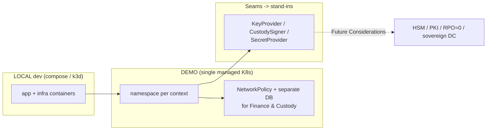

### 1.4 Scope: the 24 topics & traceability principle

This architecture is delivered as **24 topics** spanning: context decomposition and the C4 system view; runtime and store assignments; the event-spine and Published Language; the OHS / master-data boundaries (R6, R7); the custody event-sourcing core (R1); the Finance isolation and exactly-once design (R2); the escrow saga (R3); fraud four-eyes enforcement (R4); government read-mostly access (R5); offline-first + USSD/SMS/IVR channels (R8); the edge tier (gateway + BFFs); API and messaging conventions; idempotency, outbox/inbox, DLQ and park-and-freeze; security (OIDC/JWT/mTLS/PDP/four-eyes); the Ch.27 remediations; observability; local and demo deployment topology; data lifecycle and projections; and the resilience, sequencing, and Future-Considerations seams.

**Out of scope (HARD LIMITS):** procurement, vendor/cloud comparisons, cost estimation, sovereignty/national-DC studies, market research, and governance/audit/freeze/executive reporting. Where production genuinely requires these, they appear as a **single line under Future Considerations** — never as analysis here. No new ADR chains are created; no executable code, manifests, Terraform, SQL, or protobuf is included (illustrative compose/topology as `text` or mermaid is permitted).

**Traceability principle.** Every section header carries the upstream references it realizes (e.g., *R2 · ADR-008 · SA Ch.12 · Ch.27.2*). If a mechanism cannot be traced to BA/SA/ADR/R/Roadmap/EF, it does not belong in this document. Conversely, each frozen invariant is realized by at least one named section — giving bidirectional coverage from canon to build.

### 1.5 Context → Runtime → Store

The 13 bounded contexts, their owning teams, runtimes, and primary stores. This table is the spine of every later section.

| # | Context | Team | Runtime | Primary store | Key services |
|---|---------|------|---------|---------------|--------------|
| 1 | Identity / KYC | Substrate | C#/.NET | Relational | `identity-svc`, `kyc-adapter-svc` |
| 2 | Catalog | Substrate | Go | Relational + search | `catalog-svc` |
| 3 | Custody Ledger | Provenance Core | Go | Event-sourced | `custody-ledger-svc` (sole writer, R1) |
| 4 | Provenance Graph / Recall | Provenance Core | Go | Graph | `provenance-projection-workers`, `recall-svc` |
| 5 | Inventory / NIL | Provenance Core | Go | Relational projection | `inventory-svc`, `stock-projection-workers`, `nil-rollup-svc` |
| 6 | B2C | Commerce | Node/TS | Relational + search | `b2c-order-svc`, `b2c-catalog-read-svc` |
| 7 | B2B | Exchange | Java/Spring | Relational | `b2b-trade-svc`, `margining-svc` |
| 8 | Finance | Finance | Java/Spring | **Isolated** relational double-entry | `finance-ledger-svc`, `escrow-svc`, `payout-svc`, `mfs-bank-adapters` |
| 9 | Logistics | Logistics | Go | Relational + time-series | `logistics-svc`, `telemetry-ingest-workers` |
| 10 | Fraud | Risk | Python + Go | (service state) | `fraud-scoring-svc`, `enforcement-svc` |
| 11 | Government | Government | C#/.NET | (read models) | `oversight-read-svc`, `intervention-svc` |
| 12 | Analytics | Substrate | Python | OLAP | `analytics-pipeline`, `forecasting-svc` |
| 13 | Platform Services | Substrate | Go | (mixed) | `notification-svc`, `search-svc`, `document-svc`, `audit-log-svc` |
| — | **Edge** | Substrate | Go / Node-TS | — | `api-gateway-svc`, `app-bff`, `ussd-ivr-bff`, `partner-bff`, `offline-sync-gateway` |
| — | **Spine** | Substrate | Kafka-class | log | `event-spine` (versioned Published Language) |

> Stores follow R6 (**no cross-store joins**): every cross-context read is a projection fed from the spine, never a foreign query. Finance (#8) and Custody (#3) carry the strongest isolation, realized in the showcase per §1.3.

---

## 2. System Context (C4 Level 1)

DOKANDAR is a single logical platform that intermediates between Bangladesh's commerce participants (farmers through consumers) and the national rails they depend on (mobile financial services, identity registries, telco messaging, mapping). This section fixes the **system boundary**, names every human **actor** and **external system**, and pins each integration to the **single adapter** that owns it. Everything here traces to BA contexts #1/#8/#13, **R7** (Identity + Catalog as upstream master data) and **R8** (offline-first + USSD/SMS/IVR reach), and is realized concretely in §3 (containers).

### 2.1 Context Diagram

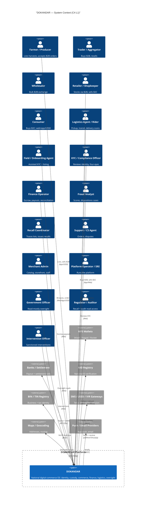

### 2.2 Actors (17)

The 17 actors map onto the RBAC/ABAC subject taxonomy enforced at the PDP; each reaches the platform only through the EDGE tier (gateway + BFFs), never a service directly.

| # | Actor | Primary contexts | Entry channel |
|---|-------|------------------|---------------|
| 1 | Farmer / Producer | #2, #3, #7 | app-bff, ussd-ivr-bff |
| 2 | Trader / Aggregator | #7, #5 | app-bff, partner-bff |
| 3 | Wholesaler | #7, #8 | partner-bff |
| 4 | Retailer / Shopkeeper | #6, #7, #5 | app-bff |
| 5 | Consumer | #6 | app-bff, ussd-ivr-bff |
| 6 | Logistics Agent / Rider | #9, #3 | app-bff + offline-sync-gateway |
| 7 | Field / Onboarding Agent | #1, #2 | app-bff + offline-sync-gateway |
| 8 | KYC / Compliance Officer | #1 | app-bff (back-office) |
| 9 | Finance Operator | #8 | partner-bff (back-office) |
| 10 | Fraud Analyst | #10 | app-bff (back-office) |
| 11 | Recall Coordinator | #4 | app-bff (back-office) |
| 12 | Support / CS Agent | #6, #7, #9 | app-bff (back-office) |
| 13 | Merchant Admin | #2, #6 | partner-bff |
| 14 | Platform Operator / SRE | #13, all | internal tooling |
| 15 | Government Officer | #11 | app-bff (oversight) |
| 16 | Regulator / Auditor | #11, #4, #13 | app-bff (oversight) |
| 17 | Intervention Officer | #11, #10 | app-bff (oversight) |

**R8 reach:** actors 1, 5, 6, 7 are explicitly low-/no-connectivity capable — the `ussd-ivr-bff` serves feature-phone flows (USSD menus, SMS, IVR) and `offline-sync-gateway` reconciles field captures, so the actor set is provably servable without a smartphone or steady network.

### 2.3 External Systems

Seven external system classes sit outside the boundary. Per **R6** (no cross-store reach) and the SA adapter convention, **no business service calls an external system directly** — every outbound dependency terminates at exactly one adapter, which translates between the external protocol and the internal Published Language. This keeps third-party volatility, retries, and credentials at the edge of each context.

| External system | Direction | Protocol (showcase stand-in) | Owning adapter | Context |
|-----------------|-----------|------------------------------|----------------|---------|
| MFS Wallets (bKash / Nagad / Rocket) | Out + webhook in | REST + HMAC webhook (mock MFS sandbox) | `mfs-bank-adapters` | #8 Finance |
| Banks / settlement rails | Out + file in | REST + batch file (simulated) | `mfs-bank-adapters` | #8 Finance |
| NID identity registry | Out (verify) | REST request/response (mock NID) | `kyc-adapter-svc` | #1 Identity |
| BIN / TIN business+tax registry | Out (verify) | REST request/response (mock registry) | `kyc-adapter-svc` | #1 Identity |
| SMS / USSD / IVR gateways | Out + in (sessions) | SMPP/HTTP + USSD callbacks (simulator) | `notification-svc` (+ `ussd-ivr-bff` for sessions) | #13 Platform |
| Maps / geocoding / routing | Out (query) | REST (self-hosted/mock tiles) | `logistics-svc` | #9 Logistics |
| Push / email providers | Out (send) | REST (dev sink/Mailpit) | `notification-svc` | #13 Platform |

**Adapter-ownership rules (traced):**

- **Money rails → `mfs-bank-adapters` only (R2, ADR/Ch.27).** All wallet collection, refund, payout and settlement traffic is funnelled through Finance's adapter set; idempotency-key on every money write and the exactly-once OUTBOX/INBOX boundary live here, isolating Finance's no-shared-DB invariant from external retry storms and duplicate webhooks.
- **Identity rails → `kyc-adapter-svc` only (R7).** NID and BIN/TIN verification is master-data acquisition for Identity (#1), whose verified outputs are then published as upstream OHS master data consumed read-only by every other context. No downstream context queries NID/BIN directly.
- **Messaging + notifications → `notification-svc` (R8).** A single egress point for SMS/IVR/push/email gives one place for templating, rate-limit, locale and delivery-receipt handling; `ussd-ivr-bff` owns only the *interactive session* half of USSD/IVR, delegating actual send/receive to `notification-svc`.
- **Maps → `logistics-svc`.** Geocoding and routing are intrinsic to Logistics (#9); no other context needs map egress, so ownership stays local.

### 2.4 Boundary Invariants

| Invariant | Statement | Trace |
|-----------|-----------|-------|
| Single front door | All human/partner traffic enters via `api-gateway-svc` → BFF; no actor reaches a service directly | SA edge convention |
| One adapter per rail | Each external system has exactly one owning adapter; business services never egress directly | R6 |
| Master data is upstream | NID/BIN identity + Catalog flow downstream as read-only OHS master data | R7 |
| Reachable offline | USSD/SMS/IVR + offline-sync make the platform usable on feature phones / poor links | R8 |
| Money isolation begins at the edge | External money traffic is quarantined in `mfs-bank-adapters` with idempotency + exactly-once | R2, Ch.27 |

**Showcase note.** All external systems are exercised against **software stand-ins** (mock MFS/NID/BIN sandboxes, telco simulator, dev mail/push sinks, self-hosted map tiles) wired behind the same adapter interfaces a production deployment would use. Real national rails, production PKI and certified MFS connectivity are **Future Considerations** only — the seams (`KeyProvider`, `SecretProvider`, adapter ports) exist so the swap is configuration, not redesign. Container-level realization of these adapters, BFFs and the event-spine follows in **§3**.

---

## 3. Container & Component Architecture (C4 L2/L3)

This section drops from the system context (L1) into the **container view (C4 L2)** — the deployable/runnable units of DOKANDAR — and then zooms into a single service at the **component level (C4 L3)** to fix the canonical ports-and-adapters layering every team follows. Container boundaries trace **ADR-001** (context = deployable boundary, no cross-store coupling, R6) and **ADR-011** (transactional outbox/inbox as the only event egress/ingress). Internal layering and naming trace **Engineering-Foundation v1.0** coding standards.

### 3.1 Container View (C4 L2)

Each of the 13 contexts is a namespace of one or more service containers, fronted by the edge tier and integrated only through the **event-spine** (async) or **gRPC OHS** (sync). No service reaches another context's datastore (R6). Finance (#8) and Custody (#3) sit in isolated namespaces with their own DB instances (R1/R2; showcase = NetworkPolicy + dedicated Postgres, not separate clusters).

```mermaid
C4Container
    title "DOKANDAR — Container View (C4 L2, showcase substrate)"

    Person(citizen, "Citizen / Merchant / Trader")
    Person(officer, "Gov Officer / Ops")

    System_Boundary(edge, "Edge Tier") {
        Container(gw, "api-gateway-svc", "Go", "TLS, authN, routing, rate-limit")
        Container(appbff, "app-bff", "Node/TS", "Mobile/web BFF")
        Container(ussdbff, "ussd-ivr-bff", "Node/TS", "USSD/SMS/IVR (R8)")
        Container(partnerbff, "partner-bff", "Node/TS", "Partner APIs")
        Container(offsync, "offline-sync-gateway", "Go", "Offline-first sync (R8)")
    }

    System_Boundary(core, "Provenance Core + Substrate") {
        Container(identity, "identity-svc / kyc-adapter", "C#/.NET", "Identity master (R7)")
        Container(catalog, "catalog-svc", "Go", "Catalog master (R7)")
        Container(custody, "custody-ledger-svc", "Go", "Event-sourced sole writer (R1)")
        Container(prov, "provenance/recall-svc", "Go", "Graph projection + recall")
        Container(inv, "inventory/nil-svc", "Go", "Stock + NIL projections")
        Container(platform, "platform-services", "Go", "notification/search/document/audit")
        Container(analytics, "analytics/forecasting", "Python", "OLAP")
    }

    System_Boundary(commerce, "Commerce / Exchange / Logistics / Risk / Gov") {
        Container(b2c, "b2c-order/read-svc", "Node/TS", "B2C orders")
        Container(b2b, "b2b-trade/margining", "Java/Spring", "B2B trade")
        Container(logi, "logistics-svc", "Go", "Fulfilment + telemetry")
        Container(fraud, "fraud/enforcement-svc", "Python+Go", "Scoring + four-eyes (R4)")
        Container(gov, "oversight/intervention-svc", "C#/.NET", "Read-mostly oversight (R5)")
    }

    System_Boundary(fin, "Finance (isolated namespace, R2)") {
        Container(finledger, "finance-ledger-svc", "Java/Spring", "Double-entry, poisha")
        Container(escrow, "escrow/payout-svc", "Java/Spring", "Escrow saga (R3)")
        Container(mfs, "mfs-bank-adapters", "Java/Spring", "MFS/bank rails")
    }

    ContainerQueue(spine, "event-spine", "Kafka-class", "Versioned Published Language (R6)")

    System_Boundary(infra, "Shared Infra Containers (compose/k8s)") {
        ContainerDb(pg, "PostgreSQL", "Per-context relational")
        ContainerDb(graph, "Graph store", "Neo4j-class")
        ContainerDb(os, "OpenSearch", "Catalog/search")
        ContainerDb(redis, "Redis", "Cache/idempotency")
        Container(minio, "MinIO", "Documents/blobs")
        Container(otel, "OTel/Prometheus/Grafana/Loki/Tempo", "Observability")
    }

    Rel(citizen, gw, "REST /v1, USSD", "HTTPS")
    Rel(officer, gw, "REST /v1", "HTTPS")
    Rel(gw, appbff, "routes")
    Rel(gw, ussdbff, "routes")
    Rel(gw, partnerbff, "routes")
    Rel(appbff, b2c, "gRPC")
    Rel(b2c, custody, "gRPC OHS")
    Rel(custody, spine, "outbox publish (R1)")
    Rel(spine, prov, "consume")
    Rel(spine, inv, "consume")
    Rel(spine, finledger, "consume (exactly-once, R2)")
    Rel(escrow, spine, "saga events (R3)")
    Rel(spine, platform, "audit OHS sink (R6)")
    Rel(custody, pg, "writes own DB")
    Rel(finledger, pg, "isolated DB (R2)")
    Rel(prov, graph, "projects")
    Rel(catalog, os, "indexes")
```

**Edge contract:** external traffic is **REST `/v1`** through `api-gateway-svc` + channel BFFs; everything behind the gateway is **gRPC over mTLS** on the OHS plane. Master data (Identity, Catalog) is published as **OHS Published Language** (R7); all state-change facts flow only via the spine's versioned PL with the audit-log-svc as a mandatory sink (R6).

### 3.2 Component View (C4 L3) — `custody-ledger-svc` (hexagonal)

`custody-ledger-svc` is the **sole writer** of custody facts (R1), so it is the reference implementation of the ports-and-adapters layering all services follow (EF standards). Inbound adapters translate transport into application commands; the domain aggregate is pure; the **outbox** is the only egress to the spine (ADR-011); the **inbox** dedupes inbound events. Money-/custody-mutating commands require an `idempotency-key` and per-aggregate ordering on `PPID`.

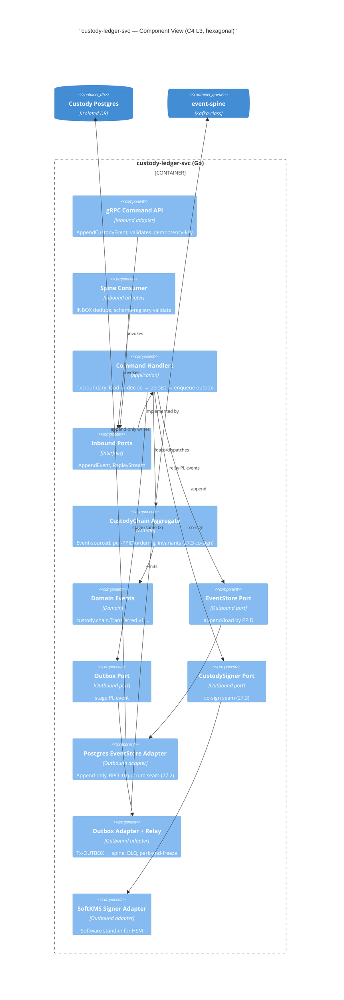

**Layering rules (EF, apply to every service):**

| Layer | May depend on | Must NOT depend on | Holds |
|-------|---------------|--------------------|-------|
| Inbound adapter | Inbound ports | Domain internals, DB | Transport, auth context, envelope/problem+json mapping |
| Application | Inbound + outbound ports | Concrete adapters | Tx boundary, idempotency, orchestration |
| Domain | Nothing (pure) | Ports, frameworks, IO | Aggregates, invariants, domain events |
| Outbound adapter | Outbound ports | Inbound/application | Postgres, spine, signer, KMS |

The single DB transaction spans **append-to-eventstore + stage-to-outbox** (ADR-011): an event is never published unless its state change committed, and never lost once it did. Production-grade seams (`CustodySigner`, RPO=0 quorum store) are **interface ports** with software stand-ins here; only the interface is canon.

### 3.3 Service Catalog

| Service | Context | Runtime | Store | Sync (in) | Async |
|---------|---------|---------|-------|-----------|-------|
| identity-svc, kyc-adapter-svc | #1 Identity | C#/.NET | Relational | gRPC | PL publisher (R7) |
| catalog-svc | #2 Catalog | Go | Relational+search | gRPC | PL publisher (R7) |
| custody-ledger-svc | #3 Custody | Go | Event-sourced | gRPC | Outbox sole writer (R1) |
| provenance-projection-workers, recall-svc | #4 Provenance | Go | Graph | gRPC (read) | Consumer/projector |
| inventory-svc, stock-projection-workers, nil-rollup-svc | #5 Inventory | Go | Relational projection | gRPC (read) | Consumer/projector |
| b2c-order-svc, b2c-catalog-read-svc | #6 B2C | Node/TS | Relational+search | gRPC | Producer/consumer |
| b2b-trade-svc, margining-svc | #7 B2B | Java/Spring | Relational | gRPC | Producer/consumer |
| finance-ledger-svc, escrow-svc, payout-svc, mfs-bank-adapters | #8 Finance | Java/Spring | Isolated double-entry | gRPC | Exactly-once consumer + saga (R2/R3) |
| logistics-svc, telemetry-ingest-workers | #9 Logistics | Go | Relational+time-series | gRPC | Producer/consumer |
| fraud-scoring-svc, enforcement-svc | #10 Fraud | Python+Go | Relational+feature | gRPC | Consumer + four-eyes (R4) |
| oversight-read-svc, intervention-svc | #11 Government | C#/.NET | Read projections | gRPC (read) | Consumer (read-mostly, R5) |
| analytics-pipeline, forecasting-svc | #12 Analytics | Python | OLAP | — | Consumer |
| notification/search/document/audit-log-svc | #13 Platform | Go | Mixed (OS/MinIO/relational) | gRPC | Audit OHS sink (R6) |
| api-gateway-svc | Edge | Go | Stateless | REST /v1 | — |
| app/ussd-ivr/partner-bff, offline-sync-gateway | Edge | Node/TS, Go | Stateless/cache | REST /v1 | — |
| event-spine | Spine | Kafka-class | Log | — | Versioned PL backbone |

Every money-/custody-writing service in this catalog enforces `idempotency-key`, transactional outbox/inbox, per-topic DLQ, and per-key park-and-freeze; reads cross contexts only via gRPC OHS or spine projections — never a foreign datastore.

> **Future considerations (not built):** HSM-backed `CustodySigner`, national-PKI mTLS issuance, two-site RPO=0 quorum eventstore, and multi-region spine replication replace the software stand-in adapters at the same port boundaries — zero domain/application change required.

---

## 4. Deployment & Kubernetes Architecture (showcase)

> **Posture.** This section targets the *simplest substrate that proves the architecture* (SHOWCASE). Production-grade controls (HSM, national PKI, RPO=0 two-site quorum, sovereign DC, multi-region) are **de-scoped** here per **SA Ch.25** and surface only as interface seams (`KeyProvider`, `CustodySigner`, `SecretProvider`) with software stand-ins. See [Future Considerations](#future).

### 4.1 Two environments, one image set

| Aspect | LOCAL (dev/CI) | DEMO (managed K8s) |
|---|---|---|
| Substrate | `docker-compose` / `k3d` / `kind` / devcontainer | One managed Kubernetes cluster (provider-agnostic) |
| Infra | All deps as containers | Containers + one managed Postgres-class per isolation zone |
| Isolation (R2 Finance, R1 Custody) | separate DB containers + compose networks | **namespace + NetworkPolicy + dedicated DB instance** |
| TLS/secrets | self-signed CA (`cert-manager`/`mkcert`), Vault-dev, software KMS | same stand-ins, namespaced |
| Scale | single replica | HPA/KEDA on stateless tiers |
| Goal | fast inner loop, deterministic e2e | prove topology, isolation, scaling seams |

Build **one OCI image per service**; environments differ only by config (12-factor) and replica/scale policy — no per-env code paths.

### 4.2 LOCAL topology (docker-compose / k3d)

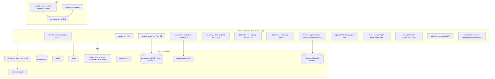

**Notes.** Internal calls are gRPC OHS; external are REST `/v1` via gateway/BFFs. One `docker-compose` profile per stack (`core`, `commerce`, `finance`, `observability`) lets a developer boot only the slice under test. Seed/migration jobs run as one-shot containers before app start. `offline-sync-gateway` exercises R8 (offline-first + USSD/SMS/IVR) against the same gateway.

### 4.3 DEMO topology — namespace-per-context

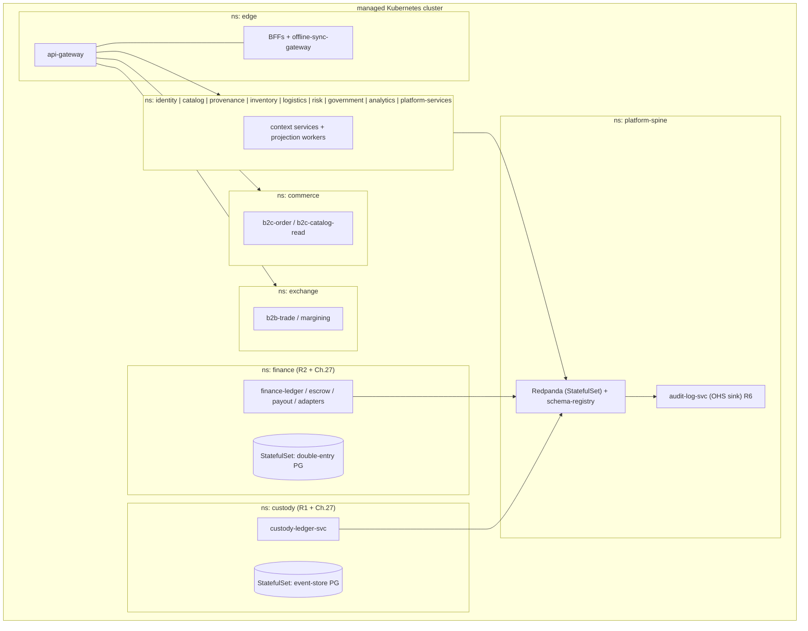

Each of the 13 contexts maps to its **own namespace** (large contexts share a namespace only when team-aligned). Cross-namespace traffic is gRPC OHS through ClusterIP services; no cross-store DB access (R6). The event-spine namespace is the single Published-Language hub; `audit-log-svc` is the OHS append-only sink.

### 4.4 Finance & Custody isolation (showcase realization of R1/R2/Ch.27)

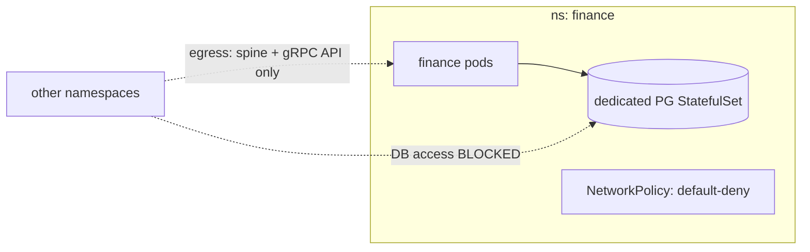

| Control | Showcase mechanism | Trace |
|---|---|---|
| No shared DB | dedicated Postgres StatefulSet per zone, distinct credentials | R2 |
| Network isolation | namespace `NetworkPolicy` default-deny; allow only spine + published gRPC ports | R2/R6 |
| Sole writer | only `custody-ledger-svc` mounts event-store creds | R1 |
| Exactly-once / idempotency | OUTBOX→spine + INBOX dedupe; `idempotency-key` on money/custody writes | R2, SA conv. |
| Fencing / co-sign / cooling-off | app-layer logic + `CustodySigner` seam (software-backed) | Ch.27.1/27.3/27.4 |
| Quorum durability (RPO=0) | **not built** — single-instance PG with PVC; seam recorded | Ch.27.2 → Future |

### 4.5 Workload classification — Deployment vs StatefulSet

| Workload | Kind | Why |
|---|---|---|
| Stateless services, BFFs, gateway, projection/ingest workers | **Deployment** | Replaceable replicas; scale horizontally; read-side rebuildable from spine |
| Redpanda / Kafka-class spine | **StatefulSet** | Stable network identity, per-broker PVC, ordered membership (per-aggregate ordering PPID/WLT/TXN) |
| Custody event-store Postgres | **StatefulSet** | Durable ordered log, stable identity, PVC; R1 sole-writer store |
| Finance double-entry Postgres | **StatefulSet** | Durable isolated state, PVC; R2 |
| Other context Postgres, OpenSearch, graph, Redis | **StatefulSet** | Stable identity + persistent volumes (Redis cache may use Deployment if ephemeral) |
| Schema registry | **Deployment** | Stateless over spine-backed store |
| Migrations / seed / saga-recovery | **Job / CronJob** | Run-to-completion; DLQ replay and park-and-freeze sweeps as CronJobs |

Stateful infra in DEMO may instead bind to a **managed** Postgres/streaming service via the same `SecretProvider` seam; the StatefulSet form is the in-cluster default for self-contained demos.

### 4.6 Autoscaling (HPA / KEDA)

- **HPA** on stateless tiers (gateway, BFFs, `b2c-order-svc`, read-models) keyed on CPU + p95 latency; sensible `minReplicas` to preserve availability.
- **KEDA** (event-driven) on **consumer workers** — `telemetry-ingest-workers`, `stock-projection-workers`, `provenance-projection-workers`, `analytics-pipeline` — scaling on Kafka/Redpanda **consumer-group lag** so projections drain backlog without over-provisioning.
- **No autoscaling** on StatefulSet datastores or the custody sole-writer; capacity is fixed and vertical in the showcase.
- `PodDisruptionBudget` + `readiness`/`liveness`/`startup` probes on all workloads; finance/custody pods carry stricter `minAvailable` to protect ordered processing.

### 4.7 De-scoped vs SA Ch.25 (showcase delta)

| SA Ch.25 production element | Showcase substitution |
|---|---|
| Multi-region / two-site sync quorum (RPO=0) | single managed cluster, PVC-backed StatefulSets |
| HSM / national PKI | software KMS + `cert-manager` self-signed CA; `KeyProvider`/`CustodySigner` seams |
| Sovereign in-country DC | provider-agnostic managed K8s |
| Separate physical clusters for Finance/Custody | namespace + NetworkPolicy + dedicated DB instance |
| External secret manager / national IdP | Vault-dev + local OIDC issuer via `SecretProvider` seam |

<a id="future"></a>
**Future Considerations (one line).** Production hardening — HSM-backed `CustodySigner`, national PKI/mTLS roots, RPO=0 two-site quorum (Ch.27.2), sovereign multi-region DC, and physical Finance/Custody cluster separation — plugs into the named seams without changing service code; tracked, not built.

---

## 5. Network Architecture & Communication Patterns

DOKANDAR networks split cleanly into three planes: a **north–south edge plane** (untrusted clients → gateway → BFFs), an **east–west service plane** (gRPC OHS between contexts), and an **asynchronous event plane** (the event-spine, R6). The governing rule is simple and load-bearing: **synchronous calls only for pre-commit invariants that must hold *before* a write; everything post-commit propagates as versioned events.** This keeps contexts loosely coupled, preserves the custody sole-writer (R1) and Finance no-shared-DB (R2) guarantees, and lets read models rebuild from the spine. Traces: SA Ch.19 (Communication Patterns), Ch.20 (Event Spine), R6.

### 5.1 Edge Plane (North–South)

One gateway, three purpose-built BFFs, plus the offline-sync gateway for R8 channels. The gateway terminates TLS, authenticates (OAuth2/OIDC + JWT), and enforces coarse rate limits and ABAC pre-filters at the PDP; BFFs aggregate per client experience and never hold business rules.

| Edge component | Runtime | Clients | Responsibility |
|---|---|---|---|
| `api-gateway-svc` | Go | All external | TLS term, JWT validation, routing, global rate limit, problem+json normalization |
| `app-bff` | Node/TS | Consumer + merchant apps | B2C/B2B read aggregation, session shaping |
| `ussd-ivr-bff` | Node/TS | USSD/SMS/IVR (R8) | Menu state machines, short-code → REST mapping, idempotent retries |
| `partner-bff` | Node/TS | 3PLs, banks, gov portals | Partner-scoped REST, webhook fan-out, mTLS to partners |
| `offline-sync-gateway` | — | Offline-first clients (R8) | Batch sync, conflict envelope, idempotency-key replay |

External contract: REST `/v1` only, envelope `{success,data,error,meta}`, `problem+json` on error, `idempotency-key` mandatory on money/custody writes. No external caller ever reaches a context service directly.

### 5.2 Service Plane (East–West, gRPC OHS)

Internal context-to-context calls are **gRPC** over the OHS (Open Host Service) contracts, secured by **mTLS** and authorized at a per-call **PDP** (RBAC/ABAC). gRPC is reserved for *synchronous reads* and *pre-commit checks* — never for cross-store writes (R6: no cross-store transactions).

### 5.3 Sync vs Async Decision Table

The decisive question per interaction: *must this answer be true before I commit?* If yes → sync gRPC. If it is a fact about something already committed → async event.

| Interaction | Mode | Mechanism | Rationale / Trace |
|---|---|---|---|
| B2C/B2B order → Inventory **reserve** | **Sync** | gRPC `inventory-svc.Reserve` | Stock invariant must hold pre-placement (R5 projection, ARB) |
| Order placement → Identity/KYC tier check | **Sync** | gRPC `identity-svc` | Authorization gate before write (R7 OHS master data) |
| Order placement → Catalog price/SKU resolve | **Sync** | gRPC `b2c-catalog-read-svc` | Read-only, must precede pricing (R7) |
| Order **placed** → custody event | **Async** | `b2c.order.Placed.v1` → spine | Post-commit; custody is sole writer (R1) |
| Custody append → provenance/inventory projections | **Async** | `custody.lot.Appended.v1` | Event-sourced fan-out, per-aggregate order PPID (R1) |
| Order → Finance escrow hold | **Async (saga)** | escrow saga over spine | R2/R3 exactly-once; no shared DB |
| Fraud scoring on order/txn | **Async** | `*.order.Placed.v1` → `fraud-scoring-svc` | Out-of-band, four-eyes enforcement (R4) |
| Fraud **enforcement** action | **Sync** | gRPC `enforcement-svc` (post four-eyes) | Authorized control action |
| Logistics telemetry ingest | **Async** | `telemetry-ingest-workers` | High-volume time-series, fire-and-forget |
| Gov oversight reads | **Sync (read)** | gRPC `oversight-read-svc` | Read-mostly projections (R5) |
| Recall propagation | **Async** | `provenance.recall.Issued.v1` | Graph fan-out to affected lots |
| Notifications / audit sink | **Async** | spine → `notification-svc`, `audit-log-svc` | OHS audit sink (R6) |

**Heuristic:** reserve, authorize, price, validate → sync. Placed, appended, settled, scored, shipped, recalled → async.

### 5.4 Request Path + Event Path (Mermaid)

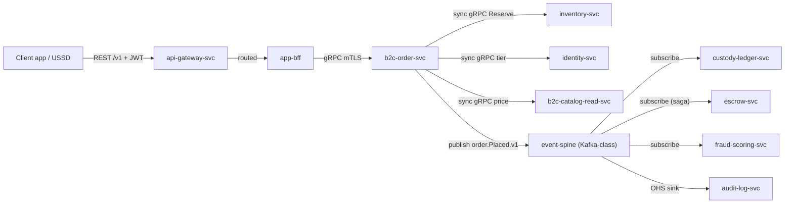

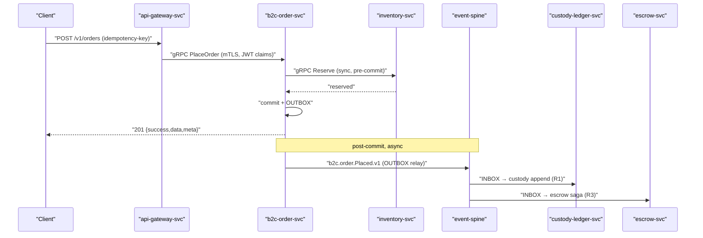

### 5.5 Reliability Semantics on the Wire

Async delivery is **at-least-once**; idempotency is mandatory on the consumer side.

| Concern | Mechanism | Trace |
|---|---|---|
| Exactly-once *effect* | transactional **OUTBOX** (producer) + **INBOX** dedupe (consumer) | R2, SA Ch.20 |
| Ordering | per-aggregate partition key (PPID/WLT/TXN) | R1 |
| Poison messages | per-topic **DLQ** + per-key **park-and-freeze** | SA Ch.20, Ch.27.1 fencing |
| Schema evolution | versioned PL `<context>.<aggregate>.<Event>.vN` + schema registry | R6 |
| Sync timeouts | gRPC deadlines + circuit breakers; fail-closed on auth/reserve | SA Ch.19 |
| Money/custody retries | `idempotency-key` replay-safe writes | SA conventions |

### 5.6 Service Mesh & mTLS (Showcase Posture)

The showcase proves zero-trust east–west traffic without production-grade PKI. **DEMO** runs a single managed Kubernetes cluster with **namespaces per context**; Finance and Custody get **dedicated namespaces + NetworkPolicy + separate DB instance** (isolation seam, not separate clusters/HSM). **LOCAL** runs the same topology under docker-compose/k3d.

| Aspect | Showcase implementation | Future consideration (seam) |
|---|---|---|
| East–west encryption | **mesh-lite**: in-cluster mTLS via `cert-manager` self-signed CA, sidecar or app-level TLS | National PKI, HSM-backed identities |
| Service identity | SPIFFE-style workload certs from dev CA | Sovereign cert authority |
| Authorization | PDP sidecar (RBAC/ABAC), JWT propagation | Centralized policy plane |
| Network segmentation | `NetworkPolicy` per namespace; deny-by-default | Multi-region service mesh federation |
| Spine isolation | no cross-store topics; audit OHS sink only | Dedicated broker tiers per trust zone |

A full service mesh (Istio/Linkerd-class) is an *optional* upgrade, not required to prove the architecture — the **mesh-lite** path (cert-manager CA + NetworkPolicy + PDP sidecar) delivers mTLS, identity, and segmentation at showcase scale. Production controls (HSM, national PKI, multi-region federation, RPO=0 quorum per Ch.27.2) are documented as **Future Considerations** only and exposed today via the `SecretProvider`/`KeyProvider` interface seams with software-backed stand-ins.

---

## 6. Security, Identity/AuthN Flow & Authorization Model

DOKANDAR's security model is **deny-by-default, identity-anchored, and PII-free on the wire**. Identity (#1) is the master-data authority for principals (R7); every other context is a relying party. Authentication issues short-lived tokens; authorization is centralized in the Identity **Policy Decision Point (PDP)**; four-eyes (R4) and custodial co-sign (Ch.27.3) live in **application logic**, not infrastructure. All cryptographic dependencies sit behind **provider seams** so the showcase runs on software stand-ins while production-grade backends are demonstrated, not built.

### 6.1 AuthN — OAuth2/OIDC, OTP/USSD, Short JWT + Refresh

`identity-svc` is the OAuth2/OIDC authorization server. Tokens are **short-lived access JWTs** (~10 min) carrying a minimal claim set, paired with **opaque refresh tokens** (rotating, revocable, device-bound). Channels degrade gracefully per R8: smartphone apps use OIDC Authorization Code + PKCE; feature phones use **OTP over USSD/SMS/IVR** brokered by `ussd-ivr-bff`, exchanging a verified OTP for the same token pair.

| JWT claim | Meaning | Used by |
|---|---|---|
| `did` | Decentralized/Identity principal id (master key, R7) | All contexts as subject |
| `roles` | Coarse RBAC roles (e.g. `merchant`, `gov_auditor`) | PDP role lookup |
| `tier` | KYC assurance tier (T0–T3) | ABAC limits, money writes |
| `deviceId` | Bound device for offline/refresh | Refresh rotation, fraud (#10) |
| `scope` | Granted OAuth scopes | Gateway pre-filter |
| `exp/iat/jti` | Expiry, issue, replay id | Gateway, audit (#13) |

**Events carry no PII** (R6): tokens reference principals by `did` only; names, NIDs, and KYC documents stay inside Identity and `document-svc`, retrieved on demand over gRPC OHS. Custody/Finance events reference `did`/wallet ids, never personal data.

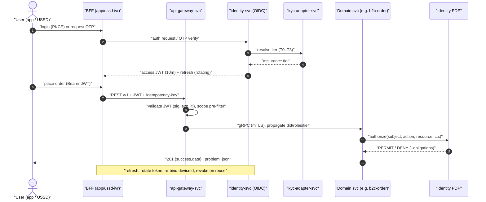

The gateway performs **stateless JWT validation** (signature, `exp`, `jti` replay window) and coarse scope filtering; it never makes business authorization decisions. Refresh-token **reuse detection** revokes the family and forces re-auth, feeding a signal to fraud (#10).

### 6.2 AuthZ — RBAC + ABAC via Identity PDP (Deny-by-Default)

Authorization is a **two-layer model** evaluated centrally:

- **RBAC (coarse):** roles in the JWT gate broad capability classes (who may *attempt* an action).
- **ABAC (fine):** the PDP evaluates attributes — `tier`, ownership, context state, jurisdiction, amount, four-eyes status — to permit the *specific* request. **Default is DENY**; a request is permitted only on an explicit matching rule.

The **§8.3 capability matrix is the single source of truth** for role × action × context; the PDP is its executable form. Services call the PDP as a **Policy Enforcement Point (PEP)** with `authorize(subject, action, resource, context)` and honor returned obligations (e.g. "requires second approver", "log to audit"). Finance and Custody embed the PEP **in-process** to satisfy isolation (R2) — they never delegate trust to the network edge.

| Layer | Mechanism | Decision input | Example |
|---|---|---|---|
| Edge | Gateway JWT + scope | `scope`, `exp`, `jti` | Reject expired/replayed token |
| RBAC | PDP role rules | `roles` | `merchant` may create catalog draft |
| ABAC | PDP attribute rules | `tier`, owner, amount, state | T3 + four-eyes to release payout |
| Domain | App invariants | Aggregate state | Escrow cooling-off (Ch.27.4) |

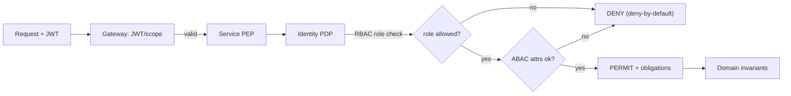

**Government context (#11) is read-mostly (R5):** `oversight-read-svc` receives only read-scoped PDP grants over OHS read models; any state change routes through `intervention-svc`, which is itself four-eyes-gated. The PDP enforces this asymmetry — write actions for gov roles default-deny except the narrow intervention set.

### 6.3 Four-Eyes & Custodial Co-Sign as Application Logic

Both **R4 four-eyes** and **Ch.27.3 custodial co-sign** are modeled as **application-level approval state machines**, not IAM features — keeping them testable, auditable, and portable across the provider seams below.

- **Four-eyes (R4):** sensitive actions (payout release, fraud enforcement, gov intervention) create a **pending approval** aggregate. The PDP returns a `requires_second_approver` obligation; the action commits only after a *distinct* `did` (different from the initiator, enforced by the service) approves. Both approvals, with `jti` and timestamps, are written to `audit-log-svc` via the OHS audit sink (R6).
- **Custodial co-sign (Ch.27.3):** custody/finance state transitions requiring institutional custody invoke a `CustodySigner` seam. In the showcase this is a **software co-signer** producing verifiable signatures; the *interface* models the eventual HSM/threshold-signing flow. Co-sign is an explicit step in the escrow saga (R3) and respects the cooling-off window (Ch.27.4).

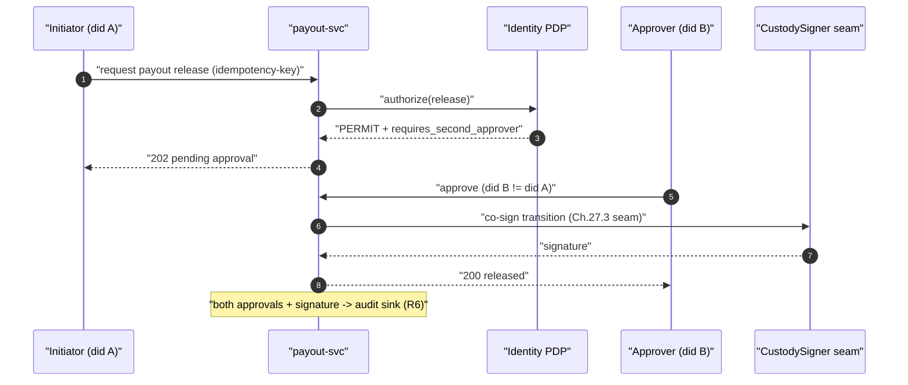

### 6.4 Secrets, Keys & Transport — Provider Seams

All sensitive material is accessed through **stable interface seams**, never embedded. This satisfies the showcase posture: real seams, software-backed stand-ins, production backends recorded only as Future Considerations.

| Seam | Showcase stand-in | Responsibility |
|---|---|---|
| `SecretProvider` | Vault-dev / sealed env | DB creds, OAuth client secrets, signing keys |
| `KeyProvider` | Software KMS | JWT signing/rotation, envelope encryption keys |
| `CustodySigner` | Software co-signer | Custody/finance co-sign (Ch.27.3) |
| `CertProvider` | cert-manager self-signed CA | mTLS service certs, rotation |

**Transport security:** all internal gRPC OHS traffic uses **mTLS** with certs issued by the self-signed CA; the gateway terminates external TLS and re-originates mTLS inward. Finance (#8) and Custody (#3) run in **dedicated namespaces with NetworkPolicy and separate DB instances** (R2, SA Ch.20), so even valid service identities cannot reach their stores cross-namespace. JWT signing keys rotate via `KeyProvider` with overlapping validity; `jti` + short `exp` bound replay risk.

**PII discipline (R6):** secrets and PII never enter events, logs, or traces. OTel spans carry `did`/`jti` correlation ids only; `audit-log-svc` is the sole OHS sink for security-relevant decisions (auth grants, four-eyes approvals, co-signs).

### 6.5 Future Considerations

Recorded as seams only, **not built** in the showcase: hardware HSM and national PKI behind `KeyProvider`/`CustodySigner`; threshold/multi-party custody signing; sovereign in-country key residency; continuous device attestation and risk-adaptive (step-up) auth driven by fraud (#10) signals; and external IdP federation for government principals. Each maps to an existing interface, so adoption is a backend swap with no change to AuthN/AuthZ flow.

---

## 7. Event-Driven Architecture & Event Flow

The event spine is DOKANDAR's nervous system: the **only** sanctioned cross-context integration channel (R6 — no cross-store DB access). Every context publishes domain events as a versioned **Published Language (PL)** and consumes upstream events to build local projections. This section defines the spine topology, delivery guarantees, and the canonical money/custody saga. Traces R6, ADR-010 (event-spine + schema registry), SA Ch.17 (eventing) and Ch.18 (reliability/DLQ).

### 7.1 Spine Topology (Showcase)

A Kafka-class broker (**Redpanda** locally for a single-binary footprint; a managed Kafka in the DEMO cluster) carries all PL events. A **Schema Registry** enforces compatibility; the **audit-log-svc** is an Open-Host-Service sink subscribing to all topics (R6 OHS audit sink).

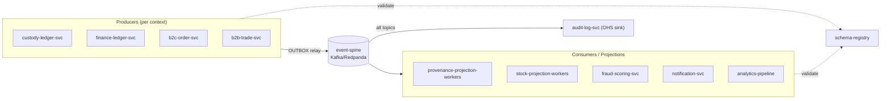

### 7.2 Topic Naming & Schema Registry

Events are named `<context>.<aggregate>.<Event>.vN`; one logical topic per aggregate type, partitioned by aggregate id so all events for one entity share a partition (per-aggregate ordering).

| Concern | Convention |
|---------|-----------|
| Event name | `custody.parcel.Transferred.v1`, `finance.txn.Settled.v1` |
| Topic | `<context>.<aggregate>` (e.g. `b2c.order`) |
| Partition key | aggregate id — **PPID** (parcel/provenance), **WLT** (finance wallet), **TXN** (transaction), order id |
| Schema | Avro/Protobuf in registry; **backward-compatible** evolution only; new fields optional w/ defaults |
| Versioning | breaking change ⇒ new `.vN` topic; consumers migrate, old retired after drain |
| Envelope | `{ eventId, occurredAt, schemaVersion, key, traceId, payload }`; idempotency-key echoed for money/custody |

Compatibility is **enforced at publish** by the registry — an incompatible schema is rejected before it can poison consumers.

### 7.3 Delivery Guarantees: OUTBOX + INBOX + DLQ

DOKANDAR uses no dual-write to broker and DB. Reliability rests on four building blocks (SA Ch.18):

| Mechanism | Purpose |
|-----------|---------|
| **Transactional OUTBOX** | Event row committed in the **same local DB transaction** as the state change; a relay polls and publishes. Guarantees at-least-once with no lost events (no DB/broker dual-write). |
| **INBOX (dedup)** | Consumer records processed `eventId`; replays are idempotent. Combined with idempotency-key, yields effectively-once processing — critical for R2 (Finance exactly-once). |
| **Per-topic DLQ** | After bounded retries a poison message routes to `<topic>.dlq` with failure context; main partition keeps flowing. |
| **Per-key park-and-freeze (Ch.27.5)** | When a single aggregate key fails repeatedly, that **key** is parked (frozen) while other keys on the partition continue. Prevents one bad PPID/WLT from stalling head-of-line for the whole partition. |

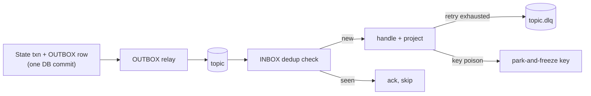

### 7.4 Key Events (Producer → Consumers)

| Event `vN` | Producer | Primary Consumers | Ordering key |
|------------|----------|-------------------|--------------|
| `identity.account.Verified.v1` | identity-svc | catalog, b2c, b2b, fraud | account id |
| `catalog.product.Published.v1` | catalog-svc | b2c-catalog-read, search, b2b-trade | product id |
| `custody.parcel.Transferred.v1` | custody-ledger-svc (sole writer R1) | provenance-projection, inventory, recall | PPID |
| `inventory.stock.Adjusted.v1` | stock-projection-workers | b2c-order, b2b-trade, nil-rollup | SKU/location |
| `b2c.order.Placed.v1` | b2c-order-svc | finance(escrow), fraud, logistics, notification | order id |
| `finance.escrow.Held.v1` | escrow-svc | b2c-order, notification, analytics | WLT/TXN |
| `finance.txn.Settled.v1` | finance-ledger-svc | payout, analytics, audit | TXN |
| `logistics.shipment.Delivered.v1` | logistics-svc | b2c-order, escrow, notification | shipment id |
| `fraud.case.Decided.v1` | enforcement-svc (four-eyes R4) | b2c-order, b2b-trade, gov-oversight | case id |
| `recall.batch.Initiated.v1` | recall-svc | provenance, inventory, notification, gov | batch id |

All ten flow to **audit-log-svc** (OHS sink) and **analytics-pipeline** for OLAP, without cross-store coupling.

### 7.5 Representative Saga — Order → Reserve → Pay → Ship → Settle

A B2C purchase is an **orchestrated escrow saga** (R3) spanning Commerce, Provenance, Finance, Fraud, and Logistics. Money and custody writes carry an **idempotency-key**; escrow honors the Ch.27.4 cooling-off window before settlement.

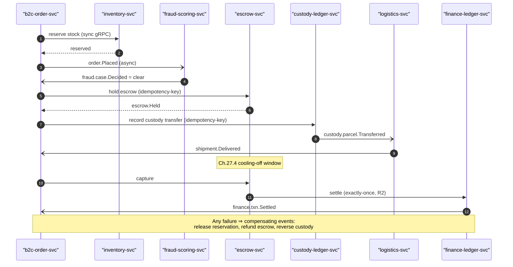

**Compensation:** each forward step has an inverse (`stock.ReservationReleased`, `escrow.Refunded`, `custody.TransferReversed`). The orchestrator (b2c-order-svc) drives the saga; on timeout or `fraud.case.Decided = block` it emits compensations in reverse order. Escrow reversal during cooling-off is a pure refund (no settlement occurred).

### 7.6 Strong vs Eventual Consistency

| Flow | Consistency | Why |
|------|-------------|-----|
| Stock reservation (order time) | **Strong** (sync gRPC) | Prevents oversell at decision point |
| Escrow hold / capture / settle | **Strong + exactly-once** | Money correctness (R2); double-entry isolated DB |
| Custody transfer record | **Strong** (sole writer, R1) | Event-sourced ledger is source of truth |
| Provenance / inventory / NIL projections | **Eventual** | Read models rebuilt from custody events |
| Catalog read, search index | **Eventual** | OHS master-data fan-out (R7) |
| Fraud scoring, analytics, notifications | **Eventual** | Async, non-blocking to the purchase path |

**Rule of thumb:** the money/custody **spine of truth is strongly consistent and exactly-once**; everything downstream (projections, search, analytics, fraud, notifications) is **eventually consistent** via the spine. This keeps the critical financial and provenance invariants tight while letting read models and intelligence scale independently. Production-grade upgrades (RPO=0 quorum per Ch.27.2, cross-region mirroring) are recorded only as Future Considerations — the seams (OUTBOX relay, schema registry, DLQ) are already in place to adopt them without redesign.

---

## 8. Data Architecture & Database Placement

Each service owns its persistence; no two services share a schema or connection (R6 "no cross-store"). Storage engines are chosen per service workload — event store, graph, relational, time-series, OLAP, search, object. In the SHOWCASE these are all **containers** (LOCAL: docker-compose/k3d; DEMO: StatefulSets/operators in a per-context namespace). Finance and Custody get **dedicated DB instances** (separate Postgres container/StatefulSet + NetworkPolicy), proving isolation without separate clusters or HSM.

### 8.1 Database-per-Service Placement

| # | Context / Service | Engine class | Showcase container | Rationale (trace) |
|---|---|---|---|---|
| 1 | identity-svc, kyc-adapter-svc | Relational | Postgres | Master data OHS (R7); ADR-002 DB-per-service |
| 2 | catalog-svc | Relational + Search | Postgres + OpenSearch | Master data (R7); search read model |
| 3 | **custody-ledger-svc** | **Event store** (append-only) | Postgres (events table) | Sole writer, event-sourced (R1, ADR-003); SA Ch.21 |
| 4 | provenance-projection-workers, recall-svc | Graph | Neo4j-class | CQRS read model from custody events; recall traversal |
| 5 | inventory-svc, stock-projection-workers, nil-rollup-svc | Relational projection | Postgres | Projected from custody (R1); NIL rollups |
| 6 | b2c-order-svc, b2c-catalog-read-svc | Relational + Search | Postgres + OpenSearch | Order write store + denormalized catalog read |
| 7 | b2b-trade-svc, margining-svc | Relational | Postgres | Trade + margin state |
| 8 | **finance-ledger-svc**, escrow-svc, payout-svc | **Isolated relational** (double-entry) | **Dedicated Postgres instance** | No-shared-DB + exactly-once (R2, ADR-002); SA Ch.22 |
| 9 | logistics-svc, telemetry-ingest-workers | Relational + Time-series | Postgres + Timescale/TS | Shipment state + telemetry streams |
| 10 | fraud-scoring-svc, enforcement-svc | Relational + feature cache | Postgres + Redis | Scores, cases, four-eyes state (R4) |
| 11 | oversight-read-svc, intervention-svc | Relational (read-mostly) | Postgres (read replicas) | Read-mostly oversight (R5) |
| 12 | analytics-pipeline, forecasting-svc | OLAP | ClickHouse-class / DuckDB | Columnar analytics OHS sink |
| 13 | notification-svc, search-svc, document-svc, audit-log-svc | Mixed | Redis, OpenSearch, MinIO (object), append-only Postgres | Platform utilities; audit = OHS sink (R6) |

Cross-context data flows **only** through the event-spine (R6); a service never reaches into another's database. The dedicated Finance instance carries its own credentials (`SecretProvider` seam) and is reachable only from the Finance namespace via NetworkPolicy.

### 8.2 CQRS: Custody Event Store → Projections (R1, ADR-003)

`custody-ledger-svc` is the **single writer** of custody truth. It persists immutable, per-aggregate-ordered events (PPID = provenance/parcel id) to its event store. All other custody views are **derived read models** rebuilt by replaying events — they are never authoritative and never written directly by clients.

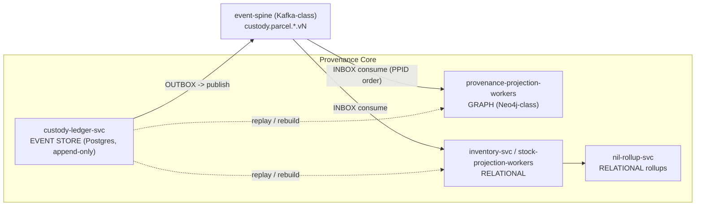

Key invariants:
- **Write path:** commands hit `custody-ledger-svc` only; it appends events within one local transaction (event + OUTBOX row).
- **Read path:** graph (provenance/recall), relational (inventory), and rollups (NIL) consume `custody.parcel.*.vN` in **PPID order**, idempotent via INBOX dedup keys.
- **Rebuildable:** any projection store can be dropped and replayed from the event store — projections hold no independent truth.
- **Ordering & recovery:** per-key park-and-freeze + per-topic DLQ guard a poisoned PPID stream without blocking others.

### 8.3 Transactional Outbox / Inbox

To publish events atomically with state changes **without** distributed transactions (R6, SA Ch.21), every writer uses the **transactional OUTBOX** pattern; every consumer uses the **INBOX** (dedup) pattern.

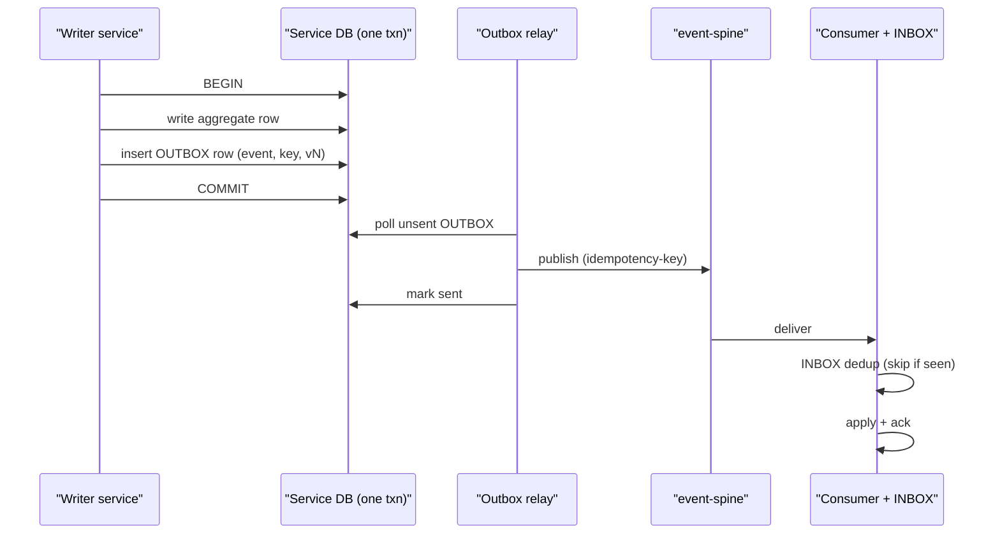

Conventions (frozen):
- **Outbox table** lives in the *same* DB/transaction as the aggregate — event and state commit together or not at all.
- A relay (CDC or poller) ships rows to the spine; redelivery is safe because the consumer's **INBOX** dedups on `idempotency-key` (mandatory on money/custody writes), giving exactly-once *effect* (R2).
- Failed deliveries route to a **per-topic DLQ**; per-key **park-and-freeze** quarantines a bad aggregate stream while siblings flow.
- Finance keeps its outbox inside its **isolated** instance, so R2 holds with zero shared transactions.

**Illustrative outbox shape** (every writer):

```text
outbox(id, aggregate_type, aggregate_id, event_type, event_version,
       payload(jsonb), idempotency_key, occurred_at, sent_at NULL)
inbox(consumer, idempotency_key, processed_at)   -- PK(consumer, idempotency_key)
```

### 8.4 Schema Migrations — Expand-Contract (EF)

Every schema change is **backward-compatible and online**, per the Engineering-Foundation expand-contract rule. No service takes a write outage for a migration; rollout and rollback are decoupled from code deploys.

| Phase | Action | Property |
|---|---|---|
| **Expand** | Add new columns/tables/indexes (nullable/defaulted); add new event version `vN+1` alongside `vN` | Old + new code both run |
| **Migrate** | Backfill in batches; dual-write old+new fields; consumers tolerate both event versions | Reversible at any point |
| **Contract** | After all readers/writers cut over, drop old columns and retire `vN` | Only once no consumer reads old shape |

Rules:
- **Versioned, forward-only** migration files per service; each runs in its own DB (DB-per-service keeps migrations independent).
- **No destructive change** in the same release that introduces its replacement — expand and contract are separate deploys.
- **Event evolution** mirrors schema evolution: register `vN+1` in the **schema registry**, keep `vN` until consumers drain, then deprecate (Published Language compatibility, R6).
- **Event store is append-only** — custody never runs an in-place `UPDATE`; "corrections" are new compensating events, so migrations there touch only projections, which are rebuildable (8.2).
- Finance double-entry migrations preserve the integer-poisha money type and never rewrite posted ledger rows; new periods/accounts are additive.

### 8.5 Data Architecture Decisions (traceability)

| Decision | Trace |
|---|---|
| DB-per-service, no shared schema | ADR-002, R6, SA Ch.21 |
| Custody event-sourced, sole writer | R1, ADR-003, SA Ch.21 |
| CQRS projections (graph/inventory/NIL) rebuildable from events | R1, ADR-003 |
| Finance isolated DB instance + exactly-once | R2, ADR-002, SA Ch.22 |
| Outbox/Inbox + DLQ + park-and-freeze | R6, SA Ch.21 |
| Expand-contract online migrations | Engineering-Foundation v1.0 |
| Money as integer poisha | SA money convention, Ch.22 |

### 8.6 Future Considerations

Production-grade data controls are demonstrated as **interface seams only**, not built: `SecretProvider` (currently Vault-dev/software KMS) would front HSM-managed DB credentials; RPO=0 two-site quorum replication (Ch.27.2) and sovereign in-country DC placement would replace single-instance containers; managed CDC and cross-region read replicas would replace the polling outbox relay. None affect the application-level contracts above.

---

## 9. Observability Architecture — Logging, Metrics, Tracing

> Traces to EF Ch.9 (telemetry standards, correlation, SLOs) and SA Ch.24 (observability conventions, RED/USE, business SLIs). Showcase posture: the full stack runs as containers locally and as a per-namespace deployment in the demo cluster. No managed APM, no production alerting estate — those are Future Considerations.

### 9.1 Principles

| # | Principle | Source |
|---|-----------|--------|
| O1 | **OpenTelemetry is the only instrumentation contract.** Every service (C#/Go/Java/Node/Python) emits OTLP; backends are swappable. | EF Ch.9 |
| O2 | **One correlation spine.** `trace_id`/`span_id` (W3C `traceparent`) + a business `correlation_id` propagate across REST→gRPC→event-spine→offline. | SA Ch.24 |
| O3 | **Three pillars, one context.** Logs, metrics, traces share `trace_id`, `service`, `context`, `tenant` so Grafana pivots log↔trace↔metric. | EF Ch.9 |
| O4 | **No PII in telemetry.** Identity/KYC payloads, MFS account numbers, NID, phone → redacted/hashed at the SDK boundary (R6 audit is the lawful sink, not logs). | R6, EF Ch.9 |
| O5 | **Money & custody are the strictest SLO tier.** Settlement correctness and custody append latency dominate alerting. | R1, R2, Ch.27 |

### 9.2 Telemetry Pipeline

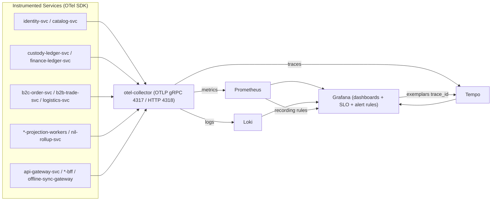

The **collector** is the single funnel: services never talk to a backend directly. It does batching, tail-sampling (keep 100% of errors + money/custody spans, sample the rest), and a redaction processor (O4). Local dev and demo K8s run the **same collector config**, so a developer's laptop pipeline is identical to the cluster — only replica count and storage class differ.

```text
# compose / k8s services (identical roles)
otel-collector  : OTLP in → fan-out to prometheus/tempo/loki
prometheus      : scrape + remote-write target; recording & alert rules
tempo           : trace store (object backend = MinIO)
loki            : log store  (object backend = MinIO)
grafana         : unified UI; provisioned dashboards + datasources
```

### 9.3 Structured Logging

JSON lines only; one schema across all five runtimes. The SDK injects trace context so any log line opens its trace in Tempo.

| Field | Example | Notes |
|-------|---------|-------|
| `ts` | `2026-06-26T10:00:00Z` | RFC3339 UTC |
| `level` | `info` / `warn` / `error` | |
| `service` / `context` | `escrow-svc` / `finance` | maps to namespace |
| `trace_id` / `span_id` | `4bf92f...` | W3C, links to Tempo |
| `correlation_id` | `ord_01H...` | business flow id, survives async hops |
| `idempotency_key` | `idmp_…` | money/custody writes only |
| `event` | `escrow.saga.step.captured` | matches PL event name where applicable |
| `aggregate_id` | `WLT-…` / `TXN-…` / `PPID-…` | per-aggregate ordering key |

**PII rule (O4):** allow-list logging — only declared safe fields are emitted; raw request/response bodies are never logged. NID/phone/MFS numbers are hashed (`subject_ref`) so a flow is traceable without exposing the subject. Violations fail CI via a log-schema lint in the EF pipeline.

### 9.4 Metrics — RED/USE + Business SLIs

**RED** (request-driven services: gateway, BFFs, order/trade/identity/catalog) and **USE** (workers, brokers, DBs) are the baseline; business SLIs are what make DOKANDAR provable.

| Layer | Signals |
|-------|---------|
| RED (per endpoint) | `http_request_rate`, `error_ratio`, `latency_p50/p95/p99` |
| USE (workers/infra) | consumer-group **lag**, DLQ depth, park-and-freeze count, CPU/mem saturation, DB pool utilization |
| Business SLIs | see below |

| Business SLI | Definition | Owner context |
|--------------|-----------|---------------|
| **Settlement correctness** | `1 − (finance double-entry imbalance events / settlements)` — must be 1.0 | #8 Finance (R2) |
| **Exactly-once integrity** | duplicate-suppressed writes / total money writes via INBOX | #8 Finance |
| **Custody append latency** | time from command → `custody.*.vN` durably appended (sole writer) | #3 Custody (R1) |
| **Projection lag** | event-spine offset age for stock/provenance/NIL projections | #4, #5 |
| **Escrow saga health** | open sagas, cooling-off timers active, comp/rollback rate (27.4) | #8 (R3) |
| **Recall propagation** | time from recall raised → graph reachability computed | #4 |
| **Offline reconciliation** | sync-gateway queue depth, conflict rate, replay age | #13 / R8 |
| **Fraud four-eyes** | pending dual-approval count + age (no auto-enforce breaches) | #10 (R4) |

Money/custody metrics carry **exemplars** (a `trace_id` per data point), so a latency spike on the settlement panel jumps straight to the offending trace.

### 9.5 Distributed Tracing — Saga & Offline Boundary

Tracing must survive the two hardest seams: the **escrow saga** (synchronous + event hops across isolated Finance) and the **offline boundary** (a USSD/SMS order that lands hours later).

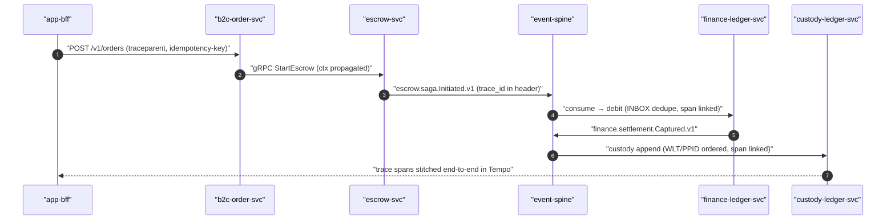

- **Across async hops:** trace context travels in **event headers** (not just sync calls). Consumers create a span **linked** to the producer span, so per-aggregate ordering (PPID/WLT/TXN) is visible as a causal chain, and DLQ/park-and-freeze re-entries attach to the original trace.
- **Across the offline boundary (R8):** the `offline-sync-gateway` stamps `correlation_id` + a captured `traceparent` at edge capture; on replay it opens a **new trace linked** to the original capture span, so a USSD order's full lifecycle (capture → sync → order → escrow) reads as one connected story despite the time gap.
- **Across store isolation (R2/R6):** Finance/Custody spans cross only via the spine; no shared DB span ever appears — a useful negative invariant the trace graph makes obvious.

### 9.6 SLO Targets (Showcase)

Demo-scale targets that prove the shape of production guarantees. Strictness increases toward money/custody.

| Tier | Service / SLI | SLO | Error budget signal |
|------|---------------|-----|---------------------|
| **Tier-0 (strictest)** | Settlement correctness | **100%** (zero imbalance) | any breach = page-equivalent alert |
| Tier-0 | Custody append latency | p99 < 250 ms | rising p99 → investigate before budget burn |
| Tier-0 | Exactly-once integrity | 100% dup-suppressed | INBOX dedupe miss = critical |
| Tier-0 | Escrow saga completion | p99 < 5 s (excl. cooling-off) | stuck-saga age threshold |
| **Tier-1** | Identity/Catalog OHS reads (R7) | 99.9%, p95 < 150 ms | master-data is everyone's dependency |
| Tier-1 | Projection lag (stock/provenance/NIL) | < 2 s p95 | lag breach → read-model staleness |
| Tier-1 | Gateway/BFF availability | 99.9%, p95 < 300 ms | RED error-ratio burn rate |
| **Tier-2** | Analytics/forecasting freshness | < 15 min | best-effort, batch-tolerant |
| Tier-2 | Notification/search | 99.5% | degrade gracefully |
| Tier-2 | Offline reconciliation | replay p95 < 1 h of connectivity | queue-depth alert |

Grafana encodes these as **recording rules + multi-window burn-rate** alert rules; money/custody panels are the default home dashboard.

### 9.7 Future Considerations

- Managed APM, long-retention trace/metric storage, and on-call paging/incident tooling (showcase uses Grafana alerts only).
- RPO=0 quorum (27.2) and fencing (27.1) telemetry hooks exist as metric seams; the production two-site verification is not built.
- PII tokenization service behind the redaction processor (showcase hashes inline).
- SLO-driven autoscaling and adaptive tail-sampling tuned to national traffic volumes.

---

## 10. Configuration & Secrets Strategy

> Traces: EF Ch.10 (Config & Secrets), SA Ch.20.7 (Runtime Configuration), ADR-002/008 (Finance/Custody isolation), R2/R6, Ch.27 fencing. Honors SHOWCASE posture — software-backed seams; HSM/KMS/national-PKI are Future Considerations only.

### 10.1 Principles

| # | Principle | Implication |
|---|-----------|-------------|
| P1 | **Config over code** | No threshold, limit, TTL, or endpoint is hardcoded; all externalized per environment. |
| P2 | **Three-tier config** | `build-time` (image) → `deploy-time` (ConfigMap/env) → `run-time` (feature-flag service). |
| P3 | **Secrets never in config** | Secrets resolve only through the `SecretProvider` seam, never ConfigMaps, repos, or images. |
| P4 | **Per-context isolation** | Each context (namespace) owns its config + secret scope; Finance/Custody scopes are non-shared (R2, ADR-002). |
| P5 | **Fail-fast validation** | Services validate required config + secret presence at startup; missing/invalid → refuse to boot (no silent defaults). |
| P6 | **Auditable change** | Flag/config/secret changes emit `platform.config.Changed.v1` to the audit OHS sink (R6); money/custody flag flips require four-eyes (R4). |

### 10.2 Configuration Taxonomy

```text
CONFIG TIERS
  build-time   : language runtime, base feature set, schema-registry URL shape
                 -> baked into container image (immutable, version-pinned)
  deploy-time  : env-specific thresholds, limits, TTLs, topic names, DB DSNs (sans creds)
                 -> ConfigMap + env vars, per namespace, GitOps-managed
  run-time     : feature flags, kill-switches, dynamic limits
                 -> flag service (poll/stream), hot-reload, no redeploy
```

| Config class | Example keys | Owner context | Tier |
|--------------|--------------|---------------|------|
| Money/limit | `escrow.coolingOff.hours`, `payout.maxPoisha`, `txn.idempotency.ttl` | Finance (#8) | deploy-time |
| Custody/fencing | `custody.fencing.tokenTtl`, `outbox.flush.intervalMs` | Custody (#3) | deploy-time |
| Fraud thresholds | `fraud.autoBlock.score`, `fraud.review.score` | Risk (#10) | deploy + run-time |
| Channel TTLs | `ussd.session.ttl`, `offline.sync.window`, `otp.ttl` | Platform (#13), Identity (#1) | deploy-time |
| Search/catalog | `search.index.refreshMs`, `catalog.cache.ttl` | Catalog (#2) | deploy-time |
| Spine | `event.dlq.maxRetries`, `inbox.dedupe.window`, topic names | per-context | deploy-time |

Convention: keys are `snake.dotted`, env vars are `SCREAMING_SNAKE` (`ESCROW_COOLINGOFF_HOURS`). All money values are **integer poisha** (BR/SA money rule). Config is loaded via a shared `config-loader` library per stack (Go/Node/Java/.NET/Python) that enforces a typed schema, applies defaults only for non-critical keys, and panics on missing critical keys (P5).

### 10.3 Secrets — the `SecretProvider` Seam

Secrets are accessed exclusively through a narrow interface so the production backend can be swapped without touching service code. This is the showcase realization of the EF Ch.10 secret-seam mandate.

```text
SecretProvider (interface)
  get(ref: "context/name@version") -> SecretValue   // never logged, redacted in traces
  lease(ref) -> {value, ttl, renew()}               // for dynamic DB creds
  rotateHook(ref, onRotate)                          // push notification on rotation

Bindings:
  SHOWCASE (built)      : Vault-dev | sealed-secrets | K8s Secrets (per-namespace, RBAC-scoped)
  PRODUCTION (seam only): HSM / cloud-KMS / national-PKI  -> FUTURE CONSIDERATIONS
```

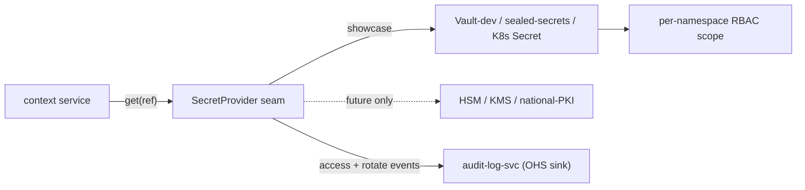

| Concern | Showcase realization | Future Consideration |
|---------|---------------------|----------------------|
| Secret store | Vault-dev / sealed-secrets / K8s Secrets | HSM-backed KMS, sovereign keystore |
| Custody co-sign key (Ch.27.3) | software `CustodySigner` stand-in, key in SecretProvider | HSM dual-control co-sign |
| TLS/mTLS certs | cert-manager **self-signed CA** | national PKI, hardware roots |
| App signing/JWT keys | software KMS stand-in (`KeyProvider`) | KMS/HSM with attestation |
| DB credentials | Vault-dev dynamic lease or static K8s Secret | KMS-issued short-lived creds |

**Isolation guarantees:** Finance (#8) and Custody (#3) secret scopes live in dedicated namespaces with NetworkPolicy denying cross-namespace secret access; their DB credentials reference separate DB instances (R2 no-shared-DB, ADR-002 — showcase isolation = namespace + NetworkPolicy + separate DB instance, not separate clusters/HSM). No secret crosses a store boundary (R6).

**Hygiene:** secrets are mounted as in-memory volumes or injected env at process start (never written to disk in app layers); the redaction filter scrubs secret refs from logs, traces, and `problem+json` error bodies (security rule — errors must not leak sensitive data); pre-commit + CI secret scanning blocks plaintext secrets in the repo.

### 10.4 Feature Flags

Two disjoint flag classes prevent ops controls from drifting into release toggles:

| Class | Purpose | Lifetime | Change authority | Audited |
|-------|---------|----------|------------------|---------|
| **Release flags** | Gate unfinished/rolled-out features (e.g. `b2b.margining.v2`) | Short, removed after GA | Owning team via GitOps | yes |
| **Ops flags / kill-switches** | Runtime safety controls; degrade or disable a capability fast | Permanent | Restricted (four-eyes for money/custody/fraud) | yes |

**Mandatory kill-switches** (read at runtime, default-safe):

```text
fraud.autonomous.enabled        # master switch for Fraud autonomous action set (R4)
fraud.autoBlock.enabled         # disable auto-block, force human review
enforcement.actions.enabled     # halt enforcement-svc autonomous actions
escrow.release.enabled          # freeze escrow saga releases (R3 / Ch.27.4)
payout.disbursement.enabled     # pause payouts (Finance #8)
custody.writes.frozen           # park-and-freeze custody writes (R1 / Ch.27.1 fencing)
offline.sync.enabled            # gate offline-sync-gateway intake (R8)
```

**Fraud autonomous kill-switch (R4):** `fraud.autonomous.enabled=false` immediately routes all Fraud actions to the four-eyes human-review queue instead of autonomous enforcement. The switch is **fail-safe** — if the flag service is unreachable, services treat autonomous action as **disabled** (deny-by-default), never the reverse.

```mermaid
sequenceDiagram
  participant Op as "Risk operator"
  participant FS as "flag-service"
  participant Aud as "audit-log-svc"
  participant Fr as "fraud-scoring-svc"
  participant En as "enforcement-svc"
  Op->>FS: "set fraud.autonomous.enabled=false (4-eyes approved)"
  FS->>Aud: "platform.config.Changed.v1"
  FS-->>Fr: "stream flag update"
  FS-->>En: "stream flag update"
  Fr->>En: "score event"
  En->>En: "flag off -> route to human-review queue"
```

Flags are delivered via a lightweight flag service (poll + stream) with a typed SDK per stack; every read resolves a default within ~50 ms locally cached, so flag-service unavailability degrades to the **safe default**, never a hard outage. Money/custody/fraud flag flips carry an idempotency-key and require a second approver (R4 four-eyes) before the change is accepted.

### 10.5 Rotation

| Asset | Showcase mechanism | Cadence (demo) | App impact |
|-------|--------------------|----------------|------------|
| App/JWT signing keys | `KeyProvider` rotate w/ overlapping `kid` | on-demand | zero-downtime; validate against old+new during overlap |
| TLS/mTLS certs | cert-manager auto-renew (self-signed CA) | short TTL | hot-reloaded |
| DB credentials | Vault-dev dynamic lease renew | per-lease TTL | transparent via `lease()` |
| Static secrets (adapter keys) | sealed-secrets re-seal + redeploy | manual | rolling restart |

Rotation is **overlap-based**: a new version is published before the old is retired; services subscribe to `rotateHook` and refresh in place, avoiding restart where the stack supports hot-reload. A rotation emits an audit event (R6); **no secret material** appears in the event — only `ref@version` and timestamp. Compromise response (security rule): flip the relevant kill-switch, rotate via `SecretProvider`, redeploy, and review sibling contexts for the same secret class.

### 10.6 Environment Matrix

| Aspect | LOCAL (compose/k3d/kind) | DEMO (single K8s cluster) |
|--------|--------------------------|---------------------------|
| Config source | `.env` + compose `environment` | ConfigMap per namespace (GitOps) |
| Secret backend | K8s Secrets / Vault-dev container | sealed-secrets / Vault-dev |
| Flag service | local container, file-seeded | in-cluster service |
| TLS | self-signed CA (cert-manager/local) | cert-manager self-signed CA |
| Isolation | logical (compose networks) | namespace + NetworkPolicy + separate Finance/Custody DB |

### 10.7 Future Considerations

- HSM/cloud-KMS/national-PKI bindings behind the existing `SecretProvider`/`KeyProvider`/`CustodySigner` seams (hardware dual-control for Ch.27.3 co-sign).
- KMS-issued short-lived DB credentials replacing static secrets; attestation-gated key release.
- Centralized cross-cluster config/flag governance and signed config provenance for production rollout.

---

## 11. Environment & Local Development Architecture

> Traces: EF Ch.11 (Environments & Local Dev), SA conventions (gateway/BFFs, OHS gRPC, OUTBOX/INBOX), R6 (event-spine), R8 (offline-first), Ch.27 fencing, SHOWCASE posture. **LOCAL DEV is the hero tier**: a developer must be able to run the whole system — or one service against stubbed dependencies — in minutes, with seeded, synthetic-only data.

### 11.1 Environment Tiers

| Tier | Substrate | Purpose | Isolation model | Data |
|------|-----------|---------|-----------------|------|
| **LOCAL** | docker-compose / devcontainer / k3d | Day-to-day dev; run full system or a slice | Single host; logical separation by container/network | Seeded synthetic fixtures only |
| **STAGING** *(optional)* | Shared k3d / small managed cluster | Integration soak, contract tests, demo rehearsal | Namespaces per context | Synthetic, larger volume |
| **DEMO** | Single managed Kubernetes cluster (provider-agnostic) | Showcase walkthroughs, stakeholder demos | Namespace-per-context + `NetworkPolicy`; Finance/Custody on **dedicated namespace + separate DB instance** | Synthetic, curated demo scenarios |

Production-grade controls (HSM, national PKI, RPO=0 quorum, in-country DC, multi-region) are **not built**. They are stubbed behind interface seams (`KeyProvider`, `CustodySigner`, `SecretProvider`) with software-backed stand-ins (software KMS, Vault-dev, cert-manager self-signed CA) and recorded only under Future Considerations.

**Golden rule (R-Finance/R1, Ch.27):** no environment ever holds real money, real KYC, or real custody events. All `finance-ledger`, `custody-ledger`, and `kyc-adapter` data is generated by the seed harness and clearly watermarked (`synthetic=true`, sandbox MFS/bank adapters).

### 11.2 Local Topology (the hero path)

```mermaid
flowchart TB
  subgraph dev["Developer Workstation (docker-compose / k3d / devcontainer)"]
    subgraph edge["Edge"]
      gw["api-gateway-svc"]
      bff["app-bff / ussd-ivr-bff / partner-bff"]
      ofs["offline-sync-gateway"]
    end
    subgraph svc["Context Services (slice or full)"]
      idn["identity-svc"]
      cat["catalog-svc"]
      cus["custody-ledger-svc"]
      fin["finance-ledger-svc"]
      b2c["b2c-order-svc"]
      plat["platform-svcs (notification/search/document/audit-log)"]
    end
    subgraph infra["Infra (all containers)"]
      pg[("Postgres x N")]
      rp[["Redpanda (Kafka-class) + schema-registry"]]
      neo[("Neo4j-class graph")]
      os[("OpenSearch")]
      minio[("MinIO")]
      redis[("Redis")]
      obs["OTel + Prometheus + Grafana + Loki + Tempo"]
    end
    subgraph seams["Stubbed Seams"]
      kms["software KMS / Vault-dev (SecretProvider, KeyProvider)"]
      signer["dev CustodySigner (co-sign stub, Ch.27.3)"]
      mfs["sandbox mfs-bank-adapters"]
    end
  end

  bff --> gw --> svc
  ofs --> gw
  svc --> pg
  svc --> rp
  cus --> rp
  cat --> os
  plat --> neo
  svc --> minio
  svc --> redis
  svc --> obs
  fin --> kms
  cus --> signer
  fin --> mfs
```

**Per-context Postgres instances** (not one shared DB) preserve **R2 Finance no-shared-DB** and **R6 no-cross-store** even on a laptop: each service owns its database; cross-context reads go through gRPC/OHS or the event-spine, never a shared schema. Custody remains the **sole writer** (R1) to its event-sourced store; everyone else consumes projections off Redpanda.

### 11.3 Compose Profiles — run the whole system, or a slice

The compose stack is split into **profiles** so a developer pulls up only what they need. This keeps laptop resource use low and makes "run one service against stubs" the default, not the exception.

```text
profiles:
  infra        -> postgres, redpanda, schema-registry, graph, opensearch,
                  minio, redis, observability  (always-on baseline)
  edge         -> api-gateway-svc, app-bff, ussd-ivr-bff, partner-bff,
                  offline-sync-gateway
  seams        -> software-kms, vault-dev, cert-manager-ca, sandbox-adapters
  ctx-identity -> identity-svc, kyc-adapter-svc
  ctx-catalog  -> catalog-svc
  ctx-custody  -> custody-ledger-svc, provenance/recall, inventory/nil
  ctx-commerce -> b2c-order-svc, b2c-catalog-read-svc
  ctx-finance  -> finance-ledger-svc, escrow-svc, payout-svc (separate DB)
  ctx-platform -> notification/search/document/audit-log-svc
  full         -> all of the above
```

| Task | Command (illustrative) | What spins up |
|------|------------------------|---------------|
| Full system | `make up PROFILE=full` | All contexts + edge + infra + seams |
| Commerce slice | `make up PROFILE=ctx-commerce` | infra + edge + b2c + stubbed catalog/finance |
| One service + stubs | `make dev SVC=b2c-order-svc` | infra baseline; service runs on host, deps stubbed |
| Tear down | `make down` | Stops containers, preserves named volumes |

### 11.4 Running One Service Against Stubbed Dependencies

A developer hacking on `b2c-order-svc` should not need a live `finance-ledger-svc` or `custody-ledger-svc`. The golden pattern:

```mermaid
sequenceDiagram
  participant Dev as "Local b2c-order-svc"
  participant WM as "WireMock/Prism (OHS stubs)"
  participant RP as "Redpanda"
  participant DB as "Postgres (b2c)"
  Dev->>WM: "gRPC/REST call to finance, custody, catalog (contract stubs)"
  WM-->>Dev: "Canned envelope {success,data,error,meta}"
  Dev->>RP: "publish b2c.order.OrderPlaced.v1 (OUTBOX)"
  RP-->>Dev: "consume custody/inventory events (replayed from seed)"
  Dev->>DB: "write own schema only"
```

Stubs are generated from the **same OpenAPI / protobuf contracts** the real services publish (schema registry is the source of truth), so a passing stubbed run is meaningful. Event dependencies are satisfied by **replaying seeded events** onto Redpanda rather than booting producer services. INBOX/idempotency-key handling is exercised against the stub stream, including a DLQ topic so park-and-freeze paths are testable locally.

### 11.5 Golden-Path Service Template

Every context service is scaffolded from one template so onboarding is uniform across the polyglot estate (C#/.NET, Go, Node/TS, Java/Spring, Python).

| Component | Provided by template |
|-----------|----------------------|
| `Dockerfile` + `compose.fragment.yml` | Multi-stage build; profile label; healthcheck |
| Config | 12-factor env vars; `SecretProvider` seam (Vault-dev locally) |
| API layer | REST `/v1` (external via gateway) **or** gRPC (internal OHS); `{success,data,error,meta}` envelope; `problem+json` errors |
| Eventing | transactional **OUTBOX** + **INBOX** + per-topic **DLQ**; schema-registry client; `<context>.<aggregate>.<Event>.vN` naming; per-aggregate ordering key (PPID/WLT/TXN) |
| Persistence | Owned Postgres (or graph/search/time-series) — **never shared** |
| Money | integer **poisha** type; `idempotency-key` middleware on money/custody writes |
| Security | OAuth2/OIDC + JWT; mTLS via self-signed dev CA; RBAC/ABAC PDP client; four-eyes hook (R4) |
| Observability | OTel traces/metrics/logs auto-wired to Tempo/Prometheus/Loki |
| Tests | unit + contract (Pact/schema) + a compose-based integration smoke |
| Seed hook | registers fixtures with the seed harness |

A new service is created with `make new-service NAME=foo-svc LANG=go CONTEXT=commerce`, which emits a runnable skeleton already wired to infra, contracts, and observability.

### 11.6 Seeded Data & Fixtures

A single **seed harness** loads deterministic synthetic data so demos and tests are reproducible:

- **Master data (R7 OHS):** Identity + Catalog seeds load first; all other contexts derive read models from them via events.
- **Custody (R1):** synthetic `custody.*.vN` events replayed onto Redpanda; projection workers rebuild provenance/inventory/NIL.
- **Finance:** sandbox MFS/bank adapters and synthetic double-entry balances — watermarked, reconcilable, never real.
- **Edge/offline (R8):** USSD/SMS/IVR and offline-sync fixtures so degraded-connectivity flows are demoable locally.

Seeds are versioned and idempotent (`make seed` / `make reseed`); no PII, no production exports — boundary validation rejects any non-synthetic import.

### 11.7 PR Previews & CI

- **PR preview:** each PR can spin an ephemeral **k3d / kind** environment via CI (namespace-per-PR on shared staging where available), running the `full` profile with seeded data; torn down on merge/close. Used for reviewer click-through and contract/E2E gates.
- **CI parity:** the same compose/profiles and seed harness run in CI, so "works on my machine" equals "works in the pipeline." Contract tests run against schema-registry; Finance/Custody isolation is asserted (separate DB, NetworkPolicy in cluster runs).

### 11.8 Future Considerations

Real HSM-backed `CustodySigner`/`KeyProvider`, national PKI for mTLS, RPO=0 two-site quorum, sovereign in-country DC, and multi-region demo clusters are out of showcase scope and remain interface-seam stand-ins; production would replace the dev implementations behind the same seams without changing service code.

---

## 12. Technology Mapping, Deployment Strategy & DR (high-level)

This section closes the implementation loop: it pins every context to a concrete runtime (ADR-011), defines the CI/CD pipeline and progressive-delivery posture (EF Ch.14), and states the SHOWCASE DR stance. Production-grade two-site quorum (SA Ch.23/25) is **de-scoped** and recorded only as Future Considerations.

### 12.1 Technology Mapping

Per-context language is fixed by **ADR-011** (polyglot-by-bounded-context). Frameworks and datastores target the simplest substrate that proves the architecture; "shared platform libs" are the cross-cutting capabilities every service consumes (envelope, outbox/inbox, PDP, OTel, schema registry client).

| # | Context / Key Svcs | Lang | Framework | Datastore (showcase) | Key shared-platform libs |
|---|---|---|---|---|---|
| 1 | Identity/KYC `identity-svc`, `kyc-adapter-svc` | C#/.NET | ASP.NET Core | Postgres (relational) | OIDC/JWT, PDP-client, outbox, OTel |
| 2 | Catalog `catalog-svc` | Go | chi/connect-go | Postgres + OpenSearch | OHS-publisher (R7), schema-registry, outbox |
| 3 | Custody Ledger `custody-ledger-svc` (sole writer R1) | Go | connect-go | Postgres (event-sourced, append-only) | idempotency-key, per-aggregate order (PPID), outbox, co-sign seam (27.3) |
| 4 | Provenance/Recall `provenance-projection-workers`, `recall-svc` | Go | connect-go | Neo4j-class graph | inbox, DLQ, OTel, spine-consumer |
| 5 | Inventory/NIL `inventory-svc`, `stock-projection-workers`, `nil-rollup-svc` | Go | connect-go | Postgres (projection) | inbox, park-and-freeze, fencing (27.1) |
| 6 | B2C `b2c-order-svc`, `b2c-catalog-read-svc` | Node/TS | NestJS | Postgres + OpenSearch | envelope, BFF-client, idempotency-key, outbox |
| 7 | B2B `b2b-trade-svc`, `margining-svc` | Java/Spring | Spring Boot | Postgres | saga-client (R3), PDP, outbox |
| 8 | Finance `finance-ledger-svc`, `escrow-svc`, `payout-svc`, `mfs-bank-adapters` | Java/Spring | Spring Boot | **Isolated** Postgres (double-entry, poisha) | exactly-once (R2), saga + cooling-off (27.4), idempotency-key, SecretProvider seam |
| 9 | Logistics `logistics-svc`, `telemetry-ingest-workers` | Go | connect-go | Postgres + TimescaleDB-class | inbox, DLQ, OTel |
| 10 | Fraud `fraud-scoring-svc`, `enforcement-svc` | Python + Go | FastAPI / connect-go | Postgres + feature store (Redis) | four-eyes (R4), PDP, spine-consumer |
| 11 | Government `oversight-read-svc`, `intervention-svc` | C#/.NET | ASP.NET Core | Postgres (read replicas, R5) | read-mostly cache, PDP, audit-sink |
| 12 | Analytics `analytics-pipeline`, `forecasting-svc` | Python | Spark-class / FastAPI | OLAP (ClickHouse-class) | spine-consumer (read-only), OTel |
| 13 | Platform `notification-svc`, `search-svc`, `document-svc`, `audit-log-svc` | Go | connect-go | Postgres, OpenSearch, MinIO | audit OHS-sink (R6), schema-registry |
| Edge | `api-gateway-svc`(Go), `app/ussd-ivr/partner-bff`(Node/TS), `offline-sync-gateway` | Go / Node/TS | chi / NestJS | Redis (session/rate-limit) | OAuth2 introspection, rate-limit, R8 offline/USSD |
| Spine | `event-spine` | — | Kafka-class (Redpanda local) | topic log + schema registry | versioned PL, per-key ordering, DLQ |

All infra (Postgres, Redpanda, Neo4j-class, OpenSearch, MinIO, Redis, OTel/Prometheus/Grafana/Loki/Tempo) runs as containers locally and as namespaced workloads in the demo cluster. Finance and Custody isolation = **dedicated namespace + NetworkPolicy + separate DB instance** (not separate clusters or HSM).

### 12.2 CI/CD Flow

One pipeline template per service (mono-repo, path-filtered). Money/custody services add a **conservative gate**: contract tests against the consumer-driven contract registry plus a manual approval before promotion.

```mermaid
flowchart LR
  src["Push / PR"] --> build["Build image\n(multi-stage)"]
  build --> unit["Unit + lint\ncoverage gate 80%"]
  unit --> scan["SAST + deps\n+ image scan"]
  scan --> contract["Contract tests\n(PL schema +\nconsumer-driven)"]
  contract --> reg{"Branch?"}
  reg -->|"main"| stage["Deploy to\nstaging ns"]
  reg -->|"PR"| preview["Ephemeral\npreview ns"]
  stage --> e2e["Smoke + e2e\nsaga/escrow checks"]
  e2e --> gate{"Finance/Custody?"}
  gate -->|"yes"| approve["Manual\nfour-eyes approve"]
  gate -->|"no"| auto["Auto promote"]
  approve --> deploy
  auto --> deploy["Deploy to\ndemo cluster"]
```

Pipeline guarantees:
- **Schema compatibility** — every event change is validated against the schema registry; backward-incompatible PL bumps require a new `vN` topic, never an in-place break (R6).
- **Contract tests** — consumer-driven contracts for both REST `/v1` (gateway/BFF) and internal gRPC OHS prevent integration drift.
- **Immutable artifacts** — images are content-addressed by digest; the same digest flows preview → staging → demo. No rebuilds between stages.

### 12.3 Progressive Delivery & Rollback

Delivery posture is tiered by blast radius. Stateless edge/read services roll fast; money/custody writers roll slowly with explicit verification.

| Tier | Services | Strategy | Health gates | Rollback |
|---|---|---|---|---|
| Edge / read | gateway, BFFs, `*-read-svc`, search, notification | Rolling, surge=25% | p99 latency, 5xx rate | Auto rollback on gate breach |
| Standard write | Catalog, B2C, B2B, Logistics, Inventory, Fraud | Canary 10%→50%→100% | error budget, DLQ depth, consumer lag | Auto rollback; park-and-freeze isolates poison keys |
| Critical | **Finance**, **Custody**, Escrow, Payout | Canary 5% + **manual approve** each step, off-peak window | exactly-once invariants, ledger balance checks, co-sign reachable | **Manual** rollback; outbox drains before scale-down; idempotency-key makes replays safe |

Rollback mechanics:
- Deploys are declarative (GitOps). Rollback = redeploy the previous image digest + manifest revision.
- **Schema-safe rollback**: because consumers tolerate old + new PL versions during a canary, rolling a producer back never strands consumers. Additive-only migrations (expand/contract) keep DB rollbacks safe.
- **Custody/Finance never lose data on rollback**: the transactional outbox is drained and INBOX dedup + idempotency-key guarantee at-most-once side effects on re-emit (R1, R2).

### 12.4 Disaster Recovery (Showcase, high-level)

Showcase DR proves the *mechanism* of recovery, not production resilience targets. Three building blocks: **datastore backups**, **restore drill**, and **event-spine replay** to rebuild projections.

```mermaid
flowchart TD
  subgraph sources["State sources"]
    pg["Postgres\n(per-context + isolated Finance/Custody)"]
    spine["Event-spine log\n(retained PL topics)"]
    obj["MinIO\n(documents)"]
    graph["Graph + OpenSearch\n(projections)"]
  end
  pg --> bk["Scheduled logical\nbackups -> MinIO bucket"]
  obj --> bk
  spine --> ret["Topic retention\n+ compacted state"]
  bk --> restore["Restore drill:\nspin DB from backup"]
  ret --> replay["Replay spine\nfrom offset"]
  restore --> rebuild["Authoritative stores\nback online"]
  replay --> proj["Rebuild projections:\ngraph, inventory, search, OLAP"]
  rebuild --> verify["Verify: ledger balance,\ncustody hash chain"]
  proj --> verify
```

Recovery model by data class:

| Data class | Source of truth | Recovery path |
|---|---|---|
| Custody events (R1) | `custody-ledger-svc` append-only store | Restore DB backup; verify hash chain; downstream graph/inventory **rebuilt by replay** |
| Finance ledger (R2) | Isolated double-entry DB | Restore backup; reconcile against outbox; idempotency-key prevents double-apply |
| Projections (graph, inventory, search, OLAP) | Derived | Discard + **replay from spine** — no backup needed |
| Documents | MinIO | Bucket-level backup/restore |
| Event-spine | Topic log | Retention + compaction; offsets let consumers resume |

Showcase targets (illustrative, demonstrable in the demo cluster): backups scheduled and versioned; a documented **restore-and-replay runbook** that rebuilds all projections from authoritative stores; recovery verified by re-checking the custody hash chain and Finance trial-balance after restore. Because projections are fully derivable from the spine, only the authoritative stores (custody, finance, identity/catalog master data per R7) and the spine log require backups.

### 12.5 Future Considerations (not built)

The following are demonstrated only via **interface seams** with software stand-ins (software KMS, Vault-dev, cert-manager self-signed CA) and are out of scope for the showcase:

- **RPO=0 two-site sync quorum** for Custody/Finance (SA Ch.27.2) — replace software durability with synchronous-replication quorum; seam: storage/replication policy.
- **HSM-backed CustodySigner / KeyProvider** (27.3) — swap software co-sign for hardware signing.
- **Multi-region / sovereign in-country DR** (SA Ch.23/25) — active-active and geo-failover; the GitOps + replay model already supports re-hydrating a second region.
- **National PKI + SecretProvider** — replace self-signed CA and Vault-dev with managed PKI and secret manager.

All seams are stable interfaces today; productionizing DR is a swap of the implementation behind them, not a re-architecture.

---

## 13. Production Reference Architecture (high-level) & Future Considerations

> **Status: NOT BUILT.** This section is a *forward-looking sketch*, not a deliverable. The DOKANDAR showcase proves the architecture on the simplest substrate that demonstrates every invariant (R1–R8, Ch.27) — local `docker-compose`/k3d for dev, a single managed Kubernetes cluster with per-context namespaces for demo. Everything below is recorded **only as a Future Consideration** and is reachable *without redesign* because each production control already exists in the showcase as a software-backed **interface seam**. No procurement, vendor, or cost content belongs here — by design.

### 13.1 What stays the same vs. what changes

The application topology does **not** change for production. The 13 contexts, their services, the event-spine Published Language, the OHS/ACL boundaries, REST/gRPC conventions, the OUTBOX→INBOX→DLQ→park-and-freeze flow, and the money=integer-poisha rule are all substrate-independent. Production is a **substrate and controls upgrade**, swapping software stand-ins behind stable seams for hardened backings.

| Layer | Showcase (built now) | Production (future, NOT built) | Seam that makes it a swap |
|---|---|---|---|
| Application services | Identical container images | Identical images | — (no change) |
| Key custody (R1, Ch.27.3) | `KeyProvider` / `CustodySigner` → software KMS, single signer | National PKI + HSM-backed signing, dual custodial co-sign | `KeyProvider`, `CustodySigner` |
| Secrets | `SecretProvider` → Vault-dev | Vault/HSM-backed secret manager, sealed | `SecretProvider` |
| TLS / mTLS | cert-manager **self-signed** CA | National/enterprise PKI issuer | cert-manager `Issuer` ref |
| Topology | Single managed K8s, 1 region | Sovereign in-country **two-site**, multi-region read | Deployment target only |
| Durability (Ch.27.2) | Async replica, RPO ≈ minutes | **RPO=0 sync quorum** across two sites | DB driver/cluster config |
| Single-writer (R1, Ch.27.1) | Logical fence (advisory lock + epoch) | **Quorum-fenced** lease + STONITH | Fencing token already in writes |
| Finance/Custody isolation (R2) | Dedicated namespace + NetworkPolicy + separate DB instance | Separate clusters / separate trust zone | NetworkPolicy + DB endpoint |
| Datastores | Containerized Postgres / Redpanda / Neo4j-class / OpenSearch / MinIO / Redis | Managed/HA equivalents | Connection string + driver |
| Observability | OTel→Prometheus/Grafana/Loki/Tempo in-cluster | Managed, multi-region aggregation | OTel exporter endpoint |

Because the seams are coded today (the showcase already calls `CustodySigner.sign()`, already stamps a fencing epoch on custody appends, already routes secrets through `SecretProvider`), the production move is **configuration + backing service substitution**, not application rework. That is the single most important property this section exists to assert.

### 13.2 Production reference topology (high-level)

```mermaid
flowchart TB
  subgraph EDGE["Edge / Access (multi-region read)"]
    GW["api-gateway-svc"]
    BFF["app / ussd-ivr / partner BFFs"]
    OFF["offline-sync-gateway"]
  end

  subgraph SITEA["Sovereign DC - Site A (primary, in-country)"]
    direction TB
    APPA["Context services (Identity..Platform)<br/>per-context namespaces"]
    SPINEA["event-spine (Kafka-class, quorum ISR)"]
    subgraph ZA["Isolated trust zone A"]
      FINA["Finance + Custody svcs"]
      FINDBA["Finance/Custody DB (sync primary)"]
      HSMA["HSM / National PKI"]
    end
    DBA["Context DBs / search / graph (HA)"]
  end

  subgraph SITEB["Sovereign DC - Site B (synchronous peer, in-country)"]
    direction TB
    SPINEB["event-spine replica (quorum)"]
    FINDBB["Finance/Custody DB (sync standby, RPO=0)"]
    HSMB["HSM peer"]
    DBB["Context DB standbys"]
  end

  OBS["Observability + Audit OHS sink (managed, multi-region)"]
  REG["Schema Registry (versioned PL)"]

  BFF --> GW --> APPA
  OFF --> GW
  APPA <--> SPINEA
  APPA --> DBA
  FINA --> FINDBA
  FINA -. "co-sign R1/27.3" .-> HSMA
  APPA -. "uses" .-> REG

  SPINEA == "quorum replicate (27.2)" ==> SPINEB
  FINDBA == "sync RPO=0 (27.2)" ==> FINDBB
  HSMA == "peer" ==> HSMB
  DBA == "replicate" ==> DBB

  SPINEA --> OBS
  FINA --> OBS
```

*Read:* Site A is the active in-country primary; Site B is a **synchronous** in-country peer giving RPO=0 for the spine and the Finance/Custody zone (Ch.27.2). The isolated trust zone (R2) is promoted from "namespace + NetworkPolicy + separate DB instance" to a separate cluster/trust zone with HSM-backed signing (Ch.27.3). Custody remains the **sole, fenced writer** (R1, Ch.27.1); the fencing token written today simply becomes quorum-validated.

### 13.3 Future Considerations (each one line; NONE built now)

Every item maps to an existing showcase seam or invariant and is deferred:

- **Sovereign in-country two-site** — promote single-cluster demo to active primary + synchronous in-country peer; *seam:* deployment target only, no app change.
- **RPO=0 synchronous quorum (Ch.27.2)** — replace async replica with sync quorum for spine ISR and Finance/Custody DB; *seam:* datastore cluster config.
- **Quorum-fenced single-writer (R1, Ch.27.1)** — upgrade advisory-lock fence to quorum lease + STONITH; *seam:* fencing epoch already stamped on custody appends.
- **Custodial co-sign on HSM (Ch.27.3)** — back `CustodySigner` with dual-control HSM signing instead of software KMS; *seam:* `CustodySigner` / `KeyProvider`.
- **Escrow cooling-off hardening (Ch.27.4)** — keep saga + cooling-off logic; back timers/state on HA durable store; *seam:* escrow saga store, no rule change (R3).
- **HSM + national PKI** — issue mTLS and service identity from national PKI instead of self-signed CA; *seam:* cert-manager `Issuer`.
- **Hardware-backed secrets** — back `SecretProvider` with sealed Vault/HSM instead of Vault-dev; *seam:* `SecretProvider`.
- **Stronger Finance/Custody isolation (R2)** — promote namespace+NetworkPolicy to separate cluster/trust zone; exactly-once and no-shared-DB unchanged; *seam:* NetworkPolicy + DB endpoint.
- **Multi-region read scale-out** — add regional read replicas/edge for B2C read paths and gov read-mostly (R5); *seam:* read-model connection routing.
- **Managed HA datastores** — replace containerized Postgres/Redpanda/graph/OpenSearch/MinIO/Redis with managed HA equivalents; *seam:* connection string + driver.
- **Managed multi-region observability & audit OHS sink (R6)** — export OTel/audit to managed aggregation; *seam:* exporter endpoint.
- **Offline/USSD/IVR carrier integration (R8)** — replace simulated channels with real MFS/telco gateways behind existing adapter ports; *seam:* channel adapter interfaces.

### 13.4 Why this is safe to defer

The seams are not aspirational — they are the **same interfaces the showcase calls in every code path** that touches keys, secrets, signing, fencing, and durability. A production cutover therefore touches deployment descriptors and backing services, never the domain logic that enforces R1–R8 or the Ch.27 invariants. This keeps the showcase honest (it proves the *shape* of the production system) while keeping HARD SCOPE intact: HSM, national PKI, sovereign two-site, RPO=0 quorum, and multi-region are **demonstrated as seams, recorded as Future Considerations, and explicitly not built.**

> Items requiring procurement, sovereign-DC siting studies, capacity/cost modeling, or formal governance are **out of scope for this showcase** and are noted here in one line only as prerequisites a real production program would own.
