# DOKANDAR — Engineering Execution Roadmap
### Master Implementation Plan (Architecture → Production)

| Field | Value |
|-------|-------|
| Document | Engineering Execution Roadmap (planning only) |
| System | DOKANDAR — National Digital Commerce Infrastructure (Bangladesh) |
| Realizes | DOKANDAR-Service-Architecture.md (ARB-PASSED, 27 ch.) on DOKANDAR-Architecture.md v1.0 (FROZEN) |
| Scope | 12 execution phases + dependency/critical-path/risk/quality-gate/timeline/team/milestone plans |
| Constraint | Planning only — no code, IaC, schemas, protobufs, OpenAPI, or manifests. Business Architecture is immutable. |
| Status | **v1.0 (FROZEN)** — implementation order locked; changes require an ADR |
| Version | 1.0 | Date | 2026-06-26 |

## Table of Contents

1. Executive Summary
2. Governance, Traceability & Planning Principles
3. Phase 1 — System Architecture
4. Phase 2 — API Governance
5. Phase 3 — Event Governance
6. Phase 4 — Database Design (governance & per-service plan)
7. Phase 5 — Repository Design
8. Phase 6 — Engineering Standards
9. Phase 7 — Infrastructure as Code (plan, not Terraform)
10. Phase 8 — Shared Platform Libraries
11. Phase 9 — Service Skeleton Standard
12. Phase 10 — Implementation Waves (re-evaluated build order)
13. Phase 11 — Testing Strategy
14. Phase 12 — Production Readiness
15. Dependency Graph & Analysis
16. Critical Path Analysis
17. Project Risk Register
18. Quality Gate Matrix
19. Recommended Implementation Order
20. Estimated Timeline
21. Team Structure Recommendation
22. Milestone Plan
23. Roadmap Self-Review & Hardening

---

## 1. Executive Summary

This roadmap is the master implementation plan that turns the **ARB-passed Service Architecture** (DOKANDAR-Service-Architecture.md, 27 chapters) and the **FROZEN Business Architecture** (DOKANDAR-Architecture.md v1.0 — 13 bounded contexts, ADR-001..012, design rules R1–R8, FR-*, BR-001..040) into a production-grade, nation-scale commerce OS for Bangladesh. It **realizes**, never amends, the canon: every deliverable below traces to a BA/SA/ADR/R/FR anchor, money stays integer poisha, and the prescribed polyglot stack (ADR-011: Go/Java/C#/Python/Node) and 13-context ownership are taken as given, not relitigated.

### What this roadmap delivers

Twelve phases, sequenced so that **shared platform and master data are built before anything that depends on them**, and so that the two highest-blast-radius contexts — **Custody&Provenance Ledger (#3)** and **Finance&Settlement (#8)** — are **gated behind the four ARB Major remediations (Ch.27.1–27.4)** before they touch real custody events or real money.

| Phase | Theme | Primary contexts | Key gate |
|---|---|---|---|
| P0 | Program inception, sovereignty decision, ARB exit criteria | — | **Sovereign landing-zone ADR signed** |
| P1 | Sovereign landing zone + foundational platform | Infra/SRE | In-country region proven |
| P2 | Event-spine + audit OHS sink | #13, Spine | R6 PL contract frozen |
| P3 | Identity, Party & KYC substrate | #1 | R7 master-data OHS live |
| P4 | Product Master & Catalog | #2, #13 | GPID authority live |
| P5 | Custody single-writer core | #3 | **27.1 fencing + 27.2 RPO=0 quorum** |
| P6 | Provenance graph, recall, Inventory & NIL | #4, #5 | CQRS lag SLOs met |
| P7 | Finance & Settlement isolation core | #8 | **27.2 + 27.3 co-sign + 27.4 cooling-off** |
| P8 | B2C Marketplace | #6, EDGE/BFF | R8 offline+USSD parity |
| P9 | B2B Trade & Exchange | #7 | ADR-009 Separate Ways verified |
| P10 | Logistics & Delivery | #9 | Telemetry SLOs |
| P11 | Fraud/Risk + Government oversight | #10, #11 | R4 four-eyes, R5 read-mostly |
| P12 | Analytics/Forecasting + national hardening | #12 | Scale, DR, chaos sign-off |

### Headline sequencing logic

1. **Platform-and-substrate-first.** Nothing in Commerce/Exchange/Logistics can be built credibly before the event-spine (R6 Published Language + audit OHS sink), Identity (R7), and Catalog (R7) exist. These are the OHS upstreams the entire mesh consumes.
2. **Custody before Finance, both behind ARB gates.** Custody (#3) is the **sole custody writer (R1)** and the provenance source of truth; Finance (#8) is the **R2-isolated double-entry** money system. Neither goes to production until its ARB Major remediations pass: single-writer consensus-lease + fencing tokens (27.1, no split-brain), synchronous 2-region in-country quorum for money/custody WAL (27.2, **RPO=0 on region loss**), custodial-signing trust levels + mandatory agent co-signature (27.3), and escrow payout cooling-off / `SETTLEMENT_HELD` (27.4) to prevent irreversible MFS-withdrawal loss. These gates are **non-negotiable production blockers**, not best-effort.
3. **Commerce surfaces last, on proven rails.** B2C (#6), B2B (#7, Separate Ways per ADR-009), Logistics (#9), then Risk/Government (#10/#11, recommend-by-default and read-mostly per R4/R5), then Analytics (#12, read-only downstream).

### Critical path

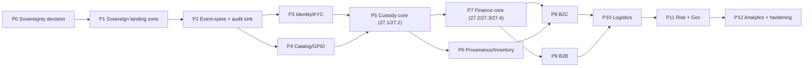

The **dominant critical path runs Sovereignty → Landing Zone → Event-Spine → Identity/Catalog → Custody → Finance**. Any slip here cascades to every revenue-bearing surface. Custody and Finance are the longest-pole engineering items because of the ARB remediations and the two-region in-country quorum dependency, which is itself **a function of the sovereignty decision** — making P0/P1 the true schedule anchor.

### Top 5 risks

| # | Risk | Impact | Mitigation / owner |
|---|---|---|---|
| 1 | **AWS-vs-sovereignty conflict.** Toolchain targets AWS/EKS/Terraform, but BA mandates in-country data residency (no PII/money/custody leaves Bangladesh) and **AWS has no Bangladesh region**. | Blocks 27.2 in-country quorum and all of #1/#3/#8; existential. | Treat sovereign landing zone (Outposts / Dedicated Local Zones / sovereign-partner DC) as a **CRITICAL P0/P1 decision with signed ADR and proven RPO=0**, never a default. Architect/Governance own. |
| 2 | **ARB remediation slippage (27.1–27.4).** Fencing, quorum, co-sign, cooling-off are hard distributed-systems and trust problems. | Custody/Finance cannot ship; whole platform stalls behind critical path. | Dedicated Finance + Provenance Core squads, chaos/restore drills as exit gates, no production data until passed. |
| 3 | **Master-data OHS not stable (R7/R6).** Identity/Catalog/event-spine PL churn forces rework across all 13 contexts. | Mesh-wide rework, integration debt. | Freeze PL contracts in P2–P4; versioned Published Language; consumer-driven contract tests. |
| 4 | **Offline-first + USSD/SMS/IVR parity (R8).** Feature-phone and intermittent-connectivity coverage at national scale is routinely under-scoped. | Excludes majority of population; fails mandate. | Offline-sync-gateway and USSD/IVR BFF as first-class P8 deliverables, not afterthoughts. |
| 5 | **Polyglot org + scarce specialists (ADR-011).** Five languages across eight product squads + spine + SRE in one market. | Hiring/quality bottleneck, inconsistent ops. | Platform/Infra golden paths, per-language review gates, staffed Enabling team for the spine. |

### Recommended team structure at a glance

Stream-aligned squads mapped 1:1 to the frozen ownership, supported by two cross-cutting teams:

- **Substrate** (#1, #2, #12, #13 + NIL) — master data, platform services, analytics.
- **Provenance Core** (#3, #4, #5) — custody single-writer, graph/recall, inventory.
- **Finance** (#8) — isolated double-entry, escrow, payout, MFS/bank/COD.
- **Commerce** (#6), **Exchange** (#7), **Logistics** (#9), **Risk & Enforcement** (#10), **Government** (#11).
- **Event-Spine Enabling team** — owns the Kafka-class versioned Published Language (R6).
- **Platform/Infra/SRE** — sovereign landing zone, golden paths, observability, DR.

### Estimated timeline envelope

A platform of this scope is a **multi-year program**. Planning envelope: **P0 sovereignty + ARB exit criteria (~1 quarter)**, **P1–P4 platform + master data (~2–3 quarters)**, **P5–P7 custody + finance behind ARB gates (~3–4 quarters, the long pole)**, **P8–P10 commerce + logistics (~2–3 quarters)**, **P11–P12 risk/government + national hardening (~2 quarters)** — roughly **24–30 months to full national production**, with earlier limited go-lives possible once Custody and Finance clear their ARB gates. The single largest schedule risk remains the **sovereign landing-zone decision**; until it is signed and RPO=0 is demonstrated in-country, all downstream dates are provisional.

---

## 2. Governance, Traceability & Planning Principles

This roadmap is an execution contract, not a discussion document. It tells every DOKANDAR team WHAT to build, in what ORDER, and which GATE must pass before the next move — while holding the frozen Business Architecture (BA) and ARB-passed Service Architecture (SA) as fixed inputs. This section defines the governance machinery that keeps execution honest: constitutional immutability, end-to-end traceability, phase-gating, the standing governance bodies, and the planning-only scope boundary that this roadmap itself must never cross.

### 2.1 The Business Architecture is Constitutional

The BA (`DOKANDAR-Architecture.md v1.0`) — its 13 bounded contexts, 12 ADRs, design rules R1–R8, functional requirements FR-*, and business rules BR-001..040 — is **FROZEN**. The SA (`DOKANDAR-Service-Architecture.md`, 27 chapters incl. Ch.27 ARB remediations) is **ARB-PASSED**. This roadmap *realizes* both; it has zero authority to amend either.

Three non-negotiable prohibitions bind every author, team, and deliverable:

| # | Prohibition | Enforcement |
|---|---|---|
| P1 | **No modification of the BA.** Context ownership, runtime/store assignments, R1–R8, ADRs, FRs, and BR-001..040 are read-only. | Any proposed deviation is a *defect in the plan or the code*, not a license to edit the BA. |
| P2 | **No invented business rules.** Implementers may not introduce thresholds, tiers, fees, eligibility logic, or workflows absent from BA/SA. | Discovered gaps route to the Business Architecture owner — outside this roadmap's scope — never resolved inline. |
| P3 | **No silent reinterpretation.** Ambiguity in BA/SA is escalated, not guessed. | Logged as an open question against the relevant ADR/FR; blocks dependent gate until ruled. |

If reality (a sovereignty constraint, a vendor limit, a latency wall) collides with the BA, the conflict is **surfaced as a risk and routed to the ARB** (Section 2.4) — it is never absorbed by quietly changing the architecture. The single largest live instance is the **sovereignty tension** (§ HARD CONSTRAINTS): the AWS/EKS/Terraform toolchain target versus the BA's in-country data-sovereignty mandate for PII (#1), money (#8), and custody (#3/#4). The roadmap treats the *sovereign Bangladesh landing zone* (Outposts / Dedicated Local Zones / sovereign-partner) as an unresolved Phase-1 CRITICAL decision, not a default — exactly because the BA's sovereignty rule outranks any tooling convenience.

### 2.2 Traceability: Every Deliverable Points Backward

No work item enters a sprint without a **trace anchor** — an explicit citation to the BA/SA/ADR/R/FR clause it realizes. Orphan work (work with no upstream anchor) is rejected at backlog grooming as either gold-plating (YAGNI violation) or an invented rule (P2 violation). The traceability chain is bidirectional: forward (rule → epic → service → test → gate evidence) and backward (any running service → the clause that justifies it).

#### Traceability Principle Table

| Principle | Statement | Anchor source | Failure mode if violated | Verifying body |
|---|---|---|---|---|
| TR-1 Single Source of Truth | The BA/SA are the only authoritative requirement sources; the roadmap restates, never redefines. | BA v1.0, SA Ch.1–27 | Drift between "what we built" and "what was agreed". | ARB |
| TR-2 Anchored Deliverables | Every epic, service, and task carries ≥1 trace ID (BR/FR/R/ADR/SA-chapter). | BR-001..040, FR-*, R1–R8 | Orphan scope, scope creep. | TPM / Governance Lead |
| TR-3 Rule-to-Test Mapping | Each binding rule maps to an executable acceptance gate before its code merges. | R1–R8, BR-001..040 | Rules asserted but never proven. | QA + context owner |
| TR-4 ADR-Gated Change | Any change to an architectural decision lands only via a new/superseding ADR. | ADR-001..012 | Undocumented architecture drift. | ARB |
| TR-5 Remediation Traceability | Finance/Custody pre-prod gates trace to Ch.27 (27.1–27.4). | SA Ch.27 | Money/custody ships without ARB-mandated safety controls. | ARB + SRE |
| TR-6 Published-Language Fidelity | Cross-context integration traces to event-spine PL contracts + audit OHS sink. | R6, ADR-006-class | Hidden coupling, cross-store reads. | Event-Spine Board |
| TR-7 Master-Data Conformance | Consumers of Identity/Catalog conform to the upstream OHS; no local forks of DID/GPID. | R7, contexts #1/#2 | Identity/catalog divergence across contexts. | API Governance Board |
| TR-8 Sovereignty Trace | Any deliverable touching PII/money/custody traces to a sovereignty control + region decision. | BA sovereignty mandate, Ch.27.2 | Sovereign data egress; legal/regulatory breach. | ARB + Governance Lead |

Traceability is operationalized as a **living matrix** (rule/FR row × deliverable column × gate-evidence cell) owned by the Governance Lead and reviewed at every phase gate. A rule with no green evidence cell cannot be claimed "done."

### 2.3 The Phase-Gate Model

Execution advances through phases, and **no phase begins until the prior phase's quality gate passes**. Gates are binary and evidence-based — a gate is "passed" only when its checklist is fully satisfied with linked artifacts (test results, chaos reports, runbooks, ARB sign-offs), not when a team *asserts* completion (per verification-before-completion discipline).

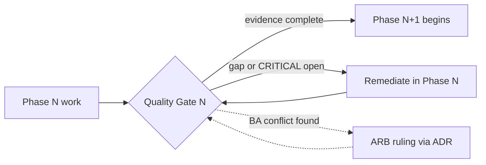

Universal gate criteria (every phase, in addition to phase-specific exit conditions):

- [ ] **Traceability**: all deliverables anchored (TR-2) and rule-to-test mapped (TR-3); matrix green.
- [ ] **Design-rule conformance**: R1–R8 honored — notably R1 (custody sole writer), R2 (Finance no-shared-DB + exactly-once), R6 (no cross-store reads).
- [ ] **Security & sovereignty**: no CRITICAL findings open; PII/money/custody deliverables satisfy TR-8 and the active region decision.
- [ ] **ARB remediation status**: for any Finance (#8) or Custody (#3/#4) scope, Ch.27.1–27.4 controls present and tested before production exposure.
- [ ] **Operational readiness**: backup/restore, runbooks/incident, rotation cadence, and cost envelope specified (per Ch.27 hardening).
- [ ] **No open P1/P2/P3 violations** (Section 2.1).

A failed gate **stops forward motion**; it does not get waived under schedule pressure. The only sanctioned exits from a red gate are *remediate* or *ARB ruling*.

### 2.4 Engineering Governance Bodies

Three standing bodies hold change authority during execution. Their jurisdictions are disjoint to avoid governance gridlock.

| Body | Owns | Change mechanism | Quorum / cadence |
|---|---|---|---|
| **Architecture Review Board (ARB)** | All architectural decisions; BA/SA conflict rulings; Finance/Custody pre-prod gates (Ch.27); the sovereign landing-zone decision. | **ADR only** — a new or superseding ADR (extends ADR-001..012). No architecture changes by PR comment, Slack, or verbal agreement. | Chief Architect + impacted context leads + SRE + Security; per-gate + on escalation. |
| **API Governance Board** | Synchronous contracts at context boundaries; master-data OHS conformance for Identity (#1) and Catalog (#2). | Contract proposal + backward-compat review; enforces TR-7. | Substrate + consuming team reps; weekly. |
| **Event-Spine / Published-Language Board** | The Kafka-class versioned Published Language, schema evolution, audit OHS sink (#13), R6 enforcement. | Versioned PL change with compatibility policy; enforces TR-6. | Event-Spine Enabling team + producers/consumers; weekly. |

Rules of order across all three: (1) **ADR is the only currency of architectural change** — the ARB cannot decide architecture informally; (2) decisions are **logged with trace anchors** and feed back into the traceability matrix; (3) the **Governance Lead** chairs cross-body conflicts and owns the gate evidence ledger; (4) bodies **rule, they do not redesign the BA** — a ruling that would require changing a frozen BR/FR is escalated to the Business Architecture owner, outside this roadmap.

### 2.5 Planning-Only Scope Boundary

This roadmap — including every section authored under it — is **PLANNING ONLY**. It describes *what* to build, in what *order*, with what *gates*. It does not, and must not, contain implementation artifacts.

| In scope (this roadmap) | Out of scope (downstream delivery) |
|---|---|
| Phases, sequencing, dependencies, gates | Code in any of the polyglot stacks (Go/Java/C#/Python/Node) |
| Trace anchors to BA/SA/ADR/R/FR | Terraform / IaC, Kubernetes manifests |
| Risks, decisions (e.g., sovereign landing zone), mitigations | Database schemas, event/protobuf definitions, OpenAPI specs |
| Team ownership, governance, readiness criteria | Concrete configs, secrets, pipelines |

The boundary is itself a governed rule: if a section starts emitting schemas, manifests, or protos, it has breached scope and is treated as a defect. Detailed artifacts are produced *downstream* by the owning teams, under the gates and traceability this roadmap defines — never inside the plan. This keeps the roadmap durable as a contract and prevents premature commitment to implementation details (KISS/YAGNI) before the Phase-1 sovereignty and landing-zone decisions are ruled by the ARB.

---

## 3. Phase 1 — System Architecture

### 3.1 Purpose

Establish the **sovereign, multi-zone target platform** on which all 13 contexts run, before any service code is written. Phase 1 converts the FROZEN Business Architecture (DOKANDAR-Architecture.md v1.0) and ARB-passed Service Architecture into a buildable infrastructure blueprint: security zones, network, identity, key management, observability, and disaster recovery — with the **in-country data-sovereignty landing-zone decision** as the central gate. This phase produces *decisions and designs*, not infrastructure. Traceability: ADR-002 (data residency), ADR-011 (polyglot), R1, R2, R6, FR-NFR (sovereignty/availability), Ch.27.1/27.2 (single-writer + sync-quorum).

### 3.2 Inputs

| Input | Source | Use |
|---|---|---|
| 13-context ownership, runtime, store map | BA §contexts, SA Ch.1-26 | Zone-to-context mapping |
| Design rules R1-R8 | BA | Isolation/zoning constraints |
| ADR-002 residency, ADR-009/011 | BA | Sovereignty + polyglot EKS shape |
| Ch.27.1-27.4 remediations | SA Ch.27 | DR (RPO=0), fenced failover, KMS/HSM |
| Money=poisha, ID schemes | BA R-set | Data-classification tagging |
| Team topology | CANON teams | IAM/account boundaries |

### 3.3 Outputs

System Context diagram; Landing-Zone Decision Record; Network/VPC/subnet/DNS/TLS design; EKS multi-cluster topology; IAM + account-vending model; Security-Zone catalogue mapped to 13 contexts; KMS/HSM key hierarchy; Monitoring/Logging/Audit-sink design (R6); DR & failover runbook spec (Ch.27.1/27.2). All as **planning artifacts** (no IaC/manifests).

### 3.4 System Context

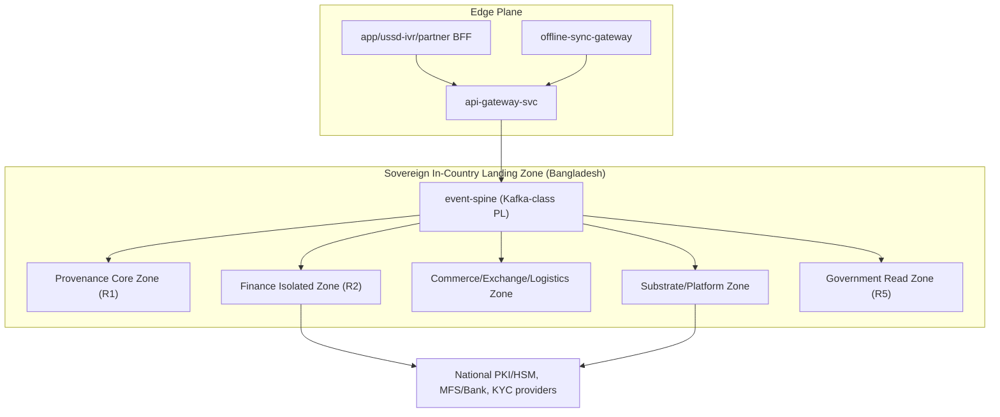

### 3.5 Security Zones mapped to the 13 contexts

| Zone | Isolation basis | Contexts | Team | Key controls |
|---|---|---|---|---|
| **Finance Isolated (R2)** | Separate account, no shared DB, dedicated VPC, exactly-once | #8 | Finance | Sync-quorum WAL (27.2), fencing (27.1), HSM co-sign (27.3), cooling-off (27.4) |
| **Provenance Core (R1)** | Sole-writer custody, append-only ES | #3,#4,#5 | Provenance Core | Consensus-lease single writer, graph CQRS isolation |
| **Commerce/Exchange/Logistics** | Domain workloads | #6,#7,#9 | Commerce/Exchange/Logistics | Separate-ways B2C↔B2B (ADR-009) |
| **Substrate/Platform** | Master-data OHS, analytics | #1,#2,#12,#13,NIL | Substrate/Platform | Identity PDP, GPID/DID OHS, audit sink |
| **Government Read (R5)** | Read-mostly materialized | #11 | Government | No write-path to substrate; case store only |
| **Spine (Enabling)** | Versioned Published Language | event-spine | Event-Spine | PL contracts, audit OHS sink (R6) |

Cross-store access is forbidden (R6); all inter-zone data flows traverse the event-spine or published OHS APIs only.

### 3.6 Sovereign Landing-Zone Decision (CRITICAL GATE)

AWS has **no Bangladesh region**, yet ADR-002 mandates PII/money/custody never leave Bangladesh. This is an unresolved tension and the gating decision of Phase 1.

| Option | Sovereignty fit | Maturity/Risk | Recommendation |
|---|---|---|---|
| **AWS Outposts** (in-country DC) | High (data stays in BD racks) | Capacity, EKS-on-Outposts limits, dual-site for RPO=0 | **Primary candidate** for Finance/Custody zones |
| **AWS Dedicated Local Zone** | High if BD DLZ deliverable | Availability/timeline unconfirmed for BD | Evaluate; fallback |
| **Sovereign partner cloud** (local licensed DC + K8s) | Highest legal certainty | Tooling drift from AWS target | Required fallback if Outposts capacity insufficient |
| **AWS region offshore** | **FAILS ADR-002** | Non-compliant | Rejected for PII/money/custody |

Decision rule: money/custody/PII zones (Finance #8, Provenance #3-5, Identity #1) **must** land on in-country sovereign substrate (Outposts/partner) with two physical in-country sites for Ch.27.2 RPO=0. Non-sensitive analytics/edge may use offshore AWS only on de-identified data.

### 3.7 Network, VPC, DNS, TLS, IAM, KMS

| Area | Plan |
|---|---|
| **VPC/Subnets** | Per-zone VPC; Finance VPC fully isolated (no peering to Commerce); private subnets for data tier, isolated subnets for HSM/WAL |
| **DNS** | Split-horizon private zones per security zone; no public resolution of internal services |
| **TLS** | mTLS east-west via mesh; internal CA rooted in sovereign HSM; TLS1.3 minimum |
| **IAM** | Account-per-team vending; least-privilege; Finance/Custody break-glass with four-eyes (R4 pattern) |
| **KMS/Secrets** | Per-zone CMK hierarchy; national-passport PKI on HSM (G3); poisha-money keys non-exportable; rotation cadence per Ch.27 |
| **Monitoring/Logging** | Per-zone telemetry; audit-log-svc append-only OHS sink (R6); money/custody logs immutable, in-country retained |

### 3.8 Disaster Recovery

Money/custody (zones Finance, Provenance) use **synchronous 2-region in-country quorum (RPO=0)** per Ch.27.2 and **consensus-lease + fencing-token failover** per Ch.27.1 (no split-brain, no dual writer). Other zones use async replication with defined RPO. DR runbooks specify fenced-promotion order, quorum-loss handling, and backup/restore drills (Ch.27 mandate).

### 3.9 Dependencies, Assumptions, Risks, Mitigations

| Type | Items |
|---|---|
| **Dependencies** | Sovereign DC contracts; HSM procurement; national PKI access; Phase-0 governance sign-off |
| **Assumptions** | Two in-country sites reachable at sync-quorum latency; Outposts/partner capacity available; regulator approves zone model |
| **Risks** | (R-LZ) No viable in-country AWS option; (R-LAT) sync-quorum latency breaks RPO=0; (R-HSM) HSM lead time; (R-SKEW) Outposts feature gaps vs region |
| **Mitigations** | Dual-track Outposts + sovereign-partner PoC; latency budget validation before commit; early HSM procurement; document feature-gap workarounds, no offshore fallback for sensitive zones |

### 3.10 Review Checklist

- [ ] Every zone traces to a design rule (R1/R2/R5/R6) and contexts mapped
- [ ] Landing-zone decision recorded with sovereignty compliance to ADR-002
- [ ] Finance zone proven isolated (no shared DB, no Commerce peering) — R2
- [ ] RPO=0 sync-quorum + fenced failover designed for money/custody — Ch.27.1/27.2
- [ ] KMS/HSM hierarchy + rotation cadence specified — Ch.27.3
- [ ] Audit OHS sink + no-cross-store enforced — R6
- [ ] No code/IaC/schemas produced (planning only)

### 3.11 Approval Criteria

ARB + Governance Lead + Security sign-off on the Landing-Zone Decision Record; Finance and Provenance zone designs ratified by their owning teams; regulator-facing residency statement approved.

### 3.12 Definition of Done

All §3.3 outputs authored, reviewed, traced to BA/SA/ADR; sovereignty decision ratified with funded procurement path; zone-to-context map signed by all team leads.

### 3.13 Exit Criteria

Sovereign landing-zone path **committed and funded**; PoC validating RPO=0 latency passed; Phase 2 (platform/cluster build) unblocked with no open CRITICAL risk on R-LZ or R-LAT.

### 3.14 Estimated Complexity / Priority / Critical Path / Quality Gates

| Attribute | Value |
|---|---|
| **Complexity** | XL (sovereign landing zone, multi-zone DR) |
| **Priority** | P0 |
| **Critical Path** | **Yes** — no service can deploy until sovereign zones, Finance/Provenance isolation, and RPO=0 DR are decided; the landing-zone decision blocks all downstream phases |
| **Quality Gates** | QG1 Landing-zone decision approved; QG2 Finance/Provenance isolation design ratified (R1/R2); QG3 RPO=0 + fenced-failover design validated (Ch.27.1/27.2); QG4 KMS/HSM + audit-sink design approved (R6/27.3); QG5 zone↔context traceability complete |

---

## 4. Phase 2 — API Governance

API Governance establishes the binding contract discipline for every DOKANDAR interaction surface **before** any context team writes a line of service code. This phase ratifies the standards, the registry, and the CI gate that make 13 polyglot contexts (ADR-011) interoperate without drift, while enforcing the frozen design rules — event-spine Published Language and audit OHS sink (R6), Identity+Catalog master-data OHS (R7), and offline/USSD/SMS/IVR parity (R8). This is governance of the *rules*, not authoring of the contracts themselves (which land in per-context phases).

### 4.1 Purpose

| Goal | Trace |
|------|-------|
| Codify the REST/gRPC split: external REST `/v1` via gateway + BFFs; internal OHS via gRPC | SA Edge/Spine, R6, R7 |
| Mandate a single contract registry (OpenAPI + Proto) as source of truth | SA Ch.6/Ch.26, R6 |
| Define versioning, deprecation, and backward-compatibility law | ADR-006 (PL evolution), R6 |
| Standardize cross-cutting concerns: `problem+json` errors, pagination, idempotency-key, OIDC/JWT auth, RBAC+ABAC PDP authorization, rate limiting | BR-set, R1/R2 (write safety), FR-auth |
| Stand up the CI contract-test gate that blocks non-conformant merges | SA Ch.27 (test discipline) |

### 4.2 Inputs

- FROZEN Business Architecture v1.0 (13 contexts, ADR-001..012, R1–R8, FR-*, BR-001..040).
- Service Architecture (27 chapters), especially Edge/BFF, event-spine PL, Ch.26 platform standards, Ch.27 ARB remediations.
- Phase-1 outputs: sovereign landing-zone decision, identity/PDP foundation direction, ID format canon (DID/GPID/PPID/ORD/SHP/WLT/TXN/CON/FWD), money = integer poisha.
- Team topology (Substrate, Provenance Core, Commerce, Exchange, Finance, Logistics, Risk, Government, Event-Spine Enabling, Platform/SRE).

### 4.3 Outputs

- **API Standards Charter** (the binding rulebook) covering REST, gRPC, errors, pagination, idempotency, auth/z, rate limiting, versioning, deprecation.
- **Contract Registry operating model** (ownership, lifecycle, linting policy, compatibility checking) — described, not provisioned.
- **CI Contract-Test Gate specification** — what it validates and where it blocks.
- **Governance RACI + API Review Board (ARB-lite) cadence**.
- **Deprecation & versioning policy** with sunset windows.

### 4.4 Deliverables

| ID | Deliverable | Trace |
|----|-------------|-------|
| D4.1 | REST/gRPC boundary standard: external `/v1` REST only at gateway/BFFs; internal context-to-context over gRPC; no direct cross-context DB reads | R6, R7, SA Edge |
| D4.2 | OpenAPI (REST) + Proto (gRPC + event PL) style guide and naming canon (IDs, poisha money type, enums) | ADR-011, R6, ID canon |
| D4.3 | Contract registry governance: single source of truth, PR-based change flow, semantic-version tags, machine-readable compat rules | SA Ch.6/26, R6 |
| D4.4 | Versioning policy: URI-major for REST `/v1`, additive-only minor; Proto field-number immutability + reserved-on-remove | ADR-006, R6 |
| D4.5 | Error standard: RFC-7807 `problem+json` envelope, taxonomy of error types, no sensitive-data leakage | security.md, BR error-handling |
| D4.6 | Pagination standard: cursor-based default for high-cardinality reads; bounded page sizes | code-review (unbounded query) |
| D4.7 | Idempotency-key policy: mandatory on all unsafe REST writes; required on money/custody commands; key retention + replay semantics | R1, R2 (exactly-once), R3 |
| D4.8 | AuthN standard: OIDC/JWT, token audience/scope rules, mTLS for internal gRPC | FR-auth, R7 |
| D4.9 | AuthZ standard: every request resolves through RBAC+ABAC PDP (Context #1); deny-by-default; four-eyes-flagged operations declared in contract | R4, R5, FR-RBAC/ABAC |
| D4.10 | Rate-limiting & quota standard per BFF/partner tier, with sovereign-edge placement note | security.md (rate limiting) |
| D4.11 | Backward-compatibility + deprecation strategy: `Sunset`/`Deprecation` signaling, minimum support windows, consumer-driven contract obligations | ADR-006, R6 |
| D4.12 | CI contract-test gate spec: lint, breaking-change detection, PDP-policy-presence check, USSD/IVR parity check | R8, SA Ch.27 |
| D4.13 | Governance RACI + ARB-lite review cadence and escalation path | SA Ch.27 |

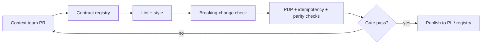

### 4.5 Dependencies

| Depends on | Why |
|------------|-----|
| Phase-1 sovereign landing zone | Gateway/edge/rate-limit placement must honor in-country data sovereignty; no PII/money/custody egress |
| Identity/PDP foundation (#1) | AuthZ standard cannot finalize without PDP contract shape (RBAC+ABAC) |
| Event-Spine Enabling team | Proto/PL governance shares the registry and compatibility tooling |
| ID + money canon | Error/pagination/idempotency examples reference DID/GPID/poisha |

### 4.6 Assumptions

- Registry tooling can run inside the sovereign zone; no contract metadata containing regulated data leaves Bangladesh.
- All context teams accept consumer-driven contract testing as a merge precondition.
- BFFs (app/USSD-IVR/partner) are the only REST aggregators; no client calls a context service directly.
- PDP is authoritative for authorization; services never embed bespoke entitlement logic.

### 4.7 Risks

| ID | Risk | Sev |
|----|------|-----|
| RK1 | Polyglot stacks (Go/Java/C#/Python/Node) drift on error/pagination/idempotency implementation | High |
| RK2 | Sovereignty: edge/rate-limit/WAF on AWS-class tooling with no BD region pushes auth traffic out-of-country | Critical |
| RK3 | Breaking-change detection gaps allow silent PL evolution, violating R6 | High |
| RK4 | Idempotency policy too weak for money/custody → duplicate writes (R1/R2) | Critical |
| RK5 | USSD/IVR parity (R8) treated as afterthought, blocking late | High |
| RK6 | Governance becomes a bottleneck, starving context teams | Medium |

### 4.8 Mitigations

| Risk | Mitigation |
|------|-----------|
| RK1 | Ship per-language conformance shared-spec fixtures; contract gate validates real responses, not docs |
| RK2 | Bind edge/auth/rate-limit components to the Phase-1 sovereign landing-zone decision; explicit in-country residency assertion in the standard; flag any managed edge service lacking BD residency as a blocking exception |
| RK3 | Mandatory automated breaking-change check (field removal, type change, enum narrowing) in the gate; Event-Spine team owns PL compat rules |
| RK4 | Idempotency-key REQUIRED (not optional) on money/custody commands; tie to R2 exactly-once and R3 escrow saga; retention window specified |
| RK5 | Parity assertion is a gate check: every consumer-facing capability declares its USSD/SMS/IVR contract or an explicit waiver |
| RK6 | ARB-lite async review SLA; standards encode defaults so 90% of PRs pass automatically |

### 4.9 Review Checklist

- [ ] REST `/v1` vs internal gRPC boundary unambiguous; no cross-store/cross-context DB access implied (R6).
- [ ] `problem+json` taxonomy complete; no sensitive-data leakage (security.md).
- [ ] Idempotency-key mandatory on all unsafe writes; required + retention-defined for money/custody (R1/R2/R3).
- [ ] AuthZ routes through PDP; four-eyes operations declared in-contract (R4); gov surfaces read-mostly (R5).
- [ ] Versioning + deprecation windows defined; Proto field immutability enforced (ADR-006).
- [ ] USSD/SMS/IVR parity assertion present (R8).
- [ ] Sovereignty residency assertion on every edge/auth/rate-limit component (RK2).
- [ ] CI gate blocks (not warns) on breaking change.

### 4.10 Approval Criteria

Sign-off requires: Chief Architect + Event-Spine lead + Identity/PDP lead + Platform/SRE + Finance and Provenance Core leads (money/custody stakeholders). Approval is granted only when zero CRITICAL items remain open and the gate spec is executable against a reference contract.

### 4.11 Definition of Done

- API Standards Charter published, versioned, and referenced from every context's Phase backlog.
- Contract registry operating model and CI gate spec ratified by ARB-lite.
- Breaking-change, PDP-presence, idempotency, and parity checks demonstrated against a sample contract in the sovereign zone.
- Deprecation/versioning policy adopted by all 9 teams + Enabling team.

### 4.12 Exit Criteria

- No context team may begin contract authoring until the Charter and gate are GREEN.
- Sovereignty residency assertion for edge/auth confirmed against Phase-1 landing-zone decision (no unresolved out-of-country auth path).
- A walking-skeleton contract passes the full gate end to end.

### 4.13 Estimated Complexity, Priority, Critical Path

| Attribute | Value | Rationale |
|-----------|-------|-----------|
| Complexity | **L** | Cross-cutting across 13 contexts + PL, but standards-only (no runtime build) |
| Priority | **P0** | Every downstream context phase depends on it; drift here is systemic |
| Critical Path | **Yes** | Contracts, the spine PL, and BFFs cannot proceed without ratified governance; gates all subsequent build phases |

### 4.14 Quality Gates

| Gate | Pass condition |
|------|----------------|
| QG-Lint | OpenAPI + Proto conform to style canon; ID/money types correct |
| QG-Compat | Automated breaking-change detector returns zero violations (R6, ADR-006) |
| QG-Security | PDP authorization present; `problem+json` leaks no sensitive data; auth = OIDC/JWT + mTLS internal |
| QG-Idempotency | Money/custody commands carry mandatory idempotency-key (R1/R2/R3) |
| QG-Parity | USSD/SMS/IVR contract or explicit waiver per consumer capability (R8) |
| QG-Sovereignty | Every edge/auth/rate-limit component asserts in-country residency (RK2) |

---

## 5. Phase 3 — Event Governance

This phase hardens the `event-spine` (Kafka-class) into a governed Published Language (PL) — the single asynchronous integration fabric across all 13 contexts (R6). Phase 2 stood up the spine cluster and bronze contracts for the first slices; Phase 3 makes event governance *binding* before Finance (#8) and Custody (#3) carry money/provenance traffic. Nothing here invents business semantics — events realize FR-* domain facts already named in the BA/SA. This is the connective tissue that keeps the polyglot estate (ADR-011) decoupled while preserving the ARB single-writer and exactly-once guarantees (Ch.27.1/27.2).

### 5.1 Purpose

| Goal | Trace |
|------|-------|
| One canonical event taxonomy + naming law `<context>.<aggregate>.<Event>.vN` | R6, SA Ch.6/Ch.26 |
| Central schema registry with enforced compatibility + ownership | R6, R7, ADR-006 (PL) |
| Deterministic ordering via per-aggregate partition keys (PPID/WLT/TXN/ORD/CON) | R1, R2, Ch.27.1 |
| Effectively-once delivery (outbox/inbox) for money/custody; at-least-once elsewhere | R2, Ch.27.1/27.2 |
| Poison-event park-and-freeze per aggregate key (no skip-ahead) | Ch.27.5 |
| End-to-end correlation/tracing across the offline boundary | R8, Ch.27.8 |
| audit-log-svc as append-only OHS sink for every published event | R6, context #13 |

### 5.2 Inputs

- Bounded-context event inventories from SA chapters (per-context domain events, FR mappings).
- ARB remediations Ch.27.1 (fencing tokens), 27.2 (sync quorum), 27.5 (recall/poison), 27.8 (offline correlation).
- Provisioned spine cluster + sovereign landing-zone topology decision from Phase 1 (data residency constraints on topic placement).
- ID schemes: DID/GPID/PPID/ORD/SHP/WLT/TXN/CON/FWD; Money = integer poisha.

### 5.3 Outputs

- **Event Catalog v1** (governed registry of all PL events, owners, partition keys, retention class).
- **Naming + Versioning Standard** (the `.vN` law and compatibility policy).
- **Delivery Semantics Matrix** (per topic: ordering key, EOS vs ALO, DLQ policy).
- **Tracing/Correlation Standard** incl. offline-replay correlation rules.
- **Governance Operating Model** (catalog change control, ARB-lite event review board).

### 5.4 Deliverables

| ID | Deliverable | Trace | Complexity | Priority |
|----|-------------|-------|-----------|----------|
| D-EG-1 | Topic naming law `<context>.<aggregate>.<Event>.vN`; reserved namespaces per context | R6, SA Ch.6 | S | P0 |
| D-EG-2 | Schema registry standup + ownership matrix (producer context owns schema; R7 master-data OHS for #1/#2) | R6, R7 | M | P0 |
| D-EG-3 | Compatibility policy (backward-compatible default; forward for consumers; breaking ⇒ new `vN+1` topic, dual-publish, deprecation window) | ADR-006 | M | P0 |
| D-EG-4 | Partition-key registry — PPID (custody/provenance), WLT/TXN (finance), ORD (commerce), SHP/FWD (logistics) — guaranteeing per-aggregate ordering | R1, R2, Ch.27.1 | M | P0 |
| D-EG-5 | Delivery-semantics matrix: outbox/inbox effectively-once for Finance #8 + Custody #3; at-least-once + idempotent consumers elsewhere | R2, Ch.27.1/27.2 | L | P0 |
| D-EG-6 | DLQ + retry standard (bounded exponential retry, per-topic DLQ, replay-from-DLQ runbook) | SA Ch.26 | M | P0 |
| D-EG-7 | Poison-event **park-and-freeze per key** — freeze the offending aggregate stream, continue siblings, recall-index integrity preserved | Ch.27.5 | L | P0 |
| D-EG-8 | Correlation-ID + distributed tracing standard incl. offline-sync-gateway boundary carry-through | R8, Ch.27.8 | L | P0 |
| D-EG-9 | Retention + compaction policy classes (event-log retention vs compacted master-data topics for #1/#2) | R6, R7 | M | P1 |
| D-EG-10 | Consumer-group + replay governance (named groups, offset-reset policy, replay authorization) | SA Ch.26 | M | P1 |
| D-EG-11 | Event Catalog tooling + change-control workflow (ARB-lite review board) | R6 | M | P1 |
| D-EG-12 | audit-log-svc OHS sink conformance (every PL event landed append-only) | R6, #13 | M | P0 |

### 5.5 Dependencies

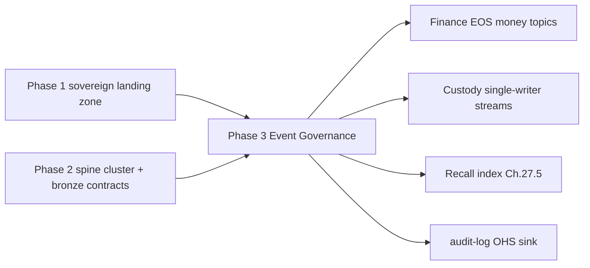

- Hard upstream: sovereign topic placement (PII/money/custody topics must reside in-country) — blocks D-EG-9 retention placement.
- Hard downstream: Finance/Custody production gates (Ch.27) cannot pass without D-EG-5/7/12.

### 5.6 Assumptions

- Spine is Kafka-class with log compaction + per-partition ordering (SA-stated).
- Producer-owns-schema; consumers never mutate PL types (R6/R7).
- Outbox lives in each producer's own store (no shared DB — R2); the spine is the only cross-store channel (R6, no cross-store reads).
- Offline edge clients generate client-side correlation IDs reconciled at the sync gateway (Ch.27.8).

### 5.7 Risks & Mitigations

| Risk | Sev | Mitigation |
|------|-----|-----------|
| Schema drift / breaking change reaches consumers | CRITICAL | Registry-enforced compatibility CI gate; breaking ⇒ new `vN+1` + dual-publish window (D-EG-3) |
| Out-of-order money/custody events ⇒ ledger corruption | CRITICAL | Strict per-aggregate keys (WLT/TXN/PPID) + EOS outbox/inbox + fencing token (D-EG-4/5, Ch.27.1) |
| Poison event blocks an entire partition (head-of-line) | HIGH | Park-and-freeze per *key*, siblings flow (D-EG-7, Ch.27.5) |
| Duplicate delivery double-posts payouts | CRITICAL | Inbox idempotency keyed on event-id + TXN; payout cooling-off (Ch.27.4) defends in depth |
| Offline replay loses trace lineage | HIGH | Client-origin correlation ID preserved through gateway (D-EG-8, Ch.27.8) |
| Residency leak via topic placement on non-sovereign node | CRITICAL | Residency-tagged topics pinned to in-country brokers; placement audited (Phase 1 tension) |
| Catalog rot / undocumented events | MEDIUM | ARB-lite review board + registry as source of truth (D-EG-11) |

### 5.8 Review Checklist

- [ ] Every catalogued event maps to an FR-*/domain fact; none invents a business rule.
- [ ] Each topic declares: owner context, partition key, delivery class, retention class, compatibility mode.
- [ ] Finance/Custody topics flagged EOS with outbox/inbox + fencing reference (Ch.27.1).
- [ ] PII/money/custody topics carry residency tags and in-country placement.
- [ ] DLQ + park-and-freeze runbooks exist and are dry-runnable.
- [ ] Correlation-ID propagation validated through offline boundary.
- [ ] audit-log OHS sink subscribes to every PL topic (R6).

### 5.9 Approval Criteria

| Approver | Gate |
|----------|------|
| Chief Architect | Naming law + catalog conform to R6/R7, ADR-006 |
| Finance + Provenance leads | EOS/ordering meets Ch.27.1/27.2 for WLT/TXN/PPID |
| Event-Spine Enabling team | Registry, compatibility CI, consumer-group governance operable |
| Governance Lead | Residency tagging + audit OHS coverage complete |
| SRE/Platform | DLQ, retry, replay, park-and-freeze runbooks validated |

### 5.10 Definition of Done

- Event Catalog v1 published, every PL topic registered with full metadata.
- Compatibility CI gate blocks incompatible schema merges in pipeline (planned, not yet wired to code).
- Delivery-semantics matrix ratified; Finance/Custody marked EOS.
- Tracing standard adopted by all teams incl. offline boundary.
- audit OHS sink conformance confirmed for all topics.

### 5.11 Exit Criteria

- D-EG-1..8 and D-EG-12 complete and approved (all P0).
- No CRITICAL risk open for money/custody event paths.
- Finance #8 and Custody #3 cleared to proceed to their Ch.27 production gates on event-governance grounds.
- Catalog change-control board operating with at least one ratified change cycle.

### 5.12 Estimated Complexity, Priority, Critical Path, Quality Gates

| Attribute | Assessment |
|-----------|-----------|
| **Estimated Complexity** | **L** overall (XL for D-EG-5 EOS + D-EG-7 poison-handling on money/custody) |
| **Priority** | **P0** — gates Finance/Custody production readiness |
| **Critical Path** | **Yes** — the spine is the sole cross-store integration channel (R6); ordering/EOS guarantees (Ch.27.1/27.2) are prerequisites for any money or custody traffic. No downstream context can safely produce/consume until these standards are binding. |

**Quality Gates**

| Gate | Condition |
|------|-----------|
| QG-EG-1 Schema | Registry compatibility check passes; breaking changes only via `vN+1` |
| QG-EG-2 Ordering | Per-aggregate key proven for PPID/WLT/TXN/ORD; no cross-key reordering |
| QG-EG-3 Delivery | Finance/Custody EOS (outbox/inbox + fencing) demonstrated; ALO consumers idempotent |
| QG-EG-4 Resilience | DLQ + park-and-freeze exercised in chaos drill (Ch.27.5) |
| QG-EG-5 Traceability | Correlation ID survives offline replay (Ch.27.8) |
| QG-EG-6 Sovereignty | Residency-tagged topics confirmed in-country |
| QG-EG-7 Audit | audit-log OHS sink captures 100% of PL topics (R6) |

---

## 6. Phase 4 — Database Design (governance & per-service plan)

This phase converts the ARB-passed Service Architecture into a **per-service persistence design dossier** — engine selection, ERDs, indexing/constraint strategy, migration process, partitioning, retention, and backup/PITR drills — without writing a single DDL statement. It enforces **R6 (db-per-service, no cross-store joins)**, **R2 (Finance isolation, exactly-once)**, **R1 (custody sole writer)**, and **ADR-011 (polyglot persistence)**. Engine choice is dictated by the frozen runtime/store column of the 13 contexts; this phase only details *how* each store is shaped, governed, and operated.

### 6.1 Purpose

Produce a complete, ARB-reviewable data-design specification for all 27 services so that Phase 5 (build) starts from agreed entities, keys, constraints, partition/retention rules, and recovery objectives. Establish the **Data Governance Board** authority over schema change, retention, and sovereignty placement (every store physically resident in-country, per BA sovereignty mandate).

### 6.2 Inputs

| Input | Source | Use |
|---|---|---|
| 13 contexts + store types | CANON / BA v1.0 | Engine selection per service |
| SA Ch.1–26 + Ch.27 remediations | Service Architecture | Single-writer, quorum, isolation constraints |
| ADR-001..012 (esp. 009, 011) | BA | Polyglot + Separate Ways B2C/B2B |
| R1–R8 design rules | BA | DB-per-service, Finance isolation, master-data OHS |
| FR-*, BR-001..040 | BA | Entity attributes, constraint semantics |
| ID conventions (DID/GPID/PPID/ORD/SHP/WLT/TXN/CON/FWD) | CANON | Primary/partition key design |
| Sovereign landing-zone decision (Phase-1) | Roadmap §Phase-1 | Physical placement of every store |

### 6.3 Outputs

Per-service ERD packs, an engine-selection matrix, an indexing/constraint catalog, a migration runbook, partition/retention policies, and a backup/PITR/restore-drill specification — all under Data Governance Board sign-off.

### 6.4 Deliverables

| # | Deliverable | Engine class | Trace |
|---|---|---|---|
| D1 | **Engine-selection matrix** (all 27 svcs) | mixed | ADR-011, R6 |
| D2 | Identity/KYC ERD (Party, DID, KYC tier V0–V3, RBAC/ABAC policy, PII-enc columns) | relational + PII-enc | FR-*, R7 |
| D3 | Catalog ERD (GPID master) + search-index design | relational + search | R7, ADR-001 |
| D4 | **Custody event-store design** (append-only ES streams, fencing-token column, consensus-lease) | event store | R1, Ch.27.1 |
| D5 | Provenance graph + recall-index model | graph | Ch.27.5 |
| D6 | Inventory/NIL projection ERD (strong-local reserve, NIL rollup) | relational projection | G2, BR-* |
| D7 | B2C order/catalog-read ERD | relational + search | ADR-009 |
| D8 | B2B trade/margining ERD | relational | ADR-009 |
| D9 | **Finance double-entry ERD** (WLT/TXN, escrow, payout cooling-off SETTLEMENT_HELD, COD-recon) — physically isolated | isolated relational double-entry | R2, Ch.27.2/27.4 |
| D10 | Logistics ERD + telemetry time-series model | relational + time-series | FR-* |
| D11 | Fraud feature-store + graph-read model | feature store + graph | R4 |
| D12 | Government materialized read-models + case store | materialized read | R5 |
| D13 | Analytics OLAP/lakehouse model (read-only downstream) | OLAP | R6 |
| D14 | Platform stores (object/search/queue/**append-only audit sink**) | object/search/queue/audit | R6 |
| D15 | Indexing & constraint catalog | all | perf + integrity |
| D16 | Migration tooling/process runbook | all | governance |
| D17 | Partition/retention policy set | all | sovereignty, scale |
| D18 | Backup/PITR/restore-drill spec | all | Ch.27.7 |
| D19 | Capacity & performance planning model | all | SA NFRs |

### 6.5 ERD-Authoring Approach & Key Entities

Each team authors its ERD as a **logical model only** (entities, relationships, cardinality, key attributes, ownership) — no physical DDL. Models are reviewed against the owning context's FR/BR to confirm no business rule is invented. Cross-context references use **IDs only** (no FK across stores — R6); referential integrity across contexts is event-driven via the Published Language (R6), never database joins.

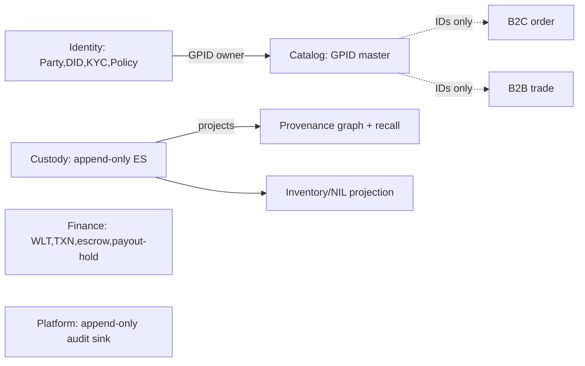

**Single-writer & isolation entities get extra scrutiny:** custody streams carry the **fencing token + consensus-lease** fields (Ch.27.1) so no concurrent writer can advance; Finance carries the **SETTLEMENT_HELD** cooling-off state on payout entities (Ch.27.4) and lives in a **physically separate database with no shared connection pool** (R2).

### 6.6 Indexing, Constraints, Partitioning, Retention

| Concern | Strategy |
|---|---|
| **Indexing** | Index by access path from SA query catalog; covering indexes for hot reads; search engines (Catalog, B2C, Platform) own free-text; OLAP columnar for analytics. No index added without a documented query. |
| **Constraints** | Enforce invariants in-store where ownership allows (uniqueness on DID/GPID/WLT/TXN, check constraints on money = integer poisha ≥ 0, double-entry balance invariant in Finance). Cross-context invariants enforced by sagas (R3), not DB FKs. |
| **Partitioning** | **Region** (sovereign in-country residency, 2-region quorum for money/custody — Ch.27.2); **time** (custody ES, telemetry, audit, OLAP); **actor/tenant** (orders, wallets); **GPID** (catalog/inventory shards). |
| **Retention** | Append-only stores (custody, audit) = immutable, indefinite per compliance; projections rebuildable from source; PII retention bounded by KYC policy; analytics retention per governance. Retention rules are policy artifacts approved by the Governance Board. |

### 6.7 Migration, Backup, PITR & Restore Drills

Migration process is **expand-contract, forward-only, reviewed per change** with a per-service migration ledger; event-sourced stores evolve by **versioned event/upcasters**, never destructive rewrites (R1). Backup/PITR/restore-drill spec (Ch.27.7) defines **RPO=0 for money/custody** (synchronous in-country quorum), bounded RPO for projections (rebuildable), scheduled **restore drills** with measured RTO, and quarterly chaos-restore game-days for Finance and Custody as a pre-production gate.

### 6.8 Dependencies

Phase-1 **sovereign landing-zone decision** (physical placement of every in-country store — blocking); SA Ch.27 remediations finalized; ID conventions frozen; event-spine Published Language schema baseline (for cross-context reference contracts).

### 6.9 Assumptions

- Engine classes from the BA store column are non-negotiable; this phase details, not re-litigates, them.
- In-country dual-region capacity exists in the chosen sovereign zone to satisfy Ch.27.2 synchronous quorum.
- Projections are always rebuildable from their source-of-truth store.

### 6.10 Risks & Mitigations

| Risk | Sev | Mitigation |
|---|---|---|
| No AWS Bangladesh region → quorum/residency cannot be met | CRITICAL | Treat as Phase-1 blocker; design assumes sovereign zone (Outposts/Dedicated Local Zone/partner); no store designed for out-of-country placement |
| Hidden cross-store FK creeps in, violating R6 | HIGH | Governance review rejects any cross-context FK; IDs-only rule enforced in ERD review |
| Finance store shares infra with another context (R2 breach) | CRITICAL | Isolation checklist; separate account/network/pool verified in design sign-off |
| Custody single-writer not modeled (split-brain) | CRITICAL | Fencing-token + consensus-lease fields mandatory in custody ERD (Ch.27.1) |
| Payout race before cooling-off | HIGH | SETTLEMENT_HELD state modeled as required transition (Ch.27.4) |
| Restore RTO unproven | HIGH | Mandatory restore drills + game-days before production gate |

### 6.11 Review Checklist

- [ ] Each service maps to exactly one owned store (R6)
- [ ] No FK or query crosses a context boundary (R6)
- [ ] Finance store provably isolated (R2)
- [ ] Custody fencing/lease + RPO=0 quorum modeled (Ch.27.1/27.2)
- [ ] Payout cooling-off state present (Ch.27.4)
- [ ] Money is integer poisha everywhere
- [ ] Every entity traces to FR/BR; no invented rules
- [ ] Every store physically in-country
- [ ] Retention/partition policies attached per store

### 6.12 Approval Criteria

Data Governance Board + ARB sign-off; Finance and Custody designs additionally require security-reviewer approval. Approval blocked if any CRITICAL risk above is unmitigated.

### 6.13 Definition of Done

All 19 deliverables authored, reviewed, and approved; engine matrix ratified; migration runbook and backup/PITR/restore-drill spec accepted; restore-drill RTO/RPO targets documented and at least one Finance + one Custody drill rehearsed in a non-prod sovereign zone.

### 6.14 Exit Criteria

Phase 5 (build) may begin only when every service has an approved ERD, indexing/constraint catalog, partition/retention policy, and recovery spec, and the sovereign landing-zone placement is confirmed for each store.

### 6.15 Estimated Complexity / Priority / Critical Path

| Attribute | Value |
|---|---|
| Estimated Complexity | **XL** (27 services, 7 engine classes, polyglot, sovereignty) |
| Priority | **P0** |
| Critical Path | **Yes** — Custody (D4), Finance (D9), and the sovereign landing-zone dependency gate all downstream build; no service can be implemented without its approved data design |

### 6.16 Quality Gates

| Gate | Pass condition |
|---|---|
| G-DB1 Ownership | 1 store ↔ 1 service; zero cross-store FK (R6) |
| G-DB2 Isolation | Finance physically isolated, exactly-once path documented (R2) |
| G-DB3 Single-writer | Custody fencing/lease + 2-region quorum modeled (Ch.27.1/27.2) |
| G-DB4 Money safety | Integer poisha + double-entry balance invariant + cooling-off (Ch.27.4) |
| G-DB5 Sovereignty | Every store placed in-country; no PII/money/custody egress |
| G-DB6 Recoverability | RPO/RTO defined; restore drill rehearsed (Ch.27.7) |
| G-DB7 Traceability | Every entity/constraint traces to BA/SA/ADR/R/FR |

---

## 7. Phase 5 — Repository Design

This phase fixes the **source-of-truth topology** for a 5-language polyglot estate (Go, Java/Spring, C#/.NET, Python, Node/TS — ADR-011) across 13 frozen bounded contexts. It decides *where code lives*, *how shared contracts and SDKs are versioned*, and *how Finance's R2 isolation is enforced at the repository boundary itself* — before any service is scaffolded in later phases. PLANNING ONLY: we describe repository structure and governance, not build files, manifests, or schemas.

### 7.1 Purpose

Establish a repository strategy that (a) preserves bounded-context ownership and team autonomy (Substrate, Provenance Core, Commerce, Exchange, Finance, Logistics, Risk, Government, Event-Spine Enabling, Platform/SRE); (b) enforces the Published-Language contract discipline of the event-spine (R6) and master-data OHS for Identity+Catalog (R7); (c) physically isolates Finance & Settlement code, secrets, and reconciler so R2 (no shared DB, exactly-once) cannot be violated by a careless cross-import; and (d) delivers per-language internal SDKs for spine, OHS, and observability clients mandated by Ch.27.5 MED-6.

### 7.2 Inputs

| Input | Source |
|---|---|
| 13 contexts, runtimes, stores, team ownership | CANON / SA Ch.1–13 |
| Design rules R1–R8, ADR-009/011 | BA DOKANDAR-Architecture.md |
| Published Language + audit OHS sink discipline | R6, SA event-spine |
| Per-language SDK requirement (MED-6) | SA Ch.27.5 |
| Finance isolation + reconciler need | R2, SA Ch.8, Ch.27.2/27.4 |
| Sovereignty constraint (CI/CD artifact residency) | HARD CONSTRAINT, BA in-country mandate |

### 7.3 Outputs

A ratified **Repository Decision Record**, a per-team directory standard, a shared-library catalog, a versioning + dependency policy, and SDK ownership assignments — all trace-linked to BA/SA/ADR.

### 7.4 Deliverables

| # | Deliverable | Trace |
|---|---|---|
| D1 | **Repository topology decision**: federated polyrepo-by-context with per-language workspace-style mono-roots inside each team's repo | ADR-011, R6, team map |
| D2 | **Finance dedicated repository** (isolated code, secrets boundary, own CI lane) + separate `cod-recon`/`payout` reconciler repo | R2, SA Ch.8, Ch.27.4 |
| D3 | **Contract repository** for the event-spine Published Language (versioned schemas/IDs registry — described, not authored here) | R6, event-spine Enabling team |
| D4 | **Per-language internal SDK packages** (Go, Java, C#, Python, Node/TS) for spine producer/consumer, OHS master-data clients, observability | SA Ch.27.5 MED-6 |
| D5 | **Shared-library layout & catalog** (money/poisha types, ID validators DID/GPID/PPID/ORD/SHP/WLT/TXN/CON/FWD, error envelope, RBAC/ABAC PDP client) | R7, API Response Format |
| D6 | **Library versioning policy** (SemVer + contract compatibility windows) | R6 |
| D7 | **Dependency-management & sovereignty policy** (in-country artifact registry mirror, no PII/keys in build cache) | HARD CONSTRAINT, BA sovereignty |
| D8 | **CODEOWNERS / ownership-to-context mapping** | team map |

**Decision (D1) rationale.** A single global monorepo is rejected: 5 languages defeat unified build/CI ergonomics, blast-radius of a Finance change would cross R2, and team autonomy across 10 teams is constitutional. A naïve one-repo-per-service polyrepo is also rejected: it shatters shared SDK governance and explodes the spine-contract drift surface. We adopt **repo-per-bounded-context (or per-team cluster)**, each internally a language-native workspace, with **two carve-outs**: (1) Finance gets a hard-isolated repo + reconciler repo (R2); (2) the Published-Language contracts live in one **producer-neutral contract repo** owned by the Event-Spine Enabling team (R6), consumed read-only by all contexts.

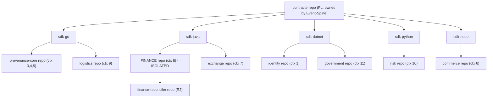

### 7.5 Dependencies

Depends on completed Phase-1 sovereign landing-zone decision (artifact registry must reside in-country), the frozen team-to-context map, and the event-spine PL governance charter. Blocks: all service-scaffolding phases, CI/CD pipeline phase, and the SDK-distribution phase.

### 7.6 Assumptions

| ID | Assumption | If false |
|---|---|---|
| A1 | An in-country (sovereign landing zone) container/artifact registry is procurable in Phase 1 | Repository CI cannot publish lawfully — escalate to Phase-1 risk |
| A2 | Each team owns exactly its CANON contexts | Re-map CODEOWNERS |
| A3 | PL contracts are language-neutral and SDKs are generated downstream | SDK hand-authoring cost rises |
| A4 | SemVer + N-2 contract compatibility is acceptable to consumers | Negotiate longer window with Government/Finance |

### 7.7 Risks

| ID | Risk | Sev |
|---|---|---|
| RK1 | Cross-context import leaks Finance code/secrets, breaching R2 | CRITICAL |
| RK2 | PL contract drift between producer and 5 SDK languages → silent event-incompat (R6) | HIGH |
| RK3 | Artifact registry hosted outside Bangladesh → sovereignty breach in build cache | CRITICAL |
| RK4 | SDK version sprawl (each team pins different spine client) | HIGH |
| RK5 | Shared money/ID lib forked per language drifts (poisha rounding, ID format) | HIGH |
| RK6 | Monorepo creep — teams co-locate "for convenience," eroding R2 isolation | MEDIUM |

### 7.8 Mitigations

| Risk | Mitigation |
|---|---|
| RK1 | Finance in a physically separate repo with no inbound dependency edges; CI dependency-graph guard fails any build importing Finance internals (R2) |
| RK2 | Single contract repo as sole PL source; SDKs generated from it; CI compatibility check against registered schema versions before publish (R6) |
| RK3 | Dependency policy D7 mandates in-country registry mirror; build cache scrubbed of PII/keys; sovereignty gate in CI (Phase-1 linkage) |
| RK4 | Centralized SDK version floor published quarterly; renovate-style automated bump PRs; consumers may not pin below floor |
| RK5 | Money/ID/error-envelope/PDP client shipped **only** via the per-language SDK (D4/D5); forking prohibited by CODEOWNERS + review gate |
| RK6 | Architecture-fitness check in CI rejects new cross-context source roots; quarterly topology audit |

### 7.9 Review Checklist

- [ ] Topology decision traces to ADR-011, R2, R6, R7 and is ARB-reviewed
- [ ] Finance repo has zero inbound code edges from other contexts (R2)
- [ ] Reconciler repo separation documented (Ch.27.4 cooling-off, COD recon)
- [ ] Contract repo ownership = Event-Spine Enabling team (R6)
- [ ] All 5 SDK languages cover spine + OHS + observability (MED-6)
- [ ] Shared money type is integer poisha; ID validators cover all 9 ID kinds
- [ ] Versioning policy defines compatibility window and deprecation path
- [ ] Dependency policy mandates in-country registry (sovereignty)
- [ ] CODEOWNERS maps every context to its CANON team

### 7.10 Approval Criteria

Sign-off from Chief Software Architect, Event-Spine Enabling lead, Finance lead, and Governance lead. No CRITICAL/HIGH review item open. Sovereignty gate (D7) explicitly approved against the Phase-1 landing-zone decision. ARB confirms R2 isolation is structurally enforced, not merely conventional.

### 7.11 Definition of Done

Repository Decision Record ratified and trace-linked; directory standard + shared-library catalog + versioning/dependency policies published; SDK ownership assigned per language and team; CODEOWNERS map approved; CI fitness-guards specified (described, not implemented). Finance + reconciler isolation documented and accepted by ARB.

### 7.12 Exit Criteria

All deliverables D1–D8 approved; downstream phases (CI/CD, SDK distribution, service scaffolding) have an unambiguous, sovereignty-compliant repository target to build into; no open CRITICAL risk.

### 7.13 Estimated Complexity / Priority / Critical Path

| Attribute | Value |
|---|---|
| Estimated Complexity | **L** (10-team polyglot governance; XL elements deferred to SDK build phase) |
| Priority | **P0** |
| Critical Path | **Yes** — every service-scaffolding and CI phase is blocked until the topology, Finance isolation, and SDK ownership are fixed; reworking repository boundaries later is prohibitively expensive and risks R2/R6 breaches |

### 7.14 Quality Gates

| Gate | Pass condition |
|---|---|
| **G-ISOLATION** | Static dependency-graph proof that Finance repo has no inbound code edges (R2) |
| **G-CONTRACT** | Single PL contract source; 5 SDKs generate cleanly with N-2 compatibility (R6) |
| **G-SOVEREIGN** | Artifact registry + build cache resident in-country; no PII/keys in cache (BA sovereignty) |
| **G-SDK** | Spine/OHS/observability clients present in all 5 languages (Ch.27.5 MED-6) |
| **G-SHARED** | Poisha money type + all 9 ID validators ship only via SDK; no forks (R7) |
| **G-OWNERSHIP** | CODEOWNERS coverage = 100% of contexts mapped to CANON teams |

---

## 8. Phase 6 — Engineering Standards

This phase establishes the binding engineering rulebook that every team — Substrate, Provenance Core, Commerce, Exchange, Finance, Logistics, Risk & Enforcement, Government, Event-Spine Enabling, Platform/Infra/SRE — must obey. Standards are not advisory documents; they are **executable, CI-enforced fitness functions** that mechanically block merges violating the CANON (R1–R8, ADR-001..012, Ch.27). This is the layer that makes a 13-context polyglot platform (ADR-011: Go/Java/C#/Python/Node) governable at nation scale.

### 8.1 Purpose

To convert the frozen design rules into automated, non-bypassable guardrails so that architectural integrity (sole-writer R1, Finance isolation R2, no cross-store R6, master-data OHS R7) survives thousands of commits across nine teams. Standards prevent drift, enforce idempotency/outbox for exactly-once (R2), and guarantee that money (poisha-integer), custody, and PII handling are uniformly correct before any business code exists.

### 8.2 Inputs

| Input | Source | Use |
|---|---|---|
| Design rules R1–R8 | BA DOKANDAR-Architecture.md v1.0 | Fitness-function authoring |
| ADR-001..012 (incl. ADR-009 Separate Ways, ADR-011 polyglot) | BA | Per-language standards, boundary checks |
| Ch.27 ARB remediations (27.1–27.4) | SA | Finance/Custody-specific gates |
| FR-*, BR-001..040 | BA | Traceability matrix targets |
| Published Language + audit OHS sink (R6) | SA event-spine | Schema/lint rules |
| Phase-1 sovereign landing-zone decision | Roadmap §Phase 1 | CI runner residency constraints |

### 8.3 Outputs

- Per-language coding standard handbooks (Go, Java/Spring, C#/.NET, Python, Node/TS).
- Git strategy + branching/commit/PR rulebook.
- Architecture-fitness-function catalogue (ArchUnit-style) mapped to R1–R8.
- Observability, logging, configuration, secrets, and feature-flag conventions.
- The enforcement toolchain wiring (linters → CI gates → merge protection).

### 8.4 Deliverables

| ID | Deliverable | Traces to |
|---|---|---|
| D1 | Five per-language standard handbooks (style, error handling, money=poisha integer types, null/result patterns) | ADR-011, R-money |
| D2 | Trunk-based git strategy: short-lived branches, conventional commits, signed commits, mandatory PR template | git-workflow CANON |
| D3 | Fitness function: **R1 custody sole-writer** — only custody-ledger-svc may emit custody-write events; CI rejects any other service referencing custody write APIs | R1, BC#3 |
| D4 | Fitness function: **R2/R6 no cross-store access** — static dependency check forbidding any service importing/connecting to another context's datastore; Finance datastore reachable only by Finance services | R2, R6, BC#8 |
| D5 | Fitness function: **idempotency + transactional outbox mandatory** for all event producers/consumers; exactly-once assertions for Finance/Custody | R2, Ch.27.1 |
| D6 | Fitness function: **master-data OHS direction (R7)** — Identity/Catalog may not depend inbound on downstream contexts; conformist consumers only | R7, BC#1/#2 |
| D7 | Fitness function: **ADR-009 Separate Ways** — b2b-trade-svc and b2c-order-svc share no code/datastore; cross-imports rejected | ADR-009, BC#6/#7 |
| D8 | Fitness function: **R5 gov read-mostly** — oversight-read-svc cannot hold write paths into operational contexts; intervention-svc routes via four-eyes interfaces | R5, BC#11 |
| D9 | Fitness function: **R4 four-eyes** — enforcement actions require recommend-then-approve state machine; auto-execute paths blocked at lint | R4, BC#10 |
| D10 | Structured-logging standard: correlation/trace IDs, no PII/poisha-secret leakage, audit events routed only to audit-log-svc OHS sink | R6, BC#13 |
| D11 | Observability baseline: RED/USE metrics, distributed tracing, SLO annotations, custody/Finance fencing-token visibility | Ch.27.1 |
| D12 | Configuration standard: 12-factor, no in-code config, environment-scoped, sovereign-zone-aware | sovereignty constraint |
| D13 | Secrets standard: no hardcoded secrets, central secret manager, rotation-cadence specs, HSM/PKI handling for Identity (G3) | Ch.27 rotation, BC#1 |
| D14 | Feature-flag standard: flag taxonomy, kill-switches for recall/enforcement/payout cooling-off, expiry/debt tracking | Ch.27.4, BC#4 |
| D15 | Traceability matrix tooling: every PR must cite BA/SA/ADR/R/FR; CI rejects untraced changes | CANON |

### 8.5 Dependencies

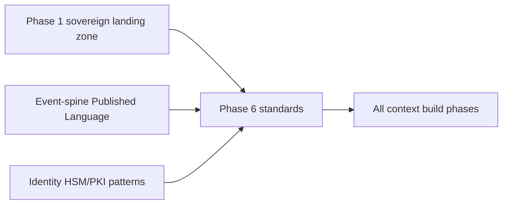

- **Phase 1** sovereign AWS landing-zone decision (CI runners, secret manager, artifact storage must reside in-country for any pipeline touching PII/money/custody).
- **Event-spine** Published Language schemas (R6) must exist before schema-lint fitness functions can run.
- **Identity** custodial-signing/PKI patterns (Ch.27.3) needed before secrets standard finalizes.

### 8.6 Assumptions

- Polyglot is fixed (ADR-011); we standardize *per language* rather than forcing a single stack.
- A monorepo-or-polyrepo decision is settled in an earlier phase; fitness functions are written to operate in either topology.
- CI compute and secret tooling can be provisioned inside the sovereign zone; if not, this becomes a blocking risk (below).

### 8.7 Risks

| ID | Risk | Severity |
|---|---|---|
| RK1 | Sovereign-zone CI/secret tooling unavailable in Bangladesh → pipelines or secret managers leak data offshore, violating BA sovereignty | Critical |
| RK2 | Fitness functions too slow → teams bypass or disable gates | High |
| RK3 | Polyglot inconsistency → R6/R2 checks exist in Go but not Java/Python, leaving gaps | High |
| RK4 | False positives block legitimate merges → standards erosion / waiver abuse | Medium |
| RK5 | Audit OHS sink (R6) bypassed by ad-hoc logging to other stores | High |

### 8.8 Mitigations

| Risk | Mitigation |
|---|---|
| RK1 | Treat sovereign-zone tooling as a Phase-1 CRITICAL decision; standards explicitly forbid any pipeline stage handling PII/money/custody from running outside the in-country zone; offshore runners restricted to non-sensitive build/test only |
| RK2 | Tiered gates: fast linters on every push, heavier fitness suite on PR; budget CI runtime as an SLO |
| RK3 | One canonical fitness-rule spec; per-language adapters; coverage dashboard proving every rule is enforced in all five languages |
| RK4 | Time-boxed, logged, governance-approved waiver process; waivers expire and surface on a dashboard |
| RK5 | Static check that audit events route only to audit-log-svc; runtime conformance test in chaos suite |

### 8.9 Review Checklist

- [ ] Each of R1–R8 maps to at least one enforced fitness function.
- [ ] Cross-store (R6) and Finance-isolation (R2) checks active in all five languages.
- [ ] Idempotency/outbox enforced for every event producer/consumer.
- [ ] Money handled exclusively as integer poisha; floating-point money types banned at lint.
- [ ] No hardcoded secrets; rotation cadence documented (Ch.27).
- [ ] Logging excludes PII/poisha-secrets; audit routed to OHS sink only.
- [ ] PR template enforces BA/SA/ADR/R/FR traceability.
- [ ] Sovereignty: no sensitive CI stage runs outside the in-country zone.

### 8.10 Approval Criteria

Sign-off required from Chief Software Architect, Governance Lead, Finance team lead (R2/Ch.27), Provenance Core lead (R1), and Event-Spine Enabling lead (R6). Approval is granted only when a demonstrator pipeline mechanically blocks a deliberately CANON-violating sample PR for each of R1, R2, R6, R7.

### 8.11 Definition of Done

- All 15 deliverables published, versioned, and referenced from the developer portal.
- Fitness-function suite green on a reference service in each language.
- Negative tests prove each guardrail blocks the violation it targets.
- Branch-protection rules enforce required gates on protected branches.
- Waiver workflow operational and audited.

### 8.12 Exit Criteria

Phase 6 exits when **no context build phase can begin** without inheriting the enforced standards: branch protection, fitness suite, secret manager, logging/observability baseline, and traceability gate are wired into the shared CI template and adopted by at least one pilot service per team.

### 8.13 Estimated Complexity

**L** overall. Per-language standards are M; the cross-store/sole-writer/idempotency fitness functions across five languages plus sovereign-zone CI constraints push the integrated effort to L.

### 8.14 Priority

**P0.** Standards must precede bulk context implementation; retrofitting R6/R2 enforcement after services exist is prohibitively expensive and risks shipping CANON violations to a money/custody platform.

### 8.15 Critical Path

**Yes.** Every downstream context build phase depends on these enforced standards; the sovereign-zone CI dependency (RK1) ties this phase to the Phase-1 landing-zone decision, making it a serial gate on the program timeline.

### 8.16 Quality Gates

| Gate | Mechanism | Blocks merge? |
|---|---|---|
| G-Lint | Per-language linters (style, money-type, secret scan) | Yes |
| G-Arch | ArchUnit-style fitness functions for R1–R8, ADR-009 | Yes |
| G-Exactly-Once | Idempotency/outbox static + integration assertions (R2, Ch.27.1) | Yes |
| G-Secrets | Secret-scan + rotation-policy check | Yes |
| G-Observability | Trace-ID/structured-log conformance, audit-OHS routing (R6) | Yes |
| G-Trace | BA/SA/ADR/R/FR citation present | Yes |
| G-Sovereignty | Pipeline-residency check (no sensitive stage offshore) | Yes |

---

## 9. Phase 7 — Infrastructure as Code (plan, not Terraform)

This phase converts the ARB-passed Service Architecture into a declarative, auditable, GitOps-driven infrastructure plan. We design WHAT modules exist, their boundaries, and the gates they must pass — not HCL. The defining tension: the toolchain target is AWS/EKS/Terraform, yet the FROZEN BA (ADR-006 sovereignty, R2/R6, FR data-residency) forbids PII, money (WLT/TXN), and custody (CON/FWD) data leaving Bangladesh, and AWS publishes **no Bangladesh region**. The sovereign landing zone is therefore a Phase-1 CRITICAL decision and standing risk, never a default.

### 9.1 Purpose
Establish reproducible, policy-enforced, sovereignty-compliant infrastructure for all 13 contexts + EDGE + SPINE, with Finance (#8) and Custody (#3/#27.1-27.2) isolation realized in code structure, and progressive delivery (canary/rollback) wired to quality gates. Traces: ADR-011 (polyglot runtimes), R2 (Finance no-shared-DB), R6 (event-spine PL, no cross-store), R1 (custody sole writer), Ch.27.1-27.4 (single-writer, in-country quorum, signing trust, cooling-off).

### 9.2 Inputs
| Input | Source |
|---|---|
| Context→runtime→store matrix | BA §13 contexts; ADR-011 |
| Sovereign zone decision record | Phase-1 ADR (this roadmap, §9.10 risk) |
| Topology of money/custody quorum | Ch.27.2 (2-region in-country RPO=0) |
| Service deployment units (27 svcs) | SA Ch.1-26 |
| Data classification (PII/money/custody/general) | BA R2, R6, R7; FR residency |
| Test/chaos/backup/runbook specs | Ch.27 remediations |

### 9.3 Outputs
Terraform **module taxonomy** (layered), environment definitions, GitOps repo layout, policy-as-code ruleset, the **Finance separate-reconciler** plan, progressive-delivery configuration model, and the sovereign-zone landing-zone blueprint with residency guardrails.

### 9.4 Deliverables
| # | Deliverable | Trace |
|---|---|---|
| D1 | **Sovereign landing zone blueprint** — Outposts / Dedicated Local Zones / sovereign-partner evaluation + chosen pattern; account/org structure; residency boundary | ADR-006, R2, R6, FR-residency |
| D2 | **Module taxonomy (3 layers)**: L0 foundation (org, accounts, networking, IAM, KMS/HSM), L1 platform (EKS, Kafka-spine, Redis, Postgres/graph/TSDB/OLAP, S3-class, audit sink), L2 service overlays (per-context) | ADR-011, R6, R7 |
| D3 | **Finance/Custody isolation modules** — dedicated accounts, dedicated KMS keys/HSM, no-shared-DB enforcement, in-country sync-quorum WAL topology, fencing-token/consensus-lease infra | R2, R1, Ch.27.1, 27.2, 27.3 |
| D4 | **Network plan** — per-context VPC/subnet segmentation, residency egress-deny guardrails, private spine connectivity, edge (gateway/BFFs/offline-sync/edge-cache) | R8, R6 |
| D5 | **IAM/KMS/HSM plan** — least-privilege per team boundary, PKI/HSM (G3 Identity), custodial-signing key tiers + agent co-sign infra | Ctx#1, Ch.27.3 |
| D6 | **Event-spine module** — Kafka-class versioned-PL cluster, audit-log-svc append-only OHS sink, schema-registry infra | R6, Ctx#13 |
| D7 | **CI/CD (GitHub Actions) + GitOps** — plan/apply pipelines, drift detection, environment promotion, policy-as-code gates | SA Ch.27 (test/chaos) |
| D8 | **Progressive delivery model** — canary, blue/green for stateful stores, automated rollback triggers, **Finance separate-reconciler** deploy isolation | R2, R3, Ch.27.4 |
| D9 | **Backup/restore + rotation-cadence module specs** | Ch.27 backup/restore, rotation |

### 9.5 Module Taxonomy & Environments

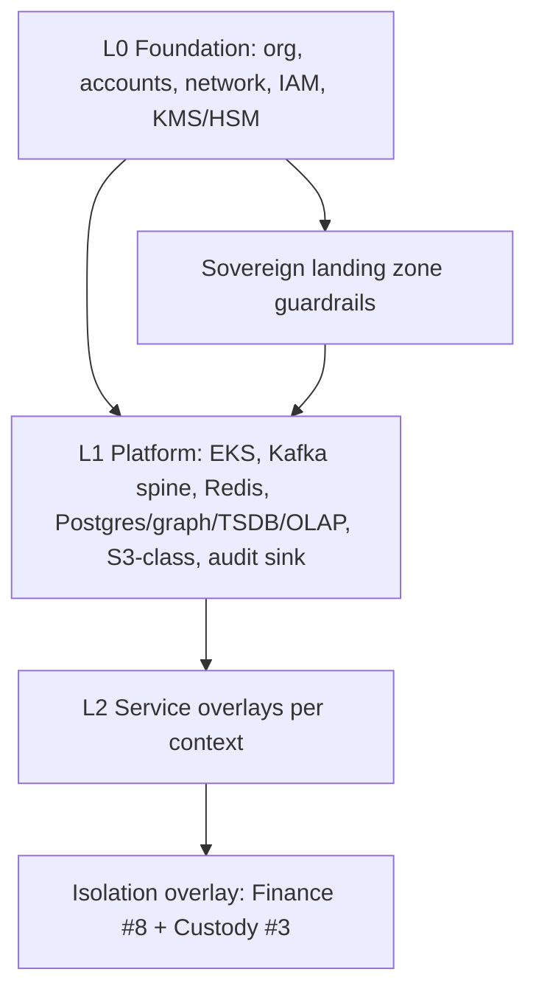

| Environment | Purpose | Residency posture |
|---|---|---|
| dev | Synthetic data only | Any region permitted (no real PII/money) |
| staging | Pre-prod, masked data | In-country sovereign zone |
| prod | Live | In-country sovereign zone, egress-deny enforced |
| dr | Second in-country region | Sync quorum for money/custody (RPO=0) |

GitOps: one infra monorepo, environment overlays per directory, signed commits, PR-gated `plan`, protected `apply` via Actions with manual approval for L0/isolation modules.

### 9.6 Dependencies
- Phase-1 sovereign-zone ADR signed (BLOCKS D1, all prod).
- Event-spine PL contracts frozen (Phase prior) for D6.
- Ch.27.1-27.4 remediation designs ratified for D3/D8.
- Identity HSM/PKI procurement (G3) for D5.

### 9.7 Assumptions
| # | Assumption | If false |
|---|---|---|
| A1 | A sovereign AWS-compatible in-country pattern (Outposts/DLZ/partner) is procurable in Phase-1 window | Re-plan onto sovereign-cloud/colo; toolchain target revised |
| A2 | Two in-country failure domains exist for RPO=0 quorum | Custody/Finance go-live blocked (Ch.27.2) |
| A3 | HSM available in-country for custodial signing | Defer G3 signing; degrade KYC tier ceiling |
| A4 | GitHub Actions runners can operate within residency boundary (self-hosted in-zone) | Use in-zone runners only for sensitive applies |

### 9.8 Risks & Mitigations
| Risk | Sev | Mitigation |
|---|---|---|
| No AWS BD region → sovereignty breach | CRITICAL | D1 first; egress-deny guardrails; data-classification tags block cross-border |
| Single in-country region only → cannot meet RPO=0 | CRITICAL | Gate Finance/Custody go-live on A2; partner second site |
| Finance shared-DB drift via module reuse | HIGH | Hard module separation; policy-as-code denies shared store refs (R2) |
| Custody split-brain on infra failover | HIGH | Consensus-lease + fencing infra (Ch.27.1); no auto-failover without fence |
| CI/CD exfiltrates secrets/state cross-border | HIGH | In-zone runners; encrypted state in-zone; no plaintext state externally |
| MFS-withdrawal loss on rollback | MEDIUM | Cooling-off (SETTLEMENT_HELD) honored in deploy/rollback (Ch.27.4) |

### 9.9 Review Checklist
- [ ] Every module maps to a context/team boundary (no cross-team store sharing) — R6/R7
- [ ] Finance & Custody in dedicated accounts + dedicated KMS/HSM — R2/Ch.27.3
- [ ] Residency egress-deny + data-classification tagging enforced in policy-as-code
- [ ] In-country sync quorum modeled for money/custody WAL — Ch.27.2
- [ ] Fencing/consensus-lease infra present; no naive auto-failover — Ch.27.1
- [ ] Separate-reconciler deploy isolated from finance-ledger writers
- [ ] Canary + rollback triggers tied to quality gates; stateful stores use blue/green
- [ ] Append-only audit sink immutable (object-lock equiv) — R6/Ctx#13
- [ ] Backup/restore + rotation cadence specified — Ch.27
- [ ] No code/HCL/schemas/manifests authored (planning only)

### 9.10 Approval Criteria
Sovereign-zone ADR (D1) signed by Governance + Architecture + SRE leads. Finance/Custody isolation (D3) approved by Finance team + ARB remediation owner. Residency guardrails reviewed by Government/Oversight (#11) stakeholder. Module taxonomy ratified by Platform/Infra/SRE.

### 9.11 Definition of Done
All nine deliverables documented, traced, and approved; module taxonomy + environment matrix + GitOps layout agreed; Finance separate-reconciler and progressive-delivery models specified; sovereign-zone decision recorded as an ADR with the residency boundary explicitly drawn; risk register updated with A1/A2 gates owned and dated.

### 9.12 Exit Criteria
Phase-8 (provisioning/execution) may begin only when: sovereign-zone pattern is chosen and procurable; Finance/Custody isolation and in-country quorum designs are approved; policy-as-code residency guardrails are specified; CI/CD + GitOps + progressive-delivery plans are signed off. Custody/Finance prod provisioning remains BLOCKED until A2 (two in-country domains) is confirmed.

### 9.13 Estimated Complexity, Priority, Critical Path
| Attribute | Value |
|---|---|
| Estimated Complexity | **XL** (sovereign zone + isolation + polyglot platform + quorum) |
| Priority | **P0** |
| Critical Path | **Yes** — D1 sovereign-zone decision blocks all prod infra; Finance/Custody isolation and in-country quorum block the highest-value go-lives (#3, #8) and depend on no other phase's output |

### 9.14 Quality Gates
| Gate | Enforces |
|---|---|
| G-SOV | Residency: deny any resource/data path crossing the Bangladesh boundary (PII/money/custody) — ADR-006, R2, R6 |
| G-ISO | Finance/Custody isolation: deny shared DB/KMS refs across boundaries — R2, R1 |
| G-QUORUM | Block money/custody apply unless 2 in-country domains + sync quorum present — Ch.27.2 |
| G-FENCE | Require fencing-token/consensus-lease infra before single-writer deploy — Ch.27.1 |
| G-DRIFT | GitOps drift detection clean before promotion |
| G-AUDIT | Audit sink immutability + key-rotation cadence verified — R6, Ch.27 |
| G-DELIVERY | Canary health + rollback triggers defined; cooling-off honored on rollback — Ch.27.4 |

---

## 10. Phase 8 — Shared Platform Libraries

The polyglot mandate (ADR-011: Go/Java/C#/Python/Node) means every cross-cutting concern is solved **five times** unless we ship governed, versioned platform libraries first. This phase builds the thin, opinionated SDK layer that every one of the 27 services depends on, so that R6 (event-spine Published Language + audit OHS sink + no cross-store), R2 (Finance exactly-once), R7 (master-data OHS), and R8 (offline-first) are enforced by *libraries*, not by per-team discipline. Owned by the **Enabling/Platform-Infra-SRE teams**; consumed by all eight feature teams.

### 10.1 Purpose

Build the 14 shared capabilities — auth client, PDP authorization client, structured logging, event spine producer/consumer with outbox/inbox, database access, gRPC+REST scaffolding, configuration, telemetry/tracing, retry, idempotency, caching, error handling, validation — as language-parity SDKs so contributors inherit correctness (tracing, idempotency, PL versioning, integer-poisha money) by default. This removes the single largest source of cross-team drift and de-risks every later phase.

### 10.2 Inputs

| Input | Source |
|---|---|
| Polyglot runtime decisions | ADR-011 |
| Published Language contracts, versioning policy | SA Ch. on event-spine; R6 |
| Audit OHS sink semantics | R6; Ch.13 audit-log-svc |
| Money = integer poisha; ID formats (DID/GPID/PPID/ORD/SHP/WLT/TXN/CON/FWD) | CANON design rules |
| Idempotency / exactly-once requirements | R2; Ch.27.1 fencing |
| PDP (RBAC+ABAC) interface | Context #1; FR-auth |
| Sovereign landing-zone constraints (no PII/money/custody egress) | BA in-country sovereignty; Phase-1 decision |

### 10.3 Outputs

- Five-language SDK set, semantically versioned, published to the in-country artifact registry.
- Reference golden-path service template (one per runtime) wiring all 14 libraries.
- Conformance test suite (cross-language parity) and library ADR set.
- Capability matrix proving feature/language coverage parity.

### 10.4 Deliverables (build order, traced)

| # | Library | Build wave | Trace |
|---|---|---|---|
| D1 | Configuration (typed, env+secret-manager, fail-fast on missing secrets) | W1 | security.md secret mgmt; R6 |
| D2 | Logging (structured, PII-redaction-aware, correlation-id) | W1 | R6; BA sovereignty |
| D3 | Error handling (canonical taxonomy, API envelope status/data/error) | W1 | patterns.md envelope |
| D4 | Validation (schema-based boundary validation, ID-format + poisha checks) | W1 | coding-style.md; CANON IDs/money |
| D5 | Telemetry/Tracing (OTel propagation, span conventions) | W2 | SA observability; R6 |
| D6 | Retry (bounded, jittered, classified retryable vs terminal) | W2 | Ch.27 chaos/resilience |
| D7 | Idempotency (request keys, dedupe store contract) | W2 | R2 exactly-once; Ch.27.1 |
| D8 | Database access (repository pattern, **no cross-store** guardrail, migrations hook) | W2 | R6; R2 isolation; patterns.md repo |
| D9 | Auth client (token verify, DID resolution, session) | W3 | Context #1; R7; FR-auth |
| D10 | Authorization PDP client (RBAC+ABAC decision, deny-by-default cache) | W3 | Context #1; R5 gov read-mostly |
| D11 | Event spine producer/consumer + **outbox/inbox** (versioned PL, audit OHS emit) | W3 | R6; SA event-spine |
| D12 | gRPC + REST scaffolding (server/client interceptors wiring D1–D11) | W4 | ADR-011; SA edge/BFF |
| D13 | Caching (TTL, invalidation, no-PII-at-rest policy hooks) | W4 | BA sovereignty; performance.md |
| D14 | Golden-path service templates (×5 runtimes) | W4 | All above |

```mermaid
graph LR
  subgraph "Wave 1 foundation"
    C["Config"] --> L["Logging"]
    L --> E["Error handling"]
    E --> V["Validation"]
  end
  subgraph "Wave 2 resilience"
    V --> T["Tracing"]
    T --> R["Retry"]
    R --> I["Idempotency"]
    I --> DB["DB access"]
  end
  subgraph "Wave 3 domain clients"
    DB --> A["Auth client"]
    A --> P["PDP client"]
    P --> S["Spine + outbox-inbox"]
  end
  subgraph "Wave 4 scaffolding"
    S --> G["gRPC + REST scaffold"]
    G --> CA["Caching"]
    CA --> TPL["Golden-path templates"]
  end
```

### 10.5 Dependencies

| Depends on | Why |
|---|---|
| Sovereign AWS landing zone (Phase 1 CRITICAL decision) | Artifact registry, secret manager, KMS/HSM endpoints must be **in-country**; libraries bind to these. |
| Event-spine cluster bootstrap (Enabling team) | D11 needs a reachable spine + schema registry. |
| Identity/PDP contract draft (Context #1) | D9/D10 need stable decision/resolve interface. |
| Audit OHS sink (Ch.13) | D11 emit target. |

### 10.6 Assumptions

- Schema registry and PL versioning policy are ratified before W3; D11 is otherwise blocked.
- One canonical OTel collector and one secret manager exist in the sovereign zone.
- Feature teams adopt golden-path templates rather than hand-rolling; enforced at ARB gate.
- HSM/PKI integration for custodial signing (Ch.27.3) is a *Finance/Identity* concern, **not** baked into shared libs (avoids YAGNI/over-coupling).

### 10.7 Risks

| ID | Risk | Sev |
|---|---|---|
| K1 | Five-language drift: behavior diverges across SDKs (esp. idempotency, PL serialization, money handling). | High |
| K2 | Sovereignty regression: a library defaults to a non-in-country endpoint (registry, tracing backend, cache). | Critical |
| K3 | Library becomes a god-SDK, coupling all contexts and violating bounded-context autonomy. | High |
| K4 | Spine/outbox semantics get exactly-once wrong, undermining R2 before Finance even starts. | Critical |
| K5 | Phase-8 slips and blocks every downstream phase (single point of schedule failure). | High |

### 10.8 Mitigations

| Risk | Mitigation |
|---|---|
| K1 | Single cross-language **conformance suite** as source of truth; identical fixtures; release-gated parity report. |
| K2 | Static guardrail in CI rejecting non-sovereign endpoint config; default-deny egress; data-classification annotations on every transport. |
| K3 | Hard scope boundary: libraries carry **mechanism, never business rules**; ARB review rejects domain logic in shared code. |
| K4 | Outbox/inbox patterns reviewed against R2 + Ch.27.1 fencing; chaos tests for duplicate/out-of-order delivery before sign-off. |
| K5 | Wave-based delivery so W1–W2 unblock early feature scaffolding; templates shipped incrementally, not big-bang. |

### 10.9 Review Checklist

- [ ] Every library exists in all five runtimes with parity-tested behavior.
- [ ] No business rule (BR-001..040) encoded in any shared library.
- [ ] Money handled only as integer poisha; ID validators match CANON formats.
- [ ] D11 enforces versioned PL and emits to audit OHS sink (R6).
- [ ] No library defaults to an out-of-country endpoint (BA sovereignty).
- [ ] Logging/caching enforce PII-redaction / no-PII-at-rest hooks.
- [ ] DB-access library forbids cross-store access (R6).
- [ ] Idempotency + retry classify terminal vs retryable correctly (Ch.27).

### 10.10 Approval Criteria

- ARB sign-off on the SDK ADR set and the no-domain-logic boundary.
- Enabling-team + Platform/SRE joint ownership recorded in the ownership matrix.
- Conformance parity report green across all five languages.
- Security-reviewer approval on D1/D2/D9/D10/D11 (secrets, PII, auth, spine).

### 10.11 Definition of Done

- All 14 deliverables published, versioned, and consumable from the in-country registry.
- Golden-path template per runtime builds, traces end-to-end, and round-trips a versioned spine event through outbox→inbox→audit sink.
- ≥80% test coverage per library plus passing cross-language conformance suite.
- Library docs, upgrade/deprecation policy, and rotation cadence published.

### 10.12 Exit Criteria

- At least one pilot feature service (lowest-risk context, e.g. Platform #13 notification-svc) is scaffolded entirely from the golden path with zero bespoke cross-cutting code.
- Downstream phases can start against frozen, versioned library interfaces (no anticipated breaking change inside the major version).
- Sovereignty CI guardrail active and blocking in the shared pipeline.

### 10.13 Estimated Complexity, Priority, Critical Path

| Attribute | Value | Rationale |
|---|---|---|
| Estimated Complexity | **XL** | 14 capabilities × 5 runtimes, parity testing, spine/outbox correctness. |
| Priority | **P0** | Nothing else ships safely or consistently without it. |
| Critical Path | **Yes** | Every later phase consumes these SDKs; D11/D7/D8 gate Finance and Custody (R2, Ch.27). Waves 1–2 may parallelize across teams to compress the path. |

### 10.14 Quality Gates

| Gate | Condition to pass |
|---|---|
| G-PARITY | Cross-language conformance suite 100% green. |
| G-SOVEREIGN | CI rejects any non-in-country endpoint; egress default-deny verified. |
| G-NO-RULES | ARB confirms zero BR/business logic in shared libs. |
| G-EXACTLY-ONCE | Outbox/inbox + idempotency pass duplicate/out-of-order chaos tests (R2, Ch.27.1). |
| G-SECURITY | Security-reviewer clears secrets, PII redaction, auth/PDP, spine emit. |
| G-COVERAGE | ≥80% coverage per library; golden-path template e2e trace verified. |

---

## 11. Phase 9 — Service Skeleton Standard

The Service Skeleton Standard is the single, opinionated scaffold from which all 27+ services and edge/BFF components are generated. It is the physical realization of the platform's non-functional contract: every service must be observable, health-gated, configurable, sovereign-aware, and uniformly testable on day one. This phase delivers the **generator and template set** (the "golden path"), not generated code. By enforcing convention over per-team improvisation, we make polyglot reality (ADR-011: Go, Java/Spring, C#/.NET, Python, Node/TS) operable under one SRE model and one audit posture.

### 11.1 Purpose

| Goal | Trace |
|------|-------|
| One scaffold per runtime so every service is born observable, gated, and audit-wired | ADR-011 (polyglot); R6 (event-spine PL + audit OHS sink) |
| Standard health/readiness semantics so orchestration never routes to a non-ready Finance/Custody node | Ch.27.1 (fencing/lease); R2 (Finance isolation) |
| Built-in tracing/metrics/config so sovereignty, fencing-token, and money-flow invariants are inspectable | Ch.27.2 (RPO=0 quorum); HARD CONSTRAINT (sovereignty) |
| Eliminate skeleton drift across 9 teams; reduce new-service lead time from weeks to hours | TEAMS; KISS/DRY (coding-style) |

This phase is **planning of the scaffold contract**: folder structure, Dockerfile standard, Makefile/target verbs, probe semantics, metrics/tracing conventions, config layering, test layout, and README template — described as WHAT and in what ORDER, not as artifacts.

### 11.2 Inputs

| Input | Source |
|-------|--------|
| Bounded-context → runtime → store mapping | CANON (13 contexts) |
| Event-spine Published Language + audit OHS sink contract | R6; #13 audit-log-svc |
| Single-writer/fencing-token requirements | Ch.27.1; R1 (custody sole writer) |
| Sovereign landing-zone decision (region topology, data-residency tags) | Phase-1 sovereignty decision (CRITICAL) |
| Money = integer poisha; ID schemes (DID/GPID/PPID/ORD/SHP/WLT/TXN/CON/FWD) | DESIGN RULES |
| Org team boundaries for CODEOWNERS defaults | TEAMS |

### 11.3 Outputs

A versioned **skeleton generator** plus per-runtime template variants and a conformance linter, delivered to the platform/golden-path registry and consumable by all teams.

### 11.4 Deliverables

| # | Deliverable | Trace |
|---|-------------|-------|
| D1 | Generator CLI/spec: prompts for context #, runtime, store class, residency tier; emits standard layout | ADR-011; TEAMS |
| D2 | Standard folder structure spec (domain / application / adapters-in / adapters-out / config / test) per runtime | coding-style (many small files); R6 (no cross-store) |
| D3 | Dockerfile standard: multi-stage, non-root, minimal base, SBOM hook, pinned digests, residency build-arg | security.md; sovereignty constraint |
| D4 | Makefile target contract: `build test lint fmt cover scan image run migrate-check contract-verify` (uniform verbs across polyglot) | DRY; testing.md |
| D5 | Health (`liveness`) + readiness (`readiness`) probe contract; readiness MUST reflect fencing-lease validity for single-writer services | Ch.27.1; R2 |
| D6 | Metrics convention: RED/USE baseline + mandatory money/custody counters (poisha-balanced, fencing-token-age, quorum-ack-lag) | Ch.27.2; R2 |
| D7 | Tracing convention: W3C context propagation through event-spine; trace correlates to audit-log-svc record id | R6; #13 |
| D8 | Configuration standard: layered (defaults → env → secret-manager refs), residency-tag required, no hardcoded secrets, startup secret-presence validation | security.md; sovereignty constraint |
| D9 | Test layout standard: unit / integration / contract / chaos-hook slots; coverage gate ≥80% | testing.md; Ch.27 (chaos specs) |
| D10 | README template: ownership, context trace, SLOs, runbook links, dependency map, residency class | code-review.md; TEAMS |
| D11 | Conformance linter ("skeleton-doctor") that fails CI when a service diverges from the standard | code-review.md |
| D12 | CODEOWNERS + audit-sink wiring defaults pre-baked per team | TEAMS; R6 |

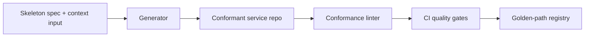

### 11.5 Dependencies

| Depends on | Why |
|------------|-----|
| Sovereign AWS landing-zone decision (Phase 1) | Residency tags, region topology, and quorum wiring in templates cannot be finalized until in-country region strategy is fixed |
| Event-spine PL contract availability | Tracing/audit wiring (D7) embeds spine envelope conventions (R6) |
| Secret-manager + audit-log-svc sink readiness | Config (D8) and audit defaults (D12) reference live platform substrate |
| Observability backbone (metrics/trace collectors) | D6/D7 emit to a defined sink |

### 11.6 Assumptions

- Each of the five runtimes (Go, Java/Spring, C#/.NET, Python, Node/TS) gets a maintained template variant; no team hand-rolls scaffolds. (ADR-011)
- The skeleton enforces hexagonal boundaries so store-class swaps (relational, ES, graph, OLAP) do not leak across contexts. (R6 no cross-store)
- Single-writer services (custody-ledger-svc, finance-ledger-svc) take a stricter readiness variant that gates on fencing-lease. (R1, Ch.27.1)
- Residency tagging is mandatory metadata, not optional; default deny for untagged PII/money/custody services. (sovereignty constraint)

### 11.7 Risks

| ID | Risk | Sev |
|----|------|-----|
| RK1 | Skeleton drift: teams fork templates and diverge, eroding uniform SRE/audit posture | HIGH |
| RK2 | Polyglot dilution: five variants drift in probe/metric semantics, breaking cross-service dashboards | HIGH |
| RK3 | Sovereignty leakage: a residency tag omitted in template lets a PII/money service deploy outside Bangladesh | CRITICAL |
| RK4 | Fencing-readiness gap: standard readiness probe ignores lease validity, enabling split-brain on Finance/Custody | CRITICAL |
| RK5 | Audit-sink not wired by default: services emit events without OHS audit record, violating R6 | HIGH |
| RK6 | Over-engineering the generator (speculative options) slows adoption | MEDIUM |

### 11.8 Mitigations

| Risk | Mitigation |
|------|-----------|
| RK1 | Conformance linter (D11) is a blocking CI gate; templates are centrally versioned with deprecation windows |
| RK2 | Single cross-runtime probe/metric contract defined once (D5/D6); per-runtime variants implement, never redefine, semantics |
| RK3 | Default-deny on untagged residency; linter rejects PII/money/custody services lacking in-country tag; ties to Phase-1 sovereign zone |
| RK4 | Stricter readiness variant for single-writers gates on fencing-token age and lease validity (Ch.27.1) before declaring ready |
| RK5 | Audit-sink and PL envelope wiring pre-baked (D12); linter asserts presence |
| RK6 | YAGNI: ship the minimal golden path; add options only on real second-use demand |

### 11.9 Review Checklist

- [ ] All five runtime variants produce identical probe, metric, trace, and config semantics
- [ ] Single-writer readiness variant gates on fencing-lease (Ch.27.1, R1, R2)
- [ ] Residency tag is mandatory; untagged sensitive services fail generation and CI
- [ ] No hardcoded secrets; startup secret-presence validation present (security.md)
- [ ] Audit OHS sink + PL envelope wired by default (R6)
- [ ] Money fields typed/serialized as integer poisha; ID prefixes enforced
- [ ] README template carries ownership, context trace, SLOs, runbook links
- [ ] Coverage gate ≥80% wired into Makefile + CI (testing.md)
- [ ] Conformance linter blocks divergence

### 11.10 Approval Criteria

Approve only when: zero CRITICAL/HIGH open issues; a reference service generated in each runtime passes the conformance linter and all quality gates; Finance/Custody readiness variant demonstrably fails closed when fencing-lease is invalid; and the residency default-deny is proven by a negative test (untagged sensitive service is rejected).

### 11.11 Definition of Done

- Generator + five runtime templates + conformance linter published to golden-path registry, versioned and documented.
- One reference service per runtime generated, green across `build/test/lint/cover/scan/contract-verify`.
- Probe, metric, tracing, config, test-layout, README, Dockerfile, and Makefile standards documented and traced to BA/SA/ADR/R.
- Single-writer strict-readiness and residency default-deny validated by negative tests.

### 11.12 Exit Criteria

All downstream service-build phases (B2C, B2B, Finance, Custody, Logistics, etc.) consume the skeleton as their mandatory starting point; no service may enter implementation outside the golden path. Platform/SRE has a single dashboard schema derived from the standard metric/trace contract.

### 11.13 Estimated Complexity, Priority, Critical Path

| Attribute | Value | Rationale |
|-----------|-------|-----------|
| Complexity | **L** | Five runtime variants + linter + fencing/residency semantics; bounded but cross-cutting |
| Priority | **P0** | Every later build phase blocks on it |
| Critical Path | **Yes** | All 27+ services are generated from it; drift or delay propagates platform-wide. It is gated by the Phase-1 sovereign landing-zone decision (residency wiring) and the fencing contract (Ch.27.1) |

### 11.14 Quality Gates

| Gate | Condition |
|------|-----------|
| G-Conformance | Linter passes for every generated reference service; blocking in CI |
| G-Observability | RED/USE + mandatory money/custody/fencing metrics and W3C traces emit to defined sinks |
| G-Sovereignty | Residency tag present; default-deny enforced for untagged PII/money/custody (sovereignty constraint) |
| G-SingleWriter | Strict-readiness fails closed on invalid fencing-lease (Ch.27.1, R1, R2) |
| G-Audit | Audit OHS sink + PL envelope wired by default (R6) |
| G-Security | No hardcoded secrets; non-root image; SBOM + scan clean (security.md) |
| G-Coverage | ≥80% on reference services (testing.md) |

---

## 12. Phase 10 — Implementation Waves (re-evaluated build order)

We re-derived the build order from first principles (data-dependency, contract-readiness, and gate-criticality) rather than inheriting any prior sequence. The binding constraint is the **master-data Open Host Services (R7)**: Identity #1 (DID, RBAC+ABAC PDP) and Catalog #2 (GPID) are upstream of every other context, so nothing real ships before them. The second constraint is the **custody spine (R1)**: custody-ledger #3 is the sole writer and must exist before inventory #5 and provenance #4 can project. The third is **Finance gating**: #8 cannot enter production until all Ch.27 Major remediations (27.1–27.4) pass. Everything else (markets #6/#7, logistics #9, then fraud #10, government #11, analytics #12) layers on top.

### Purpose

Sequence the 13 contexts plus EDGE/SPINE into the fewest, lowest-risk waves that respect data dependencies, R1–R8, and the Ch.27 pre-production gates, while surfacing the **sovereign landing-zone decision (Wave 0)** as the gating precondition for any PII/money/custody workload.

### Inputs

- DOKANDAR-Architecture.md v1.0 (13 contexts, ADR-001..012, R1–R8, FR-*, BR-001..040).
- DOKANDAR-Service-Architecture.md (Ch.1–27, incl. Ch.27 ARB remediations).
- Event-spine Published Language (R6) and the team topology (Substrate, Provenance Core, Commerce, Exchange, Finance, Logistics, Risk&Enforcement, Government, Event-Spine Enabling, Platform/Infra/SRE).
- Prior roadmap phases (foundation, platform, contract registry) treated as upstream-complete.

### Outputs

A ratified Wave 0..7 plan with per-wave entry/exit gates, a wave-dependency table, and a critical-path designation feeding scheduling and staffing.

### Deliverables (re-evaluated build order)

| Wave | Theme | Services (primary) | Traces |
|---|---|---|---|
| 0 | Sovereign landing zone + spine | event-spine, api-gateway-svc, audit-log-svc, document-svc, notification-svc, search-svc | R6, ADR-011, Ch.27 (backup/restore, rotation) |
| 1 | Master-data OHS | identity-svc, kyc-adapter-svc, catalog-svc, catalog-search-indexer | R7, ADR-001/002, FR-identity/catalog |
| 2 | Custody spine | custody-ledger-svc | R1, ADR-003, Ch.27.1/27.2/27.3 |
| 3 | Provenance + inventory read sides | provenance-projection-workers, recall-svc, inventory-svc, stock-projection-workers, nil-rollup-svc | R1→CQRS, G2, Ch.27.5 |
| 4 | Finance (gated) | finance-ledger-svc, escrow-svc, payout-svc, mfs-bank-adapters, cod-recon-svc | R2/R3, ADR-006, Ch.27.1/27.2/27.4 |
| 5 | Markets | b2c-order-svc, b2c-catalog-read-svc, b2b-trade-svc, margining-svc | ADR-008/009, R3 |
| 6 | Logistics + edge parity | logistics-svc, telemetry-ingest-workers, routing-svc, app-bff, ussd-ivr-bff, partner-bff, offline-sync-gateway | R8, ADR-010 |
| 7 | Oversight layers | fraud-scoring-svc, enforcement-svc, oversight-read-svc, intervention-svc, analytics-pipeline, forecasting-svc | R4/R5, ADR-011/012 |

**Key re-evaluation findings:** (1) Wave 0 must include the sovereign landing-zone decision before any stateful service — it is not infrastructure background work. (2) Inventory #5 and provenance #4 are merged into one wave (Wave 3) because both are pure CQRS read-sides off the same custody event stream; building them together amortizes the projection-worker platform. (3) Finance #4 is pulled **before** markets #5 — markets cannot honor escrow (R3) without finance-ledger and escrow-svc existing, so finance leads. (4) Fraud, government, and analytics collapse into Wave 7 because all three are downstream read/scoring consumers (R4 recommend-by-default, R5 read-mostly, #12 read-only) with no write-path dependents.

### Dependencies

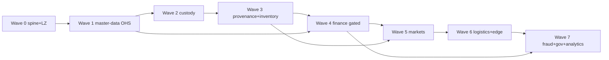

| Wave | Hard deps | Required contracts | Required events | Required infra |
|---|---|---|---|---|
| 0 | none | gateway authn contract; audit-sink OHS contract | `audit.*` envelope (R6 PL) | sovereign BD landing zone; Kafka-class spine; HSM (G3); object store |
| 1 | W0 | DID/KYC OHS; GPID catalog OHS (R7) | `identity.party.*`, `kyc.tier.*`, `catalog.gpid.*` | relational+PII-enc; search index; PKI/HSM |
| 2 | W1 | custody append-only write contract (R1) | `custody.event.*` (ES) | append-only ES store; consensus-lease + fencing (27.1); 2-region quorum (27.2) |
| 3 | W2 | provenance read API; inventory reserve (G2); recall index | `inventory.stock.*`, `provenance.projection.*`, `recall.*` | graph DB; relational projection; time-series for rollup |
| 4 | W1,W3 | finance double-entry; escrow saga (R3); MFS/bank adapter | `finance.txn.*`, `escrow.*`, `payout.*`, `cod.recon.*` | ISOLATED relational double-entry (R2); fencing+sync-quorum; cooling-off state (27.4) |
| 5 | W3,W4 | B2C order; B2B trade/margining (Separate Ways, ADR-009) | `order.*`, `b2b.trade.*`, `margin.*` | relational+search per market |
| 6 | W5 | logistics dispatch; routing; offline-sync parity (R8) | `shipment.*`, `telemetry.*`, `route.*` | relational+time-series; USSD/SMS/IVR gateways; edge-cache |
| 7 | W4,W6 | fraud four-eyes (R4); gov read models (R5); OLAP feeds | `fraud.score.*`, `enforcement.*`, `oversight.read.*`, `intervention.*` | feature store+graph reads; OLAP/lakehouse; case store |

### Assumptions

- Sovereign BD landing zone (Outposts / Dedicated Local Zones / sovereign-partner) is **decided and procurable** in Wave 0; if not, all PII/money/custody waves slip. This is a CRITICAL open risk, not a default.
- Event-spine PL versioning and the audit OHS sink (R6) are operational before Wave 1.
- Team topology is staffed to run Waves 5/6/7 with partial parallelism once Wave 4 exits.

### Risks

| ID | Risk | Sev |
|---|---|---|
| RK-1 | No AWS BD region; sovereign LZ undecided blocks all stateful waves | CRITICAL |
| RK-2 | Custody single-writer split-brain (27.1) regresses under region failover | CRITICAL |
| RK-3 | Finance RPO≠0 on region loss (27.2) | CRITICAL |
| RK-4 | Escrow MFS-withdrawal loss without cooling-off (27.4) | HIGH |
| RK-5 | Master-data OHS contract churn (R7) forces downstream rework | HIGH |
| RK-6 | Polyglot (ADR-011) inflates platform/SRE surface | MEDIUM |

### Mitigations

- RK-1: Wave 0 decision gate with two procurement tracks (Outposts vs sovereign-partner); no stateful service starts until ratified.
- RK-2/RK-3: Custody and Finance both inherit consensus-lease + fencing (27.1) and synchronous 2-region in-country quorum (27.2) as **entry** criteria, validated by chaos/failover tests before production.
- RK-4: SETTLEMENT_HELD cooling-off (27.4) is a Wave-4 DoD item, not a follow-up.
- RK-5: Freeze OHS contracts at end of Wave 1; consumer-driven contract tests gate every later wave.

### Review Checklist

- [ ] Each wave traces every deliverable to BA/SA/ADR/R/FR.
- [ ] No wave starts before its hard-dep wave's Exit Criteria.
- [ ] R1 sole-writer and R2 no-shared-DB preserved across Waves 2–5.
- [ ] R6 PL + audit sink consumed, no cross-store reads.
- [ ] R8 USSD/SMS/IVR parity covered in Wave 6.

### Approval Criteria

ARB + context owners sign off the wave plan; Finance and Custody owners additionally confirm Ch.27 gates are wave-entry conditions; Governance Lead confirms sovereignty decision owns Wave 0.

### Definition of Done

- All 8 waves have ratified entry/exit gates and a named owning team.
- Wave-dependency table validated against the frozen contexts and R1–R8.
- Critical path identified and load-balanced against team topology.

### Exit Criteria

- Wave 0 sovereign-LZ decision recorded as an ADR-traceable gate.
- Waves 1–4 carry custody/finance Ch.27 gates as blocking entry conditions.
- Downstream Waves 5–7 have consumer-driven contract tests against frozen OHS/PL.

### Estimated Complexity (S/M/L/XL)

| Wave | 0 | 1 | 2 | 3 | 4 | 5 | 6 | 7 |
|---|---|---|---|---|---|---|---|---|
| Size | L | L | XL | L | XL | L | L | L |

### Priority (P0/P1/P2)

| Wave | 0 | 1 | 2 | 3 | 4 | 5 | 6 | 7 |
|---|---|---|---|---|---|---|---|---|
| Pri | P0 | P0 | P0 | P0 | P0 | P1 | P1 | P2 |

### Critical Path (yes/no + why)

| Wave | On path | Why |
|---|---|---|
| 0 | yes | Sovereign LZ + spine gate every stateful workload (R6, sovereignty). |
| 1 | yes | Master-data OHS (R7) blocks all contexts. |
| 2 | yes | Custody sole writer (R1) blocks inventory/provenance/finance. |
| 3 | yes | Provenance/inventory feed markets and oversight. |
| 4 | yes | Escrow/finance (R2/R3) blocks markets settlement. |
| 5 | partial | B2C and B2B (ADR-009 Separate Ways) parallelizable post-W4. |
| 6 | no | Edge parity layered on markets. |
| 7 | no | Read/scoring downstream (R4/R5, #12 read-only). |

### Quality Gates

Per wave: consumer-driven contract tests green against frozen PL (R6); 80%+ coverage; security review on auth/payments/custody; **Waves 2 & 4 additionally require** passing 27.1 fencing chaos test, 27.2 region-loss RPO=0 failover, 27.3 co-signature enforcement, and (Wave 4) 27.4 cooling-off validation, plus backup/restore and runbook/incident sign-off before production promotion.

---

## 13. Phase 11 — Testing Strategy

This phase converts the platform from "feature-complete" to "certifiable." It defines the test pyramid, the adversarial drills that validate the ARB Major Remediations (Ch.27), and the per-service / per-wave **certification gates** that no service may bypass before production cutover. It maps directly to SA Ch.27.6 (test/chaos/backup/runbook specs) and the binding design rules R1–R8.

### 13.1 Purpose

Prove, with evidence, that every bounded context and every cross-context saga behaves correctly, safely, and within SLO under nation-scale and adversarial conditions — and that the four pre-production safety gates (single-writer fencing, in-country sync quorum, custodial co-signing, escrow cooling-off) actually hold under fault injection. Testing is the enforcement mechanism for the CANON: a service that cannot demonstrate R-rule compliance under test is not allowed to ship.

### 13.2 Inputs

| Input | Source |
|---|---|
| Frozen behavioural rules BR-001..040, FR-* | BA (DOKANDAR-Architecture.md v1.0) |
| Service contracts, sagas, SLOs | SA Ch.1–26 |
| ARB remediation specs (fencing, quorum, co-sign, cooling-off) | SA Ch.27.1–27.4 |
| Test/chaos/backup/runbook spec | SA Ch.27.6 |
| Published Language schemas (spine) | Event-Spine Enabling team registry |
| Prior phase exit artifacts | Phases 3–10 service builds |
| Eid/recall peak-load models | BA capacity assumptions, Logistics/Recall (#4,#9) |

### 13.3 Outputs

Executable test suites (unit→E2E), consumer-driven contract (CDC) pacts per producer/consumer pair, load/soak result sets, chaos game-day reports, pen-test report with remediation log, backup/restore drill evidence, event-replay/projection-rebuild proofs, and a signed **Certification Gate scorecard** per service and per wave.

### 13.4 Deliverables

| # | Deliverable | Test Type | Traces to |
|---|---|---|---|
| D1 | Unit suites, 80%+ coverage per service | Unit | coding-style, testing.md |
| D2 | Integration suites (DB, store, adapter) per context | Integration | All 13 contexts |
| D3 | Spine contract + gRPC CDC pact matrix | Contract/CDC | R6, ADR Published Language |
| D4 | Eid 100x load + recall 100x fan-out load profiles | Load/Perf | FR-*, #4 recall, #6 B2C |
| D5 | Fencing split-brain chaos drill | Chaos | Ch.27.1, R1, R2 |
| D6 | Sync-quorum region-loss drill (RPO=0 proof) | Chaos/Recovery | Ch.27.2, R2 |
| D7 | MFS/bank adapter failover + idempotency drill | Chaos | Ch.27.4, R2, #8 |
| D8 | Spine-down / consumer-lag degradation drill | Chaos | R6 |
| D9 | Security + penetration (incl. PKI/HSM, PII-enc) | Security | #1, R7, security.md |
| D10 | Backup/restore + PITR drills (Finance, Custody) | Recovery | Ch.27.6, R1, R2 |
| D11 | Event-replay & projection-rebuild proof | Recovery | #3,#4,#5 CQRS, R1 |
| D12 | Custodial co-signature enforcement test | Security | Ch.27.3 |
| D13 | Escrow cooling-off (SETTLEMENT_HELD) saga test | Integration | Ch.27.4, R3 |
| D14 | Offline/USSD/SMS/IVR parity test matrix | E2E | R8, FR-* |
| D15 | Four-eyes enforcement test (recommend-by-default) | Integration | R4, #10 |
| D16 | Gov read-mostly invariant test (no write paths) | Integration | R5, #11 |
| D17 | Per-service + per-wave certification scorecards | Governance | Ch.27.6 |

### 13.5 Dependencies

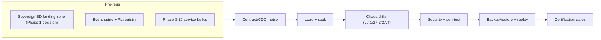

Hard dependency: **the sovereign in-country landing zone** (Outposts / Dedicated Local Zone / sovereign partner) must be the *actual* test target for D5–D11. Running Finance/Custody chaos and RPO=0 drills on an out-of-country AWS region would invalidate certification, because it cannot prove the data-residency invariant the BA mandates. This is the Phase-1 sovereignty decision surfacing as a Phase-11 test-validity blocker.

### 13.6 Assumptions

- Test environments mirror production topology (2-region in-country quorum for money/custody) closely enough to make RPO/RTO numbers meaningful.
- Synthetic data generators can produce realistic DID/GPID/ORD/SHP volumes at Eid scale without using real PII.
- MFS/bank sandboxes (or high-fidelity simulators) exist for failover drills; where vendors lack sandboxes, contract-test against recorded fixtures.
- Money is integer poisha throughout test fixtures; no float tolerances permitted in financial assertions.

### 13.7 Risks

| ID | Risk | Sev |
|---|---|---|
| K1 | No in-country test region → chaos/RPO drills run out-of-country, certification invalid | CRITICAL |
| K2 | Fencing drill passes in test but split-brain occurs under real partition timing | CRITICAL |
| K3 | CDC matrix incomplete → undetected spine schema break in production | HIGH |
| K4 | MFS sandbox unavailable → failover untested against real provider semantics | HIGH |
| K5 | Eid 100x load not reproducible → SLO regressions ship | HIGH |
| K6 | Pen-test against PKI/HSM superficial → custodial-signing weakness | HIGH |
| K7 | Projection-rebuild drift vs. ledger truth undetected | MEDIUM |

### 13.8 Mitigations

| Risk | Mitigation |
|---|---|
| K1 | Gate all Finance/Custody certs on sovereign-zone availability; escalate landing-zone decision as Phase-1 critical-path blocker; no waiver path |
| K2 | Use deterministic fault injection (clock skew, network partition, lease expiry) replaying Ch.27.1 lease/fencing-token states; require fencing-token monotonicity assertion |
| K3 | CDC mandatory in CI; producer cannot deploy until all registered consumer pacts pass; spine PL versioning enforced (R6) |
| K4 | Build provider simulator from contract fixtures; run dual-mode (sandbox + simulator); idempotency-key replay assertions |
| K5 | Capacity-test as code with locked load profiles; soak at 100x for sustained window, not spike-only |
| K6 | Independent third-party pen-test for #1 (PKI/HSM, KYC V0–V3, PDP) and #8; remediation re-test before cert |
| K7 | Replay-to-truth reconciliation: rebuild projections (#4,#5) from custody ES (#3) and diff against live read models; zero-drift gate |

### 13.9 Review Checklist

- [ ] Every service has unit (≥80%), integration, and contract suites
- [ ] CDC pact matrix complete for all spine + gRPC producer/consumer pairs
- [ ] R1–R8 each have at least one explicit invariant test
- [ ] Ch.27.1–27.4 each have a passing chaos/security drill on the sovereign zone
- [ ] Eid 100x and recall 100x load results within SLO
- [ ] Backup/restore + PITR drilled with measured RTO; RPO=0 proven for money/custody
- [ ] Event-replay rebuild matches ledger truth (zero drift)
- [ ] Offline/USSD/SMS/IVR parity matrix green (R8)
- [ ] Pen-test findings: zero CRITICAL/HIGH open

### 13.10 Approval Criteria

Sign-off requires: (a) all P0 deliverables green; (b) ARB co-sign on D5–D13 evidence for Finance (#8) and Custody (#3); (c) security-reviewer sign-off on D9/D12; (d) Event-Spine Enabling team sign-off on D3; (e) SRE sign-off on D6/D10. Any CRITICAL finding **blocks**; HIGH requires documented, time-boxed remediation before wave promotion.

### 13.11 Definition of Done

Every in-scope service holds a signed certification scorecard; all P0 chaos/recovery drills passed on the in-country sovereign zone; CDC matrix enforced in CI as a merge gate; replay/rebuild zero-drift proven; pen-test clean of CRITICAL/HIGH; load SLOs met at Eid/recall 100x. Test suites and game-day runbooks are committed and reproducible.

### 13.12 Exit Criteria

Wave is cleared for Phase 12 (cutover) only when its full certification scorecard is signed and the four Ch.27 safety gates are demonstrably enforced under fault injection. No service enters production on a verbal or partial pass.

### 13.13 Estimated Complexity, Priority, Critical Path

| Dimension | Value |
|---|---|
| Estimated Complexity | **XL** (cross-context sagas, sovereign-zone chaos, dual-region recovery, third-party pen-test) |
| Priority | **P0** |
| Critical Path | **Yes** — certification gates the production cutover (Phase 12); Finance/Custody drills depend on the Phase-1 sovereign landing-zone decision, making this both a downstream blocker and an upstream-risk amplifier |

### 13.14 Quality Gates

| Gate | Threshold | Blocks |
|---|---|---|
| QG-Unit | ≥80% coverage/service | Merge |
| QG-CDC | 100% consumer pacts pass | Producer deploy |
| QG-Fence | Split-brain impossible under injected partition (Ch.27.1) | Custody/Finance cert |
| QG-RPO | RPO=0 proven on region loss (Ch.27.2) | Finance/Custody cert |
| QG-MFS | Idempotent failover, no double-payout (Ch.27.4) | #8 cert |
| QG-Cosign | No custodial action without agent co-signature (Ch.27.3) | #3 cert |
| QG-Replay | Zero projection drift vs. ledger | #4/#5 cert |
| QG-Sec | Zero CRITICAL/HIGH pen findings | Wave promotion |
| QG-Load | SLOs met at Eid/recall 100x | Wave promotion |
| QG-Parity | USSD/SMS/IVR/offline parity (R8) | Edge cert |

---

## 14. Phase 12 — Production Readiness

Phase 12 is the final gate before any context carries live traffic, money, or custody writes. It converts the engineered system (Phases 1–11) into an operable, on-call-ready platform and runs the **Operational Readiness Review (ORR)** that grants production authority context-by-context. Finance (#8) and Custody (#3) cannot exit without the four Ch.27 Major remediations proven in production-equivalent conditions.

### 14.1 Purpose

Stand up the operational substrate — runbooks, SRE practices, on-call, monitoring/alerting against SLOs and error budgets, capacity, incident response, release/rollback (including stateful restore) — and ratify production go-live per context via the ORR. The strictest SLOs and gates apply to money/custody (R1, R2, R3, Ch.27.1–27.4). Government (#11) inherits read-mostly operability (R5); all contexts inherit event-spine and audit OHS observability (R6).

### 14.2 Inputs

| Input | Source |
|---|---|
| Hardened services, all 13 contexts + EDGE/SPINE | Phases 3–11 |
| Sovereign AWS landing-zone decision (in-country) | Phase 1 CRITICAL decision (sovereignty tension) |
| Chaos/DR test results, backup/restore proofs | Ch.27 test specs |
| Fencing/quorum/co-signature/cooling-off implementations | Ch.27.1–27.4 |
| SLO/SLI catalog, capacity models | SA Ch.27.7, ADR-011 |
| Security & rotation-cadence specs | security.md, Ch.27 |

### 14.3 Outputs

Approved ORR sign-offs per context; published runbook library; live observability stack with money/custody dashboards; on-call rotations active; error-budget policy in force; rollback/restore drills evidenced; production go-live authorizations (staged).

### 14.4 Deliverables

| ID | Deliverable | Trace |
|---|---|---|
| D1 | Runbook library (Ch.27.7 set): single-writer failover, fencing-token recovery, quorum region-loss, escrow saga recovery, payout cooling-off release, recall execution, MFS/bank adapter outage, USSD/IVR degradation | Ch.27.1–27.5, R1–R3, R8 |
| D2 | SRE practice charter: SLO/SLI catalog, error-budget policy, toil budget, golden-signal standards | SA Ch.27.7 |
| D3 | On-call model: tiered rotations per team, escalation matrix, follow-the-sun coverage for money/custody | TEAMS, Ch.27.7 |
| D4 | Monitoring/alerting: dashboards per context; money/custody strictest alert thresholds; audit OHS sink completeness checks | R2, R6, Ch.27.7 |
| D5 | Severity matrix + incident-response process (Sev1–Sev4), comms, post-incident review | Ch.27.7 |
| D6 | Capacity & cost model: nation-scale load, peak/festival surge, headroom targets, cost guardrails | Ch.27 cost spec |
| D7 | Release process: progressive delivery, change-freeze rules for Finance/Custody, approval gates | R2, ADR-011 |
| D8 | Rollback & stateful restore runbooks: append-only ledger replay, double-entry restore, quorum reseed, PITR validation | R1, R2, Ch.27.2 |
| D9 | ORR checklist + per-context sign-off register (Finance/Custody = 4 Major gates) | Ch.27.1–27.4 |
| D10 | Rotation-cadence operations: key/secret/credential rotation, HSM ceremony schedule | #1 PKI/HSM, Ch.27.3, security.md |

### 14.5 Dependencies

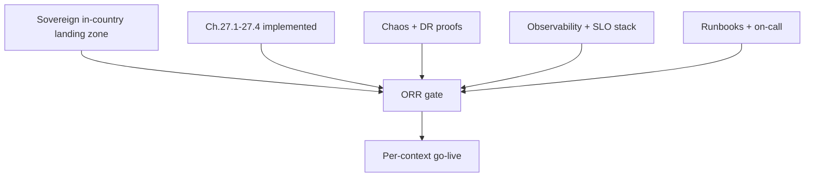

Hard upstream: Phase 1 sovereign landing-zone resolution (no PII/money/custody egress; AWS has no BD region — Outposts / Dedicated Local Zones / sovereign-partner). Finance/Custody go-live is **blocked** until landing-zone sovereignty is legally and technically attested.

### 14.6 Assumptions

| # | Assumption | If false |
|---|---|---|
| A1 | Sovereign landing zone operational in-country before money/custody go-live | Finance/Custody go-live slips; non-sovereign contexts may proceed |
| A2 | Synchronous 2-region in-country quorum available (RPO=0) | Ch.27.2 gate fails; custody/money blocked |
| A3 | Chaos/DR proofs from prior phases are production-representative | Re-run under production topology |
| A4 | HSM/PKI co-signature infra (Ch.27.3) live | Custodial signing blocked |
| A5 | Telecom partners support USSD/IVR SLAs (R8) | Degraded-mode runbooks become primary |

### 14.7 Risks

| ID | Risk | Sev |
|---|---|---|
| RK1 | Sovereign AWS landing zone unavailable/immature in BD — blocks all money/custody | Critical |
| RK2 | Split-brain on single-writer during failover (R1, Ch.27.1) | Critical |
| RK3 | Region loss with RPO>0 on money/custody WAL (Ch.27.2) | Critical |
| RK4 | Escrow payout before cooling-off → MFS-withdrawal loss (Ch.27.4) | Critical |
| RK5 | Audit OHS sink gaps break tamper-evidence (R6) | High |
| RK6 | Festival-surge capacity shortfall, USSD path saturation (R8) | High |
| RK7 | Alert fatigue masks money/custody Sev1 | High |

### 14.8 Mitigations

| Risk | Mitigation |
|---|---|
| RK1 | Treat landing zone as standalone Phase-1 critical-path workstream; ORR legal+technical sovereignty attestation; staged go-live decouples non-sovereign contexts |
| RK2 | Consensus-lease + fencing-token failover drill in ORR; chaos kill-leader test must show zero double-write |
| RK3 | Synchronous quorum region-loss drill; reject go-live unless measured RPO=0 |
| RK4 | SETTLEMENT_HELD cooling-off enforced + release runbook; negative test proving no early payout |
| RK5 | Audit completeness reconciliation alarm; sink lag SLO |
| RK6 | Capacity model with surge headroom; USSD/IVR load test; degraded-mode runbooks |
| RK7 | Tiered alerting, money/custody on dedicated high-priority channel, suppress noise via SLO burn-rate alerts |

### 14.9 SLO / Error-Budget Tiering

| Tier | Contexts | Availability SLO | Error-budget policy |
|---|---|---|---|
| Strictest | #3 Custody, #8 Finance | Highest; correctness > availability; RPO=0 | Any budget burn freezes feature releases; correctness incidents = auto-Sev1 |
| High | #1 Identity, #5 Inventory, #6 B2C, #7 B2B, #9 Logistics | High | Burn-rate alerts; release slow-down on breach |
| Standard | #2 Catalog, #4 Provenance read, #10 Fraud, #12 Analytics, #13 Platform | Standard | Budget-driven prioritization |
| Read-mostly | #11 Government | Read-availability focus (R5) | Read-staleness SLO |

### 14.10 Severity Matrix (Ch.27.7)

| Sev | Trigger | Response | Comms |
|---|---|---|---|
| Sev1 | Money loss/double-write, custody integrity breach, RPO violation, mass auth failure | Immediate page, incident commander, war-room | Exec + regulator-ready |
| Sev2 | Context-wide outage, escrow saga stuck, USSD path down | Page on-call, 15-min ack | Internal + partner |
| Sev3 | Degraded SLO, single-service impact | Next-business-hour | Internal |
| Sev4 | Cosmetic/low impact | Backlog | None |

### 14.11 Review Checklist

- [ ] All Ch.27.7 runbooks authored, peer-reviewed, drill-tested
- [ ] SLOs/SLIs defined per context; money/custody strictest tier confirmed
- [ ] On-call rotations staffed; escalation matrix validated end-to-end
- [ ] Dashboards + alerts live; audit OHS sink completeness monitored (R6)
- [ ] Fencing-token failover drill passed (no split-brain; R1, Ch.27.1)
- [ ] Quorum region-loss drill passed (RPO=0; Ch.27.2)
- [ ] Co-signature + cooling-off negative tests passed (Ch.27.3/27.4)
- [ ] Stateful restore (ledger replay, double-entry PITR) drilled
- [ ] Capacity model signed off incl. festival surge + USSD parity (R8)
- [ ] Sovereignty attestation (in-country, no egress) for money/custody

### 14.12 Approval Criteria

ORR board (Chief Architect + Finance Lead + Custody/Provenance Lead + SRE Lead + Security/Governance Lead) signs **per context**. Finance and Custody require unanimous sign-off plus evidence on all **four Major gates** (Ch.27.1–27.4) and sovereignty attestation. No Sev1-class open defect. Error-budget policy ratified and tooled.

### 14.13 Definition of Done

Every in-scope context has: published drill-tested runbooks; active monitoring/alerting against agreed SLOs; staffed on-call; rehearsed rollback+restore; capacity sign-off; and a recorded ORR decision. Audit OHS sink verified end-to-end. Rotation cadences scheduled and owned.

### 14.14 Exit Criteria

| Gate | Condition |
|---|---|
| G-Sov | In-country sovereign landing zone attested (legal + technical) for money/custody/PII |
| G-Single-Writer | Fencing failover drill: zero double-write (R1) |
| G-RPO0 | Quorum region-loss drill: RPO=0 (Ch.27.2) |
| G-Sign | Co-signature mandatory + trust levels enforced (Ch.27.3) |
| G-Cool | Payout cooling-off proven (Ch.27.4) |
| G-ORR | All target-context ORR sign-offs recorded; staged go-live authorized |

### 14.15 Estimated Complexity / Priority / Critical Path / Quality Gates

| Attribute | Value |
|---|---|
| Estimated Complexity | **XL** — spans all 13 contexts, EDGE, SPINE; deepest gates on Finance/Custody |
| Priority | **P0** — no production traffic without it |
| Critical Path | **Yes** — terminal gate; sovereign landing zone (RK1) and Ch.27 Major gates are the binding long-lead items blocking money/custody launch |
| Quality Gates | G-Sov, G-Single-Writer, G-RPO0, G-Sign, G-Cool, G-ORR; SLO-tier dashboards green; chaos/DR + restore drills passed; audit OHS completeness verified; capacity + USSD/IVR parity (R8) signed off |

Staged go-live is explicit: non-sovereign-sensitive read/standard-tier contexts (#2, #4-read, #12) may receive go-live ahead of money/custody, but **no** context handling PII, money, or custody writes launches until G-Sov and the four Major gates are green.

---

## 15. Dependency Graph & Analysis

This section makes the build order falsifiable. It models DOKANDAR's realization across **five dependency layers** — contexts/services, events, infrastructure, shared libraries, deployment — then extracts the critical path, the parallelizable surface, the hard blockers, and the high-risk nodes. The thesis the graph must prove: **Identity (#1) and Catalog (#2) as master-data OHS (R7), plus the Platform substrate (#13) and the event-spine (R6), are universal blockers**; **Finance (#8) cannot enter production until the Ch.27 remediations are green**; and the **sovereign in-country landing zone (Phase-1 CRITICAL)** sits beneath everything.

### 15.1 Layer 1 — Context / Service Dependency Graph

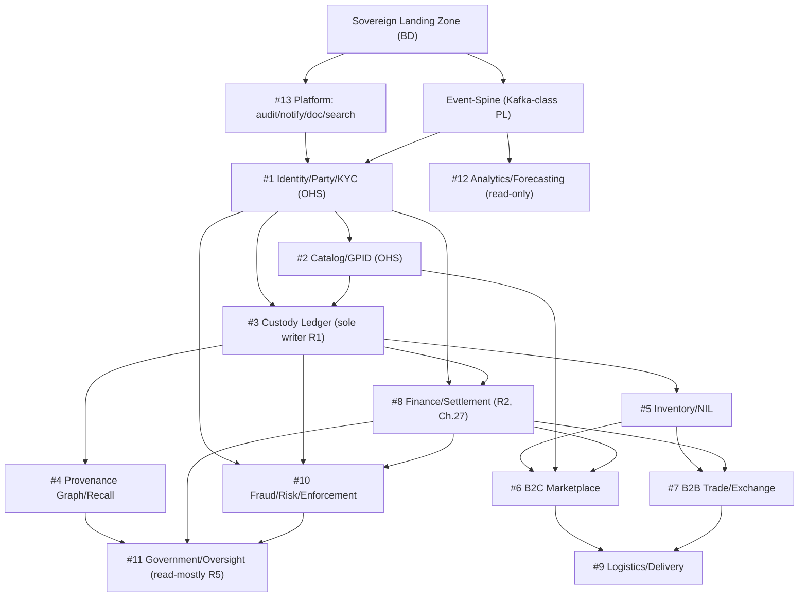

**Reading the graph.** Identity is the in-degree sink for everyone: nothing authenticates, authorizes (RBAC+ABAC PDP), or resolves a DID without it. Catalog gates every commerce and custody flow needing a GPID. Custody (#3, R1 sole writer) gates the entire Provenance Core (#4, #5) and is an input to Finance and Fraud. Finance fans out to Commerce (#6), Exchange (#7), Risk (#10), and Government (#11). Downstream-only contexts (Analytics #12, Government #11) consume Published Language and never block upstream — they are the safest to defer.

| Context | Blocks (out-degree) | Blocked-by (in-degree) | Role |
|---|---|---|---|
| #1 Identity | #2,#3,#8,#10 + all BFFs | Platform, Spine | **Universal blocker** |
| #2 Catalog | #3,#6,#7 | Identity | **Universal blocker** |
| #3 Custody | #4,#5,#8,#10 | Identity, Catalog | **Critical path** |
| #8 Finance | #6,#7,#10,#11 | Identity, Custody | **Gated by Ch.27** |
| #13 Platform | all (audit OHS sink R6) | Landing Zone | **Foundation** |
| Event-Spine | all (PL, R6) | Landing Zone | **Foundation** |
| #12 Analytics | — | Spine | Deferrable leaf |
| #11 Government | — | Provenance, Finance, Fraud | Deferrable leaf (R5) |

### 15.2 Layer 2 — Event / Published-Language Dependencies

Per R6, all cross-context coupling flows through the versioned spine; no cross-store reads. Producer→consumer edges define the integration build order.

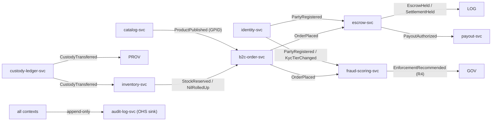

**Build implication.** The spine's schema-registry, PL governance, and the `audit-log-svc` append-only sink must exist before any producer ships — they are Layer-2 prerequisites. The `SettlementHeld`/payout cooling-off events (Ch.27.4) are a hard precondition for any MFS payout consumer. Contract tests on every edge gate integration sign-off.

### 15.3 Layer 3 — Infrastructure Dependencies

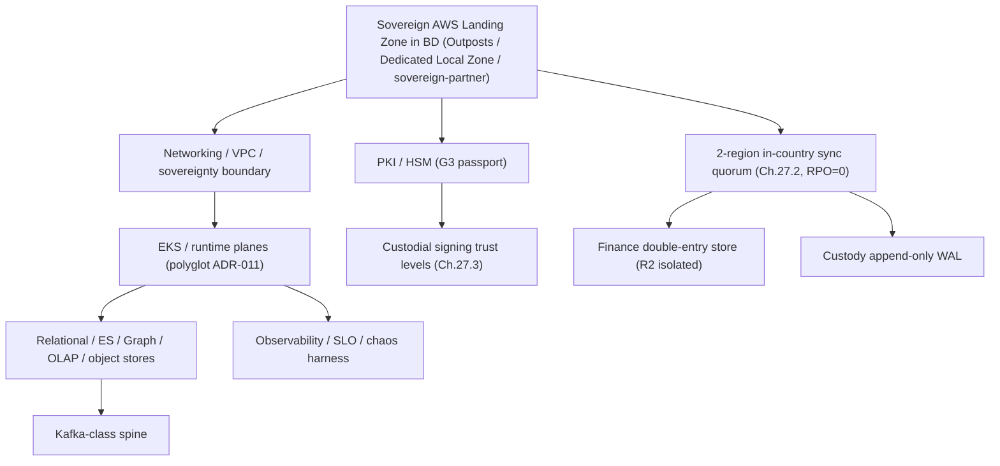

**The sovereignty node is the deepest root.** AWS has no Bangladesh region, yet the frozen BA forbids PII/money/custody from leaving the country. The landing-zone decision (Outposts vs Dedicated Local Zone vs sovereign-partner) is a **Phase-1 CRITICAL gate**: it determines whether the synchronous 2-region in-country quorum (Ch.27.2) is even physically realizable, which in turn gates Finance and Custody production. **This is not a solved default; it is the top platform risk and is on the critical path.**

### 15.4 Layer 4 — Shared Library Dependencies

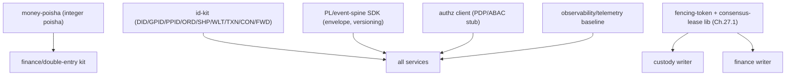

These cross-cutting libraries (Enabling-team owned) are **transitive blockers**: a defect or late delivery in `id-kit`, the `PL SDK`, or the `fencing-token` library stalls every consuming team simultaneously. They must be versioned, contract-frozen, and shipped in Phase 1 ahead of context work. The `fencing-token`/`consensus-lease` library (Ch.27.1, no split-brain) is the single most leveraged shared component because both single-writer guarantees (R1 custody, R2 Finance) depend on it.

### 15.5 Layer 5 — Deployment Dependencies

Deployment order is a topological sort of Layers 1–4. Each wave is gated; a wave cannot ship until the prior wave's gates pass.

| Wave | Deployable | Entry gate |
|---|---|---|
| W0 | Landing zone, networking, HSM, observability | Sovereignty decision ratified (ADR) |
| W1 | Platform #13 (audit OHS sink), event-spine + registry | W0 green; PL governance live |
| W2 | Identity #1, Catalog #2 (master-data OHS) | Shared libs frozen; spine contract tests pass |
| W3 | Custody #3, Inventory #5, Provenance #4 | Fencing lib + quorum validated; R1 enforced |
| W4 | Finance #8 (escrow, payout, recon) | **Ch.27.1–27.4 gates green** (fencing, RPO=0, co-signature, cooling-off) |
| W5 | B2C #6, B2B #7 | Inventory + Finance + Catalog reads stable |
| W6 | Logistics #9, Fraud #10 | Order/Finance events flowing; R4 four-eyes wired |
| W7 | Government #11, Analytics #12 | Upstream PL stable (read-mostly R5) |

### 15.6 Critical Path, Parallelism, and Blockers

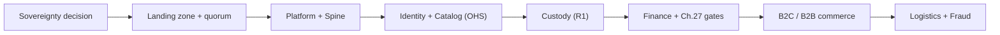

**Critical path (longest dependency chain):** Sovereignty → Landing zone + in-country quorum → Platform + Spine → Identity + Catalog → Custody → **Finance (Ch.27 gate)** → Commerce → Logistics/Fraud. Schedule risk concentrates on this chain; every week lost on the sovereignty decision or the Ch.27 remediations slips the entire commerce launch.

**Parallelizable work (off critical path).** Once W2 (Identity/Catalog) is stable, the following proceed concurrently across teams: Provenance Graph/Recall (#4) alongside Inventory (#5); B2C (#6, Commerce) and B2B (#7, Exchange, Separate Ways per ADR-009) on independent runtimes; Analytics (#12) and Government (#11) as read-only/read-mostly leaves built last with no upstream blocking. Shared-library and observability hardening run continuously alongside.

**Blocking work (must finish before dependents start):** shared libs (`id-kit`, `PL SDK`, `fencing-token`); the audit OHS sink; the spine schema registry; the in-country quorum; the Ch.27 Finance/Custody gates.

| Risk | Layer | Severity | Why critical-path |
|---|---|---|---|
| Sovereign landing zone unresolved (no AWS BD region) | Infra | **CRITICAL** | Roots the whole graph; blocks RPO=0 quorum, Finance, Custody |
| Ch.27.1 fencing / no split-brain | Lib/Infra | **CRITICAL** | Gates both R1 and R2 single-writer guarantees |
| Ch.27.2 in-country sync quorum (RPO=0) | Infra | **CRITICAL** | Pre-prod gate for money + custody WAL |
| Ch.27.3/27.4 co-signature + payout cooling-off | Finance | **HIGH** | Blocks W4 Finance production |
| Identity/Catalog OHS latency or contract drift | Context/Lib | **HIGH** | Universal fan-out; stalls all consumers |
| Event-spine PL versioning instability | Event | **HIGH** | Every integration edge depends on it (R6) |
| Polyglot runtime sprawl (ADR-011) | Deploy | **MEDIUM** | Raises platform/SRE coordination cost |

**Bottom line:** the graph confirms a single spine of dependency — sovereignty → platform/spine → Identity/Catalog → Custody → Finance — with broad parallel commerce/leaf work hanging off it. Protecting that spine, and refusing to treat either the sovereign landing zone or the Ch.27 Finance gates as solved, is the central scheduling discipline of this roadmap.

---

## 16. Critical Path Analysis

This section identifies the single longest dependency chain from an empty AWS account to **first revenue-generating transactions** on DOKANDAR, the items that sit *on* that chain (longest poles), the work that can be pulled *off* it via parallelization, and where slack exists. The governing constraint is unforgiving: nothing on the money/custody path may ship until the four ARB Major remediations (Ch.27.1–27.4) pass, and *all* of it must run inside a sovereign in-country landing zone whose existence is **not yet proven** (sovereignty tension, see §3/§5). The critical path is therefore gated more by **trust/sovereignty milestones** than by raw coding effort.

### 16.1 The critical path, stated

The zero-to-revenue spine is a strict chain because each link is a hard prerequisite for the next:

1. **Sovereign landing zone decision + provisioning** — no PII/money/custody store (R2, R6, R7; data-sovereignty mandate) can be created until an in-country AWS substrate (Outposts / Dedicated Local Zone / sovereign-partner) is contracted and live. This is the *root* dependency for every stateful service.
2. **Shared platform + event-spine** — the Kafka-class versioned Published Language and the `audit-log-svc` append-only OHS sink (R6) must exist before any context can emit or consume domain events.
3. **Identity master-data (Ctx #1)** — DID issuance, KYC tiers V0–V3, and the RBAC+ABAC PDP (R7) gate every authenticated write across the platform. HSM/PKI (G3) for national-passport trust is the long-pole *inside* this link.
4. **Catalog master-data (Ctx #2)** — GPID issuance (R7) is required before custody can reference goods or B2C can list them.
5. **Custody ledger (Ctx #3) + Inventory (Ctx #5)** — `custody-ledger-svc` is the SOLE custody writer (R1); inventory projects from it (G2 strong-local reserve). Custody **cannot go production** without Ch.27.1 (consensus-lease + fencing) and Ch.27.2 (2-region in-country quorum, RPO=0).
6. **Finance & Settlement (Ctx #8)** — the gravitational center of risk. Isolated double-entry ledger (R2), escrow saga (R3), and **all four** Ch.27 Major gates must pass: 27.1 single-writer, 27.2 sync quorum, 27.3 custodial-signing + agent co-signature, 27.4 escrow payout cooling-off (`SETTLEMENT_HELD`).
7. **First revenue wave** — B2C order→escrow→logistics→payout (Ctx #6, #8, #9) wired through the spine, behind fraud four-eyes (R4).

### 16.2 Timeline (critical path highlighted)

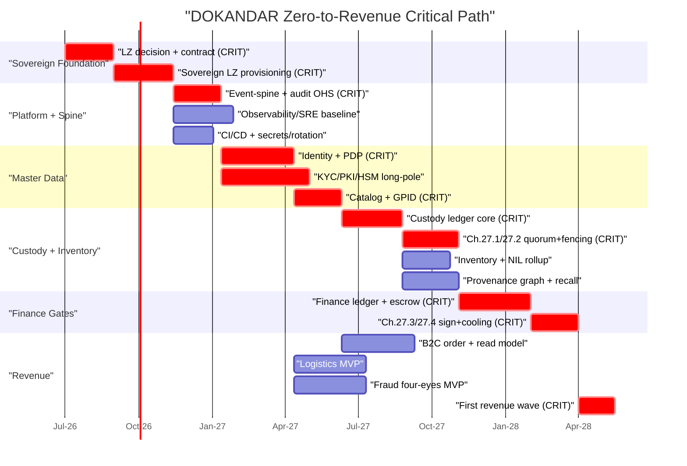

### 16.3 Critical-path table (durations, dependencies, longest poles)

| # | Critical-path item | Owner team | Dur. | Hard dependency | Trace | Longest-pole risk |
|---|---|---|---|---|---|---|
| CP1 | Sovereign LZ decision + contract | Platform/Infra/SRE + Governance | 60d | — | Sovereignty mandate; R2/R6/R7 | **Highest.** No AWS BD region; vendor/legal, not engineering, controls duration |
| CP2 | Sovereign LZ provisioning + sovereignty attestation | Platform/Infra/SRE | 75d | CP1 | ADR-012; data-residency | Hardware lead-times (Outposts); cross-region quorum feasibility |
| CP3 | Event-spine PL + audit OHS sink | Event-Spine Enabling | 60d | CP2 | R6; ADR-011 | Schema-registry governance; versioning discipline |
| CP4 | Identity + RBAC/ABAC PDP | Substrate (Ctx #1) | 90d | CP3 | R7; FR-identity; KYC V0–V3 | PDP latency budget; gates every write |
| CP4b | KYC/PKI/HSM (G3) | Substrate (Ctx #1) | 110d | CP3 | ADR (national PKI); G3 | **High.** HSM procurement + passport-authority integration runs *parallel-but-longer* than CP4 |
| CP5 | Catalog + GPID issuance | Substrate (Ctx #2) | 60d | CP4 | R7; G1; FR-catalog | Master-data modeling; search indexer can lag |
| CP6 | Custody ledger core (sole writer) | Provenance Core (Ctx #3) | 75d | CP5 | R1; ADR-001 | Event-sourcing correctness; idempotency |
| CP7 | Ch.27.1 + 27.2 (fencing + 2-region quorum) | Provenance Core + Platform | 70d | CP6 | Ch.27.1/27.2; RPO=0 | **High.** Depends on CP2 quorum feasibility; chaos/failover proof |
| CP8 | Finance ledger + escrow saga | Finance (Ctx #8) | 90d | CP7 | R2, R3; integer poisha | **Highest engineering.** Isolation + exactly-once + reconciliation |
| CP9 | Ch.27.3 + 27.4 (co-sign + cooling-off) | Finance (Ctx #8) | 60d | CP8 | Ch.27.3/27.4 | MFS/bank adapter certification; payout-loss controls |
| CP10 | First revenue wave (B2C→escrow→payout) | Commerce + Finance + Logistics | 45d | CP9 | FR-order; R3; R4 | Integration drift across 3 contexts |

**Nominal critical-path length:** CP1→CP2→CP3→CP4→CP5→CP6→CP7→CP8→CP9→CP10 ≈ **675 days (~22 months)**. Note CP4b (KYC/PKI/HSM, 110d) runs concurrently with CP4 (90d) but is the binding sub-path into custody if passport-trust is required for V3 onboarding before custody go-live; it adds ~20d of effective slack-consumption risk and must be watched as a *shadow* critical path.

### 16.4 What is OFF the critical path (parallelizable)

These deliver value but never gate the revenue spine, provided they consume the spine/master-data as published contracts rather than blocking them:

| Off-path workstream | Runs parallel to | Slack | Latest-start gate |
|---|---|---|---|
| Observability/SRE baseline, CI/CD, secret rotation cadence | CP3–CP6 | Medium | Must precede CP7 chaos drills |
| Inventory + NIL rollup (Ctx #5) | CP7/CP8 | High | Needs custody events (CP6), not CP9 |
| Provenance graph + recall (Ctx #4, CQRS read) | CP7–CP9 | High | Read-side; tolerant of lag |
| B2C order + read model (Ctx #6) | CP6–CP9 | Medium | Joins only at CP10 |
| Logistics MVP (Ctx #9) | CP5–CP9 | Medium | Joins at CP10 |
| Fraud four-eyes MVP (Ctx #10) | CP6–CP9 | Medium | R4 enforced before CP10 cutover |
| B2B Trade (Ctx #7, Separate Ways) | Entire path | Very high | Post-revenue; ADR-009 isolates it |
| Government/oversight (Ctx #11), Analytics (Ctx #12) | Entire path | Very high | Read-mostly downstream (R5) |

### 16.5 Leadership directives on the critical path

1. **De-risk CP1/CP2 first and in parallel with planning — not after.** The sovereign landing zone is the only item where engineering cannot compress the schedule; treat it as a board-level procurement program with a hard go/no-go at day 60 and a fallback sovereign-partner track running concurrently. If RPO=0 two-region in-country quorum (Ch.27.2) proves infeasible on the chosen substrate, **the entire Finance go-live date is invalid** — this dependency must be validated during CP2, not discovered at CP7.
2. **Pull CP4b (HSM/PKI) forward to day-1 procurement.** It is a 110-day pole with external-authority dependencies; starting it the moment CP2 attests sovereignty removes it from the binding path.
3. **Buffer the four Finance gates, not the build.** CP8→CP9 carries the highest *consequence* (real money loss). Add explicit chaos/backup-restore/runbook milestones (Ch.27 test specs) as named gate criteria with zero schedule compression allowed.
4. **Parallelize aggressively below master-data.** Once Identity (CP4) and Catalog (CP5) publish stable contracts, Commerce, Logistics, Fraud, Inventory, and Provenance-read teams all start, converging only at CP10. This is where 6+ teams work concurrently and where most *float* lives.
5. **Single integration choke point = CP10.** Three contexts (Commerce, Finance, Logistics) plus Fraud meet here; pre-stage contract tests against the spine throughout CP6–CP9 so CP10 is wiring, not discovery.

**Bottom line:** the critical path is *trust-gated, not effort-gated*. Sovereignty (CP1/CP2) and the four ARB Finance/Custody gates (CP7/CP9) are the immovable poles; everything else can be parallelized around them.

---

## 17. Project Risk Register

This register is the single source of truth for execution risk across the DOKANDAR build. It is owned by the Governance Lead, reviewed weekly at the Architecture Review Board (ARB) standing slot, and gated into every phase exit. Each row traces to the frozen Business Architecture (BA), Service Architecture (SA), an Architecture Decision Record (ADR), a design Rule (R1–R8), or an FR. Risks are scored on a 1–5 scale; **Severity = Probability × Impact**, banded as **CRITICAL ≥ 16**, **HIGH 10–15**, **MEDIUM 5–9**, **LOW ≤ 4**. No risk is closed without an ARB-recorded residual-risk acceptance.

### 17.1 Scoring Legend

| Band | Severity score | Governance treatment |
|------|----------------|----------------------|
| CRITICAL | 16–25 | Phase-blocking; named exec owner; weekly ARB review; written contingency funded |
| HIGH | 10–15 | Milestone-blocking; biweekly review; mitigation in active sprint |
| MEDIUM | 5–9 | Tracked; reviewed at phase boundary |
| LOW | 1–4 | Monitored; no active spend |

### 17.2 Master Risk Register

| ID | Risk | Prob | Impact | Severity | Owner | Mitigation (planned) | Contingency | Status | Trace |
|----|------|------|--------|----------|-------|----------------------|-------------|--------|-------|
| R-01 | **Sovereign AWS landing zone in Bangladesh undeliverable** — AWS has no BD region; BA mandates no PII/money/custody egress. Outposts / Dedicated Local Zones / sovereign-partner may be unavailable, late, or non-compliant. | 4 | 5 | **20 CRITICAL** | Chief Architect + Platform/SRE Lead | Phase-1 decision spike (parallel tracks: Outposts, Dedicated Local Zone, licensed BD sovereign-partner DC, OpenStack/bare-metal fallback). Binding go/no-go gate before any stateful build. Data-residency control plane proven with synthetic PII first. | Pivot to non-AWS in-country IaaS (bare-metal + K8s) under same Terraform-abstracted topology; toolchain becomes portability layer, not AWS-locked. Budget reserve held. | OPEN | BA sovereignty mandate; ADR-011; R6; Constraint "Sovereignty Tension" |
| R-02 | **Single-writer fencing incorrect** — consensus-lease + fencing-token logic for custody/finance allows split-brain or stale-token writes under partition. | 3 | 5 | **15 HIGH** | Provenance Core Lead + Finance Lead | Formal spec + model-checking (TLA+/Jepsen-class) of lease/fence protocol before GA; deterministic fencing-token monotonicity tests; chaos partition suite as pre-prod gate. | Quorum write-path frozen to single primary with manual failover runbook until proof complete; no automated failover ships unverified. | OPEN | Ch.27.1; R1; R2 |
| R-03 | **Cross-region synchronous quorum latency** — in-country 2-region sync WAL for money/custody (RPO=0) adds tail latency that breaks order/checkout SLOs. | 4 | 4 | **16 CRITICAL** | Finance Lead + Platform/SRE | Co-locate the two in-country regions on low-RTT fiber; budget latency early via load model; keep sync boundary scoped to money/custody WAL only, async everywhere else; SLO renegotiation with product on financial write paths. | Tiered durability: synchronous for settlement-critical TXN, near-sync (bounded-lag) for lower-tier writes with explicit risk acceptance per transaction class. | OPEN | Ch.27.2; R2 |
| R-04 | **Custodial-signing trust failure** — HSM/PKI trust levels or mandatory agent co-signature bypassed, enabling unauthorized custody/payout signing. | 2 | 5 | **10 HIGH** | Identity Lead + Finance Lead | Hardware HSM (G3) with enforced co-signature quorum; trust-level state machine reviewed by security-reviewer; key-ceremony runbooks; rotation cadence spec. | Freeze high-value signing to manual four-eyes ceremony; revoke compromised trust level and rotate keys per incident runbook. | OPEN | Ch.27.3; #1; R2 |
| R-05 | **MFS/telco provider dependence** — bKash/Nagad/bank rails and USSD/SMS/IVR gateways are external, rate-limited, and can withdraw or degrade. | 4 | 4 | **16 CRITICAL** | Finance Lead + Logistics/Edge | Multi-provider adapter abstraction (mfs-bank-adapters); per-provider circuit breakers; escrow payout cooling-off (SETTLEMENT_HELD) absorbs withdrawal-loss window; contractual SLAs + reconciliation (cod-recon-svc). | Hot-swap to alternate MFS/bank adapter; degrade to COD + offline settlement; USSD parity path keeps commerce live if app channel drops. | OPEN | Ch.27.4; #8; R8; ADR-009 |
| R-06 | **5-language polyglot talent supply** — Go/Java/C#/Python/Node + niche skills (event-sourcing, graph DB, HSM) scarce in BD labor market; staffing slips schedule. | 4 | 4 | **16 CRITICAL** | TPM + Governance Lead | Staffing plan front-loaded; language ownership aligned to team boundaries (no cross-language sprawl); hire-ahead for Finance/Custody specialists; pairing + internal academy; constrain net-new languages to ADR-011 set. | Outsource/contract bridge for scarce skills (event-sourcing, HSM); collapse a context to its team's primary language if a stack proves unstaffable, with ARB approval. | OPEN | ADR-011; Teams topology |
| R-07 | **Provenance graph scaling** — graph DB read side (provenance-projection, recall) fails to scale to nation-scale custody chains and recall fan-out. | 3 | 4 | **12 HIGH** | Provenance Core Lead | Capacity model from day one; CQRS read-side horizontally partitioned; recall index (Ch.27.5) pre-computed; load test at 10x projected volume before GA. | Shard graph by region/commodity; fall back to ledger-replay for cold recall queries; cap synchronous recall depth with async escalation. | OPEN | #4; Ch.27.5; R1 |
| R-08 | **Event-spine as systemic single dependency** — Kafka-class spine carries Published Language for all 13 contexts; spine outage halts the platform. | 3 | 5 | **15 HIGH** | Event-Spine Enabling Lead + SRE | Multi-broker HA in-country; quotas + back-pressure; consumer-side idempotency so replay is safe; spine treated as Tier-0 with dedicated on-call; audit OHS sink decoupled. | Per-context local outbox buffers absorb spine downtime; degraded-mode operation on strong-local reserves (G2) for inventory/checkout until spine recovers. | OPEN | #13; R6; Spine topology |
| R-09 | **Event-schema evolution breakage** — versioned PL schema changes break downstream consumers across contexts. | 3 | 4 | **12 HIGH** | Event-Spine Enabling Lead | Mandatory backward/forward-compat schema registry; consumer-driven contract tests in CI; deprecation windows; no breaking change without ARB sign-off. | Dual-publish old+new schema versions during migration; freeze producer on contract-test failure. | OPEN | R6; #13 |
| R-10 | **Offline-sync edge cases** — offline-first + USSD/SMS/IVR parity produces conflicting writes, double-spend, or stale custody on reconnect. | 4 | 4 | **16 CRITICAL** | Commerce + Edge/Logistics Leads | Conflict-resolution policy per aggregate (custody = authoritative server, R1); idempotency keys on all offline mutations; reconciliation test matrix; bounded offline TTL. | Server-authoritative replay rejects conflicting offline writes with user-facing reconciliation flow; financial offline ops queue to SETTLEMENT_HELD, never auto-commit. | OPEN | R8; R1; #6; offline-sync-gateway |
| R-11 | **KYC/NID provider outage** — national passport PKI / NID verification (kyc-adapter) unavailable, blocking onboarding and tiering V0–V3. | 3 | 3 | **9 MEDIUM** | Identity Lead | Cache verified KYC state; async re-verification queue; graceful degradation to provisional V0 tier with capped privileges; provider SLA + health monitoring. | Allow provisional onboarding at restricted tier; batch-verify on provider recovery; manual KYC fallback for high-value parties. | OPEN | #1; KYC tiers V0–V3 |
| R-12 | **Cost overrun** — sovereign in-country infra (HSM, 2-region sync, Outposts/partner DC) far exceeds standard-cloud cost model. | 4 | 3 | **12 HIGH** | TPM + Platform/SRE | Cost spec per Ch.27 mandate; FinOps tracking from Phase 1; scope sync boundary tightly (money/custody only); reserved-capacity negotiation with sovereign partner. | Tiered durability + storage lifecycle to cut spend; phase non-critical contexts onto cheaper in-country IaaS; re-baseline budget at each phase gate. | OPEN | Ch.27 cost spec; R-01; R-03 |
| R-13 | **Scope / timeline slippage** — 13 contexts, 27 SA chapters, and pre-prod ARB gates (Ch.27) create dependency chains that compress finance/custody hardening. | 4 | 4 | **16 CRITICAL** | TPM + Governance Lead | Phased delivery with hard gates; Finance/Custody on the critical path with no parallel-scope dilution; Ch.27 remediations are non-negotiable GA gates; weekly burn-up vs. milestone. | De-scope non-core contexts (Analytics #12, parts of Gov #11) to post-GA; protect substrate + provenance + finance MVP; ARB-approved milestone re-cut rather than gate-skip. | OPEN | All phases; Ch.27 gates; SA Ch.1–27 |

### 17.3 Critical-Risk Escalation Flow

```mermaid
flowchart TD
  detect["Risk detected or score crosses CRITICAL"] --> log["Logged in register with owner"]
  log --> arb["Weekly ARB review"]
  arb --> decision{"Mitigation on track?"}
  decision -->|"Yes"| monitor["Monitor; update residual score"]
  decision -->|"No"| contingency["Trigger funded contingency"]
  contingency --> gate{"Phase gate impacted?"}
  gate -->|"Yes"| block["Block phase exit; exec sign-off required"]
  gate -->|"No"| monitor
  block --> rebaseline["Re-baseline plan or accept residual risk in writing"]
```

### 17.4 Governance Rules for This Register

- **R-01, R-03, R-05, R-06, R-10, R-13** are the standing CRITICAL set; each phase exit (per Section on phasing) requires their residual score and a written owner statement before the gate opens.
- **R-02 and R-04** are pre-production blockers for any Finance (#8) or Custody (#3) GA, enforced through the Ch.27 remediation gates — code cannot ship to those contexts with these risks OPEN and unverified.
- No risk moves to **CLOSED** without (a) evidence of mitigation in test/chaos results, (b) ARB minute recording residual acceptance, and (c) trace confirmation that no Business Architecture rule was weakened to close it.
- New risks discovered in execution are added here only; they **never** trigger changes to BA, SA, or business rules (BR-001..040) — mitigations adapt the build, not the canon.

---

## 18. Quality Gate Matrix

This section is the binding governance instrument for the roadmap: **no phase begins until the prior phase's exit gate is signed.** Each gate is measurable (objective evidence, not opinion), traced to BA/SA/ADR/R/FR, and assigned to a named approval authority. Gates are conjunctive — every listed criterion must pass; a single failing criterion blocks phase entry. Production cutover for any context additionally clears the **Per-Context Production Gate (§18.3)**, and Finance (#8) / Custody (#3) cannot reach production until **Ch.27.1–27.4 remediations are live and proven**, not merely designed.

### 18.1 Gate Authorities (RACI for approval)

| Authority | Role in gate sign-off |
|-----------|----------------------|
| **CSA** Chief Software Architect | CANON conformance, R1–R8, ADR adherence, store-isolation |
| **PE** Principal Engineer | Technical readiness, test/chaos evidence, runbooks |
| **TPM** | Scope completion, cross-team dependency closure, schedule |
| **GOV** Governance & Sovereignty Lead | In-country data sovereignty, audit OHS (R6), regulatory |
| **SEC** Security/Risk Lead | PII/HSM (G3), four-eyes (R4), secret rotation |
| **ARB** Architecture Review Board | Ch.27 pre-production gates for Finance/Custody (binding veto) |
| **SRE** Platform/Infra Lead | RPO/RTO, quorum, DR, backup/restore proof |

### 18.2 Per-Phase Gate Matrix

| Ph | Phase (scope) | Entry Criteria (measurable) | Quality Gates (objective evidence) | Approval | Exit Criteria |
|----|---------------|-----------------------------|------------------------------------|----------|---------------|
| **P0** | Foundations & **Sovereign Landing Zone Decision** | CANON frozen (BA v1.0, SA ARB-PASS) ingested; teams staffed per CANON topology; budget envelope set | **Sovereignty decision recorded as ADR**: in-country option chosen (Outposts / Dedicated Local Zone / sovereign-partner) with legal sign-off that no PII/money/custody egress occurs; data-residency control plan; cost+timeline modelled with fallback | **GOV+CSA+TPM** | Signed sovereign-LZ ADR; residency guardrails defined; **risk register opened with sovereignty as CRITICAL**; trace map BA→phases published |
| **P1** | Platform Substrate (#13) & **Event Spine** | P0 exit signed; sovereign LZ provisionable in-country | Event-spine versioned Published Language registry live (R6); **audit-log-svc append-only OHS sink** proven immutable; no cross-store coupling (R6); secret manager + rotation cadence spec; CI/CD with policy-as-gate | **CSA+SRE+GOV** | Spine + audit sink in staging with conformance tests green; PL schema governance operational; baseline observability/SLO dashboards |
| **P2** | Identity, Party & KYC (#1) | P1 exit signed; HSM/PKI procurement closed in-country | **PII encryption at rest+transit**; KYC tiers V0–V3 enforce; RBAC+ABAC PDP decisions logged; **national passport PKI on HSM (G3)**; Identity master-data OHS published (R7) | **SEC+GOV+CSA** | Identity OHS consumable by downstream; PDP authoritative; PII residency proven; pen-test on auth passed |
| **P3** | Product Master & Catalog (#2) | P2 exit signed; GPID scheme ratified | **GPID master-data OHS** (R7, G1); catalog-search-indexer CQRS parity tested; PL events versioned; no shared store with consumers (R6) | **CSA+PE** | GPID authoritative; search read-model lag within SLO; OHS contract tests green |
| **P4** | **Custody & Provenance Ledger (#3)** + Graph/Recall (#4) | P3 exit signed; **ARB pre-prod gate scheduled** | **R1 sole-writer proven**; event-sourced append-only WAL; **Ch.27.1 consensus-lease + fencing-token (no split-brain)** demonstrated under fault injection; **Ch.27.2 synchronous 2-region in-country quorum, RPO=0** measured on region-loss drill; **Ch.27.3 custodial-signing trust levels + mandatory agent co-signature**; CQRS provenance projections + **recall index (Ch.27.5)** | **ARB(veto)+CSA+SRE** | Custody single-writer + fencing live in staging; RPO=0 drill passed; recall query SLO met; ARB conditional pass recorded |
| **P5** | Inventory & NIL (#5) | P4 exit signed | **G2 strong-local reserve** correctness under concurrency; stock-projection workers idempotent; nil-rollup reconciliation tested; projections off custody read side only (R1/R6) | **PE+CSA** | Reserve/oversell invariants proven; projection lag within SLO; NIL rollups reconcile to ledger |
| **P6** | **Finance & Settlement (#8)** | P4 exit signed (custody live in staging); **ARB pre-prod gate scheduled** | **R2 no-shared-DB isolation** verified (double-entry store fully isolated); **exactly-once** ingestion proven; **R3 escrow saga** compensations tested; **Ch.27.1 fencing + Ch.27.2 sync-quorum RPO=0** for money WAL; **Ch.27.4 payout cooling-off (SETTLEMENT_HELD)** prevents MFS-withdrawal loss; money = integer poisha enforced; cod-recon + mfs/bank adapter contract tests | **ARB(veto)+SEC+GOV+SRE** | Finance isolation + exactly-once + escrow + cooling-off live in staging; reconciliation zero-drift; ARB conditional pass; chaos/backup-restore evidence filed |
| **P7** | B2C Marketplace (#6) | P2,P3,P5,P6 exits signed | b2c-order-svc saga to escrow (R3) green; b2c-catalog-read parity; **R8 offline-first + USSD/SMS/IVR parity** for core B2C flows; idempotent order keys | **PE+CSA** | B2C happy + offline paths pass; parity matrix complete; order→escrow→inventory E2E green |
| **P8** | B2B Trade & Exchange (#7) | P3,P5,P6 exits signed | **Separate Ways from B2C (ADR-009)** enforced — no shared model leakage; margining-svc correctness; trade settlement via Finance (R2) | **CSA+PE** | B2B isolation proven; margining + settlement E2E green |
| **P9** | Logistics & Delivery (#9) | P5,P7 exits signed | logistics-svc + routing correctness; telemetry-ingest time-series SLO; COD handoff to cod-recon; offline capture parity (R8) | **PE+SRE** | Delivery + telemetry E2E green; COD reconciles to Finance |
| **P10** | Fraud/Risk (#10) & Government Oversight (#11) | P6,P7,P9 exits signed | **R4 recommend-by-default four-eyes** — no autonomous enforcement without dual approval; feature-store/graph reads only; **R5 gov read-mostly** (materialized read models, no write path into operational stores); intervention-svc case store audited | **SEC+GOV+ARB** | Four-eyes enforced + audited; gov read-only proven; enforcement actions traceable to evidence |
| **P11** | Analytics/Forecasting (#12) & National-Scale Hardening / GA | All prior exits signed | analytics-pipeline + forecasting **read-only downstream** (no upstream coupling, R6); load test at national scale to SLO; full DR game-day (RTO/RPO); rotation cadence executed once end-to-end; cost within envelope | **CSA+SRE+GOV+TPM** | National-scale SLOs met; DR proven; **GA readiness sign-off**; analytics isolation confirmed |

### 18.3 Per-Context Production Gate (applies to every context before its production cutover)

No context goes to production on partial readiness. Each must clear **all** of the following, with Finance/Custody carrying the additional binding Ch.27 conditions.

| Gate item | Evidence required | Authority |
|-----------|-------------------|-----------|
| CANON conformance | Trace map context→BA/SA/ADR/R/FR complete; zero open CANON deviations | CSA |
| Store isolation (R6) | No cross-store reads/writes; consumes only via PL/OHS | CSA |
| Data sovereignty | Proven no PII/money/custody egress from Bangladesh | GOV |
| Audit sink (R6) | All domain events land in append-only audit OHS | GOV |
| Test + chaos | Unit/integration/E2E ≥80%; fault-injection + chaos suite green | PE |
| Backup/restore | Restore drill executed and timed within RTO | SRE |
| Runbooks/incident | On-call runbooks + incident playbooks signed | PE+SRE |
| Secret rotation | Rotation cadence executed at least once | SEC |
| Cost | Within approved envelope; cost alerts wired | TPM |

**Finance (#8) & Custody (#3) — additional ARB-binding production conditions (must be LIVE, not designed):**

| Ch.27 remediation | Production proof |
|-------------------|------------------|
| **27.1** Consensus-lease + fencing-token single-writer | Split-brain fault drill shows zero double-write; stale-token writes rejected |
| **27.2** Synchronous 2-region in-country quorum | Region-loss drill measured **RPO=0** for money/custody WAL |
| **27.3** Custodial-signing trust levels + agent co-signature | No custodial signature completes without mandatory co-signature |
| **27.4** Escrow payout cooling-off (SETTLEMENT_HELD) | Payout held through cooling window; MFS-withdrawal-loss scenario blocked |

### 18.4 Gate Enforcement Rules

```mermaid
flowchart LR
  E["Entry criteria met"] --> Q["Quality gates: objective evidence"]
  Q -->|"all pass"| A["Authority sign-off"]
  Q -->|"any fail"| B["BLOCK: remediate, re-test"]
  A --> X["Exit criteria recorded"]
  X --> N["Next phase entry unlocked"]
  B --> Q
```

- **Conjunctive gates:** one failing criterion blocks the phase; no partial credit, no verbal waivers.
- **ARB veto is absolute** for P4 and P6 production conditions; Finance/Custody cannot ship without live Ch.27.1–27.4 proof.
- **Sovereignty is a standing gate item**, re-checked at every per-context production gate, never assumed solved from P0.
- **Evidence is durable:** every sign-off references stored artifacts (test reports, drill logs, ADRs) so gates are auditable after the fact (R6).
- **No business-rule invention:** any gate ambiguity escalates to CSA/ARB for CANON interpretation; the matrix realizes BR/FR, it never creates them.

---

## 19. Recommended Implementation Order

This section consolidates the wave plan (Phase 10) into a single authoritative build order. It is the sequence I will hold teams to. Every item traces to the frozen Business Architecture (BA), Service Architecture (SA), ADRs, design rules (R1–R8), and the Ch.27 ARB Major gates. The order is driven by three forces, in priority: (1) the **sovereignty decision** must resolve before any PII/money/custody workload is provisioned; (2) the **single-writer/consensus foundations** (Ch.27.1/27.2) must exist before Custody (#3) or Finance (#8) write a single durable record; (3) the **master-data and event backbone** (R6, R7) must exist before any downstream context can be correct.

### 19.1 Ordering principles (why this order)

| Principle | Source | Consequence for order |
|---|---|---|
| Sovereignty is unsolved, not default | BA in-country mandate; AWS has no BD region | Landing-zone decision is item 0; nothing money/PII/custody provisions before it |
| Custody is sole writer | R1, ADR for #3 | #3 precedes #4/#5 (its read sides) |
| Finance is isolated, exactly-once | R2, Ch.27.2 | #8 needs quorum WAL + spine before settlement logic |
| Consensus/fencing before any ledger | Ch.27.1 | Lease/fencing platform precedes #3 and #8 cutover |
| Spine + audit OHS + master-data first | R6, R7 | Event-spine, Identity (#1), Catalog (#2) gate everything downstream |
| Gov/Analytics are read-only downstream | R5, #11/#12 | Always last; never on the critical path |

### 19.2 The consolidated ordered list

Each item: **what ships** — *one-line why*.

**Wave 0 — Sovereign Foundations (blocking; no business logic)**

1. **Sovereign landing-zone decision (Outposts / Dedicated Local Zone / sovereign-partner) + data-residency control plane** — *Without an in-country home for PII/money/custody, nothing below is legal to run; this is the single highest risk (Phase 1).*
2. **Consensus-lease + fencing-token platform (Ch.27.1)** — *No durable single-writer (Custody, Finance) can exist safely without split-brain protection in place first.*
3. **Synchronous 2-region in-country quorum substrate for money/custody WAL (Ch.27.2)** — *RPO=0 region-loss is a pre-production gate for #3 and #8; it must be proven before they hold real value.*
4. **Event-spine (Kafka-class versioned Published Language) + audit-log-svc append-only OHS sink (R6)** — *The integration contract and the immutable audit floor that every other context publishes/subscribes against.*

**Wave 1 — Master Data & Identity Substrate**

5. **Identity, Party & KYC (#1): identity-svc, kyc-adapter-svc, RBAC+ABAC PDP, KYC tiers V0–V3** — *Every actor, authorization decision, and PII boundary in the platform resolves through DID and the PDP; nothing transacts without it (R7).*
6. **Product Master & Catalog (#2): catalog-svc, catalog-search-indexer (GPID)** — *The master-data OHS for products; B2C/B2B/inventory all key off GPID, so it must be authoritative first (R7, G1).*
7. **Platform Services (#13) baseline: notification-svc, search-svc, document-svc** — *Shared capabilities (notifications, search, documents) the commerce and logistics waves depend on; built early to avoid per-team reinvention.*

**Wave 2 — Provenance Core (the differentiator)**

8. **Custody & Provenance Ledger (#3): custody-ledger-svc (event-sourced, fencing per Ch.27.1)** — *The sole custody writer (R1); the source of truth that #4/#5 project from, so it lands before its read sides.*
9. **Provenance Graph & Recall (#4): provenance-projection-workers, recall-svc + recall index (Ch.27.5)** — *CQRS read side over custody; enables recall/traceability, which is a core BA promise but strictly downstream of #3.*
10. **Inventory & NIL (#5): inventory-svc, stock-projection-workers, nil-rollup-svc (strong-local reserve, G2)** — *Sellable stock and NIL rollups project from custody and gate ordering; required before any marketplace go-live.*

**Wave 3 — Commerce & Money (the revenue path)**

11. **Finance & Settlement (#8): finance-ledger-svc, escrow-svc, payout-svc, mfs-bank-adapters, cod-recon-svc — with R2 isolation, Ch.27.2 quorum, Ch.27.3 co-signature, Ch.27.4 cooling-off (SETTLEMENT_HELD)** — *Isolated double-entry money core; all four Ch.27 Major gates are pre-production blockers, so it ships gated, before B2C exposes checkout.*
12. **B2C Marketplace (#6): b2c-order-svc, b2c-catalog-read-svc** — *The first end-to-end consumer revenue flow; depends on Identity, Catalog, Inventory, and a gated Finance, so it follows them.*
13. **Logistics & Delivery (#9): logistics-svc, telemetry-ingest-workers, routing-svc** — *Fulfillment closes the order loop (custody hand-off, COD reconciliation); needed for B2C to actually deliver, but after the order/money path is sound.*

**Wave 4 — Trade, Risk & Oversight**

14. **B2B Trade & Exchange (#7): b2b-trade-svc, margining-svc (Separate Ways from B2C, ADR-009)** — *A distinct commercial model on the same substrate; deferred behind B2C because it reuses, but does not block, the consumer path.*
15. **Fraud, Risk & Enforcement (#10): fraud-scoring-svc, enforcement-svc (recommend-by-default four-eyes, R4)** — *Risk scoring needs real transaction/feature volume from live commerce; enforcement is recommend-then-approve, so it follows the flows it protects.*
16. **Government & Oversight (#11): oversight-read-svc, intervention-svc (read-mostly, R5)** — *Materialized read models over upstream events; correct only once upstream contexts emit stable, so it is intentionally late.*
17. **Analytics & Forecasting (#12): analytics-pipeline, forecasting-svc (read-only downstream)** — *Pure downstream consumer of the lakehouse; valuable but never on the critical path, so it lands last among contexts.*

**Cross-cutting (parallel, continuous from Wave 0):** offline-sync-gateway + USSD/SMS/IVR parity (R8) and the edge (api-gateway, app/ussd-ivr/partner BFFs) are built incrementally alongside each consumer-facing wave, never as a final bolt-on, because R8 parity is a BA constraint on every channel.

### 19.3 Dependency view

```mermaid
graph TD
  S0["0. Sovereign landing zone"] --> CL["Consensus + fencing (27.1)"]
  CL --> QW["Quorum WAL (27.2)"]
  S0 --> SP["Event-spine + audit OHS (R6)"]
  QW --> CUST["#3 Custody (R1)"]
  SP --> ID["#1 Identity (R7)"]
  SP --> CAT["#2 Catalog (R7)"]
  CUST --> PG["#4 Provenance/Recall"]
  CUST --> INV["#5 Inventory/NIL"]
  QW --> FIN["#8 Finance (R2, 27.2/3/4)"]
  ID --> B2C["#6 B2C"]
  CAT --> B2C
  INV --> B2C
  FIN --> B2C
  B2C --> LOG["#9 Logistics"]
  CAT --> B2B["#7 B2B (ADR-009)"]
  B2C --> RISK["#10 Fraud/Risk (R4)"]
  RISK --> GOV["#11 Oversight (R5)"]
  B2C --> AN["#12 Analytics"]
```

### 19.4 MVP scope (frozen Phase-1) vs. deferred

The MVP is the **shortest legal, traceable consumer revenue loop** plus its non-negotiable trust gates.

| Scope | Items | Rationale / trace |
|---|---|---|
| **MVP (Phase-1, ships)** | 0–13 above: sovereign zone, consensus+quorum, spine+audit, #1, #2, #13 baseline, #3, #4, #5, #8 (all Ch.27 gates), #6, #9, plus R8 parity for these flows | A buyer can register (KYC tier), browse GPID catalog, order, pay into escrow with cooling-off, take custody hand-off, and receive delivery — fully sovereign, single-writer, exactly-once. This is the irreducible trust loop. |
| **Phase-2 (deferred)** | #7 B2B Trade, #10 Fraud/Risk full enforcement, advanced recall analytics (#4 beyond core index), full #13 surface | Reuse the substrate; need live volume (risk models) or a separate commercial model (B2B) that does not block consumer launch. |
| **Phase-3 (deferred)** | #11 Government/Oversight full case workflows, #12 Analytics/Forecasting, cross-context optimization | Read-mostly/read-only downstream; correct only after upstream contracts stabilize across Phase-2. |

### 19.5 Gate checklist before each wave advances

- [ ] **Before Wave 1:** sovereign landing-zone signed off; consensus/fencing and quorum WAL demonstrated; spine + audit OHS live (Ch.27.1/27.2, R6).
- [ ] **Before Wave 2:** Identity PDP and Catalog GPID authoritative; custody fencing chaos-tested (R1, R7, Ch.27.1).
- [ ] **Before Wave 3:** Finance Ch.27.2/27.3/27.4 gates all green (quorum RPO=0, co-signature, SETTLEMENT_HELD cooling-off); R2 isolation verified — no shared DB, exactly-once proven.
- [ ] **Before Wave 4:** live commerce telemetry feeding the feature store; four-eyes enforcement workflow (R4) validated; oversight read models reconciled.

**Non-negotiable:** no money, PII, or custody workload provisions until item 0 is resolved, and no ledger (#3, #8) cuts over until its Ch.27 Major gates pass. These are stop-the-line conditions, not best-effort targets.

---

## 20. Estimated Timeline

This section converts the dependency structure established in the preceding sections into a **phased, range-based schedule**. Every estimate is **relative engineering-time** (quarters and engineering-months from a notional T0 = first sprint after team formation), not calendar promises against a fixed launch date. Ranges are deliberately wide because the largest single variable — the **sovereign AWS landing zone in Bangladesh** (Outposts / Dedicated Local Zones / sovereign-partner; the unresolved tension between the AWS/EKS/Terraform toolchain and the frozen in-country data-sovereignty mandate per ADR-002-class sovereignty rules, R2, R6) — is a procurement-and-legal critical path that engineering cannot compress by adding people.

### 20.1 Estimating Assumptions (state these or the numbers are meaningless)

| # | Assumption | Basis / Sensitivity |
|---|------------|---------------------|
| A1 | **9 stream-aligned teams + 1 Event-Spine enabling team + 1 Platform/Infra/SRE team** staffed and onboarded at T0 (per CANON team map). | If teams ramp staggered, add 1-2 quarters to early phases. |
| A2 | Each stream team = **5-8 engineers**; platform/infra and Finance teams skew senior. | Sub-5 teams on Finance (#8) or Provenance Core (#3-5) materially extend the ARB-gate phases. |
| A3 | **High parallelism across contexts** but **strict serialization at hard dependencies**: Identity (#1) and Catalog (#2) master-data OHS, Event-Spine, and the sovereign landing zone gate everyone downstream (R6, R7). | Critical path runs through #1/#2/#8/#3, not through breadth. |
| A4 | Sovereign landing-zone decision is **resolved within Phase 1** (decision, not delivery). | If it slips, the entire money/custody track (#3, #8) slips one-for-one — this is the dominant schedule risk. |
| A5 | ARB Ch.27 remediations (27.1-27.4) are **production gates, not parallelizable away** — quorum (27.2), fencing (27.1), co-signing (27.3), cooling-off (27.4) must be proven via chaos/DR before any real money or custody event. | These add a dedicated hardening phase that cannot overlap go-live. |
| A6 | Offline-first + USSD/SMS/IVR parity (R8) is built **alongside** each channel, not retrofitted. | Retrofitting parity later doubles BFF/edge effort. |

**Confidence:** Phase 1-2 estimates are **medium-high** confidence (well-understood foundational work). Phase 3-4 are **medium**. Phase 5-6 (national rollout, full oversight, analytics maturity) are **low-medium** — they depend on adoption, regulatory cadence, and operational learning we cannot model up front. Treat the totals as **P50 with a +35% / -10% band**.

### 20.2 Phase Model and Ranges

| Phase | Theme | Primary Contexts / Deliverables | Range (eng-months, elapsed) | Key Exit Gate |
|-------|-------|--------------------------------|-----------------------------|---------------|
| **P0** | Mobilization & Sovereignty Decision | Sovereign landing-zone selection (CRITICAL); event-spine skeleton; CI/CD, IaC baseline; team charters | **2-4** | **Landing-zone ADR ratified**; spine PL contract v0 published (R6) |
| **P1** | Substrate Foundations | Identity/Party/KYC (#1, DID, RBAC+ABAC PDP, KYC V0-V3, HSM/PKI G3); Catalog (#2, GPID); Platform Services (#13, audit OHS sink) | **4-7** | Master-data OHS live (R7); audit sink append-only (R6); PDP enforcing |
| **P2** | Provenance & Money Core | Custody ledger (#3, sole writer R1, ES); Inventory/NIL (#5, G2); Finance/Settlement (#8, isolated double-entry R2, escrow saga R3) — **pre-Ch.27** | **6-10** | Single-writer + exactly-once proven in non-prod; escrow saga green |
| **P3** | ARB Hardening Gate (Ch.27) | 27.1 consensus-lease/fencing; 27.2 2-region in-country sync quorum (RPO=0); 27.3 custodial co-signature; 27.4 payout cooling-off; chaos, backup/restore, runbooks | **4-7** | **All Ch.27 gates pass** under chaos/DR drills — blocks any real money/custody |
| **P4** | Commerce & Trade Channels | B2C marketplace (#6); B2B trade/exchange (#7, Separate Ways ADR-009); Logistics (#9); Provenance graph/recall (#4) | **6-10** | First end-to-end order→custody→settlement→delivery flow; recall index live |
| **P5** | Risk, Oversight & Edge Parity | Fraud/Risk (#10, four-eyes R4); Government/Oversight (#11, read-mostly R5); full EDGE (BFFs, offline-sync, USSD/SMS/IVR parity R8) | **5-9** | Four-eyes enforcement; gov read models; channel parity verified |
| **P6** | Analytics, Scale & Hardening | Analytics/Forecasting (#12, read-only downstream); performance/scale to nation volume; cost optimization; rotation cadence | **4-8** | Nation-scale load test passed; SLOs sustained; cost envelope met |

**Cumulative elapsed (with parallelism, critical path through P0→P1→P2→P3, then P4-P6 overlapping):**

| Milestone | Optimistic | Likely (P50) | Pessimistic |
|-----------|-----------|--------------|-------------|
| Foundations usable (end P1) | ~6 mo | ~9 mo | ~13 mo |
| Money/custody **production-gated** (end P3) | ~14 mo | ~20 mo | ~28 mo |
| First commerce GA, limited region (end P4) | ~20 mo | ~28 mo | ~38 mo |
| Full platform incl. oversight + parity (end P5) | ~26 mo | ~34 mo | ~46 mo |
| Nation-scale steady state (end P6) | ~30 mo | ~40 mo | ~54 mo |

The pessimistic column is driven overwhelmingly by **A4 (landing-zone slip)** and **A5 (Ch.27 gate failures requiring re-architecture)**. Both are non-engineering-staffable risks; adding headcount does not move them.

### 20.3 Milestone-Aligned Schedule (Gantt)

```mermaid
gantt
    title "DOKANDAR Engineering-Execution — Relative Timeline (P50, eng-months)"
    dateFormat X
    axisFormat M%s
    section "Foundations"
    "P0 Mobilize + Sovereignty Decision"      :p0, 0, 3
    "P1 Identity + Catalog + Platform (OHS)"  :p1, after p0, 6
    section "Money + Custody Core"
    "P2 Custody + Inventory + Finance core"   :p2, after p0, 9
    "P3 ARB Ch.27 Hardening Gate"             :crit, p3, after p2, 5
    section "Commerce + Channels"
    "P4 B2C + B2B + Logistics + Recall"       :p4, after p1, 9
    "P5 Risk + Oversight + Edge Parity"       :p5, after p4, 7
    section "Scale"
    "P6 Analytics + Nation-scale Hardening"   :p6, after p5, 6
    section "Gates"
    "Landing-zone ADR ratified"               :milestone, m0, 3, 0
    "Master-data OHS live"                     :milestone, m1, 9, 0
    "Ch.27 gates pass (money unlocked)"        :milestone, m3, 20, 0
    "First commerce GA"                        :milestone, m4, 28, 0
```

Note: P2 starts in parallel with P1 (Finance/Custody scaffolding can proceed against contract stubs of Identity/Catalog), but **cannot exit** until P1's master-data OHS and the audit sink are real (R6, R7). P3 is the **critical, non-overlapping** serialization point — no real-money or custody traffic flows until its gates pass.

### 20.4 Critical Path and What Compresses It (vs. What Does Not)

```mermaid
flowchart LR
    A["Sovereign landing-zone decision"] --> B["Identity + Catalog OHS"]
    B --> C["Custody ledger + Finance core"]
    C --> D["Ch.27 hardening gates"]
    D --> E["Commerce GA"]
    E --> F["Nation-scale"]
```

- **Compresses the schedule (people/parallelism help):** breadth work in P4/P5 (B2C, B2B, Logistics, Risk, Oversight) — these are genuinely parallel once foundations exist. Adding teams here buys time.
- **Does NOT compress (people do not help):** P0 sovereignty procurement/legal (A4); P3 Ch.27 correctness gates (A5) — these are gated by proof, drills, and external decisions, not throughput. Attempting to parallelize money correctness work is the single most likely way to *lose* time via rework.

### 20.5 Confidence Statement

These ranges are **planning estimates, not commitments**. The dominant uncertainty is structural, not technical: until the in-country sovereign landing zone is contractually and architecturally resolved (P0 gate), every downstream date inherits that slip linearly. We recommend re-baselining the P4-P6 ranges at the close of P3, when the two highest-variance unknowns (sovereignty and Ch.27 gate viability) are retired and remaining work becomes throughput-bound rather than risk-bound. No date in this section should be quoted externally without its full range and the A1-A6 assumptions attached.

---

## 21. Team Structure Recommendation

This section defines the human topology that delivers DOKANDAR. The frozen ownership of the 13 contexts (CONTEXT, ADR-009, R1–R8) is non-negotiable: team boundaries follow context boundaries so that Conway's Law works *for* us, not against us. We adopt **Team Topologies** (stream-aligned, enabling, platform, complicated-subsystem) and bind it to the CANON. No team may own two contexts whose isolation rules (R2, R4, R5) forbid shared accountability. This is org design as a control, not a convenience.

### 21.1 Topology Overview

```mermaid
flowchart TB
  subgraph GOV["Governance Plane"]
    CA["Chief Architect + ARB"]
    APIGOV["API/Event Governance"]
    SEC["Security + AppSec"]
    TPM["TPM / Delivery"]
  end
  subgraph STREAM["Stream-Aligned Teams"]
    SUB["Substrate (1,2,12,13 + NIL)"]
    PROV["Provenance Core (3,4,5)"]
    COM["Commerce (6)"]
    EXC["Exchange (7)"]
    FIN["Finance (8)"]
    LOG["Logistics (9)"]
    RISK["Risk and Enforcement (10)"]
    G11["Government (11)"]
  end
  subgraph ENABLE["Enabling + Platform"]
    SPINE["Event-Spine Enabling"]
    PLAT["Platform / Infra / SRE"]
  end
  GOV -. "facilitating + governing" .-> STREAM
  SPINE -. "enabling: Published Language" .-> STREAM
  PLAT -. "X-as-a-Service: sovereign landing zone" .-> STREAM
  STREAM -- "events via spine (R6)" --> SPINE
```

**Interaction modes (Team Topologies):** stream-aligned teams consume the Platform and the Event-Spine as **X-as-a-Service** (thin, self-serve, low-bandwidth). The Event-Spine and Governance plane operate in **Facilitating/Enabling** mode (high-bandwidth, time-boxed). Direct **Collaboration** mode between two stream teams is allowed only for time-boxed saga integration (e.g., escrow R3 across Finance↔Commerce/Logistics) and must dissolve once the Published Language contract stabilizes.

### 21.2 Team Roster, Sizing and Mode

Sizes are steady-state engineering headcount (excludes shared QA/PM pooled at program level). Each stream team is cross-functional (BE, data, SRE-embed, QA) and sized to the "two-pizza" cognitive-load limit; Finance and Provenance Core are deliberately senior-weighted because they carry the ARB Ch.27 pre-production gates.

| Team | Owns (contexts/components) | Runtime stack | Mode | Size | Trace |
|---|---|---|---|---|---|
| Substrate | #1 Identity/KYC, #2 Catalog, #12 Analytics, #13 Platform Services + NIL rollup | C#/.NET, Go, Python | Stream-aligned + master-data OHS provider | 10–12 | R7, ADR-011 |
| Provenance Core | #3 Custody Ledger, #4 Graph/Recall, #5 Inventory/NIL | Go (ES, graph, relational proj) | Stream-aligned (complicated-subsystem traits) | 9–11 | R1, ADR-001, Ch.27.1/27.2 |
| Commerce | #6 B2C Marketplace | Node/TS | Stream-aligned | 6–8 | FR-*, ADR-009 |
| Exchange | #7 B2B Trade, margining | Java/Spring | Stream-aligned | 6–8 | ADR-009 |
| Finance | #8 Ledger, escrow, payout, MFS/bank adapters, COD recon | Java/Spring, isolated DB | Stream-aligned (highest isolation) | 9–11 | R2, R3, Ch.27.1–27.4 |
| Logistics | #9 Logistics, telemetry, routing | Go, time-series | Stream-aligned | 6–8 | FR-* |
| Risk and Enforcement | #10 Fraud scoring, enforcement | Python + Go, feature store, graph reads | Stream-aligned | 7–9 | R4 |
| Government | #11 Oversight read, intervention | C#/.NET, read models | Stream-aligned (read-mostly) | 5–6 | R5 |
| Event-Spine Enabling | event-spine (Kafka-class), Published Language registry | Go/JVM | **Enabling** | 4–5 | R6 |
| Platform / Infra / SRE | EKS, sovereign landing zone, observability, edge (gateway/BFFs/offline-sync) | Go, Node/TS | **Platform (X-as-a-Service)** | 9–12 | R8, sovereignty |

**Edge ownership note:** the BFFs (`app-bff`, `ussd-ivr-bff`, `partner-bff`), `offline-sync-gateway` and `edge-cache` are built by Platform but their *contracts* are co-owned with the consuming stream team (e.g., USSD/IVR parity for B2C sits with Commerce + Platform). This honors R8 (offline-first + USSD/SMS/IVR parity) without fragmenting the edge runtime.

### 21.3 Governance Roles (the Control Plane)

These roles are thin, senior, and authority-bearing — not a delivery team. They are accountable for the CANON staying frozen.

| Role | Mandate | Authority gate |
|---|---|---|
| **Chief Software Architect** | Guards BA/SA integrity; arbitrates cross-context design; owns ADR ledger | Veto on any change touching ADR-001..012, R1–R8 |
| **Architecture Review Board (ARB)** | Standing board; signs off Ch.27 pre-production gates for Finance/Custody | **Production gate** — no Finance/Custody go-live without ARB pass |
| **API / Event Governance** | Owns the Published Language (R6): schema/version review, compatibility, deprecation; audit OHS sink invariants | Blocking review on every event-spine contract change |
| **Security + AppSec** | KYC/PII handling, PKI/HSM (G3), custodial signing trust levels (Ch.27.3), secret rotation cadence | Blocking review on auth, payments, custody, PII |
| **TPM / Delivery** | Cross-team sequencing, dependency tracking, the sovereignty decision (§21.5) as a tracked critical-path risk | Owns the program risk register and phase gates |

The Chief Architect chairs the ARB; API/Event Governance and Security hold standing ARB seats. This keeps the governance plane small (5–7 people) and prevents it from becoming a bottleneck delivery team.

### 21.4 Never-Same-Team Constraints (binding, per §17.4)

These are **org-level segregation-of-duties controls** derived directly from the design rules. They are enforced in the team charter and in IAM/repo permissions, not merely encouraged.

| Constraint | Rule basis | Why it is structural |
|---|---|---|
| **Finance ⟂ all** | R2 (no-shared-DB, exactly-once isolation) | Finance owns the isolated double-entry store; no other team gets write access or shared schema. Prevents a second writer bypassing exactly-once. |
| **Custody writer ⟂ everyone** | R1 (custody-svc sole writer) | Only Provenance Core writes custody. No team — including Finance — may add a custody write path; collusion across the write boundary is structurally impossible. |
| **Fraud ⟂ Analytics** | R4 + data-governance | Fraud (#10) decisions must not be authored by the same hands that shape Analytics (#12) features/labels, preventing self-justifying models and feature leakage. Substrate owns Analytics; Risk owns Fraud — different teams. |
| **Fraud author ⟂ Fraud approver** | R4 (recommend-by-default four-eyes) | Within Risk team, enforcement recommendation and approval are separated roles; approver authority sits with Government/Oversight intervention path. |
| **Government ⟂ Commerce/Exchange/Logistics writes** | R5 (gov read-mostly) | Government (#11) consumes materialized read models only; it never gets write paths into operational contexts. Read-mostly is an org boundary, not just a code one. |
| **Event-Spine ⟂ business logic** | R6 (PL + no cross-store) | The Enabling team owns transport and the Published Language but owns **zero** business rules — it cannot become a shadow domain owner. |

Enforcement mechanism: repository CODEOWNERS, IAM least-privilege per data store, and an ARB-reviewed "boundary change" process. Any PR that crosses a never-same-team line is auto-blocked and routed to API/Event Governance + Security.

### 21.5 The Sovereignty Tension — an Org Risk, Not a Solved Default

The frozen BA mandates in-country data residency (no PII/money/custody leaves Bangladesh), yet the toolchain target is AWS/EKS and **AWS has no Bangladesh region**. This is not a Platform-team implementation detail to be discovered later; it is a **Phase-1 critical decision** with org-level ownership:

- **Accountable:** TPM (program risk) + Chief Architect (CANON compliance) + Platform/Infra/SRE (execution).
- **Decision required in Phase 1:** sovereign AWS landing zone in Bangladesh via Outposts, Dedicated Local Zones, or a sovereign-partner arrangement — evaluated, costed, and ARB-ratified **before** Finance (#8) and Custody (#3) build their Ch.27.2 synchronous 2-region in-country quorum.
- **Why org-structural:** the two contexts that *cannot* leave the country (Finance, Provenance Core) are precisely the two with the strictest isolation rules and the senior-weighted staffing. Their landing-zone dependency is on the critical path; if the sovereign zone slips, those teams cannot meet RPO=0 (Ch.27.2) and must not go live. This dependency is tracked as the program's top risk, reviewed at every phase gate.

### 21.6 Cognitive Load and Scaling Posture

We start lean (~75–85 engineers across stream + enabling + platform, plus the thin governance plane). We resist fragmentation: NIL rollup stays inside Provenance Core/Substrate rather than spawning a micro-team, and Analytics/Forecasting (#12) sits in Substrate to keep read-only downstream coupling explicit. When a stream team exceeds its cognitive-load ceiling (sustained WIP overflow, on-call burnout, slow lead time), we **split by sub-context**, never by technical layer — e.g., Finance could later fission into "Settlement Core" and "MFS/Bank Adapters" while preserving R2 isolation. Platform and Event-Spine scale by deepening self-service, not by absorbing domain work. This keeps Conway alignment intact as the org grows from launch to nation-scale.

---

## 22. Milestone Plan

This section defines the eight master milestones that carry DOKANDAR from kickoff to national launch. Milestones are **value-and-risk sequenced**, not feature-sequenced: we build the constitutional substrate first (sovereignty, identity, custody, money) because every downstream context traces to it, and we gate the two highest-blast-radius contexts — **Custody (#3, R1)** and **Finance (#8, R2)** — behind the ARB Ch.27 remediations before any real money or custody event touches production. Each milestone has a single, named **quality gate** that is a hard stop: it does not "mostly pass." Dates are deliberately omitted (this is a dependency-ordered plan, not a schedule); durations are owned by Section 23 (sequencing) and the per-team task lists.

### 22.1 Milestone Dependency Flow

```mermaid
graph LR
  M0["M0 Sovereign Landing Zone"] --> M1["M1 Master-Data Backbone"]
  M1 --> M2["M2 Traceability Core"]
  M2 --> M3["M3 Finance Production-Gated"]
  M3 --> M4["M4 MVP Commerce"]
  M2 --> M4
  M4 --> M5["M5 B2B and Fraud"]
  M4 --> M6["M6 Government and Analytics"]
  M5 --> M7["M7 National Scale"]
  M6 --> M7
```

### 22.2 Milestone Definitions

| ID | Milestone & Scope | Exit Criteria | Quality Gate (hard stop) | Depends On |
|----|-------------------|---------------|--------------------------|------------|
| **M0** | **Sovereign Landing Zone + Platform.** Resolve the **sovereignty tension**: select and contract the in-country AWS landing-zone option (Outposts / Dedicated Local Zones / sovereign-partner) for all PII/money/custody (data-residency mandate). Stand up event-spine (Kafka-class versioned PL, R6), audit-log-svc append-only OHS sink (R6), api-gateway-svc, base BFFs, CI/CD, observability, secrets/KMS+HSM substrate, IaC baseline, golden-path service template (polyglot per ADR-011). | Two in-country availability domains live; a reference "hello-context" service deploys through CI/CD to the sovereign zone; event-spine publishes/consumes a versioned topic; audit sink immutable and verified; **zero PII/money/custody path crosses the border** in network policy. | **G0 — Sovereignty & Platform Readiness Gate:** signed data-residency attestation that PII/money/custody storage and processing are physically in Bangladesh; landing-zone DR posture documented; HSM/KMS rooted in-country; ARB sign-off that the zone is production-grade, not a stopgap. | — |
| **M1** | **Master-Data Backbone.** identity-svc (DID, KYC tiers V0–V3, RBAC+ABAC PDP), kyc-adapter-svc with national passport PKI/HSM (G3); catalog-svc + catalog-search-indexer (GPID). Both are **OHS master-data publishers (R7)** on the spine. | DID issuance + V0–V2 onboarding live; ABAC PDP enforces decisions for downstream services; GPID minted and catalog search indexed; identity & catalog Published Language contracts versioned on the spine and consumed by ≥1 downstream stub. | **G1 — Master-Data Contract Gate:** identity & catalog PL schemas frozen-v1 and backward-compatibility tested; PDP authorization decision audited end-to-end; KYC PKI/HSM path security-reviewed (security-reviewer). | M0 |
| **M2** | **Traceability Core.** custody-ledger-svc — **sole custody writer (R1)**, event-sourced with consensus-lease + fencing tokens (Ch.27.1); provenance-projection-workers + recall-svc (CQRS read, recall index, Ch.27.5); inventory-svc + stock-projection-workers + nil-rollup-svc (strong-local reserve, G2). | Custody append-only writes with fencing under contended single-writer test; provenance graph projects from custody events; recall query returns affected lineage; inventory reserve/release strong-locally consistent; NIL roll-up produced. | **G2 — Custody Integrity Gate (Ch.27.1 partial):** split-brain chaos test proves no double-writer; fencing-token monotonicity verified; custody→provenance projection lag bounded; event-replay reconstructs state deterministically. | M1 |
| **M3** | **Finance Production-Gated (Ch.27 full).** finance-ledger-svc (ISOLATED double-entry, no-shared-DB, exactly-once, R2); escrow-svc (saga, R3); payout-svc with **SETTLEMENT_HELD cooling-off (Ch.27.4)**; mfs-bank-adapters; cod-recon-svc; custodial-signing trust levels + mandatory agent co-signature (Ch.27.3). Money = integer poisha. | Double-entry ledger balances per TXN/WLT; escrow saga completes and compensates; payout honors cooling-off before MFS disbursement; exactly-once verified under duplicate/replay; **synchronous 2-region in-country quorum (Ch.27.2)** active for money WAL. | **G3 — Finance Production Gate (ARB Ch.27, BLOCKING):** RPO=0 region-loss drill passed (Ch.27.2); fencing single-writer for finance (Ch.27.1); co-signature enforced (Ch.27.3); cooling-off prevents MFS-withdrawal loss (Ch.27.4); backup/restore, rotation-cadence, runbooks/incident, and chaos specs signed off; security-reviewer + ARB joint approval. **No real money flows until G3 is green.** | M2 |
| **M4** | **MVP Commerce (B2C + Logistics + Money Path).** b2c-order-svc + b2c-catalog-read-svc (#6); logistics-svc + telemetry-ingest-workers + routing-svc (#9); end-to-end: browse → ORD → escrow hold → SHP → delivery → settlement release. notification-svc + document-svc (#13). **Offline-first + USSD/SMS/IVR parity (R8)** via offline-sync-gateway and ussd-ivr-bff. | A real consumer order completes the full ORD→SHP→settlement loop in the sovereign zone; escrow holds and releases via G3-gated Finance; delivery telemetry ingested and routed; the **same order completes over USSD/IVR** (R8 parity proven); offline order syncs on reconnect. | **G4 — MVP Launch-Readiness Gate:** end-to-end happy-path + COD-recon path green; R8 channel-parity acceptance passed; load test at pilot scale; payment/custody invariants hold under partial-failure; rollback runbook rehearsed. | M3 |
| **M5** | **B2B + Fraud.** b2b-trade-svc + margining-svc (#7) — **Separate Ways from B2C (ADR-009)**, FWD/CON instruments; fraud-scoring-svc + enforcement-svc (#10, Python+Go, feature store + graph reads) with **recommend-by-default four-eyes (R4)** and enforcement-svc consuming graph + custody/finance read models. | A B2B trade with margining executes independently of B2C; fraud scores stream on order/finance events; an enforcement action requires **two-person approval (R4)** and is fully audited; no Finance/Custody write path bypasses fraud signals where required. | **G5 — Trust & Trade Gate:** four-eyes enforcement non-bypassable (R4) and audited; B2B isolation from B2C verified (ADR-009 no leakage); fraud model precision/recall meets agreed threshold on holdout; security-reviewer sign-off on enforcement authority. | M4 |
| **M6** | **Government + Analytics.** oversight-read-svc + intervention-svc (#11, C#/.NET, materialized read models + case store) — **read-mostly (R5)**; analytics-pipeline + forecasting-svc (#12, OLAP/lakehouse) — **read-only downstream**. Government interventions flow through case store + four-eyes-equivalent controls. | Oversight read models materialize from upstream PL with bounded staleness; an intervention case is raised, reviewed, and actioned via the case store; analytics/forecasting run **read-only** off the lakehouse with no write-back to operational stores. | **G6 — Oversight Integrity Gate:** R5 read-mostly enforced (no oversight write to operational stores except sanctioned intervention path); analytics confirmed read-only/no-cross-store (R6); data-residency re-attested for government read models and lakehouse; intervention auditability proven. | M4 |
| **M7** | **National Scale.** Horizontal scale-out across all 13 contexts and edge (edge-cache, BFFs); capacity for nation-scale concurrency; multi-AD resilience; full chaos/GameDay program; cost optimization; rotation-cadence and incident response operating at steady state; phased regional rollout to national availability. | Sustained nation-scale load test passes SLOs; region/AD-loss GameDay passes with RPO=0 for money/custody (Ch.27.2) and bounded RTO; on-call + runbooks operational; cost within envelope; staged geographic rollout completed. | **G7 — National Launch Gate:** full-platform GameDay (custody + finance + commerce + enforcement under simultaneous fault) passed; SLO/error-budget burn within limits; security & sovereignty re-attestation; executive + ARB + governance go/no-go sign-off. | M5, M6 |

### 22.3 Milestone Governance Rules

- **Gates are binding, sequential, and non-negotiable for safety-critical paths.** G3 (Finance, Ch.27) and G2 (Custody, R1) cannot be deferred or partially waived — they directly protect money, custody integrity, and the data-residency mandate. A milestone is "done" only when its gate is signed by the accountable approver(s) named above.
- **No real money or custody event in production before G3.** M2/M3 may use synthetic data and shadow flows; the cooling-off, RPO=0 quorum, fencing, and co-signature remediations (Ch.27.1–27.4) must all be green first.
- **Sovereignty is re-attested at G0, G3, G6, and G7**, not assumed solved after M0. Any change to the landing-zone vendor or topology re-triggers the G0 attestation.
- **Every milestone deliverable carries a trace tag** (BA/SA/ADR/R/FR) in its task list; the gate review rejects any deliverable lacking a valid trace. This roadmap realizes the frozen architecture and never introduces new business rules.
- **Parallelism is bounded by dependency, not optimism:** M5 and M6 may run in parallel once M4 ships, but both feed the single national-launch gate G7. M0→M1→M2→M3→M4 is a strict critical path because each link is a hard constitutional dependency (sovereignty → master-data OHS → custody → money → commerce).

---

## 23. Roadmap Self-Review & Hardening

This section red-teams the preceding 22 sections from every leadership seat, then states the corrections folded back into the master plan. The posture is adversarial first, resolved second. Nothing here modifies the Business Architecture; every fix traces to BA/SA/ADR/R/FR/Ch.27.

### 23.1 Adversarial Review by Role

**CTO / Chief Architect.** The single largest existential risk is the sovereignty-toolchain collision: AWS has no Bangladesh region, yet the BA mandates that PII, money, and custody never leave Bangladesh (R7, R2, R1). If the sovereign-AWS landing-zone decision (Outposts / Dedicated Local Zones / sovereign partner) slips, every downstream phase that touches Identity, Finance, or Custody is blocked. A roadmap that treats EKS-in-region as a default is not execution-ready — it is a hope. The landing zone must be a hard Phase-1 gate with a non-AWS fallback already costed, not discovered mid-build.

**Principal Engineer.** Custody (R1, Ch.27.1/27.2) and Finance (R2, Ch.27.1/27.2/27.4) carry the consensus-lease/fencing-token and synchronous 2-region in-country quorum mandates. These are not features that can be bolted on after the services ship — they define the storage and write-path topology from line one. Any ordering that builds custody-ledger-svc or finance-ledger-svc before the dual-region quorum substrate and fencing-token authority exist will require a rewrite. The cooling-off SETTLEMENT_HELD state (Ch.27.4) likewise reshapes the escrow saga (R3) and must be designed into payout-svc before first money moves.

**Staff Backend.** The event-spine (R6) is on the critical path for 11 of 13 contexts, yet it is an Enabling-team product. If the Published Language versioning, the audit-log-svc OHS sink, and the no-cross-store discipline are not frozen before consumer teams build projections (#4, #5, #12), every consumer rebuilds against a moving contract. Master-data OHS for Identity and Catalog (R7) is an upstream dependency for nearly everything; DID/GPID issuance must be stable before Commerce (#6) or Exchange (#7) integrate.

**SRE.** RPO=0 region-loss (Ch.27.2) implies synchronous cross-AZ/cross-site replication with bounded write latency inside Bangladesh. Two in-country sites with adequate dark-fibre latency must be proven by a real latency budget before quorum design is committed. Backup/restore, runbooks, chaos drills, and rotation cadences (Ch.27) are listed as remediations but must be gates, not afterthoughts. There is no GA without a rehearsed region-loss failover.

**Security.** National passport PKI/HSM (G3, #1), custodial-signing trust levels with mandatory agent co-signature (Ch.27.3), and key-rotation cadence are security-critical and long-lead (HSM procurement, sovereign key ceremony). These cannot be compressed late. Four-eyes for fraud/enforcement (R4) and read-mostly enforcement for Government (R5) are authorization invariants that must be testable continuously.

**DevOps.** Polyglot delivery across Go/Java/C#/Python/Node (ADR-011) multiplies the CI/CD, SBOM, and supply-chain surface. A single golden-path pipeline per runtime must exist before teams scale, or each squad invents its own.

**QA.** R8 offline-first plus USSD/SMS/IVR parity is frequently under-tested. Parity must be a first-class acceptance gate with conformance suites per channel, not a smartphone-only build with a USSD afterthought. Custody/Finance need fault-injection and chaos suites (Ch.27) wired into CI from the start.

**TPM.** Cross-team dependency choreography (Substrate → Provenance Core → Commerce/Exchange → Finance/Logistics → Risk → Government) hides serialization risk. Without an explicit dependency DAG and integration-environment cadence, teams will block on each other invisibly.

### 23.2 Findings → Resolution

| # | Finding (Adversarial) | Severity | Trace | Resolution Adopted |
|---|---|---|---|---|
| F1 | Sovereign AWS landing zone treated as solvable default; no costed non-AWS fallback | CRITICAL | BA sovereignty, R7, R2, R1 | Phase-1 GATE-0: landing-zone decision (Outposts/DLZ/sovereign-partner) with parallel non-AWS fallback spike; no Identity/Finance/Custody build starts until GATE-0 signed |
| F2 | Custody/Finance built before fencing-token + dual-region quorum substrate | CRITICAL | Ch.27.1, 27.2, R1, R2 | Reorder: consensus-lease/fencing authority and synchronous in-country quorum substrate are Phase-2 prerequisites, hard gate before any custody/money write path |
| F3 | RPO=0 assumed without proven in-country inter-site latency | CRITICAL | Ch.27.2 | Add Phase-1 latency-budget proof between two BD sites as quorum precondition; failover rehearsal is a GA gate |
| F4 | Event-spine PL contract not frozen before consumers build | HIGH | R6 | Spine PL v1 + audit OHS sink + no-cross-store rule frozen and published before #4/#5/#12 projection work; contract-versioning policy gates consumer onboarding |
| F5 | Master-data OHS (DID/GPID) not stabilized upstream | HIGH | R7 | Identity + Catalog OHS issuance declared platform-internal GA before Commerce/Exchange integration milestones |
| F6 | Escrow cooling-off (SETTLEMENT_HELD) retrofitted onto saga | HIGH | Ch.27.4, R3 | SETTLEMENT_HELD state designed into escrow saga and payout-svc before first live payout; MFS-withdrawal-loss scenario in acceptance suite |
| F7 | HSM/PKI + custodial co-signature treated as standard-lead | HIGH | G3, Ch.27.3, #1 | Long-lead procurement and sovereign key ceremony pulled into Phase-1 critical path; co-signature enforcement is a Finance GA gate |
| F8 | Chaos/backup/restore/runbooks/rotation listed, not gated | HIGH | Ch.27 | Promoted to explicit pre-production exit gates for Finance/Custody; rehearsed, not documented-only |
| F9 | USSD/SMS/IVR + offline parity under-tested | MEDIUM | R8 | Per-channel conformance suites as release-blocking acceptance gates; parity tracked per feature, not per platform |
| F10 | Polyglot CI/CD divergence (5 runtimes) | MEDIUM | ADR-011 | One golden-path pipeline per runtime with shared SBOM/supply-chain controls before team scale-out |
| F11 | Hidden cross-team serialization | MEDIUM | All teams | Published dependency DAG + shared integration environment with fixed cadence; TPM owns the critical-path tracker |
| F12 | Four-eyes (R4) / read-mostly (R5) not continuously verified | MEDIUM | R4, R5 | Authorization invariants encoded as always-on conformance tests in CI for #10 and #11 |

### 23.3 Corrected Critical-Path Spine

```mermaid
graph LR
  G0["GATE-0 sovereign landing zone + fallback"] --> G1["In-country 2-site latency proof"]
  G1 --> Q["Quorum + fencing substrate"]
  G0 --> HSM["HSM/PKI + key ceremony"]
  G0 --> SPINE["Event-spine PL v1 frozen"]
  SPINE --> OHS["Identity + Catalog OHS GA"]
  Q --> CUST["Custody single-writer"]
  Q --> FIN["Finance double-entry + cooling-off"]
  HSM --> CUST
  HSM --> FIN
  OHS --> COMM["Commerce / Exchange"]
  CUST --> PROJ["Provenance + Inventory projections"]
  FIN --> COMM
  COMM --> RISK["Fraud four-eyes"]
  RISK --> GOV["Government read-mostly"]
```

The decisive correction is that three Phase-1 gates (GATE-0 landing zone, in-country latency proof, HSM/PKI ceremony) and one frozen contract (event-spine PL) now precede all money, custody, and master-data construction. Previously these read as parallel workstreams; they are now serialized predecessors with sign-off authority.

### 23.4 Missing Phases Now Inserted

1. **Phase 0 — Sovereignty Decision & Fallback Spike.** Landing-zone selection plus a costed non-AWS contingency. Exit: GATE-0 signed by Architecture + Governance.
2. **Phase 1.5 — Resilience Substrate.** Quorum, fencing-token authority, and proven inter-site latency before any stateful money/custody service. Exit: rehearsed region-loss failover.
3. **Pre-Production Hardening Gate** (cross-cutting, Ch.27): chaos, backup/restore, runbooks/incident, rotation cadence, cost model — converted from deliverables to GA exit criteria for Finance and Custody.

### 23.5 Execution-Readiness Verdict

**Conditionally execution-ready.** The roadmap is sound in scope, ownership, and traceability, and the 13-context decomposition matches the frozen SA. It becomes execution-ready the moment the four corrections above are absorbed: (1) GATE-0 sovereign landing zone with a real fallback is declared the single blocking Phase-0 decision; (2) the quorum/fencing/latency resilience substrate is serialized ahead of custody and finance writes; (3) the event-spine Published Language and master-data OHS are frozen before consumers build; and (4) the Ch.27 hardening items are enforced as GA gates, not backlog. With these folded in — and they are now folded in — the plan is approved to enter execution. Without GATE-0, no money, custody, or PII workload may begin; that is the one non-negotiable stop condition the leadership team will hold the line on.
